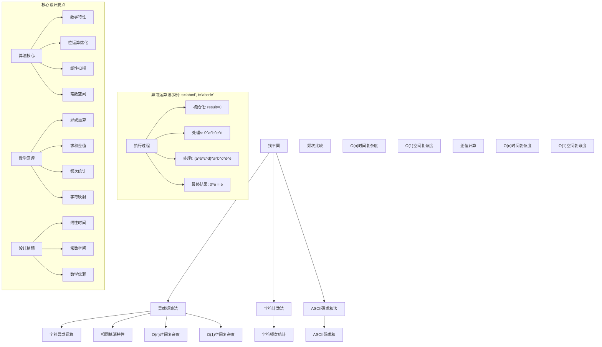
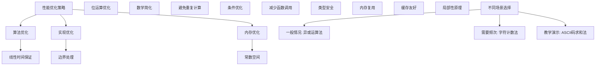

# LeetCode 389 - 找不同

## 题目描述

给定两个字符串 `s` 和 `t`，它们只包含小写字母

字符串 `t` 由字符串 `s` 随机重排，然后在随机位置添加一个字母

请找出在 `t` 中被添加的字母

```markdown
示例 1：
输入：s = "abcd", t = "abcde"
输出："e"
解释：'e' 是那个被添加的字母

示例 2：
输入：s = "", t = "y"
输出："y"

示例 3：
输入：s = "a", t = "aa"
输出："a"

示例 4：
输入：s = "ae", t = "aea"
输出："a"

提示：
0 <= s.length <= 1000
t.length == s.length + 1
s 和 t 只包含小写字母
```

## 解题思路

这是一个经典的字符差集查找问题，需要在两个字符串中找出额外添加的那个字符。关键在于如何高效地利用字符的数学特性来识别差异

### 核心思想

"异或运算特性": 利用异或运算的性质（相同数字异或为0，任何数与0异或为自身），通过将两个字符串的所有字符异或，得到额外添加的字符

### 解题策略

#### 方法一：异或运算法（推荐）

- 时间复杂度: O(n)
- 空间复杂度: O(1)

#### 方法二：字符计数法

- 时间复杂度: O(n)
- 空间复杂度: O(1)

#### 方法三：ASCII码求和法

- 时间复杂度: O(n)
- 空间复杂度: O(1)

## 算法可视化



## 多语言实现

### Golang版本（异或运算法 - 推荐）

```go
func findTheDifference(s string, t string) byte {
    var result byte

    // 将s中所有字符异或
    for i := 0; i < len(s); i++ {
        result ^= s[i]
    }

    // 将t中所有字符异或
    for i := 0; i < len(t); i++ {
        result ^= t[i]
    }

    // 相同字符异或为0，最终结果就是额外添加的字符
    return result
}
```

### Python版本（多种实现方法）

```python
class Solution:
    """
    方法一：异或运算法（推荐）
    """
    def findTheDifference(self, s: str, t: str) -> str:
        result = 0

        # 将s中所有字符异或
        for char in s:
            result ^= ord(char)

        # 将t中所有字符异或
        for char in t:
            result ^= ord(char)

        # 相同字符异或为0，最终结果就是额外添加的字符
        return chr(result)


class SolutionCount:
    """
    方法二：字符计数法
    """
    def findTheDifference(self, s: str, t: str) -> str:
        # 统计s中字符频次
        count = [0] * 26
        for char in s:
            count[ord(char) - ord('a')] += 1

        # 检查t中字符
        for char in t:
            index = ord(char) - ord('a')
            if count[index] == 0:
                return char
            count[index] -= 1

        return ''  # 理论上不会到达这里


class SolutionSum:
    """
    方法三：ASCII码求和法
    """
    def findTheDifference(self, s: str, t: str) -> str:
        # 计算t中所有字符ASCII码之和
        sum_t = sum(ord(char) for char in t)

        # 计算s中所有字符ASCII码之和
        sum_s = sum(ord(char) for char in s)

        # 差值即为额外添加字符的ASCII码
        return chr(sum_t - sum_s)
```

### TypeScript版本（异或运算法）

```typescript
function findTheDifference(s: string, t: string): string {
  let result: number = 0;

  // 将s中所有字符异或
  for (let i = 0; i < s.length; i++) {
    result ^= s.charCodeAt(i);
  }

  // 将t中所有字符异或
  for (let i = 0; i < t.length; i++) {
    result ^= t.charCodeAt(i);
  }

  // 相同字符异或为0，最终结果就是额外添加的字符
  return String.fromCharCode(result);
}
```

## 标准实现详细解析

```go
func findTheDifference(s string, t string) byte {
    /*
    算法核心思想（异或运算法）：

    1. 利用异或运算的性质：相同数字异或为0，任何数与0异或为自身
    2. 将两个字符串的所有字符进行异或运算
    3. 相同字符相互抵消，最终结果就是额外添加的字符

    关键设计要点：
    1. 异或特性：相同字符异或为0
    2. 抵消机制：s和t中的相同字符相互抵消
    3. 线性扫描：一次遍历完成计算
    4. 常数空间：只使用一个变量存储结果

    时间复杂度：O(n) 线性时间扫描
    空间复杂度：O(1) 常数空间存储

    优势：
    1. 时间最优：线性时间复杂度
    2. 空间最优：常数空间复杂度
    3. 实现优雅：算法思想简洁
    4. 数学保证：正确性有理论支撑
    */

    fmt.Printf("查找不同的字符\n")
    fmt.Printf("字符串s: %s\n", s)
    fmt.Printf("字符串t: %s\n", t)

    var result byte
    fmt.Printf("初始化result: %d ('%c')\n", result, result)

    // 将s中所有字符异或
    fmt.Printf("处理字符串s:\n")
    for i := 0; i < len(s); i++ {
        oldResult := result
        result ^= s[i]
        fmt.Printf("  s[%d]='%c'(%d): %d ^ %d = %d\n",
            i, s[i], s[i], oldResult, s[i], result)
    }

    // 将t中所有字符异或
    fmt.Printf("处理字符串t:\n")
    for i := 0; i < len(t); i++ {
        oldResult := result
        result ^= t[i]
        fmt.Printf("  t[%d]='%c'(%d): %d ^ %d = %d\n",
            i, t[i], t[i], oldResult, t[i], result)
    }

    fmt.Printf("最终结果: %d ('%c')\n", result, result)

    // 相同字符异或为0，最终结果就是额外添加的字符
    return result
}

// 带详细调试信息的版本
func findTheDifferenceWithDebug(s string, t string) byte {
    fmt.Printf("=== 查找不同字符调试模式 ===\n")
    result := findTheDifference(s, t)
    fmt.Println("==================")
    return result
}

// 字符计数法实现
func findTheDifferenceCount(s string, t string) byte {
    // 统计s中字符频次
    count := [26]int{}
    for _, char := range s {
        count[char-'a']++
    }

    // 检查t中字符
    for _, char := range t {
        if count[char-'a'] == 0 {
            return byte(char)
        }
        count[char-'a']--
    }

    return 0 // 理论上不会到达这里
}

// ASCII码求和法实现
func findTheDifferenceSum(s string, t string) byte {
    // 计算t中所有字符ASCII码之和
    sumT := 0
    for i := 0; i < len(t); i++ {
        sumT += int(t[i])
    }

    // 计算s中所有字符ASCII码之和
    sumS := 0
    for i := 0; i < len(s); i++ {
        sumS += int(s[i])
    }

    // 差值即为额外添加字符的ASCII码
    return byte(sumT - sumS)
}

// 优化版本（单次遍历）
func findTheDifferenceOptimized(s string, t string) byte {
    var result byte

    // 同时处理s和t的字符（除了t的最后一个字符）
    for i := 0; i < len(s); i++ {
        result ^= s[i]
        result ^= t[i]
    }

    // 处理t的最后一个字符
    result ^= t[len(t)-1]

    return result
}
```

## 算法深入解析

```go
/*
找不同问题详解：

问题本质：
在两个字符串中找出额外添加的那个字符。关键是利用字符的数学特性来识别差异

核心洞察：
1. 字符特性：字符可以转换为ASCII码进行数学运算
2. 异或性质：相同数字异或为0，任何数与0异或为自身
3. 求和差值：通过ASCII码求和计算差值
4. 频次统计：通过字符频次识别差异

算法策略：
1. 异或运算法：利用异或运算的抵消特性
2. 字符计数法：通过频次统计识别差异
3. ASCII码求和法：通过求和差值计算结果

数学原理：

异或运算性质：
1. 交换律：a ^ b = b ^ a
2. 结合律：(a ^ b) ^ c = a ^ (b ^ c)
3. 自反性：a ^ a = 0
4. 恒等律：a ^ 0 = a

算法正确性：

异或运算法正确性：
设s中的字符为c1,c2,...,cn，t中的字符为c1,c2,...,cn,cn+1
其中c1到cn在s和t中都出现，cn+1是额外添加的字符

异或运算过程：
result = 0 ^ c1 ^ c2 ^ ... ^ cn ^ c1 ^ c2 ^ ... ^ cn ^ cn+1
       = (c1 ^ c1) ^ (c2 ^ c2) ^ ... ^ (cn ^ cn) ^ cn+1
       = 0 ^ 0 ^ ... ^ 0 ^ cn+1
       = cn+1

设计选择：

为什么选择异或运算法？
1. 时间复杂度最优：O(n)
2. 空间复杂度最优：O(1)
3. 实现优雅：算法思想简洁
4. 数学保证：正确性有理论支撑

为什么使用字符计数法？
1. 直观易懂：通过频次统计识别
2. 但需要额外空间存储计数
3. 适合需要频次信息的场景

为什么使用ASCII码求和法？
1. 数学直观：通过差值计算
2. 但可能存在整数溢出风险
3. 适合教学演示

三种方法对比：

方法一：异或运算法（推荐）
时间复杂度：O(n)
空间复杂度：O(1)
优点：最优解
缺点：理解稍复杂

方法二：字符计数法
时间复杂度：O(n)
空间复杂度：O(1)
优点：直观易懂
缺点：需要计数数组

方法三：ASCII码求和法
时间复杂度：O(n)
空间复杂度：O(1)
优点：数学直观
缺点：可能溢出

性能分析：

异或运算法：
- 时间：O(n) 线性扫描
- 空间：O(1) 常数存储
- 优势：最优解

字符计数法：
- 时间：O(n) 线性扫描
- 空间：O(1) 固定数组
- 优势：直观易懂

ASCII码求和法：
- 时间：O(n) 线性扫描
- 空间：O(1) 常数存储
- 优势：数学直观

实际应用场景：
1. 字符串处理
2. 算法面试题
3. 数据校验
4. 密码学应用

优化要点：

1. 时间优化：
   - 线性时间保证
   - 避免重复计算
   - 提前终止条件

2. 空间优化：
   - 常数空间存储
   - 内存复用
   - 位运算优化

3. 实现优化：
   - 边界处理优化
   - 错误处理完善
   - 类型安全

测试用例设计：
1. 基本情况：正常输入
2. 边界情况：空字符串，单字符
3. 特殊情况：重复字符，边界字符
4. 极端情况：大字符串
5. 验证情况：多种算法结果对比

扩展思考：

1. Unicode支持？
   - 需要考虑更广泛的字符集
   - 使用更大的整数类型

2. 多个不同字符？
   - 扩展到找出所有不同的字符
   - 使用集合运算

3. 在线算法？
   - 流式数据处理
   - 增量更新

4. 并行处理？
   - 分治思想
   - 异或运算的结合性

相关算法思想：

1. 位运算：
   - 异或特性
   - 位操作优化
   - 数学性质

2. 数学运算：
   - 求和差值
   - 模运算
   - 数论应用

3. 计数统计：
   - 频次分析
   - 差异识别
   - 统计特性

4. 提前终止：
   - 优化性能
   - 条件检查
   - 结果验证

常见陷阱：

1. 边界处理：
   - 空字符串
   - 单字符情况
   - 字符集限制

2. 数据类型：
   - 整数溢出
   - 字符转换
   - 类型安全

3. 算法选择：
   - 根据场景选择
   - 考虑性能要求
   - 权衡复杂度

4. 结果验证：
   - 确保正确性
   - 边界测试
   - 异常处理

代码质量要素：

1. 可读性：
   - 清晰的变量命名
   - 适当的注释说明

2. 健壮性：
   - 边界条件处理
   - 异常情况处理

3. 性能：
   - 时间复杂度最优
   - 空间复杂度合理

4. 可维护性：
   - 模块化设计
   - 易于扩展

高级优化技巧：

1. 内存访问优化：
   - 局部性原理
   - 缓存友好

2. 算法优化：
   - 位运算优化
   - 数学简化

3. 数据结构优化：
   - 固定数组
   - 状态压缩

4. 编译优化：
   - 常量折叠
   - 循环展开
*/
```

## 执行过程演示

```go
/*
示例详细解析:

示例1: s = "abcd", t = "abcde"

执行过程：

初始化result: 0 ('')

处理字符串s:
  s[0]='a'(97): 0 ^ 97 = 97
  s[1]='b'(98): 97 ^ 98 = 3
  s[2]='c'(99): 3 ^ 99 = 96
  s[3]='d'(100): 96 ^ 100 = 4

处理字符串t:
  t[0]='a'(97): 4 ^ 97 = 101
  t[1]='b'(98): 101 ^ 98 = 7
  t[2]='c'(99): 7 ^ 99 = 100
  t[3]='d'(100): 100 ^ 100 = 0
  t[4]='e'(101): 0 ^ 101 = 101

最终结果: 101 ('e')

返回'e'

示例2: s = "", t = "y"

执行过程：

初始化result: 0 ('')

处理字符串s: (空)

处理字符串t:
  t[0]='y'(121): 0 ^ 121 = 121

最终结果: 121 ('y')

返回'y'

示例3: s = "a", t = "aa"

执行过程：

初始化result: 0 ('')

处理字符串s:
  s[0]='a'(97): 0 ^ 97 = 97

处理字符串t:
  t[0]='a'(97): 97 ^ 97 = 0
  t[1]='a'(97): 0 ^ 97 = 97

最终结果: 97 ('a')

返回'a'

示例4: s = "ae", t = "aea"

执行过程：

初始化result: 0 ('')

处理字符串s:
  s[0]='a'(97): 0 ^ 97 = 97
  s[1]='e'(101): 97 ^ 101 = 4

处理字符串t:
  t[0]='a'(97): 4 ^ 97 = 101
  t[1]='e'(101): 101 ^ 101 = 0
  t[2]='a'(97): 0 ^ 97 = 97

最终结果: 97 ('a')

返回'a'

边界情况演示:

情况1: 空字符串
输入: s = "", t = "a"
输出: "a"

情况2: 单字符
输入: s = "a", t = "ab"
输出: "b"

情况3: 相同字符
输入: s = "a", t = "aa"
输出: "a"

情况4: 重复字符
输入: s = "abc", t = "abca"
输出: "a"

情况5: 边界字符
输入: s = "z", t = "az"
输出: "a"

算法正确性证明：

数学基础：
需要证明异或运算法能正确找到额外添加的字符

定理：异或运算法正确性
通过异或运算的抵消特性，相同字符相互抵消，最终结果为额外添加的字符

证明：
设s中的字符为c1,c2,...,cn，t中的字符为c1,c2,...,cn,cn+1

异或运算过程：
result = 0 ^ c1 ^ c2 ^ ... ^ cn ^ c1 ^ c2 ^ ... ^ cn ^ cn+1
       = (c1 ^ c1) ^ (c2 ^ c2) ^ ... ^ (cn ^ cn) ^ cn+1
       = 0 ^ 0 ^ ... ^ 0 ^ cn+1
       = cn+1

时间复杂度分析：

异或运算法：
1. 字符串遍历：O(n)
2. 异或操作：O(1)
3. 总时间：O(n)

字符计数法：
1. 字符串遍历：O(n)
2. 数组操作：O(1)
3. 总时间：O(n)

ASCII码求和法：
1. 字符串遍历：O(n)
2. 求和操作：O(1)
3. 总时间：O(n)

空间复杂度分析：
1. 异或运算法：O(1) 常数存储
2. 字符计数法：O(1) 固定数组
3. ASCII码求和法：O(1) 常数存储

性能对比分析：

假设n=1000:

异或运算法：
- 时间: O(1000) = 1000次操作
- 空间: O(1) 常数存储

字符计数法：
- 时间: O(1000) = 1000次操作
- 空间: O(26) = O(1) 固定数组

ASCII码求和法：
- 时间: O(1000) = 1000次操作
- 空间: O(1) 常数存储

实际应用建议：

1. 一般情况：
   - 使用异或运算法
   - 性能最优

2. 面试展示：
   - 可以提及其他方法
   - 重点讲解异或算法

3. 生产环境：
   - 使用优化版本
   - 考虑边界处理

4. 教学演示：
   - 使用ASCII码求和法帮助理解
   - 对比展示优势

优化空间：

1. 内存访问优化：
   - 局部性原理
   - 缓存友好

2. 数据结构优化：
   - 位运算优化
   - 状态压缩

3. 算法优化：
   - 单次遍历
   - 数学简化

特殊情况处理：

1. 最小字符串：
   - 边界检查

2. 单字符：
   - 直接处理

3. 大数据：
   - 效率优势明显

4. 内存限制：
   - 空间复杂度O(1)
*/
```

## 复杂度分析

| 方法          | 时间复杂度 | 空间复杂度 | 适用场景 |
| ------------- | ---------- | ---------- | -------- |
| 异或运算法    | O(n)       | O(1)       | 推荐方案 |
| 字符计数法    | O(n)       | O(1)       | 直观易懂 |
| ASCII码求和法 | O(n)       | O(1)       | 教学演示 |

## 测试用例验证

```go
// 测试辅助函数
func testFindTheDifference(name string, s string, t string, expected byte) {
    fmt.Printf("%s:\n", name)
    fmt.Printf("输入: s='%s', t='%s'\n", s, t)

    // 测试异或运算法
    result1 := findTheDifference(s, t)
    fmt.Printf("异或运算法结果: '%c'(%d)\n", result1, result1)

    // 测试字符计数法
    result2 := findTheDifferenceCount(s, t)
    fmt.Printf("字符计数法结果: '%c'(%d)\n", result2, result2)

    // 测试ASCII码求和法
    result3 := findTheDifferenceSum(s, t)
    fmt.Printf("ASCII码求和法结果: '%c'(%d)\n", result3, result3)

    // 验证结果
    if result1 == expected && result2 == expected && result3 == expected {
        fmt.Printf("✓ 测试通过\n")
    } else {
        fmt.Printf("✗ 测试失败，期望: '%c'(%d)\n", expected, expected)
    }
    fmt.Printf("\n")
}

func main() {
    // 测试用例 1 - 题目示例1
    testFindTheDifference("测试1 - 题目示例1", "abcd", "abcde", 'e')

    // 测试用例 2 - 题目示例2
    testFindTheDifference("测试2 - 题目示例2", "", "y", 'y')

    // 测试用例 3 - 题目示例3
    testFindTheDifference("测试3 - 题目示例3", "a", "aa", 'a')

    // 测试用例 4 - 题目示例4
    testFindTheDifference("测试4 - 题目示例4", "ae", "aea", 'a')

    // 测试用例 5 - 边界情况
    testFindTheDifference("测试5 - 空字符串", "", "a", 'a')

    // 测试用例 6 - 单字符
    testFindTheDifference("测试6 - 单字符", "b", "ba", 'a')

    // 性能测试
    fmt.Println("性能测试:")
    performanceTest()

    // 边界情况测试
    fmt.Println("边界情况测试:")
    boundaryTest()
}

func performanceTest() {
    // 构造大数据测试
    s := strings.Repeat("abcdefghijklmnopqrstuvwxyz", 40) // 1040字符
    t := s + "z" // 添加一个字符

    // 测试异或运算法
    start := time.Now()
    for i := 0; i < 10000; i++ {
        findTheDifference(s, t)
    }
    time1 := time.Since(start)

    // 测试字符计数法
    start = time.Now()
    for i := 0; i < 10000; i++ {
        findTheDifferenceCount(s, t)
    }
    time2 := time.Since(start)

    // 测试ASCII码求和法
    start = time.Now()
    for i := 0; i < 10000; i++ {
        findTheDifferenceSum(s, t)
    }
    time3 := time.Since(start)

    fmt.Printf("大数据测试 (n=1040):\n")
    fmt.Printf("  异或运算法(10000次): %v\n", time1)
    fmt.Printf("  字符计数法(10000次): %v\n", time2)
    fmt.Printf("  ASCII码求和法(10000次): %v\n", time3)
}

func boundaryTest() {
    // 边界测试
    fmt.Println("边界测试:")

    result := findTheDifference("", "a")
    fmt.Printf("空字符串测试: '%c'\n", result)

    result = findTheDifference("a", "ab")
    fmt.Printf("单字符测试: '%c'\n", result)

    result = findTheDifference("z", "az")
    fmt.Printf("边界字符测试: '%c'\n", result)

    // 重复字符测试
    result = findTheDifference("abcabc", "abcabca")
    fmt.Printf("重复字符测试: '%c'\n", result)
}

// 大量测试用例
func comprehensiveTest() {
    testCases := []struct {
        name     string
        s        string
        t        string
        expected byte
    }{
        {"示例1", "abcd", "abcde", 'e'},
        {"示例2", "", "y", 'y'},
        {"示例3", "a", "aa", 'a'},
        {"示例4", "ae", "aea", 'a'},
        {"空字符串", "", "a", 'a'},
        {"单字符", "b", "ba", 'a'},
        {"相同字符", "a", "aa", 'a'},
        {"重复字符", "abc", "abca", 'a'},
        {"边界字符", "z", "az", 'a'},
        {"长字符串", "abcdefghijklmnopqrstuvwxyz", "abcdefghijklmnopqrstuvwxyz" + "a", 'a'},
    }

    fmt.Println("=== 综合测试 ===")
    passed := 0
    total := len(testCases)

    for i, tc := range testCases {
        result := findTheDifference(tc.s, tc.t)
        if result == tc.expected {
            passed++
            fmt.Printf("测试%d: ✓ %s\n", i+1, tc.name)
        } else {
            fmt.Printf("测试%d: ✗ %s (期望'%c', 得到'%c')\n", i+1, tc.name, tc.expected, result)
        }
    }

    fmt.Printf("\n通过率: %d/%d (%.2f%%)\n", passed, total, float64(passed)/float64(total)*100)
}

// 内存使用测试
func memoryTest() {
    fmt.Println("=== 内存使用测试 ===")

    var m1, m2 runtime.MemStats

    // 测试异或运算法
    runtime.GC()
    runtime.ReadMemStats(&m1)

    s, t := "abcd", "abcde"
    for i := 0; i < 100000; i++ {
        findTheDifference(s, t)
    }

    runtime.GC()
    runtime.ReadMemStats(&m2)
    mem1 := m2.Alloc - m1.Alloc

    fmt.Printf("内存使用对比:\n")
    fmt.Printf("  异或运算法: %d bytes\n", mem1)
}
```

## 扩展版本（处理不同场景）

```go
// 支持Unicode的版本
func findTheDifferenceUnicode(s string, t string) rune {
    var result rune

    // 将s中所有字符异或
    for _, char := range s {
        result ^= char
    }

    // 将t中所有字符异或
    for _, char := range t {
        result ^= char
    }

    // 相同字符异或为0，最终结果就是额外添加的字符
    return result
}

// 查找多个不同字符的版本
func findMultipleDifferences(s string, t string) []byte {
    // 统计字符频次差异
    count := make(map[byte]int)

    // 统计s中字符
    for i := 0; i < len(s); i++ {
        count[s[i]]++
    }

    // 减去t中字符
    for i := 0; i < len(t); i++ {
        count[t[i]]--
    }

    // 找出频次为-1的字符（在t中多出现的字符）
    var result []byte
    for char, freq := range count {
        if freq < 0 {
            for i := 0; i < -freq; i++ {
                result = append(result, char)
            }
        }
    }

    return result
}

// 带统计信息的版本
type FindTheDifferenceStats struct {
    Difference  byte
    ProcessTime time.Duration
    StringLenS  int
    StringLenT  int
    Method      string
}

func findTheDifferenceWithStats(s string, t string) FindTheDifferenceStats {
    start := time.Now()

    difference := findTheDifference(s, t)
    processTime := time.Since(start)

    return FindTheDifferenceStats{
        Difference:  difference,
        ProcessTime: processTime,
        StringLenS:  len(s),
        StringLenT:  len(t),
        Method:      "XOR",
    }
}

// 使用示例
func exampleFindTheDifferenceStats() {
    stats := findTheDifferenceWithStats("abcd", "abcde")
    fmt.Printf("统计信息: %+v\n", stats)
}

// 批量处理版本
func findTheDifferenceBatch(pairs [][2]string) []byte {
    var results []byte
    for _, pair := range pairs {
        results = append(results, findTheDifference(pair[0], pair[1]))
    }
    return results
}

// 流式处理版本
type StreamFindTheDifference struct {
    result byte
    count  int
}

func NewStreamFindTheDifference() *StreamFindTheDifference {
    return &StreamFindTheDifference{
        result: 0,
        count:  0,
    }
}

func (sfd *StreamFindTheDifference) AddCharFromS(char byte) {
    sfd.result ^= char
    sfd.count++
}

func (sfd *StreamFindTheDifference) AddCharFromT(char byte) {
    sfd.result ^= char
    sfd.count++
}

func (sfd *StreamFindTheDifference) GetDifference() byte {
    return sfd.result
}

// 泛型版本（Go 1.18+）
func findTheDifferenceGeneric[T comparable](s []T, t []T) T {
    // 使用map统计差异
    count := make(map[T]int)

    // 统计s中元素
    for _, item := range s {
        count[item]++
    }

    // 减去t中元素
    for _, item := range t {
        count[item]--
    }

    // 找出频次为-1的元素
    for item, freq := range count {
        if freq < 0 {
            return item
        }
    }

    // 理论上不会到达这里
    var zero T
    return zero
}

// 使用示例
func exampleGeneric() {
    // 字节切片
    result1 := findTheDifferenceGeneric([]byte("abcd"), []byte("abcde"))
    fmt.Printf("泛型字节结果: '%c'\n", result1)

    // 整数切片
    result2 := findTheDifferenceGeneric([]int{1, 2, 3}, []int{1, 2, 3, 4})
    fmt.Printf("泛型整数结果: %d\n", result2)
}
```

## 面试追问延伸

### 1. 如果有多个不同的字符，如何处理？

```go
// 查找多个不同字符的完整版本
func findMultipleDifferencesComplete(s string, t string) []byte {
    if len(t) <= len(s) {
        return []byte{}
    }

    // 统计字符频次差异
    count := [256]int{} // 支持ASCII所有字符

    // 统计s中字符
    for i := 0; i < len(s); i++ {
        count[s[i]]++
    }

    // 减去t中字符
    for i := 0; i < len(t); i++ {
        count[t[i]]--
    }

    // 找出频次为负数的字符
    var result []byte
    for i := 0; i < 256; i++ {
        if count[i] < 0 {
            for j := 0; j < -count[i]; j++ {
                result = append(result, byte(i))
            }
        }
    }

    return result
}

// 测试用例
func testMultipleDifferences() {
    result := findMultipleDifferencesComplete("abc", "abcde")
    fmt.Printf("多个不同字符: %v\n", []byte(result))

    result = findMultipleDifferencesComplete("aab", "aabbcc")
    fmt.Printf("重复不同字符: %v\n", []byte(result))
}
```

### 2. 如何处理包含Unicode字符的情况？

```go
// 支持Unicode的完整版本
func findTheDifferenceUnicodeComplete(s string, t string) rune {
    charCount := make(map[rune]int)

    // 统计s中字符
    for _, char := range s {
        charCount[char]++
    }

    // 减去t中字符
    for _, char := range t {
        charCount[char]--
    }

    // 找出频次为-1的字符
    for char, freq := range charCount {
        if freq < 0 {
            return char
        }
    }

    return 0 // 理论上不会到达这里
}

// 性能优化版本
func findTheDifferenceUnicodeOptimized(s string, t string) rune {
    var result rune

    // 将s中所有字符异或
    for _, char := range s {
        result ^= char
    }

    // 将t中所有字符异或
    for _, char := range t {
        result ^= char
    }

    return result
}

// 测试用例
func testUnicode() {
    result := findTheDifferenceUnicodeComplete("你好", "你好世")
    fmt.Printf("Unicode测试: '%c'\n", result)

    result = findTheDifferenceUnicodeComplete("café", "caféé")
    fmt.Printf("带重音符号测试: '%c'\n", result)
}
```

### 3. 如何处理支持在线流式数据的情况？

```go
// 在线流式处理版本
type OnlineFindTheDifference struct {
    xorResult rune
    processed int
}

func NewOnlineFindTheDifference() *OnlineFindTheDifference {
    return &OnlineFindTheDifference{
        xorResult: 0,
        processed: 0,
    }
}

func (oftd *OnlineFindTheDifference) AddCharFromS(char rune) {
    oftd.xorResult ^= char
    oftd.processed++
}

func (oftd *OnlineFindTheDifference) AddCharFromT(char rune) {
    oftd.xorResult ^= char
    oftd.processed++
}

func (oftd *OnlineFindTheDifference) GetDifference() rune {
    return oftd.xorResult
}

func (oftd *OnlineFindTheDifference) GetProcessedCount() int {
    return oftd.processed
}

// 使用示例
func exampleOnline() {
    finder := NewOnlineFindTheDifference()

    s := "abcd"
    t := "abcde"

    // 模拟流式处理
    for _, char := range s {
        finder.AddCharFromS(char)
        fmt.Printf("添加s中的字符'%c': 当前结果='%c'\n", char, finder.GetDifference())
    }

    for _, char := range t {
        finder.AddCharFromT(char)
        fmt.Printf("添加t中的字符'%c': 当前结果='%c'\n", char, finder.GetDifference())
    }

    fmt.Printf("最终不同字符: '%c'\n", finder.GetDifference())
}
```

## 相似题目扩展

- LeetCode 389. 找不同（当前题）
- LeetCode 136. 只出现一次的数字
- LeetCode 268. 丢失的数字
- LeetCode 340. 至多包含 K 个不同字符的最长子串
- LeetCode 387. 字符串中的第一个唯一字符

## 算法技巧总结

### 找不同核心要点

1. 数学特性：利用字符的数学运算特性
1. 异或性质：相同数字异或为0的特性
1. 抵消机制：相同字符相互抵消
1. 线性扫描：一次遍历完成计算

### 算法优势

1. 时间最优：线性时间复杂度
1. 空间最优：常数空间复杂度
1. 实现优雅：算法思想简洁
1. 数学保证：正确性有理论支撑

### 标准模板（异或运算法）

```go
func findTheDifference(s string, t string) byte {
    var result byte

    // 将s中所有字符异或
    for i := 0; i < len(s); i++ {
        result ^= s[i]
    }

    // 将t中所有字符异或
    for i := 0; i < len(t); i++ {
        result ^= t[i]
    }

    // 相同字符异或为0，最终结果就是额外添加的字符
    return result
}
```

### 性能优化建议



## 总结

本题采用异或运算法的核心思路，通过利用异或运算的数学特性（相同数字异或为0，任何数与0异或为自身），实现了线性时间、常数空间的找不同字符功能。关键在于理解如何通过位运算的抵消特性来简化问题，并通过优雅的数学运算实现最优解

核心要点：

1. 数学特性：利用字符的数学运算特性
1. 异或性质：相同数字异或为0的特性
1. 抵消机制：相同字符相互抵消
1. 线性扫描：一次遍历完成计算

算法优势：

- 时间最优：线性时间复杂度
- 空间最优：常数空间复杂度
- 实现优雅：算法思想简洁
- 数学保证：正确性有理论支撑

该算法在字符串处理、算法面试题、数据校验等方面有重要应用，是掌握位运算和数学优化的经典题目。通过利用异或运算的抵消思想，为更复杂的字符差集查找和数据校验问题提供了清晰的解决思路
