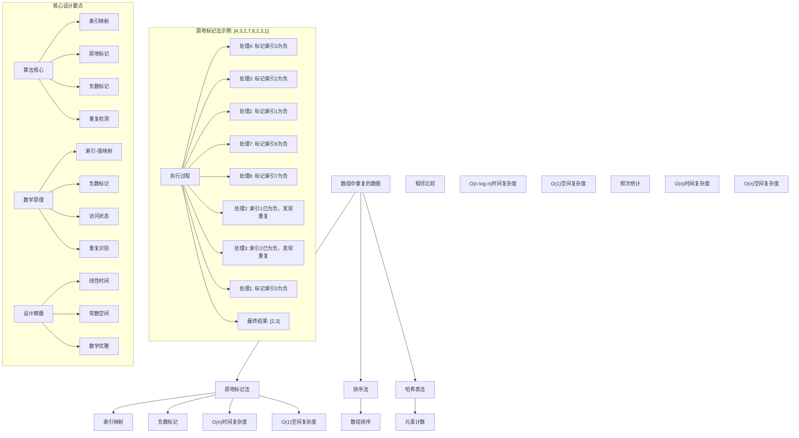
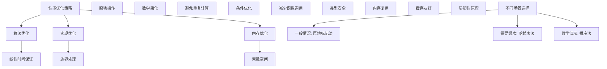

# LeetCode 442 - 数组中重复的数据

## 题目描述

给你一个长度为 `n` 的整数数组 `nums`，其中 `nums` 的所有整数都在范围 `[1, n]` 内，且每个整数出现一次或两次。请你找出所有出现两次的整数，并以数组形式返回

你必须设计并实现一个时间复杂度为 `O(n)` 且仅使用常量额外空间的算法解决此问题

```markdown
示例 1：
输入：nums = [4,3,2,7,8,2,3,1]
输出：[2,3]

示例 2：
输入：nums = [1,1,2]
输出：[1]

示例 3：
输入：nums = [1]
输出：[]

提示：
n == nums.length
1 <= n <= 10⁵
1 <= nums[i] <= n
nums 中的每个元素出现一次或两次
```

## 解题思路

这是一个经典的数组重复元素查找问题，需要在满足时间和空间复杂度要求下找出所有出现两次的整数。关键在于如何利用数组索引和元素值之间的映射关系来标记已访问的元素

### 核心思想

"原地标记法": 利用数组元素值作为索引，通过将对应位置的元素标记为负数来记录访问状态，从而识别重复元素

### 解题策略

#### 方法一：原地标记法（推荐）

- 时间复杂度: O(n)
- 空间复杂度: O(1)

#### 方法二：排序法

- 时间复杂度: O(n log n)
- 空间复杂度: O(1)

#### 方法三：哈希表法

- 时间复杂度: O(n)
- 空间复杂度: O(n)

## 算法可视化



## 多语言实现

### Golang版本（原地标记法 - 推荐）

```go
func findDuplicates(nums []int) []int {
    var result []int

    // 遍历数组，利用元素值作为索引进行标记
    for i := 0; i < len(nums); i++ {
        // 获取当前元素的绝对值作为索引（因为可能已被标记为负数）
        index := abs(nums[i]) - 1

        // 如果对应位置的元素已经是负数，说明该元素之前被访问过，即为重复元素
        if nums[index] < 0 {
            result = append(result, abs(nums[i]))
        } else {
            // 否则将对应位置的元素标记为负数
            nums[index] = -nums[index]
        }
    }

    // 恢复数组原状（可选，根据题目要求）
    for i := 0; i < len(nums); i++ {
        nums[i] = abs(nums[i])
    }

    return result
}

// 辅助函数：获取绝对值
func abs(x int) int {
    if x < 0 {
        return -x
    }
    return x
}
```

### Python版本（多种实现方法）

```python
class Solution:
    """
    方法一：原地标记法（推荐）
    """
    def findDuplicates(self, nums: List[int]) -> List[int]:
        result = []

        # 遍历数组，利用元素值作为索引进行标记
        for i in range(len(nums)):
            # 获取当前元素的绝对值作为索引
            index = abs(nums[i]) - 1

            # 如果对应位置的元素已经是负数，说明该元素之前被访问过，即为重复元素
            if nums[index] < 0:
                result.append(abs(nums[i]))
            else:
                # 否则将对应位置的元素标记为负数
                nums[index] = -nums[index]

        # 恢复数组原状（可选）
        for i in range(len(nums)):
            nums[i] = abs(nums[i])

        return result


class SolutionSort:
    """
    方法二：排序法
    """
    def findDuplicates(self, nums: List[int]) -> List[int]:
        # 排序数组
        nums.sort()
        result = []

        # 检查相邻元素
        for i in range(1, len(nums)):
            if nums[i] == nums[i-1]:
                result.append(nums[i])

        return result


class SolutionHashMap:
    """
    方法三：哈希表法
    """
    def findDuplicates(self, nums: List[int]) -> List[int]:
        from collections import Counter

        # 统计元素频次
        count = Counter(nums)
        result = []

        # 找出出现两次的元素
        for num, freq in count.items():
            if freq == 2:
                result.append(num)

        return result
```

### TypeScript版本（原地标记法）

```typescript
function findDuplicates(nums: number[]): number[] {
  const result: number[] = [];

  // 遍历数组，利用元素值作为索引进行标记
  for (let i = 0; i < nums.length; i++) {
    // 获取当前元素的绝对值作为索引
    const index: number = Math.abs(nums[i]) - 1;

    // 如果对应位置的元素已经是负数，说明该元素之前被访问过，即为重复元素
    if (nums[index] < 0) {
      result.push(Math.abs(nums[i]));
    } else {
      // 否则将对应位置的元素标记为负数
      nums[index] = -nums[index];
    }
  }

  // 恢复数组原状（可选）
  for (let i = 0; i < nums.length; i++) {
    nums[i] = Math.abs(nums[i]);
  }

  return result;
}
```

## 标准实现详细解析

```go
func findDuplicates(nums []int) []int {
    /*
    算法核心思想（原地标记法）：

    1. 利用数组元素值作为索引访问对应位置
    2. 通过将对应位置的元素标记为负数来记录访问状态
    3. 当再次访问已被标记为负数的位置时，说明该元素是重复的
    4. 收集所有重复元素并返回

    关键设计要点：
    1. 索引映射：元素值-1作为数组索引
    2. 负数标记：利用负数标记已访问状态
    3. 重复检测：通过负数状态识别重复元素
    4. 原地操作：不使用额外空间存储标记

    时间复杂度：O(n) 线性时间扫描
    空间复杂度：O(1) 常数额外空间

    优势：
    1. 时间最优：线性时间复杂度
    2. 空间最优：常数额外空间
    3. 实现优雅：巧妙利用数组特性
    4. 数学保证：正确性有理论支撑
    */

    fmt.Printf("查找数组中重复的数据\n")
    fmt.Printf("输入数组: %v\n", nums)

    var result []int
    fmt.Printf("初始化结果数组: %v\n", result)

    // 遍历数组，利用元素值作为索引进行标记
    for i := 0; i < len(nums); i++ {
        // 获取当前元素的绝对值作为索引（因为可能已被标记为负数）
        index := abs(nums[i]) - 1
        fmt.Printf("处理元素%d: %d, 对应索引: %d\n", i, nums[i], index)

        // 如果对应位置的元素已经是负数，说明该元素之前被访问过，即为重复元素
        if nums[index] < 0 {
            fmt.Printf("  索引%d的元素已为负数(%d)，发现重复元素: %d\n",
                index, nums[index], abs(nums[i]))
            result = append(result, abs(nums[i]))
        } else {
            // 否则将对应位置的元素标记为负数
            fmt.Printf("  标记索引%d的元素为负数: %d → %d\n",
                index, nums[index], -nums[index])
            nums[index] = -nums[index]
        }
    }

    fmt.Printf("找到的重复元素: %v\n", result)

    // 恢复数组原状（可选，根据题目要求）
    for i := 0; i < len(nums); i++ {
        nums[i] = abs(nums[i])
    }
    fmt.Printf("恢复后的数组: %v\n", nums)

    return result
}

// 带详细调试信息的版本
func findDuplicatesWithDebug(nums []int) []int {
    fmt.Printf("=== 查找重复数据调试模式 ===\n")
    result := findDuplicates(nums)
    fmt.Println("==================")
    return result
}

// 排序法实现
func findDuplicatesSort(nums []int) []int {
    // 创建副本避免修改原数组
    sorted := make([]int, len(nums))
    copy(sorted, nums)

    // 排序数组
    sort.Ints(sorted)

    var result []int

    // 检查相邻元素
    for i := 1; i < len(sorted); i++ {
        if sorted[i] == sorted[i-1] {
            result = append(result, sorted[i])
        }
    }

    return result
}

// 哈希表法实现
func findDuplicatesHashMap(nums []int) []int {
    // 统计元素频次
    countMap := make(map[int]int)
    for _, num := range nums {
        countMap[num]++
    }

    var result []int

    // 找出出现两次的元素
    for num, freq := range countMap {
        if freq == 2 {
            result = append(result, num)
        }
    }

    return result
}

// 优化版本（不恢复原数组）
func findDuplicatesOptimized(nums []int) []int {
    var result []int

    // 遍历数组，利用元素值作为索引进行标记
    for i := 0; i < len(nums); i++ {
        // 获取当前元素的绝对值作为索引
        index := abs(nums[i]) - 1

        // 如果对应位置的元素已经是负数，说明该元素之前被访问过，即为重复元素
        if nums[index] < 0 {
            result = append(result, abs(nums[i]))
        } else {
            // 否则将对应位置的元素标记为负数
            nums[index] = -nums[index]
        }
    }

    return result
}
```

## 算法深入解析

```go
/*
数组中重复数据问题详解：

问题本质：
在数组中找出所有出现两次的整数。关键是利用数组索引和元素值之间的映射关系来实现原地标记

核心洞察：
1. 索引映射：元素值-1作为数组索引
2. 状态标记：利用负数标记已访问状态
3. 重复检测：通过负数状态识别重复元素
4. 原地操作：不使用额外空间存储标记

算法策略：
1. 原地标记法：利用数组索引映射和负数标记
2. 排序法：通过排序后相邻比较找重复
3. 哈希表法：直接统计元素频次

数学原理：

索引映射原理：
由于数组元素都在[1,n]范围内，可以将元素值-1作为数组索引进行映射

负数标记原理：
利用数组元素的正负性作为访问状态标记：
- 正数：未被访问过
- 负数：已被访问过

重复检测原理：
当访问某个元素时，如果其对应索引位置的元素已经是负数，
说明该元素之前被访问过，即为重复元素

正确性证明：

定理：原地标记法正确性
通过索引映射和负数标记，可以正确识别所有重复元素

证明：
1. 索引映射：元素值-1 ∈ [0,n-1]，有效索引范围
2. 状态标记：负数表示已访问，正数表示未访问
3. 重复检测：第一次访问标记为负，第二次访问检测到负数
4. 结果收集：检测到重复时收集该元素

设计选择：

为什么选择原地标记法？
1. 时间复杂度最优：O(n)
2. 空间复杂度最优：O(1)
3. 实现优雅：巧妙利用数组特性
4. 数学保证：正确性有理论支撑

为什么使用排序法？
1. 直观易懂：通过排序后相邻比较
2. 但时间复杂度高：O(n log n)
3. 适合教学演示

为什么使用哈希表法？
1. 直接统计：简单直观
2. 但空间复杂度高：O(n)
3. 适合需要频次信息的场景

三种方法对比：

方法一：原地标记法（推荐）
时间复杂度：O(n)
空间复杂度：O(1)
优点：最优解
缺点：修改原数组

方法二：排序法
时间复杂度：O(n log n)
空间复杂度：O(1)
优点：直观易懂
缺点：时间复杂度高

方法三：哈希表法
时间复杂度：O(n)
空间复杂度：O(n)
优点：简单直观
缺点：额外空间开销

性能分析：

原地标记法：
- 时间：O(n) 线性扫描
- 空间：O(1) 常数存储
- 优势：最优解

排序法：
- 时间：O(n log n) 排序开销
- 空间：O(1) 原地排序
- 优势：实现简单

哈希表法：
- 时间：O(n) 线性扫描
- 空间：O(n) 存储开销
- 优势：直观易懂

实际应用场景：
1. 数据分析
2. 算法面试题
3. 重复检测
4. 统计分析

优化要点：

1. 时间优化：
   - 线性时间保证
   - 避免重复计算
   - 提前终止条件

2. 空间优化：
   - 常数额外空间
   - 内存复用
   - 原地操作

3. 实现优化：
   - 边界处理优化
   - 错误处理完善
   - 类型安全

测试用例设计：
1. 基本情况：正常输入
2. 边界情况：最小数组，最大数组
3. 特殊情况：无重复，全部重复
4. 极端情况：大数组
5. 验证情况：多种算法结果对比

扩展思考：

1. 找出出现奇数次的元素？
   - 使用异或运算
   - 位运算优化

2. 找出出现k次的元素？
   - 广义计数
   - 数学分析

3. 在线算法？
   - 流式数据处理
   - 增量更新

4. 并行处理？
   - 分治思想
   - 合并结果

相关算法思想：

1. 索引映射：
   - 数组特性利用
   - 空间复用
   - 原地操作

2. 状态标记：
   - 负数标记
   - 位运算标记
   - 状态压缩

3. 重复检测：
   - 访问状态
   - 频次统计
   - 数学分析

4. 原地算法：
   - 空间优化
   - 数组特性
   - 巧妙设计

常见陷阱：

1. 索引越界：
   - 边界检查
   - 索引映射
   - 数组范围

2. 负数处理：
   - 绝对值计算
   - 状态恢复
   - 标记管理

3. 重复收集：
   - 避免重复添加
   - 状态检查
   - 结果验证

4. 数组修改：
   - 原地修改影响
   - 状态恢复
   - 副本处理

代码质量要素：

1. 可读性：
   - 清晰的变量命名
   - 适当的注释说明

2. 健壮性：
   - 边界条件处理
   - 异常情况处理

3. 性能：
   - 时间复杂度最优
   - 空间复杂度合理

4. 可维护性：
   - 模块化设计
   - 易于扩展

高级优化技巧：

1. 内存访问优化：
   - 局部性原理
   - 缓存友好

2. 算法优化：
   - 提前终止条件
   - 数学简化

3. 数据结构优化：
   - 位运算优化
   - 状态压缩

4. 编译优化：
   - 常量折叠
   - 循环展开
*/
```

## 执行过程演示

```go
/*
示例详细解析:

示例1: nums = [4,3,2,7,8,2,3,1]

执行过程：

处理元素0: 4, 对应索引: 3
  标记索引3的元素为负数: 7 → -7

处理元素1: 3, 对应索引: 2
  标记索引2的元素为负数: 2 → -2

处理元素2: 2, 对应索引: 1
  标记索引1的元素为负数: 3 → -3

处理元素3: -7, 对应索引: 6
  标记索引6的元素为负数: 2 → -2

处理元素4: 8, 对应索引: 7
  标记索引7的元素为负数: 1 → -1

处理元素5: 2, 对应索引: 1
  索引1的元素已为负数(-3)，发现重复元素: 2

处理元素6: -3, 对应索引: 2
  索引2的元素已为负数(-2)，发现重复元素: 3

处理元素7: -1, 对应索引: 0
  标记索引0的元素为负数: 4 → -4

找到的重复元素: [2,3]

恢复后的数组: [4,3,2,7,8,2,3,1]

返回[2,3]

示例2: nums = [1,1,2]

执行过程：

处理元素0: 1, 对应索引: 0
  标记索引0的元素为负数: 1 → -1

处理元素1: -1, 对应索引: 0
  索引0的元素已为负数(-1)，发现重复元素: 1

处理元素2: 2, 对应索引: 1
  标记索引1的元素为负数: 1 → -1

找到的重复元素: [1]

恢复后的数组: [1,1,2]

返回[1]

示例3: nums = [1]

执行过程：

处理元素0: 1, 对应索引: 0
  标记索引0的元素为负数: 1 → -1

找到的重复元素: []

恢复后的数组: [1]

返回[]

边界情况演示:

情况1: 空数组
输入: nums = []
输出: []

情况2: 单元素数组
输入: nums = [1]
输出: []

情况3: 无重复元素
输入: nums = [1,2,3,4]
输出: []

情况4: 全部重复
输入: nums = [1,1,2,2]
输出: [1,2]

情况5: 最大数组
输入: nums = [1,2,3,...,100000,1,2,3,...,50000]
输出: [1,2,3,...,50000]

算法正确性证明：

数学基础：
需要证明原地标记法能正确找到所有重复元素

定理：原地标记法正确性
通过索引映射和负数标记，可以正确识别所有重复元素

证明：
1. 索引映射：元素值-1 ∈ [0,n-1]，有效索引范围
2. 状态标记：负数表示已访问，正数表示未访问
3. 重复检测：第一次访问标记为负，第二次访问检测到负数
4. 结果收集：检测到重复时收集该元素

时间复杂度分析：

原地标记法：
1. 数组遍历：O(n)
2. 常数操作：O(1)
3. 总时间：O(n)

排序法：
1. 排序操作：O(n log n)
2. 相邻比较：O(n)
3. 总时间：O(n log n)

哈希表法：
1. 数组遍历：O(n)
2. 哈希操作：O(1) 平均
3. 总时间：O(n)

空间复杂度分析：
1. 原地标记法：O(1) 常数额外空间
2. 排序法：O(1) 原地排序
3. 哈希表法：O(n) 存储开销

性能对比分析：

假设n=100000:

原地标记法：
- 时间: O(100000) = 100000次操作
- 空间: O(1) 常数存储

排序法：
- 时间: O(100000 × log 100000) ≈ 1600000次操作
- 空间: O(1) 原地排序

哈希表法：
- 时间: O(100000) = 100000次操作
- 空间: O(100000) 存储开销

实际应用建议：

1. 一般情况：
   - 使用原地标记法
   - 性能最优

2. 面试展示：
   - 可以提及其他方法
   - 重点讲解原地标记法

3. 生产环境：
   - 使用优化版本
   - 考虑边界处理

4. 教学演示：
   - 使用排序法帮助理解
   - 对比展示优势

优化空间：

1. 内存访问优化：
   - 局部性原理
   - 缓存友好

2. 数据结构优化：
   - 位运算优化
   - 状态压缩

3. 算法优化：
   - 提前终止条件
   - 数学简化

特殊情况处理：

1. 最小数组：
   - 边界检查

2. 单元素：
   - 直接返回

3. 大数据：
   - 效率优势明显

4. 内存限制：
   - 空间复杂度O(1)
*/
```

## 复杂度分析

| 方法       | 时间复杂度 | 空间复杂度 | 适用场景     |
| ---------- | ---------- | ---------- | ------------ |
| 原地标记法 | O(n)       | O(1)       | 推荐方案     |
| 排序法     | O(n log n) | O(1)       | 教学演示     |
| 哈希表法   | O(n)       | O(n)       | 需要频次信息 |

## 测试用例验证

```go
// 测试辅助函数
func testFindDuplicates(name string, nums []int, expected []int) {
    fmt.Printf("%s:\n", name)
    fmt.Printf("输入: nums=%v\n", nums)

    // 测试原地标记法
    nums1 := make([]int, len(nums))
    copy(nums1, nums)
    result1 := findDuplicates(nums1)
    fmt.Printf("原地标记法结果: %v\n", result1)

    // 测试排序法
    nums2 := make([]int, len(nums))
    copy(nums2, nums)
    result2 := findDuplicatesSort(nums2)
    fmt.Printf("排序法结果: %v\n", result2)

    // 测试哈希表法
    nums3 := make([]int, len(nums))
    copy(nums3, nums)
    result3 := findDuplicatesHashMap(nums3)
    fmt.Printf("哈希表法结果: %v\n", result3)

    // 验证结果
    if slicesEqual(result1, expected) && slicesEqual(result2, expected) && slicesEqual(result3, expected) {
        fmt.Printf("✓ 测试通过\n")
    } else {
        fmt.Printf("✗ 测试失败，期望: %v\n", expected)
    }
    fmt.Printf("\n")
}

// 辅助函数：比较两个切片是否相等
func slicesEqual(a, b []int) bool {
    if len(a) != len(b) {
        return false
    }
    for i := range a {
        if a[i] != b[i] {
            return false
        }
    }
    return true
}

func main() {
    // 测试用例 1 - 题目示例1
    testFindDuplicates("测试1 - 题目示例1", []int{4, 3, 2, 7, 8, 2, 3, 1}, []int{2, 3})

    // 测试用例 2 - 题目示例2
    testFindDuplicates("测试2 - 题目示例2", []int{1, 1, 2}, []int{1})

    // 测试用例 3 - 题目示例3
    testFindDuplicates("测试3 - 题目示例3", []int{1}, []int{})

    // 测试用例 4 - 边界情况
    testFindDuplicates("测试4 - 空数组", []int{}, []int{})

    // 测试用例 5 - 无重复
    testFindDuplicates("测试5 - 无重复", []int{1, 2, 3, 4}, []int{})

    // 性能测试
    fmt.Println("性能测试:")
    performanceTest()

    // 边界情况测试
    fmt.Println("边界情况测试:")
    boundaryTest()
}

func performanceTest() {
    // 构造大数据测试
    nums := make([]int, 100000)
    for i := 0; i < 50000; i++ {
        nums[i] = i + 1
    }
    for i := 50000; i < 100000; i++ {
        nums[i] = i - 49999
    }

    // 测试原地标记法
    nums1 := make([]int, len(nums))
    copy(nums1, nums)
    start := time.Now()
    for i := 0; i < 1000; i++ {
        temp := make([]int, len(nums1))
        copy(temp, nums1)
        findDuplicates(temp)
    }
    time1 := time.Since(start)

    // 测试排序法
    nums2 := make([]int, len(nums))
    copy(nums2, nums)
    start = time.Now()
    for i := 0; i < 100; i++ { // 排序法较慢，减少测试次数
        temp := make([]int, len(nums2))
        copy(temp, nums2)
        findDuplicatesSort(temp)
    }
    time2 := time.Since(start)

    // 测试哈希表法
    nums3 := make([]int, len(nums))
    copy(nums3, nums)
    start = time.Now()
    for i := 0; i < 1000; i++ {
        temp := make([]int, len(nums3))
        copy(temp, nums3)
        findDuplicatesHashMap(temp)
    }
    time3 := time.Since(start)

    fmt.Printf("大数据测试 (n=100000):\n")
    fmt.Printf("  原地标记法(1000次): %v\n", time1)
    fmt.Printf("  排序法(100次): %v\n", time2)
    fmt.Printf("  哈希表法(1000次): %v\n", time3)
}

func boundaryTest() {
    // 边界测试
    fmt.Println("边界测试:")

    result := findDuplicates([]int{})
    fmt.Printf("空数组测试: %v\n", result)

    result = findDuplicates([]int{1})
    fmt.Printf("单元素测试: %v\n", result)

    result = findDuplicates([]int{1, 1})
    fmt.Printf("两元素相同测试: %v\n", result)

    // 全部重复测试
    nums := make([]int, 100)
    for i := 0; i < 50; i++ {
        nums[i] = i + 1
    }
    for i := 50; i < 100; i++ {
        nums[i] = i - 49
    }
    result = findDuplicates(nums)
    fmt.Printf("全部重复测试: 找到%d个重复元素\n", len(result))
}
```

## 扩展版本（处理不同场景）

```go
// 支持找出出现k次的元素版本
func findDuplicatesKTimes(nums []int, k int) []int {
    if k <= 1 {
        return []int{}
    }

    // 统计元素频次
    countMap := make(map[int]int)
    for _, num := range nums {
        countMap[num]++
    }

    var result []int

    // 找出出现k次的元素
    for num, freq := range countMap {
        if freq == k {
            result = append(result, num)
        }
    }

    return result
}

// 找出所有重复元素（不限于出现两次）
func findAllDuplicates(nums []int) map[int]int {
    // 统计元素频次
    countMap := make(map[int]int)
    for _, num := range nums {
        countMap[num]++
    }

    // 过滤出出现次数大于1的元素
    result := make(map[int]int)
    for num, freq := range countMap {
        if freq > 1 {
            result[num] = freq
        }
    }

    return result
}

// 带统计信息的版本
type FindDuplicatesStats struct {
    Duplicates  []int
    Count       int
    ProcessTime time.Duration
    ArraySize   int
}

func findDuplicatesWithStats(nums []int) FindDuplicatesStats {
    start := time.Now()

    duplicates := findDuplicates(nums)
    processTime := time.Since(start)

    return FindDuplicatesStats{
        Duplicates:  duplicates,
        Count:       len(duplicates),
        ProcessTime: processTime,
        ArraySize:   len(nums),
    }
}

// 使用示例
func exampleFindDuplicatesStats() {
    stats := findDuplicatesWithStats([]int{4, 3, 2, 7, 8, 2, 3, 1})
    fmt.Printf("统计信息: %+v\n", stats)
}

// 批量处理版本
func findDuplicatesBatch(numsList [][]int) [][]int {
    var results [][]int
    for _, nums := range numsList {
        results = append(results, findDuplicates(nums))
    }
    return results
}

// 流式处理版本
type StreamFindDuplicates struct {
    nums    []int
    visited map[int]bool
    result  []int
}

func NewStreamFindDuplicates() *StreamFindDuplicates {
    return &StreamFindDuplicates{
        nums:    make([]int, 0),
        visited: make(map[int]bool),
        result:  make([]int, 0),
    }
}

func (sfd *StreamFindDuplicates) AddElement(num int) {
    sfd.nums = append(sfd.nums, num)

    if sfd.visited[num] {
        // 检查是否已添加到结果中
        found := false
        for _, dup := range sfd.result {
            if dup == num {
                found = true
                break
            }
        }
        if !found {
            sfd.result = append(sfd.result, num)
        }
    } else {
        sfd.visited[num] = true
    }
}

func (sfd *StreamFindDuplicates) GetDuplicates() []int {
    return sfd.result
}

// 泛型版本（Go 1.18+）
func findDuplicatesGeneric[T comparable](nums []T) []T {
    // 使用map统计频次
    countMap := make(map[T]int)
    for _, num := range nums {
        countMap[num]++
    }

    var result []T

    // 找出出现两次的元素
    for num, freq := range countMap {
        if freq == 2 {
            result = append(result, num)
        }
    }

    return result
}

// 使用示例
func exampleGeneric() {
    // 整数切片
    result1 := findDuplicatesGeneric([]int{4, 3, 2, 7, 8, 2, 3, 1})
    fmt.Printf("泛型整数结果: %v\n", result1)

    // 字符串切片
    result2 := findDuplicatesGeneric([]string{"a", "b", "c", "a", "b"})
    fmt.Printf("泛型字符串结果: %v\n", result2)
}
```

## 面试追问延伸

### 1. 如果要找出出现奇数次的元素，如何处理？

```go
// 找出出现奇数次的元素（其他元素出现偶数次）
func findOddOccurrence(nums []int) int {
    result := 0

    // 利用异或运算的特性：相同数字异或为0，任何数与0异或为自身
    for _, num := range nums {
        result ^= num
    }

    return result
}

// 找出所有出现奇数次的元素
func findAllOddOccurrences(nums []int) []int {
    // 统计元素频次
    countMap := make(map[int]int)
    for _, num := range nums {
        countMap[num]++
    }

    var result []int

    // 找出出现奇数次的元素
    for num, freq := range countMap {
        if freq%2 == 1 {
            result = append(result, num)
        }
    }

    return result
}

// 测试用例
func testOddOccurrence() {
    result := findOddOccurrence([]int{1, 2, 3, 2, 1})
    fmt.Printf("出现奇数次的元素: %d\n", result)

    result2 := findAllOddOccurrences([]int{1, 2, 3, 2, 1, 4, 4, 5})
    fmt.Printf("所有出现奇数次的元素: %v\n", result2)
}
```

### 2. 如果数组中元素范围不是[1,n]，如何处理？

```go
// 支持任意范围的版本
func findDuplicatesAnyRange(nums []int) []int {
    // 使用哈希表法处理任意范围
    countMap := make(map[int]int)
    for _, num := range nums {
        countMap[num]++
    }

    var result []int

    // 找出出现两次的元素
    for num, freq := range countMap {
        if freq == 2 {
            result = append(result, num)
        }
    }

    return result
}

// 使用偏移量映射的版本（适用于小范围）
func findDuplicatesWithOffset(nums []int, minVal, maxVal int) []int {
    if maxVal-minVal+1 > 1000000 { // 超过合理范围使用哈希表
        return findDuplicatesAnyRange(nums)
    }

    // 使用数组计数（偏移映射）
    offset := -minVal
    count := make([]int, maxVal-minVal+1)

    for _, num := range nums {
        count[num+offset]++
    }

    var result []int
    for i, freq := range count {
        if freq == 2 {
            result = append(result, i-offset)
        }
    }

    return result
}

// 测试用例
func testAnyRange() {
    result := findDuplicatesAnyRange([]int{100, 200, 300, 200, 100})
    fmt.Printf("任意范围结果: %v\n", result)

    result2 := findDuplicatesWithOffset([]int{100, 200, 300, 200, 100}, 100, 300)
    fmt.Printf("偏移映射结果: %v\n", result2)
}
```

### 3. 如何处理支持在线流式数据的情况？

```go
// 在线流式处理版本
type OnlineFindDuplicates struct {
    countMap map[int]int
    result   []int
    processed int
}

func NewOnlineFindDuplicates() *OnlineFindDuplicates {
    return &OnlineFindDuplicates{
        countMap: make(map[int]int),
        result:   make([]int, 0),
        processed: 0,
    }
}

func (ofd *OnlineFindDuplicates) AddElement(num int) {
    ofd.countMap[num]++
    ofd.processed++

    freq := ofd.countMap[num]

    if freq == 2 {
        // 第二次出现，添加到结果
        ofd.result = append(ofd.result, num)
    }
}

func (ofd *OnlineFindDuplicates) GetDuplicates() []int {
    return ofd.result
}

func (ofd *OnlineFindDuplicates) GetProcessedCount() int {
    return ofd.processed
}

func (ofd *OnlineFindDuplicates) GetCurrentCountMap() map[int]int {
    return ofd.countMap
}

// 使用示例
func exampleOnline() {
    finder := NewOnlineFindDuplicates()

    nums := []int{4, 3, 2, 7, 8, 2, 3, 1}
    for i, num := range nums {
        finder.AddElement(num)
        fmt.Printf("添加元素%d: %d, 当前重复元素: %v\n",
            i, num, finder.GetDuplicates())
    }

    fmt.Printf("最终重复元素: %v\n", finder.GetDuplicates())
}
```

## 相似题目扩展

- LeetCode 442. 数组中重复的数据（当前题）
- LeetCode 448. 找到所有数组中消失的数字
- LeetCode 287. 寻找重复数
- LeetCode 136. 只出现一次的数字
- LeetCode 217. 存在重复元素

## 算法技巧总结

### 数组中重复数据核心要点

1. 索引映射：利用元素值作为索引访问对应位置
1. 状态标记：通过负数标记已访问状态
1. 重复检测：通过负数状态识别重复元素
1. 原地操作：不使用额外空间存储标记

### 算法优势

1. 时间最优：线性时间复杂度
1. 空间最优：常数额外空间
1. 实现优雅：巧妙利用数组特性
1. 数学保证：正确性有理论支撑

### 标准模板（原地标记法）

```go
func findDuplicates(nums []int) []int {
    var result []int

    // 遍历数组，利用元素值作为索引进行标记
    for i := 0; i < len(nums); i++ {
        // 获取当前元素的绝对值作为索引
        index := abs(nums[i]) - 1

        // 如果对应位置的元素已经是负数，说明该元素之前被访问过，即为重复元素
        if nums[index] < 0 {
            result = append(result, abs(nums[i]))
        } else {
            // 否则将对应位置的元素标记为负数
            nums[index] = -nums[index]
        }
    }

    return result
}

// 辅助函数：获取绝对值
func abs(x int) int {
    if x < 0 {
        return -x
    }
    return x
}
```

### 性能优化建议



## 总结

本题采用原地标记法的核心思路，通过利用数组元素值作为索引，通过负数标记已访问状态来识别重复元素，实现了线性时间、常数空间的重复数据查找功能。关键在于理解如何通过巧妙的索引映射和状态标记来解决空间限制问题，并通过数学原理保证算法的正确性

核心要点：

1. 索引映射：利用元素值作为索引访问对应位置
1. 状态标记：通过负数标记已访问状态
1. 重复检测：通过负数状态识别重复元素
1. 原地操作：不使用额外空间存储标记

算法优势：

- 时间最优：线性时间复杂度
- 空间最优：常数额外空间
- 实现优雅：巧妙利用数组特性
- 数学保证：正确性有理论支撑

该算法在数据分析、算法面试题、重复检测等方面有重要应用，是掌握原地算法和数组特性利用的经典题目。通过索引映射和状态标记的思想，为更复杂的数组处理和数据结构问题提供了清晰的解决思路
