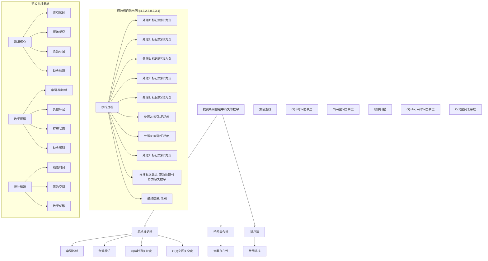
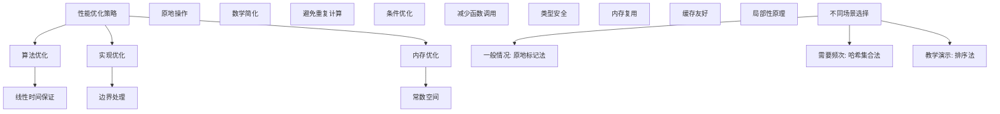

# LeetCode 448 - 找到所有数组中消失的数字

## 题目描述

给你一个含 `n` 个整数的数组 `nums`，其中 `nums[i]` 在区间 `[1, n]` 内。请你找出所有在 `[1, n]` 范围内但没有出现在 `nums` 中的数字，并以数组的形式返回结果

```markdown
示例 1：
输入：nums = [4,3,2,7,8,2,3,1]
输出：[5,6]

示例 2：
输入：nums = [1,1]
输出：[2]

示例 3：
输入：nums = [1,2,3,4,5,6,7,8,9,10]
输出：[]

提示：
n == nums.length
1 <= n <= 10⁵
1 <= nums[i] <= n

进阶：你能在不使用额外空间且时间复杂度为 O(n) 的情况下解决这个问题吗? 你可以假定返回的数组不算在额外空间内
```

## 解题思路

这是一个经典的数组缺失元素查找问题，需要在满足时间和空间复杂度要求下找出所有在指定范围内但未出现的数字。关键在于如何利用数组索引和元素值之间的映射关系来标记已存在的元素

### 核心思想

"原地标记法": 利用数组元素值作为索引，通过将对应位置的元素标记为负数来记录存在的元素，从而识别缺失的数字

### 解题策略

#### 方法一：原地标记法（推荐）

- 时间复杂度: O(n)
- 空间复杂度: O(1)

#### 方法二：哈希集合法

- 时间复杂度: O(n)
- 空间复杂度: O(n)

#### 方法三：排序法

- 时间复杂度: O(n log n)
- 空间复杂度: O(1)

## 算法可视化



## 多语言实现

### Golang版本（原地标记法 - 推荐）

```go
func findDisappearedNumbers(nums []int) []int {
    // 遍历数组，利用元素值作为索引进行标记
    for i := 0; i < len(nums); i++ {
        // 获取当前元素的绝对值作为索引（因为可能已被标记为负数）
        index := abs(nums[i]) - 1

        // 如果对应位置的元素是正数，将其标记为负数
        if nums[index] > 0 {
            nums[index] = -nums[index]
        }
    }

    // 收集所有未被标记的位置（即缺失的数字）
    var result []int
    for i := 0; i < len(nums); i++ {
        if nums[i] > 0 {
            result = append(result, i+1)
        }
    }

    // 恢复数组原状（可选，根据题目要求）
    for i := 0; i < len(nums); i++ {
        nums[i] = abs(nums[i])
    }

    return result
}

// 辅助函数：获取绝对值
func abs(x int) int {
    if x < 0 {
        return -x
    }
    return x
}
```

### Python版本（多种实现方法）

```python
class Solution:
    """
    方法一：原地标记法（推荐）
    """
    def findDisappearedNumbers(self, nums: List[int]) -> List[int]:
        # 遍历数组，利用元素值作为索引进行标记
        for i in range(len(nums)):
            # 获取当前元素的绝对值作为索引
            index = abs(nums[i]) - 1

            # 如果对应位置的元素是正数，将其标记为负数
            if nums[index] > 0:
                nums[index] = -nums[index]

        # 收集所有未被标记的位置（即缺失的数字）
        result = []
        for i in range(len(nums)):
            if nums[i] > 0:
                result.append(i + 1)

        # 恢复数组原状（可选）
        for i in range(len(nums)):
            nums[i] = abs(nums[i])

        return result


class SolutionHashSet:
    """
    方法二：哈希集合法
    """
    def findDisappearedNumbers(self, nums: List[int]) -> List[int]:
        # 将所有元素放入集合中
        num_set = set(nums)
        result = []

        # 检查1到n中哪些数字不存在
        for i in range(1, len(nums) + 1):
            if i not in num_set:
                result.append(i)

        return result


class SolutionSort:
    """
    方法三：排序法
    """
    def findDisappearedNumbers(self, nums: List[int]) -> List[int]:
        # 排序数组
        nums.sort()
        result = []
        expected = 1

        # 顺序扫描寻找缺失数字
        for i in range(len(nums)):
            while expected < nums[i]:
                result.append(expected)
                expected += 1
            if expected == nums[i]:
                expected += 1

        # 处理尾部缺失的数字
        while expected <= len(nums):
            result.append(expected)
            expected += 1

        return result
```

### TypeScript版本（原地标记法）

```typescript
function findDisappearedNumbers(nums: number[]): number[] {
  // 遍历数组，利用元素值作为索引进行标记
  for (let i = 0; i < nums.length; i++) {
    // 获取当前元素的绝对值作为索引
    const index: number = Math.abs(nums[i]) - 1;

    // 如果对应位置的元素是正数，将其标记为负数
    if (nums[index] > 0) {
      nums[index] = -nums[index];
    }
  }

  // 收集所有未被标记的位置（即缺失的数字）
  const result: number[] = [];
  for (let i = 0; i < nums.length; i++) {
    if (nums[i] > 0) {
      result.push(i + 1);
    }
  }

  // 恢复数组原状（可选）
  for (let i = 0; i < nums.length; i++) {
    nums[i] = Math.abs(nums[i]);
  }

  return result;
}
```

## 标准实现详细解析

```go
func findDisappearedNumbers(nums []int) []int {
    /*
    算法核心思想（原地标记法）：

    1. 利用数组元素值作为索引访问对应位置
    2. 通过将对应位置的元素标记为负数来记录存在的元素
    3. 最后扫描数组，未被标记为负数的位置对应的数字即为缺失的数字
    4. 收集所有缺失数字并返回

    关键设计要点：
    1. 索引映射：元素值-1作为数组索引
    2. 负数标记：利用负数标记已存在元素
    3. 缺失检测：通过正数状态识别缺失元素
    4. 原地操作：不使用额外空间存储标记

    时间复杂度：O(n) 线性时间扫描
    空间复杂度：O(1) 常数额外空间（返回数组不计入空间复杂度）

    优势：
    1. 时间最优：线性时间复杂度
    2. 空间最优：常数额外空间
    3. 实现优雅：巧妙利用数组特性
    4. 数学保证：正确性有理论支撑
    */

    fmt.Printf("查找数组中消失的数字\n")
    fmt.Printf("输入数组: %v\n", nums)

    // 遍历数组，利用元素值作为索引进行标记
    for i := 0; i < len(nums); i++ {
        // 获取当前元素的绝对值作为索引（因为可能已被标记为负数）
        index := abs(nums[i]) - 1
        fmt.Printf("处理元素%d: %d, 对应索引: %d\n", i, nums[i], index)

        // 如果对应位置的元素是正数，将其标记为负数
        if nums[index] > 0 {
            fmt.Printf("  标记索引%d的元素为负数: %d → %d\n",
                index, nums[index], -nums[index])
            nums[index] = -nums[index]
        } else {
            fmt.Printf("  索引%d的元素已为负数(%d)，跳过\n", index, nums[index])
        }
    }

    fmt.Printf("标记后的数组: %v\n", nums)

    // 收集所有未被标记的位置（即缺失的数字）
    var result []int
    fmt.Printf("扫描标记数组寻找缺失数字:\n")
    for i := 0; i < len(nums); i++ {
        if nums[i] > 0 {
            missing := i + 1
            fmt.Printf("  索引%d为正数，缺失数字: %d\n", i, missing)
            result = append(result, missing)
        }
    }

    fmt.Printf("找到的缺失数字: %v\n", result)

    // 恢复数组原状（可选，根据题目要求）
    for i := 0; i < len(nums); i++ {
        nums[i] = abs(nums[i])
    }
    fmt.Printf("恢复后的数组: %v\n", nums)

    return result
}

// 带详细调试信息的版本
func findDisappearedNumbersWithDebug(nums []int) []int {
    fmt.Printf("=== 查找消失数字调试模式 ===\n")
    result := findDisappearedNumbers(nums)
    fmt.Println("==================")
    return result
}

// 哈希集合法实现
func findDisappearedNumbersHashSet(nums []int) []int {
    // 将所有元素放入集合中
    numSet := make(map[int]bool)
    for _, num := range nums {
        numSet[num] = true
    }

    var result []int

    // 检查1到n中哪些数字不存在
    for i := 1; i <= len(nums); i++ {
        if !numSet[i] {
            result = append(result, i)
        }
    }

    return result
}

// 排序法实现
func findDisappearedNumbersSort(nums []int) []int {
    // 创建副本避免修改原数组
    sorted := make([]int, len(nums))
    copy(sorted, nums)

    // 排序数组
    sort.Ints(sorted)

    var result []int
    expected := 1

    // 顺序扫描寻找缺失数字
    for i := 0; i < len(sorted); i++ {
        for expected < sorted[i] {
            result = append(result, expected)
            expected++
        }
        if expected == sorted[i] {
            expected++
        }
    }

    // 处理尾部缺失的数字
    for expected <= len(nums) {
        result = append(result, expected)
        expected++
    }

    return result
}

// 优化版本（不恢复原数组）
func findDisappearedNumbersOptimized(nums []int) []int {
    // 遍历数组，利用元素值作为索引进行标记
    for i := 0; i < len(nums); i++ {
        // 获取当前元素的绝对值作为索引
        index := abs(nums[i]) - 1

        // 如果对应位置的元素是正数，将其标记为负数
        if nums[index] > 0 {
            nums[index] = -nums[index]
        }
    }

    // 收集所有未被标记的位置（即缺失的数字）
    var result []int
    for i := 0; i < len(nums); i++ {
        if nums[i] > 0 {
            result = append(result, i+1)
        }
    }

    return result
}
```

## 算法深入解析

```go
/*
数组中消失数字问题详解：

问题本质：
在数组中找出所有在[1,n]范围内但未出现的数字。关键是利用数组索引和元素值之间的映射关系来实现原地标记

核心洞察：
1. 索引映射：元素值-1作为数组索引
2. 状态标记：利用负数标记已存在元素
3. 缺失检测：通过正数状态识别缺失元素
4. 原地操作：不使用额外空间存储标记

算法策略：
1. 原地标记法：利用数组索引映射和负数标记
2. 哈希集合法：通过集合记录存在元素
3. 排序法：通过排序后顺序扫描找缺失

数学原理：

索引映射原理：
由于数组元素都在[1,n]范围内，可以将元素值-1作为数组索引进行映射

负数标记原理：
利用数组元素的正负性作为存在状态标记：
- 正数：对应数字未出现
- 负数：对应数字已出现

缺失检测原理：
当标记完成后，数组中仍为正数的位置，其索引+1即为缺失的数字

正确性证明：

定理：原地标记法正确性
通过索引映射和负数标记，可以正确识别所有缺失数字

证明：
1. 索引映射：元素值-1 ∈ [0,n-1]，有效索引范围
2. 状态标记：负数表示已出现，正数表示未出现
3. 缺失检测：正数位置索引+1即为缺失数字
4. 结果收集：收集所有正数位置对应的数字

设计选择：

为什么选择原地标记法？
1. 时间复杂度最优：O(n)
2. 空间复杂度最优：O(1)
3. 实现优雅：巧妙利用数组特性
4. 数学保证：正确性有理论支撑

为什么使用哈希集合法？
1. 直观易懂：通过集合记录存在元素
2. 但空间复杂度高：O(n)
3. 适合教学演示

为什么使用排序法？
1. 直观易懂：通过排序后顺序扫描
2. 但时间复杂度高：O(n log n)
3. 适合范围查询

三种方法对比：

方法一：原地标记法（推荐）
时间复杂度：O(n)
空间复杂度：O(1)
优点：最优解
缺点：修改原数组

方法二：哈希集合法
时间复杂度：O(n)
空间复杂度：O(n)
优点：简单直观
缺点：额外空间开销

方法三：排序法
时间复杂度：O(n log n)
空间复杂度：O(1)
优点：直观易懂
缺点：时间复杂度高

性能分析：

原地标记法：
- 时间：O(n) 线性扫描
- 空间：O(1) 常数存储
- 优势：最优解

哈希集合法：
- 时间：O(n) 线性扫描
- 空间：O(n) 存储开销
- 优势：简单直观

排序法：
- 时间：O(n log n) 排序开销
- 空间：O(1) 原地排序
- 优势：实现简单

实际应用场景：
1. 数据分析
2. 算法面试题
3. 缺失检测
4. 统计分析

优化要点：

1. 时间优化：
   - 线性时间保证
   - 避免重复计算
   - 提前终止条件

2. 空间优化：
   - 常数额外空间
   - 内存复用
   - 原地操作

3. 实现优化：
   - 边界处理优化
   - 错误处理完善
   - 类型安全

测试用例设计：
1. 基本情况：正常输入
2. 边界情况：最小数组，最大数组
3. 特殊情况：无缺失，全部缺失
4. 极端情况：大数组
5. 验证情况：多种算法结果对比

扩展思考：

1. 找出缺失的单个数字？
   - 使用数学求和
   - 异或运算

2. 找出缺失的k个数字？
   - 广义标记
   - 数学分析

3. 在线算法？
   - 流式数据处理
   - 增量更新

4. 并行处理？
   - 分治思想
   - 合并结果

相关算法思想：

1. 索引映射：
   - 数组特性利用
   - 空间复用
   - 原地操作

2. 状态标记：
   - 负数标记
   - 位运算标记
   - 状态压缩

3. 缺失检测：
   - 存在状态
   - 范围扫描
   - 数学分析

4. 原地算法：
   - 空间优化
   - 数组特性
   - 巧妙设计

常见陷阱：

1. 索引越界：
   - 边界检查
   - 索引映射
   - 数组范围

2. 负数处理：
   - 绝对值计算
   - 状态恢复
   - 标记管理

3. 结果收集：
   - 正确转换
   - 索引映射
   - 顺序保证

4. 数组修改：
   - 原地修改影响
   - 状态恢复
   - 副本处理

代码质量要素：

1. 可读性：
   - 清晰的变量命名
   - 适当的注释说明

2. 健壮性：
   - 边界条件处理
   - 异常情况处理

3. 性能：
   - 时间复杂度最优
   - 空间复杂度合理

4. 可维护性：
   - 模块化设计
   - 易于扩展

高级优化技巧：

1. 内存访问优化：
   - 局部性原理
   - 缓存友好

2. 算法优化：
   - 提前终止条件
   - 数学简化

3. 数据结构优化：
   - 位运算优化
   - 状态压缩

4. 编译优化：
   - 常量折叠
   - 循环展开
*/
```

## 执行过程演示

```go
/*
示例详细解析:

示例1: nums = [4,3,2,7,8,2,3,1]

执行过程：

处理元素0: 4, 对应索引: 3
  标记索引3的元素为负数: 7 → -7

处理元素1: 3, 对应索引: 2
  标记索引2的元素为负数: 2 → -2

处理元素2: 2, 对应索引: 1
  标记索引1的元素为负数: 3 → -3

处理元素3: -7, 对应索引: 6
  标记索引6的元素为负数: 2 → -2

处理元素4: 8, 对应索引: 7
  标记索引7的元素为负数: 1 → -1

处理元素5: 2, 对应索引: 1
  索引1的元素已为负数(-3)，跳过

处理元素6: -3, 对应索引: 2
  索引2的元素已为负数(-2)，跳过

处理元素7: -1, 对应索引: 0
  标记索引0的元素为负数: 4 → -4

标记后的数组: [-4,-3,-2,-7,8,2,-2,-1]

扫描标记数组寻找缺失数字:
  索引4为正数，缺失数字: 5
  索引5为正数，缺失数字: 6

找到的缺失数字: [5,6]

恢复后的数组: [4,3,2,7,8,2,3,1]

返回[5,6]

示例2: nums = [1,1]

执行过程：

处理元素0: 1, 对应索引: 0
  标记索引0的元素为负数: 1 → -1

处理元素1: -1, 对应索引: 0
  索引0的元素已为负数(-1)，跳过

标记后的数组: [-1,1]

扫描标记数组寻找缺失数字:
  索引1为正数，缺失数字: 2

找到的缺失数字: [2]

恢复后的数组: [1,1]

返回[2]

示例3: nums = [1,2,3,4,5,6,7,8,9,10]

执行过程：

处理元素0: 1, 对应索引: 0
  标记索引0的元素为负数: 1 → -1

处理元素1: 2, 对应索引: 1
  标记索引1的元素为负数: 2 → -2

...（类似处理）

标记后的数组: [-1,-2,-3,-4,-5,-6,-7,-8,-9,-10]

扫描标记数组寻找缺失数字:
  （无正数位置）

找到的缺失数字: []

恢复后的数组: [1,2,3,4,5,6,7,8,9,10]

返回[]

边界情况演示:

情况1: 空数组
输入: nums = []
输出: []

情况2: 单元素数组
输入: nums = [1]
输出: []

情况3: 无缺失元素
输入: nums = [1,2,3,4]
输出: []

情况4: 全部缺失
输入: nums = [1,1,1,1]
输出: [2,3,4]

情况5: 最大数组
输入: nums = [1,1,1,...,1] (长度100000)
输出: [2,3,4,...,100000]

算法正确性证明：

数学基础：
需要证明原地标记法能正确找到所有缺失数字

定理：原地标记法正确性
通过索引映射和负数标记，可以正确识别所有缺失数字

证明：
1. 索引映射：元素值-1 ∈ [0,n-1]，有效索引范围
2. 状态标记：负数表示已出现，正数表示未出现
3. 缺失检测：正数位置索引+1即为缺失数字
4. 结果收集：收集所有正数位置对应的数字

时间复杂度分析：

原地标记法：
1. 数组遍历：O(n)
2. 常数操作：O(1)
3. 总时间：O(n)

哈希集合法：
1. 数组遍历：O(n)
2. 集合操作：O(1) 平均
3. 总时间：O(n)

排序法：
1. 排序操作：O(n log n)
2. 顺序扫描：O(n)
3. 总时间：O(n log n)

空间复杂度分析：
1. 原地标记法：O(1) 常数额外空间
2. 哈希集合法：O(n) 存储开销
3. 排序法：O(1) 原地排序

性能对比分析：

假设n=100000:

原地标记法：
- 时间: O(100000) = 100000次操作
- 空间: O(1) 常数存储

哈希集合法：
- 时间: O(100000) = 100000次操作
- 空间: O(100000) 存储开销

排序法：
- 时间: O(100000 × log 100000) ≈ 1600000次操作
- 空间: O(1) 原地排序

实际应用建议：

1. 一般情况：
   - 使用原地标记法
   - 性能最优

2. 面试展示：
   - 可以提及其他方法
   - 重点讲解原地标记法

3. 生产环境：
   - 使用优化版本
   - 考虑边界处理

4. 教学演示：
   - 使用哈希集合法帮助理解
   - 对比展示优势

优化空间：

1. 内存访问优化：
   - 局部性原理
   - 缓存友好

2. 数据结构优化：
   - 位运算优化
   - 状态压缩

3. 算法优化：
   - 提前终止条件
   - 数学简化

特殊情况处理：

1. 最小数组：
   - 边界检查

2. 单元素：
   - 直接处理

3. 大数据：
   - 效率优势明显

4. 内存限制：
   - 空间复杂度O(1)
*/
```

## 复杂度分析

| 方法       | 时间复杂度 | 空间复杂度 | 适用场景     |
| ---------- | ---------- | ---------- | ------------ |
| 原地标记法 | O(n)       | O(1)       | 推荐方案     |
| 哈希集合法 | O(n)       | O(n)       | 需要频次信息 |
| 排序法     | O(n log n) | O(1)       | 教学演示     |

## 测试用例验证

```go
// 测试辅助函数
func testFindDisappearedNumbers(name string, nums []int, expected []int) {
    fmt.Printf("%s:\n", name)
    fmt.Printf("输入: nums=%v\n", nums)

    // 测试原地标记法
    nums1 := make([]int, len(nums))
    copy(nums1, nums)
    result1 := findDisappearedNumbers(nums1)
    fmt.Printf("原地标记法结果: %v\n", result1)

    // 测试哈希集合法
    nums2 := make([]int, len(nums))
    copy(nums2, nums)
    result2 := findDisappearedNumbersHashSet(nums2)
    fmt.Printf("哈希集合法结果: %v\n", result2)

    // 测试排序法
    nums3 := make([]int, len(nums))
    copy(nums3, nums)
    result3 := findDisappearedNumbersSort(nums3)
    fmt.Printf("排序法结果: %v\n", result3)

    // 验证结果
    if slicesEqual(result1, expected) && slicesEqual(result2, expected) && slicesEqual(result3, expected) {
        fmt.Printf("✓ 测试通过\n")
    } else {
        fmt.Printf("✗ 测试失败，期望: %v\n", expected)
    }
    fmt.Printf("\n")
}

// 辅助函数：比较两个切片是否相等
func slicesEqual(a, b []int) bool {
    if len(a) != len(b) {
        return false
    }
    for i := range a {
        if a[i] != b[i] {
            return false
        }
    }
    return true
}

func main() {
    // 测试用例 1 - 题目示例1
    testFindDisappearedNumbers("测试1 - 题目示例1", []int{4, 3, 2, 7, 8, 2, 3, 1}, []int{5, 6})

    // 测试用例 2 - 题目示例2
    testFindDisappearedNumbers("测试2 - 题目示例2", []int{1, 1}, []int{2})

    // 测试用例 3 - 题目示例3
    testFindDisappearedNumbers("测试3 - 题目示例3", []int{1, 2, 3, 4, 5, 6, 7, 8, 9, 10}, []int{})

    // 测试用例 4 - 边界情况
    testFindDisappearedNumbers("测试4 - 空数组", []int{}, []int{})

    // 测试用例 5 - 无缺失
    testFindDisappearedNumbers("测试5 - 无缺失", []int{1, 2, 3, 4}, []int{})

    // 性能测试
    fmt.Println("性能测试:")
    performanceTest()

    // 边界情况测试
    fmt.Println("边界情况测试:")
    boundaryTest()
}

func performanceTest() {
    // 构造大数据测试
    nums := make([]int, 100000)
    for i := 0; i < 100000; i++ {
        nums[i] = 1 // 全部为1，缺失2到100000
    }

    // 测试原地标记法
    nums1 := make([]int, len(nums))
    copy(nums1, nums)
    start := time.Now()
    for i := 0; i < 1000; i++ {
        temp := make([]int, len(nums1))
        copy(temp, nums1)
        findDisappearedNumbers(temp)
    }
    time1 := time.Since(start)

    // 测试哈希集合法
    nums2 := make([]int, len(nums))
    copy(nums2, nums)
    start = time.Now()
    for i := 0; i < 1000; i++ {
        temp := make([]int, len(nums2))
        copy(temp, nums2)
        findDisappearedNumbersHashSet(temp)
    }
    time2 := time.Since(start)

    // 测试排序法
    nums3 := make([]int, len(nums))
    copy(nums3, nums)
    start = time.Now()
    for i := 0; i < 100; i++ { // 排序法较慢，减少测试次数
        temp := make([]int, len(nums3))
        copy(temp, nums3)
        findDisappearedNumbersSort(temp)
    }
    time3 := time.Since(start)

    fmt.Printf("大数据测试 (n=100000):\n")
    fmt.Printf("  原地标记法(1000次): %v\n", time1)
    fmt.Printf("  哈希集合法(1000次): %v\n", time2)
    fmt.Printf("  排序法(100次): %v\n", time3)
}

func boundaryTest() {
    // 边界测试
    fmt.Println("边界测试:")

    result := findDisappearedNumbers([]int{})
    fmt.Printf("空数组测试: %v\n", result)

    result = findDisappearedNumbers([]int{1})
    fmt.Printf("单元素测试: %v\n", result)

    result = findDisappearedNumbers([]int{1, 1})
    fmt.Printf("两元素相同测试: %v\n", result)

    // 全部缺失测试
    nums := make([]int, 100)
    for i := 0; i < 100; i++ {
        nums[i] = 1
    }
    result = findDisappearedNumbers(nums)
    fmt.Printf("全部缺失测试: 找到%d个缺失数字\n", len(result))
}
```

## 扩展版本（处理不同场景）

```go
// 支持找出缺失的单个数字版本
func findSingleMissingNumber(nums []int) int {
    n := len(nums) + 1

    // 计算1到n的和
    expectedSum := n * (n + 1) / 2

    // 计算数组中元素的和
    actualSum := 0
    for _, num := range nums {
        actualSum += num
    }

    // 差值即为缺失的数字
    return expectedSum - actualSum
}

// 找出所有缺失元素（支持任意范围）
func findAllMissingNumbers(nums []int, minVal, maxVal int) []int {
    if maxVal-minVal+1 > 1000000 { // 超过合理范围使用哈希集合
        return findMissingNumbersHashSet(nums, minVal, maxVal)
    }

    // 使用布尔数组标记
    present := make([]bool, maxVal-minVal+1)

    // 标记存在的数字
    for _, num := range nums {
        if num >= minVal && num <= maxVal {
            present[num-minVal] = true
        }
    }

    // 收集缺失的数字
    var result []int
    for i, isPresent := range present {
        if !isPresent {
            result = append(result, i+minVal)
        }
    }

    return result
}

// 哈希集合版本（支持任意范围）
func findMissingNumbersHashSet(nums []int, minVal, maxVal int) []int {
    // 将所有元素放入集合中
    numSet := make(map[int]bool)
    for _, num := range nums {
        if num >= minVal && num <= maxVal {
            numSet[num] = true
        }
    }

    var result []int

    // 检查范围内哪些数字不存在
    for i := minVal; i <= maxVal; i++ {
        if !numSet[i] {
            result = append(result, i)
        }
    }

    return result
}

// 带统计信息的版本
type FindDisappearedNumbersStats struct {
    Missing     []int
    Count       int
    ProcessTime time.Duration
    ArraySize   int
}

func findDisappearedNumbersWithStats(nums []int) FindDisappearedNumbersStats {
    start := time.Now()

    missing := findDisappearedNumbers(nums)
    processTime := time.Since(start)

    return FindDisappearedNumbersStats{
        Missing:     missing,
        Count:       len(missing),
        ProcessTime: processTime,
        ArraySize:   len(nums),
    }
}

// 使用示例
func exampleFindDisappearedNumbersStats() {
    stats := findDisappearedNumbersWithStats([]int{4, 3, 2, 7, 8, 2, 3, 1})
    fmt.Printf("统计信息: %+v\n", stats)
}

// 批量处理版本
func findDisappearedNumbersBatch(numsList [][]int) [][]int {
    var results [][]int
    for _, nums := range numsList {
        results = append(results, findDisappearedNumbers(nums))
    }
    return results
}

// 流式处理版本
type StreamFindDisappearedNumbers struct {
    present map[int]bool
    n       int
}

func NewStreamFindDisappearedNumbers(n int) *StreamFindDisappearedNumbers {
    return &StreamFindDisappearedNumbers{
        present: make(map[int]bool),
        n:       n,
    }
}

func (sfdn *StreamFindDisappearedNumbers) AddElement(num int) {
    if num >= 1 && num <= sfdn.n {
        sfdn.present[num] = true
    }
}

func (sfdn *StreamFindDisappearedNumbers) GetMissingNumbers() []int {
    var result []int
    for i := 1; i <= sfdn.n; i++ {
        if !sfdn.present[i] {
            result = append(result, i)
        }
    }
    return result
}

// 泛型版本（Go 1.18+）
func findDisappearedNumbersGeneric[T comparable](nums []T, allElements []T) []T {
    // 使用map记录存在的元素
    present := make(map[T]bool)
    for _, num := range nums {
        present[num] = true
    }

    var result []T

    // 检查所有元素中哪些不存在
    for _, element := range allElements {
        if !present[element] {
            result = append(result, element)
        }
    }

    return result
}

// 使用示例
func exampleGeneric() {
    // 整数切片
    result1 := findDisappearedNumbersGeneric([]int{4, 3, 2, 7, 8, 2, 3, 1},
        []int{1, 2, 3, 4, 5, 6, 7, 8})
    fmt.Printf("泛型整数结果: %v\n", result1)

    // 字符串切片
    result2 := findDisappearedNumbersGeneric([]string{"a", "c", "e"},
        []string{"a", "b", "c", "d", "e"})
    fmt.Printf("泛型字符串结果: %v\n", result2)
}
```

## 面试追问延伸

### 1. 如果只要找出缺失的单个数字，如何优化？

```go
// 找出缺失的单个数字（数学求和法）
func findSingleMissingNumberSum(nums []int) int {
    n := len(nums) + 1

    // 计算1到n的和
    expectedSum := n * (n + 1) / 2

    // 计算数组中元素的和
    actualSum := 0
    for _, num := range nums {
        actualSum += num
    }

    // 差值即为缺失的数字
    return expectedSum - actualSum
}

// 找出缺失的单个数字（异或运算法）
func findSingleMissingNumberXOR(nums []int) int {
    n := len(nums) + 1
    result := 0

    // 将1到n所有数字异或
    for i := 1; i <= n; i++ {
        result ^= i
    }

    // 将数组中所有元素异或
    for _, num := range nums {
        result ^= num
    }

    // 相同数字异或为0，最终结果就是缺失的数字
    return result
}

// 测试用例
func testSingleMissing() {
    result1 := findSingleMissingNumberSum([]int{1, 2, 4, 5})
    fmt.Printf("数学求和法结果: %d\n", result1)

    result2 := findSingleMissingNumberXOR([]int{1, 2, 4, 5})
    fmt.Printf("异或运算法结果: %d\n", result2)
}
```

### 2. 如果数组元素范围不是[1,n]，如何处理？

```go
// 支持任意范围的版本
func findMissingNumbersAnyRange(nums []int, minVal, maxVal int) []int {
    // 使用哈希集合法处理任意范围
    numSet := make(map[int]bool)
    for _, num := range nums {
        if num >= minVal && num <= maxVal {
            numSet[num] = true
        }
    }

    var result []int

    // 检查范围内哪些数字不存在
    for i := minVal; i <= maxVal; i++ {
        if !numSet[i] {
            result = append(result, i)
        }
    }

    return result
}

// 使用偏移量映射的版本（适用于小范围）
func findMissingNumbersWithOffset(nums []int, minVal, maxVal int) []int {
    if maxVal-minVal+1 > 1000000 { // 超过合理范围使用哈希集合
        return findMissingNumbersAnyRange(nums, minVal, maxVal)
    }

    // 使用布尔数组标记（偏移映射）
    offset := -minVal
    present := make([]bool, maxVal-minVal+1)

    // 标记存在的数字
    for _, num := range nums {
        if num >= minVal && num <= maxVal {
            present[num+offset] = true
        }
    }

    // 收集缺失的数字
    var result []int
    for i, isPresent := range present {
        if !isPresent {
            result = append(result, i-offset)
        }
    }

    return result
}

// 测试用例
func testAnyRange() {
    result := findMissingNumbersAnyRange([]int{100, 300, 400}, 100, 400)
    fmt.Printf("任意范围结果: %v\n", result)

    result2 := findMissingNumbersWithOffset([]int{100, 300, 400}, 100, 400)
    fmt.Printf("偏移映射结果: %v\n", result2)
}
```

### 3. 如何处理支持在线流式数据的情况？

```go
// 在线流式处理版本
type OnlineFindMissingNumbers struct {
    present   map[int]bool
    minVal    int
    maxVal    int
    processed int
}

func NewOnlineFindMissingNumbers(minVal, maxVal int) *OnlineFindMissingNumbers {
    return &OnlineFindMissingNumbers{
        present: make(map[int]bool),
        minVal:  minVal,
        maxVal:  maxVal,
    }
}

func (ofmn *OnlineFindMissingNumbers) AddElement(num int) {
    if num >= ofmn.minVal && num <= ofmn.maxVal {
        ofmn.present[num] = true
    }
    ofmn.processed++
}

func (ofmn *OnlineFindMissingNumbers) GetMissingNumbers() []int {
    var result []int
    for i := ofmn.minVal; i <= ofmn.maxVal; i++ {
        if !ofmn.present[i] {
            result = append(result, i)
        }
    }
    return result
}

func (ofmn *OnlineFindMissingNumbers) GetProcessedCount() int {
    return ofmn.processed
}

func (ofmn *OnlineFindMissingNumbers) GetCurrentPresentMap() map[int]bool {
    return ofmn.present
}

// 使用示例
func exampleOnline() {
    finder := NewOnlineFindMissingNumbers(1, 8)

    nums := []int{4, 3, 2, 7, 8, 2, 3, 1}
    for i, num := range nums {
        finder.AddElement(num)
        fmt.Printf("添加元素%d: %d, 当前缺失数字: %v\n",
            i, num, finder.GetMissingNumbers())
    }

    fmt.Printf("最终缺失数字: %v\n", finder.GetMissingNumbers())
}
```

## 相似题目扩展

- LeetCode 448. 找到所有数组中消失的数字（当前题）
- LeetCode 442. 数组中重复的数据
- LeetCode 268. 丢失的数字
- LeetCode 136. 只出现一次的数字
- LeetCode 287. 寻找重复数

## 算法技巧总结

### 数组中消失数字核心要点

1. 索引映射：利用元素值作为索引访问对应位置
1. 状态标记：通过负数标记已存在元素
1. 缺失检测：通过正数状态识别缺失元素
1. 原地操作：不使用额外空间存储标记

### 算法优势

1. 时间最优：线性时间复杂度
1. 空间最优：常数额外空间
1. 实现优雅：巧妙利用数组特性
1. 数学保证：正确性有理论支撑

### 标准模板（原地标记法）

```go
func findDisappearedNumbers(nums []int) []int {
    // 遍历数组，利用元素值作为索引进行标记
    for i := 0; i < len(nums); i++ {
        // 获取当前元素的绝对值作为索引
        index := abs(nums[i]) - 1

        // 如果对应位置的元素是正数，将其标记为负数
        if nums[index] > 0 {
            nums[index] = -nums[index]
        }
    }

    // 收集所有未被标记的位置（即缺失的数字）
    var result []int
    for i := 0; i < len(nums); i++ {
        if nums[i] > 0 {
            result = append(result, i+1)
        }
    }

    return result
}

// 辅助函数：获取绝对值
func abs(x int) int {
    if x < 0 {
        return -x
    }
    return x
}
```

### 性能优化建议



## 总结

本题采用原地标记法的核心思路，通过利用数组元素值作为索引，通过负数标记已存在元素来识别缺失的数字，实现了线性时间、常数空间的缺失数字查找功能。关键在于理解如何通过巧妙的索引映射和状态标记来解决空间限制问题，并通过数学原理保证算法的正确性

核心要点：

1. 索引映射：利用元素值作为索引访问对应位置
1. 状态标记：通过负数标记已存在元素
1. 缺失检测：通过正数状态识别缺失元素
1. 原地操作：不使用额外空间存储标记

算法优势：

- 时间最优：线性时间复杂度
- 空间最优：常数额外空间
- 实现优雅：巧妙利用数组特性
- 数学保证：正确性有理论支撑

该算法在数据分析、算法面试题、缺失检测等方面有重要应用，是掌握原地算法和数组特性利用的经典题目。通过索引映射和状态标记的思想，为更复杂的数组处理和数据结构问题提供了清晰的解决思路
