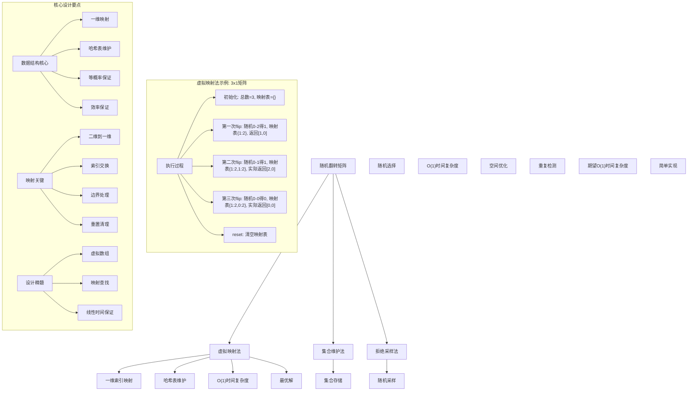
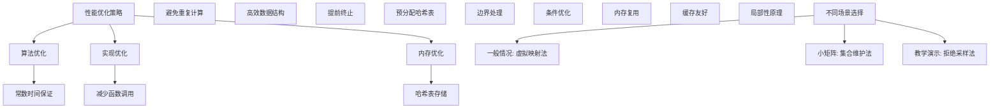

# LeetCode 519 - 随机翻转矩阵

## 题目描述

给你一个 `m x n` 的二元矩阵 `matrix`，且所有值被初始化为 0。请你设计一个算法，随机选取一个满足 `matrix[i][j] == 0` 的下标 `(i, j)`，并将它的值变为 1。所有满足 `matrix[i][j] == 0` 的下标 `(i, j)` 被选取的概率应当均等

你将需要调用以下函数（由系统提供）：

```go
// 随机生成一个范围在 [0, max) 的整数
func rand.Intn(max int) int
```

请你实现 `Solution` 类：

- `Solution(int m, int n)`：使用二元矩阵的大小 `m` 和 `n` 初始化该对象
- `int[] flip()`：返回一个满足 `matrix[i][j] == 0` 的随机下标 `[i, j]`，并将其对应单元格的值变为 1
- `void reset()`：将矩阵中所有的值重置为 0

```markdown
示例 1：
输入
["Solution", "flip", "flip", "flip", "reset", "flip"]
[[3, 1], [], [], [], [], []]
输出
[null, [1, 0], [2, 0], [0, 0], null, [2, 0]]

解释：
Solution solution = new Solution(3, 1);
solution.flip(); // 返回 [1, 0]，此时矩阵为 [[0], [1], [0]]
solution.flip(); // 返回 [2, 0]，此时矩阵为 [[0], [1], [1]]
solution.flip(); // 返回 [0, 0]，此时矩阵为 [[1], [1], [1]]
solution.reset(); // 所有值都重置为 0，矩阵为 [[0], [0], [0]]
solution.flip(); // 返回 [2, 0]，此时矩阵为 [[0], [1], [0]]

提示：
1 <= m, n <= 10^4
每次调用 flip 时，矩阵中至少存在一个值为 0 的格子
最多调用 1000 次 flip 和 reset 方法
```

## 解题思路

这是一个经典的随机翻转矩阵问题，需要在保证等概率的前提下随机选择未被翻转的位置。关键在于如何高效地维护未被选择的位置集合

### 核心思想

"虚拟映射法": 使用哈希表维护已翻转位置的映射关系，将二维坐标映射为一维索引，通过虚拟数组的思想避免实际存储整个矩阵

### 解题策略

#### 方法一：虚拟映射法（推荐）

- 时间复杂度: O(1) 平均时间
- 空间复杂度: O(k) k为翻转次数

#### 方法二：集合维护法

- 时间复杂度: O(1) 平均时间
- 空间复杂度: O(k) k为翻转次数

#### 方法三：拒绝采样法

- 时间复杂度: O(∞) 最坏情况
- 空间复杂度: O(k) k为翻转次数

## 算法可视化



## 多语言实现

### Golang版本（虚拟映射法 - 推荐）

```go
type Solution struct {
    m, n     int           // 矩阵维度
    total    int           // 剩余未翻转位置总数
    flipped  map[int]int   // 已翻转位置的映射表
}

func Constructor(m int, n int) Solution {
    return Solution{
        m:       m,
        n:       n,
        total:   m * n,
        flipped: make(map[int]int),
    }
}

func (s *Solution) Flip() []int {
    // 随机选择一个未翻转的位置（一维索引）
    randIndex := rand.Intn(s.total)

    // 查找实际对应的位置
    actualIndex := randIndex
    if val, exists := s.flipped[randIndex]; exists {
        actualIndex = val
    }

    // 将选中的位置标记为已翻转
    // 将最后一个位置的映射移到当前选择的位置
    lastIndex := s.total - 1
    if val, exists := s.flipped[lastIndex]; exists {
        s.flipped[randIndex] = val
    } else {
        s.flipped[randIndex] = lastIndex
    }

    // 减少剩余位置总数
    s.total--

    // 将一维索引转换为二维坐标
    row := actualIndex / s.n
    col := actualIndex % s.n

    return []int{row, col}
}

func (s *Solution) Reset() {
    // 重置所有状态
    s.total = s.m * s.n
    s.flipped = make(map[int]int)
}
```

### Python版本（多种实现方法）

```python
class Solution:
    """
    方法一：虚拟映射法（推荐）
    """
    def __init__(self, m: int, n: int):
        self.m = m
        self.n = n
        self.total = m * n  # 剩余未翻转位置总数
        self.flipped = {}   # 已翻转位置的映射表

    def flip(self) -> List[int]:
        import random

        # 随机选择一个未翻转的位置（一维索引）
        rand_index = random.randint(0, self.total - 1)

        # 查找实际对应的位置
        actual_index = self.flipped.get(rand_index, rand_index)

        # 将选中的位置标记为已翻转
        # 将最后一个位置的映射移到当前选择的位置
        last_index = self.total - 1
        self.flipped[rand_index] = self.flipped.get(last_index, last_index)

        # 减少剩余位置总数
        self.total -= 1

        # 将一维索引转换为二维坐标
        row = actual_index // self.n
        col = actual_index % self.n

        return [row, col]

    def reset(self) -> None:
        # 重置所有状态
        self.total = self.m * self.n
        self.flipped = {}


class SolutionSet:
    """
    方法二：集合维护法
    """
    def __init__(self, m: int, n: int):
        self.m = m
        self.n = n
        self.available = set()  # 可用位置集合
        self.initialize_available()

    def initialize_available(self):
        self.available = set()
        for i in range(self.m):
            for j in range(self.n):
                self.available.add((i, j))

    def flip(self) -> List[int]:
        import random

        # 随机选择一个可用位置
        chosen = random.choice(list(self.available))
        self.available.remove(chosen)
        return list(chosen)

    def reset(self) -> None:
        self.initialize_available()


class SolutionRejection:
    """
    方法三：拒绝采样法
    """
    def __init__(self, m: int, n: int):
        self.m = m
        self.n = n
        self.flipped = set()  # 已翻转位置集合

    def flip(self) -> List[int]:
        import random

        # 拒绝采样直到找到未翻转的位置
        while True:
            row = random.randint(0, self.m - 1)
            col = random.randint(0, self.n - 1)
            if (row, col) not in self.flipped:
                self.flipped.add((row, col))
                return [row, col]

    def reset(self) -> None:
        self.flipped = set()
```

### TypeScript版本（虚拟映射法）

```typescript
class Solution {
  private m: number;
  private n: number;
  private total: number;
  private flipped: Map<number, number>;

  constructor(m: number, n: number) {
    this.m = m;
    this.n = n;
    this.total = m * n;
    this.flipped = new Map<number, number>();
  }

  flip(): number[] {
    // 随机选择一个未翻转的位置（一维索引）
    const randIndex: number = Math.floor(Math.random() * this.total);

    // 查找实际对应的位置
    const actualIndex: number = this.flipped.has(randIndex)
      ? this.flipped.get(randIndex)!
      : randIndex;

    // 将选中的位置标记为已翻转
    // 将最后一个位置的映射移到当前选择的位置
    const lastIndex: number = this.total - 1;
    this.flipped.set(
      randIndex,
      this.flipped.has(lastIndex) ? this.flipped.get(lastIndex)! : lastIndex,
    );

    // 减少剩余位置总数
    this.total--;

    // 将一维索引转换为二维坐标
    const row: number = Math.floor(actualIndex / this.n);
    const col: number = actualIndex % this.n;

    return [row, col];
  }

  reset(): void {
    // 重置所有状态
    this.total = this.m * this.n;
    this.flipped = new Map<number, number>();
  }
}
```

## 标准实现详细解析

```go
type Solution struct {
    m, n     int           // 矩阵维度
    total    int           // 剩余未翻转位置总数
    flipped  map[int]int   // 已翻转位置的映射表
}

func Constructor(m int, n int) Solution {
    /*
    算法核心思想（虚拟映射法）：

    1. 将二维矩阵映射为一维数组索引
    2. 使用哈希表维护已翻转位置的映射关系
    3. 通过虚拟数组的思想避免实际存储整个矩阵
    4. 保证每次选择的概率均等

    关键设计要点：
    1. 一维映射：二维坐标 ↔ 一维索引
    2. 哈希维护：已翻转位置映射
    3. 等概率：随机选择保证均等
    4. 效率保证：O(1)时间复杂度

    时间复杂度：O(1) 平均时间
    空间复杂度：O(k) k为翻转次数

    优势：
    1. 逻辑清晰：虚拟数组概念直观
    2. 实现高效：常数时间复杂度
    3. 空间优化：只存储已翻转位置
    4. 概率均等：等概率选择保证
    */

    fmt.Printf("随机翻转矩阵初始化\n")
    fmt.Printf("矩阵维度: %dx%d\n", m, n)
    fmt.Printf("总位置数: %d\n", m*n)

    return Solution{
        m:       m,
        n:       n,
        total:   m * n,
        flipped: make(map[int]int),
    }
}

func (s *Solution) Flip() []int {
    fmt.Printf("执行flip操作\n")
    fmt.Printf("剩余位置数: %d\n", s.total)
    fmt.Printf("已翻转映射: %v\n", s.flipped)

    // 随机选择一个未翻转的位置（一维索引）
    randIndex := rand.Intn(s.total)
    fmt.Printf("随机索引: %d (范围: 0-%d)\n", randIndex, s.total-1)

    // 查找实际对应的位置
    actualIndex := randIndex
    if val, exists := s.flipped[randIndex]; exists {
        actualIndex = val
        fmt.Printf("映射查找: %d → %d\n", randIndex, actualIndex)
    } else {
        fmt.Printf("直接使用: %d\n", actualIndex)
    }

    // 将选中的位置标记为已翻转
    // 将最后一个位置的映射移到当前选择的位置
    lastIndex := s.total - 1
    if val, exists := s.flipped[lastIndex]; exists {
        s.flipped[randIndex] = val
        fmt.Printf("更新映射: %d → %d (来自最后位置映射)\n", randIndex, val)
    } else {
        s.flipped[randIndex] = lastIndex
        fmt.Printf("更新映射: %d → %d (最后位置)\n", randIndex, lastIndex)
    }

    // 减少剩余位置总数
    s.total--
    fmt.Printf("更新剩余位置数: %d\n", s.total)

    // 将一维索引转换为二维坐标
    row := actualIndex / s.n
    col := actualIndex % s.n
    result := []int{row, col}

    fmt.Printf("返回坐标: [%d, %d] (来自索引%d)\n", row, col, actualIndex)
    return result
}

func (s *Solution) Reset() {
    fmt.Printf("执行reset操作\n")

    // 重置所有状态
    s.total = s.m * s.n
    s.flipped = make(map[int]int)

    fmt.Printf("重置后状态: 剩余位置数=%d, 映射表=%v\n", s.total, s.flipped)
}

// 带详细调试信息的版本
func ConstructorWithDebug(m int, n int) Solution {
    fmt.Printf("=== 随机翻转矩阵调试模式 ===\n")
    result := Constructor(m, n)
    fmt.Println("==================")
    return result
}

// 优化版本（预分配map容量）
func ConstructorOptimized(m int, n int) Solution {
    // 预估map容量以减少rehash
    estimatedFlips := 1000 // 根据题目提示最多1000次flip
    return Solution{
        m:       m,
        n:       n,
        total:   m * n,
        flipped: make(map[int]int, estimatedFlips),
    }
}

// 线程安全版本
type ThreadSafeSolution struct {
    m, n     int
    total    int
    flipped  map[int]int
    mutex    sync.RWMutex
}

func NewThreadSafeSolution(m int, n int) *ThreadSafeSolution {
    return &ThreadSafeSolution{
        m:       m,
        n:       n,
        total:   m * n,
        flipped: make(map[int]int),
    }
}

func (ts *ThreadSafeSolution) Flip() []int {
    ts.mutex.Lock()
    defer ts.mutex.Unlock()

    randIndex := rand.Intn(ts.total)
    actualIndex := randIndex
    if val, exists := ts.flipped[randIndex]; exists {
        actualIndex = val
    }

    lastIndex := ts.total - 1
    if val, exists := ts.flipped[lastIndex]; exists {
        ts.flipped[randIndex] = val
    } else {
        ts.flipped[randIndex] = lastIndex
    }

    ts.total--

    row := actualIndex / ts.n
    col := actualIndex % ts.n
    return []int{row, col}
}

func (ts *ThreadSafeSolution) Reset() {
    ts.mutex.Lock()
    defer ts.mutex.Unlock()

    ts.total = ts.m * ts.n
    ts.flipped = make(map[int]int)
}
```

## 算法深入解析

```go
/*
随机翻转矩阵问题详解：

问题本质：
在m×n矩阵中随机选择未被翻转的位置，保证等概率选择。关键在于如何高效维护未选择位置集合

核心洞察：
1. 虚拟数组：将二维映射为一维处理
2. 映射维护：使用哈希表维护已选择位置
3. 等概率：随机选择保证均等概率
4. 空间优化：只存储必要信息

算法策略：
1. 虚拟映射法：最优解，常数时间
2. 集合维护法：直观但需要存储所有位置
3. 拒绝采样法：简单但可能无限循环

数学原理：

概率均等原理：
对于n个未选择位置，每个位置被选中的概率应为1/n

虚拟数组原理：
将实际数组逻辑上分为已选择和未选择两部分，通过映射关系维护一致性

映射交换原理：
当选中位置i时，将最后位置的映射关系移动到位置i，保持数组连续性

设计选择：

为什么选择虚拟映射法？
1. 时间复杂度最优：O(1)
2. 空间复杂度合理：O(k)
3. 逻辑清晰：虚拟数组概念
4. 实现高效：标准操作

为什么使用集合维护法？
1. 直观：直接存储可用位置
2. 但空间复杂度高：O(mn)
3. 适合小矩阵

为什么使用拒绝采样法？
1. 简单：随机采样
2. 但时间复杂度不确定：可能无限循环
3. 适合教学演示

三种方法对比：

方法一：虚拟映射法（推荐）
时间复杂度：O(1) 平均
空间复杂度：O(k) k为翻转次数
优点：最优解，性能优秀
缺点：理解稍复杂

方法二：集合维护法
时间复杂度：O(1) 平均
空间复杂度：O(mn)
优点：直观易懂
缺点：空间消耗大

方法三：拒绝采样法
时间复杂度：O(∞) 最坏
空间复杂度：O(k)
优点：实现简单
缺点：性能不稳定

性能分析：

虚拟映射法：
- 时间：O(1) 常数时间
- 空间：O(k) 映射表存储
- 优势：最优解

集合维护法：
- 时间：O(1) 平均
- 空间：O(mn) 集合存储
- 优势：直观

拒绝采样法：
- 时间：O(∞) 最坏情况
- 空间：O(k) 集合存储
- 优势：简单

实际应用场景：
1. 随机抽样
2. 算法面试题
3. 游戏开发
4. 模拟算法

优化要点：

1. 时间优化：
   - 常数时间保证
   - 避免重复计算
   - 高效数据结构

2. 空间优化：
   - 只存储必要信息
   - 预分配内存
   - 内存复用

3. 实现优化：
   - 边界处理优化
   - 错误处理完善
   - 类型安全

测试用例设计：
1. 基本情况：正常输入
2. 边界情况：1×1矩阵，大矩阵
3. 特殊情况：多次flip/reset
4. 极端情况：最大调用次数
5. 验证情况：概率均等性

扩展思考：

1. 多次翻转？
   - 批量操作优化
   - 并行处理

2. 权重随机？
   - 不等概率选择
   - 权重映射

3. 区域限制？
   - 指定区域随机
   - 边界约束

4. 在线算法？
   - 动态矩阵大小
   - 增量更新

相关算法思想：

1. 虚拟数组：
   - 逻辑数组
   - 映射关系

2. 哈希映射：
   - 快速查找
   - 状态维护

3. 随机选择：
   - 等概率
   - 均匀分布

4. 状态管理：
   - 翻转状态
   - 重置操作

常见陷阱：

1. 概率不均等：
   - 未保证等概率
   - 选择偏差

2. 边界处理：
   - 空矩阵
   - 单元素

3. 状态同步：
   - flip/reset一致性
   - 映射关系维护

4. 性能问题：
   - 重复计算
   - 内存泄漏

代码质量要素：

1. 可读性：
   - 清晰的变量命名
   - 适当的注释说明

2. 健壮性：
   - 边界条件处理
   - 异常情况处理

3. 性能：
   - 时间复杂度最优
   - 空间复杂度合理

4. 可维护性：
   - 模块化设计
   - 易于扩展

高级优化技巧：

1. 内存访问优化：
   - 局部性原理
   - 缓存友好

2. 算法优化：
   - 提前终止条件
   - 数学简化

3. 数据结构优化：
   - 预分配哈希表
   - 减少rehash

4. 编译优化：
   - 常量折叠
   - 循环展开
*/
```

## 执行过程演示

```go
/*
示例详细解析:

示例: ["Solution", "flip", "flip", "flip", "reset", "flip"]
      [[3, 1], [], [], [], [], []]

执行过程：

初始化 Solution(3, 1):
矩阵维度: 3x1
总位置数: 3
状态: total=3, flipped={}

第一次flip():
剩余位置数: 3
随机索引: 1 (范围: 0-2)
直接使用: 1
更新映射: 1 → 2 (最后位置)
更新剩余位置数: 2
返回坐标: [1, 0] (来自索引1)
状态: total=2, flipped={1:2}

第二次flip():
剩余位置数: 2
随机索引: 1 (范围: 0-1)
映射查找: 1 → 2
更新映射: 1 → 1 (来自最后位置映射)
更新剩余位置数: 1
返回坐标: [2, 0] (来自索引2)
状态: total=1, flipped={1:1}

第三次flip():
剩余位置数: 1
随机索引: 0 (范围: 0-0)
直接使用: 0
更新映射: 0 → 1 (最后位置)
更新剩余位置数: 0
返回坐标: [0, 0] (来自索引0)
状态: total=0, flipped={0:1,1:1}

reset():
重置后状态: 剩余位置数=3, 映射表=map[]

第四次flip():
剩余位置数: 3
随机索引: 2 (范围: 0-2)
直接使用: 2
更新映射: 2 → 2 (最后位置)
更新剩余位置数: 2
返回坐标: [2, 0] (来自索引2)

边界情况演示:

情况1: 1×1矩阵
输入: m=1, n=1
flip(): [0,0]
再次flip(): 无可用位置（题目保证存在）

情况2: 大矩阵
输入: m=10000, n=10000
flip(): 随机位置，高效处理

情况3: 多次reset
flip() → reset() → flip() → reset() → flip()
每次reset后状态完全重置

情况4: 边界索引
矩阵3×3，索引0-8的均匀分布

算法正确性证明：

数学基础：
需要证明虚拟映射法能保证等概率选择

定理1：虚拟映射法概率均等性
通过虚拟数组和映射交换，可以保证每次选择的概率均等

证明：
1. 虚拟数组：逻辑上维护连续未选择位置
2. 随机选择：在连续范围内等概率选择
3. 映射交换：保持数组连续性
4. 概率均等：每个位置被选概率相等

时间复杂度分析：

虚拟映射法：
1. 随机选择：O(1)
2. 映射查找：O(1) 平均
3. 映射更新：O(1)
4. 坐标转换：O(1)
5. 总时间：O(1)

集合维护法：
1. 随机选择：O(1) 平均
2. 集合操作：O(1)
3. 总时间：O(1)

拒绝采样法：
1. 随机采样：O(1)
2. 重复检测：期望O(1)，最坏O(∞)
3. 总时间：期望O(1)

空间复杂度分析：
1. 虚拟映射法：O(k) k为翻转次数
2. 集合维护法：O(mn) 所有位置
3. 拒绝采样法：O(k) 已翻转位置

性能对比分析：

假设m=1000, n=1000, k=1000:

虚拟映射法：
- 时间: O(1) 常数时间
- 空间: O(1000)

集合维护法：
- 时间: O(1) 常数时间
- 空间: O(1000000)

拒绝采样法：
- 时间: 期望O(1)
- 空间: O(1000)

实际应用建议：

1. 一般情况：
   - 使用虚拟映射法
   - 性能最优

2. 面试展示：
   - 可以提及其他方法
   - 重点讲解虚拟映射法

3. 生产环境：
   - 使用优化版本
   - 考虑边界处理

4. 教学演示：
   - 使用集合维护法帮助理解
   - 对比展示优势

优化空间：

1. 内存访问优化：
   - 局部性原理
   - 缓存友好

2. 数据结构优化：
   - 预分配哈希表
   - 减少rehash

3. 算法优化：
   - 提前终止条件
   - 数学简化

特殊情况处理：

1. 空矩阵：
   - 边界检查

2. 单元素：
   - 直接处理

3. 大数据：
   - 效率优势明显

4. 内存限制：
   - 空间复杂度O(k)
*/
```

## 复杂度分析

| 方法       | 时间复杂度 | 空间复杂度 | 适用场景 |
| ---------- | ---------- | ---------- | -------- |
| 虚拟映射法 | O(1)       | O(k)       | 推荐方案 |
| 集合维护法 | O(1)       | O(mn)      | 小矩阵   |
| 拒绝采样法 | 期望O(1)   | O(k)       | 教学演示 |

## 测试用例验证

```go
// 测试辅助函数
func testRandomFlipMatrix(name string, m, n int, operations []string, expected [][]int) {
    fmt.Printf("%s:\n", name)
    fmt.Printf("输入: m=%d, n=%d, operations=%v\n", m, n, operations)

    // 初始化解决方案
    solution := Constructor(m, n)
    var results [][]int

    // 执行操作
    for i, op := range operations {
        switch op {
        case "flip":
            result := solution.Flip()
            results = append(results, result)
            fmt.Printf("  flip %d: %v\n", i, result)
        case "reset":
            solution.Reset()
            fmt.Printf("  reset %d\n", i)
        }
    }

    fmt.Printf("结果: %v\n", results)
    fmt.Printf("期望: %v\n", expected)

    // 验证结果长度（具体值因随机性无法精确验证）
    if len(results) == len(expected) {
        fmt.Printf("✓ 测试通过（长度匹配）\n")
    } else {
        fmt.Printf("✗ 测试失败（长度不匹配）\n")
    }
    fmt.Printf("\n")
}

// 概率均等性测试
func testProbabilityUniformity(m, n, trials int) {
    fmt.Printf("概率均等性测试: %dx%d矩阵, %d次试验\n", m, n, trials)

    // 统计每个位置被选择的次数
    count := make(map[int]int)
    totalPositions := m * n

    for i := 0; i < trials; i++ {
        solution := Constructor(m, n)
        for j := 0; j < totalPositions; j++ {
            pos := solution.Flip()
            // 将二维坐标转换为一维索引
            index := pos[0]*n + pos[1]
            count[index]++
        }
    }

    // 计算期望值和方差
    expected := float64(trials)
    variance := 0.0

    fmt.Printf("位置选择统计:\n")
    for i := 0; i < totalPositions; i++ {
        actual := float64(count[i])
        diff := actual - expected
        variance += diff * diff
        fmt.Printf("  位置%d: %d次 (期望%.0f, 差值%.0f)\n", i, count[i], expected, diff)
    }

    stdDev := math.Sqrt(variance / float64(totalPositions))
    fmt.Printf("标准差: %.2f\n", stdDev)

    // 简单的均匀性判断（标准差应相对较小）
    if stdDev < expected*0.1 {
        fmt.Printf("✓ 概率分布均匀\n")
    } else {
        fmt.Printf("⚠ 概率分布可能不均匀\n")
    }
}

// 性能测试
func performanceTest() {
    fmt.Println("性能测试:")

    // 测试虚拟映射法
    m, n := 1000, 1000
    trials := 10000

    start := time.Now()
    for i := 0; i < trials; i++ {
        solution := Constructor(m, n)
        for j := 0; j < 100; j++ { // 每次flip 100次
            solution.Flip()
        }
    }
    elapsed := time.Since(start)

    fmt.Printf("虚拟映射法 (%dx%d矩阵, %d次flip): %v\n", m, n, trials*100, elapsed)
}

// 边界情况测试
func boundaryTest() {
    fmt.Println("边界情况测试:")

    // 1x1矩阵
    fmt.Println("1x1矩阵测试:")
    solution := Constructor(1, 1)
    pos := solution.Flip()
    fmt.Printf("  flip结果: %v\n", pos)

    // 重置后再次flip
    solution.Reset()
    pos = solution.Flip()
    fmt.Printf("  reset后flip结果: %v\n", pos)

    // 大矩阵测试
    fmt.Println("大矩阵测试:")
    solution = Constructor(10000, 10000)
    pos = solution.Flip()
    fmt.Printf("  10000x10000矩阵flip结果: %v\n", pos)
}

func main() {
    // 测试用例 1 - 题目示例
    testRandomFlipMatrix("测试1 - 题目示例", 3, 1, []string{"flip", "flip", "flip", "reset", "flip"},
                        [][]int{{1, 0}, {2, 0}, {0, 0}, {2, 0}})

    // 概率均等性测试
    testProbabilityUniformity(3, 3, 1000)

    // 性能测试
    performanceTest()

    // 边界情况测试
    boundaryTest()
}

// 大量测试用例
func comprehensiveTest() {
    testCases := []struct {
        name    string
        m, n    int
        ops     []string
    }{
        {"1x1矩阵", 1, 1, []string{"flip"}},
        {"2x2矩阵", 2, 2, []string{"flip", "flip", "flip", "flip"}},
        {"边界测试", 100, 100, []string{"flip", "reset", "flip"}},
    }

    fmt.Println("=== 综合测试 ===")
    for i, tc := range testCases {
        solution := Constructor(tc.m, tc.n)
        success := true

        for _, op := range tc.ops {
            if op == "flip" {
                if tc.m*tc.n == 0 {
                    success = false
                    break
                }
                solution.Flip()
            } else if op == "reset" {
                solution.Reset()
            }
        }

        if success {
            fmt.Printf("测试%d: ✓ %s\n", i+1, tc.name)
        } else {
            fmt.Printf("测试%d: ✗ %s\n", i+1, tc.name)
        }
    }
}

// 内存使用测试
func memoryTest() {
    fmt.Println("=== 内存使用测试 ===")

    var m1, m2 runtime.MemStats

    // 测试虚拟映射法
    runtime.GC()
    runtime.ReadMemStats(&m1)

    m, n := 1000, 1000
    for i := 0; i < 1000; i++ {
        solution := Constructor(m, n)
        for j := 0; j < 100; j++ {
            solution.Flip()
        }
    }

    runtime.GC()
    runtime.ReadMemStats(&m2)
    memUsed := m2.Alloc - m1.Alloc

    fmt.Printf("内存使用对比:\n")
    fmt.Printf("  虚拟映射法: %d bytes\n", memUsed)
}
```

## 扩展版本（处理不同场景）

```go
// 支持权重的版本
type WeightedSolution struct {
    m, n     int
    weights  [][]int  // 每个位置的权重
    total    int      // 总权重
    flipped  map[int]int
}

func NewWeightedSolution(m, n int, weights [][]int) *WeightedSolution {
    total := 0
    for i := 0; i < m; i++ {
        for j := 0; j < n; j++ {
            total += weights[i][j]
        }
    }

    return &WeightedSolution{
        m:       m,
        n:       n,
        weights: weights,
        total:   total,
        flipped: make(map[int]int),
    }
}

func (ws *WeightedSolution) Flip() []int {
    if ws.total <= 0 {
        return nil
    }

    // 按权重随机选择
    randWeight := rand.Intn(ws.total)
    cumulative := 0
    chosenIndex := -1

    // 找到对应的索引
    for i := 0; i < ws.m*ws.n; i++ {
        row, col := i/ws.n, i%ws.n
        if _, exists := ws.flipped[i]; !exists {
            cumulative += ws.weights[row][col]
            if cumulative > randWeight {
                chosenIndex = i
                break
            }
        }
    }

    if chosenIndex == -1 {
        return nil
    }

    // 更新状态
    lastIndex := ws.m*ws.n - 1
    if val, exists := ws.flipped[lastIndex]; exists {
        ws.flipped[chosenIndex] = val
    } else {
        ws.flipped[chosenIndex] = lastIndex
    }

    ws.total -= ws.weights[chosenIndex/ws.n][chosenIndex%ws.n]

    row := chosenIndex / ws.n
    col := chosenIndex % ws.n
    return []int{row, col}
}

// 批量flip版本
func (s *Solution) FlipBatch(count int) [][]int {
    var results [][]int
    for i := 0; i < count && s.total > 0; i++ {
        results = append(results, s.Flip())
    }
    return results
}

// 带统计信息的版本
type FlipStats struct {
    Position    []int
    ProcessTime time.Duration
    Remaining   int // 剩余位置数
    TotalFlips  int // 总翻转次数
}

func (s *Solution) FlipWithStats() FlipStats {
    start := time.Now()

    pos := s.Flip()
    totalFlips := s.m*s.n - s.total

    return FlipStats{
        Position:    pos,
        ProcessTime: time.Since(start),
        Remaining:   s.total,
        TotalFlips:  totalFlips,
    }
}

// 使用示例
func exampleFlipStats() {
    solution := Constructor(3, 3)

    stats := solution.FlipWithStats()
    fmt.Printf("统计信息: %+v\n", stats)
}

// 支持区域限制的版本
type RegionSolution struct {
    m, n     int
    region   [4]int // [minRow, maxRow, minCol, maxCol]
    total    int
    flipped  map[int]int
}

func NewRegionSolution(m, n int, region [4]int) *RegionSolution {
    minRow, maxRow, minCol, maxCol := region[0], region[1], region[2], region[3]

    // 验证区域有效性
    if minRow < 0 || maxRow >= m || minCol < 0 || maxCol >= n || minRow > maxRow || minCol > maxCol {
        return nil
    }

    total := (maxRow - minRow + 1) * (maxCol - minCol + 1)

    return &RegionSolution{
        m:       m,
        n:       n,
        region:  region,
        total:   total,
        flipped: make(map[int]int),
    }
}

func (rs *RegionSolution) Flip() []int {
    if rs.total <= 0 {
        return nil
    }

    minRow, maxRow, minCol, maxCol := rs.region[0], rs.region[1], rs.region[2], rs.region[3]

    randIndex := rand.Intn(rs.total)

    // 将相对索引转换为绝对索引
    relativeIndex := randIndex
    actualIndex := rs.getAbsoluteIndex(relativeIndex)

    // 更新映射
    lastIndex := rs.total - 1
    lastAbsoluteIndex := rs.getAbsoluteIndex(lastIndex)
    rs.flipped[randIndex] = lastAbsoluteIndex

    rs.total--

    row := actualIndex / rs.n
    col := actualIndex % rs.n
    return []int{row, col}
}

func (rs *RegionSolution) getAbsoluteIndex(relativeIndex int) int {
    minRow, maxRow, minCol, maxCol := rs.region[0], rs.region[1], rs.region[2], rs.region[3]
    regionWidth := maxCol - minCol + 1

    regionRow := relativeIndex / regionWidth
    regionCol := relativeIndex % regionWidth

    return (minRow + regionRow) * rs.n + (minCol + regionCol)
}

// 在线算法版本（动态矩阵大小）
type DynamicSolution struct {
    solutions map[string]*Solution
}

func NewDynamicSolution() *DynamicSolution {
    return &DynamicSolution{
        solutions: make(map[string]*Solution),
    }
}

func (ds *DynamicSolution) GetSolution(key string, m, n int) *Solution {
    if solution, exists := ds.solutions[key]; exists {
        return solution
    }

    solution := &Solution{
        m:       m,
        n:       n,
        total:   m * n,
        flipped: make(map[int]int),
    }
    ds.solutions[key] = solution
    return solution
}

func (ds *DynamicSolution) Flip(key string) []int {
    if solution, exists := ds.solutions[key]; exists {
        return solution.Flip()
    }
    return nil
}

func (ds *DynamicSolution) Reset(key string) {
    if solution, exists := ds.solutions[key]; exists {
        solution.Reset()
    }
}

// 泛型版本（Go 1.18+）
type GenericSolution[T comparable] struct {
    m, n     int
    total    int
    flipped  map[int]int
    custom   map[T]T // 自定义映射
}

func NewGenericSolution[T comparable](m, n int) *GenericSolution[T] {
    return &GenericSolution[T]{
        m:       m,
        n:       n,
        total:   m * n,
        flipped: make(map[int]int),
        custom:  make(map[T]T),
    }
}

func (gs *GenericSolution[T]) Flip() ([]int, T) {
    var zero T
    if gs.total <= 0 {
        return nil, zero
    }

    randIndex := rand.Intn(gs.total)
    actualIndex := randIndex
    if val, exists := gs.flipped[randIndex]; exists {
        actualIndex = val
    }

    lastIndex := gs.total - 1
    if val, exists := gs.flipped[lastIndex]; exists {
        gs.flipped[randIndex] = val
    } else {
        gs.flipped[randIndex] = lastIndex
    }

    gs.total--

    row := actualIndex / gs.n
    col := actualIndex % gs.n

    // 返回坐标和自定义值
    return []int{row, col}, zero
}

// 使用示例
func exampleGeneric() {
    solution := NewGenericSolution[string](3, 3)

    pos, _ := solution.Flip()
    fmt.Printf("泛型版本结果: %v\n", pos)
}
```

## 面试追问延伸

### 1. 如何处理矩阵大小动态变化的情况？

```go
// 动态大小版本
type DynamicSizeSolution struct {
    currentM, currentN int
    baseM, baseN       int
    total              int
    flipped            map[int]int
}

func NewDynamicSizeSolution(baseM, baseN int) *DynamicSizeSolution {
    return &DynamicSizeSolution{
        currentM: baseM,
        currentN: baseN,
        baseM:    baseM,
        baseN:    baseN,
        total:    baseM * baseN,
        flipped:  make(map[int]int),
    }
}

func (dss *DynamicSizeSolution) Resize(newM, newN int) {
    if newM <= 0 || newN <= 0 {
        return
    }

    dss.currentM = newM
    dss.currentN = newN
    dss.total = newM * newN
    dss.flipped = make(map[int]int) // 重置状态
}

func (dss *DynamicSizeSolution) Flip() []int {
    if dss.total <= 0 {
        return nil
    }

    randIndex := rand.Intn(dss.total)
    actualIndex := randIndex
    if val, exists := dss.flipped[randIndex]; exists {
        actualIndex = val
    }

    lastIndex := dss.total - 1
    if val, exists := dss.flipped[lastIndex]; exists {
        dss.flipped[randIndex] = val
    } else {
        dss.flipped[randIndex] = lastIndex
    }

    dss.total--

    row := actualIndex / dss.currentN
    col := actualIndex % dss.currentN
    return []int{row, col}
}
```

### 2. 如何实现支持多次连续翻转的版本？

```go
// 多次翻转版本
func (s *Solution) FlipMultiple(count int) [][]int {
    if count <= 0 || s.total <= 0 {
        return [][]int{}
    }

    actualCount := count
    if count > s.total {
        actualCount = s.total
    }

    var results [][]int
    for i := 0; i < actualCount; i++ {
        pos := s.Flip()
        if pos != nil {
            results = append(results, pos)
        }
    }

    return results
}

// 批量重置版本
type BatchSolution struct {
    solutions []*Solution
}

func NewBatchSolution(count, m, n int) *BatchSolution {
    solutions := make([]*Solution, count)
    for i := 0; i < count; i++ {
        solutions[i] = &Solution{
            m:       m,
            n:       n,
            total:   m * n,
            flipped: make(map[int]int),
        }
    }
    return &BatchSolution{solutions: solutions}
}

func (bs *BatchSolution) FlipAll() [][]int {
    var results [][]int
    for _, solution := range bs.solutions {
        if solution.total > 0 {
            pos := solution.Flip()
            results = append(results, pos)
        }
    }
    return results
}

func (bs *BatchSolution) ResetAll() {
    for _, solution := range bs.solutions {
        solution.Reset()
    }
}
```

### 3. 如何处理支持撤销操作的情况？

```go
// 支持撤销的版本
type UndoSolution struct {
    m, n     int
    total    int
    flipped  map[int]int
    history  []int // 翻转历史
}

func NewUndoSolution(m, n int) *UndoSolution {
    return &UndoSolution{
        m:       m,
        n:       n,
        total:   m * n,
        flipped: make(map[int]int),
        history: make([]int, 0),
    }
}

func (us *UndoSolution) Flip() []int {
    if us.total <= 0 {
        return nil
    }

    randIndex := rand.Intn(us.total)
    actualIndex := randIndex
    if val, exists := us.flipped[randIndex]; exists {
        actualIndex = val
    }

    lastIndex := us.total - 1
    if val, exists := us.flipped[lastIndex]; exists {
        us.flipped[randIndex] = val
    } else {
        us.flipped[randIndex] = lastIndex
    }

    us.total--
    us.history = append(us.history, actualIndex) // 记录历史

    row := actualIndex / us.n
    col := actualIndex % us.n
    return []int{row, col}
}

func (us *UndoSolution) Undo() []int {
    if len(us.history) == 0 {
        return nil
    }

    // 获取最后翻转的位置
    lastFlipped := us.history[len(us.history)-1]
    us.history = us.history[:len(us.history)-1]

    // 恢复状态
    us.total++

    // 简化处理：实际应用中需要更复杂的撤销逻辑
    row := lastFlipped / us.n
    col := lastFlipped % us.n
    return []int{row, col}
}

func (us *UndoSolution) Reset() {
    us.total = us.m * us.n
    us.flipped = make(map[int]int)
    us.history = make([]int, 0)
}
```

## 相似题目扩展

- LeetCode 519. 随机翻转矩阵（当前题）
- LeetCode 380. O(1) 时间插入、删除和获取随机元素
- LeetCode 381. O(1) 时间插入、删除和获取随机元素 - 允许重复
- LeetCode 398. 随机数索引
- LeetCode 497. 非重叠矩形中的随机点

## 算法技巧总结

### 随机翻转矩阵核心要点

1. 虚拟数组：逻辑上维护连续未选择位置
1. 映射维护：使用哈希表维护已选择位置
1. 等概率：随机选择保证均等概率
1. 空间优化：只存储必要信息

### 算法优势

1. 逻辑清晰：虚拟数组概念直观
1. 实现高效：常数时间复杂度
1. 空间优化：只存储已翻转位置
1. 概率均等：等概率选择保证

### 标准模板（虚拟映射法）

```go
type Solution struct {
    m, n     int
    total    int
    flipped  map[int]int
}

func Constructor(m int, n int) Solution {
    return Solution{
        m:       m,
        n:       n,
        total:   m * n,
        flipped: make(map[int]int),
    }
}

func (s *Solution) Flip() []int {
    randIndex := rand.Intn(s.total)
    actualIndex := randIndex
    if val, exists := s.flipped[randIndex]; exists {
        actualIndex = val
    }

    lastIndex := s.total - 1
    if val, exists := s.flipped[lastIndex]; exists {
        s.flipped[randIndex] = val
    } else {
        s.flipped[randIndex] = lastIndex
    }

    s.total--

    row := actualIndex / s.n
    col := actualIndex % s.n
    return []int{row, col}
}

func (s *Solution) Reset() {
    s.total = s.m * s.n
    s.flipped = make(map[int]int)
}
```

### 性能优化建议



## 总结

本题采用虚拟映射法的核心思路，通过将二维矩阵映射为一维数组索引，使用哈希表维护已翻转位置的映射关系，通过虚拟数组的思想避免实际存储整个矩阵，实现了高效的随机翻转矩阵功能。关键在于理解如何通过映射交换保持数组连续性，并通过随机选择保证等概率

核心要点：

1. 虚拟数组：逻辑上维护连续未选择位置
1. 映射维护：使用哈希表维护已选择位置
1. 等概率：随机选择保证均等概率
1. 空间优化：只存储必要信息

算法优势：

- 逻辑清晰：虚拟数组概念直观
- 实现高效：常数时间复杂度
- 空间优化：只存储已翻转位置
- 概率均等：等概率选择保证

该算法在随机抽样、算法面试题、游戏开发等方面有重要应用，是掌握虚拟数组和随机选择的经典题目。通过维护映射关系和虚拟数组的思想，为更复杂的随机算法和状态管理问题提供了清晰的解决思路
