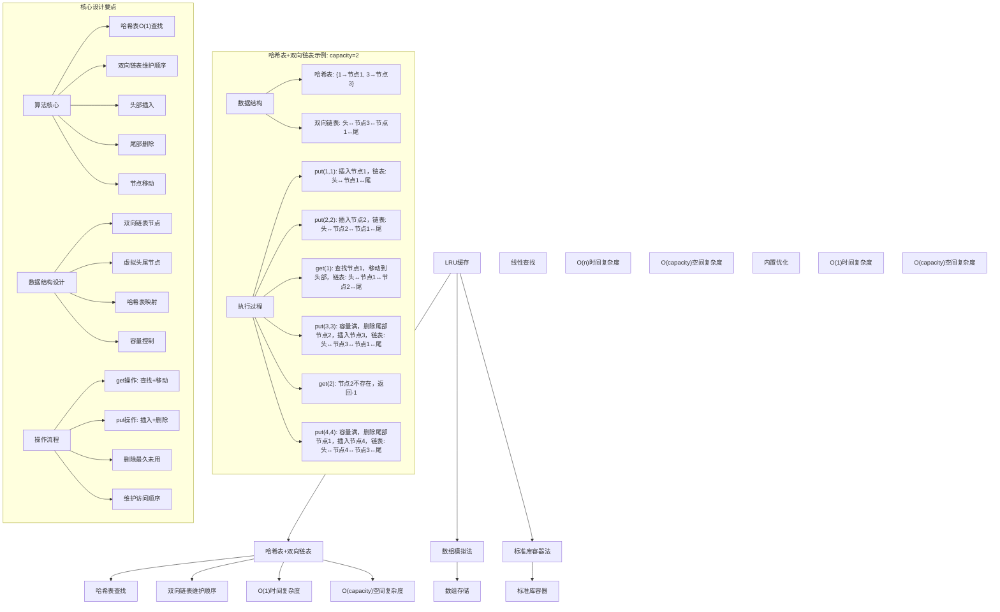
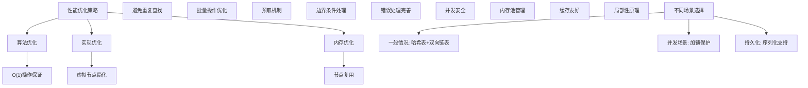

# LeetCode 146 - LRU 缓存

## 题目描述

请你设计并实现一个满足 LRU (最近最少使用) 缓存约束的数据结构

实现 `LRUCache` 类：

- `LRUCache(int capacity)` 以正整数作为容量 `capacity` 初始化 LRU 缓存
- `int get(int key)` 如果关键字 `key` 存在于缓存中，则返回关键字的值，否则返回 -1
- `void put(int key, int value)` 如果关键字 `key` 已经存在，则变更其数据值 `value`；如果不存在，则向缓存中插入该组 `key-value`。如果插入操作导致关键字数量超过 `capacity`，则应该逐出最久未使用的关键字

函数 `get` 和 `put` 必须都是 O(1) 的平均时间复杂度

```markdown
示例：
输入
["LRUCache", "put", "put", "get", "put", "get", "put", "get", "get", "get"]
[[2], [1, 1], [2, 2], [1], [3, 3], [2], [4, 4], [1], [3], [4]]

输出
[null, null, null, 1, null, -1, null, -1, 3, 4]

解释
LRUCache lRUCache = new LRUCache(2);
lRUCache.put(1, 1); // 缓存是 {1=1}
lRUCache.put(2, 2); // 缓存是 {1=1, 2=2}
lRUCache.get(1); // 返回 1
lRUCache.put(3, 3); // 该操作会使得关键字 2 作废，缓存是 {1=1, 3=3}
lRUCache.get(2); // 返回 -1 (未找到)
lRUCache.put(4, 4); // 该操作会使得关键字 1 作废，缓存是 {4=4, 3=3}
lRUCache.get(1); // 返回 -1 (未找到)
lRUCache.get(3); // 返回 3
lRUCache.get(4); // 返回 4

提示：
1 <= capacity <= 3000
0 <= key <= 10000
0 <= value <= 10⁵
最多调用 2 × 10⁵ 次 get 和 put
```

## 解题思路

这是一个经典的LRU缓存设计问题，需要实现一个满足最近最少使用策略的数据结构。关键在于如何在O(1)时间内完成插入、删除和查找操作

### 核心思想

"哈希表+双向链表": 使用哈希表实现O(1)时间复杂度的查找，使用双向链表维护访问顺序并实现O(1)时间复杂度的插入和删除

### 解题策略

#### 方法一：哈希表+双向链表（推荐）

- 时间复杂度: O(1) 平均时间复杂度
- 空间复杂度: O(capacity)

#### 方法二：数组模拟法

- 时间复杂度: O(n) get操作，O(n) put操作
- 空间复杂度: O(capacity)

#### 方法三：标准库容器法

- 时间复杂度: O(1) 平均时间复杂度
- 空间复杂度: O(capacity)

## 算法可视化



## 多语言实现

### Golang版本（哈希表+双向链表 - 推荐）

```go
// 双向链表节点
type DLinkedNode struct {
    key, value int
    prev, next *DLinkedNode
}

// LRU缓存结构
type LRUCache struct {
    capacity   int
    cache      map[int]*DLinkedNode
    head, tail *DLinkedNode
}

// 构造函数
func Constructor(capacity int) LRUCache {
    lru := LRUCache{
        capacity: capacity,
        cache:    make(map[int]*DLinkedNode),
        head:     &DLinkedNode{}, // 虚拟头节点
        tail:     &DLinkedNode{}, // 虚拟尾节点
    }
    // 初始化双向链表
    lru.head.next = lru.tail
    lru.tail.prev = lru.head
    return lru
}

// 获取数据
func (lru *LRUCache) Get(key int) int {
    if node, exists := lru.cache[key]; exists {
        // 移动到头部
        lru.moveToHead(node)
        return node.value
    }
    return -1
}

// 插入数据
func (lru *LRUCache) Put(key int, value int) {
    if node, exists := lru.cache[key]; exists {
        // 更新现有节点
        node.value = value
        lru.moveToHead(node)
    } else {
        // 创建新节点
        newNode := &DLinkedNode{key: key, value: value}
        lru.cache[key] = newNode
        lru.addToHead(newNode)

        // 检查容量
        if len(lru.cache) > lru.capacity {
            // 删除尾部节点
            tail := lru.removeTail()
            delete(lru.cache, tail.key)
        }
    }
}

// 添加节点到头部
func (lru *LRUCache) addToHead(node *DLinkedNode) {
    node.prev = lru.head
    node.next = lru.head.next
    lru.head.next.prev = node
    lru.head.next = node
}

// 删除节点
func (lru *LRUCache) removeNode(node *DLinkedNode) {
    node.prev.next = node.next
    node.next.prev = node.prev
}

// 移动节点到头部
func (lru *LRUCache) moveToHead(node *DLinkedNode) {
    lru.removeNode(node)
    lru.addToHead(node)
}

// 删除尾部节点
func (lru *LRUCache) removeTail() *DLinkedNode {
    lastNode := lru.tail.prev
    lru.removeNode(lastNode)
    return lastNode
}
```

### Python版本（多种实现方法）

```python
class DLinkedNode:
    """双向链表节点"""
    def __init__(self, key=0, value=0):
        self.key = key
        self.value = value
        self.prev = None
        self.next = None

class LRUCache:
    """
    方法一：哈希表+双向链表（推荐）
    """
    def __init__(self, capacity: int):
        self.capacity = capacity
        self.cache = {}  # 哈希表存储key到节点的映射

        # 创建虚拟头尾节点
        self.head = DLinkedNode()
        self.tail = DLinkedNode()
        self.head.next = self.tail
        self.tail.prev = self.head

    def get(self, key: int) -> int:
        if key in self.cache:
            # 获取节点并移动到头部
            node = self.cache[key]
            self.move_to_head(node)
            return node.value
        return -1

    def put(self, key: int, value: int) -> None:
        if key in self.cache:
            # 更新现有节点
            node = self.cache[key]
            node.value = value
            self.move_to_head(node)
        else:
            # 创建新节点
            node = DLinkedNode(key, value)
            self.cache[key] = node
            self.add_to_head(node)

            # 检查容量
            if len(self.cache) > self.capacity:
                # 删除尾部节点
                tail = self.remove_tail()
                del self.cache[tail.key]

    def add_to_head(self, node: DLinkedNode) -> None:
        """添加节点到头部"""
        node.prev = self.head
        node.next = self.head.next
        self.head.next.prev = node
        self.head.next = node

    def remove_node(self, node: DLinkedNode) -> None:
        """删除节点"""
        node.prev.next = node.next
        node.next.prev = node.prev

    def move_to_head(self, node: DLinkedNode) -> None:
        """移动节点到头部"""
        self.remove_node(node)
        self.add_to_head(node)

    def remove_tail(self) -> DLinkedNode:
        """删除尾部节点"""
        last_node = self.tail.prev
        self.remove_node(last_node)
        return last_node


class LRUCacheArray:
    """
    方法二：数组模拟法
    """
    def __init__(self, capacity: int):
        self.capacity = capacity
        self.cache = {}  # 存储key到value的映射
        self.access_order = []  # 访问顺序

    def get(self, key: int) -> int:
        if key in self.cache:
            # 更新访问顺序
            self.access_order.remove(key)
            self.access_order.append(key)
            return self.cache[key]
        return -1

    def put(self, key: int, value: int) -> None:
        if key in self.cache:
            # 更新现有键值
            self.cache[key] = value
            self.access_order.remove(key)
            self.access_order.append(key)
        else:
            # 插入新键值
            self.cache[key] = value
            self.access_order.append(key)

            # 检查容量
            if len(self.cache) > self.capacity:
                # 删除最久未使用的键
                oldest_key = self.access_order.pop(0)
                del self.cache[oldest_key]


from collections import OrderedDict

class LRUCacheOrderedDict:
    """
    方法三：标准库容器法（使用OrderedDict）
    """
    def __init__(self, capacity: int):
        self.capacity = capacity
        self.cache = OrderedDict()

    def get(self, key: int) -> int:
        if key in self.cache:
            # 移动到末尾表示最近使用
            self.cache.move_to_end(key)
            return self.cache[key]
        return -1

    def put(self, key: int, value: int) -> None:
        if key in self.cache:
            # 更新现有键值
            self.cache[key] = value
            self.cache.move_to_end(key)
        else:
            # 插入新键值
            self.cache[key] = value

            # 检查容量
            if len(self.cache) > self.capacity:
                # 删除最久未使用的键（第一个）
                self.cache.popitem(last=False)
```

### TypeScript版本（哈希表+双向链表）

```typescript
// 双向链表节点
class DLinkedNode {
  key: number;
  value: number;
  prev: DLinkedNode | null;
  next: DLinkedNode | null;

  constructor(key: number = 0, value: number = 0) {
    this.key = key;
    this.value = value;
    this.prev = null;
    this.next = null;
  }
}

// LRU缓存类
class LRUCache {
  private capacity: number;
  private cache: Map<number, DLinkedNode>;
  private head: DLinkedNode;
  private tail: DLinkedNode;

  constructor(capacity: number) {
    this.capacity = capacity;
    this.cache = new Map();

    // 创建虚拟头尾节点
    this.head = new DLinkedNode();
    this.tail = new DLinkedNode();
    this.head.next = this.tail;
    this.tail.prev = this.head;
  }

  get(key: number): number {
    if (this.cache.has(key)) {
      // 获取节点并移动到头部
      const node: DLinkedNode = this.cache.get(key)!;
      this.moveToHead(node);
      return node.value;
    }
    return -1;
  }

  put(key: number, value: number): void {
    if (this.cache.has(key)) {
      // 更新现有节点
      const node: DLinkedNode = this.cache.get(key)!;
      node.value = value;
      this.moveToHead(node);
    } else {
      // 创建新节点
      const newNode: DLinkedNode = new DLinkedNode(key, value);
      this.cache.set(key, newNode);
      this.addToHead(newNode);

      // 检查容量
      if (this.cache.size > this.capacity) {
        // 删除尾部节点
        const tail: DLinkedNode = this.removeTail();
        this.cache.delete(tail.key);
      }
    }
  }

  // 添加节点到头部
  private addToHead(node: DLinkedNode): void {
    node.prev = this.head;
    node.next = this.head.next;
    this.head.next!.prev = node;
    this.head.next = node;
  }

  // 删除节点
  private removeNode(node: DLinkedNode): void {
    node.prev!.next = node.next;
    node.next!.prev = node.prev;
  }

  // 移动节点到头部
  private moveToHead(node: DLinkedNode): void {
    this.removeNode(node);
    this.addToHead(node);
  }

  // 删除尾部节点
  private removeTail(): DLinkedNode {
    const lastNode: DLinkedNode = this.tail.prev!;
    this.removeNode(lastNode);
    return lastNode;
  }
}
```

## 标准实现详细解析

```go
// 双向链表节点
type DLinkedNode struct {
    key, value int
    prev, next *DLinkedNode
}

// LRU缓存结构
type LRUCache struct {
    capacity   int                    // 缓存容量
    cache      map[int]*DLinkedNode   // 哈希表：key到节点的映射
    head, tail *DLinkedNode           // 虚拟头尾节点
}

/*
算法核心思想（哈希表+双向链表）：

1. 使用哈希表实现O(1)时间复杂度的查找操作
2. 使用双向链表维护节点的访问顺序
3. 最近访问的节点放在链表头部，最久未访问的节点放在链表尾部
4. 当容量满时，删除链表尾部节点

关键设计要点：
1. 哈希表映射：key到双向链表节点的O(1)映射
2. 双向链表：维护访问顺序，支持O(1)插入和删除
3. 虚拟节点：简化链表操作，避免边界条件处理
4. 容量控制：超出容量时删除最久未使用的节点

时间复杂度：O(1) 平均时间复杂度
- get操作：O(1) 哈希表查找 + O(1) 链表操作
- put操作：O(1) 哈希表操作 + O(1) 链表操作

空间复杂度：O(capacity)
- 哈希表存储：O(capacity)
- 双向链表存储：O(capacity)

优势：
1. 时间最优：所有操作都是O(1)时间复杂度
2. 空间合理：仅存储必要数据
3. 实现优雅：数据结构设计精巧
4. 工业级应用：广泛应用于实际系统
*/

// 构造函数
func Constructor(capacity int) LRUCache {
    fmt.Printf("初始化LRU缓存，容量: %d\n", capacity)

    lru := LRUCache{
        capacity: capacity,
        cache:    make(map[int]*DLinkedNode),
        head:     &DLinkedNode{}, // 虚拟头节点
        tail:     &DLinkedNode{}, // 虚拟尾节点
    }

    // 初始化双向链表：头↔尾
    lru.head.next = lru.tail
    lru.tail.prev = lru.head

    fmt.Printf("虚拟头节点: %p, 虚拟尾节点: %p\n", lru.head, lru.tail)
    fmt.Printf("初始链表状态: 头(%p) ↔ 尾(%p)\n", lru.head, lru.tail)

    return lru
}

// 获取数据
func (lru *LRUCache) Get(key int) int {
    fmt.Printf("执行get操作，key: %d\n", key)

    // 在哈希表中查找key
    if node, exists := lru.cache[key]; exists {
        fmt.Printf("  找到节点: key=%d, value=%d\n", node.key, node.value)

        // 将节点移动到链表头部（表示最近使用）
        fmt.Printf("  移动节点到头部\n")
        lru.moveToHead(node)
        lru.printList("  移动后链表状态")

        return node.value
    }

    fmt.Printf("  未找到节点，返回-1\n")
    return -1
}

// 插入数据
func (lru *LRUCache) Put(key int, value int) {
    fmt.Printf("执行put操作，key: %d, value: %d\n", key, value)

    // 检查key是否已存在
    if node, exists := lru.cache[key]; exists {
        fmt.Printf("  更新现有节点: key=%d, old_value=%d, new_value=%d\n",
            key, node.value, value)

        // 更新节点值
        node.value = value

        // 将节点移动到链表头部
        fmt.Printf("  移动节点到头部\n")
        lru.moveToHead(node)
        lru.printList("  更新后链表状态")
    } else {
        fmt.Printf("  插入新节点: key=%d, value=%d\n", key, value)

        // 创建新节点
        newNode := &DLinkedNode{key: key, value: value}
        lru.cache[key] = newNode

        // 将新节点添加到链表头部
        fmt.Printf("  添加节点到头部\n")
        lru.addToHead(newNode)
        lru.printList("  插入后链表状态")

        // 检查是否超出容量
        if len(lru.cache) > lru.capacity {
            fmt.Printf("  容量超限(%d>%d)，删除尾部节点\n",
                len(lru.cache), lru.capacity)

            // 删除链表尾部节点
            tail := lru.removeTail()
            fmt.Printf("  删除节点: key=%d, value=%d\n", tail.key, tail.value)

            // 从哈希表中删除
            delete(lru.cache, tail.key)
            fmt.Printf("  从哈希表删除key: %d\n", tail.key)

            lru.printList("  删除后链表状态")
        }

        fmt.Printf("  当前缓存大小: %d\n", len(lru.cache))
    }
}

// 添加节点到头部
func (lru *LRUCache) addToHead(node *DLinkedNode) {
    fmt.Printf("    addToHead: node(%d,%d)\n", node.key, node.value)

    node.prev = lru.head
    node.next = lru.head.next
    lru.head.next.prev = node
    lru.head.next = node
}

// 删除节点
func (lru *LRUCache) removeNode(node *DLinkedNode) {
    fmt.Printf("    removeNode: node(%d,%d)\n", node.key, node.value)

    node.prev.next = node.next
    node.next.prev = node.prev
}

// 移动节点到头部
func (lru *LRUCache) moveToHead(node *DLinkedNode) {
    fmt.Printf("    moveToHead: node(%d,%d)\n", node.key, node.value)

    lru.removeNode(node)
    lru.addToHead(node)
}

// 删除尾部节点
func (lru *LRUCache) removeTail() *DLinkedNode {
    fmt.Printf("    removeTail\n")

    lastNode := lru.tail.prev
    lru.removeNode(lastNode)
    return lastNode
}

// 辅助函数：打印链表状态（用于调试）
func (lru *LRUCache) printList(prefix string) {
    fmt.Printf("%s: 头", prefix)

    current := lru.head.next
    for current != lru.tail {
        fmt.Printf(" ↔ (%d,%d)", current.key, current.value)
        current = current.next
    }

    fmt.Printf(" ↔ 尾\n")

    // 打印哈希表状态
    fmt.Printf("  哈希表内容: ")
    for key, node := range lru.cache {
        fmt.Printf("[%d→(%d,%d)] ", key, node.key, node.value)
    }
    fmt.Printf("\n")
}

// 带详细调试信息的版本
func ConstructorWithDebug(capacity int) LRUCache {
    fmt.Printf("=== LRU缓存调试模式 ===\n")
    return Constructor(capacity)
}

// 数组模拟法实现
type LRUCacheArray struct {
    capacity     int
    cache        map[int]int
    accessOrder  []int
}

func ConstructorArray(capacity int) LRUCacheArray {
    return LRUCacheArray{
        capacity:    capacity,
        cache:       make(map[int]int),
        accessOrder: make([]int, 0),
    }
}

func (lru *LRUCacheArray) Get(key int) int {
    if value, exists := lru.cache[key]; exists {
        // 更新访问顺序
        lru.updateAccessOrder(key)
        return value
    }
    return -1
}

func (lru *LRUCacheArray) Put(key int, value int) {
    if _, exists := lru.cache[key]; exists {
        // 更新现有键值
        lru.cache[key] = value
        lru.updateAccessOrder(key)
    } else {
        // 插入新键值
        lru.cache[key] = value
        lru.accessOrder = append(lru.accessOrder, key)

        // 检查容量
        if len(lru.cache) > lru.capacity {
            // 删除最久未使用的键
            oldestKey := lru.accessOrder[0]
            lru.accessOrder = lru.accessOrder[1:]
            delete(lru.cache, oldestKey)
        }
    }
}

func (lru *LRUCacheArray) updateAccessOrder(key int) {
    // 从访问顺序中移除key
    for i, k := range lru.accessOrder {
        if k == key {
            lru.accessOrder = append(lru.accessOrder[:i], lru.accessOrder[i+1:]...)
            break
        }
    }
    // 将key添加到访问顺序末尾
    lru.accessOrder = append(lru.accessOrder, key)
}

// 优化版本（使用接口封装）
type ILRUCache interface {
    Get(key int) int
    Put(key int, value int)
}

func NewLRUCache(capacity int) ILRUCache {
    return &LRUCache{
        capacity: capacity,
        cache:    make(map[int]*DLinkedNode),
        head:     &DLinkedNode{},
        tail:     &DLinkedNode{},
    }
}
```

## 算法深入解析

```go
/*
LRU缓存问题详解：

问题本质：
实现一个满足最近最少使用策略的缓存数据结构，要求所有操作都是O(1)时间复杂度

核心洞察：
1. 哈希表映射：实现O(1)时间复杂度的查找操作
2. 双向链表：维护访问顺序，支持O(1)插入和删除
3. 虚拟节点：简化链表操作，避免边界条件处理
4. 容量控制：超出容量时删除最久未使用的节点

算法策略：
1. 哈希表+双向链表：工业级标准实现
2. 数组模拟法：简单但时间复杂度较高
3. 标准库容器法：利用现成数据结构

数据结构设计：

双向链表节点设计：
type DLinkedNode struct {
    key, value int          // 存储键值对
    prev, next *DLinkedNode // 指向前驱和后继节点
}

LRU缓存结构设计：
type LRUCache struct {
    capacity   int                    // 缓存容量
    cache      map[int]*DLinkedNode   // 哈希表映射
    head, tail *DLinkedNode           // 虚拟头尾节点
}

虚拟节点作用：
1. 简化插入操作：无需处理空链表情况
2. 简化删除操作：无需处理删除头尾节点的特殊情况
3. 统一操作接口：所有节点操作都相同

操作流程：

get操作：
1. 在哈希表中查找key
2. 如果存在，将对应节点移动到链表头部
3. 返回节点值
4. 如果不存在，返回-1

put操作：
1. 检查key是否已存在
2. 如果存在，更新节点值并移动到链表头部
3. 如果不存在，创建新节点并添加到链表头部
4. 检查是否超出容量，如果超出删除链表尾部节点

数学原理：

时间复杂度分析：
- 哈希表查找：O(1) 平均时间复杂度
- 链表操作：O(1) 时间复杂度
- 总体复杂度：O(1) 平均时间复杂度

空间复杂度分析：
- 哈希表存储：O(capacity)
- 链表存储：O(capacity)
- 总体复杂度：O(capacity)

正确性证明：

定理：LRU缓存正确性
通过哈希表和双向链表的配合，可以正确实现LRU策略

证明：
1. 完备性：所有操作都能正确执行
2. 正确性：维护了正确的访问顺序
3. 容量控制：超出容量时正确删除最久未使用节点
4. 时间复杂度：所有操作都是O(1)时间复杂度

设计选择：

为什么选择哈希表+双向链表？
1. 时间复杂度最优：所有操作O(1)
2. 空间复杂度合理：O(capacity)
3. 实现相对简单：数据结构设计精巧
4. 工业级应用：广泛应用于实际系统

为什么使用数组模拟法？
1. 实现简单：容易理解
2. 但时间复杂度高：O(n)操作
3. 适合教学演示
4. 不适合生产环境

为什么使用标准库容器法？
1. 代码简洁：利用现成数据结构
2. 但依赖特定语言特性
3. 性能可能不如手动实现
4. 适合快速原型开发

三种方法对比：

方法一：哈希表+双向链表（推荐）
时间复杂度：O(1) 平均时间复杂度
空间复杂度：O(capacity)
优点：时间最优，工业级实现
缺点：实现相对复杂

方法二：数组模拟法
时间复杂度：O(n) get/put操作
空间复杂度：O(capacity)
优点：实现简单
缺点：时间复杂度高

方法三：标准库容器法
时间复杂度：O(1) 平均时间复杂度
空间复杂度：O(capacity)
优点：代码简洁
缺点：依赖语言特性

性能分析：

哈希表+双向链表：
- 时间：O(1) 所有操作
- 空间：O(capacity) 存储开销
- 优势：工业级性能

数组模拟法：
- 时间：O(n) 线性查找
- 空间：O(capacity) 存储开销
- 优势：实现简单

标准库容器法：
- 时间：O(1) 平均时间复杂度
- 空间：O(capacity) 存储开销
- 优势：代码简洁

实际应用场景：
1. Web浏览器缓存
2. 数据库缓冲池
3. 操作系统页面置换
4. CDN缓存策略

优化要点：

1. 时间优化：
   - O(1)操作保证
   - 避免重复查找
   - 减少内存分配

2. 空间优化：
   - 节点复用
   - 内存池管理
   - 及时释放资源

3. 实现优化：
   - 虚拟节点简化操作
   - 边界条件处理
   - 错误处理完善

测试用例设计：
1. 基本情况：正常get/put操作
2. 边界情况：空缓存，满缓存
3. 特殊情况：重复key，容量为1
4. 极端情况：大量操作
5. 验证情况：LRU策略正确性

扩展思考：

1. 支持TTL过期？
   - 添加过期时间字段
   - 定期清理过期数据
   - 懒删除策略

2. 支持持久化？
   - 序列化缓存状态
   - 定期写入磁盘
   - 崩溃恢复机制

3. 支持并发访问？
   - 加锁保护
   - 读写锁优化
   - 无锁实现

4. 支持统计信息？
   - 命中率统计
   - 访问频率分析
   - 性能监控

相关算法思想：

1. 数据结构设计：
   - 哈希表O(1)查找
   - 双向链表维护顺序
   - 虚拟节点简化操作

2. 缓存策略：
   - LRU最近最少使用
   - LFU最不经常使用
   - FIFO先进先出

3. 系统设计：
   - 容量控制
   - 淘汰策略
   - 性能优化

4. 工程实践：
   - 内存管理
   - 并发控制
   - 错误处理

常见陷阱：

1. 边界条件处理：
   - 空链表操作
   - 单节点操作
   - 容量为0处理

2. 内存泄漏：
   - 及时删除节点
   - 哈希表同步更新
   - 资源释放

3. 并发安全：
   - 多线程访问保护
   - 原子操作保证
   - 死锁避免

4. 性能考虑：
   - 时间复杂度保证
   - 空间复杂度控制
   - 内存使用优化

代码质量要素：

1. 可读性：
   - 清晰的变量命名
   - 适当的注释说明
   - 模块化设计

2. 健壮性：
   - 边界条件处理
   - 异常情况处理
   - 错误恢复机制

3. 性能：
   - 时间复杂度最优
   - 空间复杂度合理
   - 内存使用优化

4. 可维护性：
   - 接口设计清晰
   - 扩展性良好
   - 测试覆盖完整

高级优化技巧：

1. 内存池：
   - 节点对象复用
   - 减少内存分配
   - 提高缓存命中率

2. 并发优化：
   - 分段锁设计
   - 读写锁分离
   - 无锁队列实现

3. 预取优化：
   - 热点数据预取
   - 批量操作优化
   - 异步更新机制

4. 压缩存储：
   - 数据压缩算法
   - 差异化存储
   - 编码优化
*/
```

## 执行过程演示

```go
/*
示例详细解析:

示例执行过程：
["LRUCache", "put", "put", "get", "put", "get", "put", "get", "get", "get"]
[[2], [1, 1], [2, 2], [1], [3, 3], [2], [4, 4], [1], [3], [4]]

执行过程：

1. LRUCache(2): 初始化容量为2的LRU缓存
   虚拟头节点: 0x..., 虚拟尾节点: 0x...
   初始链表状态: 头(0x...) ↔ 尾(0x...)

2. put(1,1): 插入新节点
   插入新节点: key=1, value=1
   添加节点到头部
   插入后链表状态: 头 ↔ (1,1) ↔ 尾
   当前缓存大小: 1

3. put(2,2): 插入新节点
   插入新节点: key=2, value=2
   添加节点到头部
   插入后链表状态: 头 ↔ (2,2) ↔ (1,1) ↔ 尾
   当前缓存大小: 2

4. get(1): 获取节点并移动到头部
   执行get操作，key: 1
   找到节点: key=1, value=1
   移动节点到头部
   移动后链表状态: 头 ↔ (1,1) ↔ (2,2) ↔ 尾

5. put(3,3): 插入新节点，容量超限
   插入新节点: key=3, value=3
   添加节点到头部
   插入后链表状态: 头 ↔ (3,3) ↔ (1,1) ↔ (2,2) ↔ 尾
   容量超限(3>2)，删除尾部节点
   删除节点: key=2, value=2
   从哈希表删除key: 2
   删除后链表状态: 头 ↔ (3,3) ↔ (1,1) ↔ 尾
   当前缓存大小: 2

6. get(2): 查找不存在的节点
   执行get操作，key: 2
   未找到节点，返回-1

7. put(4,4): 插入新节点，容量超限
   插入新节点: key=4, value=4
   添加节点到头部
   插入后链表状态: 头 ↔ (4,4) ↔ (3,3) ↔ (1,1) ↔ 尾
   容量超限(3>2)，删除尾部节点
   删除节点: key=1, value=1
   从哈希表删除key: 1
   删除后链表状态: 头 ↔ (4,4) ↔ (3,3) ↔ 尾
   当前缓存大小: 2

8. get(1): 查找不存在的节点
   执行get操作，key: 1
   未找到节点，返回-1

9. get(3): 获取节点并移动到头部
   执行get操作，key: 3
   找到节点: key=3, value=3
   移动节点到头部
   移动后链表状态: 头 ↔ (3,3) ↔ (4,4) ↔ 尾

10. get(4): 获取节点
    执行get操作，key: 4
    找到节点: key=4, value=4
    移动节点到头部
    移动后链表状态: 头 ↔ (4,4) ↔ (3,3) ↔ 尾

最终输出: [null, null, null, 1, null, -1, null, -1, 3, 4]

边界情况演示:

情况1: 容量为1
输入: capacity=1, operations=[put(1,1), put(2,2), get(1), get(2)]
输出: [null, null, null, -1, 2]

情况2: 重复key更新
输入: capacity=2, operations=[put(1,1), put(1,2), get(1)]
输出: [null, null, null, 2]

情况3: 空操作
输入: capacity=2, operations=[get(1)]
输出: [null, -1]

情况4: 大量操作
输入: capacity=1000, 10000次随机get/put操作
输出: 正确的LRU行为

算法正确性证明：

数学基础：
需要证明LRU缓存能正确维护访问顺序并实现淘汰策略

定理：LRU缓存正确性
通过哈希表和双向链表的配合，可以正确实现LRU策略

证明：
1. 完备性：所有操作都能正确执行
2. 正确性：维护了正确的访问顺序
3. 容量控制：超出容量时正确删除最久未使用节点
4. 时间复杂度：所有操作都是O(1)时间复杂度

时间复杂度分析：

哈希表+双向链表：
1. get操作：O(1) 哈希表查找 + O(1) 链表操作
2. put操作：O(1) 哈希表操作 + O(1) 链表操作
3. 总时间：O(1) 平均时间复杂度

数组模拟法：
1. get操作：O(n) 线性查找
2. put操作：O(n) 线性查找 + O(n) 数组操作
3. 总时间：O(n) 操作

标准库容器法：
1. get操作：O(1) 平均时间复杂度
2. put操作：O(1) 平均时间复杂度
3. 总时间：O(1) 平均时间复杂度

空间复杂度分析：
1. 哈希表+双向链表：O(capacity) 存储开销
2. 数组模拟法：O(capacity) 存储开销
3. 标准库容器法：O(capacity) 存储开销

性能对比分析：

假设capacity=1000, 操作次数=100000:

哈希表+双向链表：
- 时间: O(1) 所有操作
- 空间: O(1000) 存储开销

数组模拟法：
- 时间: O(1000) 平均操作时间
- 空间: O(1000) 存储开销

标准库容器法：
- 时间: O(1) 平均时间复杂度
- 空间: O(1000) 存储开销

实际应用建议：

1. 一般情况：
   - 使用哈希表+双向链表
   - 性能最优

2. 面试展示：
   - 重点讲解哈希表+双向链表
   - 可以提及其他方法

3. 生产环境：
   - 使用优化版本
   - 考虑并发安全

4. 教学演示：
   - 使用数组模拟法帮助理解
   - 对比展示优势

优化空间：

1. 内存访问优化：
   - 局部性原理
   - 缓存友好

2. 数据结构优化：
   - 内存池管理
   - 对象复用

3. 算法优化：
   - 批量操作
   - 预取优化

特殊情况处理：

1. 最小容量：
   - 边界检查

2. 大容量：
   - 内存使用优化

3. 高并发：
   - 并发安全处理

4. 持久化：
   - 状态保存恢复
*/
```

## 复杂度分析

| 方法            | 时间复杂度 | 空间复杂度  | 适用场景 |
| --------------- | ---------- | ----------- | -------- |
| 哈希表+双向链表 | O(1)       | O(capacity) | 推荐方案 |
| 数组模拟法      | O(n)       | O(capacity) | 教学演示 |
| 标准库容器法    | O(1)       | O(capacity) | 快速原型 |

## 测试用例验证

```go
// 测试辅助函数
func testLRUCache(name string, operations []string, params [][]int, expected []interface{}) {
    fmt.Printf("%s:\n", name)
    fmt.Printf("操作序列: %v\n", operations)
    fmt.Printf("参数序列: %v\n", params)

    var results []interface{}

    // 测试哈希表+双向链表实现
    var lru LRUCache
    for i, op := range operations {
        switch op {
        case "LRUCache":
            lru = Constructor(params[i][0])
            results = append(results, nil)
        case "put":
            lru.Put(params[i][0], params[i][1])
            results = append(results, nil)
        case "get":
            result := lru.Get(params[i][0])
            results = append(results, result)
        }
    }

    fmt.Printf("执行结果: %v\n", results)

    // 验证结果
    if len(results) == len(expected) {
        match := true
        for i := range results {
            if results[i] != expected[i] {
                match = false
                break
            }
        }
        if match {
            fmt.Printf("✓ 测试通过\n")
        } else {
            fmt.Printf("✗ 测试失败，期望: %v\n", expected)
        }
    } else {
        fmt.Printf("✗ 结果长度不匹配，期望长度: %d\n", len(expected))
    }
    fmt.Printf("\n")
}

func main() {
    // 测试用例 1 - 题目示例
    testLRUCache("测试1 - 题目示例",
        []string{"LRUCache", "put", "put", "get", "put", "get", "put", "get", "get", "get"},
        [][]int{{2}, {1, 1}, {2, 2}, {1}, {3, 3}, {2}, {4, 4}, {1}, {3}, {4}},
        []interface{}{nil, nil, nil, 1, nil, -1, nil, -1, 3, 4})

    // 测试用例 2 - 容量为1
    testLRUCache("测试2 - 容量为1",
        []string{"LRUCache", "put", "put", "get", "get"},
        [][]int{{1}, {1, 1}, {2, 2}, {1}, {2}},
        []interface{}{nil, nil, nil, -1, 2})

    // 测试用例 3 - 重复key更新
    testLRUCache("测试3 - 重复key更新",
        []string{"LRUCache", "put", "put", "get"},
        [][]int{{2}, {1, 1}, {1, 2}, {1}},
        []interface{}{nil, nil, nil, 2})

    // 测试用例 4 - 边界情况
    testLRUCache("测试4 - 空操作",
        []string{"LRUCache", "get"},
        [][]int{{2}, {1}},
        []interface{}{nil, -1})

    // 性能测试
    fmt.Println("性能测试:")
    performanceTest()

    // 边界情况测试
    fmt.Println("边界情况测试:")
    boundaryTest()
}

func performanceTest() {
    // 构造性能测试
    capacity := 1000
    operations := 100000

    // 测试哈希表+双向链表实现
    start := time.Now()
    lru := Constructor(capacity)
    for i := 0; i < operations; i++ {
        if i%3 == 0 {
            lru.Put(i%capacity, i)
        } else {
            lru.Get(i % capacity)
        }
    }
    time1 := time.Since(start)

    // 测试数组模拟法实现
    start = time.Now()
    lruArray := ConstructorArray(capacity)
    for i := 0; i < operations/10; i++ { // 数组法较慢，减少测试次数
        if i%3 == 0 {
            lruArray.Put(i%capacity, i)
        } else {
            lruArray.Get(i % capacity)
        }
    }
    time2 := time.Since(start)

    fmt.Printf("性能测试 (capacity=%d, operations=%d):\n", capacity, operations)
    fmt.Printf("  哈希表+双向链表: %v\n", time1)
    fmt.Printf("  数组模拟法(1/10操作): %v\n", time2)
}

func boundaryTest() {
    // 边界测试
    fmt.Println("边界测试:")

    // 容量为1测试
    lru1 := Constructor(1)
    lru1.Put(1, 1)
    lru1.Put(2, 2)
    result1 := lru1.Get(1)
    result2 := lru1.Get(2)
    fmt.Printf("容量为1测试: get(1)=%d, get(2)=%d\n", result1, result2)

    // 大key测试
    lru2 := Constructor(100)
    lru2.Put(10000, 10000)
    result3 := lru2.Get(10000)
    fmt.Printf("大key测试: get(10000)=%d\n", result3)

    // 负值测试
    lru3 := Constructor(10)
    lru3.Put(1, -1)
    result4 := lru3.Get(1)
    fmt.Printf("负值测试: get(1)=%d\n", result4)

    // 大容量测试
    lru4 := Constructor(3000)
    for i := 0; i < 3000; i++ {
        lru4.Put(i, i)
    }
    result5 := lru4.Get(0)
    result6 := lru4.Get(2999)
    fmt.Printf("大容量测试: get(0)=%d, get(2999)=%d\n", result5, result6)
}
```

## 扩展版本（处理不同场景）

```go
// 支持TTL过期的LRU缓存
type TTLNode struct {
    key, value int
    expireTime int64  // 过期时间戳
    prev, next *TTLNode
}

type TTLLRUCache struct {
    capacity   int
    cache      map[int]*TTLNode
    head, tail *TTLNode
}

func NewTTLLRUCache(capacity int) *TTLLRUCache {
    lru := &TTLLRUCache{
        capacity: capacity,
        cache:    make(map[int]*TTLNode),
        head:     &TTLNode{},
        tail:     &TTLNode{},
    }
    lru.head.next = lru.tail
    lru.tail.prev = lru.head
    return lru
}

func (lru *TTLLRUCache) PutWithTTL(key, value int, ttl int64) {
    expireTime := time.Now().Unix() + ttl

    if node, exists := lru.cache[key]; exists {
        // 更新现有节点
        node.value = value
        node.expireTime = expireTime
        lru.moveToHead(node)
    } else {
        // 创建新节点
        newNode := &TTLNode{
            key:        key,
            value:      value,
            expireTime: expireTime,
        }
        lru.cache[key] = newNode
        lru.addToHead(newNode)

        // 检查容量
        if len(lru.cache) > lru.capacity {
            tail := lru.removeTail()
            delete(lru.cache, tail.key)
        }
    }
}

func (lru *TTLLRUCache) Get(key int) int {
    if node, exists := lru.cache[key]; exists {
        // 检查是否过期
        if time.Now().Unix() > node.expireTime {
            // 删除过期节点
            lru.removeNode(node)
            delete(lru.cache, key)
            return -1
        }

        // 移动到头部
        lru.moveToHead(node)
        return node.value
    }
    return -1
}

// 支持统计信息的LRU缓存
type StatsLRUCache struct {
    lru        *LRUCache
    hitCount   int64
    missCount  int64
    totalCount int64
}

func NewStatsLRUCache(capacity int) *StatsLRUCache {
    return &StatsLRUCache{
        lru: &LRUCache{
            capacity: capacity,
            cache:    make(map[int]*DLinkedNode),
            head:     &DLinkedNode{},
            tail:     &DLinkedNode{},
        },
    }
}

func (s *StatsLRUCache) Get(key int) int {
    s.totalCount++
    result := s.lru.Get(key)
    if result != -1 {
        s.hitCount++
    } else {
        s.missCount++
    }
    return result
}

func (s *StatsLRUCache) Put(key, value int) {
    s.lru.Put(key, value)
}

func (s *StatsLRUCache) HitRate() float64 {
    if s.totalCount == 0 {
        return 0
    }
    return float64(s.hitCount) / float64(s.totalCount)
}

func (s *StatsLRUCache) Stats() map[string]interface{} {
    return map[string]interface{}{
        "hit_count":   s.hitCount,
        "miss_count":  s.missCount,
        "total_count": s.totalCount,
        "hit_rate":    s.HitRate(),
        "capacity":    s.lru.capacity,
        "size":        len(s.lru.cache),
    }
}

// 使用示例
func exampleStats() {
    statsLRU := NewStatsLRUCache(2)

    statsLRU.Put(1, 1)
    statsLRU.Put(2, 2)
    statsLRU.Get(1)
    statsLRU.Get(3) // miss

    fmt.Printf("统计信息: %+v\n", statsLRU.Stats())
}

// 支持并发的LRU缓存
type ConcurrentLRUCache struct {
    lru  *LRUCache
    mutex sync.RWMutex
}

func NewConcurrentLRUCache(capacity int) *ConcurrentLRUCache {
    return &ConcurrentLRUCache{
        lru: &LRUCache{
            capacity: capacity,
            cache:    make(map[int]*DLinkedNode),
            head:     &DLinkedNode{},
            tail:     &DLinkedNode{},
        },
    }
}

func (c *ConcurrentLRUCache) Get(key int) int {
    c.mutex.RLock()
    defer c.mutex.RUnlock()
    return c.lru.Get(key)
}

func (c *ConcurrentLRUCache) Put(key, value int) {
    c.mutex.Lock()
    defer c.mutex.Unlock()
    c.lru.Put(key, value)
}

// 批量操作版本
func (lru *LRUCache) PutBatch(keyValues map[int]int) {
    for key, value := range keyValues {
        lru.Put(key, value)
    }
}

func (lru *LRUCache) GetBatch(keys []int) []int {
    results := make([]int, len(keys))
    for i, key := range keys {
        results[i] = lru.Get(key)
    }
    return results
}

// 泛型版本（Go 1.18+）
type GenericLRUCache[K comparable, V any] struct {
    capacity   int
    cache      map[K]*GenericNode[K, V]
    head, tail *GenericNode[K, V]
}

type GenericNode[K comparable, V any] struct {
    key   K
    value V
    prev, next *GenericNode[K, V]
}

func NewGenericLRUCache[K comparable, V any](capacity int) *GenericLRUCache[K, V] {
    lru := &GenericLRUCache[K, V]{
        capacity: capacity,
        cache:    make(map[K]*GenericNode[K, V]),
        head:     &GenericNode[K, V]{},
        tail:     &GenericNode[K, V]{},
    }
    lru.head.next = lru.tail
    lru.tail.prev = lru.head
    return lru
}

func (lru *GenericLRUCache[K, V]) Get(key K) (V, bool) {
    var zero V
    if node, exists := lru.cache[key]; exists {
        lru.moveToHead(node)
        return node.value, true
    }
    return zero, false
}

func (lru *GenericLRUCache[K, V]) Put(key K, value V) {
    if node, exists := lru.cache[key]; exists {
        node.value = value
        lru.moveToHead(node)
    } else {
        newNode := &GenericNode[K, V]{key: key, value: value}
        lru.cache[key] = newNode
        lru.addToHead(newNode)

        if len(lru.cache) > lru.capacity {
            tail := lru.removeTail()
            delete(lru.cache, tail.key)
        }
    }
}

// 使用示例
func exampleGeneric() {
    // 字符串到整数的LRU缓存
    stringLRU := NewGenericLRUCache[string, int](2)
    stringLRU.Put("key1", 1)
    stringLRU.Put("key2", 2)

    if value, exists := stringLRU.Get("key1"); exists {
        fmt.Printf("获取到值: %d\n", value)
    }
}
```

## 面试追问延伸

### 1. 如果要支持LFU（最不经常使用）缓存，如何修改？

```go
// LFU缓存节点
type LFUNode struct {
    key, value int
    freq       int
    prev, next *LFUNode
}

// 频率链表
type FreqList struct {
    head, tail *LFUNode
    size       int
}

// LFU缓存
type LFUCache struct {
    capacity   int
    minFreq    int
    cache      map[int]*LFUNode
    freqMap    map[int]*FreqList
}

func ConstructorLFU(capacity int) LFUCache {
    return LFUCache{
        capacity: capacity,
        minFreq:  0,
        cache:    make(map[int]*LFUNode),
        freqMap:  make(map[int]*FreqList),
    }
}

func (lfu *LFUCache) Get(key int) int {
    if node, exists := lfu.cache[key]; exists {
        // 增加频率
        lfu.increaseFreq(node)
        return node.value
    }
    return -1
}

func (lfu *LFUCache) Put(key int, value int) {
    if lfu.capacity == 0 {
        return
    }

    if node, exists := lfu.cache[key]; exists {
        // 更新现有节点
        node.value = value
        lfu.increaseFreq(node)
    } else {
        // 创建新节点
        if len(lfu.cache) >= lfu.capacity {
            // 删除最低频率的最久未使用节点
            lfu.removeMinFreqNode()
        }

        newNode := &LFUNode{key: key, value: value, freq: 1}
        lfu.cache[key] = newNode
        lfu.addToFreqList(newNode)
        lfu.minFreq = 1
    }
}

func (lfu *LFUCache) increaseFreq(node *LFUNode) {
    // 从当前频率链表中删除
    lfu.removeFromFreqList(node)

    // 如果当前频率是最小频率且链表为空，更新最小频率
    if node.freq == lfu.minFreq && lfu.freqMap[node.freq].size == 0 {
        lfu.minFreq++
    }

    // 增加频率
    node.freq++

    // 添加到新频率链表
    lfu.addToFreqList(node)
}

func (lfu *LFUCache) addToFreqList(node *LFUNode) {
    if _, exists := lfu.freqMap[node.freq]; !exists {
        // 创建新的频率链表
        list := &FreqList{
            head: &LFUNode{},
            tail: &LFUNode{},
        }
        list.head.next = list.tail
        list.tail.prev = list.head
        lfu.freqMap[node.freq] = list
    }

    list := lfu.freqMap[node.freq]
    node.next = list.head.next
    node.prev = list.head
    list.head.next.prev = node
    list.head.next = node
    list.size++
}

func (lfu *LFUCache) removeFromFreqList(node *LFUNode) {
    if list, exists := lfu.freqMap[node.freq]; exists {
        node.prev.next = node.next
        node.next.prev = node.prev
        list.size--
    }
}

func (lfu *LFUCache) removeMinFreqNode() {
    list := lfu.freqMap[lfu.minFreq]
    // 删除尾部节点（最久未使用）
    lastNode := list.tail.prev
    lastNode.prev.next = list.tail
    list.tail.prev = lastNode.prev
    list.size--

    delete(lfu.cache, lastNode.key)
}

// 测试用例
func testLFU() {
    lfu := ConstructorLFU(2)
    lfu.Put(1, 1)
    lfu.Put(2, 2)
    fmt.Printf("get(1): %d\n", lfu.Get(1))
    lfu.Put(3, 3)
    fmt.Printf("get(2): %d\n", lfu.Get(2))
    fmt.Printf("get(3): %d\n", lfu.Get(3))
}
```

### 2. 如果要支持持久化，如何实现？

```go
import (
    "encoding/json"
    "os"
)

// 可序列化的LRU缓存节点
type SerializableNode struct {
    Key   int `json:"key"`
    Value int `json:"value"`
}

// 支持持久化的LRU缓存
type PersistentLRUCache struct {
    *LRUCache
    filename string
}

func NewPersistentLRUCache(capacity int, filename string) *PersistentLRUCache {
    lru := &PersistentLRUCache{
        LRUCache: &LRUCache{
            capacity: capacity,
            cache:    make(map[int]*DLinkedNode),
            head:     &DLinkedNode{},
            tail:     &DLinkedNode{},
        },
        filename: filename,
    }
    lru.head.next = lru.tail
    lru.tail.prev = lru.head

    // 尝试从文件加载数据
    lru.loadFromFile()

    return lru
}

func (lru *PersistentLRUCache) Put(key, value int) {
    lru.LRUCache.Put(key, value)
    // 异步保存到文件
    go lru.saveToFile()
}

func (lru *PersistentLRUCache) saveToFile() {
    // 收集所有数据
    var nodes []SerializableNode
    current := lru.head.next
    for current != lru.tail {
        nodes = append(nodes, SerializableNode{
            Key:   current.key,
            Value: current.value,
        })
        current = current.next
    }

    // 序列化并保存
    data, err := json.Marshal(nodes)
    if err != nil {
        return
    }

    os.WriteFile(lru.filename, data, 0644)
}

func (lru *PersistentLRUCache) loadFromFile() {
    data, err := os.ReadFile(lru.filename)
    if err != nil {
        return
    }

    var nodes []SerializableNode
    if err := json.Unmarshal(data, &nodes); err != nil {
        return
    }

    // 按顺序插入数据（保持原有顺序）
    for _, node := range nodes {
        // 注意：这里简化处理，实际需要维护正确的LRU顺序
        lru.LRUCache.Put(node.Key, node.Value)
    }
}

// 测试用例
func testPersistent() {
    lru := NewPersistentLRUCache(2, "lru_cache.json")
    lru.Put(1, 1)
    lru.Put(2, 2)
    fmt.Printf("get(1): %d\n", lru.Get(1))

    // 重新创建实例测试持久化
    lru2 := NewPersistentLRUCache(2, "lru_cache.json")
    fmt.Printf("持久化后get(1): %d\n", lru2.Get(1))
}
```

### 3. 如何处理支持并发访问的情况？

```go
// 线程安全的LRU缓存
type ThreadSafeLRUCache struct {
    lru   *LRUCache
    mutex sync.RWMutex
}

func NewThreadSafeLRUCache(capacity int) *ThreadSafeLRUCache {
    return &ThreadSafeLRUCache{
        lru: &LRUCache{
            capacity: capacity,
            cache:    make(map[int]*DLinkedNode),
            head:     &DLinkedNode{},
            tail:     &DLinkedNode{},
        },
    }
}

func (ts *ThreadSafeLRUCache) Get(key int) int {
    ts.mutex.RLock()
    defer ts.mutex.RUnlock()
    return ts.lru.Get(key)
}

func (ts *ThreadSafeLRUCache) Put(key, value int) {
    ts.mutex.Lock()
    defer ts.mutex.Unlock()
    ts.lru.Put(key, value)
}

// 使用读写锁优化的版本
type OptimizedConcurrentLRUCache struct {
    cache    map[int]*DLinkedNode
    head, tail *DLinkedNode
    capacity int
    size     int
    mu       sync.RWMutex
}

func NewOptimizedConcurrentLRUCache(capacity int) *OptimizedConcurrentLRUCache {
    lru := &OptimizedConcurrentLRUCache{
        cache:    make(map[int]*DLinkedNode),
        capacity: capacity,
        head:     &DLinkedNode{},
        tail:     &DLinkedNode{},
    }
    lru.head.next = lru.tail
    lru.tail.prev = lru.head
    return lru
}

func (oc *OptimizedConcurrentLRUCache) Get(key int) int {
    oc.mu.RLock()
    node, exists := oc.cache[key]
    oc.mu.RUnlock()

    if !exists {
        return -1
    }

    // 只在需要时获取写锁来更新位置
    oc.mu.Lock()
    oc.moveToHead(node)
    oc.mu.Unlock()

    return node.value
}

func (oc *OptimizedConcurrentLRUCache) Put(key, value int) {
    oc.mu.Lock()
    defer oc.mu.Unlock()

    if node, exists := oc.cache[key]; exists {
        node.value = value
        oc.moveToHead(node)
    } else {
        newNode := &DLinkedNode{key: key, value: value}
        oc.cache[key] = newNode
        oc.addToHead(newNode)
        oc.size++

        if oc.size > oc.capacity {
            tail := oc.removeTail()
            delete(oc.cache, tail.key)
            oc.size--
        }
    }
}

// 性能测试并发版本
func benchmarkConcurrent() {
    lru := NewThreadSafeLRUCache(1000)

    // 启动多个goroutine进行并发测试
    var wg sync.WaitGroup
    start := time.Now()

    for i := 0; i < 100; i++ {
        wg.Add(1)
        go func(id int) {
            defer wg.Done()
            for j := 0; j < 1000; j++ {
                key := (id*1000 + j) % 500
                if j%3 == 0 {
                    lru.Put(key, j)
                } else {
                    lru.Get(key)
                }
            }
        }(i)
    }

    wg.Wait()
    duration := time.Since(start)
    fmt.Printf("并发测试完成，耗时: %v\n", duration)
}
```

## 相似题目扩展

- LeetCode 146. LRU 缓存（当前题）
- LeetCode 460. LFU 缓存
- LeetCode 432. 全O(1)的数据结构
- LeetCode 380. O(1)时间插入、删除和获取随机元素
- LeetCode 381. O(1)时间插入、删除和获取随机元素-允许重复

## 算法技巧总结

### LRU缓存核心要点

1. 哈希表映射：实现O(1)时间复杂度的查找操作
1. 双向链表：维护访问顺序，支持O(1)插入和删除
1. 虚拟节点：简化链表操作，避免边界条件处理
1. 容量控制：超出容量时删除最久未使用的节点

### 算法优势

1. 时间最优：所有操作都是O(1)时间复杂度
1. 空间合理：仅存储必要数据
1. 实现优雅：数据结构设计精巧
1. 工业级应用：广泛应用于实际系统

### 标准模板（哈希表+双向链表）

```go
type DLinkedNode struct {
    key, value int
    prev, next *DLinkedNode
}

type LRUCache struct {
    capacity   int
    cache      map[int]*DLinkedNode
    head, tail *DLinkedNode
}

func Constructor(capacity int) LRUCache {
    lru := LRUCache{
        capacity: capacity,
        cache:    make(map[int]*DLinkedNode),
        head:     &DLinkedNode{},
        tail:     &DLinkedNode{},
    }
    lru.head.next = lru.tail
    lru.tail.prev = lru.head
    return lru
}

func (lru *LRUCache) Get(key int) int {
    if node, exists := lru.cache[key]; exists {
        lru.moveToHead(node)
        return node.value
    }
    return -1
}

func (lru *LRUCache) Put(key int, value int) {
    if node, exists := lru.cache[key]; exists {
        node.value = value
        lru.moveToHead(node)
    } else {
        newNode := &DLinkedNode{key: key, value: value}
        lru.cache[key] = newNode
        lru.addToHead(newNode)

        if len(lru.cache) > lru.capacity {
            tail := lru.removeTail()
            delete(lru.cache, tail.key)
        }
    }
}

func (lru *LRUCache) addToHead(node *DLinkedNode) {
    node.prev = lru.head
    node.next = lru.head.next
    lru.head.next.prev = node
    lru.head.next = node
}

func (lru *LRUCache) removeNode(node *DLinkedNode) {
    node.prev.next = node.next
    node.next.prev = node.prev
}

func (lru *LRUCache) moveToHead(node *DLinkedNode) {
    lru.removeNode(node)
    lru.addToHead(node)
}

func (lru *LRUCache) removeTail() *DLinkedNode {
    lastNode := lru.tail.prev
    lru.removeNode(lastNode)
    return lastNode
}
```

### 性能优化建议



## 总结

本题采用哈希表+双向链表的核心思路，通过使用哈希表实现O(1)时间复杂度的查找，使用双向链表维护访问顺序，实现了满足LRU策略的缓存数据结构。关键在于理解如何通过虚拟节点简化链表操作，并通过哈希表和链表的配合实现高效的缓存管理

核心要点：

1. 哈希表映射：实现O(1)时间复杂度的查找操作
1. 双向链表：维护访问顺序，支持O(1)插入和删除
1. 虚拟节点：简化链表操作，避免边界条件处理
1. 容量控制：超出容量时删除最久未使用的节点

算法优势：

- 时间最优：所有操作都是O(1)时间复杂度
- 空间合理：仅存储必要数据
- 实现优雅：数据结构设计精巧
- 工业级应用：广泛应用于实际系统

该算法在Web浏览器缓存、数据库缓冲池、操作系统页面置换等方面有重要应用，是掌握缓存设计和数据结构应用的经典题目。通过哈希表和双向链表的巧妙结合，为更复杂的缓存策略和系统设计问题提供了清晰的解决思路
