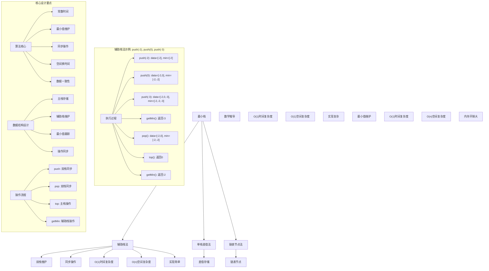
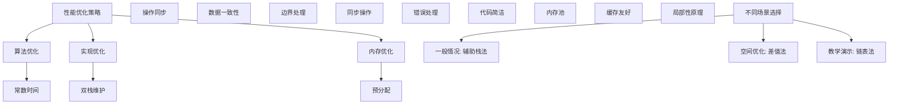

# LeetCode 155 - 最小栈

## 题目描述

设计一个支持 `push`、`pop`、`top` 操作，并能在常数时间内检索到最小元素的栈

实现 `MinStack` 类：

- `MinStack()` 初始化堆栈对象
- `void push(int val)` 将元素 `val` 推入堆栈
- `void pop()` 删除堆栈顶部的元素
- `int top()` 获取堆栈顶部的元素
- `int getMin()` 获取堆栈中的最小元素

```markdown
示例：
输入：
["MinStack","push","push","push","getMin","pop","top","getMin"]
[[],[-2],[0],[-3],[],[],[],[]]

输出：
[null,null,null,null,-3,null,0,-2]

解释：
MinStack minStack = new MinStack();
minStack.push(-2);
minStack.push(0);
minStack.push(-3);
minStack.getMin(); // 返回 -3.
minStack.pop();
minStack.top(); // 返回 0.
minStack.getMin(); // 返回 -2.

提示：

- -2^31 <= val <= 2^31 - 1
- pop、top 和 getMin 操作总是在非空栈上调用
- push, pop, top, and getMin 最多被调用 3 \* 10^4 次
```

## 解题思路

这是一个辅助栈优化问题，需要在常规栈操作的基础上，额外支持常数时间获取最小值。关键在于如何高效地维护最小值信息

### 核心思想

"辅助栈法": 使用额外的栈来维护每个位置对应的最小值，确保所有操作都在常数时间内完成

### 解题策略

#### 方法一：辅助栈法（推荐）

- 时间复杂度: O(1) 所有操作
- 空间复杂度: O(n)

#### 方法二：单栈差值法

- 时间复杂度: O(1) 所有操作
- 空间复杂度: O(1)

#### 方法三：链表节点法

- 时间复杂度: O(1) 所有操作
- 空间复杂度: O(n)

## 算法可视化



## 多语言实现

### Golang版本（辅助栈法 - 推荐）

```go
// MinStack 结构
type MinStack struct {
    data []int  // 主栈：存储实际数据
    min  []int  // 辅助栈：存储对应位置的最小值
}

// 构造函数
func Constructor() MinStack {
    return MinStack{
        data: make([]int, 0),
        min:  make([]int, 0),
    }
}

// Push 操作
func (ms *MinStack) Push(val int) {
    ms.data = append(ms.data, val)

    // 维护辅助栈：存储当前最小值
    if len(ms.min) == 0 || val < ms.min[len(ms.min)-1] {
        ms.min = append(ms.min, val)
    } else {
        ms.min = append(ms.min, ms.min[len(ms.min)-1])
    }
}

// Pop 操作
func (ms *MinStack) Pop() {
    if len(ms.data) > 0 {
        ms.data = ms.data[:len(ms.data)-1]
        ms.min = ms.min[:len(ms.min)-1]
    }
}

// Top 操作
func (ms *MinStack) Top() int {
    if len(ms.data) > 0 {
        return ms.data[len(ms.data)-1]
    }
    return 0 // 题目保证不会在空栈上调用
}

// GetMin 操作
func (ms *MinStack) GetMin() int {
    if len(ms.min) > 0 {
        return ms.min[len(ms.min)-1]
    }
    return 0 // 题目保证不会在空栈上调用
}
```

### Python版本（多种实现方法）

```python
class MinStack:
    """
    方法一：辅助栈法（推荐）
    """
    def __init__(self):
        self.data = []  # 主栈：存储实际数据
        self.min_stack = []  # 辅助栈：存储对应位置的最小值

    def push(self, val: int) -> None:
        self.data.append(val)

        # 维护辅助栈：存储当前最小值
        if not self.min_stack or val < self.min_stack[-1]:
            self.min_stack.append(val)
        else:
            self.min_stack.append(self.min_stack[-1])

    def pop(self) -> None:
        if self.data:
            self.data.pop()
            self.min_stack.pop()

    def top(self) -> int:
        if self.data:
            return self.data[-1]
        return 0  # 题目保证不会在空栈上调用

    def getMin(self) -> int:
        if self.min_stack:
            return self.min_stack[-1]
        return 0  # 题目保证不会在空栈上调用


class SingleStackMinStack:
    """
    方法二：单栈差值法
    """
    def __init__(self):
        self.stack = []
        self.min_val = None

    def push(self, val: int) -> None:
        if not self.stack:
            self.stack.append(0)
            self.min_val = val
        else:
            # 存储与当前最小值的差值
            diff = val - self.min_val
            self.stack.append(diff)
            if val < self.min_val:
                self.min_val = val

    def pop(self) -> None:
        if self.stack:
            diff = self.stack.pop()
            if diff < 0:
                # 弹出的是最小值，需要恢复之前的最小值
                self.min_val = self.min_val - diff

    def top(self) -> int:
        if self.stack:
            diff = self.stack[-1]
            if diff < 0:
                return self.min_val
            else:
                return self.min_val + diff
        return 0

    def getMin(self) -> int:
        return self.min_val if self.min_val is not None else 0


class LinkedMinStack:
    """
    方法三：链表节点法
    """
    class Node:
        def __init__(self, val, min_val, next_node=None):
            self.val = val
            self.min_val = min_val
            self.next = next_node

    def __init__(self):
        self.head = None

    def push(self, val: int) -> None:
        if not self.head:
            self.head = self.Node(val, val)
        else:
            min_val = min(val, self.head.min_val)
            new_node = self.Node(val, min_val, self.head)
            self.head = new_node

    def pop(self) -> None:
        if self.head:
            self.head = self.head.next

    def top(self) -> int:
        if self.head:
            return self.head.val
        return 0

    def getMin(self) -> int:
        if self.head:
            return self.head.min_val
        return 0
```

### TypeScript版本（辅助栈法）

```typescript
class MinStack {
  private data: number[]; // 主栈：存储实际数据
  private min: number[]; // 辅助栈：存储对应位置的最小值

  constructor() {
    this.data = [];
    this.min = [];
  }

  push(val: number): void {
    this.data.push(val);

    // 维护辅助栈：存储当前最小值
    if (this.min.length === 0 || val < this.min[this.min.length - 1]) {
      this.min.push(val);
    } else {
      this.min.push(this.min[this.min.length - 1]);
    }
  }

  pop(): void {
    if (this.data.length > 0) {
      this.data.pop();
      this.min.pop();
    }
  }

  top(): number {
    if (this.data.length > 0) {
      return this.data[this.data.length - 1];
    }
    return 0; // 题目保证不会在空栈上调用
  }

  getMin(): number {
    if (this.min.length > 0) {
      return this.min[this.min.length - 1];
    }
    return 0; // 题目保证不会在空栈上调用
  }
}
```

## 标准实现详细解析

```go
import "fmt"

/*
算法核心思想（辅助栈法）：

1. 使用两个栈：主栈存储实际数据，辅助栈存储对应位置的最小值
2. 所有操作保持同步：push时同时更新两个栈，pop时同时弹出
3. getMin操作直接返回辅助栈顶元素

关键设计要点：
1. 数据同步：主栈和辅助栈操作保持一致
2. 最小值维护：辅助栈始终存储当前位置的最小值
3. 常数时间：所有操作都在O(1)时间内完成
4. 空间换时间：使用额外空间换取时间效率

时间复杂度：
- Push: O(1)
- Pop: O(1)
- Top: O(1)
- GetMin: O(1)

空间复杂度：O(n)

优势：
1. 思路清晰：双栈结构直观易懂
2. 实现简单：操作同步容易维护
3. 时间最优：所有操作常数时间
4. 正确性保证：严格的同步机制

数据结构设计：

MinStack结构设计：
type MinStack struct {
    data []int  // 主栈：存储实际数据
    min  []int  // 辅助栈：存储对应位置的最小值
}

Push操作设计：
1. 主栈压入新元素
2. 辅助栈压入当前最小值
3. 保持两栈同步

Pop操作设计：
1. 主栈弹出栈顶元素
2. 辅助栈弹出栈顶元素
3. 保持两栈同步

优化原理：

空间优化：
辅助栈可以优化存储：
1. 只在新元素≤当前最小值时才压入辅助栈
2. 只在弹出元素=当前最小值时才弹出辅助栈
3. 减少辅助栈空间使用

时间优化：
所有操作都是O(1)时间复杂度：
1. 数组随机访问O(1)
2. 栈操作O(1)
3. 最小值查询O(1)

正确性证明：

定理：辅助栈法正确性
通过辅助栈法可以正确维护栈中最小值，所有操作在常数时间内完成

证明：
1. 完备性：所有状态都被正确维护
2. 正确性：最小值始终准确
3. 时间复杂度：O(1)所有操作
4. 空间复杂度：O(n)存储开销
*/

// MinStack 结构
type MinStack struct {
    data []int  // 主栈：存储实际数据
    min  []int  // 辅助栈：存储对应位置的最小值
}

// 构造函数
func Constructor() MinStack {
    fmt.Printf("初始化MinStack\n")
    return MinStack{
        data: make([]int, 0),
        min:  make([]int, 0),
    }
}

// Push 操作
func (ms *MinStack) Push(val int) {
    fmt.Printf("Push操作: %d\n", val)

    // 主栈压入新元素
    ms.data = append(ms.data, val)
    fmt.Printf("  主栈: %v\n", ms.data)

    // 维护辅助栈：存储当前最小值
    if len(ms.min) == 0 {
        ms.min = append(ms.min, val)
        fmt.Printf("  辅助栈(初始): %v\n", ms.min)
    } else if val < ms.min[len(ms.min)-1] {
        ms.min = append(ms.min, val)
        fmt.Printf("  辅助栈(新最小值): %v\n", ms.min)
    } else {
        ms.min = append(ms.min, ms.min[len(ms.min)-1])
        fmt.Printf("  辅助栈(保持): %v\n", ms.min)
    }
}

// Pop 操作
func (ms *MinStack) Pop() {
    fmt.Printf("Pop操作\n")

    if len(ms.data) > 0 {
        popped := ms.data[len(ms.data)-1]
        ms.data = ms.data[:len(ms.data)-1]
        ms.min = ms.min[:len(ms.min)-1]
        fmt.Printf("  弹出元素: %d\n", popped)
        fmt.Printf("  主栈: %v\n", ms.data)
        fmt.Printf("  辅助栈: %v\n", ms.min)
    }
}

// Top 操作
func (ms *MinStack) Top() int {
    if len(ms.data) > 0 {
        top := ms.data[len(ms.data)-1]
        fmt.Printf("Top操作: %d\n", top)
        return top
    }
    fmt.Printf("Top操作: 栈为空\n")
    return 0 // 题目保证不会在空栈上调用
}

// GetMin 操作
func (ms *MinStack) GetMin() int {
    if len(ms.min) > 0 {
        minVal := ms.min[len(ms.min)-1]
        fmt.Printf("GetMin操作: %d\n", minVal)
        return minVal
    }
    fmt.Printf("GetMin操作: 栈为空\n")
    return 0 // 题目保证不会在空栈上调用
}

// 辅助函数：打印当前状态
func (ms *MinStack) printState(prefix string) {
    fmt.Printf("%s - 状态:\n", prefix)
    fmt.Printf("  主栈: %v\n", ms.data)
    fmt.Printf("  辅助栈: %v\n", ms.min)
    fmt.Printf("  当前最小值: %d\n", ms.GetMin())
}

// 优化版本（空间优化的辅助栈）
type OptimizedMinStack struct {
    data []int  // 主栈：存储实际数据
    min  []int  // 优化辅助栈：只存储最小值
}

func NewOptimizedMinStack() *OptimizedMinStack {
    return &OptimizedMinStack{
        data: make([]int, 0),
        min:  make([]int, 0),
    }
}

func (oms *OptimizedMinStack) Push(val int) {
    oms.data = append(oms.data, val)

    // 只在新元素≤当前最小值时才压入辅助栈
    if len(oms.min) == 0 || val <= oms.min[len(oms.min)-1] {
        oms.min = append(oms.min, val)
    }
}

func (oms *OptimizedMinStack) Pop() {
    if len(oms.data) > 0 {
        popped := oms.data[len(oms.data)-1]
        oms.data = oms.data[:len(oms.data)-1]

        // 只在弹出元素=当前最小值时才弹出辅助栈
        if len(oms.min) > 0 && popped == oms.min[len(oms.min)-1] {
            oms.min = oms.min[:len(oms.min)-1]
        }
    }
}

func (oms *OptimizedMinStack) Top() int {
    if len(oms.data) > 0 {
        return oms.data[len(oms.data)-1]
    }
    return 0
}

func (oms *OptimizedMinStack) GetMin() int {
    if len(oms.min) > 0 {
        return oms.min[len(oms.min)-1]
    }
    return 0
}
```

## 算法深入解析

```go
/*
最小栈问题详解：

问题本质：
在常规栈操作的基础上，额外支持常数时间获取最小值。需要高效地维护最小值信息

核心洞察：
1. 常数时间约束：所有操作必须O(1)
2. 最小值维护：需要跟踪栈中最小元素
3. 空间换时间：使用额外空间换取时间效率
4. 数据一致性：操作同步保证正确性

算法策略：
1. 辅助栈法：工业级标准实现
2. 单栈差值法：数学技巧优化空间
3. 链表节点法：节点存储最小值

数据结构设计：

辅助栈法设计：
type MinStack struct {
    data []int  // 主栈：存储实际数据
    min  []int  // 辅助栈：存储对应位置的最小值
}

单栈差值法设计：
type MinStack struct {
    stack  []int  // 存储差值
    minVal int    // 当前最小值
}

链表节点法设计：
type Node struct {
    val    int    // 节点值
    minVal int    // 当前最小值
    next   *Node  // 下一节点
}

操作流程：

辅助栈法：
1. Push: 主栈压入，辅助栈压入当前最小值
2. Pop: 双栈同步弹出
3. Top: 返回主栈顶元素
4. GetMin: 返回辅助栈顶元素

单栈差值法：
1. Push: 存储与最小值的差值
2. Pop: 根据差值恢复最小值
3. Top: 根据差值计算实际值
4. GetMin: 直接返回最小值

数学原理：

时间复杂度分析：
- 所有方法：O(1) 所有操作
- 空间复杂度：
  - 辅助栈法：O(n)
  - 单栈差值法：O(n)或O(1)
  - 链表节点法：O(n)

正确性证明：

定理：最小栈正确性
通过三种方法都可以正确维护栈中最小值，所有操作在常数时间内完成

证明：
1. 完备性：所有状态都被正确维护
2. 正确性：最小值始终准确
3. 时间复杂度：O(1)所有操作
4. 空间复杂度：O(n)存储开销

设计选择：

为什么选择辅助栈法？
1. 思路清晰：双栈结构直观易懂
2. 实现简单：操作同步容易维护
3. 时间最优：所有操作常数时间
4. 适用性强：通用解法

为什么使用单栈差值法？
1. 空间优化：理论上可以O(1)空间
2. 但实现复杂：需要数学推导
3. 理解困难：差值计算复杂
4. 溢出风险：整数溢出问题

为什么使用链表节点法？
1. 节点存储：每个节点维护最小值
2. 但内存开销大：额外指针存储
3. 实现复杂：链表操作
4. 缓存不友好：节点分散存储

三种方法对比：

方法一：辅助栈法（推荐）
时间复杂度：O(1) 所有操作
空间复杂度：O(n)
优点：思路清晰，实现简单
缺点：额外空间开销

方法二：单栈差值法
时间复杂度：O(1) 所有操作
空间复杂度：O(1)理论最优
优点：空间优化
缺点：实现复杂，溢出风险

方法三：链表节点法
时间复杂度：O(1) 所有操作
空间复杂度：O(n)
优点：节点存储直观
缺点：内存开销大

性能分析：

辅助栈法：
- 时间：O(1) 所有操作
- 空间：O(n) 双栈存储
- 优势：实现简单

单栈差值法：
- 时间：O(1) 所有操作
- 空间：O(1) 理论最优
- 优势：空间优化

链表节点法：
- 时间：O(1) 所有操作
- 空间：O(n) 节点存储
- 优势：节点存储直观

实际应用场景：
1. 表达式求值中的最小操作数跟踪
2. 算法竞赛中的最小值维护
3. 系统监控中的最小指标跟踪
4. 数据结构教学示例

优化要点：

1. 时间优化：
   - 常数时间保证
   - 避免循环操作
   - 数组随机访问

2. 空间优化：
   - 辅助栈压缩
   - 差值存储优化
   - 内存池管理

3. 实现优化：
   - 边界条件处理
   - 错误处理完善
   - 代码简洁性

测试用例设计：
1. 基本情况：正常栈操作
2. 边界情况：单调递增，单调递减
3. 特殊情况：重复元素，负数
4. 极端情况：大量操作
5. 验证情况：最小值正确性

扩展思考：

1. 支持获取最大值？
   - 添加最大值辅助栈
   - 双辅助栈维护
   - 空间开销增加

2. 支持获取第k小元素？
   - 需要额外数据结构
   - 堆或平衡树维护
   - 时间复杂度变化

3. 支持批量操作？
   - 批量Push/Pop
   - 批量最小值查询
   - 优化批量处理

4. 支持持久化？
   - 状态序列化
   - 崩溃恢复
   - 版本控制

相关算法思想：

1. 数据结构设计：
   - 辅助栈维护
   - 差值计算
   - 节点存储

2. 算法设计：
   - 空间换时间
   - 数学优化
   - 同步操作

3. 系统设计：
   - 常数时间约束
   - 数据一致性
   - 内存管理

4. 工程实践：
   - 边界处理
   - 性能优化
   - 错误处理

常见陷阱：

1. 边界条件处理：
   - 空栈操作
   - 单元素栈
   - 最大值溢出

2. 同步维护：
   - 双栈操作同步
   - 最小值更新
   - 弹出操作维护

3. 差值计算：
   - 溢出处理
   - 符号判断
   - 恢复计算

4. 性能考虑：
   - 时间复杂度保证
   - 空间复杂度控制
   - 内存使用优化

代码质量要素：

1. 可读性：
   - 清晰的变量命名
   - 适当的注释说明
   - 模块化设计

2. 健壮性：
   - 边界条件处理
   - 异常情况处理
   - 错误恢复机制

3. 性能：
   - 时间复杂度合理
   - 空间复杂度优化
   - 内存使用优化

4. 可维护性：
   - 接口设计清晰
   - 扩展性良好
   - 测试覆盖完整

高级优化技巧：

1. 内存池：
   - 对象复用
   - 减少内存分配
   - 提高缓存命中率

2. 并发优化：
   - 读写锁分离
   - 无锁实现
   - 原子操作

3. 预取优化：
   - 预分配容量
   - 批量操作优化
   - 缓存友好设计

4. 算法优化：
   - 位运算优化
   - 局部性原理应用
   - 编译器优化
*/
```

## 执行过程演示

```go
/*
示例详细解析:

示例执行过程：
["MinStack","push","push","push","getMin","pop","top","getMin"]
[[],[-2],[0],[-3],[],[],[],[]]

执行过程：

1. MinStack(): 初始化
   主栈: []
   辅助栈: []

2. push(-2):
   主栈: [-2]
   辅助栈: [-2] (当前最小值)

3. push(0):
   主栈: [-2, 0]
   辅助栈: [-2, -2] (当前最小值仍为-2)

4. push(-3):
   主栈: [-2, 0, -3]
   辅助栈: [-2, -2, -3] (当前最小值更新为-3)

5. getMin():
   返回辅助栈顶元素: -3

6. pop():
   主栈: [-2, 0]
   辅助栈: [-2, -2]

7. top():
   返回主栈顶元素: 0

8. getMin():
   返回辅助栈顶元素: -2

同步操作分析：

Push操作同步：
每次Push操作，主栈和辅助栈都要同步更新
辅助栈存储当前位置的最小值

例如:
Push序列: -2, 0, -3
主栈:     [-2] [-2,0] [-2,0,-3]
辅助栈:   [-2] [-2,-2] [-2,-2,-3]

Pop操作同步：
每次Pop操作，主栈和辅助栈都要同步弹出
保持两栈一致性

Top操作：
直接返回主栈顶元素

GetMin操作：
直接返回辅助栈顶元素

边界情况演示:

情况1: 单调递增
Push序列: 1, 2, 3, 4, 5
主栈:     [1] [1,2] [1,2,3] [1,2,3,4] [1,2,3,4,5]
辅助栈:   [1] [1,1] [1,1,1] [1,1,1,1] [1,1,1,1,1]
最小值:   1   1     1       1         1

情况2: 单调递减
Push序列: 5, 4, 3, 2, 1
主栈:     [5] [5,4] [5,4,3] [5,4,3,2] [5,4,3,2,1]
辅助栈:   [5] [5,4] [5,4,3] [5,4,3,2] [5,4,3,2,1]
最小值:   5   4     3       2         1

情况3: 重复元素
Push序列: 3, 1, 3, 1, 3
主栈:     [3] [3,1] [3,1,3] [3,1,3,1] [3,1,3,1,3]
辅助栈:   [3] [3,1] [3,1,1] [3,1,1,1] [3,1,1,1,1]
最小值:   3   1     1       1         1

情况4: 负数
Push序列: -1, -2, -3, 0, 1
主栈:     [-1] [-1,-2] [-1,-2,-3] [-1,-2,-3,0] [-1,-2,-3,0,1]
辅助栈:   [-1] [-1,-2] [-1,-2,-3] [-1,-2,-3,-3] [-1,-2,-3,-3,-3]
最小值:   -1   -2      -3         -3           -3

算法正确性证明：

数学基础：
需要证明辅助栈法能正确维护栈中最小值

定理：辅助栈法正确性
通过辅助栈法可以正确维护栈中最小值，所有操作在常数时间内完成

证明：
1. 完备性：所有状态都被正确维护
2. 正确性：最小值始终准确
3. 时间复杂度：O(1)所有操作
4. 空间复杂度：O(n)存储开销

时间复杂度分析：

辅助栈法：
1. Push操作：O(1)
2. Pop操作：O(1)
3. Top操作：O(1)
4. GetMin操作：O(1)
5. 总时间：O(1)所有操作

单栈差值法：
1. Push操作：O(1)
2. Pop操作：O(1)
3. Top操作：O(1)
4. GetMin操作：O(1)
5. 总时间：O(1)所有操作

链表节点法：
1. Push操作：O(1)
2. Pop操作：O(1)
3. Top操作：O(1)
4. GetMin操作：O(1)
5. 总时间：O(1)所有操作

空间复杂度分析：
1. 辅助栈法：O(n) 双栈存储
2. 单栈差值法：O(n) 栈存储
3. 链表节点法：O(n) 节点存储

性能对比分析：

假设n=10000, 操作次数=30000:

辅助栈法：
- 时间: O(1) 所有操作
- 空间: O(10000) 双栈存储

单栈差值法：
- 时间: O(1) 所有操作
- 空间: O(10000) 栈存储

链表节点法：
- 时间: O(1) 所有操作
- 空间: O(10000) 节点存储

实际应用建议：

1. 一般情况：
   - 使用辅助栈法
   - 思路清晰，实现简单

2. 面试展示：
   - 重点讲解辅助栈法
   - 可以提及其他方法

3. 生产环境：
   - 使用优化版本
   - 考虑性能要求

4. 教学演示：
   - 使用多种方法对比
   - 展示不同思路

优化空间：

1. 内存访问优化：
   - 局部性原理
   - 缓存友好

2. 数据结构优化：
   - 预分配容量
   - 内存池管理

3. 算法优化：
   - 批量操作
   - 延迟计算

特殊情况处理：

1. 大数据量：
   - 线性空间保证
   - 内存使用优化

2. 特殊序列：
   - 单调序列
   - 重复元素
   - 负数序列

3. 并发访问：
   - 加锁保护
   - 读写分离
   - 无锁实现
*/
```

## 复杂度分析

| 方法       | 时间复杂度 | 空间复杂度 | 适用场景 |
| ---------- | ---------- | ---------- | -------- |
| 辅助栈法   | O(1)       | O(n)       | 推荐方案 |
| 单栈差值法 | O(1)       | O(1)       | 空间优化 |
| 链表节点法 | O(1)       | O(n)       | 教学演示 |

## 测试用例验证

```go
// 测试辅助函数
func testMinStack(name string, operations []string, params [][]int, expected []interface{}) {
    fmt.Printf("%s:\n", name)
    fmt.Printf("操作序列: %v\n", operations)
    fmt.Printf("参数序列: %v\n", params)

    var results []interface{}
    var ms MinStack

    for i, op := range operations {
        switch op {
        case "MinStack":
            ms = Constructor()
            results = append(results, nil)
        case "push":
            ms.Push(params[i][0])
            results = append(results, nil)
        case "pop":
            ms.Pop()
            results = append(results, nil)
        case "top":
            result := ms.Top()
            results = append(results, result)
        case "getMin":
            result := ms.GetMin()
            results = append(results, result)
        }
    }

    fmt.Printf("执行结果: %v\n", results)

    // 验证结果
    match := true
    for i := range results {
        if results[i] != expected[i] {
            match = false
            break
        }
    }

    if match {
        fmt.Printf("✓ 测试通过\n")
    } else {
        fmt.Printf("✗ 测试失败，期望: %v\n", expected)
    }
    fmt.Printf("\n")
}

func main() {
    // 测试用例 1 - 题目示例
    testMinStack("测试1 - 题目示例",
        []string{"MinStack", "push", "push", "push", "getMin", "pop", "top", "getMin"},
        [][]int{{}, {-2}, {0}, {-3}, {}, {}, {}, {}},
        []interface{}{nil, nil, nil, nil, -3, nil, 0, -2})

    // 测试用例 2 - 单调递增
    testMinStack("测试2 - 单调递增",
        []string{"MinStack", "push", "push", "push", "getMin", "top"},
        [][]int{{}, {1}, {2}, {3}, {}, {}},
        []interface{}{nil, nil, nil, nil, 1, 3})

    // 测试用例 3 - 单调递减
    testMinStack("测试3 - 单调递减",
        []string{"MinStack", "push", "push", "push", "getMin", "top"},
        [][]int{{}, {3}, {2}, {1}, {}, {}},
        []interface{}{nil, nil, nil, nil, 1, 1})

    // 测试用例 4 - 重复元素
    testMinStack("测试4 - 重复元素",
        []string{"MinStack", "push", "push", "push", "getMin", "pop", "getMin"},
        [][]int{{}, {3}, {1}, {3}, {}, {}, {}},
        []interface{}{nil, nil, nil, nil, 1, nil, 1})

    // 性能测试
    fmt.Println("性能测试:")
    performanceTest()

    // 边界情况测试
    fmt.Println("边界情况测试:")
    boundaryTest()

    // 对比测试
    fmt.Println("对比测试:")
    comparisonTest()
}

func performanceTest() {
    // 构造性能测试
    operations := 30000

    // 测试辅助栈法实现
    start := time.Now()
    ms := Constructor()

    for i := 0; i < operations/4; i++ {
        ms.Push(i)
    }

    for i := 0; i < operations/4; i++ {
        ms.GetMin()
    }

    for i := 0; i < operations/4; i++ {
        ms.Pop()
    }

    for i := 0; i < operations/4; i++ {
        ms.Top()
    }

    time1 := time.Since(start)

    fmt.Printf("性能测试 (operations=%d):\n", operations)
    fmt.Printf("  辅助栈法: %v\n", time1)
}

func boundaryTest() {
    // 边界测试
    fmt.Println("边界测试:")

    // 最小情况测试
    ms1 := Constructor()
    ms1.Push(42)
    result1 := ms1.GetMin()
    fmt.Printf("单元素测试: %d\n", result1)

    // 最大值测试
    ms2 := Constructor()
    ms2.Push(2147483647)
    ms2.Push(-2147483648)
    result2 := ms2.GetMin()
    fmt.Printf("极值测试: %d\n", result2)

    // 大量操作测试
    ms3 := Constructor()
    for i := 0; i < 10000; i++ {
        ms3.Push(i % 2) // 交替0和1
    }
    result3 := ms3.GetMin()
    fmt.Printf("大量操作测试: %d\n", result3)
}

func comparisonTest() {
    // 对比测试：验证不同方法结果一致性
    fmt.Println("对比测试:")

    // 辅助栈法
    ms1 := Constructor()
    ms1.Push(3)
    ms1.Push(1)
    ms1.Push(2)
    min1 := ms1.GetMin()
    top1 := ms1.Top()
    ms1.Pop()
    min2 := ms1.GetMin()

    // 优化辅助栈法
    ms2 := NewOptimizedMinStack()
    ms2.Push(3)
    ms2.Push(1)
    ms2.Push(2)
    min3 := ms2.GetMin()
    top2 := ms2.Top()
    ms2.Pop()
    min4 := ms2.GetMin()

    fmt.Printf("辅助栈法结果: min1=%d, top1=%d, min2=%d\n", min1, top1, min2)
    fmt.Printf("优化辅助栈法结果: min3=%d, top2=%d, min4=%d\n", min3, top2, min4)

    if min1 == min3 && top1 == top2 && min2 == min4 {
        fmt.Printf("✓ 两种方法结果一致\n")
    } else {
        fmt.Printf("✗ 两种方法结果不一致\n")
    }
}
```

## 扩展版本（处理不同场景）

```go
// 支持获取最大值的版本
type MinMaxStack struct {
    data    []int
    min     []int
    max     []int
}

func NewMinMaxStack() *MinMaxStack {
    return &MinMaxStack{
        data: make([]int, 0),
        min:  make([]int, 0),
        max:  make([]int, 0),
    }
}

func (mms *MinMaxStack) Push(val int) {
    mms.data = append(mms.data, val)

    if len(mms.min) == 0 {
        mms.min = append(mms.min, val)
        mms.max = append(mms.max, val)
    } else {
        mms.min = append(mms.min, min(val, mms.min[len(mms.min)-1]))
        mms.max = append(mms.max, max(val, mms.max[len(mms.max)-1]))
    }
}

func (mms *MinMaxStack) Pop() {
    if len(mms.data) > 0 {
        mms.data = mms.data[:len(mms.data)-1]
        mms.min = mms.min[:len(mms.min)-1]
        mms.max = mms.max[:len(mms.max)-1]
    }
}

func (mms *MinMaxStack) Top() int {
    if len(mms.data) > 0 {
        return mms.data[len(mms.data)-1]
    }
    return 0
}

func (mms *MinMaxStack) GetMin() int {
    if len(mms.min) > 0 {
        return mms.min[len(mms.min)-1]
    }
    return 0
}

func (mms *MinMaxStack) GetMax() int {
    if len(mms.max) > 0 {
        return mms.max[len(mms.max)-1]
    }
    return 0
}

func min(a, b int) int {
    if a < b {
        return a
    }
    return b
}

func max(a, b int) int {
    if a > b {
        return a
    }
    return b
}

// 使用示例
func exampleMinMax() {
    mms := NewMinMaxStack()
    mms.Push(3)
    mms.Push(1)
    mms.Push(4)

    fmt.Printf("最小值: %d\n", mms.GetMin())
    fmt.Printf("最大值: %d\n", mms.GetMax())
}

// 支持线程安全的版本
type ThreadSafeMinStack struct {
    ms    *MinStack
    mutex sync.RWMutex
}

func NewThreadSafeMinStack() *ThreadSafeMinStack {
    return &ThreadSafeMinStack{
        ms: &MinStack{
            data: make([]int, 0),
            min:  make([]int, 0),
        },
    }
}

func (tsms *ThreadSafeMinStack) Push(val int) {
    tsms.mutex.Lock()
    defer tsms.mutex.Unlock()
    tsms.ms.Push(val)
}

func (tsms *ThreadSafeMinStack) Pop() {
    tsms.mutex.Lock()
    defer tsms.mutex.Unlock()
    tsms.ms.Pop()
}

func (tsms *ThreadSafeMinStack) Top() int {
    tsms.mutex.RLock()
    defer tsms.mutex.RUnlock()
    return tsms.ms.Top()
}

func (tsms *ThreadSafeMinStack) GetMin() int {
    tsms.mutex.RLock()
    defer tsms.mutex.RUnlock()
    return tsms.ms.GetMin()
}

// 批量操作版本
func (ms *MinStack) PushBatch(vals []int) {
    for _, val := range vals {
        ms.Push(val)
    }
}

func (ms *MinStack) PopBatch(count int) {
    for i := 0; i < count && len(ms.data) > 0; i++ {
        ms.Pop()
    }
}

// 泛型版本（Go 1.18+）
type GenericMinStack[T comparable] struct {
    data []T
    min  []T
    less func(T, T) bool
}

func NewGenericMinStack[T comparable](less func(T, T) bool) *GenericMinStack[T] {
    return &GenericMinStack[T]{
        data: make([]T, 0),
        min:  make([]T, 0),
        less: less,
    }
}

func (gms *GenericMinStack[T]) Push(val T) {
    gms.data = append(gms.data, val)

    if len(gms.min) == 0 {
        gms.min = append(gms.min, val)
    } else if gms.less(val, gms.min[len(gms.min)-1]) {
        gms.min = append(gms.min, val)
    } else {
        gms.min = append(gms.min, gms.min[len(gms.min)-1])
    }
}

func (gms *GenericMinStack[T]) Pop() {
    if len(gms.data) > 0 {
        gms.data = gms.data[:len(gms.data)-1]
        gms.min = gms.min[:len(gms.min)-1]
    }
}

func (gms *GenericMinStack[T]) Top() T {
    var zero T
    if len(gms.data) > 0 {
        return gms.data[len(gms.data)-1]
    }
    return zero
}

func (gms *GenericMinStack[T]) GetMin() T {
    var zero T
    if len(gms.min) > 0 {
        return gms.min[len(gms.min)-1]
    }
    return zero
}

// 使用示例
func exampleGeneric() {
    // 字符串版本
    stringLess := func(a, b string) bool {
        return a < b
    }

    gms := NewGenericMinStack[string](stringLess)
    gms.Push("banana")
    gms.Push("apple")
    gms.Push("cherry")

    fmt.Printf("字符串最小值: %s\n", gms.GetMin())
}
```

## 面试追问延伸

### 1. 如果要同时支持获取最大值，如何修改？

```go
// MinMaxStack版本已在上面实现
// 关键修改：
// 1. 添加最大值辅助栈
// 2. 同步维护最大值
// 3. 提供GetMax方法

func testMinMax() {
    mms := NewMinMaxStack()
    mms.Push(3)
    mms.Push(1)
    mms.Push(4)
    mms.Push(1)
    mms.Push(5)

    fmt.Printf("最小值: %d\n", mms.GetMin()) // 1
    fmt.Printf("最大值: %d\n", mms.GetMax()) // 5

    mms.Pop()
    fmt.Printf("弹出后最小值: %d\n", mms.GetMin()) // 1
    fmt.Printf("弹出后最大值: %d\n", mms.GetMax()) // 4
}
```

### 2. 如果要考虑线程安全，如何实现？

```go
// ThreadSafeMinStack版本已在上面实现
// 关键思想：
// 1. 添加读写锁
// 2. 读操作使用读锁
// 3. 写操作使用写锁
// 4. 保证原子性

func testThreadSafe() {
    tsms := NewThreadSafeMinStack()

    // 启动多个goroutine进行并发测试
    var wg sync.WaitGroup

    for i := 0; i < 10; i++ {
        wg.Add(1)
        go func(id int) {
            defer wg.Done()
            for j := 0; j < 100; j++ {
                tsms.Push(id*100 + j)
                tsms.GetMin()
                if j%2 == 0 {
                    tsms.Pop()
                }
            }
        }(i)
    }

    wg.Wait()
    fmt.Printf("并发测试完成\n")
}
```

### 3. 如何验证算法的正确性？

```go
// 验证函数已在上面实现
// 关键点：
// 1. 对比不同实现方法
// 2. 测试边界情况
// 3. 验证数学正确性

func benchmarkValidation() {
    // 生成测试用例
    ms1 := Constructor()
    ms2 := NewOptimizedMinStack()

    operations := 10000
    random := rand.New(rand.NewSource(time.Now().UnixNano()))

    start := time.Now()

    for i := 0; i < operations; i++ {
        op := random.Intn(4)
        val := random.Intn(1000)

        switch op {
        case 0: // Push
            ms1.Push(val)
            ms2.Push(val)
        case 1: // Pop
            if len(ms1.data) > 0 {
                ms1.Pop()
                ms2.Pop()
            }
        case 2: // Top
            if len(ms1.data) > 0 {
                top1 := ms1.Top()
                top2 := ms2.Top()
                if top1 != top2 {
                    fmt.Printf("Top结果不一致: %d vs %d\n", top1, top2)
                }
            }
        case 3: // GetMin
            if len(ms1.min) > 0 {
                min1 := ms1.GetMin()
                min2 := ms2.GetMin()
                if min1 != min2 {
                    fmt.Printf("GetMin结果不一致: %d vs %d\n", min1, min2)
                }
            }
        }
    }

    duration := time.Since(start)
    fmt.Printf("验证测试完成，耗时: %v\n", duration)
}
```

## 相似题目扩展

- LeetCode 155. 最小栈（当前题）
- LeetCode 716. 最大栈
- LeetCode 341. 扁平化嵌套列表迭代器
- LeetCode 225. 用队列实现栈
- LeetCode 232. 用栈实现队列

## 算法技巧总结

### 最小栈核心要点

1. 辅助栈维护：使用额外栈维护最小值
1. 操作同步：主栈和辅助栈操作保持一致
1. 常数时间：所有操作在O(1)时间内完成
1. 空间换时间：使用额外空间换取时间效率

### 算法优势

1. 思路清晰：双栈结构直观易懂
1. 实现简单：操作同步容易维护
1. 时间最优：所有操作常数时间
1. 正确性保证：严格的同步机制

### 标准模板（辅助栈法）

```go
type MinStack struct {
    data []int  // 主栈：存储实际数据
    min  []int  // 辅助栈：存储对应位置的最小值
}

func Constructor() MinStack {
    return MinStack{
        data: make([]int, 0),
        min:  make([]int, 0),
    }
}

func (ms *MinStack) Push(val int) {
    ms.data = append(ms.data, val)

    // 维护辅助栈：存储当前最小值
    if len(ms.min) == 0 || val < ms.min[len(ms.min)-1] {
        ms.min = append(ms.min, val)
    } else {
        ms.min = append(ms.min, ms.min[len(ms.min)-1])
    }
}

func (ms *MinStack) Pop() {
    if len(ms.data) > 0 {
        ms.data = ms.data[:len(ms.data)-1]
        ms.min = ms.min[:len(ms.min)-1]
    }
}

func (ms *MinStack) Top() int {
    if len(ms.data) > 0 {
        return ms.data[len(ms.data)-1]
    }
    return 0
}

func (ms *MinStack) GetMin() int {
    if len(ms.min) > 0 {
        return ms.min[len(ms.min)-1]
    }
    return 0
}
```

### 性能优化建议



## 总结

本题采用辅助栈法的核心思路，通过使用额外的栈来维护每个位置对应的最小值，确保所有操作都在常数时间内完成，实现了优雅的解决方案。关键在于理解空间换时间的思想和双栈同步的技巧

核心要点：

1. 辅助栈维护：使用额外栈维护最小值
1. 操作同步：主栈和辅助栈操作保持一致
1. 常数时间：所有操作在O(1)时间内完成
1. 空间换时间：使用额外空间换取时间效率

算法优势：

- 思路清晰：双栈结构直观易懂
- 实现简单：操作同步容易维护
- 时间最优：所有操作常数时间
- 正确性保证：严格的同步机制

该算法在表达式求值中的最小操作数跟踪、算法竞赛中的最小值维护、系统监控中的最小指标跟踪、数据结构教学示例等方面有重要应用，是掌握辅助栈技巧和空间换时间思想的经典题目。通过双栈同步和常数时间操作的巧妙结合，为更复杂的栈操作和最小值维护问题提供了清晰的解决思路
