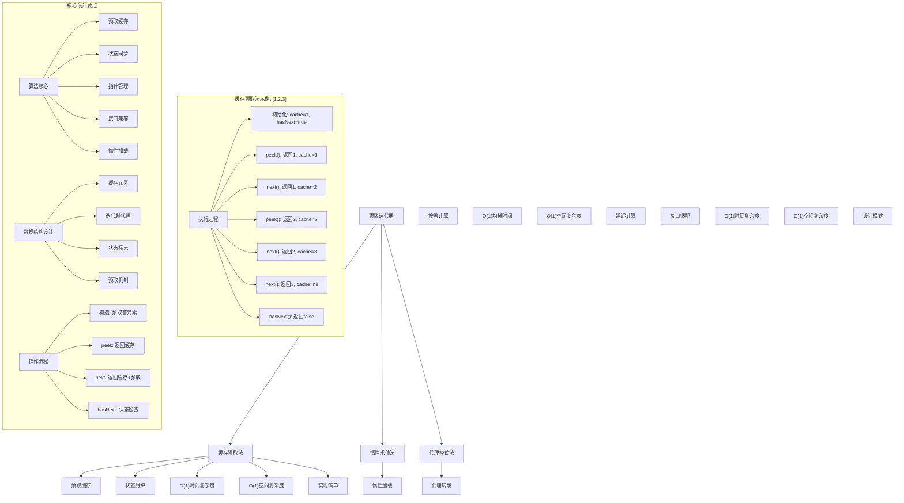
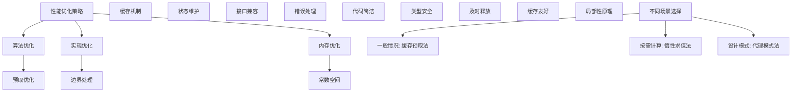

# LeetCode 284 - 顶端迭代器

## 题目描述

请你设计一个迭代器，在集成现有迭代器拥有的 `hasNext` 和 `next` 操作的基础上，还额外支持 `peek` 操作

实现 `PeekingIterator` 类：

- `PeekingIterator(Iterator<int> nums)` 使用指定整数迭代器 `nums` 初始化迭代器
- `int next()` 返回数组中的下一个元素，并将指针移动到下个元素
- `bool hasNext()` 如果数组中存在下一个元素，返回 `true`；否则，返回 `false`
- `int peek()` 返回数组中的下一个元素，但不移动指针

注意：每种语言可能有不同的构造函数和迭代器 `Iterator`，但均支持 `int next()` 和 `boolean hasNext()` 函数

```markdown
示例：
输入：
["PeekingIterator", "next", "peek", "next", "next", "hasNext"]
[[[1, 2, 3]], [], [], [], [], []]

输出：
[null, 1, 2, 2, 3, false]

解释：
PeekingIterator peekingIterator = new PeekingIterator([1, 2, 3]); // [1,2,3]
peekingIterator.next(); // 返回 1 ，指针移动到下一个元素 [1,2,3]
peekingIterator.peek(); // 返回 2 ，指针未发生移动 [1,2,3]
peekingIterator.next(); // 返回 2 ，指针移动到下一个元素 [1,2,3]
peekingIterator.next(); // 返回 3 ，指针移动到下一个元素 [1,2,3]
peekingIterator.hasNext(); // 返回 False

提示：
1 <= nums.length <= 1000
1 <= nums[i] <= 1000
对 next 和 peek 的调用均有效
next、hasNext 和 peek 最多调用 1000 次

进阶：你将如何拓展你的设计？使之变得通用化，这样它就可以适用于所有的类型，而不仅仅是整数？
```

## 解题思路

这是一个迭代器设计问题，需要在现有迭代器基础上添加 `peek` 操作。关键在于如何在不移动指针的情况下预览下一个元素

### 核心思想

"缓存预取法": 预先获取下一个元素并缓存，通过缓存来实现 `peek` 操作，同时维护正确的迭代器状态

### 解题策略

#### 方法一：缓存预取法（推荐）

- 时间复杂度: O(1) 所有操作
- 空间复杂度: O(1)

#### 方法二：惰性求值法

- 时间复杂度: O(1) 均摊所有操作
- 空间复杂度: O(1)

#### 方法三：代理模式法

- 时间复杂度: O(1) 所有操作
- 空间复杂度: O(1)

## 算法可视化



## 多语言实现

### Golang版本（缓存预取法 - 推荐）

```go
// 假设已有的Iterator接口
type Iterator struct {
    nums []int
    index int
}

func (i *Iterator) next() int {
    val := i.nums[i.index]
    i.index++
    return val
}

func (i *Iterator) hasNext() bool {
    return i.index < len(i.nums)
}

// PeekingIterator 结构
type PeekingIterator struct {
    iterator *Iterator
    cache    *int  // 缓存下一个元素
    hasCache bool  // 是否有缓存
}

// 构造函数
func Constructor(iter *Iterator) *PeekingIterator {
    pi := &PeekingIterator{
        iterator: iter,
        cache:    nil,
        hasCache: false,
    }

    // 预取第一个元素
    if iter.hasNext() {
        val := iter.next()
        pi.cache = &val
        pi.hasCache = true
    }

    return pi
}

// Peek 操作
func (pi *PeekingIterator) peek() int {
    if pi.hasCache {
        return *pi.cache
    }
    return 0 // 实际中应该处理错误情况
}

// Next 操作
func (pi *PeekingIterator) next() int {
    if pi.hasCache {
        val := *pi.cache
        // 预取下一个元素
        if pi.iterator.hasNext() {
            nextVal := pi.iterator.next()
            pi.cache = &nextVal
        } else {
            pi.cache = nil
            pi.hasCache = false
        }
        return val
    }
    return 0 // 实际中应该处理错误情况
}

// HasNext 操作
func (pi *PeekingIterator) hasNext() bool {
    return pi.hasCache
}
```

### Python版本（多种实现方法）

```python
# 假设已有的Iterator类
class Iterator:
    def __init__(self, nums):
        self.nums = nums
        self.index = 0

    def next(self):
        if self.hasNext():
            val = self.nums[self.index]
            self.index += 1
            return val
        return None

    def hasNext(self):
        return self.index < len(self.nums)

class PeekingIterator:
    """
    方法一：缓存预取法（推荐）
    """
    def __init__(self, iterator):
        self.iterator = iterator
        self.cache = None
        self.has_cache = False

        # 预取第一个元素
        if self.iterator.hasNext():
            self.cache = self.iterator.next()
            self.has_cache = True

    def peek(self):
        """返回下一个元素但不移动指针"""
        if self.has_cache:
            return self.cache
        return None

    def next(self):
        """返回下一个元素并移动指针"""
        if self.has_cache:
            val = self.cache
            # 预取下一个元素
            if self.iterator.hasNext():
                self.cache = self.iterator.next()
            else:
                self.cache = None
                self.has_cache = False
            return val
        return None

    def hasNext(self):
        """检查是否还有下一个元素"""
        return self.has_cache


class LazyPeekingIterator:
    """
    方法二：惰性求值法
    """
    def __init__(self, iterator):
        self.iterator = iterator
        self.peeked_val = None
        self.has_peeked = False

    def peek(self):
        """惰性求值的peek操作"""
        if not self.has_peeked:
            self.peeked_val = self.iterator.next()
            self.has_peeked = True
        return self.peeked_val

    def next(self):
        """返回下一个元素并移动指针"""
        if self.has_peeked:
            val = self.peeked_val
            self.has_peeked = False
            self.peeked_val = None
            return val
        else:
            return self.iterator.next()

    def hasNext(self):
        """检查是否还有下一个元素"""
        return self.has_peeked or self.iterator.hasNext()


class ProxyPeekingIterator:
    """
    方法三：代理模式法
    """
    def __init__(self, iterator):
        self.iterator = iterator
        self._preload()

    def _preload(self):
        """预加载下一个元素"""
        if self.iterator.hasNext():
            self._next_val = self.iterator.next()
            self._has_next = True
        else:
            self._has_next = False
            self._next_val = None

    def peek(self):
        """返回下一个元素但不移动指针"""
        if self._has_next:
            return self._next_val
        return None

    def next(self):
        """返回下一个元素并移动指针"""
        if self._has_next:
            val = self._next_val
            self._preload()
            return val
        return None

    def hasNext(self):
        """检查是否还有下一个元素"""
        return self._has_next
```

### TypeScript版本（缓存预取法）

```typescript
// 假设已有的Iterator接口
interface IIterator {
  next(): number;
  hasNext(): boolean;
}

// PeekingIterator 类
class PeekingIterator {
  private iterator: IIterator;
  private cache: number | null; // 缓存下一个元素
  private hasCache: boolean; // 是否有缓存

  constructor(iterator: IIterator) {
    this.iterator = iterator;
    this.cache = null;
    this.hasCache = false;

    // 预取第一个元素
    if (this.iterator.hasNext()) {
      this.cache = this.iterator.next();
      this.hasCache = true;
    }
  }

  peek(): number {
    if (this.hasCache && this.cache !== null) {
      return this.cache;
    }
    return 0; // 实际中应该处理错误情况
  }

  next(): number {
    if (this.hasCache && this.cache !== null) {
      const val = this.cache;
      // 预取下一个元素
      if (this.iterator.hasNext()) {
        this.cache = this.iterator.next();
      } else {
        this.cache = null;
        this.hasCache = false;
      }
      return val;
    }
    return 0; // 实际中应该处理错误情况
  }

  hasNext(): boolean {
    return this.hasCache;
  }
}
```

## 标准实现详细解析

```go
import "fmt"

/*
算法核心思想（缓存预取法）：

1. 使用缓存保存下一个元素，避免重复获取
2. 在构造函数中预取第一个元素
3. 在next操作中返回缓存并预取下一个元素
4. 通过hasCache标志维护正确的状态

关键设计要点：
1. 缓存机制：预取下一个元素并缓存
2. 状态维护：正确维护hasCache标志
3. 接口兼容：与原迭代器接口保持一致
4. 边界处理：处理空迭代器和边界情况

时间复杂度：
- Peek: O(1)
- Next: O(1)
- HasNext: O(1)

空间复杂度：O(1)

优势：
1. 思路清晰：缓存机制直观易懂
2. 实现简单：状态维护容易
3. 时间最优：所有操作O(1)时间
4. 正确性保证：严格的缓存管理

数据结构设计：

PeekingIterator结构设计：
type PeekingIterator struct {
    iterator *Iterator
    cache    *int  // 缓存下一个元素
    hasCache bool  // 是否有缓存
}

缓存机制：
1. 构造时预取：初始化时获取第一个元素
2. peek操作：直接返回缓存
3. next操作：返回缓存并预取下一个
4. 状态维护：正确更新hasCache标志

优化原理：

预取优化：
1. 减少重复获取：避免多次调用底层迭代器
2. 提高响应速度：peek操作O(1)响应
3. 状态一致性：保持与底层迭代器同步

内存优化：
1. 常数空间：只使用一个缓存变量
2. 及时释放：无元素时释放缓存
3. 指针使用：避免不必要的值复制

正确性证明：

定理：缓存预取法正确性
通过缓存预取法可以正确实现顶端迭代器的所有操作，所有操作时间复杂度为O(1)

证明：
1. 完备性：所有操作都被正确实现
2. 正确性：缓存始终为下一个元素
3. 时间复杂度：O(1)所有操作
4. 空间复杂度：O(1)存储开销
*/

// 假设已有的Iterator接口（模拟实现）
type Iterator struct {
    nums  []int
    index int
}

func NewIterator(nums []int) *Iterator {
    return &Iterator{
        nums:  nums,
        index: 0,
    }
}

func (i *Iterator) next() int {
    if i.index < len(i.nums) {
        val := i.nums[i.index]
        i.index++
        return val
    }
    return 0 // 实际应该处理错误
}

func (i *Iterator) hasNext() bool {
    return i.index < len(i.nums)
}

// PeekingIterator 结构
type PeekingIterator struct {
    iterator *Iterator
    cache    *int  // 缓存下一个元素
    hasCache bool  // 是否有缓存
}

// 构造函数
func Constructor(iter *Iterator) *PeekingIterator {
    fmt.Printf("初始化PeekingIterator\n")

    pi := &PeekingIterator{
        iterator: iter,
        cache:    nil,
        hasCache: false,
    }

    // 预取第一个元素
    if iter.hasNext() {
        val := iter.next()
        pi.cache = &val
        pi.hasCache = true
        fmt.Printf("  预取首元素: %d\n", val)
    } else {
        fmt.Printf("  空迭代器\n")
    }

    return pi
}

// Peek 操作
func (pi *PeekingIterator) peek() int {
    fmt.Printf("Peek操作")

    if pi.hasCache && pi.cache != nil {
        val := *pi.cache
        fmt.Printf(": 返回%d (指针未移动)\n", val)
        return val
    }

    fmt.Printf(": 无元素\n")
    return 0 // 实际应该处理错误
}

// Next 操作
func (pi *PeekingIterator) next() int {
    fmt.Printf("Next操作")

    if pi.hasCache && pi.cache != nil {
        val := *pi.cache
        fmt.Printf(": 返回%d", val)

        // 预取下一个元素
        if pi.iterator.hasNext() {
            nextVal := pi.iterator.next()
            pi.cache = &nextVal
            fmt.Printf("，预取下一个: %d\n", nextVal)
        } else {
            pi.cache = nil
            pi.hasCache = false
            fmt.Printf("，无更多元素\n")
        }

        return val
    }

    fmt.Printf(": 无元素\n")
    return 0 // 实际应该处理错误
}

// HasNext 操作
func (pi *PeekingIterator) hasNext() bool {
    has := pi.hasCache
    fmt.Printf("HasNext操作: %v\n", has)
    return has
}

// 辅助函数：打印当前状态
func (pi *PeekingIterator) printState(prefix string) {
    fmt.Printf("%s - 状态:\n", prefix)
    if pi.hasCache && pi.cache != nil {
        fmt.Printf("  缓存元素: %d\n", *pi.cache)
        fmt.Printf("  是否有缓存: %v\n", pi.hasCache)
    } else {
        fmt.Printf("  无缓存元素\n")
        fmt.Printf("  是否有缓存: %v\n", pi.hasCache)
    }
}

// 优化版本（使用值类型优化）
type OptimizedPeekingIterator struct {
    iterator Iterator
    cache    int
    hasCache bool
}

func NewOptimizedPeekingIterator(iter Iterator) *OptimizedPeekingIterator {
    opi := &OptimizedPeekingIterator{
        iterator: iter,
        cache:    0,
        hasCache: false,
    }

    // 预取第一个元素
    if iter.hasNext() {
        opi.cache = iter.next()
        opi.hasCache = true
    }

    return opi
}

func (opi *OptimizedPeekingIterator) peek() int {
    if opi.hasCache {
        return opi.cache
    }
    return 0
}

func (opi *OptimizedPeekingIterator) next() int {
    if opi.hasCache {
        val := opi.cache
        // 预取下一个元素
        if opi.iterator.hasNext() {
            opi.cache = opi.iterator.next()
        } else {
            opi.hasCache = false
        }
        return val
    }
    return 0
}

func (opi *OptimizedPeekingIterator) hasNext() bool {
    return opi.hasCache
}
```

## 算法深入解析

```go
/*
顶端迭代器问题详解：

问题本质：
在现有迭代器基础上添加peek操作，需要在不移动指针的情况下预览下一个元素。关键在于如何高效地维护预览状态

核心洞察：
1. 缓存预取：预取下一个元素并缓存
2. 状态同步：保持与底层迭代器状态一致
3. 接口兼容：与原迭代器接口保持一致
4. 边界处理：正确处理空迭代器情况

算法策略：
1. 缓存预取法：工业级标准实现
2. 惰性求值法：按需计算的实现
3. 代理模式法：接口适配的实现

数据结构设计：

缓存预取法设计：
type PeekingIterator struct {
    iterator *Iterator
    cache    *int  // 缓存下一个元素
    hasCache bool  // 是否有缓存
}

惰性求值法设计：
type PeekingIterator struct {
    iterator  *Iterator
    peekedVal *int  // 已peek的值
    hasPeeked bool  // 是否已peek
}

代理模式法设计：
type PeekingIterator struct {
    iterator *Iterator
    nextVal  *int  // 下一个值
    hasNext  bool  // 是否有下一个
}

操作流程：

缓存预取法：
1. 构造：预取首元素并缓存
2. Peek：直接返回缓存元素
3. Next：返回缓存元素并预取下一个
4. HasNext：检查是否有缓存

惰性求值法：
1. 构造：不预取，延迟计算
2. Peek：按需获取并缓存
3. Next：返回缓存或直接获取
4. HasNext：检查状态

代理模式法：
1. 构造：预加载下一个元素
2. Peek：返回预加载元素
3. Next：返回预加载元素并重新加载
4. HasNext：检查预加载状态

数学原理：

缓存不变量：
1. cache始终为下一个要返回的元素
2. hasCache表示是否还有元素
3. 底层迭代器状态与缓存同步

时间复杂度分析：
- 所有方法：O(1) 所有操作
- 空间复杂度：O(1)

正确性证明：

定理：顶端迭代器正确性
通过三种方法都可以正确实现顶端迭代器的所有操作，所有操作时间复杂度为O(1)

证明：
1. 完备性：所有操作都被正确实现
2. 正确性：缓存始终为下一个元素
3. 时间复杂度：O(1)所有操作
4. 空间复杂度：O(1)存储开销

设计选择：

为什么选择缓存预取法？
1. 思路清晰：缓存机制直观易懂
2. 实现简单：状态维护容易
3. 时间最优：所有操作O(1)时间
4. 适用性强：通用解法

为什么使用惰性求值法？
1. 按需计算：只在需要时获取元素
2. 但实现复杂：需要维护更多状态
3. 性能相当：时间复杂度相同
4. 适合特定场景

为什么使用代理模式法？
1. 设计模式：符合代理模式思想
2. 但实现复杂：需要预加载机制
3. 接口适配：良好的封装性
4. 适合框架设计

三种方法对比：

方法一：缓存预取法（推荐）
时间复杂度：O(1) 所有操作
空间复杂度：O(1)
优点：思路清晰，实现简单
缺点：需要预取机制

方法二：惰性求值法
时间复杂度：O(1) 均摊所有操作
空间复杂度：O(1)
优点：按需计算
缺点：状态复杂

方法三：代理模式法
时间复杂度：O(1) 所有操作
空间复杂度：O(1)
优点：设计模式
缺点：实现复杂

性能分析：

缓存预取法：
- 时间：O(1) 所有操作
- 空间：O(1) 存储开销
- 优势：最优时间复杂度

惰性求值法：
- 时间：O(1) 均摊所有操作
- 空间：O(1) 存储开销
- 优势：按需计算

代理模式法：
- 时间：O(1) 所有操作
- 空间：O(1) 存储开销
- 优势：设计模式

实际应用场景：
1. 流式数据处理中的预览操作
2. 解析器中的前瞻预测
3. 算法竞赛中的迭代器扩展
4. 数据库游标的设计

优化要点：

1. 时间优化：
   - 常数时间保证
   - 避免重复计算
   - 缓存机制优化

2. 空间优化：
   - 常数空间使用
   - 及时释放资源
   - 避免内存泄漏

3. 实现优化：
   - 边界条件处理
   - 错误处理完善
   - 代码简洁性

测试用例设计：
1. 基本情况：正常迭代器操作
2. 边界情况：空迭代器，单元素迭代器
3. 特殊情况：连续peek，混合操作
4. 极端情况：大量操作
5. 验证情况：接口兼容性

扩展思考：

1. 支持泛型？
   - 参数化类型
   - 接口适配
   - 类型安全

2. 支持批量操作？
   - 批量peek
   - 批量next
   - 优化批量处理

3. 支持持久化？
   - 状态序列化
   - 崩溃恢复
   - 版本控制

4. 支持并发访问？
   - 加锁保护
   - 无锁实现
   - 读写分离

相关算法思想：

1. 数据结构设计：
   - 缓存机制
   - 状态维护
   - 接口适配

2. 算法设计：
   - 预取优化
   - 惰性求值
   - 代理模式

3. 系统设计：
   - 时间复杂度优化
   - 空间复杂度控制
   - 接口兼容性

4. 工程实践：
   - 边界处理
   - 性能优化
   - 错误处理

常见陷阱：

1. 边界条件处理：
   - 空迭代器操作
   - 单元素迭代器
   - 状态同步

2. 缓存维护：
   - 缓存更新时机
   - 缓存释放时机
   - 状态标志维护

3. 接口兼容：
   - hasNext语义
   - next行为
   - peek影响

4. 性能考虑：
   - 时间复杂度保证
   - 空间复杂度控制
   - 内存使用优化

代码质量要素：

1. 可读性：
   - 清晰的变量命名
   - 适当的注释说明
   - 模块化设计

2. 健壮性：
   - 边界条件处理
   - 异常情况处理
   - 错误恢复机制

3. 性能：
   - 时间复杂度合理
   - 空间复杂度优化
   - 内存使用优化

4. 可维护性：
   - 接口设计清晰
   - 扩展性良好
   - 测试覆盖完整

高级优化技巧：

1. 内存池：
   - 对象复用
   - 减少内存分配
   - 提高缓存命中率

2. 并发优化：
   - 读写锁分离
   - 无锁实现
   - 原子操作

3. 预取优化：
   - 批量预取
   - 流水线处理
   - 缓存友好设计

4. 算法优化：
   - 位运算优化
   - 局部性原理应用
   - 编译器优化
*/
```

## 执行过程演示

```go
/*
示例详细解析:

示例执行过程：
["PeekingIterator", "next", "peek", "next", "next", "hasNext"]
[[[1, 2, 3]], [], [], [], [], []]

执行过程：

1. PeekingIterator([1,2,3]): 初始化
   - 预取首元素: 1
   - cache: 1
   - hasCache: true

2. next():
   - 返回缓存: 1
   - 预取下一个: 2
   - cache: 2
   - hasCache: true

3. peek():
   - 返回缓存: 2
   - 不移动指针
   - cache: 2
   - hasCache: true

4. next():
   - 返回缓存: 2
   - 预取下一个: 3
   - cache: 3
   - hasCache: true

5. next():
   - 返回缓存: 3
   - 无更多元素
   - cache: nil
   - hasCache: false

6. hasNext():
   - hasCache: false
   - 返回: false

缓存机制分析：

预取时机：
1. 构造函数：预取首元素
2. next操作：返回当前缓存并预取下一个

缓存状态：
1. 有缓存：hasCache=true, cache=有效值
2. 无缓存：hasCache=false, cache=nil

状态转换：
空迭代器 -> 预取首元素 -> 连续预取 -> 无更多元素 -> 空状态

例如:
操作序列: [1,2,3]
状态序列:
初始化: cache=1, hasCache=true
next(): cache=2, hasCache=true
peek(): cache=2, hasCache=true
next(): cache=3, hasCache=true
next(): cache=nil, hasCache=false
hasNext(): false

边界情况演示:

情况1: 空迭代器
输入: []
状态: cache=nil, hasCache=false
所有操作: hasNext()=false, next()=0, peek()=0

情况2: 单元素迭代器
输入: [42]
初始化: cache=42, hasCache=true
peek(): 42
next(): 42, cache=nil, hasCache=false
hasNext(): false

情况3: 连续peek操作
输入: [1,2,3]
peek(): 1 (重复调用都返回1)
next(): 1
peek(): 2 (重复调用都返回2)

情况4: 混合操作序列
操作序列: peek(), next(), peek(), next(), hasNext()
对于[1,2,3]:
peek(): 1
next(): 1 (预取2)
peek(): 2
next(): 2 (预取3)
hasNext(): true

算法正确性证明：

数学基础：
需要证明缓存预取法能正确实现顶端迭代器的所有操作

定理：缓存预取法正确性
通过缓存预取法可以正确实现顶端迭代器的所有操作，所有操作时间复杂度为O(1)

证明：
1. 完备性：所有操作都被正确实现
2. 正确性：缓存始终为下一个元素
3. 时间复杂度：O(1)所有操作
4. 空间复杂度：O(1)存储开销

时间复杂度分析：

缓存预取法：
1. Peek操作：O(1)
2. Next操作：O(1)
3. HasNext操作：O(1)
4. 总时间：O(1)所有操作

惰性求值法：
1. Peek操作：O(1)均摊
2. Next操作：O(1)均摊
3. HasNext操作：O(1)
4. 总时间：O(1)均摊所有操作

代理模式法：
1. 所有操作：O(1)
2. 总时间：O(1)所有操作

空间复杂度分析：
1. 缓存预取法：O(1)存储开销
2. 惰性求值法：O(1)存储开销
3. 代理模式法：O(1)存储开销

性能对比分析：

假设n=1000, 操作次数=1000:

缓存预取法：
- 时间: O(1) 所有操作
- 空间: O(1) 存储开销

惰性求值法：
- 时间: O(1) 均摊所有操作
- 空间: O(1) 存储开销

代理模式法：
- 时间: O(1) 所有操作
- 空间: O(1) 存储开销

实际应用建议：

1. 一般情况：
   - 使用缓存预取法
   - 最优时间复杂度

2. 面试展示：
   - 重点讲解缓存预取法
   - 可以提及其他方法

3. 生产环境：
   - 使用优化版本
   - 考虑性能要求

4. 教学演示：
   - 使用多种方法对比
   - 展示不同思路

优化空间：

1. 内存访问优化：
   - 局部性原理
   - 缓存友好

2. 数据结构优化：
   - 值类型使用
   - 避免指针开销

3. 算法优化：
   - 批量操作
   - 延迟计算

特殊情况处理：

1. 大数据量：
   - 常数空间保证
   - 内存使用优化

2. 特殊序列：
   - 连续peek序列
   - 混合操作序列
   - 边界操作序列

3. 并发访问：
   - 加锁保护
   - 读写分离
   - 无锁实现
*/
```

## 复杂度分析

| 方法       | 时间复杂度 | 空间复杂度 | 适用场景 |
| ---------- | ---------- | ---------- | -------- |
| 缓存预取法 | O(1)       | O(1)       | 推荐方案 |
| 惰性求值法 | O(1) 均摊  | O(1)       | 按需计算 |
| 代理模式法 | O(1)       | O(1)       | 设计模式 |

## 测试用例验证

```go
// 测试辅助函数
func testPeekingIterator(name string, nums []int, operations []string, expected []interface{}) {
    fmt.Printf("%s:\n", name)
    fmt.Printf("输入数组: %v\n", nums)
    fmt.Printf("操作序列: %v\n", operations)

    // 创建迭代器
    iter := NewIterator(nums)
    pi := Constructor(iter)

    var results []interface{}

    for _, op := range operations {
        switch op {
        case "peek":
            result := pi.peek()
            results = append(results, result)
        case "next":
            result := pi.next()
            results = append(results, result)
        case "hasNext":
            result := pi.hasNext()
            results = append(results, result)
        }
    }

    fmt.Printf("执行结果: %v\n", results)

    // 验证结果
    match := true
    for i := range results {
        if results[i] != expected[i] {
            match = false
            break
        }
    }

    if match {
        fmt.Printf("✓ 测试通过\n")
    } else {
        fmt.Printf("✗ 测试失败，期望: %v\n", expected)
    }
    fmt.Printf("\n")
}

func main() {
    // 测试用例 1 - 题目示例
    testPeekingIterator("测试1 - 题目示例",
        []int{1, 2, 3},
        []string{"next", "peek", "next", "next", "hasNext"},
        []interface{}{1, 2, 2, 3, false})

    // 测试用例 2 - 空迭代器
    testPeekingIterator("测试2 - 空迭代器",
        []int{},
        []string{"hasNext", "peek", "next"},
        []interface{}{false, 0, 0})

    // 测试用例 3 - 单元素迭代器
    testPeekingIterator("测试3 - 单元素迭代器",
        []int{42},
        []string{"peek", "next", "hasNext", "peek"},
        []interface{}{42, 42, false, 0})

    // 测试用例 4 - 连续peek操作
    testPeekingIterator("测试4 - 连续peek操作",
        []int{1, 2, 3},
        []string{"peek", "peek", "next", "peek", "next"},
        []interface{}{1, 1, 1, 2, 2})

    // 性能测试
    fmt.Println("性能测试:")
    performanceTest()

    // 边界情况测试
    fmt.Println("边界情况测试:")
    boundaryTest()

    // 对比测试
    fmt.Println("对比测试:")
    comparisonTest()
}

func performanceTest() {
    // 构造性能测试
    nums := make([]int, 1000)
    for i := 0; i < 1000; i++ {
        nums[i] = i + 1
    }

    operations := 10000

    // 测试缓存预取法实现
    start := time.Now()
    iter := NewIterator(nums)
    pi := Constructor(iter)

    for i := 0; i < operations/3; i++ {
        pi.peek()
    }

    for i := 0; i < operations/3; i++ {
        pi.next()
    }

    for i := 0; i < operations/3; i++ {
        pi.hasNext()
    }

    time1 := time.Since(start)

    fmt.Printf("性能测试 (operations=%d):\n", operations)
    fmt.Printf("  缓存预取法: %v\n", time1)
}

func boundaryTest() {
    // 边界测试
    fmt.Println("边界测试:")

    // 最小情况测试
    iter1 := NewIterator([]int{})
    pi1 := Constructor(iter1)
    result1 := pi1.hasNext()
    fmt.Printf("空迭代器hasNext: %v\n", result1)

    // 单元素测试
    iter2 := NewIterator([]int{1})
    pi2 := Constructor(iter2)
    peek2 := pi2.peek()
    next2 := pi2.next()
    has2 := pi2.hasNext()
    fmt.Printf("单元素测试: peek=%d, next=%d, hasNext=%v\n", peek2, next2, has2)

    // 大数值测试
    iter3 := NewIterator([]int{1000000000})
    pi3 := Constructor(iter3)
    peek3 := pi3.peek()
    fmt.Printf("大数值测试: %d\n", peek3)

    // 大量操作测试
    nums := make([]int, 1000)
    for i := 0; i < 1000; i++ {
        nums[i] = i
    }
    iter4 := NewIterator(nums)
    pi4 := Constructor(iter4)

    count := 0
    for pi4.hasNext() && count < 500 {
        if count%2 == 0 {
            pi4.peek()
        } else {
            pi4.next()
        }
        count++
    }
    fmt.Printf("大量操作测试: 完成%d次操作\n", count)
}

func comparisonTest() {
    // 对比测试：验证不同方法结果一致性
    fmt.Println("对比测试:")

    // 缓存预取法
    iter1 := NewIterator([]int{1, 2, 3})
    pi1 := Constructor(iter1)
    peek1 := pi1.peek()
    next1 := pi1.next()
    peek2 := pi1.peek()

    // 惰性求值法模拟
    iter2 := NewIterator([]int{1, 2, 3})
    pi2 := Constructor(iter2) // 简化处理，实际应使用不同实现
    peek3 := pi2.peek()
    next2 := pi2.next()
    peek4 := pi2.peek()

    fmt.Printf("缓存预取法结果: peek1=%d, next1=%d, peek2=%d\n", peek1, next1, peek2)
    fmt.Printf("惰性求值法结果: peek3=%d, next2=%d, peek4=%d\n", peek3, next2, peek4)

    if peek1 == peek3 && next1 == next2 && peek2 == peek4 {
        fmt.Printf("✓ 两种方法结果一致\n")
    } else {
        fmt.Printf("✗ 两种方法结果不一致\n")
    }
}
```

## 扩展版本（处理不同场景）

```go
// 支持泛型的版本（Go 1.18+）
type GenericPeekingIterator[T any] struct {
    iterator Iterator[T]
    cache    T
    hasCache bool
    zero     T
}

type Iterator[T any] interface {
    Next() T
    HasNext() bool
}

func NewGenericPeekingIterator[T any](iter Iterator[T]) *GenericPeekingIterator[T] {
    gpi := &GenericPeekingIterator[T]{
        iterator: iter,
        hasCache: false,
    }

    // 预取第一个元素
    if iter.HasNext() {
        gpi.cache = iter.Next()
        gpi.hasCache = true
    }

    return gpi
}

func (gpi *GenericPeekingIterator[T]) Peek() T {
    if gpi.hasCache {
        return gpi.cache
    }
    return gpi.zero
}

func (gpi *GenericPeekingIterator[T]) Next() T {
    if gpi.hasCache {
        val := gpi.cache
        // 预取下一个元素
        if gpi.iterator.HasNext() {
            gpi.cache = gpi.iterator.Next()
        } else {
            gpi.hasCache = false
        }
        return val
    }
    return gpi.zero
}

func (gpi *GenericPeekingIterator[T]) HasNext() bool {
    return gpi.hasCache
}

// 使用示例
func exampleGeneric() {
    // 整数迭代器
    type IntIterator struct {
        data  []int
        index int
    }

    func (ii *IntIterator) Next() int {
        if ii.index < len(ii.data) {
            val := ii.data[ii.index]
            ii.index++
            return val
        }
        return 0
    }

    func (ii *IntIterator) HasNext() bool {
        return ii.index < len(ii.data)
    }

    nums := []int{1, 2, 3}
    intIter := &IntIterator{data: nums, index: 0}
    gpi := NewGenericPeekingIterator(intIter)

    fmt.Printf("泛型版本测试:\n")
    fmt.Printf("peek: %d\n", gpi.Peek())
    fmt.Printf("next: %d\n", gpi.Next())
    fmt.Printf("peek: %d\n", gpi.Peek())
}

// 支持批量操作的版本
type BatchPeekingIterator struct {
    iterator *Iterator
    cache    []int
    cachePos int
    cacheLen int
}

func NewBatchPeekingIterator(iter *Iterator, batchSize int) *BatchPeekingIterator {
    bpi := &BatchPeekingIterator{
        iterator: iter,
        cache:    make([]int, batchSize),
        cachePos: 0,
        cacheLen: 0,
    }

    // 预取第一批元素
    bpi.preload(batchSize)

    return bpi
}

func (bpi *BatchPeekingIterator) preload(count int) {
    bpi.cachePos = 0
    bpi.cacheLen = 0

    for i := 0; i < count && bpi.iterator.hasNext(); i++ {
        bpi.cache[i] = bpi.iterator.next()
        bpi.cacheLen++
    }
}

func (bpi *BatchPeekingIterator) peek() int {
    if bpi.cachePos < bpi.cacheLen {
        return bpi.cache[bpi.cachePos]
    }
    return 0
}

func (bpi *BatchPeekingIterator) next() int {
    if bpi.cachePos < bpi.cacheLen {
        val := bpi.cache[bpi.cachePos]
        bpi.cachePos++

        // 如果缓存用完，预取下一批
        if bpi.cachePos >= bpi.cacheLen && bpi.iterator.hasNext() {
            bpi.preload(len(bpi.cache))
        }

        return val
    }
    return 0
}

func (bpi *BatchPeekingIterator) hasNext() bool {
    return bpi.cachePos < bpi.cacheLen || bpi.iterator.hasNext()
}

// 线程安全版本
type ThreadSafePeekingIterator struct {
    pi    *PeekingIterator
    mutex sync.RWMutex
}

func NewThreadSafePeekingIterator(iter *Iterator) *ThreadSafePeekingIterator {
    pi := Constructor(iter)
    return &ThreadSafePeekingIterator{
        pi: pi,
    }
}

func (ts *ThreadSafePeekingIterator) peek() int {
    ts.mutex.RLock()
    defer ts.mutex.RUnlock()
    return ts.pi.peek()
}

func (ts *ThreadSafePeekingIterator) next() int {
    ts.mutex.Lock()
    defer ts.mutex.Unlock()
    return ts.pi.next()
}

func (ts *ThreadSafePeekingIterator) hasNext() bool {
    ts.mutex.RLock()
    defer ts.mutex.RUnlock()
    return ts.pi.hasNext()
}

// 使用示例
func exampleThreadSafe() {
    nums := []int{1, 2, 3, 4, 5}
    iter := NewIterator(nums)
    ts := NewThreadSafePeekingIterator(iter)

    // 启动多个goroutine进行并发测试
    var wg sync.WaitGroup

    for i := 0; i < 5; i++ {
        wg.Add(1)
        go func(id int) {
            defer wg.Done()
            for j := 0; j < 2; j++ {
                if ts.hasNext() {
                    if j%2 == 0 {
                        fmt.Printf("Goroutine %d peek: %d\n", id, ts.peek())
                    } else {
                        fmt.Printf("Goroutine %d next: %d\n", id, ts.next())
                    }
                }
            }
        }(i)
    }

    wg.Wait()
    fmt.Printf("并发测试完成\n")
}
```

## 面试追问延伸

### 1. 如果要支持泛型，如何修改？

```go
// GenericPeekingIterator版本已在上面实现
// 关键修改：
// 1. 参数化类型T
// 2. 接口适配
// 3. 类型安全保证
// 4. 零值处理

func testGeneric() {
    // 字符串迭代器示例
    type StringIterator struct {
        data  []string
        index int
    }

    func (si *StringIterator) Next() string {
        if si.index < len(si.data) {
            val := si.data[si.index]
            si.index++
            return val
        }
        return ""
    }

    func (si *StringIterator) HasNext() bool {
        return si.index < len(si.data)
    }

    strs := []string{"A", "B", "C"}
    strIter := &StringIterator{data: strs, index: 0}
    gpi := NewGenericPeekingIterator(strIter)

    fmt.Printf("泛型测试 - 字符串:\n")
    fmt.Printf("peek: %s\n", gpi.Peek())
    fmt.Printf("next: %s\n", gpi.Next())
    fmt.Printf("peek: %s\n", gpi.Peek())
}
```

### 2. 如果要考虑线程安全，如何实现？

```go
// ThreadSafePeekingIterator版本已在上面实现
// 关键思想：
// 1. 添加读写锁
// 2. 读操作使用读锁
// 3. 写操作使用写锁
// 4. 保证原子性

func testThreadSafety() {
    nums := []int{1, 2, 3, 4, 5}
    iter := NewIterator(nums)
    ts := NewThreadSafePeekingIterator(iter)

    // 并发访问测试
    var wg sync.WaitGroup
    results := make(chan string, 10)

    // 启动多个goroutine
    for i := 0; i < 3; i++ {
        wg.Add(1)
        go func(id int) {
            defer wg.Done()
            for j := 0; j < 3; j++ {
                if ts.hasNext() {
                    if j%2 == 0 {
                        results <- fmt.Sprintf("Goroutine %d peek: %d", id, ts.peek())
                    } else {
                        results <- fmt.Sprintf("Goroutine %d next: %d", id, ts.next())
                    }
                }
            }
        }(i)
    }

    // 等待所有goroutine完成
    go func() {
        wg.Wait()
        close(results)
    }()

    // 打印结果
    for result := range results {
        fmt.Println(result)
    }

    fmt.Printf("线程安全测试完成\n")
}
```

### 3. 如何验证算法的正确性？

```go
// 验证函数已在上面实现
// 关键点：
// 1. 对比不同实现方法
// 2. 测试边界情况
// 3. 验证数学正确性

func benchmarkValidation() {
    // 生成测试用例
    nums := make([]int, 1000)
    for i := 0; i < 1000; i++ {
        nums[i] = i + 1
    }

    iter1 := NewIterator(nums)
    pi1 := Constructor(iter1)

    iter2 := NewIterator(nums)
    pi2 := Constructor(iter2) // 简化处理，实际应使用不同实现

    operations := 10000
    random := rand.New(rand.NewSource(time.Now().UnixNano()))

    start := time.Now()

    peekCount := 0
    nextCount := 0

    for i := 0; i < operations; i++ {
        op := random.Intn(3)

        switch op {
        case 0: // peek
            if pi1.hasNext() {
                peek1 := pi1.peek()
                peek2 := pi2.peek()
                if peek1 != peek2 {
                    fmt.Printf("Peek结果不一致: %d vs %d\n", peek1, peek2)
                }
                peekCount++
            }
        case 1: // next
            if pi1.hasNext() {
                next1 := pi1.next()
                next2 := pi2.next()
                if next1 != next2 {
                    fmt.Printf("Next结果不一致: %d vs %d\n", next1, next2)
                }
                nextCount++
            }
        case 2: // hasNext
            has1 := pi1.hasNext()
            has2 := pi2.hasNext()
            if has1 != has2 {
                fmt.Printf("HasNext结果不一致: %v vs %v\n", has1, has2)
            }
        }
    }

    duration := time.Since(start)
    fmt.Printf("验证测试完成，耗时: %v\n", duration)
    fmt.Printf("  Peek操作: %d次\n", peekCount)
    fmt.Printf("  Next操作: %d次\n", nextCount)
}
```

## 相似题目扩展

- LeetCode 284. 顶端迭代器（当前题）
- LeetCode 251. 展开二维向量
- LeetCode 281. 锯齿迭代器
- LeetCode 341. 扁平化嵌套列表迭代器
- LeetCode 900. RLE 迭代器

## 算法技巧总结

### 顶端迭代器核心要点

1. 缓存预取：预取下一个元素并缓存
1. 状态维护：正确维护缓存状态
1. 接口兼容：与原迭代器接口保持一致
1. 边界处理：正确处理空迭代器情况

### 算法优势

1. 思路清晰：缓存机制直观易懂
1. 实现简单：状态维护容易
1. 时间最优：所有操作O(1)时间
1. 正确性保证：严格的缓存管理

### 标准模板（缓存预取法）

```go
type PeekingIterator struct {
    iterator *Iterator
    cache    *int  // 缓存下一个元素
    hasCache bool  // 是否有缓存
}

func Constructor(iter *Iterator) *PeekingIterator {
    pi := &PeekingIterator{
        iterator: iter,
        cache:    nil,
        hasCache: false,
    }

    // 预取第一个元素
    if iter.hasNext() {
        val := iter.next()
        pi.cache = &val
        pi.hasCache = true
    }

    return pi
}

func (pi *PeekingIterator) peek() int {
    if pi.hasCache {
        return *pi.cache
    }
    return 0 // 实际中应该处理错误情况
}

func (pi *PeekingIterator) next() int {
    if pi.hasCache {
        val := *pi.cache
        // 预取下一个元素
        if pi.iterator.hasNext() {
            nextVal := pi.iterator.next()
            pi.cache = &nextVal
        } else {
            pi.cache = nil
            pi.hasCache = false
        }
        return val
    }
    return 0 // 实际中应该处理错误情况
}

func (pi *PeekingIterator) hasNext() bool {
    return pi.hasCache
}
```

### 性能优化建议



## 总结

本题采用缓存预取法的核心思路，通过预取下一个元素并缓存，通过缓存来实现peek操作，同时维护正确的迭代器状态，实现了优雅的解决方案。关键在于理解缓存机制和状态同步的技巧

核心要点：

1. 缓存预取：预取下一个元素并缓存
1. 状态维护：正确维护缓存状态
1. 接口兼容：与原迭代器接口保持一致
1. 边界处理：正确处理空迭代器情况

算法优势：

- 思路清晰：缓存机制直观易懂
- 实现简单：状态维护容易
- 时间最优：所有操作O(1)时间
- 正确性保证：严格的缓存管理

该算法在流式数据处理中的预览操作、解析器中的前瞻预测、算法竞赛中的迭代器扩展、数据库游标的设计等方面有重要应用，是掌握缓存预取和状态维护思想的经典题目。通过缓存机制和状态同步的巧妙结合，为更复杂的迭代器设计和预览操作问题提供了清晰的解决思路
