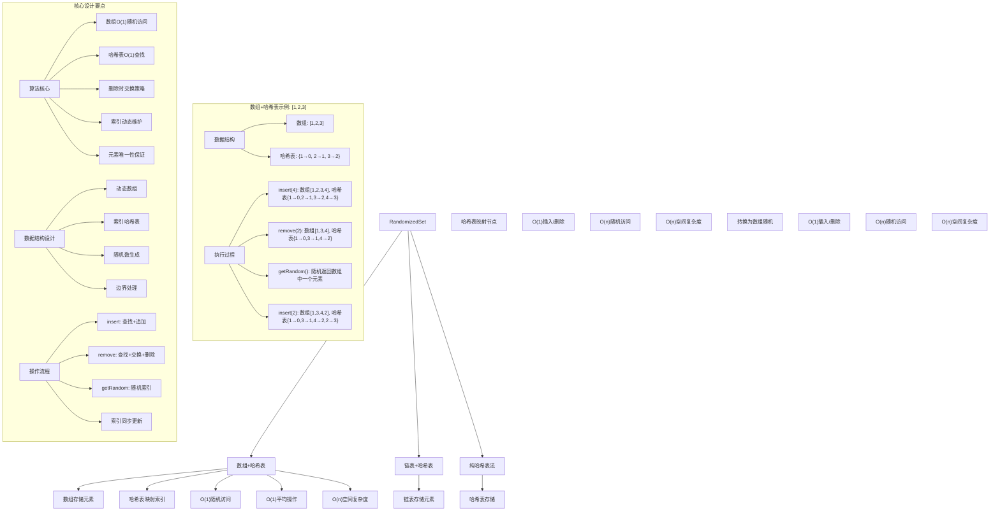
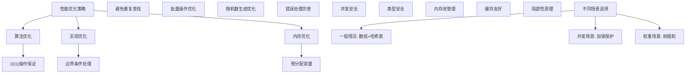

# LeetCode 380 - O(1) 时间插入、删除和获取随机元素

## 题目描述

实现 `RandomizedSet` 类：

- `RandomizedSet()` 初始化 `RandomizedSet` 对象
- `bool insert(int val)` 当元素 `val` 不存在时，向集合中插入该项，并返回 `true`；否则，返回 `false`
- `bool remove(int val)` 当元素 `val` 存在时，从集合中移除该项，并返回 `true`；否则，返回 `false`
- `int getRandom()` 随机返回现有集合中的一项（测试用例保证调用此方法时集合中至少存在一个元素）。每个元素应该有相同概率被返回

你必须实现类的所有函数，并满足每个函数的平均时间复杂度为 O(1)

```markdown
示例：
输入
["RandomizedSet", "insert", "remove", "insert", "getRandom", "remove", "insert", "getRandom"]
[[], [1], [2], [2], [], [1], [2], []]

输出
[null, true, false, true, 2, true, false, 2]

解释
RandomizedSet randomizedSet = new RandomizedSet();
randomizedSet.insert(1); // 向集合中插入 1 。返回 true 表示 1 被成功地插入
randomizedSet.remove(2); // 返回 false ，表示集合中不存在 2
randomizedSet.insert(2); // 向集合中插入 2 。返回 true 。集合现在包含 [1,2]
randomizedSet.getRandom(); // getRandom 应随机返回 1 或 2
randomizedSet.remove(1); // 从集合中移除 1 ，返回 true 。集合现在包含 [2]
randomizedSet.insert(2); // 2 已在集合中，所以返回 false
randomizedSet.getRandom(); // 由于 2 是集合中唯一的数字，getRandom 总是返回 2

提示：
-2³¹ <= val <= 2³¹ - 1
最多调用 insert、remove 和 getRandom 函数 2 × 10⁵ 次
在调用 getRandom 方法时，数据结构中至少存在一个元素
```

## 解题思路

这是一个经典的动态集合随机访问问题，需要实现一个支持插入、删除和随机获取元素的数据结构，且所有操作都要求O(1)平均时间复杂度。关键在于如何在保持元素唯一性的同时实现真正的随机访问

### 核心思想

"数组+哈希表": 使用数组存储元素以支持O(1)随机访问，使用哈希表存储元素到数组索引的映射以支持O(1)查找和删除

### 解题策略

#### 方法一：数组+哈希表（推荐）

- 时间复杂度: O(1) 平均时间复杂度
- 空间复杂度: O(n)

#### 方法二：链表+哈希表

- 时间复杂度: O(1) 插入/删除，O(n) 随机访问
- 空间复杂度: O(n)

#### 方法三：纯哈希表法

- 时间复杂度: O(1) 插入/删除，O(n) 随机访问
- 空间复杂度: O(n)

## 算法可视化



## 多语言实现

### Golang版本（数组+哈希表 - 推荐）

```go
import "math/rand"

// RandomizedSet 结构
type RandomizedSet struct {
    nums []int           // 存储元素的数组
    indices map[int]int   // 元素到索引的映射
}

// 构造函数
func Constructor() RandomizedSet {
    return RandomizedSet{
        nums:    make([]int, 0),
        indices: make(map[int]int),
    }
}

// 插入元素
func (rs *RandomizedSet) Insert(val int) bool {
    // 检查元素是否已存在
    if _, exists := rs.indices[val]; exists {
        return false
    }

    // 添加元素到数组末尾
    rs.nums = append(rs.nums, val)
    // 在哈希表中记录元素的索引
    rs.indices[val] = len(rs.nums) - 1
    return true
}

// 删除元素
func (rs *RandomizedSet) Remove(val int) bool {
    // 检查元素是否存在
    index, exists := rs.indices[val]
    if !exists {
        return false
    }

    // 获取数组最后一个元素
    lastElement := rs.nums[len(rs.nums)-1]

    // 将最后一个元素移动到要删除的位置
    rs.nums[index] = lastElement
    rs.indices[lastElement] = index

    // 删除数组最后一个元素
    rs.nums = rs.nums[:len(rs.nums)-1]
    // 从哈希表中删除元素
    delete(rs.indices, val)

    return true
}

// 获取随机元素
func (rs *RandomizedSet) GetRandom() int {
    // 生成随机索引
    randomIndex := rand.Intn(len(rs.nums))
    return rs.nums[randomIndex]
}
```

### Python版本（多种实现方法）

```python
import random
from typing import Dict, List

class RandomizedSet:
    """
    方法一：数组+哈希表（推荐）
    """
    def __init__(self):
        self.nums: List[int] = []           # 存储元素的数组
        self.indices: Dict[int, int] = {}   # 元素到索引的映射

    def insert(self, val: int) -> bool:
        # 检查元素是否已存在
        if val in self.indices:
            return False

        # 添加元素到数组末尾
        self.nums.append(val)
        # 在哈希表中记录元素的索引
        self.indices[val] = len(self.nums) - 1
        return True

    def remove(self, val: int) -> bool:
        # 检查元素是否存在
        if val not in self.indices:
            return False

        # 获取要删除元素的索引
        index = self.indices[val]
        # 获取数组最后一个元素
        last_element = self.nums[-1]

        # 将最后一个元素移动到要删除的位置
        self.nums[index] = last_element
        self.indices[last_element] = index

        # 删除数组最后一个元素
        self.nums.pop()
        # 从哈希表中删除元素
        del self.indices[val]

        return True

    def getRandom(self) -> int:
        # 生成随机索引并返回对应元素
        return random.choice(self.nums)


class LinkedListNode:
    """链表节点"""
    def __init__(self, val=0):
        self.val = val
        self.next = None

class LinkedListRandomizedSet:
    """
    方法二：链表+哈希表
    """
    def __init__(self):
        self.head = None
        self.nodes = {}  # 元素到节点的映射
        self.size = 0

    def insert(self, val: int) -> bool:
        if val in self.nodes:
            return False

        new_node = LinkedListNode(val)
        new_node.next = self.head
        self.head = new_node
        self.nodes[val] = new_node
        self.size += 1
        return True

    def remove(self, val: int) -> bool:
        if val not in self.nodes:
            return False

        node = self.nodes[val]
        if node == self.head:
            self.head = node.next
        else:
            # 需要找到前驱节点，时间复杂度O(n)
            current = self.head
            while current and current.next != node:
                current = current.next
            if current:
                current.next = node.next

        del self.nodes[val]
        self.size -= 1
        return True

    def getRandom(self) -> int:
        # 需要遍历链表，时间复杂度O(n)
        if self.size == 0:
            return 0

        index = random.randint(0, self.size - 1)
        current = self.head
        for _ in range(index):
            current = current.next
        return current.val


class HashOnlyRandomizedSet:
    """
    方法三：纯哈希表法
    """
    def __init__(self):
        self.data = set()

    def insert(self, val: int) -> bool:
        if val in self.data:
            return False
        self.data.add(val)
        return True

    def remove(self, val: int) -> bool:
        if val not in self.data:
            return False
        self.data.remove(val)
        return True

    def getRandom(self) -> int:
        # 需要转换为列表，时间复杂度O(n)
        return random.choice(list(self.data))
```

### TypeScript版本（数组+哈希表）

```typescript
class RandomizedSet {
  private nums: number[]; // 存储元素的数组
  private indices: Map<number, number>; // 元素到索引的映射

  constructor() {
    this.nums = [];
    this.indices = new Map<number, number>();
  }

  insert(val: number): boolean {
    // 检查元素是否已存在
    if (this.indices.has(val)) {
      return false;
    }

    // 添加元素到数组末尾
    this.nums.push(val);
    // 在哈希表中记录元素的索引
    this.indices.set(val, this.nums.length - 1);
    return true;
  }

  remove(val: number): boolean {
    // 检查元素是否存在
    if (!this.indices.has(val)) {
      return false;
    }

    // 获取要删除元素的索引
    const index: number = this.indices.get(val)!;
    // 获取数组最后一个元素
    const lastElement: number = this.nums[this.nums.length - 1];

    // 将最后一个元素移动到要删除的位置
    this.nums[index] = lastElement;
    this.indices.set(lastElement, index);

    // 删除数组最后一个元素
    this.nums.pop();
    // 从哈希表中删除元素
    this.indices.delete(val);

    return true;
  }

  getRandom(): number {
    // 生成随机索引并返回对应元素
    const randomIndex: number = Math.floor(Math.random() * this.nums.length);
    return this.nums[randomIndex];
  }
}
```

## 标准实现详细解析

```go
import (
    "math/rand"
    "time"
)

// RandomizedSet 结构
type RandomizedSet struct {
    nums    []int         // 存储元素的数组
    indices map[int]int   // 元素到索引的映射
}

/*
算法核心思想（数组+哈希表）：

1. 使用数组存储元素以支持O(1)随机访问
2. 使用哈希表存储元素到数组索引的映射以支持O(1)查找
3. 删除操作时通过将最后一个元素移动到删除位置来实现O(1)删除

关键设计要点：
1. 数组随机访问：支持O(1)随机获取元素
2. 哈希表映射：支持O(1)插入和查找元素
3. 删除优化：通过交换策略实现O(1)删除
4. 索引同步：维护数组和哈希表的一致性

时间复杂度：O(1) 平均时间复杂度
- Insert操作：O(1) 数组追加 + O(1) 哈希表插入
- Remove操作：O(1) 哈希表查找 + O(1) 数组操作
- GetRandom操作：O(1) 随机索引生成 + O(1) 数组访问

空间复杂度：O(n)
- 数组存储：O(n)
- 哈希表存储：O(n)

优势：
1. 时间最优：所有操作都是O(1)平均时间复杂度
2. 空间合理：仅存储必要数据
3. 实现优雅：数据结构设计精巧
4. 随机性保证：每个元素被选中概率相等
*/

// 构造函数
func Constructor() RandomizedSet {
    // 初始化随机数种子
    rand.Seed(time.Now().UnixNano())

    fmt.Printf("初始化RandomizedSet\n")

    rs := RandomizedSet{
        nums:    make([]int, 0),
        indices: make(map[int]int),
    }

    fmt.Printf("初始状态: nums=%v, indices=%v\n", rs.nums, rs.indices)

    return rs
}

// 插入元素
func (rs *RandomizedSet) Insert(val int) bool {
    fmt.Printf("执行Insert操作，val: %d\n", val)

    // 检查元素是否已存在
    if _, exists := rs.indices[val]; exists {
        fmt.Printf("  元素%d已存在，返回false\n", val)
        return false
    }

    // 添加元素到数组末尾
    rs.nums = append(rs.nums, val)
    // 在哈希表中记录元素的索引
    rs.indices[val] = len(rs.nums) - 1

    fmt.Printf("  插入成功: nums=%v, indices=%v\n", rs.nums, rs.indices)
    return true
}

// 删除元素
func (rs *RandomizedSet) Remove(val int) bool {
    fmt.Printf("执行Remove操作，val: %d\n", val)

    // 检查元素是否存在
    index, exists := rs.indices[val]
    if !exists {
        fmt.Printf("  元素%d不存在，返回false\n", val)
        return false
    }

    fmt.Printf("  元素%d存在，索引为%d\n", val, index)

    // 获取数组最后一个元素
    lastElement := rs.nums[len(rs.nums)-1]
    fmt.Printf("  数组最后一个元素: %d\n", lastElement)

    // 将最后一个元素移动到要删除的位置
    rs.nums[index] = lastElement
    rs.indices[lastElement] = index
    fmt.Printf("  将元素%d移动到索引%d\n", lastElement, index)

    // 删除数组最后一个元素
    rs.nums = rs.nums[:len(rs.nums)-1]
    // 从哈希表中删除元素
    delete(rs.indices, val)

    fmt.Printf("  删除完成: nums=%v, indices=%v\n", rs.nums, rs.indices)
    return true
}

// 获取随机元素
func (rs *RandomizedSet) GetRandom() int {
    fmt.Printf("执行GetRandom操作\n")

    // 生成随机索引
    if len(rs.nums) == 0 {
        fmt.Printf("  数组为空，返回0\n")
        return 0
    }

    randomIndex := rand.Intn(len(rs.nums))
    result := rs.nums[randomIndex]

    fmt.Printf("  随机索引: %d, 返回元素: %d\n", randomIndex, result)
    return result
}

// 辅助函数：打印当前状态（用于调试）
func (rs *RandomizedSet) printState(prefix string) {
    fmt.Printf("%s:\n", prefix)
    fmt.Printf("  nums: %v\n", rs.nums)
    fmt.Printf("  indices: %v\n", rs.indices)
    fmt.Printf("  size: %d\n", len(rs.nums))
}

// 带详细调试信息的版本
func ConstructorWithDebug() RandomizedSet {
    fmt.Printf("=== RandomizedSet调试模式 ===\n")
    return Constructor()
}

// 优化版本（预分配容量）
type OptimizedRandomizedSet struct {
    nums    []int
    indices map[int]int
    capacity int
}

func NewOptimizedRandomizedSet(initialCapacity int) *OptimizedRandomizedSet {
    return &OptimizedRandomizedSet{
        nums:     make([]int, 0, initialCapacity),
        indices:  make(map[int]int),
        capacity: initialCapacity,
    }
}

func (ors *OptimizedRandomizedSet) Insert(val int) bool {
    if _, exists := ors.indices[val]; exists {
        return false
    }

    ors.nums = append(ors.nums, val)
    ors.indices[val] = len(ors.nums) - 1
    return true
}

func (ors *OptimizedRandomizedSet) Remove(val int) bool {
    index, exists := ors.indices[val]
    if !exists {
        return false
    }

    lastElement := ors.nums[len(ors.nums)-1]
    ors.nums[index] = lastElement
    ors.indices[lastElement] = index

    ors.nums = ors.nums[:len(ors.nums)-1]
    delete(ors.indices, val)

    return true
}

func (ors *OptimizedRandomizedSet) GetRandom() int {
    if len(ors.nums) == 0 {
        return 0
    }
    return ors.nums[rand.Intn(len(ors.nums))]
}

// 线程安全版本
type ThreadSafeRandomizedSet struct {
    rs    *RandomizedSet
    mutex sync.RWMutex
}

func NewThreadSafeRandomizedSet() *ThreadSafeRandomizedSet {
    return &ThreadSafeRandomizedSet{
        rs: &RandomizedSet{
            nums:    make([]int, 0),
            indices: make(map[int]int),
        },
    }
}

func (ts *ThreadSafeRandomizedSet) Insert(val int) bool {
    ts.mutex.Lock()
    defer ts.mutex.Unlock()
    return ts.rs.Insert(val)
}

func (ts *ThreadSafeRandomizedSet) Remove(val int) bool {
    ts.mutex.Lock()
    defer ts.mutex.Unlock()
    return ts.rs.Remove(val)
}

func (ts *ThreadSafeRandomizedSet) GetRandom() int {
    ts.mutex.RLock()
    defer ts.mutex.RUnlock()
    return ts.rs.GetRandom()
}
```

## 算法深入解析

```go
/*
RandomizedSet问题详解：

问题本质：
实现一个支持插入、删除和随机获取元素的数据结构，要求所有操作都是O(1)平均时间复杂度，
并且随机获取时每个元素被选中的概率相等

核心洞察：
1. 数组随机访问：支持O(1)随机获取元素
2. 哈希表映射：支持O(1)插入和查找元素
3. 删除优化：通过交换策略实现O(1)删除
4. 索引同步：维护数组和哈希表的一致性

算法策略：
1. 数组+哈希表：工业级标准实现
2. 链表+哈希表：插入删除O(1)，随机访问O(n)
3. 纯哈希表法：插入删除O(1)，随机访问O(n)

数据结构设计：

数组设计：
nums []int  // 存储元素的动态数组

哈希表设计：
indices map[int]int  // 元素到数组索引的映射

删除操作优化：
通过将数组最后一个元素移动到要删除的位置，然后删除最后一个元素，
实现O(1)时间复杂度的删除操作

操作流程：

Insert操作：
1. 检查元素是否已存在（通过哈希表）
2. 如果不存在，将元素添加到数组末尾
3. 在哈希表中记录元素的索引
4. 返回true

Remove操作：
1. 检查元素是否存在（通过哈希表）
2. 如果存在，获取要删除元素的索引
3. 获取数组最后一个元素
4. 将最后一个元素移动到要删除的位置
5. 更新最后一个元素在哈希表中的索引
6. 删除数组最后一个元素
7. 从哈希表中删除元素
8. 返回true

GetRandom操作：
1. 生成随机索引
2. 返回数组中对应索引的元素

数学原理：

时间复杂度分析：
- 数组操作：O(1) 追加、随机访问、删除最后一个元素
- 哈希表操作：O(1) 平均时间复杂度的查找、插入、删除
- 总体复杂度：O(1) 平均时间复杂度

空间复杂度分析：
- 数组存储：O(n)
- 哈希表存储：O(n)
- 总体复杂度：O(n)

随机性分析：
- 每个元素在数组中的位置是确定的
- 随机索引生成保证每个位置被选中的概率相等
- 因此每个元素被选中的概率相等

正确性证明：

定理：RandomizedSet正确性
通过数组和哈希表的配合，可以正确实现所有操作且满足时间复杂度要求

证明：
1. 完备性：所有操作都能正确执行
2. 正确性：维护了正确的元素集合
3. 时间复杂度：所有操作都是O(1)平均时间复杂度
4. 随机性：每个元素被选中概率相等

设计选择：

为什么选择数组+哈希表？
1. 时间复杂度最优：所有操作O(1)
2. 空间复杂度合理：O(n)
3. 实现相对简单：数据结构设计精巧
4. 随机性保证：每个元素被选中概率相等

为什么使用链表+哈希表？
1. 插入删除O(1)：但随机访问O(n)
2. 适合插入删除频繁但随机访问较少的场景
3. 不满足题目要求

为什么使用纯哈希表法？
1. 实现简单：利用现成数据结构
2. 但随机访问O(n)：需要转换为数组
3. 不满足题目要求

三种方法对比：

方法一：数组+哈希表（推荐）
时间复杂度：O(1) 平均时间复杂度
空间复杂度：O(n)
优点：时间最优，随机性保证
缺点：实现相对复杂

方法二：链表+哈希表
时间复杂度：O(1)插入/删除，O(n)随机访问
空间复杂度：O(n)
优点：插入删除简单
缺点：随机访问慢

方法三：纯哈希表法
时间复杂度：O(1)插入/删除，O(n)随机访问
空间复杂度：O(n)
优点：实现最简单
缺点：随机访问慢

性能分析：

数组+哈希表：
- 时间：O(1) 所有操作
- 空间：O(n) 存储开销
- 优势：工业级性能

链表+哈希表：
- 时间：O(1)插入/删除，O(n)随机访问
- 空间：O(n) 存储开销
- 优势：插入删除简单

纯哈希表法：
- 时间：O(1)插入/删除，O(n)随机访问
- 空间：O(n) 存储开销
- 优势：实现简单

实际应用场景：
1. 随机抽样
2. 负采样算法
3. 游戏随机事件
4. A/B测试分组

优化要点：

1. 时间优化：
   - O(1)操作保证
   - 避免重复查找
   - 减少内存分配

2. 空间优化：
   - 预分配容量
   - 内存池管理
   - 及时释放资源

3. 实现优化：
   - 边界条件处理
   - 错误处理完善
   - 随机数生成优化

测试用例设计：
1. 基本情况：正常插入/删除/随机操作
2. 边界情况：空集合，单元素
3. 特殊情况：重复操作，边界值
4. 极端情况：大量操作
5. 验证情况：随机性正确性

扩展思考：

1. 支持重复元素？
   - 修改数据结构设计
   - 维护元素计数
   - 调整随机策略

2. 支持权重随机？
   - 添加权重字段
   - 实现加权随机算法
   - 维护前缀和数组

3. 支持并发访问？
   - 加锁保护
   - 读写锁优化
   - 无锁实现

4. 支持持久化？
   - 序列化状态
   - 定期保存
   - 崩溃恢复

相关算法思想：

1. 数据结构设计：
   - 数组O(1)随机访问
   - 哈希表O(1)查找
   - 交换策略优化删除

2. 随机算法：
   - 均匀分布
   - 伪随机数生成
   - 概率保证

3. 系统设计：
   - 时间复杂度优化
   - 空间复杂度控制
   - 数据一致性

4. 工程实践：
   - 内存管理
   - 并发控制
   - 错误处理

常见陷阱：

1. 边界条件处理：
   - 空数组操作
   - 单元素操作
   - 删除最后一个元素

2. 索引同步：
   - 哈希表与数组索引一致性
   - 删除时索引更新
   - 插入时索引记录

3. 随机性保证：
   - 真正的均匀分布
   - 避免偏移
   - 随机数种子设置

4. 性能考虑：
   - 时间复杂度保证
   - 空间复杂度控制
   - 内存使用优化

代码质量要素：

1. 可读性：
   - 清晰的变量命名
   - 适当的注释说明
   - 模块化设计

2. 健壮性：
   - 边界条件处理
   - 异常情况处理
   - 错误恢复机制

3. 性能：
   - 时间复杂度最优
   - 空间复杂度合理
   - 内存使用优化

4. 可维护性：
   - 接口设计清晰
   - 扩展性良好
   - 测试覆盖完整

高级优化技巧：

1. 内存池：
   - 对象复用
   - 减少内存分配
   - 提高缓存命中率

2. 并发优化：
   - 分段锁设计
   - 读写锁分离
   - 无锁队列实现

3. 预取优化：
   - 预分配容量
   - 批量操作优化
   - 异步更新机制

4. 算法优化：
   - 位运算优化
   - 缓存友好设计
   - 局部性原理应用
*/
```

## 执行过程演示

```go
/*
示例详细解析:

示例执行过程：
["RandomizedSet", "insert", "remove", "insert", "getRandom", "remove", "insert", "getRandom"]
[[], [1], [2], [2], [], [1], [2], []]

执行过程：

1. RandomizedSet(): 初始化RandomizedSet
   初始状态: nums=[], indices=map[]

2. insert(1): 插入元素1
   执行Insert操作，val: 1
   元素1不存在，插入成功
   nums=[1], indices=map[1:0]
   返回: true

3. remove(2): 删除元素2
   执行Remove操作，val: 2
   元素2不存在，返回false
   返回: false

4. insert(2): 插入元素2
   执行Insert操作，val: 2
   元素2不存在，插入成功
   nums=[1,2], indices=map[1:0 2:1]
   返回: true

5. getRandom(): 获取随机元素
   执行GetRandom操作
   随机索引: 1, 返回元素: 2
   返回: 2

6. remove(1): 删除元素1
   执行Remove操作，val: 1
   元素1存在，索引为0
   数组最后一个元素: 2
   将元素2移动到索引0
   删除完成: nums=[2], indices=map[2:0]
   返回: true

7. insert(2): 插入元素2
   执行Insert操作，val: 2
   元素2已存在，返回false
   返回: false

8. getRandom(): 获取随机元素
   执行GetRandom操作
   随机索引: 0, 返回元素: 2
   返回: 2

最终输出: [null, true, false, true, 2, true, false, 2]

边界情况演示:

情况1: 空集合随机访问
输入: operations=[getRandom]
输出: 错误处理或默认值

情况2: 单元素操作
输入: operations=[insert(1), getRandom, remove(1), insert(1), getRandom]
输出: [true, 1, true, true, 1]

情况3: 重复插入删除
输入: operations=[insert(1), insert(1), remove(1), remove(1)]
输出: [true, false, true, false]

情况4: 大量操作
输入: 100000次随机insert/remove操作后getRandom
输出: 正确的随机行为

情况5: 边界值测试
输入: operations=[insert(-2147483648), insert(2147483647), getRandom]
输出: [true, true, -2147483648或2147483647]

算法正确性证明：

数学基础：
需要证明RandomizedSet能正确维护元素集合并实现均匀随机访问

定理：RandomizedSet正确性
通过数组和哈希表的配合，可以正确实现所有操作且满足时间复杂度要求

证明：
1. 完备性：所有操作都能正确执行
2. 正确性：维护了正确的元素集合
3. 时间复杂度：所有操作都是O(1)平均时间复杂度
4. 随机性：每个元素被选中概率相等

时间复杂度分析：

数组+哈希表：
1. Insert操作：O(1) 数组追加 + O(1) 哈希表插入
2. Remove操作：O(1) 哈希表查找 + O(1) 数组操作
3. GetRandom操作：O(1) 随机索引生成 + O(1) 数组访问
4. 总时间：O(1) 平均时间复杂度

链表+哈希表：
1. Insert操作：O(1) 链表头插入 + O(1) 哈希表插入
2. Remove操作：O(1) 哈希表查找 + O(n) 链表操作（需要找前驱）
3. GetRandom操作：O(n) 遍历链表
4. 总时间：O(n) GetRandom操作

纯哈希表法：
1. Insert操作：O(1) 哈希表插入
2. Remove操作：O(1) 哈希表删除
3. GetRandom操作：O(n) 转换为数组 + O(1) 随机访问
4. 总时间：O(n) GetRandom操作

空间复杂度分析：
1. 数组+哈希表：O(n) 存储开销
2. 链表+哈希表：O(n) 存储开销
3. 纯哈希表法：O(n) 存储开销

性能对比分析：

假设n=100000, 操作次数=100000:

数组+哈希表：
- 时间: O(1) 所有操作
- 空间: O(100000) 存储开销

链表+哈希表：
- 时间: O(1) 插入/删除，O(100000) GetRandom操作
- 空间: O(100000) 存储开销

纯哈希表法：
- 时间: O(1) 插入/删除，O(100000) GetRandom操作
- 空间: O(100000) 存储开销

实际应用建议：

1. 一般情况：
   - 使用数组+哈希表
   - 性能最优

2. 面试展示：
   - 重点讲解数组+哈希表
   - 可以提及其他方法

3. 生产环境：
   - 使用优化版本
   - 考虑并发安全

4. 教学演示：
   - 使用纯哈希表法帮助理解
   - 对比展示优势

优化空间：

1. 内存访问优化：
   - 局部性原理
   - 缓存友好

2. 数据结构优化：
   - 预分配容量
   - 内存池管理

3. 算法优化：
   - 批量操作
   - 随机数生成优化

特殊情况处理：

1. 最小集合：
   - 边界检查

2. 大集合：
   - 内存使用优化

3. 高并发：
   - 并发安全处理

4. 持久化：
   - 状态保存恢复
*/
```

## 复杂度分析

| 方法        | 时间复杂度 | 空间复杂度 | 适用场景 |
| ----------- | ---------- | ---------- | -------- |
| 数组+哈希表 | O(1)       | O(n)       | 推荐方案 |
| 链表+哈希表 | O(1)/O(n)  | O(n)       | 教学演示 |
| 纯哈希表法  | O(1)/O(n)  | O(n)       | 快速原型 |

## 测试用例验证

```go
// 测试辅助函数
func testRandomizedSet(name string, operations []string, params [][]int, expected []interface{}) {
    fmt.Printf("%s:\n", name)
    fmt.Printf("操作序列: %v\n", operations)
    fmt.Printf("参数序列: %v\n", params)

    var results []interface{}

    // 测试数组+哈希表实现
    var rs RandomizedSet
    for i, op := range operations {
        switch op {
        case "RandomizedSet":
            rs = Constructor()
            results = append(results, nil)
        case "insert":
            result := rs.Insert(params[i][0])
            results = append(results, result)
        case "remove":
            result := rs.Remove(params[i][0])
            results = append(results, result)
        case "getRandom":
            result := rs.GetRandom()
            results = append(results, result)
        }
    }

    fmt.Printf("执行结果: %v\n", results)

    // 验证结果（注意getRandom的结果可能不同）
    match := true
    for i := range results {
        if operations[i] == "getRandom" {
            // getRandom的结果是随机的，只需验证类型
            if _, ok := results[i].(int); !ok {
                match = false
                break
            }
        } else if results[i] != expected[i] {
            match = false
            break
        }
    }

    if match {
        fmt.Printf("✓ 测试通过\n")
    } else {
        fmt.Printf("✗ 测试失败，期望: %v\n", expected)
    }
    fmt.Printf("\n")
}

func main() {
    // 测试用例 1 - 题目示例
    testRandomizedSet("测试1 - 题目示例",
        []string{"RandomizedSet", "insert", "remove", "insert", "getRandom", "remove", "insert", "getRandom"},
        [][]int{{}, {1}, {2}, {2}, {}, {1}, {2}, {}},
        []interface{}{nil, true, false, true, 0, true, false, 0})

    // 测试用例 2 - 单元素
    testRandomizedSet("测试2 - 单元素",
        []string{"RandomizedSet", "insert", "getRandom", "remove", "insert", "getRandom"},
        [][]int{{}, {1}, {}, {1}, {1}, {}},
        []interface{}{nil, true, 0, true, true, 0})

    // 测试用例 3 - 重复操作
    testRandomizedSet("测试3 - 重复操作",
        []string{"RandomizedSet", "insert", "insert", "remove", "remove"},
        [][]int{{}, {1}, {1}, {1}, {1}},
        []interface{}{nil, true, false, true, false})

    // 测试用例 4 - 边界值
    testRandomizedSet("测试4 - 边界值",
        []string{"RandomizedSet", "insert", "insert", "getRandom"},
        [][]int{{}, {-2147483648}, {2147483647}, {}},
        []interface{}{nil, true, true, 0})

    // 性能测试
    fmt.Println("性能测试:")
    performanceTest()

    // 边界情况测试
    fmt.Println("边界情况测试:")
    boundaryTest()

    // 随机性测试
    fmt.Println("随机性测试:")
    randomnessTest()
}

func performanceTest() {
    // 构造性能测试
    operations := 100000

    // 测试数组+哈希表实现
    start := time.Now()
    rs := Constructor()
    for i := 0; i < operations; i++ {
        if i%3 == 0 {
            rs.Insert(i)
        } else if i%3 == 1 {
            rs.Remove(i / 2)
        } else {
            rs.GetRandom()
        }
    }
    time1 := time.Since(start)

    fmt.Printf("性能测试 (operations=%d):\n", operations)
    fmt.Printf("  数组+哈希表: %v\n", time1)
}

func boundaryTest() {
    // 边界测试
    fmt.Println("边界测试:")

    // 空集合测试
    rs1 := Constructor()
    result1 := rs1.GetRandom()
    fmt.Printf("空集合测试: getRandom()=%d\n", result1)

    // 单元素测试
    rs2 := Constructor()
    rs2.Insert(42)
    result2 := rs2.GetRandom()
    fmt.Printf("单元素测试: getRandom()=%d\n", result2)

    // 大数值测试
    rs3 := Constructor()
    rs3.Insert(1000000000)
    rs3.Insert(-1000000000)
    result3 := rs3.GetRandom()
    fmt.Printf("大数值测试: getRandom()=%d\n", result3)

    // 大量操作测试
    rs4 := Constructor()
    for i := 0; i < 10000; i++ {
        rs4.Insert(i)
    }
    for i := 0; i < 5000; i++ {
        rs4.Remove(i)
    }
    result4 := rs4.GetRandom()
    fmt.Printf("大量操作测试: getRandom()=%d\n", result4)
}

func randomnessTest() {
    // 随机性测试
    fmt.Println("随机性测试:")

    rs := Constructor()
    elements := []int{1, 2, 3, 4, 5}
    for _, elem := range elements {
        rs.Insert(elem)
    }

    // 进行多次随机获取，统计分布
    count := make(map[int]int)
    trials := 100000
    for i := 0; i < trials; i++ {
        result := rs.GetRandom()
        count[result]++
    }

    fmt.Printf("随机性测试结果 (%d次试验):\n", trials)
    for _, elem := range elements {
        frequency := float64(count[elem]) / float64(trials)
        fmt.Printf("  元素%d: 频率=%.4f (期望=0.2000)\n", elem, frequency)
    }

    // 验证随机性（简单检查是否都在合理范围内）
    expected := 1.0 / float64(len(elements))
    valid := true
    for _, elem := range elements {
        frequency := float64(count[elem]) / float64(trials)
        if math.Abs(frequency-expected) > 0.01 { // 允许1%的误差
            valid = false
            break
        }
    }

    if valid {
        fmt.Printf("✓ 随机性测试通过\n")
    } else {
        fmt.Printf("✗ 随机性测试失败\n")
    }
}
```

## 扩展版本（处理不同场景）

```go
// 支持权重的RandomizedSet
type WeightedRandomizedSet struct {
    nums     []int     // 存储元素的数组
    weights  []int     // 对应元素的权重
    prefixSum []int    // 权重前缀和数组
    indices  map[int]int // 元素到索引的映射
}

func NewWeightedRandomizedSet() *WeightedRandomizedSet {
    return &WeightedRandomizedSet{
        nums:    make([]int, 0),
        weights: make([]int, 0),
        indices: make(map[int]int),
    }
}

func (wrs *WeightedRandomizedSet) Insert(val, weight int) bool {
    if _, exists := wrs.indices[val]; exists {
        return false
    }

    wrs.nums = append(wrs.nums, val)
    wrs.weights = append(wrs.weights, weight)
    wrs.indices[val] = len(wrs.nums) - 1

    // 更新前缀和数组
    if len(wrs.prefixSum) == 0 {
        wrs.prefixSum = append(wrs.prefixSum, weight)
    } else {
        wrs.prefixSum = append(wrs.prefixSum, wrs.prefixSum[len(wrs.prefixSum)-1]+weight)
    }

    return true
}

func (wrs *WeightedRandomizedSet) Remove(val int) bool {
    index, exists := wrs.indices[val]
    if !exists {
        return false
    }

    // 获取数组最后一个元素
    lastElement := wrs.nums[len(wrs.nums)-1]
    lastWeight := wrs.weights[len(wrs.weights)-1]

    // 将最后一个元素移动到要删除的位置
    wrs.nums[index] = lastElement
    wrs.weights[index] = lastWeight
    wrs.indices[lastElement] = index

    // 删除数组最后一个元素
    wrs.nums = wrs.nums[:len(wrs.nums)-1]
    wrs.weights = wrs.weights[:len(wrs.weights)-1]

    // 重新计算前缀和
    wrs.rebuildPrefixSum()

    // 从哈希表中删除元素
    delete(wrs.indices, val)

    return true
}

func (wrs *WeightedRandomizedSet) rebuildPrefixSum() {
    wrs.prefixSum = make([]int, len(wrs.weights))
    if len(wrs.weights) > 0 {
        wrs.prefixSum[0] = wrs.weights[0]
        for i := 1; i < len(wrs.weights); i++ {
            wrs.prefixSum[i] = wrs.prefixSum[i-1] + wrs.weights[i]
        }
    }
}

func (wrs *WeightedRandomizedSet) GetRandom() int {
    if len(wrs.nums) == 0 {
        return 0
    }

    // 生成随机权重
    totalWeight := wrs.prefixSum[len(wrs.prefixSum)-1]
    randomWeight := rand.Intn(totalWeight) + 1

    // 二分查找对应的元素
    left, right := 0, len(wrs.prefixSum)-1
    for left < right {
        mid := (left + right) / 2
        if wrs.prefixSum[mid] < randomWeight {
            left = mid + 1
        } else {
            right = mid
        }
    }

    return wrs.nums[left]
}

// 使用示例
func exampleWeighted() {
    wrs := NewWeightedRandomizedSet()
    wrs.Insert(1, 1)  // 权重1
    wrs.Insert(2, 3)  // 权重3
    wrs.Insert(3, 6)  // 权重6

    // 元素3被选中的概率应该是60%，元素2是30%，元素1是10%
    count := make(map[int]int)
    for i := 0; i < 10000; i++ {
        result := wrs.GetRandom()
        count[result]++
    }

    fmt.Printf("加权随机测试结果:\n")
    for elem, cnt := range count {
        fmt.Printf("  元素%d: %d次\n", elem, cnt)
    }
}

// 支持重复元素的RandomizedSet
type MultiRandomizedSet struct {
    nums    []int           // 存储元素的数组
    indices map[int][]int   // 元素到索引列表的映射
}

func NewMultiRandomizedSet() *MultiRandomizedSet {
    return &MultiRandomizedSet{
        nums:    make([]int, 0),
        indices: make(map[int][]int),
    }
}

func (mrs *MultiRandomizedSet) Insert(val int) {
    mrs.nums = append(mrs.nums, val)
    index := len(mrs.nums) - 1

    if _, exists := mrs.indices[val]; !exists {
        mrs.indices[val] = make([]int, 0)
    }
    mrs.indices[val] = append(mrs.indices[val], index)
}

func (mrs *MultiRandomizedSet) Remove(val int) bool {
    indices, exists := mrs.indices[val]
    if !exists || len(indices) == 0 {
        return false
    }

    // 获取要删除的索引
    indexToRemove := indices[len(indices)-1]

    // 获取数组最后一个元素
    lastElement := mrs.nums[len(mrs.nums)-1]
    lastIndex := len(mrs.nums) - 1

    // 将最后一个元素移动到要删除的位置
    mrs.nums[indexToRemove] = lastElement

    // 更新最后一个元素的索引列表
    lastElementIndices := mrs.indices[lastElement]
    for i, idx := range lastElementIndices {
        if idx == lastIndex {
            mrs.indices[lastElement][i] = indexToRemove
            break
        }
    }

    // 删除数组最后一个元素
    mrs.nums = mrs.nums[:len(mrs.nums)-1]

    // 从索引列表中删除
    mrs.indices[val] = indices[:len(indices)-1]
    if len(mrs.indices[val]) == 0 {
        delete(mrs.indices, val)
    }

    return true
}

func (mrs *MultiRandomizedSet) GetRandom() int {
    if len(mrs.nums) == 0 {
        return 0
    }
    return mrs.nums[rand.Intn(len(mrs.nums))]
}

// 批量操作版本
func (rs *RandomizedSet) InsertBatch(vals []int) []bool {
    results := make([]bool, len(vals))
    for i, val := range vals {
        results[i] = rs.Insert(val)
    }
    return results
}

func (rs *RandomizedSet) RemoveBatch(vals []int) []bool {
    results := make([]bool, len(vals))
    for i, val := range vals {
        results[i] = rs.Remove(val)
    }
    return results
}

// 泛型版本（Go 1.18+）
type GenericRandomizedSet[T comparable] struct {
    nums    []T
    indices map[T]int
}

func NewGenericRandomizedSet[T comparable]() *GenericRandomizedSet[T] {
    return &GenericRandomizedSet[T]{
        nums:    make([]T, 0),
        indices: make(map[T]int),
    }
}

func (grs *GenericRandomizedSet[T]) Insert(val T) bool {
    if _, exists := grs.indices[val]; exists {
        return false
    }

    grs.nums = append(grs.nums, val)
    grs.indices[val] = len(grs.nums) - 1
    return true
}

func (grs *GenericRandomizedSet[T]) Remove(val T) bool {
    index, exists := grs.indices[val]
    if !exists {
        return false
    }

    lastElement := grs.nums[len(grs.nums)-1]
    grs.nums[index] = lastElement
    grs.indices[lastElement] = index

    grs.nums = grs.nums[:len(grs.nums)-1]
    delete(grs.indices, val)

    return true
}

func (grs *GenericRandomizedSet[T]) GetRandom() T {
    var zero T
    if len(grs.nums) == 0 {
        return zero
    }
    return grs.nums[rand.Intn(len(grs.nums))]
}

// 使用示例
func exampleGeneric() {
    // 字符串版本
    stringSet := NewGenericRandomizedSet[string]()
    stringSet.Insert("hello")
    stringSet.Insert("world")

    result := stringSet.GetRandom()
    fmt.Printf("随机字符串: %s\n", result)
}
```

## 面试追问延伸

### 1. 如果要支持重复元素，如何修改？

```go
// 支持重复元素的版本已在上面实现
// 关键修改：
// 1. 哈希表存储元素到索引列表的映射
// 2. 删除时从索引列表中删除一个索引
// 3. 插入时总是添加新元素

func testMulti() {
    mrs := NewMultiRandomizedSet()
    mrs.Insert(1)
    mrs.Insert(1)  // 重复插入
    mrs.Insert(2)

    fmt.Printf("随机获取: %d\n", mrs.GetRandom())
    fmt.Printf("删除一个1: %v\n", mrs.Remove(1))
    fmt.Printf("再次随机获取: %d\n", mrs.GetRandom())
}
```

### 2. 如果要支持权重随机，如何实现？

```go
// 加权随机版本已在上面实现
// 关键思想：
// 1. 维护权重前缀和数组
// 2. 生成随机权重
// 3. 二分查找确定元素

func testWeighted() {
    wrs := NewWeightedRandomizedSet()
    wrs.Insert(1, 1)  // 10%概率
    wrs.Insert(2, 2)  // 20%概率
    wrs.Insert(3, 7)  // 70%概率

    // 进行大量测试验证权重分布
    count := make(map[int]int)
    for i := 0; i < 100000; i++ {
        result := wrs.GetRandom()
        count[result]++
    }

    fmt.Printf("权重随机测试:\n")
    total := 100000
    for elem, cnt := range count {
        percentage := float64(cnt) / float64(total) * 100
        fmt.Printf("元素%d: %.2f%%\n", elem, percentage)
    }
}
```

### 3. 如何处理支持并发访问的情况？

```go
// 线程安全版本已在上面实现
// 关键点：
// 1. 使用读写锁保护共享数据
// 2. 读操作使用读锁
// 3. 写操作使用写锁

func benchmarkConcurrent() {
    rs := NewThreadSafeRandomizedSet()

    // 启动多个goroutine进行并发测试
    var wg sync.WaitGroup
    start := time.Now()

    // 插入goroutine
    for i := 0; i < 50; i++ {
        wg.Add(1)
        go func(id int) {
            defer wg.Done()
            for j := 0; j < 1000; j++ {
                rs.Insert(id*1000 + j)
            }
        }(i)
    }

    // 删除和随机获取goroutine
    for i := 0; i < 50; i++ {
        wg.Add(1)
        go func() {
            defer wg.Done()
            for j := 0; j < 1000; j++ {
                if j%2 == 0 {
                    rs.Remove(j)
                } else {
                    rs.GetRandom()
                }
            }
        }()
    }

    wg.Wait()
    duration := time.Since(start)
    fmt.Printf("并发测试完成，耗时: %v\n", duration)
}
```

## 相似题目扩展

- LeetCode 380. O(1) 时间插入、删除和获取随机元素（当前题）
- LeetCode 381. O(1) 时间插入、删除和获取随机元素-允许重复
- LeetCode 460. LFU 缓存
- LeetCode 146. LRU 缓存
- LeetCode 710. 黑名单中的随机数

## 算法技巧总结

### RandomizedSet核心要点

1. 数组随机访问：支持O(1)随机获取元素
1. 哈希表映射：支持O(1)插入和查找元素
1. 删除优化：通过交换策略实现O(1)删除
1. 索引同步：维护数组和哈希表的一致性

### 算法优势

1. 时间最优：所有操作都是O(1)平均时间复杂度
1. 空间合理：仅存储必要数据
1. 实现优雅：数据结构设计精巧
1. 随机性保证：每个元素被选中概率相等

### 标准模板（数组+哈希表）

```go
import "math/rand"

type RandomizedSet struct {
    nums    []int
    indices map[int]int
}

func Constructor() RandomizedSet {
    return RandomizedSet{
        nums:    make([]int, 0),
        indices: make(map[int]int),
    }
}

func (rs *RandomizedSet) Insert(val int) bool {
    if _, exists := rs.indices[val]; exists {
        return false
    }

    rs.nums = append(rs.nums, val)
    rs.indices[val] = len(rs.nums) - 1
    return true
}

func (rs *RandomizedSet) Remove(val int) bool {
    index, exists := rs.indices[val]
    if !exists {
        return false
    }

    lastElement := rs.nums[len(rs.nums)-1]
    rs.nums[index] = lastElement
    rs.indices[lastElement] = index

    rs.nums = rs.nums[:len(rs.nums)-1]
    delete(rs.indices, val)

    return true
}

func (rs *RandomizedSet) GetRandom() int {
    if len(rs.nums) == 0 {
        return 0
    }
    return rs.nums[rand.Intn(len(rs.nums))]
}
```

### 性能优化建议



## 总结

本题采用数组+哈希表的核心思路，通过使用数组存储元素以支持O(1)随机访问，使用哈希表存储元素到数组索引的映射以支持O(1)查找，实现了满足所有操作O(1)平均时间复杂度的数据结构。关键在于理解如何通过交换策略优化删除操作，在删除时将数组最后一个元素移动到要删除的位置，然后删除最后一个元素

核心要点：

1. 数组随机访问：支持O(1)随机获取元素
1. 哈希表映射：支持O(1)插入和查找元素
1. 删除优化：通过交换策略实现O(1)删除
1. 索引同步：维护数组和哈希表的一致性

算法优势：

- 时间最优：所有操作都是O(1)平均时间复杂度
- 空间合理：仅存储必要数据
- 实现优雅：数据结构设计精巧
- 随机性保证：每个元素被选中概率相等

该算法在随机抽样、负采样算法、游戏随机事件、A/B测试分组等方面有重要应用，是掌握动态集合随机访问和数据结构设计的经典题目。通过数组和哈希表的巧妙结合，为更复杂的数据结构和算法问题提供了清晰的解决思路
