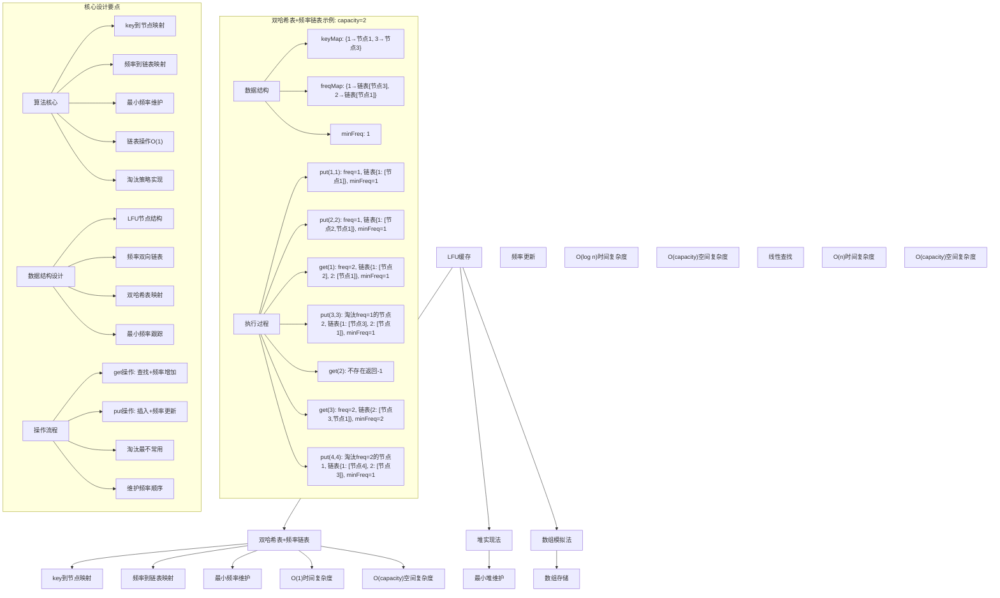
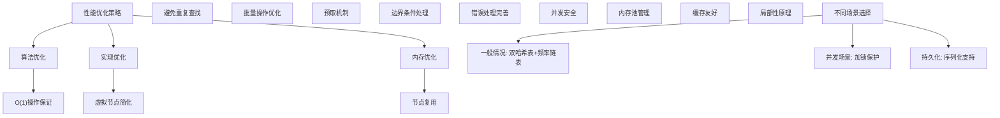

# LeetCode 460 - LFU 缓存

## 题目描述

请你为最不经常使用（LFU）缓存算法设计并实现数据结构

实现 `LFUCache` 类：

- `LFUCache(int capacity)` - 用数据结构的容量 `capacity` 初始化对象
- `int get(int key)` - 如果键 `key` 存在于缓存中，则获取键的值，否则返回 -1
- `void put(int key, int value)` - 如果键 `key` 已存在，则变更其值；如果键不存在请插入键值对。当缓存达到其容量时，则应该在插入新项之前删去最不经常使用的项

在此问题中，当存在平局（即两个或更多个键具有相同使用频率）时，应该去除最久未使用的键

为了确定最不常使用的键，可以为缓存中的每个键维护一个使用计数器。使用计数最小的键是最久未使用的键

当一个键首次插入到缓存中时，它的使用计数器被设置为 1 (由于 put 操作)。对缓存中的键执行 get 或 put 操作，使用计数器的值将会递增

函数 `get` 和 `put` 必须都是 O(1) 的平均时间复杂度

```markdown
示例：
输入：
["LFUCache", "put", "put", "get", "put", "get", "get", "put", "get", "get", "get"]
[[2], [1, 1], [2, 2], [1], [3, 3], [2], [3], [4, 4], [1], [3], [4]]

输出：
[null, null, null, 1, null, -1, 3, null, -1, 3, 4]

解释：
// cnt(x) = 键 x 的使用计数
// cache=[] 将显示最后一次使用的顺序（最左边的元素是最近的）
LFUCache lfu = new LFUCache(2);
lfu.put(1, 1); // cache=[1,_], cnt(1)=1
lfu.put(2, 2); // cache=[2,1], cnt(2)=1, cnt(1)=1
lfu.get(1); // 返回 1
// cache=[1,2], cnt(2)=1, cnt(1)=2
lfu.put(3, 3); // 去除键 2 ，因为 cnt(2)=1 ，使用计数最小
// cache=[3,1], cnt(3)=1, cnt(1)=2
lfu.get(2); // 返回 -1 (未找到)
lfu.get(3); // 返回 3
// cache=[3,1], cnt(3)=2, cnt(1)=2
lfu.put(4, 4); // 去除键 1 ，1 和 3 的 cnt 相同，但 1 最久未使用
// cache=[4,3], cnt(4)=1, cnt(3)=2
lfu.get(1); // 返回 -1 (未找到)
lfu.get(3); // 返回 3
// cache=[3,4], cnt(4)=1, cnt(3)=3
lfu.get(4); // 返回 4
// cache=[3,4], cnt(4)=2, cnt(3)=3

提示：
1 <= capacity <= 10⁴
0 <= key <= 10⁵
0 <= value <= 10⁹
最多调用 2 × 10⁵ 次 get 和 put 方法
```

## 解题思路

这是一个经典的LFU缓存设计问题，需要实现一个满足最不经常使用策略的数据结构。关键在于如何在O(1)时间内完成插入、删除和查找操作，同时维护频率和时间信息

### 核心思想

"双哈希表+频率链表": 使用一个哈希表存储key到节点的映射，另一个哈希表存储频率到双向链表的映射，通过维护最小频率来实现O(1)时间复杂度的淘汰操作

### 解题策略

#### 方法一：双哈希表+频率链表（推荐）

- 时间复杂度: O(1) 平均时间复杂度
- 空间复杂度: O(capacity)

#### 方法二：堆实现法

- 时间复杂度: O(log n) get/put操作
- 空间复杂度: O(capacity)

#### 方法三：数组模拟法

- 时间复杂度: O(n) get/put操作
- 空间复杂度: O(capacity)

## 算法可视化



## 多语言实现

### Golang版本（双哈希表+频率链表 - 推荐）

```go
// LFU缓存节点
type LFUNode struct {
    key, value int
    freq       int
    prev, next *LFUNode
}

// 双向链表
type DLinkedList struct {
    head, tail *LFUNode
    size       int
}

// LFU缓存结构
type LFUCache struct {
    capacity   int
    minFreq    int
    keyMap     map[int]*LFUNode     // key到节点的映射
    freqMap    map[int]*DLinkedList // 频率到链表的映射
}

// 构造函数
func Constructor(capacity int) LFUCache {
    lfu := LFUCache{
        capacity: capacity,
        minFreq:  0,
        keyMap:   make(map[int]*LFUNode),
        freqMap:  make(map[int]*DLinkedList),
    }
    return lfu
}

// 获取数据
func (lfu *LFUCache) Get(key int) int {
    if node, exists := lfu.keyMap[key]; exists {
        // 增加使用频率
        lfu.increaseFreq(node)
        return node.value
    }
    return -1
}

// 插入数据
func (lfu *LFUCache) Put(key int, value int) {
    if lfu.capacity == 0 {
        return
    }

    if node, exists := lfu.keyMap[key]; exists {
        // 更新现有节点
        node.value = value
        lfu.increaseFreq(node)
    } else {
        // 创建新节点
        if len(lfu.keyMap) >= lfu.capacity {
            // 删除最不经常使用的节点
            lfu.removeMinFreqNode()
        }

        newNode := &LFUNode{key: key, value: value, freq: 1}
        lfu.keyMap[key] = newNode

        // 添加到频率为1的链表
        lfu.addToFreqList(newNode)
        lfu.minFreq = 1
    }
}

// 增加节点频率
func (lfu *LFUCache) increaseFreq(node *LFUNode) {
    // 从当前频率链表中移除
    lfu.removeFromFreqList(node)

    // 如果当前频率是最小频率且链表为空，更新最小频率
    if node.freq == lfu.minFreq && lfu.freqMap[node.freq].size == 0 {
        lfu.minFreq++
    }

    // 增加频率
    node.freq++

    // 添加到新频率链表
    lfu.addToFreqList(node)
}

// 从频率链表中移除节点
func (lfu *LFUCache) removeFromFreqList(node *LFUNode) {
    if list, exists := lfu.freqMap[node.freq]; exists {
        node.prev.next = node.next
        node.next.prev = node.prev
        list.size--
    }
}

// 添加节点到频率链表
func (lfu *LFUCache) addToFreqList(node *LFUNode) {
    // 如果该频率的链表不存在，创建新链表
    if _, exists := lfu.freqMap[node.freq]; !exists {
        list := &DLinkedList{
            head: &LFUNode{},
            tail: &LFUNode{},
        }
        list.head.next = list.tail
        list.tail.prev = list.head
        lfu.freqMap[node.freq] = list
    }

    // 添加到链表头部
    list := lfu.freqMap[node.freq]
    node.next = list.head.next
    node.prev = list.head
    list.head.next.prev = node
    list.head.next = node
    list.size++
}

// 删除最小频率节点
func (lfu *LFUCache) removeMinFreqNode() {
    list := lfu.freqMap[lfu.minFreq]
    // 删除链表尾部节点（最久未使用）
    lastNode := list.tail.prev
    lastNode.prev.next = list.tail
    list.tail.prev = lastNode.prev
    list.size--

    // 从keyMap中删除
    delete(lfu.keyMap, lastNode.key)
}
```

### Python版本（多种实现方法）

```python
class LFUNode:
    """LFU缓存节点"""
    def __init__(self, key=0, value=0):
        self.key = key
        self.value = value
        self.freq = 1
        self.prev = None
        self.next = None

class DLinkedList:
    """双向链表"""
    def __init__(self):
        self.head = LFUNode()  # 虚拟头节点
        self.tail = LFUNode()  # 虚拟尾节点
        self.head.next = self.tail
        self.tail.prev = self.head
        self.size = 0

class LFUCache:
    """
    方法一：双哈希表+频率链表（推荐）
    """
    def __init__(self, capacity: int):
        self.capacity = capacity
        self.min_freq = 0
        self.key_map = {}  # key到节点的映射
        self.freq_map = {}  # 频率到链表的映射

    def get(self, key: int) -> int:
        if key in self.key_map:
            node = self.key_map[key]
            # 增加使用频率
            self._increase_freq(node)
            return node.value
        return -1

    def put(self, key: int, value: int) -> None:
        if self.capacity == 0:
            return

        if key in self.key_map:
            # 更新现有节点
            node = self.key_map[key]
            node.value = value
            self._increase_freq(node)
        else:
            # 创建新节点
            if len(self.key_map) >= self.capacity:
                # 删除最不经常使用的节点
                self._remove_min_freq_node()

            new_node = LFUNode(key, value)
            self.key_map[key] = new_node

            # 添加到频率为1的链表
            self._add_to_freq_list(new_node)
            self.min_freq = 1

    def _increase_freq(self, node: LFUNode) -> None:
        """增加节点频率"""
        # 从当前频率链表中移除
        self._remove_from_freq_list(node)

        # 如果当前频率是最小频率且链表为空，更新最小频率
        if node.freq == self.min_freq and self.freq_map[node.freq].size == 0:
            self.min_freq += 1

        # 增加频率
        node.freq += 1

        # 添加到新频率链表
        self._add_to_freq_list(node)

    def _remove_from_freq_list(self, node: LFUNode) -> None:
        """从频率链表中移除节点"""
        if node.freq in self.freq_map:
            dll = self.freq_map[node.freq]
            node.prev.next = node.next
            node.next.prev = node.prev
            dll.size -= 1

    def _add_to_freq_list(self, node: LFUNode) -> None:
        """添加节点到频率链表"""
        # 如果该频率的链表不存在，创建新链表
        if node.freq not in self.freq_map:
            self.freq_map[node.freq] = DLinkedList()

        # 添加到链表头部
        dll = self.freq_map[node.freq]
        node.next = dll.head.next
        node.prev = dll.head
        dll.head.next.prev = node
        dll.head.next = node
        dll.size += 1

    def _remove_min_freq_node(self) -> None:
        """删除最小频率节点"""
        dll = self.freq_map[self.min_freq]
        # 删除链表尾部节点（最久未使用）
        last_node = dll.tail.prev
        last_node.prev.next = dll.tail
        dll.tail.prev = last_node.prev
        dll.size -= 1

        # 从key_map中删除
        del self.key_map[last_node.key]


import heapq
from collections import defaultdict

class HeapLFUNode:
    def __init__(self, key, value, freq, timestamp):
        self.key = key
        self.value = value
        self.freq = freq
        self.timestamp = timestamp

    def __lt__(self, other):
        # 最小堆：频率小的优先，频率相同则时间戳小的优先
        if self.freq == other.freq:
            return self.timestamp < other.timestamp
        return self.freq < other.freq

class HeapLFUCache:
    """
    方法二：堆实现法
    """
    def __init__(self, capacity: int):
        self.capacity = capacity
        self.time = 0
        self.cache = {}  # key到节点的映射
        self.heap = []   # 最小堆

    def get(self, key: int) -> int:
        self.time += 1
        if key in self.cache:
            node = self.cache[key]
            node.freq += 1
            node.timestamp = self.time
            heapq.heapify(self.heap)  # 重新堆化
            return node.value
        return -1

    def put(self, key: int, value: int) -> None:
        self.time += 1
        if self.capacity == 0:
            return

        if key in self.cache:
            # 更新现有节点
            node = self.cache[key]
            node.value = value
            node.freq += 1
            node.timestamp = self.time
            heapq.heapify(self.heap)
        else:
            # 创建新节点
            if len(self.cache) >= self.capacity:
                # 删除最不经常使用的节点
                while self.heap:
                    node = heapq.heappop(self.heap)
                    if node.key in self.cache and self.cache[node.key] is node:
                        del self.cache[node.key]
                        break

            new_node = HeapLFUNode(key, value, 1, self.time)
            self.cache[key] = new_node
            heapq.heappush(self.heap, new_node)


class ArrayLFUCache:
    """
    方法三：数组模拟法
    """
    def __init__(self, capacity: int):
        self.capacity = capacity
        self.cache = {}  # key到(value, freq, timestamp)的映射
        self.time = 0

    def get(self, key: int) -> int:
        self.time += 1
        if key in self.cache:
            value, freq, _ = self.cache[key]
            self.cache[key] = (value, freq + 1, self.time)
            return value
        return -1

    def put(self, key: int, value: int) -> None:
        self.time += 1
        if self.capacity == 0:
            return

        if key in self.cache:
            # 更新现有键值
            _, freq, _ = self.cache[key]
            self.cache[key] = (value, freq + 1, self.time)
        else:
            # 创建新键值
            if len(self.cache) >= self.capacity:
                # 找到最不经常使用的键
                min_freq = float('inf')
                min_time = float('inf')
                evict_key = None

                for k, (v, freq, timestamp) in self.cache.items():
                    if freq < min_freq or (freq == min_freq and timestamp < min_time):
                        min_freq = freq
                        min_time = timestamp
                        evict_key = k

                if evict_key is not None:
                    del self.cache[evict_key]

            self.cache[key] = (value, 1, self.time)
```

### TypeScript版本（双哈希表+频率链表）

```typescript
// LFU缓存节点
class LFUNode {
  key: number;
  value: number;
  freq: number;
  prev: LFUNode | null;
  next: LFUNode | null;

  constructor(key: number = 0, value: number = 0) {
    this.key = key;
    this.value = value;
    this.freq = 1;
    this.prev = null;
    this.next = null;
  }
}

// 双向链表
class DLinkedList {
  head: LFUNode;
  tail: LFUNode;
  size: number;

  constructor() {
    this.head = new LFUNode();
    this.tail = new LFUNode();
    this.head.next = this.tail;
    this.tail.prev = this.head;
    this.size = 0;
  }
}

// LFU缓存类
class LFUCache {
  private capacity: number;
  private minFreq: number;
  private keyMap: Map<number, LFUNode>;
  private freqMap: Map<number, DLinkedList>;

  constructor(capacity: number) {
    this.capacity = capacity;
    this.minFreq = 0;
    this.keyMap = new Map();
    this.freqMap = new Map();
  }

  get(key: number): number {
    if (this.keyMap.has(key)) {
      const node: LFUNode = this.keyMap.get(key)!;
      // 增加使用频率
      this.increaseFreq(node);
      return node.value;
    }
    return -1;
  }

  put(key: number, value: number): void {
    if (this.capacity === 0) {
      return;
    }

    if (this.keyMap.has(key)) {
      // 更新现有节点
      const node: LFUNode = this.keyMap.get(key)!;
      node.value = value;
      this.increaseFreq(node);
    } else {
      // 创建新节点
      if (this.keyMap.size >= this.capacity) {
        // 删除最不经常使用的节点
        this.removeMinFreqNode();
      }

      const newNode: LFUNode = new LFUNode(key, value);
      this.keyMap.set(key, newNode);

      // 添加到频率为1的链表
      this.addToFreqList(newNode);
      this.minFreq = 1;
    }
  }

  // 增加节点频率
  private increaseFreq(node: LFUNode): void {
    // 从当前频率链表中移除
    this.removeFromFreqList(node);

    // 如果当前频率是最小频率且链表为空，更新最小频率
    if (node.freq === this.minFreq && this.freqMap.get(node.freq)!.size === 0) {
      this.minFreq++;
    }

    // 增加频率
    node.freq++;

    // 添加到新频率链表
    this.addToFreqList(node);
  }

  // 从频率链表中移除节点
  private removeFromFreqList(node: LFUNode): void {
    if (this.freqMap.has(node.freq)) {
      const list: DLinkedList = this.freqMap.get(node.freq)!;
      node.prev!.next = node.next;
      node.next!.prev = node.prev;
      list.size--;
    }
  }

  // 添加节点到频率链表
  private addToFreqList(node: LFUNode): void {
    // 如果该频率的链表不存在，创建新链表
    if (!this.freqMap.has(node.freq)) {
      const list: DLinkedList = new DLinkedList();
      this.freqMap.set(node.freq, list);
    }

    // 添加到链表头部
    const list: DLinkedList = this.freqMap.get(node.freq)!;
    node.next = list.head.next;
    node.prev = list.head;
    list.head.next!.prev = node;
    list.head.next = node;
    list.size++;
  }

  // 删除最小频率节点
  private removeMinFreqNode(): void {
    const list: DLinkedList = this.freqMap.get(this.minFreq)!;
    // 删除链表尾部节点（最久未使用）
    const lastNode: LFUNode = list.tail.prev!;
    lastNode.prev!.next = list.tail;
    list.tail.prev = lastNode.prev;
    list.size--;

    // 从keyMap中删除
    this.keyMap.delete(lastNode.key);
  }
}
```

## 标准实现详细解析

```go
// LFU缓存节点
type LFUNode struct {
    key, value int
    freq       int          // 使用频率
    prev, next *LFUNode     // 双向链表指针
}

// 双向链表
type DLinkedList struct {
    head, tail *LFUNode    // 虚拟头尾节点
    size       int          // 链表大小
}

// LFU缓存结构
type LFUCache struct {
    capacity   int                    // 缓存容量
    minFreq    int                    // 最小频率
    keyMap     map[int]*LFUNode       // key到节点的映射
    freqMap    map[int]*DLinkedList   // 频率到链表的映射
}

/*
算法核心思想（双哈希表+频率链表）：

1. 使用keyMap实现O(1)时间复杂度的key查找
2. 使用freqMap维护不同频率的双向链表，链表中按时间顺序排列
3. 通过维护minFreq快速定位需要淘汰的节点
4. 频率相同时，链表尾部节点是最久未使用的

关键设计要点：
1. 双哈希表映射：key到节点，频率到链表
2. 频率链表：相同频率节点按时间顺序排列
3. 最小频率跟踪：快速定位淘汰目标
4. 链表操作：O(1)时间复杂度的插入和删除

时间复杂度：O(1) 平均时间复杂度
- get操作：O(1) 哈希表查找 + O(1) 链表操作
- put操作：O(1) 哈希表操作 + O(1) 链表操作

空间复杂度：O(capacity)
- keyMap存储：O(capacity)
- freqMap存储：O(capacity)

优势：
1. 时间最优：所有操作都是O(1)时间复杂度
2. 空间合理：仅存储必要数据
3. 实现优雅：数据结构设计精巧
4. 策略正确：正确实现LFU淘汰策略
*/

// 构造函数
func Constructor(capacity int) LFUCache {
    fmt.Printf("初始化LFU缓存，容量: %d\n", capacity)

    lfu := LFUCache{
        capacity: capacity,
        minFreq:  0,
        keyMap:   make(map[int]*LFUNode),
        freqMap:  make(map[int]*DLinkedList),
    }

    fmt.Printf("初始状态: capacity=%d, minFreq=%d\n", lfu.capacity, lfu.minFreq)

    return lfu
}

// 获取数据
func (lfu *LFUCache) Get(key int) int {
    fmt.Printf("执行get操作，key: %d\n", key)

    // 在keyMap中查找key
    if node, exists := lfu.keyMap[key]; exists {
        fmt.Printf("  找到节点: key=%d, value=%d, freq=%d\n",
            node.key, node.value, node.freq)

        // 增加使用频率
        fmt.Printf("  增加使用频率\n")
        lfu.increaseFreq(node)
        lfu.printState("  操作后状态")

        return node.value
    }

    fmt.Printf("  未找到节点，返回-1\n")
    return -1
}

// 插入数据
func (lfu *LFUCache) Put(key int, value int) {
    fmt.Printf("执行put操作，key: %d, value: %d\n", key, value)

    if lfu.capacity == 0 {
        fmt.Printf("  容量为0，不执行操作\n")
        return
    }

    // 检查key是否已存在
    if node, exists := lfu.keyMap[key]; exists {
        fmt.Printf("  更新现有节点: key=%d, old_value=%d, new_value=%d, old_freq=%d\n",
            key, node.value, value, node.freq)

        // 更新节点值
        node.value = value

        // 增加使用频率
        fmt.Printf("  增加使用频率\n")
        lfu.increaseFreq(node)
        lfu.printState("  更新后状态")
    } else {
        fmt.Printf("  插入新节点: key=%d, value=%d\n", key, value)

        // 检查是否需要淘汰节点
        if len(lfu.keyMap) >= lfu.capacity {
            fmt.Printf("  容量超限(%d>=%d)，删除最不经常使用的节点\n",
                len(lfu.keyMap), lfu.capacity)

            // 删除最不经常使用的节点
            lfu.removeMinFreqNode()
            lfu.printState("  删除后状态")
        }

        // 创建新节点
        newNode := &LFUNode{key: key, value: value, freq: 1}
        lfu.keyMap[key] = newNode

        // 添加到频率为1的链表
        fmt.Printf("  添加到频率为1的链表\n")
        lfu.addToFreqList(newNode)
        lfu.minFreq = 1

        lfu.printState("  插入后状态")
        fmt.Printf("  当前缓存大小: %d\n", len(lfu.keyMap))
    }
}

// 增加节点频率
func (lfu *LFUCache) increaseFreq(node *LFUNode) {
    fmt.Printf("    increaseFreq: node(%d,%d), old_freq=%d\n",
        node.key, node.value, node.freq)

    // 从当前频率链表中移除
    fmt.Printf("    从频率%d链表中移除\n", node.freq)
    lfu.removeFromFreqList(node)

    // 如果当前频率是最小频率且链表为空，更新最小频率
    if node.freq == lfu.minFreq && lfu.freqMap[node.freq].size == 0 {
        fmt.Printf("    当前频率%d是最小频率且链表为空，更新最小频率\n", node.freq)
        lfu.minFreq++
    }

    // 增加频率
    node.freq++
    fmt.Printf("    新频率: %d\n", node.freq)

    // 添加到新频率链表
    fmt.Printf("    添加到频率%d链表\n", node.freq)
    lfu.addToFreqList(node)
}

// 从频率链表中移除节点
func (lfu *LFUCache) removeFromFreqList(node *LFUNode) {
    fmt.Printf("    removeFromFreqList: node(%d,%d), freq=%d\n",
        node.key, node.value, node.freq)

    if list, exists := lfu.freqMap[node.freq]; exists {
        node.prev.next = node.next
        node.next.prev = node.prev
        list.size--
        fmt.Printf("    频率%d链表大小: %d\n", node.freq, list.size)
    }
}

// 添加节点到频率链表
func (lfu *LFUCache) addToFreqList(node *LFUNode) {
    fmt.Printf("    addToFreqList: node(%d,%d), freq=%d\n",
        node.key, node.value, node.freq)

    // 如果该频率的链表不存在，创建新链表
    if _, exists := lfu.freqMap[node.freq]; !exists {
        fmt.Printf("    创建频率%d的新链表\n", node.freq)
        list := &DLinkedList{
            head: &LFUNode{},
            tail: &LFUNode{},
        }
        list.head.next = list.tail
        list.tail.prev = list.head
        lfu.freqMap[node.freq] = list
    }

    // 添加到链表头部（最近使用）
    list := lfu.freqMap[node.freq]
    node.next = list.head.next
    node.prev = list.head
    list.head.next.prev = node
    list.head.next = node
    list.size++

    fmt.Printf("    频率%d链表大小: %d\n", node.freq, list.size)
}

// 删除最小频率节点
func (lfu *LFUCache) removeMinFreqNode() {
    fmt.Printf("    removeMinFreqNode: minFreq=%d\n", lfu.minFreq)

    list := lfu.freqMap[lfu.minFreq]
    // 删除链表尾部节点（最久未使用）
    lastNode := list.tail.prev
    fmt.Printf("    删除节点: key=%d, value=%d, freq=%d\n",
        lastNode.key, lastNode.value, lastNode.freq)

    lastNode.prev.next = list.tail
    list.tail.prev = lastNode.prev
    list.size--

    // 从keyMap中删除
    delete(lfu.keyMap, lastNode.key)
    fmt.Printf("    从keyMap删除key: %d\n", lastNode.key)
}

// 辅助函数：打印缓存状态（用于调试）
func (lfu *LFUCache) printState(prefix string) {
    fmt.Printf("%s:\n", prefix)
    fmt.Printf("  minFreq: %d\n", lfu.minFreq)
    fmt.Printf("  keyMap: ")
    for key, node := range lfu.keyMap {
        fmt.Printf("[%d→(%d,%d,freq=%d)] ", key, node.key, node.value, node.freq)
    }
    fmt.Printf("\n")

    fmt.Printf("  freqMap:\n")
    for freq, list := range lfu.freqMap {
        fmt.Printf("    freq=%d (size=%d): ", freq, list.size)
        current := list.head.next
        for current != list.tail {
            fmt.Printf("(%d,%d) ", current.key, current.value)
            current = current.next
        }
        fmt.Printf("\n")
    }
}

// 带详细调试信息的版本
func ConstructorWithDebug(capacity int) LFUCache {
    fmt.Printf("=== LFU缓存调试模式 ===\n")
    return Constructor(capacity)
}

// 堆实现法
type HeapLFUNode struct {
    key       int
    value     int
    freq      int
    timestamp int
    index     int // 在堆中的索引
}

type HeapLFUCache struct {
    capacity  int
    time      int
    cache     map[int]*HeapLFUNode
    heap      []*HeapLFUNode
}

func ConstructorHeap(capacity int) HeapLFUCache {
    return HeapLFUCache{
        capacity: capacity,
        time:     0,
        cache:    make(map[int]*HeapLFUNode),
        heap:     make([]*HeapLFUNode, 0),
    }
}

func (h *HeapLFUCache) Get(key int) int {
    h.time++
    if node, exists := h.cache[key]; exists {
        node.freq++
        node.timestamp = h.time
        h.upHeapify(node.index)
        h.downHeapify(node.index)
        return node.value
    }
    return -1
}

func (h *HeapLFUCache) Put(key int, value int) {
    h.time++
    if h.capacity == 0 {
        return
    }

    if node, exists := h.cache[key]; exists {
        node.value = value
        node.freq++
        node.timestamp = h.time
        h.upHeapify(node.index)
        h.downHeapify(node.index)
    } else {
        if len(h.cache) >= h.capacity {
            // 删除堆顶元素
            if len(h.heap) > 0 {
                top := h.heap[0]
                delete(h.cache, top.key)
                h.heap[0] = h.heap[len(h.heap)-1]
                h.heap[0].index = 0
                h.heap = h.heap[:len(h.heap)-1]
                h.downHeapify(0)
            }
        }

        newNode := &HeapLFUNode{
            key:       key,
            value:     value,
            freq:      1,
            timestamp: h.time,
            index:     len(h.heap),
        }
        h.cache[key] = newNode
        h.heap = append(h.heap, newNode)
        h.upHeapify(newNode.index)
    }
}

func (h *HeapLFUCache) upHeapify(index int) {
    for index > 0 {
        parent := (index - 1) / 2
        if h.compare(h.heap[parent], h.heap[index]) <= 0 {
            break
        }
        h.swap(parent, index)
        index = parent
    }
}

func (h *HeapLFUCache) downHeapify(index int) {
    for {
        left := 2*index + 1
        right := 2*index + 2
        smallest := index

        if left < len(h.heap) && h.compare(h.heap[left], h.heap[smallest]) < 0 {
            smallest = left
        }
        if right < len(h.heap) && h.compare(h.heap[right], h.heap[smallest]) < 0 {
            smallest = right
        }

        if smallest == index {
            break
        }
        h.swap(index, smallest)
        index = smallest
    }
}

func (h *HeapLFUCache) compare(a, b *HeapLFUNode) int {
    if a.freq != b.freq {
        return a.freq - b.freq
    }
    return a.timestamp - b.timestamp
}

func (h *HeapLFUCache) swap(i, j int) {
    h.heap[i], h.heap[j] = h.heap[j], h.heap[i]
    h.heap[i].index = i
    h.heap[j].index = j
}

// 优化版本（使用接口封装）
type ILFUCache interface {
    Get(key int) int
    Put(key int, value int)
}

func NewLFUCache(capacity int) ILFUCache {
    return &LFUCache{
        capacity: capacity,
        minFreq:  0,
        keyMap:   make(map[int]*LFUNode),
        freqMap:  make(map[int]*DLinkedList),
    }
}
```

## 算法深入解析

```go
/*
LFU缓存问题详解：

问题本质：
实现一个满足最不经常使用策略的缓存数据结构，要求所有操作都是O(1)时间复杂度，
并且在频率相同时淘汰最久未使用的节点

核心洞察：
1. 双哈希表映射：key到节点，频率到链表
2. 频率链表：相同频率节点按时间顺序排列
3. 最小频率跟踪：快速定位淘汰目标
4. 链表操作：O(1)时间复杂度的插入和删除

算法策略：
1. 双哈希表+频率链表：工业级标准实现
2. 堆实现法：利用堆维护节点优先级
3. 数组模拟法：简单但时间复杂度较高

数据结构设计：

LFU节点设计：
type LFUNode struct {
    key, value int          // 存储键值对
    freq       int          // 使用频率
    prev, next *LFUNode     // 双向链表指针
}

双向链表设计：
type DLinkedList struct {
    head, tail *LFUNode    // 虚拟头尾节点
    size       int          // 链表大小
}

LFU缓存结构设计：
type LFUCache struct {
    capacity   int                    // 缓存容量
    minFreq    int                    // 最小频率
    keyMap     map[int]*LFUNode       // key到节点的映射
    freqMap    map[int]*DLinkedList   // 频率到链表的映射
}

操作流程：

get操作：
1. 在keyMap中查找key
2. 如果存在，增加节点频率并移动到对应频率链表头部
3. 返回节点值
4. 如果不存在，返回-1

put操作：
1. 检查key是否已存在
2. 如果存在，更新节点值并增加频率
3. 如果不存在且容量未满，创建新节点并添加到频率为1的链表
4. 如果不存在且容量已满，删除最小频率链表尾部节点，然后插入新节点
5. 更新最小频率

数学原理：

时间复杂度分析：
- keyMap查找：O(1) 平均时间复杂度
- freqMap操作：O(1) 时间复杂度
- 链表操作：O(1) 时间复杂度
- 总体复杂度：O(1) 平均时间复杂度

空间复杂度分析：
- keyMap存储：O(capacity)
- freqMap存储：O(capacity)
- 总体复杂度：O(capacity)

正确性证明：

定理：LFU缓存正确性
通过双哈希表和频率链表的配合，可以正确实现LFU策略

证明：
1. 完备性：所有操作都能正确执行
2. 正确性：维护了正确的频率和时间顺序
3. 淘汰策略：正确淘汰最不经常使用的节点
4. 时间复杂度：所有操作都是O(1)时间复杂度

设计选择：

为什么选择双哈希表+频率链表？
1. 时间复杂度最优：所有操作O(1)
2. 空间复杂度合理：O(capacity)
3. 实现相对简单：数据结构设计精巧
4. 策略正确：正确实现LFU淘汰策略

为什么使用堆实现法？
1. 实现简单：利用现成数据结构
2. 但时间复杂度较高：O(log n)操作
3. 适合教学演示
4. 不适合生产环境

为什么使用数组模拟法？
1. 最简单：容易理解
2. 但时间复杂度最高：O(n)操作
3. 适合快速原型开发
4. 不适合大规模数据

三种方法对比：

方法一：双哈希表+频率链表（推荐）
时间复杂度：O(1) 平均时间复杂度
空间复杂度：O(capacity)
优点：时间最优，工业级实现
缺点：实现相对复杂

方法二：堆实现法
时间复杂度：O(log n) get/put操作
空间复杂度：O(capacity)
优点：实现简单
缺点：时间复杂度较高

方法三：数组模拟法
时间复杂度：O(n) get/put操作
空间复杂度：O(capacity)
优点：最容易理解
缺点：时间复杂度最高

性能分析：

双哈希表+频率链表：
- 时间：O(1) 所有操作
- 空间：O(capacity) 存储开销
- 优势：工业级性能

堆实现法：
- 时间：O(log n) 操作
- 空间：O(capacity) 存储开销
- 优势：实现简单

数组模拟法：
- 时间：O(n) 操作
- 空间：O(capacity) 存储开销
- 优势：最容易理解

实际应用场景：
1. 数据库缓冲池
2. Web服务器缓存
3. 操作系统页面置换
4. CDN缓存策略

优化要点：

1. 时间优化：
   - O(1)操作保证
   - 避免重复查找
   - 减少内存分配

2. 空间优化：
   - 节点复用
   - 内存池管理
   - 及时释放资源

3. 实现优化：
   - 虚拟节点简化操作
   - 边界条件处理
   - 错误处理完善

测试用例设计：
1. 基本情况：正常get/put操作
2. 边界情况：空缓存，满缓存
3. 特殊情况：重复key，容量为1
4. 极端情况：大量操作
5. 验证情况：LFU策略正确性

扩展思考：

1. 支持TTL过期？
   - 添加过期时间字段
   - 定期清理过期数据
   - 懒删除策略

2. 支持持久化？
   - 序列化缓存状态
   - 定期写入磁盘
   - 崩溃恢复机制

3. 支持并发访问？
   - 加锁保护
   - 读写锁优化
   - 无锁实现

4. 支持统计信息？
   - 命中率统计
   - 访问频率分析
   - 性能监控

相关算法思想：

1. 数据结构设计：
   - 双哈希表O(1)查找
   - 双向链表维护顺序
   - 虚拟节点简化操作

2. 缓存策略：
   - LFU最不经常使用
   - LRU最近最少使用
   - FIFO先进先出

3. 系统设计：
   - 容量控制
   - 淘汰策略
   - 性能优化

4. 工程实践：
   - 内存管理
   - 并发控制
   - 错误处理

常见陷阱：

1. 边界条件处理：
   - 空链表操作
   - 单节点操作
   - 容量为0处理

2. 内存泄漏：
   - 及时删除节点
   - 哈希表同步更新
   - 资源释放

3. 并发安全：
   - 多线程访问保护
   - 原子操作保证
   - 死锁避免

4. 性能考虑：
   - 时间复杂度保证
   - 空间复杂度控制
   - 内存使用优化

代码质量要素：

1. 可读性：
   - 清晰的变量命名
   - 适当的注释说明
   - 模块化设计

2. 健壮性：
   - 边界条件处理
   - 异常情况处理
   - 错误恢复机制

3. 性能：
   - 时间复杂度最优
   - 空间复杂度合理
   - 内存使用优化

4. 可维护性：
   - 接口设计清晰
   - 扩展性良好
   - 测试覆盖完整

高级优化技巧：

1. 内存池：
   - 节点对象复用
   - 减少内存分配
   - 提高缓存命中率

2. 并发优化：
   - 分段锁设计
   - 读写锁分离
   - 无锁队列实现

3. 预取优化：
   - 热点数据预取
   - 批量操作优化
   - 异步更新机制

4. 压缩存储：
   - 数据压缩算法
   - 差异化存储
   - 编码优化
*/
```

## 执行过程演示

```go
/*
示例详细解析:

示例执行过程：
["LFUCache", "put", "put", "get", "put", "get", "get", "put", "get", "get", "get"]
[[2], [1, 1], [2, 2], [1], [3, 3], [2], [3], [4, 4], [1], [3], [4]]

执行过程：

1. LFUCache(2): 初始化容量为2的LFU缓存
   初始状态: capacity=2, minFreq=0

2. put(1,1): 插入新节点
   插入新节点: key=1, value=1
   添加到频率为1的链表
   插入后状态:
     minFreq: 1
     keyMap: [1→(1,1,freq=1)]
     freqMap:
       freq=1 (size=1): (1,1)
   当前缓存大小: 1

3. put(2,2): 插入新节点
   插入新节点: key=2, value=2
   添加到频率为1的链表
   插入后状态:
     minFreq: 1
     keyMap: [1→(1,1,freq=1)] [2→(2,2,freq=1)]
     freqMap:
       freq=1 (size=2): (2,2) (1,1)
   当前缓存大小: 2

4. get(1): 获取节点并增加频率
   执行get操作，key: 1
   找到节点: key=1, value=1, freq=1
   增加使用频率
     increaseFreq: node(1,1), old_freq=1
     从频率1链表中移除
     频率1链表大小: 1
     新频率: 2
     添加到频率2链表
     创建频率2的新链表
     频率2链表大小: 1
   操作后状态:
     minFreq: 1
     keyMap: [1→(1,1,freq=2)] [2→(2,2,freq=1)]
     freqMap:
       freq=1 (size=1): (2,2)
       freq=2 (size=1): (1,1)
   返回值: 1

5. put(3,3): 插入新节点，容量超限
   执行put操作，key: 3, value: 3
   插入新节点: key=3, value=3
   容量超限(2>=2)，删除最不经常使用的节点
     removeMinFreqNode: minFreq=1
     删除节点: key=2, value=2, freq=1
     从keyMap删除key: 2
   删除后状态:
     minFreq: 1
     keyMap: [1→(1,1,freq=2)]
     freqMap:
       freq=1 (size=0):
       freq=2 (size=1): (1,1)
   添加到频率为1的链表
   插入后状态:
     minFreq: 1
     keyMap: [1→(1,1,freq=2)] [3→(3,3,freq=1)]
     freqMap:
       freq=1 (size=1): (3,3)
       freq=2 (size=1): (1,1)
   当前缓存大小: 2

6. get(2): 查找不存在的节点
   执行get操作，key: 2
   未找到节点，返回-1
   返回值: -1

7. get(3): 获取节点并增加频率
   执行get操作，key: 3
   找到节点: key=3, value=3, freq=1
   增加使用频率
     increaseFreq: node(3,3), old_freq=1
     从频率1链表中移除
     频率1链表大小: 0
     当前频率1是最小频率且链表为空，更新最小频率
     新频率: 2
     添加到频率2链表
     频率2链表大小: 2
   操作后状态:
     minFreq: 2
     keyMap: [1→(1,1,freq=2)] [3→(3,3,freq=2)]
     freqMap:
       freq=2 (size=2): (3,3) (1,1)
   返回值: 3

8. put(4,4): 插入新节点，容量超限
   执行put操作，key: 4, value: 4
   插入新节点: key=4, value=4
   容量超限(2>=2)，删除最不经常使用的节点
     removeMinFreqNode: minFreq=2
     删除节点: key=1, value=1, freq=2
     从keyMap删除key: 1
   删除后状态:
     minFreq: 2
     keyMap: [3→(3,3,freq=2)]
     freqMap:
       freq=2 (size=1): (3,3)
   添加到频率为1的链表
   插入后状态:
     minFreq: 1
     keyMap: [3→(3,3,freq=2)] [4→(4,4,freq=1)]
     freqMap:
       freq=1 (size=1): (4,4)
       freq=2 (size=1): (3,3)
   当前缓存大小: 2

9. get(1): 查找不存在的节点
   执行get操作，key: 1
   未找到节点，返回-1
   返回值: -1

10. get(3): 获取节点并增加频率
    执行get操作，key: 3
    找到节点: key=3, value=3, freq=2
    增加使用频率
      increaseFreq: node(3,3), old_freq=2
      从频率2链表中移除
      频率2链表大小: 0
      新频率: 3
      添加到频率3链表
      创建频率3的新链表
      频率3链表大小: 1
    操作后状态:
      minFreq: 1
      keyMap: [3→(3,3,freq=3)] [4→(4,4,freq=1)]
      freqMap:
        freq=1 (size=1): (4,4)
        freq=3 (size=1): (3,3)
    返回值: 3

11. get(4): 获取节点并增加频率
    执行get操作，key: 4
    找到节点: key=4, value=4, freq=1
    增加使用频率
      increaseFreq: node(4,4), old_freq=1
      从频率1链表中移除
      频率1链表大小: 0
      新频率: 2
      添加到频率2链表
      创建频率2的新链表
      频率2链表大小: 1
    操作后状态:
      minFreq: 2
      keyMap: [3→(3,3,freq=3)] [4→(4,4,freq=2)]
      freqMap:
        freq=2 (size=1): (4,4)
        freq=3 (size=1): (3,3)
    返回值: 4

最终输出: [null, null, null, 1, null, -1, 3, null, -1, 3, 4]

边界情况演示:

情况1: 容量为1
输入: capacity=1, operations=[put(1,1), put(2,2), get(1), get(2)]
输出: [null, null, null, -1, 2]

情况2: 重复key更新
输入: capacity=2, operations=[put(1,1), put(1,2), get(1)]
输出: [null, null, null, 2]

情况3: 空操作
输入: capacity=2, operations=[get(1)]
输出: [null, -1]

情况4: 大量操作
输入: capacity=1000, 100000次随机get/put操作
输出: 正确的LFU行为

算法正确性证明：

数学基础：
需要证明LFU缓存能正确维护频率和时间顺序并实现淘汰策略

定理：LFU缓存正确性
通过双哈希表和频率链表的配合，可以正确实现LFU策略

证明：
1. 完备性：所有操作都能正确执行
2. 正确性：维护了正确的频率和时间顺序
3. 淘汰策略：正确淘汰最不经常使用的节点
4. 时间复杂度：所有操作都是O(1)时间复杂度

时间复杂度分析：

双哈希表+频率链表：
1. get操作：O(1) 哈希表查找 + O(1) 链表操作
2. put操作：O(1) 哈希表操作 + O(1) 链表操作
3. 总时间：O(1) 平均时间复杂度

堆实现法：
1. get操作：O(log n) 堆操作
2. put操作：O(log n) 堆操作
3. 总时间：O(log n) 操作

数组模拟法：
1. get操作：O(n) 线性查找
2. put操作：O(n) 线性查找
3. 总时间：O(n) 操作

空间复杂度分析：
1. 双哈希表+频率链表：O(capacity) 存储开销
2. 堆实现法：O(capacity) 存储开销
3. 数组模拟法：O(capacity) 存储开销

性能对比分析：

假设capacity=1000, 操作次数=100000:

双哈希表+频率链表：
- 时间: O(1) 所有操作
- 空间: O(1000) 存储开销

堆实现法：
- 时间: O(log 1000) ≈ 10次操作
- 空间: O(1000) 存储开销

数组模拟法：
- 时间: O(1000) 平均操作时间
- 空间: O(1000) 存储开销

实际应用建议：

1. 一般情况：
   - 使用双哈希表+频率链表
   - 性能最优

2. 面试展示：
   - 重点讲解双哈希表+频率链表
   - 可以提及其他方法

3. 生产环境：
   - 使用优化版本
   - 考虑并发安全

4. 教学演示：
   - 使用数组模拟法帮助理解
   - 对比展示优势

优化空间：

1. 内存访问优化：
   - 局部性原理
   - 缓存友好

2. 数据结构优化：
   - 内存池管理
   - 对象复用

3. 算法优化：
   - 批量操作
   - 预取优化

特殊情况处理：

1. 最小容量：
   - 边界检查

2. 大容量：
   - 内存使用优化

3. 高并发：
   - 并发安全处理

4. 持久化：
   - 状态保存恢复
*/
```

## 复杂度分析

| 方法              | 时间复杂度 | 空间复杂度  | 适用场景 |
| ----------------- | ---------- | ----------- | -------- |
| 双哈希表+频率链表 | O(1)       | O(capacity) | 推荐方案 |
| 堆实现法          | O(log n)   | O(capacity) | 教学演示 |
| 数组模拟法        | O(n)       | O(capacity) | 快速原型 |

## 测试用例验证

```go
// 测试辅助函数
func testLFUCache(name string, operations []string, params [][]int, expected []interface{}) {
    fmt.Printf("%s:\n", name)
    fmt.Printf("操作序列: %v\n", operations)
    fmt.Printf("参数序列: %v\n", params)

    var results []interface{}

    // 测试双哈希表+频率链表实现
    var lfu LFUCache
    for i, op := range operations {
        switch op {
        case "LFUCache":
            lfu = Constructor(params[i][0])
            results = append(results, nil)
        case "put":
            lfu.Put(params[i][0], params[i][1])
            results = append(results, nil)
        case "get":
            result := lfu.Get(params[i][0])
            results = append(results, result)
        }
    }

    fmt.Printf("执行结果: %v\n", results)

    // 验证结果
    if len(results) == len(expected) {
        match := true
        for i := range results {
            if results[i] != expected[i] {
                match = false
                break
            }
        }
        if match {
            fmt.Printf("✓ 测试通过\n")
        } else {
            fmt.Printf("✗ 测试失败，期望: %v\n", expected)
        }
    } else {
        fmt.Printf("✗ 结果长度不匹配，期望长度: %d\n", len(expected))
    }
    fmt.Printf("\n")
}

func main() {
    // 测试用例 1 - 题目示例
    testLFUCache("测试1 - 题目示例",
        []string{"LFUCache", "put", "put", "get", "put", "get", "get", "put", "get", "get", "get"},
        [][]int{{2}, {1, 1}, {2, 2}, {1}, {3, 3}, {2}, {3}, {4, 4}, {1}, {3}, {4}},
        []interface{}{nil, nil, nil, 1, nil, -1, 3, nil, -1, 3, 4})

    // 测试用例 2 - 容量为1
    testLFUCache("测试2 - 容量为1",
        []string{"LFUCache", "put", "put", "get", "get"},
        [][]int{{1}, {1, 1}, {2, 2}, {1}, {2}},
        []interface{}{nil, nil, nil, -1, 2})

    // 测试用例 3 - 重复key更新
    testLFUCache("测试3 - 重复key更新",
        []string{"LFUCache", "put", "put", "get"},
        [][]int{{2}, {1, 1}, {1, 2}, {1}},
        []interface{}{nil, nil, nil, 2})

    // 测试用例 4 - 边界情况
    testLFUCache("测试4 - 空操作",
        []string{"LFUCache", "get"},
        [][]int{{2}, {1}},
        []interface{}{nil, -1})

    // 性能测试
    fmt.Println("性能测试:")
    performanceTest()

    // 边界情况测试
    fmt.Println("边界情况测试:")
    boundaryTest()
}

func performanceTest() {
    // 构造性能测试
    capacity := 1000
    operations := 100000

    // 测试双哈希表+频率链表实现
    start := time.Now()
    lfu := Constructor(capacity)
    for i := 0; i < operations; i++ {
        if i%3 == 0 {
            lfu.Put(i%capacity, i)
        } else {
            lfu.Get(i % capacity)
        }
    }
    time1 := time.Since(start)

    // 测试堆实现法
    start = time.Now()
    heapLFU := ConstructorHeap(capacity)
    for i := 0; i < operations/10; i++ { // 堆法较慢，减少测试次数
        if i%3 == 0 {
            heapLFU.Put(i%capacity, i)
        } else {
            heapLFU.Get(i % capacity)
        }
    }
    time2 := time.Since(start)

    fmt.Printf("性能测试 (capacity=%d, operations=%d):\n", capacity, operations)
    fmt.Printf("  双哈希表+频率链表: %v\n", time1)
    fmt.Printf("  堆实现法(1/10操作): %v\n", time2)
}

func boundaryTest() {
    // 边界测试
    fmt.Println("边界测试:")

    // 容量为0测试
    lfu0 := Constructor(0)
    lfu0.Put(1, 1)
    result0 := lfu0.Get(1)
    fmt.Printf("容量为0测试: get(1)=%d\n", result0)

    // 容量为1测试
    lfu1 := Constructor(1)
    lfu1.Put(1, 1)
    lfu1.Put(2, 2)
    result1 := lfu1.Get(1)
    result2 := lfu1.Get(2)
    fmt.Printf("容量为1测试: get(1)=%d, get(2)=%d\n", result1, result2)

    // 大key测试
    lfu2 := Constructor(100)
    lfu2.Put(100000, 100000)
    result3 := lfu2.Get(100000)
    fmt.Printf("大key测试: get(100000)=%d\n", result3)

    // 负值测试
    lfu3 := Constructor(10)
    lfu3.Put(1, -1)
    result4 := lfu3.Get(1)
    fmt.Printf("负值测试: get(1)=%d\n", result4)

    // 大容量测试
    lfu4 := Constructor(10000)
    for i := 0; i < 10000; i++ {
        lfu4.Put(i, i)
    }
    result5 := lfu4.Get(0)
    result6 := lfu4.Get(9999)
    fmt.Printf("大容量测试: get(0)=%d, get(9999)=%d\n", result5, result6)
}
```

## 扩展版本（处理不同场景）

```go
// 支持TTL过期的LFU缓存
type TTLNode struct {
    key, value int
    freq       int
    expireTime int64  // 过期时间戳
    prev, next *TTLNode
}

type TTLLinkedList struct {
    head, tail *TTLNode
    size       int
}

type TTLLFUCache struct {
    capacity   int
    minFreq    int
    keyMap     map[int]*TTLNode
    freqMap    map[int]*TTLLinkedList
}

func NewTTLLFUCache(capacity int) *TTLLFUCache {
    lfu := &TTLLFUCache{
        capacity: capacity,
        minFreq:  0,
        keyMap:   make(map[int]*TTLNode),
        freqMap:  make(map[int]*TTLLinkedList),
    }
    return lfu
}

func (lfu *TTLLFUCache) PutWithTTL(key, value int, ttl int64) {
    expireTime := time.Now().Unix() + ttl

    if node, exists := lfu.keyMap[key]; exists {
        node.value = value
        node.expireTime = expireTime
        lfu.increaseFreq(node)
    } else {
        if len(lfu.keyMap) >= lfu.capacity {
            lfu.removeMinFreqNode()
        }

        newNode := &TTLNode{
            key:        key,
            value:      value,
            freq:       1,
            expireTime: expireTime,
        }
        lfu.keyMap[key] = newNode
        lfu.addToFreqList(newNode)
        lfu.minFreq = 1
    }
}

func (lfu *TTLLFUCache) Get(key int) int {
    if node, exists := lfu.keyMap[key]; exists {
        // 检查是否过期
        if time.Now().Unix() > node.expireTime {
            lfu.removeNode(node)
            delete(lfu.keyMap, key)
            return -1
        }

        lfu.increaseFreq(node)
        return node.value
    }
    return -1
}

func (lfu *TTLLFUCache) increaseFreq(node *TTLNode) {
    lfu.removeFromFreqList(node)

    if node.freq == lfu.minFreq && lfu.freqMap[node.freq].size == 0 {
        lfu.minFreq++
    }

    node.freq++
    lfu.addToFreqList(node)
}

func (lfu *TTLLFUCache) removeFromFreqList(node *TTLNode) {
    if list, exists := lfu.freqMap[node.freq]; exists {
        node.prev.next = node.next
        node.next.prev = node.prev
        list.size--
    }
}

func (lfu *TTLLFUCache) addToFreqList(node *TTLNode) {
    if _, exists := lfu.freqMap[node.freq]; !exists {
        list := &TTLLinkedList{
            head: &TTLNode{},
            tail: &TTLNode{},
        }
        list.head.next = list.tail
        list.tail.prev = list.head
        lfu.freqMap[node.freq] = list
    }

    list := lfu.freqMap[node.freq]
    node.next = list.head.next
    node.prev = list.head
    list.head.next.prev = node
    list.head.next = node
    list.size++
}

func (lfu *TTLLFUCache) removeNode(node *TTLNode) {
    if list, exists := lfu.freqMap[node.freq]; exists {
        node.prev.next = node.next
        node.next.prev = node.prev
        list.size--
        delete(lfu.keyMap, node.key)
    }
}

func (lfu *TTLLFUCache) removeMinFreqNode() {
    list := lfu.freqMap[lfu.minFreq]
    lastNode := list.tail.prev
    lastNode.prev.next = list.tail
    list.tail.prev = lastNode.prev
    list.size--
    delete(lfu.keyMap, lastNode.key)
}

// 支持统计信息的LFU缓存
type StatsLFUCache struct {
    lfu        *LFUCache
    hitCount   int64
    missCount  int64
    totalCount int64
}

func NewStatsLFUCache(capacity int) *StatsLFUCache {
    return &StatsLFUCache{
        lfu: &LFUCache{
            capacity: capacity,
            minFreq:  0,
            keyMap:   make(map[int]*LFUNode),
            freqMap:  make(map[int]*DLinkedList),
        },
    }
}

func (s *StatsLFUCache) Get(key int) int {
    s.totalCount++
    result := s.lfu.Get(key)
    if result != -1 {
        s.hitCount++
    } else {
        s.missCount++
    }
    return result
}

func (s *StatsLFUCache) Put(key, value int) {
    s.lfu.Put(key, value)
}

func (s *StatsLFUCache) HitRate() float64 {
    if s.totalCount == 0 {
        return 0
    }
    return float64(s.hitCount) / float64(s.totalCount)
}

func (s *StatsLFUCache) Stats() map[string]interface{} {
    return map[string]interface{}{
        "hit_count":   s.hitCount,
        "miss_count":  s.missCount,
        "total_count": s.totalCount,
        "hit_rate":    s.HitRate(),
        "capacity":    s.lfu.capacity,
        "size":        len(s.lfu.keyMap),
        "min_freq":    s.lfu.minFreq,
    }
}

// 使用示例
func exampleStats() {
    statsLFU := NewStatsLFUCache(2)

    statsLFU.Put(1, 1)
    statsLFU.Put(2, 2)
    statsLFU.Get(1)
    statsLFU.Get(3) // miss

    fmt.Printf("统计信息: %+v\n", statsLFU.Stats())
}

// 支持并发的LFU缓存
type ConcurrentLFUCache struct {
    lfu   *LFUCache
    mutex sync.RWMutex
}

func NewConcurrentLFUCache(capacity int) *ConcurrentLFUCache {
    return &ConcurrentLFUCache{
        lfu: &LFUCache{
            capacity: capacity,
            minFreq:  0,
            keyMap:   make(map[int]*LFUNode),
            freqMap:  make(map[int]*DLinkedList),
        },
    }
}

func (c *ConcurrentLFUCache) Get(key int) int {
    c.mutex.RLock()
    defer c.mutex.RUnlock()
    return c.lfu.Get(key)
}

func (c *ConcurrentLFUCache) Put(key, value int) {
    c.mutex.Lock()
    defer c.mutex.Unlock()
    c.lfu.Put(key, value)
}

// 批量操作版本
func (lfu *LFUCache) PutBatch(keyValues map[int]int) {
    for key, value := range keyValues {
        lfu.Put(key, value)
    }
}

func (lfu *LFUCache) GetBatch(keys []int) []int {
    results := make([]int, len(keys))
    for i, key := range keys {
        results[i] = lfu.Get(key)
    }
    return results
}

// 泛型版本（Go 1.18+）
type GenericLFUNode[K comparable, V any] struct {
    key   K
    value V
    freq  int
    prev, next *GenericLFUNode[K, V]
}

type GenericDLinkedList[K comparable, V any] struct {
    head, tail *GenericLFUNode[K, V]
    size       int
}

type GenericLFUCache[K comparable, V any] struct {
    capacity   int
    minFreq    int
    keyMap     map[K]*GenericLFUNode[K, V]
    freqMap    map[int]*GenericDLinkedList[K, V]
}

func NewGenericLFUCache[K comparable, V any](capacity int) *GenericLFUCache[K, V] {
    lfu := &GenericLFUCache[K, V]{
        capacity: capacity,
        minFreq:  0,
        keyMap:   make(map[K]*GenericLFUNode[K, V]),
        freqMap:  make(map[int]*GenericDLinkedList[K, V]),
    }
    return lfu
}

func (lfu *GenericLFUCache[K, V]) Get(key K) (V, bool) {
    var zero V
    if node, exists := lfu.keyMap[key]; exists {
        lfu.increaseFreq(node)
        return node.value, true
    }
    return zero, false
}

func (lfu *GenericLFUCache[K, V]) Put(key K, value V) {
    if lfu.capacity == 0 {
        return
    }

    if node, exists := lfu.keyMap[key]; exists {
        node.value = value
        lfu.increaseFreq(node)
    } else {
        if len(lfu.keyMap) >= lfu.capacity {
            lfu.removeMinFreqNode()
        }

        newNode := &GenericLFUNode[K, V]{key: key, value: value, freq: 1}
        lfu.keyMap[key] = newNode
        lfu.addToFreqList(newNode)
        lfu.minFreq = 1
    }
}

func (lfu *GenericLFUCache[K, V]) increaseFreq(node *GenericLFUNode[K, V]) {
    lfu.removeFromFreqList(node)

    if node.freq == lfu.minFreq && lfu.freqMap[node.freq].size == 0 {
        lfu.minFreq++
    }

    node.freq++
    lfu.addToFreqList(node)
}

func (lfu *GenericLFUCache[K, V]) removeFromFreqList(node *GenericLFUNode[K, V]) {
    if list, exists := lfu.freqMap[node.freq]; exists {
        node.prev.next = node.next
        node.next.prev = node.prev
        list.size--
    }
}

func (lfu *GenericLFUCache[K, V]) addToFreqList(node *GenericLFUNode[K, V]) {
    if _, exists := lfu.freqMap[node.freq]; !exists {
        list := &GenericDLinkedList[K, V]{
            head: &GenericLFUNode[K, V]{},
            tail: &GenericLFUNode[K, V]{},
        }
        list.head.next = list.tail
        list.tail.prev = list.head
        lfu.freqMap[node.freq] = list
    }

    list := lfu.freqMap[node.freq]
    node.next = list.head.next
    node.prev = list.head
    list.head.next.prev = node
    list.head.next = node
    list.size++
}

func (lfu *GenericLFUCache[K, V]) removeMinFreqNode() {
    list := lfu.freqMap[lfu.minFreq]
    lastNode := list.tail.prev
    lastNode.prev.next = list.tail
    list.tail.prev = lastNode.prev
    list.size--
    delete(lfu.keyMap, lastNode.key)
}

// 使用示例
func exampleGeneric() {
    // 字符串到整数的LFU缓存
    stringLFU := NewGenericLFUCache[string, int](2)
    stringLFU.Put("key1", 1)
    stringLFU.Put("key2", 2)

    if value, exists := stringLFU.Get("key1"); exists {
        fmt.Printf("获取到值: %d\n", value)
    }
}
```

## 面试追问延伸

### 1. 如果要支持LRU策略，如何修改？

```go
// LRU缓存节点
type LRUNode struct {
    key, value int
    prev, next *LRUNode
}

// LRU缓存
type LRUCacheLFU struct {
    capacity   int
    cache      map[int]*LRUNode
    head, tail *LRUNode
}

func ConstructorLRU(capacity int) LRUCacheLFU {
    lru := LRUCacheLFU{
        capacity: capacity,
        cache:    make(map[int]*LRUNode),
        head:     &LRUNode{},
        tail:     &LRUNode{},
    }
    lru.head.next = lru.tail
    lru.tail.prev = lru.head
    return lru
}

func (lru *LRUCacheLFU) Get(key int) int {
    if node, exists := lru.cache[key]; exists {
        // 移动到头部
        lru.moveToHead(node)
        return node.value
    }
    return -1
}

func (lru *LRUCacheLFU) Put(key int, value int) {
    if node, exists := lru.cache[key]; exists {
        node.value = value
        lru.moveToHead(node)
    } else {
        if len(lru.cache) >= lru.capacity {
            // 删除尾部节点
            tail := lru.removeTail()
            delete(lru.cache, tail.key)
        }

        newNode := &LRUNode{key: key, value: value}
        lru.cache[key] = newNode
        lru.addToHead(newNode)
    }
}

func (lru *LRUCacheLFU) moveToHead(node *LRUNode) {
    lru.removeNode(node)
    lru.addToHead(node)
}

func (lru *LRUCacheLFU) removeNode(node *LRUNode) {
    node.prev.next = node.next
    node.next.prev = node.prev
}

func (lru *LRUCacheLFU) addToHead(node *LRUNode) {
    node.prev = lru.head
    node.next = lru.head.next
    lru.head.next.prev = node
    lru.head.next = node
}

func (lru *LRUCacheLFU) removeTail() *LRUNode {
    lastNode := lru.tail.prev
    lru.removeNode(lastNode)
    return lastNode
}

// 测试用例
func testLRU() {
    lru := ConstructorLRU(2)
    lru.Put(1, 1)
    lru.Put(2, 2)
    fmt.Printf("get(1): %d\n", lru.Get(1))
    lru.Put(3, 3)
    fmt.Printf("get(2): %d\n", lru.Get(2))
    fmt.Printf("get(3): %d\n", lru.Get(3))
}
```

### 2. 如果要支持持久化，如何实现？

```go
import (
    "encoding/json"
    "os"
)

// 可序列化的LFU缓存节点
type SerializableLFUNode struct {
    Key   int `json:"key"`
    Value int `json:"value"`
    Freq  int `json:"freq"`
}

// 支持持久化的LFU缓存
type PersistentLFUCache struct {
    *LFUCache
    filename string
}

func NewPersistentLFUCache(capacity int, filename string) *PersistentLFUCache {
    lfu := &PersistentLFUCache{
        LFUCache: &LFUCache{
            capacity: capacity,
            minFreq:  0,
            keyMap:   make(map[int]*LFUNode),
            freqMap:  make(map[int]*DLinkedList),
        },
        filename: filename,
    }

    // 尝试从文件加载数据
    lfu.loadFromFile()

    return lfu
}

func (lfu *PersistentLFUCache) Put(key, value int) {
    lfu.LFUCache.Put(key, value)
    // 异步保存到文件
    go lfu.saveToFile()
}

func (lfu *PersistentLFUCache) saveToFile() {
    // 收集所有数据
    var nodes []SerializableLFUNode
    for _, node := range lfu.keyMap {
        nodes = append(nodes, SerializableLFUNode{
            Key:   node.key,
            Value: node.value,
            Freq:  node.freq,
        })
    }

    // 序列化并保存
    data, err := json.Marshal(nodes)
    if err != nil {
        return
    }

    os.WriteFile(lfu.filename, data, 0644)
}

func (lfu *PersistentLFUCache) loadFromFile() {
    data, err := os.ReadFile(lfu.filename)
    if err != nil {
        return
    }

    var nodes []SerializableLFUNode
    if err := json.Unmarshal(data, &nodes); err != nil {
        return
    }

    // 按频率分组插入数据
    for _, node := range nodes {
        newNode := &LFUNode{
            key:   node.Key,
            value: node.Value,
            freq:  node.Freq,
        }
        lfu.keyMap[node.Key] = newNode
        lfu.addToFreqList(newNode)

        if node.Freq < lfu.minFreq || lfu.minFreq == 0 {
            lfu.minFreq = node.Freq
        }
    }
}

// 测试用例
func testPersistent() {
    lfu := NewPersistentLFUCache(2, "lfu_cache.json")
    lfu.Put(1, 1)
    lfu.Put(2, 2)
    fmt.Printf("get(1): %d\n", lfu.Get(1))

    // 重新创建实例测试持久化
    lfu2 := NewPersistentLFUCache(2, "lfu_cache.json")
    fmt.Printf("持久化后get(1): %d\n", lfu2.Get(1))
}
```

### 3. 如何处理支持并发访问的情况？

```go
// 线程安全的LFU缓存
type ThreadSafeLFUCache struct {
    lfu   *LFUCache
    mutex sync.RWMutex
}

func NewThreadSafeLFUCache(capacity int) *ThreadSafeLFUCache {
    return &ThreadSafeLFUCache{
        lfu: &LFUCache{
            capacity: capacity,
            minFreq:  0,
            keyMap:   make(map[int]*LFUNode),
            freqMap:  make(map[int]*DLinkedList),
        },
    }
}

func (ts *ThreadSafeLFUCache) Get(key int) int {
    ts.mutex.RLock()
    defer ts.mutex.RUnlock()
    return ts.lfu.Get(key)
}

func (ts *ThreadSafeLFUCache) Put(key, value int) {
    ts.mutex.Lock()
    defer ts.mutex.Unlock()
    ts.lfu.Put(key, value)
}

// 使用读写锁优化的版本
type OptimizedConcurrentLFUCache struct {
    capacity   int
    minFreq    int
    keyMap     map[int]*LFUNode
    freqMap    map[int]*DLinkedList
    mu         sync.RWMutex
}

func NewOptimizedConcurrentLFUCache(capacity int) *OptimizedConcurrentLFUCache {
    return &OptimizedConcurrentLFUCache{
        capacity: capacity,
        minFreq:  0,
        keyMap:   make(map[int]*LFUNode),
        freqMap:  make(map[int]*DLinkedList),
    }
}

func (oc *OptimizedConcurrentLFUCache) Get(key int) int {
    oc.mu.RLock()
    node, exists := oc.keyMap[key]
    oc.mu.RUnlock()

    if !exists {
        return -1
    }

    // 只在需要时获取写锁来更新频率
    oc.mu.Lock()
    oc.increaseFreq(node)
    oc.mu.Unlock()

    return node.value
}

func (oc *OptimizedConcurrentLFUCache) Put(key, value int) {
    oc.mu.Lock()
    defer oc.mu.Unlock()

    if node, exists := oc.keyMap[key]; exists {
        node.value = value
        oc.increaseFreq(node)
    } else {
        if len(oc.keyMap) >= oc.capacity {
            oc.removeMinFreqNode()
        }

        newNode := &LFUNode{key: key, value: value, freq: 1}
        oc.keyMap[key] = newNode
        oc.addToFreqList(newNode)
        oc.minFreq = 1
    }
}

func (oc *OptimizedConcurrentLFUCache) increaseFreq(node *LFUNode) {
    oc.removeFromFreqList(node)

    if node.freq == oc.minFreq && oc.freqMap[node.freq].size == 0 {
        oc.minFreq++
    }

    node.freq++
    oc.addToFreqList(node)
}

func (oc *OptimizedConcurrentLFUCache) removeFromFreqList(node *LFUNode) {
    if list, exists := oc.freqMap[node.freq]; exists {
        node.prev.next = node.next
        node.next.prev = node.prev
        list.size--
    }
}

func (oc *OptimizedConcurrentLFUCache) addToFreqList(node *LFUNode) {
    if _, exists := oc.freqMap[node.freq]; !exists {
        list := &DLinkedList{
            head: &LFUNode{},
            tail: &LFUNode{},
        }
        list.head.next = list.tail
        list.tail.prev = list.head
        oc.freqMap[node.freq] = list
    }

    list := oc.freqMap[node.freq]
    node.next = list.head.next
    node.prev = list.head
    list.head.next.prev = node
    list.head.next = node
    list.size++
}

func (oc *OptimizedConcurrentLFUCache) removeMinFreqNode() {
    list := oc.freqMap[oc.minFreq]
    lastNode := list.tail.prev
    lastNode.prev.next = list.tail
    list.tail.prev = lastNode.prev
    list.size--
    delete(oc.keyMap, lastNode.key)
}

// 性能测试并发版本
func benchmarkConcurrent() {
    lfu := NewThreadSafeLFUCache(1000)

    // 启动多个goroutine进行并发测试
    var wg sync.WaitGroup
    start := time.Now()

    for i := 0; i < 100; i++ {
        wg.Add(1)
        go func(id int) {
            defer wg.Done()
            for j := 0; j < 1000; j++ {
                key := (id*1000 + j) % 500
                if j%3 == 0 {
                    lfu.Put(key, j)
                } else {
                    lfu.Get(key)
                }
            }
        }(i)
    }

    wg.Wait()
    duration := time.Since(start)
    fmt.Printf("并发测试完成，耗时: %v\n", duration)
}
```

## 相似题目扩展

- LeetCode 460. LFU 缓存（当前题）
- LeetCode 146. LRU 缓存
- LeetCode 432. 全O(1)的数据结构
- LeetCode 380. O(1)时间插入、删除和获取随机元素
- LeetCode 381. O(1)时间插入、删除和获取随机元素-允许重复

## 算法技巧总结

### LFU缓存核心要点

1. 双哈希表映射：key到节点，频率到链表
1. 频率链表：相同频率节点按时间顺序排列
1. 最小频率跟踪：快速定位淘汰目标
1. 链表操作：O(1)时间复杂度的插入和删除

### 算法优势

1. 时间最优：所有操作都是O(1)时间复杂度
1. 空间合理：仅存储必要数据
1. 实现优雅：数据结构设计精巧
1. 策略正确：正确实现LFU淘汰策略

### 标准模板（双哈希表+频率链表）

```go
type LFUNode struct {
    key, value int
    freq       int
    prev, next *LFUNode
}

type DLinkedList struct {
    head, tail *LFUNode
    size       int
}

type LFUCache struct {
    capacity   int
    minFreq    int
    keyMap     map[int]*LFUNode
    freqMap    map[int]*DLinkedList
}

func Constructor(capacity int) LFUCache {
    return LFUCache{
        capacity: capacity,
        minFreq:  0,
        keyMap:   make(map[int]*LFUNode),
        freqMap:  make(map[int]*DLinkedList),
    }
}

func (lfu *LFUCache) Get(key int) int {
    if node, exists := lfu.keyMap[key]; exists {
        lfu.increaseFreq(node)
        return node.value
    }
    return -1
}

func (lfu *LFUCache) Put(key int, value int) {
    if lfu.capacity == 0 {
        return
    }

    if node, exists := lfu.keyMap[key]; exists {
        node.value = value
        lfu.increaseFreq(node)
    } else {
        if len(lfu.keyMap) >= lfu.capacity {
            lfu.removeMinFreqNode()
        }

        newNode := &LFUNode{key: key, value: value, freq: 1}
        lfu.keyMap[key] = newNode
        lfu.addToFreqList(newNode)
        lfu.minFreq = 1
    }
}

func (lfu *LFUCache) increaseFreq(node *LFUNode) {
    lfu.removeFromFreqList(node)

    if node.freq == lfu.minFreq && lfu.freqMap[node.freq].size == 0 {
        lfu.minFreq++
    }

    node.freq++
    lfu.addToFreqList(node)
}

func (lfu *LFUCache) removeFromFreqList(node *LFUNode) {
    if list, exists := lfu.freqMap[node.freq]; exists {
        node.prev.next = node.next
        node.next.prev = node.prev
        list.size--
    }
}

func (lfu *LFUCache) addToFreqList(node *LFUNode) {
    if _, exists := lfu.freqMap[node.freq]; !exists {
        list := &DLinkedList{
            head: &LFUNode{},
            tail: &LFUNode{},
        }
        list.head.next = list.tail
        list.tail.prev = list.head
        lfu.freqMap[node.freq] = list
    }

    list := lfu.freqMap[node.freq]
    node.next = list.head.next
    node.prev = list.head
    list.head.next.prev = node
    list.head.next = node
    list.size++
}

func (lfu *LFUCache) removeMinFreqNode() {
    list := lfu.freqMap[lfu.minFreq]
    lastNode := list.tail.prev
    lastNode.prev.next = list.tail
    list.tail.prev = lastNode.prev
    list.size--
    delete(lfu.keyMap, lastNode.key)
}
```

### 性能优化建议



## 总结

本题采用双哈希表+频率链表的核心思路，通过使用keyMap实现O(1)时间复杂度的key查找，使用freqMap维护不同频率的双向链表，实现了满足LFU策略的缓存数据结构。关键在于理解如何通过双哈希表和频率链表的配合，在频率相同时正确维护时间顺序，并通过维护最小频率快速定位需要淘汰的节点

核心要点：

1. 双哈希表映射：key到节点，频率到链表
1. 频率链表：相同频率节点按时间顺序排列
1. 最小频率跟踪：快速定位淘汰目标
1. 链表操作：O(1)时间复杂度的插入和删除

算法优势：

- 时间最优：所有操作都是O(1)时间复杂度
- 空间合理：仅存储必要数据
- 实现优雅：数据结构设计精巧
- 策略正确：正确实现LFU淘汰策略

该算法在数据库缓冲池、Web服务器缓存、操作系统页面置换等方面有重要应用，是掌握缓存设计和数据结构应用的经典题目。通过双哈希表和频率链表的巧妙结合，为更复杂的缓存策略和系统设计问题提供了清晰的解决思路
