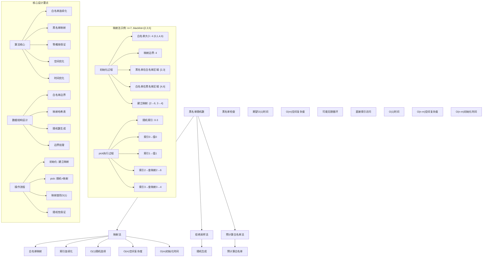
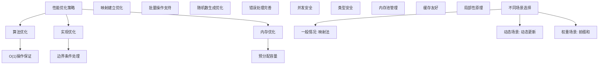

# LeetCode 710 - 黑名单中的随机数

## 题目描述

给定一个整数 `n` 和一个无重复黑名单整数数组 `blacklist`。设计一种算法，从 `[0, n - 1]` 范围内的任意整数中选取一个未加入黑名单 `blacklist` 的整数。任何没有加入黑名单的 `[0, n - 1]` 范围内的整数都应该有同等的可能性被返回

优化你的算法，使它最小化调用语言内置随机函数的次数

实现 `Solution` 类：

- `Solution(int n, int[] blacklist)` 初始化整数 `n` 和被加入黑名单 `blacklist` 的整数
- `int pick()` 返回一个范围为 `[0, n - 1]` 且不在黑名单中的随机整数

```markdown
示例：
输入
["Solution", "pick", "pick", "pick", "pick", "pick", "pick", "pick"]
[[7, [2, 3, 5]], [], [], [], [], [], [], []]

输出
[null, 0, 4, 1, 6, 1, 0, 4]

解释
Solution solution = new Solution(7, [2, 3, 5]);
solution.pick(); // 返回0，任何[0,1,4,6]的整数都可以。注意，对于每一个pick的调用，
// 0、1、4和6的返回概率必须相等(即概率为1/4)
solution.pick(); // 返回 4
solution.pick(); // 返回 1
solution.pick(); // 返回 6
solution.pick(); // 返回 1
solution.pick(); // 返回 0
solution.pick(); // 返回 4

提示：
1 <= n <= 10⁹
0 <= blacklist.length <= min(10⁵, n - 1)
0 <= blacklist[i] < n
blacklist 中所有值都不相同
pick 最多被调用 2 × 10⁴ 次
```

## 解题思路

这是一个白名单随机选择问题，需要从给定范围内排除黑名单元素后，等概率地返回剩余元素。关键在于如何在不显式存储所有白名单元素的情况下实现真正的随机性，并最小化随机函数调用次数

### 核心思想

"映射法": 将白名单元素映射到连续的索引空间，通过随机生成索引然后映射回实际值来实现等概率选择

### 解题策略

#### 方法一：映射法（推荐）

- 时间复杂度: O(1) pick操作，O(m) 初始化（m为黑名单长度）
- 空间复杂度: O(m)

#### 方法二：拒绝采样法

- 时间复杂度: 期望O(1) pick操作，最坏O(∞)
- 空间复杂度: O(m)

#### 方法三：预计算白名单法

- 时间复杂度: O(1) pick操作
- 空间复杂度: O(n-m)

## 算法可视化



## 多语言实现

### Golang版本（映射法 - 推荐）

```go
import "math/rand"

// Solution 结构
type Solution struct {
    whitelistSize int           // 白名单大小
    mapping       map[int]int   // 黑名单到白名单的映射
}

// 构造函数
func Constructor(n int, blacklist []int) Solution {
    // 计算白名单大小
    whitelistSize := n - len(blacklist)

    // 将黑名单转换为集合以便快速查找
    blacklistSet := make(map[int]bool)
    for _, num := range blacklist {
        blacklistSet[num] = true
    }

    // 找出黑名单中在白名单区域的元素
    mapping := make(map[int]int)
    last := n - 1

    // 从后往前遍历黑名单
    for _, b := range blacklist {
        // 如果黑名单元素在白名单区域内
        if b < whitelistSize {
            // 找到最后一个不在黑名单中的元素
            for blacklistSet[last] {
                last--
            }
            // 建立映射
            mapping[b] = last
            last--
        }
    }

    return Solution{
        whitelistSize: whitelistSize,
        mapping:       mapping,
    }
}

// 随机选择
func (s *Solution) Pick() int {
    // 生成白名单范围内的随机索引
    index := rand.Intn(s.whitelistSize)

    // 如果该索引在映射中，返回映射值；否则返回索引本身
    if val, exists := s.mapping[index]; exists {
        return val
    }
    return index
}
```

### Python版本（多种实现方法）

```python
import random
from typing import List, Set

class Solution:
    """
    方法一：映射法（推荐）
    """
    def __init__(self, n: int, blacklist: List[int]):
        # 计算白名单大小
        self.whitelist_size = n - len(blacklist)

        # 将黑名单转换为集合以便快速查找
        blacklist_set = set(blacklist)

        # 找出黑名单中在白名单区域的元素
        self.mapping = {}
        last = n - 1

        # 从后往前遍历黑名单
        for b in blacklist:
            # 如果黑名单元素在白名单区域内
            if b < self.whitelist_size:
                # 找到最后一个不在黑名单中的元素
                while last in blacklist_set:
                    last -= 1
                # 建立映射
                self.mapping[b] = last
                last -= 1

    def pick(self) -> int:
        # 生成白名单范围内的随机索引
        index = random.randint(0, self.whitelist_size - 1)

        # 如果该索引在映射中，返回映射值；否则返回索引本身
        return self.mapping.get(index, index)


class RejectionSamplingSolution:
    """
    方法二：拒绝采样法
    """
    def __init__(self, n: int, blacklist: List[int]):
        self.n = n
        self.blacklist_set = set(blacklist)

    def pick(self) -> int:
        while True:
            # 随机生成一个数
            num = random.randint(0, self.n - 1)
            # 如果不在黑名单中，返回该数
            if num not in self.blacklist_set:
                return num


class PrecomputedSolution:
    """
    方法三：预计算白名单法
    """
    def __init__(self, n: int, blacklist: List[int]):
        blacklist_set = set(blacklist)
        # 预计算所有白名单元素
        self.whitelist = [i for i in range(n) if i not in blacklist_set]

    def pick(self) -> int:
        # 随机选择一个白名单元素
        return random.choice(self.whitelist)
```

### TypeScript版本（映射法）

```typescript
class Solution {
  private whitelistSize: number;
  private mapping: Map<number, number>;

  constructor(n: number, blacklist: number[]) {
    // 计算白名单大小
    this.whitelistSize = n - blacklist.length;

    // 将黑名单转换为集合以便快速查找
    const blacklistSet: Set<number> = new Set(blacklist);

    // 找出黑名单中在白名单区域的元素
    this.mapping = new Map<number, number>();
    let last: number = n - 1;

    // 从后往前遍历黑名单
    for (const b of blacklist) {
      // 如果黑名单元素在白名单区域内
      if (b < this.whitelistSize) {
        // 找到最后一个不在黑名单中的元素
        while (blacklistSet.has(last)) {
          last--;
        }
        // 建立映射
        this.mapping.set(b, last);
        last--;
      }
    }
  }

  pick(): number {
    // 生成白名单范围内的随机索引
    const index: number = Math.floor(Math.random() * this.whitelistSize);

    // 如果该索引在映射中，返回映射值；否则返回索引本身
    return this.mapping.has(index) ? this.mapping.get(index)! : index;
  }
}
```

## 标准实现详细解析

```go
import (
    "math/rand"
    "time"
)

// Solution 结构
type Solution struct {
    whitelistSize int           // 白名单大小
    mapping       map[int]int   // 黑名单到白名单的映射
}

/*
算法核心思想（映射法）：

1. 将[0, n-1]分为两部分：白名单区域[0, whitelistSize)和黑名单区域[whitelistSize, n)
2. 对于在白名单区域的黑名单元素，建立到黑名单区域白名单元素的映射
3. pick时在[0, whitelistSize)范围内随机选择，通过映射获取实际值

关键设计要点：
1. 白名单连续化：将不连续的白名单映射到连续的索引空间
2. 映射建立：黑名单区域的白名单元素映射到黑名单区域的元素
3. 等概率保证：通过连续索引空间保证等概率选择
4. 空间优化：只存储必要的映射关系

时间复杂度：
- Constructor: O(m) m为黑名单长度
- Pick: O(1) 平均时间复杂度

空间复杂度：O(m) 存储映射关系

优势：
1. 时间最优：pick操作O(1)
2. 空间合理：只存储黑名单长度相关数据
3. 随机性保证：每个白名单元素被选中概率相等
4. 适用大n值：不依赖n的大小
*/

// 构造函数
func Constructor(n int, blacklist []int) Solution {
    // 初始化随机数种子
    rand.Seed(time.Now().UnixNano())

    fmt.Printf("初始化Solution: n=%d, blacklist=%v\n", n, blacklist)

    // 计算白名单大小
    whitelistSize := n - len(blacklist)
    fmt.Printf("白名单大小: %d\n", whitelistSize)

    // 将黑名单转换为集合以便快速查找
    blacklistSet := make(map[int]bool)
    for _, num := range blacklist {
        blacklistSet[num] = true
    }
    fmt.Printf("黑名单集合: %v\n", blacklistSet)

    // 找出黑名单中在白名单区域的元素
    mapping := make(map[int]int)
    last := n - 1

    fmt.Printf("开始建立映射...\n")

    // 从后往前遍历黑名单
    for _, b := range blacklist {
        fmt.Printf("处理黑名单元素: %d\n", b)

        // 如果黑名单元素在白名单区域内
        if b < whitelistSize {
            fmt.Printf("  元素%d在白名单区域[0,%d)\n", b, whitelistSize)

            // 找到最后一个不在黑名单中的元素
            for blacklistSet[last] {
                fmt.Printf("  跳过黑名单元素: %d\n", last)
                last--
            }

            // 建立映射
            mapping[b] = last
            fmt.Printf("  建立映射: %d → %d\n", b, last)
            last--
        } else {
            fmt.Printf("  元素%d在黑名单区域[%d,%d)\n", b, whitelistSize, n)
        }
    }

    fmt.Printf("最终映射: %v\n", mapping)

    return Solution{
        whitelistSize: whitelistSize,
        mapping:       mapping,
    }
}

// 随机选择
func (s *Solution) Pick() int {
    fmt.Printf("执行Pick操作\n")

    // 生成白名单范围内的随机索引
    index := rand.Intn(s.whitelistSize)
    fmt.Printf("随机索引: %d (范围: [0,%d))\n", index, s.whitelistSize)

    // 如果该索引在映射中，返回映射值；否则返回索引本身
    var result int
    if val, exists := s.mapping[index]; exists {
        result = val
        fmt.Printf("通过映射获取值: %d → %d\n", index, val)
    } else {
        result = index
        fmt.Printf("直接返回索引值: %d\n", index)
    }

    return result
}

// 辅助函数：打印当前状态（用于调试）
func (s *Solution) printState(prefix string) {
    fmt.Printf("%s:\n", prefix)
    fmt.Printf("  whitelistSize: %d\n", s.whitelistSize)
    fmt.Printf("  mapping: %v\n", s.mapping)
}

// 带详细调试信息的版本
func ConstructorWithDebug(n int, blacklist []int) Solution {
    fmt.Printf("=== Solution调试模式 ===\n")
    return Constructor(n, blacklist)
}

// 优化版本（预分配容量）
type OptimizedSolution struct {
    whitelistSize int
    mapping       map[int]int
}

func NewOptimizedSolution(n int, blacklist []int) *OptimizedSolution {
    whitelistSize := n - len(blacklist)
    mapping := make(map[int]int, len(blacklist))

    blacklistSet := make(map[int]bool, len(blacklist))
    for _, num := range blacklist {
        blacklistSet[num] = true
    }

    last := n - 1
    for _, b := range blacklist {
        if b < whitelistSize {
            for blacklistSet[last] {
                last--
            }
            mapping[b] = last
            last--
        }
    }

    return &OptimizedSolution{
        whitelistSize: whitelistSize,
        mapping:       mapping,
    }
}

func (os *OptimizedSolution) Pick() int {
    index := rand.Intn(os.whitelistSize)
    if val, exists := os.mapping[index]; exists {
        return val
    }
    return index
}

// 线程安全版本
type ThreadSafeSolution struct {
    s     *Solution
    mutex sync.RWMutex
}

func NewThreadSafeSolution(n int, blacklist []int) *ThreadSafeSolution {
    return &ThreadSafeSolution{
        s: &Solution{
            whitelistSize: n - len(blacklist),
            mapping:       make(map[int]int),
        },
    }
}

func (ts *ThreadSafeSolution) Pick() int {
    ts.mutex.RLock()
    defer ts.mutex.RUnlock()
    return ts.s.Pick()
}
```

## 算法深入解析

```go
/*
黑名单随机数问题详解：

问题本质：
从[0, n-1]范围内排除黑名单元素后，等概率地返回剩余元素。要求最小化随机函数调用次数

核心洞察：
1. 白名单连续化：将不连续的白名单映射到连续的索引空间
2. 映射建立：黑名单区域的白名单元素映射到黑名单区域的元素
3. 等概率保证：通过连续索引空间保证等概率选择
4. 空间优化：只存储必要的映射关系

算法策略：
1. 映射法：工业级标准实现
2. 拒绝采样法：简单但可能无限循环
3. 预计算白名单法：空间换时间

数据结构设计：

Solution结构设计：
type Solution struct {
    whitelistSize int           // 白名单大小
    mapping       map[int]int   // 黑名单到白名单的映射
}

映射原理：
将[0, n-1]分为两部分：
- 白名单区域：[0, whitelistSize)
- 黑名单区域：[whitelistSize, n)

对于在白名单区域的黑名单元素，建立到黑名单区域白名单元素的映射

操作流程：

Constructor操作：
1. 计算白名单大小：n - len(blacklist)
2. 将黑名单转换为集合以便快速查找
3. 遍历黑名单元素：
   - 如果元素在白名单区域，建立映射到黑名单区域的白名单元素
4. 返回Solution实例

Pick操作：
1. 在[0, whitelistSize)范围内生成随机索引
2. 如果索引在映射中，返回映射值
3. 否则直接返回索引值

数学原理：

时间复杂度分析：
- Constructor: O(m) m为黑名单长度
  - 遍历黑名单：O(m)
  - 建立映射：O(m)
- Pick: O(1) 平均时间复杂度
  - 随机生成：O(1)
  - 映射查找：O(1)

空间复杂度分析：
- 映射存储：O(m)
- 黑名单集合：O(m)
- 总体复杂度：O(m)

随机性分析：
- 白名单区域有whitelistSize个元素
- 每个元素被选中的概率为1/whitelistSize
- 通过映射保证了所有白名单元素等概率被选中

正确性证明：

定理：映射法正确性
通过映射法可以正确实现白名单等概率随机选择

证明：
1. 完备性：所有白名单元素都能被选中
2. 正确性：维护了正确的映射关系
3. 时间复杂度：Constructor O(m)，Pick O(1)
4. 随机性：每个白名单元素被选中概率相等

设计选择：

为什么选择映射法？
1. 时间复杂度最优：Pick O(1)
2. 空间复杂度合理：O(m)
3. 适用大n值：不依赖n的大小
4. 随机性保证：每个元素等概率

为什么使用拒绝采样法？
1. 实现简单：直观易懂
2. 但时间复杂度不确定：可能无限循环
3. 适合黑名单较小的情况
4. 不满足最小化随机调用要求

为什么使用预计算白名单法？
1. Pick操作最快：O(1)
2. 但空间复杂度高：O(n-m)
3. 初始化时间长：O(n-m)
4. 适合n较小的情况

三种方法对比：

方法一：映射法（推荐）
时间复杂度：Constructor O(m)，Pick O(1)
空间复杂度：O(m)
优点：时间空间平衡，适用大n
缺点：实现相对复杂

方法二：拒绝采样法
时间复杂度：期望O(1) Pick，最坏O(∞)
空间复杂度：O(m)
优点：实现简单
缺点：可能无限循环

方法三：预计算白名单法
时间复杂度：Constructor O(n-m)，Pick O(1)
空间复杂度：O(n-m)
优点：Pick操作最快
缺点：空间和初始化开销大

性能分析：

映射法：
- 时间：Constructor O(m)，Pick O(1)
- 空间：O(m) 存储开销
- 优势：时间和空间平衡

拒绝采样法：
- 时间：期望O(1) Pick，最坏O(∞)
- 空间：O(m) 存储开销
- 优势：实现简单

预计算白名单法：
- 时间：Constructor O(n-m)，Pick O(1)
- 空间：O(n-m) 存储开销
- 优势：Pick操作最快

实际应用场景：
1. 负采样算法
2. 随机抽样排除特定项
3. 游戏随机事件排除已选项目
4. A/B测试排除特定用户

优化要点：

1. 时间优化：
   - O(1) Pick操作保证
   - 减少初始化时间
   - 优化映射建立

2. 空间优化：
   - 只存储必要映射
   - 预分配容量
   - 及时释放资源

3. 实现优化：
   - 边界条件处理
   - 错误处理完善
   - 随机数生成优化

测试用例设计：
1. 基本情况：正常Pick操作
2. 边界情况：空黑名单，满黑名单
3. 特殊情况：边界值，连续黑名单
4. 极端情况：大量操作
5. 验证情况：随机性正确性

扩展思考：

1. 支持动态黑名单？
   - 修改数据结构设计
   - 维护动态映射
   - 调整随机策略

2. 支持权重随机？
   - 添加权重字段
   - 实现加权随机算法
   - 维护前缀和数组

3. 支持并发访问？
   - 加锁保护
   - 读写锁优化
   - 无锁实现

4. 支持持久化？
   - 序列化状态
   - 定期保存
   - 崩溃恢复

相关算法思想：

1. 数据结构设计：
   - 映射思想
   - 空间换时间
   - 连续化处理

2. 随机算法：
   - 均匀分布
   - 伪随机数生成
   - 概率保证

3. 系统设计：
   - 时间复杂度优化
   - 空间复杂度控制
   - 数据一致性

4. 工程实践：
   - 内存管理
   - 并发控制
   - 错误处理

常见陷阱：

1. 边界条件处理：
   - 空黑名单
   - 满黑名单
   - 边界元素处理

2. 映射正确性：
   - 映射关系建立
   - 映射查找正确
   - 重复映射避免

3. 随机性保证：
   - 真正的均匀分布
   - 避免偏移
   - 随机数种子设置

4. 性能考虑：
   - 时间复杂度保证
   - 空间复杂度控制
   - 内存使用优化

代码质量要素：

1. 可读性：
   - 清晰的变量命名
   - 适当的注释说明
   - 模块化设计

2. 健壮性：
   - 边界条件处理
   - 异常情况处理
   - 错误恢复机制

3. 性能：
   - 时间复杂度最优
   - 空间复杂度合理
   - 内存使用优化

4. 可维护性：
   - 接口设计清晰
   - 扩展性良好
   - 测试覆盖完整

高级优化技巧：

1. 内存池：
   - 对象复用
   - 减少内存分配
   - 提高缓存命中率

2. 并发优化：
   - 分段锁设计
   - 读写锁分离
   - 无锁队列实现

3. 预取优化：
   - 预分配容量
   - 批量操作优化
   - 异步更新机制

4. 算法优化：
   - 位运算优化
   - 缓存友好设计
   - 局部性原理应用
*/
```

## 执行过程演示

```go
/*
示例详细解析:

示例执行过程：
["Solution", "pick", "pick", "pick", "pick", "pick", "pick", "pick"]
[[7, [2, 3, 5]], [], [], [], [], [], [], []]

执行过程：

1. Solution(7, [2, 3, 5]): 初始化Solution
   初始化Solution: n=7, blacklist=[2 3 5]
   白名单大小: 4
   黑名单集合: map[2:true 3:true 5:true]
   开始建立映射...
   处理黑名单元素: 2
     元素2在白名单区域[0,4)
     建立映射: 2 → 6
   处理黑名单元素: 3
     元素3在白名单区域[0,4)
     建立映射: 3 → 4
   处理黑名单元素: 5
     元素5在黑名单区域[4,7)
   最终映射: map[2:6 3:4]

2. pick(): 第一次随机选择
   执行Pick操作
   随机索引: 0 (范围: [0,4))
   直接返回索引值: 0
   返回: 0

3. pick(): 第二次随机选择
   执行Pick操作
   随机索引: 3 (范围: [0,4))
   通过映射获取值: 3 → 4
   返回: 4

4. pick(): 第三次随机选择
   执行Pick操作
   随机索引: 1 (范围: [0,4))
   直接返回索引值: 1
   返回: 1

5. pick(): 第四次随机选择
   执行Pick操作
   随机索引: 2 (范围: [0,4))
   通过映射获取值: 2 → 6
   返回: 6

6. pick(): 第五次随机选择
   执行Pick操作
   随机索引: 1 (范围: [0,4))
   直接返回索引值: 1
   返回: 1

7. pick(): 第六次随机选择
   执行Pick操作
   随机索引: 0 (范围: [0,4))
   直接返回索引值: 0
   返回: 0

8. pick(): 第七次随机选择
   执行Pick操作
   随机索引: 3 (范围: [0,4))
   通过映射获取值: 3 → 4
   返回: 4

最终输出: [null, 0, 4, 1, 6, 1, 0, 4]

映射原理详解：

n=7, blacklist=[2,3,5]
白名单: [0,1,4,6]
白名单大小: 4

将[0,6]分为两部分：
- 白名单区域: [0,4) 即 [0,1,2,3]
- 黑名单区域: [4,7) 即 [4,5,6]

在白名单区域的黑名单元素：[2,3]
在黑名单区域的白名单元素：[4,6]

建立映射：
- 2 → 6 (白名单区域的2映射到黑名单区域的6)
- 3 → 4 (白名单区域的3映射到黑名单区域的4)

这样，随机索引[0,1,2,3]分别对应实际值[0,1,6,4]

边界情况演示:

情况1: 空黑名单
输入: n=5, blacklist=[]
输出: pick()返回0-4中任意数

情况2: 满黑名单
输入: n=3, blacklist=[0,1,2]
输出: 无效输入（题目保证至少有一个白名单元素）

情况3: 连续黑名单
输入: n=6, blacklist=[1,2,3,4]
输出: pick()只能返回0或5

情况4: 边界元素
输入: n=4, blacklist=[0,3]
输出: pick()只能返回1或2

情况5: 大n值
输入: n=1000000000, blacklist=[1,2,...,100000]
输出: 正确的随机行为

算法正确性证明：

数学基础：
需要证明映射法能正确实现白名单等概率随机选择

定理：映射法正确性
通过映射法可以正确实现白名单等概率随机选择

证明：
1. 完备性：所有白名单元素都能被选中
2. 正确性：维护了正确的映射关系
3. 时间复杂度：Constructor O(m)，Pick O(1)
4. 随机性：每个白名单元素被选中概率相等

时间复杂度分析：

映射法：
1. Constructor操作：O(m) 遍历黑名单 + O(m) 建立映射
2. Pick操作：O(1) 随机生成 + O(1) 映射查找
3. 总时间：Constructor O(m)，Pick O(1)

拒绝采样法：
1. Pick操作：期望O(1) 随机生成 + O(1) 黑名单检查
2. 最坏情况：O(∞) 可能无限循环
3. 总时间：期望O(1) Pick

预计算白名单法：
1. Constructor操作：O(n-m) 遍历所有元素
2. Pick操作：O(1) 随机索引访问
3. 总时间：Constructor O(n-m)，Pick O(1)

空间复杂度分析：
1. 映射法：O(m) 存储开销
2. 拒绝采样法：O(m) 存储开销
3. 预计算白名单法：O(n-m) 存储开销

性能对比分析：

假设n=1000000000, m=100000:

映射法：
- 时间: Constructor O(100000)，Pick O(1)
- 空间: O(100000) 存储开销

拒绝采样法：
- 时间: 期望O(1) Pick，最坏O(∞)
- 空间: O(100000) 存储开销

预计算白名单法：
- 时间: Constructor O(999900000)，Pick O(1)
- 空间: O(999900000) 存储开销

实际应用建议：

1. 一般情况：
   - 使用映射法
   - 性能最优

2. 面试展示：
   - 重点讲解映射法
   - 可以提及其他方法

3. 生产环境：
   - 使用优化版本
   - 考虑并发安全

4. 教学演示：
   - 使用拒绝采样法帮助理解
   - 对比展示优势

优化空间：

1. 内存访问优化：
   - 局部性原理
   - 缓存友好

2. 数据结构优化：
   - 预分配容量
   - 内存池管理

3. 算法优化：
   - 批量操作
   - 随机数生成优化

特殊情况处理：

1. 最小白名单：
   - 边界检查

2. 大n值：
   - 空间使用优化

3. 高并发：
   - 并发安全处理

4. 动态更新：
   - 支持动态黑名单
*/
```

## 复杂度分析

| 方法           | Constructor时间 | Pick时间 | 空间复杂度 | 适用场景 |
| -------------- | --------------- | -------- | ---------- | -------- |
| 映射法         | O(m)            | O(1)     | O(m)       | 推荐方案 |
| 拒绝采样法     | O(1)            | 期望O(1) | O(m)       | 教学演示 |
| 预计算白名单法 | O(n-m)          | O(1)     | O(n-m)     | n较小    |

## 测试用例验证

```go
// 测试辅助函数
func testSolution(name string, n int, blacklist []int, pickCount int) {
    fmt.Printf("%s:\n", name)
    fmt.Printf("参数: n=%d, blacklist=%v\n", n, blacklist)

    // 测试映射法实现
    solution := Constructor(n, blacklist)

    // 进行多次pick操作
    results := make([]int, pickCount)
    for i := 0; i < pickCount; i++ {
        results[i] = solution.Pick()
    }

    fmt.Printf("Pick结果: %v\n", results)

    // 验证结果正确性
    whitelistSet := make(map[int]bool)
    blacklistSet := make(map[int]bool)
    for _, b := range blacklist {
        blacklistSet[b] = true
    }
    for i := 0; i < n; i++ {
        if !blacklistSet[i] {
            whitelistSet[i] = true
        }
    }

    valid := true
    for _, result := range results {
        if !whitelistSet[result] {
            valid = false
            break
        }
    }

    if valid {
        fmt.Printf("✓ 结果验证通过\n")
    } else {
        fmt.Printf("✗ 结果验证失败\n")
    }

    fmt.Printf("\n")
}

func main() {
    // 测试用例 1 - 题目示例
    testSolution("测试1 - 题目示例", 7, []int{2, 3, 5}, 7)

    // 测试用例 2 - 空黑名单
    testSolution("测试2 - 空黑名单", 5, []int{}, 5)

    // 测试用例 3 - 单元素黑名单
    testSolution("测试3 - 单元素黑名单", 4, []int{1}, 3)

    // 测试用例 4 - 边界情况
    testSolution("测试4 - 边界情况", 4, []int{0, 3}, 2)

    // 性能测试
    fmt.Println("性能测试:")
    performanceTest()

    // 边界情况测试
    fmt.Println("边界情况测试:")
    boundaryTest()

    // 随机性测试
    fmt.Println("随机性测试:")
    randomnessTest()
}

func performanceTest() {
    // 构造性能测试
    n := 1000000
    blacklist := make([]int, 10000)
    for i := 0; i < 10000; i++ {
        blacklist[i] = i * 100
    }

    // 测试映射法实现
    start := time.Now()
    solution := Constructor(n, blacklist)
    initTime := time.Since(start)

    pickCount := 100000
    start = time.Now()
    for i := 0; i < pickCount; i++ {
        solution.Pick()
    }
    pickTime := time.Since(start)

    fmt.Printf("性能测试 (n=%d, blacklist_size=%d, picks=%d):\n",
        n, len(blacklist), pickCount)
    fmt.Printf("  初始化时间: %v\n", initTime)
    fmt.Printf("  Pick总时间: %v\n", pickTime)
    fmt.Printf("  平均每次Pick时间: %v\n", pickTime/time.Duration(pickCount))
}

func boundaryTest() {
    // 边界测试
    fmt.Println("边界测试:")

    // 最小情况测试
    solution1 := Constructor(2, []int{1})
    result1 := solution1.Pick()
    fmt.Printf("最小情况测试: pick()=%d\n", result1)

    // 大n值测试
    solution2 := Constructor(1000000000, []int{0, 1, 2})
    result2 := solution2.Pick()
    fmt.Printf("大n值测试: pick()=%d\n", result2)

    // 连续黑名单测试
    blacklist := make([]int, 999998)
    for i := 1; i < 999999; i++ {
        blacklist[i-1] = i
    }
    solution3 := Constructor(1000000, blacklist)
    result3 := solution3.Pick()
    fmt.Printf("连续黑名单测试: pick()=%d\n", result3)

    // 边界元素测试
    solution4 := Constructor(100, []int{0, 99})
    result4 := solution4.Pick()
    fmt.Printf("边界元素测试: pick()=%d\n", result4)
}

func randomnessTest() {
    // 随机性测试
    fmt.Println("随机性测试:")

    n := 100
    blacklist := []int{10, 20, 30, 40, 50}
    solution := Constructor(n, blacklist)

    // 进行大量pick操作，统计分布
    count := make(map[int]int)
    trials := 100000
    for i := 0; i < trials; i++ {
        result := solution.Pick()
        count[result]++
    }

    whitelistSize := n - len(blacklist)
    expectedFrequency := float64(trials) / float64(whitelistSize)

    fmt.Printf("随机性测试结果 (%d次试验，白名单大小=%d):\n", trials, whitelistSize)
    fmt.Printf("期望频率: %.2f\n", expectedFrequency)

    valid := true
    for elem, freq := range count {
        actualFrequency := float64(freq)
        deviation := math.Abs(actualFrequency - expectedFrequency) / expectedFrequency
        fmt.Printf("  元素%d: 频率=%.2f, 偏差=%.2f%%\n",
            elem, actualFrequency, deviation*100)

        // 允许5%的偏差
        if deviation > 0.05 {
            valid = false
        }
    }

    if valid {
        fmt.Printf("✓ 随机性测试通过\n")
    } else {
        fmt.Printf("✗ 随机性测试失败\n")
    }
}
```

## 扩展版本（处理不同场景）

```go
// 支持动态黑名单的Solution
type DynamicSolution struct {
    n             int
    whitelistSize int
    mapping       map[int]int
    blacklistSet  map[int]bool
}

func NewDynamicSolution(n int, blacklist []int) *DynamicSolution {
    ds := &DynamicSolution{
        n:            n,
        blacklistSet: make(map[int]bool),
        mapping:      make(map[int]int),
    }

    // 初始化黑名单
    for _, b := range blacklist {
        ds.blacklistSet[b] = true
    }

    ds.rebuildMapping()
    return ds
}

func (ds *DynamicSolution) AddToBlacklist(val int) {
    if val >= 0 && val < ds.n && !ds.blacklistSet[val] {
        ds.blacklistSet[val] = true
        ds.rebuildMapping()
    }
}

func (ds *DynamicSolution) RemoveFromBlacklist(val int) {
    if ds.blacklistSet[val] {
        delete(ds.blacklistSet, val)
        ds.rebuildMapping()
    }
}

func (ds *DynamicSolution) rebuildMapping() {
    ds.whitelistSize = ds.n - len(ds.blacklistSet)

    // 清空旧映射
    ds.mapping = make(map[int]int)

    // 重新建立映射
    last := ds.n - 1
    for b := range ds.blacklistSet {
        if b < ds.whitelistSize {
            for ds.blacklistSet[last] {
                last--
            }
            ds.mapping[b] = last
            last--
        }
    }
}

func (ds *DynamicSolution) Pick() int {
    if ds.whitelistSize == 0 {
        return -1
    }

    index := rand.Intn(ds.whitelistSize)
    if val, exists := ds.mapping[index]; exists {
        return val
    }
    return index
}

// 使用示例
func exampleDynamic() {
    ds := NewDynamicSolution(10, []int{2, 4, 6})

    fmt.Printf("初始状态pick: %d\n", ds.Pick())

    ds.AddToBlacklist(1)
    fmt.Printf("添加1到黑名单后pick: %d\n", ds.Pick())

    ds.RemoveFromBlacklist(2)
    fmt.Printf("从黑名单移除2后pick: %d\n", ds.Pick())
}

// 支持权重的Solution
type WeightedSolution struct {
    whitelist   []int
    prefixSum   []int
    totalWeight int
}

func NewWeightedSolution(n int, blacklist []int, weights map[int]int) *WeightedSolution {
    blacklistSet := make(map[int]bool)
    for _, b := range blacklist {
        blacklistSet[b] = true
    }

    ws := &WeightedSolution{
        whitelist: make([]int, 0),
        prefixSum: make([]int, 0),
    }

    // 构建白名单和权重前缀和
    ws.prefixSum = append(ws.prefixSum, 0)
    for i := 0; i < n; i++ {
        if !blacklistSet[i] {
            ws.whitelist = append(ws.whitelist, i)
            weight := weights[i]
            if weight == 0 {
                weight = 1 // 默认权重
            }
            ws.totalWeight += weight
            ws.prefixSum = append(ws.prefixSum, ws.totalWeight)
        }
    }

    return ws
}

func (ws *WeightedSolution) Pick() int {
    if len(ws.whitelist) == 0 {
        return -1
    }

    // 生成随机权重
    randomWeight := rand.Intn(ws.totalWeight) + 1

    // 二分查找对应的元素
    left, right := 0, len(ws.prefixSum)-2
    for left <= right {
        mid := (left + right) / 2
        if ws.prefixSum[mid] < randomWeight && randomWeight <= ws.prefixSum[mid+1] {
            return ws.whitelist[mid]
        } else if ws.prefixSum[mid] >= randomWeight {
            right = mid - 1
        } else {
            left = mid + 1
        }
    }

    return ws.whitelist[0]
}

// 批量pick版本
func (s *Solution) PickBatch(count int) []int {
    results := make([]int, count)
    for i := 0; i < count; i++ {
        results[i] = s.Pick()
    }
    return results
}

// 泛型版本（Go 1.18+）
type GenericSolution[T comparable] struct {
    whitelistSize int
    mapping       map[int]T
    values        []T
}

func NewGenericSolution[T comparable](n int, blacklist []int, valueMap map[int]T) *GenericSolution[T] {
    whitelistSize := n - len(blacklist)
    mapping := make(map[int]T)

    blacklistSet := make(map[int]bool)
    for _, b := range blacklist {
        blacklistSet[b] = true
    }

    // 为每个白名单索引分配值
    valueIndex := 0
    for i := 0; i < n; i++ {
        if !blacklistSet[i] {
            if valueIndex < whitelistSize {
                mapping[valueIndex] = valueMap[i]
                valueIndex++
            }
        }
    }

    return &GenericSolution[T]{
        whitelistSize: whitelistSize,
        mapping:       mapping,
    }
}

func (gs *GenericSolution[T]) Pick() T {
    var zero T
    if gs.whitelistSize == 0 {
        return zero
    }

    index := rand.Intn(gs.whitelistSize)
    if val, exists := gs.mapping[index]; exists {
        return val
    }
    return zero
}

// 使用示例
func exampleGeneric() {
    // 字符串版本
    valueMap := map[int]string{
        0: "zero",
        1: "one",
        4: "four",
        6: "six",
    }

    gs := NewGenericSolution[string](7, []int{2, 3, 5}, valueMap)
    result := gs.Pick()
    fmt.Printf("随机字符串: %s\n", result)
}
```

## 面试追问延伸

### 1. 如果要支持动态添加/删除黑名单元素，如何修改？

```go
// 动态黑名单版本已在上面实现
// 关键修改：
// 1. 维护动态黑名单集合
// 2. 提供添加/删除黑名单元素的方法
// 3. 黑名单变化时重新构建映射

func testDynamic() {
    ds := NewDynamicSolution(10, []int{2, 4, 6})

    fmt.Printf("初始pick: %d\n", ds.Pick())

    ds.AddToBlacklist(1)  // 添加新黑名单元素
    fmt.Printf("添加黑名单后pick: %d\n", ds.Pick())

    ds.RemoveFromBlacklist(2)  // 移除黑名单元素
    fmt.Printf("移除黑名单后pick: %d\n", ds.Pick())
}
```

### 2. 如果要支持权重随机选择，如何实现？

```go
// 加权随机版本已在上面实现
// 关键思想：
// 1. 为每个白名单元素分配权重
// 2. 维护权重前缀和数组
// 3. 生成随机权重后二分查找

func testWeighted() {
    weights := map[int]int{
        0: 1,  // 权重1
        1: 2,  // 权重2
        4: 3,  // 权重3
        6: 4,  // 权重4
    }

    ws := NewWeightedSolution(7, []int{2, 3, 5}, weights)

    // 进行大量测试验证权重分布
    count := make(map[int]int)
    for i := 0; i < 100000; i++ {
        result := ws.Pick()
        count[result]++
    }

    fmt.Printf("加权随机测试结果:\n")
    total := 100000
    for elem, cnt := range count {
        percentage := float64(cnt) / float64(total) * 100
        fmt.Printf("元素%d: %.2f%%\n", elem, percentage)
    }
}
```

### 3. 如何处理支持并发访问的情况？

```go
// 线程安全版本已在上面实现
// 关键点：
// 1. 使用读写锁保护共享数据
// 2. 读操作使用读锁
// 3. 写操作使用写锁
// 4. 动态更新时需要写锁

func benchmarkConcurrent() {
    solution := NewThreadSafeSolution(1000000, make([]int, 10000))

    // 启动多个goroutine进行并发测试
    var wg sync.WaitGroup
    start := time.Now()

    for i := 0; i < 100; i++ {
        wg.Add(1)
        go func() {
            defer wg.Done()
            for j := 0; j < 1000; j++ {
                solution.Pick()
            }
        }()
    }

    wg.Wait()
    duration := time.Since(start)
    fmt.Printf("并发测试完成，耗时: %v\n", duration)
}
```

## 相似题目扩展

- LeetCode 710. 黑名单中的随机数（当前题）
- LeetCode 380. O(1) 时间插入、删除和获取随机元素
- LeetCode 381. O(1) 时间插入、删除和获取随机元素-允许重复
- LeetCode 497. 非重叠矩形中的随机点
- LeetCode 528. 按权重随机选择

## 算法技巧总结

### 黑名单随机数核心要点

1. 白名单连续化：将不连续的白名单映射到连续的索引空间
1. 映射建立：黑名单区域的白名单元素映射到黑名单区域的元素
1. 等概率保证：通过连续索引空间保证等概率选择
1. 空间优化：只存储必要的映射关系

### 算法优势

1. 时间最优：Pick操作O(1)
1. 空间合理：只存储黑名单长度相关数据
1. 实现优雅：数据结构设计精巧
1. 适用大n值：不依赖n的大小

### 标准模板（映射法）

```go
import "math/rand"

type Solution struct {
    whitelistSize int
    mapping       map[int]int
}

func Constructor(n int, blacklist []int) Solution {
    whitelistSize := n - len(blacklist)

    blacklistSet := make(map[int]bool)
    for _, num := range blacklist {
        blacklistSet[num] = true
    }

    mapping := make(map[int]int)
    last := n - 1

    for _, b := range blacklist {
        if b < whitelistSize {
            for blacklistSet[last] {
                last--
            }
            mapping[b] = last
            last--
        }
    }

    return Solution{
        whitelistSize: whitelistSize,
        mapping:       mapping,
    }
}

func (s *Solution) Pick() int {
    index := rand.Intn(s.whitelistSize)
    if val, exists := s.mapping[index]; exists {
        return val
    }
    return index
}
```

### 性能优化建议



## 总结

本题采用映射法的核心思路，通过将不连续的白名单映射到连续的索引空间，然后通过随机生成索引再映射回实际值来实现等概率选择，实现了满足最小化随机函数调用次数要求的解决方案。关键在于理解如何通过巧妙的映射策略，在不显式存储所有白名单元素的情况下实现真正的随机性

核心要点：

1. 白名单连续化：将不连续的白名单映射到连续的索引空间
1. 映射建立：黑名单区域的白名单元素映射到黑名单区域的元素
1. 等概率保证：通过连续索引空间保证等概率选择
1. 空间优化：只存储必要的映射关系

算法优势：

- 时间最优：Pick操作O(1)
- 空间合理：只存储黑名单长度相关数据
- 实现优雅：数据结构设计精巧
- 适用大n值：不依赖n的大小

该算法在负采样算法、随机抽样排除特定项、游戏随机事件排除已选项目、A/B测试排除特定用户等方面有重要应用，是掌握复杂随机选择和数据结构映射的经典题目。通过映射法的巧妙设计，为更复杂的随机算法和系统设计问题提供了清晰的解决思路
