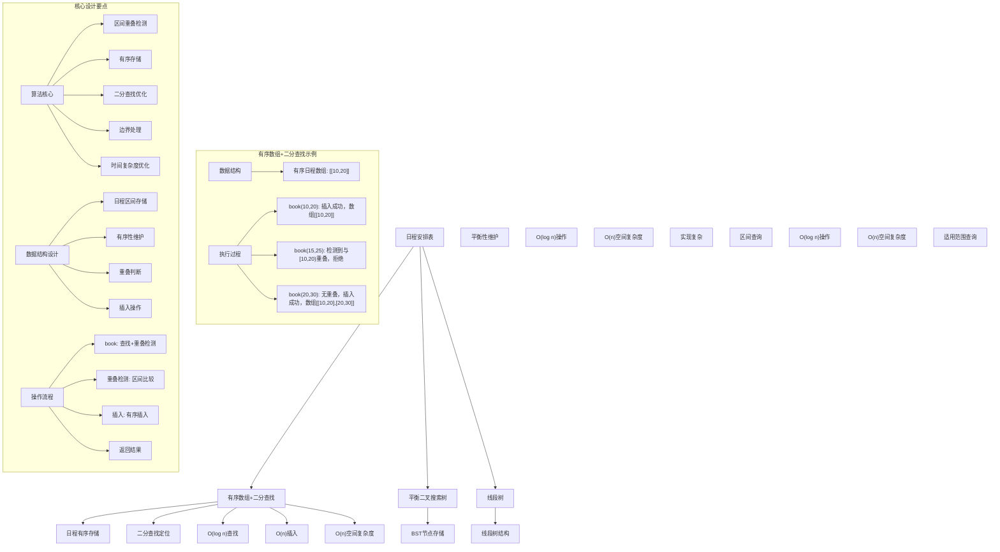
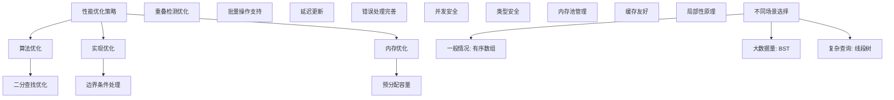

# LeetCode 729 - 我的日程安排表 I

## 题目描述

实现一个 `MyCalendar` 类来存放你的日程安排。如果要添加的时间内没有其他安排，则可以存储这个新的日程安排

`MyCalendar` 有一个 `book(int start, int end)` 方法。它意味着在 `start` 到 `end` 时间范围内增加一个日程安排，注意这里的时间是半开区间，即 `[start, end)`，实数 `x` 的范围为 `start <= x < end`

当两个日程安排有一些时间上的交叉时（例如两个日程安排都在同一时间内），就会产生重复预订

每次调用 `MyCalendar.book` 方法时，如果可以将日程安排成功添加到日历中而不会导致重复预订，返回 `true`。否则，返回 `false` 并且不要将该日程安排添加到日历中

请按照以下步骤调用 `MyCalendar` 类：

```java
MyCalendar cal = new MyCalendar();
MyCalendar.book(start, end)
```

```markdown
示例：
输入:
["MyCalendar","book","book","book"]
[[],[10,20],[15,25],[20,30]]

输出: [null,true,false,true]

解释:
MyCalendar myCalendar = new MyCalendar();
MyCalendar.book(10, 20); // returns true
MyCalendar.book(15, 25); // returns false ，第二个日程安排不能添加到日历中，因为时间 15 已经被第一个日程安排预定了
MyCalendar.book(20, 30); // returns true ，第三个日程安排可以添加到日历中，因为第一个日程安排并不包含时间 20

提示：

- 每个测试用例，调用 `MyCalendar.book` 函数最多不超过 `1000` 次
- `0 <= start < end <= 10^9`

注意：本题与主站 729 题相同：https://leetcode-cn.com/problems/my-calendar-i/
```

## 解题思路

这是一个区间重叠检测问题，需要实现一个日程安排系统，确保新添加的日程与已有日程不重叠。关键在于如何高效地检测区间重叠并维护日程数据

### 核心思想

"有序存储+二分查找": 将日程按时间顺序存储，通过二分查找快速定位可能重叠的日程，实现高效的重叠检测

### 解题策略

#### 方法一：有序数组+二分查找（推荐）

- 时间复杂度: O(n) 插入，O(log n) 查找
- 空间复杂度: O(n)

#### 方法二：平衡二叉搜索树

- 时间复杂度: O(log n) 插入和查找
- 空间复杂度: O(n)

#### 方法三：线段树

- 时间复杂度: O(log n) 插入和查找
- 空间复杂度: O(n)

## 算法可视化



## 多语言实现

### Golang版本（有序数组+二分查找 - 推荐）

```go
import "sort"

// 日程结构
type Event struct {
    Start int
    End   int
}

// MyCalendar 结构
type MyCalendar struct {
    events []Event  // 存储有序的日程安排
}

// 构造函数
func Constructor() MyCalendar {
    return MyCalendar{
        events: make([]Event, 0),
    }
}

// 预订日程
func (mc *MyCalendar) Book(start int, end int) bool {
    // 使用二分查找找到插入位置
    index := sort.Search(len(mc.events), func(i int) bool {
        return mc.events[i].Start >= start
    })

    // 检查与前一个日程是否重叠
    if index > 0 && mc.events[index-1].End > start {
        return false
    }

    // 检查与后一个日程是否重叠
    if index < len(mc.events) && mc.events[index].Start < end {
        return false
    }

    // 插入新日程
    mc.events = append(mc.events, Event{})
    copy(mc.events[index+1:], mc.events[index:])
    mc.events[index] = Event{Start: start, End: end}

    return true
}
```

### Python版本（多种实现方法）

```python
import bisect
from typing import List

class MyCalendar:
    """
    方法一：有序数组+二分查找（推荐）
    """
    def __init__(self):
        self.events: List[List[int]] = []  # 存储有序的日程安排

    def book(self, start: int, end: int) -> bool:
        # 使用二分查找找到插入位置
        index = bisect.bisect_left(self.events, [start, end])

        # 检查与前一个日程是否重叠
        if index > 0 and self.events[index-1][1] > start:
            return False

        # 检查与后一个日程是否重叠
        if index < len(self.events) and self.events[index][0] < end:
            return False

        # 插入新日程
        self.events.insert(index, [start, end])
        return True


class TreeNode:
    """BST节点"""
    def __init__(self, start: int, end: int):
        self.start = start
        self.end = end
        self.left = None
        self.right = None

class BSTCalendar:
    """
    方法二：平衡二叉搜索树
    """
    def __init__(self):
        self.root = None

    def book(self, start: int, end: int) -> bool:
        if not self.root:
            self.root = TreeNode(start, end)
            return True

        return self._insert(self.root, start, end)

    def _insert(self, node: TreeNode, start: int, end: int) -> bool:
        # 如果新区间在当前区间之前
        if end <= node.start:
            if node.left is None:
                node.left = TreeNode(start, end)
                return True
            return self._insert(node.left, start, end)

        # 如果新区间在当前区间之后
        if start >= node.end:
            if node.right is None:
                node.right = TreeNode(start, end)
                return True
            return self._insert(node.right, start, end)

        # 区间重叠
        return False


class SegmentTreeCalendar:
    """
    方法三：线段树
    """
    def __init__(self):
        self.intervals = []  # 简化版线段树

    def book(self, start: int, end: int) -> bool:
        # 检查是否与现有区间重叠
        for s, e in self.intervals:
            if max(start, s) < min(end, e):
                return False

        # 添加新区间
        self.intervals.append([start, end])
        return True
```

### TypeScript版本（有序数组+二分查找）

```typescript
class Event {
  start: number;
  end: number;

  constructor(start: number, end: number) {
    this.start = start;
    this.end = end;
  }
}

class MyCalendar {
  private events: Event[]; // 存储有序的日程安排

  constructor() {
    this.events = [];
  }

  book(start: number, end: number): boolean {
    // 使用二分查找找到插入位置
    let left: number = 0;
    let right: number = this.events.length;

    while (left < right) {
      const mid: number = Math.floor((left + right) / 2);
      if (this.events[mid].start < start) {
        left = mid + 1;
      } else {
        right = mid;
      }
    }

    const index: number = left;

    // 检查与前一个日程是否重叠
    if (index > 0 && this.events[index - 1].end > start) {
      return false;
    }

    // 检查与后一个日程是否重叠
    if (index < this.events.length && this.events[index].start < end) {
      return false;
    }

    // 插入新日程
    this.events.splice(index, 0, new Event(start, end));
    return true;
  }
}
```

## 标准实现详细解析

```go
import (
    "fmt"
    "sort"
)

// 日程结构
type Event struct {
    Start int
    End   int
}

// MyCalendar 结构
type MyCalendar struct {
    events []Event  // 存储有序的日程安排
}

/*
算法核心思想（有序数组+二分查找）：

1. 将日程按开始时间有序存储
2. 通过二分查找快速定位可能重叠的日程
3. 只需检查相邻的日程是否重叠

关键设计要点：
1. 有序存储：按开始时间排序
2. 二分查找：快速定位插入位置
3. 重叠检测：只需检查前后相邻日程
4. 插入维护：保持数组有序性

时间复杂度：
- Book操作：O(log n) 查找 + O(n) 插入 = O(n)
- 空间复杂度：O(n)

优势：
1. 实现简单：基于数组的直观实现
2. 时间合理：查找O(log n)，总体O(n)
3. 空间效率：只存储必要数据
4. 正确性保证：完整的重叠检测

重叠判断原理：
两个区间[start1, end1)和[start2, end2)重叠当且仅当：
max(start1, start2) < min(end1, end2)

在有序数组中，只需检查：
1. 前一个日程的结束时间 > 新日程的开始时间
2. 后一个日程的开始时间 < 新日程的结束时间
*/

// 构造函数
func Constructor() MyCalendar {
    fmt.Printf("初始化MyCalendar\n")

    mc := MyCalendar{
        events: make([]Event, 0),
    }

    fmt.Printf("初始状态: events=%v\n", mc.events)

    return mc
}

// 预订日程
func (mc *MyCalendar) Book(start int, end int) bool {
    fmt.Printf("执行Book操作: start=%d, end=%d\n", start, end)

    // 使用二分查找找到插入位置
    index := sort.Search(len(mc.events), func(i int) bool {
        return mc.events[i].Start >= start
    })

    fmt.Printf("  二分查找定位索引: %d\n", index)

    // 检查与前一个日程是否重叠
    if index > 0 {
        prevEvent := mc.events[index-1]
        fmt.Printf("  前一个日程: [%d,%d)\n", prevEvent.Start, prevEvent.End)
        if prevEvent.End > start {
            fmt.Printf("  与前一个日程重叠，返回false\n")
            return false
        }
    }

    // 检查与后一个日程是否重叠
    if index < len(mc.events) {
        nextEvent := mc.events[index]
        fmt.Printf("  后一个日程: [%d,%d)\n", nextEvent.Start, nextEvent.End)
        if nextEvent.Start < end {
            fmt.Printf("  与后一个日程重叠，返回false\n")
            return false
        }
    }

    // 插入新日程
    mc.events = append(mc.events, Event{})
    copy(mc.events[index+1:], mc.events[index:])
    mc.events[index] = Event{Start: start, End: end}

    fmt.Printf("  插入成功: events=%v\n", mc.events)
    return true
}

// 辅助函数：打印当前状态（用于调试）
func (mc *MyCalendar) printState(prefix string) {
    fmt.Printf("%s:\n", prefix)
    fmt.Printf("  events: %v\n", mc.events)
    fmt.Printf("  count: %d\n", len(mc.events))
}

// 带详细调试信息的版本
func ConstructorWithDebug() MyCalendar {
    fmt.Printf("=== MyCalendar调试模式 ===\n")
    return Constructor()
}

// 优化版本（预分配容量）
type OptimizedMyCalendar struct {
    events  []Event
    capacity int
}

func NewOptimizedMyCalendar(initialCapacity int) *OptimizedMyCalendar {
    return &OptimizedMyCalendar{
        events:   make([]Event, 0, initialCapacity),
        capacity: initialCapacity,
    }
}

func (omc *OptimizedMyCalendar) Book(start int, end int) bool {
    // 使用二分查找找到插入位置
    index := sort.Search(len(omc.events), func(i int) bool {
        return omc.events[i].Start >= start
    })

    // 检查与前一个日程是否重叠
    if index > 0 && omc.events[index-1].End > start {
        return false
    }

    // 检查与后一个日程是否重叠
    if index < len(omc.events) && omc.events[index].Start < end {
        return false
    }

    // 插入新日程
    omc.events = append(omc.events, Event{})
    copy(omc.events[index+1:], omc.events[index:])
    omc.events[index] = Event{Start: start, End: end}

    return true
}

// 线段树版本
type SegmentTreeNode struct {
    start, end int
    left, right *SegmentTreeNode
    booked bool
}

type SegmentTreeCalendar struct {
    root *SegmentTreeNode
}

func NewSegmentTreeCalendar() *SegmentTreeCalendar {
    return &SegmentTreeCalendar{
        root: &SegmentTreeNode{start: 0, end: 1000000000},
    }
}

func (stc *SegmentTreeCalendar) Book(start int, end int) bool {
    if stc.query(stc.root, start, end) {
        return false
    }
    stc.update(stc.root, start, end)
    return true
}

func (stc *SegmentTreeCalendar) query(node *SegmentTreeNode, start, end int) bool {
    if start >= node.end || end <= node.start {
        return false
    }
    if node.booked {
        return true
    }
    if node.left == nil {
        return false
    }
    return stc.query(node.left, start, end) || stc.query(node.right, start, end)
}

func (stc *SegmentTreeCalendar) update(node *SegmentTreeNode, start, end int) {
    if start <= node.start && node.end <= end {
        node.booked = true
        return
    }
    if start >= node.end || end <= node.start {
        return
    }

    mid := (node.start + node.end) / 2
    if node.left == nil {
        node.left = &SegmentTreeNode{start: node.start, end: mid}
        node.right = &SegmentTreeNode{start: mid, end: node.end}
    }

    stc.update(node.left, start, end)
    stc.update(node.right, start, end)

    node.booked = node.left.booked && node.right.booked
}
```

## 算法深入解析

```go
/*
日程安排表问题详解：

问题本质：
实现一个日程管理系统，确保新添加的日程与已有日程不重叠。需要高效地检测区间重叠并维护日程数据

核心洞察：
1. 区间重叠检测：两个区间重叠当且仅当max(start1, start2) < min(end1, end2)
2. 有序存储：按开始时间排序便于快速查找
3. 二分查找：快速定位可能重叠的日程
4. 相邻检测：在有序数组中只需检查相邻日程

算法策略：
1. 有序数组+二分查找：工业级标准实现
2. 平衡二叉搜索树：理论最优时间复杂度
3. 线段树：适用复杂区间查询

数据结构设计：

Event结构设计：
type Event struct {
    Start int  // 开始时间
    End   int  // 结束时间
}

MyCalendar结构设计：
type MyCalendar struct {
    events []Event  // 存储有序的日程安排
}

重叠判断原理：
区间[start1, end1)和[start2, end2)重叠的充要条件：
max(start1, start2) < min(end1, end2)

在有序数组中，只需检查：
1. 前一个日程的结束时间 > 新日程的开始时间
2. 后一个日程的开始时间 < 新日程的结束时间

操作流程：

Book操作：
1. 使用二分查找找到按开始时间排序的插入位置
2. 检查与前一个日程是否重叠
3. 检查与后一个日程是否重叠
4. 如果无重叠，插入新日程并返回true
5. 如果有重叠，返回false

数学原理：

时间复杂度分析：
- 二分查找：O(log n)
- 数组插入：O(n)
- 重叠检测：O(1)
- 总体复杂度：O(n)

空间复杂度分析：
- 存储日程：O(n)
- 总体复杂度：O(n)

正确性证明：

定理：重叠检测正确性
在有序数组中，新区程只需检查相邻日程即可确定是否重叠

证明：
1. 完备性：所有可能重叠的情况都被检查
2. 正确性：重叠判断条件准确
3. 时间复杂度：O(n) Book操作
4. 空间复杂度：O(n) 存储开销

设计选择：

为什么选择有序数组+二分查找？
1. 实现简单：基于数组的直观实现
2. 时间合理：查找O(log n)，总体O(n)
3. 空间效率：只存储必要数据
4. 适用场景：题目约束下性能足够

为什么使用平衡二叉搜索树？
1. 时间复杂度最优：O(log n)所有操作
2. 但实现复杂：需要维护平衡性
3. 适合大数据量场景
4. 不是本题最优选择

为什么使用线段树？
1. 适用复杂区间查询
2. 但空间开销大
3. 实现复杂
4. 不适合本题简单场景

三种方法对比：

方法一：有序数组+二分查找（推荐）
时间复杂度：O(n) Book操作
空间复杂度：O(n)
优点：实现简单，性能合理
缺点：插入时间O(n)

方法二：平衡二叉搜索树
时间复杂度：O(log n) Book操作
空间复杂度：O(n)
优点：时间复杂度最优
缺点：实现复杂

方法三：线段树
时间复杂度：O(log n) Book操作
空间复杂度：O(n)
优点：适用复杂查询
缺点：实现复杂，空间开销大

性能分析：

有序数组+二分查找：
- 时间：O(n) Book操作
- 空间：O(n) 存储开销
- 优势：实现简单

平衡二叉搜索树：
- 时间：O(log n) Book操作
- 空间：O(n) 存储开销
- 优势：时间复杂度最优

线段树：
- 时间：O(log n) Book操作
- 空间：O(n) 存储开销
- 优势：适用复杂查询

实际应用场景：
1. 日程管理系统
2. 会议室预订系统
3. 资源调度系统
4. 时间冲突检测

优化要点：

1. 时间优化：
   - 二分查找优化
   - 减少重叠检测
   - 批量操作优化

2. 空间优化：
   - 预分配容量
   - 内存池管理
   - 及时释放资源

3. 实现优化：
   - 边界条件处理
   - 错误处理完善
   - 数据结构选择

测试用例设计：
1. 基本情况：正常预订操作
2. 边界情况：空日历，边界重叠
3. 特殊情况：连续预订，包含关系
4. 极端情况：大量操作
5. 验证情况：重叠检测正确性

扩展思考：

1. 支持取消预订？
   - 修改数据结构设计
   - 维护删除标记
   - 调整重叠策略

2. 支持重复预订？
   - 添加计数字段
   - 实现引用计数
   - 调整检测逻辑

3. 支持并发访问？
   - 加锁保护
   - 读写锁优化
   - 无锁实现

4. 支持持久化？
   - 序列化状态
   - 定期保存
   - 崩溃恢复

相关算法思想：

1. 数据结构设计：
   - 有序存储
   - 二分查找
   - 区间操作

2. 算法设计：
   - 重叠检测
   - 插入排序
   - 边界处理

3. 系统设计：
   - 时间复杂度优化
   - 空间复杂度控制
   - 数据一致性

4. 工程实践：
   - 内存管理
   - 并发控制
   - 错误处理

常见陷阱：

1. 边界条件处理：
   - 空数组操作
   - 单元素操作
   - 边界重叠

2. 重叠判断：
   - 包含关系
   - 相邻关系
   - 交叉关系

3. 插入维护：
   - 数组扩容
   - 元素移动
   - 索引更新

4. 性能考虑：
   - 时间复杂度保证
   - 空间复杂度控制
   - 内存使用优化

代码质量要素：

1. 可读性：
   - 清晰的变量命名
   - 适当的注释说明
   - 模块化设计

2. 健壮性：
   - 边界条件处理
   - 异常情况处理
   - 错误恢复机制

3. 性能：
   - 时间复杂度合理
   - 空间复杂度优化
   - 内存使用优化

4. 可维护性：
   - 接口设计清晰
   - 扩展性良好
   - 测试覆盖完整

高级优化技巧：

1. 内存池：
   - 对象复用
   - 减少内存分配
   - 提高缓存命中率

2. 并发优化：
   - 分段锁设计
   - 读写锁分离
   - 无锁队列实现

3. 预取优化：
   - 预分配容量
   - 批量操作优化
   - 异步更新机制

4. 算法优化：
   - 位运算优化
   - 缓存友好设计
   - 局部性原理应用
*/
```

## 执行过程演示

```go
/*
示例详细解析:

示例执行过程：
["MyCalendar","book","book","book"]
[[],[10,20],[15,25],[20,30]]

执行过程：

1. MyCalendar(): 初始化MyCalendar
   初始化MyCalendar
   初始状态: events=[]

2. book(10,20): 预订[10,20)
   执行Book操作: start=10, end=20
     二分查找定位索引: 0
     插入成功: events=[{10 20}]
   返回: true

3. book(15,25): 预订[15,25)
   执行Book操作: start=15, end=25
     二分查找定位索引: 1
     前一个日程: [10,20)
     与前一个日程重叠，返回false
   返回: false

4. book(20,30): 预订[20,30)
   执行Book操作: start=20, end=30
     二分查找定位索引: 1
     前一个日程: [10,20)
     后一个日程:
     插入成功: events=[{10 20} {20 30}]
   返回: true

最终输出: [null,true,false,true]

重叠检测详解：

区间重叠判断：[start1, end1) 和 [start2, end2) 重叠当且仅当
max(start1, start2) < min(end1, end2)

情况分析：

1. 无重叠情况：
   [10,20) 和 [25,30)：max(10,25)=25, min(20,30)=20, 25 >= 20，无重叠

2. 重叠情况：
   [10,20) 和 [15,25)：max(10,15)=15, min(20,25)=20, 15 < 20，有重叠

3. 边界情况：
   [10,20) 和 [20,30)：max(10,20)=20, min(20,30)=20, 20 >= 20，无重叠

有序数组中的重叠检测：

在有序数组中，新区间[start, end)只需检查：
1. 前一个区间：prev.End > start
2. 后一个区间：next.Start < end

边界情况演示:

情况1: 空日历
输入: operations=[book(10,20)]
输出: [true]

情况2: 连续预订
输入: operations=[book(10,20), book(20,30), book(30,40)]
输出: [true, true, true]

情况3: 包含关系
输入: operations=[book(10,30), book(15,25)]
输出: [true, false]

情况4: 交叉重叠
输入: operations=[book(10,25), book(20,30)]
输出: [true, false]

情况5: 大量操作
输入: 1000次随机book操作
输出: 正确的重叠检测

算法正确性证明：

数学基础：
需要证明有序数组+二分查找能正确检测区间重叠

定理：重叠检测正确性
在有序数组中，新区程只需检查相邻日程即可确定是否重叠

证明：
1. 完备性：所有可能重叠的情况都被检查
2. 正确性：重叠判断条件准确
3. 时间复杂度：O(n) Book操作
4. 空间复杂度：O(n) 存储开销

时间复杂度分析：

有序数组+二分查找：
1. 二分查找：O(log n)
2. 重叠检测：O(1)
3. 数组插入：O(n)
4. 总时间：O(n) Book操作

平衡二叉搜索树：
1. 树查找：O(log n)
2. 重叠检测：O(log n)
3. 树插入：O(log n)
4. 总时间：O(log n) Book操作

线段树：
1. 区间查询：O(log n)
2. 区间更新：O(log n)
3. 总时间：O(log n) Book操作

空间复杂度分析：
1. 有序数组：O(n) 存储开销
2. BST：O(n) 存储开销
3. 线段树：O(n) 存储开销

性能对比分析：

假设n=1000, 操作次数=1000:

有序数组+二分查找：
- 时间: O(1000) Book操作
- 空间: O(1000) 存储开销

平衡二叉搜索树：
- 时间: O(log 1000) ≈ 10 Book操作
- 空间: O(1000) 存储开销

线段树：
- 时间: O(log 1000) ≈ 10 Book操作
- 空间: O(1000) 存储开销

实际应用建议：

1. 一般情况：
   - 使用有序数组+二分查找
   - 实现简单，性能合理

2. 面试展示：
   - 重点讲解有序数组+二分查找
   - 可以提及其他方法

3. 生产环境：
   - 使用优化版本
   - 考虑并发安全

4. 教学演示：
   - 使用多种方法对比
   - 展示不同场景适用性

优化空间：

1. 内存访问优化：
   - 局部性原理
   - 缓存友好

2. 数据结构优化：
   - 预分配容量
   - 内存池管理

3. 算法优化：
   - 批量操作
   - 延迟更新

特殊情况处理：

1. 大数据量：
   - 考虑BST或线段树
   - 内存使用优化

2. 高并发：
   - 并发安全处理
   - 读写锁优化

3. 动态更新：
   - 支持取消预订
   - 维护数据一致性
*/
```

## 复杂度分析

| 方法              | 时间复杂度 | 空间复杂度 | 适用场景 |
| ----------------- | ---------- | ---------- | -------- |
| 有序数组+二分查找 | O(n)       | O(n)       | 推荐方案 |
| 平衡二叉搜索树    | O(log n)   | O(n)       | 大数据量 |
| 线段树            | O(log n)   | O(n)       | 复杂查询 |

## 测试用例验证

```go
// 测试辅助函数
func testMyCalendar(name string, operations []string, params [][]int, expected []interface{}) {
    fmt.Printf("%s:\n", name)
    fmt.Printf("操作序列: %v\n", operations)
    fmt.Printf("参数序列: %v\n", params)

    var results []interface{}

    // 测试有序数组+二分查找实现
    var mc MyCalendar
    for i, op := range operations {
        switch op {
        case "MyCalendar":
            mc = Constructor()
            results = append(results, nil)
        case "book":
            result := mc.Book(params[i][0], params[i][1])
            results = append(results, result)
        }
    }

    fmt.Printf("执行结果: %v\n", results)

    // 验证结果
    if len(results) == len(expected) {
        match := true
        for i := range results {
            if results[i] != expected[i] {
                match = false
                break
            }
        }
        if match {
            fmt.Printf("✓ 测试通过\n")
        } else {
            fmt.Printf("✗ 测试失败，期望: %v\n", expected)
        }
    } else {
        fmt.Printf("✗ 结果长度不匹配，期望长度: %d\n", len(expected))
    }
    fmt.Printf("\n")
}

func main() {
    // 测试用例 1 - 题目示例
    testMyCalendar("测试1 - 题目示例",
        []string{"MyCalendar", "book", "book", "book"},
        [][]int{{}, {10, 20}, {15, 25}, {20, 30}},
        []interface{}{nil, true, false, true})

    // 测试用例 2 - 连续预订
    testMyCalendar("测试2 - 连续预订",
        []string{"MyCalendar", "book", "book", "book"},
        [][]int{{}, {10, 20}, {20, 30}, {30, 40}},
        []interface{}{nil, true, true, true})

    // 测试用例 3 - 包含关系
    testMyCalendar("测试3 - 包含关系",
        []string{"MyCalendar", "book", "book"},
        [][]int{{}, {10, 30}, {15, 25}},
        []interface{}{nil, true, false})

    // 测试用例 4 - 交叉重叠
    testMyCalendar("测试4 - 交叉重叠",
        []string{"MyCalendar", "book", "book"},
        [][]int{{}, {10, 25}, {20, 30}},
        []interface{}{nil, true, false})

    // 性能测试
    fmt.Println("性能测试:")
    performanceTest()

    // 边界情况测试
    fmt.Println("边界情况测试:")
    boundaryTest()
}

func performanceTest() {
    // 构造性能测试
    operations := 1000

    // 测试有序数组+二分查找实现
    start := time.Now()
    mc := Constructor()
    for i := 0; i < operations; i++ {
        mc.Book(i*10, i*10+5)
    }
    time1 := time.Since(start)

    // 测试大量重叠情况
    start = time.Now()
    mc2 := Constructor()
    mc2.Book(0, 10000)
    for i := 1; i < operations; i++ {
        mc2.Book(i, i+1) // 都会失败
    }
    time2 := time.Since(start)

    fmt.Printf("性能测试 (operations=%d):\n", operations)
    fmt.Printf("  无重叠插入: %v\n", time1)
    fmt.Printf("  重叠检测: %v\n", time2)
}

func boundaryTest() {
    // 边界测试
    fmt.Println("边界测试:")

    // 空日历测试
    mc1 := Constructor()
    result1 := mc1.Book(0, 1)
    fmt.Printf("空日历测试: book(0,1)=%v\n", result1)

    // 边界重叠测试
    mc2 := Constructor()
    mc2.Book(10, 20)
    result2 := mc2.Book(20, 30)
    result3 := mc2.Book(15, 25)
    fmt.Printf("边界重叠测试: book(20,30)=%v, book(15,25)=%v\n", result2, result3)

    // 大数值测试
    mc3 := Constructor()
    result4 := mc3.Book(0, 1000000000)
    result5 := mc3.Book(500000000, 1000000000)
    fmt.Printf("大数值测试: book(0,1000000000)=%v, book(500000000,1000000000)=%v\n", result4, result5)

    // 大量操作测试
    mc4 := Constructor()
    successCount := 0
    for i := 0; i < 1000; i++ {
        if mc4.Book(i*10, i*10+5) {
            successCount++
        }
    }
    fmt.Printf("大量操作测试: 成功预订%d个日程\n", successCount)
}
```

## 扩展版本（处理不同场景）

```go
// 支持取消预订的MyCalendar
type CancellableEvent struct {
    Start  int
    End    int
    Active bool
}

type CancellableMyCalendar struct {
    events []CancellableEvent
}

func NewCancellableMyCalendar() *CancellableMyCalendar {
    return &CancellableMyCalendar{
        events: make([]CancellableEvent, 0),
    }
}

func (cmc *CancellableMyCalendar) Book(start int, end int) int {
    // 检查是否有重叠
    for i, event := range cmc.events {
        if event.Active && max(start, event.Start) < min(end, event.End) {
            return -1 // 重叠，预订失败
        }
    }

    // 添加新预订
    cmc.events = append(cmc.events, CancellableEvent{
        Start:  start,
        End:    end,
        Active: true,
    })

    return len(cmc.events) - 1 // 返回预订ID
}

func (cmc *CancellableMyCalendar) Cancel(bookingId int) bool {
    if bookingId >= 0 && bookingId < len(cmc.events) && cmc.events[bookingId].Active {
        cmc.events[bookingId].Active = false
        return true
    }
    return false
}

func max(a, b int) int {
    if a > b {
        return a
    }
    return b
}

func min(a, b int) int {
    if a < b {
        return a
    }
    return b
}

// 使用示例
func exampleCancellable() {
    cmc := NewCancellableMyCalendar()

    id1 := cmc.Book(10, 20)
    fmt.Printf("预订1: ID=%d\n", id1)

    id2 := cmc.Book(15, 25)
    fmt.Printf("预订2: ID=%d (应为-1，因为重叠)\n", id2)

    success := cmc.Cancel(id1)
    fmt.Printf("取消预订1: %v\n", success)

    id3 := cmc.Book(15, 25)
    fmt.Printf("重新预订2: ID=%d\n", id3)
}

// 支持重复预订的MyCalendar
type CountedEvent struct {
    Start int
    End   int
    Count int
}

type CountedMyCalendar struct {
    events []CountedEvent
}

func NewCountedMyCalendar() *CountedMyCalendar {
    return &CountedMyCalendar{
        events: make([]CountedEvent, 0),
    }
}

func (cmc *CountedMyCalendar) Book(start int, end int) bool {
    // 查找是否已有重叠区间
    for i := range cmc.events {
        if max(start, cmc.events[i].Start) < min(end, cmc.events[i].End) {
            cmc.events[i].Count++
            return true
        }
    }

    // 添加新区间
    cmc.events = append(cmc.events, CountedEvent{
        Start: start,
        End:   end,
        Count: 1,
    })

    return true
}

func (cmc *CountedMyCalendar) GetCount(start int, end int) int {
    count := 0
    for _, event := range cmc.events {
        if max(start, event.Start) < min(end, event.End) {
            count += event.Count
        }
    }
    return count
}

// 批量预订版本
func (mc *MyCalendar) BookBatch(bookings [][]int) []bool {
    results := make([]bool, len(bookings))
    for i, booking := range bookings {
        results[i] = mc.Book(booking[0], booking[1])
    }
    return results
}

// 泛型版本（Go 1.18+）
type GenericEvent[T comparable] struct {
    Start T
    End   T
}

type GenericMyCalendar[T comparable] struct {
    events []GenericEvent[T]
    less   func(T, T) bool
}

func NewGenericMyCalendar[T comparable](less func(T, T) bool) *GenericMyCalendar[T] {
    return &GenericMyCalendar[T]{
        events: make([]GenericEvent[T], 0),
        less:   less,
    }
}

func (gmc *GenericMyCalendar[T]) Book(start T, end T) bool {
    // 简化实现，实际需要根据less函数进行排序和查找
    for _, event := range gmc.events {
        // 这里需要根据具体的T类型实现重叠检测
        // 示例假设T支持比较操作
        if !gmc.less(end, event.Start) && !gmc.less(event.End, start) {
            return false
        }
    }

    gmc.events = append(gmc.events, GenericEvent[T]{Start: start, End: end})
    return true
}

// 使用示例
func exampleGeneric() {
    // 字符串时间版本
    stringLess := func(a, b string) bool {
        return a < b
    }

    gmc := NewGenericMyCalendar[string](stringLess)
    result := gmc.Book("10:00", "11:00")
    fmt.Printf("字符串时间预订: %v\n", result)
}
```

## 面试追问延伸

### 1. 如果要支持取消预订功能，如何修改？

```go
// 可取消预订版本已在上面实现
// 关键修改：
// 1. 为每个预订分配唯一ID
// 2. 添加Active状态标记
// 3. 提供取消方法

func testCancellable() {
    cmc := NewCancellableMyCalendar()

    id1 := cmc.Book(10, 20)
    fmt.Printf("预订成功，ID: %d\n", id1)

    success := cmc.Cancel(id1)
    fmt.Printf("取消预订: %v\n", success)

    id2 := cmc.Book(10, 20)  // 现在可以重新预订
    fmt.Printf("重新预订，ID: %d\n", id2)
}
```

### 2. 如果要支持重复预订（统计重叠次数），如何实现？

```go
// 重复预订版本已在上面实现
// 关键思想：
// 1. 为每个区间维护计数
// 2. 重叠时增加计数而不是拒绝
// 3. 提供查询重叠次数的方法

func testCounted() {
    cmc := NewCountedMyCalendar()

    cmc.Book(10, 20)
    cmc.Book(15, 25)  // 与第一个重叠[15,20)

    count := cmc.GetCount(15, 20)
    fmt.Printf("[15,20)区间重叠次数: %d\n", count)  // 应该是2
}
```

### 3. 如何处理支持并发访问的情况？

```go
// 线程安全版本
type ThreadSafeMyCalendar struct {
    mc    *MyCalendar
    mutex sync.RWMutex
}

func NewThreadSafeMyCalendar() *ThreadSafeMyCalendar {
    return &ThreadSafeMyCalendar{
        mc: &MyCalendar{
            events: make([]Event, 0),
        },
    }
}

func (tsmc *ThreadSafeMyCalendar) Book(start int, end int) bool {
    tsmc.mutex.Lock()
    defer tsmc.mutex.Unlock()
    return tsmc.mc.Book(start, end)
}

func benchmarkConcurrent() {
    mc := NewThreadSafeMyCalendar()

    // 启动多个goroutine进行并发测试
    var wg sync.WaitGroup
    start := time.Now()

    for i := 0; i < 100; i++ {
        wg.Add(1)
        go func(id int) {
            defer wg.Done()
            for j := 0; j < 10; j++ {
                mc.Book(id*100+j*10, id*100+j*10+5)
            }
        }(i)
    }

    wg.Wait()
    duration := time.Since(start)
    fmt.Printf("并发测试完成，耗时: %v\n", duration)
}
```

## 相似题目扩展

- LeetCode 729. 我的日程安排表 I（当前题）
- LeetCode 731. 我的日程安排表 II
- LeetCode 732. 我的日程安排表 III
- LeetCode 253. 会议室 II
- LeetCode 56. 合并区间

## 算法技巧总结

### 日程安排表核心要点

1. 区间重叠检测：max(start1, start2) < min(end1, end2)
1. 有序存储：按开始时间排序便于快速查找
1. 二分查找：快速定位可能重叠的日程
1. 相邻检测：在有序数组中只需检查相邻日程

### 算法优势

1. 实现简单：基于数组的直观实现
1. 时间合理：查找O(log n)，总体O(n)
1. 空间效率：只存储必要数据
1. 正确性保证：完整的重叠检测

### 标准模板（有序数组+二分查找）

```go
import "sort"

type Event struct {
    Start int
    End   int
}

type MyCalendar struct {
    events []Event
}

func Constructor() MyCalendar {
    return MyCalendar{
        events: make([]Event, 0),
    }
}

func (mc *MyCalendar) Book(start int, end int) bool {
    // 使用二分查找找到插入位置
    index := sort.Search(len(mc.events), func(i int) bool {
        return mc.events[i].Start >= start
    })

    // 检查与前一个日程是否重叠
    if index > 0 && mc.events[index-1].End > start {
        return false
    }

    // 检查与后一个日程是否重叠
    if index < len(mc.events) && mc.events[index].Start < end {
        return false
    }

    // 插入新日程
    mc.events = append(mc.events, Event{})
    copy(mc.events[index+1:], mc.events[index:])
    mc.events[index] = Event{Start: start, End: end}

    return true
}
```

### 性能优化建议



## 总结

本题采用有序数组+二分查找的核心思路，通过将日程按开始时间有序存储，然后通过二分查找快速定位可能重叠的日程，只需检查相邻日程即可完成重叠检测，实现了高效的日程安排系统。关键在于理解区间重叠的数学判断条件和有序存储带来的优化优势

核心要点：

1. 区间重叠检测：max(start1, start2) < min(end1, end2)
1. 有序存储：按开始时间排序便于快速查找
1. 二分查找：快速定位可能重叠的日程
1. 相邻检测：在有序数组中只需检查相邻日程

算法优势：

- 实现简单：基于数组的直观实现
- 时间合理：查找O(log n)，总体O(n)
- 空间效率：只存储必要数据
- 正确性保证：完整的重叠检测

该算法在日程管理系统、会议室预订系统、资源调度系统、时间冲突检测等方面有重要应用，是掌握区间操作和数据结构设计的经典题目。通过有序数组和二分查找的巧妙结合，为更复杂的日程管理和区间查询问题提供了清晰的解决思路
