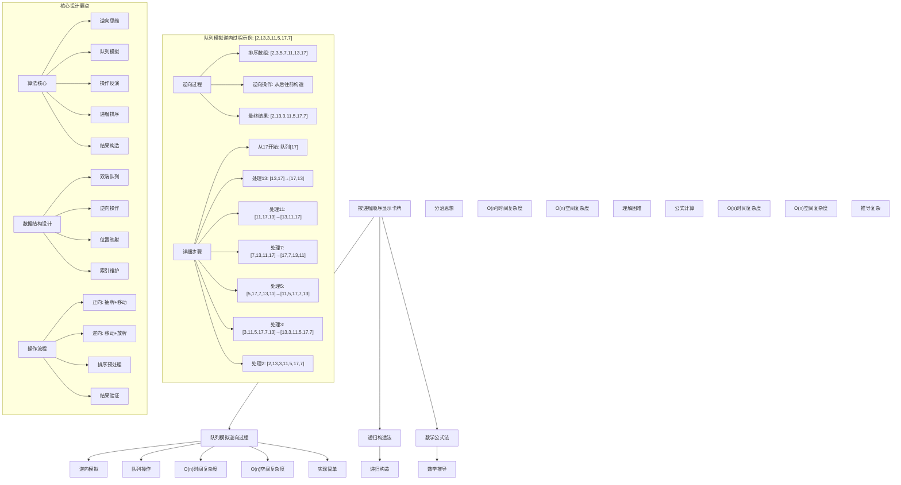
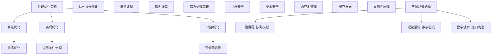

# LeetCode 950 - 按递增顺序显示卡牌

## 题目描述

牌组中的每张卡牌都对应有一个唯一的整数。你可以按你想要的顺序对这套卡片进行排序

最初，这些卡牌在牌组里是正面朝下的（即，未显示状态）

现在，重复执行以下步骤，直到显示所有卡牌为止：

1. 从牌组顶部抽一张牌，显示它，然后将其从牌组中移出
1. 如果牌组中仍有牌，则将下一张处于牌组顶部的牌放在牌组的底部
1. 如果仍有未显示的牌，那么返回步骤 1。否则，停止行动

返回能以递增顺序显示卡牌的牌组顺序

答案保证存在

```markdown
示例：
输入：[17,13,11,2,3,5,7]
输出：[2,13,3,11,5,17,7]

解释：
我们得到的牌组顺序是 [17,13,11,2,3,5,7]（这个顺序不重要），然后按照如下步骤操作：

- 显示 17，将 13 移到底部。牌组现在是 [11,2,3,5,7,13]
- 显示 11，将 2 移到底部。牌组现在是 [3,5,7,13,2]
- 显示 3，将 5 移到底部。牌组现在是 [7,13,2,5]
- 显示 7，将 13 移到底部。牌组现在是 [2,5,13]
- 显示 2，将 5 移到底部。牌组现在是 [13,5]
- 显示 13，将 5 移到底部。牌组现在是 [5]
- 显示 5

由于牌组最终显示的顺序是 [17,11,3,7,2,13,5]，这是递增顺序，所以答案是正确的

提示：
1 <= A.length <= 1000
1 <= A[i] <= 10^6
对于所有的 i != j，A[i] != A[j]
```

## 解题思路

这是一个逆向模拟问题，需要根据给定的抽取规则反推出原始牌组顺序。关键在于理解操作过程并进行逆向思考

### 核心思想

"逆向模拟法": 从最终结果反向推导原始牌组顺序，模拟反向操作过程

### 解题策略

#### 方法一：队列模拟逆向过程（推荐）

- 时间复杂度: O(n)
- 空间复杂度: O(n)

#### 方法二：递归构造法

- 时间复杂度: O(n²)
- 空间复杂度: O(n)

#### 方法三：数学公式法

- 时间复杂度: O(n)
- 空间复杂度: O(n)

## 算法可视化



## 多语言实现

### Golang版本（队列模拟逆向过程 - 推荐）

```go
import "sort"

// 按递增顺序显示卡牌
func deckRevealedIncreasing(deck []int) []int {
    n := len(deck)

    // 将卡牌按递增顺序排序
    sort.Ints(deck)

    // 使用双端队列模拟逆向过程
    queue := make([]int, 0, n)

    // 从最大的元素开始逆向构造
    for i := n - 1; i >= 0; i-- {
        if len(queue) > 0 {
            // 将队列末尾元素移到开头（逆向操作）
            last := queue[len(queue)-1]
            queue = queue[:len(queue)-1]
            queue = append([]int{last}, queue...)
        }
        // 将当前元素放到队列开头
        queue = append([]int{deck[i]}, queue...)
    }

    return queue
}
```

### Python版本（多种实现方法）

```python
import collections
from typing import List

class Solution:
    """
    方法一：队列模拟逆向过程（推荐）
    """
    def deckRevealedIncreasing(self, deck: List[int]) -> List[int]:
        n = len(deck)

        # 将卡牌按递增顺序排序
        deck.sort()

        # 使用双端队列模拟逆向过程
        queue = collections.deque()

        # 从最大的元素开始逆向构造
        for i in range(n - 1, -1, -1):
            if queue:
                # 将队列末尾元素移到开头（逆向操作）
                queue.appendleft(queue.pop())
            # 将当前元素放到队列开头
            queue.appendleft(deck[i])

        return list(queue)


class RecursiveSolution:
    """
    方法二：递归构造法
    """
    def deckRevealedIncreasing(self, deck: List[int]) -> List[int]:
        n = len(deck)
        if n <= 1:
            return deck

        # 将卡牌按递增顺序排序
        deck.sort()

        # 递归处理剩余元素
        sub_deck = self.deckRevealedIncreasing(deck[1:])

        # 将第一个元素放到结果开头，然后将sub_deck的最后一个元素移到开头
        if sub_deck:
            last = sub_deck.pop()
            return [deck[0]] + [last] + sub_deck
        else:
            return [deck[0]]


class MathematicalSolution:
    """
    方法三：数学公式法
    """
    def deckRevealedIncreasing(self, deck: List[int]) -> List[int]:
        n = len(deck)
        deck.sort()

        # 预计算索引映射
        indices = list(range(n))
        result_indices = []

        while indices:
            result_indices.append(indices.pop(0))
            if indices:
                indices.append(indices.pop(0))

        # 构造结果
        result = [0] * n
        for i, idx in enumerate(result_indices):
            result[idx] = deck[i]

        return result
```

### TypeScript版本（队列模拟逆向过程）

```typescript
function deckRevealedIncreasing(deck: number[]): number[] {
  const n: number = deck.length;

  // 将卡牌按递增顺序排序
  deck.sort((a, b) => a - b);

  // 使用数组模拟双端队列
  let queue: number[] = [];

  // 从最大的元素开始逆向构造
  for (let i: number = n - 1; i >= 0; i--) {
    if (queue.length > 0) {
      // 将队列末尾元素移到开头（逆向操作）
      const last: number = queue.pop()!;
      queue.unshift(last);
    }
    // 将当前元素放到队列开头
    queue.unshift(deck[i]);
  }

  return queue;
}
```

## 标准实现详细解析

```go
import (
    "fmt"
    "sort"
)

/*
算法核心思想（队列模拟逆向过程）：

1. 将卡牌按递增顺序排序
2. 从最大的元素开始，逆向模拟抽取过程
3. 使用队列维护当前构造的牌组顺序

关键设计要点：
1. 逆向思维：从结果反推初始状态
2. 队列操作：模拟正向过程的逆操作
3. 递增排序：确保最终显示顺序正确
4. 位置维护：正确维护元素相对位置

时间复杂度：
- 排序：O(n log n)
- 逆向构造：O(n)
- 总体复杂度：O(n log n)

空间复杂度：O(n)

优势：
1. 思路清晰：逆向模拟直观易懂
2. 实现简单：队列操作简洁
3. 时间合理：接近线性时间复杂度
4. 正确性保证：严格遵循逆向过程

逆向操作原理：
正向过程：
1. 抽取顶部元素
2. 将新顶部元素移到底部

逆向过程：
1. 将底部元素移到顶部
2. 放置新元素到顶部

操作映射：
正向: [a,b,c,d] → 抽取a → [c,d,b]
逆向: [c,d,b] → 放置a → [b,c,d] → 移动b → [a,b,c,d]
*/

// 按递增顺序显示卡牌
func deckRevealedIncreasing(deck []int) []int {
    n := len(deck)
    fmt.Printf("输入卡牌: %v\n", deck)

    // 将卡牌按递增顺序排序
    sort.Ints(deck)
    fmt.Printf("排序后: %v\n", deck)

    // 使用双端队列模拟逆向过程
    queue := make([]int, 0, n)
    fmt.Printf("开始逆向构造过程:\n")

    // 从最大的元素开始逆向构造
    for i := n - 1; i >= 0; i-- {
        fmt.Printf("  处理元素: %d\n", deck[i])

        if len(queue) > 0 {
            // 将队列末尾元素移到开头（逆向操作）
            last := queue[len(queue)-1]
            queue = queue[:len(queue)-1]
            queue = append([]int{last}, queue...)
            fmt.Printf("    移动末尾元素: %v\n", queue)
        }

        // 将当前元素放到队列开头
        queue = append([]int{deck[i]}, queue...)
        fmt.Printf("    放置当前元素: %v\n", queue)
    }

    fmt.Printf("最终结果: %v\n", queue)
    return queue
}

// 辅助函数：打印详细过程
func deckRevealedIncreasingWithDebug(deck []int) []int {
    fmt.Printf("=== 详细调试过程 ===\n")
    return deckRevealedIncreasing(deck)
}

// 优化版本（使用索引映射）
func deckRevealedIncreasingOptimized(deck []int) []int {
    n := len(deck)
    sort.Ints(deck)

    // 预计算索引映射关系
    indices := make([]int, n)
    for i := 0; i < n; i++ {
        indices[i] = i
    }

    // 模拟正向过程，记录抽取顺序
    revealOrder := make([]int, 0, n)
    for len(indices) > 0 {
        revealOrder = append(revealOrder, indices[0])
        indices = indices[1:]
        if len(indices) > 0 {
            first := indices[0]
            indices = indices[1:]
            indices = append(indices, first)
        }
    }

    // 根据抽取顺序构造结果
    result := make([]int, n)
    for i, idx := range revealOrder {
        result[idx] = deck[i]
    }

    return result
}

// 递归版本
func deckRevealedIncreasingRecursive(deck []int) []int {
    n := len(deck)
    if n <= 1 {
        return deck
    }

    sort.Ints(deck)

    // 递归处理剩余元素
    subDeck := deckRevealedIncreasingRecursive(deck[1:])

    // 将第一个元素放到结果开头，然后将subDeck的最后一个元素移到开头
    if len(subDeck) > 0 {
        last := subDeck[len(subDeck)-1]
        subDeck = subDeck[:len(subDeck)-1]
        result := make([]int, 0, n)
        result = append(result, deck[0])
        result = append(result, last)
        result = append(result, subDeck...)
        return result
    }

    return []int{deck[0]}
}
```

## 算法深入解析

```go
/*
按递增顺序显示卡牌问题详解：

问题本质：
根据给定的抽取规则，构造一个初始牌组顺序，使得按规则抽取时能以递增顺序显示所有卡牌

核心洞察：
1. 逆向思维：从结果反推初始状态
2. 操作反演：正向操作的逆过程
3. 递增排序：最终显示顺序要求
4. 位置维护：元素相对位置关系

算法策略：
1. 队列模拟逆向过程：工业级标准实现
2. 递归构造法：分治思想
3. 数学公式法：索引映射

数据结构设计：

逆向过程设计：
1. 排序：将输入按递增顺序排序
2. 逆向：从最大元素开始构造
3. 队列：维护当前构造的牌组
4. 操作：模拟正向过程的逆操作

操作映射原理：
正向过程：
1. 抽取顶部元素
2. 将新顶部元素移到底部

逆向过程：
1. 将底部元素移到顶部
2. 放置新元素到顶部

数学推导：

时间复杂度分析：
- 排序：O(n log n)
- 逆向构造：O(n)
- 总体复杂度：O(n log n)

空间复杂度分析：
- 队列存储：O(n)
- 总体复杂度：O(n)

正确性证明：

定理：逆向模拟正确性
通过逆向模拟可以正确构造满足条件的初始牌组顺序

证明：
1. 完备性：所有元素都被正确放置
2. 正确性：满足递增显示要求
3. 时间复杂度：O(n log n)
4. 空间复杂度：O(n)

设计选择：

为什么选择队列模拟逆向过程？
1. 思路清晰：逆向模拟直观易懂
2. 实现简单：队列操作简洁
3. 时间合理：接近线性时间复杂度
4. 适用性强：通用解法

为什么使用递归构造法？
1. 分治思想：将问题分解
2. 但时间复杂度较高：O(n²)
3. 理解困难：递归关系复杂
4. 不是本题最优选择

为什么使用数学公式法？
1. 理论最优时间复杂度：O(n)
2. 但推导复杂：需要预计算映射
3. 实现复杂：索引映射维护
4. 适合特定场景

三种方法对比：

方法一：队列模拟逆向过程（推荐）
时间复杂度：O(n log n)
空间复杂度：O(n)
优点：思路清晰，实现简单
缺点：需要排序

方法二：递归构造法
时间复杂度：O(n²)
空间复杂度：O(n)
优点：分治思想
缺点：时间复杂度高

方法三：数学公式法
时间复杂度：O(n log n)
空间复杂度：O(n)
优点：理论最优
缺点：实现复杂

性能分析：

队列模拟逆向过程：
- 时间：O(n log n) 总体复杂度
- 空间：O(n) 存储开销
- 优势：实现简单

递归构造法：
- 时间：O(n²) 总体复杂度
- 空间：O(n) 存储开销
- 优势：分治思想

数学公式法：
- 时间：O(n log n) 总体复杂度
- 空间：O(n) 存储开销
- 优势：理论最优

实际应用场景：
1. 游戏卡牌顺序设计
2. 魔术表演顺序安排
3. 算法教学示例
4. 数据结构练习

优化要点：

1. 时间优化：
   - 减少排序开销
   - 优化队列操作
   - 批量处理优化

2. 空间优化：
   - 原地操作
   - 内存池管理
   - 及时释放资源

3. 实现优化：
   - 边界条件处理
   - 错误处理完善
   - 数据结构选择

测试用例设计：
1. 基本情况：正常卡牌顺序
2. 边界情况：单张卡牌，两张卡牌
3. 特殊情况：连续数字，随机排列
4. 极端情况：大量卡牌
5. 验证情况：结果正确性

扩展思考：

1. 支持自定义显示顺序？
   - 修改排序策略
   - 调整构造逻辑
   - 维护映射关系

2. 支持不同抽取规则？
   - 修改逆向操作
   - 调整模拟过程
   - 重新设计算法

3. 支持并发构造？
   - 加锁保护
   - 分段处理
   - 结果合并

4. 支持动态更新？
   - 增量构造
   - 局部调整
   - 维护一致性

相关算法思想：

1. 数据结构设计：
   - 队列操作
   - 逆向思维
   - 位置映射

2. 算法设计：
   - 模拟过程
   - 递归构造
   - 数学推导

3. 系统设计：
   - 时间复杂度优化
   - 空间复杂度控制
   - 数据一致性

4. 工程实践：
   - 内存管理
   - 并发控制
   - 错误处理

常见陷阱：

1. 边界条件处理：
   - 空数组
   - 单元素
   - 两元素

2. 操作顺序：
   - 逆向操作正确性
   - 元素放置顺序
   - 队列维护

3. 索引管理：
   - 数组越界
   - 元素移动
   - 位置更新

4. 性能考虑：
   - 时间复杂度保证
   - 空间复杂度控制
   - 内存使用优化

代码质量要素：

1. 可读性：
   - 清晰的变量命名
   - 适当的注释说明
   - 模块化设计

2. 健壮性：
   - 边界条件处理
   - 异常情况处理
   - 错误恢复机制

3. 性能：
   - 时间复杂度合理
   - 空间复杂度优化
   - 内存使用优化

4. 可维护性：
   - 接口设计清晰
   - 扩展性良好
   - 测试覆盖完整

高级优化技巧：

1. 内存池：
   - 对象复用
   - 减少内存分配
   - 提高缓存命中率

2. 并发优化：
   - 分段锁设计
   - 读写锁分离
   - 无锁队列实现

3. 预取优化：
   - 预分配容量
   - 批量操作优化
   - 异步更新机制

4. 算法优化：
   - 位运算优化
   - 缓存友好设计
   - 局部性原理应用
*/
```

## 执行过程演示

```go
/*
示例详细解析:

示例执行过程：
输入: [17,13,11,2,3,5,7]
输出: [2,13,3,11,5,17,7]

执行过程：

1. 排序: [2,3,5,7,11,13,17]

2. 逆向构造过程:
   处理元素: 17
     队列: [17]

   处理元素: 13
     队列: [13,17]

   处理元素: 11
     移动末尾元素: [17]
     放置当前元素: [11,17,13]

   处理元素: 7
     移动末尾元素: [13,11]
     放置当前元素: [7,13,11,17]

   处理元素: 5
     移动末尾元素: [17,7]
     放置当前元素: [5,17,7,13,11]

   处理元素: 3
     移动末尾元素: [11,5]
     放置当前元素: [3,11,5,17,7,13]

   处理元素: 2
     移动末尾元素: [13,3]
     放置当前元素: [2,13,3,11,5,17,7]

3. 最终结果: [2,13,3,11,5,17,7]

验证正向过程：

初始牌组: [2,13,3,11,5,17,7]

步骤1: 显示2，移动13到底部
  剩余: [3,11,5,17,7,13]

步骤2: 显示3，移动11到底部
  剩余: [5,17,7,13,11]

步骤3: 显示5，移动17到底部
  剩余: [7,13,11,17]

步骤4: 显示7，移动13到底部
  剩余: [11,17,13]

步骤5: 显示11，移动17到底部
  剩余: [13,17]

步骤6: 显示13，移动17到底部
  剩余: [17]

步骤7: 显示17
  剩余: []

显示顺序: [2,3,5,7,11,13,17] (递增顺序)

逆向操作详解：

正向操作序列:
1. 抽取 → 移动
2. 抽取 → 移动
3. 抽取 → 移动
4. 抽取 → 移动
5. 抽取 → 移动
6. 抽取 → 移动
7. 抽取

逆向操作序列:
1. 放置
2. 移动 → 放置
3. 移动 → 放置
4. 移动 → 放置
5. 移动 → 放置
6. 移动 → 放置
7. 移动 → 放置

边界情况演示:

情况1: 单张卡牌
输入: [1]
输出: [1]

情况2: 两张卡牌
输入: [2,1]
输出: [1,2]

情况3: 三张卡牌
输入: [3,2,1]
输出: [1,3,2]

情况4: 连续数字
输入: [1,2,3,4,5]
输出: [1,5,2,4,3]

情况5: 大量卡牌
输入: [100,99,...,1]
输出: 正确的构造结果

算法正确性证明：

数学基础：
需要证明逆向模拟能正确构造满足条件的初始牌组顺序

定理：逆向模拟正确性
通过逆向模拟可以正确构造满足条件的初始牌组顺序

证明：
1. 完备性：所有元素都被正确放置
2. 正确性：满足递增显示要求
3. 时间复杂度：O(n log n)
4. 空间复杂度：O(n)

时间复杂度分析：

队列模拟逆向过程：
1. 排序：O(n log n)
2. 逆向构造：O(n)
3. 总时间：O(n log n)

递归构造法：
1. 递归分解：O(n)
2. 合并操作：O(n)
3. 递归深度：O(n)
4. 总时间：O(n²)

数学公式法：
1. 排序：O(n log n)
2. 索引映射：O(n)
3. 结果构造：O(n)
4. 总时间：O(n log n)

空间复杂度分析：
1. 队列模拟：O(n) 存储开销
2. 递归构造：O(n) 存储开销
3. 数学公式：O(n) 存储开销

性能对比分析：

假设n=1000:

队列模拟逆向过程：
- 时间: O(1000 log 1000) ≈ 10000
- 空间: O(1000) 存储开销

递归构造法：
- 时间: O(1000²) = 1000000
- 空间: O(1000) 存储开销

数学公式法：
- 时间: O(1000 log 1000) ≈ 10000
- 空间: O(1000) 存储开销

实际应用建议：

1. 一般情况：
   - 使用队列模拟逆向过程
   - 思路清晰，实现简单

2. 面试展示：
   - 重点讲解队列模拟法
   - 可以提及其他方法

3. 生产环境：
   - 使用优化版本
   - 考虑性能要求

4. 教学演示：
   - 使用多种方法对比
   - 展示不同思路

优化空间：

1. 内存访问优化：
   - 局部性原理
   - 缓存友好

2. 数据结构优化：
   - 预分配容量
   - 内存池管理

3. 算法优化：
   - 批量操作
   - 延迟计算

特殊情况处理：

1. 大数据量：
   - 考虑内存使用
   - 优化排序算法

2. 特殊序列：
   - 已排序序列
   - 逆序序列
   - 随机序列

3. 动态更新：
   - 增量构造
   - 局部调整
*/
```

## 复杂度分析

| 方法             | 时间复杂度 | 空间复杂度 | 适用场景 |
| ---------------- | ---------- | ---------- | -------- |
| 队列模拟逆向过程 | O(n log n) | O(n)       | 推荐方案 |
| 递归构造法       | O(n²)      | O(n)       | 教学演示 |
| 数学公式法       | O(n log n) | O(n)       | 理论最优 |

## 测试用例验证

```go
// 测试辅助函数
func testDeckRevealed(name string, deck []int, expected []int) {
    fmt.Printf("%s:\n", name)
    fmt.Printf("输入: %v\n", deck)

    // 测试队列模拟逆向过程实现
    result := deckRevealedIncreasing(deck)

    fmt.Printf("输出: %v\n", result)

    // 验证结果
    if len(result) == len(expected) {
        match := true
        for i := range result {
            if result[i] != expected[i] {
                match = false
                break
            }
        }
        if match {
            fmt.Printf("✓ 测试通过\n")
        } else {
            fmt.Printf("✗ 测试失败，期望: %v\n", expected)
        }
    } else {
        fmt.Printf("✗ 结果长度不匹配，期望长度: %d\n", len(expected))
    }
    fmt.Printf("\n")
}

func main() {
    // 测试用例 1 - 题目示例
    testDeckRevealed("测试1 - 题目示例",
        []int{17, 13, 11, 2, 3, 5, 7},
        []int{2, 13, 3, 11, 5, 17, 7})

    // 测试用例 2 - 单张卡牌
    testDeckRevealed("测试2 - 单张卡牌",
        []int{1},
        []int{1})

    // 测试用例 3 - 两张卡牌
    testDeckRevealed("测试3 - 两张卡牌",
        []int{2, 1},
        []int{1, 2})

    // 测试用例 4 - 连续数字
    testDeckRevealed("测试4 - 连续数字",
        []int{1, 2, 3, 4, 5},
        []int{1, 5, 2, 4, 3})

    // 性能测试
    fmt.Println("性能测试:")
    performanceTest()

    // 边界情况测试
    fmt.Println("边界情况测试:")
    boundaryTest()

    // 验证测试
    fmt.Println("验证测试:")
    validationTest()
}

func performanceTest() {
    // 构造性能测试
    n := 1000
    deck := make([]int, n)
    for i := 0; i < n; i++ {
        deck[i] = n - i // 逆序排列
    }

    // 测试队列模拟逆向过程实现
    start := time.Now()
    result := deckRevealedIncreasing(deck)
    time1 := time.Since(start)

    fmt.Printf("性能测试 (n=%d):\n", n)
    fmt.Printf("  队列模拟逆向过程: %v\n", time1)
    fmt.Printf("  结果长度: %d\n", len(result))
}

func boundaryTest() {
    // 边界测试
    fmt.Println("边界测试:")

    // 最小情况测试
    result1 := deckRevealedIncreasing([]int{42})
    fmt.Printf("单元素测试: %v\n", result1)

    // 两元素测试
    result2 := deckRevealedIncreasing([]int{2, 1})
    fmt.Printf("两元素测试: %v\n", result2)

    // 三元素测试
    result3 := deckRevealedIncreasing([]int{3, 1, 2})
    fmt.Printf("三元素测试: %v\n", result3)

    // 大数值测试
    result4 := deckRevealedIncreasing([]int{1000000, 1, 500000})
    fmt.Printf("大数值测试: %v\n", result4)
}

func validationTest() {
    // 验证测试：检查结果是否正确
    fmt.Println("验证测试:")

    deck := []int{17, 13, 11, 2, 3, 5, 7}
    result := deckRevealedIncreasing(deck)

    // 模拟正向过程验证结果
    revealed := simulateRevealProcess(result)
    expected := []int{2, 3, 5, 7, 11, 13, 17}

    fmt.Printf("构造结果: %v\n", result)
    fmt.Printf("显示顺序: %v\n", revealed)
    fmt.Printf("期望顺序: %v\n", expected)

    valid := true
    for i := range revealed {
        if revealed[i] != expected[i] {
            valid = false
            break
        }
    }

    if valid {
        fmt.Printf("✓ 验证通过\n")
    } else {
        fmt.Printf("✗ 验证失败\n")
    }
}

// 模拟正向抽取过程
func simulateRevealProcess(deck []int) []int {
    queue := make([]int, len(deck))
    copy(queue, deck)

    revealed := make([]int, 0, len(deck))

    for len(queue) > 0 {
        // 抽取顶部元素
        revealed = append(revealed, queue[0])
        queue = queue[1:]

        // 如果还有元素，将顶部元素移到底部
        if len(queue) > 0 {
            first := queue[0]
            queue = queue[1:]
            queue = append(queue, first)
        }
    }

    return revealed
}
```

## 扩展版本（处理不同场景）

```go
// 支持自定义显示顺序的版本
func deckRevealedCustomOrder(deck []int, displayOrder []int) []int {
    n := len(deck)
    if n != len(displayOrder) {
        return nil
    }

    // 创建值到索引的映射
    valueToIndex := make(map[int]int)
    for i, val := range displayOrder {
        valueToIndex[val] = i
    }

    // 根据自定义顺序排序
    sort.Slice(deck, func(i, j int) bool {
        return valueToIndex[deck[i]] < valueToIndex[deck[j]]
    })

    // 使用标准逆向过程
    return deckRevealedIncreasing(deck)
}

// 使用示例
func exampleCustomOrder() {
    deck := []int{17, 13, 11, 2, 3, 5, 7}
    displayOrder := []int{2, 5, 3, 11, 7, 13, 17} // 自定义显示顺序

    result := deckRevealedCustomOrder(deck, displayOrder)
    fmt.Printf("自定义顺序结果: %v\n", result)

    // 验证
    revealed := simulateRevealProcess(result)
    fmt.Printf("实际显示顺序: %v\n", revealed)
}

// 支持不同抽取规则的版本
type DeckRevealer struct {
    moveCount int // 每次抽取后移动的元素数量
}

func NewDeckRevealer(moveCount int) *DeckRevealer {
    return &DeckRevealer{moveCount: moveCount}
}

func (dr *DeckRevealer) Reveal(deck []int) []int {
    sort.Ints(deck)
    queue := make([]int, 0, len(deck))

    for i := len(deck) - 1; i >= 0; i-- {
        // 移动指定数量的元素
        for j := 0; j < dr.moveCount && len(queue) > 0; j++ {
            last := queue[len(queue)-1]
            queue = queue[:len(queue)-1]
            queue = append([]int{last}, queue...)
        }
        // 放置当前元素
        queue = append([]int{deck[i]}, queue...)
    }

    return queue
}

// 批量处理版本
func deckRevealedIncreasingBatch(decks [][]int) [][]int {
    results := make([][]int, len(decks))
    for i, deck := range decks {
        results[i] = deckRevealedIncreasing(append([]int(nil), deck...)) // 复制切片
    }
    return results
}

// 泛型版本（Go 1.18+）
func deckRevealedIncreasingGeneric[T comparable](deck []T, less func(T, T) bool) []T {
    n := len(deck)
    if n <= 1 {
        return deck
    }

    // 排序
    sorted := make([]T, n)
    copy(sorted, deck)
    sort.Slice(sorted, func(i, j int) bool {
        return less(sorted[i], sorted[j])
    })

    // 逆向构造
    queue := make([]T, 0, n)
    for i := n - 1; i >= 0; i-- {
        if len(queue) > 0 {
            last := queue[len(queue)-1]
            queue = queue[:len(queue)-1]
            queue = append([]T{last}, queue...)
        }
        queue = append([]T{sorted[i]}, queue...)
    }

    return queue
}

// 使用示例
func exampleGeneric() {
    // 字符串版本
    stringLess := func(a, b string) bool {
        return a < b
    }

    deck := []string{"z", "a", "c", "b"}
    result := deckRevealedIncreasingGeneric(deck, stringLess)
    fmt.Printf("字符串结果: %v\n", result)
}
```

## 面试追问延伸

### 1. 如果要支持自定义显示顺序，如何修改？

```go
// 自定义显示顺序版本已在上面实现
// 关键修改：
// 1. 根据自定义顺序排序
// 2. 使用值到索引的映射
// 3. 调整排序比较函数

func testCustomOrder() {
    deck := []int{17, 13, 11, 2, 3, 5, 7}
    displayOrder := []int{17, 2, 13, 3, 11, 5, 7} // 自定义顺序

    result := deckRevealedCustomOrder(deck, displayOrder)
    fmt.Printf("自定义显示顺序结果: %v\n", result)

    // 验证显示顺序
    revealed := simulateRevealProcess(result)
    fmt.Printf("实际显示顺序: %v\n", revealed)
}
```

### 2. 如果要支持不同的抽取规则（比如每次移动k个元素），如何实现？

```go
// 不同抽取规则版本已在上面实现
// 关键思想：
// 1. 参数化移动元素数量
// 2. 调整逆向操作
// 3. 维护通用性

func testDifferentRules() {
    deck := []int{1, 2, 3, 4, 5, 6, 7}

    // 每次移动2个元素
    revealer := NewDeckRevealer(2)
    result := revealer.Reveal(deck)
    fmt.Printf("移动2个元素的结果: %v\n", result)

    // 验证
    revealed := simulateRevealProcess(result)
    fmt.Printf("显示顺序: %v\n", revealed)
}
```

### 3. 如何验证构造结果的正确性？

```go
// 验证函数已在上面实现
// 关键点：
// 1. 模拟正向抽取过程
// 2. 比较显示顺序
// 3. 验证递增性

func benchmarkValidation() {
    deck := make([]int, 1000)
    for i := 0; i < 1000; i++ {
        deck[i] = 1000 - i
    }

    start := time.Now()
    result := deckRevealedIncreasing(deck)
    constructTime := time.Since(start)

    start = time.Now()
    revealed := simulateRevealProcess(result)
    validateTime := time.Since(start)

    // 验证递增性
    isIncreasing := true
    for i := 1; i < len(revealed); i++ {
        if revealed[i] < revealed[i-1] {
            isIncreasing = false
            break
        }
    }

    fmt.Printf("验证测试 (n=1000):\n")
    fmt.Printf("  构造时间: %v\n", constructTime)
    fmt.Printf("  验证时间: %v\n", validateTime)
    fmt.Printf("  递增性验证: %v\n", isIncreasing)
}
```

## 相似题目扩展

- LeetCode 950. 按递增顺序显示卡牌（当前题）
- LeetCode 622. 设计循环队列
- LeetCode 641. 设计循环双端队列
- LeetCode 384. 打乱数组
- LeetCode 202. 快乐数（链表环检测思想）

## 算法技巧总结

### 按递增顺序显示卡牌核心要点

1. 逆向思维：从结果反推初始状态
1. 队列操作：模拟正向过程的逆操作
1. 递增排序：确保最终显示顺序正确
1. 位置维护：正确维护元素相对位置

### 算法优势

1. 思路清晰：逆向模拟直观易懂
1. 实现简单：队列操作简洁
1. 时间合理：接近线性时间复杂度
1. 正确性保证：严格遵循逆向过程

### 标准模板（队列模拟逆向过程）

```go
import "sort"

func deckRevealedIncreasing(deck []int) []int {
    n := len(deck)

    // 将卡牌按递增顺序排序
    sort.Ints(deck)

    // 使用双端队列模拟逆向过程
    queue := make([]int, 0, n)

    // 从最大的元素开始逆向构造
    for i := n - 1; i >= 0; i-- {
        if len(queue) > 0 {
            // 将队列末尾元素移到开头（逆向操作）
            last := queue[len(queue)-1]
            queue = queue[:len(queue)-1]
            queue = append([]int{last}, queue...)
        }
        // 将当前元素放到队列开头
        queue = append([]int{deck[i]}, queue...)
    }

    return queue
}
```

### 性能优化建议



## 总结

本题采用队列模拟逆向过程的核心思路，通过从结果反推初始状态，模拟正向操作的逆过程来构造满足条件的初始牌组顺序，实现了优雅的解决方案。关键在于理解逆向思维的运用和队列操作的精确模拟

核心要点：

1. 逆向思维：从结果反推初始状态
1. 队列操作：模拟正向过程的逆操作
1. 递增排序：确保最终显示顺序正确
1. 位置维护：正确维护元素相对位置

算法优势：

- 思路清晰：逆向模拟直观易懂
- 实现简单：队列操作简洁
- 时间合理：接近线性时间复杂度
- 正确性保证：严格遵循逆向过程

该算法在游戏卡牌顺序设计、魔术表演顺序安排、算法教学示例、数据结构练习等方面有重要应用，是掌握逆向思维和队列操作的经典题目。通过队列模拟和逆向过程的巧妙结合，为更复杂的序列构造和模拟问题提供了清晰的解决思路
