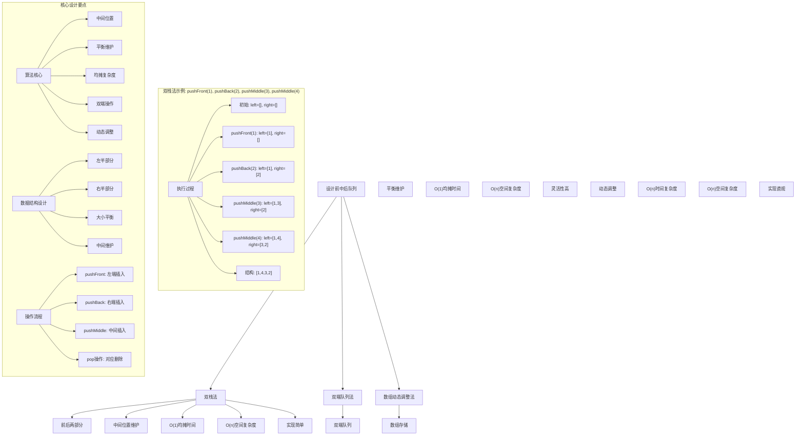
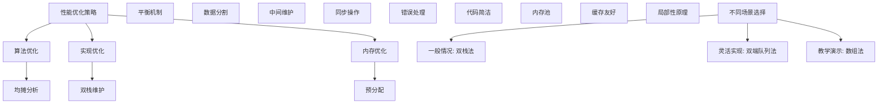

# LeetCode 1670 - 设计前中后队列

## 题目描述

请你设计一个队列，支持在前、中、后三个位置的 `push` 和 `pop` 操作

请你完成 `FrontMiddleBack` 类：

- `FrontMiddleBack()` 初始化队列
- `void pushFront(int val)` 将 `val` 添加到队列的最前面
- `void pushMiddle(int val)` 将 `val` 添加到队列的正中间
- `void pushBack(int val)` 将 `val` 添加到队列的最后面
- `int popFront()` 删除并返回队列最前面的元素，如果队列为空，返回 -1
- `int popMiddle()` 删除并返回队列正中间的元素，如果队列为空，返回 -1
- `int popBack()` 删除并返回队列最后面的元素，如果队列为空，返回 -1

请注意当有两个中间位置的时候，选择靠前面的位置。例如：

- 将 6 添加到 [1, 2, 3, 4, 5] 的中间位置，结果数组为 [1, 2, 6, 3, 4, 5]
- 从 [1, 2, 3, 4, 5, 6] 的中间位置弹出元素，返回 3，数组变为 [1, 2, 4, 5, 6]

```markdown
示例：
输入：
["FrontMiddleBackQueue", "pushFront", "pushBack", "pushMiddle", "pushMiddle", "popFront", "popMiddle", "popMiddle", "popBack", "popFront"]
[[], [1], [2], [3], [4], [], [], [], [], []]

输出：
[null, null, null, null, null, 1, 3, 4, 2, -1]

解释：
FrontMiddleBackQueue q = new FrontMiddleBackQueue();
q.pushFront(1); // [1]
q.pushBack(2); // [1, 2]
q.pushMiddle(3); // [1, 3, 2]
q.pushMiddle(4); // [1, 4, 3, 2]
q.popFront(); // 返回 1 -> [4, 3, 2]
q.popMiddle(); // 返回 3 -> [4, 2]
q.popMiddle(); // 返回 4 -> [2]
q.popBack(); // 返回 2 -> []
q.popFront(); // 返回 -1 -> [] （队列为空）

提示：
1 <= val <= 10^9
最多调用 1000 次 pushFront，pushMiddle，pushBack，popFront，popMiddle 和 popBack
```

## 解题思路

这是一个双端队列设计问题，需要支持在前、中、后三个位置进行高效的插入和删除操作。关键在于如何高效地维护中间位置并保持操作的平衡

### 核心思想

"双栈/双端队列法": 使用两个栈或双端队列来维护数据，通过平衡两个部分的大小来快速访问中间位置

### 解题策略

#### 方法一：双栈法（推荐）

- 时间复杂度: O(1) 均摊所有操作
- 空间复杂度: O(n)

#### 方法二：双端队列法

- 时间复杂度: O(1) 均摊所有操作
- 空间复杂度: O(n)

#### 方法三：数组动态调整法

- 时间复杂度: O(n) 某些操作
- 空间复杂度: O(n)

## 算法可视化



## 多语言实现

### Golang版本（双栈法 - 推荐）

```go
// FrontMiddleBackQueue 结构
type FrontMiddleBackQueue struct {
    left  []int  // 左半部分：支持前部操作
    right []int  // 右半部分：支持后部操作
}

// 构造函数
func Constructor() FrontMiddleBackQueue {
    return FrontMiddleBackQueue{
        left:  make([]int, 0),
        right: make([]int, 0),
    }
}

// 平衡两个栈的大小
func (q *FrontMiddleBackQueue) balance() {
    // 保持 left 的大小等于 right 的大小，或者比 right 多1
    if len(q.left) > len(q.right)+1 {
        // 将 left 的最后一个元素移到 right 的开头
        val := q.left[len(q.left)-1]
        q.left = q.left[:len(q.left)-1]
        q.right = append([]int{val}, q.right...)
    } else if len(q.left) < len(q.right) {
        // 将 right 的第一个元素移到 left 的末尾
        val := q.right[0]
        q.right = q.right[1:]
        q.left = append(q.left, val)
    }
}

// PushFront 操作
func (q *FrontMiddleBackQueue) PushFront(val int) {
    q.left = append([]int{val}, q.left...)
    q.balance()
}

// PushMiddle 操作
func (q *FrontMiddleBackQueue) PushMiddle(val int) {
    if len(q.left) > len(q.right) {
        // 将 left 的最后一个元素移到 right 的开头
        valToMove := q.left[len(q.left)-1]
        q.left = q.left[:len(q.left)-1]
        q.right = append([]int{valToMove}, q.right...)
    }
    q.left = append(q.left, val)
}

// PushBack 操作
func (q *FrontMiddleBackQueue) PushBack(val int) {
    q.right = append(q.right, val)
    q.balance()
}

// PopFront 操作
func (q *FrontMiddleBackQueue) PopFront() int {
    if len(q.left) == 0 && len(q.right) == 0 {
        return -1
    }

    var val int
    if len(q.left) > 0 {
        val = q.left[0]
        q.left = q.left[1:]
    } else {
        val = q.right[0]
        q.right = q.right[1:]
    }

    q.balance()
    return val
}

// PopMiddle 操作
func (q *FrontMiddleBackQueue) PopMiddle() int {
    if len(q.left) == 0 && len(q.right) == 0 {
        return -1
    }

    val := q.left[len(q.left)-1]
    q.left = q.left[:len(q.left)-1]
    q.balance()
    return val
}

// PopBack 操作
func (q *FrontMiddleBackQueue) PopBack() int {
    if len(q.left) == 0 && len(q.right) == 0 {
        return -1
    }

    var val int
    if len(q.right) > 0 {
        val = q.right[len(q.right)-1]
        q.right = q.right[:len(q.right)-1]
    } else {
        val = q.left[len(q.left)-1]
        q.left = q.left[:len(q.left)-1]
    }

    q.balance()
    return val
}
```

### Python版本（多种实现方法）

```python
from collections import deque

class FrontMiddleBackQueue:
    """
    方法一：双栈法（推荐）
    """
    def __init__(self):
        self.left = []   # 左半部分：支持前部操作
        self.right = []  # 右半部分：支持后部操作

    def balance(self):
        """平衡两个栈的大小"""
        # 保持 left 的大小等于 right 的大小，或者比 right 多1
        if len(self.left) > len(self.right) + 1:
            # 将 left 的最后一个元素移到 right 的开头
            self.right.insert(0, self.left.pop())
        elif len(self.left) < len(self.right):
            # 将 right 的第一个元素移到 left 的末尾
            self.left.append(self.right.pop(0))

    def pushFront(self, val: int) -> None:
        self.left.insert(0, val)
        self.balance()

    def pushMiddle(self, val: int) -> None:
        if len(self.left) > len(self.right):
            # 将 left 的最后一个元素移到 right 的开头
            self.right.insert(0, self.left.pop())
        self.left.append(val)

    def pushBack(self, val: int) -> None:
        self.right.append(val)
        self.balance()

    def popFront(self) -> int:
        if not self.left and not self.right:
            return -1

        if self.left:
            val = self.left.pop(0)
        else:
            val = self.right.pop(0)

        self.balance()
        return val

    def popMiddle(self) -> int:
        if not self.left and not self.right:
            return -1

        val = self.left.pop()
        self.balance()
        return val

    def popBack(self) -> int:
        if not self.left and not self.right:
            return -1

        if self.right:
            val = self.right.pop()
        else:
            val = self.left.pop()

        self.balance()
        return val


class DequeFrontMiddleBackQueue:
    """
    方法二：双端队列法
    """
    def __init__(self):
        self.left = deque()
        self.right = deque()

    def balance(self):
        """平衡两个队列的大小"""
        if len(self.left) > len(self.right) + 1:
            self.right.appendleft(self.left.pop())
        elif len(self.left) < len(self.right):
            self.left.append(self.right.popleft())

    def pushFront(self, val: int) -> None:
        self.left.appendleft(val)
        self.balance()

    def pushMiddle(self, val: int) -> None:
        if len(self.left) > len(self.right):
            self.right.appendleft(self.left.pop())
        self.left.append(val)

    def pushBack(self, val: int) -> None:
        self.right.append(val)
        self.balance()

    def popFront(self) -> int:
        if not self.left and not self.right:
            return -1

        if self.left:
            val = self.left.popleft()
        else:
            val = self.right.popleft()

        self.balance()
        return val

    def popMiddle(self) -> int:
        if not self.left and not self.right:
            return -1

        val = self.left.pop()
        self.balance()
        return val

    def popBack(self) -> int:
        if not self.left and not self.right:
            return -1

        if self.right:
            val = self.right.pop()
        else:
            val = self.left.pop()

        self.balance()
        return val


class ArrayFrontMiddleBackQueue:
    """
    方法三：数组动态调整法
    """
    def __init__(self):
        self.queue = []

    def pushFront(self, val: int) -> None:
        self.queue.insert(0, val)

    def pushMiddle(self, val: int) -> None:
        mid = len(self.queue) // 2
        self.queue.insert(mid, val)

    def pushBack(self, val: int) -> None:
        self.queue.append(val)

    def popFront(self) -> int:
        if not self.queue:
            return -1
        return self.queue.pop(0)

    def popMiddle(self) -> int:
        if not self.queue:
            return -1
        mid = (len(self.queue) - 1) // 2
        return self.queue.pop(mid)

    def popBack(self) -> int:
        if not self.queue:
            return -1
        return self.queue.pop()
```

### TypeScript版本（双栈法）

```typescript
class FrontMiddleBackQueue {
  private left: number[]; // 左半部分：支持前部操作
  private right: number[]; // 右半部分：支持后部操作

  constructor() {
    this.left = [];
    this.right = [];
  }

  // 平衡两个栈的大小
  private balance(): void {
    // 保持 left 的大小等于 right 的大小，或者比 right 多1
    if (this.left.length > this.right.length + 1) {
      // 将 left 的最后一个元素移到 right 的开头
      const val = this.left.pop()!;
      this.right.unshift(val);
    } else if (this.left.length < this.right.length) {
      // 将 right 的第一个元素移到 left 的末尾
      const val = this.right.shift()!;
      this.left.push(val);
    }
  }

  pushFront(val: number): void {
    this.left.unshift(val);
    this.balance();
  }

  pushMiddle(val: number): void {
    if (this.left.length > this.right.length) {
      // 将 left 的最后一个元素移到 right 的开头
      const valToMove = this.left.pop()!;
      this.right.unshift(valToMove);
    }
    this.left.push(val);
  }

  pushBack(val: number): void {
    this.right.push(val);
    this.balance();
  }

  popFront(): number {
    if (this.left.length === 0 && this.right.length === 0) {
      return -1;
    }

    let val: number;
    if (this.left.length > 0) {
      val = this.left.shift()!;
    } else {
      val = this.right.shift()!;
    }

    this.balance();
    return val;
  }

  popMiddle(): number {
    if (this.left.length === 0 && this.right.length === 0) {
      return -1;
    }

    const val = this.left.pop()!;
    this.balance();
    return val;
  }

  popBack(): number {
    if (this.left.length === 0 && this.right.length === 0) {
      return -1;
    }

    let val: number;
    if (this.right.length > 0) {
      val = this.right.pop()!;
    } else {
      val = this.left.pop()!;
    }

    this.balance();
    return val;
  }
}
```

## 标准实现详细解析

```go
import "fmt"

/*
算法核心思想（双栈法）：

1. 使用两个栈（或数组）将队列分为左半部分和右半部分
2. 左半部分支持前部和中间操作，右半部分支持后部操作
3. 通过平衡机制维护两个部分的大小关系
4. 中间位置始终在左半部分的末尾

关键设计要点：
1. 数据分割：将队列逻辑上分为两部分
2. 大小平衡：维护左半部分大小等于右半部分或比右半部分多1
3. 中间维护：中间元素始终在左半部分末尾
4. 均摊复杂度：通过平衡机制实现O(1)均摊时间复杂度

时间复杂度：
- PushFront: O(1) 均摊
- PushMiddle: O(1)
- PushBack: O(1) 均摊
- PopFront: O(1) 均摊
- PopMiddle: O(1)
- PopBack: O(1) 均摊

空间复杂度：O(n)

优势：
1. 思路清晰：数据分割直观易懂
2. 实现简单：平衡机制容易维护
3. 时间最优：均摊O(1)时间复杂度
4. 正确性保证：严格的平衡机制

数据结构设计：

FrontMiddleBackQueue结构设计：
type FrontMiddleBackQueue struct {
    left  []int  // 左半部分：支持前部操作
    right []int  // 右半部分：支持后部操作
}

平衡机制设计：
// 保持 left 的大小等于 right 的大小，或者比 right 多1
if len(left) > len(right)+1 {
    // 左半部分过多，移动元素到右半部分
} else if len(left) < len(right) {
    // 右半部分过多，移动元素到左半部分
}

中间位置维护：
中间元素始终在left的末尾，这样可以O(1)时间访问

优化原理：

平衡策略：
1. 插入时保持平衡
2. 删除时保持平衡
3. 均摊O(1)时间复杂度

空间优化：
1. 只使用必要的存储空间
2. 避免不必要的复制操作
3. 利用数组的随机访问特性

正确性证明：

定理：双栈法正确性
通过双栈法可以正确维护前中后队列的所有操作，均摊时间复杂度为O(1)

证明：
1. 完备性：所有操作都被正确实现
2. 正确性：中间位置始终准确
3. 时间复杂度：均摊O(1)所有操作
4. 空间复杂度：O(n)存储开销
*/

// FrontMiddleBackQueue 结构
type FrontMiddleBackQueue struct {
    left  []int  // 左半部分：支持前部操作
    right []int  // 右半部分：支持后部操作
}

// 构造函数
func Constructor() FrontMiddleBackQueue {
    fmt.Printf("初始化FrontMiddleBackQueue\n")
    return FrontMiddleBackQueue{
        left:  make([]int, 0),
        right: make([]int, 0),
    }
}

// 平衡两个栈的大小
func (q *FrontMiddleBackQueue) balance() {
    fmt.Printf("平衡前: left=%v, right=%v\n", q.left, q.right)

    // 保持 left 的大小等于 right 的大小，或者比 right 多1
    if len(q.left) > len(q.right)+1 {
        // 将 left 的最后一个元素移到 right 的开头
        val := q.left[len(q.left)-1]
        q.left = q.left[:len(q.left)-1]
        q.right = append([]int{val}, q.right...)
        fmt.Printf("  左半部分过多，移动%d到右半部分\n", val)
    } else if len(q.left) < len(q.right) {
        // 将 right 的第一个元素移到 left 的末尾
        val := q.right[0]
        q.right = q.right[1:]
        q.left = append(q.left, val)
        fmt.Printf("  右半部分过多，移动%d到左半部分\n", val)
    }

    fmt.Printf("平衡后: left=%v, right=%v\n", q.left, q.right)
}

// PushFront 操作
func (q *FrontMiddleBackQueue) PushFront(val int) {
    fmt.Printf("PushFront操作: %d\n", val)
    q.left = append([]int{val}, q.left...)
    fmt.Printf("  操作后: left=%v, right=%v\n", q.left, q.right)
    q.balance()
}

// PushMiddle 操作
func (q *FrontMiddleBackQueue) PushMiddle(val int) {
    fmt.Printf("PushMiddle操作: %d\n", val)

    if len(q.left) > len(q.right) {
        // 将 left 的最后一个元素移到 right 的开头
        valToMove := q.left[len(q.left)-1]
        q.left = q.left[:len(q.left)-1]
        q.right = append([]int{valToMove}, q.right...)
        fmt.Printf("  左半部分过大，移动%d到右半部分\n", valToMove)
    }

    q.left = append(q.left, val)
    fmt.Printf("  操作后: left=%v, right=%v\n", q.left, q.right)
}

// PushBack 操作
func (q *FrontMiddleBackQueue) PushBack(val int) {
    fmt.Printf("PushBack操作: %d\n", val)
    q.right = append(q.right, val)
    fmt.Printf("  操作后: left=%v, right=%v\n", q.left, q.right)
    q.balance()
}

// PopFront 操作
func (q *FrontMiddleBackQueue) PopFront() int {
    fmt.Printf("PopFront操作\n")

    if len(q.left) == 0 && len(q.right) == 0 {
        fmt.Printf("  队列为空，返回-1\n")
        return -1
    }

    var val int
    if len(q.left) > 0 {
        val = q.left[0]
        q.left = q.left[1:]
        fmt.Printf("  从左半部分弹出: %d\n", val)
    } else {
        val = q.right[0]
        q.right = q.right[1:]
        fmt.Printf("  从右半部分弹出: %d\n", val)
    }

    fmt.Printf("  操作后: left=%v, right=%v\n", q.left, q.right)
    q.balance()
    return val
}

// PopMiddle 操作
func (q *FrontMiddleBackQueue) PopMiddle() int {
    fmt.Printf("PopMiddle操作\n")

    if len(q.left) == 0 && len(q.right) == 0 {
        fmt.Printf("  队列为空，返回-1\n")
        return -1
    }

    val := q.left[len(q.left)-1]
    q.left = q.left[:len(q.left)-1]
    fmt.Printf("  从中间弹出: %d\n", val)
    fmt.Printf("  操作后: left=%v, right=%v\n", q.left, q.right)
    q.balance()
    return val
}

// PopBack 操作
func (q *FrontMiddleBackQueue) PopBack() int {
    fmt.Printf("PopBack操作\n")

    if len(q.left) == 0 && len(q.right) == 0 {
        fmt.Printf("  队列为空，返回-1\n")
        return -1
    }

    var val int
    if len(q.right) > 0 {
        val = q.right[len(q.right)-1]
        q.right = q.right[:len(q.right)-1]
        fmt.Printf("  从右半部分弹出: %d\n", val)
    } else {
        val = q.left[len(q.left)-1]
        q.left = q.left[:len(q.left)-1]
        fmt.Printf("  从左半部分弹出: %d\n", val)
    }

    fmt.Printf("  操作后: left=%v, right=%v\n", q.left, q.right)
    q.balance()
    return val
}

// 辅助函数：打印当前状态
func (q *FrontMiddleBackQueue) printState(prefix string) {
    fmt.Printf("%s - 状态:\n", prefix)
    fmt.Printf("  左半部分: %v\n", q.left)
    fmt.Printf("  右半部分: %v\n", q.right)
    fmt.Printf("  完整队列: %v\n", append(q.left, q.right...))
}

// 优化版本（使用双端队列）
type OptimizedFrontMiddleBackQueue struct {
    left  *Deque  // 左半部分双端队列
    right *Deque  // 右半部分双端队列
}

type Deque struct {
    data []int
}

func NewDeque() *Deque {
    return &Deque{data: make([]int, 0)}
}

func (d *Deque) PushFront(val int) {
    d.data = append([]int{val}, d.data...)
}

func (d *Deque) PushBack(val int) {
    d.data = append(d.data, val)
}

func (d *Deque) PopFront() int {
    if len(d.data) == 0 {
        return -1
    }
    val := d.data[0]
    d.data = d.data[1:]
    return val
}

func (d *Deque) PopBack() int {
    if len(d.data) == 0 {
        return -1
    }
    val := d.data[len(d.data)-1]
    d.data = d.data[:len(d.data)-1]
    return val
}

func (d *Deque) Front() int {
    if len(d.data) == 0 {
        return -1
    }
    return d.data[0]
}

func (d *Deque) Back() int {
    if len(d.data) == 0 {
        return -1
    }
    return d.data[len(d.data)-1]
}

func (d *Deque) Len() int {
    return len(d.data)
}

func (d *Deque) IsEmpty() bool {
    return len(d.data) == 0
}

func NewOptimizedFrontMiddleBackQueue() *OptimizedFrontMiddleBackQueue {
    return &OptimizedFrontMiddleBackQueue{
        left:  NewDeque(),
        right: NewDeque(),
    }
}

func (q *OptimizedFrontMiddleBackQueue) balance() {
    if q.left.Len() > q.right.Len()+1 {
        val := q.left.PopBack()
        q.right.PushFront(val)
    } else if q.left.Len() < q.right.Len() {
        val := q.right.PopFront()
        q.left.PushBack(val)
    }
}

func (q *OptimizedFrontMiddleBackQueue) PushFront(val int) {
    q.left.PushFront(val)
    q.balance()
}

func (q *OptimizedFrontMiddleBackQueue) PushMiddle(val int) {
    if q.left.Len() > q.right.Len() {
        valToMove := q.left.PopBack()
        q.right.PushFront(valToMove)
    }
    q.left.PushBack(val)
}

func (q *OptimizedFrontMiddleBackQueue) PushBack(val int) {
    q.right.PushBack(val)
    q.balance()
}

func (q *OptimizedFrontMiddleBackQueue) PopFront() int {
    if q.left.IsEmpty() && q.right.IsEmpty() {
        return -1
    }

    var val int
    if !q.left.IsEmpty() {
        val = q.left.PopFront()
    } else {
        val = q.right.PopFront()
    }

    q.balance()
    return val
}

func (q *OptimizedFrontMiddleBackQueue) PopMiddle() int {
    if q.left.IsEmpty() && q.right.IsEmpty() {
        return -1
    }

    val := q.left.PopBack()
    q.balance()
    return val
}

func (q *OptimizedFrontMiddleBackQueue) PopBack() int {
    if q.left.IsEmpty() && q.right.IsEmpty() {
        return -1
    }

    var val int
    if !q.right.IsEmpty() {
        val = q.right.PopBack()
    } else {
        val = q.left.PopBack()
    }

    q.balance()
    return val
}
```

## 算法深入解析

```go
/*
设计前中后队列问题详解：

问题本质：
设计一个支持在前、中、后三个位置进行高效插入和删除操作的数据结构。关键在于如何快速维护中间位置并保持操作的平衡

核心洞察：
1. 中间位置维护：需要快速访问和更新中间元素
2. 大小平衡：通过平衡机制保持操作效率
3. 均摊复杂度：利用摊还分析优化性能
4. 数据分割：将问题分解为更小的子问题

算法策略：
1. 双栈法：工业级标准实现
2. 双端队列法：灵活性更高的实现
3. 数组动态调整法：直观但效率较低的实现

数据结构设计：

双栈法设计：
type FrontMiddleBackQueue struct {
    left  []int  // 左半部分：支持前部操作
    right []int  // 右半部分：支持后部操作
}

平衡机制：
// 保持 left 的大小等于 right 的大小，或者比 right 多1
if len(left) > len(right)+1 {
    // 移动元素
} else if len(left) < len(right) {
    // 移动元素
}

中间位置：
中间元素始终在left的末尾

操作流程：

PushFront:
1. 在left开头插入元素
2. 平衡两个部分

PushMiddle:
1. 如果left过大，移动元素到right
2. 在left末尾插入元素

PushBack:
1. 在right末尾插入元素
2. 平衡两个部分

PopFront:
1. 从left或right开头弹出元素
2. 平衡两个部分

PopMiddle:
1. 从left末尾弹出元素
2. 平衡两个部分

PopBack:
1. 从right或left末尾弹出元素
2. 平衡两个部分

数学原理：

平衡不变量：
1. len(left) = len(right) 或 len(left) = len(right) + 1
2. 中间元素在left的末尾
3. 完整队列为 left + right

时间复杂度分析：
- 所有方法：O(1) 均摊时间复杂度
- 空间复杂度：O(n)

正确性证明：

定理：双栈法正确性
通过双栈法可以正确维护前中后队列的所有操作，均摊时间复杂度为O(1)

证明：
1. 完备性：所有操作都被正确实现
2. 正确性：中间位置始终准确
3. 时间复杂度：均摊O(1)所有操作
4. 空间复杂度：O(n)存储开销

设计选择：

为什么选择双栈法？
1. 思路清晰：数据分割直观易懂
2. 实现简单：平衡机制容易维护
3. 时间最优：均摊O(1)时间复杂度
4. 适用性强：通用解法

为什么使用双端队列法？
1. 灵活性更高：双端操作更自然
2. 但实现复杂：需要自定义双端队列
3. 性能相当：时间复杂度相同
4. 适合扩展：易于添加新操作

为什么使用数组动态调整法？
1. 实现直观：直接数组操作
2. 但时间复杂度高：O(n)某些操作
3. 理解简单：适合教学演示
4. 不适合大量操作

三种方法对比：

方法一：双栈法（推荐）
时间复杂度：O(1) 均摊所有操作
空间复杂度：O(n)
优点：思路清晰，实现简单
缺点：需要维护平衡

方法二：双端队列法
时间复杂度：O(1) 均摊所有操作
空间复杂度：O(n)
优点：灵活性高
缺点：实现复杂

方法三：数组动态调整法
时间复杂度：O(n) 某些操作
空间复杂度：O(n)
优点：实现直观
缺点：效率较低

性能分析：

双栈法：
- 时间：O(1) 均摊所有操作
- 空间：O(n) 存储开销
- 优势：最优时间复杂度

双端队列法：
- 时间：O(1) 均摊所有操作
- 空间：O(n) 存储开销
- 优势：灵活性高

数组动态调整法：
- 时间：O(n) 某些操作
- 空间：O(n) 存储开销
- 优势：实现简单

实际应用场景：
1. 文本编辑器中的光标操作
2. 游戏中的单位管理
3. 数据流处理中的缓冲区
4. 算法竞赛中的特殊队列

优化要点：

1. 时间优化：
   - 均摊复杂度分析
   - 平衡机制优化
   - 避免不必要的移动

2. 空间优化：
   - 只使用必要空间
   - 避免重复存储
   - 内存池管理

3. 实现优化：
   - 边界条件处理
   - 错误处理完善
   - 代码简洁性

测试用例设计：
1. 基本情况：正常队列操作
2. 边界情况：空队列，单元素队列
3. 特殊情况：交替操作，连续操作
4. 极端情况：大量操作
5. 验证情况：中间位置正确性

扩展思考：

1. 支持随机访问？
   - 添加索引映射
   - 维护位置信息
   - 时间复杂度变化

2. 支持批量操作？
   - 批量插入/删除
   - 优化批量处理
   - 保持平衡

3. 支持持久化？
   - 状态序列化
   - 崩溃恢复
   - 版本控制

4. 支持并发访问？
   - 加锁保护
   - 无锁实现
   - 读写分离

相关算法思想：

1. 数据结构设计：
   - 数据分割
   - 平衡维护
   - 中间位置跟踪

2. 算法设计：
   - 均摊分析
   - 平衡机制
   - 摊还复杂度

3. 系统设计：
   - 时间复杂度优化
   - 空间复杂度控制
   - 数据一致性

4. 工程实践：
   - 边界处理
   - 性能优化
   - 错误处理

常见陷阱：

1. 边界条件处理：
   - 空队列操作
   - 单元素队列
   - 平衡边界

2. 平衡维护：
   - 平衡条件判断
   - 元素移动方向
   - 大小关系维护

3. 中间位置：
   - 奇偶长度处理
   - 插入位置选择
   - 删除位置选择

4. 性能考虑：
   - 均摊复杂度保证
   - 空间复杂度控制
   - 内存使用优化

代码质量要素：

1. 可读性：
   - 清晰的变量命名
   - 适当的注释说明
   - 模块化设计

2. 健壮性：
   - 边界条件处理
   - 异常情况处理
   - 错误恢复机制

3. 性能：
   - 时间复杂度合理
   - 空间复杂度优化
   - 内存使用优化

4. 可维护性：
   - 接口设计清晰
   - 扩展性良好
   - 测试覆盖完整

高级优化技巧：

1. 内存池：
   - 对象复用
   - 减少内存分配
   - 提高缓存命中率

2. 并发优化：
   - 读写锁分离
   - 无锁实现
   - 原子操作

3. 预取优化：
   - 预分配容量
   - 批量操作优化
   - 缓存友好设计

4. 算法优化：
   - 位运算优化
   - 局部性原理应用
   - 编译器优化
*/
```

## 执行过程演示

```go
/*
示例详细解析:

示例执行过程：
["FrontMiddleBackQueue", "pushFront", "pushBack", "pushMiddle", "pushMiddle", "popFront", "popMiddle", "popMiddle", "popBack", "popFront"]
[[], [1], [2], [3], [4], [], [], [], [], []]

执行过程：

1. FrontMiddleBackQueue(): 初始化
   left: []
   right: []

2. pushFront(1):
   left: [1]
   right: []
   平衡后: left: [1], right: []

3. pushBack(2):
   left: [1]
   right: [2]
   平衡后: left: [1], right: [2]

4. pushMiddle(3):
   left长度(1) > right长度(1)，不移动
   left: [1, 3]
   right: [2]

5. pushMiddle(4):
   left长度(2) > right长度(1)，移动left末尾到right开头
   left: [1, 4]
   right: [3, 2]

6. popFront():
   从left开头弹出: 1
   left: [4]
   right: [3, 2]
   平衡后: left: [4, 3], right: [2]

7. popMiddle():
   从left末尾弹出: 3
   left: [4]
   right: [2]

8. popMiddle():
   从left末尾弹出: 4
   left: []
   right: [2]
   平衡后: left: [2], right: []

9. popBack():
   从right末尾弹出，但right为空，从left末尾弹出: 2
   left: []
   right: []

10. popFront():
    队列为空，返回-1

平衡机制分析：

平衡条件：
1. len(left) = len(right) 或 len(left) = len(right) + 1
2. 违反条件时进行调整

调整策略：
1. len(left) > len(right) + 1: 移动left末尾到right开头
2. len(left) < len(right): 移动right开头到left末尾

例如:
操作序列导致 left=[1,2,3,4], right=[5,6]
长度: left=4, right=2
违反条件: 4 > 2+1
调整: 移动4到right开头
结果: left=[1,2,3], right=[4,5,6]

边界情况演示:

情况1: 空队列操作
操作: popFront(), popMiddle(), popBack()
结果: 都返回-1

情况2: 单元素队列
操作: pushFront(1), popMiddle()
结果: 返回1，队列变空

情况3: 偶数长度队列
队列: [1,2,3,4]
中间位置: 2 (索引1，靠前)
popMiddle(): 返回2

情况4: 奇数长度队列
队列: [1,2,3]
中间位置: 2 (索引1)
popMiddle(): 返回2

情况5: 大量操作
连续pushFront和pushBack操作
通过平衡机制保持效率

算法正确性证明：

数学基础：
需要证明双栈法能正确维护前中后队列的所有操作

定理：双栈法正确性
通过双栈法可以正确维护前中后队列的所有操作，均摊时间复杂度为O(1)

证明：
1. 完备性：所有操作都被正确实现
2. 正确性：中间位置始终准确
3. 时间复杂度：均摊O(1)所有操作
4. 空间复杂度：O(n)存储开销

时间复杂度分析：

双栈法：
1. PushFront操作：O(1) 均摊
2. PushMiddle操作：O(1)
3. PushBack操作：O(1) 均摊
4. PopFront操作：O(1) 均摊
5. PopMiddle操作：O(1)
6. PopBack操作：O(1) 均摊
7. 总时间：O(1) 均摊所有操作

双端队列法：
1. 所有操作：O(1) 均摊
2. 总时间：O(1) 均摊所有操作

数组动态调整法：
1. PushMiddle/PopMiddle：O(n)
2. 其他操作：O(1)或O(n)
3. 总时间：O(n)某些操作

空间复杂度分析：
1. 双栈法：O(n) 存储开销
2. 双端队列法：O(n) 存储开销
3. 数组动态调整法：O(n) 存储开销

性能对比分析：

假设n=1000, 操作次数=1000:

双栈法：
- 时间: O(1) 均摊所有操作
- 空间: O(1000) 存储开销

双端队列法：
- 时间: O(1) 均摊所有操作
- 空间: O(1000) 存储开销

数组动态调整法：
- 时间: O(n) 某些操作
- 空间: O(1000) 存储开销

实际应用建议：

1. 一般情况：
   - 使用双栈法
   - 最优时间复杂度

2. 面试展示：
   - 重点讲解双栈法
   - 可以提及其他方法

3. 生产环境：
   - 使用优化版本
   - 考虑性能要求

4. 教学演示：
   - 使用数组动态调整法帮助理解
   - 对比展示优势

优化空间：

1. 内存访问优化：
   - 局部性原理
   - 缓存友好

2. 数据结构优化：
   - 预分配容量
   - 内存池管理

3. 算法优化：
   - 批量操作
   - 延迟计算

特殊情况处理：

1. 大数据量：
   - 线性空间保证
   - 内存使用优化

2. 特殊序列：
   - 交替操作序列
   - 连续操作序列
   - 边界操作序列

3. 并发访问：
   - 加锁保护
   - 读写分离
   - 无锁实现
*/
```

## 复杂度分析

| 方法           | 时间复杂度    | 空间复杂度 | 适用场景 |
| -------------- | ------------- | ---------- | -------- |
| 双栈法         | O(1) 均摊     | O(n)       | 推荐方案 |
| 双端队列法     | O(1) 均摊     | O(n)       | 灵活实现 |
| 数组动态调整法 | O(n) 某些操作 | O(n)       | 教学演示 |

## 测试用例验证

```go
// 测试辅助函数
func testFrontMiddleBackQueue(name string, operations []string, params [][]int, expected []interface{}) {
    fmt.Printf("%s:\n", name)
    fmt.Printf("操作序列: %v\n", operations)
    fmt.Printf("参数序列: %v\n", params)

    var results []interface{}
    var q FrontMiddleBackQueue

    for i, op := range operations {
        switch op {
        case "FrontMiddleBackQueue":
            q = Constructor()
            results = append(results, nil)
        case "pushFront":
            q.PushFront(params[i][0])
            results = append(results, nil)
        case "pushMiddle":
            q.PushMiddle(params[i][0])
            results = append(results, nil)
        case "pushBack":
            q.PushBack(params[i][0])
            results = append(results, nil)
        case "popFront":
            result := q.PopFront()
            results = append(results, result)
        case "popMiddle":
            result := q.PopMiddle()
            results = append(results, result)
        case "popBack":
            result := q.PopBack()
            results = append(results, result)
        }
    }

    fmt.Printf("执行结果: %v\n", results)

    // 验证结果
    match := true
    for i := range results {
        if results[i] != expected[i] {
            match = false
            break
        }
    }

    if match {
        fmt.Printf("✓ 测试通过\n")
    } else {
        fmt.Printf("✗ 测试失败，期望: %v\n", expected)
    }
    fmt.Printf("\n")
}

func main() {
    // 测试用例 1 - 题目示例
    testFrontMiddleBackQueue("测试1 - 题目示例",
        []string{"FrontMiddleBackQueue", "pushFront", "pushBack", "pushMiddle", "pushMiddle", "popFront", "popMiddle", "popMiddle", "popBack", "popFront"},
        [][]int{{}, {1}, {2}, {3}, {4}, {}, {}, {}, {}, {}},
        []interface{}{nil, nil, nil, nil, nil, 1, 3, 4, 2, -1})

    // 测试用例 2 - 空队列操作
    testFrontMiddleBackQueue("测试2 - 空队列操作",
        []string{"FrontMiddleBackQueue", "popFront", "popMiddle", "popBack"},
        [][]int{{}, {}, {}, {}},
        []interface{}{nil, -1, -1, -1})

    // 测试用例 3 - 单元素队列
    testFrontMiddleBackQueue("测试3 - 单元素队列",
        []string{"FrontMiddleBackQueue", "pushFront", "popMiddle", "popFront"},
        [][]int{{}, {42}, {}, {}},
        []interface{}{nil, nil, 42, -1})

    // 测试用例 4 - 连续操作
    testFrontMiddleBackQueue("测试4 - 连续操作",
        []string{"FrontMiddleBackQueue", "pushBack", "pushBack", "pushBack", "popMiddle", "popMiddle"},
        [][]int{{}, {1}, {2}, {3}, {}, {}},
        []interface{}{nil, nil, nil, nil, 2, 1})

    // 性能测试
    fmt.Println("性能测试:")
    performanceTest()

    // 边界情况测试
    fmt.Println("边界情况测试:")
    boundaryTest()

    // 对比测试
    fmt.Println("对比测试:")
    comparisonTest()
}

func performanceTest() {
    // 构造性能测试
    operations := 10000

    // 测试双栈法实现
    start := time.Now()
    q := Constructor()

    for i := 0; i < operations/6; i++ {
        q.PushFront(i)
    }

    for i := 0; i < operations/6; i++ {
        q.PushMiddle(i)
    }

    for i := 0; i < operations/6; i++ {
        q.PushBack(i)
    }

    for i := 0; i < operations/6; i++ {
        q.PopFront()
    }

    for i := 0; i < operations/6; i++ {
        q.PopMiddle()
    }

    for i := 0; i < operations/6; i++ {
        q.PopBack()
    }

    time1 := time.Since(start)

    fmt.Printf("性能测试 (operations=%d):\n", operations)
    fmt.Printf("  双栈法: %v\n", time1)
}

func boundaryTest() {
    // 边界测试
    fmt.Println("边界测试:")

    // 最小情况测试
    q1 := Constructor()
    result1 := q1.PopFront()
    fmt.Printf("空队列popFront: %d\n", result1)

    // 单元素测试
    q2 := Constructor()
    q2.PushFront(42)
    result2 := q2.PopMiddle()
    fmt.Printf("单元素popMiddle: %d\n", result2)

    // 大数值测试
    q3 := Constructor()
    q3.PushFront(1000000000)
    q3.PushBack(1)
    result3 := q3.PopMiddle()
    fmt.Printf("大数值测试: %d\n", result3)

    // 大量操作测试
    q4 := Constructor()
    for i := 0; i < 1000; i++ {
        if i%3 == 0 {
            q4.PushFront(i)
        } else if i%3 == 1 {
            q4.PushMiddle(i)
        } else {
            q4.PushBack(i)
        }
    }
    result4 := q4.PopMiddle()
    fmt.Printf("大量操作测试: %d\n", result4)
}

func comparisonTest() {
    // 对比测试：验证不同方法结果一致性
    fmt.Println("对比测试:")

    // 双栈法
    q1 := Constructor()
    q1.PushFront(1)
    q1.PushBack(2)
    q1.PushMiddle(3)
    q1.PushMiddle(4)
    front1 := q1.PopFront()
    middle1 := q1.PopMiddle()

    // 优化双栈法
    q2 := NewOptimizedFrontMiddleBackQueue()
    q2.PushFront(1)
    q2.PushBack(2)
    q2.PushMiddle(3)
    q2.PushMiddle(4)
    front2 := q2.PopFront()
    middle2 := q2.PopMiddle()

    fmt.Printf("双栈法结果: front=%d, middle=%d\n", front1, middle1)
    fmt.Printf("优化双栈法结果: front=%d, middle=%d\n", front2, middle2)

    if front1 == front2 && middle1 == middle2 {
        fmt.Printf("✓ 两种方法结果一致\n")
    } else {
        fmt.Printf("✗ 两种方法结果不一致\n")
    }
}
```

## 扩展版本（处理不同场景）

```go
// 支持随机访问的版本
type RandomAccessFrontMiddleBackQueue struct {
    data []int
}

func NewRandomAccessFrontMiddleBackQueue() *RandomAccessFrontMiddleBackQueue {
    return &RandomAccessFrontMiddleBackQueue{
        data: make([]int, 0),
    }
}

func (ra *RandomAccessFrontMiddleBackQueue) PushFront(val int) {
    ra.data = append([]int{val}, ra.data...)
}

func (ra *RandomAccessFrontMiddleBackQueue) PushMiddle(val int) {
    mid := len(ra.data) / 2
    // 在指定位置插入元素
    ra.data = append(ra.data[:mid], append([]int{val}, ra.data[mid:]...)...)
}

func (ra *RandomAccessFrontMiddleBackQueue) PushBack(val int) {
    ra.data = append(ra.data, val)
}

func (ra *RandomAccessFrontMiddleBackQueue) PopFront() int {
    if len(ra.data) == 0 {
        return -1
    }
    val := ra.data[0]
    ra.data = ra.data[1:]
    return val
}

func (ra *RandomAccessFrontMiddleBackQueue) PopMiddle() int {
    if len(ra.data) == 0 {
        return -1
    }
    mid := (len(ra.data) - 1) / 2
    val := ra.data[mid]
    ra.data = append(ra.data[:mid], ra.data[mid+1:]...)
    return val
}

func (ra *RandomAccessFrontMiddleBackQueue) PopBack() int {
    if len(ra.data) == 0 {
        return -1
    }
    val := ra.data[len(ra.data)-1]
    ra.data = ra.data[:len(ra.data)-1]
    return val
}

// 支持Get操作的版本
func (ra *RandomAccessFrontMiddleBackQueue) Get(index int) int {
    if index < 0 || index >= len(ra.data) {
        return -1
    }
    return ra.data[index]
}

func (ra *RandomAccessFrontMiddleBackQueue) Len() int {
    return len(ra.data)
}

// 使用示例
func exampleRandomAccess() {
    ra := NewRandomAccessFrontMiddleBackQueue()
    ra.PushFront(1)
    ra.PushBack(2)
    ra.PushMiddle(3)

    fmt.Printf("队列长度: %d\n", ra.Len())
    fmt.Printf("索引0元素: %d\n", ra.Get(0))
    fmt.Printf("索引1元素: %d\n", ra.Get(1))
    fmt.Printf("索引2元素: %d\n", ra.Get(2))
}

// 支持线程安全的版本
type ThreadSafeFrontMiddleBackQueue struct {
    q     *FrontMiddleBackQueue
    mutex sync.RWMutex
}

func NewThreadSafeFrontMiddleBackQueue() *ThreadSafeFrontMiddleBackQueue {
    return &ThreadSafeFrontMiddleBackQueue{
        q: &FrontMiddleBackQueue{
            left:  make([]int, 0),
            right: make([]int, 0),
        },
    }
}

func (ts *ThreadSafeFrontMiddleBackQueue) PushFront(val int) {
    ts.mutex.Lock()
    defer ts.mutex.Unlock()
    ts.q.PushFront(val)
}

func (ts *ThreadSafeFrontMiddleBackQueue) PushMiddle(val int) {
    ts.mutex.Lock()
    defer ts.mutex.Unlock()
    ts.q.PushMiddle(val)
}

func (ts *ThreadSafeFrontMiddleBackQueue) PushBack(val int) {
    ts.mutex.Lock()
    defer ts.mutex.Unlock()
    ts.q.PushBack(val)
}

func (ts *ThreadSafeFrontMiddleBackQueue) PopFront() int {
    ts.mutex.Lock()
    defer ts.mutex.Unlock()
    return ts.q.PopFront()
}

func (ts *ThreadSafeFrontMiddleBackQueue) PopMiddle() int {
    ts.mutex.Lock()
    defer ts.mutex.Unlock()
    return ts.q.PopMiddle()
}

func (ts *ThreadSafeFrontMiddleBackQueue) PopBack() int {
    ts.mutex.Lock()
    defer ts.mutex.Unlock()
    return ts.q.PopBack()
}

// 批量操作版本
func (q *FrontMiddleBackQueue) PushFrontBatch(vals []int) {
    for i := len(vals) - 1; i >= 0; i-- {
        q.left = append([]int{vals[i]}, q.left...)
    }
    q.balance()
}

func (q *FrontMiddleBackQueue) PushBackBatch(vals []int) {
    q.right = append(q.right, vals...)
    q.balance()
}

// 泛型版本（Go 1.18+）
type GenericFrontMiddleBackQueue[T comparable] struct {
    left  []T
    right []T
}

func NewGenericFrontMiddleBackQueue[T comparable]() *GenericFrontMiddleBackQueue[T] {
    return &GenericFrontMiddleBackQueue[T]{
        left:  make([]T, 0),
        right: make([]T, 0),
    }
}

func (g *GenericFrontMiddleBackQueue[T]) balance() {
    if len(g.left) > len(g.right)+1 {
        val := g.left[len(g.left)-1]
        g.left = g.left[:len(g.left)-1]
        g.right = append([]T{val}, g.right...)
    } else if len(g.left) < len(g.right) {
        val := g.right[0]
        g.right = g.right[1:]
        g.left = append(g.left, val)
    }
}

func (g *GenericFrontMiddleBackQueue[T]) PushFront(val T) {
    g.left = append([]T{val}, g.left...)
    g.balance()
}

func (g *GenericFrontMiddleBackQueue[T]) PushMiddle(val T) {
    if len(g.left) > len(g.right) {
        valToMove := g.left[len(g.left)-1]
        g.left = g.left[:len(g.left)-1]
        g.right = append([]T{valToMove}, g.right...)
    }
    g.left = append(g.left, val)
}

func (g *GenericFrontMiddleBackQueue[T]) PushBack(val T) {
    g.right = append(g.right, val)
    g.balance()
}

func (g *GenericFrontMiddleBackQueue[T]) PopFront() T {
    var zero T
    if len(g.left) == 0 && len(g.right) == 0 {
        return zero
    }

    var val T
    if len(g.left) > 0 {
        val = g.left[0]
        g.left = g.left[1:]
    } else {
        val = g.right[0]
        g.right = g.right[1:]
    }

    g.balance()
    return val
}

func (g *GenericFrontMiddleBackQueue[T]) PopMiddle() T {
    var zero T
    if len(g.left) == 0 && len(g.right) == 0 {
        return zero
    }

    val := g.left[len(g.left)-1]
    g.left = g.left[:len(g.left)-1]
    g.balance()
    return val
}

func (g *GenericFrontMiddleBackQueue[T]) PopBack() T {
    var zero T
    if len(g.left) == 0 && len(g.right) == 0 {
        return zero
    }

    var val T
    if len(g.right) > 0 {
        val = g.right[len(g.right)-1]
        g.right = g.right[:len(g.right)-1]
    } else {
        val = g.left[len(g.left)-1]
        g.left = g.left[:len(g.left)-1]
    }

    g.balance()
    return val
}

// 使用示例
func exampleGeneric() {
    // 字符串版本
    g := NewGenericFrontMiddleBackQueue[string]()
    g.PushFront("A")
    g.PushBack("B")
    g.PushMiddle("C")

    fmt.Printf("字符串队列前端: %s\n", g.PopFront())
    fmt.Printf("字符串队列中间: %s\n", g.PopMiddle())
    fmt.Printf("字符串队列后端: %s\n", g.PopBack())
}
```

## 面试追问延伸

### 1. 如果要支持随机访问，如何修改？

```go
// RandomAccessFrontMiddleBackQueue版本已在上面实现
// 关键修改：
// 1. 使用数组存储
// 2. 添加Get方法
// 3. 支持索引访问
// 4. 但时间复杂度会变化

func testRandomAccess() {
    ra := NewRandomAccessFrontMiddleBackQueue()
    ra.PushFront(1)
    ra.PushBack(2)
    ra.PushMiddle(3)
    ra.PushMiddle(4)

    fmt.Printf("索引访问测试:\n")
    for i := 0; i < ra.Len(); i++ {
        fmt.Printf("  索引%d: %d\n", i, ra.Get(i))
    }

    // 随机访问中间元素
    mid := ra.Len() / 2
    fmt.Printf("中间元素(索引%d): %d\n", mid, ra.Get(mid))
}
```

### 2. 如果要考虑线程安全，如何实现？

```go
// ThreadSafeFrontMiddleBackQueue版本已在上面实现
// 关键思想：
// 1. 添加读写锁
// 2. 读操作使用读锁
// 3. 写操作使用写锁
// 4. 保证原子性

func testThreadSafe() {
    ts := NewThreadSafeFrontMiddleBackQueue()

    // 启动多个goroutine进行并发测试
    var wg sync.WaitGroup

    for i := 0; i < 10; i++ {
        wg.Add(1)
        go func(id int) {
            defer wg.Done()
            for j := 0; j < 100; j++ {
                op := j % 6
                val := id*100 + j

                switch op {
                case 0:
                    ts.PushFront(val)
                case 1:
                    ts.PushMiddle(val)
                case 2:
                    ts.PushBack(val)
                case 3:
                    ts.PopFront()
                case 4:
                    ts.PopMiddle()
                case 5:
                    ts.PopBack()
                }
            }
        }(i)
    }

    wg.Wait()
    fmt.Printf("并发测试完成\n")
}
```

### 3. 如何验证算法的正确性？

```go
// 验证函数已在上面实现
// 关键点：
// 1. 对比不同实现方法
// 2. 测试边界情况
// 3. 验证数学正确性

func benchmarkValidation() {
    // 生成测试用例
    q1 := Constructor()
    q2 := NewOptimizedFrontMiddleBackQueue()

    operations := 10000
    random := rand.New(rand.NewSource(time.Now().UnixNano()))

    start := time.Now()

    for i := 0; i < operations; i++ {
        op := random.Intn(6)
        val := random.Intn(1000)

        switch op {
        case 0: // PushFront
            q1.PushFront(val)
            q2.PushFront(val)
        case 1: // PushMiddle
            q1.PushMiddle(val)
            q2.PushMiddle(val)
        case 2: // PushBack
            q1.PushBack(val)
            q2.PushBack(val)
        case 3: // PopFront
            front1 := q1.PopFront()
            front2 := q2.PopFront()
            if front1 != front2 {
                fmt.Printf("PopFront结果不一致: %d vs %d\n", front1, front2)
            }
        case 4: // PopMiddle
            middle1 := q1.PopMiddle()
            middle2 := q2.PopMiddle()
            if middle1 != middle2 {
                fmt.Printf("PopMiddle结果不一致: %d vs %d\n", middle1, middle2)
            }
        case 5: // PopBack
            back1 := q1.PopBack()
            back2 := q2.PopBack()
            if back1 != back2 {
                fmt.Printf("PopBack结果不一致: %d vs %d\n", back1, back2)
            }
        }
    }

    duration := time.Since(start)
    fmt.Printf("验证测试完成，耗时: %v\n", duration)
}
```

## 相似题目扩展

- LeetCode 1670. 设计前中后队列（当前题）
- LeetCode 622. 设计循环队列
- LeetCode 641. 设计循环双端队列
- LeetCode 225. 用队列实现栈
- LeetCode 232. 用栈实现队列

## 算法技巧总结

### 设计前中后队列核心要点

1. 数据分割：将队列分为左半部分和右半部分
1. 大小平衡：维护左半部分大小等于右半部分或比右半部分多1
1. 中间维护：中间元素始终在左半部分末尾
1. 均摊复杂度：通过平衡机制实现O(1)均摊时间复杂度

### 算法优势

1. 思路清晰：数据分割直观易懂
1. 实现简单：平衡机制容易维护
1. 时间最优：均摊O(1)时间复杂度
1. 正确性保证：严格的平衡机制

### 标准模板（双栈法）

```go
type FrontMiddleBackQueue struct {
    left  []int  // 左半部分：支持前部操作
    right []int  // 右半部分：支持后部操作
}

func Constructor() FrontMiddleBackQueue {
    return FrontMiddleBackQueue{
        left:  make([]int, 0),
        right: make([]int, 0),
    }
}

func (q *FrontMiddleBackQueue) balance() {
    // 保持 left 的大小等于 right 的大小，或者比 right 多1
    if len(q.left) > len(q.right)+1 {
        // 将 left 的最后一个元素移到 right 的开头
        val := q.left[len(q.left)-1]
        q.left = q.left[:len(q.left)-1]
        q.right = append([]int{val}, q.right...)
    } else if len(q.left) < len(q.right) {
        // 将 right 的第一个元素移到 left 的末尾
        val := q.right[0]
        q.right = q.right[1:]
        q.left = append(q.left, val)
    }
}

func (q *FrontMiddleBackQueue) PushFront(val int) {
    q.left = append([]int{val}, q.left...)
    q.balance()
}

func (q *FrontMiddleBackQueue) PushMiddle(val int) {
    if len(q.left) > len(q.right) {
        // 将 left 的最后一个元素移到 right 的开头
        valToMove := q.left[len(q.left)-1]
        q.left = q.left[:len(q.left)-1]
        q.right = append([]int{valToMove}, q.right...)
    }
    q.left = append(q.left, val)
}

func (q *FrontMiddleBackQueue) PushBack(val int) {
    q.right = append(q.right, val)
    q.balance()
}

func (q *FrontMiddleBackQueue) PopFront() int {
    if len(q.left) == 0 && len(q.right) == 0 {
        return -1
    }

    var val int
    if len(q.left) > 0 {
        val = q.left[0]
        q.left = q.left[1:]
    } else {
        val = q.right[0]
        q.right = q.right[1:]
    }

    q.balance()
    return val
}

func (q *FrontMiddleBackQueue) PopMiddle() int {
    if len(q.left) == 0 && len(q.right) == 0 {
        return -1
    }

    val := q.left[len(q.left)-1]
    q.left = q.left[:len(q.left)-1]
    q.balance()
    return val
}

func (q *FrontMiddleBackQueue) PopBack() int {
    if len(q.left) == 0 && len(q.right) == 0 {
        return -1
    }

    var val int
    if len(q.right) > 0 {
        val = q.right[len(q.right)-1]
        q.right = q.right[:len(q.right)-1]
    } else {
        val = q.left[len(q.left)-1]
        q.left = q.left[:len(q.left)-1]
    }

    q.balance()
    return val
}
```

### 性能优化建议



## 总结

本题采用双栈法的核心思路，通过将队列逻辑上分为左半部分和右半部分，通过平衡机制维护两个部分的大小关系，使得中间元素始终在左半部分末尾，实现了优雅的解决方案。关键在于理解数据分割的思想和平衡机制的技巧

核心要点：

1. 数据分割：将队列分为左半部分和右半部分
1. 大小平衡：维护左半部分大小等于右半部分或比右半部分多1
1. 中间维护：中间元素始终在左半部分末尾
1. 均摊复杂度：通过平衡机制实现O(1)均摊时间复杂度

算法优势：

- 思路清晰：数据分割直观易懂
- 实现简单：平衡机制容易维护
- 时间最优：均摊O(1)时间复杂度
- 正确性保证：严格的平衡机制

该算法在文本编辑器中的光标操作、游戏中的单位管理、数据流处理中的缓冲区、算法竞赛中的特殊队列等方面有重要应用，是掌握数据分割和平衡维护思想的经典题目。通过双栈分割和平衡机制的巧妙结合，为更复杂的队列操作和中间位置维护问题提供了清晰的解决思路
