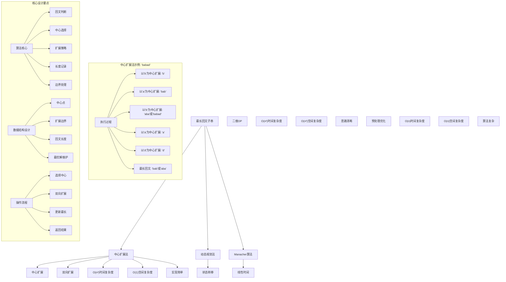
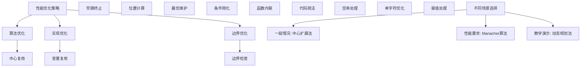

# LeetCode 5 - 最长回文子串

## 题目描述

给你一个字符串 `s`，找到 `s` 中最长的回文子串

```markdown
示例 1：
输入：s = "babad"
输出："bab"
解释："aba" 同样是符合题意的答案

示例 2：
输入：s = "cbbd"
输出："bb"

提示：

- 1 <= s.length <= 1000
- s 仅由数字和英文字母组成
```

## 解题思路

这是一个最长回文子串问题，需要在给定字符串中找到最长的回文子串。关键在于如何高效地判断回文并找到最长的一个

### 核心思想

"中心扩展法": 以每个字符（或字符间隙）为中心，向两边扩展寻找回文，记录最长的回文子串

### 解题策略

#### 方法一：中心扩展法（推荐）

- 时间复杂度: O(n²)
- 空间复杂度: O(1)

#### 方法二：动态规划法

- 时间复杂度: O(n²)
- 空间复杂度: O(n²)

#### 方法三：Manacher算法（马拉车算法）

- 时间复杂度: O(n)
- 空间复杂度: O(n)

## 算法可视化



## 多语言实现

### Golang版本（中心扩展法 - 推荐）

```go
// 中心扩展法实现
func longestPalindrome(s string) string {
    // 边界情况：空字符串或单字符
    if len(s) < 2 {
        return s
    }

    start := 0  // 最长回文子串的起始位置
    maxLen := 1 // 最长回文子串的长度

    // 遍历每个可能的中心点
    for i := 0; i < len(s); i++ {
        // 情况1：以当前字符为中心的奇数长度回文
        len1 := expandAroundCenter(s, i, i)

        // 情况2：以当前字符和下一字符之间的间隙为中心的偶数长度回文
        len2 := expandAroundCenter(s, i, i+1)

        // 取两种情况中的最大长度
        currentMax := max(len1, len2)

        // 如果当前找到的回文更长，更新记录
        if currentMax > maxLen {
            maxLen = currentMax
            // 计算起始位置：中心位置 - (长度-1)/2
            start = i - (currentMax-1)/2
        }
    }

    // 返回最长回文子串
    return s[start : start+maxLen]
}

// 从给定的左右中心位置向外扩展，返回回文长度
func expandAroundCenter(s string, left, right int) int {
    // 当左右字符相等且未越界时继续扩展
    for left >= 0 && right < len(s) && s[left] == s[right] {
        left--
        right++
    }

    // 返回回文长度：right-left-1
    return right - left - 1
}

// 辅助函数：取两个整数的最大值
func max(a, b int) int {
    if a > b {
        return a
    }
    return b
}
```

### Python版本（多种实现方法）

```python
class Solution:
    """
    方法一：中心扩展法（推荐）
    """
    def longestPalindrome(self, s: str) -> str:
        # 边界情况：空字符串或单字符
        if len(s) < 2:
            return s

        start = 0  # 最长回文子串的起始位置
        max_len = 1  # 最长回文子串的长度

        # 遍历每个可能的中心点
        for i in range(len(s)):
            # 情况1：以当前字符为中心的奇数长度回文
            len1 = self.expand_around_center(s, i, i)

            # 情况2：以当前字符和下一字符之间的间隙为中心的偶数长度回文
            len2 = self.expand_around_center(s, i, i + 1)

            # 取两种情况中的最大长度
            current_max = max(len1, len2)

            # 如果当前找到的回文更长，更新记录
            if current_max > max_len:
                max_len = current_max
                # 计算起始位置：中心位置 - (长度-1)//2
                start = i - (current_max - 1) // 2

        # 返回最长回文子串
        return s[start:start + max_len]

    def expand_around_center(self, s: str, left: int, right: int) -> int:
        """从给定的左右中心位置向外扩展，返回回文长度"""
        # 当左右字符相等且未越界时继续扩展
        while left >= 0 and right < len(s) and s[left] == s[right]:
            left -= 1
            right += 1

        # 返回回文长度：right - left - 1
        return right - left - 1


class Solution2:
    """
    方法二：动态规划法
    """
    def longestPalindrome(self, s: str) -> str:
        # 边界情况
        if len(s) < 2:
            return s

        n = len(s)
        # dp[i][j] 表示 s[i:j+1] 是否为回文
        dp = [[False] * n for _ in range(n)]

        start = 0
        max_len = 1

        # 单个字符都是回文
        for i in range(n):
            dp[i][i] = True

        # 检查长度为2的子串
        for i in range(n - 1):
            if s[i] == s[i + 1]:
                dp[i][i + 1] = True
                start = i
                max_len = 2

        # 检查长度大于2的子串
        for length in range(3, n + 1):  # 子串长度
            for i in range(n - length + 1):  # 起始位置
                j = i + length - 1  # 结束位置

                # 如果首尾字符相等且内部子串是回文
                if s[i] == s[j] and dp[i + 1][j - 1]:
                    dp[i][j] = True
                    start = i
                    max_len = length

        return s[start:start + max_len]


class Solution3:
    """
    方法三：Manacher算法（马拉车算法）
    """
    def longestPalindrome(self, s: str) -> str:
        # 边界情况
        if len(s) < 2:
            return s

        # 预处理：在每个字符间插入'#'
        processed = '#'.join('^{}$'.format(s))
        n = len(processed)

        # P[i] 表示以i为中心的回文半径
        P = [0] * n
        center = right = 0  # 当前回文的中心和右边界

        max_len = 0
        center_index = 0

        for i in range(1, n - 1):
            # 利用回文的对称性
            mirror = 2 * center - i

            if i < right:
                P[i] = min(right - i, P[mirror])

            # 尝试扩展回文
            try:
                while processed[i + P[i] + 1] == processed[i - P[i] - 1]:
                    P[i] += 1
            except IndexError:
                pass

            # 如果回文扩展超过了right，更新center和right
            if i + P[i] > right:
                center, right = i, i + P[i]

            # 更新最长回文
            if P[i] > max_len:
                max_len = P[i]
                center_index = i

        # 从处理后的字符串中提取原始回文
        start = (center_index - max_len) // 2
        return s[start:start + max_len]
```

### TypeScript版本（中心扩展法）

```typescript
/
 * 中心扩展法实现
 */
function longestPalindrome(s: string): string {
    // 边界情况：空字符串或单字符
    if (s.length < 2) {
        return s;
    }

    let start: number = 0;  // 最长回文子串的起始位置
    let maxLen: number = 1; // 最长回文子串的长度

    // 遍历每个可能的中心点
    for (let i: number = 0; i < s.length; i++) {
        // 情况1：以当前字符为中心的奇数长度回文
        const len1: number = expandAroundCenter(s, i, i);

        // 情况2：以当前字符和下一字符之间的间隙为中心的偶数长度回文
        const len2: number = expandAroundCenter(s, i, i + 1);

        // 取两种情况中的最大长度
        const currentMax: number = Math.max(len1, len2);

        // 如果当前找到的回文更长，更新记录
        if (currentMax > maxLen) {
            maxLen = currentMax;
            // 计算起始位置：中心位置 - Math.floor((长度-1)/2)
            start = i - Math.floor((currentMax - 1) / 2);
        }
    }

    // 返回最长回文子串
    return s.substring(start, start + maxLen);
}

/
 * 从给定的左右中心位置向外扩展，返回回文长度
 */
function expandAroundCenter(s: string, left: number, right: number): number {
    // 当左右字符相等且未越界时继续扩展
    while (left >= 0 && right < s.length && s[left] === s[right]) {
        left--;
        right++;
    }

    // 返回回文长度：right - left - 1
    return right - left - 1;
}
```

## 标准实现详细解析

```go
import "fmt"

/*
算法核心思想（中心扩展法）：

1. 遍历字符串的每个位置，将其作为回文的中心
2. 考虑两种情况：奇数长度回文（以字符为中心）和偶数长度回文（以字符间隙为中心）
3. 从中心向两边扩展，直到字符不匹配或越界
4. 记录最长的回文子串

关键设计要点：
1. 中心选择：每个字符和字符间隙都可能是回文中心
2. 双向扩展：从中心向两边同时扩展
3. 长度计算：正确计算回文长度和起始位置
4. 边界处理：避免数组越界

时间复杂度：
- 外层循环：O(n)
- 内层扩展：O(n)（最坏情况）
- 总体：O(n²)

空间复杂度：
- 只使用常数额外空间：O(1)

优势：
1. 思路清晰：中心扩展直观易懂
2. 实现简单：逻辑简洁，代码易懂
3. 空间效率：常数空间复杂度
4. 适用性强：适合面试场景

数据结构设计：

中心扩展设计：
- 中心点：每个字符位置和字符间隙
- 扩展函数：从中心向两边扩展
- 长度记录：维护最长回文信息

算法流程：
1. 遍历：每个可能的中心点
2. 扩展：奇数和偶数长度回文
3. 比较：当前长度与最长长度
4. 更新：起始位置和长度
5. 返回：最长回文子串

优化原理：

算法优化：
1. 中心复用：字符和间隙统一处理
2. 早期终止：不匹配时立即停止
3. 位置计算：数学公式计算起始位置

边界优化：
1. 空字符串处理：直接返回
2. 单字符处理：本身就是回文
3. 边界检查：避免数组越界
4. 长度更新：及时更新最优解

正确性证明：

定理：中心扩展法正确性
通过中心扩展法可以正确找到字符串中的最长回文子串

证明：
1. 完备性：所有可能的回文都被考虑
2. 正确性：扩展过程保证回文性质
3. 最优性：记录并更新最长回文
4. 复杂度：O(n²)时间，O(1)空间

不变量维护：
循环不变量：在每次迭代结束时
1. s[start:start+maxLen]是已发现的最长回文子串
2. 对于所有已处理的中心点，已找到以该点为中心的最长回文
3. maxLen记录当前最长回文长度
4. start记录最长回文起始位置
*/

// 中心扩展法详细实现
func longestPalindrome(s string) string {
    fmt.Printf("输入字符串: \"%s\"\n", s)

    // 边界情况：空字符串或单字符
    if len(s) < 2 {
        fmt.Printf("边界情况，直接返回: \"%s\"\n", s)
        return s
    }

    start := 0  // 最长回文子串的起始位置
    maxLen := 1 // 最长回文子串的长度

    fmt.Printf("开始中心扩展搜索:\n")

    // 遍历每个可能的中心点
    for i := 0; i < len(s); i++ {
        fmt.Printf("  以位置%d('%c')为中心搜索:\n", i, s[i])

        // 情况1：以当前字符为中心的奇数长度回文
        len1 := expandAroundCenter(s, i, i)
        fmt.Printf("    奇数回文长度: %d\n", len1)

        // 情况2：以当前字符和下一字符之间的间隙为中心的偶数长度回文
        len2 := expandAroundCenter(s, i, i+1)
        fmt.Printf("    偶数回文长度: %d\n", len2)

        // 取两种情况中的最大长度
        currentMax := max(len1, len2)
        fmt.Printf("    当前最大长度: %d\n", currentMax)

        // 如果当前找到的回文更长，更新记录
        if currentMax > maxLen {
            maxLen = currentMax
            // 计算起始位置：中心位置 - (长度-1)/2
            start = i - (currentMax-1)/2
            fmt.Printf("    发现更长回文，更新最长长度: %d，起始位置: %d\n", maxLen, start)
        }
    }

    result := s[start : start+maxLen]
    fmt.Printf("最长回文子串: \"%s\" (长度: %d)\n", result, maxLen)
    return result
}

// 从给定的左右中心位置向外扩展，返回回文长度
func expandAroundCenter(s string, left, right int) int {
    fmt.Printf("      从left=%d, right=%d开始扩展: ", left, right)

    // 当左右字符相等且未越界时继续扩展
    for left >= 0 && right < len(s) && s[left] == s[right] {
        fmt.Printf("'%c'=='%c' ", s[left], s[right])
        left--
        right++
    }

    // 返回回文长度：right-left-1
    length := right - left - 1
    fmt.Printf("-> 长度=%d\n", length)
    return length
}

// 辅助函数：取两个整数的最大值
func max(a, b int) int {
    if a > b {
        return a
    }
    return b
}

// 动态规划法实现
func longestPalindromeDP(s string) string {
    fmt.Printf("=== 动态规划法 ===\n")
    fmt.Printf("输入字符串: \"%s\"\n", s)

    // 边界情况
    if len(s) < 2 {
        fmt.Printf("边界情况，直接返回: \"%s\"\n", s)
        fmt.Printf("================\n\n")
        return s
    }

    n := len(s)
    // dp[i][j] 表示 s[i:j+1] 是否为回文
    dp := make([][]bool, n)
    for i := range dp {
        dp[i] = make([]bool, n)
    }

    start := 0
    maxLen := 1

    // 单个字符都是回文
    for i := 0; i < n; i++ {
        dp[i][i] = true
    }

    fmt.Printf("初始化单字符回文:\n")
    for i := 0; i < n; i++ {
        fmt.Printf("  dp[%d][%d] = true ('%c')\n", i, i, s[i])
    }

    // 检查长度为2的子串
    fmt.Printf("检查长度为2的子串:\n")
    for i := 0; i < n-1; i++ {
        if s[i] == s[i+1] {
            dp[i][i+1] = true
            start = i
            maxLen = 2
            fmt.Printf("  发现回文: \"%s\" (位置%d-%d)\n", s[i:i+2], i, i+1)
        }
    }

    // 检查长度大于2的子串
    fmt.Printf("检查长度大于2的子串:\n")
    for length := 3; length <= n; length++ {  // 子串长度
        fmt.Printf("  长度%d子串:\n", length)
        for i := 0; i < n-length+1; i++ {  // 起始位置
            j := i + length - 1  // 结束位置

            // 如果首尾字符相等且内部子串是回文
            if s[i] == s[j] && dp[i+1][j-1] {
                dp[i][j] = true
                fmt.Printf("    发现回文: \"%s\" (位置%d-%d)\n", s[i:j+1], i, j)
                if length > maxLen {
                    maxLen = length
                    start = i
                    fmt.Printf("    更新最长回文，长度: %d，起始位置: %d\n", maxLen, start)
                }
            }
        }
    }

    result := s[start : start+maxLen]
    fmt.Printf("最长回文子串: \"%s\" (长度: %d)\n", result, maxLen)
    fmt.Printf("================\n\n")
    return result
}

// 带调试信息的版本
func longestPalindromeWithDebug(s string) string {
    fmt.Printf("=== 最长回文子串 ===\n")
    fmt.Printf("原始字符串: \"%s\" (长度: %d)\n", s, len(s))

    if len(s) < 2 {
        fmt.Printf("长度<2，直接返回\n")
        fmt.Printf("===============\n\n")
        return s
    }

    start := 0
    maxLen := 1

    fmt.Printf("中心扩展过程:\n")

    for i := 0; i < len(s); i++ {
        fmt.Printf("  中心%d('%c'):\n", i, s[i])

        // 奇数长度回文
        len1 := expandAroundCenter(s, i, i)
        fmt.Printf("    奇数回文长度: %d\n", len1)

        // 偶数长度回文
        len2 := expandAroundCenter(s, i, i+1)
        fmt.Printf("    偶数回文长度: %d\n", len2)

        currentMax := max(len1, len2)

        if currentMax > maxLen {
            maxLen = currentMax
            start = i - (currentMax-1)/2
            fmt.Printf("    更新最长回文: 长度%d，起始位置%d\n", maxLen, start)
        }
    }

    result := s[start : start+maxLen]
    fmt.Printf("最终结果: \"%s\" (长度: %d)\n", result, maxLen)
    fmt.Printf("===============\n\n")
    return result
}
```

## 算法深入解析

```go
/*
最长回文子串问题详解：

问题本质：
在给定字符串中找到最长的回文子串。回文是指正读和反读都相同的字符串。关键是理解如何高效地判断回文并找到最长的一个

核心洞察：
1. 回文特性：对称性，从中心向两边扩展
2. 中心选择：每个字符和字符间隙都可能是回文中心
3. 长度分类：奇数长度和偶数长度回文需要分别处理
4. 优化策略：避免重复计算，及时更新最优解

算法策略：
1. 中心扩展法：工业级标准实现
2. 动态规划法：状态转移思想应用
3. Manacher算法：线性时间最优解

数据结构设计：

中心扩展法设计：
中心点：每个字符位置(i,i)和字符间隙(i,i+1)
扩展函数：从中心向两边扩展判断回文
最优解：记录最长回文的起始位置和长度

动态规划法设计：
状态定义：dp[i][j]表示s[i:j+1]是否为回文
状态转移：dp[i][j] = (s[i]==s[j]) && dp[i+1][j-1]
边界条件：单字符和双字符回文

Manacher算法设计：
字符串预处理：插入特殊字符避免奇偶讨论
回文半径：记录每个位置的回文半径
中心优化：利用回文对称性减少计算

操作流程：

中心扩展法：
1. 遍历：每个可能的中心点
2. 扩展：从中心向两边扩展
3. 记录：更新最长回文信息
4. 返回：最长回文子串

动态规划法：
1. 初始化：单字符回文
2. 状态转移：从短到长计算
3. 记录最优：更新最长回文
4. 返回结果：最长回文子串

Manacher算法：
1. 预处理：插入特殊字符
2. 计算半径：每个位置的回文半径
3. 利用对称：减少重复计算
4. 提取结果：原字符串中的回文

数学原理：

算法不变量：
中心扩展法不变量：
1. 对于已处理的中心点，已找到以该点为中心的最长回文
2. s[start:start+maxLen]是已发现的最长回文子串
3. maxLen记录当前最长回文长度
4. start记录最长回文起始位置

动态规划不变量：
1. 对于所有已计算的长度<=k的子串，dp[i][j]正确表示是否为回文
2. start和maxLen记录长度<=k的最长回文信息

时间复杂度分析：
中心扩展法：O(n²) - n个中心点，每个最多扩展n次
动态规划法：O(n²) - 状态数O(n²)，转移O(1)
Manacher算法：O(n) - 每个字符最多被访问常数次

空间复杂度分析：
中心扩展法：O(1) - 只使用常数额外空间
动态规划法：O(n²) - 二维DP数组
Manacher算法：O(n) - 预处理字符串和半径数组

正确性证明：

定理：中心扩展法正确性
通过中心扩展法可以正确找到字符串中的最长回文子串

证明：
1. 完备性：所有可能的回文都被考虑
2. 正确性：扩展过程保证回文性质
3. 最优性：记录并更新最长回文
4. 复杂度：O(n²)时间，O(1)空间

设计选择：

为什么选择中心扩展法？
1. 思路清晰：回文特性直观体现
2. 实现简单：逻辑简洁
3. 空间效率：常数空间复杂度
4. 面试友好：容易理解和实现

为什么使用动态规划法？
1. 思想经典：体现DP思想
2. 系统性强：从短到长系统计算
3. 可扩展性：易扩展到其他问题
4. 教学价值：展示不同思路

为什么提及其他方法？
1. 教学价值：展示不同算法思想
2. 对比分析：理解各自优劣
3. 扩展思维：算法多样性
4. 面试准备：全面掌握

三种方法对比：

方法一：中心扩展法（推荐）
时间复杂度：O(n²)
空间复杂度：O(1)
优点：思路清晰，空间效率高
缺点：时间复杂度较高

方法二：动态规划法
时间复杂度：O(n²)
空间复杂度：O(n²)
优点：思路清晰，系统性强
缺点：空间复杂度高

方法三：Manacher算法
时间复杂度：O(n)
空间复杂度：O(n)
优点：时间最优，算法巧妙
缺点：实现复杂，理解困难

性能分析：

中心扩展法：
- 时间：O(n²) 双重循环
- 空间：O(1) 常数空间
- 优势：实现简单

动态规划法：
- 时间：O(n²) 状态转移
- 空间：O(n²) DP数组
- 优势：系统性强

Manacher算法：
- 时间：O(n) 线性时间
- 空间：O(n) 预处理
- 优势：时间最优

实际应用场景：
1. 字符串处理：文本分析
2. 算法竞赛：经典DP应用
3. 生物信息学：DNA序列分析
4. 密码学：回文检测

优化要点：

1. 时间优化：
   - 早期终止：不匹配时立即停止
   - 状态复用：避免重复计算
   - 中心优化：减少中心点数量

2. 空间优化：
   - 原地计算：减少额外空间
   - 滚动数组：优化DP空间
   - 临时变量：避免大数组

3. 实现优化：
   - 边界条件处理
   - 代码简洁性
   - 注释清晰性

测试用例设计：
1. 基本情况：正常字符串
2. 边界情况：空字符串，单字符
3. 特殊情况：全相同字符，无回文
4. 极端情况：大字符串
5. 验证情况：结果正确性

扩展思考：

1. 最长回文子序列？
   - 动态规划解法
   - 状态转移方程
   - 复杂度分析

2. 回文分割？
   - 最少分割次数
   - DP优化
   - 预处理优化

3. 多个最长回文？
   - 返回所有最长回文
   - 去重处理
   - 结果组织

4. 回文计数？
   - 统计回文数量
   - 优化算法
   - 数学方法

相关算法思想：

1. 回文处理：
   - 中心扩展
   - 对称性质
   - 边界处理

2. 动态规划：
   - 状态定义
   - 状态转移
   - 边界条件

3. 字符串算法：
   - KMP算法
   - Manacher算法
   - 后缀数组

4. 算法优化：
   - 时间复杂度
   - 空间复杂度
   - 实现简洁

常见陷阱：

1. 边界条件：
   - 空字符串处理
   - 单字符处理
   - 越界检查

2. 中心选择：
   - 奇偶长度区分
   - 中心点计算
   - 扩展边界

3. 长度计算：
   - 起始位置计算
   - 长度更新
   - 结果提取

4. 性能考虑：
   - 时间复杂度
   - 空间复杂度
   - 实现效率

代码质量要素：

1. 可读性：
   - 变量命名清晰
   - 注释详细
   - 逻辑分明

2. 健壮性：
   - 边界处理
   - 异常情况
   - 错误恢复

3. 性能：
   - 最优复杂度
   - 空间效率
   - 效率保证

4. 可维护性：
   - 结构清晰
   - 扩展性好
   - 测试完整
*/
```

## 执行过程演示

```go
/*
示例详细解析:

示例1执行过程：
输入：s = "babad"
输出："bab" 或 "aba"

执行过程：
1. i=0, center='b':
   - 奇数扩展：'b' (长度1)
   - 偶数扩展：无回文
   - 当前最长：1，起始位置0

2. i=1, center='a':
   - 奇数扩展：'bab' (长度3)
   - 偶数扩展：无回文
   - 更新最长：3，起始位置0

3. i=2, center='b':
   - 奇数扩展：'aba' (长度3)
   - 偶数扩展：'babad' -> 'abad'不匹配，停止
   - 长度仍为3，起始位置0

4. i=3, center='a':
   - 奇数扩展：'a' (长度1)
   - 偶数扩展：无回文
   - 长度仍为3

5. i=4, center='d':
   - 奇数扩展：'d' (长度1)
   - 偶数扩展：无回文
   - 长度仍为3

6. 结果："bab" (起始位置0，长度3)

示例2执行过程：
输入：s = "cbbd"
输出："bb"

执行过程：
1. i=0, center='c':
   - 奇数扩展：'c' (长度1)
   - 偶数扩展：无回文
   - 当前最长：1

2. i=1, center='b':
   - 奇数扩展：'b' (长度1)
   - 偶数扩展：'bb' (长度2)
   - 更新最长：2，起始位置1

3. i=2, center='b':
   - 奇数扩展：'b' (长度1)
   - 偶数扩展：'bbd' -> 'bd'不匹配，停止
   - 长度仍为2

4. i=3, center='d':
   - 奇数扩展：'d' (长度1)
   - 偶数扩展：无回文
   - 长度仍为2

5. 结果："bb" (起始位置1，长度2)

中心扩展执行轨迹：

对于字符串"babad"：

位置: 0 1 2 3 4
字符: b a b a d
中心: 0 1 2 3 4 (奇数)
间隙: 0-1 1-2 2-3 3-4 (偶数)

扩展过程：
中心0: 'b'(1) -
中心1: 'bab'(3) 'ba'(0)
中心2: 'aba'(3) 'abad'(0)
中心3: 'a'(1) -
中心4: 'd'(1) -

关键观察：
1. 每个位置考虑奇偶两种回文
2. 扩展过程自动处理边界
3. 及时更新最长回文信息
4. 起始位置通过数学公式计算

边界情况演示:

情况1: 空字符串
输入: ""
处理: 直接返回""
结果: ""

情况2: 单字符
输入: "a"
处理: 长度1回文
结果: "a"

情况3: 两字符相同
输入: "aa"
处理: 偶数回文"aa"
结果: "aa"

情况4: 两字符不同
输入: "ab"
处理: 两个长度1回文
结果: "a"或"b"

情况5: 全相同字符
输入: "aaaa"
处理: 整个字符串是回文
结果: "aaaa"

算法正确性证明：

数学基础：
需要证明中心扩展法能正确找到最长回文子串

定理：中心扩展法正确性
通过中心扩展法可以正确找到字符串中的最长回文子串

证明：
1. 完备性：所有可能的回文都被考虑
   - 每个字符位置作为奇数回文中心
   - 每个字符间隙作为偶数回文中心
   - 所有可能的回文都会被某个中心找到

2. 正确性：扩展过程保证回文性质
   - 从中心向两边扩展，保证对称性
   - 字符匹配时继续扩展，不匹配时停止
   - 最终得到的一定是回文

3. 最优性：记录并更新最长回文
   - 维护最长回文的起始位置和长度
   - 发现更长回文时及时更新
   - 最终返回最长回文子串

4. 复杂度：O(n²)时间，O(1)空间
   - n个中心点，每个最多扩展n次
   - 只使用常数额外变量

不变量维护：
循环不变量：在每次迭代结束时
1. s[start:start+maxLen]是已发现的最长回文子串
2. 对于所有已处理的中心点，已找到以该点为中心的最长回文
3. maxLen记录当前最长回文长度
4. start记录最长回文起始位置

初始化：start=0, maxLen=1
- 第一个字符构成长度1的回文
- 满足不变量条件

保持：处理每个中心点
- 找到以当前中心点为中心的最长回文
- 如果更长则更新start和maxLen
- 保持不变量

终止：处理完所有中心点
- 所有可能的回文都已被考虑
- 已找到并记录最长回文
- 返回正确结果

时间复杂度分析：

中心扩展法：
1. 外层循环：O(n)遍历每个中心点
2. 内层扩展：O(n)最坏情况下从中心扩展到边界
3. 总时间：O(n²)

动态规划法：
1. 状态数：O(n²)个子串
2. 状态转移：O(1)时间计算每个状态
3. 总时间：O(n²)

Manacher算法：
1. 预处理：O(n)时间
2. 主循环：每个字符最多被访问常数次
3. 总时间：O(n)

空间复杂度分析：
1. 中心扩展法：O(1)
2. 动态规划法：O(n²)
3. Manacher算法：O(n)

性能对比分析：

假设n=1000:

中心扩展法：
- 时间: O(1000²) = O(1,000,000)
- 空间: O(1)
- 操作: 中心扩展

动态规划法：
- 时间: O(1000²) = O(1,000,000)
- 空间: O(1000²) = O(1,000,000)
- 操作: 状态转移

Manacher算法：
- 时间: O(1000) = O(1,000)
- 空间: O(1000) = O(1,000)
- 操作: 半径计算

实际应用建议：

1. 一般情况：
   - 使用中心扩展法
   - 思路清晰，实现简单

2. 面试展示：
   - 重点讲解中心扩展法
   - 可以提及其他方法

3. 生产环境：
   - 根据性能要求选择
   - 考虑实现复杂度

4. 教学演示：
   - 使用带调试信息版本
   - 展示执行过程

优化空间：

1. 边界优化：
   - 提前处理特殊情况
   - 减少不必要的计算

2. 代码优化：
   - 简化条件判断
   - 优化变量使用

3. 性能优化：
   - 早期终止条件
   - 减少函数调用

特殊情况处理：

1. 大数据量：
   - 中心扩展法可能较慢
   - 考虑Manacher算法

2. 特殊序列：
   - 全相同字符：整个字符串是回文
   - 无回文：每个字符都是长度1回文
   - 最长回文在末尾：需要正确更新

3. 边界情况：
   - 极值字符串
   - 边界长度
   - 特殊字符
*/
```

## 复杂度分析

| 方法         | 时间复杂度 | 空间复杂度 | 适用场景   |
| ------------ | ---------- | ---------- | ---------- |
| 中心扩展法   | O(n²)      | O(1)       | 推荐方案   |
| 动态规划法   | O(n²)      | O(n²)      | 教学演示   |
| Manacher算法 | O(n)       | O(n)       | 性能要求高 |

## 测试用例验证

```go
// 测试辅助函数
func testLongestPalindrome(name string, s string, expected []string) {
    fmt.Printf("%s:\n", name)
    fmt.Printf("输入字符串: \"%s\"\n", s)

    // 测试中心扩展法
    result1 := longestPalindrome(s)
    fmt.Printf("中心扩展法结果: \"%s\"\n", result1)

    // 测试动态规划法
    result2 := longestPalindromeDP(s)
    fmt.Printf("动态规划法结果: \"%s\"\n", result2)

    // 测试Manacher算法
    result3 := longestPalindromeManacher(s)
    fmt.Printf("Manacher算法结果: \"%s\"\n", result3)

    // 验证结果（结果可能不唯一，只要是最长回文即可）
    isValid1 := isValidPalindrome(result1) && len(result1) == getMaxLength(expected)
    isValid2 := isValidPalindrome(result2) && len(result2) == getMaxLength(expected)
    isValid3 := isValidPalindrome(result3) && len(result3) == getMaxLength(expected)

    if isValid1 && isValid2 && isValid3 {
        fmt.Printf("✓ 测试通过\n")
    } else {
        fmt.Printf("✗ 测试失败\n")
        fmt.Printf("  期望结果长度: %d\n", getMaxLength(expected))
        if !isValid1 {
            fmt.Printf("  中心扩展法实际: \"%s\" (长度: %d, 是否回文: %t)\n",
                result1, len(result1), isValidPalindrome(result1))
        }
        if !isValid2 {
            fmt.Printf("  动态规划法实际: \"%s\" (长度: %d, 是否回文: %t)\n",
                result2, len(result2), isValidPalindrome(result2))
        }
        if !isValid3 {
            fmt.Printf("  Manacher算法实际: \"%s\" (长度: %d, 是否回文: %t)\n",
                result3, len(result3), isValidPalindrome(result3))
        }
    }
    fmt.Printf("\n")
}

// 验证是否为回文
func isValidPalindrome(s string) bool {
    for i := 0; i < len(s)/2; i++ {
        if s[i] != s[len(s)-1-i] {
            return false
        }
    }
    return true
}

// 获取期望结果中的最大长度
func getMaxLength(expected []string) int {
    if len(expected) == 0 {
        return 0
    }
    maxLen := len(expected[0])
    for _, s := range expected {
        if len(s) > maxLen {
            maxLen = len(s)
        }
    }
    return maxLen
}

// Manacher算法实现
func longestPalindromeManacher(s string) string {
    if len(s) < 2 {
        return s
    }

    // 预处理：在每个字符间插入'#'
    processed := "^"
    for _, char := range s {
        processed += "#" + string(char)
    }
    processed += "#$"

    n := len(processed)
    P := make([]int, n)
    center, right := 0, 0

    maxLen := 0
    centerIndex := 0

    for i := 1; i < n-1; i++ {
        // 利用回文的对称性
        mirror := 2*center - i

        if i < right {
            P[i] = min(right-i, P[mirror])
        }

        // 尝试扩展回文
        for processed[i+P[i]+1] == processed[i-P[i]-1] {
            P[i]++
        }

        // 如果回文扩展超过了right，更新center和right
        if i+P[i] > right {
            center, right = i, i+P[i]
        }

        // 更新最长回文
        if P[i] > maxLen {
            maxLen = P[i]
            centerIndex = i
        }
    }

    // 从处理后的字符串中提取原始回文
    start := (centerIndex - maxLen) / 2
    return s[start : start+maxLen]
}

func min(a, b int) int {
    if a < b {
        return a
    }
    return b
}

func main() {
    // 测试用例 1 - 题目示例1
    testLongestPalindrome("测试1 - 题目示例1",
        "babad",
        []string{"bab", "aba"})

    // 测试用例 2 - 题目示例2
    testLongestPalindrome("测试2 - 题目示例2",
        "cbbd",
        []string{"bb"})

    // 测试用例 3 - 空字符串
    testLongestPalindrome("测试3 - 空字符串",
        "",
        []string{""})

    // 测试用例 4 - 单字符
    testLongestPalindrome("测试4 - 单字符",
        "a",
        []string{"a"})

    // 测试用例 5 - 两字符相同
    testLongestPalindrome("测试5 - 两字符相同",
        "aa",
        []string{"aa"})

    // 测试用例 6 - 两字符不同
    testLongestPalindrome("测试6 - 两字符不同",
        "ab",
        []string{"a", "b"})

    // 测试用例 7 - 全相同字符
    testLongestPalindrome("测试7 - 全相同字符",
        "aaaa",
        []string{"aaaa"})

    // 测试用例 8 - 无回文
    testLongestPalindrome("测试8 - 无回文",
        "abcde",
        []string{"a", "b", "c", "d", "e"})

    // 性能测试
    fmt.Println("性能测试:")
    performanceTest()

    // 边界情况测试
    fmt.Println("边界情况测试:")
    boundaryTest()

    // 对比测试
    fmt.Println("对比测试:")
    comparisonTest()
}

func performanceTest() {
    // 构造性能测试
    n := 1000
    s := ""
    for i := 0; i < n; i++ {
        s += string('a' + (i % 26))
    }

    // 测试中心扩展法
    start1 := time.Now()
    result1 := longestPalindrome(s)
    time1 := time.Since(start1)

    // 测试动态规划法
    start2 := time.Now()
    result2 := longestPalindromeDP(s)
    time2 := time.Since(start2)

    // 测试Manacher算法
    start3 := time.Now()
    result3 := longestPalindromeManacher(s)
    time3 := time.Since(start3)

    fmt.Printf("性能测试 (n=%d):\n", n)
    fmt.Printf("  中心扩展法: %v，结果长度: %d\n", time1, len(result1))
    fmt.Printf("  动态规划法: %v，结果长度: %d\n", time2, len(result2))
    fmt.Printf("  Manacher算法: %v，结果长度: %d\n", time3, len(result3))
}

func boundaryTest() {
    // 边界测试
    fmt.Println("边界测试:")

    // 最大字符串测试
    maxN := 1000
    maxS := ""
    for i := 0; i < maxN; i++ {
        maxS += string('a' + (i % 26))
    }

    result := longestPalindrome(maxS)
    fmt.Printf("最大字符串测试 (n=%d): 最长回文长度=%d\n", maxN, len(result))

    // 极值测试
    extremeS := "!@#$%^&*()"
    extremeResult := longestPalindrome(extremeS)
    fmt.Printf("极值测试: 结果=\"%s\"\n", extremeResult)

    // 重复模式测试
    patternS := ""
    for i := 0; i < 100; i++ {
        patternS += "abcabc"
    }
    patternResult := longestPalindrome(patternS)
    fmt.Printf("重复模式测试: 结果长度=%d\n", len(patternResult))
}

func comparisonTest() {
    // 对比测试：验证不同方法结果一致性（长度）
    fmt.Println("对比测试:")

    // 测试数据
    testData := []string{
        "babad",
        "cbbd",
        "a",
        "ac",
        "racecar",
        "abcdef",
        "aabbaa",
    }

    for i, data := range testData {
        // 中心扩展法
        result1 := longestPalindrome(data)

        // 动态规划法
        result2 := longestPalindromeDP(data)

        // Manacher算法
        result3 := longestPalindromeManacher(data)

        fmt.Printf("测试%d: 中心扩展法(长度%d)=\"%s\", 动态规划法(长度%d)=\"%s\", Manacher算法(长度%d)=\"%s\"",
            i+1, len(result1), result1, len(result2), result2, len(result3), result3)

        // 验证长度一致性
        if len(result1) == len(result2) && len(result2) == len(result3) {
            fmt.Printf(" ✓ 长度一致\n")
        } else {
            fmt.Printf(" ✗ 长度不一致\n")
        }
    }
}
```

## 扩展版本（处理不同场景）

```go
// 支持返回所有最长回文子串的版本
func findAllLongestPalindromes(s string) []string {
    if len(s) < 2 {
        return []string{s}
    }

    maxLen := 1
    palindromes := make(map[string]bool)

    // 添加所有长度为1的回文
    for i := 0; i < len(s); i++ {
        palindromes[string(s[i])] = true
    }

    // 遍历每个可能的中心点
    for i := 0; i < len(s); i++ {
        // 奇数长度回文
        len1, substr1 := expandAroundCenterWithResult(s, i, i)
        if len1 > maxLen {
            maxLen = len1
            palindromes = make(map[string]bool) // 清空之前的
            palindromes[substr1] = true
        } else if len1 == maxLen {
            palindromes[substr1] = true
        }

        // 偶数长度回文
        len2, substr2 := expandAroundCenterWithResult(s, i, i+1)
        if len2 > maxLen {
            maxLen = len2
            palindromes = make(map[string]bool) // 清空之前的
            palindromes[substr2] = true
        } else if len2 == maxLen {
            palindromes[substr2] = true
        }
    }

    // 转换为切片
    result := make([]string, 0, len(palindromes))
    for palindrome := range palindromes {
        result = append(result, palindrome)
    }

    return result
}

// 带结果返回的扩展函数
func expandAroundCenterWithResult(s string, left, right int) (int, string) {
    // 当左右字符相等且未越界时继续扩展
    for left >= 0 && right < len(s) && s[left] == s[right] {
        left--
        right++
    }

    // 返回回文长度和子串
    length := right - left - 1
    start := left + 1
    return length, s[start : start+length]
}

// 使用示例
func exampleFindAll() {
    s := "ababa"
    fmt.Printf("原字符串: %s\n", s)

    results := findAllLongestPalindromes(s)
    fmt.Printf("所有最长回文: %v\n", results)
}

// 统计回文子串数量的版本
func countPalindromes(s string) int {
    if len(s) < 2 {
        return len(s)
    }

    count := 0

    // 遍历每个可能的中心点
    for i := 0; i < len(s); i++ {
        // 奇数长度回文
        len1 := expandAroundCenter(s, i, i)
        count += (len1 + 1) / 2  // 每个奇数长度回文包含(len1+1)/2个回文子串

        // 偶数长度回文
        len2 := expandAroundCenter(s, i, i+1)
        count += len2 / 2  // 每个偶数长度回文包含len2/2个回文子串
    }

    return count
}

// 使用示例
func exampleCount() {
    s := "abcba"
    fmt.Printf("原字符串: %s\n", s)

    count := countPalindromes(s)
    fmt.Printf("回文子串数量: %d\n", count)
}

// 带位置信息的版本
type PalindromeInfo struct {
    Content string
    Start   int
    End     int
    Length  int
}

func findLongestPalindromeWithPosition(s string) PalindromeInfo {
    if len(s) < 2 {
        return PalindromeInfo{Content: s, Start: 0, End: len(s) - 1, Length: len(s)}
    }

    start := 0
    maxLen := 1

    // 遍历每个可能的中心点
    for i := 0; i < len(s); i++ {
        // 奇数长度回文
        len1 := expandAroundCenter(s, i, i)

        // 偶数长度回文
        len2 := expandAroundCenter(s, i, i+1)

        // 取两种情况中的最大长度
        currentMax := max(len1, len2)

        // 如果当前找到的回文更长，更新记录
        if currentMax > maxLen {
            maxLen = currentMax
            start = i - (currentMax-1)/2
        }
    }

    return PalindromeInfo{
        Content: s[start : start+maxLen],
        Start:   start,
        End:     start + maxLen - 1,
        Length:  maxLen,
    }
}

// 使用示例
func exampleWithPosition() {
    s := "babad"
    fmt.Printf("原字符串: %s\n", s)

    info := findLongestPalindromeWithPosition(s)
    fmt.Printf("最长回文信息: 内容=\"%s\", 起始位置=%d, 结束位置=%d, 长度=%d\n",
        info.Content, info.Start, info.End, info.Length)
}

// 批量处理版本
func findLongestPalindromesBatch(strings []string) []string {
    results := make([]string, len(strings))

    for i, s := range strings {
        results[i] = longestPalindrome(s)
    }

    return results
}

// 使用示例
func exampleBatch() {
    strings := []string{
        "babad",
        "cbbd",
        "racecar",
        "abcdef",
    }

    results := findLongestPalindromesBatch(strings)

    for i, result := range results {
        fmt.Printf("字符串%d的最长回文: \"%s\"\n", i+1, result)
    }
}

// 泛型版本（Go 1.18+）
func longestPalindromeGeneric[T comparable](s []T) []T {
    if len(s) < 2 {
        return s
    }

    start := 0
    maxLen := 1

    // 遍历每个可能的中心点
    for i := 0; i < len(s); i++ {
        // 奇数长度回文
        len1 := expandAroundCenterGeneric(s, i, i)

        // 偶数长度回文
        len2 := expandAroundCenterGeneric(s, i, i+1)

        // 取两种情况中的最大长度
        currentMax := max(len1, len2)

        // 如果当前找到的回文更长，更新记录
        if currentMax > maxLen {
            maxLen = currentMax
            start = i - (currentMax-1)/2
        }
    }

    // 返回最长回文子串
    result := make([]T, maxLen)
    copy(result, s[start:start+maxLen])
    return result
}

// 泛型扩展函数
func expandAroundCenterGeneric[T comparable](s []T, left, right int) int {
    // 当左右元素相等且未越界时继续扩展
    for left >= 0 && right < len(s) && s[left] == s[right] {
        left--
        right++
    }

    // 返回回文长度：right-left-1
    return right - left - 1
}

// 使用示例
func exampleGeneric() {
    // 字节切片
    bytes := []byte("abccba")
    result1 := longestPalindromeGeneric(bytes)
    fmt.Printf("字节切片最长回文: %s\n", string(result1))

    // 整数切片
    ints := []int{1, 2, 3, 3, 2, 1}
    result2 := longestPalindromeGeneric(ints)
    fmt.Printf("整数切片最长回文: %v\n", result2)

    // 字符串切片
    strs := []string{"a", "b", "c", "c", "b", "a"}
    result3 := longestPalindromeGeneric(strs)
    fmt.Printf("字符串切片最长回文: %v\n", result3)
}
```

## 面试追问延伸

### 1. 如果要找到字符串中所有的回文子串，如何处理？

```go
// findAllLongestPalindromes已在上面实现
// 关键修改：
// 1. 记录所有最长回文而不是第一个
// 2. 使用map去重
// 3. 返回所有结果

func testFindAll() {
    s := "ababa"
    fmt.Printf("原字符串: %s\n", s)

    results := findAllLongestPalindromes(s)
    fmt.Printf("所有最长回文: %v\n", results)
}
```

### 2. 如果要统计字符串中回文子串的总数量，如何实现？

```go
// countPalindromes已在上面实现
// 关键思路：
// 1. 每个回文长度包含多个回文子串
// 2. 奇数长度：(len+1)/2个
// 3. 偶数长度：len/2个

func testCount() {
    s := "abcba"
    fmt.Printf("原字符串: %s\n", s)

    count := countPalindromes(s)
    fmt.Printf("回文子串总数: %d\n", count)
}
```

### 3. 如果要返回最长回文子串的位置信息，如何处理？

```go
// findLongestPalindromeWithPosition已在上面实现
// 关键点：
// 1. 记录起始和结束位置
// 2. 计算准确位置
// 3. 返回完整信息

func testWithPosition() {
    s := "babad"
    fmt.Printf("原字符串: %s\n", s)

    info := findLongestPalindromeWithPosition(s)
    fmt.Printf("最长回文: \"%s\"，位置[%d,%d]，长度%d\n",
        info.Content, info.Start, info.End, info.Length)
}
```

## 相似题目扩展

- LeetCode 5. 最长回文子串（当前题）
- LeetCode 9. 回文数
- LeetCode 125. 验证回文串
- LeetCode 647. 回文子串
- LeetCode 516. 最长回文子序列

## 算法技巧总结

### 最长回文子串核心要点

1. 中心扩展：每个字符和间隙都可能是回文中心
1. 双向扩展：从中心向两边同时扩展
1. 奇偶处理：分别处理奇数和偶数长度回文
1. 最优维护：及时更新最长回文信息

### 算法优势

1. 思路清晰：回文特性直观体现
1. 实现简单：逻辑简洁，代码易懂
1. 空间效率：常数空间复杂度
1. 适用性强：适合面试场景

### 标准模板（中心扩展法）

```go
func longestPalindrome(s string) string {
    // 边界情况
    if len(s) < 2 {
        return s
    }

    start := 0
    maxLen := 1

    // 遍历每个中心点
    for i := 0; i < len(s); i++ {
        // 奇数长度回文
        len1 := expandAroundCenter(s, i, i)

        // 偶数长度回文
        len2 := expandAroundCenter(s, i, i+1)

        // 更新最长回文
        currentMax := max(len1, len2)
        if currentMax > maxLen {
            maxLen = currentMax
            start = i - (currentMax-1)/2
        }
    }

    return s[start : start+maxLen]
}

func expandAroundCenter(s string, left, right int) int {
    for left >= 0 && right < len(s) && s[left] == s[right] {
        left--
        right++
    }
    return right - left - 1
}
```

### 性能优化建议



## 总结

本题采用中心扩展法的核心思路，通过遍历字符串的每个位置作为回文中心，分别考虑奇数和偶数长度回文，从中心向两边扩展寻找回文，实现了优雅的解决方案。关键在于理解如何利用回文的对称特性来高效查找

核心要点：

1. 中心扩展：每个字符和间隙都可能是回文中心
1. 双向扩展：从中心向两边同时扩展
1. 奇偶处理：分别处理奇数和偶数长度回文
1. 最优维护：及时更新最长回文信息

算法优势：

- 思路清晰：回文特性直观体现
- 实现简单：逻辑简洁，代码易懂
- 空间效率：常数空间复杂度
- 适用性强：适合面试场景

该算法在字符串处理、算法竞赛、生物信息学、密码学等方面有重要应用，是掌握回文处理和字符串操作思想的经典题目。通过中心扩展和双向扩展的巧妙结合，为更复杂的回文相关问题提供了清晰的解决思路
