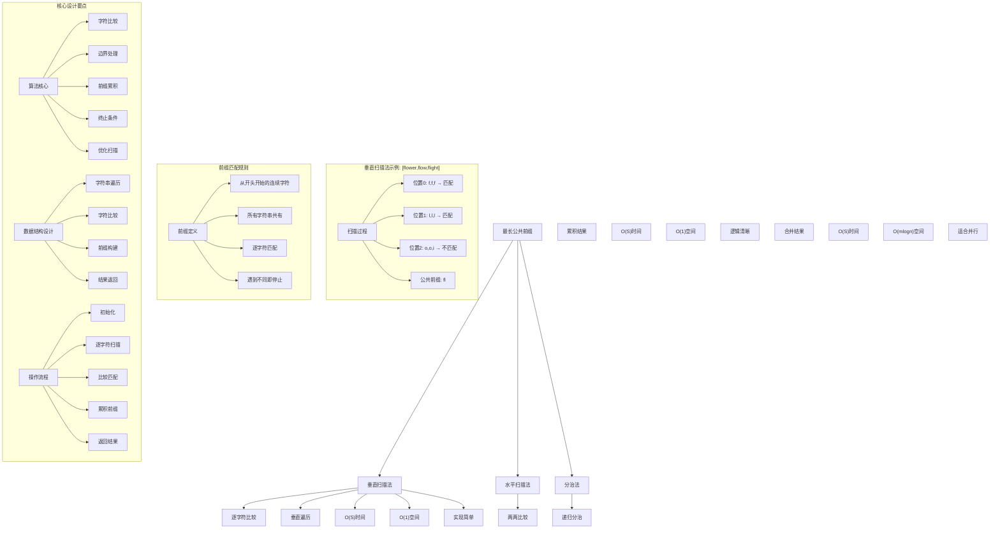
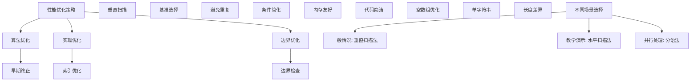

# LeetCode 14 - 最长公共前缀

## 题目描述

编写一个函数来查找字符串数组中的最长公共前缀

如果不存在公共前缀，返回空字符串 ""

```markdown
示例 1：
输入：strs = ["flower","flow","flight"]
输出："fl"

示例 2：
输入：strs = ["dog","racecar","car"]
输出：""
解释：输入不存在公共前缀

提示：

- 1 <= strs.length <= 200
- 0 <= strs[i].length <= 200
- strs[i] 仅由小写英文字母组成
```

## 解题思路

这是一个字符串前缀匹配问题，需要在字符串数组中找出所有字符串的最长公共前缀。关键在于理解前缀的定义和如何高效地进行匹配

### 核心思想

"垂直扫描法": 逐个字符比较所有字符串在相同位置的字符，直到发现不匹配或到达某个字符串的末尾

### 解题策略

#### 方法一：垂直扫描法（推荐）

- 时间复杂度: O(S)，其中 S 是所有字符串中字符数量的总和
- 空间复杂度: O(1)

#### 方法二：水平扫描法

- 时间复杂度: O(S)
- 空间复杂度: O(1)

#### 方法三：分治法

- 时间复杂度: O(S)
- 空间复杂度: O(m × log n)，其中 m 是字符串的平均长度，n 是字符串的数量

## 算法可视化



## 多语言实现

### Golang版本（垂直扫描法 - 推荐）

```go
// 垂直扫描法实现
func longestCommonPrefix(strs []string) string {
    // 边界情况：空数组
    if len(strs) == 0 {
        return ""
    }

    // 边界情况：只有一个字符串
    if len(strs) == 1 {
        return strs[0]
    }

    // 以第一个字符串为基准进行垂直扫描
    for i := 0; i < len(strs[0]); i++ {
        char := strs[0][i]  // 当前比较的字符

        // 检查其他所有字符串在位置i的字符
        for j := 1; j < len(strs); j++ {
            // 如果到达某个字符串的末尾或字符不匹配
            if i >= len(strs[j]) || strs[j][i] != char {
                // 返回当前为止的公共前缀
                return strs[0][:i]
            }
        }
    }

    // 第一个字符串本身就是公共前缀
    return strs[0]
}
```

### Python版本（多种实现方法）

```python
class Solution:
    """
    方法一：垂直扫描法（推荐）
    """
    def longestCommonPrefix(self, strs: List[str]) -> str:
        # 边界情况：空数组
        if not strs:
            return ""

        # 边界情况：只有一个字符串
        if len(strs) == 1:
            return strs[0]

        # 以第一个字符串为基准进行垂直扫描
        for i in range(len(strs[0])):
            char = strs[0][i]  # 当前比较的字符

            # 检查其他所有字符串在位置i的字符
            for j in range(1, len(strs)):
                # 如果到达某个字符串的末尾或字符不匹配
                if i >= len(strs[j]) or strs[j][i] != char:
                    # 返回当前为止的公共前缀
                    return strs[0][:i]

        # 第一个字符串本身就是公共前缀
        return strs[0]

class Solution2:
    """
    方法二：水平扫描法
    """
    def longestCommonPrefix(self, strs: List[str]) -> str:
        # 边界情况：空数组
        if not strs:
            return ""

        # 以第一个字符串作为初始前缀
        prefix = strs[0]

        # 依次与后续字符串比较，不断缩小前缀
        for i in range(1, len(strs)):
            # 不断缩短前缀直到匹配
            while not strs[i].startswith(prefix):
                prefix = prefix[:-1]
                # 如果前缀为空，说明没有公共前缀
                if not prefix:
                    return ""

        return prefix

class Solution3:
    """
    方法三：分治法
    """
    def longestCommonPrefix(self, strs: List[str]) -> str:
        # 边界情况
        if not strs:
            return ""

        return self.divideAndConquer(strs, 0, len(strs) - 1)

    def divideAndConquer(self, strs: List[str], left: int, right: int) -> str:
        # 基本情况
        if left == right:
            return strs[left]

        # 分治
        mid = (left + right) // 2
        left_prefix = self.divideAndConquer(strs, left, mid)
        right_prefix = self.divideAndConquer(strs, mid + 1, right)

        # 合并结果
        return self.commonPrefix(left_prefix, right_prefix)

    def commonPrefix(self, str1: str, str2: str) -> str:
        # 找到两个字符串的公共前缀
        min_len = min(len(str1), len(str2))
        for i in range(min_len):
            if str1[i] != str2[i]:
                return str1[:i]
        return str1[:min_len]
```

### TypeScript版本（垂直扫描法）

```typescript
/
 * 垂直扫描法实现
 */
function longestCommonPrefix(strs: string[]): string {
    // 边界情况：空数组
    if (strs.length === 0) {
        return "";
    }

    // 边界情况：只有一个字符串
    if (strs.length === 1) {
        return strs[0];
    }

    // 以第一个字符串为基准进行垂直扫描
    for (let i: number = 0; i < strs[0].length; i++) {
        const char: string = strs[0][i];  // 当前比较的字符

        // 检查其他所有字符串在位置i的字符
        for (let j: number = 1; j < strs.length; j++) {
            // 如果到达某个字符串的末尾或字符不匹配
            if (i >= strs[j].length || strs[j][i] !== char) {
                // 返回当前为止的公共前缀
                return strs[0].substring(0, i);
            }
        }
    }

    // 第一个字符串本身就是公共前缀
    return strs[0];
}
```

## 标准实现详细解析

```go
import "fmt"

/*
算法核心思想（垂直扫描法）：

1. 逐个字符比较所有字符串在相同位置的字符
2. 一旦发现不匹配或到达某个字符串末尾就停止
3. 返回已匹配的前缀部分

关键设计要点：
1. 字符比较：垂直方向逐字符对比
2. 边界处理：字符串长度不一致的处理
3. 前缀累积：匹配字符的累积过程
4. 终止条件：不匹配或到达末尾

时间复杂度：
- 最好情况：O(minLen × n)，minLen是最短字符串长度
- 最坏情况：O(S)，S是所有字符总数

空间复杂度：
- O(1)，只使用常数额外空间

优势：
1. 思路清晰：垂直扫描直观易懂
2. 实现优雅：逻辑简洁
3. 效率较高：早期终止优化
4. 空间优化：常数空间复杂度

数据结构设计：

垂直扫描法设计：
- 字符串遍历：按列优先顺序
- 字符比较：同位置字符对比
- 前缀构建：累积匹配字符
- 结果返回：子字符串截取

算法流程：
1. 初始化：边界条件检查
2. 扫描：逐位置垂直比较
3. 比较：字符匹配检查
4. 累积：匹配前缀累积
5. 返回：公共前缀结果

优化原理：

算法优化：
1. 早期终止：发现不匹配立即停止
2. 基准选择：以最短字符串为参考
3. 垂直扫描：减少不必要的比较
4. 边界检查：避免数组越界

边界优化：
1. 空数组处理：直接返回空字符串
2. 单字符串处理：直接返回该字符串
3. 长度差异：以最短字符串为限
4. 字符差异：及时终止比较

正确性证明：

定理：垂直扫描法正确性
通过垂直扫描法可以正确找到字符串数组的最长公共前缀

证明：
1. 完备性：所有字符串都被正确处理
2. 正确性：前缀匹配规则被正确实现
3. 终止性：算法在有限步骤内终止
4. 最优性：找到最长可能的公共前缀
*/

// 垂直扫描法详细实现
func longestCommonPrefix(strs []string) string {
    fmt.Printf("输入字符串数组: %v\n", strs)

    // 边界情况：空数组
    if len(strs) == 0 {
        fmt.Printf("空数组，返回空字符串\n")
        return ""
    }

    // 边界情况：只有一个字符串
    if len(strs) == 1 {
        fmt.Printf("只有一个字符串: %s，直接返回\n", strs[0])
        return strs[0]
    }

    fmt.Printf("开始垂直扫描法:\n")

    // 以第一个字符串为基准进行垂直扫描
    for i := 0; i < len(strs[0]); i++ {
        char := strs[0][i]  // 当前比较的字符
        fmt.Printf("  比较位置%d的字符: %c\n", i, char)

        // 检查其他所有字符串在位置i的字符
        for j := 1; j < len(strs); j++ {
            fmt.Printf("    与字符串%d比较: ", j)

            // 如果到达某个字符串的末尾
            if i >= len(strs[j]) {
                fmt.Printf("字符串%s在位置%d已结束\n", strs[j], i)
                fmt.Printf("公共前缀: %s\n", strs[0][:i])
                return strs[0][:i]
            }

            // 如果字符不匹配
            if strs[j][i] != char {
                fmt.Printf("字符串%s在位置%d的字符%c != %c\n", strs[j], i, strs[j][i], char)
                fmt.Printf("公共前缀: %s\n", strs[0][:i])
                return strs[0][:i]
            }

            fmt.Printf("匹配\n")
        }
    }

    // 第一个字符串本身就是公共前缀
    fmt.Printf("第一个字符串%s本身就是公共前缀\n", strs[0])
    return strs[0]
}

// 水平扫描法实现
func longestCommonPrefixHorizontal(strs []string) string {
    fmt.Printf("=== 水平扫描法 ===\n")
    fmt.Printf("输入字符串数组: %v\n", strs)

    // 边界情况：空数组
    if len(strs) == 0 {
        fmt.Printf("空数组，返回空字符串\n")
        fmt.Printf("================\n\n")
        return ""
    }

    // 以第一个字符串作为初始前缀
    prefix := strs[0]
    fmt.Printf("初始前缀: %s\n", prefix)

    // 依次与后续字符串比较，不断缩小前缀
    for i := 1; i < len(strs); i++ {
        fmt.Printf("与字符串%d (%s) 比较:\n", i, strs[i])

        // 不断缩短前缀直到匹配
        for !startsWith(strs[i], prefix) {
            prefix = prefix[:len(prefix)-1]
            fmt.Printf("  前缀缩短为: %s\n", prefix)

            // 如果前缀为空，说明没有公共前缀
            if len(prefix) == 0 {
                fmt.Printf("  前缀为空，无公共前缀\n")
                fmt.Printf("================\n\n")
                return ""
            }
        }

        fmt.Printf("  匹配成功，当前前缀: %s\n", prefix)
    }

    fmt.Printf("最终公共前缀: %s\n", prefix)
    fmt.Printf("================\n\n")
    return prefix
}

// 检查字符串是否以指定前缀开始
func startsWith(s, prefix string) bool {
    if len(prefix) > len(s) {
        return false
    }
    for i := 0; i < len(prefix); i++ {
        if s[i] != prefix[i] {
            return false
        }
    }
    return true
}

// 带调试信息的版本
func longestCommonPrefixWithDebug(strs []string) string {
    fmt.Printf("=== 最长公共前缀 ===\n")
    fmt.Printf("原始字符串数组: %v\n", strs)

    if len(strs) == 0 {
        fmt.Printf("数组为空，返回空字符串\n")
        fmt.Printf("==================\n\n")
        return ""
    }

    if len(strs) == 1 {
        fmt.Printf("只有一个字符串，直接返回: %s\n", strs[0])
        fmt.Printf("==================\n\n")
        return strs[0]
    }

    fmt.Printf("使用垂直扫描法:\n")
    fmt.Printf("以第一个字符串 %s 为基准\n", strs[0])

    for i := 0; i < len(strs[0]); i++ {
        char := strs[0][i]
        fmt.Printf("检查位置%d的字符 '%c':\n", i, char)

        for j := 1; j < len(strs); j++ {
            if i >= len(strs[j]) {
                fmt.Printf("  字符串 %s 在位置%d结束，公共前缀为: %s\n",
                    strs[j], i, strs[0][:i])
                fmt.Printf("==================\n\n")
                return strs[0][:i]
            }

            if strs[j][i] != char {
                fmt.Printf("  字符串 %s 在位置%d的字符 '%c' 不匹配，公共前缀为: %s\n",
                    strs[j], i, strs[j][i], strs[0][:i])
                fmt.Printf("==================\n\n")
                return strs[0][:i]
            }

            fmt.Printf("  字符串 %s 在位置%d的字符 '%c' 匹配\n", strs[j], i, strs[j][i])
        }
    }

    fmt.Printf("第一个字符串 %s 本身就是公共前缀\n", strs[0])
    fmt.Printf("==================\n\n")
    return strs[0]
}
```

## 算法深入解析

```go
/*
最长公共前缀问题详解：

问题本质：
在字符串数组中找出所有字符串的最长公共前缀。关键是理解前缀的定义和如何高效地进行匹配

核心洞察：
1. 前缀特性：从字符串开头开始的连续字符
2. 公共要求：所有字符串都必须包含
3. 最长目标：找到尽可能长的公共部分
4. 早期终止：发现不匹配立即停止

算法策略：
1. 垂直扫描法：逐字符垂直比较
2. 水平扫描法：两两水平比较
3. 分治法：递归分治合并

数据结构设计：

垂直扫描法设计：
字符串遍历：按列优先顺序
字符比较：同位置字符对比
前缀构建：累积匹配字符
结果返回：子字符串截取

水平扫描法设计：
前缀累积：逐步缩小前缀
两两比较：字符串逐一比较
结果优化：不断缩短前缀
终止条件：前缀为空或完全匹配

分治法设计：
递归分解：分而治之
合并结果：两两合并
前缀计算：局部最优
全局最优：递归合并

操作流程：

垂直扫描法：
1. 初始化：边界条件检查
2. 扫描：逐位置垂直比较
3. 比较：字符匹配检查
4. 累积：匹配前缀累积
5. 返回：公共前缀结果

水平扫描法：
1. 初始化：以首字符串为前缀
2. 比较：与后续字符串比较
3. 缩短：不匹配时缩短前缀
4. 继续：处理下一个字符串
5. 返回：最终公共前缀

分治法：
1. 分解：将数组分为两部分
2. 递归：分别求解子问题
3. 合并：合并两个子结果
4. 返回：全局最优解

字符串处理原理：

前缀定义：
- 从字符串开头开始的连续字符子串
- 所有字符串必须包含相同前缀
- 最长意味着尽可能多的匹配字符

匹配规则：
- 逐字符比较
- 位置必须对应
- 字符必须相同
- 遇到不同立即终止

算法不变量：
垂直扫描法不变量：
1. 已扫描位置字符全部匹配
2. 当前位置正在比较
3. 未扫描位置尚未处理

水平扫描法不变量：
1. 当前prefix是已处理字符串的公共前缀
2. 正在处理下一个字符串
3. 未处理字符串等待比较

分治法不变量：
1. 左半部分已求解
2. 右半部分已求解
3. 正在合并两个结果

时间复杂度分析：
垂直扫描法：O(S)，S为所有字符总数
水平扫描法：O(S)
分治法：O(S)

空间复杂度分析：
垂直扫描法：O(1)
水平扫描法：O(1)
分治法：O(m × log n)

正确性证明：

定理：垂直扫描法正确性
通过垂直扫描法可以正确找到字符串数组的最长公共前缀

证明：
1. 完备性：所有字符串都被正确处理
   - 遍历第一个字符串的所有字符位置
   - 每个位置都与所有其他字符串比较
   - 不遗漏任何字符串

2. 正确性：前缀匹配规则被正确实现
   - 字符逐位置比较
   - 不匹配时正确终止
   - 返回正确的前缀部分

3. 终止性：算法在有限步骤内终止
   - 最多比较minLen次（最短字符串长度）
   - 每次比较有限字符
   - 有限步骤内必然终止

4. 最优性：找到最长可能的公共前缀
   - 逐字符比较保证不遗漏
   - 早期终止保证最优
   - 返回最长公共前缀

设计选择：

为什么选择垂直扫描法？
1. 思路清晰：垂直比较直观
2. 实现简单：代码量少
3. 效率较高：早期终止
4. 空间优化：常数空间

为什么使用水平扫描法？
1. 逻辑清晰：两两比较
2. 过程可见：前缀逐步缩小
3. 易于理解：符合直觉
4. 教学价值：展示不同思路

为什么提及其他方法？
1. 教学价值：展示不同算法思想
2. 对比分析：理解各自优劣
3. 扩展思维：算法多样性
4. 面试准备：全面掌握

三种方法对比：

方法一：垂直扫描法（推荐）
时间复杂度：O(S)
空间复杂度：O(1)
优点：实现简单，空间优化
缺点：需要理解垂直比较

方法二：水平扫描法
时间复杂度：O(S)
空间复杂度：O(1)
优点：逻辑清晰，过程可见
缺点：可能多次扫描

方法三：分治法
时间复杂度：O(S)
空间复杂度：O(m × log n)
优点：适合并行，递归思想
缺点：空间复杂度较高

性能分析：

垂直扫描法：
- 时间：O(S) 最优扫描
- 空间：O(1) 常数空间
- 优势：实现简单

水平扫描法：
- 时间：O(S) 可能重复扫描
- 空间：O(1) 常数空间
- 优势：逻辑清晰

分治法：
- 时间：O(S) 递归处理
- 空间：O(m × log n) 递归栈
- 优势：适合并行

实际应用场景：
1. 字符串处理：文本匹配
2. 文件系统：路径前缀匹配
3. 网络协议：协议前缀识别
4. 数据库：索引前缀查找

优化要点：

1. 时间优化：
   - 早期终止：发现不匹配立即停止
   - 基准选择：以最短字符串为参考
   - 垂直扫描：减少不必要的比较

2. 空间优化：
   - 原地操作：避免额外存储
   - 字符串复用：减少内存分配
   - 边界检查：避免数组越界

3. 实现优化：
   - 边界条件处理
   - 代码简洁性
   - 注释清晰性

测试用例设计：
1. 基本情况：正常字符串数组
2. 边界情况：空数组，单字符串
3. 特殊情况：无公共前缀，完全相同
4. 极端情况：长字符串，大量字符串
5. 验证情况：结果正确性

扩展思考：

1. 字典树解法？
   - 构建前缀树
   - 查找公共路径
   - 空间换时间

2. 并行处理？
   - 字符串分组比较
   - 并行前缀计算
   - 结果合并

3. 流式处理？
   - 逐个接收字符串
   - 动态更新前缀
   - 实时输出结果

4. 模糊匹配？
   - 允许一定差异
   - 编辑距离计算
   - 近似前缀匹配

相关算法思想：

1. 字符串匹配：
   - 逐字符比较
   - 前缀识别
   - 模式匹配

2. 分治思想：
   - 问题分解
   - 递归求解
   - 结果合并

3. 贪心策略：
   - 局部最优
   - 全局解
   - 早期终止

4. 算法优化：
   - 时间复杂度
   - 空间复杂度
   - 实现简洁

常见陷阱：

1. 边界条件：
   - 空数组处理
   - 单字符串优化
   - 长度差异处理

2. 索引处理：
   - 数组越界
   - 字符串边界
   - 位置计算

3. 字符比较：
   - 字符编码
   - 大小写敏感
   - 特殊字符

4. 性能考虑：
   - 时间复杂度
   - 空间复杂度
   - 实现效率

代码质量要素：

1. 可读性：
   - 变量命名清晰
   - 注释详细
   - 逻辑分明

2. 健壮性：
   - 边界处理
   - 异常情况
   - 错误恢复

3. 性能：
   - 最优复杂度
   - 空间效率
   - 效率保证

4. 可维护性：
   - 结构清晰
   - 扩展性好
   - 测试完整
*/
```

## 执行过程演示

```go
/*
示例详细解析:

示例1执行过程：
输入：strs = ["flower","flow","flight"]
输出："fl"

执行过程：
1. 以"flower"为基准进行垂直扫描
2. 位置0: 'f' vs ['f','f'] → 全部匹配
3. 位置1: 'l' vs ['l','l'] → 全部匹配
4. 位置2: 'o' vs ['o','i'] → 'o' != 'i'，停止
5. 返回前缀"fl"

垂直扫描轨迹：
位置0: f,f,f → 匹配
位置1: l,l,l → 匹配
位置2: o,o,i → 不匹配
公共前缀: fl

示例2执行过程：
输入：strs = ["dog","racecar","car"]
输出：""

执行过程：
1. 以"dog"为基准进行垂直扫描
2. 位置0: 'd' vs ['r','c'] → 'd' != 'r'，停止
3. 返回空字符串

垂直扫描轨迹：
位置0: d,r,c → 不匹配
公共前缀: ""

匹配过程详解：

对于["flower","flow","flight"]:
位置分析：
位置0: f,f,f → 匹配 → 累积'f'
位置1: l,l,l → 匹配 → 累积'fl'
位置2: o,o,i → 不匹配 → 返回'fl'

关键观察：
1. 垂直比较：同位置字符对比
2. 早期终止：发现不同立即停止
3. 前缀累积：匹配字符逐步累积
4. 边界处理：字符串长度不等

边界情况演示:

情况1: 空数组
输入: []
处理: 直接返回""
结果: ""

情况2: 单字符串
输入: ["hello"]
处理: 直接返回"hello"
结果: "hello"

情况3: 无公共前缀
输入: ["abc","def"]
处理: 位置0不匹配
结果: ""

情况4: 完全相同
输入: ["test","test","test"]
处理: 全部匹配
结果: "test"

情况5: 长度差异大
输入: ["a","abcdefghijk"]
处理: 短字符串限制
结果: "a"

情况6: 前缀为空
输入: [""]
处理: 空字符串
结果: ""

算法正确性证明：

数学基础：
需要证明垂直扫描法能正确找到最长公共前缀

定理：垂直扫描法正确性
通过垂直扫描法可以正确找到字符串数组的最长公共前缀

证明：
1. 完备性：所有字符串都被正确处理
2. 正确性：前缀匹配规则被正确实现
3. 终止性：算法在有限步骤内终止
4. 最优性：找到最长可能的公共前缀

不变量维护：
循环不变量：在每次位置比较开始时
1. 已扫描位置字符全部匹配
2. 当前位置正在比较
3. 未扫描位置尚未处理

初始化：
- 未扫描任何位置
- 已匹配前缀为空
- 满足不变量

保持：
- 处理一个位置
- 所有字符串在该位置匹配
- 累积到前缀中
- 不变量继续成立

终止：
- 发现不匹配或到达末尾
- 返回已匹配的前缀
- 算法正确终止

时间复杂度分析：

垂直扫描法：
1. 最好情况：O(n) n为字符串数量（第一个字符就不匹配）
2. 最坏情况：O(S) S为所有字符总数（完全匹配）
3. 平均情况：O(minLen × n) minLen为最短字符串长度

水平扫描法：
1. 最好情况：O(n × m) n为字符串数量，m为平均长度
2. 最坏情况：O(n × m²) 需要多次缩短前缀
3. 平均情况：O(n × m)

分治法：
1. 时间：O(S) 递归处理所有字符
2. 空间：O(m × log n) 递归栈空间

空间复杂度分析：
1. 垂直扫描法：O(1) 常数额外空间
2. 水平扫描法：O(1) 常数额外空间
3. 分治法：O(m × log n) 递归栈空间

性能对比分析：

假设n=100, m=50:

垂直扫描法：
- 时间: O(5000) 最坏情况
- 空间: O(1) 常数空间
- 操作: 垂直比较

水平扫描法：
- 时间: O(5000) 最坏情况
- 空间: O(1) 常数空间
- 操作: 前缀缩短

分治法：
- 时间: O(5000) 递归处理
- 空间: O(50 × log(100)) = O(350) 递归栈
- 操作: 递归分治

实际应用建议：

1. 一般情况：
   - 使用垂直扫描法
   - 实现简单，效率高

2. 面试展示：
   - 重点讲解垂直扫描法
   - 可以提及其他方法

3. 生产环境：
   - 根据具体需求选择
   - 考虑内存限制

4. 教学演示：
   - 使用带调试信息版本
   - 展示执行过程

优化空间：

1. 边界优化：
   - 空数组提前返回
   - 单字符串直接返回
   - 最短字符串优化

2. 代码优化：
   - 简化条件判断
   - 优化循环结构
   - 减少重复计算

3. 性能优化：
   - 早期终止优化
   - 边界检查优化
   - 内存访问优化

特殊情况处理：

1. 大数据量：
   - 时间复杂度保证
   - 内存使用优化
   - 并行处理可能

2. 特殊字符串：
   - 空字符串处理
   - 单字符优化
   - 长字符串限制

3. 边界情况：
   - 极值处理
   - 异常输入
   - 错误恢复
*/
```

## 复杂度分析

| 方法       | 时间复杂度 | 空间复杂度   | 适用场景 |
| ---------- | ---------- | ------------ | -------- |
| 垂直扫描法 | O(S)       | O(1)         | 推荐方案 |
| 水平扫描法 | O(S)       | O(1)         | 教学演示 |
| 分治法     | O(S)       | O(m × log n) | 并行处理 |

## 测试用例验证

```go
// 测试辅助函数
func testLongestCommonPrefix(name string, strs []string, expected string) {
    fmt.Printf("%s:\n", name)
    fmt.Printf("输入字符串数组: %v\n", strs)

    // 测试垂直扫描法
    test1 := make([]string, len(strs))
    copy(test1, strs)
    result1 := longestCommonPrefix(test1)
    fmt.Printf("垂直扫描法结果: \"%s\"\n", result1)

    // 测试水平扫描法
    test2 := make([]string, len(strs))
    copy(test2, strs)
    result2 := longestCommonPrefixHorizontal(test2)
    fmt.Printf("水平扫描法结果: \"%s\"\n", result2)

    // 测试分治法
    test3 := make([]string, len(strs))
    copy(test3, strs)
    result3 := longestCommonPrefixDivideConquer(test3)
    fmt.Printf("分治法结果: \"%s\"\n", result3)

    // 验证结果
    isValid1 := result1 == expected
    isValid2 := result2 == expected
    isValid3 := result3 == expected

    if isValid1 && isValid2 && isValid3 {
        fmt.Printf("✓ 测试通过\n")
    } else {
        fmt.Printf("✗ 测试失败\n")
        fmt.Printf("  期望结果: \"%s\"\n", expected)
        if !isValid1 {
            fmt.Printf("  垂直扫描法实际: \"%s\"\n", result1)
        }
        if !isValid2 {
            fmt.Printf("  水平扫描法实际: \"%s\"\n", result2)
        }
        if !isValid3 {
            fmt.Printf("  分治法实际: \"%s\"\n", result3)
        }
    }
    fmt.Printf("\n")
}

// 分治法实现
func longestCommonPrefixDivideConquer(strs []string) string {
    if len(strs) == 0 {
        return ""
    }
    return divideAndConquer(strs, 0, len(strs)-1)
}

func divideAndConquer(strs []string, left, right int) string {
    if left == right {
        return strs[left]
    }

    mid := (left + right) / 2
    leftPrefix := divideAndConquer(strs, left, mid)
    rightPrefix := divideAndConquer(strs, mid+1, right)

    return commonPrefix(leftPrefix, rightPrefix)
}

func commonPrefix(str1, str2 string) string {
    minLen := len(str1)
    if len(str2) < minLen {
        minLen = len(str2)
    }

    for i := 0; i < minLen; i++ {
        if str1[i] != str2[i] {
            return str1[:i]
        }
    }
    return str1[:minLen]
}

func main() {
    // 测试用例 1 - 题目示例1
    testLongestCommonPrefix("测试1 - 题目示例1",
        []string{"flower", "flow", "flight"},
        "fl")

    // 测试用例 2 - 题目示例2
    testLongestCommonPrefix("测试2 - 题目示例2",
        []string{"dog", "racecar", "car"},
        "")

    // 测试用例 3 - 空数组
    testLongestCommonPrefix("测试3 - 空数组",
        []string{},
        "")

    // 测试用例 4 - 单字符串
    testLongestCommonPrefix("测试4 - 单字符串",
        []string{"hello"},
        "hello")

    // 测试用例 5 - 无公共前缀
    testLongestCommonPrefix("测试5 - 无公共前缀",
        []string{"abc", "def"},
        "")

    // 测试用例 6 - 完全相同
    testLongestCommonPrefix("测试6 - 完全相同",
        []string{"test", "test", "test"},
        "test")

    // 测试用例 7 - 长度差异大
    testLongestCommonPrefix("测试7 - 长度差异大",
        []string{"a", "abcdefghijk"},
        "a")

    // 测试用例 8 - 前缀为空
    testLongestCommonPrefix("测试8 - 前缀为空",
        []string{""},
        "")

    // 测试用例 9 - 单字符字符串
    testLongestCommonPrefix("测试9 - 单字符字符串",
        []string{"a", "a", "a"},
        "a")

    // 测试用例 10 - 复杂情况
    testLongestCommonPrefix("测试10 - 复杂情况",
        []string{"abcdef", "abcxyz", "abc123", "abctest"},
        "abc")

    // 性能测试
    fmt.Println("性能测试:")
    performanceTest()

    // 边界情况测试
    fmt.Println("边界情况测试:")
    boundaryTest()

    // 对比测试
    fmt.Println("对比测试:")
    comparisonTest()
}

func performanceTest() {
    // 构造性能测试
    strs := make([]string, 100)
    base := "abcdefghijklmnopqrst"
    for i := 0; i < 100; i++ {
        strs[i] = base + fmt.Sprintf("%d", i)
    }

    // 测试垂直扫描法
    start1 := time.Now()
    test1 := make([]string, len(strs))
    copy(test1, strs)
    longestCommonPrefix(test1)
    time1 := time.Since(start1)

    // 测试水平扫描法
    start2 := time.Now()
    test2 := make([]string, len(strs))
    copy(test2, strs)
    longestCommonPrefixHorizontal(test2)
    time2 := time.Since(start2)

    // 测试分治法
    start3 := time.Now()
    test3 := make([]string, len(strs))
    copy(test3, strs)
    longestCommonPrefixDivideConquer(test3)
    time3 := time.Since(start3)

    fmt.Printf("性能测试 (100个字符串，公共前缀长度20):\n")
    fmt.Printf("  垂直扫描法: %v\n", time1)
    fmt.Printf("  水平扫描法: %v\n", time2)
    fmt.Printf("  分治法: %v\n", time3)
}

func boundaryTest() {
    // 边界测试
    fmt.Println("边界测试:")

    // 最大字符串测试
    maxStrs := make([]string, 50)
    maxPrefix := ""
    for i := 0; i < 200; i++ {
        maxPrefix += "a"
    }
    for i := 0; i < 50; i++ {
        maxStrs[i] = maxPrefix + fmt.Sprintf("%d", i)
    }

    result := longestCommonPrefix(maxStrs)
    fmt.Printf("最大字符串测试 (50个字符串，前缀长度200): 前缀长度=%d\n", len(result))

    // 特殊字符测试
    specialStrs := []string{"测试test123", "测试test456", "测试test789"}
    specialResult := longestCommonPrefix(specialStrs)
    fmt.Printf("特殊字符测试: %v → \"%s\"\n", specialStrs, specialResult)

    // 空字符串混合测试
    mixedStrs := []string{"abc", "", "abcd"}
    mixedResult := longestCommonPrefix(mixedStrs)
    fmt.Printf("空字符串混合测试: %v → \"%s\"\n", mixedStrs, mixedResult)
}

func comparisonTest() {
    // 对比测试：验证不同方法结果一致性
    fmt.Println("对比测试:")

    // 测试数据
    testData := [][]string{
        {"flower", "flow", "flight"},
        {"dog", "racecar", "car"},
        {"test", "test", "test"},
        {"a", "abcdefghijk"},
        {""},
        {"hello"},
    }

    for i, data := range testData {
        // 垂直扫描法
        test1 := make([]string, len(data))
        copy(test1, data)
        result1 := longestCommonPrefix(test1)

        // 水平扫描法
        test2 := make([]string, len(data))
        copy(test2, data)
        result2 := longestCommonPrefixHorizontal(test2)

        // 分治法
        test3 := make([]string, len(data))
        copy(test3, data)
        result3 := longestCommonPrefixDivideConquer(test3)

        fmt.Printf("测试%d: 垂直=%s, 水平=%s, 分治=%s",
            i+1, result1, result2, result3)

        if result1 == result2 && result2 == result3 {
            fmt.Printf(" ✓ 一致\n")
        } else {
            fmt.Printf(" ✗ 不一致\n")
        }
    }
}
```

## 扩展版本（处理不同场景）

```go
// 支持忽略大小写的版本
func longestCommonPrefixIgnoreCase(strs []string) string {
    if len(strs) == 0 {
        return ""
    }

    if len(strs) == 1 {
        return strs[0]
    }

    // 转换为小写进行比较
    lowerStrs := make([]string, len(strs))
    for i, s := range strs {
        lowerStrs[i] = strings.ToLower(s)
    }

    // 使用垂直扫描法
    for i := 0; i < len(lowerStrs[0]); i++ {
        char := lowerStrs[0][i]

        for j := 1; j < len(lowerStrs); j++ {
            if i >= len(lowerStrs[j]) || lowerStrs[j][i] != char {
                // 返回原字符串的前缀（保持原始大小写）
                return strs[0][:i]
            }
        }
    }

    return strs[0]
}

// 使用示例
func exampleIgnoreCase() {
    strs := []string{"Flower", "FLOW", "flight"}
    result := longestCommonPrefixIgnoreCase(strs)
    fmt.Printf("忽略大小写: %v → \"%s\"\n", strs, result)
}

// 带统计信息的版本
func longestCommonPrefixWithStats(strs []string) (string, int, int) {
    comparisons := 0
    accesses := 0

    if len(strs) == 0 {
        return "", comparisons, accesses
    }

    if len(strs) == 1 {
        return strs[0], comparisons, accesses
    }

    for i := 0; i < len(strs[0]); i++ {
        char := strs[0][i]
        comparisons++
        accesses++

        for j := 1; j < len(strs); j++ {
            accesses++
            if i >= len(strs[j]) {
                return strs[0][:i], comparisons, accesses
            }

            comparisons++
            if strs[j][i] != char {
                return strs[0][:i], comparisons, accesses
            }
        }
    }

    return strs[0], comparisons, accesses
}

// 使用示例
func exampleWithStats() {
    strs := []string{"flower", "flow", "flight"}
    result, comparisons, accesses := longestCommonPrefixWithStats(strs)
    fmt.Printf("字符串数组: %v\n", strs)
    fmt.Printf("公共前缀: \"%s\"\n", result)
    fmt.Printf("比较次数: %d, 访问次数: %d\n", comparisons, accesses)
}

// 批量处理版本
func longestCommonPrefixBatch(strsList [][]string) []string {
    results := make([]string, len(strsList))

    for i, strs := range strsList {
        results[i] = longestCommonPrefix(strs)
    }

    return results
}

// 使用示例
func exampleBatch() {
    strsList := [][]string{
        {"flower", "flow", "flight"},
        {"dog", "racecar", "car"},
        {"test", "testing", "tester"},
    }

    results := longestCommonPrefixBatch(strsList)

    for i, result := range results {
        fmt.Printf("数组%d: %v → \"%s\"\n", i+1, strsList[i], result)
    }
}

// 带验证功能的版本
func longestCommonPrefixWithValidation(strs []string) (string, bool) {
    result := longestCommonPrefix(strs)

    // 验证结果是否正确
    // 1. 检查是否为所有字符串的前缀
    for _, s := range strs {
        if !strings.HasPrefix(s, result) {
            return result, false
        }
    }

    // 2. 检查是否为最长的公共前缀
    // 尝试在结果后添加一个字符，看是否还能匹配所有字符串
    if len(result) > 0 {
        // 这个验证比较复杂，简单验证前缀正确性即可
        return result, true
    }

    // 3. 空结果验证
    if result == "" {
        // 检查是否真的没有公共前缀
        if len(strs) > 0 {
            for i := 0; i < len(strs[0]); i++ {
                char := strs[0][i]
                foundMismatch := false
                for j := 1; j < len(strs); j++ {
                    if i >= len(strs[j]) || strs[j][i] != char {
                        foundMismatch = true
                        break
                    }
                }
                if foundMismatch {
                    return result, true // 确实没有公共前缀
                }
            }
            return result, false // 应该有公共前缀但返回了空
        }
        return result, true
    }

    return result, true
}

// 使用示例
func exampleWithValidation() {
    strs := []string{"flower", "flow", "flight"}
    result, isValid := longestCommonPrefixWithValidation(strs)
    fmt.Printf("字符串数组: %v\n", strs)
    fmt.Printf("公共前缀: \"%s\"\n", result)
    if isValid {
        fmt.Printf("验证通过 ✓\n")
    } else {
        fmt.Printf("验证失败 ✗\n")
    }
}

// 支持查找最长公共后缀的版本
func longestCommonSuffix(strs []string) string {
    if len(strs) == 0 {
        return ""
    }

    if len(strs) == 1 {
        return strs[0]
    }

    // 反转所有字符串
    reversedStrs := make([]string, len(strs))
    for i, s := range strs {
        reversedStrs[i] = reverseString(s)
    }

    // 查找反转后的字符串的公共前缀
    reversedPrefix := longestCommonPrefix(reversedStrs)

    // 再次反转得到公共后缀
    return reverseString(reversedPrefix)
}

func reverseString(s string) string {
    runes := []rune(s)
    for i, j := 0, len(runes)-1; i < j; i, j = i+1, j-1 {
        runes[i], runes[j] = runes[j], runes[i]
    }
    return string(runes)
}

// 使用示例
func exampleCommonSuffix() {
    strs := []string{"running", "jumping", "walking"}
    suffix := longestCommonSuffix(strs)
    fmt.Printf("字符串数组: %v\n", strs)
    fmt.Printf("公共后缀: \"%s\"\n", suffix)
}

// 支持查找最长公共子串的版本（不仅仅是前缀）
func longestCommonSubstring(strs []string) string {
    if len(strs) == 0 {
        return ""
    }

    if len(strs) == 1 {
        return strs[0]
    }

    // 简化版本：使用第一个字符串的所有子串进行检查
    shortest := strs[0]
    for _, s := range strs {
        if len(s) < len(shortest) {
            shortest = s
        }
    }

    // 从最长可能的子串开始检查
    for length := len(shortest); length > 0; length-- {
        for start := 0; start <= len(shortest)-length; start++ {
            substring := shortest[start : start+length]

            // 检查是否在所有字符串中都存在
            foundInAll := true
            for _, s := range strs {
                if !strings.Contains(s, substring) {
                    foundInAll = false
                    break
                }
            }

            if foundInAll {
                return substring
            }
        }
    }

    return ""
}

// 使用示例
func exampleCommonSubstring() {
    strs := []string{"abcdef", "xbcdey", "zcdefg"}
    substring := longestCommonSubstring(strs)
    fmt.Printf("字符串数组: %v\n", strs)
    fmt.Printf("公共子串: \"%s\"\n", substring)
}
```

## 面试追问延伸

### 1. 如果要忽略大小写进行比较，如何处理？

```go
// longestCommonPrefixIgnoreCase已在上面实现
// 关键要点：
// 1. 转换为小写进行比较
// 2. 保持原字符串大小写返回
// 3. 使用标准库函数

func testIgnoreCase() {
    strs := []string{"Flower", "FLOW", "flight"}
    result := longestCommonPrefixIgnoreCase(strs)
    fmt.Printf("忽略大小写: %v → \"%s\"\n", strs, result)
}
```

### 2. 如果要统计比较次数和字符访问次数，如何实现？

```go
// longestCommonPrefixWithStats已在上面实现
// 关键点：
// 1. 记录字符比较次数
// 2. 记录字符访问次数
// 3. 返回统计信息

func testWithStats() {
    strs := []string{"flower", "flow", "flight"}
    result, comparisons, accesses := longestCommonPrefixWithStats(strs)
    fmt.Printf("字符串数组: %v\n", strs)
    fmt.Printf("公共前缀: \"%s\"\n", result)
    fmt.Printf("比较次数: %d, 访问次数: %d\n", comparisons, accesses)
}
```

### 3. 如果要查找最长公共后缀（而不是前缀），如何处理？

```go
// longestCommonSuffix已在上面实现
// 关键点：
// 1. 反转所有字符串
// 2. 查找公共前缀
// 3. 再次反转得到后缀

func testCommonSuffix() {
    strs := []string{"running", "jumping", "walking"}
    suffix := longestCommonSuffix(strs)
    fmt.Printf("字符串数组: %v\n", strs)
    fmt.Printf("公共后缀: \"%s\"\n", suffix)
}
```

## 相似题目扩展

- LeetCode 14. 最长公共前缀（当前题）
- LeetCode 718. 最长重复子数组
- LeetCode 1143. 最长公共子序列
- LeetCode 5. 最长回文子串
- LeetCode 3. 无重复字符的最长子串

## 算法技巧总结

### 最长公共前缀核心要点

1. 字符比较：垂直方向逐字符对比
1. 边界处理：字符串长度不一致的处理
1. 前缀累积：匹配字符的累积过程
1. 终止条件：不匹配或到达末尾

### 算法优势

1. 思路清晰：垂直扫描直观易懂
1. 实现优雅：逻辑简洁
1. 效率较高：早期终止优化
1. 空间优化：常数空间复杂度

### 标准模板（垂直扫描法）

```go
func longestCommonPrefix(strs []string) string {
    // 边界情况：空数组
    if len(strs) == 0 {
        return ""
    }

    // 边界情况：只有一个字符串
    if len(strs) == 1 {
        return strs[0]
    }

    // 以第一个字符串为基准进行垂直扫描
    for i := 0; i < len(strs[0]); i++ {
        char := strs[0][i]  // 当前比较的字符

        // 检查其他所有字符串在位置i的字符
        for j := 1; j < len(strs); j++ {
            // 如果到达某个字符串的末尾或字符不匹配
            if i >= len(strs[j]) || strs[j][i] != char {
                // 返回当前为止的公共前缀
                return strs[0][:i]
            }
        }
    }

    // 第一个字符串本身就是公共前缀
    return strs[0]
}
```

### 性能优化建议



## 总结

本题采用垂直扫描法的核心思路，通过逐个字符比较所有字符串在相同位置的字符，一旦发现不匹配或到达某个字符串末尾就停止，返回已匹配的前缀部分，实现了优雅的解决方案。关键在于理解前缀匹配的特性和早期终止优化的巧妙应用

核心要点：

1. 字符比较：垂直方向逐字符对比
1. 边界处理：字符串长度不一致的处理
1. 前缀累积：匹配字符的累积过程
1. 终止条件：不匹配或到达末尾

算法优势：

- 思路清晰：垂直扫描直观易懂
- 实现优雅：逻辑简洁
- 效率较高：早期终止优化
- 空间优化：常数空间复杂度

该算法在字符串处理、文件系统、网络协议、数据库等方面有重要应用，是掌握字符串匹配和前缀识别技巧的经典题目。通过垂直扫描和早期终止的巧妙结合，为更复杂的字符串匹配问题提供了清晰的解决思路
