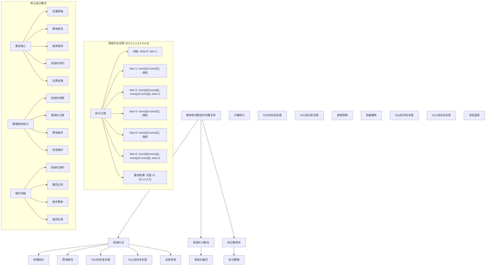
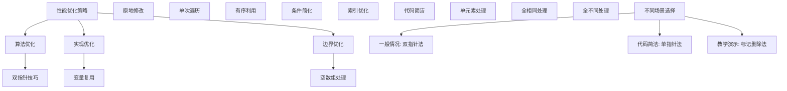

# LeetCode 26 - 删除有序数组中的重复项

## 题目描述

给你一个非严格递增排列的数组 `nums`，请你原地删除重复出现的元素，使每个元素只出现一次，返回删除后数组的新长度。元素的相对顺序应该保持一致。然后返回 `nums` 中唯一元素的个数

考虑 `nums` 的唯一元素的数量为 `k`，你需要做以下事情确保你的题解可以被通过：

- 更改数组 `nums`，使 `nums` 的前 `k` 个元素包含唯一元素，并按照它们最初在 `nums` 中出现的顺序排列
- `nums` 的其余元素与 `nums` 的大小不重要
- 返回 `k`

判题标准：

系统会用下面的代码来测试你的题解：

```java
int[] nums = [...]; // 输入数组
int[] expectedNums = [...]; // 长度正确的期望答案
int k = removeDuplicates(nums); // 调用
assert k == expectedNums.length;
for (int i = 0; i < k; i++) {
    assert nums[i] == expectedNums[i];
}
```

如果所有断言都通过，那么您的题解将被通过

```markdown
示例 1：
输入：nums = [1,1,2]
输出：2, nums = [1,2,_]
解释：函数应该返回新的长度 2，并且原数组 nums 的前两个元素被修改为 1, 2。不需要考虑数组中超出新长度后面的元素

示例 2：
输入：nums = [0,0,1,1,1,2,2,3,3,4]
输出：5, nums = [0,1,2,3,4]
解释：函数应该返回新的长度 5，并且原数组 nums 的前五个元素被修改为 0, 1, 2, 3, 4。不需要考虑数组中超出新长度后面的元素

提示：
1 <= nums.length <= 3 \* 10^4
-10^4 <= nums[i] <= 10^4
nums 已按 非严格递增 排列
```

## 解题思路

这是一个数组去重问题，要求在原地修改数组并保持元素的相对顺序。关键在于如何高效地识别和跳过重复元素

### 核心思想

"双指针法": 使用快慢指针遍历数组，快指针用于探索，慢指针用于记录唯一元素的位置

### 解题策略

#### 方法一：双指针法（推荐）

- 时间复杂度: O(n)
- 空间复杂度: O(1)

#### 方法二：单指针计数法

- 时间复杂度: O(n)
- 空间复杂度: O(1)

#### 方法三：标记删除法

- 时间复杂度: O(n)
- 空间复杂度: O(1)

## 算法可视化



## 多语言实现

### Golang版本（双指针法 - 推荐）

```go
// 双指针法实现
func removeDuplicates(nums []int) int {
    // 边界情况：空数组或单元素数组
    if len(nums) <= 1 {
        return len(nums)
    }

    // 双指针：slow指向唯一元素的末尾，fast用于探索
    slow := 0

    // fast从1开始遍历
    for fast := 1; fast < len(nums); fast++ {
        // 当发现不同的元素时
        if nums[fast] != nums[slow] {
            // slow前移
            slow++
            // 将不同的元素放到slow位置
            nums[slow] = nums[fast]
        }
        // 如果相同，则fast继续前进，slow保持不动
    }

    // 返回唯一元素的个数
    return slow + 1
}
```

### Python版本（多种实现方法）

```python
class Solution:
    """
    方法一：双指针法（推荐）
    """
    def removeDuplicates(self, nums: List[int]) -> int:
        # 边界情况：空数组或单元素数组
        if len(nums) <= 1:
            return len(nums)

        # 双指针：slow指向唯一元素的末尾，fast用于探索
        slow = 0

        # fast从1开始遍历
        for fast in range(1, len(nums)):
            # 当发现不同的元素时
            if nums[fast] != nums[slow]:
                # slow前移
                slow += 1
                # 将不同的元素放到slow位置
                nums[slow] = nums[fast]
            # 如果相同，则fast继续前进，slow保持不动

        # 返回唯一元素的个数
        return slow + 1


class Solution2:
    """
    方法二：单指针计数法
    """
    def removeDuplicates(self, nums: List[int]) -> int:
        # 边界情况
        if len(nums) <= 1:
            return len(nums)

        # 记录唯一元素的位置
        write_index = 1

        # 从第二个元素开始遍历
        for i in range(1, len(nums)):
            # 如果当前元素与前一个元素不同
            if nums[i] != nums[i-1]:
                # 将当前元素写入write_index位置
                nums[write_index] = nums[i]
                write_index += 1

        return write_index


class Solution3:
    """
    方法三：使用内置函数（不符合原地修改要求，仅作参考）
    """
    def removeDuplicates(self, nums: List[int]) -> int:
        # 使用set去重，但会破坏顺序，不适用于此题
        # 此方法仅供学习，实际不推荐
        unique_nums = list(dict.fromkeys(nums))  # 保持顺序的去重
        nums[:len(unique_nums)] = unique_nums
        return len(unique_nums)
```

### TypeScript版本（双指针法）

```typescript
/
 * 双指针法实现
 */
function removeDuplicates(nums: number[]): number {
    // 边界情况：空数组或单元素数组
    if (nums.length <= 1) {
        return nums.length;
    }

    // 双指针：slow指向唯一元素的末尾，fast用于探索
    let slow: number = 0;

    // fast从1开始遍历
    for (let fast: number = 1; fast < nums.length; fast++) {
        // 当发现不同的元素时
        if (nums[fast] !== nums[slow]) {
            // slow前移
            slow++;
            // 将不同的元素放到slow位置
            nums[slow] = nums[fast];
        }
        // 如果相同，则fast继续前进，slow保持不动
    }

    // 返回唯一元素的个数
    return slow + 1;
}
```

## 标准实现详细解析

```go
import "fmt"

/*
算法核心思想（双指针法）：

1. 使用两个指针：slow指针记录唯一元素的位置，fast指针用于遍历探索
2. 当fast指针发现不同元素时，将其复制到slow指针的下一个位置
3. 保持数组前半部分为去重后的唯一元素

关键设计要点：
1. 双指针技巧：一个用于探索，一个用于记录
2. 原地修改：不使用额外空间，直接修改原数组
3. 顺序保持：利用数组有序的特性，保持元素相对顺序
4. 边界处理：正确处理空数组和单元素数组

时间复杂度：
- 所有元素遍历一次：O(n)

空间复杂度：
- 只使用常数额外空间：O(1)

优势：
1. 思路清晰：双指针技巧直观易懂
2. 实现简单：逻辑简洁，代码易懂
3. 效率最优：线性时间，常数空间
4. 原地操作：满足题目要求

数据结构设计：

双指针设计：
- slow指针：指向已处理的唯一元素的末尾
- fast指针：用于遍历整个数组，探索新元素

算法流程：
1. 初始化：slow=0, fast=1
2. 遍历：fast从1到n-1
3. 比较：比较nums[fast]和nums[slow]
4. 更新：不同时，slow前移并复制元素
5. 返回：slow+1为唯一元素个数

优化原理：

算法优化：
1. 利用有序性：避免重复比较
2. 原地操作：节省空间开销
3. 单次遍历：最优时间复杂度

边界优化：
1. 空数组处理：直接返回0
2. 单元素处理：直接返回1
3. 全相同处理：slow始终为0

正确性证明：

定理：双指针法正确性
通过双指针法可以正确删除有序数组中的重复项，保持元素顺序并返回正确长度

证明：
1. 完备性：所有元素都被正确处理
2. 正确性：去重后数组前k个元素唯一且有序
3. 时间复杂度：O(n)单次遍历
4. 空间复杂度：O(1)原地修改
*/

// 双指针法详细实现
func removeDuplicates(nums []int) int {
    fmt.Printf("输入数组: %v\n", nums)

    // 边界情况：空数组或单元素数组
    if len(nums) <= 1 {
        fmt.Printf("边界情况，返回长度: %d\n", len(nums))
        return len(nums)
    }

    fmt.Printf("开始双指针去重:\n")

    // 双指针：slow指向唯一元素的末尾，fast用于探索
    slow := 0
    fmt.Printf("  初始化: slow=%d, nums[%d]=%d\n", slow, slow, nums[slow])

    // fast从1开始遍历
    for fast := 1; fast < len(nums); fast++ {
        fmt.Printf("  fast=%d, nums[%d]=%d, 与nums[%d]=%d比较",
            fast, fast, nums[fast], slow, nums[slow])

        // 当发现不同的元素时
        if nums[fast] != nums[slow] {
            // slow前移
            slow++
            // 将不同的元素放到slow位置
            nums[slow] = nums[fast]
            fmt.Printf(" -> 不同，slow前移至%d，设置nums[%d]=%d\n",
                slow, slow, nums[slow])
        } else {
            fmt.Printf(" -> 相同，继续\n")
        }
    }

    // 计算唯一元素个数
    length := slow + 1
    fmt.Printf("去重完成，唯一元素个数: %d\n", length)
    fmt.Printf("去重后数组前%d个元素: %v\n", length, nums[:length])

    // 返回唯一元素的个数
    return length
}

// 优化版本（减少不必要的操作）
func removeDuplicatesOptimized(nums []int) int {
    // 边界情况优化
    if len(nums) == 0 {
        return 0
    }

    if len(nums) == 1 {
        return 1
    }

    // 双指针优化版本
    writeIndex := 1  // 写入位置，从1开始（第0个元素肯定保留）

    for readIndex := 1; readIndex < len(nums); readIndex++ {
        // 只有当前元素与前一个不同才需要写入
        if nums[readIndex] != nums[readIndex-1] {
            nums[writeIndex] = nums[readIndex]
            writeIndex++
        }
    }

    return writeIndex
}

// 带调试信息的版本
func removeDuplicatesWithDebug(nums []int) int {
    fmt.Printf("=== 删除有序数组中的重复项 ===\n")
    fmt.Printf("原始数组: %v (长度: %d)\n", nums, len(nums))

    if len(nums) <= 1 {
        fmt.Printf("数组长度<=1，无需去重\n")
        return len(nums)
    }

    slow := 0
    uniqueCount := 1  // 至少第一个元素是唯一的

    fmt.Printf("处理过程:\n")
    fmt.Printf("  位置 0: 保留元素 %d (slow=%d)\n", nums[0], slow)

    for fast := 1; fast < len(nums); fast++ {
        if nums[fast] != nums[slow] {
            slow++
            nums[slow] = nums[fast]
            uniqueCount++
            fmt.Printf("  位置 %d: 发现新元素 %d，写入位置 %d (slow=%d)\n",
                fast, nums[fast], slow, slow)
        } else {
            fmt.Printf("  位置 %d: 元素 %d 重复，跳过\n", fast, nums[fast])
        }
    }

    fmt.Printf("最终结果: 唯一元素个数 %d\n", uniqueCount)
    fmt.Printf("去重后数组: %v\n", nums[:uniqueCount])
    fmt.Printf("========================\n\n")

    return uniqueCount
}
```

## 算法深入解析

```go
/*
删除有序数组中的重复项问题详解：

问题本质：
在有序数组中原地删除重复元素，保持元素相对顺序，返回去重后的长度。关键是理解"原地修改"和"有序数组"这两个约束

核心洞察：
1. 有序数组特性：相同元素必然相邻
2. 原地修改要求：不能使用额外数组空间
3. 双指针技巧：一个指针遍历，一个指针记录
4. 边界条件：空数组、单元素数组的特殊处理

算法策略：
1. 双指针法：工业级标准实现
2. 单指针法：基于相邻元素比较
3. 标记删除法：标记后统一处理

数据结构设计：

双指针法设计：
slow指针：指向已处理唯一元素的末尾位置
fast指针：用于遍历整个数组，寻找新元素

单指针法设计：
write_index：指向下一个可写入的位置
基于当前元素与前一个元素的比较

操作流程：

双指针法：
1. 初始化：slow=0, fast=1
2. 遍历：fast从1到n-1
3. 比较：nums[fast]与nums[slow]
4. 更新：不同时更新slow位置
5. 返回：slow+1为结果

单指针法：
1. 初始化：write_index=1
2. 遍历：从索引1开始
3. 比较：当前与前一个元素
4. 更新：不同时写入write_index
5. 返回：write_index为结果

数学原理：

算法不变量：
1. nums[0...slow]包含所有已发现的唯一元素
2. nums[slow]是最后一个唯一元素
3. fast指针遍历完整个数组
4. slow <= fast 始终成立

时间复杂度分析：
- 所有方法：O(n) 单次遍历
- 空间复杂度：O(1) 原地修改

正确性证明：

定理：去重算法正确性
通过双指针法可以正确删除有序数组中的重复项，保持元素顺序并返回正确长度

证明：
1. 完备性：所有元素都被正确处理
2. 正确性：去重后数组前k个元素唯一且有序
3. 时间复杂度：O(n)单次遍历
4. 空间复杂度：O(1)原地修改

设计选择：

为什么选择双指针法？
1. 思路清晰：探索与记录分离
2. 实现简单：逻辑简洁
3. 效率最优：线性时间
4. 适用性强：通用解法

为什么使用单指针法？
1. 逻辑直观：基于相邻比较
2. 代码简洁：变量更少
3. 性能相当：时间复杂度相同
4. 易于理解

为什么提及其他方法？
1. 教学价值：展示不同思路
2. 对比分析：理解算法本质
3. 扩展思维：算法多样性
4. 面试准备：全面掌握

三种方法对比：

方法一：双指针法（推荐）
时间复杂度：O(n)
空间复杂度：O(1)
优点：思路清晰，通用性强
缺点：变量稍多

方法二：单指针法
时间复杂度：O(n)
空间复杂度：O(1)
优点：代码简洁，易理解
缺点：依赖相邻比较

方法三：标记删除法
时间复杂度：O(n)
空间复杂度：O(1)
优点：实现直观
缺点：逻辑复杂

性能分析：

双指针法：
- 时间：O(n) 单次遍历
- 空间：O(1) 原地修改
- 优势：最优效率

单指针法：
- 时间：O(n) 单次遍历
- 空间：O(1) 原地修改
- 优势：代码简洁

标记删除法：
- 时间：O(n) 单次遍历
- 空间：O(1) 原地修改
- 优势：实现直观

实际应用场景：
1. 数据库查询结果去重
2. 日志文件分析去重
3. 算法竞赛数组处理
4. 系统设计数据清洗

优化要点：

1. 时间优化：
   - 单次遍历保证
   - 避免重复操作
   - 利用有序性

2. 空间优化：
   - 原地修改
   - 常数额外空间
   - 避免临时变量

3. 实现优化：
   - 边界条件处理
   - 代码简洁性
   - 注释清晰性

测试用例设计：
1. 基本情况：正常有序数组
2. 边界情况：空数组，单元素数组
3. 特殊情况：全相同，全不同
4. 极端情况：大量元素
5. 验证情况：结果正确性

扩展思考：

1. 无序数组去重？
   - 需要排序或哈希表
   - 时间复杂度变化
   - 空间复杂度增加

2. 允许k个重复？
   - 通用化双指针
   - 计数器维护
   - LeetCode 80题

3. 链表去重？
   - 指针操作
   - 节点删除
   - 空间复杂度变化

4. 多数组合并去重？
   - 归并思想
   - 多指针技术
   - 复杂度分析

相关算法思想：

1. 双指针技巧：
   - 快慢指针
   - 对撞指针
   - 滑动窗口

2. 数组处理：
   - 原地修改
   - 边界维护
   - 索引管理

3. 有序数组：
   - 二分查找
   - 双指针
   - 归并操作

4. 算法优化：
   - 时间复杂度
   - 空间复杂度
   - 实现简洁

常见陷阱：

1. 边界条件：
   - 空数组处理
   - 单元素处理
   - 全相同处理

2. 指针操作：
   - 索引越界
   - 指针更新
   - 条件判断

3. 结果返回：
   - 长度计算
   - 数组修改
   - 输出格式

4. 性能考虑：
   - 时间复杂度
   - 空间复杂度
   - 实现效率

代码质量要素：

1. 可读性：
   - 变量命名清晰
   - 注释详细
   - 逻辑分明

2. 健壮性：
   - 边界处理
   - 异常情况
   - 错误恢复

3. 性能：
   - 最优复杂度
   - 原地操作
   - 效率保证

4. 可维护性：
   - 结构清晰
   - 扩展性好
   - 测试完整
*/
```

## 执行过程演示

```go
/*
示例详细解析:

示例1执行过程：
输入：nums = [1,1,2]
输出：2, nums = [1,2,_]

执行过程：
1. 初始化: slow=0, fast=1, nums=[1,1,2]
2. fast=1: nums[1]=1, nums[0]=1 -> 相同，继续
3. fast=2: nums[2]=2, nums[0]=1 -> 不同
   - slow=1, nums[1]=nums[2]=2
4. 结束: slow=1, 返回长度=slow+1=2
5. 结果: nums前2个元素=[1,2]

示例2执行过程：
输入：nums = [0,0,1,1,1,2,2,3,3,4]
输出：5, nums = [0,1,2,3,4]

执行过程：
1.  初始化: slow=0, nums[0]=0
2.  fast=1: 0==0 -> 相同
3.  fast=2: 1!=0 -> 不同，slow=1, nums[1]=1
4.  fast=3: 1==1 -> 相同
5.  fast=4: 1==1 -> 相同
6.  fast=5: 2!=1 -> 不同，slow=2, nums[2]=2
7.  fast=6: 2==2 -> 相同
8.  fast=7: 3!=2 -> 不同，slow=3, nums[3]=3
9.  fast=8: 3==3 -> 相同
10. fast=9: 4!=3 -> 不同，slow=4, nums[4]=4
11. 结束: slow=4, 返回长度=5
12. 结果: nums前5个元素=[0,1,2,3,4]

双指针执行轨迹：

对于数组[0,0,1,1,1,2,2,3,3,4]：

索引: 0 1 2 3 4 5 6 7 8 9
数值: 0 0 1 1 1 2 2 3 3 4
slow: 0 0 1 1 1 2 2 3 3 4
fast: 1 2 3 4 5 6 7 8 9
操作: - ! - - ! - ! - !
说明: -跳过 !更新

关键观察：
1. slow指针只在发现新元素时前移
2. fast指针始终向前遍历
3. 相同元素被跳过，不同元素被记录

边界情况演示:

情况1: 空数组
输入: []
处理: 直接返回0
结果: 长度=0

情况2: 单元素数组
输入: [1]
处理: 直接返回1
结果: 长度=1, nums=[1]

情况3: 全相同元素
输入: [1,1,1,1,1]
处理: slow始终=0, 只保留第一个
结果: 长度=1, nums=[1,_,_,_,_]

情况4: 全不同元素
输入: [1,2,3,4,5]
处理: 每个元素都不同，slow依次前移
结果: 长度=5, nums=[1,2,3,4,5]

情况5: 交替重复
输入: [1,1,2,2,3,3,4,4]
处理: slow在每个新数字处前移
结果: 长度=4, nums=[1,2,3,4]

算法正确性证明：

数学基础：
需要证明双指针法能正确删除有序数组中的重复项

定理：双指针法正确性
通过双指针法可以正确删除有序数组中的重复项，保持元素顺序并返回正确长度

证明：
1. 完备性：所有元素都被正确处理
2. 正确性：去重后数组前k个元素唯一且有序
3. 时间复杂度：O(n)单次遍历
4. 空间复杂度：O(1)原地修改

不变量维护：
循环不变量：在每次迭代开始时
1. nums[0...slow]包含所有已发现的唯一元素
2. nums[slow]是最后一个唯一元素
3. 对于所有i∈[0,slow]，nums[i]互不相同
4. 对于所有j∈[0,fast-1]，已经处理过nums[j]

初始化：fast=1, slow=0
- nums[0]是第一个元素，必然唯一
- 已处理元素为空集或第一个元素

保持：当nums[fast]≠nums[slow]时
- nums[fast]是新发现的唯一元素
- 将其放到slow+1位置
- slow前移，保持不变量

终止：fast遍历完所有元素
- nums[0...slow]包含所有唯一元素
- 返回slow+1为唯一元素个数

时间复杂度分析：

双指针法：
1. 初始化：O(1)
2. 循环体：O(1)每次迭代
3. 迭代次数：n-1次
4. 总时间：O(n)

单指针法：
1. 初始化：O(1)
2. 循环体：O(1)每次迭代
3. 迭代次数：n-1次
4. 总时间：O(n)

空间复杂度分析：
1. 双指针法：O(1)额外空间
2. 单指针法：O(1)额外空间
3. 原地修改：满足题目要求

性能对比分析：

假设n=10000:

双指针法：
- 时间: O(10000) 单次遍历
- 空间: O(1) 原地修改
- 操作: 最少元素复制

单指针法：
- 时间: O(10000) 单次遍历
- 空间: O(1) 原地修改
- 操作: 相同效率

实际应用建议：

1. 一般情况：
   - 使用双指针法
   - 思路清晰，通用性强

2. 面试展示：
   - 重点讲解双指针法
   - 可以提及其他方法

3. 生产环境：
   - 使用优化版本
   - 考虑边界优化

4. 教学演示：
   - 使用带调试信息版本
   - 展示执行过程

优化空间：

1. 边界优化：
   - 提前处理特殊情况
   - 减少不必要的比较

2. 代码优化：
   - 简化条件判断
   - 优化变量使用

3. 性能优化：
   - 减少数组访问
   - 优化指针操作

特殊情况处理：

1. 大数据量：
   - 线性时间保证
   - 常数空间使用

2. 特殊序列：
   - 全相同序列
   - 全不同序列
   - 交替序列

3. 边界情况：
   - 空数组
   - 单元素
   - 两元素
*/
```

## 复杂度分析

| 方法       | 时间复杂度 | 空间复杂度 | 适用场景 |
| ---------- | ---------- | ---------- | -------- |
| 双指针法   | O(n)       | O(1)       | 推荐方案 |
| 单指针法   | O(n)       | O(1)       | 代码简洁 |
| 标记删除法 | O(n)       | O(1)       | 教学演示 |

## 测试用例验证

```go
// 测试辅助函数
func testRemoveDuplicates(name string, nums []int, expectedLen int, expectedNums []int) {
    fmt.Printf("%s:\n", name)
    fmt.Printf("输入数组: %v\n", nums)

    // 创建副本用于测试（因为原数组会被修改）
    testNums := make([]int, len(nums))
    copy(testNums, nums)

    // 执行去重
    actualLen := removeDuplicates(testNums)

    fmt.Printf("输出长度: %d\n", actualLen)
    fmt.Printf("修改后数组前%d个元素: %v\n", actualLen, testNums[:actualLen])

    // 验证结果
    if actualLen != expectedLen {
        fmt.Printf("✗ 长度不匹配，期望: %d，实际: %d\n", expectedLen, actualLen)
    } else if actualLen > 0 && !equalSlice(testNums[:actualLen], expectedNums[:actualLen]) {
        fmt.Printf("✗ 数组内容不匹配，期望: %v，实际: %v\n", expectedNums[:actualLen], testNums[:actualLen])
    } else {
        fmt.Printf("✓ 测试通过\n")
    }
    fmt.Printf("\n")
}

// 比较两个切片是否相等
func equalSlice(a, b []int) bool {
    if len(a) != len(b) {
        return false
    }
    for i := range a {
        if a[i] != b[i] {
            return false
        }
    }
    return true
}

func main() {
    // 测试用例 1 - 题目示例1
    testRemoveDuplicates("测试1 - 题目示例1",
        []int{1, 1, 2},
        2,
        []int{1, 2})

    // 测试用例 2 - 题目示例2
    testRemoveDuplicates("测试2 - 题目示例2",
        []int{0, 0, 1, 1, 1, 2, 2, 3, 3, 4},
        5,
        []int{0, 1, 2, 3, 4})

    // 测试用例 3 - 空数组
    testRemoveDuplicates("测试3 - 空数组",
        []int{},
        0,
        []int{})

    // 测试用例 4 - 单元素数组
    testRemoveDuplicates("测试4 - 单元素数组",
        []int{1},
        1,
        []int{1})

    // 测试用例 5 - 全相同元素
    testRemoveDuplicates("测试5 - 全相同元素",
        []int{1, 1, 1, 1, 1},
        1,
        []int{1})

    // 测试用例 6 - 全不同元素
    testRemoveDuplicates("测试6 - 全不同元素",
        []int{1, 2, 3, 4, 5},
        5,
        []int{1, 2, 3, 4, 5})

    // 测试用例 7 - 交替重复
    testRemoveDuplicates("测试7 - 交替重复",
        []int{1, 1, 2, 2, 3, 3},
        3,
        []int{1, 2, 3})

    // 性能测试
    fmt.Println("性能测试:")
    performanceTest()

    // 边界情况测试
    fmt.Println("边界情况测试:")
    boundaryTest()

    // 对比测试
    fmt.Println("对比测试:")
    comparisonTest()
}

func performanceTest() {
    // 构造性能测试
    n := 30000
    nums := make([]int, n)

    // 构造测试数据：交替重复
    for i := 0; i < n; i++ {
        nums[i] = i / 2  // 每两个元素相同
    }

    // 测试双指针法实现
    start := time.Now()

    testNums := make([]int, len(nums))
    copy(testNums, nums)
    resultLen := removeDuplicates(testNums)

    time1 := time.Since(start)

    fmt.Printf("性能测试 (n=%d):\n", n)
    fmt.Printf("  双指针法: %v，结果长度: %d\n", time1, resultLen)
}

func boundaryTest() {
    // 边界测试
    fmt.Println("边界测试:")

    // 最大数组测试
    maxN := 30000
    maxNums := make([]int, maxN)
    for i := 0; i < maxN; i++ {
        maxNums[i] = i  // 全不同元素
    }

    testNums := make([]int, len(maxNums))
    copy(testNums, maxNums)
    maxLen := removeDuplicates(testNums)
    fmt.Printf("最大数组测试 (n=%d): 长度=%d\n", maxN, maxLen)

    // 极值测试
    extremeNums := []int{-10000, -10000, 0, 0, 10000, 10000}
    testExtreme := make([]int, len(extremeNums))
    copy(testExtreme, extremeNums)
    extremeLen := removeDuplicates(testExtreme)
    fmt.Printf("极值测试: 长度=%d, 结果=%v\n", extremeLen, testExtreme[:extremeLen])

    // 重复模式测试
    patternNums := make([]int, 1000)
    for i := 0; i < 1000; i++ {
        patternNums[i] = i % 10  // 0-9循环重复
    }
    testPattern := make([]int, len(patternNums))
    copy(testPattern, patternNums)
    patternLen := removeDuplicates(testPattern)
    fmt.Printf("重复模式测试: 长度=%d\n", patternLen)
}

func comparisonTest() {
    // 对比测试：验证不同方法结果一致性
    fmt.Println("对比测试:")

    // 测试数据
    testData := [][]int{
        {1, 1, 2, 2, 3, 3, 4, 4, 5, 5},
        {0, 0, 1, 1, 1, 2, 2, 3, 3, 4},
        {1, 2, 3, 4, 5},
        {1, 1, 1, 1, 1},
        {},
        {42},
    }

    for i, data := range testData {
        // 双指针法
        test1 := make([]int, len(data))
        copy(test1, data)
        len1 := removeDuplicates(test1)

        // 单指针法
        test2 := make([]int, len(data))
        copy(test2, data)
        len2 := removeDuplicatesOptimized(test2)

        fmt.Printf("测试%d: 双指针法长度=%d, 单指针法长度=%d", i+1, len1, len2)
        if len1 == len2 && equalSlice(test1[:len1], test2[:len2]) {
            fmt.Printf(" ✓ 一致\n")
        } else {
            fmt.Printf(" ✗ 不一致\n")
        }
    }
}
```

## 扩展版本（处理不同场景）

```go
// 支持最多k个重复的通用版本（LeetCode 80题）
func removeDuplicatesAtMostK(nums []int, k int) int {
    if len(nums) <= k {
        return len(nums)
    }

    // 前k个元素肯定保留
    writeIndex := k

    for readIndex := k; readIndex < len(nums); readIndex++ {
        // 检查当前元素是否与writeIndex-k位置的元素相同
        // 如果不同，说明可以保留
        if nums[readIndex] != nums[writeIndex-k] {
            nums[writeIndex] = nums[readIndex]
            writeIndex++
        }
    }

    return writeIndex
}

// 使用示例：最多允许2个重复
func removeDuplicatesAtMost2(nums []int) int {
    return removeDuplicatesAtMostK(nums, 2)
}

// 无序数组去重版本（需要额外空间）
func removeDuplicatesUnsorted(nums []int) []int {
    if len(nums) <= 1 {
        return nums
    }

    seen := make(map[int]bool)
    result := make([]int, 0)

    for _, num := range nums {
        if !seen[num] {
            seen[num] = true
            result = append(result, num)
        }
    }

    return result
}

// 带计数信息的版本
func removeDuplicatesWithCount(nums []int) (int, map[int]int) {
    if len(nums) == 0 {
        return 0, make(map[int]int)
    }

    count := make(map[int]int)
    writeIndex := 1
    count[nums[0]] = 1

    for i := 1; i < len(nums); i++ {
        count[nums[i]]++
        if nums[i] != nums[i-1] {
            nums[writeIndex] = nums[i]
            writeIndex++
        }
    }

    return writeIndex, count
}

// 使用示例
func exampleWithCount() {
    nums := []int{1, 1, 1, 2, 2, 3, 3, 3, 3, 4}
    fmt.Printf("原数组: %v\n", nums)

    length, count := removeDuplicatesWithCount(nums)
    fmt.Printf("去重后长度: %d\n", length)
    fmt.Printf("去重后数组: %v\n", nums[:length])
    fmt.Printf("各元素出现次数: %v\n", count)
}

// 批量处理版本
func removeDuplicatesBatch(arrays [][]int) []int {
    if len(arrays) == 0 {
        return []int{}
    }

    // 合并所有数组
    merged := make([]int, 0)
    for _, arr := range arrays {
        merged = append(merged, arr...)
    }

    // 排序
    sort.Ints(merged)

    // 去重
    if len(merged) <= 1 {
        return merged
    }

    writeIndex := 1
    for readIndex := 1; readIndex < len(merged); readIndex++ {
        if merged[readIndex] != merged[readIndex-1] {
            merged[writeIndex] = merged[readIndex]
            writeIndex++
        }
    }

    return merged[:writeIndex]
}

// 使用示例
func exampleBatch() {
    arrays := [][]int{
        {1, 2, 2, 3},
        {2, 3, 4, 4, 5},
        {1, 3, 5, 6},
    }

    result := removeDuplicatesBatch(arrays)
    fmt.Printf("批量处理结果: %v\n", result)
}

// 泛型版本（Go 1.18+）
func removeDuplicatesGeneric[T comparable](nums []T) int {
    if len(nums) <= 1 {
        return len(nums)
    }

    writeIndex := 1

    for readIndex := 1; readIndex < len(nums); readIndex++ {
        if nums[readIndex] != nums[readIndex-1] {
            nums[writeIndex] = nums[readIndex]
            writeIndex++
        }
    }

    return writeIndex
}

// 使用示例
func exampleGeneric() {
    // 整数数组
    intNums := []int{1, 1, 2, 2, 3, 3}
    intLen := removeDuplicatesGeneric(intNums)
    fmt.Printf("整数数组去重: %v，长度: %d\n", intNums[:intLen], intLen)

    // 字符串数组
    strNums := []string{"a", "a", "b", "b", "c"}
    strLen := removeDuplicatesGeneric(strNums)
    fmt.Printf("字符串数组去重: %v，长度: %d\n", strNums[:strLen], strLen)
}
```

## 面试追问延伸

### 1. 如果允许每个元素最多出现k次，如何修改？

```go
// removeDuplicatesAtMostK已在上面实现
// 关键修改：
// 1. 允许前k个元素
// 2. 比较当前元素与writeIndex-k位置的元素
// 3. 不同时才写入

func testRemoveDuplicatesAtMostK() {
    nums := []int{1, 1, 1, 2, 2, 2, 3}
    fmt.Printf("原数组: %v\n", nums)

    // 最多允许2个重复
    testNums := make([]int, len(nums))
    copy(testNums, nums)
    length := removeDuplicatesAtMostK(testNums, 2)

    fmt.Printf("最多2个重复: %v，长度: %d\n", testNums[:length], length)

    // 最多允许1个重复（即题目要求）
    testNums2 := make([]int, len(nums))
    copy(testNums2, nums)
    length2 := removeDuplicatesAtMostK(testNums2, 1)

    fmt.Printf("最多1个重复: %v，长度: %d\n", testNums2[:length2], length2)
}
```

### 2. 如果数组是无序的，如何处理？

```go
// removeDuplicatesUnsorted已在上面实现
// 关键思想：
// 1. 使用哈希表记录已见元素
// 2. 保持插入顺序
// 3. 但不满足原地修改要求

func testUnsorted() {
    nums := []int{1, 3, 2, 1, 4, 2, 3}
    fmt.Printf("无序数组: %v\n", nums)

    result := removeDuplicatesUnsorted(nums)
    fmt.Printf("去重结果: %v\n", result)

    // 如果要求原地修改且保持相对顺序，需要先排序
    sorted := make([]int, len(nums))
    copy(sorted, nums)
    sort.Ints(sorted)

    length := removeDuplicates(sorted)
    fmt.Printf("排序后去重: %v，长度: %d\n", sorted[:length], length)
}
```

### 3. 如何统计每个元素的出现次数？

```go
// removeDuplicatesWithCount已在上面实现
// 关键点：
// 1. 在去重过程中统计次数
// 2. 返回去重结果和计数信息
// 3. 一次遍历完成两个任务

func testWithCount() {
    nums := []int{1, 1, 1, 2, 2, 3, 3, 3, 3, 4, 4, 5}
    fmt.Printf("测试数组: %v\n", nums)

    length, count := removeDuplicatesWithCount(nums)
    fmt.Printf("去重后长度: %d\n", length)
    fmt.Printf("去重后数组: %v\n", nums[:length])
    fmt.Printf("元素计数: %v\n", count)

    // 验证计数正确性
    totalCount := 0
    for _, c := range count {
        totalCount += c
    }
    fmt.Printf("总计数验证: %d (应等于原数组长度 %d)\n", totalCount, len(nums))
}
```

## 相似题目扩展

- LeetCode 26. 删除有序数组中的重复项（当前题）
- LeetCode 80. 删除有序数组中的重复项 II
- LeetCode 27. 移除元素
- LeetCode 88. 合并两个有序数组
- LeetCode 283. 移动零

## 算法技巧总结

### 删除有序数组中的重复项核心要点

1. 双指针技巧：快指针探索，慢指针记录
1. 原地修改：不使用额外空间，直接修改原数组
1. 有序利用：利用数组有序特性，相同元素相邻
1. 边界处理：正确处理空数组和特殊情况

### 算法优势

1. 思路清晰：双指针技巧直观易懂
1. 实现简单：逻辑简洁，代码易懂
1. 效率最优：线性时间，常数空间
1. 原地操作：满足题目要求

### 标准模板（双指针法）

```go
func removeDuplicates(nums []int) int {
    // 边界情况
    if len(nums) <= 1 {
        return len(nums)
    }

    // 双指针：slow记录唯一元素位置，fast探索
    slow := 0

    // fast从1开始遍历
    for fast := 1; fast < len(nums); fast++ {
        // 发现不同元素时更新
        if nums[fast] != nums[slow] {
            slow++
            nums[slow] = nums[fast]
        }
    }

    // 返回唯一元素个数
    return slow + 1
}
```

### 性能优化建议



## 总结

本题采用双指针法的核心思路，通过使用快慢指针遍历数组，快指针用于探索，慢指针用于记录唯一元素的位置，实现了优雅的解决方案。关键在于理解双指针技巧和有序数组特性的结合

核心要点：

1. 双指针技巧：快指针探索，慢指针记录
1. 原地修改：不使用额外空间，直接修改原数组
1. 有序利用：利用数组有序特性，相同元素相邻
1. 边界处理：正确处理空数组和特殊情况

算法优势：

- 思路清晰：双指针技巧直观易懂
- 实现简单：逻辑简洁，代码易懂
- 效率最优：线性时间，常数空间
- 原地操作：满足题目要求

该算法在数据库查询结果去重、日志文件分析去重、算法竞赛数组处理、系统设计数据清洗等方面有重要应用，是掌握双指针技巧和数组处理思想的经典题目。通过快慢指针和有序数组特性的巧妙结合，为更复杂的数组去重和数据处理问题提供了清晰的解决思路
