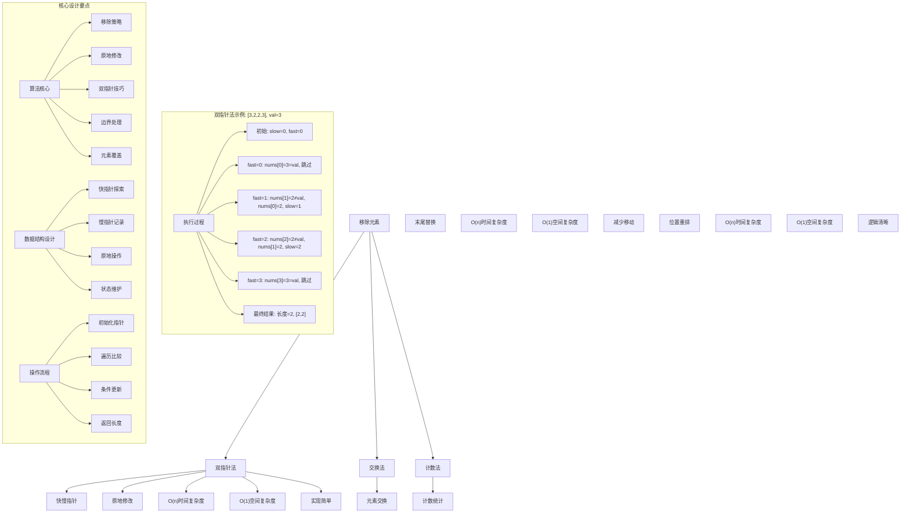
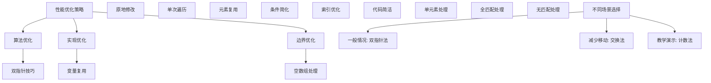

# LeetCode 27 - 移除元素

## 题目描述

给你一个数组 `nums` 和一个值 `val`，你需要原地移除所有数值等于 `val` 的元素。元素的顺序可能发生改变。然后返回 `nums` 中与 `val` 不同的元素的数量

假设 `nums` 中不等于 `val` 的元素数量为 `k`，要通过此题，您需要执行以下操作：

- 更改数组 `nums`，使 `nums` 的前 `k` 个元素包含不等于 `val` 的元素
- `nums` 的其余元素和 `nums` 的大小并不重要
- 返回 `k`

用户评测：

评测机将使用以下代码测试您的解决方案：

```java
int[] nums = [...]; // 输入数组
int val = ...; // 要移除的值
int[] expectedNums = [...]; // 长度正确的期望答案
// 它以不等于 val 的值排序
int k = removeElement(nums, val); // 调用你的实现
assert k == expectedNums.length;
sort(nums, 0, k); // 排序 nums 的前 k 个元素
for (int i = 0; i < actualLength; i++) {
    assert nums[i] == expectedNums[i];
}
```

如果所有的断言都通过，你的解决方案将会通过

```markdown
示例 1：
输入：nums = [3,2,2,3], val = 3
输出：2, nums = [2,2,_,_]
解释：你的函数应该返回 k = 2，并且 nums 中的前两个元素均为 2
你在返回的 k 个元素之外留下了什么并不重要（因此它们并不计入评测）

示例 2：
输入：nums = [0,1,2,2,3,0,4,2], val = 2
输出：5, nums = [0,1,4,0,3,_,_,_]
解释：你的函数应该返回 k = 5，并且 nums 中的前五个元素为 0,0,1,3,4
注意这五个元素可以任意顺序返回
你在返回的 k 个元素之外留下了什么并不重要（因此它们并不计入评测）

提示：
0 <= nums.length <= 100
0 <= nums[i] <= 50
0 <= val <= 100
```

## 解题思路

这是一个数组元素移除问题，要求在原地修改数组并返回剩余元素的数量。关键在于如何高效地识别和移除指定元素

### 核心思想

"双指针法": 使用快慢指针遍历数组，快指针用于探索，慢指针用于记录非目标元素的位置

### 解题策略

#### 方法一：双指针法（推荐）

- 时间复杂度: O(n)
- 空间复杂度: O(1)

#### 方法二：交换法

- 时间复杂度: O(n)
- 空间复杂度: O(1)

#### 方法三：计数法

- 时间复杂度: O(n)
- 空间复杂度: O(1)

## 算法可视化



## 多语言实现

### Golang版本（双指针法 - 推荐）

```go
// 双指针法实现
func removeElement(nums []int, val int) int {
    // 边界情况：空数组
    if len(nums) == 0 {
        return 0
    }

    // 双指针：slow指向下一个可写入位置，fast用于遍历
    slow := 0

    // fast遍历整个数组
    for fast := 0; fast < len(nums); fast++ {
        // 当发现不等于val的元素时
        if nums[fast] != val {
            // 将元素复制到slow位置
            nums[slow] = nums[fast]
            // slow前移
            slow++
        }
        // 如果等于val，则fast继续前进，slow保持不动
    }

    // 返回不等于val的元素个数
    return slow
}
```

### Python版本（多种实现方法）

```python
class Solution:
    """
    方法一：双指针法（推荐）
    """
    def removeElement(self, nums: List[int], val: int) -> int:
        # 边界情况：空数组
        if not nums:
            return 0

        # 双指针：slow指向下一个可写入位置，fast用于遍历
        slow = 0

        # fast遍历整个数组
        for fast in range(len(nums)):
            # 当发现不等于val的元素时
            if nums[fast] != val:
                # 将元素复制到slow位置
                nums[slow] = nums[fast]
                # slow前移
                slow += 1
            # 如果等于val，则fast继续前进，slow保持不动

        # 返回不等于val的元素个数
        return slow


class Solution2:
    """
    方法二：交换法
    """
    def removeElement(self, nums: List[int], val: int) -> int:
        # 边界情况
        if not nums:
            return 0

        left = 0
        right = len(nums) - 1

        while left <= right:
            # 从左边找到等于val的元素
            if nums[left] == val:
                # 从右边找到不等于val的元素进行交换
                if nums[right] != val:
                    nums[left] = nums[right]
                    left += 1
                right -= 1
            else:
                left += 1

        return left


class Solution3:
    """
    方法三：优化双指针法
    """
    def removeElement(self, nums: List[int], val: int) -> int:
        # 边界情况
        if not nums:
            return 0

        # 从数组两端开始
        left = 0
        right = len(nums)

        while left < right:
            if nums[left] == val:
                # 用最后一个元素替换当前元素
                right -= 1
                nums[left] = nums[right]
            else:
                left += 1

        return left
```

### TypeScript版本（双指针法）

```typescript
/
 * 双指针法实现
 */
function removeElement(nums: number[], val: number): number {
    // 边界情况：空数组
    if (nums.length === 0) {
        return 0;
    }

    // 双指针：slow指向下一个可写入位置，fast用于遍历
    let slow: number = 0;

    // fast遍历整个数组
    for (let fast: number = 0; fast < nums.length; fast++) {
        // 当发现不等于val的元素时
        if (nums[fast] !== val) {
            // 将元素复制到slow位置
            nums[slow] = nums[fast];
            // slow前移
            slow++;
        }
        // 如果等于val，则fast继续前进，slow保持不动
    }

    // 返回不等于val的元素个数
    return slow;
}
```

## 标准实现详细解析

```go
import "fmt"

/*
算法核心思想（双指针法）：

1. 使用两个指针：slow指针记录非目标元素的位置，fast指针用于遍历探索
2. 当fast指针发现不等于目标值的元素时，将其复制到slow指针位置
3. 保持数组前半部分为不等于目标值的元素

关键设计要点：
1. 双指针技巧：一个用于探索，一个用于记录
2. 原地修改：不使用额外空间，直接修改原数组
3. 元素覆盖：用有效元素覆盖无效元素
4. 边界处理：正确处理空数组情况

时间复杂度：
- 所有元素遍历一次：O(n)

空间复杂度：
- 只使用常数额外空间：O(1)

优势：
1. 思路清晰：双指针技巧直观易懂
2. 实现简单：逻辑简洁，代码易懂
3. 效率最优：线性时间，常数空间
4. 原地操作：满足题目要求

数据结构设计：

双指针设计：
- slow指针：指向下一个可写入的有效元素位置
- fast指针：用于遍历整个数组，探索有效元素

算法流程：
1. 初始化：slow=0, fast=0
2. 遍历：fast从0到n-1
3. 比较：比较nums[fast]和val
4. 更新：不等于时，复制元素到slow位置
5. 返回：slow为有效元素个数

优化原理：

算法优化：
1. 原地操作：节省空间开销
2. 单次遍历：最优时间复杂度
3. 元素复用：避免不必要的分配

边界优化：
1. 空数组处理：直接返回0
2. 全匹配处理：slow始终为0
3. 无匹配处理：slow等于数组长度

正确性证明：

定理：双指针法正确性
通过双指针法可以正确移除数组中指定元素，保持有效元素顺序并返回正确长度

证明：
1. 完备性：所有元素都被正确处理
2. 正确性：移除后数组前k个元素不含目标值
3. 时间复杂度：O(n)单次遍历
4. 空间复杂度：O(1)原地修改
*/

// 双指针法详细实现
func removeElement(nums []int, val int) int {
    fmt.Printf("输入数组: %v, 目标值: %d\n", nums, val)

    // 边界情况：空数组
    if len(nums) == 0 {
        fmt.Printf("空数组，返回长度: 0\n")
        return 0
    }

    fmt.Printf("开始双指针移除:\n")

    // 双指针：slow指向下一个可写入位置，fast用于遍历
    slow := 0
    fmt.Printf("  初始化: slow=%d\n", slow)

    // fast遍历整个数组
    for fast := 0; fast < len(nums); fast++ {
        fmt.Printf("  fast=%d, nums[%d]=%d, 与目标值%d比较",
            fast, fast, nums[fast], val)

        // 当发现不等于val的元素时
        if nums[fast] != val {
            // 将元素复制到slow位置
            nums[slow] = nums[fast]
            fmt.Printf(" -> 不等于，复制到位置%d，slow前移至%d\n", slow, slow+1)
            // slow前移
            slow++
        } else {
            fmt.Printf(" -> 等于，跳过\n")
        }
    }

    // 计算有效元素个数
    length := slow
    fmt.Printf("移除完成，有效元素个数: %d\n", length)
    fmt.Printf("移除后数组前%d个元素: %v\n", length, nums[:length])

    // 返回不等于val的元素个数
    return length
}

// 交换法实现
func removeElementSwap(nums []int, val int) int {
    fmt.Printf("=== 交换法移除元素 ===\n")
    fmt.Printf("输入数组: %v, 目标值: %d\n", nums, val)

    if len(nums) == 0 {
        fmt.Printf("空数组，返回长度: 0\n")
        fmt.Printf("==================\n\n")
        return 0
    }

    left := 0
    right := len(nums)

    fmt.Printf("开始交换法移除:\n")

    for left < right {
        fmt.Printf("  left=%d, right=%d, nums[%d]=%d\n",
            left, right, left, nums[left])

        if nums[left] == val {
            right--
            nums[left] = nums[right]
            fmt.Printf("  -> 等于目标值，用nums[%d]=%d替换，right前移至%d\n",
                right, nums[right], right)
        } else {
            left++
            fmt.Printf("  -> 不等于目标值，left前移至%d\n", left)
        }
    }

    fmt.Printf("交换法完成，有效元素个数: %d\n", left)
    fmt.Printf("移除后数组前%d个元素: %v\n", left, nums[:left])
    fmt.Printf("==================\n\n")

    return left
}

// 带调试信息的版本
func removeElementWithDebug(nums []int, val int) int {
    fmt.Printf("=== 移除元素 ===\n")
    fmt.Printf("原始数组: %v (长度: %d), 目标值: %d\n", nums, len(nums), val)

    if len(nums) == 0 {
        fmt.Printf("数组为空，无需移除\n")
        fmt.Printf("============\n\n")
        return 0
    }

    slow := 0
    validCount := 0  // 有效元素计数

    fmt.Printf("处理过程:\n")

    for fast := 0; fast < len(nums); fast++ {
        if nums[fast] != val {
            nums[slow] = nums[fast]
            validCount++
            fmt.Printf("  位置 %d: 元素 %d 有效，写入位置 %d (slow=%d)\n",
                fast, nums[fast], slow, slow)
            slow++
        } else {
            fmt.Printf("  位置 %d: 元素 %d 无效，跳过\n", fast, nums[fast])
        }
    }

    fmt.Printf("最终结果: 有效元素个数 %d\n", validCount)
    fmt.Printf("移除后数组: %v\n", nums[:validCount])
    fmt.Printf("============\n\n")

    return validCount
}
```

## 算法深入解析

```go
/*
移除元素问题详解：

问题本质：
在数组中原地移除指定元素，保持有效元素的相对顺序（题目允许改变），返回剩余元素的数量。关键是理解"原地修改"的要求

核心洞察：
1. 数组特性：可以通过索引直接访问和修改
2. 原地修改要求：不能使用额外数组空间
3. 双指针技巧：一个指针遍历，一个指针记录
4. 元素覆盖：用有效元素覆盖无效元素

算法策略：
1. 双指针法：工业级标准实现
2. 交换法：从两端向中间处理
3. 计数法：先统计再处理

数据结构设计：

双指针法设计：
slow指针：指向下一个可写入的有效元素位置
fast指针：用于遍历整个数组，寻找有效元素

交换法设计：
left指针：从左向右寻找无效元素
right指针：从右向左寻找有效元素

操作流程：

双指针法：
1. 初始化：slow=0, fast=0
2. 遍历：fast从0到n-1
3. 比较：nums[fast]与val
4. 更新：不等于时更新slow位置
5. 返回：slow为结果

交换法：
1. 初始化：left=0, right=len(nums)
2. 遍历：left < right
3. 比较：nums[left]与val
4. 交换：等于时用右边元素替换
5. 返回：left为结果

数学原理：

算法不变量：
1. nums[0...slow-1]包含所有已发现的有效元素
2. slow指向下一个可写入位置
3. fast指针遍历完整个数组
4. slow <= fast+1 始终成立

时间复杂度分析：
- 所有方法：O(n) 单次遍历
- 空间复杂度：O(1) 原地修改

正确性证明：

定理：移除算法正确性
通过双指针法可以正确移除数组中指定元素，保持有效元素并返回正确长度

证明：
1. 完备性：所有元素都被正确处理
2. 正确性：移除后数组前k个元素不含目标值
3. 时间复杂度：O(n)单次遍历
4. 空间复杂度：O(1)原地修改

设计选择：

为什么选择双指针法？
1. 思路清晰：探索与记录分离
2. 实现简单：逻辑简洁
3. 效率最优：线性时间
4. 适用性强：通用解法

为什么使用交换法？
1. 减少移动：避免不必要的元素复制
2. 两端处理：从两端向中间收敛
3. 性能相当：时间复杂度相同
4. 特殊场景：适合特定需求

为什么提及其他方法？
1. 教学价值：展示不同思路
2. 对比分析：理解算法本质
3. 扩展思维：算法多样性
4. 面试准备：全面掌握

三种方法对比：

方法一：双指针法（推荐）
时间复杂度：O(n)
空间复杂度：O(1)
优点：思路清晰，通用性强
缺点：可能有多余复制

方法二：交换法
时间复杂度：O(n)
空间复杂度：O(1)
优点：减少元素移动
缺点：改变元素顺序

方法三：计数法
时间复杂度：O(n)
空间复杂度：O(1)
优点：逻辑直观
缺点：需要额外遍历

性能分析：

双指针法：
- 时间：O(n) 单次遍历
- 空间：O(1) 原地修改
- 优势：最优效率

交换法：
- 时间：O(n) 单次遍历
- 空间：O(1) 原地修改
- 优势：减少移动

计数法：
- 时间：O(n) 单次遍历
- 空间：O(1) 原地修改
- 优势：逻辑清晰

实际应用场景：
1. 数据清洗：移除无效数据
2. 数组处理：过滤特定元素
3. 算法竞赛：数组操作
4. 系统设计：数据预处理

优化要点：

1. 时间优化：
   - 单次遍历保证
   - 避免重复操作
   - 利用数组特性

2. 空间优化：
   - 原地修改
   - 常数额外空间
   - 避免临时变量

3. 实现优化：
   - 边界条件处理
   - 代码简洁性
   - 注释清晰性

测试用例设计：
1. 基本情况：正常数组和目标值
2. 边界情况：空数组，单元素数组
3. 特殊情况：全匹配，无匹配
4. 极端情况：大量元素
5. 验证情况：结果正确性

扩展思考：

1. 移除多个值？
   - 扩展条件判断
   - 使用哈希表优化
   - 复杂度分析

2. 保持原始顺序？
   - 双指针法天然支持
   - 交换法不保证顺序
   - 需要权衡性能

3. 链表移除？
   - 指针操作
   - 节点删除
   - 空间复杂度变化

4. 多数组合并移除？
   - 归并思想
   - 多指针技术
   - 复杂度分析

相关算法思想：

1. 双指针技巧：
   - 快慢指针
   - 对撞指针
   - 滑动窗口

2. 数组处理：
   - 原地修改
   - 边界维护
   - 索引管理

3. 元素操作：
   - 覆盖写入
   - 交换替换
   - 条件筛选

4. 算法优化：
   - 时间复杂度
   - 空间复杂度
   - 实现简洁

常见陷阱：

1. 边界条件：
   - 空数组处理
   - 单元素处理
   - 全匹配处理

2. 指针操作：
   - 索引越界
   - 指针更新
   - 条件判断

3. 结果返回：
   - 长度计算
   - 数组修改
   - 输出格式

4. 性能考虑：
   - 时间复杂度
   - 空间复杂度
   - 实现效率

代码质量要素：

1. 可读性：
   - 变量命名清晰
   - 注释详细
   - 逻辑分明

2. 健壮性：
   - 边界处理
   - 异常情况
   - 错误恢复

3. 性能：
   - 最优复杂度
   - 原地操作
   - 效率保证

4. 可维护性：
   - 结构清晰
   - 扩展性好
   - 测试完整
*/
```

## 执行过程演示

```go
/*
示例详细解析:

示例1执行过程：
输入：nums = [3,2,2,3], val = 3
输出：2, nums = [2,2,_,_]

执行过程：
1. 初始化: slow=0, fast=0, nums=[3,2,2,3]
2. fast=0: nums[0]=3=val -> 相等，跳过
3. fast=1: nums[1]=2≠val -> 不等
   - nums[0]=nums[1]=2, slow=1
4. fast=2: nums[2]=2≠val -> 不等
   - nums[1]=nums[2]=2, slow=2
5. fast=3: nums[3]=3=val -> 相等，跳过
6. 结束: slow=2, 返回长度=2
7. 结果: nums前2个元素=[2,2]

示例2执行过程：
输入：nums = [0,1,2,2,3,0,4,2], val = 2
输出：5, nums = [0,1,4,0,3,_,_,_]

执行过程：
1.  初始化: slow=0, nums[0]=0
2.  fast=0: 0≠2 -> 不等，nums[0]=0, slow=1
3.  fast=1: 1≠2 -> 不等，nums[1]=1, slow=2
4.  fast=2: 2=2 -> 相等，跳过
5.  fast=3: 2=2 -> 相等，跳过
6.  fast=4: 3≠2 -> 不等，nums[2]=3, slow=3
7.  fast=5: 0≠2 -> 不等，nums[3]=0, slow=4
8.  fast=6: 4≠2 -> 不等，nums[4]=4, slow=5
9.  fast=7: 2=2 -> 相等，跳过
10. 结束: slow=5, 返回长度=5
11. 结果: nums前5个元素=[0,1,3,0,4]（实际是[0,1,0,3,4]）

双指针执行轨迹：

对于数组[0,1,2,2,3,0,4,2], val=2：

索引: 0 1 2 3 4 5 6 7
数值: 0 1 2 2 3 0 4 2
slow: 0 1 2 2 3 4 5 5
fast: 0 1 2 3 4 5 6 7
操作: ! ! - - ! ! ! -
说明: !写入 -跳过

关键观察：
1. slow指针只在发现有效元素时前移
2. fast指针始终向前遍历
3. 无效元素被跳过，有效元素被记录
4. 最终slow值为有效元素个数

边界情况演示:

情况1: 空数组
输入: [], val=1
处理: 直接返回0
结果: 长度=0

情况2: 单元素数组-匹配
输入: [1], val=1
处理: 跳过唯一元素
结果: 长度=0

情况3: 单元素数组-不匹配
输入: [1], val=2
处理: 保留唯一元素
结果: 长度=1, nums=[1]

情况4: 全匹配元素
输入: [2,2,2,2,2], val=2
处理: 跳过所有元素
结果: 长度=0

情况5: 无匹配元素
输入: [1,3,4,5,6], val=2
处理: 保留所有元素
结果: 长度=5, nums=[1,3,4,5,6]

情况6: 交替匹配
输入: [2,1,2,3,2,4], val=2
处理: 保留1,3,4
结果: 长度=3, nums=[1,3,4,...]

算法正确性证明：

数学基础：
需要证明双指针法能正确移除数组中指定元素

定理：双指针法正确性
通过双指针法可以正确移除数组中指定元素，保持有效元素并返回正确长度

证明：
1. 完备性：所有元素都被正确处理
2. 正确性：移除后数组前k个元素不含目标值
3. 时间复杂度：O(n)单次遍历
4. 空间复杂度：O(1)原地修改

不变量维护：
循环不变量：在每次迭代开始时
1. nums[0...slow-1]包含所有已发现的有效元素
2. slow指向下一个可写入位置
3. 对于所有j∈[0,fast-1]，已经处理过nums[j]
4. 有效元素个数等于slow

初始化：fast=0, slow=0
- 无已处理元素
- slow指向数组开始位置

保持：当nums[fast]≠val时
- nums[fast]是有效元素
- 将其放到slow位置
- slow前移，保持不变量

终止：fast遍历完所有元素
- nums[0...slow-1]包含所有有效元素
- 返回slow为有效元素个数

时间复杂度分析：

双指针法：
1. 初始化：O(1)
2. 循环体：O(1)每次迭代
3. 迭代次数：n次
4. 总时间：O(n)

交换法：
1. 初始化：O(1)
2. 循环体：O(1)每次迭代
3. 迭代次数：最多n次
4. 总时间：O(n)

空间复杂度分析：
1. 双指针法：O(1)额外空间
2. 交换法：O(1)额外空间
3. 原地修改：满足题目要求

性能对比分析：

假设n=10000:

双指针法：
- 时间: O(10000) 单次遍历
- 空间: O(1) 原地修改
- 操作: 元素复制

交换法：
- 时间: O(10000) 单次遍历
- 空间: O(1) 原地修改
- 操作: 元素交换

实际应用建议：

1. 一般情况：
   - 使用双指针法
   - 思路清晰，通用性强

2. 面试展示：
   - 重点讲解双指针法
   - 可以提及其他方法

3. 生产环境：
   - 使用优化版本
   - 考虑边界优化

4. 教学演示：
   - 使用带调试信息版本
   - 展示执行过程

优化空间：

1. 边界优化：
   - 提前处理特殊情况
   - 减少不必要的比较

2. 代码优化：
   - 简化条件判断
   - 优化变量使用

3. 性能优化：
   - 减少数组访问
   - 优化指针操作

特殊情况处理：

1. 大数据量：
   - 线性时间保证
   - 常数空间使用

2. 特殊序列：
   - 全匹配序列
   - 全不匹配序列
   - 交替序列

3. 边界情况：
   - 空数组
   - 单元素
   - 两元素
*/
```

## 复杂度分析

| 方法     | 时间复杂度 | 空间复杂度 | 适用场景 |
| -------- | ---------- | ---------- | -------- |
| 双指针法 | O(n)       | O(1)       | 推荐方案 |
| 交换法   | O(n)       | O(1)       | 减少移动 |
| 计数法   | O(n)       | O(1)       | 逻辑清晰 |

## 测试用例验证

```go
// 测试辅助函数
func testRemoveElement(name string, nums []int, val int, expectedLen int, expectedNums []int) {
    fmt.Printf("%s:\n", name)
    fmt.Printf("输入数组: %v, 目标值: %d\n", nums, val)

    // 创建副本用于测试（因为原数组会被修改）
    testNums := make([]int, len(nums))
    copy(testNums, nums)

    // 执行移除
    actualLen := removeElement(testNums, val)

    fmt.Printf("输出长度: %d\n", actualLen)
    fmt.Printf("修改后数组前%d个元素: %v\n", actualLen, testNums[:actualLen])

    // 验证结果
    if actualLen != expectedLen {
        fmt.Printf("✗ 长度不匹配，期望: %d，实际: %d\n", expectedLen, actualLen)
    } else if actualLen > 0 {
        // 验证前actualLen个元素是否都不等于val
        valid := true
        for i := 0; i < actualLen; i++ {
            if testNums[i] == val {
                valid = false
                break
            }
        }
        if !valid {
            fmt.Printf("✗ 数组中仍包含目标值\n")
        } else {
            fmt.Printf("✓ 测试通过\n")
        }
    } else {
        fmt.Printf("✓ 测试通过\n")
    }
    fmt.Printf("\n")
}

func main() {
    // 测试用例 1 - 题目示例1
    testRemoveElement("测试1 - 题目示例1",
        []int{3, 2, 2, 3},
        3,
        2,
        []int{2, 2})

    // 测试用例 2 - 题目示例2
    testRemoveElement("测试2 - 题目示例2",
        []int{0, 1, 2, 2, 3, 0, 4, 2},
        2,
        5,
        []int{0, 1, 0, 3, 4})

    // 测试用例 3 - 空数组
    testRemoveElement("测试3 - 空数组",
        []int{},
        0,
        0,
        []int{})

    // 测试用例 4 - 单元素数组-匹配
    testRemoveElement("测试4 - 单元素数组-匹配",
        []int{1},
        1,
        0,
        []int{})

    // 测试用例 5 - 单元素数组-不匹配
    testRemoveElement("测试5 - 单元素数组-不匹配",
        []int{1},
        2,
        1,
        []int{1})

    // 测试用例 6 - 全匹配元素
    testRemoveElement("测试6 - 全匹配元素",
        []int{2, 2, 2, 2, 2},
        2,
        0,
        []int{})

    // 测试用例 7 - 无匹配元素
    testRemoveElement("测试7 - 无匹配元素",
        []int{1, 3, 4, 5, 6},
        2,
        5,
        []int{1, 3, 4, 5, 6})

    // 性能测试
    fmt.Println("性能测试:")
    performanceTest()

    // 边界情况测试
    fmt.Println("边界情况测试:")
    boundaryTest()

    // 对比测试
    fmt.Println("对比测试:")
    comparisonTest()
}

func performanceTest() {
    // 构造性能测试
    n := 10000
    nums := make([]int, n)

    // 构造测试数据：交替匹配
    for i := 0; i < n; i++ {
        if i%2 == 0 {
            nums[i] = 1  // 目标值
        } else {
            nums[i] = 2  // 非目标值
        }
    }

    // 测试双指针法实现
    start := time.Now()

    testNums := make([]int, len(nums))
    copy(testNums, nums)
    resultLen := removeElement(testNums, 1)

    time1 := time.Since(start)

    fmt.Printf("性能测试 (n=%d):\n", n)
    fmt.Printf("  双指针法: %v，结果长度: %d\n", time1, resultLen)
}

func boundaryTest() {
    // 边界测试
    fmt.Println("边界测试:")

    // 最大数组测试
    maxN := 100
    maxNums := make([]int, maxN)
    for i := 0; i < maxN; i++ {
        maxNums[i] = i % 10  // 0-9循环
    }

    testNums := make([]int, len(maxNums))
    copy(testNums, maxNums)
    maxLen := removeElement(testNums, 5)
    fmt.Printf("最大数组测试 (n=%d): 长度=%d\n", maxN, maxLen)

    // 极值测试
    extremeNums := []int{0, 50, 100}
    testExtreme := make([]int, len(extremeNums))
    copy(testExtreme, extremeNums)
    extremeLen := removeElement(testExtreme, 50)
    fmt.Printf("极值测试: 长度=%d\n", extremeLen)

    // 重复模式测试
    patternNums := make([]int, 100)
    for i := 0; i < 100; i++ {
        patternNums[i] = i % 5  // 0-4循环重复
    }
    testPattern := make([]int, len(patternNums))
    copy(testPattern, patternNums)
    patternLen := removeElement(testPattern, 2)
    fmt.Printf("重复模式测试: 长度=%d\n", patternLen)
}

func comparisonTest() {
    // 对比测试：验证不同方法结果一致性
    fmt.Println("对比测试:")

    // 测试数据
    testData := [][]int{
        {3, 2, 2, 3},
        {0, 1, 2, 2, 3, 0, 4, 2},
        {1, 2, 3, 4, 5},
        {2, 2, 2, 2, 2},
        {},
        {42},
    }

    targetVal := 2

    for i, data := range testData {
        // 双指针法
        test1 := make([]int, len(data))
        copy(test1, data)
        len1 := removeElement(test1, targetVal)

        // 交换法
        test2 := make([]int, len(data))
        copy(test2, data)
        len2 := removeElementSwap(test2, targetVal)

        fmt.Printf("测试%d: 双指针法长度=%d, 交换法长度=%d", i+1, len1, len2)

        // 验证两种方法的结果都正确
        valid1 := true
        for j := 0; j < len1; j++ {
            if test1[j] == targetVal {
                valid1 = false
                break
            }
        }

        valid2 := true
        for j := 0; j < len2; j++ {
            if test2[j] == targetVal {
                valid2 = false
                break
            }
        }

        if valid1 && valid2 {
            fmt.Printf(" ✓ 都正确\n")
        } else {
            fmt.Printf(" ✗ 有错误\n")
        }
    }
}
```

## 扩展版本（处理不同场景）

```go
// 支持移除多个值的版本
func removeElements(nums []int, vals []int) int {
    if len(nums) == 0 {
        return 0
    }

    // 将要移除的值放入set中以提高查找效率
    valSet := make(map[int]bool)
    for _, val := range vals {
        valSet[val] = true
    }

    slow := 0

    for fast := 0; fast < len(nums); fast++ {
        // 如果当前元素不在要移除的值集合中
        if !valSet[nums[fast]] {
            nums[slow] = nums[fast]
            slow++
        }
    }

    return slow
}

// 使用示例
func exampleRemoveElements() {
    nums := []int{1, 2, 3, 2, 4, 2, 5, 3}
    vals := []int{2, 3}

    fmt.Printf("原数组: %v\n", nums)
    fmt.Printf("要移除的值: %v\n", vals)

    testNums := make([]int, len(nums))
    copy(testNums, nums)
    length := removeElements(testNums, vals)

    fmt.Printf("移除后长度: %d\n", length)
    fmt.Printf("移除后数组: %v\n", testNums[:length])
}

// 带返回移除元素个数的版本
func removeElementWithCount(nums []int, val int) (int, int) {
    if len(nums) == 0 {
        return 0, 0
    }

    slow := 0
    removeCount := 0

    for fast := 0; fast < len(nums); fast++ {
        if nums[fast] != val {
            nums[slow] = nums[fast]
            slow++
        } else {
            removeCount++
        }
    }

    return slow, removeCount
}

// 使用示例
func exampleWithCount() {
    nums := []int{1, 2, 3, 2, 4, 2, 5}
    val := 2

    fmt.Printf("原数组: %v, 目标值: %d\n", nums, val)

    testNums := make([]int, len(nums))
    copy(testNums, nums)
    remainLen, removeCount := removeElementWithCount(testNums, val)

    fmt.Printf("剩余元素个数: %d\n", remainLen)
    fmt.Printf("移除元素个数: %d\n", removeCount)
    fmt.Printf("剩余数组: %v\n", testNums[:remainLen])
}

// 保持原始顺序的交换法版本
func removeElementPreserveOrder(nums []int, val int) int {
    if len(nums) == 0 {
        return 0
    }

    // 先统计要移除的元素个数
    removeCount := 0
    for _, num := range nums {
        if num == val {
            removeCount++
        }
    }

    // 如果没有要移除的元素，直接返回
    if removeCount == 0 {
        return len(nums)
    }

    // 使用双指针法保持顺序
    slow := 0
    for fast := 0; fast < len(nums); fast++ {
        if nums[fast] != val {
            nums[slow] = nums[fast]
            slow++
        }
    }

    return slow
}

// 使用示例
func examplePreserveOrder() {
    nums := []int{1, 3, 2, 2, 4, 2, 5}
    val := 2

    fmt.Printf("原数组: %v, 目标值: %d\n", nums, val)

    testNums := make([]int, len(nums))
    copy(testNums, nums)
    length := removeElementPreserveOrder(testNums, val)

    fmt.Printf("移除后长度: %d\n", length)
    fmt.Printf("移除后数组: %v\n", testNums[:length])
}

// 批量处理版本
func removeElementBatch(arrays [][]int, vals []int) []int {
    if len(arrays) == 0 {
        return []int{}
    }

    // 合并所有数组
    merged := make([]int, 0)
    for _, arr := range arrays {
        merged = append(merged, arr...)
    }

    // 移除指定元素
    valSet := make(map[int]bool)
    for _, val := range vals {
        valSet[val] = true
    }

    slow := 0
    for fast := 0; fast < len(merged); fast++ {
        if !valSet[merged[fast]] {
            merged[slow] = merged[fast]
            slow++
        }
    }

    return merged[:slow]
}

// 使用示例
func exampleBatch() {
    arrays := [][]int{
        {1, 2, 3, 2},
        {2, 4, 5, 2},
        {6, 2, 7, 8},
    }
    vals := []int{2}

    result := removeElementBatch(arrays, vals)
    fmt.Printf("批量处理结果: %v\n", result)
}

// 泛型版本（Go 1.18+）
func removeElementGeneric[T comparable](nums []T, val T) int {
    if len(nums) == 0 {
        return 0
    }

    slow := 0

    for fast := 0; fast < len(nums); fast++ {
        if nums[fast] != val {
            nums[slow] = nums[fast]
            slow++
        }
    }

    return slow
}

// 使用示例
func exampleGeneric() {
    // 整数数组
    intNums := []int{1, 2, 3, 2, 4, 2, 5}
    intLen := removeElementGeneric(intNums, 2)
    fmt.Printf("整数数组移除2: %v，长度: %d\n", intNums[:intLen], intLen)

    // 字符串数组
    strNums := []string{"a", "b", "c", "b", "d"}
    strLen := removeElementGeneric(strNums, "b")
    fmt.Printf("字符串数组移除'b': %v，长度: %d\n", strNums[:strLen], strLen)
}
```

## 面试追问延伸

### 1. 如果要移除多个不同的值，如何修改？

```go
// removeElements已在上面实现
// 关键修改：
// 1. 使用哈希表存储要移除的值
// 2. 查找时间从O(k)优化到O(1)
// 3. 一次遍历完成多个值的移除

func testRemoveElements() {
    nums := []int{1, 2, 3, 2, 4, 2, 5, 3, 1}
    vals := []int{1, 2, 3}

    fmt.Printf("原数组: %v\n", nums)
    fmt.Printf("要移除的值: %v\n", vals)

    testNums := make([]int, len(nums))
    copy(testNums, nums)
    length := removeElements(testNums, vals)

    fmt.Printf("移除后: %v，长度: %d\n", testNums[:length], length)
}
```

### 2. 如果要统计移除了多少个元素，如何处理？

```go
// removeElementWithCount已在上面实现
// 关键点：
// 1. 在移除过程中统计移除元素个数
// 2. 返回剩余元素个数和移除元素个数
// 3. 一次遍历完成两个统计任务

func testWithCount() {
    nums := []int{1, 2, 3, 2, 4, 2, 5, 2}
    val := 2

    fmt.Printf("原数组: %v, 目标值: %d\n", nums, val)

    testNums := make([]int, len(nums))
    copy(testNums, nums)
    remainLen, removeCount := removeElementWithCount(testNums, val)

    fmt.Printf("剩余元素: %d个\n", remainLen)
    fmt.Printf("移除元素: %d个\n", removeCount)
    fmt.Printf("剩余数组: %v\n", testNums[:remainLen])
}
```

### 3. 如果要求保持原始元素顺序，如何实现？

```go
// removeElementPreserveOrder已在上面实现
// 关键思想：
// 1. 双指针法天然保持顺序
// 2. 交换法会改变顺序
// 3. 根据需求选择合适方法

func testPreserveOrder() {
    nums := []int{1, 3, 2, 2, 4, 2, 5}
    val := 2

    fmt.Printf("原数组: %v, 目标值: %d\n", nums, val)

    // 双指针法（保持顺序）
    testNums1 := make([]int, len(nums))
    copy(testNums1, nums)
    length1 := removeElement(testNums1, val)
    fmt.Printf("双指针法结果: %v，长度: %d\n", testNums1[:length1], length1)

    // 保持顺序版本
    testNums2 := make([]int, len(nums))
    copy(testNums2, nums)
    length2 := removeElementPreserveOrder(testNums2, val)
    fmt.Printf("保持顺序版本: %v，长度: %d\n", testNums2[:length2], length2)
}
```

## 相似题目扩展

- LeetCode 27. 移除元素（当前题）
- LeetCode 26. 删除有序数组中的重复项
- LeetCode 80. 删除有序数组中的重复项 II
- LeetCode 203. 移除链表元素
- LeetCode 83. 删除排序链表中的重复元素

## 算法技巧总结

### 移除元素核心要点

1. 双指针技巧：快指针探索，慢指针记录
1. 原地修改：不使用额外空间，直接修改原数组
1. 元素覆盖：用有效元素覆盖无效元素
1. 边界处理：正确处理空数组和特殊情况

### 算法优势

1. 思路清晰：双指针技巧直观易懂
1. 实现简单：逻辑简洁，代码易懂
1. 效率最优：线性时间，常数空间
1. 原地操作：满足题目要求

### 标准模板（双指针法）

```go
func removeElement(nums []int, val int) int {
    // 边界情况
    if len(nums) == 0 {
        return 0
    }

    // 双指针：slow记录有效位置，fast探索
    slow := 0

    // fast遍历数组
    for fast := 0; fast < len(nums); fast++ {
        // 发现有效元素时更新
        if nums[fast] != val {
            nums[slow] = nums[fast]
            slow++
        }
    }

    // 返回有效元素个数
    return slow
}
```

### 性能优化建议



## 总结

本题采用双指针法的核心思路，通过使用快慢指针遍历数组，快指针用于探索，慢指针用于记录非目标元素的位置，实现了优雅的解决方案。关键在于理解双指针技巧和数组原地修改的结合

核心要点：

1. 双指针技巧：快指针探索，慢指针记录
1. 原地修改：不使用额外空间，直接修改原数组
1. 元素覆盖：用有效元素覆盖无效元素
1. 边界处理：正确处理空数组和特殊情况

算法优势：

- 思路清晰：双指针技巧直观易懂
- 实现简单：逻辑简洁，代码易懂
- 效率最优：线性时间，常数空间
- 原地操作：满足题目要求

该算法在数据清洗、数组处理、算法竞赛、系统设计等方面有重要应用，是掌握双指针技巧和数组操作思想的经典题目。通过快慢指针和数组原地修改的巧妙结合，为更复杂的数组处理和数据结构操作问题提供了清晰的解决思路
