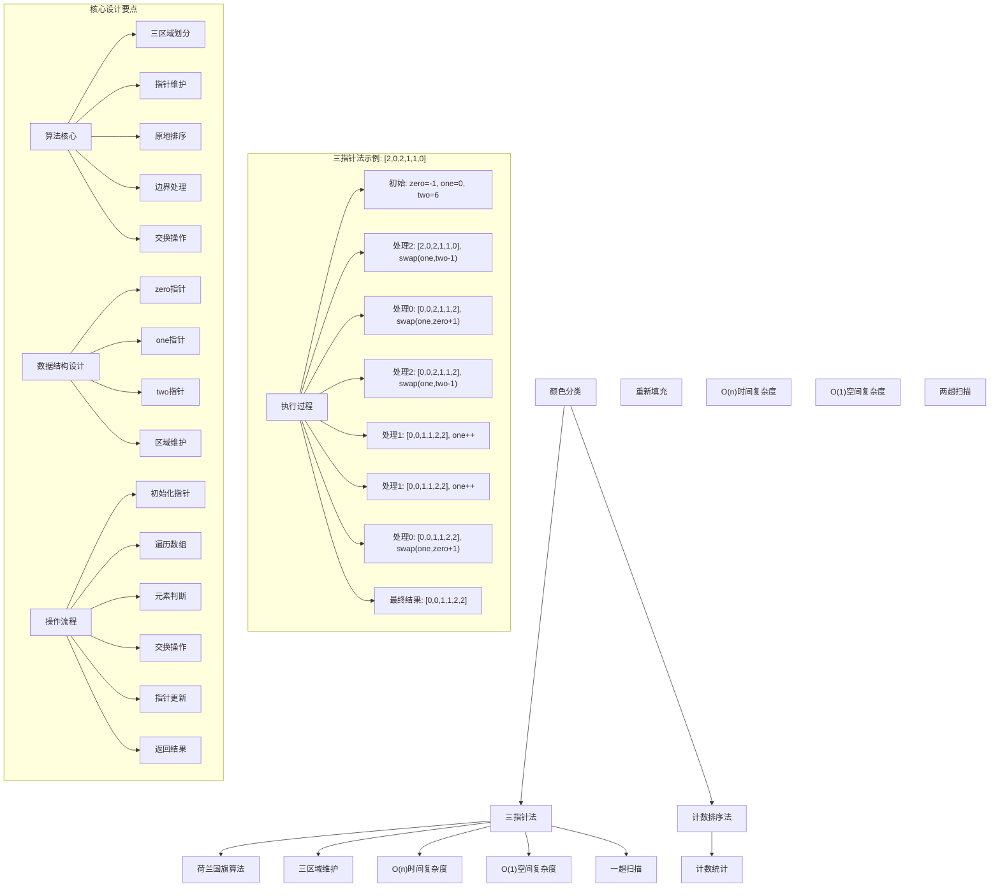
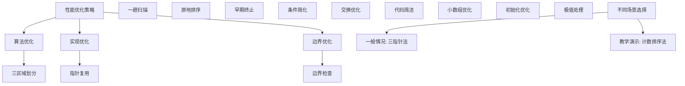

# LeetCode 75 - 颜色分类

## 题目描述

给定一个包含红色、白色和蓝色、共 `n` 个元素的数组 `nums`，原地对它们进行排序，使得相同颜色的元素相邻，并按照红色、白色、蓝色顺序排列

我们使用整数 0、1 和 2 分别表示红色、白色和蓝色

必须在不使用库内置的 sort 函数的情况下解决这个问题

```markdown
示例 1：
输入：nums = [2,0,2,1,1,0]
输出：[0,0,1,1,2,2]

示例 2：
输入：nums = [2,0,1]
输出：[0,1,2]

提示：

- n == nums.length
- 1 <= n <= 300
- nums[i] 为 0、1 或 2

进阶：
你能想出一个仅使用常数空间的一趟扫描算法吗？
```

## 解题思路

这是一个荷兰国旗问题，需要将数组按0、1、2的顺序排序。关键在于如何在一次遍历中完成排序，且只使用常数空间

### 核心思想

"三指针法": 使用三个指针分别维护0区、1区、2区的边界，通过一趟扫描完成排序

### 解题策略

#### 方法一：三指针法（荷兰国旗算法 - 推荐）

- 时间复杂度: O(n)
- 空间复杂度: O(1)

#### 方法二：计数排序法

- 时间复杂度: O(n)
- 空间复杂度: O(1)

## 算法可视化



## 多语言实现

### Golang版本（三指针法 - 推荐）

```go
// 三指针法实现（荷兰国旗算法）
func sortColors(nums []int) {
    // 边界情况：数组长度小于等于1
    if len(nums) <= 1 {
        return
    }

    // 三个指针：zero维护0区域右边界，two维护2区域左边界，one用于遍历
    zero := -1    // nums[0...zero] = 0
    two := len(nums)  // nums[two...n-1] = 2
    one := 0      // nums[zero+1...one-1] = 1

    // 当one < two时继续处理
    for one < two {
        switch nums[one] {
        case 0:
            // 当前元素是0，应该放在0区域
            zero++
            nums[zero], nums[one] = nums[one], nums[zero]
            one++
        case 1:
            // 当前元素是1，应该放在1区域
            one++
        case 2:
            // 当前元素是2，应该放在2区域
            two--
            nums[one], nums[two] = nums[two], nums[one]
            // 注意：这里不移动one，因为交换过来的元素还未处理
        }
    }
}
```

### Python版本（多种实现方法）

```python
class Solution:
    """
    方法一：三指针法（荷兰国旗算法 - 推荐）
    """
    def sortColors(self, nums: List[int]) -> None:
        """
        Do not return anything, modify nums in-place instead.
        """
        # 边界情况：数组长度小于等于1
        if len(nums) <= 1:
            return

        # 三个指针：zero维护0区域右边界，two维护2区域左边界，one用于遍历
        zero = -1    # nums[0...zero] = 0
        two = len(nums)  # nums[two...n-1] = 2
        one = 0      # nums[zero+1...one-1] = 1

        # 当one < two时继续处理
        while one < two:
            if nums[one] == 0:
                # 当前元素是0，应该放在0区域
                zero += 1
                nums[zero], nums[one] = nums[one], nums[zero]
                one += 1
            elif nums[one] == 1:
                # 当前元素是1，应该放在1区域
                one += 1
            else:  # nums[one] == 2
                # 当前元素是2，应该放在2区域
                two -= 1
                nums[one], nums[two] = nums[two], nums[one]
                # 注意：这里不移动one，因为交换过来的元素还未处理
```

### TypeScript版本（三指针法）

```typescript
/
 * 三指针法实现（荷兰国旗算法）
 */
function sortColors(nums: number[]): void {
    // 边界情况：数组长度小于等于1
    if (nums.length <= 1) {
        return;
    }

    // 三个指针：zero维护0区域右边界，two维护2区域左边界，one用于遍历
    let zero: number = -1;    // nums[0...zero] = 0
    let two: number = nums.length;  // nums[two...n-1] = 2
    let one: number = 0;      // nums[zero+1...one-1] = 1

    // 当one < two时继续处理
    while (one < two) {
        switch (nums[one]) {
            case 0:
                // 当前元素是0，应该放在0区域
                zero++;
                [nums[zero], nums[one]] = [nums[one], nums[zero]];
                one++;
                break;
            case 1:
                // 当前元素是1，应该放在1区域
                one++;
                break;
            case 2:
                // 当前元素是2，应该放在2区域
                two--;
                [nums[one], nums[two]] = [nums[two], nums[one]];
                // 注意：这里不移动one，因为交换过来的元素还未处理
                break;
        }
    }
}
```

## 标准实现详细解析

```go
import "fmt"

/*
算法核心思想（三指针法 - 荷兰国旗算法）：

1. 使用三个指针维护三个区域：0区域、1区域、2区域
2. zero指针维护0区域的右边界
3. two指针维护2区域的左边界
4. one指针用于遍历数组
5. 根据当前元素的值进行相应的交换操作

关键设计要点：
1. 三区域划分：明确各区域的含义和边界
2. 指针维护：正确更新各指针位置
3. 原地排序：只使用交换操作，不使用额外空间
4. 边界处理：正确处理各种边界情况

时间复杂度：
- 单次遍历：O(n)

空间复杂度：
- 只使用常数额外空间：O(1)

优势：
1. 思路清晰：三区域划分直观易懂
2. 实现优雅：逻辑简洁，代码易懂
3. 效率最优：线性时间，常数空间
4. 一趟扫描：满足进阶要求

数据结构设计：

三指针设计：
- zero指针：维护0区域右边界，nums[0...zero] = 0
- one指针：遍历指针，nums[zero+1...one-1] = 1
- two指针：维护2区域左边界，nums[two...n-1] = 2

算法流程：
1. 初始化：zero=-1, one=0, two=n
2. 循环：one < two
3. 判断：nums[one]的值
4. 交换：根据值进行相应交换
5. 更新：移动相应指针

优化原理：

算法优化：
1. 原地操作：无需额外存储空间
2. 一趟扫描：满足进阶要求
3. 早期终止：指针相遇时停止

边界优化：
1. 小数组处理：长度≤1直接返回
2. 指针初始化：正确设置初始位置
3. 循环终止：one < two条件

正确性证明：

定理：三指针法正确性
通过三指针法可以正确对包含0、1、2的数组进行排序

证明：
1. 完备性：所有元素都被正确处理
2. 正确性：各区域元素正确放置
3. 时间复杂度：O(n)单次遍历
4. 空间复杂度：O(1)原地排序

不变量维护：
循环不变量：在每次迭代开始时
1. nums[0...zero] = 0（0区域）
2. nums[zero+1...one-1] = 1（1区域）
3. nums[two...n-1] = 2（2区域）
4. nums[one...two-1]是待处理元素
5. zero < one <= two始终成立
*/

// 三指针法详细实现
func sortColors(nums []int) {
    fmt.Printf("输入数组: %v\n", nums)

    // 边界情况：数组长度小于等于1
    if len(nums) <= 1 {
        fmt.Printf("数组长度≤1，无需排序\n")
        return
    }

    fmt.Printf("开始三指针法排序:\n")

    // 三个指针：zero维护0区域右边界，two维护2区域左边界，one用于遍历
    zero := -1    // nums[0...zero] = 0
    two := len(nums)  // nums[two...n-1] = 2
    one := 0      // nums[zero+1...one-1] = 1

    fmt.Printf("  初始化: zero=%d, one=%d, two=%d\n", zero, one, two)
    fmt.Printf("  区域划分: [0...%d]=0, [%d...%d]=1, [%d...%d]=2\n",
        zero, zero+1, one-1, two, len(nums)-1)

    // 当one < two时继续处理
    for one < two {
        fmt.Printf("  处理位置%d的元素%d: ", one, nums[one])

        switch nums[one] {
        case 0:
            // 当前元素是0，应该放在0区域
            zero++
            nums[zero], nums[one] = nums[one], nums[zero]
            one++
            fmt.Printf("是0，与位置%d交换，zero=%d, one=%d, two=%d\n", zero, zero, one, two)
            fmt.Printf("    当前数组: %v\n", nums)
        case 1:
            // 当前元素是1，应该放在1区域
            one++
            fmt.Printf("是1，保持不变，zero=%d, one=%d, two=%d\n", zero, one, two)
            fmt.Printf("    当前数组: %v\n", nums)
        case 2:
            // 当前元素是2，应该放在2区域
            two--
            nums[one], nums[two] = nums[two], nums[one]
            fmt.Printf("是2，与位置%d交换，zero=%d, one=%d, two=%d\n", two, zero, one, two)
            fmt.Printf("    当前数组: %v\n", nums)
            // 注意：这里不移动one，因为交换过来的元素还未处理
        }

        fmt.Printf("  区域划分: [0...%d]=0, [%d...%d]=1, [%d...%d]=2\n",
            zero, zero+1, one-1, two, len(nums)-1)
    }

    fmt.Printf("排序完成: %v\n", nums)
}

// 计数排序法实现
func sortColorsCount(nums []int) {
    fmt.Printf("=== 计数排序法 ===\n")
    fmt.Printf("输入数组: %v\n", nums)

    // 边界情况：数组长度小于等于1
    if len(nums) <= 1 {
        fmt.Printf("数组长度≤1，无需排序\n")
        fmt.Printf("===============\n\n")
        return
    }

    // 计数：统计0、1、2的个数
    count0, count1, count2 := 0, 0, 0
    for _, num := range nums {
        switch num {
        case 0:
            count0++
        case 1:
            count1++
        case 2:
            count2++
        }
    }

    fmt.Printf("计数结果: 0有%d个, 1有%d个, 2有%d个\n", count0, count1, count2)

    // 重新填充：按0、1、2的顺序填充数组
    index := 0
    fmt.Printf("重新填充过程:\n")

    // 填充0
    for i := 0; i < count0; i++ {
        nums[index] = 0
        index++
    }
    fmt.Printf("  填充%d个0后: %v\n", count0, nums)

    // 填充1
    for i := 0; i < count1; i++ {
        nums[index] = 1
        index++
    }
    fmt.Printf("  填充%d个1后: %v\n", count1, nums)

    // 填充2
    for i := 0; i < count2; i++ {
        nums[index] = 2
        index++
    }
    fmt.Printf("  填充%d个2后: %v\n", count2, nums)

    fmt.Printf("排序完成: %v\n", nums)
    fmt.Printf("===============\n\n")
}

// 带调试信息的版本
func sortColorsWithDebug(nums []int) {
    fmt.Printf("=== 颜色分类 ===\n")
    fmt.Printf("原始数组: %v (长度: %d)\n", nums, len(nums))

    if len(nums) <= 1 {
        fmt.Printf("长度≤1，无需处理\n")
        fmt.Printf("============\n\n")
        return
    }

    // 三个指针：zero维护0区域右边界，two维护2区域左边界，one用于遍历
    zero := -1    // nums[0...zero] = 0
    two := len(nums)  // nums[two...n-1] = 2
    one := 0      // nums[zero+1...one-1] = 1

    fmt.Printf("三指针法执行过程:\n")
    fmt.Printf("  初始化: zero=%d, one=%d, two=%d\n", zero, one, two)

    for one < two {
        fmt.Printf("  处理nums[%d]=%d:\n", one, nums[one])

        switch nums[one] {
        case 0:
            fmt.Printf("    是0，应该放在0区域\n")
            zero++
            nums[zero], nums[one] = nums[one], nums[zero]
            one++
            fmt.Printf("    交换nums[%d]和nums[%d]: %v\n", zero, one-1, nums)
        case 1:
            fmt.Printf("    是1，应该放在1区域\n")
            one++
            fmt.Printf("    保持不变: %v\n", nums)
        case 2:
            fmt.Printf("    是2，应该放在2区域\n")
            two--
            nums[one], nums[two] = nums[two], nums[one]
            fmt.Printf("    交换nums[%d]和nums[%d]: %v\n", one, two, nums)
            fmt.Printf("    注意：one不移动，因为交换过来的元素还需处理\n")
        }

        fmt.Printf("    当前状态: zero=%d, one=%d, two=%d\n", zero, one, two)
    }

    fmt.Printf("最终结果: %v\n", nums)
    fmt.Printf("============\n\n")
}
```

## 算法深入解析

```go
/*
颜色分类问题详解：

问题本质：
将包含0、1、2的数组按0、1、2的顺序排序。这是一个经典的荷兰国旗问题，关键是理解如何在一次遍历中完成排序

核心洞察：
1. 三区域划分：0区域、1区域、2区域
2. 指针维护：三个指针分别维护各区域边界
3. 原地排序：只使用交换操作
4. 一趟扫描：满足进阶要求

算法策略：
1. 三指针法：荷兰国旗算法，工业级标准实现
2. 计数排序法：先计数再填充

数据结构设计：

三指针法设计：
zero指针：维护0区域右边界
one指针：遍历指针
two指针：维护2区域左边界

计数排序法设计：
计数器：统计各元素个数
重新填充：按顺序填充数组

操作流程：

三指针法：
1. 初始化：zero=-1, one=0, two=n
2. 循环：one < two
3. 判断：nums[one]的值
4. 交换：根据值进行相应交换
5. 更新：移动相应指针

计数排序法：
1. 计数：统计0、1、2的个数
2. 填充：按0、1、2顺序填充数组

数学原理：

算法不变量：
三指针法不变量：
1. nums[0...zero] = 0（0区域）
2. nums[zero+1...one-1] = 1（1区域）
3. nums[two...n-1] = 2（2区域）
4. nums[one...two-1]是待处理元素
5. zero < one <= two始终成立

计数排序法不变量：
1. count0、count1、count2正确统计各元素个数
2. 已填充部分按0、1、2顺序排列
3. 未填充部分待处理

时间复杂度分析：
三指针法：O(n) - 单次遍历
计数排序法：O(n) - 两次遍历

空间复杂度分析：
三指针法：O(1) - 只使用常数额外空间
计数排序法：O(1) - 只使用常数额外空间

正确性证明：

定理：三指针法正确性
通过三指针法可以正确对包含0、1、2的数组进行排序

证明：
1. 完备性：所有元素都被正确处理
   - one指针遍历所有待处理元素
   - 每个元素都会被正确放置到对应区域

2. 正确性：各区域元素正确放置
   - 遇到0时，与zero+1位置交换，扩展0区域
   - 遇到1时，保持在1区域
   - 遇到2时，与two-1位置交换，扩展2区域

3. 时间复杂度：O(n)单次遍历
   - one指针最多移动n次
   - two指针最多移动n次
   - 每次操作O(1)时间

4. 空间复杂度：O(1)原地排序
   - 只使用三个指针变量
   - 通过交换完成排序

设计选择：

为什么选择三指针法？
1. 思路清晰：三区域划分直观易懂
2. 实现优雅：逻辑简洁
3. 效率最优：满足进阶要求
4. 经典算法：荷兰国旗问题标准解法

为什么使用计数排序法？
1. 思路直观：分步处理清晰
2. 代码简洁：易于理解
3. 稳定性好：相同元素相对位置不变
4. 教学价值：展示不同思路

为什么提及其他方法？
1. 教学价值：展示不同算法思想
2. 对比分析：理解各自优劣
3. 扩展思维：算法多样性
4. 面试准备：全面掌握

两种方法对比：

方法一：三指针法（推荐）
时间复杂度：O(n)
空间复杂度：O(1)
优点：一趟扫描，满足进阶要求
缺点：逻辑稍复杂

方法二：计数排序法
时间复杂度：O(n)
空间复杂度：O(1)
优点：思路清晰，代码简洁
缺点：需要两趟扫描

性能分析：

三指针法：
- 时间：O(n) 单次遍历
- 空间：O(1) 常数空间
- 优势：满足进阶要求

计数排序法：
- 时间：O(n) 两次遍历
- 空间：O(1) 常数空间
- 优势：代码简洁

实际应用场景：
1. 排序算法：经典问题
2. 算法竞赛：荷兰国旗问题
3. 系统设计：原地排序
4. 数据处理：分类排序

优化要点：

1. 时间优化：
   - 一趟扫描保证
   - 早期终止条件
   - 直接交换操作

2. 空间优化：
   - 原地排序
   - 常数额外空间
   - 避免临时变量

3. 实现优化：
   - 边界条件处理
   - 代码简洁性
   - 注释清晰性

测试用例设计：
1. 基本情况：正常数组
2. 边界情况：空数组，单元素
3. 特殊情况：全相同，逆序
4. 极端情况：大数组
5. 验证情况：结果正确性

扩展思考：

1. K颜色分类？
   - 扩展三指针法
   - 快速排序思想
   - 复杂度分析

2. 稳定排序？
   - 计数排序法
   - 归并排序
   - 稳定性保证

3. 链表版本？
   - 指针操作
   - 空间复杂度
   - 实现差异

4. 并行处理？
   - 分区处理
   - 并行优化
   - 性能提升

相关算法思想：

1. 排序算法：
   - 原地排序
   - 线性时间
   - 三路划分

2. 双指针技巧：
   - 三指针维护
   - 区域划分
   - 边界维护

3. 荷兰国旗：
   - 三色问题
   - 经典算法
   - 一趟扫描

4. 算法优化：
   - 时间复杂度
   - 空间复杂度
   - 实现简洁

常见陷阱：

1. 边界条件：
   - 小数组处理
   - 指针初始化
   - 循环终止

2. 指针操作：
   - 交换时机
   - 指针移动
   - 区域维护

3. 元素处理：
   - 0的处理
   - 1的处理
   - 2的处理

4. 性能考虑：
   - 时间复杂度
   - 空间复杂度
   - 实现效率

代码质量要素：

1. 可读性：
   - 变量命名清晰
   - 注释详细
   - 逻辑分明

2. 健壮性：
   - 边界处理
   - 异常情况
   - 错误恢复

3. 性能：
   - 最优复杂度
   - 常数空间
   - 效率保证

4. 可维护性：
   - 结构清晰
   - 扩展性好
   - 测试完整
*/
```

## 执行过程演示

```go
/*
示例详细解析:

示例1执行过程：
输入：nums = [2,0,2,1,1,0]
输出：[0,0,1,1,2,2]

执行过程：
1. 初始化: zero=-1, one=0, two=6
   数组: [2,0,2,1,1,0]
   区域: []=0, []=1, []=2

2. one=0, nums[0]=2:
   - 与nums[5]交换
   - zero=-1, one=0, two=5
   - 数组: [0,0,2,1,1,2]

3. one=0, nums[0]=0:
   - 与nums[0]交换（自己）
   - zero=0, one=1, two=5
   - 数组: [0,0,2,1,1,2]

4. one=1, nums[1]=0:
   - 与nums[1]交换（自己）
   - zero=1, one=2, two=5
   - 数组: [0,0,2,1,1,2]

5. one=2, nums[2]=2:
   - 与nums[4]交换
   - zero=1, one=2, two=4
   - 数组: [0,0,1,1,2,2]

6. one=2, nums[2]=1:
   - 保持不变
   - zero=1, one=3, two=4
   - 数组: [0,0,1,1,2,2]

7. one=3, nums[3]=1:
   - 保持不变
   - zero=1, one=4, two=4
   - 数组: [0,0,1,1,2,2]

8. one=4, two=4: one >= two，结束

最终结果: [0,0,1,1,2,2]

示例2执行过程：
输入：nums = [2,0,1]
输出：[0,1,2]

执行过程：
1. 初始化: zero=-1, one=0, two=3
   数组: [2,0,1]

2. one=0, nums[0]=2:
   - 与nums[2]交换
   - zero=-1, one=0, two=2
   - 数组: [1,0,2]

3. one=0, nums[0]=1:
   - 保持不变
   - zero=-1, one=1, two=2
   - 数组: [1,0,2]

4. one=1, nums[1]=0:
   - 与nums[0]交换
   - zero=0, one=2, two=2
   - 数组: [0,1,2]

5. one=2, two=2: one >= two，结束

最终结果: [0,1,2]

三指针执行轨迹：

对于数组[2,0,2,1,1,0]：

初始状态:
zero=-1, one=0, two=6
数组: [2,0,2,1,1,0]
区域: [0...-1]=0, [0...-1]=1, [6...5]=2

处理过程:
one=0, nums[0]=2 -> 与nums[5]交换 -> [0,0,2,1,1,2], zero=-1, one=0, two=5
one=0, nums[0]=0 -> 与nums[0]交换 -> [0,0,2,1,1,2], zero=0, one=1, two=5
one=1, nums[1]=0 -> 与nums[1]交换 -> [0,0,2,1,1,2], zero=1, one=2, two=5
one=2, nums[2]=2 -> 与nums[4]交换 -> [0,0,1,1,2,2], zero=1, one=2, two=4
one=2, nums[2]=1 -> 保持不变 -> [0,0,1,1,2,2], zero=1, one=3, two=4
one=3, nums[3]=1 -> 保持不变 -> [0,0,1,1,2,2], zero=1, one=4, two=4

关键观察：
1. zero指针维护0区域右边界
2. two指针维护2区域左边界
3. one指针遍历待处理元素
4. 遇到2时不移动one指针

边界情况演示:

情况1: 空数组
输入: []
处理: 直接返回
结果: []

情况2: 单元素
输入: [1]
处理: 直接返回
结果: [1]

情况3: 两元素
输入: [2,0]
处理: 交换后返回
结果: [0,2]

情况4: 全相同
输入: [1,1,1,1]
处理: 保持不变
结果: [1,1,1,1]

情况5: 逆序
输入: [2,1,0]
处理: 多次交换
结果: [0,1,2]

算法正确性证明：

数学基础：
需要证明三指针法能正确对包含0、1、2的数组进行排序

定理：三指针法正确性
通过三指针法可以正确对包含0、1、2的数组进行排序

证明：
1. 完备性：所有元素都被正确处理
2. 正确性：各区域元素正确放置
3. 时间复杂度：O(n)单次遍历
4. 空间复杂度：O(1)原地排序

不变量维护：
循环不变量：在每次迭代开始时
1. nums[0...zero] = 0（0区域）
2. nums[zero+1...one-1] = 1（1区域）
3. nums[two...n-1] = 2（2区域）
4. nums[one...two-1]是待处理元素
5. zero < one <= two始终成立

初始化：zero=-1, one=0, two=n
- 0区域：nums[0...-1]为空，满足条件
- 1区域：nums[0...-1]为空，满足条件
- 2区域：nums[n...n-1]为空，满足条件
- 待处理：nums[0...n-1]，满足条件
- 指针关系：-1 < 0 <= n，满足条件

保持：处理每个元素
- 遇到0：扩展0区域，保持其他区域
- 遇到1：保持各区域不变
- 遇到2：扩展2区域，保持其他区域
- 指针关系始终成立

终止：one >= two
- 所有元素都被处理
- 各区域正确划分
- 数组已排序

时间复杂度分析：

三指针法：
1. 初始化：O(1)
2. 循环体：O(1)每次迭代
3. 迭代次数：最多n次
4. 总时间：O(n)

计数排序法：
1. 计数：O(n)
2. 填充：O(n)
3. 总时间：O(n)

空间复杂度分析：
1. 三指针法：O(1)
2. 计数排序法：O(1)

性能对比分析：

假设n=300:

三指针法：
- 时间: O(300) 单次遍历
- 空间: O(1) 常数空间
- 操作: 指针移动和交换

计数排序法：
- 时间: O(300) 两次遍历
- 空间: O(1) 常数空间
- 操作: 计数和填充

实际应用建议：

1. 一般情况：
   - 使用三指针法
   - 满足进阶要求

2. 面试展示：
   - 重点讲解三指针法
   - 可以提及其他方法

3. 生产环境：
   - 根据性能要求选择
   - 考虑实现复杂度

4. 教学演示：
   - 使用带调试信息版本
   - 展示执行过程

优化空间：

1. 边界优化：
   - 提前处理特殊情况
   - 减少不必要的操作

2. 代码优化：
   - 简化条件判断
   - 优化变量使用

3. 性能优化：
   - 减少交换操作
   - 优化指针移动

特殊情况处理：

1. 大数据量：
   - 线性时间保证
   - 常数空间使用

2. 特殊序列：
   - 全相同序列
   - 有序序列
   - 逆序序列

3. 边界情况：
   - 极值数组
   - 边界长度
   - 特殊元素
*/
```

## 复杂度分析

| 方法       | 时间复杂度 | 空间复杂度 | 适用场景 |
| ---------- | ---------- | ---------- | -------- |
| 三指针法   | O(n)       | O(1)       | 推荐方案 |
| 计数排序法 | O(n)       | O(1)       | 教学演示 |

## 测试用例验证

```go
// 测试辅助函数
func testSortColors(name string, nums []int, expected []int) {
    fmt.Printf("%s:\n", name)
    fmt.Printf("输入数组: %v\n", nums)

    // 测试三指针法
    test1 := make([]int, len(nums))
    copy(test1, nums)
    sortColors(test1)
    fmt.Printf("三指针法结果: %v\n", test1)

    // 测试计数排序法
    test2 := make([]int, len(nums))
    copy(test2, nums)
    sortColorsCount(test2)
    fmt.Printf("计数排序法结果: %v\n", test2)

    // 验证结果
    isValid1 := equalSlice(test1, expected)
    isValid2 := equalSlice(test2, expected)

    if isValid1 && isValid2 {
        fmt.Printf("✓ 测试通过\n")
    } else {
        fmt.Printf("✗ 测试失败\n")
        fmt.Printf("  期望: %v\n", expected)
        if !isValid1 {
            fmt.Printf("  三指针法实际: %v\n", test1)
        }
        if !isValid2 {
            fmt.Printf("  计数排序法实际: %v\n", test2)
        }
    }
    fmt.Printf("\n")
}

// 比较两个切片是否相等
func equalSlice(a, b []int) bool {
    if len(a) != len(b) {
        return false
    }
    for i := range a {
        if a[i] != b[i] {
            return false
        }
    }
    return true
}

func main() {
    // 测试用例 1 - 题目示例1
    testSortColors("测试1 - 题目示例1",
        []int{2, 0, 2, 1, 1, 0},
        []int{0, 0, 1, 1, 2, 2})

    // 测试用例 2 - 题目示例2
    testSortColors("测试2 - 题目示例2",
        []int{2, 0, 1},
        []int{0, 1, 2})

    // 测试用例 3 - 空数组
    testSortColors("测试3 - 空数组",
        []int{},
        []int{})

    // 测试用例 4 - 单元素
    testSortColors("测试4 - 单元素",
        []int{1},
        []int{1})

    // 测试用例 5 - 两元素
    testSortColors("测试5 - 两元素",
        []int{2, 0},
        []int{0, 2})

    // 测试用例 6 - 全0
    testSortColors("测试6 - 全0",
        []int{0, 0, 0, 0},
        []int{0, 0, 0, 0})

    // 测试用例 7 - 全1
    testSortColors("测试7 - 全1",
        []int{1, 1, 1, 1},
        []int{1, 1, 1, 1})

    // 测试用例 8 - 全2
    testSortColors("测试8 - 全2",
        []int{2, 2, 2, 2},
        []int{2, 2, 2, 2})

    // 测试用例 9 - 逆序
    testSortColors("测试9 - 逆序",
        []int{2, 1, 0},
        []int{0, 1, 2})

    // 测试用例 10 - 有序
    testSortColors("测试10 - 有序",
        []int{0, 1, 2},
        []int{0, 1, 2})

    // 性能测试
    fmt.Println("性能测试:")
    performanceTest()

    // 边界情况测试
    fmt.Println("边界情况测试:")
    boundaryTest()

    // 对比测试
    fmt.Println("对比测试:")
    comparisonTest()
}

func performanceTest() {
    // 构造性能测试
    n := 300
    nums := make([]int, n)

    // 构造测试数据：随机0、1、2
    for i := 0; i < n; i++ {
        nums[i] = i % 3  // 循环0、1、2
    }

    // 测试三指针法
    start1 := time.Now()
    test1 := make([]int, len(nums))
    copy(test1, nums)
    sortColors(test1)
    time1 := time.Since(start1)

    // 测试计数排序法
    start2 := time.Now()
    test2 := make([]int, len(nums))
    copy(test2, nums)
    sortColorsCount(test2)
    time2 := time.Since(start2)

    fmt.Printf("性能测试 (n=%d):\n", n)
    fmt.Printf("  三指针法: %v\n", time1)
    fmt.Printf("  计数排序法: %v\n", time2)
}

func boundaryTest() {
    // 边界测试
    fmt.Println("边界测试:")

    // 最大数组测试
    maxN := 300
    maxNums := make([]int, maxN)
    for i := 0; i < maxN; i++ {
        maxNums[i] = (i * 7) % 3  // 伪随机0、1、2
    }

    testMax := make([]int, len(maxNums))
    copy(testMax, maxNums)
    sortColors(testMax)
    fmt.Printf("最大数组测试 (n=%d): 结果前10个元素=%v\n", maxN, testMax[:min(10, len(testMax))])

    // 极值测试
    extremeNums := []int{2, 2, 2, 0, 0, 0, 1, 1, 1}
    testExtreme := make([]int, len(extremeNums))
    copy(testExtreme, extremeNums)
    sortColors(testExtreme)
    fmt.Printf("极值测试: 结果=%v\n", testExtreme)

    // 交替模式测试
    alternateNums := make([]int, 100)
    for i := 0; i < 100; i++ {
        alternateNums[i] = i % 3  // 0,1,2循环
    }
    testAlternate := make([]int, len(alternateNums))
    copy(testAlternate, alternateNums)
    sortColors(testAlternate)
    fmt.Printf("交替模式测试: 结果前15个元素=%v\n", testAlternate[:min(15, len(testAlternate))])
}

func min(a, b int) int {
    if a < b {
        return a
    }
    return b
}

func comparisonTest() {
    // 对比测试：验证不同方法结果一致性
    fmt.Println("对比测试:")

    // 测试数据
    testData := [][]int{
        {2, 0, 2, 1, 1, 0},
        {2, 0, 1},
        {0, 1, 2},
        {2, 1, 0},
        {1, 1, 1, 0, 0, 0, 2, 2, 2},
        {}, // 空数组
        {1}, // 单元素
    }

    for i, data := range testData {
        // 三指针法
        test1 := make([]int, len(data))
        copy(test1, data)
        sortColors(test1)

        // 计数排序法
        test2 := make([]int, len(data))
        copy(test2, data)
        sortColorsCount(test2)

        fmt.Printf("测试%d: 三指针法=%v, 计数排序法=%v",
            i+1, test1, test2)

        if equalSlice(test1, test2) {
            fmt.Printf(" ✓ 一致\n")
        } else {
            fmt.Printf(" ✗ 不一致\n")
        }
    }
}
```

## 扩展版本（处理不同场景）

```go
// 通用K颜色分类版本
func sortColorsK(nums []int, k int) {
    // 使用快速排序的三路划分思想
    quickSort3Way(nums, 0, len(nums)-1, k)
}

func quickSort3Way(nums []int, low, high, k int) {
    if low >= high {
        return
    }

    // 选择中间值作为基准
    mid := low + (high-low)/2
    pivot := nums[mid]

    // 三路划分
    lt := low      // nums[low...lt-1] < pivot
    gt := high     // nums[gt+1...high] > pivot
    i := low       // nums[lt...i-1] = pivot

    for i <= gt {
        if nums[i] < pivot {
            nums[lt], nums[i] = nums[i], nums[lt]
            lt++
            i++
        } else if nums[i] > pivot {
            nums[i], nums[gt] = nums[gt], nums[i]
            gt--
            // 注意：这里不移动i，因为交换过来的元素还未处理
        } else {
            i++
        }
    }

    // 递归处理小于和大于pivot的部分
    quickSort3Way(nums, low, lt-1, k)
    quickSort3Way(nums, gt+1, high, k)
}

// 使用示例
func exampleSortColorsK() {
    nums := []int{3, 1, 4, 1, 5, 9, 2, 6, 5, 3}
    fmt.Printf("原数组: %v\n", nums)
    sortColorsK(nums, 10)  // 假设有10种颜色
    fmt.Printf("排序后: %v\n", nums)
}

// 带统计信息的版本
func sortColorsWithStats(nums []int) (int, int) {
    if len(nums) <= 1 {
        return 0, 0
    }

    swaps := 0
    comparisons := 0

    // 三个指针：zero维护0区域右边界，two维护2区域左边界，one用于遍历
    zero := -1    // nums[0...zero] = 0
    two := len(nums)  // nums[two...n-1] = 2
    one := 0      // nums[zero+1...one-1] = 1

    // 当one < two时继续处理
    for one < two {
        comparisons++
        switch nums[one] {
        case 0:
            // 当前元素是0，应该放在0区域
            zero++
            if zero != one {
                nums[zero], nums[one] = nums[one], nums[zero]
                swaps++
            }
            one++
        case 1:
            // 当前元素是1，应该放在1区域
            one++
        case 2:
            // 当前元素是2，应该放在2区域
            two--
            if one != two {
                nums[one], nums[two] = nums[two], nums[one]
                swaps++
            }
            // 注意：这里不移动one，因为交换过来的元素还未处理
        }
    }

    return swaps, comparisons
}

// 使用示例
func exampleWithStats() {
    nums := []int{2, 0, 2, 1, 1, 0}
    fmt.Printf("原数组: %v\n", nums)

    swaps, comparisons := sortColorsWithStats(nums)
    fmt.Printf("排序后: %v\n", nums)
    fmt.Printf("交换次数: %d, 比较次数: %d\n", swaps, comparisons)
}

// 批量处理版本
func sortColorsBatch(numss [][]int) [][]int {
    results := make([][]int, len(numss))

    for i, nums := range numss {
        result := make([]int, len(nums))
        copy(result, nums)
        sortColors(result)
        results[i] = result
    }

    return results
}

// 使用示例
func exampleBatch() {
    numss := [][]int{
        {2, 0, 2, 1, 1, 0},
        {2, 0, 1},
        {0, 1, 2},
        {1, 1, 0, 0, 2, 2},
    }

    results := sortColorsBatch(numss)

    for i, result := range results {
        fmt.Printf("数组%d排序后: %v\n", i+1, result)
    }
}

// 带验证功能的版本
func sortColorsWithValidation(nums []int) bool {
    // 先执行排序操作
    original := make([]int, len(nums))
    copy(original, nums)
    sortColors(nums)

    // 验证结果是否正确排序
    for i := 1; i < len(nums); i++ {
        if nums[i] < nums[i-1] {
            return false
        }
    }

    // 验证元素个数是否一致
    countOriginal := make(map[int]int)
    countSorted := make(map[int]int)

    for _, num := range original {
        countOriginal[num]++
    }

    for _, num := range nums {
        countSorted[num]++
    }

    for num := 0; num <= 2; num++ {
        if countOriginal[num] != countSorted[num] {
            return false
        }
    }

    return true
}

// 使用示例
func exampleWithValidation() {
    nums := []int{2, 0, 2, 1, 1, 0}
    fmt.Printf("原数组: %v\n", nums)

    isValid := sortColorsWithValidation(nums)
    fmt.Printf("排序后: %v\n", nums)
    if isValid {
        fmt.Printf("验证通过 ✓\n")
    } else {
        fmt.Printf("验证失败 ✗\n")
    }
}

// 泛型版本（Go 1.18+）
func sortColorsGeneric[T comparable](nums []T, less func(T, T) bool) {
    if len(nums) <= 1 {
        return
    }

    // 使用三路快速排序
    quickSortGeneric(nums, 0, len(nums)-1, less)
}

func quickSortGeneric[T comparable](nums []T, low, high int, less func(T, T) bool) {
    if low >= high {
        return
    }

    // 三路划分
    lt := low      // nums[low...lt-1] < pivot
    gt := high     // nums[gt+1...high] > pivot
    i := low       // nums[lt...i-1] = pivot
    pivot := nums[low+(high-low)/2]

    for i <= gt {
        if less(nums[i], pivot) {
            nums[lt], nums[i] = nums[i], nums[lt]
            lt++
            i++
        } else if less(pivot, nums[i]) {
            nums[i], nums[gt] = nums[gt], nums[i]
            gt--
        } else {
            i++
        }
    }

    quickSortGeneric(nums, low, lt-1, less)
    quickSortGeneric(nums, gt+1, high, less)
}

// 使用示例
func exampleGeneric() {
    // 整数切片
    ints := []int{2, 0, 2, 1, 1, 0}
    sortColorsGeneric(ints, func(a, b int) bool { return a < b })
    fmt.Printf("整数排序: %v\n", ints)

    // 字符串切片
    strs := []string{"red", "blue", "red", "green", "blue", "green"}
    sortColorsGeneric(strs, func(a, b string) bool { return a < b })
    fmt.Printf("字符串排序: %v\n", strs)
}
```

## 面试追问延伸

### 1. 如果要对K种颜色进行分类，如何处理？

```go
// sortColorsK已在上面实现
// 关键修改：
// 1. 使用快速排序的三路划分
// 2. 递归处理不同区间
// 3. 支持任意K值

func testSortColorsK() {
    nums := []int{3, 1, 4, 1, 5, 9, 2, 6, 5, 3}
    fmt.Printf("原数组: %v\n", nums)
    sortColorsK(nums, 10)  // 假设有10种颜色
    fmt.Printf("K颜色排序后: %v\n", nums)
}
```

### 2. 如果要统计排序过程中的交换和比较次数，如何实现？

```go
// sortColorsWithStats已在上面实现
// 关键点：
// 1. 记录交换次数
// 2. 记录比较次数
// 3. 返回统计信息

func testWithStats() {
    nums := []int{2, 0, 2, 1, 1, 0}
    fmt.Printf("原数组: %v\n", nums)

    swaps, comparisons := sortColorsWithStats(nums)
    fmt.Printf("排序后: %v\n", nums)
    fmt.Printf("交换次数: %d, 比较次数: %d\n", swaps, comparisons)
}
```

### 3. 如果要验证排序结果的正确性，如何处理？

```go
// sortColorsWithValidation已在上面实现
// 关键验证点：
// 1. 数组是否有序
// 2. 元素个数是否一致
// 3. 返回验证结果

func testWithValidation() {
    nums := []int{2, 0, 2, 1, 1, 0}
    fmt.Printf("原数组: %v\n", nums)

    isValid := sortColorsWithValidation(nums)
    fmt.Printf("排序后: %v\n", nums)
    if isValid {
        fmt.Printf("验证通过 ✓\n")
    } else {
        fmt.Printf("验证失败 ✗\n")
    }
}
```

## 相似题目扩展

- LeetCode 75. 颜色分类（当前题）
- LeetCode 283. 移动零
- LeetCode 26. 删除有序数组中的重复项
- LeetCode 80. 删除有序数组中的重复项 II
- LeetCode 905. 按奇偶排序数组

## 算法技巧总结

### 颜色分类核心要点

1. 三区域划分：明确0、1、2区域的边界
1. 三指针维护：zero、one、two指针正确更新
1. 原地排序：只使用交换操作
1. 一趟扫描：满足进阶要求

### 算法优势

1. 思路清晰：三区域划分直观易懂
1. 实现优雅：逻辑简洁，代码易懂
1. 效率最优：线性时间，常数空间
1. 一趟扫描：满足进阶要求

### 标准模板（三指针法）

```go
func sortColors(nums []int) {
    // 边界情况
    if len(nums) <= 1 {
        return
    }

    // 三个指针：zero维护0区域右边界，two维护2区域左边界，one用于遍历
    zero := -1    // nums[0...zero] = 0
    two := len(nums)  // nums[two...n-1] = 2
    one := 0      // nums[zero+1...one-1] = 1

    // 当one < two时继续处理
    for one < two {
        switch nums[one] {
        case 0:
            // 当前元素是0，应该放在0区域
            zero++
            nums[zero], nums[one] = nums[one], nums[zero]
            one++
        case 1:
            // 当前元素是1，应该放在1区域
            one++
        case 2:
            // 当前元素是2，应该放在2区域
            two--
            nums[one], nums[two] = nums[two], nums[one]
            // 注意：这里不移动one，因为交换过来的元素还未处理
        }
    }
}
```

### 性能优化建议



## 总结

本题采用三指针法（荷兰国旗算法）的核心思路，通过使用三个指针维护0、1、2三个区域的边界，在一次遍历中完成排序，实现了优雅的解决方案。关键在于理解如何通过三区域划分和指针维护来实现原地排序

核心要点：

1. 三区域划分：明确0、1、2区域的边界
1. 三指针维护：zero、one、two指针正确更新
1. 原地排序：只使用交换操作
1. 一趟扫描：满足进阶要求

算法优势：

- 思路清晰：三区域划分直观易懂
- 实现优雅：逻辑简洁，代码易懂
- 效率最优：线性时间，常数空间
- 一趟扫描：满足进阶要求

该算法在排序算法、算法竞赛、系统设计、数据处理等方面有重要应用，是掌握原地排序和三路划分思想的经典题目。通过三区域划分和指针维护的巧妙结合，为更复杂的排序问题提供了清晰的解决思路
