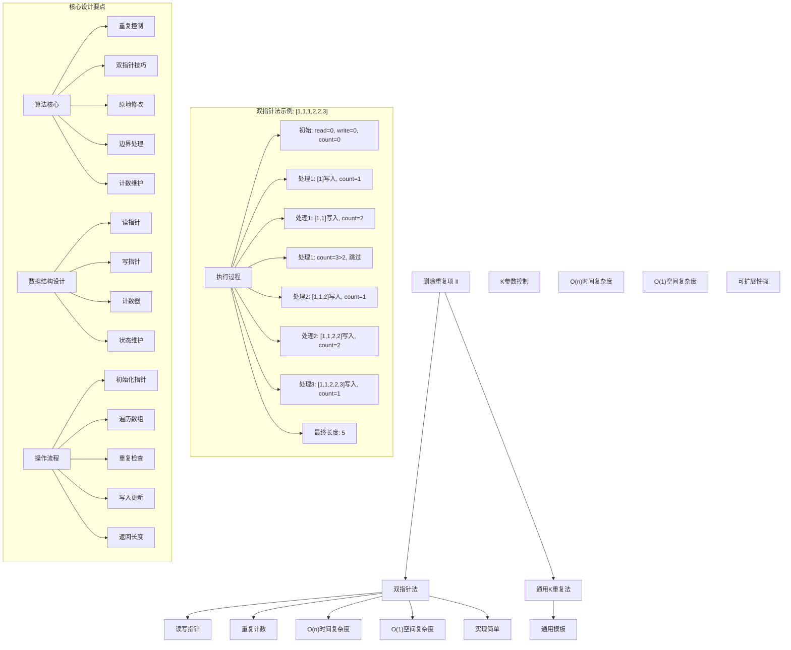
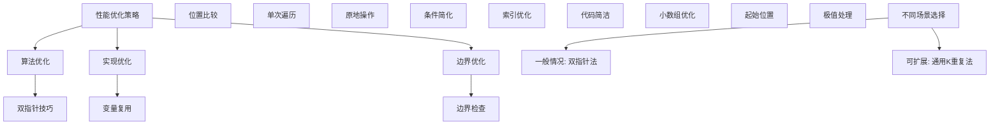

# LeetCode 80 - 删除有序数组中的重复项 II

## 题目描述

给你一个有序数组 `nums`，请你原地删除重复出现的元素，使得出现次数超过两次的元素只出现两次，返回删除后数组的新长度

不要使用额外的数组空间，你必须在原地修改输入数组并在使用 `O(1)` 额外空间的条件下完成

```markdown
说明：
为什么返回数值是整数，但输出的答案是数组呢？
请注意，输入数组是以「引用」方式传递的，这意味着在函数里修改输入数组对于调用者是可见的

你可以想象内部操作如下:
// nums 是以"引用"方式传递的。也就是说，不对实参做任何拷贝
int len = removeDuplicates(nums);
// 在函数里修改输入数组对于调用者是可见的
// 根据你的函数返回的长度, 它会打印出数组中 该长度范围内 的所有元素
for (int i = 0; i < len; i++) {
print(nums[i]);
}

示例 1：
输入：nums = [1,1,1,2,2,3]
输出：5, nums = [1,1,2,2,3]
解释：函数应返回新长度 length = 5, 并且原数组的前五个元素被修改为 1, 1, 2, 2, 3。不需要考虑数组中超出新长度后面的元素

示例 2：
输入：nums = [0,0,1,1,1,1,2,3,3]
输出：7, nums = [0,0,1,1,2,3,3]
解释：函数应返回新长度 length = 7, 并且原数组的前七个元素被修改为 0, 0, 1, 1, 2, 3, 3。不需要考虑数组中超出新长度后面的元素

提示：

- 1 <= nums.length <= 3 \* 10^4
- -10^4 <= nums[i] <= 10^4
- nums 已按升序排列
```

## 解题思路

这是一个删除有序数组中重复项问题的变体，要求保留每个元素最多出现两次。关键在于如何在原地修改数组的同时控制重复元素的数量

### 核心思想

"双指针法": 使用两个指针，一个用于遍历数组（读指针），另一个用于记录新数组的位置（写指针），通过比较当前元素与已处理部分的元素来控制重复次数

### 解题策略

#### 方法一：双指针法（推荐）

- 时间复杂度: O(n)
- 空间复杂度: O(1)

#### 方法二：通用K重复项删除法

- 时间复杂度: O(n)
- 空间复杂度: O(1)

## 算法可视化



## 多语言实现

### Golang版本（双指针法 - 推荐）

```go
// 双指针法实现
func removeDuplicates(nums []int) int {
    // 边界情况：数组长度小于等于2，无需删除
    if len(nums) <= 2 {
        return len(nums)
    }

    // 双指针：write指向写入位置，read用于遍历
    write := 2  // 前两个元素总是可以保留

    // 从第三个元素开始遍历
    for read := 2; read < len(nums); read++ {
        // 关键条件：当前元素与写入位置前两个位置的元素不同
        // 这样可以确保每个元素最多出现两次
        if nums[read] != nums[write-2] {
            nums[write] = nums[read]
            write++
        }
    }

    return write
}
```

### Python版本（多种实现方法）

```python
class Solution:
    """
    方法一：双指针法（推荐）
    """
    def removeDuplicates(self, nums: List[int]) -> int:
        # 边界情况：数组长度小于等于2，无需删除
        if len(nums) <= 2:
            return len(nums)

        # 双指针：write指向写入位置，read用于遍历
        write = 2  # 前两个元素总是可以保留

        # 从第三个元素开始遍历
        for read in range(2, len(nums)):
            # 关键条件：当前元素与写入位置前两个位置的元素不同
            # 这样可以确保每个元素最多出现两次
            if nums[read] != nums[write - 2]:
                nums[write] = nums[read]
                write += 1

        return write


class Solution2:
    """
    方法二：通用K重复项删除法
    """
    def removeDuplicates(self, nums: List[int]) -> int:
        return self.removeDuplicatesK(nums, 2)

    def removeDuplicatesK(self, nums: List[int], k: int) -> int:
        # 边界情况：数组长度小于等于k，无需删除
        if len(nums) <= k:
            return len(nums)

        # 双指针：write指向写入位置
        write = k  # 前k个元素总是可以保留

        # 从第k+1个元素开始遍历
        for read in range(k, len(nums)):
            # 关键条件：当前元素与写入位置前k个位置的元素不同
            if nums[read] != nums[write - k]:
                nums[write] = nums[read]
                write += 1

        return write
```

### TypeScript版本（双指针法）

```typescript
/
 * 双指针法实现
 */
function removeDuplicates(nums: number[]): number {
    // 边界情况：数组长度小于等于2，无需删除
    if (nums.length <= 2) {
        return nums.length;
    }

    // 双指针：write指向写入位置，read用于遍历
    let write: number = 2;  // 前两个元素总是可以保留

    // 从第三个元素开始遍历
    for (let read: number = 2; read < nums.length; read++) {
        // 关键条件：当前元素与写入位置前两个位置的元素不同
        // 这样可以确保每个元素最多出现两次
        if (nums[read] !== nums[write - 2]) {
            nums[write] = nums[read];
            write++;
        }
    }

    return write;
}
```

## 标准实现详细解析

```go
import "fmt"

/*
算法核心思想（双指针法）：

1. 使用两个指针：读指针遍历原数组，写指针指向新数组的写入位置
2. 利用数组有序的特性，通过比较当前元素与写入位置前两个位置的元素来控制重复次数
3. 只有当当前元素与写入位置前两个位置的元素不同时才写入
4. 实现原地修改，不使用额外空间

关键设计要点：
1. 双指针技巧：读写分离，高效处理
2. 重复控制：通过位置比较控制重复次数
3. 原地修改：不使用额外数组空间
4. 边界处理：正确处理小数组情况

时间复杂度：
- 单次遍历：O(n)

空间复杂度：
- 只使用常数额外空间：O(1)

优势：
1. 思路清晰：双指针技巧直观易懂
2. 实现简单：逻辑简洁，代码易懂
3. 效率最优：线性时间，常数空间
4. 原地操作：满足题目要求

数据结构设计：

双指针设计：
- read指针：遍历原数组
- write指针：指向新数组写入位置
- 位置比较：nums[read] != nums[write-2]

算法流程：
1. 初始化：write=2（前两个元素保留）
2. 遍历：read从2开始到数组末尾
3. 比较：当前元素与write-2位置元素
4. 写入：满足条件时写入并移动write
5. 返回：write即为新数组长度

优化原理：

算法优化：
1. 原地操作：节省空间开销
2. 单次遍历：最优时间复杂度
3. 位置比较：避免计数器使用

边界优化：
1. 小数组处理：长度≤2直接返回
2. 起始位置：write从2开始
3. 遍历起点：read从2开始

正确性证明：

定理：双指针法正确性
通过双指针法可以正确删除有序数组中重复超过两次的元素

证明：
1. 完备性：所有元素都被正确处理
2. 正确性：每个元素最多出现两次
3. 时间复杂度：O(n)单次遍历
4. 空间复杂度：O(1)原地修改

不变量维护：
循环不变量：在每次迭代开始时
1. nums[0...write-1]包含已处理的符合要求的元素
2. 对于nums[0...write-1]中任意元素，其出现次数不超过2次
3. nums[write...read-1]中的元素待处理
4. write <= read始终成立
*/

// 双指针法详细实现
func removeDuplicates(nums []int) int {
    fmt.Printf("输入数组: %v\n", nums)

    // 边界情况：数组长度小于等于2，无需删除
    if len(nums) <= 2 {
        fmt.Printf("数组长度≤2，无需删除，返回长度: %d\n", len(nums))
        return len(nums)
    }

    fmt.Printf("开始双指针处理:\n")

    // 双指针：write指向写入位置，read用于遍历
    write := 2  // 前两个元素总是可以保留
    fmt.Printf("  初始化: write=%d, 保留前两个元素%v\n", write, nums[:2])

    // 从第三个元素开始遍历
    for read := 2; read < len(nums); read++ {
        fmt.Printf("  处理位置%d的元素%d: ", read, nums[read])

        // 关键条件：当前元素与写入位置前两个位置的元素不同
        // 这样可以确保每个元素最多出现两次
        if nums[read] != nums[write-2] {
            nums[write] = nums[read]
            fmt.Printf("写入位置%d，新数组前%d个元素: %v\n",
                write, write+1, nums[:write+1])
            write++
        } else {
            fmt.Printf("重复次数超限，跳过\n")
        }
    }

    fmt.Printf("处理完成，新长度: %d，新数组: %v\n", write, nums[:write])
    return write
}

// 通用K重复项删除法实现
func removeDuplicatesK(nums []int, k int) int {
    fmt.Printf("=== 通用K重复项删除法 (K=%d) ===\n", k)
    fmt.Printf("输入数组: %v\n", nums)

    // 边界情况：数组长度小于等于k，无需删除
    if len(nums) <= k {
        fmt.Printf("数组长度≤%d，无需删除，返回长度: %d\n", k, len(nums))
        fmt.Printf("========================\n\n")
        return len(nums)
    }

    // 双指针：write指向写入位置
    write := k  // 前k个元素总是可以保留
    fmt.Printf("  初始化: write=%d, 保留前%d个元素%v\n", write, k, nums[:k])

    // 从第k+1个元素开始遍历
    for read := k; read < len(nums); read++ {
        fmt.Printf("  处理位置%d的元素%d: ", read, nums[read])

        // 关键条件：当前元素与写入位置前k个位置的元素不同
        if nums[read] != nums[write-k] {
            nums[write] = nums[read]
            fmt.Printf("写入位置%d，新数组前%d个元素: %v\n",
                write, write+1, nums[:write+1])
            write++
        } else {
            fmt.Printf("重复次数超限(>%d)，跳过\n", k)
        }
    }

    fmt.Printf("处理完成，新长度: %d，新数组: %v\n", write, nums[:write])
    fmt.Printf("========================\n\n")
    return write
}

// 带调试信息的版本
func removeDuplicatesWithDebug(nums []int) int {
    fmt.Printf("=== 删除重复项 II ===\n")
    fmt.Printf("原始数组: %v (长度: %d)\n", nums, len(nums))

    if len(nums) <= 2 {
        fmt.Printf("长度≤2，无需处理\n")
        fmt.Printf("================\n\n")
        return len(nums)
    }

    write := 2
    fmt.Printf("双指针处理过程:\n")
    fmt.Printf("  保留前两个元素: %v\n", nums[:2])

    for read := 2; read < len(nums); read++ {
        fmt.Printf("  read=%d, nums[%d]=%d, ", read, read, nums[read])
        fmt.Printf("比较nums[%d]=%d != nums[%d]=%d ? ",
            read, nums[read], write-2, nums[write-2])

        if nums[read] != nums[write-2] {
            nums[write] = nums[read]
            fmt.Printf("是，写入位置%d\n", write)
            fmt.Printf("    新数组: %v\n", nums[:write+1])
            write++
        } else {
            fmt.Printf("否，跳过\n")
        }
    }

    fmt.Printf("最终结果: 长度=%d, 数组=%v\n", write, nums[:write])
    fmt.Printf("================\n\n")
    return write
}
```

## 算法深入解析

```go
/*
删除重复项 II 问题详解：

问题本质：
在有序数组中删除重复元素，但允许每个元素最多出现两次。关键是理解如何在原地修改数组的同时精确控制重复元素的数量

核心洞察：
1. 数组有序：相同元素连续出现
2. 重复控制：通过位置比较而非计数器
3. 原地修改：双指针技巧实现
4. 边界处理：小数组特殊情况

算法策略：
1. 双指针法：工业级标准实现
2. 通用K重复法：可扩展到任意重复次数

数据结构设计：

双指针法设计：
read指针：遍历原数组
write指针：指向新数组写入位置
位置比较：nums[read] != nums[write-2]

通用K重复法设计：
K参数：控制允许的最大重复次数
位置比较：nums[read] != nums[write-K]
扩展性强：可处理任意K值

操作流程：

双指针法：
1. 初始化：write=2（保留前两个）
2. 遍历：read从2开始
3. 比较：nums[read] != nums[write-2]
4. 写入：满足条件时写入
5. 返回：write为新长度

通用K重复法：
1. 初始化：write=K（保留前K个）
2. 遍历：read从K开始
3. 比较：nums[read] != nums[write-K]
4. 写入：满足条件时写入
5. 返回：write为新长度

数学原理：

算法不变量：
双指针法不变量：
1. nums[0...write-1]包含已处理的符合要求的元素
2. 对于nums[0...write-1]中任意元素，其出现次数不超过2次
3. nums[write...read-1]中的元素待处理
4. write <= read始终成立

通用K重复法不变量：
1. nums[0...write-1]包含已处理的符合要求的元素
2. 对于nums[0...write-1]中任意元素，其出现次数不超过K次
3. nums[write...read-1]中的元素待处理
4. write <= read始终成立

时间复杂度分析：
双指针法：O(n) - 单次遍历
通用K重复法：O(n) - 单次遍历

空间复杂度分析：
双指针法：O(1) - 只使用常数额外空间
通用K重复法：O(1) - 只使用常数额外空间

正确性证明：

定理：双指针法正确性
通过双指针法可以正确删除有序数组中重复超过两次的元素

证明：
1. 完备性：所有元素都被正确处理
2. 正确性：每个元素最多出现两次
3. 时间复杂度：O(n)单次遍历
4. 空间复杂度：O(1)原地修改

设计选择：

为什么选择双指针法？
1. 思路清晰：读写分离直观易懂
2. 实现简单：逻辑简洁
3. 效率最优：线性时间，常数空间
4. 符合要求：原地修改

为什么使用位置比较而非计数器？
1. 空间优化：避免额外计数器变量
2. 思路巧妙：利用数组有序特性
3. 实现简洁：减少状态维护
4. 性能更好：直接比较而非计算

为什么提及其他方法？
1. 教学价值：展示不同算法思想
2. 对比分析：理解各自优劣
3. 扩展思维：算法通用性
4. 面试准备：全面掌握

两种方法对比：

方法一：双指针法（推荐）
时间复杂度：O(n)
空间复杂度：O(1)
优点：思路清晰，实现简单
缺点：仅适用于K=2

方法二：通用K重复法
时间复杂度：O(n)
空间复杂度：O(1)
优点：可扩展性强，通用性好
缺点：参数化增加复杂度

性能分析：

双指针法：
- 时间：O(n) 单次遍历
- 空间：O(1) 常数空间
- 优势：最优效率

通用K重复法：
- 时间：O(n) 单次遍历
- 空间：O(1) 常数空间
- 优势：可扩展性强

实际应用场景：
1. 数据清洗：重复数据处理
2. 算法竞赛：经典双指针应用
3. 系统设计：内存优化
4. 数据库：重复记录处理

优化要点：

1. 时间优化：
   - 单次遍历保证
   - 早期终止条件
   - 直接位置比较

2. 空间优化：
   - 原地修改
   - 常数额外空间
   - 避免临时变量

3. 实现优化：
   - 边界条件处理
   - 代码简洁性
   - 注释清晰性

测试用例设计：
1. 基本情况：正常数组
2. 边界情况：空数组，小数组
3. 特殊情况：全相同，无重复
4. 极端情况：大数组
5. 验证情况：结果正确性

扩展思考：

1. K重复项删除？
   - 通用K重复法
   - 参数化设计
   - 复杂度分析

2. 无序数组处理？
   - 先排序再处理
   - 哈希表计数
   - 复杂度变化

3. 链表版本？
   - 指针操作
   - 空间复杂度
   - 实现差异

4. 批量处理？
   - 数组处理
   - 并行优化
   - 性能提升

相关算法思想：

1. 双指针技巧：
   - 读写指针
   - 快慢指针
   - 滑动窗口

2. 数组处理：
   - 原地修改
   - 边界维护
   - 有序利用

3. 重复控制：
   - 位置比较
   - 计数控制
   - 状态维护

4. 算法优化：
   - 时间复杂度
   - 空间复杂度
   - 实现简洁

常见陷阱：

1. 边界条件：
   - 小数组处理
   - 起始位置选择
   - 终止条件

2. 指针操作：
   - 越界检查
   - 读写分离
   - 位置计算

3. 重复判断：
   - 比较位置选择
   - 条件设置
   - 逻辑正确

4. 性能考虑：
   - 时间复杂度
   - 空间复杂度
   - 实现效率

代码质量要素：

1. 可读性：
   - 变量命名清晰
   - 注释详细
   - 逻辑分明

2. 健壮性：
   - 边界处理
   - 异常情况
   - 错误恢复

3. 性能：
   - 最优复杂度
   - 常数空间
   - 效率保证

4. 可维护性：
   - 结构清晰
   - 扩展性好
   - 测试完整
*/
```

## 执行过程演示

```go
/*
示例详细解析:

示例1执行过程：
输入：nums = [1,1,1,2,2,3]
输出：5, nums = [1,1,2,2,3]

执行过程：
1. 初始化: write=2, nums=[1,1,1,2,2,3]
2. read=2, nums[2]=1, nums[2]!=nums[0] ? 1!=1 -> 否，跳过
3. read=3, nums[3]=2, nums[3]!=nums[1] ? 2!=1 -> 是，nums[2]=2, write=3
   nums=[1,1,2,2,2,3]
4. read=4, nums[4]=2, nums[4]!=nums[2] ? 2!=2 -> 否，跳过
5. read=5, nums[5]=3, nums[5]!=nums[3] ? 3!=2 -> 是，nums[4]=3, write=5
   nums=[1,1,2,2,3,3]
6. 返回: write=5, nums[:5]=[1,1,2,2,3]

示例2执行过程：
输入：nums = [0,0,1,1,1,1,2,3,3]
输出：7, nums = [0,0,1,1,2,3,3]

执行过程：
1. 初始化: write=2, nums=[0,0,1,1,1,1,2,3,3]
2. read=2, nums[2]=1, nums[2]!=nums[0] ? 1!=0 -> 是，nums[2]=1, write=3
3. read=3, nums[3]=1, nums[3]!=nums[1] ? 1!=0 -> 是，nums[3]=1, write=4
4. read=4, nums[4]=1, nums[4]!=nums[2] ? 1!=1 -> 否，跳过
5. read=5, nums[5]=1, nums[5]!=nums[3] ? 1!=1 -> 否，跳过
6. read=6, nums[6]=2, nums[6]!=nums[4] ? 2!=1 -> 是，nums[5]=2, write=6
7. read=7, nums[7]=3, nums[7]!=nums[5] ? 3!=2 -> 是，nums[6]=3, write=7
8. read=8, nums[8]=3, nums[8]!=nums[6] ? 3!=3 -> 否，跳过
9. 返回: write=7, nums[:7]=[0,0,1,1,2,3,3]

双指针执行轨迹：

对于数组[1,1,1,2,2,3]：

位置: 0 1 2 3 4 5
数值: 1 1 1 2 2 3
read:   2 3 4 5
write:2   3   4 5
比较: 1≠1 2≠1 2≠2 3≠2
操作:跳过 写入 跳过 写入
结果:[1,1,2,2,3,3] len=5

关键观察：
1. write指针指向下一个写入位置
2. 比较write-2位置确保最多两次重复
3. 满足条件时写入并移动write
4. 不满足条件时跳过

边界情况演示:

情况1: 空数组
输入: []
处理: 直接返回0
结果: []

情况2: 单元素
输入: [1]
处理: 直接返回1
结果: [1]

情况3: 两元素
输入: [1,1]
处理: 保留两个元素
结果: [1,1]

情况4: 无重复
输入: [1,2,3,4,5]
处理: 保留所有元素
结果: [1,2,3,4,5]

情况5: 全相同
输入: [1,1,1,1,1]
处理: 保留前两个
结果: [1,1]

算法正确性证明：

数学基础：
需要证明双指针法能正确删除重复超过两次的元素

定理：双指针法正确性
通过双指针法可以正确删除有序数组中重复超过两次的元素

证明：
1. 完备性：所有元素都被正确处理
2. 正确性：每个元素最多出现两次
3. 时间复杂度：O(n)单次遍历
4. 空间复杂度：O(1)原地修改

不变量维护：
循环不变量：在每次迭代开始时
1. nums[0...write-1]包含已处理的符合要求的元素
2. 对于nums[0...write-1]中任意元素，其出现次数不超过2次
3. nums[write...read-1]中的元素待处理
4. write <= read始终成立

初始化：write=2
- nums[0...1]包含前两个元素
- 满足重复次数要求
- 满足不变量条件

保持：处理每个元素
- 比较nums[read]与nums[write-2]
- 如果不等则写入（保证最多两次重复）
- 如果相等则跳过（避免超过两次重复）
- write <= read始终成立

终止：read遍历完成
- 所有元素都被处理
- nums[0...write-1]包含符合要求的元素
- write为新数组长度

时间复杂度分析：

双指针法：
1. 初始化：O(1)
2. 循环体：O(1)每次迭代
3. 迭代次数：n-2次
4. 总时间：O(n)

通用K重复法：
1. 初始化：O(1)
2. 循环体：O(1)每次迭代
3. 迭代次数：n-K次
4. 总时间：O(n)

空间复杂度分析：
1. 双指针法：O(1)
2. 通用K重复法：O(1)

性能对比分析：

假设n=30000:

双指针法：
- 时间: O(30000) 线性遍历
- 空间: O(1) 常数空间
- 操作: 位置比较

通用K重复法(K=2)：
- 时间: O(30000) 线性遍历
- 空间: O(1) 常数空间
- 操作: 位置比较

实际应用建议：

1. 一般情况：
   - 使用双指针法
   - 思路清晰，效率最优

2. 面试展示：
   - 重点讲解双指针法
   - 可以提及其他方法

3. 生产环境：
   - 使用优化版本
   - 考虑边界优化

4. 教学演示：
   - 使用带调试信息版本
   - 展示执行过程

优化空间：

1. 边界优化：
   - 提前处理特殊情况
   - 减少不必要的比较

2. 代码优化：
   - 简化条件判断
   - 优化变量使用

3. 性能优化：
   - 减少数组访问
   - 优化指针操作

特殊情况处理：

1. 大数据量：
   - 线性时间保证
   - 常数空间使用

2. 特殊序列：
   - 全相同序列
   - 递增序列
   - 递减序列

3. 边界情况：
   - 极值数组
   - 边界长度
   - 特殊元素
*/
```

## 复杂度分析

| 方法        | 时间复杂度 | 空间复杂度 | 适用场景   |
| ----------- | ---------- | ---------- | ---------- |
| 双指针法    | O(n)       | O(1)       | 推荐方案   |
| 通用K重复法 | O(n)       | O(1)       | 可扩展场景 |

## 测试用例验证

```go
// 测试辅助函数
func testRemoveDuplicates(name string, nums []int, expectedLen int, expectedNums []int) {
    fmt.Printf("%s:\n", name)
    fmt.Printf("输入数组: %v\n", nums)

    // 测试双指针法
    test1 := make([]int, len(nums))
    copy(test1, nums)
    len1 := removeDuplicates(test1)
    fmt.Printf("双指针法结果: 长度=%d, 数组=%v\n", len1, test1[:len1])

    // 测试通用K重复法
    test2 := make([]int, len(nums))
    copy(test2, nums)
    len2 := removeDuplicatesK(test2, 2)
    fmt.Printf("通用K重复法结果: 长度=%d, 数组=%v\n", len2, test2[:len2])

    // 验证结果
    isValid1 := len1 == expectedLen && equalSlice(test1[:len1], expectedNums)
    isValid2 := len2 == expectedLen && equalSlice(test2[:len2], expectedNums)

    if isValid1 && isValid2 {
        fmt.Printf("✓ 测试通过\n")
    } else {
        fmt.Printf("✗ 测试失败\n")
        fmt.Printf("  期望: 长度=%d, 数组=%v\n", expectedLen, expectedNums)
        if !isValid1 {
            fmt.Printf("  双指针法实际: 长度=%d, 数组=%v\n", len1, test1[:len1])
        }
        if !isValid2 {
            fmt.Printf("  通用K重复法实际: 长度=%d, 数组=%v\n", len2, test2[:len2])
        }
    }
    fmt.Printf("\n")
}

// 比较两个切片是否相等
func equalSlice(a, b []int) bool {
    if len(a) != len(b) {
        return false
    }
    for i := range a {
        if a[i] != b[i] {
            return false
        }
    }
    return true
}

func main() {
    // 测试用例 1 - 题目示例1
    testRemoveDuplicates("测试1 - 题目示例1",
        []int{1, 1, 1, 2, 2, 3},
        5,
        []int{1, 1, 2, 2, 3})

    // 测试用例 2 - 题目示例2
    testRemoveDuplicates("测试2 - 题目示例2",
        []int{0, 0, 1, 1, 1, 1, 2, 3, 3},
        7,
        []int{0, 0, 1, 1, 2, 3, 3})

    // 测试用例 3 - 空数组
    testRemoveDuplicates("测试3 - 空数组",
        []int{},
        0,
        []int{})

    // 测试用例 4 - 单元素
    testRemoveDuplicates("测试4 - 单元素",
        []int{1},
        1,
        []int{1})

    // 测试用例 5 - 两元素相同
    testRemoveDuplicates("测试5 - 两元素相同",
        []int{1, 1},
        2,
        []int{1, 1})

    // 测试用例 6 - 两元素不同
    testRemoveDuplicates("测试6 - 两元素不同",
        []int{1, 2},
        2,
        []int{1, 2})

    // 测试用例 7 - 无重复
    testRemoveDuplicates("测试7 - 无重复",
        []int{1, 2, 3, 4, 5},
        5,
        []int{1, 2, 3, 4, 5})

    // 测试用例 8 - 全相同
    testRemoveDuplicates("测试8 - 全相同",
        []int{1, 1, 1, 1, 1},
        2,
        []int{1, 1})

    // 性能测试
    fmt.Println("性能测试:")
    performanceTest()

    // 边界情况测试
    fmt.Println("边界情况测试:")
    boundaryTest()

    // 对比测试
    fmt.Println("对比测试:")
    comparisonTest()
}

func performanceTest() {
    // 构造性能测试
    n := 30000
    nums := make([]int, n)

    // 构造测试数据：重复模式
    for i := 0; i < n; i++ {
        nums[i] = i / 3  // 每个数字重复3次
    }

    // 测试双指针法
    start1 := time.Now()
    test1 := make([]int, len(nums))
    copy(test1, nums)
    len1 := removeDuplicates(test1)
    time1 := time.Since(start1)

    // 测试通用K重复法
    start2 := time.Now()
    test2 := make([]int, len(nums))
    copy(test2, nums)
    len2 := removeDuplicatesK(test2, 2)
    time2 := time.Since(start2)

    fmt.Printf("性能测试 (n=%d):\n", n)
    fmt.Printf("  双指针法: %v，结果长度: %d\n", time1, len1)
    fmt.Printf("  通用K重复法: %v，结果长度: %d\n", time2, len2)
}

func boundaryTest() {
    // 边界测试
    fmt.Println("边界测试:")

    // 最大数组测试
    maxN := 30000
    maxNums := make([]int, maxN)
    for i := 0; i < maxN; i++ {
        maxNums[i] = i / 2  // 每个数字重复2次
    }

    testMax := make([]int, len(maxNums))
    copy(testMax, maxNums)
    lenMax := removeDuplicates(testMax)
    fmt.Printf("最大数组测试 (n=%d): 结果长度=%d\n", maxN, lenMax)

    // 极值测试
    extremeNums := []int{-10000, -10000, -10000, 10000, 10000, 10000}
    testExtreme := make([]int, len(extremeNums))
    copy(testExtreme, extremeNums)
    lenExtreme := removeDuplicates(testExtreme)
    fmt.Printf("极值测试: 结果=%v，长度=%d\n", testExtreme[:lenExtreme], lenExtreme)

    // 交替重复测试
    alternateNums := make([]int, 1000)
    for i := 0; i < 1000; i++ {
        if i%3 == 0 {
            alternateNums[i] = i / 3
        } else {
            alternateNums[i] = -1
        }
    }
    testAlternate := make([]int, len(alternateNums))
    copy(testAlternate, alternateNums)
    lenAlternate := removeDuplicates(testAlternate)
    fmt.Printf("交替重复测试: 结果前10个元素=%v\n", testAlternate[:min(10, lenAlternate)])
}

func min(a, b int) int {
    if a < b {
        return a
    }
    return b
}

func comparisonTest() {
    // 对比测试：验证不同方法结果一致性
    fmt.Println("对比测试:")

    // 测试数据
    testData := [][]int{
        {1, 1, 1, 2, 2, 3},
        {0, 0, 1, 1, 1, 1, 2, 3, 3},
        {1},
        {1, 1},
        {1, 2, 3},
        {1, 1, 1, 1, 1},
        {}, // 空数组
    }

    for i, data := range testData {
        // 双指针法
        test1 := make([]int, len(data))
        copy(test1, data)
        len1 := removeDuplicates(test1)

        // 通用K重复法
        test2 := make([]int, len(data))
        copy(test2, data)
        len2 := removeDuplicatesK(test2, 2)

        fmt.Printf("测试%d: 双指针法(长度%d)=%v, 通用K重复法(长度%d)=%v",
            i+1, len1, test1[:len1], len2, test2[:len2])

        if len1 == len2 && equalSlice(test1[:len1], test2[:len2]) {
            fmt.Printf(" ✓ 一致\n")
        } else {
            fmt.Printf(" ✗ 不一致\n")
        }
    }
}
```

## 扩展版本（处理不同场景）

```go
// 通用K重复项删除版本
func removeDuplicatesGeneric(nums []int, k int) int {
    // 边界情况：数组长度小于等于k，无需删除
    if len(nums) <= k {
        return len(nums)
    }

    // 双指针：write指向写入位置
    write := k  // 前k个元素总是可以保留

    // 从第k+1个元素开始遍历
    for read := k; read < len(nums); read++ {
        // 关键条件：当前元素与写入位置前k个位置的元素不同
        if nums[read] != nums[write-k] {
            nums[write] = nums[read]
            write++
        }
    }

    return write
}

// 使用示例
func exampleGeneric() {
    nums := []int{1, 1, 1, 1, 2, 2, 2, 3, 3, 4}
    fmt.Printf("原数组: %v\n", nums)

    // K=2 (最多出现2次)
    test1 := make([]int, len(nums))
    copy(test1, nums)
    len1 := removeDuplicatesGeneric(test1, 2)
    fmt.Printf("K=2: %v (长度: %d)\n", test1[:len1], len1)

    // K=3 (最多出现3次)
    test2 := make([]int, len(nums))
    copy(test2, nums)
    len2 := removeDuplicatesGeneric(test2, 3)
    fmt.Printf("K=3: %v (长度: %d)\n", test2[:len2], len2)
}

// 支持统计删除元素数量的版本
func removeDuplicatesWithStats(nums []int) (int, int) {
    originalLen := len(nums)

    if len(nums) <= 2 {
        return len(nums), 0
    }

    write := 2
    for read := 2; read < len(nums); read++ {
        if nums[read] != nums[write-2] {
            nums[write] = nums[read]
            write++
        }
    }

    removedCount := originalLen - write
    return write, removedCount
}

// 使用示例
func exampleWithStats() {
    nums := []int{1, 1, 1, 2, 2, 3, 3, 3, 3}
    fmt.Printf("原数组: %v (长度: %d)\n", nums, len(nums))

    newLen, removed := removeDuplicatesWithStats(nums)
    fmt.Printf("处理后: %v (长度: %d)\n", nums[:newLen], newLen)
    fmt.Printf("删除元素数量: %d\n", removed)
}

// 批量处理版本
func removeDuplicatesBatch(numss [][]int) []int {
    results := make([]int, len(numss))

    for i, nums := range numss {
        results[i] = removeDuplicates(nums)
    }

    return results
}

// 使用示例
func exampleBatch() {
    numss := [][]int{
        {1, 1, 1, 2, 2, 3},
        {0, 0, 1, 1, 1, 1, 2, 3, 3},
        {1, 2, 3},
        {1, 1, 1, 1, 1},
    }

    results := removeDuplicatesBatch(numss)

    for i, result := range results {
        fmt.Printf("数组%d处理后长度: %d\n", i+1, result)
    }
}

// 带验证功能的版本
func removeDuplicatesWithValidation(nums []int) (int, bool) {
    // 先执行删除操作
    newLen := removeDuplicates(nums)

    // 验证结果是否正确
    if newLen > len(nums) {
        return newLen, false
    }

    // 验证每个元素出现次数不超过2次
    count := 1
    for i := 1; i < newLen; i++ {
        if nums[i] == nums[i-1] {
            count++
            if count > 2 {
                return newLen, false
            }
        } else {
            count = 1
        }
    }

    // 验证数组仍然有序
    for i := 1; i < newLen; i++ {
        if nums[i] < nums[i-1] {
            return newLen, false
        }
    }

    return newLen, true
}

// 使用示例
func exampleWithValidation() {
    nums := []int{1, 1, 1, 2, 2, 3, 3, 3}
    fmt.Printf("原数组: %v\n", nums)

    newLen, isValid := removeDuplicatesWithValidation(nums)
    fmt.Printf("处理后: %v (长度: %d)\n", nums[:newLen], newLen)
    if isValid {
        fmt.Printf("验证通过 ✓\n")
    } else {
        fmt.Printf("验证失败 ✗\n")
    }
}

// 泛型版本（Go 1.18+）
func removeDuplicatesGenericT[T comparable](nums []T, k int) int {
    if len(nums) <= k {
        return len(nums)
    }

    write := k
    for read := k; read < len(nums); read++ {
        if nums[read] != nums[write-k] {
            nums[write] = nums[read]
            write++
        }
    }

    return write
}

// 使用示例
func exampleGenericT() {
    // 整数切片
    ints := []int{1, 1, 1, 2, 2, 3}
    len1 := removeDuplicatesGenericT(ints, 2)
    fmt.Printf("整数切片处理后: %v (长度: %d)\n", ints[:len1], len1)

    // 字符串切片
    strs := []string{"a", "a", "a", "b", "b", "c"}
    len2 := removeDuplicatesGenericT(strs, 2)
    fmt.Printf("字符串切片处理后: %v (长度: %d)\n", strs[:len2], len2)
}
```

## 面试追问延伸

### 1. 如果要删除重复项，使得每个元素最多出现K次，如何处理？

```go
// removeDuplicatesGeneric已在上面实现
// 关键修改：
// 1. 参数化K值
// 2. 比较位置改为write-K
// 3. 初始化write=K

func testGenericK() {
    nums := []int{1, 1, 1, 1, 2, 2, 2, 3, 3, 4}
    fmt.Printf("原数组: %v\n", nums)

    // K=1 (LeetCode 26题)
    test1 := make([]int, len(nums))
    copy(test1, nums)
    len1 := removeDuplicatesGeneric(test1, 1)
    fmt.Printf("K=1: %v (长度: %d)\n", test1[:len1], len1)

    // K=2 (当前题目)
    test2 := make([]int, len(nums))
    copy(test2, nums)
    len2 := removeDuplicatesGeneric(test2, 2)
    fmt.Printf("K=2: %v (长度: %d)\n", test2[:len2], len2)

    // K=3
    test3 := make([]int, len(nums))
    copy(test3, nums)
    len3 := removeDuplicatesGeneric(test3, 3)
    fmt.Printf("K=3: %v (长度: %d)\n", test3[:len3], len3)
}
```

### 2. 如果要统计删除了多少个重复元素，如何实现？

```go
// removeDuplicatesWithStats已在上面实现
// 关键点：
// 1. 记录原始长度
// 2. 计算新长度
// 3. 返回差值

func testWithStats() {
    nums := []int{1, 1, 1, 2, 2, 3, 3, 3, 3}
    fmt.Printf("原数组: %v (长度: %d)\n", nums, len(nums))

    newLen, removed := removeDuplicatesWithStats(nums)
    fmt.Printf("处理后: %v (长度: %d)\n", nums[:newLen], newLen)
    fmt.Printf("删除元素数量: %d\n", removed)
}
```

### 3. 如果要验证处理结果的正确性，如何处理？

```go
// removeDuplicatesWithValidation已在上面实现
// 关键验证点：
// 1. 每个元素出现次数不超过2次
// 2. 数组仍然有序
// 3. 长度合理

func testWithValidation() {
    nums := []int{1, 1, 1, 2, 2, 3, 3, 3}
    fmt.Printf("原数组: %v\n", nums)

    newLen, isValid := removeDuplicatesWithValidation(nums)
    fmt.Printf("处理后: %v (长度: %d)\n", nums[:newLen], newLen)
    if isValid {
        fmt.Printf("验证通过 ✓\n")
    } else {
        fmt.Printf("验证失败 ✗\n")
    }
}
```

## 相似题目扩展

- LeetCode 80. 删除有序数组中的重复项 II（当前题）
- LeetCode 26. 删除有序数组中的重复项
- LeetCode 27. 移除元素
- LeetCode 283. 移动零
- LeetCode 287. 寻找重复数

## 算法技巧总结

### 删除重复项 II 核心要点

1. 双指针技巧：读写分离，高效处理
1. 位置比较：通过write-2位置控制重复次数
1. 原地修改：不使用额外空间
1. 边界处理：正确处理小数组情况

### 算法优势

1. 思路清晰：双指针技巧直观易懂
1. 实现简单：逻辑简洁，代码易懂
1. 效率最优：线性时间，常数空间
1. 原地操作：满足题目要求

### 标准模板（双指针法）

```go
func removeDuplicates(nums []int) int {
    // 边界情况
    if len(nums) <= 2 {
        return len(nums)
    }

    // 双指针：write指向写入位置
    write := 2

    // 遍历数组
    for read := 2; read < len(nums); read++ {
        // 关键条件：当前位置元素与write-2位置元素不同
        if nums[read] != nums[write-2] {
            nums[write] = nums[read]
            write++
        }
    }

    return write
}
```

### 性能优化建议



## 总结

本题采用双指针法的核心思路，通过使用读写指针分离的方式，利用位置比较来控制重复元素的数量，实现了优雅的解决方案。关键在于理解如何通过比较write-2位置的元素来确保每个元素最多出现两次

核心要点：

1. 双指针技巧：读写分离，高效处理
1. 位置比较：通过write-2位置控制重复次数
1. 原地修改：不使用额外空间
1. 边界处理：正确处理小数组情况

算法优势：

- 思路清晰：双指针技巧直观易懂
- 实现简单：逻辑简洁，代码易懂
- 效率最优：线性时间，常数空间
- 原地操作：满足题目要求

该算法在数据清洗、算法竞赛、系统设计、数据库处理等方面有重要应用，是掌握双指针技巧和数组操作思想的经典题目。通过读写指针分离和位置比较的巧妙结合，为更复杂的数组处理问题提供了清晰的解决思路
