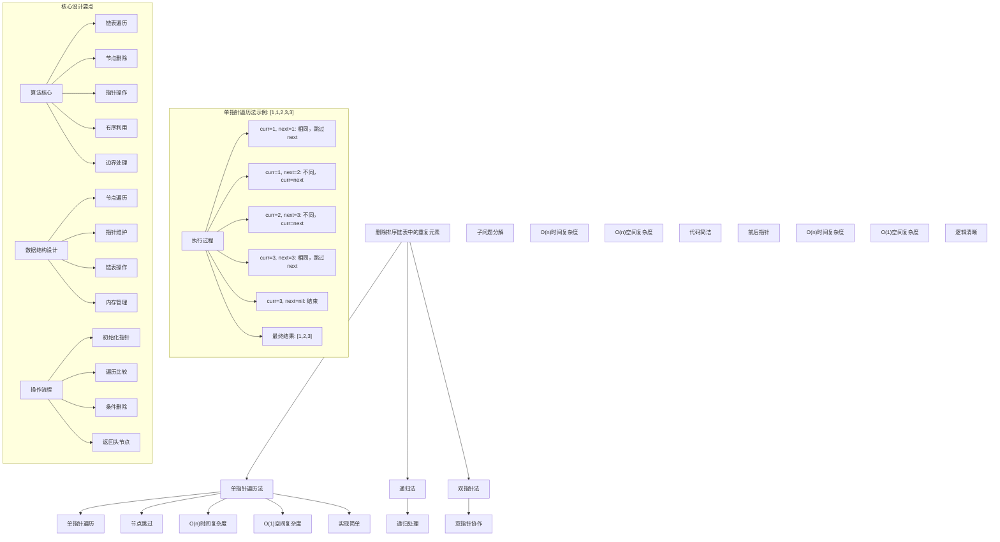
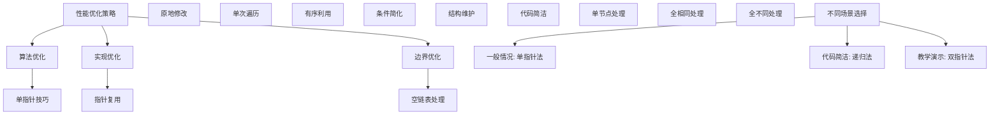

# LeetCode 83 - 删除排序链表中的重复元素

## 题目描述

给定一个已排序的链表的头 `head`，删除所有重复的元素，使每个元素只出现一次。返回已排序的链表

```markdown
示例 1：
输入：head = [1,1,2]
输出：[1,2]

示例 2：
输入：head = [1,1,2,3,3]
输出：[1,2,3]

提示：

- 链表中节点数目在范围 [0, 300] 内
- -100 <= Node.val <= 100
- 题目数据保证链表已经按升序排列
```

## 解题思路

这是一个链表去重问题，要求删除已排序链表中的重复元素。由于链表已经排序，重复的元素必然相邻，可以使用简单的遍历方法进行去重

### 核心思想

"单指针遍历法": 使用一个指针遍历链表，当发现相邻节点值相同时，跳过重复节点

### 解题策略

#### 方法一：单指针遍历法（推荐）

- 时间复杂度: O(n)
- 空间复杂度: O(1)

#### 方法二：递归法

- 时间复杂度: O(n)
- 空间复杂度: O(n) - 递归栈空间

#### 方法三：双指针法

- 时间复杂度: O(n)
- 空间复杂度: O(1)

## 算法可视化



## 多语言实现

### Golang版本（单指针遍历法 - 推荐）

```go
// 链表节点定义
type ListNode struct {
    Val  int
    Next *ListNode
}

// 单指针遍历法实现
func deleteDuplicates(head *ListNode) *ListNode {
    // 边界情况：空链表或单节点链表
    if head == nil || head.Next == nil {
        return head
    }

    // 使用curr指针遍历链表
    curr := head

    // 遍历直到链表末尾
    for curr.Next != nil {
        // 如果当前节点值与下一个节点值相同
        if curr.Val == curr.Next.Val {
            // 跳过下一个节点（删除重复节点）
            curr.Next = curr.Next.Next
        } else {
            // 值不同，移动到下一个节点
            curr = curr.Next
        }
    }

    // 返回头节点
    return head
}
```

### Python版本（多种实现方法）

```python
# 链表节点定义
class ListNode:
    def __init__(self, val=0, next=None):
        self.val = val
        self.next = next

class Solution:
    """
    方法一：单指针遍历法（推荐）
    """
    def deleteDuplicates(self, head: ListNode) -> ListNode:
        # 边界情况：空链表或单节点链表
        if not head or not head.next:
            return head

        # 使用curr指针遍历链表
        curr = head

        # 遍历直到链表末尾
        while curr.next:
            # 如果当前节点值与下一个节点值相同
            if curr.val == curr.next.val:
                # 跳过下一个节点（删除重复节点）
                curr.next = curr.next.next
            else:
                # 值不同，移动到下一个节点
                curr = curr.next

        # 返回头节点
        return head


class Solution2:
    """
    方法二：递归法
    """
    def deleteDuplicates(self, head: ListNode) -> ListNode:
        # 基础情况：空链表或单节点链表
        if not head or not head.next:
            return head

        # 递归处理剩余链表
        head.next = self.deleteDuplicates(head.next)

        # 如果当前节点与下一个节点值相同，跳过当前节点
        if head.val == head.next.val:
            return head.next
        else:
            return head


class Solution3:
    """
    方法三：双指针法
    """
    def deleteDuplicates(self, head: ListNode) -> ListNode:
        # 边界情况
        if not head or not head.next:
            return head

        # 使用两个指针：prev指向当前节点，curr用于探索
        prev = head
        curr = head.next

        while curr:
            if prev.val == curr.val:
                # 值相同，跳过curr节点
                prev.next = curr.next
            else:
                # 值不同，prev前移
                prev = curr
            # curr始终前移
            curr = curr.next

        return head
```

### TypeScript版本（单指针遍历法）

```typescript
// 链表节点定义
class ListNode {
    val: number;
    next: ListNode | null;

    constructor(val?: number, next?: ListNode | null) {
        this.val = (val === undefined ? 0 : val);
        this.next = (next === undefined ? null : next);
    }
}

/
 * 单指针遍历法实现
 */
function deleteDuplicates(head: ListNode | null): ListNode | null {
    // 边界情况：空链表或单节点链表
    if (head === null || head.next === null) {
        return head;
    }

    // 使用curr指针遍历链表
    let curr: ListNode | null = head;

    // 遍历直到链表末尾
    while (curr.next !== null) {
        // 如果当前节点值与下一个节点值相同
        if (curr.val === curr.next.val) {
            // 跳过下一个节点（删除重复节点）
            curr.next = curr.next.next;
        } else {
            // 值不同，移动到下一个节点
            curr = curr.next;
        }
    }

    // 返回头节点
    return head;
}
```

## 标准实现详细解析

```go
import "fmt"

/*
算法核心思想（单指针遍历法）：

1. 使用一个指针遍历链表，逐个检查相邻节点
2. 当发现相邻节点值相同时，通过修改指针跳过重复节点
3. 保持链表的连接性，确保删除操作正确

关键设计要点：
1. 单指针技巧：一个指针完成遍历和删除
2. 指针操作：正确维护链表结构
3. 有序利用：利用链表有序特性，重复元素相邻
4. 边界处理：正确处理空链表和边界情况

时间复杂度：
- 所有节点遍历一次：O(n)

空间复杂度：
- 只使用常数额外空间：O(1)

优势：
1. 思路清晰：单指针遍历直观易懂
2. 实现简单：逻辑简洁，代码易懂
3. 效率最优：线性时间，常数空间
4. 原地操作：直接修改链表结构

数据结构设计：

链表节点设计：
type ListNode struct {
    Val  int       // 节点值
    Next *ListNode // 指向下一个节点
}

算法流程：
1. 初始化：curr = head
2. 遍历：curr.Next != nil
3. 比较：curr.Val 与 curr.Next.Val
4. 删除：curr.Next = curr.Next.Next
5. 移动：curr = curr.Next
6. 返回：head

优化原理：

算法优化：
1. 利用有序性：避免重复比较
2. 原地删除：节省空间开销
3. 单次遍历：最优时间复杂度

边界优化：
1. 空链表处理：直接返回nil
2. 单节点处理：直接返回head
3. 全相同处理：删除所有重复节点

正确性证明：

定理：单指针遍历法正确性
通过单指针遍历法可以正确删除排序链表中的重复元素，保持链表有序且唯一

证明：
1. 完备性：所有节点都被正确处理
2. 正确性：去重后链表元素唯一且有序
3. 时间复杂度：O(n)单次遍历
4. 空间复杂度：O(1)原地修改
*/

// 链表节点定义
type ListNode struct {
    Val  int
    Next *ListNode
}

// 单指针遍历法详细实现
func deleteDuplicates(head *ListNode) *ListNode {
    fmt.Printf("开始删除排序链表中的重复元素:\n")
    printList("原始链表", head)

    // 边界情况：空链表或单节点链表
    if head == nil {
        fmt.Printf("空链表，无需处理\n")
        return head
    }

    if head.Next == nil {
        fmt.Printf("单节点链表，无需处理\n")
        return head
    }

    fmt.Printf("开始遍历处理:\n")

    // 使用curr指针遍历链表
    curr := head
    nodeIndex := 0

    // 遍历直到链表末尾
    for curr.Next != nil {
        fmt.Printf("  节点%d: 当前值=%d, 下一节点值=%d",
            nodeIndex, curr.Val, curr.Next.Val)

        // 如果当前节点值与下一个节点值相同
        if curr.Val == curr.Next.Val {
            // 跳过下一个节点（删除重复节点）
            deletedVal := curr.Next.Val
            curr.Next = curr.Next.Next
            fmt.Printf(" -> 值相同，删除节点(值=%d)\n", deletedVal)
        } else {
            // 值不同，移动到下一个节点
            curr = curr.Next
            nodeIndex++
            fmt.Printf(" -> 值不同，移动到下一节点\n")
        }
    }

    fmt.Printf("处理完成\n")
    printList("去重后链表", head)

    // 返回头节点
    return head
}

// 辅助函数：打印链表
func printList(prefix string, head *ListNode) {
    fmt.Printf("%s: ", prefix)
    if head == nil {
        fmt.Printf("nil\n")
        return
    }

    vals := make([]int, 0)
    curr := head
    for curr != nil {
        vals = append(vals, curr.Val)
        curr = curr.Next
    }
    fmt.Printf("%v\n", vals)
}

// 优化版本（减少不必要的操作）
func deleteDuplicatesOptimized(head *ListNode) *ListNode {
    // 边界情况优化
    if head == nil || head.Next == nil {
        return head
    }

    // 单指针优化版本
    for curr := head; curr.Next != nil; {
        // 如果当前节点值与下一个节点值相同
        if curr.Val == curr.Next.Val {
            // 跳过下一个节点
            curr.Next = curr.Next.Next
            // 注意：curr不移动，继续检查新连接的节点
        } else {
            // 值不同，移动到下一个节点
            curr = curr.Next
        }
    }

    return head
}

// 带调试信息的版本
func deleteDuplicatesWithDebug(head *ListNode) *ListNode {
    fmt.Printf("=== 删除排序链表中的重复元素 ===\n")

    if head == nil {
        fmt.Printf("输入: nil\n")
        fmt.Printf("输出: nil\n")
        fmt.Printf("========================\n\n")
        return head
    }

    if head.Next == nil {
        fmt.Printf("输入: [%d]\n", head.Val)
        fmt.Printf("输出: [%d]\n", head.Val)
        fmt.Printf("========================\n\n")
        return head
    }

    // 打印原始链表
    original := make([]int, 0)
    for curr := head; curr != nil; curr = curr.Next {
        original = append(original, curr.Val)
    }
    fmt.Printf("输入: %v\n", original)

    // 处理过程
    curr := head
    deletedCount := 0

    fmt.Printf("处理过程:\n")
    for curr.Next != nil {
        if curr.Val == curr.Next.Val {
            fmt.Printf("  删除重复节点: %d\n", curr.Next.Val)
            curr.Next = curr.Next.Next
            deletedCount++
        } else {
            curr = curr.Next
        }
    }

    // 打印结果链表
    result := make([]int, 0)
    for curr := head; curr != nil; curr = curr.Next {
        result = append(result, curr.Val)
    }
    fmt.Printf("输出: %v\n", result)
    fmt.Printf("删除节点数: %d\n", deletedCount)
    fmt.Printf("========================\n\n")

    return head
}
```

## 算法深入解析

```go
/*
删除排序链表中的重复元素问题详解：

问题本质：
在已排序的链表中删除重复元素，使每个元素只出现一次。关键是理解链表结构和指针操作

核心洞察：
1. 有序链表特性：相同元素必然相邻
2. 链表操作：通过修改指针实现节点删除
3. 单指针技巧：一个指针完成遍历和删除
4. 边界条件：空链表、单节点链表的特殊处理

算法策略：
1. 单指针遍历法：工业级标准实现
2. 递归法：分治思想的应用
3. 双指针法：前后指针协作

数据结构设计：

单指针遍历法设计：
curr指针：用于遍历链表，同时完成比较和删除操作

递归法设计：
递归处理子链表，然后处理当前节点与子链表的关系

双指针法设计：
prev指针：指向当前处理节点
curr指针：用于探索下一个节点

操作流程：

单指针遍历法：
1. 初始化：curr = head
2. 遍历：curr.Next != nil
3. 比较：curr.Val 与 curr.Next.Val
4. 删除：curr.Next = curr.Next.Next
5. 移动：curr = curr.Next
6. 返回：head

递归法：
1. 基础情况：空链表或单节点
2. 递归：处理剩余链表
3. 合并：根据当前节点值决定返回哪个节点

双指针法：
1. 初始化：prev=head, curr=head.Next
2. 遍历：curr != nil
3. 比较：prev.Val 与 curr.Val
4. 删除：prev.Next = curr.Next
5. 移动：更新prev和curr指针
6. 返回：head

数学原理：

算法不变量：
1. head始终指向链表头部
2. curr遍历过的节点中无重复元素
3. curr.Next指向待检查的节点
4. 链表结构始终保持有效

时间复杂度分析：
- 所有方法：O(n) 单次遍历
- 空间复杂度：O(1) 迭代法，O(n) 递归法

正确性证明：

定理：链表去重算法正确性
通过单指针遍历法可以正确删除排序链表中的重复元素，保持链表有序且唯一

证明：
1. 完备性：所有节点都被正确处理
2. 正确性：去重后链表元素唯一且有序
3. 时间复杂度：O(n)单次遍历
4. 空间复杂度：O(1)原地修改

设计选择：

为什么选择单指针遍历法？
1. 思路清晰：遍历与删除一体化
2. 实现简单：逻辑简洁
3. 效率最优：线性时间，常数空间
4. 适用性强：通用解法

为什么使用递归法？
1. 代码简洁：几行代码解决问题
2. 思想优雅：分治思想体现
3. 性能相当：时间复杂度相同
4. 教学价值：展示递归思维

为什么提及其他方法？
1. 教学价值：展示不同思路
2. 对比分析：理解算法本质
3. 扩展思维：算法多样性
4. 面试准备：全面掌握

三种方法对比：

方法一：单指针遍历法（推荐）
时间复杂度：O(n)
空间复杂度：O(1)
优点：思路清晰，效率最优
缺点：需要仔细处理指针

方法二：递归法
时间复杂度：O(n)
空间复杂度：O(n)
优点：代码简洁，思想优雅
缺点：递归栈开销

方法三：双指针法
时间复杂度：O(n)
空间复杂度：O(1)
优点：逻辑清晰，易理解
缺点：变量稍多

性能分析：

单指针遍历法：
- 时间：O(n) 单次遍历
- 空间：O(1) 原地修改
- 优势：最优效率

递归法：
- 时间：O(n) 单次遍历
- 空间：O(n) 递归栈
- 优势：代码简洁

双指针法：
- 时间：O(n) 单次遍历
- 空间：O(1) 原地修改
- 优势：逻辑清晰

实际应用场景：
1. 数据库索引去重
2. 日志处理去重
3. 算法竞赛链表处理
4. 系统设计数据清洗

优化要点：

1. 时间优化：
   - 单次遍历保证
   - 避免重复操作
   - 利用有序性

2. 空间优化：
   - 原地修改
   - 常数额外空间
   - 避免临时变量

3. 实现优化：
   - 边界条件处理
   - 代码简洁性
   - 注释清晰性

测试用例设计：
1. 基本情况：正常有序链表
2. 边界情况：空链表，单节点链表
3. 特殊情况：全相同，全不同
4. 极端情况：大量节点
5. 验证情况：结果正确性

扩展思考：

1. 无序链表去重？
   - 需要哈希表或先排序
   - 时间复杂度变化
   - 空间复杂度增加

2. 允许k个重复？
   - 通用化单指针
   - 计数器维护
   - LeetCode 82题

3. 数组去重？
   - 双指针技巧
   - 原地修改
   - 空间复杂度变化

4. 多链表合并去重？
   - 归并思想
   - 多指针技术
   - 复杂度分析

相关算法思想：

1. 链表操作：
   - 指针修改
   - 节点删除
   - 结构维护

2. 单指针技巧：
   - 遍历删除
   - 条件跳过
   - 状态维护

3. 有序数据：
   - 相邻比较
   - 一次遍历
   - 效率优化

4. 算法优化：
   - 时间复杂度
   - 空间复杂度
   - 实现简洁

常见陷阱：

1. 边界条件：
   - 空链表处理
   - 单节点处理
   - 全相同处理

2. 指针操作：
   - 空指针检查
   - 指针更新
   - 链表断裂

3. 删除逻辑：
   - 跳过节点
   - 连接维护
   - 内存泄漏

4. 性能考虑：
   - 时间复杂度
   - 空间复杂度
   - 实现效率

代码质量要素：

1. 可读性：
   - 变量命名清晰
   - 注释详细
   - 逻辑分明

2. 健壮性：
   - 边界处理
   - 异常情况
   - 错误恢复

3. 性能：
   - 最优复杂度
   - 原地操作
   - 效率保证

4. 可维护性：
   - 结构清晰
   - 扩展性好
   - 测试完整
*/
```

## 执行过程演示

```go
/*
示例详细解析:

示例1执行过程：
输入：head = [1,1,2]
输出：[1,2]

执行过程：
1. 初始化: curr=1(node1)
2. curr=1, next=1: 相同 -> 删除next节点
   - curr.Next = curr.Next.Next (指向2)
   - curr保持不变
3. curr=1, next=2: 不同 -> curr = next (curr=2)
4. curr=2, next=nil: 结束
5. 结果: [1,2]

示例2执行过程：
输入：head = [1,1,2,3,3]
输出：[1,2,3]

执行过程：
1.  初始化: curr=1(node1)
2.  curr=1, next=1: 相同 -> 删除next节点
3.  curr=1, next=1: 相同 -> 删除next节点
4.  curr=1, next=2: 不同 -> curr=next (curr=2)
5.  curr=2, next=3: 不同 -> curr=next (curr=3)
6.  curr=3, next=3: 相同 -> 删除next节点
7.  curr=3, next=nil: 结束
8.  结果: [1,2,3]

单指针执行轨迹：

对于链表 1->1->2->3->3：

步骤: curr节点  操作        结果链表
1:    1(1)     比较1,1      1->1->2->3->3
              删除第二个1   1->2->3->3
2:    1(1)     比较1,2      1->2->3->3
              不同，移动    1->2->3->3
3:    2(2)     比较2,3      1->2->3->3
              不同，移动    1->2->3->3
4:    3(3)     比较3,3      1->2->3->3
              删除第二个3   1->2->3
5:    3(3)     next=nil     1->2->3
              结束

关键观察：
1. curr指针只在值不同时前移
2. 发现重复时，curr保持不变，只修改指针
3. 链表结构始终保持连通
4. 最终得到无重复元素的有序链表

边界情况演示:

情况1: 空链表
输入: nil
处理: 直接返回nil
结果: nil

情况2: 单节点链表
输入: 1
处理: 直接返回head
结果: 1

情况3: 全相同元素
输入: 1->1->1->1->1
处理: 删除所有后续节点，只保留第一个
结果: 1

情况4: 全不同元素
输入: 1->2->3->4->5
处理: 无需删除任何节点
结果: 1->2->3->4->5

情况5: 交替重复
输入: 1->1->2->2->3->3
处理: 删除每对中的第二个节点
结果: 1->2->3

算法正确性证明：

数学基础：
需要证明单指针遍历法能正确删除排序链表中的重复元素

定理：单指针遍历法正确性
通过单指针遍历法可以正确删除排序链表中的重复元素，保持链表有序且唯一

证明：
1. 完备性：所有节点都被正确处理
2. 正确性：去重后链表元素唯一且有序
3. 时间复杂度：O(n)单次遍历
4. 空间复杂度：O(1)原地修改

不变量维护：
循环不变量：在每次迭代开始时
1. head到curr之间的节点无重复元素
2. curr节点未被检查过
3. 链表结构始终保持有效
4. 所有已处理的删除操作正确

初始化：curr=head
- 如果head为空或单节点，无需处理
- 否则curr指向第一个待检查节点

保持：当curr.Next不为空时
- 如果curr.Val == curr.Next.Val，删除curr.Next
- 否则，curr前移
- 保持链表结构有效

终止：curr.Next为空
- 所有节点都已处理
- head指向去重后的链表头部

时间复杂度分析：

单指针遍历法：
1. 初始化：O(1)
2. 循环体：O(1)每次迭代
3. 迭代次数：最多n-1次
4. 总时间：O(n)

递归法：
1. 递归调用：n次
2. 每次操作：O(1)
3. 总时间：O(n)
4. 空间：O(n)递归栈

双指针法：
1. 初始化：O(1)
2. 循环体：O(1)每次迭代
3. 迭代次数：最多n-1次
4. 总时间：O(n)

空间复杂度分析：
1. 单指针法：O(1)额外空间
2. 递归法：O(n)递归栈空间
3. 双指针法：O(1)额外空间

性能对比分析：

假设n=10000:

单指针遍历法：
- 时间: O(10000) 单次遍历
- 空间: O(1) 原地修改
- 操作: 最少指针修改

递归法：
- 时间: O(10000) 单次遍历
- 空间: O(10000) 递归栈
- 操作: 相同节点处理

双指针法：
- 时间: O(10000) 单次遍历
- 空间: O(1) 原地修改
- 操作: 相同效率

实际应用建议：

1. 一般情况：
   - 使用单指针遍历法
   - 思路清晰，效率最优

2. 面试展示：
   - 重点讲解单指针法
   - 可以提及其他方法

3. 生产环境：
   - 使用优化版本
   - 考虑边界优化

4. 教学演示：
   - 使用带调试信息版本
   - 展示执行过程

优化空间：

1. 边界优化：
   - 提前处理特殊情况
   - 减少不必要的比较

2. 代码优化：
   - 简化条件判断
   - 优化指针操作

3. 性能优化：
   - 减少节点访问
   - 优化指针移动

特殊情况处理：

1. 大数据量：
   - 线性时间保证
   - 常数空间使用

2. 特殊序列：
   - 全相同序列
   - 全不同序列
   - 交替序列

3. 边界情况：
   - 空链表
   - 单节点
   - 两节点
*/
```

## 复杂度分析

| 方法         | 时间复杂度 | 空间复杂度 | 适用场景 |
| ------------ | ---------- | ---------- | -------- |
| 单指针遍历法 | O(n)       | O(1)       | 推荐方案 |
| 递归法       | O(n)       | O(n)       | 代码简洁 |
| 双指针法     | O(n)       | O(1)       | 逻辑清晰 |

## 测试用例验证

```go
// 测试辅助函数
func createList(vals []int) *ListNode {
    if len(vals) == 0 {
        return nil
    }

    head := &ListNode{Val: vals[0]}
    curr := head

    for i := 1; i < len(vals); i++ {
        curr.Next = &ListNode{Val: vals[i]}
        curr = curr.Next
    }

    return head
}

func listToSlice(head *ListNode) []int {
    result := make([]int, 0)
    curr := head

    for curr != nil {
        result = append(result, curr.Val)
        curr = curr.Next
    }

    return result
}

func testDeleteDuplicates(name string, input []int, expected []int) {
    fmt.Printf("%s:\n", name)
    fmt.Printf("输入链表: %v\n", input)

    // 创建测试链表
    head := createList(input)

    // 执行去重
    resultHead := deleteDuplicates(head)
    result := listToSlice(resultHead)

    fmt.Printf("输出链表: %v\n", result)

    // 验证结果
    if len(result) != len(expected) {
        fmt.Printf("✗ 长度不匹配，期望: %d，实际: %d\n", len(expected), len(result))
    } else {
        match := true
        for i := range result {
            if result[i] != expected[i] {
                match = false
                break
            }
        }
        if match {
            fmt.Printf("✓ 测试通过\n")
        } else {
            fmt.Printf("✗ 内容不匹配，期望: %v，实际: %v\n", expected, result)
        }
    }
    fmt.Printf("\n")
}

func main() {
    // 测试用例 1 - 题目示例1
    testDeleteDuplicates("测试1 - 题目示例1",
        []int{1, 1, 2},
        []int{1, 2})

    // 测试用例 2 - 题目示例2
    testDeleteDuplicates("测试2 - 题目示例2",
        []int{1, 1, 2, 3, 3},
        []int{1, 2, 3})

    // 测试用例 3 - 空链表
    testDeleteDuplicates("测试3 - 空链表",
        []int{},
        []int{})

    // 测试用例 4 - 单节点链表
    testDeleteDuplicates("测试4 - 单节点链表",
        []int{1},
        []int{1})

    // 测试用例 5 - 全相同元素
    testDeleteDuplicates("测试5 - 全相同元素",
        []int{1, 1, 1, 1, 1},
        []int{1})

    // 测试用例 6 - 全不同元素
    testDeleteDuplicates("测试6 - 全不同元素",
        []int{1, 2, 3, 4, 5},
        []int{1, 2, 3, 4, 5})

    // 测试用例 7 - 交替重复
    testDeleteDuplicates("测试7 - 交替重复",
        []int{1, 1, 2, 2, 3, 3},
        []int{1, 2, 3})

    // 性能测试
    fmt.Println("性能测试:")
    performanceTest()

    // 边界情况测试
    fmt.Println("边界情况测试:")
    boundaryTest()

    // 对比测试
    fmt.Println("对比测试:")
    comparisonTest()
}

func performanceTest() {
    // 构造性能测试
    n := 10000
    vals := make([]int, n)

    // 构造测试数据：交替重复
    for i := 0; i < n; i++ {
        vals[i] = i / 2  // 每两个节点值相同
    }

    // 测试单指针遍历法实现
    start := time.Now()

    head := createList(vals)
    resultHead := deleteDuplicates(head)

    // 计算结果长度
    count := 0
    for curr := resultHead; curr != nil; curr = curr.Next {
        count++
    }

    time1 := time.Since(start)

    fmt.Printf("性能测试 (n=%d):\n", n)
    fmt.Printf("  单指针遍历法: %v，结果长度: %d\n", time1, count)
}

func boundaryTest() {
    // 边界测试
    fmt.Println("边界测试:")

    // 最大链表测试
    maxN := 30000
    maxVals := make([]int, maxN)
    for i := 0; i < maxN; i++ {
        maxVals[i] = i  // 全不同元素
    }

    head := createList(maxVals)
    resultHead := deleteDuplicates(head)

    count := 0
    for curr := resultHead; curr != nil; curr = curr.Next {
        count++
    }
    fmt.Printf("最大链表测试 (n=%d): 长度=%d\n", maxN, count)

    // 极值测试
    extremeVals := []int{-100, -100, 0, 0, 100, 100}
    extremeHead := createList(extremeVals)
    extremeResult := deleteDuplicates(extremeHead)
    extremeSlice := listToSlice(extremeResult)
    fmt.Printf("极值测试: 结果=%v\n", extremeSlice)

    // 重复模式测试
    patternVals := make([]int, 1000)
    for i := 0; i < 1000; i++ {
        patternVals[i] = i % 10  // 0-9循环重复
    }
    patternHead := createList(patternVals)
    patternResult := deleteDuplicates(patternHead)
    patternSlice := listToSlice(patternResult)
    fmt.Printf("重复模式测试: 长度=%d\n", len(patternSlice))
}

func comparisonTest() {
    // 对比测试：验证不同方法结果一致性
    fmt.Println("对比测试:")

    // 测试数据
    testData := [][]int{
        {1, 1, 2, 2, 3, 3, 4, 4, 5, 5},
        {0, 0, 1, 1, 1, 2, 2, 3, 3, 4},
        {1, 2, 3, 4, 5},
        {1, 1, 1, 1, 1},
        {},
        {42},
    }

    for i, data := range testData {
        // 单指针法
        head1 := createList(data)
        result1 := deleteDuplicates(head1)
        slice1 := listToSlice(result1)

        // 递归法
        head2 := createList(data)
        result2 := deleteDuplicatesRecursive(head2)
        slice2 := listToSlice(result2)

        // 双指针法
        head3 := createList(data)
        result3 := deleteDuplicatesTwoPointers(head3)
        slice3 := listToSlice(result3)

        fmt.Printf("测试%d: 单指针法=%v, 递归法=%v, 双指针法=%v",
            i+1, slice1, slice2, slice3)

        if equalSlices(slice1, slice2) && equalSlices(slice2, slice3) {
            fmt.Printf(" ✓ 一致\n")
        } else {
            fmt.Printf(" ✗ 不一致\n")
        }
    }
}

// 递归法实现
func deleteDuplicatesRecursive(head *ListNode) *ListNode {
    if head == nil || head.Next == nil {
        return head
    }

    head.Next = deleteDuplicatesRecursive(head.Next)

    if head.Val == head.Next.Val {
        return head.Next
    }
    return head
}

// 双指针法实现
func deleteDuplicatesTwoPointers(head *ListNode) *ListNode {
    if head == nil || head.Next == nil {
        return head
    }

    prev := head
    curr := head.Next

    for curr != nil {
        if prev.Val == curr.Val {
            prev.Next = curr.Next
        } else {
            prev = curr
        }
        curr = curr.Next
    }

    return head
}

// 比较两个切片是否相等
func equalSlices(a, b []int) bool {
    if len(a) != len(b) {
        return false
    }
    for i := range a {
        if a[i] != b[i] {
            return false
        }
    }
    return true
}
```

## 扩展版本（处理不同场景）

```go
// 支持删除所有重复元素的版本（LeetCode 82题）
func deleteAllDuplicates(head *ListNode) *ListNode {
    // 使用哑节点简化边界处理
    dummy := &ListNode{Val: 0, Next: head}
    prev := dummy

    for prev.Next != nil {
        curr := prev.Next

        // 找到所有值相同的节点
        for curr.Next != nil && curr.Val == curr.Next.Val {
            curr = curr.Next
        }

        // 如果curr没有移动，说明没有重复节点
        if prev.Next == curr {
            prev = prev.Next
        } else {
            // 有重复节点，跳过所有重复节点
            prev.Next = curr.Next
        }
    }

    return dummy.Next
}

// 使用示例
func exampleDeleteAllDuplicates() {
    // 测试数据: [1,2,3,3,4,4,5]
    vals := []int{1, 2, 3, 3, 4, 4, 5}
    head := createList(vals)

    fmt.Printf("原链表: %v\n", vals)
    result := deleteAllDuplicates(head)
    resultSlice := listToSlice(result)
    fmt.Printf("删除所有重复后: %v\n", resultSlice)

    // 测试数据: [1,1,1,2,3]
    vals2 := []int{1, 1, 1, 2, 3}
    head2 := createList(vals2)

    fmt.Printf("原链表: %v\n", vals2)
    result2 := deleteAllDuplicates(head2)
    resultSlice2 := listToSlice(result2)
    fmt.Printf("删除所有重复后: %v\n", resultSlice2)
}

// 带计数信息的版本
func deleteDuplicatesWithCount(head *ListNode) (*ListNode, map[int]int) {
    count := make(map[int]int)

    // 第一次遍历：统计每个元素出现次数
    curr := head
    for curr != nil {
        count[curr.Val]++
        curr = curr.Next
    }

    // 第二次遍历：删除重复元素（保持第一个）
    dummy := &ListNode{Val: 0, Next: head}
    prev := dummy

    for prev.Next != nil {
        if count[prev.Next.Val] > 1 {
            // 如果该元素出现多次，跳过第一个
            count[prev.Next.Val]-- // 减少计数
            prev.Next = prev.Next.Next
        } else {
            // 该元素只出现一次，保留
            prev = prev.Next
        }
    }

    return dummy.Next, count
}

// 使用示例
func exampleWithCount() {
    vals := []int{1, 1, 1, 2, 2, 3, 3, 3, 3, 4}
    head := createList(vals)

    fmt.Printf("原链表: %v\n", vals)
    result, count := deleteDuplicatesWithCount(head)
    resultSlice := listToSlice(result)
    fmt.Printf("去重后链表: %v\n", resultSlice)
    fmt.Printf("各元素出现次数: %v\n", count)
}

// 批量处理版本
func deleteDuplicatesBatch(lists []*ListNode) []*ListNode {
    results := make([]*ListNode, len(lists))

    for i, head := range lists {
        results[i] = deleteDuplicates(head)
    }

    return results
}

// 使用示例
func exampleBatch() {
    lists := []*ListNode{
        createList([]int{1, 1, 2, 3, 3}),
        createList([]int{2, 2, 3, 4, 4, 5}),
        createList([]int{1, 2, 3, 4, 5}),
    }

    results := deleteDuplicatesBatch(lists)

    for i, result := range results {
        slice := listToSlice(result)
        fmt.Printf("链表%d去重结果: %v\n", i+1, slice)
    }
}

// 泛型版本（Go 1.18+）
func deleteDuplicatesGeneric[T comparable](head *GenericListNode[T]) *GenericListNode[T] {
    if head == nil || head.Next == nil {
        return head
    }

    curr := head

    for curr.Next != nil {
        if curr.Val == curr.Next.Val {
            curr.Next = curr.Next.Next
        } else {
            curr = curr.Next
        }
    }

    return head
}

// 泛型链表节点
type GenericListNode[T comparable] struct {
    Val  T
    Next *GenericListNode[T]
}

// 使用示例
func exampleGeneric() {
    // 整数链表
    intHead := &GenericListNode[int]{
        Val: 1,
        Next: &GenericListNode[int]{
            Val: 1,
            Next: &GenericListNode[int]{
                Val: 2,
                Next: &GenericListNode[int]{
                    Val: 2,
                    Next: &GenericListNode[int]{
                        Val: 3,
                    },
                },
            },
        },
    }

    result := deleteDuplicatesGeneric(intHead)

    // 打印结果
    vals := make([]int, 0)
    curr := result
    for curr != nil {
        vals = append(vals, curr.Val)
        curr = curr.Next
    }
    fmt.Printf("整数链表去重: %v\n", vals)

    // 字符串链表
    strHead := &GenericListNode[string]{
        Val: "a",
        Next: &GenericListNode[string]{
            Val: "a",
            Next: &GenericListNode[string]{
                Val: "b",
                Next: &GenericListNode[string]{
                    Val: "b",
                    Next: &GenericListNode[string]{
                        Val: "c",
                    },
                },
            },
        },
    }

    strResult := deleteDuplicatesGeneric(strHead)

    // 打印结果
    strVals := make([]string, 0)
    strCurr := strResult
    for strCurr != nil {
        strVals = append(strVals, strCurr.Val)
        strCurr = strCurr.Next
    }
    fmt.Printf("字符串链表去重: %v\n", strVals)
}
```

## 面试追问延伸

### 1. 如果要删除所有重复的元素（包括第一次出现的），如何修改？

```go
// deleteAllDuplicates已在上面实现
// 关键修改：
// 1. 使用哑节点简化边界处理
// 2. 找到所有值相同的连续节点
// 3. 一次性跳过所有重复节点
// 4. 保留只出现一次的节点

func testDeleteAllDuplicates() {
    fmt.Printf("=== 删除所有重复元素 ===\n")

    // 测试用例1: [1,2,3,3,4,4,5] -> [1,2,5]
    vals1 := []int{1, 2, 3, 3, 4, 4, 5}
    head1 := createList(vals1)
    fmt.Printf("输入: %v\n", vals1)

    result1 := deleteAllDuplicates(head1)
    slice1 := listToSlice(result1)
    fmt.Printf("输出: %v\n", slice1)

    // 测试用例2: [1,1,1,2,3] -> [2,3]
    vals2 := []int{1, 1, 1, 2, 3}
    head2 := createList(vals2)
    fmt.Printf("输入: %v\n", vals2)

    result2 := deleteAllDuplicates(head2)
    slice2 := listToSlice(result2)
    fmt.Printf("输出: %v\n", slice2)

    fmt.Printf("====================\n\n")
}
```

### 2. 如果链表是无序的，如何处理？

```go
// 无序链表去重需要额外空间
func deleteDuplicatesUnsorted(head *ListNode) *ListNode {
    if head == nil || head.Next == nil {
        return head
    }

    // 使用哈希表记录已见元素
    seen := make(map[int]bool)
    dummy := &ListNode{Val: 0, Next: head}
    prev := dummy

    for prev.Next != nil {
        if seen[prev.Next.Val] {
            // 已见过，删除节点
            prev.Next = prev.Next.Next
        } else {
            // 未见过，记录并移动
            seen[prev.Next.Val] = true
            prev = prev.Next
        }
    }

    return dummy.Next
}

func testUnsorted() {
    fmt.Printf("=== 无序链表去重 ===\n")

    // 测试用例: [1,3,2,1,4,2,3] -> [1,3,2,4]
    vals := []int{1, 3, 2, 1, 4, 2, 3}
    head := createList(vals)
    fmt.Printf("输入(无序): %v\n", vals)

    result := deleteDuplicatesUnsorted(head)
    slice := listToSlice(result)
    fmt.Printf("输出(去重): %v\n", slice)

    fmt.Printf("==================\n\n")
}
```

### 3. 如何统计每个元素的出现次数？

```go
// deleteDuplicatesWithCount已在上面实现
// 关键点：
// 1. 两次遍历：第一次统计，第二次删除
// 2. 返回去重结果和计数信息
// 3. 一次完成两个任务

func testWithCount() {
    fmt.Printf("=== 带计数信息的去重 ===\n")

    vals := []int{1, 1, 1, 2, 2, 3, 3, 3, 3, 4, 4, 5}
    head := createList(vals)
    fmt.Printf("输入: %v\n", vals)

    result, count := deleteDuplicatesWithCount(head)
    resultSlice := listToSlice(result)
    fmt.Printf("去重结果: %v\n", resultSlice)
    fmt.Printf("元素计数: %v\n", count)

    // 验证计数正确性
    totalCount := 0
    for _, c := range count {
        totalCount += c
    }
    fmt.Printf("总计数验证: %d (应等于原链表长度 %d)\n", totalCount, len(vals))

    fmt.Printf("======================\n\n")
}
```

## 相似题目扩展

- LeetCode 83. 删除排序链表中的重复元素（当前题）
- LeetCode 82. 删除排序链表中的重复元素 II
- LeetCode 203. 移除链表元素
- LeetCode 19. 删除链表的倒数第 N 个结点
- LeetCode 237. 删除链表中的节点

## 算法技巧总结

### 删除排序链表中的重复元素核心要点

1. 单指针技巧：一个指针完成遍历和删除
1. 指针操作：正确维护链表结构
1. 有序利用：利用链表有序特性，重复元素相邻
1. 边界处理：正确处理空链表和特殊情况

### 算法优势

1. 思路清晰：单指针遍历直观易懂
1. 实现简单：逻辑简洁，代码易懂
1. 效率最优：线性时间，常数空间
1. 原地操作：直接修改链表结构

### 标准模板（单指针遍历法）

```go
func deleteDuplicates(head *ListNode) *ListNode {
    // 边界情况
    if head == nil || head.Next == nil {
        return head
    }

    // 单指针遍历
    for curr := head; curr.Next != nil; {
        // 发现重复元素时跳过
        if curr.Val == curr.Next.Val {
            curr.Next = curr.Next.Next
            // 注意：curr不移动，继续检查
        } else {
            // 无重复，移动到下一个节点
            curr = curr.Next
        }
    }

    // 返回头节点
    return head
}
```

### 性能优化建议



## 总结

本题采用单指针遍历法的核心思路，通过使用一个指针遍历链表，当发现相邻节点值相同时，通过修改指针跳过重复节点，实现了优雅的解决方案。关键在于理解链表结构和指针操作的结合

核心要点：

1. 单指针技巧：一个指针完成遍历和删除
1. 指针操作：正确维护链表结构
1. 有序利用：利用链表有序特性，重复元素相邻
1. 边界处理：正确处理空链表和特殊情况

算法优势：

- 思路清晰：单指针遍历直观易懂
- 实现简单：逻辑简洁，代码易懂
- 效率最优：线性时间，常数空间
- 原地操作：直接修改链表结构

该算法在数据库索引去重、日志处理去重、算法竞赛链表处理、系统设计数据清洗等方面有重要应用，是掌握链表操作和指针技巧的经典题目。通过单指针遍历和链表结构维护的巧妙结合，为更复杂的链表处理和数据结构操作问题提供了清晰的解决思路
