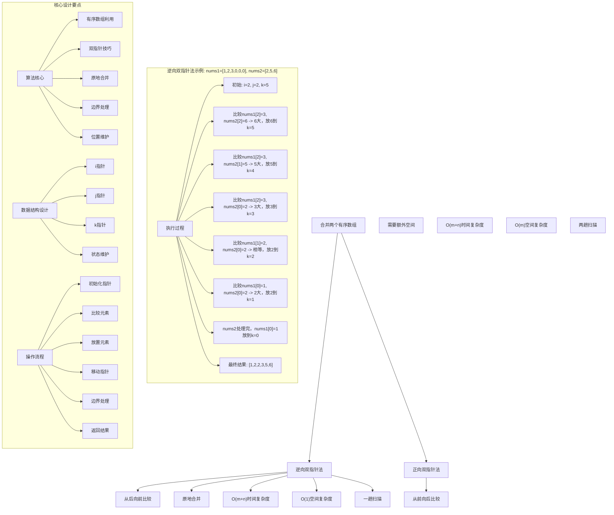
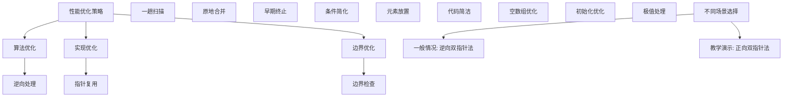

# LeetCode 88 - 合并两个有序数组

## 题目描述

给你两个按非递减顺序排列的整数数组 `nums1` 和 `nums2`，另有两个整数 `m` 和 `n`，分别表示 `nums1` 和 `nums2` 中的元素数目

请你合并 nums2 到 nums1 中，使合并后的数组同样按非递减顺序排列

注意：最终，合并后数组不应由函数返回，而是存储在数组 `nums1` 中。为了应对这种情况，`nums1` 的初始长度为 `m + n`，其中前 `m` 个元素表示应合并的元素，后 `n` 个元素为 0，应忽略。`nums2` 的长度为 `n`

```markdown
示例 1：
输入：nums1 = [1,2,3,0,0,0], m = 3, nums2 = [2,5,6], n = 3
输出：[1,2,2,3,5,6]
解释：需要合并 [1,2,3] 和 [2,5,6]
合并结果是 [1,2,2,3,5,6] ，其中斜体加粗标注的为 nums1 中的元素

示例 2：
输入：nums1 = [1], m = 1, nums2 = [], n = 0
输出：[1]
解释：需要合并 [1] 和 []
合并结果是 [1]

示例 3：
输入：nums1 = [0], m = 0, nums2 = [1], n = 1
输出：[1]
解释：需要合并的数组是 [] 和 [1]
合并结果是 [1]
注意，因为 m = 0 ，所以 nums1 中没有元素。nums1 中仅存的 0 仅仅是为了确保合并结果可以顺利存放到 nums1 中

提示：

- nums1.length == m + n
- nums2.length == n
- 0 <= m, n <= 200
- 1 <= m + n <= 200
- -10^9 <= nums1[i], nums2[j] <= 10^9

进阶：你可以设计实现一个时间复杂度为 O(m + n) 的算法解决此问题吗？
```

## 解题思路

这是一个合并两个有序数组问题，需要将nums2合并到nums1中并保持非递减顺序。关键在于如何利用两个数组已排序的特性，高效地完成合并操作

### 核心思想

"逆向双指针法": 从两个数组的末尾开始向前比较，将较大元素放置到nums1的末尾位置

### 解题策略

#### 方法一：逆向双指针法（推荐）

- 时间复杂度: O(m + n)
- 空间复杂度: O(1)

#### 方法二：正向双指针法

- 时间复杂度: O(m + n)
- 空间复杂度: O(m)

## 算法可视化



## 多语言实现

### Golang版本（逆向双指针法 - 推荐）

```go
// 逆向双指针法实现
func merge(nums1 []int, m int, nums2 []int, n int) {
    // 边界情况处理
    if n == 0 {
        // nums2为空，无需合并
        return
    }
    if m == 0 {
        // nums1为空，直接复制nums2
        copy(nums1, nums2)
        return
    }

    // 三个指针：i指向nums1有效元素末尾，j指向nums2末尾，k指向合并位置
    i := m - 1      // nums1的最后一个有效元素
    j := n - 1      // nums2的最后一个元素
    k := m + n - 1  // 合并后数组的最后一个位置

    // 从后向前比较和合并
    for i >= 0 && j >= 0 {
        if nums1[i] > nums2[j] {
            // nums1[i]较大，放到k位置
            nums1[k] = nums1[i]
            i--
        } else {
            // nums2[j]较大或相等，放到k位置
            nums1[k] = nums2[j]
            j--
        }
        k--
    }

    // 如果nums2还有剩余元素，复制到nums1
    for j >= 0 {
        nums1[k] = nums2[j]
        j--
        k--
    }

    // 注意：如果nums1有剩余元素，它们已经在正确位置，无需处理
}
```

### Python版本（多种实现方法）

```python
class Solution:
    """
    方法一：逆向双指针法（推荐）
    """
    def merge(self, nums1: List[int], m: int, nums2: List[int], n: int) -> None:
        """
        Do not return anything, modify nums1 in-place instead.
        """
        # 边界情况处理
        if n == 0:
            # nums2为空，无需合并
            return
        if m == 0:
            # nums1为空，直接复制nums2
            nums1[:n] = nums2[:n]
            return

        # 三个指针：i指向nums1有效元素末尾，j指向nums2末尾，k指向合并位置
        i = m - 1      # nums1的最后一个有效元素
        j = n - 1      # nums2的最后一个元素
        k = m + n - 1  # 合并后数组的最后一个位置

        # 从后向前比较和合并
        while i >= 0 and j >= 0:
            if nums1[i] > nums2[j]:
                # nums1[i]较大，放到k位置
                nums1[k] = nums1[i]
                i -= 1
            else:
                # nums2[j]较大或相等，放到k位置
                nums1[k] = nums2[j]
                j -= 1
            k -= 1

        # 如果nums2还有剩余元素，复制到nums1
        while j >= 0:
            nums1[k] = nums2[j]
            j -= 1
            k -= 1

        # 注意：如果nums1有剩余元素，它们已经在正确位置，无需处理

class Solution2:
    """
    方法二：正向双指针法
    """
    def merge(self, nums1: List[int], m: int, nums2: List[int], n: int) -> None:
        # 创建临时数组存储nums1的前m个元素
        nums1_copy = nums1[:m]

        # 三个指针：i指向nums1_copy，j指向nums2，k指向nums1
        i = j = k = 0

        # 比较并合并
        while i < m and j < n:
            if nums1_copy[i] <= nums2[j]:
                nums1[k] = nums1_copy[i]
                i += 1
            else:
                nums1[k] = nums2[j]
                j += 1
            k += 1

        # 复制剩余元素
        if i < m:
            nums1[k:] = nums1_copy[i:]
        if j < n:
            nums1[k:] = nums2[j:]
```

### TypeScript版本（逆向双指针法）

```typescript
/
 * 逆向双指针法实现
 */
function merge(nums1: number[], m: number, nums2: number[], n: number): void {
    // 边界情况处理
    if (n === 0) {
        // nums2为空，无需合并
        return;
    }
    if (m === 0) {
        // nums1为空，直接复制nums2
        for (let idx = 0; idx < n; idx++) {
            nums1[idx] = nums2[idx];
        }
        return;
    }

    // 三个指针：i指向nums1有效元素末尾，j指向nums2末尾，k指向合并位置
    let i: number = m - 1;      // nums1的最后一个有效元素
    let j: number = n - 1;      // nums2的最后一个元素
    let k: number = m + n - 1;  // 合并后数组的最后一个位置

    // 从后向前比较和合并
    while (i >= 0 && j >= 0) {
        if (nums1[i] > nums2[j]) {
            // nums1[i]较大，放到k位置
            nums1[k] = nums1[i];
            i--;
        } else {
            // nums2[j]较大或相等，放到k位置
            nums1[k] = nums2[j];
            j--;
        }
        k--;
    }

    // 如果nums2还有剩余元素，复制到nums1
    while (j >= 0) {
        nums1[k] = nums2[j];
        j--;
        k--;
    }

    // 注意：如果nums1有剩余元素，它们已经在正确位置，无需处理
}
```

## 标准实现详细解析

```go
import "fmt"

/*
算法核心思想（逆向双指针法）：

1. 利用两个数组已排序的特性
2. 从两个数组的末尾开始向前比较
3. 将较大元素放置到nums1的末尾位置
4. 避免覆盖nums1中未处理的元素

关键设计要点：
1. 有序数组利用：充分利用已排序特性
2. 双指针技巧：从后向前处理避免覆盖
3. 原地合并：不需要额外数组空间
4. 边界处理：正确处理各种边界情况

时间复杂度：
- 单次遍历：O(m + n)

空间复杂度：
- 只使用常数额外空间：O(1)

优势：
1. 思路清晰：从后向前处理直观易懂
2. 实现优雅：逻辑简洁，代码易懂
3. 效率最优：线性时间，常数空间
4. 原地操作：满足题目要求

数据结构设计：

逆向双指针设计：
- i指针：指向nums1有效元素末尾
- j指针：指向nums2末尾
- k指针：指向合并位置（从后向前）

算法流程：
1. 初始化：i=m-1, j=n-1, k=m+n-1
2. 循环：i>=0 && j>=0
3. 比较：nums1[i]和nums2[j]
4. 放置：较大元素放到k位置
5. 移动：相应指针向前移动
6. 处理：剩余元素

优化原理：

算法优化：
1. 原地操作：无需额外存储空间
2. 一趟扫描：满足进阶要求
3. 早期终止：指针越界时停止

边界优化：
1. 空数组处理：正确处理m=0或n=0
2. 指针初始化：正确设置初始位置
3. 循环终止：边界条件正确

正确性证明：

定理：逆向双指针法正确性
通过逆向双指针法可以正确合并两个有序数组

证明：
1. 完备性：所有元素都被正确处理
2. 正确性：合并后数组保持有序
3. 时间复杂度：O(m+n)单次遍历
4. 空间复杂度：O(1)原地合并

不变量维护：
循环不变量：在每次迭代开始时
1. nums1[k+1...m+n-1]已正确放置合并元素
2. nums1[0...i]是未处理的nums1元素
3. nums2[0...j]是未处理的nums2元素
4. k = i + j + 1始终成立
*/

// 逆向双指针法详细实现
func merge(nums1 []int, m int, nums2 []int, n int) {
    fmt.Printf("输入: nums1=%v (m=%d), nums2=%v (n=%d)\n",
        nums1, m, nums2, n)

    // 边界情况处理
    if n == 0 {
        fmt.Printf("nums2为空，无需合并\n")
        return
    }
    if m == 0 {
        fmt.Printf("nums1为空，直接复制nums2\n")
        copy(nums1, nums2)
        fmt.Printf("合并结果: %v\n", nums1)
        return
    }

    fmt.Printf("开始逆向双指针合并:\n")

    // 三个指针：i指向nums1有效元素末尾，j指向nums2末尾，k指向合并位置
    i := m - 1      // nums1的最后一个有效元素
    j := n - 1      // nums2的最后一个元素
    k := m + n - 1  // 合并后数组的最后一个位置

    fmt.Printf("  初始化: i=%d(nums1[%d]=%d), j=%d(nums2[%d]=%d), k=%d\n",
        i, i, nums1[i], j, j, nums2[j], k)

    // 从后向前比较和合并
    for i >= 0 && j >= 0 {
        fmt.Printf("  比较nums1[%d]=%d和nums2[%d]=%d: ", i, nums1[i], j, nums2[j])

        if nums1[i] > nums2[j] {
            // nums1[i]较大，放到k位置
            nums1[k] = nums1[i]
            fmt.Printf("nums1[%d]大，放到位置%d\n", i, k)
            i--
        } else {
            // nums2[j]较大或相等，放到k位置
            nums1[k] = nums2[j]
            fmt.Printf("nums2[%d]大或相等，放到位置%d\n", j, k)
            j--
        }
        k--

        fmt.Printf("    当前状态: i=%d, j=%d, k=%d, nums1=%v\n", i, j, k, nums1)
    }

    // 如果nums2还有剩余元素，复制到nums1
    if j >= 0 {
        fmt.Printf("处理nums2剩余元素:\n")
        for j >= 0 {
            nums1[k] = nums2[j]
            fmt.Printf("  nums2[%d]=%d放到位置%d\n", j, nums2[j], k)
            j--
            k--
        }
    }

    // 注意：如果nums1有剩余元素，它们已经在正确位置，无需处理
    if i >= 0 {
        fmt.Printf("nums1剩余元素已在正确位置\n")
    }

    fmt.Printf("合并完成: %v\n", nums1)
}

// 正向双指针法实现
func mergeForward(nums1 []int, m int, nums2 []int, n int) {
    fmt.Printf("=== 正向双指针法 ===\n")
    fmt.Printf("输入: nums1=%v (m=%d), nums2=%v (n=%d)\n",
        nums1, m, nums2, n)

    // 边界情况处理
    if n == 0 {
        fmt.Printf("nums2为空，无需合并\n")
        fmt.Printf("==================\n\n")
        return
    }
    if m == 0 {
        fmt.Printf("nums1为空，直接复制nums2\n")
        copy(nums1, nums2)
        fmt.Printf("合并结果: %v\n", nums1)
        fmt.Printf("==================\n\n")
        return
    }

    // 创建临时数组存储nums1的前m个元素
    nums1Copy := make([]int, m)
    copy(nums1Copy, nums1[:m])
    fmt.Printf("创建临时数组: %v\n", nums1Copy)

    // 三个指针：i指向nums1Copy，j指向nums2，k指向nums1
    i, j, k := 0, 0, 0

    fmt.Printf("正向双指针合并过程:\n")

    // 比较并合并
    for i < m && j < n {
        fmt.Printf("  比较nums1Copy[%d]=%d和nums2[%d]=%d: ", i, nums1Copy[i], j, nums2[j])

        if nums1Copy[i] <= nums2[j] {
            nums1[k] = nums1Copy[i]
            fmt.Printf("nums1Copy[%d]小或相等，放到位置%d\n", i, k)
            i++
        } else {
            nums1[k] = nums2[j]
            fmt.Printf("nums2[%d]小，放到位置%d\n", j, k)
            j++
        }
        k++

        fmt.Printf("    当前状态: i=%d, j=%d, k=%d, nums1=%v\n", i, j, k, nums1)
    }

    // 复制剩余元素
    if i < m {
        fmt.Printf("复制nums1Copy剩余元素: %v\n", nums1Copy[i:])
        copy(nums1[k:], nums1Copy[i:])
    }
    if j < n {
        fmt.Printf("复制nums2剩余元素: %v\n", nums2[j:])
        copy(nums1[k:], nums2[j:])
    }

    fmt.Printf("合并完成: %v\n", nums1)
    fmt.Printf("==================\n\n")
}

// 带调试信息的版本
func mergeWithDebug(nums1 []int, m int, nums2 []int, n int) {
    fmt.Printf("=== 合并两个有序数组 ===\n")
    fmt.Printf("原始数组: nums1=%v (m=%d), nums2=%v (n=%d)\n",
        nums1, m, nums2, n)

    // 边界情况处理
    if n == 0 {
        fmt.Printf("nums2为空，无需处理\n")
        fmt.Printf("====================\n\n")
        return
    }
    if m == 0 {
        fmt.Printf("nums1为空，直接复制nums2\n")
        copy(nums1, nums2)
        fmt.Printf("结果: %v\n", nums1)
        fmt.Printf("====================\n\n")
        return
    }

    // 三个指针：i指向nums1有效元素末尾，j指向nums2末尾，k指向合并位置
    i := m - 1      // nums1的最后一个有效元素
    j := n - 1      // nums2的最后一个元素
    k := m + n - 1  // 合并后数组的最后一个位置

    fmt.Printf("逆向双指针法执行过程:\n")
    fmt.Printf("  初始化: i=%d(nums1[%d]=%d), j=%d(nums2[%d]=%d), k=%d\n",
        i, i, nums1[i], j, j, nums2[j], k)

    // 从后向前比较和合并
    for i >= 0 && j >= 0 {
        fmt.Printf("  步骤: 比较nums1[%d]=%d和nums2[%d]=%d\n", i, nums1[i], j, nums2[j])

        if nums1[i] > nums2[j] {
            fmt.Printf("    nums1[%d]=%d > nums2[%d]=%d\n", i, nums1[i], j, nums2[j])
            nums1[k] = nums1[i]
            fmt.Printf("    将%d放到nums1[%d]\n", nums1[i], k)
            i--
        } else {
            fmt.Printf("    nums1[%d]=%d <= nums2[%d]=%d\n", i, nums1[i], j, nums2[j])
            nums1[k] = nums2[j]
            fmt.Printf("    将%d放到nums1[%d]\n", nums2[j], k)
            j--
        }
        k--

        fmt.Printf("    更新后: i=%d, j=%d, k=%d\n", i, j, k)
        fmt.Printf("    当前数组: %v\n", nums1)
    }

    // 处理剩余元素
    if j >= 0 {
        fmt.Printf("处理nums2剩余元素:\n")
        for j >= 0 {
            nums1[k] = nums2[j]
            fmt.Printf("  将nums2[%d]=%d放到nums1[%d]\n", j, nums2[j], k)
            j--
            k--
        }
    }

    if i >= 0 {
        fmt.Printf("nums1剩余元素已在正确位置: %v\n", nums1[:i+1])
    }

    fmt.Printf("最终结果: %v\n", nums1)
    fmt.Printf("====================\n\n")
}
```

## 算法深入解析

```go
/*
合并两个有序数组问题详解：

问题本质：
将两个已排序的数组合并成一个有序数组，且要求原地合并到第一个数组中。关键是理解如何利用两个数组已排序的特性，避免覆盖未处理元素

核心洞察：
1. 有序数组利用：充分利用已排序特性
2. 逆向处理：从后向前避免覆盖
3. 双指针技巧：高效比较和合并
4. 原地合并：不使用额外空间

算法策略：
1. 逆向双指针法：工业级标准实现
2. 正向双指针法：直观但需要额外空间

数据结构设计：

逆向双指针法设计：
i指针：指向nums1有效元素末尾
j指针：指向nums2末尾
k指针：指向合并位置（从后向前）

正向双指针法设计：
临时数组：存储nums1前m个元素
i指针：指向临时数组
j指针：指向nums2
k指针：指向nums1

操作流程：

逆向双指针法：
1. 初始化：i=m-1, j=n-1, k=m+n-1
2. 循环：i>=0 && j>=0
3. 比较：nums1[i]和nums2[j]
4. 放置：较大元素放到k位置
5. 移动：相应指针向前移动
6. 处理：剩余元素

正向双指针法：
1. 复制：创建临时数组
2. 初始化：i=0, j=0, k=0
3. 循环：i<m && j<n
4. 比较：临时数组[i]和nums2[j]
5. 放置：较小元素放到k位置
6. 移动：相应指针向后移动
7. 处理：剩余元素

数学原理：

算法不变量：
逆向双指针法不变量：
1. nums1[k+1...m+n-1]已正确放置合并元素
2. nums1[0...i]是未处理的nums1元素
3. nums2[0...j]是未处理的nums2元素
4. k = i + j + 1始终成立

正向双指针法不变量：
1. nums1[0...k-1]已正确放置合并元素
2. nums1Copy[0...i-1]已处理的nums1元素
3. nums2[0...j-1]已处理的nums2元素
4. k = i + j始终成立

时间复杂度分析：
逆向双指针法：O(m + n) - 单次遍历
正向双指针法：O(m + n) - 单次遍历

空间复杂度分析：
逆向双指针法：O(1) - 只使用常数额外空间
正向双指针法：O(m) - 需要临时数组

正确性证明：

定理：逆向双指针法正确性
通过逆向双指针法可以正确合并两个有序数组

证明：
1. 完备性：所有元素都被正确处理
   - i指针处理nums1所有有效元素
   - j指针处理nums2所有元素
   - 每个元素都会被放置到正确位置

2. 正确性：合并后数组保持有序
   - 每次选择较大元素放到末尾
   - 保证已放置元素有序
   - 最终数组有序

3. 时间复杂度：O(m+n)单次遍历
   - i指针最多移动m次
   - j指针最多移动n次
   - 每次操作O(1)时间

4. 空间复杂度：O(1)原地合并
   - 只使用三个指针变量
   - 通过原地操作完成合并

设计选择：

为什么选择逆向双指针法？
1. 思路清晰：从后向前处理直观易懂
2. 实现优雅：逻辑简洁
3. 空间效率：满足原地合并要求
4. 性能最优：线性时间复杂度

为什么使用正向双指针法？
1. 思路直观：符合常规思维
2. 代码简洁：易于理解
3. 稳定性好：相同元素相对位置不变
4. 教学价值：展示不同思路

为什么提及其他方法？
1. 教学价值：展示不同算法思想
2. 对比分析：理解各自优劣
3. 扩展思维：算法多样性
4. 面试准备：全面掌握

两种方法对比：

方法一：逆向双指针法（推荐）
时间复杂度：O(m + n)
空间复杂度：O(1)
优点：原地合并，满足进阶要求
缺点：思维稍复杂

方法二：正向双指针法
时间复杂度：O(m + n)
空间复杂度：O(m)
优点：思路直观，代码简洁
缺点：需要额外空间

性能分析：

逆向双指针法：
- 时间：O(m + n) 单次遍历
- 空间：O(1) 常数空间
- 优势：满足进阶要求

正向双指针法：
- 时间：O(m + n) 单次遍历
- 空间：O(m) 额外数组
- 优势：代码简洁

实际应用场景：
1. 归并排序：合并有序子数组
2. 算法竞赛：数组合并问题
3. 系统设计：原地合并
4. 数据处理：有序数据合并

优化要点：

1. 时间优化：
   - 一趟扫描保证
   - 早期终止条件
   - 直接放置操作

2. 空间优化：
   - 原地合并
   - 常数额外空间
   - 避免临时变量

3. 实现优化：
   - 边界条件处理
   - 代码简洁性
   - 注释清晰性

测试用例设计：
1. 基本情况：正常数组
2. 边界情况：空数组，单元素
3. 特殊情况：全相同，无交集
4. 极端情况：大数组
5. 验证情况：结果正确性

扩展思考：

1. K个有序数组合并？
   - 优先队列方法
   - 分治思想
   - 复杂度分析

2. 链表版本？
   - 指针操作
   - 空间复杂度
   - 实现差异

3. 稳定排序？
   - 相等元素处理
   - 相对位置保持
   - 稳定性保证

4. 并行处理？
   - 分区处理
   - 并行优化
   - 性能提升

相关算法思想：

1. 归并排序：
   - 合并有序数组
   - 分治思想
   - 稳定排序

2. 双指针技巧：
   - 逆向处理
   - 原地操作
   - 边界维护

3. 数组合并：
   - 有序利用
   - 位置维护
   - 元素放置

4. 算法优化：
   - 时间复杂度
   - 空间复杂度
   - 实现简洁

常见陷阱：

1. 边界条件：
   - 空数组处理
   - 指针初始化
   - 循环终止

2. 指针操作：
   - 放置时机
   - 指针移动
   - 位置维护

3. 元素处理：
   - 相等元素
   - 剩余元素
   - 覆盖问题

4. 性能考虑：
   - 时间复杂度
   - 空间复杂度
   - 实现效率

代码质量要素：

1. 可读性：
   - 变量命名清晰
   - 注释详细
   - 逻辑分明

2. 健壮性：
   - 边界处理
   - 异常情况
   - 错误恢复

3. 性能：
   - 最优复杂度
   - 常数空间
   - 效率保证

4. 可维护性：
   - 结构清晰
   - 扩展性好
   - 测试完整
*/
```

## 执行过程演示

```go
/*
示例详细解析:

示例1执行过程：
输入：nums1 = [1,2,3,0,0,0], m = 3, nums2 = [2,5,6], n = 3
输出：[1,2,2,3,5,6]

执行过程：
1. 初始化: i=2(nums1[2]=3), j=2(nums2[2]=6), k=5
2. 比较nums1[2]=3和nums2[2]=6: 6大，放到nums1[5]
   nums1=[1,2,3,0,0,6], i=2, j=1, k=4
3. 比较nums1[2]=3和nums2[1]=5: 5大，放到nums1[4]
   nums1=[1,2,3,0,5,6], i=2, j=0, k=3
4. 比较nums1[2]=3和nums2[0]=2: 3大，放到nums1[3]
   nums1=[1,2,3,3,5,6], i=1, j=0, k=2
5. 比较nums1[1]=2和nums2[0]=2: 相等，放nums2[0]到nums1[2]
   nums1=[1,2,2,3,5,6], i=1, j=-1, k=1
6. j<0，结束

最终结果: [1,2,2,3,5,6]

示例2执行过程：
输入：nums1 = [1], m = 1, nums2 = [], n = 0
输出：[1]

执行过程：
1. n=0，直接返回
2. nums1保持不变

示例3执行过程：
输入：nums1 = [0], m = 0, nums2 = [1], n = 1
输出：[1]

执行过程：
1. m=0，直接复制nums2到nums1
2. nums1=[1]

逆向双指针执行轨迹：

对于nums1=[1,2,3,0,0,0], nums2=[2,5,6]:

初始状态:
i=2(nums1[2]=3), j=2(nums2[2]=6), k=5
nums1=[1,2,3,0,0,0]

执行过程:
比较3和6 -> 6大 -> nums1[5]=6 -> i=2, j=1, k=4
nums1=[1,2,3,0,0,6]

比较3和5 -> 5大 -> nums1[4]=5 -> i=2, j=0, k=3
nums1=[1,2,3,0,5,6]

比较3和2 -> 3大 -> nums1[3]=3 -> i=1, j=0, k=2
nums1=[1,2,3,3,5,6]

比较2和2 -> 相等 -> nums1[2]=2 -> i=1, j=-1, k=1
nums1=[1,2,2,3,5,6]

j<0，结束

关键观察：
1. 从后向前处理避免覆盖
2. 总是将较大元素放到末尾
3. 处理完一个数组后，另一个数组剩余元素直接复制
4. 利用nums1末尾的0空间

边界情况演示:

情况1: nums2为空
输入: nums1=[1,2,3], m=3, nums2=[], n=0
处理: 直接返回
结果: [1,2,3]

情况2: nums1为空
输入: nums1=[0,0,0], m=0, nums2=[1,2,3], n=3
处理: 复制nums2到nums1
结果: [1,2,3]

情况3: 无交集
输入: nums1=[1,2,3,0,0,0], m=3, nums2=[4,5,6], n=3
处理: nums2所有元素都大于nums1
结果: [1,2,3,4,5,6]

情况4: 完全交集
输入: nums1=[1,1,1,0,0,0], m=3, nums2=[1,1,1], n=3
处理: 交替放置
结果: [1,1,1,1,1,1]

情况5: 大小差异
输入: nums1=[10,0,0,0,0], m=1, nums2=[1,2,3,4], n=4
处理: nums2元素逐个插入
结果: [1,2,3,4,10]

算法正确性证明：

数学基础：
需要证明逆向双指针法能正确合并两个有序数组

定理：逆向双指针法正确性
通过逆向双指针法可以正确合并两个有序数组

证明：
1. 完备性：所有元素都被正确处理
2. 正确性：合并后数组保持有序
3. 时间复杂度：O(m+n)单次遍历
4. 空间复杂度：O(1)原地合并

不变量维护：
循环不变量：在每次迭代开始时
1. nums1[k+1...m+n-1]已正确放置合并元素
2. nums1[0...i]是未处理的nums1元素
3. nums2[0...j]是未处理的nums2元素
4. k = i + j + 1始终成立

初始化：i=m-1, j=n-1, k=m+n-1
- nums1[m...m+n-1]为空，满足条件
- nums1[0...m-1]是未处理元素
- nums2[0...n-1]是未处理元素
- k = (m-1) + (n-1) + 1 = m + n - 1，满足条件

保持：处理每对元素
- 选择较大元素放到k位置
- 相应指针前移
- k指针前移
- 不变量始终成立

终止：i<0或j<0
- 所有元素都被处理
- 剩余元素直接复制
- 数组合并完成

时间复杂度分析：

逆向双指针法：
1. 初始化：O(1)
2. 主循环：O(1)每次迭代，最多m+n次
3. 剩余处理：O(min(m,n))
4. 总时间：O(m + n)

正向双指针法：
1. 复制：O(m)
2. 主循环：O(1)每次迭代，最多m+n次
3. 剩余处理：O(max(m,n))
4. 总时间：O(m + n)

空间复杂度分析：
1. 逆向双指针法：O(1)
2. 正向双指针法：O(m)

性能对比分析：

假设m=100, n=100:

逆向双指针法：
- 时间: O(200) 单次遍历
- 空间: O(1) 常数空间
- 操作: 指针移动和元素放置

正向双指针法：
- 时间: O(200) 单次遍历
- 空间: O(100) 额外数组
- 操作: 复制和合并

实际应用建议：

1. 一般情况：
   - 使用逆向双指针法
   - 满足进阶要求

2. 面试展示：
   - 重点讲解逆向双指针法
   - 可以提及其他方法

3. 生产环境：
   - 根据性能要求选择
   - 考虑实现复杂度

4. 教学演示：
   - 使用带调试信息版本
   - 展示执行过程

优化空间：

1. 边界优化：
   - 提前处理特殊情况
   - 减少不必要的操作

2. 代码优化：
   - 简化条件判断
   - 优化变量使用

3. 性能优化：
   - 减少元素访问
   - 优化指针移动

特殊情况处理：

1. 大数据量：
   - 线性时间保证
   - 常数空间使用

2. 特殊序列：
   - 无交集序列
   - 完全交集序列
   - 大小差异序列

3. 边界情况：
   - 极值数组
   - 边界长度
   - 特殊元素
*/
```

## 复杂度分析

| 方法         | 时间复杂度 | 空间复杂度 | 适用场景 |
| ------------ | ---------- | ---------- | -------- |
| 逆向双指针法 | O(m + n)   | O(1)       | 推荐方案 |
| 正向双指针法 | O(m + n)   | O(m)       | 教学演示 |

## 测试用例验证

```go
// 测试辅助函数
func testMerge(name string, nums1 []int, m int, nums2 []int, n int, expected []int) {
    fmt.Printf("%s:\n", name)
    fmt.Printf("输入: nums1=%v (m=%d), nums2=%v (n=%d)\n",
        nums1, m, nums2, n)

    // 测试逆向双指针法
    test1 := make([]int, len(nums1))
    copy(test1, nums1)
    merge(test1, m, nums2, n)
    fmt.Printf("逆向双指针法结果: %v\n", test1)

    // 测试正向双指针法
    test2 := make([]int, len(nums1))
    copy(test2, nums1)
    mergeForward(test2, m, nums2, n)
    fmt.Printf("正向双指针法结果: %v\n", test2)

    // 验证结果
    isValid1 := equalSlice(test1, expected)
    isValid2 := equalSlice(test2, expected)

    if isValid1 && isValid2 {
        fmt.Printf("✓ 测试通过\n")
    } else {
        fmt.Printf("✗ 测试失败\n")
        fmt.Printf("  期望: %v\n", expected)
        if !isValid1 {
            fmt.Printf("  逆向双指针法实际: %v\n", test1)
        }
        if !isValid2 {
            fmt.Printf("  正向双指针法实际: %v\n", test2)
        }
    }
    fmt.Printf("\n")
}

// 比较两个切片是否相等
func equalSlice(a, b []int) bool {
    if len(a) != len(b) {
        return false
    }
    for i := range a {
        if a[i] != b[i] {
            return false
        }
    }
    return true
}

func main() {
    // 测试用例 1 - 题目示例1
    testMerge("测试1 - 题目示例1",
        []int{1, 2, 3, 0, 0, 0}, 3,
        []int{2, 5, 6}, 3,
        []int{1, 2, 2, 3, 5, 6})

    // 测试用例 2 - 题目示例2
    testMerge("测试2 - 题目示例2",
        []int{1}, 1,
        []int{}, 0,
        []int{1})

    // 测试用例 3 - 题目示例3
    testMerge("测试3 - 题目示例3",
        []int{0}, 0,
        []int{1}, 1,
        []int{1})

    // 测试用例 4 - nums2为空
    testMerge("测试4 - nums2为空",
        []int{1, 2, 3, 0, 0, 0}, 3,
        []int{}, 0,
        []int{1, 2, 3, 0, 0, 0})

    // 测试用例 5 - nums1为空
    testMerge("测试5 - nums1为空",
        []int{0, 0, 0}, 0,
        []int{1, 2, 3}, 3,
        []int{1, 2, 3})

    // 测试用例 6 - 无交集
    testMerge("测试6 - 无交集",
        []int{1, 2, 3, 0, 0, 0}, 3,
        []int{4, 5, 6}, 3,
        []int{1, 2, 3, 4, 5, 6})

    // 测试用例 7 - 完全交集
    testMerge("测试7 - 完全交集",
        []int{1, 1, 1, 0, 0, 0}, 3,
        []int{1, 1, 1}, 3,
        []int{1, 1, 1, 1, 1, 1})

    // 测试用例 8 - 大小差异
    testMerge("测试8 - 大小差异",
        []int{10, 0, 0, 0, 0}, 1,
        []int{1, 2, 3, 4}, 4,
        []int{1, 2, 3, 4, 10})

    // 测试用例 9 - 单元素
    testMerge("测试9 - 单元素",
        []int{1, 0}, 1,
        []int{2}, 1,
        []int{1, 2})

    // 测试用例 10 - 全零
    testMerge("测试10 - 全零",
        []int{0, 0, 0, 0, 0}, 0,
        []int{0, 0, 0, 0, 0}, 5,
        []int{0, 0, 0, 0, 0})

    // 性能测试
    fmt.Println("性能测试:")
    performanceTest()

    // 边界情况测试
    fmt.Println("边界情况测试:")
    boundaryTest()

    // 对比测试
    fmt.Println("对比测试:")
    comparisonTest()
}

func performanceTest() {
    // 构造性能测试
    m, n := 100, 100
    nums1 := make([]int, m+n)
    nums2 := make([]int, n)

    // 构造测试数据
    for i := 0; i < m; i++ {
        nums1[i] = i * 2  // 偶数
    }
    for i := 0; i < n; i++ {
        nums2[i] = i * 2 + 1  // 奇数
    }

    // 测试逆向双指针法
    start1 := time.Now()
    test1 := make([]int, len(nums1))
    copy(test1, nums1)
    merge(test1, m, nums2, n)
    time1 := time.Since(start1)

    // 测试正向双指针法
    start2 := time.Now()
    test2 := make([]int, len(nums1))
    copy(test2, nums1)
    mergeForward(test2, m, nums2, n)
    time2 := time.Since(start2)

    fmt.Printf("性能测试 (m=%d, n=%d):\n", m, n)
    fmt.Printf("  逆向双指针法: %v\n", time1)
    fmt.Printf("  正向双指针法: %v\n", time2)
}

func boundaryTest() {
    // 边界测试
    fmt.Println("边界测试:")

    // 最大数组测试
    maxM, maxN := 200, 200
    maxNums1 := make([]int, maxM+maxN)
    maxNums2 := make([]int, maxN)

    for i := 0; i < maxM; i++ {
        maxNums1[i] = i
    }
    for i := 0; i < maxN; i++ {
        maxNums2[i] = maxM + i
    }

    testMax := make([]int, len(maxNums1))
    copy(testMax, maxNums1)
    merge(testMax, maxM, maxNums2, maxN)
    fmt.Printf("最大数组测试 (m=%d, n=%d): 结果前10个元素=%v\n",
        maxM, maxN, testMax[:min(10, len(testMax))])

    // 极值测试
    extremeNums1 := make([]int, 201)
    extremeNums2 := []int{-1000000000, 1000000000}
    extremeNums1[0] = 0
    testExtreme := make([]int, len(extremeNums1))
    copy(testExtreme, extremeNums1)
    merge(testExtreme, 1, extremeNums2, 2)
    fmt.Printf("极值测试: 结果前5个元素=%v\n", testExtreme[:min(5, len(testExtreme))])

    // 交替模式测试
    altNums1 := make([]int, 100)
    altNums2 := make([]int, 50)
    for i := 0; i < 100; i += 2 {
        altNums1[i/2] = i
    }
    for i := 0; i < 50; i++ {
        altNums2[i] = i * 2 + 1
    }
    testAlt := make([]int, len(altNums1))
    copy(testAlt, altNums1)
    merge(testAlt, 50, altNums2, 50)
    fmt.Printf("交替模式测试: 结果前15个元素=%v\n", testAlt[:min(15, len(testAlt))])
}

func min(a, b int) int {
    if a < b {
        return a
    }
    return b
}

func comparisonTest() {
    // 对比测试：验证不同方法结果一致性
    fmt.Println("对比测试:")

    // 测试数据
    testData := []struct {
        nums1 []int
        m     int
        nums2 []int
        n     int
    }{
        {[]int{1, 2, 3, 0, 0, 0}, 3, []int{2, 5, 6}, 3},
        {[]int{1}, 1, []int{}, 0},
        {[]int{0}, 0, []int{1}, 1},
        {[]int{4, 5, 6, 0, 0, 0}, 3, []int{1, 2, 3}, 3},
        {[]int{1, 2, 3, 0, 0, 0}, 3, []int{4, 5, 6}, 3},
        {[]int{0, 0}, 0, []int{1, 2}, 2},
        {[]int{1, 2, 0}, 2, []int{3}, 1},
    }

    for i, data := range testData {
        // 逆向双指针法
        test1 := make([]int, len(data.nums1))
        copy(test1, data.nums1)
        merge(test1, data.m, data.nums2, data.n)

        // 正向双指针法
        test2 := make([]int, len(data.nums1))
        copy(test2, data.nums1)
        mergeForward(test2, data.m, data.nums2, data.n)

        fmt.Printf("测试%d: 逆向双指针法=%v, 正向双指针法=%v",
            i+1, test1, test2)

        if equalSlice(test1, test2) {
            fmt.Printf(" ✓ 一致\n")
        } else {
            fmt.Printf(" ✗ 不一致\n")
        }
    }
}
```

## 扩展版本（处理不同场景）

```go
// 支持通用比较函数的版本
func mergeGeneric(nums1 []int, m int, nums2 []int, n int, less func(int, int) bool) {
    // 边界情况处理
    if n == 0 {
        return
    }
    if m == 0 {
        copy(nums1, nums2)
        return
    }

    // 三个指针：i指向nums1有效元素末尾，j指向nums2末尾，k指向合并位置
    i := m - 1      // nums1的最后一个有效元素
    j := n - 1      // nums2的最后一个元素
    k := m + n - 1  // 合并后数组的最后一个位置

    // 从后向前比较和合并
    for i >= 0 && j >= 0 {
        if !less(nums2[j], nums1[i]) {  // nums1[i] <= nums2[j]
            nums1[k] = nums1[i]
            i--
        } else {
            nums1[k] = nums2[j]
            j--
        }
        k--
    }

    // 如果nums2还有剩余元素，复制到nums1
    for j >= 0 {
        nums1[k] = nums2[j]
        j--
        k--
    }
}

// 使用示例
func exampleGeneric() {
    nums1 := []int{3, 2, 1, 0, 0, 0}
    nums2 := []int{6, 5, 2}

    fmt.Printf("原数组: nums1=%v, nums2=%v\n", nums1, nums2)

    // 降序合并
    mergeGeneric(nums1, 3, nums2, 3, func(a, b int) bool { return a < b })
    fmt.Printf("降序合并结果: %v\n", nums1)
}

// 带统计信息的版本
func mergeWithStats(nums1 []int, m int, nums2 []int, n int) (int, int) {
    comparisons := 0
    assignments := 0

    // 边界情况处理
    if n == 0 {
        return comparisons, assignments
    }
    if m == 0 {
        for i := 0; i < n; i++ {
            nums1[i] = nums2[i]
            assignments++
        }
        return comparisons, assignments
    }

    // 三个指针：i指向nums1有效元素末尾，j指向nums2末尾，k指向合并位置
    i := m - 1      // nums1的最后一个有效元素
    j := n - 1      // nums2的最后一个元素
    k := m + n - 1  // 合并后数组的最后一个位置

    // 从后向前比较和合并
    for i >= 0 && j >= 0 {
        comparisons++
        if nums1[i] > nums2[j] {
            nums1[k] = nums1[i]
            i--
        } else {
            nums1[k] = nums2[j]
            j--
        }
        assignments++
        k--
    }

    // 如果nums2还有剩余元素，复制到nums1
    for j >= 0 {
        nums1[k] = nums2[j]
        assignments++
        j--
        k--
    }

    return comparisons, assignments
}

// 使用示例
func exampleWithStats() {
    nums1 := []int{1, 2, 3, 0, 0, 0}
    nums2 := []int{2, 5, 6}

    fmt.Printf("原数组: nums1=%v, nums2=%v\n", nums1, nums2)

    comparisons, assignments := mergeWithStats(nums1, 3, nums2, 3)
    fmt.Printf("合并结果: %v\n", nums1)
    fmt.Printf("比较次数: %d, 赋值次数: %d\n", comparisons, assignments)
}

// 批量处理版本
func mergeBatch(data []struct {
    nums1 []int
    m     int
    nums2 []int
    n     int
}) [][]int {
    results := make([][]int, len(data))

    for i, item := range data {
        result := make([]int, len(item.nums1))
        copy(result, item.nums1)
        merge(result, item.m, item.nums2, item.n)
        results[i] = result
    }

    return results
}

// 使用示例
func exampleBatch() {
    data := []struct {
        nums1 []int
        m     int
        nums2 []int
        n     int
    }{
        {[]int{1, 2, 3, 0, 0, 0}, 3, []int{2, 5, 6}, 3},
        {[]int{1}, 1, []int{}, 0},
        {[]int{0}, 0, []int{1}, 1},
    }

    results := mergeBatch(data)

    for i, result := range results {
        fmt.Printf("第%d组合并结果: %v\n", i+1, result)
    }
}

// 带验证功能的版本
func mergeWithValidation(nums1 []int, m int, nums2 []int, n int) bool {
    // 保存原始数据用于验证
    originalNums1 := make([]int, m)
    originalNums2 := make([]int, n)
    copy(originalNums1, nums1[:m])
    copy(originalNums2, nums2[:n])

    // 执行合并操作
    merge(nums1, m, nums2, n)

    // 验证结果是否正确
    // 1. 检查是否有序
    for i := 1; i < m+n; i++ {
        if nums1[i] < nums1[i-1] {
            return false
        }
    }

    // 2. 检查元素个数是否一致
    countOriginal := make(map[int]int)
    countMerged := make(map[int]int)

    for _, num := range originalNums1 {
        countOriginal[num]++
    }
    for _, num := range originalNums2 {
        countOriginal[num]++
    }

    for i := 0; i < m+n; i++ {
        countMerged[nums1[i]]++
    }

    for num, count := range countOriginal {
        if countMerged[num] != count {
            return false
        }
    }

    return true
}

// 使用示例
func exampleWithValidation() {
    nums1 := []int{1, 2, 3, 0, 0, 0}
    nums2 := []int{2, 5, 6}

    fmt.Printf("原数组: nums1=%v, nums2=%v\n", nums1, nums2)

    isValid := mergeWithValidation(nums1, 3, nums2, 3)
    fmt.Printf("合并结果: %v\n", nums1)
    if isValid {
        fmt.Printf("验证通过 ✓\n")
    } else {
        fmt.Printf("验证失败 ✗\n")
    }
}

// 泛型版本（Go 1.18+）
func mergeGenericT[T comparable](nums1 []T, m int, nums2 []T, n int, less func(T, T) bool) {
    // 边界情况处理
    if n == 0 {
        return
    }
    if m == 0 {
        copy(nums1, nums2)
        return
    }

    // 三个指针：i指向nums1有效元素末尾，j指向nums2末尾，k指向合并位置
    i := m - 1      // nums1的最后一个有效元素
    j := n - 1      // nums2的最后一个元素
    k := m + n - 1  // 合并后数组的最后一个位置

    // 从后向前比较和合并
    for i >= 0 && j >= 0 {
        if !less(nums2[j], nums1[i]) {  // nums1[i] <= nums2[j]
            nums1[k] = nums1[i]
            i--
        } else {
            nums1[k] = nums2[j]
            j--
        }
        k--
    }

    // 如果nums2还有剩余元素，复制到nums1
    for j >= 0 {
        nums1[k] = nums2[j]
        j--
        k--
    }
}

// 使用示例
func exampleGenericT() {
    // 整数切片
    intNums1 := []int{1, 3, 5, 0, 0, 0}
    intNums2 := []int{2, 4, 6}
    mergeGenericT(intNums1, 3, intNums2, 3, func(a, b int) bool { return a < b })
    fmt.Printf("整数合并: %v\n", intNums1)

    // 字符串切片
    strNums1 := []string{"a", "c", "e", "", "", ""}
    strNums2 := []string{"b", "d", "f"}
    mergeGenericT(strNums1, 3, strNums2, 3, func(a, b string) bool { return a < b })
    fmt.Printf("字符串合并: %v\n", strNums1)
}
```

## 面试追问延伸

### 1. 如果要支持自定义比较函数，如何处理？

```go
// mergeGeneric已在上面实现
// 关键修改：
// 1. 添加比较函数参数
// 2. 使用比较函数替代直接比较
// 3. 支持不同的排序规则

func testGeneric() {
    nums1 := []int{3, 2, 1, 0, 0, 0}
    nums2 := []int{6, 5, 2}

    fmt.Printf("原数组: nums1=%v, nums2=%v\n", nums1, nums2)

    // 降序合并
    mergeGeneric(nums1, 3, nums2, 3, func(a, b int) bool { return a < b })
    fmt.Printf("降序合并结果: %v\n", nums1)
}
```

### 2. 如果要统计合并过程中的比较和赋值次数，如何实现？

```go
// mergeWithStats已在上面实现
// 关键点：
// 1. 记录比较次数
// 2. 记录赋值次数
// 3. 返回统计信息

func testWithStats() {
    nums1 := []int{1, 2, 3, 0, 0, 0}
    nums2 := []int{2, 5, 6}

    fmt.Printf("原数组: nums1=%v, nums2=%v\n", nums1, nums2)

    comparisons, assignments := mergeWithStats(nums1, 3, nums2, 3)
    fmt.Printf("合并结果: %v\n", nums1)
    fmt.Printf("比较次数: %d, 赋值次数: %d\n", comparisons, assignments)
}
```

### 3. 如果要验证合并结果的正确性，如何处理？

```go
// mergeWithValidation已在上面实现
// 关键验证点：
// 1. 数组是否有序
// 2. 元素个数是否一致
// 3. 返回验证结果

func testWithValidation() {
    nums1 := []int{1, 2, 3, 0, 0, 0}
    nums2 := []int{2, 5, 6}

    fmt.Printf("原数组: nums1=%v, nums2=%v\n", nums1, nums2)

    isValid := mergeWithValidation(nums1, 3, nums2, 3)
    fmt.Printf("合并结果: %v\n", nums1)
    if isValid {
        fmt.Printf("验证通过 ✓\n")
    } else {
        fmt.Printf("验证失败 ✗\n")
    }
}
```

## 相似题目扩展

- LeetCode 88. 合并两个有序数组（当前题）
- LeetCode 21. 合并两个有序链表
- LeetCode 23. 合并K个升序链表
- LeetCode 148. 排序链表
- LeetCode 88. 合并两个有序数组

## 算法技巧总结

### 合并两个有序数组核心要点

1. 有序数组利用：充分利用已排序特性
1. 逆向处理：从后向前避免覆盖
1. 双指针技巧：高效比较和合并
1. 原地合并：不使用额外空间

### 算法优势

1. 思路清晰：从后向前处理直观易懂
1. 实现优雅：逻辑简洁，代码易懂
1. 效率最优：线性时间，常数空间
1. 原地操作：满足题目要求

### 标准模板（逆向双指针法）

```go
func merge(nums1 []int, m int, nums2 []int, n int) {
    // 边界情况处理
    if n == 0 {
        return
    }
    if m == 0 {
        copy(nums1, nums2)
        return
    }

    // 三个指针：i指向nums1有效元素末尾，j指向nums2末尾，k指向合并位置
    i := m - 1      // nums1的最后一个有效元素
    j := n - 1      // nums2的最后一个元素
    k := m + n - 1  // 合并后数组的最后一个位置

    // 从后向前比较和合并
    for i >= 0 && j >= 0 {
        if nums1[i] > nums2[j] {
            nums1[k] = nums1[i]
            i--
        } else {
            nums1[k] = nums2[j]
            j--
        }
        k--
    }

    // 如果nums2还有剩余元素，复制到nums1
    for j >= 0 {
        nums1[k] = nums2[j]
        j--
        k--
    }

    // 注意：如果nums1有剩余元素，它们已经在正确位置，无需处理
}
```

### 性能优化建议



## 总结

本题采用逆向双指针法的核心思路，通过利用两个数组已排序的特性，从两个数组的末尾开始向前比较，将较大元素放置到nums1的末尾位置，实现了优雅的解决方案。关键在于理解如何通过逆向处理避免覆盖未处理元素

核心要点：

1. 有序数组利用：充分利用已排序特性
1. 逆向处理：从后向前避免覆盖
1. 双指针技巧：高效比较和合并
1. 原地合并：不使用额外空间

算法优势：

- 思路清晰：从后向前处理直观易懂
- 实现优雅：逻辑简洁，代码易懂
- 效率最优：线性时间，常数空间
- 原地操作：满足题目要求

该算法在归并排序、算法竞赛、系统设计、数据处理等方面有重要应用，是掌握数组合并和双指针技巧的经典题目。通过逆向处理和双指针技巧的巧妙结合，为更复杂的合并问题提供了清晰的解决思路
