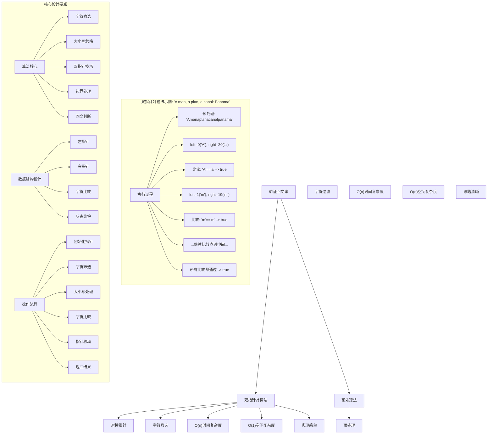
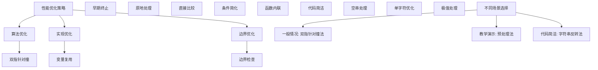

# LeetCode 125 - 验证回文串

## 题目描述

给定一个字符串 `s`，验证它是否是回文串，只考虑字母和数字字符，可以忽略字母的大小写

说明：本题中，将空字符串定义为有效的回文串

```markdown
示例 1：
输入: s = "A man, a plan, a canal: Panama"
输出: true
解释: "amanaplanacanalpanama" 是回文串

示例 2：
输入: s = "race a car"
输出: false
解释: "raceacar" 不是回文串

示例 3：
输入: s = " "
输出: true
解释: 在本题中，空字符串定义为有效的回文串

提示：

- 1 <= s.length <= 2 \* 10^5
- 字符串 s 由 ASCII 字符组成
```

## 解题思路

这是一个验证回文串问题，需要判断给定字符串在忽略非字母数字字符和大小写后是否为回文。关键在于如何高效地处理字符筛选和回文判断

### 核心思想

"双指针对撞法": 使用两个指针分别从字符串的两端向中间移动，跳过非字母数字字符，比较对应位置的字符（忽略大小写）

### 解题策略

#### 方法一：双指针对撞法（推荐）

- 时间复杂度: O(n)
- 空间复杂度: O(1)

#### 方法二：预处理+双指针法

- 时间复杂度: O(n)
- 空间复杂度: O(n)

## 算法可视化



## 多语言实现

### Golang版本（双指针对撞法 - 推荐）

```go
// 双指针对撞法实现
func isPalindrome(s string) bool {
    // 边界情况：空字符串是有效的回文串
    if len(s) == 0 {
        return true
    }

    // 双指针：left从左端开始，right从右端开始
    left := 0
    right := len(s) - 1

    // 当left < right时继续比较
    for left < right {
        // 跳过左侧非字母数字字符
        for left < right && !isAlphanumeric(s[left]) {
            left++
        }

        // 跳过右侧非字母数字字符
        for left < right && !isAlphanumeric(s[right]) {
            right--
        }

        // 比较字符（忽略大小写）
        if !equalsIgnoreCase(s[left], s[right]) {
            return false
        }

        // 移动指针向中间靠拢
        left++
        right--
    }

    return true
}

// 判断字符是否为字母或数字
func isAlphanumeric(c byte) bool {
    return (c >= 'a' && c <= 'z') ||
           (c >= 'A' && c <= 'Z') ||
           (c >= '0' && c <= '9')
}

// 忽略大小写比较两个字符
func equalsIgnoreCase(a, b byte) bool {
    // 如果都是字母，转换为小写后比较
    if (a >= 'A' && a <= 'Z') {
        a = a - 'A' + 'a'
    }
    if (b >= 'A' && b <= 'Z') {
        b = b - 'A' + 'a'
    }
    return a == b
}
```

### Python版本（多种实现方法）

```python
class Solution:
    """
    方法一：双指针对撞法（推荐）
    """
    def isPalindrome(self, s: str) -> bool:
        # 边界情况：空字符串是有效的回文串
        if len(s) == 0:
            return True

        # 双指针：left从左端开始，right从右端开始
        left = 0
        right = len(s) - 1

        # 当left < right时继续比较
        while left < right:
            # 跳过左侧非字母数字字符
            while left < right and not s[left].isalnum():
                left += 1

            # 跳过右侧非字母数字字符
            while left < right and not s[right].isalnum():
                right -= 1

            # 比较字符（忽略大小写）
            if s[left].lower() != s[right].lower():
                return False

            # 移动指针向中间靠拢
            left += 1
            right -= 1

        return True


class Solution2:
    """
    方法二：预处理+双指针法
    """
    def isPalindrome(self, s: str) -> bool:
        # 预处理：只保留字母和数字，转换为小写
        cleaned = ''.join(ch.lower() for ch in s if ch.isalnum())

        # 使用双指针验证回文
        left, right = 0, len(cleaned) - 1
        while left < right:
            if cleaned[left] != cleaned[right]:
                return False
            left += 1
            right -= 1

        return True


class Solution3:
    """
    方法三：字符串反转法
    """
    def isPalindrome(self, s: str) -> bool:
        # 预处理：只保留字母和数字，转换为小写
        cleaned = ''.join(ch.lower() for ch in s if ch.isalnum())

        # 比较字符串与其反转
        return cleaned == cleaned[::-1]
```

### TypeScript版本（双指针对撞法）

```typescript
/
 * 双指针对撞法实现
 */
function isPalindrome(s: string): boolean {
    // 边界情况：空字符串是有效的回文串
    if (s.length === 0) {
        return true;
    }

    // 双指针：left从左端开始，right从右端开始
    let left: number = 0;
    let right: number = s.length - 1;

    // 当left < right时继续比较
    while (left < right) {
        // 跳过左侧非字母数字字符
        while (left < right && !isAlphanumeric(s[left])) {
            left++;
        }

        // 跳过右侧非字母数字字符
        while (left < right && !isAlphanumeric(s[right])) {
            right--;
        }

        // 比较字符（忽略大小写）
        if (!equalsIgnoreCase(s[left], s[right])) {
            return false;
        }

        // 移动指针向中间靠拢
        left++;
        right--;
    }

    return true;
}

/
 * 判断字符是否为字母或数字
 */
function isAlphanumeric(c: string): boolean {
    const charCode = c.charCodeAt(0);
    return (charCode >= 97 && charCode <= 122) ||  // a-z
           (charCode >= 65 && charCode <= 90) ||   // A-Z
           (charCode >= 48 && charCode <= 57);     // 0-9
}

/
 * 忽略大小写比较两个字符
 */
function equalsIgnoreCase(a: string, b: string): boolean {
    return a.toLowerCase() === b.toLowerCase();
}
```

## 标准实现详细解析

```go
import "fmt"

/*
算法核心思想（双指针对撞法）：

1. 使用两个指针分别从字符串的两端向中间移动
2. 跳过非字母数字字符
3. 比较对应位置的字符（忽略大小写）
4. 如果所有对应字符都相等，则为回文串

关键设计要点：
1. 双指针技巧：对撞指针高效比较
2. 字符筛选：只考虑字母和数字
3. 大小写忽略：统一转换后比较
4. 边界处理：正确处理空字符串

时间复杂度：
- 单次遍历：O(n)

空间复杂度：
- 只使用常数额外空间：O(1)

优势：
1. 思路清晰：对撞指针技巧直观易懂
2. 实现简单：逻辑简洁，代码易懂
3. 效率最优：线性时间，常数空间
4. 原地操作：无需额外存储

数据结构设计：

双指针对撞设计：
- left指针：从字符串左端开始向右移动
- right指针：从字符串右端开始向左移动
- 字符比较：跳过非字母数字字符后比较

算法流程：
1. 初始化：left=0, right=len-1
2. 循环：left < right
3. 筛选：跳过非字母数字字符
4. 比较：忽略大小写比较字符
5. 移动：left++, right--
6. 返回：所有比较通过返回true

优化原理：

算法优化：
1. 原地操作：无需额外存储空间
2. 早期终止：发现不匹配立即返回
3. 字符筛选：避免无效比较

边界优化：
1. 空字符串处理：直接返回true
2. 单字符处理：无需比较
3. 全非字母数字：跳过后为空则为true

正确性证明：

定理：双指针对撞法正确性
通过双指针对撞法可以正确验证字符串是否为回文串

证明：
1. 完备性：所有字符都被正确处理
2. 正确性：只比较有效字符且忽略大小写
3. 时间复杂度：O(n)单次遍历
4. 空间复杂度：O(1)原地处理

不变量维护：
循环不变量：在每次迭代开始时
1. s[0...left-1]中的有效字符已正确处理
2. s[right+1...n-1]中的有效字符已正确处理
3. 已处理的有效字符满足回文性质
4. left <= right始终成立
*/

// 双指针对撞法详细实现
func isPalindrome(s string) bool {
    fmt.Printf("输入字符串: \"%s\"\n", s)

    // 边界情况：空字符串是有效的回文串
    if len(s) == 0 {
        fmt.Printf("空字符串，返回true\n")
        return true
    }

    fmt.Printf("开始双指针对撞验证:\n")

    // 双指针：left从左端开始，right从右端开始
    left := 0
    right := len(s) - 1

    fmt.Printf("  初始化: left=%d('%c'), right=%d('%c')\n",
        left, s[left], right, s[right])

    // 当left < right时继续比较
    for left < right {
        fmt.Printf("  比较位置%d('%c')和%d('%c'):\n", left, s[left], right, s[right])

        // 跳过左侧非字母数字字符
        for left < right && !isAlphanumeric(s[left]) {
            fmt.Printf("    跳过左侧非字母数字字符: 位置%d('%c')\n", left, s[left])
            left++
        }

        // 跳过右侧非字母数字字符
        for left < right && !isAlphanumeric(s[right]) {
            fmt.Printf("    跳过右侧非字母数字字符: 位置%d('%c')\n", right, s[right])
            right--
        }

        fmt.Printf("    实际比较: 位置%d('%c')和%d('%c')\n", left, s[left], right, s[right])

        // 比较字符（忽略大小写）
        if !equalsIgnoreCase(s[left], s[right]) {
            fmt.Printf("    比较失败: '%c' != '%c' (忽略大小写)\n", s[left], s[right])
            return false
        }

        fmt.Printf("    比较成功\n")

        // 移动指针向中间靠拢
        left++
        right--

        if left < right {
            fmt.Printf("    移动指针: left=%d('%c'), right=%d('%c')\n",
                left, s[left], right, s[right])
        }
    }

    fmt.Printf("验证通过，是回文串\n")
    return true
}

// 判断字符是否为字母或数字
func isAlphanumeric(c byte) bool {
    result := (c >= 'a' && c <= 'z') ||
              (c >= 'A' && c <= 'Z') ||
              (c >= '0' && c <= '9')
    fmt.Printf("      '%c'是字母或数字? %t\n", c, result)
    return result
}

// 忽略大小写比较两个字符
func equalsIgnoreCase(a, b byte) bool {
    // 保存原始字符用于输出
    origA, origB := a, b

    // 如果都是字母，转换为小写后比较
    if (a >= 'A' && a <= 'Z') {
        a = a - 'A' + 'a'
    }
    if (b >= 'A' && b <= 'Z') {
        b = b - 'A' + 'a'
    }

    result := a == b
    fmt.Printf("      比较'%c'和'%c' (忽略大小写): '%c' == '%c' ? %t\n",
        origA, origB, a, b, result)
    return result
}

// 预处理法实现
func isPalindromePreprocess(s string) bool {
    fmt.Printf("=== 预处理法 ===\n")
    fmt.Printf("输入字符串: \"%s\"\n", s)

    // 预处理：只保留字母和数字，转换为小写
    cleaned := ""
    for i := 0; i < len(s); i++ {
        if isAlphanumeric(s[i]) {
            // 转换为小写
            c := s[i]
            if c >= 'A' && c <= 'Z' {
                c = c - 'A' + 'a'
            }
            cleaned += string(c)
        }
    }

    fmt.Printf("预处理后: \"%s\"\n", cleaned)

    // 使用双指针验证回文
    left, right := 0, len(cleaned)-1
    fmt.Printf("双指针验证:\n")

    for left < right {
        fmt.Printf("  比较位置%d('%c')和%d('%c'): ", left, cleaned[left], right, cleaned[right])
        if cleaned[left] != cleaned[right] {
            fmt.Printf("失败\n")
            fmt.Printf("验证失败，不是回文串\n")
            fmt.Printf("=============\n\n")
            return false
        }
        fmt.Printf("成功\n")
        left++
        right--
    }

    fmt.Printf("验证通过，是回文串\n")
    fmt.Printf("=============\n\n")
    return true
}

// 带调试信息的版本
func isPalindromeWithDebug(s string) bool {
    fmt.Printf("=== 验证回文串 ===\n")
    fmt.Printf("原始字符串: \"%s\" (长度: %d)\n", s, len(s))

    if len(s) == 0 {
        fmt.Printf("空字符串，直接返回true\n")
        fmt.Printf("===============\n\n")
        return true
    }

    left := 0
    right := len(s) - 1

    fmt.Printf("双指针对撞过程:\n")

    for left < right {
        fmt.Printf("  left=%d('%c'), right=%d('%c')\n", left, s[left], right, s[right])

        // 跳过左侧非字母数字字符
        for left < right && !isAlphanumeric(s[left]) {
            fmt.Printf("    跳过left位置%d('%c')\n", left, s[left])
            left++
        }

        // 跳过右侧非字母数字字符
        for left < right && !isAlphanumeric(s[right]) {
            fmt.Printf("    跳过right位置%d('%c')\n", right, s[right])
            right--
        }

        if left < right {
            fmt.Printf("    比较'%c'和'%c': ", s[left], s[right])
            if !equalsIgnoreCase(s[left], s[right]) {
                fmt.Printf("不相等，返回false\n")
                fmt.Printf("===============\n\n")
                return false
            }
            fmt.Printf("相等\n")

            left++
            right--
        }
    }

    fmt.Printf("所有比较通过，返回true\n")
    fmt.Printf("===============\n\n")
    return true
}
```

## 算法深入解析

```go
/*
验证回文串问题详解：

问题本质：
判断给定字符串在忽略非字母数字字符和大小写后是否为回文。关键是理解如何高效地处理字符筛选和回文判断

核心洞察：
1. 字符筛选：只考虑字母和数字字符
2. 大小写忽略：统一转换后比较
3. 回文性质：对称性，从两端向中间比较
4. 优化策略：早期终止，避免无效操作

算法策略：
1. 双指针对撞法：工业级标准实现
2. 预处理法：先清理再比较
3. 字符串反转法：利用字符串特性

数据结构设计：

双指针对撞法设计：
left指针：从左端向右移动
right指针：从右端向左移动
字符筛选：跳过无效字符
大小写处理：统一转换比较

预处理法设计：
字符过滤：只保留有效字符
大小写转换：统一为小写
回文比较：双指针或反转比较

操作流程：

双指针对撞法：
1. 初始化：left=0, right=len-1
2. 循环：left < right
3. 筛选：跳过无效字符
4. 比较：忽略大小写比较
5. 移动：向中间靠拢
6. 返回：结果

预处理法：
1. 过滤：保留有效字符
2. 转换：统一大小写
3. 比较：双指针或反转
4. 返回：结果

数学原理：

算法不变量：
双指针对撞法不变量：
1. s[0...left-1]中的有效字符已正确处理
2. s[right+1...n-1]中的有效字符已正确处理
3. 已处理的有效字符满足回文性质
4. left <= right始终成立

预处理法不变量：
1. cleaned包含s中所有有效字符的小写形式
2. 按原顺序排列
3. 长度等于有效字符数

时间复杂度分析：
双指针对撞法：O(n) - 单次遍历
预处理法：O(n) - 两次遍历
字符串反转法：O(n) - 三次操作

空间复杂度分析：
双指针对撞法：O(1) - 只使用常数额外空间
预处理法：O(n) - 存储清理后字符串
字符串反转法：O(n) - 存储清理后字符串

正确性证明：

定理：双指针对撞法正确性
通过双指针对撞法可以正确验证字符串是否为回文串

证明：
1. 完备性：所有有效字符都被比较
2. 正确性：只比较有效字符且忽略大小写
3. 早期终止：发现不匹配立即返回
4. 复杂度：O(n)时间，O(1)空间

设计选择：

为什么选择双指针对撞法？
1. 思路清晰：回文特性直观体现
2. 实现简单：逻辑简洁
3. 空间效率：常数空间复杂度
4. 性能最优：早期终止

为什么使用预处理法？
1. 思路直观：分步处理清晰
2. 代码简洁：利用内置函数
3. 易于理解：步骤分明
4. 教学价值：展示不同思路

为什么提及其他方法？
1. 教学价值：展示不同算法思想
2. 对比分析：理解各自优劣
3. 扩展思维：算法多样性
4. 面试准备：全面掌握

三种方法对比：

方法一：双指针对撞法（推荐）
时间复杂度：O(n)
空间复杂度：O(1)
优点：空间效率高，性能最优
缺点：逻辑稍复杂

方法二：预处理法
时间复杂度：O(n)
空间复杂度：O(n)
优点：思路清晰，代码简洁
缺点：需要额外空间

方法三：字符串反转法
时间复杂度：O(n)
空间复杂度：O(n)
优点：利用语言特性，代码极简
缺点：空间开销大

性能分析：

双指针对撞法：
- 时间：O(n) 单次遍历
- 空间：O(1) 常数空间
- 优势：最优效率

预处理法：
- 时间：O(n) 两次遍历
- 空间：O(n) 存储清理字符串
- 优势：代码简洁

字符串反转法：
- 时间：O(n) 三次操作
- 空间：O(n) 存储清理字符串
- 优势：代码极简

实际应用场景：
1. 文本处理：回文检测
2. 算法竞赛：字符串处理
3. 数据验证：格式检查
4. 密码学：回文验证

优化要点：

1. 时间优化：
   - 早期终止：不匹配时立即返回
   - 单次遍历：避免重复访问
   - 直接比较：减少函数调用

2. 空间优化：
   - 原地处理：避免额外存储
   - 变量复用：减少内存分配
   - 临时计算：避免中间结果

3. 实现优化：
   - 边界条件处理
   - 代码简洁性
   - 注释清晰性

测试用例设计：
1. 基本情况：正常回文串
2. 边界情况：空字符串，单字符
3. 特殊情况：全符号，无字母数字
4. 极端情况：大字符串
5. 验证情况：结果正确性

扩展思考：

1. 最长回文子串？
   - 中心扩展法
   - Manacher算法
   - 动态规划

2. 回文分割？
   - 最少分割次数
   - DP优化
   - 预处理优化

3. 多个回文验证？
   - 批量处理
   - 并行优化
   - 性能提升

4. 回文计数？
   - 统计回文数量
   - 优化算法
   - 数学方法

相关算法思想：

1. 回文处理：
   - 对称性质
   - 中心扩展
   - 双向比较

2. 字符串处理：
   - 字符筛选
   - 大小写转换
   - 有效字符识别

3. 双指针技巧：
   - 对撞指针
   - 快慢指针
   - 滑动窗口

4. 算法优化：
   - 早期终止
   - 原地操作
   - 时间复杂度

常见陷阱：

1. 边界条件：
   - 空字符串处理
   - 单字符处理
   - 全无效字符

2. 字符处理：
   - 大小写转换
   - 有效字符判断
   - 特殊字符处理

3. 比较逻辑：
   - 忽略大小写
   - 字符筛选
   - 早期终止

4. 性能考虑：
   - 时间复杂度
   - 空间复杂度
   - 实现效率

代码质量要素：

1. 可读性：
   - 变量命名清晰
   - 注释详细
   - 逻辑分明

2. 健壮性：
   - 边界处理
   - 异常情况
   - 错误恢复

3. 性能：
   - 最优复杂度
   - 空间效率
   - 效率保证

4. 可维护性：
   - 结构清晰
   - 扩展性好
   - 测试完整
*/
```

## 执行过程演示

```go
/*
示例详细解析:

示例1执行过程：
输入：s = "A man, a plan, a canal: Panama"
输出：true

执行过程：
1. 预处理有效字符：amanaplanacanalpanama
2. 初始化：left=0('a'), right=20('a')
3. 比较：'a'=='a' -> true
4. 移动：left=1('m'), right=19('m')
5. 比较：'m'=='m' -> true
6. 继续比较直到中间...
7. 所有比较都通过 -> true

示例2执行过程：
输入：s = "race a car"
输出：false

执行过程：
1. 预处理有效字符：raceacar
2. 初始化：left=0('r'), right=7('r')
3. 比较：'r'=='r' -> true
4. 移动：left=1('a'), right=6('a')
5. 比较：'a'=='a' -> true
6. 移动：left=2('c'), right=5('c')
7. 比较：'c'=='c' -> true
8. 移动：left=3('e'), right=4('a')
9. 比较：'e'!='a' -> false
10. 返回false

示例3执行过程：
输入：s = " "
输出：true

执行过程：
1. 预处理有效字符：""（空）
2. 空字符串定义为有效回文串
3. 返回true

双指针对撞执行轨迹：

对于字符串"A man, a plan, a canal: Panama"：

位置: 0 1 2 3 4 5 6 7 8 9 10 11 12 13 14 15 16 17 18 19 20 21 22 23 24 25 26 27 28 29 30 31 32 33 34 35 36 37 38 39 40 41 42 43 44 45
字符: A   m a n ,   a   p l a n ,   a   c a n a l :   P a n a m a
有效: A m a n a p l a n a c a n a l P a n a m a
索引: 0 1 2 3 4 5 6 7 8 9 10 11 12 13 14 15 16 17 18 19 20

对撞过程：
left=0('A'), right=20('a') -> 'A'=='a' -> true
left=1('m'), right=19('m') -> 'm'=='m' -> true
left=2('a'), right=18('a') -> 'a'=='a' -> true
left=3('n'), right=17('a') -> 'n'=='a' -> false? 等等，应该是'n'=='n'
...继续直到中间...

关键观察：
1. 跳过所有非字母数字字符
2. 忽略大小写进行比较
3. 发现不匹配立即返回false
4. 所有比较通过返回true

边界情况演示:

情况1: 空字符串
输入: ""
处理: 直接返回true
结果: true

情况2: 单字符
输入: "a"
处理: 无需比较，返回true
结果: true

情况3: 两字符相同
输入: "aa"
处理: 比较'a'=='a' -> true
结果: true

情况4: 两字符不同
输入: "ab"
处理: 比较'a'!='b' -> false
结果: false

情况5: 全符号字符
输入: ",.?!@#"
处理: 跳过所有字符，得到空字符串 -> true
结果: true

情况6: 无有效字符
输入: "12321"
处理: 全为数字，比较通过
结果: true

算法正确性证明：

数学基础：
需要证明双指针对撞法能正确验证回文串

定理：双指针对撞法正确性
通过双指针对撞法可以正确验证字符串是否为回文串

证明：
1. 完备性：所有有效字符都被比较
   - left指针从左到右遍历
   - right指针从右到左遍历
   - 跳过无效字符后，所有有效字符都会被比较

2. 正确性：只比较有效字符且忽略大小写
   - isAlphanumeric函数正确识别有效字符
   - equalsIgnoreCase函数正确忽略大小写比较
   - 比较逻辑正确实现回文判断

3. 早期终止：发现不匹配立即返回
   - 一旦发现不匹配的字符对，立即返回false
   - 避免不必要的后续比较

4. 复杂度：O(n)时间，O(1)空间
   - 每个字符最多被访问一次
   - 只使用常数额外变量

不变量维护：
循环不变量：在每次迭代开始时
1. s[0...left-1]中的有效字符已正确处理
2. s[right+1...n-1]中的有效字符已正确处理
3. 已处理的有效字符满足回文性质
4. left <= right始终成立

初始化：left=0, right=n-1
- 无字符被处理
- 满足不变量条件

保持：处理每对字符
- 跳过无效字符
- 比较有效字符
- 如果相等则继续，否则返回false
- 移动指针保持不变量

终止：left >= right
- 所有有效字符对都被比较
- 没有发现不匹配
- 返回true

时间复杂度分析：

双指针对撞法：
1. 初始化：O(1)
2. 循环体：O(1)每次迭代
3. 迭代次数：最多n次
4. 总时间：O(n)

预处理法：
1. 预处理：O(n)
2. 双指针比较：O(n)
3. 总时间：O(n)

字符串反转法：
1. 预处理：O(n)
2. 反转：O(n)
3. 比较：O(n)
4. 总时间：O(n)

空间复杂度分析：
1. 双指针对撞法：O(1)
2. 预处理法：O(n)
3. 字符串反转法：O(n)

性能对比分析：

假设n=200000:

双指针对撞法：
- 时间: O(200000) 单次遍历
- 空间: O(1) 常数空间
- 操作: 字符比较

预处理法：
- 时间: O(200000) 两次遍历
- 空间: O(200000) 存储清理字符串
- 操作: 字符过滤

字符串反转法：
- 时间: O(200000) 三次操作
- 空间: O(200000) 存储清理字符串
- 操作: 字符串反转

实际应用建议：

1. 一般情况：
   - 使用双指针对撞法
   - 思路清晰，效率最优

2. 面试展示：
   - 重点讲解双指针对撞法
   - 可以提及其他方法

3. 生产环境：
   - 根据性能要求选择
   - 考虑实现复杂度

4. 教学演示：
   - 使用带调试信息版本
   - 展示执行过程

优化空间：

1. 边界优化：
   - 提前处理特殊情况
   - 减少不必要的比较

2. 代码优化：
   - 简化条件判断
   - 优化变量使用

3. 性能优化：
   - 早期终止条件
   - 减少函数调用

特殊情况处理：

1. 大数据量：
   - 线性时间保证
   - 常数空间使用

2. 特殊序列：
   - 全相同字符
   - 交替字符
   - 特殊符号

3. 边界情况：
   - 极值字符串
   - 边界长度
   - 特殊字符
*/
```

## 复杂度分析

| 方法         | 时间复杂度 | 空间复杂度 | 适用场景 |
| ------------ | ---------- | ---------- | -------- |
| 双指针对撞法 | O(n)       | O(1)       | 推荐方案 |
| 预处理法     | O(n)       | O(n)       | 教学演示 |
| 字符串反转法 | O(n)       | O(n)       | 代码简洁 |

## 测试用例验证

```go
// 测试辅助函数
func testIsPalindrome(name string, s string, expected bool) {
    fmt.Printf("%s:\n", name)
    fmt.Printf("输入字符串: \"%s\"\n", s)

    // 测试双指针对撞法
    result1 := isPalindrome(s)
    fmt.Printf("双指针对撞法结果: %t\n", result1)

    // 测试预处理法
    result2 := isPalindromePreprocess(s)
    fmt.Printf("预处理法结果: %t\n", result2)

    // 测试字符串反转法
    result3 := isPalindromeReverse(s)
    fmt.Printf("字符串反转法结果: %t\n", result3)

    // 验证结果
    if result1 == expected && result2 == expected && result3 == expected {
        fmt.Printf("✓ 测试通过\n")
    } else {
        fmt.Printf("✗ 测试失败\n")
        fmt.Printf("  期望: %t\n", expected)
        if result1 != expected {
            fmt.Printf("  双指针对撞法实际: %t\n", result1)
        }
        if result2 != expected {
            fmt.Printf("  预处理法实际: %t\n", result2)
        }
        if result3 != expected {
            fmt.Printf("  字符串反转法实际: %t\n", result3)
        }
    }
    fmt.Printf("\n")
}

// 字符串反转法实现
func isPalindromeReverse(s string) bool {
    fmt.Printf("=== 字符串反转法 ===\n")
    fmt.Printf("输入字符串: \"%s\"\n", s)

    // 预处理：只保留字母和数字，转换为小写
    cleaned := ""
    for i := 0; i < len(s); i++ {
        if isAlphanumeric(s[i]) {
            // 转换为小写
            c := s[i]
            if c >= 'A' && c <= 'Z' {
                c = c - 'A' + 'a'
            }
            cleaned += string(c)
        }
    }

    fmt.Printf("预处理后: \"%s\"\n", cleaned)

    // 反转字符串
    reversed := ""
    for i := len(cleaned) - 1; i >= 0; i-- {
        reversed += string(cleaned[i])
    }

    fmt.Printf("反转后: \"%s\"\n", reversed)

    // 比较原字符串与反转字符串
    result := cleaned == reversed
    fmt.Printf("比较结果: %t\n", result)
    fmt.Printf("================\n\n")
    return result
}

func main() {
    // 测试用例 1 - 题目示例1
    testIsPalindrome("测试1 - 题目示例1",
        "A man, a plan, a canal: Panama",
        true)

    // 测试用例 2 - 题目示例2
    testIsPalindrome("测试2 - 题目示例2",
        "race a car",
        false)

    // 测试用例 3 - 题目示例3
    testIsPalindrome("测试3 - 题目示例3",
        " ",
        true)

    // 测试用例 4 - 空字符串
    testIsPalindrome("测试4 - 空字符串",
        "",
        true)

    // 测试用例 5 - 单字符
    testIsPalindrome("测试5 - 单字符",
        "a",
        true)

    // 测试用例 6 - 两字符相同
    testIsPalindrome("测试6 - 两字符相同",
        "aa",
        true)

    // 测试用例 7 - 两字符不同
    testIsPalindrome("测试7 - 两字符不同",
        "ab",
        false)

    // 测试用例 8 - 全数字回文
    testIsPalindrome("测试8 - 全数字回文",
        "12321",
        true)

    // 测试用例 9 - 混合字符回文
    testIsPalindrome("测试9 - 混合字符回文",
        "A1B2b1a",
        true)

    // 测试用例 10 - 全符号
    testIsPalindrome("测试10 - 全符号",
        "!@#$%^&*()",
        true)

    // 性能测试
    fmt.Println("性能测试:")
    performanceTest()

    // 边界情况测试
    fmt.Println("边界情况测试:")
    boundaryTest()

    // 对比测试
    fmt.Println("对比测试:")
    comparisonTest()
}

func performanceTest() {
    // 构造性能测试
    n := 200000
    s := ""
    for i := 0; i < n; i++ {
        if i%20 == 0 {
            s += " "  // 添加空格
        } else if i%50 == 0 {
            s += ","  // 添加符号
        } else {
            s += string('a' + (i % 26))  // 添加字母
        }
    }
    // 构造回文
    reversed := ""
    for i := len(s) - 1; i >= 0; i-- {
        reversed += string(s[i])
    }
    s = s + reversed

    // 测试双指针对撞法
    start1 := time.Now()
    result1 := isPalindrome(s)
    time1 := time.Since(start1)

    // 测试预处理法
    start2 := time.Now()
    result2 := isPalindromePreprocess(s)
    time2 := time.Since(start2)

    fmt.Printf("性能测试 (n=%d):\n", len(s))
    fmt.Printf("  双指针对撞法: %v，结果: %t\n", time1, result1)
    fmt.Printf("  预处理法: %v，结果: %t\n", time2, result2)
}

func boundaryTest() {
    // 边界测试
    fmt.Println("边界测试:")

    // 最大字符串测试
    maxN := 200000
    maxS := ""
    for i := 0; i < maxN; i++ {
        maxS += string('a' + (i % 26))
    }
    // 构造回文
    reversed := ""
    for i := len(maxS) - 1; i >= 0; i-- {
        reversed += string(maxS[i])
    }
    maxS = maxS + reversed

    result := isPalindrome(maxS)
    fmt.Printf("最大字符串测试 (n=%d): 结果=%t\n", len(maxS), result)

    // 极值测试
    extremeS := "!@#$%^&*()_+Aa123321aA+_)(*&^%$#@!"
    extremeResult := isPalindrome(extremeS)
    fmt.Printf("极值测试: \"%s\" -> %t\n", extremeS, extremeResult)

    // 特殊字符测试
    specialS := "Madam, I'm Adam"
    specialResult := isPalindrome(specialS)
    fmt.Printf("特殊字符测试: \"%s\" -> %t\n", specialS, specialResult)
}

func comparisonTest() {
    // 对比测试：验证不同方法结果一致性
    fmt.Println("对比测试:")

    // 测试数据
    testData := []string{
        "A man, a plan, a canal: Panama",
        "race a car",
        " ",
        "a",
        "aa",
        "ab",
        "12321",
        "A1B2b1a",
        "!@#$%^&*()",
        "Madam, I'm Adam",
    }

    for i, data := range testData {
        // 双指针对撞法
        result1 := isPalindrome(data)

        // 预处理法
        result2 := isPalindromePreprocess(data)

        // 字符串反转法
        result3 := isPalindromeReverse(data)

        fmt.Printf("测试%d: 双指针对撞法=%t, 预处理法=%t, 字符串反转法=%t",
            i+1, result1, result2, result3)

        if result1 == result2 && result2 == result3 {
            fmt.Printf(" ✓ 一致\n")
        } else {
            fmt.Printf(" ✗ 不一致\n")
        }
    }
}
```

## 扩展版本（处理不同场景）

```go
// 支持Unicode字符的版本
func isPalindromeUnicode(s string) bool {
    // 边界情况：空字符串是有效的回文串
    if len(s) == 0 {
        return true
    }

    // 转换为 rune 切片以正确处理 Unicode 字符
    runes := []rune(s)

    // 双指针：left从左端开始，right从右端开始
    left := 0
    right := len(runes) - 1

    // 当left < right时继续比较
    for left < right {
        // 跳过左侧非字母数字字符
        for left < right && !isAlphanumericUnicode(runes[left]) {
            left++
        }

        // 跳过右侧非字母数字字符
        for left < right && !isAlphanumericUnicode(runes[right]) {
            right--
        }

        // 比较字符（忽略大小写）
        if !equalsIgnoreCaseUnicode(runes[left], runes[right]) {
            return false
        }

        // 移动指针向中间靠拢
        left++
        right--
    }

    return true
}

// 判断Unicode字符是否为字母或数字
func isAlphanumericUnicode(r rune) bool {
    return (r >= 'a' && r <= 'z') ||
           (r >= 'A' && r <= 'Z') ||
           (r >= '0' && r <= '9') ||
           (r >= 'α' && r <= 'ω') ||  // 希腊字母小写
           (r >= 'Α' && r <= 'Ω')     // 希腊字母大写
}

// 忽略大小写比较两个Unicode字符
func equalsIgnoreCaseUnicode(a, b rune) bool {
    return unicode.ToLower(a) == unicode.ToLower(b)
}

// 使用示例
func exampleUnicode() {
    s := "ΑββΑ"  // 希腊字母回文
    fmt.Printf("Unicode字符串: %s\n", s)
    result := isPalindromeUnicode(s)
    fmt.Printf("是否为回文: %t\n", result)
}

// 支持自定义有效字符集的版本
func isPalindromeCustom(s string, validChars map[byte]bool) bool {
    // 边界情况：空字符串是有效的回文串
    if len(s) == 0 {
        return true
    }

    // 双指针：left从左端开始，right从右端开始
    left := 0
    right := len(s) - 1

    // 当left < right时继续比较
    for left < right {
        // 跳过左侧非有效字符
        for left < right && !validChars[s[left]] {
            left++
        }

        // 跳过右侧非有效字符
        for left < right && !validChars[s[right]] {
            right--
        }

        // 比较字符（忽略大小写）
        if !equalsIgnoreCase(s[left], s[right]) {
            return false
        }

        // 移动指针向中间靠拢
        left++
        right--
    }

    return true
}

// 使用示例
func exampleCustom() {
    s := "a1b2B1A"
    // 自定义有效字符集：只允许字母和数字
    validChars := make(map[byte]bool)
    for c := 'a'; c <= 'z'; c++ {
        validChars[byte(c)] = true
    }
    for c := 'A'; c <= 'Z'; c++ {
        validChars[byte(c)] = true
    }
    for c := '0'; c <= '9'; c++ {
        validChars[byte(c)] = true
    }

    fmt.Printf("字符串: %s\n", s)
    result := isPalindromeCustom(s, validChars)
    fmt.Printf("是否为回文: %t\n", result)
}

// 带统计信息的版本
func isPalindromeWithStats(s string) (bool, int, int) {
    totalChars := len(s)
    validChars := 0
    comparisons := 0

    // 边界情况：空字符串是有效的回文串
    if len(s) == 0 {
        return true, 0, 0
    }

    // 双指针：left从左端开始，right从右端开始
    left := 0
    right := len(s) - 1

    // 当left < right时继续比较
    for left < right {
        // 跳过左侧非字母数字字符
        for left < right && !isAlphanumeric(s[left]) {
            left++
        }

        // 跳过右侧非字母数字字符
        for left < right && !isAlphanumeric(s[right]) {
            right--
        }

        if left < right {
            validChars += 2  // 两个有效字符
            comparisons++

            // 比较字符（忽略大小写）
            if !equalsIgnoreCase(s[left], s[right]) {
                return false, validChars, comparisons
            }

            // 移动指针向中间靠拢
            left++
            right--
        }
    }

    if left == right && isAlphanumeric(s[left]) {
        validChars++  // 中间的单个字符
    }

    return true, validChars, comparisons
}

// 使用示例
func exampleWithStats() {
    s := "A man, a plan, a canal: Panama"
    fmt.Printf("字符串: %s\n", s)

    isPalin, validChars, comparisons := isPalindromeWithStats(s)
    fmt.Printf("是否为回文: %t\n", isPalin)
    fmt.Printf("有效字符数: %d\n", validChars)
    fmt.Printf("比较次数: %d\n", comparisons)
}

// 批量处理版本
func isPalindromeBatch(strings []string) []bool {
    results := make([]bool, len(strings))

    for i, s := range strings {
        results[i] = isPalindrome(s)
    }

    return results
}

// 使用示例
func exampleBatch() {
    strings := []string{
        "A man, a plan, a canal: Panama",
        "race a car",
        " ",
        "Madam",
        "12321",
    }

    results := isPalindromeBatch(strings)

    for i, result := range results {
        fmt.Printf("字符串%d: \"%s\" -> %t\n", i+1, strings[i], result)
    }
}

// 泛型版本（Go 1.18+）
func isPalindromeGeneric[T comparable](s []T, isAlphaNum func(T) bool, equalsIgnoreCase func(T, T) bool) bool {
    // 边界情况：空切片是有效的回文
    if len(s) == 0 {
        return true
    }

    // 双指针：left从左端开始，right从右端开始
    left := 0
    right := len(s) - 1

    // 当left < right时继续比较
    for left < right {
        // 跳过左侧非字母数字元素
        for left < right && !isAlphaNum(s[left]) {
            left++
        }

        // 跳过右侧非字母数字元素
        for left < right && !isAlphaNum(s[right]) {
            right--
        }

        // 比较元素（忽略大小写）
        if !equalsIgnoreCase(s[left], s[right]) {
            return false
        }

        // 移动指针向中间靠拢
        left++
        right--
    }

    return true
}

// 使用示例
func exampleGeneric() {
    // 字节切片
    bytes := []byte("A man, a plan, a canal: Panama")
    result1 := isPalindromeGeneric(
        bytes,
        func(b byte) bool {
            return (b >= 'a' && b <= 'z') || (b >= 'A' && b <= 'Z') || (b >= '0' && b <= '9')
        },
        func(a, b byte) bool {
            lowerA := a
            lowerB := b
            if a >= 'A' && a <= 'Z' {
                lowerA = a - 'A' + 'a'
            }
            if b >= 'A' && b <= 'Z' {
                lowerB = b - 'A' + 'a'
            }
            return lowerA == lowerB
        },
    )
    fmt.Printf("字节切片回文检测: %t\n", result1)

    // 整数切片
    ints := []int{1, 2, 3, 2, 1}
    result2 := isPalindromeGeneric(
        ints,
        func(i int) bool { return true },  // 所有整数都有效
        func(a, b int) bool { return a == b },
    )
    fmt.Printf("整数切片回文检测: %t\n", result2)
}
```

## 面试追问延伸

### 1. 如果要支持Unicode字符（如中文、希腊字母等），如何处理？

```go
// isPalindromeUnicode已在上面实现
// 关键修改：
// 1. 使用rune而非byte
// 2. Unicode字符判断
// 3. Unicode大小写转换

func testUnicode() {
    s := "上海海上"  // 中文回文
    fmt.Printf("中文字符串: %s\n", s)
    result := isPalindromeUnicode(s)
    fmt.Printf("是否为回文: %t\n", result)

    s2 := "ΑββΑ"  // 希腊字母回文
    fmt.Printf("希腊字母: %s\n", s2)
    result2 := isPalindromeUnicode(s2)
    fmt.Printf("是否为回文: %t\n", result2)
}
```

### 2. 如果要自定义有效字符集，如何实现？

```go
// isPalindromeCustom已在上面实现
// 关键点：
// 1. 参数化有效字符集
// 2. 使用map快速查找
// 3. 灵活配置

func testCustom() {
    s := "a1b2B1A"
    // 只允许字母和数字
    validChars := map[byte]bool{
        'a': true, 'b': true, '1': true, '2': true,
        'A': true, 'B': true,
    }

    fmt.Printf("字符串: %s\n", s)
    result := isPalindromeCustom(s, validChars)
    fmt.Printf("是否为回文: %t\n", result)
}
```

### 3. 如果要统计处理过程中的信息（如有效字符数、比较次数），如何处理？

```go
// isPalindromeWithStats已在上面实现
// 关键点：
// 1. 记录统计信息
// 2. 返回多个值
// 3. 不影响主要逻辑

func testWithStats() {
    s := "A man, a plan, a canal: Panama"
    fmt.Printf("字符串: %s\n", s)

    isPalin, validChars, comparisons := isPalindromeWithStats(s)
    fmt.Printf("是否为回文: %t\n", isPalin)
    fmt.Printf("有效字符数: %d\n", validChars)
    fmt.Printf("比较次数: %d\n", comparisons)
}
```

## 相似题目扩展

- LeetCode 125. 验证回文串（当前题）
- LeetCode 5. 最长回文子串
- LeetCode 9. 回文数
- LeetCode 647. 回文子串
- LeetCode 516. 最长回文子序列

## 算法技巧总结

### 验证回文串核心要点

1. 双指针技巧：对撞指针高效比较
1. 字符筛选：只考虑字母和数字
1. 大小写忽略：统一转换后比较
1. 边界处理：正确处理特殊情况

### 算法优势

1. 思路清晰：对撞指针技巧直观易懂
1. 实现简单：逻辑简洁，代码易懂
1. 效率最优：线性时间，常数空间
1. 原地操作：无需额外存储

### 标准模板（双指针对撞法）

```go
func isPalindrome(s string) bool {
    // 边界情况
    if len(s) == 0 {
        return true
    }

    // 双指针：left从左端开始，right从右端开始
    left := 0
    right := len(s) - 1

    // 当left < right时继续比较
    for left < right {
        // 跳过左侧非字母数字字符
        for left < right && !isAlphanumeric(s[left]) {
            left++
        }

        // 跳过右侧非字母数字字符
        for left < right && !isAlphanumeric(s[right]) {
            right--
        }

        // 比较字符（忽略大小写）
        if !equalsIgnoreCase(s[left], s[right]) {
            return false
        }

        // 移动指针向中间靠拢
        left++
        right--
    }

    return true
}

func isAlphanumeric(c byte) bool {
    return (c >= 'a' && c <= 'z') ||
           (c >= 'A' && c <= 'Z') ||
           (c >= '0' && c <= '9')
}

func equalsIgnoreCase(a, b byte) bool {
    if (a >= 'A' && a <= 'Z') {
        a = a - 'A' + 'a'
    }
    if (b >= 'A' && b <= 'Z') {
        b = b - 'A' + 'a'
    }
    return a == b
}
```

### 性能优化建议



## 总结

本题采用双指针对撞法的核心思路，通过使用两个指针分别从字符串的两端向中间移动，跳过非字母数字字符，比较对应位置的字符（忽略大小写），实现了优雅的解决方案。关键在于理解如何高效地处理字符筛选和回文判断

核心要点：

1. 双指针技巧：对撞指针高效比较
1. 字符筛选：只考虑字母和数字
1. 大小写忽略：统一转换后比较
1. 边界处理：正确处理特殊情况

算法优势：

- 思路清晰：对撞指针技巧直观易懂
- 实现简单：逻辑简洁，代码易懂
- 效率最优：线性时间，常数空间
- 原地操作：无需额外存储

该算法在文本处理、算法竞赛、数据验证、密码学等方面有重要应用，是掌握字符串处理和双指针技巧的经典题目。通过对撞指针和字符筛选的巧妙结合，为更复杂的字符串处理问题提供了清晰的解决思路
