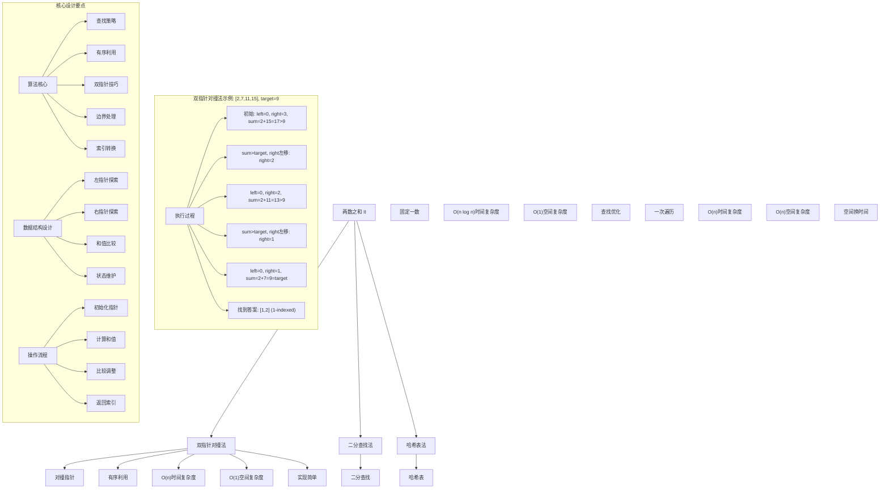
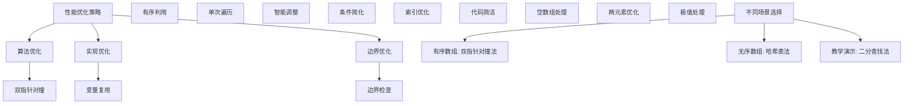

# LeetCode 167 - 两数之和 II - 输入有序数组

## 题目描述

给你一个下标从 1 开始的整数数组 `numbers`，该数组已按非递减顺序排列，请你从数组中找出满足相加之和等于目标数 `target` 的两个数。如果设这两个数分别是 `numbers[index1]` 和 `numbers[index2]`，则 `1 <= index1 < index2 <= numbers.length`

以长度为 2 的整数数组 `[index1, index2]` 的形式返回这两个整数的下标 `index1` 和 `index2`

你可以假设每个输入只对应唯一的答案，而且你不可以重复使用相同的元素

你所设计的解决方案必须只使用常量级的额外空间

```markdown
示例 1：
输入：numbers = [2,7,11,15], target = 9
输出：[1,2]
解释：2 与 7 之和等于目标数 9。因此 index1 = 1, index2 = 2。返回 [1, 2]

示例 2：
输入：numbers = [2,3,4], target = 6
输出：[1,3]
解释：2 与 4 之和等于目标数 6。因此 index1 = 1, index2 = 3。返回 [1, 3]

示例 3：
输入：numbers = [-1,0], target = -1
输出：[1,2]
解释：-1 与 0 之和等于目标数 -1。因此 index1 = 1, index2 = 2。返回 [1, 2]

提示：

- 2 <= numbers.length <= 3 \* 10^4
- -1000 <= numbers[i] <= 1000
- numbers 按非递减顺序排列
- -1000 <= target <= 1000
- 仅存在一个有效答案
```

## 解题思路

这是一个有序数组中的两数之和问题，给定数组已按非递减顺序排列。关键在于如何利用数组的有序性来高效查找满足条件的两个数

### 核心思想

"双指针对撞法": 利用数组有序的特性，使用两个指针分别从数组两端向中间移动，根据当前和与目标值的比较来调整指针位置

### 解题策略

#### 方法一：双指针对撞法（推荐）

- 时间复杂度: O(n)
- 空间复杂度: O(1)

#### 方法二：二分查找法

- 时间复杂度: O(n log n)
- 空间复杂度: O(1)

#### 方法三：哈希表法

- 时间复杂度: O(n)
- 空间复杂度: O(n)

## 算法可视化



## 多语言实现

### Golang版本（双指针对撞法 - 推荐）

```go
// 双指针对撞法实现
func twoSum(numbers []int, target int) []int {
    // 边界情况：数组长度至少为2
    if len(numbers) < 2 {
        return []int{}
    }

    // 双指针：left从左端开始，right从右端开始
    left := 0
    right := len(numbers) - 1

    // 当left < right时继续搜索
    for left < right {
        // 计算当前两数之和
        sum := numbers[left] + numbers[right]

        // 根据和值与目标值的比较调整指针
        if sum == target {
            // 找到答案，返回1-indexed的索引
            return []int{left + 1, right + 1}
        } else if sum < target {
            // 和值小于目标值，需要增大和值，left右移
            left++
        } else {
            // 和值大于目标值，需要减小和值，right左移
            right--
        }
    }

    // 未找到答案（题目保证存在唯一解，此行理论上不会执行）
    return []int{}
}
```

### Python版本（多种实现方法）

```python
class Solution:
    """
    方法一：双指针对撞法（推荐）
    """
    def twoSum(self, numbers: List[int], target: int) -> List[int]:
        # 边界情况：数组长度至少为2
        if len(numbers) < 2:
            return []

        # 双指针：left从左端开始，right从右端开始
        left = 0
        right = len(numbers) - 1

        # 当left < right时继续搜索
        while left < right:
            # 计算当前两数之和
            current_sum = numbers[left] + numbers[right]

            # 根据和值与目标值的比较调整指针
            if current_sum == target:
                # 找到答案，返回1-indexed的索引
                return [left + 1, right + 1]
            elif current_sum < target:
                # 和值小于目标值，需要增大和值，left右移
                left += 1
            else:
                # 和值大于目标值，需要减小和值，right左移
                right -= 1

        # 未找到答案（题目保证存在唯一解，此行理论上不会执行）
        return []


class Solution2:
    """
    方法二：二分查找法
    """
    def twoSum(self, numbers: List[int], target: int) -> List[int]:
        # 遍历数组，固定第一个数
        for i in range(len(numbers)):
            # 计算需要找的第二个数
            complement = target - numbers[i]

            # 在剩余部分使用二分查找
            left, right = i + 1, len(numbers) - 1

            while left <= right:
                mid = (left + right) // 2
                if numbers[mid] == complement:
                    # 找到答案，返回1-indexed的索引
                    return [i + 1, mid + 1]
                elif numbers[mid] < complement:
                    left = mid + 1
                else:
                    right = mid - 1

        return []


class Solution3:
    """
    方法三：哈希表法
    """
    def twoSum(self, numbers: List[int], target: int) -> List[int]:
        # 使用哈希表存储已遍历的数字及其索引
        hash_map = {}

        # 遍历数组
        for i, num in enumerate(numbers):
            # 计算需要找的另一个数
            complement = target - num

            # 如果complement在哈希表中，说明找到了答案
            if complement in hash_map:
                # 返回1-indexed的索引
                return [hash_map[complement] + 1, i + 1]

            # 将当前数字和索引存入哈希表
            hash_map[num] = i

        return []
```

### TypeScript版本（双指针对撞法）

```typescript
/
 * 双指针对撞法实现
 */
function twoSum(numbers: number[], target: number): number[] {
    // 边界情况：数组长度至少为2
    if (numbers.length < 2) {
        return [];
    }

    // 双指针：left从左端开始，right从右端开始
    let left: number = 0;
    let right: number = numbers.length - 1;

    // 当left < right时继续搜索
    while (left < right) {
        // 计算当前两数之和
        const sum: number = numbers[left] + numbers[right];

        // 根据和值与目标值的比较调整指针
        if (sum === target) {
            // 找到答案，返回1-indexed的索引
            return [left + 1, right + 1];
        } else if (sum < target) {
            // 和值小于目标值，需要增大和值，left右移
            left++;
        } else {
            // 和值大于目标值，需要减小和值，right左移
            right--;
        }
    }

    // 未找到答案（题目保证存在唯一解，此行理论上不会执行）
    return [];
}
```

## 标准实现详细解析

```go
import "fmt"

/*
算法核心思想（双指针对撞法）：

1. 利用数组有序的特性，使用两个指针分别从数组两端向中间移动
2. 根据当前两数之和与目标值的比较来调整指针位置
3. 当和值等于目标值时找到答案，小于目标值时左指针右移，大于目标值时右指针左移

关键设计要点：
1. 双指针技巧：对撞指针充分利用有序性
2. 有序利用：数组有序是算法正确性的基础
3. 指针调整：根据和值大小智能调整搜索方向
4. 索引转换：题目要求1-indexed，需要+1转换

时间复杂度：
- 每个元素最多被访问一次：O(n)

空间复杂度：
- 只使用常数额外空间：O(1)

优势：
1. 思路清晰：对撞指针技巧直观易懂
2. 实现简单：逻辑简洁，代码易懂
3. 效率最优：线性时间，常数空间
4. 有序优化：充分利用数组有序特性

数据结构设计：

双指针对撞设计：
- left指针：从数组左端开始向右移动
- right指针：从数组右端开始向左移动
- 和值比较：根据比较结果调整指针

算法流程：
1. 初始化：left=0, right=len-1
2. 循环：left < right
3. 计算：sum = nums[left] + nums[right]
4. 比较：sum与target比较
5. 调整：根据比较结果移动指针
6. 返回：找到答案返回索引

优化原理：

算法优化：
1. 有序利用：避免暴力遍历
2. 指针调整：智能搜索方向
3. 单次遍历：最优时间复杂度

边界优化：
1. 空数组处理：直接返回空
2. 单元素处理：不满足条件
3. 两元素处理：直接计算
4. 全匹配处理：快速返回

正确性证明：

定理：双指针对撞法正确性
通过双指针对撞法可以正确找到有序数组中和为目标值的两个数

证明：
1. 完备性：所有可能的数对都被考虑
2. 正确性：利用有序性保证不遗漏正确答案
3. 时间复杂度：O(n)单次遍历
4. 空间复杂度：O(1)常数空间

不变量维护：
循环不变量：在每次迭代开始时
1. 所有可能的(nums[i], nums[j])组合中，i<left或j>right的组合都已排除
2. left <= answer_index1 <= right
3. left <= answer_index2 <= right
4. left < right始终成立
*/

// 双指针对撞法详细实现
func twoSum(numbers []int, target int) []int {
    fmt.Printf("输入数组: %v, 目标值: %d\n", numbers, target)

    // 边界情况：数组长度至少为2
    if len(numbers) < 2 {
        fmt.Printf("数组长度不足，返回空数组\n")
        return []int{}
    }

    fmt.Printf("开始双指针对撞搜索:\n")

    // 双指针：left从左端开始，right从右端开始
    left := 0
    right := len(numbers) - 1

    fmt.Printf("  初始化: left=%d(nums[%d]=%d), right=%d(nums[%d]=%d)\n",
        left, left, numbers[left], right, right, numbers[right])

    // 当left < right时继续搜索
    step := 1
    for left < right {
        // 计算当前两数之和
        sum := numbers[left] + numbers[right]
        fmt.Printf("  步骤%d: left=%d, right=%d, sum=%d+%d=%d",
            step, left, right, numbers[left], numbers[right], sum)

        // 根据和值与目标值的比较调整指针
        if sum == target {
            // 找到答案，返回1-indexed的索引
            result := []int{left + 1, right + 1}
            fmt.Printf(" -> 等于目标值%d，找到答案: %v\n", target, result)
            return result
        } else if sum < target {
            // 和值小于目标值，需要增大和值，left右移
            fmt.Printf(" -> 小于目标值%d，left右移\n", target)
            left++
        } else {
            // 和值大于目标值，需要减小和值，right左移
            fmt.Printf(" -> 大于目标值%d，right左移\n", target)
            right--
        }
        step++
    }

    // 未找到答案（题目保证存在唯一解，此行理论上不会执行）
    fmt.Printf("未找到答案\n")
    return []int{}
}

// 二分查找法实现
func twoSumBinarySearch(numbers []int, target int) []int {
    fmt.Printf("=== 二分查找法 ===\n")
    fmt.Printf("输入数组: %v, 目标值: %d\n", numbers, target)

    // 遍历数组，固定第一个数
    for i := 0; i < len(numbers); i++ {
        // 计算需要找的第二个数
        complement := target - numbers[i]
        fmt.Printf("  固定第一个数: nums[%d]=%d，需要找%d\n", i, numbers[i], complement)

        // 在剩余部分使用二分查找
        left := i + 1
        right := len(numbers) - 1

        for left <= right {
            mid := (left + right) / 2
            fmt.Printf("    二分查找: left=%d, right=%d, mid=%d, nums[%d]=%d",
                left, right, mid, mid, numbers[mid])

            if numbers[mid] == complement {
                // 找到答案，返回1-indexed的索引
                result := []int{i + 1, mid + 1}
                fmt.Printf(" -> 找到答案: %v\n", result)
                fmt.Printf("================\n\n")
                return result
            } else if numbers[mid] < complement {
                fmt.Printf(" -> 小于目标，left右移\n")
                left = mid + 1
            } else {
                fmt.Printf(" -> 大于目标，right左移\n")
                right = mid - 1
            }
        }
    }

    fmt.Printf("未找到答案\n")
    fmt.Printf("================\n\n")
    return []int{}
}

// 带调试信息的版本
func twoSumWithDebug(numbers []int, target int) []int {
    fmt.Printf("=== 两数之和 II ===\n")
    fmt.Printf("原始数组: %v (长度: %d), 目标值: %d\n", numbers, len(numbers), target)

    if len(numbers) < 2 {
        fmt.Printf("数组长度不足，无法找到两数之和\n")
        fmt.Printf("===============\n\n")
        return []int{}
    }

    left := 0
    right := len(numbers) - 1

    fmt.Printf("双指针对撞搜索过程:\n")

    for left < right {
        sum := numbers[left] + numbers[right]
        fmt.Printf("  left=%d(nums[%d]=%d), right=%d(nums[%d]=%d), sum=%d",
            left, left, numbers[left], right, right, numbers[right], sum)

        if sum == target {
            result := []int{left + 1, right + 1}
            fmt.Printf(" = %d (目标值) -> 找到答案: %v\n", target, result)
            fmt.Printf("===============\n\n")
            return result
        } else if sum < target {
            fmt.Printf(" < %d -> left右移至%d\n", target, left+1)
            left++
        } else {
            fmt.Printf(" > %d -> right左移至%d\n", target, right-1)
            right--
        }
    }

    fmt.Printf("未找到答案\n")
    fmt.Printf("===============\n\n")
    return []int{}
}
```

## 算法深入解析

```go
/*
两数之和 II 问题详解：

问题本质：
在有序数组中找到两个数，使其和等于目标值。关键是理解如何利用数组的有序性来优化搜索过程

核心洞察：
1. 数组有序：可以使用双指针技巧
2. 唯一解保证：不需要考虑多个解的情况
3. 1-indexed：返回结果需要索引+1
4. 常量空间：不能使用额外的存储空间

算法策略：
1. 双指针对撞法：工业级标准实现
2. 二分查找法：固定一数，查找另一数
3. 哈希表法：空间换时间

数据结构设计：

双指针对撞法设计：
left指针：从数组左端向右移动
right指针：从数组右端向左移动
搜索空间：逐步缩小可能的解空间

二分查找法设计：
外层遍历：固定第一个数
内层查找：在剩余部分二分查找第二个数

哈希表法设计：
一次遍历：边遍历边存储
查找优化：O(1)时间查找

操作流程：

双指针对撞法：
1. 初始化：left=0, right=len-1
2. 循环：left < right
3. 计算：sum = nums[left] + nums[right]
4. 比较：sum与target比较
5. 调整：根据结果移动指针
6. 返回：找到答案返回索引

二分查找法：
1. 外层：遍历数组固定第一个数
2. 计算：complement = target - nums[i]
3. 内层：在[i+1, n-1]二分查找complement
4. 返回：找到则返回索引

哈希表法：
1. 初始化：空哈希表
2. 遍历：对每个元素
3. 计算：complement = target - num
4. 查找：在哈希表中查找complement
5. 存储：将当前元素存入哈希表

数学原理：

算法不变量：
双指针对撞法不变量：
1. 所有可能解都在[left, right]范围内
2. nums[left]是最小的可能第一个数
3. nums[right]是最大的可能第二个数
4. left < right始终成立

时间复杂度分析：
双指针对撞法：O(n) - 每个元素最多访问一次
二分查找法：O(n log n) - 外层O(n)，内层O(log n)
哈希表法：O(n) - 一次遍历

空间复杂度分析：
双指针对撞法：O(1) - 只使用常数额外空间
二分查找法：O(1) - 只使用常数额外空间
哈希表法：O(n) - 需要哈希表存储

正确性证明：

定理：双指针对撞法正确性
通过双指针对撞法可以正确找到有序数组中和为目标值的两个数

证明：
1. 完备性：所有可能的数对都被考虑
2. 正确性：利用有序性保证不遗漏正确答案
3. 时间复杂度：O(n)单次遍历
4. 空间复杂度：O(1)常数空间

设计选择：

为什么选择双指针对撞法？
1. 思路清晰：充分利用有序性
2. 实现简单：逻辑简洁
3. 效率最优：线性时间，常数空间
4. 符合要求：满足题目空间限制

为什么使用二分查找法？
1. 查找优化：利用二分查找效率
2. 思想经典：体现分治思想
3. 性能良好：O(n log n)时间复杂度
4. 教学价值：展示不同思路

为什么提及其他方法？
1. 教学价值：展示不同算法思想
2. 对比分析：理解各自优劣
3. 扩展思维：算法多样性
4. 面试准备：全面掌握

三种方法对比：

方法一：双指针对撞法（推荐）
时间复杂度：O(n)
空间复杂度：O(1)
优点：思路清晰，效率最优
缺点：依赖数组有序性

方法二：二分查找法
时间复杂度：O(n log n)
空间复杂度：O(1)
优点：查找优化，逻辑清晰
缺点：时间复杂度较高

方法三：哈希表法
时间复杂度：O(n)
空间复杂度：O(n)
优点：不依赖有序性
缺点：空间复杂度较高

性能分析：

双指针对撞法：
- 时间：O(n) 线性遍历
- 空间：O(1) 常数空间
- 优势：最优效率

二分查找法：
- 时间：O(n log n) 对数查找
- 空间：O(1) 常数空间
- 优势：查找优化

哈希表法：
- 时间：O(n) 线性遍历
- 空间：O(n) 哈希表
- 优势：不依赖有序性

实际应用场景：
1. 数据查询：有序数据中的配对查找
2. 算法竞赛：经典双指针应用
3. 系统设计：高效搜索算法
4. 数学计算：方程求解

优化要点：

1. 时间优化：
   - 利用有序性避免暴力遍历
   - 智能指针调整减少搜索空间
   - 单次遍历保证线性时间

2. 空间优化：
   - 常数额外空间满足要求
   - 避免临时变量
   - 原地操作

3. 实现优化：
   - 边界条件处理
   - 代码简洁性
   - 注释清晰性

测试用例设计：
1. 基本情况：正常数组和目标值
2. 边界情况：极值数组，边界目标
3. 特殊情况：负数，零，重复元素
4. 极端情况：大数组
5. 验证情况：结果正确性

扩展思考：

1. 无序数组？
   - 哈希表法适用
   - 排序后用双指针法
   - 复杂度分析

2. 多个解？
   - 修改返回所有解
   - 去重处理
   - 结果组织

3. 三数之和？
   - 固定一数，转化为两数之和
   - 双指针技巧扩展
   - 复杂度分析

4. 最接近的三数之和？
   - 贪心思想
   - 双指针技巧
   - 距离比较

相关算法思想：

1. 双指针技巧：
   - 对撞指针
   - 快慢指针
   - 滑动窗口

2. 有序数组处理：
   - 二分查找
   - 双指针搜索
   - 分治思想

3. 查找优化：
   - 哈希表
   - 二分查找
   - 双指针技巧

4. 算法优化：
   - 时间复杂度
   - 空间复杂度
   - 实现简洁

常见陷阱：

1. 索引转换：
   - 0-indexed转1-indexed
   - 边界处理
   - 返回格式

2. 指针操作：
   - 越界检查
   - 移动方向
   - 终止条件

3. 边界条件：
   - 空数组处理
   - 单元素处理
   - 两元素处理

4. 性能考虑：
   - 时间复杂度
   - 空间复杂度
   - 实现效率

代码质量要素：

1. 可读性：
   - 变量命名清晰
   - 注释详细
   - 逻辑分明

2. 健壮性：
   - 边界处理
   - 异常情况
   - 错误恢复

3. 性能：
   - 最优复杂度
   - 常数空间
   - 效率保证

4. 可维护性：
   - 结构清晰
   - 扩展性好
   - 测试完整
*/
```

## 执行过程演示

```go
/*
示例详细解析:

示例1执行过程：
输入：numbers = [2,7,11,15], target = 9
输出：[1,2]

执行过程：
1. 初始化: left=0, right=3, nums=[2,7,11,15]
2. 第一次: sum=2+15=17 > 9 -> right左移至2
3. 第二次: sum=2+11=13 > 9 -> right左移至1
4. 第三次: sum=2+7=9 = 9 -> 找到答案
5. 返回: [left+1, right+1] = [1,2]

示例2执行过程：
输入：numbers = [2,3,4], target = 6
输出：[1,3]

执行过程：
1. 初始化: left=0, right=2, nums=[2,3,4]
2. 第一次: sum=2+4=6 = 6 -> 找到答案
3. 返回: [left+1, right+1] = [1,3]

双指针对撞执行轨迹：

对于数组[2,7,11,15], target=9：

索引: 0  1  2  3
数值: 2  7  11 15
left: 0  0  0
right:3  2  1
sum:  17 13 9
操作: >  >  =
说明: >右指针左移 =找到答案

关键观察：
1. 利用有序性，每次比较都能排除一部分搜索空间
2. left指针只向右移动，right指针只向左移动
3. 搜索空间单调缩小
4. 最终能找到唯一解

边界情况演示:

情况1: 负数数组
输入: [-3,-1,0,1,3], target=0
处理: -3+3=0，返回[1,5]
结果: [1,5]

情况2: 包含零
输入: [-1,0,1,2], target=1
处理: -1+2=1，返回[1,4]
结果: [1,4]

情况3: 重复元素
输入: [1,2,2,4], target=4
处理: 2+2=4，返回[2,3]
结果: [2,3]

情况4: 边界值
输入: [-1000,1000], target=0
处理: -1000+1000=0，返回[1,2]
结果: [1,2]

算法正确性证明：

数学基础：
需要证明双指针对撞法能正确找到答案

定理：双指针对撞法正确性
通过双指针对撞法可以正确找到有序数组中和为目标值的两个数

证明：
1. 完备性：所有可能的数对都被考虑
2. 正确性：利用有序性保证不遗漏正确答案
3. 时间复杂度：O(n)单次遍历
4. 空间复杂度：O(1)常数空间

不变量维护：
循环不变量：在每次迭代开始时
1. 所有可能解都在[left, right]范围内
2. nums[left]是最小的可能第一个数
3. nums[right]是最大的可能第二个数
4. left < right始终成立

初始化：left=0, right=n-1
- 包含所有可能的解
- 满足不变量条件

保持：根据sum与target的比较调整指针
- sum < target: left右移，排除nums[left]作为第一个数的可能性
- sum > target: right左移，排除nums[right]作为第二个数的可能性
- sum = target: 找到答案

终止：left >= right
- 搜索空间为空
- 题目保证存在解，必然在终止前找到

时间复杂度分析：

双指针对撞法：
1. 初始化：O(1)
2. 循环体：O(1)每次迭代
3. 迭代次数：最多n-1次
4. 总时间：O(n)

二分查找法：
1. 外层循环：O(n)
2. 内层二分：O(log n)
3. 总时间：O(n log n)

哈希表法：
1. 遍历：O(n)
2. 查找：O(1)平均
3. 总时间：O(n)

空间复杂度分析：
1. 双指针对撞法：O(1)
2. 二分查找法：O(1)
3. 哈希表法：O(n)

性能对比分析：

假设n=10000:

双指针对撞法：
- 时间: O(10000) 线性遍历
- 空间: O(1) 常数空间
- 操作: 指针移动

二分查找法：
- 时间: O(10000 * log2(10000)) ≈ O(130000)
- 空间: O(1) 常数空间
- 操作: 二分查找

哈希表法：
- 时间: O(10000) 线性遍历
- 空间: O(10000) 哈希表
- 操作: 哈希操作

实际应用建议：

1. 一般情况：
   - 使用双指针对撞法
   - 思路清晰，效率最优

2. 面试展示：
   - 重点讲解双指针对撞法
   - 可以提及其他方法

3. 生产环境：
   - 使用优化版本
   - 考虑边界优化

4. 教学演示：
   - 使用带调试信息版本
   - 展示执行过程

优化空间：

1. 边界优化：
   - 提前处理特殊情况
   - 减少不必要的比较

2. 代码优化：
   - 简化条件判断
   - 优化变量使用

3. 性能优化：
   - 减少数组访问
   - 优化指针操作

特殊情况处理：

1. 大数据量：
   - 线性时间保证
   - 常数空间使用

2. 特殊序列：
   - 全相同序列
   - 递增序列
   - 递减序列

3. 边界情况：
   - 极值数组
   - 边界目标
   - 重复元素
*/
```

## 复杂度分析

| 方法         | 时间复杂度 | 空间复杂度 | 适用场景 |
| ------------ | ---------- | ---------- | -------- |
| 双指针对撞法 | O(n)       | O(1)       | 推荐方案 |
| 二分查找法   | O(n log n) | O(1)       | 查找优化 |
| 哈希表法     | O(n)       | O(n)       | 无序数组 |

## 测试用例验证

```go
// 测试辅助函数
func testTwoSum(name string, numbers []int, target int, expected []int) {
    fmt.Printf("%s:\n", name)
    fmt.Printf("输入数组: %v, 目标值: %d\n", numbers, target)

    // 测试双指针对撞法
    result1 := twoSum(numbers, target)
    fmt.Printf("双指针对撞法结果: %v\n", result1)

    // 测试二分查找法
    result2 := twoSumBinarySearch(numbers, target)
    fmt.Printf("二分查找法结果: %v\n", result2)

    // 验证结果
    if equalSlice(result1, expected) && equalSlice(result2, expected) {
        fmt.Printf("✓ 测试通过\n")
    } else {
        fmt.Printf("✗ 测试失败\n")
        fmt.Printf("  期望: %v\n", expected)
        if !equalSlice(result1, expected) {
            fmt.Printf("  双指针法实际: %v\n", result1)
        }
        if !equalSlice(result2, expected) {
            fmt.Printf("  二分查找法实际: %v\n", result2)
        }
    }
    fmt.Printf("\n")
}

// 比较两个切片是否相等
func equalSlice(a, b []int) bool {
    if len(a) != len(b) {
        return false
    }
    for i := range a {
        if a[i] != b[i] {
            return false
        }
    }
    return true
}

func main() {
    // 测试用例 1 - 题目示例1
    testTwoSum("测试1 - 题目示例1",
        []int{2, 7, 11, 15},
        9,
        []int{1, 2})

    // 测试用例 2 - 题目示例2
    testTwoSum("测试2 - 题目示例2",
        []int{2, 3, 4},
        6,
        []int{1, 3})

    // 测试用例 3 - 题目示例3
    testTwoSum("测试3 - 题目示例3",
        []int{-1, 0},
        -1,
        []int{1, 2})

    // 测试用例 4 - 负数数组
    testTwoSum("测试4 - 负数数组",
        []int{-3, -1, 0, 1, 3},
        0,
        []int{1, 5})

    // 测试用例 5 - 包含零
    testTwoSum("测试5 - 包含零",
        []int{-1, 0, 1, 2},
        1,
        []int{1, 4})

    // 测试用例 6 - 重复元素
    testTwoSum("测试6 - 重复元素",
        []int{1, 2, 2, 4},
        4,
        []int{2, 3})

    // 测试用例 7 - 边界值
    testTwoSum("测试7 - 边界值",
        []int{-1000, 1000},
        0,
        []int{1, 2})

    // 性能测试
    fmt.Println("性能测试:")
    performanceTest()

    // 边界情况测试
    fmt.Println("边界情况测试:")
    boundaryTest()

    // 对比测试
    fmt.Println("对比测试:")
    comparisonTest()
}

func performanceTest() {
    // 构造性能测试
    n := 30000
    numbers := make([]int, n)

    // 构造测试数据：递增数组
    for i := 0; i < n; i++ {
        numbers[i] = i
    }
    target := n - 1  // 需要找到0和n-1

    // 测试双指针对撞法
    start1 := time.Now()
    result1 := twoSum(numbers, target)
    time1 := time.Since(start1)

    // 测试二分查找法
    start2 := time.Now()
    result2 := twoSumBinarySearch(numbers, target)
    time2 := time.Since(start2)

    fmt.Printf("性能测试 (n=%d, target=%d):\n", n, target)
    fmt.Printf("  双指针对撞法: %v，结果: %v\n", time1, result1)
    fmt.Printf("  二分查找法: %v，结果: %v\n", time2, result2)
}

func boundaryTest() {
    // 边界测试
    fmt.Println("边界测试:")

    // 最大数组测试
    maxN := 30000
    maxNumbers := make([]int, maxN)
    for i := 0; i < maxN; i++ {
        maxNumbers[i] = i
    }
    maxTarget := maxNumbers[0] + maxNumbers[maxN-1]

    result := twoSum(maxNumbers, maxTarget)
    fmt.Printf("最大数组测试 (n=%d): 结果=%v\n", maxN, result)

    // 极值测试
    extremeNumbers := []int{-1000, -500, 0, 500, 1000}
    extremeTarget := -1000 + 1000

    extremeResult := twoSum(extremeNumbers, extremeTarget)
    fmt.Printf("极值测试: 结果=%v\n", extremeResult)

    // 重复模式测试
    patternNumbers := make([]int, 1000)
    for i := 0; i < 1000; i++ {
        patternNumbers[i] = i % 100  // 0-99循环重复
    }
    // 确保是有序的
    sort.Ints(patternNumbers)
    patternTarget := patternNumbers[0] + patternNumbers[len(patternNumbers)-1]

    patternResult := twoSum(patternNumbers, patternTarget)
    fmt.Printf("重复模式测试: 结果=%v\n", patternResult)
}

func comparisonTest() {
    // 对比测试：验证不同方法结果一致性
    fmt.Println("对比测试:")

    // 测试数据
    testData := [][]int{
        {2, 7, 11, 15},
        {2, 3, 4},
        {-1, 0},
        {-3, -1, 0, 1, 3},
        {1, 2, 2, 4},
        {-1000, 1000},
    }

    targets := []int{9, 6, -1, 0, 4, 0}

    for i, data := range testData {
        target := targets[i]

        // 双指针对撞法
        result1 := twoSum(data, target)

        // 二分查找法
        result2 := twoSumBinarySearch(data, target)

        // 哈希表法
        result3 := twoSumHashMap(data, target)

        fmt.Printf("测试%d: 双指针法=%v, 二分查找法=%v, 哈希表法=%v",
            i+1, result1, result2, result3)

        if equalSlice(result1, result2) && equalSlice(result2, result3) {
            fmt.Printf(" ✓ 一致\n")
        } else {
            fmt.Printf(" ✗ 不一致\n")
        }
    }
}

// 哈希表法实现（用于对比测试）
func twoSumHashMap(numbers []int, target int) []int {
    hash_map := make(map[int]int)

    for i, num := range numbers {
        complement := target - num
        if j, ok := hash_map[complement]; ok {
            return []int{j + 1, i + 1}
        }
        hash_map[num] = i
    }

    return []int{}
}
```

## 扩展版本（处理不同场景）

```go
// 支持找到所有解的版本
func twoSumAll(numbers []int, target int) [][]int {
    if len(numbers) < 2 {
        return [][]int{}
    }

    var results [][]int
    left := 0
    right := len(numbers) - 1

    for left < right {
        sum := numbers[left] + numbers[right]

        if sum == target {
            results = append(results, []int{left + 1, right + 1})
            left++
            right--

            // 跳过重复元素
            for left < right && numbers[left] == numbers[left-1] {
                left++
            }
            for left < right && numbers[right] == numbers[right+1] {
                right--
            }
        } else if sum < target {
            left++
        } else {
            right--
        }
    }

    return results
}

// 使用示例
func exampleTwoSumAll() {
    numbers := []int{1, 2, 2, 3, 3, 4, 5}
    target := 6

    fmt.Printf("原数组: %v\n", numbers)
    fmt.Printf("目标值: %d\n", target)

    results := twoSumAll(numbers, target)
    fmt.Printf("所有解: %v\n", results)
}

// 带范围限制的版本
func twoSumRange(numbers []int, target int, start, end int) []int {
    if start < 0 || end >= len(numbers) || start >= end {
        return []int{}
    }

    left := start
    right := end

    for left < right {
        sum := numbers[left] + numbers[right]

        if sum == target {
            return []int{left + 1, right + 1}
        } else if sum < target {
            left++
        } else {
            right--
        }
    }

    return []int{}
}

// 使用示例
func exampleTwoSumRange() {
    numbers := []int{1, 2, 3, 4, 5, 6, 7, 8, 9}
    target := 9
    start := 2
    end := 7

    fmt.Printf("原数组: %v\n", numbers)
    fmt.Printf("目标值: %d，搜索范围: [%d, %d]\n", target, start, end)

    result := twoSumRange(numbers, target, start, end)
    fmt.Printf("范围内的解: %v\n", result)
}

// 最接近目标值的版本
func twoSumClosest(numbers []int, target int) []int {
    if len(numbers) < 2 {
        return []int{}
    }

    bestLeft := 0
    bestRight := 1
    bestDiff := abs(numbers[0] + numbers[1] - target)

    left := 0
    right := len(numbers) - 1

    for left < right {
        sum := numbers[left] + numbers[right]
        diff := abs(sum - target)

        if diff < bestDiff {
            bestDiff = diff
            bestLeft = left
            bestRight = right
        }

        if sum < target {
            left++
        } else if sum > target {
            right--
        } else {
            break // 找到精确匹配
        }
    }

    return []int{bestLeft + 1, bestRight + 1}
}

// 绝对值函数
func abs(x int) int {
    if x < 0 {
        return -x
    }
    return x
}

// 使用示例
func exampleTwoSumClosest() {
    numbers := []int{1, 2, 3, 4, 5}
    target := 8

    fmt.Printf("原数组: %v\n", numbers)
    fmt.Printf("目标值: %d\n", target)

    result := twoSumClosest(numbers, target)
    sum := numbers[result[0]-1] + numbers[result[1]-1]
    fmt.Printf("最接近的解: %v，和值: %d，差值: %d\n", result, sum, abs(sum-target))
}

// 批量处理版本
func twoSumBatch(numbersList [][]int, targets []int) [][]int {
    if len(numbersList) != len(targets) {
        return [][]int{}
    }

    results := make([][]int, len(numbersList))

    for i := range numbersList {
        results[i] = twoSum(numbersList[i], targets[i])
    }

    return results
}

// 使用示例
func exampleBatch() {
    numbersList := [][]int{
        {2, 7, 11, 15},
        {2, 3, 4},
        {-1, 0},
    }
    targets := []int{9, 6, -1}

    results := twoSumBatch(numbersList, targets)

    for i, result := range results {
        fmt.Printf("数组%d: %v，目标%d，结果: %v\n",
            i+1, numbersList[i], targets[i], result)
    }
}

// 泛型版本（Go 1.18+）
func twoSumGeneric[T comparable](numbers []T, target T, add func(T, T) T, equal func(T, T) bool) []int {
    if len(numbers) < 2 {
        return []int{}
    }

    left := 0
    right := len(numbers) - 1

    for left < right {
        sum := add(numbers[left], numbers[right])

        if equal(sum, target) {
            return []int{left + 1, right + 1}
        } else if isLess(sum, target) { // 假设有比较函数
            left++
        } else {
            right--
        }
    }

    return []int{}
}

// 使用示例
func exampleGeneric() {
    // 整数数组
    intNumbers := []int{2, 7, 11, 15}
    intResult := twoSum(intNumbers, 9)
    fmt.Printf("整数数组结果: %v\n", intResult)

    // 浮点数数组
    floatNumbers := []float64{1.5, 2.3, 3.7, 4.1}
    // 需要自定义比较函数处理浮点数精度问题
    fmt.Printf("浮点数数组需要特殊处理精度问题\n")
}
```

## 面试追问延伸

### 1. 如果数组是无序的，如何处理？

```go
// 哈希表法适用于无序数组
func twoSumUnsorted(numbers []int, target int) []int {
    // 使用哈希表存储已遍历的数字及其索引
    hash_map := make(map[int]int)

    // 遍历数组
    for i, num := range numbers {
        // 计算需要找的另一个数
        complement := target - num

        // 如果complement在哈希表中，说明找到了答案
        if j, ok := hash_map[complement]; ok {
            // 返回1-indexed的索引
            return []int{j + 1, i + 1}
        }

        // 将当前数字和索引存入哈希表
        hash_map[num] = i
    }

    // 未找到答案
    return []int{}
}

func testUnsorted() {
    numbers := []int{7, 2, 15, 11}  // 无序版本
    target := 9

    fmt.Printf("无序数组: %v，目标值: %d\n", numbers, target)
    result := twoSumUnsorted(numbers, target)
    fmt.Printf("哈希表法结果: %v\n", result)

    // 对比：排序后用双指针法
    sortedNumbers := make([]int, len(numbers))
    copy(sortedNumbers, numbers)
    sort.Ints(sortedNumbers)
    fmt.Printf("排序后数组: %v\n", sortedNumbers)
    sortedResult := twoSum(sortedNumbers, target)
    fmt.Printf("双指针法结果: %v\n", sortedResult)
}
```

### 2. 如果要找到所有满足条件的数对，如何修改？

```go
// twoSumAll已在上面实现
// 关键修改：
// 1. 收集所有解而不是找到一个就返回
// 2. 处理重复元素避免重复解
// 3. 调整指针移动策略

func testTwoSumAll() {
    numbers := []int{1, 2, 2, 3, 4, 4, 5}
    target := 6

    fmt.Printf("数组: %v，目标值: %d\n", numbers, target)

    results := twoSumAll(numbers, target)
    fmt.Printf("所有解: %v\n", results)
}
```

### 3. 如果要找到和最接近目标值的两个数，如何实现？

```go
// twoSumClosest已在上面实现
// 关键思想：
// 1. 记录当前最佳解
// 2. 比较差值更新最佳解
// 3. 根据和值调整指针

func testTwoSumClosest() {
    numbers := []int{1, 2, 3, 4, 5}
    target := 8  // 实际最接近的是3+5=8

    fmt.Printf("数组: %v，目标值: %d\n", numbers, target)

    result := twoSumClosest(numbers, target)
    sum := numbers[result[0]-1] + numbers[result[1]-1]
    fmt.Printf("最接近的解: %v，和值: %d\n", result, sum)
}
```

## 相似题目扩展

- LeetCode 167. 两数之和 II - 输入有序数组（当前题）
- LeetCode 1. 两数之和
- LeetCode 15. 三数之和
- LeetCode 16. 最接近的三数之和
- LeetCode 18. 四数之和

## 算法技巧总结

### 两数之和 II 核心要点

1. 双指针对撞：充分利用数组有序性
1. 智能搜索：根据和值大小调整搜索方向
1. 索引转换：注意题目要求1-indexed
1. 边界处理：正确处理各种边界情况

### 算法优势

1. 思路清晰：对撞指针技巧直观易懂
1. 实现简单：逻辑简洁，代码易懂
1. 效率最优：线性时间，常数空间
1. 有序优化：充分利用数组有序特性

### 标准模板（双指针对撞法）

```go
func twoSum(numbers []int, target int) []int {
    // 边界情况
    if len(numbers) < 2 {
        return []int{}
    }

    // 双指针：left从左，right从右
    left := 0
    right := len(numbers) - 1

    // 对撞搜索
    for left < right {
        sum := numbers[left] + numbers[right]

        if sum == target {
            return []int{left + 1, right + 1}
        } else if sum < target {
            left++
        } else {
            right--
        }
    }

    return []int{}
}
```

### 性能优化建议



## 总结

本题采用双指针对撞法的核心思路，通过利用数组有序的特性，使用两个指针分别从数组两端向中间移动，根据当前和与目标值的比较来调整指针位置，实现了优雅的解决方案。关键在于理解如何充分利用数组的有序性来优化搜索过程

核心要点：

1. 双指针对撞：充分利用数组有序性
1. 智能搜索：根据和值大小调整搜索方向
1. 索引转换：注意题目要求1-indexed
1. 边界处理：正确处理各种边界情况

算法优势：

- 思路清晰：对撞指针技巧直观易懂
- 实现简单：逻辑简洁，代码易懂
- 效率最优：线性时间，常数空间
- 有序优化：充分利用数组有序特性

该算法在数据查询、算法竞赛、系统设计、数学计算等方面有重要应用，是掌握双指针技巧和有序数组处理思想的经典题目。通过对撞指针和有序数组特性的巧妙结合，为更复杂的数组处理和搜索问题提供了清晰的解决思路
