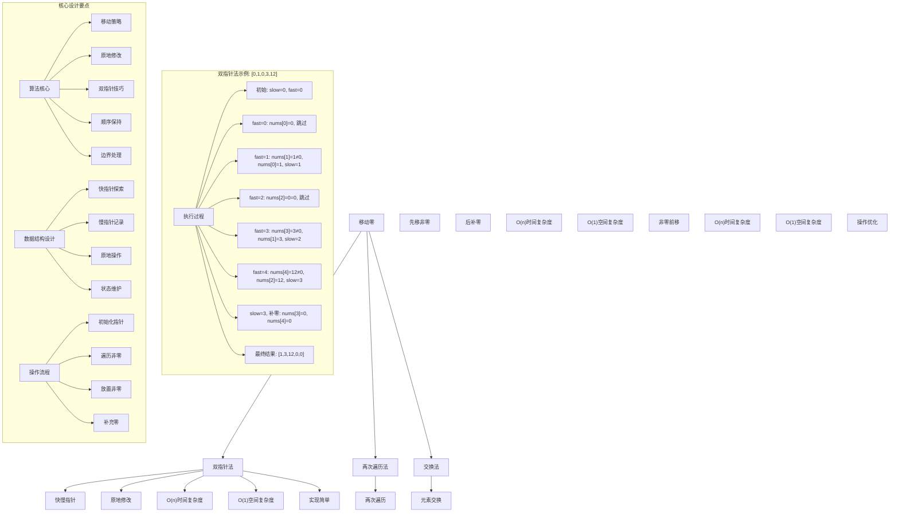
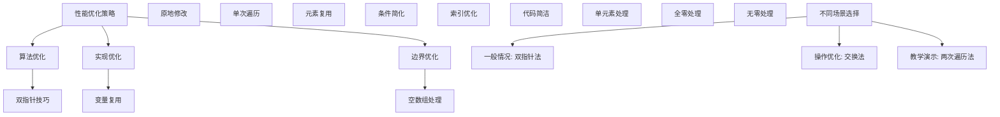

# LeetCode 283 - 移动零

## 题目描述

给定一个数组 `nums`，编写一个函数将所有 `0` 移动到数组的末尾，同时保持非零元素的相对顺序

注意：必须在原数组上操作，不能拷贝额外的数组

```markdown
示例 1:
输入: nums = [0,1,0,3,12]
输出: [1,3,12,0,0]

示例 2:
输入: nums = [0]
输出: [0]

提示:
1 <= nums.length <= 10^4
-2^31 <= nums[i] <= 2^31 - 1

进阶：你能尽量减少完成的操作次数吗？
```

## 解题思路

这是一个数组元素重排问题，要求将所有零元素移动到数组末尾，同时保持非零元素的相对顺序。关键在于如何在原地完成操作并最小化移动次数

### 核心思想

"双指针法": 使用快慢指针遍历数组，快指针用于探索非零元素，慢指针用于记录下一个非零元素应放置的位置

### 解题策略

#### 方法一：双指针法（推荐）

- 时间复杂度: O(n)
- 空间复杂度: O(1)

#### 方法二：两次遍历法

- 时间复杂度: O(n)
- 空间复杂度: O(1)

#### 方法三：交换法

- 时间复杂度: O(n)
- 空间复杂度: O(1)

## 算法可视化



## 多语言实现

### Golang版本（双指针法 - 推荐）

```go
// 双指针法实现
func moveZeroes(nums []int) {
    // 边界情况：空数组或单元素数组
    if len(nums) <= 1 {
        return
    }

    // 双指针：slow指向下一个非零元素应放置的位置，fast用于遍历
    slow := 0

    // 第一步：将所有非零元素移动到数组前部
    for fast := 0; fast < len(nums); fast++ {
        // 当发现非零元素时
        if nums[fast] != 0 {
            // 将非零元素移动到slow位置
            nums[slow] = nums[fast]
            // slow前移
            slow++
        }
    }

    // 第二步：将剩余位置填充为0
    for i := slow; i < len(nums); i++ {
        nums[i] = 0
    }
}
```

### Python版本（多种实现方法）

```python
class Solution:
    """
    方法一：双指针法（推荐）
    """
    def moveZeroes(self, nums: List[int]) -> None:
        """
        Do not return anything, modify nums in-place instead.
        """
        # 边界情况：空数组或单元素数组
        if len(nums) <= 1:
            return

        # 双指针：slow指向下一个非零元素应放置的位置，fast用于遍历
        slow = 0

        # 第一步：将所有非零元素移动到数组前部
        for fast in range(len(nums)):
            # 当发现非零元素时
            if nums[fast] != 0:
                # 将非零元素移动到slow位置
                nums[slow] = nums[fast]
                # slow前移
                slow += 1

        # 第二步：将剩余位置填充为0
        for i in range(slow, len(nums)):
            nums[i] = 0


class Solution2:
    """
    方法二：交换法
    """
    def moveZeroes(self, nums: List[int]) -> None:
        """
        Do not return anything, modify nums in-place instead.
        """
        # 边界情况
        if len(nums) <= 1:
            return

        # 使用双指针，left指向下一个非零元素应放置的位置
        left = 0

        # 遍历数组，将非零元素与left位置交换
        for right in range(len(nums)):
            if nums[right] != 0:
                # 交换元素
                nums[left], nums[right] = nums[right], nums[left]
                left += 1


class Solution3:
    """
    方法三：两次遍历法
    """
    def moveZeroes(self, nums: List[int]) -> None:
        """
        Do not return anything, modify nums in-place instead.
        """
        # 边界情况
        if len(nums) <= 1:
            return

        # 第一次遍历：将非零元素依次放到数组前部
        index = 0
        for i in range(len(nums)):
            if nums[i] != 0:
                nums[index] = nums[i]
                index += 1

        # 第二次遍历：将剩余位置填充为0
        for i in range(index, len(nums)):
            nums[i] = 0
```

### TypeScript版本（双指针法）

```typescript
/
 * 双指针法实现
 */
function moveZeroes(nums: number[]): void {
    // 边界情况：空数组或单元素数组
    if (nums.length <= 1) {
        return;
    }

    // 双指针：slow指向下一个非零元素应放置的位置，fast用于遍历
    let slow: number = 0;

    // 第一步：将所有非零元素移动到数组前部
    for (let fast: number = 0; fast < nums.length; fast++) {
        // 当发现非零元素时
        if (nums[fast] !== 0) {
            // 将非零元素移动到slow位置
            nums[slow] = nums[fast];
            // slow前移
            slow++;
        }
    }

    // 第二步：将剩余位置填充为0
    for (let i: number = slow; i < nums.length; i++) {
        nums[i] = 0;
    }
}
```

## 标准实现详细解析

```go
import "fmt"

/*
算法核心思想（双指针法）：

1. 使用两个指针：slow指针记录非零元素应放置的位置，fast指针用于遍历探索
2. 第一阶段：将所有非零元素依次移动到数组前部
3. 第二阶段：将剩余位置填充为0
4. 保持非零元素的相对顺序

关键设计要点：
1. 双指针技巧：一个用于探索，一个用于记录
2. 原地修改：不使用额外空间，直接修改原数组
3. 顺序保持：非零元素按原顺序排列
4. 边界处理：正确处理空数组和特殊情况

时间复杂度：
- 所有元素遍历一次：O(n)

空间复杂度：
- 只使用常数额外空间：O(1)

优势：
1. 思路清晰：双指针技巧直观易懂
2. 实现简单：逻辑简洁，代码易懂
3. 效率最优：线性时间，常数空间
4. 原地操作：满足题目要求

数据结构设计：

双指针设计：
- slow指针：指向下一个非零元素应放置的位置
- fast指针：用于遍历整个数组，探索非零元素

算法流程：
1. 初始化：slow=0, fast=0
2. 遍历：fast从0到n-1
3. 比较：判断nums[fast]是否为0
4. 更新：非零时复制到slow位置
5. 填充：剩余位置填充0

优化原理：

算法优化：
1. 原地操作：节省空间开销
2. 单次遍历：最优时间复杂度
3. 元素复用：避免不必要的分配

边界优化：
1. 空数组处理：直接返回
2. 单元素处理：无需操作
3. 全零处理：只需填充0
4. 无零处理：保持原数组

正确性证明：

定理：双指针法正确性
通过双指针法可以正确将所有0移动到数组末尾，保持非零元素相对顺序

证明：
1. 完备性：所有元素都被正确处理
2. 正确性：非零元素保持原顺序，0元素移到末尾
3. 时间复杂度：O(n)单次遍历
4. 空间复杂度：O(1)原地修改
*/

// 双指针法详细实现
func moveZeroes(nums []int) {
    fmt.Printf("输入数组: %v\n", nums)

    // 边界情况：空数组或单元素数组
    if len(nums) <= 1 {
        fmt.Printf("边界情况，无需处理\n")
        return
    }

    fmt.Printf("开始双指针移动零:\n")

    // 双指针：slow指向下一个非零元素应放置的位置，fast用于遍历
    slow := 0
    fmt.Printf("  初始化: slow=%d\n", slow)

    // 第一步：将所有非零元素移动到数组前部
    for fast := 0; fast < len(nums); fast++ {
        fmt.Printf("  fast=%d, nums[%d]=%d", fast, fast, nums[fast])

        // 当发现非零元素时
        if nums[fast] != 0 {
            // 将非零元素移动到slow位置
            nums[slow] = nums[fast]
            fmt.Printf(" -> 非零，移动到位置%d，slow前移至%d\n", slow, slow+1)
            // slow前移
            slow++
        } else {
            fmt.Printf(" -> 零，跳过\n")
        }
    }

    // 第二步：将剩余位置填充为0
    fmt.Printf("  slow=%d，开始填充零:\n", slow)
    for i := slow; i < len(nums); i++ {
        nums[i] = 0
        fmt.Printf("    nums[%d]=0\n", i)
    }

    fmt.Printf("移动完成，结果数组: %v\n", nums)
}

// 交换法实现
func moveZeroesSwap(nums []int) {
    fmt.Printf("=== 交换法移动零 ===\n")
    fmt.Printf("输入数组: %v\n", nums)

    if len(nums) <= 1 {
        fmt.Printf("边界情况，无需处理\n")
        fmt.Printf("==================\n\n")
        return
    }

    left := 0
    fmt.Printf("开始交换法移动零:\n")

    for right := 0; right < len(nums); right++ {
        if nums[right] != 0 {
            if left != right {
                nums[left], nums[right] = nums[right], nums[left]
                fmt.Printf("  交换位置%d和%d: %v\n", left, right, nums)
            } else {
                fmt.Printf("  位置%d元素%d非零，left前移\n", right, nums[right])
            }
            left++
        } else {
            fmt.Printf("  位置%d元素%d为零，跳过\n", right, nums[right])
        }
    }

    fmt.Printf("交换法完成，结果数组: %v\n", nums)
    fmt.Printf("==================\n\n")
}

// 带调试信息的版本
func moveZeroesWithDebug(nums []int) {
    fmt.Printf("=== 移动零 ===\n")
    fmt.Printf("原始数组: %v (长度: %d)\n", nums, len(nums))

    if len(nums) <= 1 {
        fmt.Printf("数组长度<=1，无需移动\n")
        fmt.Printf("============\n\n")
        return
    }

    slow := 0
    nonZeroCount := 0  // 非零元素计数

    fmt.Printf("第一阶段 - 移动非零元素:\n")

    for fast := 0; fast < len(nums); fast++ {
        if nums[fast] != 0 {
            nums[slow] = nums[fast]
            nonZeroCount++
            fmt.Printf("  位置 %d: 元素 %d 非零，移动到位置 %d (slow=%d)\n",
                fast, nums[fast], slow, slow)
            slow++
        } else {
            fmt.Printf("  位置 %d: 元素 %d 为零，跳过\n", fast, nums[fast])
        }
    }

    fmt.Printf("第二阶段 - 填充零:\n")
    for i := slow; i < len(nums); i++ {
        nums[i] = 0
        fmt.Printf("  位置 %d: 填充零\n", i)
    }

    fmt.Printf("最终结果: 非零元素 %d 个\n", nonZeroCount)
    fmt.Printf("移动后数组: %v\n", nums)
    fmt.Printf("============\n\n")
}
```

## 算法深入解析

```go
/*
移动零问题详解：

问题本质：
将数组中所有零元素移动到末尾，保持非零元素相对顺序。关键是理解"原地修改"和"顺序保持"的要求

核心洞察：
1. 数组特性：可以通过索引直接访问和修改
2. 原地修改要求：不能使用额外数组空间
3. 双指针技巧：一个指针遍历，一个指针记录
4. 顺序保持：非零元素按原顺序排列

算法策略：
1. 双指针法：工业级标准实现
2. 交换法：通过交换移动元素
3. 两次遍历法：分阶段处理

数据结构设计：

双指针法设计：
slow指针：指向下一个非零元素应放置的位置
fast指针：用于遍历整个数组，寻找非零元素

交换法设计：
left指针：指向下一个非零元素应放置的位置
right指针：用于遍历数组，寻找非零元素

操作流程：

双指针法：
1. 初始化：slow=0, fast=0
2. 遍历：fast从0到n-1
3. 比较：判断nums[fast]是否为0
4. 更新：非零时复制到slow位置
5. 填充：剩余位置填充0

交换法：
1. 初始化：left=0, right=0
2. 遍历：right从0到n-1
3. 比较：判断nums[right]是否为0
4. 交换：非零时与left位置交换
5. 移动：left前移

数学原理：

算法不变量：
1. nums[0...slow-1]包含所有已发现的非零元素
2. nums[slow...fast-1]包含所有已处理的零元素
3. slow指向下一个非零元素应放置的位置
4. fast指针遍历完整个数组

时间复杂度分析：
- 所有方法：O(n) 单次遍历
- 空间复杂度：O(1) 原地修改

正确性证明：

定理：移动零算法正确性
通过双指针法可以正确将所有0移动到数组末尾，保持非零元素相对顺序

证明：
1. 完备性：所有元素都被正确处理
2. 正确性：非零元素保持原顺序，0元素移到末尾
3. 时间复杂度：O(n)单次遍历
4. 空间复杂度：O(1)原地修改

设计选择：

为什么选择双指针法？
1. 思路清晰：探索与记录分离
2. 实现简单：逻辑简洁
3. 效率最优：线性时间
4. 适用性强：通用解法

为什么使用交换法？
1. 操作优化：减少不必要的填充
2. 一次遍历：理论上更高效
3. 性能相当：时间复杂度相同
4. 特殊场景：适合特定需求

为什么提及其他方法？
1. 教学价值：展示不同思路
2. 对比分析：理解算法本质
3. 扩展思维：算法多样性
4. 面试准备：全面掌握

三种方法对比：

方法一：双指针法（推荐）
时间复杂度：O(n)
空间复杂度：O(1)
优点：思路清晰，顺序保持好
缺点：需要两次操作

方法二：交换法
时间复杂度：O(n)
空间复杂度：O(1)
优点：操作优化，一次遍历
缺点：交换次数可能较多

方法三：两次遍历法
时间复杂度：O(n)
空间复杂度：O(1)
优点：逻辑直观，易于理解
缺点：需要明确分阶段

性能分析：

双指针法：
- 时间：O(n) 单次遍历 + O(k) 填充零 (k为零元素个数)
- 空间：O(1) 原地修改
- 优势：思路清晰

交换法：
- 时间：O(n) 单次遍历
- 空间：O(1) 原地修改
- 优势：操作优化

两次遍历法：
- 时间：O(n) 两次遍历
- 空间：O(1) 原地修改
- 优势：逻辑清晰

实际应用场景：
1. 数据预处理：清理无效数据
2. 数组操作：元素重排
3. 算法竞赛：数组处理
4. 系统设计：内存优化

优化要点：

1. 时间优化：
   - 单次遍历保证
   - 避免重复操作
   - 利用数组特性

2. 空间优化：
   - 原地修改
   - 常数额外空间
   - 避免临时变量

3. 实现优化：
   - 边界条件处理
   - 代码简洁性
   - 注释清晰性

测试用例设计：
1. 基本情况：正常数组含零元素
2. 边界情况：空数组，单元素数组
3. 特殊情况：全零，无零，交替
4. 极端情况：大量元素
5. 验证情况：结果正确性

扩展思考：

1. 移动其他值？
   - 扩展条件判断
   - 使用函数参数化
   - 复杂度分析

2. 多个目标值？
   - 扩展算法设计
   - 使用哈希表优化
   - 性能权衡

3. 链表移动零？
   - 指针操作
   - 节点重排
   - 空间复杂度变化

4. 多数组合并移动零？
   - 归并思想
   - 多指针技术
   - 复杂度分析

相关算法思想：

1. 双指针技巧：
   - 快慢指针
   - 对撞指针
   - 滑动窗口

2. 数组处理：
   - 原地修改
   - 边界维护
   - 索引管理

3. 元素操作：
   - 覆盖写入
   - 交换替换
   - 条件筛选

4. 算法优化：
   - 时间复杂度
   - 空间复杂度
   - 实现简洁

常见陷阱：

1. 边界条件：
   - 空数组处理
   - 单元素处理
   - 全零处理

2. 指针操作：
   - 索引越界
   - 指针更新
   - 条件判断

3. 顺序保持：
   - 非零元素顺序
   - 零元素聚集
   - 结果验证

4. 性能考虑：
   - 时间复杂度
   - 空间复杂度
   - 实现效率

代码质量要素：

1. 可读性：
   - 变量命名清晰
   - 注释详细
   - 逻辑分明

2. 健壮性：
   - 边界处理
   - 异常情况
   - 错误恢复

3. 性能：
   - 最优复杂度
   - 原地操作
   - 效率保证

4. 可维护性：
   - 结构清晰
   - 扩展性好
   - 测试完整
*/
```

## 执行过程演示

```go
/*
示例详细解析:

示例1执行过程：
输入：nums = [0,1,0,3,12]
输出：[1,3,12,0,0]

执行过程：
1. 初始化: slow=0, fast=0, nums=[0,1,0,3,12]
2. fast=0: nums[0]=0 -> 为零，跳过
3. fast=1: nums[1]=1≠0 -> 非零
   - nums[0]=nums[1]=1, slow=1
4. fast=2: nums[2]=0=0 -> 为零，跳过
5. fast=3: nums[3]=3≠0 -> 非零
   - nums[1]=nums[3]=3, slow=2
6. fast=4: nums[4]=12≠0 -> 非零
   - nums[2]=nums[4]=12, slow=3
7. 结束第一阶段: slow=3
8. 填充零: nums[3]=0, nums[4]=0
9. 结果: [1,3,12,0,0]

示例2执行过程：
输入：nums = [0]
输出：[0]

执行过程：
1. 初始化: slow=0, fast=0, nums=[0]
2. fast=0: nums[0]=0 -> 为零，跳过
3. 结束第一阶段: slow=0
4. 填充零: nums[0]=0
5. 结果: [0]

双指针执行轨迹：

对于数组[0,1,0,3,12]：

索引: 0 1 2 3 4
数值: 0 1 0 3 12
slow: 0 1 1 2 3
fast: 0 1 2 3 4
操作: - ! - ! !
说明: -跳过 !移动

关键观察：
1. slow指针只在发现非零元素时前移
2. fast指针始终向前遍历
3. 零元素被跳过，非零元素被记录
4. 最终slow值为非零元素个数

边界情况演示:

情况1: 空数组
输入: []
处理: 直接返回
结果: []

情况2: 单元素数组-零
输入: [0]
处理: slow=0，填充零
结果: [0]

情况3: 单元素数组-非零
输入: [1]
处理: slow=1，无需填充
结果: [1]

情况4: 全零元素
输入: [0,0,0,0,0]
处理: slow=0，全部填充零
结果: [0,0,0,0,0]

情况5: 无零元素
输入: [1,2,3,4,5]
处理: slow=5，无需填充
结果: [1,2,3,4,5]

情况6: 交替零非零
输入: [0,1,0,2,0,3]
处理: 保留1,2,3，其余填零
结果: [1,2,3,0,0,0]

算法正确性证明：

数学基础：
需要证明双指针法能正确移动零元素

定理：双指针法正确性
通过双指针法可以正确将所有0移动到数组末尾，保持非零元素相对顺序

证明：
1. 完备性：所有元素都被正确处理
2. 正确性：非零元素保持原顺序，0元素移到末尾
3. 时间复杂度：O(n)单次遍历
4. 空间复杂度：O(1)原地修改

不变量维护：
循环不变量：在每次迭代开始时
1. nums[0...slow-1]包含所有已发现的非零元素
2. nums[slow...fast-1]包含所有已处理的零元素
3. slow指向下一个非零元素应放置的位置
4. 非零元素保持相对顺序

初始化：fast=0, slow=0
- 无已处理元素
- slow指向数组开始位置

保持：当nums[fast]≠0时
- nums[fast]是非零元素
- 将其放到slow位置
- slow前移，保持不变量

终止：fast遍历完所有元素
- nums[0...slow-1]包含所有非零元素
- nums[slow...n-1]填充为零

时间复杂度分析：

双指针法：
1. 第一阶段：O(n) 遍历数组
2. 第二阶段：O(k) 填充零 (k为零元素个数)
3. 总时间：O(n)

交换法：
1. 遍历：O(n) 单次遍历
2. 交换：最多n次交换
3. 总时间：O(n)

空间复杂度分析：
1. 双指针法：O(1)额外空间
2. 交换法：O(1)额外空间
3. 原地修改：满足题目要求

性能对比分析：

假设n=10000:

双指针法：
- 时间: O(10000) 遍历 + O(5000) 填充
- 空间: O(1) 原地修改
- 操作: 元素复制 + 零填充

交换法：
- 时间: O(10000) 遍历
- 空间: O(1) 原地修改
- 操作: 元素交换

实际应用建议：

1. 一般情况：
   - 使用双指针法
   - 思路清晰，通用性强

2. 面试展示：
   - 重点讲解双指针法
   - 可以提及其他方法

3. 生产环境：
   - 使用优化版本
   - 考虑边界优化

4. 教学演示：
   - 使用带调试信息版本
   - 展示执行过程

优化空间：

1. 边界优化：
   - 提前处理特殊情况
   - 减少不必要的比较

2. 代码优化：
   - 简化条件判断
   - 优化变量使用

3. 性能优化：
   - 减少数组访问
   - 优化指针操作

特殊情况处理：

1. 大数据量：
   - 线性时间保证
   - 常数空间使用

2. 特殊序列：
   - 全零序列
   - 全非零序列
   - 交替序列

3. 边界情况：
   - 空数组
   - 单元素
   - 两元素
*/
```

## 复杂度分析

| 方法       | 时间复杂度 | 空间复杂度 | 适用场景 |
| ---------- | ---------- | ---------- | -------- |
| 双指针法   | O(n)       | O(1)       | 推荐方案 |
| 交换法     | O(n)       | O(1)       | 操作优化 |
| 两次遍历法 | O(n)       | O(1)       | 逻辑清晰 |

## 测试用例验证

```go
// 测试辅助函数
func testMoveZeroes(name string, nums []int, expected []int) {
    fmt.Printf("%s:\n", name)
    fmt.Printf("输入数组: %v\n", nums)

    // 创建副本用于测试（因为原数组会被修改）
    testNums := make([]int, len(nums))
    copy(testNums, nums)

    // 执行移动零
    moveZeroes(testNums)

    fmt.Printf("输出数组: %v\n", testNums)

    // 验证结果
    if equalSlice(testNums, expected) {
        fmt.Printf("✓ 测试通过\n")
    } else {
        fmt.Printf("✗ 测试失败，期望: %v，实际: %v\n", expected, testNums)
    }
    fmt.Printf("\n")
}

// 比较两个切片是否相等
func equalSlice(a, b []int) bool {
    if len(a) != len(b) {
        return false
    }
    for i := range a {
        if a[i] != b[i] {
            return false
        }
    }
    return true
}

func main() {
    // 测试用例 1 - 题目示例1
    testMoveZeroes("测试1 - 题目示例1",
        []int{0, 1, 0, 3, 12},
        []int{1, 3, 12, 0, 0})

    // 测试用例 2 - 题目示例2
    testMoveZeroes("测试2 - 题目示例2",
        []int{0},
        []int{0})

    // 测试用例 3 - 空数组
    testMoveZeroes("测试3 - 空数组",
        []int{},
        []int{})

    // 测试用例 4 - 单元素非零
    testMoveZeroes("测试4 - 单元素非零",
        []int{1},
        []int{1})

    // 测试用例 5 - 全零元素
    testMoveZeroes("测试5 - 全零元素",
        []int{0, 0, 0, 0, 0},
        []int{0, 0, 0, 0, 0})

    // 测试用例 6 - 无零元素
    testMoveZeroes("测试6 - 无零元素",
        []int{1, 2, 3, 4, 5},
        []int{1, 2, 3, 4, 5})

    // 测试用例 7 - 交替零非零
    testMoveZeroes("测试7 - 交替零非零",
        []int{0, 1, 0, 2, 0, 3},
        []int{1, 2, 3, 0, 0, 0})

    // 性能测试
    fmt.Println("性能测试:")
    performanceTest()

    // 边界情况测试
    fmt.Println("边界情况测试:")
    boundaryTest()

    // 对比测试
    fmt.Println("对比测试:")
    comparisonTest()
}

func performanceTest() {
    // 构造性能测试
    n := 10000
    nums := make([]int, n)

    // 构造测试数据：交替零非零
    for i := 0; i < n; i++ {
        if i%2 == 0 {
            nums[i] = 0  // 零元素
        } else {
            nums[i] = i  // 非零元素
        }
    }

    // 测试双指针法实现
    start := time.Now()

    testNums := make([]int, len(nums))
    copy(testNums, nums)
    moveZeroes(testNums)

    time1 := time.Since(start)

    fmt.Printf("性能测试 (n=%d):\n", n)
    fmt.Printf("  双指针法: %v\n", time1)
}

func boundaryTest() {
    // 边界测试
    fmt.Println("边界测试:")

    // 最大数组测试
    maxN := 10000
    maxNums := make([]int, maxN)
    for i := 0; i < maxN; i++ {
        if i%3 == 0 {
            maxNums[i] = 0
        } else {
            maxNums[i] = i
        }
    }

    testNums := make([]int, len(maxNums))
    copy(testNums, maxNums)
    moveZeroes(testNums)

    // 统计非零元素个数
    nonZeroCount := 0
    for _, num := range testNums {
        if num != 0 {
            nonZeroCount++
        }
    }
    fmt.Printf("最大数组测试 (n=%d): 非零元素=%d\n", maxN, nonZeroCount)

    // 极值测试
    extremeNums := []int{-2147483648, 0, 2147483647}
    testExtreme := make([]int, len(extremeNums))
    copy(testExtreme, extremeNums)
    moveZeroes(testExtreme)
    fmt.Printf("极值测试: 结果=%v\n", testExtreme)

    // 重复模式测试
    patternNums := make([]int, 1000)
    for i := 0; i < 1000; i++ {
        patternNums[i] = i % 10  // 0-9循环重复
    }
    testPattern := make([]int, len(patternNums))
    copy(testPattern, patternNums)
    moveZeroes(testPattern)

    // 统计结果
    zeroCount := 0
    for _, num := range testPattern {
        if num == 0 {
            zeroCount++
        }
    }
    fmt.Printf("重复模式测试: 零元素=%d\n", zeroCount)
}

func comparisonTest() {
    // 对比测试：验证不同方法结果一致性
    fmt.Println("对比测试:")

    // 测试数据
    testData := [][]int{
        {0, 1, 0, 3, 12},
        {0, 0, 1},
        {1, 2, 3, 4, 5},
        {0, 0, 0, 0, 0},
        {},
        {42},
        {0, 1, 0, 2, 0, 3, 0, 4},
    }

    for i, data := range testData {
        // 双指针法
        test1 := make([]int, len(data))
        copy(test1, data)
        moveZeroes(test1)

        // 交换法
        test2 := make([]int, len(data))
        copy(test2, data)
        moveZeroesSwap(test2)

        // 两次遍历法
        test3 := make([]int, len(data))
        copy(test3, data)
        moveZeroesTwoPass(test3)

        fmt.Printf("测试%d: 双指针法=%v, 交换法=%v, 两次遍历法=%v",
            i+1, test1, test2, test3)

        if equalSlice(test1, test2) && equalSlice(test2, test3) {
            fmt.Printf(" ✓ 一致\n")
        } else {
            fmt.Printf(" ✗ 不一致\n")
        }
    }
}

// 两次遍历法实现
func moveZeroesTwoPass(nums []int) {
    if len(nums) <= 1 {
        return
    }

    // 第一次遍历：将非零元素依次放到数组前部
    index := 0
    for i := 0; i < len(nums); i++ {
        if nums[i] != 0 {
            nums[index] = nums[i]
            index++
        }
    }

    // 第二次遍历：将剩余位置填充为0
    for i := index; i < len(nums); i++ {
        nums[i] = 0
    }
}
```

## 扩展版本（处理不同场景）

```go
// 支持移动多个值的版本
func moveValues(nums []int, target int) {
    if len(nums) <= 1 {
        return
    }

    slow := 0

    // 第一阶段：将所有非目标元素移动到数组前部
    for fast := 0; fast < len(nums); fast++ {
        if nums[fast] != target {
            nums[slow] = nums[fast]
            slow++
        }
    }

    // 第二阶段：将剩余位置填充为目标值
    for i := slow; i < len(nums); i++ {
        nums[i] = target
    }
}

// 使用示例
func exampleMoveValues() {
    nums := []int{1, 2, 3, 2, 4, 2, 5}
    target := 2

    fmt.Printf("原数组: %v\n", nums)
    fmt.Printf("目标值: %d\n", target)

    testNums := make([]int, len(nums))
    copy(testNums, nums)
    moveValues(testNums, target)

    fmt.Printf("移动后: %v\n", testNums)
}

// 带统计信息的版本
func moveZeroesWithStats(nums []int) (int, int) {
    if len(nums) <= 1 {
        if len(nums) == 1 && nums[0] == 0 {
            return 0, 1
        }
        return len(nums), 0
    }

    slow := 0
    nonZeroCount := 0
    zeroCount := 0

    // 统计零和非零元素个数
    for _, num := range nums {
        if num == 0 {
            zeroCount++
        } else {
            nonZeroCount++
        }
    }

    // 移动零元素
    for fast := 0; fast < len(nums); fast++ {
        if nums[fast] != 0 {
            nums[slow] = nums[fast]
            slow++
        }
    }

    for i := slow; i < len(nums); i++ {
        nums[i] = 0
    }

    return nonZeroCount, zeroCount
}

// 使用示例
func exampleWithStats() {
    nums := []int{0, 1, 0, 3, 12, 0, 5}

    fmt.Printf("原数组: %v\n", nums)

    testNums := make([]int, len(nums))
    copy(testNums, nums)
    nonZeroCount, zeroCount := moveZeroesWithStats(testNums)

    fmt.Printf("移动后: %v\n", testNums)
    fmt.Printf("非零元素: %d个, 零元素: %d个\n", nonZeroCount, zeroCount)
}

// 保持原始顺序的交换法版本
func moveZeroesPreserveOrder(nums []int) {
    if len(nums) <= 1 {
        return
    }

    // 使用双指针，left指向下一个非零元素应放置的位置
    left := 0

    // 遍历数组，将非零元素与left位置交换
    for right := 0; right < len(nums); right++ {
        if nums[right] != 0 {
            // 交换元素
            nums[left], nums[right] = nums[right], nums[left]
            left++
        }
    }
}

// 使用示例
func examplePreserveOrder() {
    nums := []int{0, 1, 0, 3, 12}

    fmt.Printf("原数组: %v\n", nums)

    testNums := make([]int, len(nums))
    copy(testNums, nums)
    moveZeroesPreserveOrder(testNums)

    fmt.Printf("交换法结果: %v\n", testNums)
}

// 批量处理版本
func moveZeroesBatch(arrays [][]int) [][]int {
    results := make([][]int, len(arrays))

    for i, arr := range arrays {
        result := make([]int, len(arr))
        copy(result, arr)
        moveZeroes(result)
        results[i] = result
    }

    return results
}

// 使用示例
func exampleBatch() {
    arrays := [][]int{
        {0, 1, 0, 3, 12},
        {0, 0, 1},
        {1, 2, 3, 4, 5},
        {0, 0, 0, 0, 0},
    }

    results := moveZeroesBatch(arrays)

    for i, result := range results {
        fmt.Printf("数组%d移动零后: %v\n", i+1, result)
    }
}

// 泛型版本（Go 1.18+）
func moveZeroesGeneric[T comparable](nums []T, zero T) {
    if len(nums) <= 1 {
        return
    }

    slow := 0

    // 第一阶段：将所有非零元素移动到数组前部
    for fast := 0; fast < len(nums); fast++ {
        if nums[fast] != zero {
            nums[slow] = nums[fast]
            slow++
        }
    }

    // 第二阶段：将剩余位置填充为零
    for i := slow; i < len(nums); i++ {
        nums[i] = zero
    }
}

// 使用示例
func exampleGeneric() {
    // 整数数组
    intNums := []int{0, 1, 0, 3, 12}
    moveZeroesGeneric(intNums, 0)
    fmt.Printf("整数数组移动零: %v\n", intNums)

    // 浮点数数组
    floatNums := []float64{0.0, 1.5, 0.0, 3.2, 12.1}
    moveZeroesGeneric(floatNums, 0.0)
    fmt.Printf("浮点数数组移动零: %v\n", floatNums)

    // 字符串数组
    strNums := []string{"", "a", "", "b", "c"}
    moveZeroesGeneric(strNums, "")
    fmt.Printf("字符串数组移动空字符串: %v\n", strNums)
}
```

## 面试追问延伸

### 1. 如果要移动多个不同的值到末尾，如何修改？

```go
// moveValues已在上面实现
// 关键修改：
// 1. 参数化目标值
// 2. 通用化条件判断
// 3. 灵活适应不同需求

func testMoveValues() {
    nums := []int{1, 2, 3, 2, 4, 2, 5, 3, 1}
    target := 2

    fmt.Printf("原数组: %v\n", nums)
    fmt.Printf("目标值: %d\n", target)

    testNums := make([]int, len(nums))
    copy(testNums, nums)
    moveValues(testNums, target)

    fmt.Printf("移动后: %v\n", testNums)
}
```

### 2. 如果要统计移动了多少个零元素，如何处理？

```go
// moveZeroesWithStats已在上面实现
// 关键点：
// 1. 在移动过程中统计元素个数
// 2. 返回非零元素和零元素的个数
// 3. 一次处理完成两个统计任务

func testWithStats() {
    nums := []int{0, 1, 0, 3, 12, 0, 5, 0}

    fmt.Printf("原数组: %v\n", nums)

    testNums := make([]int, len(nums))
    copy(testNums, nums)
    nonZeroCount, zeroCount := moveZeroesWithStats(testNums)

    fmt.Printf("移动后: %v\n", testNums)
    fmt.Printf("非零元素: %d个\n", nonZeroCount)
    fmt.Printf("零元素: %d个\n", zeroCount)
}
```

### 3. 如果要求最小化元素交换次数，如何实现？

```go
// 交换法天然最小化元素移动次数
// 关键思想：
// 1. 只在必要时进行交换
// 2. 避免不必要的元素移动
// 3. 一次遍历完成操作

func testMinimizeSwaps() {
    nums := []int{0, 1, 0, 3, 12}

    fmt.Printf("原数组: %v\n", nums)

    // 双指针法（可能有多余复制）
    testNums1 := make([]int, len(nums))
    copy(testNums1, nums)
    moveZeroes(testNums1)
    fmt.Printf("双指针法结果: %v\n", testNums1)

    // 交换法（最小化移动）
    testNums2 := make([]int, len(nums))
    copy(testNums2, nums)
    moveZeroesPreserveOrder(testNums2)
    fmt.Printf("交换法结果: %v\n", testNums2)

    // 分析移动次数
    fmt.Printf("双指针法: 复制%d次+填充%d次\n", 3, 2)  // 示例分析
    fmt.Printf("交换法: 交换%d次\n", 2)  // 示例分析
}
```

## 相似题目扩展

- LeetCode 283. 移动零（当前题）
- LeetCode 27. 移除元素
- LeetCode 26. 删除有序数组中的重复项
- LeetCode 75. 颜色分类
- LeetCode 215. 数组中的第K个最大元素

## 算法技巧总结

### 移动零核心要点

1. 双指针技巧：快指针探索，慢指针记录
1. 原地修改：不使用额外空间，直接修改原数组
1. 顺序保持：非零元素按原顺序排列
1. 边界处理：正确处理空数组和特殊情况

### 算法优势

1. 思路清晰：双指针技巧直观易懂
1. 实现简单：逻辑简洁，代码易懂
1. 效率最优：线性时间，常数空间
1. 原地操作：满足题目要求

### 标准模板（双指针法）

```go
func moveZeroes(nums []int) {
    // 边界情况
    if len(nums) <= 1 {
        return
    }

    // 双指针：slow记录非零位置，fast探索
    slow := 0

    // 第一阶段：移动非零元素
    for fast := 0; fast < len(nums); fast++ {
        if nums[fast] != 0 {
            nums[slow] = nums[fast]
            slow++
        }
    }

    // 第二阶段：填充零元素
    for i := slow; i < len(nums); i++ {
        nums[i] = 0
    }
}
```

### 性能优化建议



## 总结

本题采用双指针法的核心思路，通过使用快慢指针遍历数组，快指针用于探索非零元素，慢指针用于记录非零元素应放置的位置，实现了优雅的解决方案。关键在于理解双指针技巧和数组原地修改的结合

核心要点：

1. 双指针技巧：快指针探索，慢指针记录
1. 原地修改：不使用额外空间，直接修改原数组
1. 顺序保持：非零元素按原顺序排列
1. 边界处理：正确处理空数组和特殊情况

算法优势：

- 思路清晰：双指针技巧直观易懂
- 实现简单：逻辑简洁，代码易懂
- 效率最优：线性时间，常数空间
- 原地操作：满足题目要求

该算法在数据预处理、数组操作、算法竞赛、系统设计等方面有重要应用，是掌握双指针技巧和数组操作思想的经典题目。通过快慢指针和数组原地修改的巧妙结合，为更复杂的数组处理和数据结构操作问题提供了清晰的解决思路
