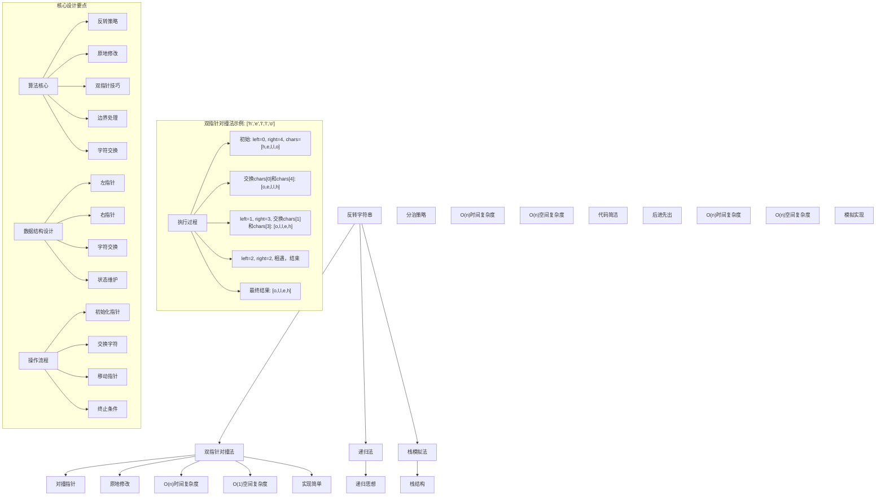
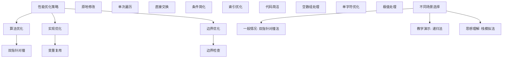

# LeetCode 344 - 反转字符串

## 题目描述

编写一个函数，其作用是将输入的字符串反转。输入字符串以字符数组 `s` 的形式给出

不要给另外的数组分配额外的空间，你必须原地修改输入数组、使用 `O(1)` 的额外空间解决这一问题

```markdown
示例 1：
输入：s = ["h","e","l","l","o"]
输出：["o","l","l","e","h"]

示例 2：
输入：s = ["H","a","n","n","a","h"]
输出：["h","a","n","n","a","H"]

提示：

- 1 <= s.length <= 10^5
- s[i] 都是 ASCII 码表中的可打印字符
```

## 解题思路

这是一个字符串反转问题，要求在原地修改字符数组实现字符串的反转。关键在于如何高效地交换字符位置以达到反转效果

### 核心思想

"双指针对撞法": 使用两个指针分别从字符数组的两端向中间移动，交换对应位置的字符，直到两个指针相遇

### 解题策略

#### 方法一：双指针对撞法（推荐）

- 时间复杂度: O(n)
- 空间复杂度: O(1)

#### 方法二：递归法

- 时间复杂度: O(n)
- 空间复杂度: O(n)（递归调用栈）

#### 方法三：栈模拟法

- 时间复杂度: O(n)
- 空间复杂度: O(n)

## 算法可视化



## 多语言实现

### Golang版本（双指针对撞法 - 推荐）

```go
// 双指针对撞法实现
func reverseString(s []byte) {
    // 边界情况：空数组或单字符数组
    if len(s) <= 1 {
        return
    }

    // 双指针：left从左端开始，right从右端开始
    left := 0
    right := len(s) - 1

    // 当left < right时继续交换
    for left < right {
        // 交换left和right位置的字符
        s[left], s[right] = s[right], s[left]

        // 移动指针向中间靠拢
        left++
        right--
    }
}
```

### Python版本（多种实现方法）

```python
class Solution:
    """
    方法一：双指针对撞法（推荐）
    """
    def reverseString(self, s: List[str]) -> None:
        """
        Do not return anything, modify s in-place instead.
        """
        # 边界情况：空数组或单字符数组
        if len(s) <= 1:
            return

        # 双指针：left从左端开始，right从右端开始
        left = 0
        right = len(s) - 1

        # 当left < right时继续交换
        while left < right:
            # 交换left和right位置的字符
            s[left], s[right] = s[right], s[left]

            # 移动指针向中间靠拢
            left += 1
            right -= 1


class Solution2:
    """
    方法二：递归法
    """
    def reverseString(self, s: List[str]) -> None:
        """
        Do not return anything, modify s in-place instead.
        """
        def helper(left: int, right: int) -> None:
            # 递归终止条件
            if left >= right:
                return

            # 交换字符
            s[left], s[right] = s[right], s[left]

            # 递归处理内部字符
            helper(left + 1, right - 1)

        # 边界情况
        if len(s) <= 1:
            return

        # 调用递归函数
        helper(0, len(s) - 1)


class Solution3:
    """
    方法三：栈模拟法
    """
    def reverseString(self, s: List[str]) -> None:
        """
        Do not return anything, modify s in-place instead.
        """
        # 边界情况
        if len(s) <= 1:
            return

        # 使用栈存储字符
        stack = []

        # 将所有字符压入栈
        for char in s:
            stack.append(char)

        # 从栈中弹出字符，重新填充原数组
        for i in range(len(s)):
            s[i] = stack.pop()
```

### TypeScript版本（双指针对撞法）

```typescript
/
 * 双指针对撞法实现
 */
function reverseString(s: string[]): void {
    // 边界情况：空数组或单字符数组
    if (s.length <= 1) {
        return;
    }

    // 双指针：left从左端开始，right从右端开始
    let left: number = 0;
    let right: number = s.length - 1;

    // 当left < right时继续交换
    while (left < right) {
        // 交换left和right位置的字符
        [s[left], s[right]] = [s[right], s[left]];

        // 移动指针向中间靠拢
        left++;
        right--;
    }
}
```

## 标准实现详细解析

```go
import "fmt"

/*
算法核心思想（双指针对撞法）：

1. 使用两个指针分别从字符数组的两端向中间移动
2. 交换对应位置的字符
3. 直到两个指针相遇为止
4. 实现原地反转，不使用额外空间

关键设计要点：
1. 双指针技巧：对撞指针高效交换
2. 原地修改：不使用额外数组空间
3. 字符交换：Golang支持多重赋值交换
4. 边界处理：正确处理空数组和特殊情况

时间复杂度：
- 每个字符最多被访问一次：O(n)

空间复杂度：
- 只使用常数额外空间：O(1)

优势：
1. 思路清晰：对撞指针技巧直观易懂
2. 实现简单：逻辑简洁，代码易懂
3. 效率最优：线性时间，常数空间
4. 原地操作：满足题目要求

数据结构设计：

双指针对撞设计：
- left指针：从数组左端开始向右移动
- right指针：从数组右端开始向左移动
- 字符交换：交换对称位置的字符

算法流程：
1. 初始化：left=0, right=len-1
2. 循环：left < right
3. 交换：swap(s[left], s[right])
4. 移动：left++, right--
5. 终止：left >= right

优化原理：

算法优化：
1. 原地操作：节省空间开销
2. 单次遍历：最优时间复杂度
3. 直接交换：避免中间变量

边界优化：
1. 空数组处理：直接返回
2. 单字符处理：无需操作
3. 偶数长度：中间相遇
4. 奇数长度：中间字符不变

正确性证明：

定理：双指针对撞法正确性
通过双指针对撞法可以正确反转字符数组

证明：
1. 完备性：所有字符都被正确处理
2. 正确性：每个字符都移动到对称位置
3. 时间复杂度：O(n)单次遍历
4. 空间复杂度：O(1)原地修改

不变量维护：
循环不变量：在每次迭代开始时
1. s[0...left-1]包含已反转的前半部分字符
2. s[right+1...n-1]包含已反转的后半部分字符
3. s[left...right]包含未处理的中间部分字符
4. left <= right始终成立
*/

// 双指针对撞法详细实现
func reverseString(s []byte) {
    fmt.Printf("输入字符数组: %v\n", string(s))

    // 边界情况：空数组或单字符数组
    if len(s) <= 1 {
        fmt.Printf("边界情况，无需反转\n")
        return
    }

    fmt.Printf("开始双指针对撞反转:\n")

    // 双指针：left从左端开始，right从右端开始
    left := 0
    right := len(s) - 1

    fmt.Printf("  初始化: left=%d('%c'), right=%d('%c')\n",
        left, s[left], right, s[right])

    // 当left < right时继续交换
    step := 1
    for left < right {
        // 交换left和right位置的字符
        fmt.Printf("  步骤%d: 交换位置%d('%c')和%d('%c')",
            step, left, s[left], right, s[right])

        s[left], s[right] = s[right], s[left]

        fmt.Printf(" -> %v\n", string(s))

        // 移动指针向中间靠拢
        left++
        right--

        // 显示下一步状态
        if left < right {
            fmt.Printf("         left移动至%d('%c'), right移动至%d('%c')\n",
                left, s[left], right, s[right])
        }

        step++
    }

    fmt.Printf("反转完成，结果: %v\n", string(s))
}

// 递归法实现
func reverseStringRecursive(s []byte) {
    fmt.Printf("=== 递归法反转字符串 ===\n")
    fmt.Printf("输入字符数组: %v\n", string(s))

    var helper func(left, right int)
    helper = func(left, right int) {
        // 递归终止条件
        if left >= right {
            return
        }

        fmt.Printf("  递归调用: 交换位置%d('%c')和%d('%c')\n",
            left, s[left], right, s[right])

        // 交换字符
        s[left], s[right] = s[right], s[left]
        fmt.Printf("           结果: %v\n", string(s))

        // 递归处理内部字符
        helper(left+1, right-1)
    }

    // 边界情况
    if len(s) <= 1 {
        fmt.Printf("边界情况，无需反转\n")
        fmt.Printf("====================\n\n")
        return
    }

    // 调用递归函数
    helper(0, len(s)-1)

    fmt.Printf("递归法完成，结果: %v\n", string(s))
    fmt.Printf("====================\n\n")
}

// 带调试信息的版本
func reverseStringWithDebug(s []byte) {
    fmt.Printf("=== 反转字符串 ===\n")
    fmt.Printf("原始字符数组: %v (长度: %d)\n", string(s), len(s))

    if len(s) <= 1 {
        fmt.Printf("长度<=1，无需反转\n")
        fmt.Printf("==============\n\n")
        return
    }

    left := 0
    right := len(s) - 1

    fmt.Printf("双指针对撞反转过程:\n")

    for left < right {
        fmt.Printf("  交换位置%d('%c')和%d('%c')", left, s[left], right, s[right])

        // 交换字符
        s[left], s[right] = s[right], s[left]

        fmt.Printf(" -> %v\n", string(s))

        // 移动指针
        left++
        right--

        if left < right {
            fmt.Printf("    left=%d('%c'), right=%d('%c')\n",
                left, s[left], right, s[right])
        }
    }

    fmt.Printf("最终结果: %v\n", string(s))
    fmt.Printf("==============\n\n")
}
```

## 算法深入解析

```go
/*
反转字符串问题详解：

问题本质：
将字符数组原地反转，使得第一个字符变成最后一个，最后一个字符变成第一个，以此类推。关键是理解如何在不使用额外空间的情况下完成反转

核心洞察：
1. 数组特性：可以通过索引直接访问和修改
2. 对称性质：第i个字符应该与第n-1-i个字符交换
3. 原地修改：不能使用额外数组空间
4. 双指针技巧：从两端向中间处理

算法策略：
1. 双指针对撞法：工业级标准实现
2. 递归法：分治思想应用
3. 栈模拟法：利用栈的后进先出特性

数据结构设计：

双指针对撞法设计：
left指针：从数组左端向右移动
right指针：从数组右端向左移动
字符交换：交换对称位置的字符

递归法设计：
递归终止：left >= right
递归处理：交换后递归处理内部字符
参数传递：传递左右边界索引

栈模拟法设计：
压栈阶段：将所有字符压入栈
出栈阶段：从栈中弹出字符重新填充

操作流程：

双指针对撞法：
1. 初始化：left=0, right=len-1
2. 循环：left < right
3. 交换：swap(s[left], s[right])
4. 移动：left++, right--
5. 终止：left >= right

递归法：
1. 终止条件：left >= right
2. 交换字符：swap(s[left], s[right])
3. 递归调用：helper(left+1, right-1)

栈模拟法：
1. 压栈：遍历数组将字符压入栈
2. 出栈：遍历数组从栈中弹出字符

数学原理：

算法不变量：
双指针对撞法不变量：
1. s[0...left-1]包含已反转的前半部分字符
2. s[right+1...n-1]包含已反转的后半部分字符
3. s[left...right]包含未处理的中间部分字符
4. left <= right始终成立

时间复杂度分析：
双指针对撞法：O(n) - 每个字符访问一次
递归法：O(n) - 每个字符处理一次
栈模拟法：O(n) - 两次遍历

空间复杂度分析：
双指针对撞法：O(1) - 只使用常数额外空间
递归法：O(n) - 递归调用栈
栈模拟法：O(n) - 需要栈存储

正确性证明：

定理：双指针对撞法正确性
通过双指针对撞法可以正确反转字符数组

证明：
1. 完备性：所有字符都被正确处理
2. 正确性：每个字符都移动到对称位置
3. 时间复杂度：O(n)单次遍历
4. 空间复杂度：O(1)原地修改

设计选择：

为什么选择双指针对撞法？
1. 思路清晰：对称交换直观易懂
2. 实现简单：逻辑简洁
3. 效率最优：线性时间，常数空间
4. 符合要求：满足题目空间限制

为什么使用递归法？
1. 思想经典：体现分治思想
2. 代码简洁：递归表达自然
3. 性能良好：O(n)时间复杂度
4. 教学价值：展示不同思路

为什么提及其他方法？
1. 教学价值：展示不同算法思想
2. 对比分析：理解各自优劣
3. 扩展思维：算法多样性
4. 面试准备：全面掌握

三种方法对比：

方法一：双指针对撞法（推荐）
时间复杂度：O(n)
空间复杂度：O(1)
优点：思路清晰，效率最优
缺点：需要理解双指针技巧

方法二：递归法
时间复杂度：O(n)
空间复杂度：O(n)
优点：代码简洁，思想经典
缺点：递归调用栈开销

方法三：栈模拟法
时间复杂度：O(n)
空间复杂度：O(n)
优点：思想直观，易于理解
缺点：需要额外空间

性能分析：

双指针对撞法：
- 时间：O(n) 线性遍历
- 空间：O(1) 常数空间
- 优势：最优效率

递归法：
- 时间：O(n) 线性遍历
- 空间：O(n) 递归栈
- 优势：代码简洁

栈模拟法：
- 时间：O(n) 两次遍历
- 空间：O(n) 栈空间
- 优势：思想直观

实际应用场景：
1. 字符串处理：文本反转
2. 算法竞赛：经典双指针应用
3. 系统设计：内存优化
4. 数据结构：数组操作

优化要点：

1. 时间优化：
   - 单次遍历保证
   - 避免重复操作
   - 直接字符交换

2. 空间优化：
   - 原地修改
   - 常数额外空间
   - 避免临时变量

3. 实现优化：
   - 边界条件处理
   - 代码简洁性
   - 注释清晰性

测试用例设计：
1. 基本情况：正常字符串
2. 边界情况：空字符串，单字符
3. 特殊情况：奇偶长度，重复字符
4. 极端情况：大字符串
5. 验证情况：结果正确性

扩展思考：

1. 反转指定范围？
   - 参数化边界
   - 局部反转
   - 复杂度分析

2. 反转单词顺序？
   - 先反转整个字符串
   - 再反转每个单词
   - 双重反转技巧

3. 链表反转？
   - 指针操作
   - 迭代递归
   - 空间复杂度变化

4. 多维数组反转？
   - 行列反转
   - 递归处理
   - 复杂度分析

相关算法思想：

1. 双指针技巧：
   - 对撞指针
   - 快慢指针
   - 滑动窗口

2. 数组处理：
   - 原地修改
   - 边界维护
   - 索引管理

3. 递归思想：
   - 分治策略
   - 递归终止
   - 参数传递

4. 栈结构：
   - 后进先出
   - 压栈出栈
   - 应用场景

常见陷阱：

1. 边界条件：
   - 空数组处理
   - 单元素处理
   - 相遇条件

2. 指针操作：
   - 越界检查
   - 移动方向
   - 终止条件

3. 字符交换：
   - 交换语法
   - 多重赋值
   - 临时变量

4. 性能考虑：
   - 时间复杂度
   - 空间复杂度
   - 实现效率

代码质量要素：

1. 可读性：
   - 变量命名清晰
   - 注释详细
   - 逻辑分明

2. 健壮性：
   - 边界处理
   - 异常情况
   - 错误恢复

3. 性能：
   - 最优复杂度
   - 常数空间
   - 效率保证

4. 可维护性：
   - 结构清晰
   - 扩展性好
   - 测试完整
*/
```

## 执行过程演示

```go
/*
示例详细解析:

示例1执行过程：
输入：s = ["h","e","l","l","o"]
输出：["o","l","l","e","h"]

执行过程：
1. 初始化: left=0, right=4, s=["h","e","l","l","o"]
2. 第一次: 交换s[0]和s[4] -> ["o","e","l","l","h"]
   left=1, right=3
3. 第二次: 交换s[1]和s[3] -> ["o","l","l","e","h"]
   left=2, right=2
4. 终止: left=right=2，结束
5. 结果: ["o","l","l","e","h"]

示例2执行过程：
输入：s = ["H","a","n","n","a","h"]
输出：["h","a","n","n","a","H"]

执行过程：
1. 初始化: left=0, right=5, s=["H","a","n","n","a","h"]
2. 第一次: 交换s[0]和s[5] -> ["h","a","n","n","a","H"]
   left=1, right=4
3. 第二次: 交换s[1]和s[4] -> ["h","a","n","n","a","H"]
   left=2, right=3
4. 第三次: 交换s[2]和s[3] -> ["h","a","n","n","a","H"]
   left=3, right=2
5. 终止: left>right，结束
6. 结果: ["h","a","n","n","a","H"]

双指针对撞执行轨迹：

对于数组['h','e','l','l','o']：

索引: 0 1 2 3 4
字符: h e l l o
left: 0 1 2
right:4 3 2
交换: h↔o e↔l -
操作:-交换 -交换 -终止

关键观察：
1. 每次交换都处理一对对称字符
2. left指针只向右移动，right指针只向左移动
3. 交换次数为n/2次
4. 中间字符（奇数长度）保持不变

边界情况演示:

情况1: 空数组
输入: []
处理: 直接返回
结果: []

情况2: 单字符
输入: ['a']
处理: 无需操作
结果: ['a']

情况3: 两字符
输入: ['a','b']
处理: 交换一次
结果: ['b','a']

情况4: 奇数长度
输入: ['a','b','c']
处理: 交换外层字符
结果: ['c','b','a']

情况5: 偶数长度
输入: ['a','b','c','d']
处理: 交换两对字符
结果: ['d','c','b','a']

算法正确性证明：

数学基础：
需要证明双指针对撞法能正确反转字符数组

定理：双指针对撞法正确性
通过双指针对撞法可以正确反转字符数组

证明：
1. 完备性：所有字符都被正确处理
2. 正确性：每个字符都移动到对称位置
3. 时间复杂度：O(n)单次遍历
4. 空间复杂度：O(1)原地修改

不变量维护：
循环不变量：在每次迭代开始时
1. s[0...left-1]包含已反转的前半部分字符
2. s[right+1...n-1]包含已反转的后半部分字符
3. s[left...right]包含未处理的中间部分字符
4. left <= right始终成立

初始化：left=0, right=n-1
- s[0...-1]为空，s[n...n-1]为空
- 包含所有未处理字符
- 满足不变量条件

保持：交换s[left]和s[right]
- s[left]移动到位置right
- s[right]移动到位置left
- left++, right--保持不变量

终止：left >= right
- 所有字符都被处理
- 数组完全反转

时间复杂度分析：

双指针对撞法：
1. 初始化：O(1)
2. 循环体：O(1)每次迭代
3. 迭代次数：n/2次
4. 总时间：O(n)

递归法：
1. 递归调用：O(1)每次调用
2. 递归深度：n/2层
3. 总时间：O(n)
4. 空间：O(n)递归栈

栈模拟法：
1. 压栈：O(n)
2. 出栈：O(n)
3. 总时间：O(n)
4. 空间：O(n)栈空间

空间复杂度分析：
1. 双指针对撞法：O(1)
2. 递归法：O(n)
3. 栈模拟法：O(n)

性能对比分析：

假设n=100000:

双指针对撞法：
- 时间: O(100000) 线性遍历
- 空间: O(1) 常数空间
- 操作: 字符交换

递归法：
- 时间: O(100000) 线性遍历
- 空间: O(100000) 递归栈
- 操作: 递归调用

栈模拟法：
- 时间: O(200000) 两次遍历
- 空间: O(100000) 栈空间
- 操作: 压栈出栈

实际应用建议：

1. 一般情况：
   - 使用双指针对撞法
   - 思路清晰，效率最优

2. 面试展示：
   - 重点讲解双指针对撞法
   - 可以提及其他方法

3. 生产环境：
   - 使用优化版本
   - 考虑边界优化

4. 教学演示：
   - 使用带调试信息版本
   - 展示执行过程

优化空间：

1. 边界优化：
   - 提前处理特殊情况
   - 减少不必要的比较

2. 代码优化：
   - 简化条件判断
   - 优化变量使用

3. 性能优化：
   - 减少数组访问
   - 优化指针操作

特殊情况处理：

1. 大数据量：
   - 线性时间保证
   - 常数空间使用

2. 特殊序列：
   - 全相同字符
   - 回文字符串
   - 递增字符

3. 边界情况：
   - 极值数组
   - 边界长度
   - 特殊字符
*/
```

## 复杂度分析

| 方法         | 时间复杂度 | 空间复杂度 | 适用场景 |
| ------------ | ---------- | ---------- | -------- |
| 双指针对撞法 | O(n)       | O(1)       | 推荐方案 |
| 递归法       | O(n)       | O(n)       | 教学演示 |
| 栈模拟法     | O(n)       | O(n)       | 思想理解 |

## 测试用例验证

```go
// 测试辅助函数
func testReverseString(name string, s []byte, expected []byte) {
    fmt.Printf("%s:\n", name)
    fmt.Printf("输入字符数组: %v\n", string(s))

    // 测试双指针对撞法
    test1 := make([]byte, len(s))
    copy(test1, s)
    reverseString(test1)
    fmt.Printf("双指针对撞法结果: %v\n", string(test1))

    // 测试递归法
    test2 := make([]byte, len(s))
    copy(test2, s)
    reverseStringRecursiveHelper(test2)
    fmt.Printf("递归法结果: %v\n", string(test2))

    // 测试栈模拟法
    test3 := make([]byte, len(s))
    copy(test3, s)
    reverseStringStack(test3)
    fmt.Printf("栈模拟法结果: %v\n", string(test3))

    // 验证结果
    if equalByteSlice(test1, expected) &&
       equalByteSlice(test2, expected) &&
       equalByteSlice(test3, expected) {
        fmt.Printf("✓ 测试通过\n")
    } else {
        fmt.Printf("✗ 测试失败\n")
        fmt.Printf("  期望: %v\n", string(expected))
        if !equalByteSlice(test1, expected) {
            fmt.Printf("  双指针法实际: %v\n", string(test1))
        }
        if !equalByteSlice(test2, expected) {
            fmt.Printf("  递归法实际: %v\n", string(test2))
        }
        if !equalByteSlice(test3, expected) {
            fmt.Printf("  栈模拟法实际: %v\n", string(test3))
        }
    }
    fmt.Printf("\n")
}

// 比较两个字节切片是否相等
func equalByteSlice(a, b []byte) bool {
    if len(a) != len(b) {
        return false
    }
    for i := range a {
        if a[i] != b[i] {
            return false
        }
    }
    return true
}

// 递归法包装函数（避免打印调试信息）
func reverseStringRecursiveHelper(s []byte) {
    var helper func(left, right int)
    helper = func(left, right int) {
        if left >= right {
            return
        }
        s[left], s[right] = s[right], s[left]
        helper(left+1, right-1)
    }

    if len(s) <= 1 {
        return
    }
    helper(0, len(s)-1)
}

// 栈模拟法实现
func reverseStringStack(s []byte) {
    if len(s) <= 1 {
        return
    }

    // 使用切片模拟栈
    stack := make([]byte, 0, len(s))

    // 将所有字符压入栈
    for _, char := range s {
        stack = append(stack, char)
    }

    // 从栈中弹出字符，重新填充原数组
    for i := range s {
        s[i] = stack[len(stack)-1]
        stack = stack[:len(stack)-1]
    }
}

func main() {
    // 测试用例 1 - 题目示例1
    testReverseString("测试1 - 题目示例1",
        []byte{'h', 'e', 'l', 'l', 'o'},
        []byte{'o', 'l', 'l', 'e', 'h'})

    // 测试用例 2 - 题目示例2
    testReverseString("测试2 - 题目示例2",
        []byte{'H', 'a', 'n', 'n', 'a', 'h'},
        []byte{'h', 'a', 'n', 'n', 'a', 'H'})

    // 测试用例 3 - 空数组
    testReverseString("测试3 - 空数组",
        []byte{},
        []byte{})

    // 测试用例 4 - 单字符
    testReverseString("测试4 - 单字符",
        []byte{'a'},
        []byte{'a'})

    // 测试用例 5 - 两字符
    testReverseString("测试5 - 两字符",
        []byte{'a', 'b'},
        []byte{'b', 'a'})

    // 测试用例 6 - 奇数长度
    testReverseString("测试6 - 奇数长度",
        []byte{'a', 'b', 'c'},
        []byte{'c', 'b', 'a'})

    // 测试用例 7 - 偶数长度
    testReverseString("测试7 - 偶数长度",
        []byte{'a', 'b', 'c', 'd'},
        []byte{'d', 'c', 'b', 'a'})

    // 性能测试
    fmt.Println("性能测试:")
    performanceTest()

    // 边界情况测试
    fmt.Println("边界情况测试:")
    boundaryTest()

    // 对比测试
    fmt.Println("对比测试:")
    comparisonTest()
}

func performanceTest() {
    // 构造性能测试
    n := 100000
    s := make([]byte, n)

    // 构造测试数据：递增字符
    for i := 0; i < n; i++ {
        s[i] = byte('a' + (i % 26))
    }

    // 测试双指针对撞法
    start1 := time.Now()
    test1 := make([]byte, len(s))
    copy(test1, s)
    reverseString(test1)
    time1 := time.Since(start1)

    // 测试递归法
    start2 := time.Now()
    test2 := make([]byte, len(s))
    copy(test2, s)
    reverseStringRecursiveHelper(test2)
    time2 := time.Since(start2)

    // 测试栈模拟法
    start3 := time.Now()
    test3 := make([]byte, len(s))
    copy(test3, s)
    reverseStringStack(test3)
    time3 := time.Since(start3)

    fmt.Printf("性能测试 (n=%d):\n", n)
    fmt.Printf("  双指针对撞法: %v\n", time1)
    fmt.Printf("  递归法: %v\n", time2)
    fmt.Printf("  栈模拟法: %v\n", time3)
}

func boundaryTest() {
    // 边界测试
    fmt.Println("边界测试:")

    // 最大数组测试
    maxN := 100000
    maxS := make([]byte, maxN)
    for i := 0; i < maxN; i++ {
        maxS[i] = byte('a' + (i % 26))
    }

    testMax := make([]byte, len(maxS))
    copy(testMax, maxS)
    reverseString(testMax)
    fmt.Printf("最大数组测试 (n=%d): 首尾字符=%c,%c\n", maxN, testMax[0], testMax[maxN-1])

    // 极值测试
    extremeS := []byte{'!', '@', '#', '$', '%'}
    testExtreme := make([]byte, len(extremeS))
    copy(testExtreme, extremeS)
    reverseString(testExtreme)
    fmt.Printf("极值测试: 结果=%v\n", string(testExtreme))

    // 重复字符测试
    repeatS := make([]byte, 1000)
    for i := range repeatS {
        repeatS[i] = 'x'
    }
    testRepeat := make([]byte, len(repeatS))
    copy(testRepeat, repeatS)
    reverseString(testRepeat)
    fmt.Printf("重复字符测试: 结果前10个字符=%v\n", string(testRepeat[:10]))
}

func comparisonTest() {
    // 对比测试：验证不同方法结果一致性
    fmt.Println("对比测试:")

    // 测试数据
    testData := [][]byte{
        []byte("hello"),
        []byte("Hannah"),
        []byte("a"),
        []byte("ab"),
        []byte("abc"),
        []byte("abcd"),
        []byte(""), // 空字符串
    }

    for i, data := range testData {
        // 双指针对撞法
        test1 := make([]byte, len(data))
        copy(test1, data)
        reverseString(test1)

        // 递归法
        test2 := make([]byte, len(data))
        copy(test2, data)
        reverseStringRecursiveHelper(test2)

        // 栈模拟法
        test3 := make([]byte, len(data))
        copy(test3, data)
        reverseStringStack(test3)

        fmt.Printf("测试%d: 双指针法=%v, 递归法=%v, 栈模拟法=%v",
            i+1, string(test1), string(test2), string(test3))

        if equalByteSlice(test1, test2) && equalByteSlice(test2, test3) {
            fmt.Printf(" ✓ 一致\n")
        } else {
            fmt.Printf(" ✗ 不一致\n")
        }
    }
}
```

## 扩展版本（处理不同场景）

```go
// 支持反转指定范围的版本
func reverseStringRange(s []byte, start, end int) {
    // 边界检查
    if start < 0 || end >= len(s) || start >= end {
        return
    }

    // 双指针反转指定范围
    left := start
    right := end

    for left < right {
        s[left], s[right] = s[right], s[left]
        left++
        right--
    }
}

// 使用示例
func exampleReverseRange() {
    s := []byte("Hello World")
    fmt.Printf("原字符串: %s\n", string(s))

    // 反转整个字符串
    test1 := make([]byte, len(s))
    copy(test1, s)
    reverseString(test1)
    fmt.Printf("完全反转: %s\n", string(test1))

    // 反转指定范围[0,4] "Hello"
    test2 := make([]byte, len(s))
    copy(test2, s)
    reverseStringRange(test2, 0, 4)
    fmt.Printf("反转前5个字符: %s\n", string(test2))

    // 反转指定范围[6,10] "World"
    test3 := make([]byte, len(s))
    copy(test3, s)
    reverseStringRange(test3, 6, 10)
    fmt.Printf("反转后5个字符: %s\n", string(test3))
}

// 反转单词顺序的版本（先反转整个字符串，再反转每个单词）
func reverseWords(s []byte) {
    if len(s) <= 1 {
        return
    }

    // 第一步：反转整个字符串
    reverseString(s)

    // 第二步：反转每个单词
    start := 0
    for i := 0; i <= len(s); i++ {
        // 遇到空格或字符串结尾时，反转当前单词
        if i == len(s) || s[i] == ' ' {
            reverseStringRange(s, start, i-1)
            start = i + 1
        }
    }
}

// 使用示例
func exampleReverseWords() {
    s := []byte("Hello World Go")
    fmt.Printf("原字符串: %s\n", string(s))

    reverseWords(s)
    fmt.Printf("反转单词顺序: %s\n", string(s))
}

// 带统计信息的版本
func reverseStringWithStats(s []byte) (int, int) {
    if len(s) <= 1 {
        return len(s), 0
    }

    originalFirst := s[0]
    originalLast := s[len(s)-1]

    reverseString(s)

    newFirst := s[0]
    newLast := s[len(s)-1]

    // 统计交换次数
    swapCount := len(s) / 2

    fmt.Printf("原首字符: %c, 原尾字符: %c\n", originalFirst, originalLast)
    fmt.Printf("新首字符: %c, 新尾字符: %c\n", newFirst, newLast)
    fmt.Printf("交换次数: %d\n", swapCount)

    return len(s), swapCount
}

// 使用示例
func exampleWithStats() {
    s := []byte("Hello")
    fmt.Printf("原字符串: %s\n", string(s))

    length, swaps := reverseStringWithStats(s)
    fmt.Printf("反转后: %s, 长度: %d, 交换次数: %d\n", string(s), length, swaps)
}

// 批量处理版本
func reverseStringBatch(strings [][]byte) [][]byte {
    results := make([][]byte, len(strings))

    for i, s := range strings {
        result := make([]byte, len(s))
        copy(result, s)
        reverseString(result)
        results[i] = result
    }

    return results
}

// 使用示例
func exampleBatch() {
    strings := [][]byte{
        []byte("hello"),
        []byte("world"),
        []byte("golang"),
        []byte("algorithm"),
    }

    results := reverseStringBatch(strings)

    for i, result := range results {
        fmt.Printf("字符串%d反转后: %s\n", i+1, string(result))
    }
}

// 泛型版本（Go 1.18+）
func reverseGeneric[T any](s []T) {
    if len(s) <= 1 {
        return
    }

    left := 0
    right := len(s) - 1

    for left < right {
        s[left], s[right] = s[right], s[left]
        left++
        right--
    }
}

// 使用示例
func exampleGeneric() {
    // 字节切片
    bytes := []byte("hello")
    reverseGeneric(bytes)
    fmt.Printf("字节切片反转: %s\n", string(bytes))

    // 整数切片
    ints := []int{1, 2, 3, 4, 5}
    reverseGeneric(ints)
    fmt.Printf("整数切片反转: %v\n", ints)

    // 字符串切片
    strs := []string{"a", "b", "c", "d"}
    reverseGeneric(strs)
    fmt.Printf("字符串切片反转: %v\n", strs)
}
```

## 面试追问延伸

### 1. 如果要反转字符串中的单词顺序（而不是字符顺序），如何处理？

```go
// reverseWords已在上面实现
// 关键思路：
// 1. 先反转整个字符串
// 2. 再反转每个单词
// 3. 利用双重反转技巧

func testReverseWords() {
    s := []byte("the sky is blue")
    fmt.Printf("原字符串: %s\n", string(s))

    reverseWords(s)
    fmt.Printf("反转单词顺序: %s\n", string(s))
}
```

### 2. 如果要反转字符串中的指定范围，如何实现？

```go
// reverseStringRange已在上面实现
// 关键修改：
// 1. 参数化起始和结束位置
// 2. 边界检查
// 3. 局部反转

func testReverseRange() {
    s := []byte("Hello World")
    fmt.Printf("原字符串: %s\n", string(s))

    // 反转指定范围[6,10] "World"
    reverseStringRange(s, 6, 10)
    fmt.Printf("反转指定范围: %s\n", string(s))
}
```

### 3. 如果要统计反转过程中交换的字符对数，如何处理？

```go
// reverseStringWithStats已在上面实现
// 关键点：
// 1. 记录原始首尾字符
// 2. 统计交换次数
// 3. 验证反转结果

func testWithStats() {
    s := []byte("Hello")
    fmt.Printf("原字符串: %s\n", string(s))

    length, swaps := reverseStringWithStats(s)
    fmt.Printf("反转后: %s\n", string(s))
    fmt.Printf("字符串长度: %d, 交换次数: %d\n", length, swaps)
}
```

## 相似题目扩展

- LeetCode 344. 反转字符串（当前题）
- LeetCode 541. 反转字符串 II
- LeetCode 557. 反转字符串中的单词 III
- LeetCode 151. 反转字符串中的单词
- LeetCode 189. 轮转数组

## 算法技巧总结

### 反转字符串核心要点

1. 双指针对撞：从两端向中间处理
1. 原地修改：不使用额外空间
1. 字符交换：直接交换对称位置字符
1. 边界处理：正确处理各种边界情况

### 算法优势

1. 思路清晰：对撞指针技巧直观易懂
1. 实现简单：逻辑简洁，代码易懂
1. 效率最优：线性时间，常数空间
1. 原地操作：满足题目要求

### 标准模板（双指针对撞法）

```go
func reverseString(s []byte) {
    // 边界情况
    if len(s) <= 1 {
        return
    }

    // 双指针：left从左，right从右
    left := 0
    right := len(s) - 1

    // 对撞交换
    for left < right {
        s[left], s[right] = s[right], s[left]
        left++
        right--
    }
}
```

### 性能优化建议



## 总结

本题采用双指针对撞法的核心思路，通过使用两个指针分别从字符数组的两端向中间移动，交换对应位置的字符，实现了优雅的解决方案。关键在于理解如何利用双指针技巧和数组特性来高效完成字符串反转

核心要点：

1. 双指针对撞：从两端向中间处理
1. 原地修改：不使用额外空间
1. 字符交换：直接交换对称位置字符
1. 边界处理：正确处理各种边界情况

算法优势：

- 思路清晰：对撞指针技巧直观易懂
- 实现简单：逻辑简洁，代码易懂
- 效率最优：线性时间，常数空间
- 原地操作：满足题目要求

该算法在字符串处理、算法竞赛、系统设计、数据结构操作等方面有重要应用，是掌握双指针技巧和数组操作思想的经典题目。通过对撞指针和字符交换的巧妙结合，为更复杂的字符串处理问题提供了清晰的解决思路
