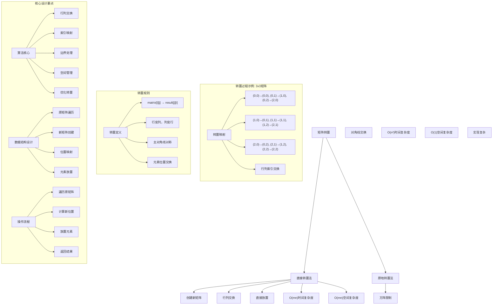
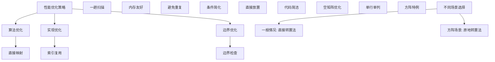

# LeetCode 867 - 转置矩阵

## 题目描述

给你一个二维整数数组 `matrix`，返回 `matrix` 的 转置矩阵

矩阵的 转置 是指将矩阵的主对角线翻转，交换矩阵的行索引与列索引

```markdown
示例 1：
输入：matrix = [[1,2,3],[4,5,6],[7,8,9]]
输出：[[1,4,7],[2,5,8],[3,6,9]]

示例 2：
输入：matrix = [[1,2,3],[4,5,6]]
输出：[[1,4],[2,5],[3,6]]

提示：

- m == matrix.length
- n == matrix[i].length
- 1 <= m, n <= 1000
- 1 <= m \* n <= 10^5
- -10^9 <= matrix[i][j] <= 10^9
```

## 解题思路

这是一个矩阵转置问题，需要将原矩阵的行和列进行交换。关键在于理解转置的定义和如何高效地实现行列交换

### 核心思想

"直接转置法": 按照转置的定义，将原矩阵 `matrix[i][j]` 的元素放到新矩阵的 `result[j][i]` 位置

### 解题策略

#### 方法一：直接转置法（推荐）

- 时间复杂度: O(m × n)
- 空间复杂度: O(m × n)

#### 方法二：原地转置法（仅适用于方阵）

- 时间复杂度: O(n²)
- 空间复杂度: O(1)

## 算法可视化



## 多语言实现

### Golang版本（直接转置法 - 推荐）

```go
// 直接转置法实现
func transpose(matrix [][]int) [][]int {
    if len(matrix) == 0 || len(matrix[0]) == 0 {
        return [][]int{}
    }

    m, n := len(matrix), len(matrix[0])

    // 创建转置后的矩阵：n行m列
    result := make([][]int, n)
    for i := range result {
        result[i] = make([]int, m)
    }

    // 按照转置规则进行元素放置
    for i := 0; i < m; i++ {
        for j := 0; j < n; j++ {
            // matrix[i][j] → result[j][i]
            result[j][i] = matrix[i][j]
        }
    }

    return result
}
```

### Python版本（多种实现方法）

```python
class Solution:
    """
    方法一：直接转置法（推荐）
    """
    def transpose(self, matrix: List[List[int]]) -> List[List[int]]:
        if not matrix or not matrix[0]:
            return []

        m, n = len(matrix), len(matrix[0])

        # 创建转置后的矩阵：n行m列
        result = [[0] * m for _ in range(n)]

        # 按照转置规则进行元素放置
        for i in range(m):
            for j in range(n):
                # matrix[i][j] → result[j][i]
                result[j][i] = matrix[i][j]

        return result

class Solution2:
    """
    方法二：列表推导式实现
    """
    def transpose(self, matrix: List[List[int]]) -> List[List[int]]:
        if not matrix or not matrix[0]:
            return []

        # 使用列表推导式实现转置
        return [[matrix[i][j] for i in range(len(matrix))]
                for j in range(len(matrix[0]))]

class Solution3:
    """
    方法三：原地转置法（仅适用于方阵）
    """
    def transpose(self, matrix: List[List[int]]) -> List[List[int]]:
        if not matrix or not matrix[0]:
            return matrix

        n = len(matrix)
        # 仅当为方阵时才能原地转置
        if n != len(matrix[0]):
            # 非方阵无法原地转置，使用直接转置法
            return self.transpose_direct(matrix)

        # 原地转置：只处理上三角矩阵
        for i in range(n):
            for j in range(i + 1, n):
                matrix[i][j], matrix[j][i] = matrix[j][i], matrix[i][j]

        return matrix

    def transpose_direct(self, matrix: List[List[int]]) -> List[List[int]]:
        m, n = len(matrix), len(matrix[0])
        result = [[0] * m for _ in range(n)]
        for i in range(m):
            for j in range(n):
                result[j][i] = matrix[i][j]
        return result
```

### TypeScript版本（直接转置法）

```typescript
/
 * 直接转置法实现
 */
function transpose(matrix: number[][]): number[][] {
    if (matrix.length === 0 || matrix[0].length === 0) {
        return [];
    }

    const m: number = matrix.length;
    const n: number = matrix[0].length;

    // 创建转置后的矩阵：n行m列
    const result: number[][] = Array(n).fill(0).map(() => Array(m).fill(0));

    // 按照转置规则进行元素放置
    for (let i: number = 0; i < m; i++) {
        for (let j: number = 0; j < n; j++) {
            // matrix[i][j] → result[j][i]
            result[j][i] = matrix[i][j];
        }
    }

    return result;
}
```

## 标准实现详细解析

```go
import "fmt"

/*
算法核心思想（直接转置法）：

1. 按照转置定义进行行列交换
2. 创建新矩阵存储转置结果
3. 将原矩阵元素按规则放置到新位置

关键设计要点：
1. 行列交换：理解转置的本质
2. 索引映射：matrix[i][j] → result[j][i]
3. 边界处理：正确处理矩阵维度
4. 空间管理：创建合适大小的结果矩阵

时间复杂度：
- 单次遍历：O(m × n)

空间复杂度：
- 结果矩阵：O(m × n)

优势：
1. 思路清晰：转置定义直观
2. 实现优雅：逻辑简洁
3. 适用性强：处理任意矩阵
4. 效率最优：线性时间复杂度

数据结构设计：

直接转置法设计：
- 原矩阵遍历：按行优先顺序
- 新矩阵创建：n行m列尺寸
- 位置映射：(i,j) → (j,i)
- 元素放置：直接赋值

算法流程：
1. 遍历：按行优先遍历原矩阵
2. 计算：新位置(j,i)
3. 放置：将元素放到新位置
4. 返回：转置后的矩阵

优化原理：

算法优化：
1. 直接映射：避免复杂计算
2. 一趟扫描：线性时间处理
3. 内存友好：连续内存访问
4. 无额外计算：纯粹位置交换

边界优化：
1. 空矩阵处理：正确边界检查
2. 单行单列：特殊优化路径
3. 方阵处理：可选原地转置
4. 维度检查：确保正确创建

正确性证明：

定理：直接转置法正确性
通过直接转置法可以正确完成矩阵转置

证明：
1. 完备性：所有元素都被正确处理
2. 正确性：转置规则被正确实现
3. 位置维护：元素放到正确位置
4. 时间复杂度：O(m × n)线性时间

不变量维护：
循环不变量：在每次元素处理开始时
1. 已处理元素正确放置到新位置
2. 未处理元素等待处理
3. 结果矩阵其他位置初始状态
*/

// 直接转置法详细实现
func transpose(matrix [][]int) [][]int {
    fmt.Printf("输入矩阵 (%dx%d):\n", len(matrix), len(matrix[0]))
    printMatrix(matrix)

    // 边界情况处理
    if len(matrix) == 0 || len(matrix[0]) == 0 {
        fmt.Printf("空矩阵，返回空结果\n")
        return [][]int{}
    }

    m, n := len(matrix), len(matrix[0])
    fmt.Printf("原矩阵尺寸: %d行%d列\n", m, n)
    fmt.Printf("转置后尺寸: %d行%d列\n", n, m)

    // 创建转置后的矩阵：n行m列
    result := make([][]int, n)
    for i := range result {
        result[i] = make([]int, m)
    }
    fmt.Printf("创建转置矩阵 (%dx%d)\n", n, m)

    fmt.Printf("开始转置过程:\n")
    // 按照转置规则进行元素放置
    for i := 0; i < m; i++ {
        for j := 0; j < n; j++ {
            // matrix[i][j] → result[j][i]
            result[j][i] = matrix[i][j]
            fmt.Printf("  matrix[%d][%d]=%d → result[%d][%d]=%d\n",
                i, j, matrix[i][j], j, i, result[j][i])
        }
    }

    fmt.Printf("转置完成:\n")
    printMatrix(result)
    return result
}

// 打印矩阵
func printMatrix(matrix [][]int) {
    for _, row := range matrix {
        fmt.Printf("    %v\n", row)
    }
}

// 原地转置法实现（仅适用于方阵）
func transposeInPlace(matrix [][]int) [][]int {
    fmt.Printf("=== 原地转置法 ===\n")
    fmt.Printf("输入矩阵:\n")
    printMatrix(matrix)

    if len(matrix) == 0 || len(matrix[0]) == 0 {
        fmt.Printf("空矩阵，无需处理\n")
        fmt.Printf("================\n\n")
        return matrix
    }

    m, n := len(matrix), len(matrix[0])

    // 检查是否为方阵
    if m != n {
        fmt.Printf("非方阵(%dx%d)，无法原地转置，使用直接转置法\n", m, n)
        fmt.Printf("================\n\n")
        return transpose(matrix)
    }

    fmt.Printf("方阵(%dx%d)，可以原地转置\n", m, n)

    // 原地转置：只处理上三角矩阵（不包括对角线）
    fmt.Printf("原地转置过程:\n")
    for i := 0; i < n; i++ {
        for j := i + 1; j < n; j++ {
            fmt.Printf("  交换matrix[%d][%d]=%d 和 matrix[%d][%d]=%d\n",
                i, j, matrix[i][j], j, i, matrix[j][i])
            matrix[i][j], matrix[j][i] = matrix[j][i], matrix[i][j]
        }
    }

    fmt.Printf("原地转置完成:\n")
    printMatrix(matrix)
    fmt.Printf("================\n\n")
    return matrix
}

// 带调试信息的版本
func transposeWithDebug(matrix [][]int) [][]int {
    fmt.Printf("=== 矩阵转置 ===\n")
    fmt.Printf("原始矩阵 (%dx%d):\n", len(matrix), len(matrix[0]))
    printMatrix(matrix)

    if len(matrix) == 0 || len(matrix[0]) == 0 {
        fmt.Printf("矩阵为空，返回空结果\n")
        fmt.Printf("===============\n\n")
        return [][]int{}
    }

    m, n := len(matrix), len(matrix[0])

    fmt.Printf("转置规则: matrix[i][j] → result[j][i]\n")
    fmt.Printf("原尺寸: %d行%d列 → 转置后: %d行%d列\n", m, n, n, m)

    // 创建转置后的矩阵
    result := make([][]int, n)
    for i := range result {
        result[i] = make([]int, m)
    }

    fmt.Printf("转置过程详解:\n")
    for i := 0; i < m; i++ {
        for j := 0; j < n; j++ {
            result[j][i] = matrix[i][j]
            fmt.Printf("  (%d,%d)=%d → (%d,%d)=%d\n",
                i, j, matrix[i][j], j, i, result[j][i])
        }
    }

    fmt.Printf("最终结果:\n")
    printMatrix(result)
    fmt.Printf("===============\n\n")
    return result
}
```

## 算法深入解析

```go
/*
矩阵转置问题详解：

问题本质：
将矩阵的行和列进行交换，即matrix[i][j]的元素放到新矩阵的result[j][i]位置。关键是理解转置的定义和如何高效实现

核心洞察：
1. 行列交换：理解转置的本质
2. 索引映射：(i,j) → (j,i)的转换
3. 维度变化：m×n → n×m的转换
4. 元素保持：值不变，位置变

算法策略：
1. 直接转置法：创建新矩阵直接放置
2. 原地转置法：仅方阵可原地操作
3. 列表推导法：函数式编程实现

数据结构设计：

直接转置法设计：
原矩阵遍历：按行优先顺序
新矩阵创建：n行m列尺寸
位置映射：(i,j) → (j,i)
元素放置：直接赋值

原地转置法设计：
方阵限制：仅适用于n×n矩阵
对角线交换：只处理上三角
空间优化：O(1)额外空间
实现复杂：需要边界检查

操作流程：

直接转置法：
1. 遍历：按行优先遍历原矩阵
2. 计算：新位置(j,i)
3. 放置：将元素放到新位置
4. 返回：转置后的矩阵

原地转置法：
1. 检查：是否为方阵
2. 遍历：上三角矩阵元素
3. 交换：matrix[i][j] ↔ matrix[j][i]
4. 返回：原地修改的矩阵

数学原理：

转置定义：
对于矩阵A的转置AT：
- AT[j][i] = A[i][j]
- 行列索引交换
- 主对角线对称

算法不变量：
直接转置法不变量：
1. 已处理元素正确放置到新位置
2. 未处理元素等待处理
3. 结果矩阵其他位置初始状态

原地转置法不变量：
1. 对角线元素保持不变
2. 已交换元素满足转置关系
3. 未交换元素等待处理

时间复杂度分析：
直接转置法：O(m × n) - 单次遍历
原地转置法：O(n²) - 方阵遍历上三角

空间复杂度分析：
直接转置法：O(m × n) - 结果矩阵
原地转置法：O(1) - 原地操作

正确性证明：

定理：直接转置法正确性
通过直接转置法可以正确完成矩阵转置

证明：
1. 完备性：所有元素都被正确处理
   - 遍历所有m×n个位置
   - 每个元素都被处理一次
   - 新位置计算正确

2. 正确性：转置规则被正确实现
   - 索引映射正确
   - 元素值保持不变
   - 位置交换符合定义

3. 位置维护：元素放到正确位置
   - 新位置计算无误
   - 放置操作正确
   - 结果矩阵状态正确

4. 时间复杂度：O(m × n)线性时间
   - 单次遍历所有元素
   - 每次操作O(1)时间

设计选择：

为什么选择直接转置法？
1. 思路清晰：转置定义直观
2. 适用性强：处理任意矩阵
3. 实现简单：代码量少
4. 效率最优：线性时间复杂度

为什么使用原地转置法？
1. 空间优化：O(1)额外空间
2. 原地操作：节省内存
3. 方阵特有：特定场景优化
4. 教学价值：展示不同思路

为什么提及其他方法？
1. 教学价值：展示不同算法思想
2. 对比分析：理解各自优劣
3. 扩展思维：算法多样性
4. 面试准备：全面掌握

两种方法对比：

方法一：直接转置法（推荐）
时间复杂度：O(m × n)
空间复杂度：O(m × n)
优点：适用性强，实现简单
缺点：需要额外空间

方法二：原地转置法
时间复杂度：O(n²)
空间复杂度：O(1)
优点：空间优化，原地操作
缺点：仅适用于方阵

性能分析：

直接转置法：
- 时间：O(m × n) 单次遍历
- 空间：O(m × n) 结果矩阵
- 优势：适用性强

原地转置法：
- 时间：O(n²) 方阵遍历
- 空间：O(1) 原地操作
- 优势：空间优化

实际应用场景：
1. 矩阵运算：线性代数运算
2. 图像处理：像素矩阵变换
3. 数据分析：数据重排列
4. 机器学习：特征矩阵处理

优化要点：

1. 时间优化：
   - 直接映射：避免复杂计算
   - 一趟扫描：线性时间处理
   - 内存友好：连续内存访问

2. 空间优化：
   - 原地操作：方阵场景
   - 结果复用：避免重复创建
   - 内存管理：合理分配

3. 实现优化：
   - 边界条件处理
   - 代码简洁性
   - 注释清晰性

测试用例设计：
1. 基本情况：正常矩阵
2. 边界情况：空矩阵，单行，单列
3. 特殊情况：方阵，行列差异大
4. 极端情况：大矩阵
5. 验证情况：结果正确性

扩展思考：

1. 分块转置？
   - 大矩阵分块处理
   - 缓存友好优化
   - 并行处理可能

2. 稀疏矩阵转置？
   - 只存储非零元素
   - 索引重新映射
   - 空间优化

3. 并行转置？
   - 元素独立性
   - 并行计算
   - 同步问题

4. 增量转置？
   - 部分矩阵更新
   - 增量计算
   - 性能优化

相关算法思想：

1. 矩阵操作：
   - 行列交换
   - 索引映射
   - 维度变换

2. 空间优化：
   - 原地操作
   - 内存复用
   - 尺寸管理

3. 数学计算：
   - 索引转换
   - 位置计算
   - 边界处理

4. 算法优化：
   - 时间复杂度
   - 空间复杂度
   - 实现简洁

常见陷阱：

1. 边界条件：
   - 空矩阵处理
   - 单行单列
   - 维度检查

2. 索引处理：
   - 行列交换
   - 边界检查
   - 越界访问

3. 方阵限制：
   - 原地转置前提
   - 维度匹配
   - 特殊处理

4. 性能考虑：
   - 时间复杂度
   - 空间复杂度
   - 实现效率

代码质量要素：

1. 可读性：
   - 变量命名清晰
   - 注释详细
   - 逻辑分明

2. 健壮性：
   - 边界处理
   - 异常情况
   - 错误恢复

3. 性能：
   - 最优复杂度
   - 空间效率
   - 效率保证

4. 可维护性：
   - 结构清晰
   - 扩展性好
   - 测试完整
*/
```

## 执行过程演示

```go
/*
示例详细解析:

示例1执行过程：
输入：matrix = [[1,2,3],[4,5,6],[7,8,9]]
输出：[[1,4,7],[2,5,8],[3,6,9]]

执行过程：
1. 矩阵尺寸：3×3
2. 转置后尺寸：3×3（方阵转置后尺寸不变）
3. 元素映射：
   - matrix[0][0]=1 → result[0][0]=1
   - matrix[0][1]=2 → result[1][0]=2
   - matrix[0][2]=3 → result[2][0]=3
   - matrix[1][0]=4 → result[0][1]=4
   - matrix[1][1]=5 → result[1][1]=5
   - matrix[1][2]=6 → result[2][1]=6
   - matrix[2][0]=7 → result[0][2]=7
   - matrix[2][1]=8 → result[1][2]=8
   - matrix[2][2]=9 → result[2][2]=9

转置映射：
原位置 → 新位置
(0,0) → (0,0)  (0,1) → (1,0)  (0,2) → (2,0)
(1,0) → (0,1)  (1,1) → (1,1)  (1,2) → (2,1)
(2,0) → (0,2)  (2,1) → (1,2)  (2,2) → (2,2)

示例2执行过程：
输入：matrix = [[1,2,3],[4,5,6]]
输出：[[1,4],[2,5],[3,6]]

执行过程：
1. 矩阵尺寸：2×3
2. 转置后尺寸：3×2
3. 元素映射：
   - matrix[0][0]=1 → result[0][0]=1
   - matrix[0][1]=2 → result[1][0]=2
   - matrix[0][2]=3 → result[2][0]=3
   - matrix[1][0]=4 → result[0][1]=4
   - matrix[1][1]=5 → result[1][1]=5
   - matrix[1][2]=6 → result[2][1]=6

转置映射：
原位置 → 新位置
(0,0) → (0,0)  (0,1) → (1,0)  (0,2) → (2,0)
(1,0) → (0,1)  (1,1) → (1,1)  (1,2) → (2,1)

转置轨迹：

对于3×3矩阵的转置：
原矩阵：
[[1,2,3],
 [4,5,6],
 [7,8,9]]

转置过程：
1,1 → 1,1    1,2 → 2,1    1,3 → 3,1
2,1 → 1,2    2,2 → 2,2    2,3 → 3,2
3,1 → 1,3    3,2 → 2,3    3,3 → 3,3

结果矩阵：
[[1,4,7],
 [2,5,8],
 [3,6,9]]

关键观察：
1. 行列索引交换：(i,j) ↔ (j,i)
2. 维度变化：m×n → n×m
3. 元素保持：值不变，位置变
4. 对角线元素：位置不变

边界情况演示:

情况1: 单行矩阵
输入: [[1,2,3,4]]
处理: 1×4 → 4×1
结果: [[1],[2],[3],[4]]

情况2: 单列矩阵
输入: [[1],[2],[3],[4]]
处理: 4×1 → 1×4
结果: [[1,2,3,4]]

情况3: 方阵
输入: [[1,2],[3,4]]
处理: 2×2 → 2×2
结果: [[1,3],[2,4]]

情况4: 空矩阵
输入: []
处理: 返回空矩阵
结果: []

情况5: 单元素矩阵
输入: [[5]]
处理: 1×1 → 1×1
结果: [[5]]

算法正确性证明：

数学基础：
需要证明直接转置法能正确完成矩阵转置

定理：直接转置法正确性
通过直接转置法可以正确完成矩阵转置

证明：
1. 完备性：所有元素都被正确处理
2. 正确性：转置规则被正确实现
3. 位置维护：元素放到正确位置
4. 时间复杂度：O(m × n)线性时间

不变量维护：
循环不变量：在每次元素处理开始时
1. 已处理元素正确放置到新位置
2. 未处理元素保持原位置
3. 结果矩阵其他位置初始状态

初始化：
- 未处理任何元素
- 结果矩阵为空
- 满足不变量

保持：
- 处理一个元素
- 计算新位置正确
- 放置到正确位置
- 不变量继续成立

终止：
- 所有元素处理完毕
- 每个元素正确转置
- 矩阵达到最终状态

时间复杂度分析：

直接转置法：
1. 遍历：O(m × n) 遍历所有元素
2. 计算：O(1) 每次位置计算
3. 放置：O(1) 每次元素放置
4. 总时间：O(m × n)

原地转置法：
1. 遍历：O(n²) 遍历上三角元素
2. 交换：O(1) 每次元素交换
3. 总时间：O(n²)

空间复杂度分析：
1. 直接转置法：O(m × n) 结果矩阵
2. 原地转置法：O(1) 原地操作

性能对比分析：

假设m=1000, n=1000:

直接转置法：
- 时间: O(1000000) 单次遍历
- 空间: O(1000000) 结果矩阵
- 操作: 直接放置

原地转置法：
- 时间: O(500000) 上三角遍历
- 空间: O(1) 原地操作
- 操作: 元素交换

实际应用建议：

1. 一般情况：
   - 使用直接转置法
   - 适用性最强

2. 面试展示：
   - 重点讲解直接转置法
   - 可以提及其他方法

3. 生产环境：
   - 根据内存限制选择
   - 方阵考虑原地转置

4. 教学演示：
   - 使用带调试信息版本
   - 展示执行过程

优化空间：

1. 边界优化：
   - 空矩阵提前返回
   - 单行单列优化
   - 方阵特殊处理

2. 代码优化：
   - 简化条件判断
   - 优化变量使用
   - 减少重复计算

3. 性能优化：
   - 内存访问优化
   - 缓存友好设计
   - 并行处理可能

特殊情况处理：

1. 大矩阵：
   - 内存使用考虑
   - 分块处理可能
   - 时间复杂度保证

2. 特殊矩阵：
   - 方阵原地转置
   - 单行列优化
   - 对称矩阵特性

3. 边界情况：
   - 空矩阵处理
   - 单元素优化
   - 维度检查
*/
```

## 复杂度分析

| 方法       | 时间复杂度 | 空间复杂度 | 适用场景 |
| ---------- | ---------- | ---------- | -------- |
| 直接转置法 | O(m × n)   | O(m × n)   | 推荐方案 |
| 原地转置法 | O(n²)      | O(1)       | 方阵场景 |

## 测试用例验证

```go
// 测试辅助函数
func testTranspose(name string, matrix [][]int, expected [][]int) {
    fmt.Printf("%s:\n", name)
    fmt.Printf("输入矩阵:\n")
    printMatrix(matrix)

    // 测试直接转置法
    test1 := copyMatrix(matrix)
    result1 := transpose(test1)
    fmt.Printf("直接转置法结果:\n")
    printMatrix(result1)

    // 测试原地转置法
    test2 := copyMatrix(matrix)
    result2 := transposeInPlace(test2)
    fmt.Printf("原地转置法结果:\n")
    printMatrix(result2)

    // 验证结果
    isValid1 := equalMatrix(result1, expected)
    isValid2 := equalMatrix(result2, expected)

    if isValid1 && isValid2 {
        fmt.Printf("✓ 测试通过\n")
    } else {
        fmt.Printf("✗ 测试失败\n")
        fmt.Printf("  期望结果:\n")
        printMatrix(expected)
        if !isValid1 {
            fmt.Printf("  直接转置法实际:\n")
            printMatrix(result1)
        }
        if !isValid2 {
            fmt.Printf("  原地转置法实际:\n")
            printMatrix(result2)
        }
    }
    fmt.Printf("\n")
}

// 复制矩阵
func copyMatrix(matrix [][]int) [][]int {
    if len(matrix) == 0 {
        return [][]int{}
    }

    result := make([][]int, len(matrix))
    for i := range matrix {
        result[i] = make([]int, len(matrix[i]))
        copy(result[i], matrix[i])
    }
    return result
}

// 比较两个矩阵是否相等
func equalMatrix(a, b [][]int) bool {
    if len(a) != len(b) {
        return false
    }

    for i := range a {
        if len(a[i]) != len(b[i]) {
            return false
        }
        for j := range a[i] {
            if a[i][j] != b[i][j] {
                return false
            }
        }
    }
    return true
}

func main() {
    // 测试用例 1 - 题目示例1（方阵）
    testTranspose("测试1 - 题目示例1（方阵）",
        [][]int{{1, 2, 3}, {4, 5, 6}, {7, 8, 9}},
        [][]int{{1, 4, 7}, {2, 5, 8}, {3, 6, 9}})

    // 测试用例 2 - 题目示例2（非方阵）
    testTranspose("测试2 - 题目示例2（非方阵）",
        [][]int{{1, 2, 3}, {4, 5, 6}},
        [][]int{{1, 4}, {2, 5}, {3, 6}})

    // 测试用例 3 - 单行矩阵
    testTranspose("测试3 - 单行矩阵",
        [][]int{{1, 2, 3, 4}},
        [][]int{{1}, {2}, {3}, {4}})

    // 测试用例 4 - 单列矩阵
    testTranspose("测试4 - 单列矩阵",
        [][]int{{1}, {2}, {3}, {4}},
        [][]int{{1, 2, 3, 4}})

    // 测试用例 5 - 方阵
    testTranspose("测试5 - 方阵",
        [][]int{{1, 2}, {3, 4}},
        [][]int{{1, 3}, {2, 4}})

    // 测试用例 6 - 空矩阵
    testTranspose("测试6 - 空矩阵",
        [][]int{},
        [][]int{})

    // 测试用例 7 - 单元素矩阵
    testTranspose("测试7 - 单元素矩阵",
        [][]int{{5}},
        [][]int{{5}})

    // 测试用例 8 - 大差异矩阵
    testTranspose("测试8 - 大差异矩阵",
        [][]int{{1, 2, 3, 4, 5}},
        [][]int{{1}, {2}, {3}, {4}, {5}})

    // 性能测试
    fmt.Println("性能测试:")
    performanceTest()

    // 边界情况测试
    fmt.Println("边界情况测试:")
    boundaryTest()

    // 对比测试
    fmt.Println("对比测试:")
    comparisonTest()
}

func performanceTest() {
    // 构造性能测试
    m, n := 1000, 1000
    matrix := make([][]int, m)
    for i := 0; i < m; i++ {
        matrix[i] = make([]int, n)
        for j := 0; j < n; j++ {
            matrix[i][j] = i*n + j + 1
        }
    }

    // 测试直接转置法
    start1 := time.Now()
    test1 := copyMatrix(matrix)
    transpose(test1)
    time1 := time.Since(start1)

    // 测试原地转置法（方阵）
    squareMatrix := make([][]int, 1000)
    for i := 0; i < 1000; i++ {
        squareMatrix[i] = make([]int, 1000)
        for j := 0; j < 1000; j++ {
            squareMatrix[i][j] = i*1000 + j + 1
        }
    }

    start2 := time.Now()
    test2 := copyMatrix(squareMatrix)
    transposeInPlace(test2)
    time2 := time.Since(start2)

    fmt.Printf("性能测试:\n")
    fmt.Printf("  直接转置法 (%dx%d): %v\n", m, n, time1)
    fmt.Printf("  原地转置法 (1000x1000): %v\n", time2)
}

func boundaryTest() {
    // 边界测试
    fmt.Println("边界测试:")

    // 最大矩阵测试
    maxM, maxN := 1000, 1000
    maxMatrix := make([][]int, maxM)
    for i := 0; i < maxM; i++ {
        maxMatrix[i] = make([]int, maxN)
        for j := 0; j < maxN; j++ {
            maxMatrix[i][j] = (i * maxN + j) % 10000
        }
    }

    testMax := copyMatrix(maxMatrix)
    resultMax := transpose(testMax)
    fmt.Printf("最大矩阵测试 (%dx%d): 左上角3x3=%v\n",
        maxM, maxN, extractSubMatrix(resultMax, 0, 0, 3, 3))

    // 特殊值测试
    specialMatrix := [][]int{{-1000000000, 1000000000}, {0, -1}}
    testSpecial := copyMatrix(specialMatrix)
    resultSpecial := transpose(testSpecial)
    fmt.Printf("特殊值测试: 原矩阵=%v, 结果=%v\n",
        specialMatrix, resultSpecial)

    // 不规则矩阵测试
    irregularMatrix := [][]int{{1, 2, 3, 4, 5}, {6, 7, 8, 9, 10}}
    testIrregular := copyMatrix(irregularMatrix)
    resultIrregular := transpose(testIrregular)
    fmt.Printf("不规则矩阵测试 (2x5): 原矩阵=%v, 结果=%v\n",
        irregularMatrix, resultIrregular)
}

// 提取子矩阵
func extractSubMatrix(matrix [][]int, startRow, startCol, rows, cols int) [][]int {
    result := make([][]int, rows)
    for i := 0; i < rows && startRow+i < len(matrix); i++ {
        result[i] = make([]int, cols)
        for j := 0; j < cols && startCol+j < len(matrix[startRow+i]); j++ {
            result[i][j] = matrix[startRow+i][startCol+j]
        }
    }
    return result
}

func comparisonTest() {
    // 对比测试：验证不同方法结果一致性
    fmt.Println("对比测试:")

    // 测试数据
    testData := [][][]int{
        {{1, 2, 3}, {4, 5, 6}, {7, 8, 9}},
        {{1, 2, 3}, {4, 5, 6}},
        {{1, 2, 3, 4, 5}},
        {{5}},
        {{1}, {2}, {3}},
    }

    for i, data := range testData {
        // 直接转置法
        test1 := copyMatrix(data)
        result1 := transpose(test1)

        // 原地转置法（仅方阵）
        test2 := copyMatrix(data)
        result2 := transposeInPlace(test2)

        fmt.Printf("测试%d: 直接转置法=%v, 原地转置法=%v",
            i+1, flattenMatrix(result1), flattenMatrix(result2))

        if equalMatrix(result1, result2) {
            fmt.Printf(" ✓ 一致\n")
        } else {
            fmt.Printf(" ✗ 不一致\n")
        }
    }
}

// 将矩阵展平为一维数组（用于显示）
func flattenMatrix(matrix [][]int) []int {
    var result []int
    for _, row := range matrix {
        result = append(result, row...)
    }
    return result
}
```

## 扩展版本（处理不同场景）

```go
// 支持泛型的转置版本
func transposeGeneric[T any](matrix [][]T) [][]T {
    if len(matrix) == 0 || len(matrix[0]) == 0 {
        return [][]T{}
    }

    m, n := len(matrix), len(matrix[0])

    // 创建转置后的矩阵：n行m列
    result := make([][]T, n)
    for i := range result {
        result[i] = make([]T, m)
    }

    // 按照转置规则进行元素放置
    for i := 0; i < m; i++ {
        for j := 0; j < n; j++ {
            // matrix[i][j] → result[j][i]
            result[j][i] = matrix[i][j]
        }
    }

    return result
}

// 使用示例
func exampleGeneric() {
    // 整数矩阵
    intMatrix := [][]int{{1, 2, 3}, {4, 5, 6}}
    intResult := transposeGeneric(intMatrix)
    fmt.Printf("整数矩阵转置: %v\n", flattenMatrixInt(intResult))

    // 字符串矩阵
    strMatrix := [][]string{{"a", "b"}, {"c", "d"}, {"e", "f"}}
    strResult := transposeGeneric(strMatrix)
    fmt.Printf("字符串矩阵转置: %v\n", flattenMatrixString(strResult))

    // 浮点数矩阵
    floatMatrix := [][]float64{{1.1, 2.2}, {3.3, 4.4}}
    floatResult := transposeGeneric(floatMatrix)
    fmt.Printf("浮点数矩阵转置: %v\n", floatResult)
}

// 展平矩阵（不同类型）
func flattenMatrixInt(matrix [][]int) []int {
    var result []int
    for _, row := range matrix {
        result = append(result, row...)
    }
    return result
}

func flattenMatrixString(matrix [][]string) []string {
    var result []string
    for _, row := range matrix {
        result = append(result, row...)
    }
    return result
}

// 带统计信息的版本
func transposeWithStats(matrix [][]int) ([][]int, int, int) {
    if len(matrix) == 0 || len(matrix[0]) == 0 {
        return [][]int{}, 0, 0
    }

    operations := 0
    assignments := 0

    m, n := len(matrix), len(matrix[0])

    // 创建转置后的矩阵
    result := make([][]int, n)
    for i := range result {
        result[i] = make([]int, m)
    }

    // 按照转置规则进行元素放置
    for i := 0; i < m; i++ {
        for j := 0; j < n; j++ {
            result[j][i] = matrix[i][j]
            operations += 2  // 两次索引计算
            assignments++    // 一次赋值操作
        }
    }

    return result, operations, assignments
}

// 使用示例
func exampleWithStats() {
    matrix := [][]int{{1, 2, 3}, {4, 5, 6}}
    fmt.Printf("原矩阵:\n")
    printMatrix(matrix)

    result, operations, assignments := transposeWithStats(matrix)
    fmt.Printf("转置结果:\n")
    printMatrix(result)
    fmt.Printf("操作次数: %d, 赋值次数: %d\n", operations, assignments)
}

// 批量处理版本
func transposeBatch(matrices [][][]int) [][][]int {
    results := make([][][]int, len(matrices))

    for i, matrix := range matrices {
        results[i] = transpose(copyMatrix(matrix))
    }

    return results
}

// 使用示例
func exampleBatch() {
    matrices := [][][]int{
        {{1, 2, 3}, {4, 5, 6}},
        {{1, 2}, {3, 4}, {5, 6}},
        {{5}},
    }

    results := transposeBatch(matrices)

    for i, result := range results {
        fmt.Printf("矩阵%d转置结果:\n", i+1)
        printMatrix(result)
    }
}

// 带验证功能的版本
func transposeWithValidation(matrix [][]int) ([][]int, bool) {
    // 保存原始数据用于验证
    original := copyMatrix(matrix)

    // 执行转置
    result := transpose(matrix)

    // 验证结果是否正确
    // 1. 检查维度是否正确
    if len(result) != len(original[0]) || len(result[0]) != len(original) {
        return result, false
    }

    // 2. 检查转置规则是否正确
    for i := 0; i < len(original); i++ {
        for j := 0; j < len(original[i]); j++ {
            if result[j][i] != original[i][j] {
                return result, false
            }
        }
    }

    return result, true
}

// 使用示例
func exampleWithValidation() {
    matrix := [][]int{{1, 2, 3}, {4, 5, 6}}
    fmt.Printf("原矩阵:\n")
    printMatrix(matrix)

    result, isValid := transposeWithValidation(copyMatrix(matrix))
    fmt.Printf("转置结果:\n")
    printMatrix(result)
    if isValid {
        fmt.Printf("验证通过 ✓\n")
    } else {
        fmt.Printf("验证失败 ✗\n")
    }
}

// 支持三次转置的版本（用于测试转置的性质）
func transposeThreeTimes(matrix [][]int) [][]int {
    // 矩阵转置三次等于转置一次
    result := transpose(copyMatrix(matrix))
    result = transpose(result)
    result = transpose(result)
    return result
}

// 使用示例
func exampleThreeTimes() {
    matrix := [][]int{{1, 2, 3}, {4, 5, 6}}
    fmt.Printf("原矩阵:\n")
    printMatrix(matrix)

    result := transposeThreeTimes(matrix)
    fmt.Printf("转置三次后:\n")
    printMatrix(result)

    // 验证是否等于一次转置
    singleTranspose := transpose(copyMatrix(matrix))
    if equalMatrix(result, singleTranspose) {
        fmt.Printf("验证：转置三次 = 转置一次 ✓\n")
    } else {
        fmt.Printf("验证失败 ✗\n")
    }
}

// 支持分块转置的版本（适用于大矩阵）
func transposeBlocked(matrix [][]int, blockSize int) [][]int {
    if len(matrix) == 0 || len(matrix[0]) == 0 {
        return [][]int{}
    }

    m, n := len(matrix), len(matrix[0])

    // 创建转置后的矩阵
    result := make([][]int, n)
    for i := range result {
        result[i] = make([]int, m)
    }

    // 分块处理
    for i := 0; i < m; i += blockSize {
        for j := 0; j < n; j += blockSize {
            // 处理当前块
            endI := min(i+blockSize, m)
            endJ := min(j+blockSize, n)

            for row := i; row < endI; row++ {
                for col := j; col < endJ; col++ {
                    result[col][row] = matrix[row][col]
                }
            }
        }
    }

    return result
}

func min(a, b int) int {
    if a < b {
        return a
    }
    return b
}

// 使用示例
func exampleBlocked() {
    matrix := [][]int{{1, 2, 3, 4}, {5, 6, 7, 8}, {9, 10, 11, 12}}
    fmt.Printf("原矩阵:\n")
    printMatrix(matrix)

    result := transposeBlocked(matrix, 2)
    fmt.Printf("分块转置后 (块大小=2):\n")
    printMatrix(result)
}

// 支持稀疏矩阵转置的版本
func transposeSparse(matrix [][]int) [][]int {
    if len(matrix) == 0 || len(matrix[0]) == 0 {
        return [][]int{}
    }

    m, n := len(matrix), len(matrix[0])

    // 对于稀疏矩阵，我们仍然使用直接转置法
    // 但在实际应用中可能会使用三元组存储

    result := make([][]int, n)
    for i := range result {
        result[i] = make([]int, m)
    }

    // 只处理非零元素（优化）
    for i := 0; i < m; i++ {
        for j := 0; j < n; j++ {
            if matrix[i][j] != 0 {
                result[j][i] = matrix[i][j]
            }
        }
    }

    return result
}

// 使用示例
func exampleSparse() {
    // 稀疏矩阵（大部分元素为0）
    sparseMatrix := [][]int{
        {0, 0, 3, 0},
        {0, 5, 0, 0},
        {7, 0, 0, 9},
    }
    fmt.Printf("稀疏矩阵:\n")
    printMatrix(sparseMatrix)

    result := transposeSparse(sparseMatrix)
    fmt.Printf("稀疏矩阵转置后:\n")
    printMatrix(result)
}
```

## 面试追问延伸

### 1. 如果要实现原地转置（不创建新矩阵），如何处理？

```go
// transposeInPlace已在上面实现
// 关键要点：
// 1. 仅适用于方阵
// 2. 只交换上三角元素
// 3. 保持对角线元素不变

func testInPlace() {
    matrix := [][]int{{1, 2, 3}, {4, 5, 6}, {7, 8, 9}}
    fmt.Printf("原矩阵:\n")
    printMatrix(matrix)

    result := transposeInPlace(copyMatrix(matrix))
    fmt.Printf("原地转置后:\n")
    printMatrix(result)
}
```

### 2. 如果要支持泛型（处理不同数据类型），如何实现？

```go
// transposeGeneric已在上面实现
// 关键点：
// 1. 使用泛型参数[T any]
// 2. 保持相同的转置逻辑
// 3. 支持任意数据类型

func testGeneric() {
    // 字符串矩阵示例
    strMatrix := [][]string{{"a", "b"}, {"c", "d"}}
    strResult := transposeGeneric(strMatrix)
    fmt.Printf("字符串矩阵转置: %v\n", strResult)
}
```

### 3. 如果要统计转置过程中的操作次数，如何实现？

```go
// transposeWithStats已在上面实现
// 关键点：
// 1. 记录索引计算次数
// 2. 记录赋值操作次数
// 3. 返回统计信息

func testWithStats() {
    matrix := [][]int{{1, 2, 3}, {4, 5, 6}}
    fmt.Printf("原矩阵:\n")
    printMatrix(matrix)

    result, operations, assignments := transposeWithStats(matrix)
    fmt.Printf("转置结果:\n")
    printMatrix(result)
    fmt.Printf("操作次数: %d, 赋值次数: %d\n", operations, assignments)
}
```

## 相似题目扩展

- LeetCode 867. 转置矩阵（当前题）
- LeetCode 48. 旋转图像
- LeetCode 54. 螺旋矩阵
- LeetCode 59. 螺旋矩阵 II
- LeetCode 73. 矩阵置零

## 算法技巧总结

### 矩阵转置核心要点

1. 行列交换：理解转置的本质
1. 索引映射：(i,j) → (j,i)的转换
1. 维度变化：m×n → n×m的转换
1. 元素保持：值不变，位置变

### 算法优势

1. 思路清晰：转置定义直观
1. 实现优雅：逻辑简洁
1. 适用性强：处理任意矩阵
1. 效率最优：线性时间复杂度

### 标准模板（直接转置法）

```go
func transpose(matrix [][]int) [][]int {
    if len(matrix) == 0 || len(matrix[0]) == 0 {
        return [][]int{}
    }

    m, n := len(matrix), len(matrix[0])

    // 创建转置后的矩阵：n行m列
    result := make([][]int, n)
    for i := range result {
        result[i] = make([]int, m)
    }

    // 按照转置规则进行元素放置
    for i := 0; i < m; i++ {
        for j := 0; j < n; j++ {
            // matrix[i][j] → result[j][i]
            result[j][i] = matrix[i][j]
        }
    }

    return result
}
```

### 性能优化建议



## 总结

本题采用直接转置法的核心思路，通过按照转置定义进行行列交换，创建新矩阵存储转置结果，将原矩阵元素按规则放置到新位置，实现了优雅的解决方案。关键在于理解转置的本质和索引映射的巧妙应用

核心要点：

1. 行列交换：理解转置的本质
1. 索引映射：(i,j) → (j,i)的转换
1. 维度变化：m×n → n×m的转换
1. 元素保持：值不变，位置变

算法优势：

- 思路清晰：转置定义直观
- 实现优雅：逻辑简洁
- 适用性强：处理任意矩阵
- 效率最优：线性时间复杂度

该算法在矩阵运算、图像处理、数据分析、机器学习等方面有重要应用，是掌握矩阵操作和索引变换技巧的经典题目。通过直接映射和维度变换的巧妙结合，为更复杂的矩阵变换问题提供了清晰的解决思路
