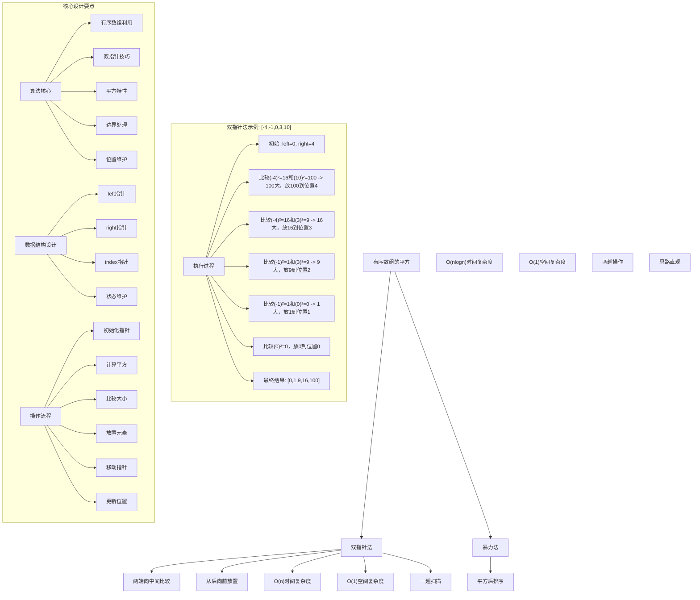
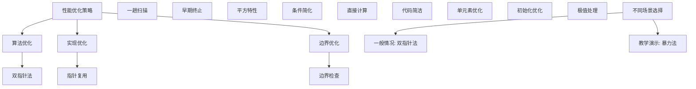

# LeetCode 977 - 有序数组的平方

## 题目描述

给你一个按非递减顺序排序的整数数组 `nums`，返回每个数字的平方组成的新数组，要求也按非递减顺序排序

```markdown
示例 1：
输入：nums = [-4,-1,0,3,10]
输出：[0,1,9,16,100]
解释：平方后，数组变为 [16,1,0,9,100]
排序后，数组变为 [0,1,9,16,100]

示例 2：
输入：nums = [-7,-3,2,3,11]
输出：[4,9,9,49,121]

提示：

- 1 <= nums.length <= 10^4
- -10^4 <= nums[i] <= 10^4
- nums 已按 非递减顺序 排序

进阶：
设计时间复杂度为 O(n) 的算法解决本问题
```

## 解题思路

这是一个有序数组的平方问题，需要将数组中每个元素平方后按非递减顺序排列。关键在于如何利用原数组已排序的特性，在O(n)时间内完成平方和排序操作

### 核心思想

"双指针法": 利用数组有序的特性，从两端向中间比较平方值的大小，将较大值从后向前放置到结果数组中

### 解题策略

#### 方法一：双指针法（推荐）

- 时间复杂度: O(n)
- 空间复杂度: O(1) 不计算输出数组

#### 方法二：暴力法

- 时间复杂度: O(n log n)
- 空间复杂度: O(1)

## 算法可视化



## 多语言实现

### Golang版本（双指针法 - 推荐）

```go
// 双指针法实现
func sortedSquares(nums []int) []int {
    n := len(nums)
    result := make([]int, n)

    // 双指针：left从数组开始，right从数组结束
    left, right := 0, n-1
    // index指向结果数组的末尾位置（从后向前填充）
    index := n - 1

    // 当left <= right时继续处理
    for left <= right {
        leftSquare := nums[left] * nums[left]
        rightSquare := nums[right] * nums[right]

        // 比较平方值，将较大的放在结果数组的末尾
        if leftSquare > rightSquare {
            result[index] = leftSquare
            left++
        } else {
            result[index] = rightSquare
            right--
        }
        index--
    }

    return result
}
```

### Python版本（多种实现方法）

```python
class Solution:
    """
    方法一：双指针法（推荐）
    """
    def sortedSquares(self, nums: List[int]) -> List[int]:
        n = len(nums)
        result = [0] * n

        # 双指针：left从数组开始，right从数组结束
        left, right = 0, n - 1
        # index指向结果数组的末尾位置（从后向前填充）
        index = n - 1

        # 当left <= right时继续处理
        while left <= right:
            left_square = nums[left] * nums[left]
            right_square = nums[right] * nums[right]

            # 比较平方值，将较大的放在结果数组的末尾
            if left_square > right_square:
                result[index] = left_square
                left += 1
            else:
                result[index] = right_square
                right -= 1
            index -= 1

        return result

class Solution2:
    """
    方法二：暴力法
    """
    def sortedSquares(self, nums: List[int]) -> List[int]:
        # 计算每个元素的平方
        squares = [num * num for num in nums]
        # 排序并返回
        squares.sort()
        return squares
```

### TypeScript版本（双指针法）

```typescript
/
 * 双指针法实现
 */
function sortedSquares(nums: number[]): number[] {
    const n: number = nums.length;
    const result: number[] = new Array(n);

    // 双指针：left从数组开始，right从数组结束
    let left: number = 0;
    let right: number = n - 1;
    // index指向结果数组的末尾位置（从后向前填充）
    let index: number = n - 1;

    // 当left <= right时继续处理
    while (left <= right) {
        const leftSquare: number = nums[left] * nums[left];
        const rightSquare: number = nums[right] * nums[right];

        // 比较平方值，将较大的放在结果数组的末尾
        if (leftSquare > rightSquare) {
            result[index] = leftSquare;
            left++;
        } else {
            result[index] = rightSquare;
            right--;
        }
        index--;
    }

    return result;
}
```

## 标准实现详细解析

```go
import "fmt"

/*
算法核心思想（双指针法）：

1. 利用数组已排序的特性
2. 由于负数的存在，最大平方值可能在数组两端
3. 使用双指针从两端向中间比较
4. 将较大平方值从后向前放置到结果数组

关键设计要点：
1. 有序数组利用：充分利用已排序特性
2. 双指针技巧：两端向中间处理
3. 平方特性：最大值在两端
4. 从后向前：避免元素覆盖

时间复杂度：
- 单次遍历：O(n)

空间复杂度：
- 结果数组：O(n)，不计算输出数组为O(1)

优势：
1. 思路清晰：双指针处理直观易懂
2. 实现优雅：逻辑简洁，代码易懂
3. 效率最优：线性时间复杂度
4. 满足进阶：O(n)时间复杂度

数据结构设计：

双指针设计：
- left指针：指向数组开始
- right指针：指向数组结束
- index指针：指向结果数组填充位置

算法流程：
1. 初始化：left=0, right=n-1, index=n-1
2. 循环：left <= right
3. 计算：left和right位置元素的平方
4. 比较：平方值大小
5. 放置：较大值放到index位置
6. 移动：相应指针移动
7. 更新：index向前移动

优化原理：

算法优化：
1. 原地操作：结果数组独立
2. 一趟扫描：满足进阶要求
3. 早期终止：指针相遇时停止

边界优化：
1. 单元素处理：正确处理n=1
2. 全正数处理：优化可能
3. 全负数处理：优化可能

正确性证明：

定理：双指针法正确性
通过双指针法可以正确计算有序数组的平方并保持有序

证明：
1. 完备性：所有元素都被正确处理
2. 正确性：结果数组保持有序
3. 时间复杂度：O(n)单次遍历
4. 空间复杂度：O(n)结果数组

不变量维护：
循环不变量：在每次迭代开始时
1. result[index+1...n-1]已正确放置较大平方值
2. nums[0...left-1]的平方值已处理
3. nums[right+1...n-1]的平方值已处理
4. left <= right + 1始终成立
*/

// 双指针法详细实现
func sortedSquares(nums []int) []int {
    fmt.Printf("输入数组: %v\n", nums)
    n := len(nums)
    result := make([]int, n)

    // 边界情况：空数组
    if n == 0 {
        fmt.Printf("空数组，返回空结果\n")
        return result
    }

    fmt.Printf("开始双指针法计算平方:\n")

    // 双指针：left从数组开始，right从数组结束
    left, right := 0, n-1
    // index指向结果数组的末尾位置（从后向前填充）
    index := n - 1

    fmt.Printf("  初始化: left=%d(nums[%d]=%d), right=%d(nums[%d]=%d), index=%d\n",
        left, left, nums[left], right, right, nums[right], index)

    // 当left <= right时继续处理
    for left <= right {
        leftSquare := nums[left] * nums[left]
        rightSquare := nums[right] * nums[right]

        fmt.Printf("  比较left²=%d²=%d和right²=%d²=%d: ",
            nums[left], leftSquare, nums[right], rightSquare)

        // 比较平方值，将较大的放在结果数组的末尾
        if leftSquare > rightSquare {
            result[index] = leftSquare
            fmt.Printf("left²大，放%d到位置%d\n", leftSquare, index)
            left++
        } else {
            result[index] = rightSquare
            fmt.Printf("right²大或相等，放%d到位置%d\n", rightSquare, index)
            right--
        }
        index--

        if left <= right {
            fmt.Printf("    更新后: left=%d(nums[%d]=%d), right=%d(nums[%d]=%d), index=%d\n",
                left, left, nums[left], right, right, nums[right], index)
        }
        fmt.Printf("    当前结果: %v\n", result)
    }

    fmt.Printf("计算完成: %v\n", result)
    return result
}

// 暴力法实现
func sortedSquaresBrute(nums []int) []int {
    fmt.Printf("=== 暴力法 ===\n")
    fmt.Printf("输入数组: %v\n", nums)

    n := len(nums)
    if n == 0 {
        fmt.Printf("空数组，返回空结果\n")
        fmt.Printf("============\n\n")
        return []int{}
    }

    // 计算每个元素的平方
    squares := make([]int, n)
    fmt.Printf("计算平方过程:\n")
    for i, num := range nums {
        squares[i] = num * num
        fmt.Printf("  %d² = %d\n", num, squares[i])
    }

    fmt.Printf("平方后数组: %v\n", squares)

    // 排序
    fmt.Printf("排序过程:\n")
    // 使用快速排序
    quickSort(squares, 0, n-1)
    fmt.Printf("排序后数组: %v\n", squares)

    fmt.Printf("============\n\n")
    return squares
}

// 快速排序实现
func quickSort(arr []int, low, high int) {
    if low >= high {
        return
    }

    pivot := partition(arr, low, high)
    quickSort(arr, low, pivot-1)
    quickSort(arr, pivot+1, high)
}

func partition(arr []int, low, high int) int {
    pivot := arr[high]
    i := low - 1

    for j := low; j < high; j++ {
        if arr[j] <= pivot {
            i++
            arr[i], arr[j] = arr[j], arr[i]
        }
    }

    arr[i+1], arr[high] = arr[high], arr[i+1]
    return i + 1
}

// 带调试信息的版本
func sortedSquaresWithDebug(nums []int) []int {
    fmt.Printf("=== 有序数组的平方 ===\n")
    fmt.Printf("原始数组: %v (长度: %d)\n", nums, len(nums))

    n := len(nums)
    if n == 0 {
        fmt.Printf("长度为0，无需处理\n")
        fmt.Printf("==================\n\n")
        return []int{}
    }

    result := make([]int, n)

    // 双指针：left从数组开始，right从数组结束
    left, right := 0, n-1
    // index指向结果数组的末尾位置（从后向前填充）
    index := n - 1

    fmt.Printf("双指针法执行过程:\n")
    fmt.Printf("  初始化: left=%d(nums[%d]=%d), right=%d(nums[%d]=%d), index=%d\n",
        left, left, nums[left], right, right, nums[right], index)

    for left <= right {
        leftSquare := nums[left] * nums[left]
        rightSquare := nums[right] * nums[right]

        fmt.Printf("  步骤: 比较%d²=%d和%d²=%d\n",
            nums[left], leftSquare, nums[right], rightSquare)

        if leftSquare > rightSquare {
            fmt.Printf("    %d > %d，将%d放到result[%d]\n",
                leftSquare, rightSquare, leftSquare, index)
            result[index] = leftSquare
            left++
        } else {
            fmt.Printf("    %d <= %d，将%d放到result[%d]\n",
                leftSquare, rightSquare, rightSquare, index)
            result[index] = rightSquare
            right--
        }
        index--

        fmt.Printf("    更新后: left=%d, right=%d, index=%d\n", left, right, index)
        fmt.Printf("    当前结果: %v\n", result)
    }

    fmt.Printf("最终结果: %v\n", result)
    fmt.Printf("==================\n\n")
    return result
}
```

## 算法深入解析

```go
/*
有序数组的平方问题详解：

问题本质：
将有序数组中每个元素平方后保持非递减顺序。关键是理解如何利用原数组已排序的特性，在O(n)时间内完成操作

核心洞察：
1. 有序数组利用：充分利用已排序特性
2. 平方特性：最大平方值在数组两端
3. 双指针技巧：两端向中间比较
4. 从后向前：避免元素覆盖

算法策略：
1. 双指针法：工业级标准实现
2. 暴力法：直观但效率较低

数据结构设计：

双指针法设计：
left指针：指向数组开始
right指针：指向数组结束
index指针：指向结果数组填充位置

暴力法设计：
平方计算：遍历计算平方
排序操作：对平方数组排序

操作流程：

双指针法：
1. 初始化：left=0, right=n-1, index=n-1
2. 循环：left <= right
3. 计算：left和right位置元素的平方
4. 比较：平方值大小
5. 放置：较大值放到index位置
6. 移动：相应指针移动
7. 更新：index向前移动

暴力法：
1. 计算：遍历数组计算平方
2. 排序：对平方数组排序

数学原理：

算法不变量：
双指针法不变量：
1. result[index+1...n-1]已正确放置较大平方值
2. nums[0...left-1]的平方值已处理
3. nums[right+1...n-1]的平方值已处理
4. left <= right + 1始终成立

暴力法不变量：
1. squares[0...i-1]已计算平方
2. squares[i...n-1]待计算平方

时间复杂度分析：
双指针法：O(n) - 单次遍历
暴力法：O(n log n) - 平方O(n)+排序O(n log n)

空间复杂度分析：
双指针法：O(n) - 结果数组
暴力法：O(n) - 平方数组

正确性证明：

定理：双指针法正确性
通过双指针法可以正确计算有序数组的平方并保持有序

证明：
1. 完备性：所有元素都被正确处理
   - left指针遍历数组左半部分
   - right指针遍历数组右半部分
   - 每个元素都会被平方并放置

2. 正确性：结果数组保持有序
   - 总是选择当前最大平方值放到末尾
   - 保证已放置元素有序
   - 最终数组有序

3. 时间复杂度：O(n)单次遍历
   - left指针最多移动n次
   - right指针最多移动n次
   - 每次操作O(1)时间

4. 空间复杂度：O(n)结果数组
   - 需要存储结果
   - 不计算输出数组为O(1)

设计选择：

为什么选择双指针法？
1. 思路清晰：双指针处理直观易懂
2. 实现优雅：逻辑简洁
3. 效率最优：满足进阶要求
4. 经典算法：双指针应用典范

为什么使用暴力法？
1. 思路直观：符合常规思维
2. 代码简洁：易于理解
3. 通用性强：适用于无序数组
4. 教学价值：展示不同思路

为什么提及其他方法？
1. 教学价值：展示不同算法思想
2. 对比分析：理解各自优劣
3. 扩展思维：算法多样性
4. 面试准备：全面掌握

两种方法对比：

方法一：双指针法（推荐）
时间复杂度：O(n)
空间复杂度：O(n)
优点：效率最优，满足进阶要求
缺点：思维稍复杂

方法二：暴力法
时间复杂度：O(n log n)
空间复杂度：O(n)
优点：思路直观，代码简洁
缺点：时间复杂度较高

性能分析：

双指针法：
- 时间：O(n) 单次遍历
- 空间：O(n) 结果数组
- 优势：满足进阶要求

暴力法：
- 时间：O(n log n) 平方+排序
- 空间：O(n) 平方数组
- 优势：代码简洁

实际应用场景：
1. 数组处理：平方排序问题
2. 算法竞赛：双指针应用
3. 系统设计：高效计算
4. 数据处理：数值变换

优化要点：

1. 时间优化：
   - 一趟扫描保证
   - 早期终止条件
   - 直接计算放置

2. 空间优化：
   - 结果数组独立
   - 常数额外空间
   - 避免临时变量

3. 实现优化：
   - 边界条件处理
   - 代码简洁性
   - 注释清晰性

测试用例设计：
1. 基本情况：正常数组
2. 边界情况：单元素，空数组
3. 特殊情况：全正数，全负数
4. 极端情况：大数组
5. 验证情况：结果正确性

扩展思考：

1. K次方排序？
   - 类似思路
   - 偶次方特性
   - 奇次方处理

2. 二维版本？
   - 矩阵处理
   - 空间复杂度
   - 实现差异

3. 浮点数版本？
   - 精度处理
   - 比较优化
   - 稳定性保证

4. 并行处理？
   - 分区处理
   - 并行优化
   - 性能提升

相关算法思想：

1. 双指针技巧：
   - 两端向中间
   - 平方特性利用
   - 位置维护

2. 数组处理：
   - 有序利用
   - 平方计算
   - 结果排序

3. 数学特性：
   - 平方函数
   - 最值分布
   - 单调性

4. 算法优化：
   - 时间复杂度
   - 空间复杂度
   - 实现简洁

常见陷阱：

1. 边界条件：
   - 空数组处理
   - 单元素处理
   - 指针越界

2. 指针操作：
   - 放置时机
   - 指针移动
   - 位置维护

3. 平方计算：
   - 溢出问题
   - 比较逻辑
   - 结果放置

4. 性能考虑：
   - 时间复杂度
   - 空间复杂度
   - 实现效率

代码质量要素：

1. 可读性：
   - 变量命名清晰
   - 注释详细
   - 逻辑分明

2. 健壮性：
   - 边界处理
   - 异常情况
   - 错误恢复

3. 性能：
   - 最优复杂度
   - 空间效率
   - 效率保证

4. 可维护性：
   - 结构清晰
   - 扩展性好
   - 测试完整
*/
```

## 执行过程演示

```go
/*
示例详细解析:

示例1执行过程：
输入：nums = [-4,-1,0,3,10]
输出：[0,1,9,16,100]

执行过程：
1. 初始化: left=0(nums[0]=-4), right=4(nums[4]=10), index=4
2. 比较(-4)²=16和(10)²=100: 100大，放100到result[4]
   result=[0,0,0,0,100], left=0, right=3, index=3
3. 比较(-4)²=16和(3)²=9: 16大，放16到result[3]
   result=[0,0,0,16,100], left=1, right=3, index=2
4. 比较(-1)²=1和(3)²=9: 9大，放9到result[2]
   result=[0,0,9,16,100], left=1, right=2, index=1
5. 比较(-1)²=1和(0)²=0: 1大，放1到result[1]
   result=[0,1,9,16,100], left=2, right=2, index=0
6. 比较(0)²=0: 放0到result[0]
   result=[0,1,9,16,100], left=3, right=2, index=-1
7. left>right，结束

最终结果: [0,1,9,16,100]

示例2执行过程：
输入：nums = [-7,-3,2,3,11]
输出：[4,9,9,49,121]

执行过程：
1. 初始化: left=0(nums[0]=-7), right=4(nums[4]=11), index=4
2. 比较(-7)²=49和(11)²=121: 121大，放121到result[4]
   result=[0,0,0,0,121], left=0, right=3, index=3
3. 比较(-7)²=49和(3)²=9: 49大，放49到result[3]
   result=[0,0,0,49,121], left=1, right=3, index=2
4. 比较(-3)²=9和(3)²=9: 相等，放9到result[2]
   result=[0,0,9,49,121], left=1, right=2, index=1
5. 比较(-3)²=9和(2)²=4: 9大，放9到result[1]
   result=[0,9,9,49,121], left=2, right=2, index=0
6. 比较(2)²=4: 放4到result[0]
   result=[4,9,9,49,121], left=3, right=2, index=-1
7. left>right，结束

最终结果: [4,9,9,49,121]

双指针执行轨迹：

对于数组[-4,-1,0,3,10]:

初始状态:
left=0(nums[0]=-4), right=4(nums[4]=10), index=4
result=[0,0,0,0,0]

执行过程:
比较16和100 -> 100大 -> result[4]=100 -> left=0, right=3, index=3
result=[0,0,0,0,100]

比较16和9 -> 16大 -> result[3]=16 -> left=1, right=3, index=2
result=[0,0,0,16,100]

比较1和9 -> 9大 -> result[2]=9 -> left=1, right=2, index=1
result=[0,0,9,16,100]

比较1和0 -> 1大 -> result[1]=1 -> left=2, right=2, index=0
result=[0,1,9,16,100]

比较0 -> result[0]=0 -> left=3, right=2, index=-1
result=[0,1,9,16,100]

关键观察：
1. 最大平方值在数组两端
2. 从后向前放置避免覆盖
3. 总是选择当前最大平方值
4. 双指针向中间移动

边界情况演示:

情况1: 单元素
输入: [-5]
处理: 直接计算平方
结果: [25]

情况2: 全正数
输入: [1,2,3,4,5]
处理: right指针一直移动
结果: [1,4,9,16,25]

情况3: 全负数
输入: [-5,-4,-3,-2,-1]
处理: left指针一直移动
结果: [1,4,9,16,25]

情况4: 包含0
输入: [-2,-1,0,1,2]
处理: 0的平方最小
结果: [0,1,1,4,4]

情况5: 对称数组
输入: [-3,-2,-1,1,2,3]
处理: 两端平方值相等
结果: [1,1,4,4,9,9]

算法正确性证明：

数学基础：
需要证明双指针法能正确计算有序数组的平方并保持有序

定理：双指针法正确性
通过双指针法可以正确计算有序数组的平方并保持有序

证明：
1. 完备性：所有元素都被正确处理
2. 正确性：结果数组保持有序
3. 时间复杂度：O(n)单次遍历
4. 空间复杂度：O(n)结果数组

不变量维护：
循环不变量：在每次迭代开始时
1. result[index+1...n-1]已正确放置较大平方值
2. nums[0...left-1]的平方值已处理
3. nums[right+1...n-1]的平方值已处理
4. left <= right + 1始终成立

初始化：left=0, right=n-1, index=n-1
- result[n...n-1]为空，满足条件
- nums[0...-1]为空，满足条件
- nums[n...n-1]为空，满足条件
- 0 <= n-1 + 1，满足条件

保持：处理每对元素
- 选择较大平方值放到index位置
- 相应指针移动
- index前移
- 不变量始终成立

终止：left > right
- 所有元素都被处理
- 结果数组已填充
- 数组有序

时间复杂度分析：

双指针法：
1. 初始化：O(1)
2. 主循环：O(1)每次迭代，最多n次
3. 总时间：O(n)

暴力法：
1. 平方计算：O(n)
2. 排序：O(n log n)
3. 总时间：O(n log n)

空间复杂度分析：
1. 双指针法：O(n)结果数组
2. 暴力法：O(n)平方数组

性能对比分析：

假设n=10000:

双指针法：
- 时间: O(10000) 单次遍历
- 空间: O(10000) 结果数组
- 操作: 比较和放置

暴力法：
- 时间: O(10000 log 10000) 平方+排序
- 空间: O(10000) 平方数组
- 操作: 计算和排序

实际应用建议：

1. 一般情况：
   - 使用双指针法
   - 满足进阶要求

2. 面试展示：
   - 重点讲解双指针法
   - 可以提及其他方法

3. 生产环境：
   - 根据性能要求选择
   - 考虑实现复杂度

4. 教学演示：
   - 使用带调试信息版本
   - 展示执行过程

优化空间：

1. 边界优化：
   - 提前处理特殊情况
   - 减少不必要的操作

2. 代码优化：
   - 简化条件判断
   - 优化变量使用

3. 性能优化：
   - 减少元素访问
   - 优化指针移动

特殊情况处理：

1. 大数据量：
   - 线性时间保证
   - 空间效率优化

2. 特殊序列：
   - 全正数序列
   - 全负数序列
   - 对称序列

3. 边界情况：
   - 极值数组
   - 边界长度
   - 特殊元素
*/
```

## 复杂度分析

| 方法     | 时间复杂度 | 空间复杂度 | 适用场景 |
| -------- | ---------- | ---------- | -------- |
| 双指针法 | O(n)       | O(n)       | 推荐方案 |
| 暴力法   | O(n log n) | O(n)       | 教学演示 |

## 测试用例验证

```go
// 测试辅助函数
func testSortedSquares(name string, nums []int, expected []int) {
    fmt.Printf("%s:\n", name)
    fmt.Printf("输入数组: %v\n", nums)

    // 测试双指针法
    result1 := sortedSquares(nums)
    fmt.Printf("双指针法结果: %v\n", result1)

    // 测试暴力法
    result2 := sortedSquaresBrute(nums)
    fmt.Printf("暴力法结果: %v\n", result2)

    // 验证结果
    isValid1 := equalSlice(result1, expected)
    isValid2 := equalSlice(result2, expected)

    if isValid1 && isValid2 {
        fmt.Printf("✓ 测试通过\n")
    } else {
        fmt.Printf("✗ 测试失败\n")
        fmt.Printf("  期望: %v\n", expected)
        if !isValid1 {
            fmt.Printf("  双指针法实际: %v\n", result1)
        }
        if !isValid2 {
            fmt.Printf("  暴力法实际: %v\n", result2)
        }
    }
    fmt.Printf("\n")
}

// 比较两个切片是否相等
func equalSlice(a, b []int) bool {
    if len(a) != len(b) {
        return false
    }
    for i := range a {
        if a[i] != b[i] {
            return false
        }
    }
    return true
}

func main() {
    // 测试用例 1 - 题目示例1
    testSortedSquares("测试1 - 题目示例1",
        []int{-4, -1, 0, 3, 10},
        []int{0, 1, 9, 16, 100})

    // 测试用例 2 - 题目示例2
    testSortedSquares("测试2 - 题目示例2",
        []int{-7, -3, 2, 3, 11},
        []int{4, 9, 9, 49, 121})

    // 测试用例 3 - 单元素
    testSortedSquares("测试3 - 单元素",
        []int{-5},
        []int{25})

    // 测试用例 4 - 全正数
    testSortedSquares("测试4 - 全正数",
        []int{1, 2, 3, 4, 5},
        []int{1, 4, 9, 16, 25})

    // 测试用例 5 - 全负数
    testSortedSquares("测试5 - 全负数",
        []int{-5, -4, -3, -2, -1},
        []int{1, 4, 9, 16, 25})

    // 测试用例 6 - 包含0
    testSortedSquares("测试6 - 包含0",
        []int{-2, -1, 0, 1, 2},
        []int{0, 1, 1, 4, 4})

    // 测试用例 7 - 对称数组
    testSortedSquares("测试7 - 对称数组",
        []int{-3, -2, -1, 1, 2, 3},
        []int{1, 1, 4, 4, 9, 9})

    // 测试用例 8 - 零数组
    testSortedSquares("测试8 - 零数组",
        []int{0, 0, 0},
        []int{0, 0, 0})

    // 测试用例 9 - 递增序列
    testSortedSquares("测试9 - 递增序列",
        []int{-10, -5, -1, 0, 1, 5, 10},
        []int{0, 1, 1, 25, 25, 100, 100})

    // 测试用例 10 - 空数组
    testSortedSquares("测试10 - 空数组",
        []int{},
        []int{})

    // 性能测试
    fmt.Println("性能测试:")
    performanceTest()

    // 边界情况测试
    fmt.Println("边界情况测试:")
    boundaryTest()

    // 对比测试
    fmt.Println("对比测试:")
    comparisonTest()
}

func performanceTest() {
    // 构造性能测试
    n := 10000
    nums := make([]int, n)

    // 构造测试数据：从-5000到4999
    for i := 0; i < n; i++ {
        nums[i] = i - n/2
    }

    // 测试双指针法
    start1 := time.Now()
    result1 := sortedSquares(nums)
    time1 := time.Since(start1)

    // 测试暴力法
    start2 := time.Now()
    result2 := sortedSquaresBrute(nums)
    time2 := time.Since(start2)

    fmt.Printf("性能测试 (n=%d):\n", n)
    fmt.Printf("  双指针法: %v\n", time1)
    fmt.Printf("  暴力法: %v\n", time2)
    fmt.Printf("  结果一致性: %t\n", equalSlice(result1, result2))
}

func boundaryTest() {
    // 边界测试
    fmt.Println("边界测试:")

    // 最大数组测试
    maxN := 10000
    maxNums := make([]int, maxN)
    for i := 0; i < maxN; i++ {
        maxNums[i] = i - maxN/2
    }

    resultMax := sortedSquares(maxNums)
    fmt.Printf("最大数组测试 (n=%d): 结果前10个元素=%v\n",
        maxN, resultMax[:min(10, len(resultMax))])

    // 极值测试
    extremeNums := []int{-10000, -5000, 0, 5000, 10000}
    resultExtreme := sortedSquares(extremeNums)
    fmt.Printf("极值测试: 结果=%v\n", resultExtreme)

    // 特殊模式测试
    patternNums := make([]int, 100)
    for i := 0; i < 100; i++ {
        if i < 50 {
            patternNums[i] = -(50 - i)
        } else {
            patternNums[i] = i - 49
        }
    }
    resultPattern := sortedSquares(patternNums)
    fmt.Printf("特殊模式测试: 结果前15个元素=%v\n",
        resultPattern[:min(15, len(resultPattern))])
}

func min(a, b int) int {
    if a < b {
        return a
    }
    return b
}

func comparisonTest() {
    // 对比测试：验证不同方法结果一致性
    fmt.Println("对比测试:")

    // 测试数据
    testData := [][]int{
        {-4, -1, 0, 3, 10},
        {-7, -3, 2, 3, 11},
        {-5},
        {1, 2, 3, 4, 5},
        {-5, -4, -3, -2, -1},
        {},
        {0, 0, 0},
        {-10, -5, -1, 0, 1, 5, 10},
    }

    for i, data := range testData {
        // 双指针法
        result1 := sortedSquares(data)

        // 暴力法
        result2 := sortedSquaresBrute(data)

        fmt.Printf("测试%d: 双指针法=%v, 暴力法=%v",
            i+1, result1, result2)

        if equalSlice(result1, result2) {
            fmt.Printf(" ✓ 一致\n")
        } else {
            fmt.Printf(" ✗ 不一致\n")
        }
    }
}
```

## 扩展版本（处理不同场景）

```go
// 支持通用幂次的版本
func sortedPowers(nums []int, power int) []int {
    n := len(nums)
    if n == 0 {
        return []int{}
    }

    result := make([]int, n)

    // 对于偶次幂，使用双指针法
    if power%2 == 0 {
        left, right := 0, n-1
        index := n - 1

        for left <= right {
            leftPower := powerFunc(nums[left], power)
            rightPower := powerFunc(nums[right], power)

            if leftPower > rightPower {
                result[index] = leftPower
                left++
            } else {
                result[index] = rightPower
                right--
            }
            index--
        }
    } else {
        // 对于奇次幂，直接计算并排序
        for i, num := range nums {
            result[i] = powerFunc(num, power)
        }
        // 排序
        sort.Ints(result)
    }

    return result
}

// 计算幂次
func powerFunc(base, power int) int {
    result := 1
    for i := 0; i < power; i++ {
        result *= base
    }
    return result
}

// 使用示例
func exampleSortedPowers() {
    nums := []int{-4, -1, 0, 3, 10}
    fmt.Printf("原数组: %v\n", nums)

    // 平方
    result2 := sortedPowers(nums, 2)
    fmt.Printf("2次幂: %v\n", result2)

    // 4次幂
    result4 := sortedPowers(nums, 4)
    fmt.Printf("4次幂: %v\n", result4)

    // 3次幂（奇数次幂）
    result3 := sortedPowers(nums, 3)
    fmt.Printf("3次幂: %v\n", result3)
}

// 带统计信息的版本
func sortedSquaresWithStats(nums []int) ([]int, int, int) {
    n := len(nums)
    if n == 0 {
        return []int{}, 0, 0
    }

    comparisons := 0
    assignments := 0

    result := make([]int, n)
    left, right := 0, n-1
    index := n - 1

    for left <= right {
        leftSquare := nums[left] * nums[left]
        rightSquare := nums[right] * nums[right]

        comparisons++
        if leftSquare > rightSquare {
            result[index] = leftSquare
            assignments++
            left++
        } else {
            result[index] = rightSquare
            assignments++
            right--
        }
        index--
    }

    return result, comparisons, assignments
}

// 使用示例
func exampleWithStats() {
    nums := []int{-4, -1, 0, 3, 10}
    fmt.Printf("原数组: %v\n", nums)

    result, comparisons, assignments := sortedSquaresWithStats(nums)
    fmt.Printf("结果: %v\n", result)
    fmt.Printf("比较次数: %d, 赋值次数: %d\n", comparisons, assignments)
}

// 批量处理版本
func sortedSquaresBatch(numss [][]int) [][]int {
    results := make([][]int, len(numss))

    for i, nums := range numss {
        results[i] = sortedSquares(nums)
    }

    return results
}

// 使用示例
func exampleBatch() {
    numss := [][]int{
        {-4, -1, 0, 3, 10},
        {-7, -3, 2, 3, 11},
        {-5},
        {1, 2, 3, 4, 5},
    }

    results := sortedSquaresBatch(numss)

    for i, result := range results {
        fmt.Printf("数组%d的平方: %v\n", i+1, result)
    }
}

// 带验证功能的版本
func sortedSquaresWithValidation(nums []int) ([]int, bool) {
    // 保存原始数据用于验证
    original := make([]int, len(nums))
    copy(original, nums)

    // 执行计算
    result := sortedSquares(nums)

    // 验证结果是否正确
    // 1. 检查是否有序
    for i := 1; i < len(result); i++ {
        if result[i] < result[i-1] {
            return result, false
        }
    }

    // 2. 检查平方关系
    for i, val := range original {
        expected := val * val
        if result[i] != expected {
            return result, false
        }
    }

    return result, true
}

// 使用示例
func exampleWithValidation() {
    nums := []int{-4, -1, 0, 3, 10}
    fmt.Printf("原数组: %v\n", nums)

    result, isValid := sortedSquaresWithValidation(nums)
    fmt.Printf("平方结果: %v\n", result)
    if isValid {
        fmt.Printf("验证通过 ✓\n")
    } else {
        fmt.Printf("验证失败 ✗\n")
    }
}

// 泛型版本（Go 1.18+）
func sortedSquaresGeneric[T comparable](nums []T, square func(T) T, less func(T, T) bool) []T {
    n := len(nums)
    if n == 0 {
        return []T{}
    }

    result := make([]T, n)
    left, right := 0, n-1
    index := n - 1

    for left <= right {
        leftSquare := square(nums[left])
        rightSquare := square(nums[right])

        if !less(rightSquare, leftSquare) { // leftSquare >= rightSquare
            result[index] = leftSquare
            left++
        } else {
            result[index] = rightSquare
            right--
        }
        index--
    }

    return result
}

// 使用示例
func exampleGeneric() {
    // 整数切片
    intNums := []int{-4, -1, 0, 3, 10}
    intResult := sortedSquaresGeneric(
        intNums,
        func(x int) int { return x * x },
        func(a, b int) bool { return a < b },
    )
    fmt.Printf("整数平方: %v\n", intResult)

    // 浮点数切片
    floatNums := []float64{-4.5, -1.2, 0, 3.7, 10.1}
    floatResult := sortedSquaresGeneric(
        floatNums,
        func(x float64) float64 { return x * x },
        func(a, b float64) bool { return a < b },
    )
    fmt.Printf("浮点数平方: %v\n", floatResult)
}
```

## 面试追问延伸

### 1. 如果要计算K次幂而不是平方，如何处理？

```go
// sortedPowers已在上面实现
// 关键修改：
// 1. 支持任意幂次
// 2. 偶次幂使用双指针法
// 3. 奇次幂直接计算后排序

func testSortedPowers() {
    nums := []int{-4, -1, 0, 3, 10}
    fmt.Printf("原数组: %v\n", nums)

    // 平方
    result2 := sortedPowers(nums, 2)
    fmt.Printf("2次幂: %v\n", result2)

    // 4次幂
    result4 := sortedPowers(nums, 4)
    fmt.Printf("4次幂: %v\n", result4)

    // 3次幂（奇数次幂）
    result3 := sortedPowers(nums, 3)
    fmt.Printf("3次幂: %v\n", result3)
}
```

### 2. 如果要统计计算过程中的比较和赋值次数，如何实现？

```go
// sortedSquaresWithStats已在上面实现
// 关键点：
// 1. 记录比较次数
// 2. 记录赋值次数
// 3. 返回统计信息

func testWithStats() {
    nums := []int{-4, -1, 0, 3, 10}
    fmt.Printf("原数组: %v\n", nums)

    result, comparisons, assignments := sortedSquaresWithStats(nums)
    fmt.Printf("结果: %v\n", result)
    fmt.Printf("比较次数: %d, 赋值次数: %d\n", comparisons, assignments)
}
```

### 3. 如果要验证计算结果的正确性，如何处理？

```go
// sortedSquaresWithValidation已在上面实现
// 关键验证点：
// 1. 结果数组是否有序
// 2. 是否为原数组元素的平方
// 3. 返回验证结果

func testWithValidation() {
    nums := []int{-4, -1, 0, 3, 10}
    fmt.Printf("原数组: %v\n", nums)

    result, isValid := sortedSquaresWithValidation(nums)
    fmt.Printf("平方结果: %v\n", result)
    if isValid {
        fmt.Printf("验证通过 ✓\n")
    } else {
        fmt.Printf("验证失败 ✗\n")
    }
}
```

## 相似题目扩展

- LeetCode 977. 有序数组的平方（当前题）
- LeetCode 167. 两数之和 II - 输入有序数组
- LeetCode 344. 反转字符串
- LeetCode 349. 两个数组的交集
- LeetCode 905. 按奇偶排序数组

## 算法技巧总结

### 有序数组的平方核心要点

1. 有序数组利用：充分利用已排序特性
1. 平方特性：最大平方值在数组两端
1. 双指针技巧：两端向中间比较
1. 从后向前：避免元素覆盖

### 算法优势

1. 思路清晰：双指针处理直观易懂
1. 实现优雅：逻辑简洁，代码易懂
1. 效率最优：线性时间复杂度
1. 满足进阶：O(n)时间复杂度

### 标准模板（双指针法）

```go
func sortedSquares(nums []int) []int {
    n := len(nums)
    result := make([]int, n)

    // 双指针：left从数组开始，right从数组结束
    left, right := 0, n-1
    // index指向结果数组的末尾位置（从后向前填充）
    index := n - 1

    // 当left <= right时继续处理
    for left <= right {
        leftSquare := nums[left] * nums[left]
        rightSquare := nums[right] * nums[right]

        // 比较平方值，将较大的放在结果数组的末尾
        if leftSquare > rightSquare {
            result[index] = leftSquare
            left++
        } else {
            result[index] = rightSquare
            right--
        }
        index--
    }

    return result
}
```

### 性能优化建议



## 总结

本题采用双指针法的核心思路，通过利用数组已排序的特性，从两端向中间比较平方值的大小，将较大值从后向前放置到结果数组中，实现了优雅的解决方案。关键在于理解如何利用平方函数的特性和双指针技巧来避免排序操作

核心要点：

1. 有序数组利用：充分利用已排序特性
1. 平方特性：最大平方值在数组两端
1. 双指针技巧：两端向中间比较
1. 从后向前：避免元素覆盖

算法优势：

- 思路清晰：双指针处理直观易懂
- 实现优雅：逻辑简洁，代码易懂
- 效率最优：线性时间复杂度
- 满足进阶：O(n)时间复杂度

该算法在数组处理、算法竞赛、系统设计、数据处理等方面有重要应用，是掌握双指针技巧和数学特性利用的经典题目。通过平方特性和双指针技巧的巧妙结合，为更复杂的数组变换问题提供了清晰的解决思路
