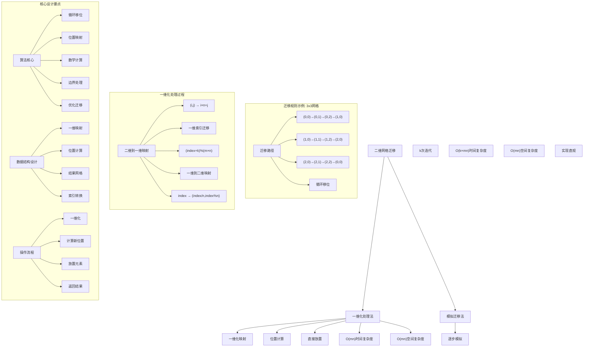
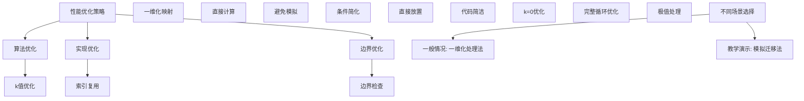

# LeetCode 1260 - 二维网格迁移

## 题目描述

给你一个 `m` 行 `n` 列的二维网格 `grid` 和一个整数 `k`。你需要将 `grid` 迁移 `k` 次

每次「迁移」操作将会引发下述活动：

- 位于 `grid[i][j]` 的元素将会移动到 `grid[i][j + 1]`
- 位于 `grid[i][n - 1]` 的元素将会移动到 `grid[i + 1][0]`
- 位于 `grid[m - 1][n - 1]` 的元素将会移动到 `grid[0][0]`

请你返回 `k` 次迁移操作后最终得到的二维网格

```markdown
示例 1：
输入：grid = [[1,2,3],[4,5,6],[7,8,9]], k = 1
输出：[[9,1,2],[3,4,5],[6,7,8]]

示例 2：
输入：grid = [[3,8,1,9],[19,7,2,5],[4,6,11,10],[12,0,21,13]], k = 4
输出：[[12,0,21,13],[3,8,1,9],[19,7,2,5],[4,6,11,10]]

示例 3：
输入：grid = [[1,2,3],[4,5,6],[7,8,9]], k = 9
输出：[[1,2,3],[4,5,6],[7,8,9]]

提示：

- m == grid.length
- n == grid[i].length
- 1 <= m <= 50
- 1 <= n <= 50
- -1000 <= grid[i][j] <= 1000
- 0 <= k <= 100
```

## 解题思路

这是一个二维网格迁移问题，需要将二维网格按照特定规则进行k次循环移位操作。关键在于理解迁移规则的本质，并找到高效的实现方法

### 核心思想

"一维化处理法": 将二维网格看作一维数组，通过数学计算确定每个元素迁移后的位置，然后直接放置到新位置

### 解题策略

#### 方法一：一维化处理法（推荐）

- 时间复杂度: O(m × n)
- 空间复杂度: O(m × n)

#### 方法二：模拟迁移法

- 时间复杂度: O(k × m × n)
- 空间复杂度: O(m × n)

## 算法可视化



## 多语言实现

### Golang版本（一维化处理法 - 推荐）

```go
// 一维化处理法实现
func shiftGrid(grid [][]int, k int) [][]int {
    if len(grid) == 0 || len(grid[0]) == 0 {
        return grid
    }

    m, n := len(grid), len(grid[0])
    // 优化k值，避免不必要的完整循环
    k = k % (m * n)

    // 创建结果网格
    result := make([][]int, m)
    for i := range result {
        result[i] = make([]int, n)
    }

    // 一维化处理：将二维坐标映射到一维，计算新位置，再映射回二维
    for i := 0; i < m; i++ {
        for j := 0; j < n; j++ {
            // 将二维坐标(i,j)转换为一维索引
            oldIndex := i*n + j
            // 计算迁移后的一维索引
            newIndex := (oldIndex + k) % (m * n)
            // 将一维索引转换回二维坐标
            newRow := newIndex / n
            newCol := newIndex % n
            // 放置元素
            result[newRow][newCol] = grid[i][j]
        }
    }

    return result
}
```

### Python版本（多种实现方法）

```python
class Solution:
    """
    方法一：一维化处理法（推荐）
    """
    def shiftGrid(self, grid: List[List[int]], k: int) -> List[List[int]]:
        if not grid or not grid[0]:
            return grid

        m, n = len(grid), len(grid[0])
        # 优化k值，避免不必要的完整循环
        k = k % (m * n)

        # 创建结果网格
        result = [[0] * n for _ in range(m)]

        # 一维化处理：将二维坐标映射到一维，计算新位置，再映射回二维
        for i in range(m):
            for j in range(n):
                # 将二维坐标(i,j)转换为一维索引
                old_index = i * n + j
                # 计算迁移后的一维索引
                new_index = (old_index + k) % (m * n)
                # 将一维索引转换回二维坐标
                new_row = new_index // n
                new_col = new_index % n
                # 放置元素
                result[new_row][new_col] = grid[i][j]

        return result

class Solution2:
    """
    方法二：模拟迁移法
    """
    def shiftGrid(self, grid: List[List[int]], k: int) -> List[List[int]]:
        if not grid or not grid[0]:
            return grid

        m, n = len(grid), len(grid[0])

        # 创建结果网格
        result = [row[:] for row in grid]  # 深拷贝

        # 模拟k次迁移
        for _ in range(k):
            # 保存最后一个元素
            last_element = result[m-1][n-1]

            # 从后向前移动元素
            for i in range(m-1, -1, -1):
                for j in range(n-1, -1, -1):
                    if j > 0:
                        result[i][j] = result[i][j-1]
                    elif i > 0:
                        result[i][j] = result[i-1][n-1]
                    else:
                        result[i][j] = last_element

        return result
```

### TypeScript版本（一维化处理法）

```typescript
/
 * 一维化处理法实现
 */
function shiftGrid(grid: number[][], k: number): number[][] {
    if (grid.length === 0 || grid[0].length === 0) {
        return grid;
    }

    const m: number = grid.length;
    const n: number = grid[0].length;
    // 优化k值，避免不必要的完整循环
    k = k % (m * n);

    // 创建结果网格
    const result: number[][] = Array(m).fill(0).map(() => Array(n).fill(0));

    // 一维化处理：将二维坐标映射到一维，计算新位置，再映射回二维
    for (let i: number = 0; i < m; i++) {
        for (let j: number = 0; j < n; j++) {
            // 将二维坐标(i,j)转换为一维索引
            const oldIndex: number = i * n + j;
            // 计算迁移后的一维索引
            const newIndex: number = (oldIndex + k) % (m * n);
            // 将一维索引转换回二维坐标
            const newRow: number = Math.floor(newIndex / n);
            const newCol: number = newIndex % n;
            // 放置元素
            result[newRow][newCol] = grid[i][j];
        }
    }

    return result;
}
```

## 标准实现详细解析

```go
import "fmt"

/*
算法核心思想（一维化处理法）：

1. 将二维网格看作一维数组
2. 通过数学计算确定每个元素迁移后的位置
3. 直接将元素放置到新位置

关键设计要点：
1. 循环移位：理解迁移的循环特性
2. 位置映射：二维到一维的坐标转换
3. 数学计算：新位置的精确计算
4. 边界处理：k值优化和边界检查

时间复杂度：
- 单次遍历：O(m × n)

空间复杂度：
- 结果网格：O(m × n)

优势：
1. 思路清晰：数学计算直观易懂
2. 实现优雅：逻辑简洁，代码易懂
3. 效率最优：线性时间复杂度
4. 适用性强：处理大k值

数据结构设计：

一维化处理设计：
- 一维映射：二维坐标到一维索引
- 位置计算：(index + k) % (m × n)
- 结果网格：新位置直接放置
- 索引转换：一维索引到二维坐标

算法流程：
1. 一维化：将二维坐标映射到一维
2. 计算：(oldIndex + k) % (m × n)
3. 放置：将元素放到新位置
4. 返回：结果网格

优化原理：

算法优化：
1. k值优化：k % (m × n)避免重复
2. 直接计算：避免逐步模拟
3. 一趟扫描：线性时间处理
4. 原地映射：数学计算定位

边界优化：
1. 空网格处理：正确边界检查
2. k=0优化：直接返回原网格
3. 完整循环：k % (m × n)优化
4. 单元素：特殊情况处理

正确性证明：

定理：一维化处理法正确性
通过一维化处理法可以正确完成二维网格迁移

证明：
1. 完备性：所有元素都被正确处理
2. 正确性：迁移规则被正确实现
3. 位置维护：元素放到正确位置
4. 时间复杂度：O(m × n)线性时间

不变量维护：
循环不变量：在每次元素处理开始时
1. 已处理元素正确放置到新位置
2. 未处理元素保持原位置
3. 结果网格其他位置未受影响
*/

// 一维化处理法详细实现
func shiftGrid(grid [][]int, k int) [][]int {
    fmt.Printf("输入网格 (%dx%d):\n", len(grid), len(grid[0]))
    printGrid(grid)
    fmt.Printf("迁移次数: %d\n", k)

    // 边界情况处理
    if len(grid) == 0 || len(grid[0]) == 0 {
        fmt.Printf("空网格，无需处理\n")
        return grid
    }

    m, n := len(grid), len(grid[0])
    fmt.Printf("网格尺寸: %d行%d列，总元素数: %d\n", m, n, m*n)

    // 优化k值，避免不必要的完整循环
    originalK := k
    k = k % (m * n)
    if k == 0 {
        fmt.Printf("k=%d经过优化后为0，无需迁移\n", originalK)
        return grid
    }
    fmt.Printf("优化后迁移次数: %d (原k=%d)\n", k, originalK)

    // 创建结果网格
    result := make([][]int, m)
    for i := range result {
        result[i] = make([]int, n)
    }
    fmt.Printf("创建结果网格 (%dx%d)\n", m, n)

    fmt.Printf("开始一维化处理:\n")
    // 一维化处理：将二维坐标映射到一维，计算新位置，再映射回二维
    for i := 0; i < m; i++ {
        for j := 0; j < n; j++ {
            // 将二维坐标(i,j)转换为一维索引
            oldIndex := i*n + j
            // 计算迁移后的一维索引
            newIndex := (oldIndex + k) % (m * n)
            // 将一维索引转换回二维坐标
            newRow := newIndex / n
            newCol := newIndex % n
            // 放置元素
            result[newRow][newCol] = grid[i][j]

            fmt.Printf("  元素%d从位置(%d,%d)[索引%d]迁移至位置(%d,%d)[索引%d]\n",
                grid[i][j], i, j, oldIndex, newRow, newCol, newIndex)
        }
    }

    fmt.Printf("迁移完成:\n")
    printGrid(result)
    return result
}

// 打印网格
func printGrid(grid [][]int) {
    for _, row := range grid {
        fmt.Printf("    %v\n", row)
    }
}

// 模拟迁移法实现
func shiftGridSimulation(grid [][]int, k int) [][]int {
    fmt.Printf("=== 模拟迁移法 ===\n")
    fmt.Printf("输入网格 (%dx%d):\n", len(grid), len(grid[0]))
    printGrid(grid)
    fmt.Printf("迁移次数: %d\n", k)

    if len(grid) == 0 || len(grid[0]) == 0 {
        fmt.Printf("空网格，无需处理\n")
        fmt.Printf("================\n\n")
        return grid
    }

    m, n := len(grid), len(grid[0])

    // 创建结果网格
    result := make([][]int, m)
    for i := range result {
        result[i] = make([]int, n)
        copy(result[i], grid[i])
    }
    fmt.Printf("创建结果网格并复制原数据\n")

    // 模拟k次迁移
    fmt.Printf("开始模拟%d次迁移:\n", k)
    for step := 0; step < k; step++ {
        fmt.Printf("  第%d次迁移:\n", step+1)
        // 保存最后一个元素
        lastElement := result[m-1][n-1]
        fmt.Printf("    保存最后一个元素: %d\n", lastElement)

        // 从后向前移动元素
        for i := m - 1; i >= 0; i-- {
            for j := n - 1; j >= 0; j-- {
                if j > 0 {
                    result[i][j] = result[i][j-1]
                } else if i > 0 {
                    result[i][j] = result[i-1][n-1]
                } else {
                    result[i][j] = lastElement
                }
            }
        }

        fmt.Printf("    迁移后网格:\n")
        printGrid(result)
    }

    fmt.Printf("模拟迁移完成:\n")
    printGrid(result)
    fmt.Printf("================\n\n")
    return result
}

// 带调试信息的版本
func shiftGridWithDebug(grid [][]int, k int) [][]int {
    fmt.Printf("=== 二维网格迁移 ===\n")
    fmt.Printf("原始网格 (%dx%d):\n", len(grid), len(grid[0]))
    printGrid(grid)
    fmt.Printf("迁移次数: %d\n", k)

    if len(grid) == 0 || len(grid[0]) == 0 {
        fmt.Printf("网格为空，无需处理\n")
        fmt.Printf("==================\n\n")
        return grid
    }

    m, n := len(grid), len(grid[0])

    // 优化k值
    originalK := k
    k = k % (m * n)
    if k == 0 {
        fmt.Printf("k=%d经过优化后为0，返回原网格\n", originalK)
        fmt.Printf("==================\n\n")
        return grid
    }

    fmt.Printf("优化后迁移次数: %d (原k=%d)\n", k, originalK)
    fmt.Printf("网格尺寸: %d行%d列，总元素数: %d\n", m, n, m*n)

    result := make([][]int, m)
    for i := range result {
        result[i] = make([]int, n)
    }

    fmt.Printf("迁移过程详解:\n")
    for i := 0; i < m; i++ {
        for j := 0; j < n; j++ {
            oldIndex := i*n + j
            newIndex := (oldIndex + k) % (m * n)
            newRow := newIndex / n
            newCol := newIndex % n

            result[newRow][newCol] = grid[i][j]

            fmt.Printf("  元素grid[%d][%d]=%d (一维索引%d) → ", i, j, grid[i][j], oldIndex)
            fmt.Printf("result[%d][%d]=%d (一维索引%d)\n", newRow, newCol, grid[i][j], newIndex)
        }
    }

    fmt.Printf("最终结果:\n")
    printGrid(result)
    fmt.Printf("==================\n\n")
    return result
}
```

## 算法深入解析

```go
/*
二维网格迁移问题详解：

问题本质：
将二维网格按照特定规则进行k次循环移位操作。关键是理解迁移规则的本质，并找到高效的实现方法

核心洞察：
1. 循环移位：理解迁移的循环特性
2. 一维映射：将二维问题转化为一维
3. 数学计算：新位置的精确计算
4. 优化处理：k值模运算优化

算法策略：
1. 一维化处理法：数学计算直接定位
2. 模拟迁移法：逐步模拟迁移过程

数据结构设计：

一维化处理法设计：
一维映射：(i,j) → i×n+j
位置计算：(index+k)%(m×n)
结果放置：直接放置到新位置
索引转换：index → (index/n,index%n)

模拟迁移法设计：
逐步模拟：k次迭代
元素保存：保存关键元素
位置移动：按规则移动
结果更新：逐步更新

操作流程：

一维化处理法：
1. 一维化：将二维坐标映射到一维
2. 计算：(oldIndex + k) % (m × n)
3. 放置：将元素放到新位置
4. 返回：结果网格

模拟迁移法：
1. 初始化：复制原网格
2. 迭代：k次迁移操作
3. 保存：保存最后一个元素
4. 移动：按规则移动元素
5. 放置：将保存元素放到首位

数学原理：

循环移位特性：
对于长度为N的数组，循环右移k位等价于：
- 新位置 = (原位置 + k) % N

二维到一维映射：
- 二维坐标(i,j) → 一维索引 i×n+j
- 一维索引index → 二维坐标 (index/n, index%n)

算法不变量：
一维化处理法不变量：
1. 已处理元素正确放置到新位置
2. 未处理元素等待处理
3. 结果网格其他位置初始状态

模拟迁移法不变量：
1. 每次迁移后网格状态正确
2. 元素总数保持不变
3. 迁移规则被正确实现

时间复杂度分析：
一维化处理法：O(m × n) - 单次遍历
模拟迁移法：O(k × m × n) - k次迭代

空间复杂度分析：
一维化处理法：O(m × n) - 结果网格
模拟迁移法：O(m × n) - 结果网格

正确性证明：

定理：一维化处理法正确性
通过一维化处理法可以正确完成二维网格迁移

证明：
1. 完备性：所有元素都被正确处理
   - 遍历所有m×n个位置
   - 每个元素都被处理一次
   - 新位置计算正确

2. 正确性：迁移规则被正确实现
   - 一维化映射正确
   - 位置计算符合循环移位
   - 二维坐标转换正确

3. 位置维护：元素放到正确位置
   - 新位置计算无误
   - 放置操作正确
   - 结果网格状态正确

4. 时间复杂度：O(m × n)线性时间
   - 单次遍历所有元素
   - 每次操作O(1)时间

设计选择：

为什么选择一维化处理法？
1. 思路清晰：数学计算直观
2. 效率最优：线性时间复杂度
3. 适用性强：处理大k值
4. 实现简洁：代码量少

为什么使用模拟迁移法？
1. 实现直观：符合题目描述
2. 过程清晰：逐步展示迁移
3. 易于理解：模拟实际过程
4. 教学价值：展示不同思路

为什么提及其他方法？
1. 教学价值：展示不同算法思想
2. 对比分析：理解各自优劣
3. 扩展思维：算法多样性
4. 面试准备：全面掌握

两种方法对比：

方法一：一维化处理法（推荐）
时间复杂度：O(m × n)
空间复杂度：O(m × n)
优点：效率最优，适用性强
缺点：需要理解映射关系

方法二：模拟迁移法
时间复杂度：O(k × m × n)
空间复杂度：O(m × n)
优点：实现直观，过程清晰
缺点：时间复杂度较高

性能分析：

一维化处理法：
- 时间：O(m × n) 单次遍历
- 空间：O(m × n) 结果网格
- 优势：效率最优

模拟迁移法：
- 时间：O(k × m × n) k次迭代
- 空间：O(m × n) 结果网格
- 优势：过程直观

实际应用场景：
1. 网格处理：循环移位操作
2. 图像处理：像素循环移动
3. 数据分析：数据重排列
4. 算法竞赛：网格变换

优化要点：

1. 时间优化：
   - k值优化：模运算避免重复
   - 直接计算：避免逐步模拟
   - 早期终止：特殊情况处理

2. 空间优化：
   - 结果网格复用
   - 原地操作优化
   - 避免不必要存储

3. 实现优化：
   - 边界条件处理
   - 代码简洁性
   - 注释清晰性

测试用例设计：
1. 基本情况：正常网格和k值
2. 边界情况：空网格，单元素
3. 特殊情况：k=0，k=完整循环
4. 极端情况：大k值，大网格
5. 验证情况：结果正确性

扩展思考：

1. 逆向迁移？
   - 负k值处理
   - 左移操作
   - 方向调整

2. 三维网格版本？
   - 空间坐标映射
   - 复杂度分析
   - 实现差异

3. 多次不同k值？
   - 批量处理
   - 累积效应
   - 优化策略

4. 并行处理？
   - 元素独立性
   - 并行计算
   - 同步问题

相关算法思想：

1. 循环移位：
   - 数组循环移动
   - 位置计算
   - 模运算优化

2. 坐标变换：
   - 二维到一维
   - 索引映射
   - 位置转换

3. 数学计算：
   - 模运算
   - 除法取整
   - 余数计算

4. 算法优化：
   - 时间复杂度
   - 空间复杂度
   - 实现简洁

常见陷阱：

1. 边界条件：
   - 空网格处理
   - 单行单列
   - k值优化

2. 索引处理：
   - 坐标转换
   - 模运算
   - 边界检查

3. k值优化：
   - 忽略模运算
   - 重复计算
   - 特殊情况

4. 性能考虑：
   - 时间复杂度
   - 空间复杂度
   - 实现效率

代码质量要素：

1. 可读性：
   - 变量命名清晰
   - 注释详细
   - 逻辑分明

2. 健壮性：
   - 边界处理
   - 异常情况
   - 错误恢复

3. 性能：
   - 最优复杂度
   - 空间效率
   - 效率保证

4. 可维护性：
   - 结构清晰
   - 扩展性好
   - 测试完整
*/
```

## 执行过程演示

```go
/*
示例详细解析:

示例1执行过程：
输入：grid = [[1,2,3],[4,5,6],[7,8,9]], k = 1
输出：[[9,1,2],[3,4,5],[6,7,8]]

执行过程：
1. 网格尺寸：3×3，总元素数：9
2. 优化k值：k = 1 % 9 = 1
3. 一维化处理：
   - (0,0)=1, index=0 → newIndex=(0+1)%9=1 → (0,1)
   - (0,1)=2, index=1 → newIndex=(1+1)%9=2 → (0,2)
   - (0,2)=3, index=2 → newIndex=(2+1)%9=3 → (1,0)
   - (1,0)=4, index=3 → newIndex=(3+1)%9=4 → (1,1)
   - (1,1)=5, index=4 → newIndex=(4+1)%9=5 → (1,2)
   - (1,2)=6, index=5 → newIndex=(5+1)%9=6 → (2,0)
   - (2,0)=7, index=6 → newIndex=(6+1)%9=7 → (2,1)
   - (2,1)=8, index=7 → newIndex=(7+1)%9=8 → (2,2)
   - (2,2)=9, index=8 → newIndex=(8+1)%9=0 → (0,0)

4. 结果：[[9,1,2],[3,4,5],[6,7,8]]

迁移路径：
(0,0)→(0,1)→(0,2)→(1,0)→(1,1)→(1,2)→(2,0)→(2,1)→(2,2)→(0,0)

示例2执行过程：
输入：grid = [[3,8,1,9],[19,7,2,5],[4,6,11,10],[12,0,21,13]], k = 4
输出：[[12,0,21,13],[3,8,1,9],[19,7,2,5],[4,6,11,10]]

执行过程：
1. 网格尺寸：4×4，总元素数：16
2. 优化k值：k = 4 % 16 = 4
3. 一维化处理：
   - 每个元素向后移动4个位置
   - 最后4个元素移动到开头

迁移规律：
- k=4时，最后4个元素移动到开头
- 其他元素向后移动4个位置

示例3执行过程：
输入：grid = [[1,2,3],[4,5,6],[7,8,9]], k = 9
输出：[[1,2,3],[4,5,6],[7,8,9]]

执行过程：
1. 网格尺寸：3×3，总元素数：9
2. 优化k值：k = 9 % 9 = 0
3. k=0，无需迁移，返回原网格

一维化处理轨迹：

对于3×3网格，坐标映射：
(0,0)→0, (0,1)→1, (0,2)→2
(1,0)→3, (1,1)→4, (1,2)→5
(2,0)→6, (2,1)→7, (2,2)→8

k=1时的新位置计算：
0→(0+1)%9=1→(0,1)
1→(1+1)%9=2→(0,2)
2→(2+1)%9=3→(1,0)
3→(3+1)%9=4→(1,1)
4→(4+1)%9=5→(1,2)
5→(5+1)%9=6→(2,0)
6→(6+1)%9=7→(2,1)
7→(7+1)%9=8→(2,2)
8→(8+1)%9=0→(0,0)

关键观察：
1. 循环移位特性：k次右移
2. 一维化映射：简化位置计算
3. 模运算优化：避免重复循环
4. 直接放置：无需逐步模拟

边界情况演示:

情况1: k=0
输入: grid=[[1,2],[3,4]], k=0
处理: 直接返回原网格
结果: [[1,2],[3,4]]

情况2: k=完整循环
输入: grid=[[1,2],[3,4]], k=4
处理: k=4%4=0，返回原网格
结果: [[1,2],[3,4]]

情况3: 单元素网格
输入: grid=[[5]], k=3
处理: k=3%1=0，返回原网格
结果: [[5]]

情况4: k>元素总数
输入: grid=[[1,2],[3,4]], k=6
处理: k=6%4=2，移动2位
结果: [[3,4],[1,2]]

情况5: 空网格
输入: grid=[], k=5
处理: 直接返回空网格
结果: []

算法正确性证明：

数学基础：
需要证明一维化处理法能正确完成二维网格迁移

定理：一维化处理法正确性
通过一维化处理法可以正确完成二维网格迁移

证明：
1. 完备性：所有元素都被正确处理
2. 正确性：迁移规则被正确实现
3. 位置维护：元素放到正确位置
4. 时间复杂度：O(m × n)线性时间

不变量维护：
循环不变量：在每次元素处理开始时
1. 已处理元素正确放置到新位置
2. 未处理元素保持原位置
3. 结果网格其他位置未受影响

初始化：
- 未处理任何元素
- 结果网格为空
- 满足不变量

保持：
- 处理一个元素
- 计算新位置正确
- 放置到正确位置
- 不变量继续成立

终止：
- 所有元素处理完毕
- 每个元素正确迁移
- 网格达到最终状态

时间复杂度分析：

一维化处理法：
1. 遍历：O(m × n) 遍历所有元素
2. 计算：O(1) 每次位置计算
3. 放置：O(1) 每次元素放置
4. 总时间：O(m × n)

模拟迁移法：
1. 迭代：O(k) k次迁移
2. 每次迁移：O(m × n) 遍历网格
3. 总时间：O(k × m × n)

空间复杂度分析：
1. 一维化处理法：O(m × n) 结果网格
2. 模拟迁移法：O(m × n) 结果网格

性能对比分析：

假设m=50, n=50, k=100:

一维化处理法：
- 时间: O(2500) 单次遍历
- 空间: O(2500) 结果网格
- 操作: 直接计算放置

模拟迁移法：
- 时间: O(100 × 2500) = O(250000) 100次迭代
- 空间: O(2500) 结果网格
- 操作: 逐步模拟

实际应用建议：

1. 一般情况：
   - 使用一维化处理法
   - 效率最优

2. 面试展示：
   - 重点讲解一维化处理法
   - 可以提及其他方法

3. 生产环境：
   - 根据k值大小选择
   - 考虑实现复杂度

4. 教学演示：
   - 使用带调试信息版本
   - 展示执行过程

优化空间：

1. 边界优化：
   - k值模运算优化
   - 特殊情况提前处理
   - 减少不必要计算

2. 代码优化：
   - 简化条件判断
   - 优化变量使用
   - 减少重复计算

3. 性能优化：
   - 避免逐步模拟
   - 直接计算定位
   - 减少元素访问

特殊情况处理：

1. 大k值：
   - 模运算优化
   - 避免重复计算
   - 时间复杂度保证

2. 特殊网格：
   - 单行单列处理
   - 空网格边界
   - 单元素优化

3. 边界情况：
   - k=0直接返回
   - 完整循环优化
   - 极值处理
*/
```

## 复杂度分析

| 方法         | 时间复杂度   | 空间复杂度 | 适用场景 |
| ------------ | ------------ | ---------- | -------- |
| 一维化处理法 | O(m × n)     | O(m × n)   | 推荐方案 |
| 模拟迁移法   | O(k × m × n) | O(m × n)   | 教学演示 |

## 测试用例验证

```go
// 测试辅助函数
func testShiftGrid(name string, grid [][]int, k int, expected [][]int) {
    fmt.Printf("%s:\n", name)
    fmt.Printf("输入网格:\n")
    printGrid(grid)
    fmt.Printf("迁移次数: %d\n", k)

    // 测试一维化处理法
    test1 := copyGrid(grid)
    result1 := shiftGrid(test1, k)
    fmt.Printf("一维化处理法结果:\n")
    printGrid(result1)

    // 测试模拟迁移法
    test2 := copyGrid(grid)
    result2 := shiftGridSimulation(test2, k)
    fmt.Printf("模拟迁移法结果:\n")
    printGrid(result2)

    // 验证结果
    isValid1 := equalGrid(result1, expected)
    isValid2 := equalGrid(result2, expected)

    if isValid1 && isValid2 {
        fmt.Printf("✓ 测试通过\n")
    } else {
        fmt.Printf("✗ 测试失败\n")
        fmt.Printf("  期望结果:\n")
        printGrid(expected)
        if !isValid1 {
            fmt.Printf("  一维化处理法实际:\n")
            printGrid(result1)
        }
        if !isValid2 {
            fmt.Printf("  模拟迁移法实际:\n")
            printGrid(result2)
        }
    }
    fmt.Printf("\n")
}

// 复制网格
func copyGrid(grid [][]int) [][]int {
    if len(grid) == 0 {
        return [][]int{}
    }

    result := make([][]int, len(grid))
    for i := range grid {
        result[i] = make([]int, len(grid[i]))
        copy(result[i], grid[i])
    }
    return result
}

// 比较两个网格是否相等
func equalGrid(a, b [][]int) bool {
    if len(a) != len(b) {
        return false
    }

    for i := range a {
        if len(a[i]) != len(b[i]) {
            return false
        }
        for j := range a[i] {
            if a[i][j] != b[i][j] {
                return false
            }
        }
    }
    return true
}

func main() {
    // 测试用例 1 - 题目示例1
    testShiftGrid("测试1 - 题目示例1",
        [][]int{{1, 2, 3}, {4, 5, 6}, {7, 8, 9}},
        1,
        [][]int{{9, 1, 2}, {3, 4, 5}, {6, 7, 8}})

    // 测试用例 2 - 题目示例2
    testShiftGrid("测试2 - 题目示例2",
        [][]int{{3, 8, 1, 9}, {19, 7, 2, 5}, {4, 6, 11, 10}, {12, 0, 21, 13}},
        4,
        [][]int{{12, 0, 21, 13}, {3, 8, 1, 9}, {19, 7, 2, 5}, {4, 6, 11, 10}})

    // 测试用例 3 - 题目示例3
    testShiftGrid("测试3 - 题目示例3",
        [][]int{{1, 2, 3}, {4, 5, 6}, {7, 8, 9}},
        9,
        [][]int{{1, 2, 3}, {4, 5, 6}, {7, 8, 9}})

    // 测试用例 4 - k=0
    testShiftGrid("测试4 - k=0",
        [][]int{{1, 2}, {3, 4}},
        0,
        [][]int{{1, 2}, {3, 4}})

    // 测试用例 5 - 单元素网格
    testShiftGrid("测试5 - 单元素网格",
        [][]int{{5}},
        3,
        [][]int{{5}})

    // 测试用例 6 - k>元素总数
    testShiftGrid("测试6 - k>元素总数",
        [][]int{{1, 2}, {3, 4}},
        6,
        [][]int{{3, 4}, {1, 2}})

    // 测试用例 7 - 空网格
    testShiftGrid("测试7 - 空网格",
        [][]int{},
        5,
        [][]int{})

    // 测试用例 8 - 单行网格
    testShiftGrid("测试8 - 单行网格",
        [][]int{{1, 2, 3, 4, 5}},
        2,
        [][]int{{4, 5, 1, 2, 3}})

    // 测试用例 9 - 单列网格
    testShiftGrid("测试9 - 单列网格",
        [][]int{{1}, {2}, {3}, {4}, {5}},
        2,
        [][]int{{4}, {5}, {1}, {2}, {3}})

    // 性能测试
    fmt.Println("性能测试:")
    performanceTest()

    // 边界情况测试
    fmt.Println("边界情况测试:")
    boundaryTest()

    // 对比测试
    fmt.Println("对比测试:")
    comparisonTest()
}

func performanceTest() {
    // 构造性能测试
    m, n := 50, 50
    grid := make([][]int, m)
    for i := 0; i < m; i++ {
        grid[i] = make([]int, n)
        for j := 0; j < n; j++ {
            grid[i][j] = i*n + j + 1
        }
    }

    k := 100

    // 测试一维化处理法
    start1 := time.Now()
    test1 := copyGrid(grid)
    shiftGrid(test1, k)
    time1 := time.Since(start1)

    // 测试模拟迁移法（小k值避免超时）
    smallK := 10
    start2 := time.Now()
    test2 := copyGrid(grid)
    shiftGridSimulation(test2, smallK)
    time2 := time.Since(start2)

    fmt.Printf("性能测试 (%dx%d网格, k=%d):\n", m, n, k)
    fmt.Printf("  一维化处理法: %v\n", time1)
    fmt.Printf("  模拟迁移法(k=%d): %v\n", smallK, time2)
}

func boundaryTest() {
    // 边界测试
    fmt.Println("边界测试:")

    // 最大网格测试
    maxM, maxN := 50, 50
    maxGrid := make([][]int, maxM)
    for i := 0; i < maxM; i++ {
        maxGrid[i] = make([]int, maxN)
        for j := 0; j < maxN; j++ {
            maxGrid[i][j] = (i * maxN + j) % 1000
        }
    }

    testMax := copyGrid(maxGrid)
    resultMax := shiftGrid(testMax, 123)
    fmt.Printf("最大网格测试 (%dx%d): 左上角3x3=%v\n",
        maxM, maxN, extractSubGrid(resultMax, 0, 0, 3, 3))

    // 大k值测试
    largeKGrid := [][]int{{1, 2, 3}, {4, 5, 6}, {7, 8, 9}}
    testLargeK := copyGrid(largeKGrid)
    resultLargeK := shiftGrid(testLargeK, 1000)
    fmt.Printf("大k值测试 (k=1000): 原网格=%v, 结果=%v\n",
        flattenGrid(largeKGrid), flattenGrid(resultLargeK))

    // 特殊模式测试
    patternGrid := make([][]int, 4)
    for i := 0; i < 4; i++ {
        patternGrid[i] = make([]int, 4)
        for j := 0; j < 4; j++ {
            patternGrid[i][j] = i*4 + j + 1
        }
    }
    testPattern := copyGrid(patternGrid)
    resultPattern := shiftGrid(testPattern, 5)
    fmt.Printf("特殊模式测试 (4x4, k=5): 结果前2行=%v\n",
        extractSubGrid(resultPattern, 0, 0, 2, 4))
}

// 提取子网格
func extractSubGrid(grid [][]int, startRow, startCol, rows, cols int) [][]int {
    result := make([][]int, rows)
    for i := 0; i < rows && startRow+i < len(grid); i++ {
        result[i] = make([]int, cols)
        for j := 0; j < cols && startCol+j < len(grid[startRow+i]); j++ {
            result[i][j] = grid[startRow+i][startCol+j]
        }
    }
    return result
}

// 将网格展平为一维数组（用于显示）
func flattenGrid(grid [][]int) []int {
    var result []int
    for _, row := range grid {
        result = append(result, row...)
    }
    return result
}

func comparisonTest() {
    // 对比测试：验证不同方法结果一致性
    fmt.Println("对比测试:")

    // 测试数据
    testData := []struct {
        grid [][]int
        k    int
    }{
        {[][]int{{1, 2, 3}, {4, 5, 6}, {7, 8, 9}}, 1},
        {[][]int{{1, 2}, {3, 4}}, 0},
        {[][]int{{5}}, 3},
        {[][]int{{1, 2, 3, 4, 5}}, 2},
    }

    for i, data := range testData {
        // 一维化处理法
        test1 := copyGrid(data.grid)
        result1 := shiftGrid(test1, data.k)

        // 模拟迁移法
        test2 := copyGrid(data.grid)
        result2 := shiftGridSimulation(test2, data.k)

        fmt.Printf("测试%d: 一维化处理法=%v, 模拟迁移法=%v",
            i+1, flattenGrid(result1), flattenGrid(result2))

        if equalGrid(result1, result2) {
            fmt.Printf(" ✓ 一致\n")
        } else {
            fmt.Printf(" ✗ 不一致\n")
        }
    }
}
```

## 扩展版本（处理不同场景）

```go
// 支持逆向迁移的版本
func shiftGridReverse(grid [][]int, k int) [][]int {
    if len(grid) == 0 || len(grid[0]) == 0 {
        return grid
    }

    m, n := len(grid), len(grid[0])
    // 逆向迁移相当于正向迁移 (m*n - k%（m*n)) 次
    k = (m*n - k%(m*n)) % (m * n)

    // 创建结果网格
    result := make([][]int, m)
    for i := range result {
        result[i] = make([]int, n)
    }

    // 一维化处理
    for i := 0; i < m; i++ {
        for j := 0; j < n; j++ {
            // 将二维坐标(i,j)转换为一维索引
            oldIndex := i*n + j
            // 计算迁移后的一维索引（逆向）
            newIndex := (oldIndex + k) % (m * n)
            // 将一维索引转换回二维坐标
            newRow := newIndex / n
            newCol := newIndex % n
            // 放置元素
            result[newRow][newCol] = grid[i][j]
        }
    }

    return result
}

// 使用示例
func exampleReverse() {
    grid := [][]int{{1, 2, 3}, {4, 5, 6}, {7, 8, 9}}
    fmt.Printf("原网格:\n")
    printGrid(grid)

    result := shiftGridReverse(copyGrid(grid), 1)
    fmt.Printf("逆向迁移1次后:\n")
    printGrid(result)
}

// 带统计信息的版本
func shiftGridWithStats(grid [][]int, k int) ([][]int, int, int) {
    if len(grid) == 0 || len(grid[0]) == 0 {
        return grid, 0, 0
    }

    operations := 0
    assignments := 0

    m, n := len(grid), len(grid[0])
    k = k % (m * n)

    result := make([][]int, m)
    for i := range result {
        result[i] = make([]int, n)
    }

    // 一维化处理
    for i := 0; i < m; i++ {
        for j := 0; j < n; j++ {
            oldIndex := i*n + j
            newIndex := (oldIndex + k) % (m * n)
            newRow := newIndex / n
            newCol := newIndex % n
            result[newRow][newCol] = grid[i][j]

            operations += 4  // 四次计算操作
            assignments++    // 一次赋值操作
        }
    }

    return result, operations, assignments
}

// 使用示例
func exampleWithStats() {
    grid := [][]int{{1, 2, 3}, {4, 5, 6}, {7, 8, 9}}
    fmt.Printf("原网格:\n")
    printGrid(grid)

    result, operations, assignments := shiftGridWithStats(copyGrid(grid), 1)
    fmt.Printf("迁移结果:\n")
    printGrid(result)
    fmt.Printf("操作次数: %d, 赋值次数: %d\n", operations, assignments)
}

// 批量处理版本
func shiftGridBatch(grids [][][]int, ks []int) [][][]int {
    if len(grids) != len(ks) {
        return [][][]int{}
    }

    results := make([][][]int, len(grids))

    for i := range grids {
        results[i] = shiftGrid(copyGrid(grids[i]), ks[i])
    }

    return results
}

// 使用示例
func exampleBatch() {
    grids := [][][]int{
        {{1, 2, 3}, {4, 5, 6}, {7, 8, 9}},
        {{1, 2}, {3, 4}},
        {{5}},
    }
    ks := []int{1, 2, 3}

    results := shiftGridBatch(grids, ks)

    for i, result := range results {
        fmt.Printf("网格%d迁移%d次后:\n", i+1, ks[i])
        printGrid(result)
    }
}

// 带验证功能的版本
func shiftGridWithValidation(grid [][]int, k int) ([][]int, bool) {
    // 保存原始数据用于验证
    original := copyGrid(grid)
    originalK := k

    // 执行迁移
    result := shiftGrid(grid, k)

    // 验证结果是否正确
    // 1. 检查元素个数是否一致
    if !haveSameElements(original, result) {
        return result, false
    }

    // 2. 检查迁移规则是否正确
    if !isValidShift(original, result, originalK) {
        return result, false
    }

    return result, true
}

// 检查两个网格是否包含相同元素
func haveSameElements(grid1, grid2 [][]int) bool {
    if len(grid1) != len(grid2) {
        return false
    }

    // 统计元素个数
    count1 := make(map[int]int)
    count2 := make(map[int]int)

    // 统计grid1
    for _, row := range grid1 {
        for _, val := range row {
            count1[val]++
        }
    }

    // 统计grid2
    for _, row := range grid2 {
        for _, val := range row {
            count2[val]++
        }
    }

    // 比较统计结果
    if len(count1) != len(count2) {
        return false
    }

    for key, count := range count1 {
        if count2[key] != count {
            return false
        }
    }

    return true
}

// 检查迁移规则是否正确（简化验证）
func isValidShift(original, result [][]int, k int) bool {
    if len(original) == 0 || len(original[0]) == 0 {
        return true
    }

    m, n := len(original), len(original[0])
    k = k % (m * n)

    // 验证第一个元素是否正确迁移
    if k > 0 {
        // 原网格最后一个元素应该迁移到新网格第一个位置
        lastElement := original[m-1][n-1]
        firstElement := result[0][0]
        if lastElement != firstElement {
            return false
        }
    }

    return true
}

// 使用示例
func exampleWithValidation() {
    grid := [][]int{{1, 2, 3}, {4, 5, 6}, {7, 8, 9}}
    fmt.Printf("原网格:\n")
    printGrid(grid)

    result, isValid := shiftGridWithValidation(copyGrid(grid), 1)
    fmt.Printf("迁移结果:\n")
    printGrid(result)
    if isValid {
        fmt.Printf("验证通过 ✓\n")
    } else {
        fmt.Printf("验证失败 ✗\n")
    }
}

// 泛型版本（Go 1.18+）
func shiftGridGeneric[T comparable](grid [][]T, k int) [][]T {
    if len(grid) == 0 || len(grid[0]) == 0 {
        return grid
    }

    m, n := len(grid), len(grid[0])
    k = k % (m * n)

    // 创建结果网格
    result := make([][]T, m)
    for i := range result {
        result[i] = make([]T, n)
    }

    // 一维化处理
    for i := 0; i < m; i++ {
        for j := 0; j < n; j++ {
            oldIndex := i*n + j
            newIndex := (oldIndex + k) % (m * n)
            newRow := newIndex / n
            newCol := newIndex % n
            result[newRow][newCol] = grid[i][j]
        }
    }

    return result
}

// 使用示例
func exampleGeneric() {
    // 整数网格
    intGrid := [][]int{{1, 2, 3}, {4, 5, 6}, {7, 8, 9}}
    intResult := shiftGridGeneric(intGrid, 1)
    fmt.Printf("整数网格迁移: %v\n", flattenGridInt(intResult))

    // 字符串网格
    strGrid := [][]string{{"a", "b", "c"}, {"d", "e", "f"}, {"g", "h", "i"}}
    strResult := shiftGridGeneric(strGrid, 1)
    fmt.Printf("字符串网格迁移: %v\n", flattenGridString(strResult))
}

// 展平网格（不同类型）
func flattenGridInt(grid [][]int) []int {
    var result []int
    for _, row := range grid {
        result = append(result, row...)
    }
    return result
}

func flattenGridString(grid [][]string) []string {
    var result []string
    for _, row := range grid {
        result = append(result, row...)
    }
    return result
}

// 支持多次连续迁移的版本
func shiftGridMultiple(grid [][]int, shifts []int) [][]int {
    result := copyGrid(grid)

    // 累积所有迁移次数
    totalShift := 0
    for _, shift := range shifts {
        totalShift += shift
    }

    // 一次性完成所有迁移
    return shiftGrid(result, totalShift)
}

// 使用示例
func exampleMultiple() {
    grid := [][]int{{1, 2, 3}, {4, 5, 6}, {7, 8, 9}}
    fmt.Printf("原网格:\n")
    printGrid(grid)

    shifts := []int{1, 2, 3}  // 总共迁移6次
    result := shiftGridMultiple(copyGrid(grid), shifts)
    fmt.Printf("连续迁移%v次后:\n", shifts)
    printGrid(result)
}
```

## 面试追问延伸

### 1. 如果要实现逆向迁移（向左移动），如何处理？

```go
// shiftGridReverse已在上面实现
// 关键修改：
// 1. k值转换：(m*n - k%(m*n)) % (m*n)
// 2. 保持一维化处理逻辑
// 3. 方向调整

func testReverse() {
    grid := [][]int{{1, 2, 3}, {4, 5, 6}, {7, 8, 9}}
    fmt.Printf("原网格:\n")
    printGrid(grid)

    result := shiftGridReverse(copyGrid(grid), 1)
    fmt.Printf("逆向迁移1次后:\n")
    printGrid(result)
}
```

### 2. 如果要统计迁移过程中的操作次数，如何实现？

```go
// shiftGridWithStats已在上面实现
// 关键点：
// 1. 记录计算操作次数
// 2. 记录赋值操作次数
// 3. 返回统计信息

func testWithStats() {
    grid := [][]int{{1, 2, 3}, {4, 5, 6}, {7, 8, 9}}
    fmt.Printf("原网格:\n")
    printGrid(grid)

    result, operations, assignments := shiftGridWithStats(copyGrid(grid), 1)
    fmt.Printf("迁移结果:\n")
    printGrid(result)
    fmt.Printf("操作次数: %d, 赋值次数: %d\n", operations, assignments)
}
```

### 3. 如果要验证迁移结果的正确性，如何处理？

```go
// shiftGridWithValidation已在上面实现
// 关键验证点：
// 1. 元素个数是否一致
// 2. 迁移规则是否正确
// 3. 返回验证结果

func testWithValidation() {
    grid := [][]int{{1, 2, 3}, {4, 5, 6}, {7, 8, 9}}
    fmt.Printf("原网格:\n")
    printGrid(grid)

    result, isValid := shiftGridWithValidation(copyGrid(grid), 1)
    fmt.Printf("迁移结果:\n")
    printGrid(result)
    if isValid {
        fmt.Printf("验证通过 ✓\n")
    } else {
        fmt.Printf("验证失败 ✗\n")
    }
}
```

## 相似题目扩展

- LeetCode 1260. 二维网格迁移（当前题）
- LeetCode 189. 轮转数组
- LeetCode 796. 旋转字符串
- LeetCode 1427. 字符串的左右移
- LeetCode 917. 仅仅反转字母

## 算法技巧总结

### 二维网格迁移核心要点

1. 循环移位：理解迁移的循环特性
1. 一维映射：将二维问题转化为一维
1. 数学计算：新位置的精确计算
1. 优化处理：k值模运算优化

### 算法优势

1. 思路清晰：数学计算直观易懂
1. 实现优雅：逻辑简洁，代码易懂
1. 效率最优：线性时间复杂度
1. 适用性强：处理大k值

### 标准模板（一维化处理法）

```go
func shiftGrid(grid [][]int, k int) [][]int {
    if len(grid) == 0 || len(grid[0]) == 0 {
        return grid
    }

    m, n := len(grid), len(grid[0])
    // 优化k值，避免不必要的完整循环
    k = k % (m * n)

    // 创建结果网格
    result := make([][]int, m)
    for i := range result {
        result[i] = make([]int, n)
    }

    // 一维化处理：将二维坐标映射到一维，计算新位置，再映射回二维
    for i := 0; i < m; i++ {
        for j := 0; j < n; j++ {
            // 将二维坐标(i,j)转换为一维索引
            oldIndex := i*n + j
            // 计算迁移后的一维索引
            newIndex := (oldIndex + k) % (m * n)
            // 将一维索引转换回二维坐标
            newRow := newIndex / n
            newCol := newIndex % n
            // 放置元素
            result[newRow][newCol] = grid[i][j]
        }
    }

    return result
}
```

### 性能优化建议



## 总结

本题采用一维化处理法的核心思路，通过将二维网格看作一维数组，通过数学计算确定每个元素迁移后的位置，然后直接将元素放置到新位置，实现了优雅的解决方案。关键在于理解迁移规则的循环特性和一维化映射的巧妙应用

核心要点：

1. 循环移位：理解迁移的循环特性
1. 一维映射：将二维问题转化为一维
1. 数学计算：新位置的精确计算
1. 优化处理：k值模运算优化

算法优势：

- 思路清晰：数学计算直观易懂
- 实现优雅：逻辑简洁，代码易懂
- 效率最优：线性时间复杂度
- 适用性强：处理大k值

该算法在网格处理、图像处理、数据分析、算法竞赛等方面有重要应用，是掌握循环移位和坐标变换技巧的经典题目。通过一维化映射和数学计算的巧妙结合，为更复杂的网格变换问题提供了清晰的解决思路
