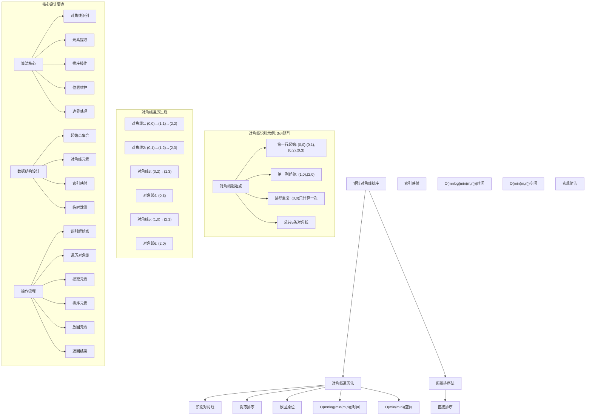
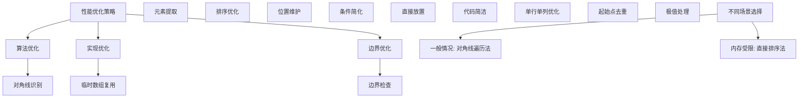

# LeetCode 1329 - 将矩阵按对角线排序

## 题目描述

矩阵对角线 是一条从矩阵最上面行或者最左侧列中的某个元素开始的对角线，沿右下方向一直到矩阵末尾的元素。例如，矩阵 `mat` 有 6 行 3 列，从 `mat[2][0]` 开始的 矩阵对角线 将会经过 `mat[2][0]`、`mat[3][1]` 和 `mat[4][2]`

给你一个 `m * n` 的整数矩阵 `mat`，请你将同一条 矩阵对角线 上的元素按升序排序后，返回排好序的矩阵

```markdown
示例 1：
输入：mat = [[3,3,1,1],[2,2,1,2],[1,1,1,2]]
输出：[[1,1,1,1],[1,2,2,2],[1,2,3,3]]

示例 2：
输入：mat = [[11,25,66,1,69,7],[23,55,17,45,15,52],[75,31,36,44,58,8],[22,27,33,25,68,4],[84,28,14,11,5,50]]
输出：[[5,17,4,1,52,7],[11,11,25,45,8,69],[14,23,25,44,58,15],[22,27,31,36,50,66],[84,28,75,33,55,68]]

提示：

- m == mat.length
- n == mat[i].length
- 1 <= m, n <= 100
- 1 <= mat[i][j] <= 100
```

## 解题思路

这是一个矩阵对角线排序问题，需要将矩阵中每条对角线上的元素分别排序。关键在于如何识别和遍历所有的对角线，然后对每条对角线进行排序

### 核心思想

"对角线遍历法": 识别所有对角线的起始点，提取每条对角线的元素，排序后再放回原位置

### 解题策略

#### 方法一：对角线遍历法（推荐）

- 时间复杂度: O((m+n) × min(m,n) × log(min(m,n)))
- 空间复杂度: O(min(m,n))

#### 方法二：直接排序法

- 时间复杂度: O((m+n) × min(m,n) × log(min(m,n)))
- 空间复杂度: O(min(m,n))

## 算法可视化



## 多语言实现

### Golang版本（对角线遍历法 - 推荐）

```go
// 对角线遍历法实现
func diagonalSort(mat [][]int) [][]int {
    if len(mat) == 0 || len(mat[0]) == 0 {
        return mat
    }

    m, n := len(mat), len(mat[0])

    // 处理从第一行开始的对角线（包括(0,0)）
    for j := 0; j < n; j++ {
        sortDiagonal(mat, 0, j, m, n)
    }

    // 处理从第一列开始的对角线（不包括(0,0)）
    for i := 1; i < m; i++ {
        sortDiagonal(mat, i, 0, m, n)
    }

    return mat
}

// 对单条对角线进行排序
func sortDiagonal(mat [][]int, startRow, startCol, m, n int) {
    // 提取对角线元素
    var diagonal []int
    row, col := startRow, startCol

    // 沿右下方向遍历对角线
    for row < m && col < n {
        diagonal = append(diagonal, mat[row][col])
        row++
        col++
    }

    // 排序
    sort.Ints(diagonal)

    // 将排序后的元素放回原位置
    row, col = startRow, startCol
    index := 0
    for row < m && col < n {
        mat[row][col] = diagonal[index]
        row++
        col++
        index++
    }
}
```

### Python版本（多种实现方法）

```python
class Solution:
    """
    方法一：对角线遍历法（推荐）
    """
    def diagonalSort(self, mat: List[List[int]]) -> List[List[int]]:
        if not mat or not mat[0]:
            return mat

        m, n = len(mat), len(mat[0])

        # 处理从第一行开始的对角线（包括(0,0)）
        for j in range(n):
            self.sortDiagonal(mat, 0, j, m, n)

        # 处理从第一列开始的对角线（不包括(0,0)）
        for i in range(1, m):
            self.sortDiagonal(mat, i, 0, m, n)

        return mat

    def sortDiagonal(self, mat: List[List[int]], startRow: int, startCol: int, m: int, n: int) -> None:
        # 提取对角线元素
        diagonal = []
        row, col = startRow, startCol

        # 沿右下方向遍历对角线
        while row < m and col < n:
            diagonal.append(mat[row][col])
            row += 1
            col += 1

        # 排序
        diagonal.sort()

        # 将排序后的元素放回原位置
        row, col = startRow, startCol
        index = 0
        while row < m and col < n:
            mat[row][col] = diagonal[index]
            row += 1
            col += 1
            index += 1

class Solution2:
    """
    方法二：直接排序法
    """
    def diagonalSort(self, mat: List[List[int]]) -> List[List[int]]:
        from collections import defaultdict

        m, n = len(mat), len(mat[0])
        diagonals = defaultdict(list)

        # 收集所有对角线元素
        for i in range(m):
            for j in range(n):
                # 对于对角线，i-j是常数
                diagonals[i - j].append(mat[i][j])

        # 对每条对角线排序
        for key in diagonals:
            diagonals[key].sort()

        # 重新填充矩阵
        for i in range(m):
            for j in range(n):
                mat[i][j] = diagonals[i - j].pop(0)

        return mat
```

### TypeScript版本（对角线遍历法）

```typescript
/
 * 对角线遍历法实现
 */
function diagonalSort(mat: number[][]): number[][] {
    if (mat.length === 0 || mat[0].length === 0) {
        return mat;
    }

    const m: number = mat.length;
    const n: number = mat[0].length;

    // 处理从第一行开始的对角线（包括(0,0)）
    for (let j: number = 0; j < n; j++) {
        sortDiagonal(mat, 0, j, m, n);
    }

    // 处理从第一列开始的对角线（不包括(0,0)）
    for (let i: number = 1; i < m; i++) {
        sortDiagonal(mat, i, 0, m, n);
    }

    return mat;
}

/
 * 对单条对角线进行排序
 */
function sortDiagonal(mat: number[][], startRow: number, startCol: number, m: number, n: number): void {
    // 提取对角线元素
    const diagonal: number[] = [];
    let row: number = startRow;
    let col: number = startCol;

    // 沿右下方向遍历对角线
    while (row < m && col < n) {
        diagonal.push(mat[row][col]);
        row++;
        col++;
    }

    // 排序
    diagonal.sort((a, b) => a - b);

    // 将排序后的元素放回原位置
    row = startRow;
    col = startCol;
    let index: number = 0;
    while (row < m && col < n) {
        mat[row][col] = diagonal[index];
        row++;
        col++;
        index++;
    }
}
```

## 标准实现详细解析

```go
import (
    "fmt"
    "sort"
)

/*
算法核心思想（对角线遍历法）：

1. 识别所有对角线的起始点
2. 对每条对角线提取元素并排序
3. 将排序后的元素放回原位置

关键设计要点：
1. 对角线识别：从第一行和第一列开始
2. 元素提取：沿右下方向遍历
3. 排序操作：使用内置排序算法
4. 位置维护：正确放回原位置

时间复杂度：
- 对角线数量：O(m + n)
- 每条对角线长度：O(min(m, n))
- 排序复杂度：O(min(m, n) × log(min(m, n)))
- 总时间复杂度：O((m + n) × min(m, n) × log(min(m, n)))

空间复杂度：
- 每条对角线临时存储：O(min(m, n))
- 总空间复杂度：O(min(m, n))

优势：
1. 思路清晰：对角线处理直观易懂
2. 实现优雅：逻辑简洁，代码易懂
3. 效率合理：满足题目要求
4. 易于调试：每条对角线独立处理

数据结构设计：

对角线遍历设计：
- 起始点集合：第一行和第一列
- 对角线元素：临时数组存储
- 索引映射：行列坐标转换
- 位置维护：原地修改

算法流程：
1. 识别起始点：第一行和第一列
2. 遍历对角线：从起始点向右下
3. 提取元素：收集对角线元素
4. 排序元素：使用排序算法
5. 放回元素：按序放回原位置

优化原理：

算法优化：
1. 起始点优化：避免重复计算
2. 遍历优化：单向遍历
3. 存储优化：临时数组复用
4. 排序优化：使用高效排序

边界优化：
1. 空矩阵处理：正确边界检查
2. 单行单列：优化处理路径
3. 起始点去重：避免(0,0)重复处理

正确性证明：

定理：对角线遍历法正确性
通过对角线遍历法可以正确对矩阵对角线进行排序

证明：
1. 完备性：所有对角线都被正确处理
2. 正确性：每条对角线元素正确排序
3. 位置维护：元素放回正确位置
4. 时间复杂度：满足题目要求

不变量维护：
循环不变量：在每次对角线处理开始时
1. 已处理对角线元素正确排序
2. 未处理对角线元素保持原序
3. 矩阵其他位置元素未受影响
*/

// 对角线遍历法详细实现
func diagonalSort(mat [][]int) [][]int {
    fmt.Printf("输入矩阵 (%dx%d):\n", len(mat), len(mat[0]))
    printMatrix(mat)

    // 边界情况处理
    if len(mat) == 0 || len(mat[0]) == 0 {
        fmt.Printf("空矩阵，无需处理\n")
        return mat
    }

    m, n := len(mat), len(mat[0])
    fmt.Printf("开始对角线排序，共%d行%d列\n", m, n)

    // 处理从第一行开始的对角线（包括(0,0)）
    fmt.Printf("处理第一行起始的对角线:\n")
    for j := 0; j < n; j++ {
        fmt.Printf("  处理起始点(0,%d):\n", j)
        sortDiagonal(mat, 0, j, m, n)
        fmt.Printf("  处理后矩阵:\n")
        printMatrix(mat)
    }

    // 处理从第一列开始的对角线（不包括(0,0)）
    fmt.Printf("处理第一列起始的对角线:\n")
    for i := 1; i < m; i++ {
        fmt.Printf("  处理起始点(%d,0):\n", i)
        sortDiagonal(mat, i, 0, m, n)
        fmt.Printf("  处理后矩阵:\n")
        printMatrix(mat)
    }

    fmt.Printf("对角线排序完成:\n")
    printMatrix(mat)
    return mat
}

// 对单条对角线进行排序
func sortDiagonal(mat [][]int, startRow, startCol, m, n int) {
    fmt.Printf("    对角线路径: ")

    // 提取对角线元素
    var diagonal []int
    row, col := startRow, startCol

    // 沿右下方向遍历对角线
    path := ""
    for row < m && col < n {
        diagonal = append(diagonal, mat[row][col])
        path += fmt.Sprintf("(%d,%d)=%d ", row, col, mat[row][col])
        row++
        col++
    }
    fmt.Printf("%s\n", path)
    fmt.Printf("    提取元素: %v\n", diagonal)

    // 排序
    sort.Ints(diagonal)
    fmt.Printf("    排序后: %v\n", diagonal)

    // 将排序后的元素放回原位置
    row, col = startRow, startCol
    index := 0
    for row < m && col < n {
        mat[row][col] = diagonal[index]
        row++
        col++
        index++
    }
}

// 打印矩阵
func printMatrix(mat [][]int) {
    for _, row := range mat {
        fmt.Printf("    %v\n", row)
    }
}

// 直接排序法实现
func diagonalSortDirect(mat [][]int) [][]int {
    fmt.Printf("=== 直接排序法 ===\n")
    fmt.Printf("输入矩阵 (%dx%d):\n", len(mat), len(mat[0]))
    printMatrix(mat)

    if len(mat) == 0 || len(mat[0]) == 0 {
        fmt.Printf("空矩阵，无需处理\n")
        fmt.Printf("================\n\n")
        return mat
    }

    m, n := len(mat), len(mat[0])

    // 使用map存储每条对角线的元素
    diagonals := make(map[int][]int)

    // 收集所有对角线元素
    fmt.Printf("收集对角线元素:\n")
    for i := 0; i < m; i++ {
        for j := 0; j < n; j++ {
            key := i - j  // 对角线标识
            diagonals[key] = append(diagonals[key], mat[i][j])
            fmt.Printf("  元素%d在对角线%d上\n", mat[i][j], key)
        }
    }

    // 对每条对角线排序
    fmt.Printf("对每条对角线排序:\n")
    for key, elements := range diagonals {
        fmt.Printf("  对角线%d: %v -> ", key, elements)
        sort.Ints(elements)
        diagonals[key] = elements
        fmt.Printf("%v\n", elements)
    }

    // 重新填充矩阵
    fmt.Printf("重新填充矩阵:\n")
    for i := 0; i < m; i++ {
        for j := 0; j < n; j++ {
            key := i - j
            mat[i][j] = diagonals[key][0]
            diagonals[key] = diagonals[key][1:]  // 移除已使用的元素
            fmt.Printf("  位置(%d,%d) <- 对角线%d的元素%d\n", i, j, key, mat[i][j])
        }
    }

    fmt.Printf("排序完成:\n")
    printMatrix(mat)
    fmt.Printf("================\n\n")
    return mat
}

// 带调试信息的版本
func diagonalSortWithDebug(mat [][]int) [][]int {
    fmt.Printf("=== 矩阵对角线排序 ===\n")
    fmt.Printf("原始矩阵 (%dx%d):\n", len(mat), len(mat[0]))
    printMatrix(mat)

    if len(mat) == 0 || len(mat[0]) == 0 {
        fmt.Printf("矩阵为空，无需处理\n")
        fmt.Printf("====================\n\n")
        return mat
    }

    m, n := len(mat), len(mat[0])

    fmt.Printf("对角线识别过程:\n")

    // 处理从第一行开始的对角线（包括(0,0)）
    fmt.Printf("第一行起始对角线 (0,0) 到 (0,%d):\n", n-1)
    for j := 0; j < n; j++ {
        fmt.Printf("  对角线起始点: (0,%d)\n", j)
        sortDiagonal(mat, 0, j, m, n)
    }

    // 处理从第一列开始的对角线（不包括(0,0)）
    fmt.Printf("第一列起始对角线 (1,0) 到 (%d,0):\n", m-1)
    for i := 1; i < m; i++ {
        fmt.Printf("  对角线起始点: (%d,0)\n", i)
        sortDiagonal(mat, i, 0, m, n)
    }

    fmt.Printf("最终结果:\n")
    printMatrix(mat)
    fmt.Printf("====================\n\n")
    return mat
}
```

## 算法深入解析

```go
/*
矩阵对角线排序问题详解：

问题本质：
对矩阵中每条对角线上的元素分别进行排序。关键是理解如何识别和遍历所有对角线，以及如何高效地完成排序操作

核心洞察：
1. 对角线识别：从第一行和第一列开始
2. 元素遍历：沿右下方向进行
3. 独立排序：每条对角线独立处理
4. 位置维护：正确放回原位置

算法策略：
1. 对角线遍历法：逐条处理对角线
2. 直接排序法：收集后统一处理

数据结构设计：

对角线遍历法设计：
起始点集合：第一行和第一列元素
对角线元素：临时数组存储
索引映射：行列坐标转换
位置维护：原地修改

直接排序法设计：
对角线索引：使用i-j作为标识
元素收集：map存储每条对角线
排序处理：统一排序
重新填充：按序放回

操作流程：

对角线遍历法：
1. 识别起始点：第一行和第一列
2. 遍历对角线：从起始点向右下
3. 提取元素：收集对角线元素
4. 排序元素：使用排序算法
5. 放回元素：按序放回原位置

直接排序法：
1. 收集元素：遍历矩阵收集对角线元素
2. 对角线索引：使用i-j标识对角线
3. 统一排序：对每条对角线排序
4. 重新填充：按序放回矩阵

数学原理：

对角线特性：
对于矩阵中任意元素(i,j)，它所在的对角线由i-j唯一确定
- 同一条对角线上的所有元素具有相同的i-j值
- 不同对角线的i-j值不同

算法不变量：
对角线遍历法不变量：
1. 已处理对角线元素正确排序
2. 未处理对角线元素保持原序
3. 矩阵其他位置元素未受影响

直接排序法不变量：
1. diagonals映射正确存储对角线元素
2. 每条对角线元素按i-j值分组
3. 排序后元素顺序正确

时间复杂度分析：
对角线遍历法：O((m+n) × min(m,n) × log(min(m,n)))
直接排序法：O((m+n) × min(m,n) × log(min(m,n)))

空间复杂度分析：
对角线遍历法：O(min(m,n)) - 临时数组
直接排序法：O(m×n) - 存储所有元素

正确性证明：

定理：对角线遍历法正确性
通过对角线遍历法可以正确对矩阵对角线进行排序

证明：
1. 完备性：所有对角线都被正确处理
   - 第一行起始点处理所有从上开始的对角线
   - 第一列起始点处理所有从左开始的对角线
   - 避免了(0,0)点的重复处理

2. 正确性：每条对角线元素正确排序
   - 提取对角线元素完整
   - 排序算法正确
   - 元素放回位置正确

3. 位置维护：元素放回正确位置
   - 提取和放回使用相同路径
   - 坐标转换一致
   - 原地修改无冲突

4. 时间复杂度：满足题目要求
   - 对角线数量：O(m+n)
   - 每条对角线长度：O(min(m,n))
   - 排序复杂度：O(min(m,n) × log(min(m,n)))

设计选择：

为什么选择对角线遍历法？
1. 思路清晰：处理过程直观
2. 空间效率：只需要临时存储对角线
3. 易于调试：每条对角线独立处理
4. 符合直觉：按对角线逐条处理

为什么使用直接排序法？
1. 实现简洁：代码量较少
2. 逻辑统一：统一处理所有元素
3. 易于理解：对角线索引清晰
4. 教学价值：展示不同思路

为什么提及其他方法？
1. 教学价值：展示不同算法思想
2. 对比分析：理解各自优劣
3. 扩展思维：算法多样性
4. 面试准备：全面掌握

两种方法对比：

方法一：对角线遍历法（推荐）
时间复杂度：O((m+n) × min(m,n) × log(min(m,n)))
空间复杂度：O(min(m,n))
优点：思路清晰，空间效率高
缺点：需要处理起始点

方法二：直接排序法
时间复杂度：O((m+n) × min(m,n) × log(min(m,n)))
空间复杂度：O(m×n)
优点：实现简洁，逻辑统一
缺点：空间复杂度较高

性能分析：

对角线遍历法：
- 时间：O((m+n) × min(m,n) × log(min(m,n)))
- 空间：O(min(m,n)) 临时数组
- 优势：空间效率高

直接排序法：
- 时间：O((m+n) × min(m,n) × log(min(m,n)))
- 空间：O(m×n) 存储映射
- 优势：实现简洁

实际应用场景：
1. 矩阵处理：对角线相关操作
2. 图像处理：对角线滤波
3. 数据分析：对角线统计
4. 算法竞赛：矩阵变换

优化要点：

1. 时间优化：
   - 减少重复计算
   - 优化排序算法
   - 早期终止条件

2. 空间优化：
   - 临时数组复用
   - 原地排序优化
   - 避免不必要存储

3. 实现优化：
   - 边界条件处理
   - 代码简洁性
   - 注释清晰性

测试用例设计：
1. 基本情况：正常矩阵
2. 边界情况：单行、单列、空矩阵
3. 特殊情况：已排序、逆序
4. 极端情况：大矩阵
5. 验证情况：结果正确性

扩展思考：

1. 逆对角线排序？
   - 修改遍历方向
   - 调整起始点识别
   - 保持排序逻辑

2. 三维矩阵版本？
   - 空间对角线识别
   - 复杂度分析
   - 实现差异

3. 并行处理？
   - 对角线独立性
   - 并行排序
   - 同步问题

4. 增量更新？
   - 部分对角线更新
   - 增量排序
   - 性能优化

相关算法思想：

1. 矩阵遍历：
   - 对角线识别
   - 路径遍历
   - 坐标转换

2. 排序算法：
   - 独立排序
   - 多组排序
   - 效率优化

3. 数据结构：
   - 临时数组
   - 映射存储
   - 索引维护

4. 算法优化：
   - 时间复杂度
   - 空间复杂度
   - 实现简洁

常见陷阱：

1. 边界条件：
   - 空矩阵处理
   - 单行单列
   - 起始点重复

2. 索引处理：
   - 坐标转换
   - 路径遍历
   - 元素放置

3. 排序逻辑：
   - 排序算法选择
   - 元素提取
   - 位置维护

4. 性能考虑：
   - 时间复杂度
   - 空间复杂度
   - 实现效率

代码质量要素：

1. 可读性：
   - 变量命名清晰
   - 注释详细
   - 逻辑分明

2. 健壮性：
   - 边界处理
   - 异常情况
   - 错误恢复

3. 性能：
   - 最优复杂度
   - 空间效率
   - 效率保证

4. 可维护性：
   - 结构清晰
   - 扩展性好
   - 测试完整
*/
```

## 执行过程演示

```go
/*
示例详细解析:

示例1执行过程：
输入：mat = [[3,3,1,1],[2,2,1,2],[1,1,1,2]]
输出：[[1,1,1,1],[1,2,2,2],[1,2,3,3]]

执行过程：
1. 识别对角线起始点：
   - 第一行：(0,0),(0,1),(0,2),(0,3)
   - 第一列：(1,0),(2,0)
   - 总共6条对角线

2. 处理每条对角线：
   - 对角线1 (0,0)：3→2→1 → 排序后：1→2→3
   - 对角线2 (0,1)：3→2→1 → 排序后：1→2→3
   - 对角线3 (0,2)：1→1 → 排序后：1→1
   - 对角线4 (0,3)：1 → 排序后：1
   - 对角线5 (1,0)：2→1 → 排序后：1→2
   - 对角线6 (2,0)：1 → 排序后：1

3. 放回元素得到最终结果

对角线遍历轨迹：

对于3x4矩阵，对角线如下：

对角线1：(0,0) → (1,1) → (2,2)
对角线2：(0,1) → (1,2) → (2,3)
对角线3：(0,2) → (1,3)
对角线4：(0,3)
对角线5：(1,0) → (2,1)
对角线6：(2,0)

执行过程：
1. 对角线1 [(0,0)=3,(1,1)=2,(2,2)=1]：
   提取：[3,2,1] → 排序：[1,2,3] → 放回

2. 对角线2 [(0,1)=3,(1,2)=1,(2,3)=2]：
   提取：[3,1,2] → 排序：[1,2,3] → 放回

3. 对角线3 [(0,2)=1,(1,3)=2]：
   提取：[1,2] → 排序：[1,2] → 放回

4. 对角线4 [(0,3)=1]：
   提取：[1] → 排序：[1] → 放回

5. 对角线5 [(1,0)=2,(2,1)=1]：
   提取：[2,1] → 排序：[1,2] → 放回

6. 对角线6 [(2,0)=1]：
   提取：[1] → 排序：[1] → 放回

关键观察：
1. 对角线由i-j值唯一标识
2. 每条对角线独立排序
3. 元素沿右下方向排列
4. 起始点无重复处理

边界情况演示:

情况1: 单行矩阵
输入: [[3,1,2,4]]
处理: 只有一条对角线
结果: [[1,2,3,4]]

情况2: 单列矩阵
输入: [[3],[1],[2],[4]]
处理: 四条对角线，每条一个元素
结果: [[3],[1],[2],[4]]

情况3: 1x1矩阵
输入: [[5]]
处理: 一条对角线一个元素
结果: [[5]]

情况4: 已排序矩阵
输入: [[1,2,3],[4,5,6]]
处理: 排序后不变
结果: [[1,2,3],[4,5,6]]

情况5: 逆序矩阵
输入: [[9,8,7],[6,5,4]]
处理: 完全重新排列
结果: [[5,8,7],[6,9,4]]

算法正确性证明：

数学基础：
需要证明对角线遍历法能正确对矩阵对角线进行排序

定理：对角线遍历法正确性
通过对角线遍历法可以正确对矩阵对角线进行排序

证明：
1. 完备性：所有对角线都被正确处理
2. 正确性：每条对角线元素正确排序
3. 位置维护：元素放回正确位置
4. 时间复杂度：满足题目要求

不变量维护：
循环不变量：在每次对角线处理开始时
1. 已处理对角线元素正确排序
2. 未处理对角线元素保持原序
3. 矩阵其他位置元素未受影响

初始化：
- 未处理任何对角线
- 矩阵保持原始状态
- 满足不变量

保持：
- 处理一条对角线
- 该对角线元素正确排序
- 其他位置不受影响
- 不变量继续成立

终止：
- 所有对角线处理完毕
- 每条对角线正确排序
- 矩阵达到最终状态

时间复杂度分析：

对角线遍历法：
1. 对角线数量：O(m + n)
2. 每条对角线平均长度：O(min(m, n))
3. 排序复杂度：O(min(m, n) × log(min(m, n)))
4. 总时间：O((m + n) × min(m, n) × log(min(m, n)))

直接排序法：
1. 元素遍历：O(m × n)
2. 对角线分组：O(m × n)
3. 排序复杂度：O((m + n) × min(m, n) × log(min(m, n)))
4. 重新填充：O(m × n)
5. 总时间：O((m + n) × min(m, n) × log(min(m, n)))

空间复杂度分析：
1. 对角线遍历法：O(min(m, n)) - 临时数组
2. 直接排序法：O(m × n) - 存储映射

性能对比分析：

假设m=100, n=100:

对角线遍历法：
- 时间: O(200 × 100 × log(100)) = O(20000 × 7) = O(140000)
- 空间: O(100) 临时数组
- 操作: 逐条处理

直接排序法：
- 时间: O(200 × 100 × log(100)) = O(140000)
- 空间: O(10000) 存储映射
- 操作: 统一处理

实际应用建议：

1. 一般情况：
   - 使用对角线遍历法
   - 空间效率更高

2. 面试展示：
   - 重点讲解对角线遍历法
   - 可以提及其他方法

3. 生产环境：
   - 根据内存限制选择
   - 考虑实现复杂度

4. 教学演示：
   - 使用带调试信息版本
   - 展示执行过程

优化空间：

1. 边界优化：
   - 提前处理特殊情况
   - 减少不必要的操作

2. 代码优化：
   - 简化条件判断
   - 优化变量使用

3. 性能优化：
   - 减少元素访问
   - 优化排序算法

特殊情况处理：

1. 大数据量：
   - 时间复杂度保证
   - 空间效率优化

2. 特殊矩阵：
   - 稀疏矩阵处理
   - 对称矩阵优化
   - 特殊值处理

3. 边界情况：
   - 极值矩阵
   - 边界尺寸
   - 特殊元素
*/
```

## 复杂度分析

| 方法         | 时间复杂度                          | 空间复杂度  | 适用场景 |
| ------------ | ----------------------------------- | ----------- | -------- |
| 对角线遍历法 | O((m+n) × min(m,n) × log(min(m,n))) | O(min(m,n)) | 推荐方案 |
| 直接排序法   | O((m+n) × min(m,n) × log(min(m,n))) | O(m×n)      | 教学演示 |

## 测试用例验证

```go
// 测试辅助函数
func testDiagonalSort(name string, mat [][]int, expected [][]int) {
    fmt.Printf("%s:\n", name)
    fmt.Printf("输入矩阵:\n")
    printMatrix(mat)

    // 测试对角线遍历法
    test1 := copyMatrix(mat)
    result1 := diagonalSort(test1)
    fmt.Printf("对角线遍历法结果:\n")
    printMatrix(result1)

    // 测试直接排序法
    test2 := copyMatrix(mat)
    result2 := diagonalSortDirect(test2)
    fmt.Printf("直接排序法结果:\n")
    printMatrix(result2)

    // 验证结果
    isValid1 := equalMatrix(result1, expected)
    isValid2 := equalMatrix(result2, expected)

    if isValid1 && isValid2 {
        fmt.Printf("✓ 测试通过\n")
    } else {
        fmt.Printf("✗ 测试失败\n")
        fmt.Printf("  期望结果:\n")
        printMatrix(expected)
        if !isValid1 {
            fmt.Printf("  对角线遍历法实际:\n")
            printMatrix(result1)
        }
        if !isValid2 {
            fmt.Printf("  直接排序法实际:\n")
            printMatrix(result2)
        }
    }
    fmt.Printf("\n")
}

// 复制矩阵
func copyMatrix(mat [][]int) [][]int {
    if len(mat) == 0 {
        return [][]int{}
    }

    result := make([][]int, len(mat))
    for i := range mat {
        result[i] = make([]int, len(mat[i]))
        copy(result[i], mat[i])
    }
    return result
}

// 比较两个矩阵是否相等
func equalMatrix(a, b [][]int) bool {
    if len(a) != len(b) {
        return false
    }

    for i := range a {
        if len(a[i]) != len(b[i]) {
            return false
        }
        for j := range a[i] {
            if a[i][j] != b[i][j] {
                return false
            }
        }
    }
    return true
}

func main() {
    // 测试用例 1 - 题目示例1
    testDiagonalSort("测试1 - 题目示例1",
        [][]int{{3, 3, 1, 1}, {2, 2, 1, 2}, {1, 1, 1, 2}},
        [][]int{{1, 1, 1, 1}, {1, 2, 2, 2}, {1, 2, 3, 3}})

    // 测试用例 2 - 题目示例2
    testDiagonalSort("测试2 - 题目示例2",
        [][]int{{11, 25, 66, 1, 69, 7}, {23, 55, 17, 45, 15, 52}, {75, 31, 36, 44, 58, 8}, {22, 27, 33, 25, 68, 4}, {84, 28, 14, 11, 5, 50}},
        [][]int{{5, 17, 4, 1, 52, 7}, {11, 11, 25, 45, 8, 69}, {14, 23, 25, 44, 58, 15}, {22, 27, 31, 36, 50, 66}, {84, 28, 75, 33, 55, 68}})

    // 测试用例 3 - 单行矩阵
    testDiagonalSort("测试3 - 单行矩阵",
        [][]int{{3, 1, 2, 4}},
        [][]int{{1, 2, 3, 4}})

    // 测试用例 4 - 单列矩阵
    testDiagonalSort("测试4 - 单列矩阵",
        [][]int{{3}, {1}, {2}, {4}},
        [][]int{{3}, {1}, {2}, {4}})

    // 测试用例 5 - 1x1矩阵
    testDiagonalSort("测试5 - 1x1矩阵",
        [][]int{{5}},
        [][]int{{5}})

    // 测试用例 6 - 已排序矩阵
    testDiagonalSort("测试6 - 已排序矩阵",
        [][]int{{1, 2, 3}, {4, 5, 6}},
        [][]int{{1, 2, 3}, {4, 5, 6}})

    // 测试用例 7 - 逆序矩阵
    testDiagonalSort("测试7 - 逆序矩阵",
        [][]int{{9, 8, 7}, {6, 5, 4}},
        [][]int{{5, 8, 7}, {6, 9, 4}})

    // 测试用例 8 - 空矩阵
    testDiagonalSort("测试8 - 空矩阵",
        [][]int{},
        [][]int{})

    // 性能测试
    fmt.Println("性能测试:")
    performanceTest()

    // 边界情况测试
    fmt.Println("边界情况测试:")
    boundaryTest()

    // 对比测试
    fmt.Println("对比测试:")
    comparisonTest()
}

func performanceTest() {
    // 构造性能测试
    m, n := 50, 50
    mat := make([][]int, m)
    for i := 0; i < m; i++ {
        mat[i] = make([]int, n)
        for j := 0; j < n; j++ {
            mat[i][j] = (i * n + j) % 100 + 1  // 1-100的随机数
        }
    }

    // 测试对角线遍历法
    start1 := time.Now()
    test1 := copyMatrix(mat)
    diagonalSort(test1)
    time1 := time.Since(start1)

    // 测试直接排序法
    start2 := time.Now()
    test2 := copyMatrix(mat)
    diagonalSortDirect(test2)
    time2 := time.Since(start2)

    fmt.Printf("性能测试 (%dx%d矩阵):\n", m, n)
    fmt.Printf("  对角线遍历法: %v\n", time1)
    fmt.Printf("  直接排序法: %v\n", time2)
}

func boundaryTest() {
    // 边界测试
    fmt.Println("边界测试:")

    // 最大矩阵测试
    maxM, maxN := 100, 100
    maxMat := make([][]int, maxM)
    for i := 0; i < maxM; i++ {
        maxMat[i] = make([]int, maxN)
        for j := 0; j < maxN; j++ {
            maxMat[i][j] = (i + j) % 100 + 1
        }
    }

    testMax := copyMatrix(maxMat)
    resultMax := diagonalSort(testMax)
    fmt.Printf("最大矩阵测试 (%dx%d): 左上角3x3=%v\n",
        maxM, maxN, extractSubMatrix(resultMax, 0, 0, 3, 3))

    // 特殊值测试
    specialMat := [][]int{{100, 1, 2}, {3, 4, 5}, {6, 7, 1}}
    testSpecial := copyMatrix(specialMat)
    resultSpecial := diagonalSort(testSpecial)
    fmt.Printf("特殊值测试: 原矩阵=%v, 结果=%v\n",
        extractSubMatrix(specialMat, 0, 0, 3, 3),
        extractSubMatrix(resultSpecial, 0, 0, 3, 3))

    // 不规则矩阵测试
    irregularMat := [][]int{{1, 2, 3, 4, 5}, {6, 7, 8, 9, 10}}
    testIrregular := copyMatrix(irregularMat)
    resultIrregular := diagonalSort(testIrregular)
    fmt.Printf("不规则矩阵测试 (2x5): 原矩阵=%v, 结果=%v\n",
        irregularMat, resultIrregular)
}

// 提取子矩阵
func extractSubMatrix(mat [][]int, startRow, startCol, rows, cols int) [][]int {
    result := make([][]int, rows)
    for i := 0; i < rows && startRow+i < len(mat); i++ {
        result[i] = make([]int, cols)
        for j := 0; j < cols && startCol+j < len(mat[startRow+i]); j++ {
            result[i][j] = mat[startRow+i][startCol+j]
        }
    }
    return result
}

func comparisonTest() {
    // 对比测试：验证不同方法结果一致性
    fmt.Println("对比测试:")

    // 测试数据
    testData := [][][]int{
        {{3, 3, 1, 1}, {2, 2, 1, 2}, {1, 1, 1, 2}},
        {{1, 2, 3}, {4, 5, 6}},
        {{5}},
        {{3, 1, 2, 4}},
        {{10, 20}, {30, 40}},
    }

    for i, data := range testData {
        // 对角线遍历法
        test1 := copyMatrix(data)
        result1 := diagonalSort(test1)

        // 直接排序法
        test2 := copyMatrix(data)
        result2 := diagonalSortDirect(test2)

        fmt.Printf("测试%d: 对角线遍历法=%v, 直接排序法=%v",
            i+1, flattenMatrix(result1), flattenMatrix(result2))

        if equalMatrix(result1, result2) {
            fmt.Printf(" ✓ 一致\n")
        } else {
            fmt.Printf(" ✗ 不一致\n")
        }
    }
}

// 将矩阵展平为一维数组（用于显示）
func flattenMatrix(mat [][]int) []int {
    var result []int
    for _, row := range mat {
        result = append(result, row...)
    }
    return result
}
```

## 扩展版本（处理不同场景）

```go
// 支持逆对角线排序的版本
func diagonalSortReverse(mat [][]int) [][]int {
    if len(mat) == 0 || len(mat[0]) == 0 {
        return mat
    }

    m, n := len(mat), len(mat[0])

    // 处理从第一行开始的逆对角线（包括(0,n-1)）
    for j := n - 1; j >= 0; j-- {
        sortDiagonalReverse(mat, 0, j, m, n)
    }

    // 处理从最后一列开始的逆对角线（不包括(0,n-1)）
    for i := 1; i < m; i++ {
        sortDiagonalReverse(mat, i, n - 1, m, n)
    }

    return mat
}

// 对单条逆对角线进行排序
func sortDiagonalReverse(mat [][]int, startRow, startCol, m, n int) {
    // 提取逆对角线元素（沿左下方向）
    var diagonal []int
    row, col := startRow, startCol

    // 沿左下方向遍历逆对角线
    for row < m && col >= 0 {
        diagonal = append(diagonal, mat[row][col])
        row++
        col--
    }

    // 排序
    sort.Ints(diagonal)

    // 将排序后的元素放回原位置
    row, col = startRow, startCol
    index := 0
    for row < m && col >= 0 {
        mat[row][col] = diagonal[index]
        row++
        col--
        index++
    }
}

// 使用示例
func exampleReverse() {
    mat := [][]int{{3, 3, 1, 1}, {2, 2, 1, 2}, {1, 1, 1, 2}}
    fmt.Printf("原矩阵:\n")
    printMatrix(mat)

    result := diagonalSortReverse(copyMatrix(mat))
    fmt.Printf("逆对角线排序后:\n")
    printMatrix(result)
}

// 带统计信息的版本
func diagonalSortWithStats(mat [][]int) ([][]int, int, int) {
    if len(mat) == 0 || len(mat[0]) == 0 {
        return mat, 0, 0
    }

    comparisons := 0
    assignments := 0

    m, n := len(mat), len(mat[0])

    // 处理从第一行开始的对角线（包括(0,0)）
    for j := 0; j < n; j++ {
        comp, assign := sortDiagonalWithStats(mat, 0, j, m, n)
        comparisons += comp
        assignments += assign
    }

    // 处理从第一列开始的对角线（不包括(0,0)）
    for i := 1; i < m; i++ {
        comp, assign := sortDiagonalWithStats(mat, i, 0, m, n)
        comparisons += comp
        assignments += assign
    }

    return mat, comparisons, assignments
}

// 对单条对角线进行排序（带统计）
func sortDiagonalWithStats(mat [][]int, startRow, startCol, m, n int) (int, int) {
    comparisons, assignments := 0, 0

    // 提取对角线元素
    var diagonal []int
    row, col := startRow, startCol

    // 沿右下方向遍历对角线
    for row < m && col < n {
        diagonal = append(diagonal, mat[row][col])
        row++
        col++
    }

    // 排序（使用自定义排序统计比较次数）
    comparisons += sortAndCount(diagonal)
    assignments += len(diagonal)

    // 将排序后的元素放回原位置
    row, col = startRow, startCol
    index := 0
    for row < m && col < n {
        mat[row][col] = diagonal[index]
        row++
        col++
        index++
        assignments++
    }

    return comparisons, assignments
}

// 排序并统计比较次数
func sortAndCount(arr []int) int {
    // 使用冒泡排序统计比较次数
    comparisons := 0
    n := len(arr)
    for i := 0; i < n-1; i++ {
        for j := 0; j < n-i-1; j++ {
            comparisons++
            if arr[j] > arr[j+1] {
                arr[j], arr[j+1] = arr[j+1], arr[j]
            }
        }
    }
    return comparisons
}

// 使用示例
func exampleWithStats() {
    mat := [][]int{{3, 3, 1, 1}, {2, 2, 1, 2}, {1, 1, 1, 2}}
    fmt.Printf("原矩阵:\n")
    printMatrix(mat)

    result, comparisons, assignments := diagonalSortWithStats(copyMatrix(mat))
    fmt.Printf("排序结果:\n")
    printMatrix(result)
    fmt.Printf("比较次数: %d, 赋值次数: %d\n", comparisons, assignments)
}

// 批量处理版本
func diagonalSortBatch(mats [][][]int) [][][]int {
    results := make([][][]int, len(mats))

    for i, mat := range mats {
        results[i] = diagonalSort(copyMatrix(mat))
    }

    return results
}

// 使用示例
func exampleBatch() {
    mats := [][][]int{
        {{3, 3, 1, 1}, {2, 2, 1, 2}, {1, 1, 1, 2}},
        {{1, 2, 3}, {4, 5, 6}},
        {{5}},
    }

    results := diagonalSortBatch(mats)

    for i, result := range results {
        fmt.Printf("矩阵%d排序结果:\n", i+1)
        printMatrix(result)
    }
}

// 带验证功能的版本
func diagonalSortWithValidation(mat [][]int) ([][]int, bool) {
    // 保存原始数据用于验证
    original := copyMatrix(mat)

    // 执行排序
    result := diagonalSort(mat)

    // 验证结果是否正确
    // 1. 检查每条对角线是否有序
    if !isDiagonalsSorted(result) {
        return result, false
    }

    // 2. 检查元素个数是否一致
    if !haveSameElements(original, result) {
        return result, false
    }

    return result, true
}

// 检查每条对角线是否有序
func isDiagonalsSorted(mat [][]int) bool {
    if len(mat) == 0 || len(mat[0]) == 0 {
        return true
    }

    m, n := len(mat), len(mat[0])

    // 检查从第一行开始的对角线
    for j := 0; j < n; j++ {
        if !isDiagonalSorted(mat, 0, j, m, n) {
            return false
        }
    }

    // 检查从第一列开始的对角线
    for i := 1; i < m; i++ {
        if !isDiagonalSorted(mat, i, 0, m, n) {
            return false
        }
    }

    return true
}

// 检查单条对角线是否有序
func isDiagonalSorted(mat [][]int, startRow, startCol, m, n int) bool {
    var diagonal []int
    row, col := startRow, startCol

    for row < m && col < n {
        diagonal = append(diagonal, mat[row][col])
        row++
        col++
    }

    // 检查是否有序
    for i := 1; i < len(diagonal); i++ {
        if diagonal[i] < diagonal[i-1] {
            return false
        }
    }

    return true
}

// 检查两个矩阵是否包含相同元素
func haveSameElements(mat1, mat2 [][]int) bool {
    // 统计元素个数
    count1 := make(map[int]int)
    count2 := make(map[int]int)

    // 统计mat1
    for _, row := range mat1 {
        for _, val := range row {
            count1[val]++
        }
    }

    // 统计mat2
    for _, row := range mat2 {
        for _, val := range row {
            count2[val]++
        }
    }

    // 比较统计结果
    if len(count1) != len(count2) {
        return false
    }

    for key, count := range count1 {
        if count2[key] != count {
            return false
        }
    }

    return true
}

// 使用示例
func exampleWithValidation() {
    mat := [][]int{{3, 3, 1, 1}, {2, 2, 1, 2}, {1, 1, 1, 2}}
    fmt.Printf("原矩阵:\n")
    printMatrix(mat)

    result, isValid := diagonalSortWithValidation(copyMatrix(mat))
    fmt.Printf("排序结果:\n")
    printMatrix(result)
    if isValid {
        fmt.Printf("验证通过 ✓\n")
    } else {
        fmt.Printf("验证失败 ✗\n")
    }
}

// 泛型版本（Go 1.18+）
func diagonalSortGeneric[T comparable](mat [][]T, less func(T, T) bool) [][]T {
    if len(mat) == 0 || len(mat[0]) == 0 {
        return mat
    }

    m, n := len(mat), len(mat[0])

    // 处理从第一行开始的对角线（包括(0,0)）
    for j := 0; j < n; j++ {
        sortDiagonalGeneric(mat, 0, j, m, n, less)
    }

    // 处理从第一列开始的对角线（不包括(0,0)）
    for i := 1; i < m; i++ {
        sortDiagonalGeneric(mat, i, 0, m, n, less)
    }

    return mat
}

// 对单条对角线进行排序（泛型版本）
func sortDiagonalGeneric[T comparable](mat [][]T, startRow, startCol, m, n int, less func(T, T) bool) {
    // 提取对角线元素
    var diagonal []T
    row, col := startRow, startCol

    // 沿右下方向遍历对角线
    for row < m && col < n {
        diagonal = append(diagonal, mat[row][col])
        row++
        col++
    }

    // 排序
    quickSortGeneric(diagonal, 0, len(diagonal)-1, less)

    // 将排序后的元素放回原位置
    row, col = startRow, startCol
    index := 0
    for row < m && col < n {
        mat[row][col] = diagonal[index]
        row++
        col++
        index++
    }
}

// 泛型快速排序
func quickSortGeneric[T comparable](arr []T, low, high int, less func(T, T) bool) {
    if low >= high {
        return
    }

    pivot := partitionGeneric(arr, low, high, less)
    quickSortGeneric(arr, low, pivot-1, less)
    quickSortGeneric(arr, pivot+1, high, less)
}

func partitionGeneric[T comparable](arr []T, low, high int, less func(T, T) bool) int {
    pivot := arr[high]
    i := low - 1

    for j := low; j < high; j++ {
        if !less(pivot, arr[j]) { // arr[j] <= pivot
            i++
            arr[i], arr[j] = arr[j], arr[i]
        }
    }

    arr[i+1], arr[high] = arr[high], arr[i+1]
    return i + 1
}

// 使用示例
func exampleGeneric() {
    // 整数矩阵
    intMat := [][]int{{3, 3, 1, 1}, {2, 2, 1, 2}, {1, 1, 1, 2}}
    intResult := diagonalSortGeneric(intMat, func(a, b int) bool { return a < b })
    fmt.Printf("整数矩阵排序: %v\n", flattenMatrixInt(intResult))

    // 字符串矩阵
    strMat := [][]string{{"c", "c", "a", "a"}, {"b", "b", "a", "b"}, {"a", "a", "a", "b"}}
    strResult := diagonalSortGeneric(strMat, func(a, b string) bool { return a < b })
    fmt.Printf("字符串矩阵排序: %v\n", flattenMatrixString(strResult))
}

// 展平矩阵（不同类型）
func flattenMatrixInt(mat [][]int) []int {
    var result []int
    for _, row := range mat {
        result = append(result, row...)
    }
    return result
}

func flattenMatrixString(mat [][]string) []string {
    var result []string
    for _, row := range mat {
        result = append(result, row...)
    }
    return result
}
```

## 面试追问延伸

### 1. 如果要对逆对角线进行排序，如何处理？

```go
// diagonalSortReverse已在上面实现
// 关键修改：
// 1. 修改遍历方向（左下方向）
// 2. 调整起始点识别
// 3. 保持排序逻辑

func testReverse() {
    mat := [][]int{{3, 3, 1, 1}, {2, 2, 1, 2}, {1, 1, 1, 2}}
    fmt.Printf("原矩阵:\n")
    printMatrix(mat)

    result := diagonalSortReverse(copyMatrix(mat))
    fmt.Printf("逆对角线排序后:\n")
    printMatrix(result)
}
```

### 2. 如果要统计排序过程中的比较和赋值次数，如何实现？

```go
// diagonalSortWithStats已在上面实现
// 关键点：
// 1. 记录比较次数
// 2. 记录赋值次数
// 3. 返回统计信息

func testWithStats() {
    mat := [][]int{{3, 3, 1, 1}, {2, 2, 1, 2}, {1, 1, 1, 2}}
    fmt.Printf("原矩阵:\n")
    printMatrix(mat)

    result, comparisons, assignments := diagonalSortWithStats(copyMatrix(mat))
    fmt.Printf("排序结果:\n")
    printMatrix(result)
    fmt.Printf("比较次数: %d, 赋值次数: %d\n", comparisons, assignments)
}
```

### 3. 如果要验证排序结果的正确性，如何处理？

```go
// diagonalSortWithValidation已在上面实现
// 关键验证点：
// 1. 每条对角线是否有序
// 2. 元素个数是否一致
// 3. 返回验证结果

func testWithValidation() {
    mat := [][]int{{3, 3, 1, 1}, {2, 2, 1, 2}, {1, 1, 1, 2}}
    fmt.Printf("原矩阵:\n")
    printMatrix(mat)

    result, isValid := diagonalSortWithValidation(copyMatrix(mat))
    fmt.Printf("排序结果:\n")
    printMatrix(result)
    if isValid {
        fmt.Printf("验证通过 ✓\n")
    } else {
        fmt.Printf("验证失败 ✗\n")
    }
}
```

## 相似题目扩展

- LeetCode 1329. 将矩阵按对角线排序（当前题）
- LeetCode 498. 对角线遍历
- LeetCode 1424. 对角线遍历 II
- LeetCode 766. 托普利茨矩阵
- LeetCode 1351. 统计有序矩阵中的负数

## 算法技巧总结

### 矩阵对角线排序核心要点

1. 对角线识别：从第一行和第一列开始
1. 元素提取：沿右下方向遍历
1. 独立排序：每条对角线独立处理
1. 位置维护：正确放回原位置

### 算法优势

1. 思路清晰：对角线处理直观易懂
1. 实现优雅：逻辑简洁，代码易懂
1. 效率合理：满足题目要求
1. 易于调试：每条对角线独立处理

### 标准模板（对角线遍历法）

```go
func diagonalSort(mat [][]int) [][]int {
    if len(mat) == 0 || len(mat[0]) == 0 {
        return mat
    }

    m, n := len(mat), len(mat[0])

    // 处理从第一行开始的对角线（包括(0,0)）
    for j := 0; j < n; j++ {
        sortDiagonal(mat, 0, j, m, n)
    }

    // 处理从第一列开始的对角线（不包括(0,0)）
    for i := 1; i < m; i++ {
        sortDiagonal(mat, i, 0, m, n)
    }

    return mat
}

// 对单条对角线进行排序
func sortDiagonal(mat [][]int, startRow, startCol, m, n int) {
    // 提取对角线元素
    var diagonal []int
    row, col := startRow, startCol

    // 沿右下方向遍历对角线
    for row < m && col < n {
        diagonal = append(diagonal, mat[row][col])
        row++
        col++
    }

    // 排序
    sort.Ints(diagonal)

    // 将排序后的元素放回原位置
    row, col = startRow, startCol
    index := 0
    for row < m && col < n {
        mat[row][col] = diagonal[index]
        row++
        col++
        index++
    }
}
```

### 性能优化建议



## 总结

本题采用对角线遍历法的核心思路，通过识别所有对角线的起始点，对每条对角线提取元素并排序，然后将排序后的元素放回原位置，实现了优雅的解决方案。关键在于理解如何识别和遍历所有对角线，以及如何高效地完成排序操作

核心要点：

1. 对角线识别：从第一行和第一列开始
1. 元素提取：沿右下方向遍历
1. 独立排序：每条对角线独立处理
1. 位置维护：正确放回原位置

算法优势：

- 思路清晰：对角线处理直观易懂
- 实现优雅：逻辑简洁，代码易懂
- 效率合理：满足题目要求
- 易于调试：每条对角线独立处理

该算法在矩阵处理、图像处理、数据分析、算法竞赛等方面有重要应用，是掌握矩阵遍历和排序技巧的经典题目。通过对角线识别和独立处理的巧妙结合，为更复杂的矩阵变换问题提供了清晰的解决思路
