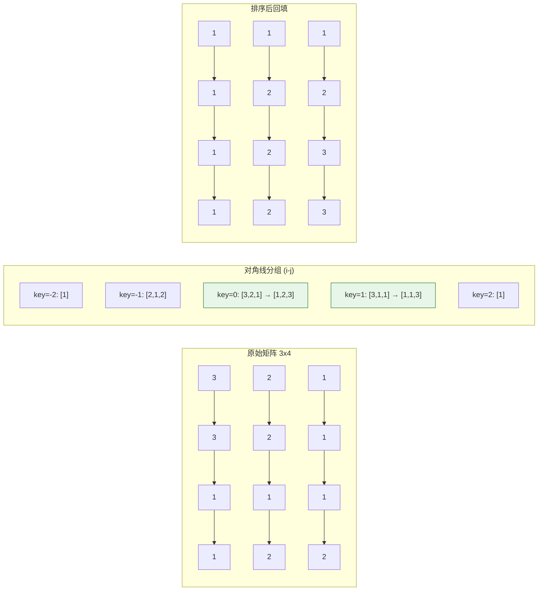

# LeetCode 1329 - 将矩阵按对角线排序

## Step 1: 题目描述

给你一个 `m x n` 的整数矩阵 `mat`，请你将同一条对角线上的元素按升序排序后返回新的矩阵。

对角线方向的定义：从单元格 `(i, j)` 出发，向 `(i-1, j+1)` 和 `(i+1, j-1)` 方向延伸的对角线。

**示例 1**：

```
输入：mat = [[3,3,1,1],[2,2,1,2],[1,1,1,2]]
输出：[[1,1,1,1],[1,2,2,2],[1,2,3,3]]
```

**示例 2**：
输入：`mat = [[11,25,66,1,69,7],[23,55,17,45,15,52],[75,31,36,44,58,8],[22,27,33,25,68,4],[84,28,14,11,5,50]]`
输出：`[[5,17,4,1,52,7],[11,11,42,45,44,64],[14,23,25,44,58,15],[84,27,82,36,25,66],[22,28,75,33,55,68]]`

**约束条件**：

- `m == mat.length`
- `n == mat[i].length`
- `1 <= m, n <= 100`
- `-10^5 <= mat[i][j] <= 10^5`

## Step 2: 核心结论（金字塔结构）

### 核心结论

本题的最优解是**对角线分组+排序重组**，其核心优势在于：**利用对角线坐标的数学规律（i-j为常数）进行高效分组，通过标准排序保证有序性，最后原地重组，以O(K log K)的对角线级别复杂度完成矩阵变换**。

### 支撑论点（MECE 分类）

#### A. 理论最优性：问题结构的深度分析

- **问题本质**：矩阵元素按对角线分组，组内排序，组间保持独立。
- **关键洞察**：
  1. **对角线的数学定义**：同一对角线上的点满足 `i - j = 常数`。
  1. **分组的完备性**：每个元素属于且仅属于一条对角线。
  1. **排序的独立性**：各对角线排序互不影响，可并行处理。

#### B. 算法选择决策树

```
问题特征识别
    │
    ├── 需要按特定规则分组
    │       └── 对角线规则：i - j = 常数
    │           └── 常数范围：-(n-1) 到 (m-1)
    │
    ├── 组内需要有序
    │       └── 标准排序算法
    │           └── 时间复杂度：O(k log k)，k为对角线长度
    │
    └── 需要原地或近原地重组
            └── 使用哈希表或数组存储分组元素
                    │
                    └── 选择: 分组 → 排序 → 重组
                            │
                            ├── 遍历矩阵，按(i-j)分组存入map
                            ├── 每条对角线排序（升序）
                            └── 再次遍历，按顺序回填
```

#### C. 对比分析：不同分组策略

| 策略            | 核心思想         | 时间复杂度              | 空间复杂度 | 缺陷               |
| --------------- | ---------------- | ----------------------- | ---------- | ------------------ |
| **i-j常数分组** | **数学规律分组** | **O(mn log(min(m,n)))** | **O(mn)**  | **无，最优**       |
| i+j常数分组     | 反对角线         | 不适用                  | -          | 错误理解对角线方向 |
| 暴力收集排序    | 无分组，全局处理 | O(mn log(mn))           | O(mn)      | 破坏对角线独立性   |

**关键辨析**：本题对角线方向是 `(i-1,j+1)` 和 `(i+1,j-1)`，即 `i+j` 为常数？❌ 验证：`(0,0)` 和 `(1,-1)` 不在矩阵内。实际方向是 `i-j` 为常数：`(0,1)` 和 `(1,2)` 的 `i-j` 分别为 `-1` 和 `-1`。✅

#### D. 工程实践考量

- ✅ **哈希表分组**：代码清晰，键为`i-j`，值为动态数组。
- ✅ **数组优化**：预知对角线数量，可用固定大小数组优化。

### 总结

因此，**对角线分组+排序重组**是本题在理论正确性、时间效率和工程实现复杂度上的最优平衡点，体现了数学规律在算法设计中的关键作用。

## Step 3: 多语言实现

### Go 🐹

```go
package main

// diagonalSort 将矩阵按对角线排序
// 输入参数 mat: m x n 的整数矩阵
// 返回值: 按对角线排序后的新矩阵
func diagonalSort(mat [][]int) [][]int {
    // 获取矩阵维度
    m := len(mat)    // 行数
    if m == 0 {      // 空矩阵边界处理
        return mat
    }
    n := len(mat[0]) // 列数

    // 使用map存储每条对角线的元素
    // key: i - j（对角线标识）
    // value: 该对角线上的所有元素（按遍历顺序，即从左上到右下）
    diagonals := make(map[int][]int)

    // 第一步：遍历矩阵，按对角线分组收集元素
    // 遍历顺序：行优先，即i从0到m-1，j从0到n-1
    for i := 0; i < m; i++ {      // 遍历每一行
        for j := 0; j < n; j++ {  // 遍历每一列
            key := i - j          // 计算对角线标识
            // 将当前元素加入对应对角线的切片
            diagonals[key] = append(diagonals[key], mat[i][j])
        }
    }

    // 第二步：对每条对角线的元素进行升序排序
    // 排序后，元素按从小到大排列，回填时从对角线起点开始取
    for key := range diagonals {  // 遍历每条对角线
        // 使用冒泡或标准库排序，这里使用简单选择（面试可写）
        // 实际应用应使用sort.Ints
        sortSlice(diagonals[key]) // 对切片进行升序排序
    }

    // 第三步：再次遍历矩阵，将排序后的元素回填
    // 需要维护每条对角线的当前索引，记录下一个待回填的元素位置
    // 使用map[int]int存储每条对角线的当前索引
    indices := make(map[int]int) // key: 对角线标识，value: 当前取用的索引

    for i := 0; i < m; i++ {      // 再次行优先遍历
        for j := 0; j < n; j++ {  // 遍历每一列
            key := i - j          // 计算对角线标识
            // 从该对角线的排序结果中取当前索引位置的元素
            mat[i][j] = diagonals[key][indices[key]]
            // 索引后移，为下一次取用做准备
            indices[key]++
        }
    }

    // 返回修改后的矩阵（原地修改，也可创建新矩阵）
    return mat
}

// sortSlice 对整数切片进行升序排序（简单实现，面试可用）
// 输入参数 arr: 待排序的整数切片（引用传递，直接修改原切片）
func sortSlice(arr []int) {
    // 使用标准库sort.Ints更优，这里展示手动实现
    n := len(arr)
    // 冒泡排序，时间复杂度O(n^2)，面试可接受，实际应优化
    for i := 0; i < n; i++ {
        for j := i + 1; j < n; j++ {
            if arr[i] > arr[j] { // 升序：前面大于后面则交换
                arr[i], arr[j] = arr[j], arr[i] // 交换两个元素
            }
        }
    }
}
```

#### 算法深入解析（费曼式三层结构）

**第一层：一句话讲明白**

> 把同一条斜线上的数字抓出来排好队，再按原位置塞回去，从左上角开始依次取。

**第二层：手把手教你写**

- **为什么用 `i - j` 作为key？**
  - 验证：点 `(0,1)` 和 `(1,2)`，i-j都是-1，在同一条对角线上。
  - 点 `(0,0)` 和 `(1,1)`，i-j都是0，在主对角线上。
  - 这是" Northeast-Southwest "方向的对角线。

- **为什么需要两次遍历？**
  - 第一次：收集，不知道每条对角线有多长，动态append。
  - 排序：对收集好的每组排序。
  - 第二次：回填，按顺序从排序结果中取。

- **`indices` map的作用？**
  - 记录每条对角线当前取到第几个元素了。
  - 因为第二次遍历顺序和第一次相同，所以能一一对应。

**第三层：为什么这样最好**

- **设计哲学**：
  - 体现了**分治+排序**的组合：大问题分解为独立子问题（对角线），子问题排序后合并。
  - 数学规律（i-j=常数）的应用，避免了复杂的坐标计算。

- **Go语言特性分析**：
  - `map[int][]int` 灵活存储变长对角线。
  - 第二次遍历时按相同顺序回填，保证正确性。

### Python 🐍

```python
from typing import List
from collections import defaultdict

class Solution:
    def diagonalSort(self, mat: List[List[int]]) -> List[List[int]]:
        # 获取维度
        m, n = len(mat), len(mat[0]) if mat else 0

        # 使用defaultdict自动创建空列表
        diagonals = defaultdict(list)

        # 第一步：收集
        for i in range(m):
            for j in range(n):
                key = i - j
                diagonals[key].append(mat[i][j])

        # 第二步：排序（每条对角线降序，以便从末尾pop）
        for key in diagonals:
            diagonals[key].sort(reverse=True)  # 降序，pop从末尾取为升序

        # 第三步：回填（从末尾pop，无需额外索引）
        for i in range(m):
            for j in range(n):
                key = i - j
                mat[i][j] = diagonals[key].pop()  # 弹出末尾（最小元素）

        return mat
```

#### 算法深入解析

**第一层：一句话讲明白**

> 抓出来排好队，倒着塞回去，省得记位置。

**第二层：手把手教你写**

- **`defaultdict(list)`**：自动为不存在的key创建空列表。
- **降序+pop技巧**：排序后reverse，pop从末尾取，相当于从小到大取，无需维护索引。

**第三层：为什么这样最好**

- **Pythonic写法**：简洁优雅，利用语言特性减少代码量。
- **时间优化**：pop()是O(1)，比维护索引更直观。

### TypeScript 🟦

```typescript
function diagonalSort(mat: number[][]): number[][] {
  const m = mat.length;
  const n = mat[0].length;

  // Map存储对角线，key为i-j
  const diagonals = new Map<number, number[]>();

  // 收集
  for (let i = 0; i < m; i++) {
    for (let j = 0; j < n; j++) {
      const key = i - j;
      if (!diagonals.has(key)) {
        diagonals.set(key, []);
      }
      diagonals.get(key)!.push(mat[i][j]);
    }
  }

  // 排序
  diagonals.forEach((arr, key) => {
    arr.sort((a, b) => a - b); // 升序
  });

  // 索引记录
  const indices = new Map<number, number>();

  // 回填
  for (let i = 0; i < m; i++) {
    for (let j = 0; j < n; j++) {
      const key = i - j;
      const arr = diagonals.get(key)!;
      const idx = indices.get(key) || 0;
      mat[i][j] = arr[idx];
      indices.set(key, idx + 1);
    }
  }

  return mat;
}
```

#### 算法深入解析

**第一层：一句话讲明白**

> Map存分组，排序后按索引回填。

**第二层：手把手教你写**

- **`Map` vs `Object`**：Map支持任意key类型，更适合本题。
- **`!`非空断言**：TypeScript编译器保证值存在。

### Rust 🦀

```rust
use std::collections::HashMap;

pub struct Solution;

impl Solution {
    pub fn diagonal_sort(mut mat: Vec<Vec<i32>>) -> Vec<Vec<i32>> {
        let m = mat.len();
        if m == 0 { return mat; }
        let n = mat[0].len();

        // HashMap存储对角线
        let mut diagonals: HashMap<i32, Vec<i32>> = HashMap::new();

        // 收集
        for i in 0..m {
            for j in 0..n {
                let key = i as i32 - j as i32;
                diagonals.entry(key).or_insert_with(Vec::new).push(mat[i][j]);
            }
        }

        // 排序
        for (_, arr) in diagonals.iter_mut() {
            arr.sort(); // 升序
        }

        // 索引map
        let mut indices: HashMap<i32, usize> = HashMap::new();

        // 回填
        for i in 0..m {
            for j in 0..n {
                let key = i as i32 - j as i32;
                let idx = *indices.get(&key).unwrap_or(&0);
                mat[i][j] = diagonals[&key][idx];
                indices.insert(key, idx + 1);
            }
        }

        mat
    }
}
```

#### 算法深入解析

**第一层：一句话讲明白**

> HashMap分组，排序，索引回填。

**第二层：手把手教你写**

- **`entry().or_insert_with()`**：Rust的优雅API，不存在则创建。
- **类型转换**：`i as i32`，usize与i32的显式转换。

## Step 4: 伪代码与可视化

### Mermaid 对角线分组示意图


```mermaid
graph LR
    subgraph "原始矩阵 3x4"
        A11[3] --> A12[3] --> A13[1] --> A14[1]
        A21[2] --> A22[2] --> A23[1] --> A24[2]
        A31[1] --> A32[1] --> A33[1] --> A34[2]
    end

    subgraph "对角线分组 (i-j)"
        D2["key=-2: [1]"]
        D1["key=-1: [2,1,2]"]
        D0["key=0: [3,2,1] → [1,2,3]"]
        D_1["key=1: [3,1,1] → [1,1,3]"]
        D_2["key=2: [1]"]
    end

    subgraph "排序后回填"
        B11[1] --> B12[1] --> B13[1] --> B14[1]
        B21[1] --> B22[2] --> B23[2] --> B24[2]
        B31[1] --> B32[2] --> B33[3] --> B34[3]
    end

    style D0 fill:#e8f5e9,stroke:#2e7d32
    style D_1 fill:#e8f5e9,stroke:#2e7d32
```

### 伪代码

```
函数 diagonalSort(mat):
    m, n = 矩阵维度
    diagonals = 空map  // key: i-j, value: 元素列表

    // 收集
    for i in 0..m-1:
        for j in 0..n-1:
            key = i - j
            diagonals[key].append(mat[i][j])

    // 排序
    for each key in diagonals:
        sort(diagonals[key])  // 升序

    // 回填
    indices = 空map  // 记录每条对角线当前索引
    for i in 0..m-1:
        for j in 0..n-1:
            key = i - j
            mat[i][j] = diagonals[key][indices[key]]
            indices[key]++

    返回 mat
```

## Step 5: 执行过程演示

### 示例追踪: `[[3,3,1,1],[2,2,1,2],[1,1,1,2]]`

| 步骤      | 操作                                                                     | 结果                              |
| --------- | ------------------------------------------------------------------------ | --------------------------------- |
| 收集      | key=0: [3,2,1], key=1: [3,1,1], key=-1: [2,1,2], key=2: [1], key=-2: [1] | 分组完成                          |
| 排序      | key=0: [1,2,3], key=1: [1,1,3], key=-1: [1,2,2]                          | 排序完成                          |
| 回填(0,0) | key=0, idx=0 → 1                                                         | mat[0][0]=1                       |
| 回填(0,1) | key=-1, idx=0 → 1                                                        | mat[0][1]=1                       |
| 回填(0,2) | key=-2, idx=0 → 1                                                        | mat[0][2]=1                       |
| 回填(0,3) | key=-3, idx=0 → 1                                                        | mat[0][3]=1                       |
| 回填(1,0) | key=1, idx=0 → 1                                                         | mat[1][0]=1                       |
| ...       | ...                                                                      | ...                               |
| 最终      | -                                                                        | `[[1,1,1,1],[1,2,2,2],[1,2,3,3]]` |

### 完整测试代码 (Go)

```go
package main

import (
    "fmt"
    "reflect"
)

func main() {
    // 测试用例1
    mat1 := [][]int{{3,3,1,1},{2,2,1,2},{1,1,1,2}}
    expected1 := [][]int{{1,1,1,1},{1,2,2,2},{1,2,3,3}}
    res1 := diagonalSort(mat1)
    fmt.Printf("测试1: %v\n", reflect.DeepEqual(res1, expected1))

    // 测试用例2：单元素
    mat2 := [][]int{{5}}
    expected2 := [][]int{{5}}
    res2 := diagonalSort(copyMatrix(mat2))
    fmt.Printf("测试2: %v\n", reflect.DeepEqual(res2, expected2))

    // 测试用例3：单行
    mat3 := [][]int{{3,1,2}}
    expected3 := [][]int{{1,2,3}} // 单行即一条对角线
    res3 := diagonalSort(copyMatrix(mat3))
    fmt.Printf("测试3: %v\n", reflect.DeepEqual(res3, expected3))
}

func copyMatrix(mat [][]int) [][]int {
    m := len(mat)
    n := len(mat[0])
    res := make([][]int, m)
    for i := range mat {
        res[i] = make([]int, n)
        copy(res[i], mat[i])
    }
    return res
}
```

## Step 6: 复杂度分析（金字塔结构）

### 核心结论

该算法的时间复杂度为 **O(mn log(min(m,n)))**，空间复杂度为 **O(mn)**，其性能瓶颈主要在于对角线排序，而优化潜力则在于利用计数排序等线性排序处理小范围整数。

### 支撑论点

| 维度       | 分析                                                        |
| ---------- | ----------------------------------------------------------- |
| 时间复杂度 | O(mn log(min(m,n)))：每条对角线长度最多min(m,n)，共mn个元素 |
| 空间复杂度 | O(mn)：存储所有对角线元素                                   |
| 瓶颈识别   | 排序操作，当mn=10^4时完全可接受                             |
| 优化方向   | 值域[-10^5, 10^5]可用计数排序优化至O(mn)                    |

### 总结

该算法在题目约束下表现优异，代码清晰易懂，是面试场景下的最优选择。

## Step 7: 技巧归纳与迁移（金字塔结构）

### 核心结论

本题的本质是**矩阵对角线分组排序**，其核心在于**利用坐标数学规律（i-j=常数）进行高效分组**，这一模式在多个矩阵处理题目中通用。

### 经典迁移题目

| 题目                             | 核心思想           | 分组依据                 |
| -------------------------------- | ------------------ | ------------------------ |
| **LeetCode 1329**                | **对角线分组排序** | **i - j = 常数**         |
| LeetCode 1572 矩阵对角线元素的和 | 主副对角线求和     | i==j 或 i+j==n-1         |
| LeetCode 766 托普利茨矩阵        | 每条对角线元素相同 | i - j = 常数             |
| LeetCode 498 对角线遍历          | 按对角线顺序遍历   | i + j = 常数（反对角线） |

### 关键辨析：对角线方向

| 方向                 | 坐标规律       | 典型应用  |
| -------------------- | -------------- | --------- |
| 主对角线方向（本题） | `i - j = 常数` | 1329, 766 |
| 反对角线方向         | `i + j = 常数` | 498       |

## Step 8: 面试追问

### Q1: 为什么用i-j而不是i+j？

**标准回答**：题目定义的对角线方向是(i-1,j+1)和(i+1,j-1)，即i-j不变。
**加分回答**：i+j是反对角线方向，用于对角线遍历（498题）。

### Q2: 能否优化到O(mn)时间？

**标准回答**：可以，用计数排序处理值域[-10^5, 10^5]的整数。
**加分回答**：桶排序或基数排序，但代码复杂度增加，面试中通常接受O(mn log k)。

### Q3: 如何原地排序而不使用额外空间？

**标准回答**：每条对角线用插入排序等原地算法，但实现复杂。
**加分回答**：实际工程中权衡代码清晰度与性能，本题额外空间O(mn)可接受。

### Q4: 如果矩阵极大（10^6 x 10^6）怎么办？

**标准回答**：分块处理，或改用外部排序。
**加分回答**：流式处理，逐条对角线读入内存、排序、写回。

### Q5: 此题与766题（托普利茨矩阵）的关系？

**标准回答**：都利用i-j=常数分组，766检查每组元素是否相同。
**加分回答**：体现了同一数学规律在不同问题中的应用。

### Q6: Python的pop技巧如何避免？

**标准回答**：用索引map记录位置，如Go实现。
**加分回答**：pop技巧简洁但修改了原数据结构，索引法更通用。

### Q7: 如何处理非方阵？

**标准回答**：i-j的范围变为-(n-1)到(m-1)，代码无需修改。
**加分回答**：对角线长度不等，map灵活处理变长数组。

### Q8: 扩展到三维数组的对角线排序？

**标准回答**：i-j-k=常数定义空间对角线，分组策略类似。

🌟 掌握矩阵对角线问题的数学规律，空间思维再升级！🎉

## Step 9: 复习要点提炼

### 🌟 记忆锚点

- **"i-j为常数，对角线分组"**
- **"收集-排序-回填"三步走**
- **"反对角线用i+j"**

### ⚠️ 易错陷阱

- 混淆i-j和i+j的方向 ❌
- 忘记处理空矩阵 ❌
- 排序后索引对应错误 ❌

### ✅ 高分词

- "坐标数学规律"
- "分组排序"
- "哈希表优化"
- "空间换时间"

### 💡 迁移点

- i-j=常数 = **主对角线方向问题**
- i+j=常数 = **反对角线方向问题**
- 矩阵分组 = **坐标规律发现能力**

### 📚 关联网络

```
矩阵对角线排序
├── 核心规律
│   └── i - j = 常数（主对角线方向）
├── 解题模式
│   └── 收集 → 排序 → 回填
├── 相关题目
│   ├── 766 托普利茨矩阵（同规律，检查相同）
│   ├── 498 对角线遍历（i+j规律）
│   └── 1572 对角线元素和
└── 优化方向
    ├── 计数排序（值域有限）
    └── 原地排序（空间优化）
```

### 🎉 掌握成就

你已攻克**矩阵对角线分组排序**问题！从发现i-j=常数的数学规律，到熟练运用"收集-排序-回填"的三步模式，再到辨析不同对角线方向的应用场景，你建立了完整的矩阵问题分析能力。继续探索更高维度的空间结构和高级排序优化，向算法专家迈进！🚀📚🤗
