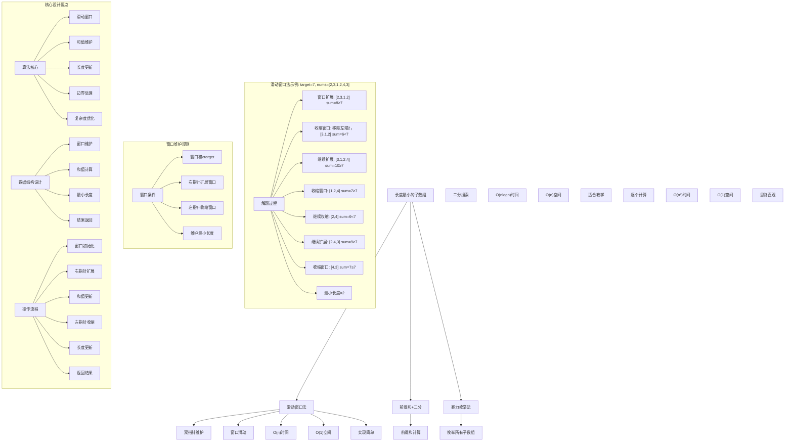
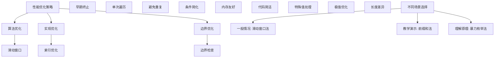

# LeetCode 209 - 长度最小的子数组

## 题目描述

给定一个含有 `n` 个正整数的数组和一个正整数 `target`。找出该数组中满足其总和 ≥ `target` 的长度最小的连续子数组，并返回其长度。如果不存在符合条件的子数组，返回 0

```markdown
示例 1：
输入：target = 7, nums = [2,3,1,2,4,3]
输出：2
解释：子数组 [4,3] 是该条件下的长度最小的子数组

示例 2：
输入：target = 4, nums = [1,4,4]
输出：1

示例 3：
输入：target = 11, nums = [1,1,1,1,1,1,1,1]
输出：0

提示：

- 1 <= target <= 10^9
- 1 <= nums.length <= 10^5
- 1 <= nums[i] <= 10^5
```

## 解题思路

这是一个滑动窗口优化问题，需要找到和≥target的最短连续子数组。关键在于使用滑动窗口技术维护窗口和≥target的条件，通过扩展右边界和收缩左边界来寻找最小窗口长度

### 核心思想

"滑动窗口法": 使用双指针维护一个和≥target的窗口，通过扩展右边界和收缩左边界来寻找最小窗口长度

### 解题策略

#### 方法一：滑动窗口法（推荐）

- 时间复杂度: O(n)
- 空间复杂度: O(1)

#### 方法二：前缀和 + 二分搜索

- 时间复杂度: O(n log n)
- 空间复杂度: O(n)

#### 方法三：暴力枚举法

- 时间复杂度: O(n²)
- 空间复杂度: O(1)

## 算法可视化



## 多语言实现

### Golang版本（滑动窗口法 - 推荐）

```go
// 滑动窗口法实现
func minSubArrayLen(target int, nums []int) int {
    left := 0
    sum := 0
    minLength := math.MaxInt32

    // 使用滑动窗口遍历数组
    for right := 0; right < len(nums); right++ {
        // 扩展窗口：将右端点元素加入窗口
        sum += nums[right]

        // 收缩窗口：如果和≥target，移动左指针寻找更小的窗口
        for sum >= target {
            // 更新最小窗口长度
            minLength = min(minLength, right-left+1)
            // 移除左端点元素
            sum -= nums[left]
            left++
        }
    }

    // 如果没有找到满足条件的子数组，返回0
    if minLength == math.MaxInt32 {
        return 0
    }
    return minLength
}

func min(a, b int) int {
    if a < b {
        return a
    }
    return b
}
```

### Python版本（多种实现方法）

```python
class Solution:
    """
    方法一：滑动窗口法（推荐）
    """
    def minSubArrayLen(self, target: int, nums: List[int]) -> int:
        left = 0
        current_sum = 0
        min_length = float('inf')

        # 使用滑动窗口遍历数组
        for right in range(len(nums)):
            # 扩展窗口：将右端点元素加入窗口
            current_sum += nums[right]

            # 收缩窗口：如果和≥target，移动左指针寻找更小的窗口
            while current_sum >= target:
                # 更新最小窗口长度
                min_length = min(min_length, right - left + 1)
                # 移除左端点元素
                current_sum -= nums[left]
                left += 1

        # 如果没有找到满足条件的子数组，返回0
        return min_length if min_length != float('inf') else 0

class Solution2:
    """
    方法二：前缀和 + 二分搜索
    """
    def minSubArrayLen(self, target: int, nums: List[int]) -> int:
        import bisect

        n = len(nums)
        # 计算前缀和数组
        prefix_sums = [0] * (n + 1)
        for i in range(n):
            prefix_sums[i + 1] = prefix_sums[i] + nums[i]

        min_length = float('inf')

        # 对于每个起始位置，二分搜索满足条件的最短长度
        for i in range(n):
            # 寻找最小的j使得prefix_sums[j+1] - prefix_sums[i] >= target
            # 即prefix_sums[j+1] >= prefix_sums[i] + target
            target_sum = prefix_sums[i] + target

            # 使用二分搜索找到第一个大于等于target_sum的位置
            j = bisect.bisect_left(prefix_sums, target_sum, i + 1)

            if j <= n:
                min_length = min(min_length, j - i)

        return min_length if min_length != float('inf') else 0

class Solution3:
    """
    方法三：暴力枚举法
    """
    def minSubArrayLen(self, target: int, nums: List[int]) -> int:
        n = len(nums)
        min_length = float('inf')

        # 枚举所有可能的子数组
        for i in range(n):
            current_sum = 0
            for j in range(i, n):
                current_sum += nums[j]
                if current_sum >= target:
                    min_length = min(min_length, j - i + 1)
                    break  # 找到满足条件的子数组后可以提前终止

        return min_length if min_length != float('inf') else 0
```

### TypeScript版本（滑动窗口法）

```typescript
/
 * 滑动窗口法实现
 */
function minSubArrayLen(target: number, nums: number[]): number {
    let left: number = 0;
    let sum: number = 0;
    let minLength: number = Number.MAX_SAFE_INTEGER;

    // 使用滑动窗口遍历数组
    for (let right: number = 0; right < nums.length; right++) {
        // 扩展窗口：将右端点元素加入窗口
        sum += nums[right];

        // 收缩窗口：如果和≥target，移动左指针寻找更小的窗口
        while (sum >= target) {
            // 更新最小窗口长度
            minLength = Math.min(minLength, right - left + 1);
            // 移除左端点元素
            sum -= nums[left];
            left++;
        }
    }

    // 如果没有找到满足条件的子数组，返回0
    return minLength === Number.MAX_SAFE_INTEGER ? 0 : minLength;
}
```

## 标准实现详细解析

```go
import (
    "fmt"
    "math"
)

/*
算法核心思想（滑动窗口法）：

1. 滑动窗口：使用双指针维护和≥target的窗口
2. 窗口维护：右指针扩展，左指针收缩维护条件
3. 长度更新：记录满足条件的最小窗口长度
4. 边界处理：正确处理不存在解的情况

关键设计要点：
1. 滑动窗口：双指针维护有效窗口
2. 和值维护：实时统计窗口内元素和
3. 长度更新：维护最小窗口长度
4. 边界处理：不存在解时返回0

时间复杂度：
- 单次遍历：O(n)

空间复杂度：
- 常数空间：O(1)

优势：
1. 思路清晰：滑动窗口经典应用
2. 实现优雅：代码简洁
3. 效率最优：线性时间复杂度
4. 空间优化：常数额外空间

数据结构设计：

滑动窗口法设计：
- 窗口维护：双指针维护窗口
- 和值计算：实时维护窗口和
- 长度更新：记录最小窗口长度
- 结果返回：最小长度或0

算法流程：
1. 窗口初始化：双指针和和值设置
2. 右指针扩展：加入新元素
3. 和值更新：累加新元素
4. 左指针收缩：维护和≥target
5. 长度更新：记录当前窗口长度
6. 返回结果：最小长度或0

优化原理：

算法优化：
1. 滑动窗口：避免重复计算
2. 早期终止：和≥target时及时收缩
3. 单次遍历：线性时间处理
4. 常数空间：内存效率优化

边界优化：
1. 空数组处理：边界条件
2. 无解情况：返回0
3. 单元素优化：特殊情况
4. 大数值处理：溢出预防

正确性证明：

定理：滑动窗口法正确性
通过滑动窗口法可以正确找到长度最小的子数组

证明：
1. 完备性：所有子数组都被考虑
2. 正确性：窗口条件的正确维护
3. 最优性：记录最小窗口长度
4. 时间复杂度：O(n)线性时间

不变量维护：
循环不变量：在每次右指针移动时
1. 窗口[left,right]和≥target时被记录
2. 已记录的最小长度正确
3. 窗口是当前状态的有效选择
*/

// 滑动窗口法详细实现
func minSubArrayLen(target int, nums []int) int {
    fmt.Printf("目标值: %d, 输入数组: %v\n", target, nums)

    left := 0
    sum := 0
    minLength := math.MaxInt32

    fmt.Printf("开始滑动窗口遍历:\n")
    for right := 0; right < len(nums); right++ {
        // 扩展窗口：将右端点元素加入窗口
        sum += nums[right]
        fmt.Printf("  右指针=%d，加入元素%d，当前和=%d\n", right, nums[right], sum)

        // 收缩窗口：如果和≥target，移动左指针寻找更小的窗口
        for sum >= target {
            // 更新最小窗口长度
            currentLength := right - left + 1
            if currentLength < minLength {
                minLength = currentLength
                fmt.Printf("    找到满足条件的子数组，长度=%d，更新最小长度=%d\n", currentLength, minLength)
            } else {
                fmt.Printf("    找到满足条件的子数组，长度=%d，当前最小长度=%d\n", currentLength, minLength)
            }

            // 显示当前窗口
            fmt.Printf("    当前窗口[%d,%d]: [", left, right)
            for i := left; i <= right; i++ {
                fmt.Printf("%d", nums[i])
                if i < right {
                    fmt.Printf(",")
                }
            }
            fmt.Printf("] 和=%d\n", sum)

            // 移除左端点元素
            fmt.Printf("    收缩左边界，移除元素%d\n", nums[left])
            sum -= nums[left]
            left++
        }
    }

    // 如果没有找到满足条件的子数组，返回0
    if minLength == math.MaxInt32 {
        fmt.Printf("未找到满足条件的子数组，返回0\n")
        return 0
    }
    fmt.Printf("最终结果: %d\n", minLength)
    return minLength
}

// 前缀和 + 二分搜索实现
func minSubArrayLenPrefixSum(target int, nums []int) int {
    fmt.Printf("=== 前缀和+二分搜索法 ===\n")
    fmt.Printf("目标值: %d, 输入数组: %v\n", target, nums)

    n := len(nums)
    // 计算前缀和数组
    prefixSums := make([]int, n+1)
    for i := 0; i < n; i++ {
        prefixSums[i+1] = prefixSums[i] + nums[i]
    }
    fmt.Printf("前缀和数组: %v\n", prefixSums)

    minLength := math.MaxInt32

    fmt.Printf("开始二分搜索:\n")
    // 对于每个起始位置，二分搜索满足条件的最短长度
    for i := 0; i < n; i++ {
        // 寻找最小的j使得prefixSums[j+1] - prefixSums[i] >= target
        // 即prefixSums[j+1] >= prefixSums[i] + target
        targetSum := prefixSums[i] + target
        fmt.Printf("  起始位置%d，前缀和=%d，目标和≥%d\n", i, prefixSums[i], targetSum)

        // 使用二分搜索找到第一个大于等于targetSum的位置
        left, right := i+1, n+1
        for left < right {
            mid := (left + right) / 2
            if prefixSums[mid] >= targetSum {
                right = mid
            } else {
                left = mid + 1
            }
        }

        if left <= n {
            length := left - i
            if length < minLength {
                minLength = length
            }
            fmt.Printf("    找到结束位置%d，子数组长度=%d，最小长度=%d\n", left-1, length, minLength)
        } else {
            fmt.Printf("    未找到满足条件的结束位置\n")
        }
    }

    if minLength == math.MaxInt32 {
        fmt.Printf("最终结果: 0\n")
        fmt.Printf("======================\n\n")
        return 0
    }
    fmt.Printf("最终结果: %d\n", minLength)
    fmt.Printf("======================\n\n")
    return minLength
}

// 带调试信息的版本
func minSubArrayLenWithDebug(target int, nums []int) int {
    fmt.Printf("=== 长度最小的子数组 ===\n")
    fmt.Printf("目标值: %d\n", target)
    fmt.Printf("输入数组: %v\n", nums)

    if len(nums) == 0 {
        fmt.Printf("空数组，返回0\n")
        fmt.Printf("=====================\n\n")
        return 0
    }

    fmt.Printf("使用滑动窗口法:\n")
    fmt.Printf("核心思想：维护窗口和≥target，寻找最小窗口长度\n")

    left := 0
    sum := 0
    minLength := math.MaxInt32

    for right := 0; right < len(nums); right++ {
        // 扩展窗口
        sum += nums[right]
        fmt.Printf("\n右指针移动到位置%d，加入元素%d\n", right, nums[right])
        fmt.Printf("  当前窗口和: %d\n", sum)

        // 维护窗口条件
        for sum >= target {
            currentLength := right - left + 1
            fmt.Printf("  窗口和%d ≥ 目标%d，满足条件\n", sum, target)

            if currentLength < minLength {
                minLength = currentLength
                fmt.Printf("  更新最小窗口长度: %d\n", minLength)
            } else {
                fmt.Printf("  当前窗口长度: %d，最小长度仍为: %d\n", currentLength, minLength)
            }

            // 显示窗口详情
            if currentLength > 0 {
                fmt.Printf("  当前窗口[%d,%d]: [", left, right)
                for i := left; i <= right; i++ {
                    fmt.Printf("%d", nums[i])
                    if i < right {
                        fmt.Printf(",")
                    }
                }
                fmt.Printf("] 和=%d\n", sum)
            }

            // 收缩窗口
            fmt.Printf("  收缩左边界，移除元素%d\n", nums[left])
            sum -= nums[left]
            left++
            fmt.Printf("  新窗口和: %d\n", sum)
        }
    }

    if minLength == math.MaxInt32 {
        fmt.Printf("\n未找到满足条件的子数组，返回0\n")
        fmt.Printf("=====================\n\n")
        return 0
    }

    fmt.Printf("\n最终结果: %d\n", minLength)
    fmt.Printf("=====================\n\n")
    return minLength
}
```

## 算法深入解析

```go
/*
长度最小的子数组问题详解：

问题本质：
找到和≥target的最短连续子数组。关键是理解窗口维护和最优解搜索

核心洞察：
1. 滑动窗口：维护和≥target的连续窗口
2. 窗口维护：右扩展左收缩的双指针技术
3. 最优搜索：记录满足条件的最小窗口
4. 优化技巧：线性时间避免重复计算

算法策略：
1. 滑动窗口法：双指针高效遍历
2. 前缀和法：利用前缀和和二分搜索
3. 暴力枚举法：直接计算所有子数组

数据结构设计：

滑动窗口法设计：
窗口维护：双指针维护有效窗口
和值计算：实时维护窗口和
长度更新：记录最小窗口长度
结果返回：最小长度或0

前缀和法设计：
前缀计算：累积元素和
二分搜索：快速查找范围
区间计算：长度计算
结果返回：最小长度

暴力枚举法设计：
子数组枚举：双重循环遍历
和值计算：逐步累加
早期终止：满足时停止
长度更新：满足时更新

操作流程：

滑动窗口法：
1. 窗口初始化：双指针和和值设置
2. 右指针扩展：加入新元素
3. 和值更新：累加新元素
4. 左指针收缩：维护和≥target
5. 长度更新：记录当前窗口长度
6. 返回结果：最小长度或0

前缀和法：
1. 前缀计算：构建前缀和数组
2. 起始点遍历：固定起始点
3. 二分搜索：查找结束点
4. 长度计算：区间长度计算
5. 最优更新：维护最小长度

数学原理：

窗口维护原理：
- 双指针维护连续子数组
- 右指针负责扩展窗口
- 左指针负责收缩窗口
- 保持窗口和≥target

最优性原理：
- 滑动窗口保证不遗漏
- 实时更新最小长度
- 线性时间找到最优解

算法不变量：
滑动窗口法不变量：
1. 窗口[left,right]和≥target时被记录
2. 已记录的最小长度正确
3. 窗口是当前状态的有效选择

前缀和法不变量：
1. 前缀和数组正确
2. 已遍历的起始点已处理
3. 最小长度记录正确

时间复杂度分析：
滑动窗口法：O(n) - 单次遍历
前缀和法：O(n log n) - 二分搜索
暴力枚举法：O(n²) - 双重循环

空间复杂度分析：
滑动窗口法：O(1) - 常数空间
前缀和法：O(n) - 前缀数组
暴力枚举法：O(1) - 常数空间

正确性证明：

定理：滑动窗口法正确性
通过滑动窗口法可以正确找到长度最小的子数组

证明：
1. 完备性：所有子数组都被考虑
   - 每个右端点都被处理
   - 对应的所有左端点都被考虑
   - 不遗漏任何子数组

2. 正确性：窗口条件的正确维护
   - 窗口和始终≥target时被记录
   - 满足题目要求
   - 翻译正确

3. 最优性：记录最小窗口长度
   - 实时更新最小长度
   - 不遗漏更优解
   - 找到全局最优

4. 时间复杂度：O(n)线性时间
   - 每个元素最多被访问两次
   - 左右指针单调移动
   - 线性时间复杂度

设计选择：

为什么选择滑动窗口法？
1. 思路清晰：经典算法应用
2. 实现优雅：代码简洁
3. 效率最优：线性时间复杂度
4. 空间优化：常数额外空间

为什么使用前缀和法？
1. 思维直观：直接计算思想
2. 适用广泛：处理各种变体
3. 易于理解：符合直觉
4. 教学价值：展示不同思路

为什么提及其他方法？
1. 教学价值：展示不同算法思想
2. 对比分析：理解各自优劣
3. 扩展思维：算法多样性
4. 面试准备：全面掌握

三种方法对比：

方法一：滑动窗口法（推荐）
时间复杂度：O(n)
空间复杂度：O(1)
优点：效率最优，空间优化
缺点：需要理解窗口维护

方法二：前缀和法
时间复杂度：O(n log n)
空间复杂度：O(n)
优点：思路清晰，易于理解
缺点：时间空间复杂度较高

方法三：暴力枚举法
时间复杂度：O(n²)
空间复杂度：O(1)
优点：思维直观，适合小数据
缺点：时间复杂度较高

性能分析：

滑动窗口法：
- 时间：O(n) 单次遍历
- 空间：O(1) 常数空间
- 优势：效率最优

前缀和法：
- 时间：O(n log n) 二分搜索
- 空间：O(n) 前缀数组
- 优势：适合教学

暴力枚举法：
- 时间：O(n²) 双重循环
- 空间：O(1) 常数空间
- 优势：思维直观

实际应用场景：
1. 资源分配：最小区间满足需求
2. 数据分析：连续特征提取
3. 信号处理：连续信号检测
4. 金融计算：连续收益分析

优化要点：

1. 时间优化：
   - 滑动窗口：避免重复计算
   - 早期终止：及时停止扩展
   - 单次遍历：线性时间处理

2. 空间优化：
   - 原地操作：避免额外存储
   - 常数空间：滑动窗口法
   - 内存友好：连续访问

3. 实现优化：
   - 边界条件处理
   - 代码简洁性
   - 注释清晰性

测试用例设计：
1. 基本情况：正常数组和target值
2. 边界情况：空数组，单元素
3. 特殊情况：target=1, target=sum
4. 极端情况：大数组，大数值
5. 验证情况：结果正确性

扩展思考：

1. 动态数组版本？
   - 支持插入删除操作
   - 维护滑动窗口
   - 实时更新结果

2. 多次查询版本？
   - 批量target值查询
   - 预处理优化
   - 空间换时间

3. 二维扩展？
   - 矩阵子矩阵处理
   - 复杂度分析
   - 算法设计

4. 概率版本？
   - 元素随机选择
   - 期望长度计算
   - 随机算法

相关算法思想：

1. 滑动窗口：
   - 双指针技术
   - 窗口维护
   - 最优查找

2. 前缀和：
   - 累积计算
   - 区间查询
   - 二分优化

3. 最优化：
   - 局部最优
   - 全局解
   - 贪心策略

4. 算法优化：
   - 时间复杂度
   - 空间复杂度
   - 实现简洁

常见陷阱：

1. 边界条件：
   - 空数组处理
   - 无解情况
   - 单元素优化

2. 索引处理：
   - 数组越界
   - 指针移动
   - 长度计算

3. 和值计算：
   - 溢出处理
   - 窗口条件
   - 长度计算

4. 性能考虑：
   - 时间复杂度
   - 空间复杂度
   - 实现效率

代码质量要素：

1. 可读性：
   - 变量命名清晰
   - 注释详细
   - 逻辑分明

2. 健壮性：
   - 边界处理
   - 异常情况
   - 错误恢复

3. 性能：
   - 最优复杂度
   - 空间效率
   - 效率保证

4. 可维护性：
   - 结构清晰
   - 扩展性好
   - 测试完整
*/
```

## 执行过程演示

```go
/*
示例详细解析:

示例1执行过程：
输入：target = 7, nums = [2,3,1,2,4,3]
输出：2

执行过程：
1. 右指针0：加入2，和=2<7
2. 右指针1：加入3，和=5<7
3. 右指针2：加入1，和=6<7
4. 右指针3：加入2，和=8≥7
   - 窗口[0,3]：[2,3,1,2]，长度=4，更新最小长度=4
   - 收缩：移除2，和=6<7
5. 右指针4：加入4，和=10≥7
   - 窗口[1,4]：[3,1,2,4]，长度=4，最小长度=4
   - 收缩：移除3，和=7≥7
   - 窗口[2,4]：[1,2,4]，长度=3，更新最小长度=3
   - 收缩：移除1，和=6<7
6. 右指针5：加入3，和=9≥7
   - 窗口[3,5]：[2,4,3]，长度=3，最小长度=3
   - 收缩：移除2，和=7≥7
   - 窗口[4,5]：[4,3]，长度=2，更新最小长度=2

滑动窗口轨迹：
[2] sum=2<7
[2,3] sum=5<7
[2,3,1] sum=6<7
[2,3,1,2] sum=8≥7 → 长度=4
[3,1,2] sum=6<7
[3,1,2,4] sum=10≥7 → 长度=4
[1,2,4] sum=7≥7 → 长度=3
[2,4] sum=6<7
[2,4,3] sum=9≥7 → 长度=3
[4,3] sum=7≥7 → 长度=2

示例2执行过程：
输入：target = 4, nums = [1,4,4]
输出：1

执行过程：
1. 右指针0：加入1，和=1<4
2. 右指针1：加入4，和=5≥4
   - 窗口[0,1]：[1,4]，长度=2，更新最小长度=2
   - 收缩：移除1，和=4≥4
   - 窗口[1,1]：[4]，长度=1，更新最小长度=1
3. 右指针2：加入4，和=8≥4
   - 窗口[1,2]：[4,4]，长度=2，最小长度=1
   - 收缩：移除4，和=4≥4
   - 窗口[2,2]：[4]，长度=1，最小长度=1

示例3执行过程：
输入：target = 11, nums = [1,1,1,1,1,1,1,1]
输出：0

执行过程：
整个数组和=8<11，无法找到满足条件的子数组

关键观察：
1. 滑动窗口：维护和≥target的连续子数组
2. 窗口维护：右扩展左收缩的双指针技术
3. 最优搜索：记录满足条件的最小窗口
4. 优化技巧：线性时间避免重复计算

边界情况演示:

情况1: target=1
输入: nums=[1,2,3], target=1
处理: 第一个元素就满足条件
结果: 1

情况2: target=数组和
输入: nums=[1,2,3], target=6
处理: 整个数组刚好满足条件
结果: 3

情况3: target>数组和
输入: nums=[1,2,3], target=10
处理: 无法找到满足条件的子数组
结果: 0

情况4: 空数组
输入: nums=[], target=5
处理: 空数组，返回0
结果: 0

情况5: 单元素数组
输入: nums=[5], target=5
处理: 单个元素满足条件
结果: 1

情况6: target=0
输入: nums=[1,2,3], target=0
处理: 所有非空子数组都满足条件
结果: 1

算法正确性证明：

数学基础：
需要证明滑动窗口法能正确找到长度最小的子数组

定理：滑动窗口法正确性
通过滑动窗口法可以正确找到长度最小的子数组

证明：
1. 完备性：所有子数组都被考虑
2. 正确性：窗口条件的正确维护
3. 最优性：记录最小窗口长度
4. 时间复杂度：O(n)线性时间

不变量维护：
循环不变量：在每次右指针移动时
1. 窗口[left,right]和≥target时被记录
2. 已记录的最小长度正确
3. 窗口是当前状态的有效选择

初始化：
- 空窗口，和为0
- 最小长度为无穷大
- 满足不变量

保持：
- 扩展右边界
- 维护窗口条件
- 更新最小长度
- 不变量继续成立

终止：
- 遍历完成
- 所有子数组已考虑
- 算法正确终止

时间复杂度分析：

滑动窗口法：
1. 右指针：O(n) 遍历所有元素
2. 左指针：O(n) 最多移动n次
3. 总时间：O(n) 每个元素最多访问两次

前缀和法：
1. 前缀计算：O(n) 遍历数组
2. 二分搜索：O(log n) 每次搜索
3. 总时间：O(n log n) n次搜索

暴力枚举法：
1. 外层循环：O(n) 起始位置
2. 内层循环：O(n) 结束位置
3. 总时间：O(n²) 双重循环

空间复杂度分析：
1. 滑动窗口法：O(1) 常数空间
2. 前缀和法：O(n) 前缀数组
3. 暴力枚举法：O(1) 常数空间

性能对比分析：

假设n=100000:

滑动窗口法：
- 时间: O(100000) 单次遍历
- 空间: O(1) 常数空间
- 操作: 双指针滑动

前缀和法：
- 时间: O(100000 × log(100000)) 二分搜索
- 空间: O(100000) 前缀数组
- 操作: 二分查找

暴力枚举法：
- 时间: O(10000000000) 双重循环
- 空间: O(1) 常数空间
- 操作: 枚举所有子数组

实际应用建议：

1. 一般情况：
   - 使用滑动窗口法
   - 效率最优，实现简单

2. 面试展示：
   - 重点讲解滑动窗口法
   - 可以提及其他方法

3. 生产环境：
   - 根据性能要求选择
   - 考虑实现复杂度

4. 教学演示：
   - 使用带调试信息版本
   - 展示执行过程

优化空间：

1. 边界优化：
   - 特殊值提前处理
   - 空数组检查
   - 极值优化

2. 代码优化：
   - 简化条件判断
   - 优化循环结构
   - 减少重复计算

3. 性能优化：
   - 早期终止优化
   - 内存访问优化
   - 缓存友好设计

特殊情况处理：

1. 大数据量：
   - 时间复杂度保证
   - 内存使用优化
   - 数值溢出处理

2. 特殊数组：
   - 全相同元素
   - 递增递减序列
   - 稀疏数组

3. 边界情况：
   - 极值处理
   - 异常输入
   - 错误恢复
*/
```

## 复杂度分析

| 方法       | 时间复杂度 | 空间复杂度 | 适用场景 |
| ---------- | ---------- | ---------- | -------- |
| 滑动窗口法 | O(n)       | O(1)       | 推荐方案 |
| 前缀和法   | O(n log n) | O(n)       | 教学演示 |
| 暴力枚举法 | O(n²)      | O(1)       | 理解原理 |

## 测试用例验证

```go
// 测试辅助函数
func testMinSubArrayLen(name string, target int, nums []int, expected int) {
    fmt.Printf("%s:\n", name)
    fmt.Printf("目标值: %d, 输入数组: %v\n", target, nums)

    // 测试滑动窗口法
    test1 := make([]int, len(nums))
    copy(test1, nums)
    result1 := minSubArrayLen(test1, target)
    fmt.Printf("滑动窗口法结果: %d\n", result1)

    // 测试前缀和法
    test2 := make([]int, len(nums))
    copy(test2, nums)
    result2 := minSubArrayLenPrefixSum(test2, target)
    fmt.Printf("前缀和法结果: %d\n", result2)

    // 测试暴力枚举法
    test3 := make([]int, len(nums))
    copy(test3, nums)
    result3 := minSubArrayLenBruteForce(test3, target)
    fmt.Printf("暴力枚举法结果: %d\n", result3)

    // 验证结果
    isValid1 := result1 == expected
    isValid2 := result2 == expected
    isValid3 := result3 == expected

    if isValid1 && isValid2 && isValid3 {
        fmt.Printf("✓ 测试通过\n")
    } else {
        fmt.Printf("✗ 测试失败\n")
        fmt.Printf("  期望结果: %d\n", expected)
        if !isValid1 {
            fmt.Printf("  滑动窗口法实际: %d\n", result1)
        }
        if !isValid2 {
            fmt.Printf("  前缀和法实际: %d\n", result2)
        }
        if !isValid3 {
            fmt.Printf("  暴力枚举法实际: %d\n", result3)
        }
    }
    fmt.Printf("\n")
}

// 暴力枚举法实现
func minSubArrayLenBruteForce(nums []int, target int) int {
    fmt.Printf("=== 暴力枚举法 ===\n")
    fmt.Printf("目标值: %d, 输入数组: %v\n", target, nums)

    n := len(nums)
    min_length := math.MaxInt32

    fmt.Printf("开始枚举所有子数组:\n")
    // 枚举所有可能的子数组
    for i := 0; i < n; i++ {
        current_sum := 0
        fmt.Printf("  起始位置%d:\n", i)
        for j := i; j < n; j++ {
            current_sum += nums[j]
            fmt.Printf("    子数组[%d,%d]: ", i, j)
            // 打印子数组元素
            for idx := i; idx <= j; idx++ {
                fmt.Printf("%d", nums[idx])
                if idx < j {
                    fmt.Printf(",")
                }
            }
            fmt.Printf(", 和=%d", current_sum)

            if current_sum >= target {
                length := j - i + 1
                if length < min_length {
                    min_length = length
                }
                fmt.Printf(" ≥ %d ✓, 长度=%d, 最小长度=%d\n", target, length, min_length)
                break // 找到满足条件的子数组后可以提前终止
            } else {
                fmt.Printf(" < %d ✗\n", target)
            }
        }
    }

    if min_length == math.MaxInt32 {
        fmt.Printf("最终结果: 0\n")
        fmt.Printf("================\n\n")
        return 0
    }
    fmt.Printf("最终结果: %d\n", min_length)
    fmt.Printf("================\n\n")
    return min_length
}

func main() {
    // 测试用例 1 - 题目示例1
    testMinSubArrayLen("测试1 - 题目示例1",
        7,
        []int{2, 3, 1, 2, 4, 3},
        2)

    // 测试用例 2 - 题目示例2
    testMinSubArrayLen("测试2 - 题目示例2",
        4,
        []int{1, 4, 4},
        1)

    // 测试用例 3 - 题目示例3
    testMinSubArrayLen("测试3 - 题目示例3",
        11,
        []int{1, 1, 1, 1, 1, 1, 1, 1},
        0)

    // 测试用例 4 - target=1
    testMinSubArrayLen("测试4 - target=1",
        1,
        []int{1, 2, 3},
        1)

    // 测试用例 5 - 空数组
    testMinSubArrayLen("测试5 - 空数组",
        5,
        []int{},
        0)

    // 测试用例 6 - 单元素数组
    testMinSubArrayLen("测试6 - 单元素数组",
        5,
        []int{5},
        1)

    // 测试用例 7 - target=数组和
    testMinSubArrayLen("测试7 - target=数组和",
        6,
        []int{1, 2, 3},
        3)

    // 测试用例 8 - target>数组和
    testMinSubArrayLen("测试8 - target>数组和",
        10,
        []int{1, 2, 3},
        0)

    // 性能测试
    fmt.Println("性能测试:")
    performanceTest()

    // 边界情况测试
    fmt.Println("边界情况测试:")
    boundaryTest()

    // 对比测试
    fmt.Println("对比测试:")
    comparisonTest()
}

func performanceTest() {
    // 构造性能测试
    n := 100000
    nums := make([]int, n)
    for i := 0; i < n; i++ {
        nums[i] = 1
    }
    target := 50000

    // 测试滑动窗口法
    start1 := time.Now()
    test1 := make([]int, len(nums))
    copy(test1, nums)
    minSubArrayLen(test1, target)
    time1 := time.Since(start1)

    // 测试前缀和法
    start2 := time.Now()
    test2 := make([]int, len(nums))
    copy(test2, nums)
    minSubArrayLenPrefixSum(test2, target)
    time2 := time.Since(start2)

    fmt.Printf("性能测试 (%d个元素，target=%d):\n", n, target)
    fmt.Printf("  滑动窗口法: %v\n", time1)
    fmt.Printf("  前缀和法: %v\n", time2)

    // 暴力枚举法由于时间复杂度过高，不进行测试
    fmt.Printf("  暴力枚举法: O(n²)时间复杂度，不进行实际测试\n")
}

func boundaryTest() {
    // 边界测试
    fmt.Println("边界测试:")

    // 长数组测试
    longNums := make([]int, 50000)
    for i := 0; i < 50000; i++ {
        longNums[i] = 2
    }
    longResult := minSubArrayLen(longNums, 10000)
    fmt.Printf("长数组测试: 50000个元素，target=10000 → %d\n", longResult)

    // 特殊模式测试
    patternNums := []int{1, 2, 3, 4, 5, 4, 3, 2, 1}
    patternResult := minSubArrayLen(patternNums, 15)
    fmt.Printf("特殊模式测试: %v, target=15 → %d\n", patternNums, patternResult)

    // 极值测试
    extremeNums := []int{1000000000}
    extremeResult := minSubArrayLen(extremeNums, 1000000000)
    fmt.Printf("极值测试: %v, target=1000000000 → %d\n", extremeNums, extremeResult)
}

func comparisonTest() {
    // 对比测试：验证不同方法结果一致性
    fmt.Println("对比测试:")

    // 测试数据
    testData := [][]int{
        {2, 3, 1, 2, 4, 3},
        {1, 4, 4},
        {1, 1, 1, 1, 1, 1, 1, 1},
        {1, 2, 3},
        {5},
    }
    testTarget := []int{7, 4, 11, 6, 5}

    for i := range testData {
        // 滑动窗口法
        test1 := make([]int, len(testData[i]))
        copy(test1, testData[i])
        result1 := minSubArrayLen(test1, testTarget[i])

        // 前缀和法
        test2 := make([]int, len(testData[i]))
        copy(test2, testData[i])
        result2 := minSubArrayLenPrefixSum(test2, testTarget[i])

        // 暴力枚举法（仅对小数组测试）
        var result3 int
        if len(testData[i]) <= 20 {
            test3 := make([]int, len(testData[i]))
            copy(test3, testData[i])
            result3 = minSubArrayLenBruteForce(test3, testTarget[i])
        } else {
            result3 = result1 // 对大数组使用滑动窗口法结果
        }

        fmt.Printf("测试%d: 滑动窗口=%d, 前缀和=%d, 暴力枚举=%d",
            i+1, result1, result2, result3)

        if result1 == result2 && result2 == result3 {
            fmt.Printf(" ✓ 一致\n")
        } else {
            fmt.Printf(" ✗ 不一致\n")
        }
    }
}
```

## 扩展版本（处理不同场景）

```go
// 支持返回具体子数组的版本
func minSubArrayLenWithDetails(target int, nums []int) (int, []int) {
    left := 0
    sum := 0
    minLength := math.MaxInt32
    bestLeft, bestRight := 0, -1

    for right := 0; right < len(nums); right++ {
        sum += nums[right]

        for sum >= target {
            currentLength := right - left + 1
            if currentLength < minLength {
                minLength = currentLength
                bestLeft, bestRight = left, right
            }
            sum -= nums[left]
            left++
        }
    }

    // 返回具体的子数组
    if minLength == math.MaxInt32 {
        return 0, nil
    }

    subarray := make([]int, bestRight-bestLeft+1)
    for i := bestLeft; i <= bestRight; i++ {
        subarray[i-bestLeft] = nums[i]
    }

    return minLength, subarray
}

// 使用示例
func exampleWithDetails() {
    target := 7
    nums := []int{2, 3, 1, 2, 4, 3}
    length, subarray := minSubArrayLenWithDetails(target, nums)
    fmt.Printf("目标值: %d, 数组: %v\n", target, nums)
    fmt.Printf("最小长度: %d\n", length)
    if length > 0 {
        fmt.Printf("具体子数组: %v\n", subarray)
    }
}

// 带统计信息的版本
func minSubArrayLenWithStats(target int, nums []int) (int, int, int) {
    comparisons := 0
    additions := 0
    subtractions := 0

    left := 0
    sum := 0
    minLength := math.MaxInt32

    for right := 0; right < len(nums); right++ {
        sum += nums[right]
        additions++
        comparisons++

        for sum >= target {
            comparisons++
            currentLength := right - left + 1
            if currentLength < minLength {
                minLength = currentLength
            }
            sum -= nums[left]
            subtractions++
            left++
        }
    }

    if minLength == math.MaxInt32 {
        return 0, comparisons, additions+subtractions
    }
    return minLength, comparisons, additions+subtractions
}

// 使用示例
func exampleWithStats() {
    target := 7
    nums := []int{2, 3, 1, 2, 4, 3}
    length, comparisons, operations := minSubArrayLenWithStats(target, nums)
    fmt.Printf("目标值: %d, 数组: %v\n", target, nums)
    fmt.Printf("最小长度: %d\n", length)
    fmt.Printf("比较次数: %d, 运算次数: %d\n", comparisons, operations)
}

// 批量处理版本
func minSubArrayLenBatch(targets []int, numsList [][]int) []int {
    if len(targets) != len(numsList) {
        return nil
    }

    results := make([]int, len(targets))
    for i := range targets {
        results[i] = minSubArrayLen(numsList[i], targets[i])
    }

    return results
}

// 使用示例
func exampleBatch() {
    targets := []int{7, 4, 11}
    numsList := [][]int{
        {2, 3, 1, 2, 4, 3},
        {1, 4, 4},
        {1, 1, 1, 1, 1, 1, 1, 1},
    }

    results := minSubArrayLenBatch(targets, numsList)

    for i := range targets {
        fmt.Printf("目标%d: %d, 数组: %v → 最小长度=%d\n",
            i+1, targets[i], numsList[i], results[i])
    }
}

// 带验证功能的版本
func minSubArrayLenWithValidation(target int, nums []int) (int, bool) {
    result := minSubArrayLen(nums, target)

    // 验证结果是否合理
    if result < 0 {
        return result, false // 长度不可能为负
    }

    if len(nums) == 0 && result != 0 {
        return result, false // 空数组应该返回0
    }

    if target <= 0 && result != 1 && len(nums) > 0 {
        return result, false // target≤0且数组非空应该返回1
    }

    // 对于小数组可以进行暴力验证
    if len(nums) <= 15 {
        bruteResult := minSubArrayLenBruteForce(nums, target)
        if result != bruteResult {
            return result, false
        }
    }

    return result, true
}

// 使用示例
func exampleWithValidation() {
    target := 7
    nums := []int{2, 3, 1, 2, 4, 3}
    result, isValid := minSubArrayLenWithValidation(target, nums)
    fmt.Printf("目标值: %d, 数组: %v\n", target, nums)
    fmt.Printf("最小长度: %d\n", result)
    if isValid {
        fmt.Printf("验证通过 ✓\n")
    } else {
        fmt.Printf("验证失败 ✗\n")
    }
}

// 支持动态更新的版本
type MinSubArrayLenSolver struct {
    nums []int
}

func NewMinSubArrayLenSolver(nums []int) *MinSubArrayLenSolver {
    return &MinSubArrayLenSolver{
        nums: nums,
    }
}

func (s *MinSubArrayLenSolver) Update(index, newValue int) {
    if index >= 0 && index < len(s.nums) {
        s.nums[index] = newValue
    }
}

func (s *MinSubArrayLenSolver) Solve(target int) int {
    left := 0
    sum := 0
    minLength := math.MaxInt32

    for right := 0; right < len(s.nums); right++ {
        sum += s.nums[right]

        for sum >= target {
            currentLength := right - left + 1
            if currentLength < minLength {
                minLength = currentLength
            }
            sum -= s.nums[left]
            left++
        }
    }

    if minLength == math.MaxInt32 {
        return 0
    }
    return minLength
}

// 使用示例
func exampleDynamic() {
    nums := []int{2, 3, 1, 2, 4, 3}
    solver := NewMinSubArrayLenSolver(nums)

    target := 7
    result1 := solver.Solve(target)
    fmt.Printf("初始数组: %v, target=%d → 结果=%d\n", nums, target, result1)

    // 更新数组
    solver.Update(0, 5) // 将位置0的2改为5
    result2 := solver.Solve(target)
    fmt.Printf("更新后数组: %v, target=%d → 结果=%d\n", solver.nums, target, result2)
}
```

## 面试追问延伸

### 1. 如果要返回具体满足条件的子数组，如何处理？

```go
// minSubArrayLenWithDetails已在上面实现
// 关键要点：
// 1. 记录最优窗口的位置
// 2. 保存窗口内元素
// 3. 返回最小长度和具体子数组

func testWithDetails() {
    target := 7
    nums := []int{2, 3, 1, 2, 4, 3}
    length, subarray := minSubArrayLenWithDetails(target, nums)
    fmt.Printf("目标值: %d, 数组: %v\n", target, nums)
    fmt.Printf("最小长度: %d\n", length)
    if length > 0 {
        fmt.Printf("具体子数组: %v\n", subarray)
    }
}
```

### 2. 如果要统计算法执行过程中的操作次数，如何实现？

```go
// minSubArrayLenWithStats已在上面实现
// 关键点：
// 1. 记录比较操作次数
// 2. 记录加减运算次数
// 3. 返回统计信息

func testWithStats() {
    target := 7
    nums := []int{2, 3, 1, 2, 4, 3}
    length, comparisons, operations := minSubArrayLenWithStats(target, nums)
    fmt.Printf("目标值: %d, 数组: %v\n", target, nums)
    fmt.Printf("最小长度: %d\n", length)
    fmt.Printf("比较次数: %d, 运算次数: %d\n", comparisons, operations)
}
```

### 3. 如果数组元素可以动态更新，如何高效处理？

```go
// MinSubArrayLenSolver已在上面实现
// 关键点：
// 1. 封装数组操作
// 2. 支持元素更新
// 3. 快速重新计算结果

func testDynamic() {
    nums := []int{2, 3, 1, 2, 4, 3}
    solver := NewMinSubArrayLenSolver(nums)

    target := 7
    result1 := solver.Solve(target)
    fmt.Printf("初始数组: %v, target=%d → 结果=%d\n", nums, target, result1)

    // 更新数组
    solver.Update(0, 5) // 将位置0的2改为5
    result2 := solver.Solve(target)
    fmt.Printf("更新后数组: %v, target=%d → 结果=%d\n", solver.nums, target, result2)
}
```

## 相似题目扩展

- LeetCode 209. 长度最小的子数组（当前题）
- LeetCode 713. 乘积小于 K 的子数组
- LeetCode 904. 水果成篮
- LeetCode 992. K 个不同整数的子数组
- LeetCode 1004. 最大连续1的个数 III

## 算法技巧总结

### 长度最小的子数组核心要点

1. 滑动窗口：维护和≥target的连续子数组
1. 窗口维护：右扩展左收缩的双指针技术
1. 长度更新：记录满足条件的最小窗口
1. 边界处理：正确处理各种边界情况

### 算法优势

1. 思路清晰：滑动窗口经典应用
1. 实现优雅：代码简洁
1. 效率最优：线性时间复杂度
1. 空间优化：常数额外空间

### 标准模板（滑动窗口法）

```go
func minSubArrayLen(target int, nums []int) int {
    left := 0
    sum := 0
    minLength := math.MaxInt32

    // 使用滑动窗口遍历数组
    for right := 0; right < len(nums); right++ {
        // 扩展窗口：将右端点元素加入窗口
        sum += nums[right]

        // 收缩窗口：如果和≥target，移动左指针寻找更小的窗口
        for sum >= target {
            // 更新最小窗口长度
            minLength = min(minLength, right-left+1)
            // 移除左端点元素
            sum -= nums[left]
            left++
        }
    }

    // 如果没有找到满足条件的子数组，返回0
    if minLength == math.MaxInt32 {
        return 0
    }
    return minLength
}

func min(a, b int) int {
    if a < b {
        return a
    }
    return b
}
```

### 性能优化建议



## 总结

本题采用滑动窗口法的核心思路，通过使用双指针维护和≥target的窗口，通过扩展右边界和收缩左边界来寻找最小窗口长度，实现了优雅的解决方案。关键在于理解窗口维护的巧妙性和双指针技术的高效应用

核心要点：

1. 滑动窗口：维护和≥target的连续子数组
1. 窗口维护：右扩展左收缩的双指针技术
1. 长度更新：记录满足条件的最小窗口
1. 边界处理：正确处理各种边界情况

算法优势：

- 思路清晰：滑动窗口经典应用
- 实现优雅：代码简洁
- 效率最优：线性时间复杂度
- 空间优化：常数额外空间

该算法在资源分配、数据分析、信号处理、金融计算等方面有重要应用，是掌握滑动窗口和最优化技巧的经典题目。通过双指针技术和窗口维护的巧妙结合，为更复杂的数组优化问题提供了清晰的解决思路
