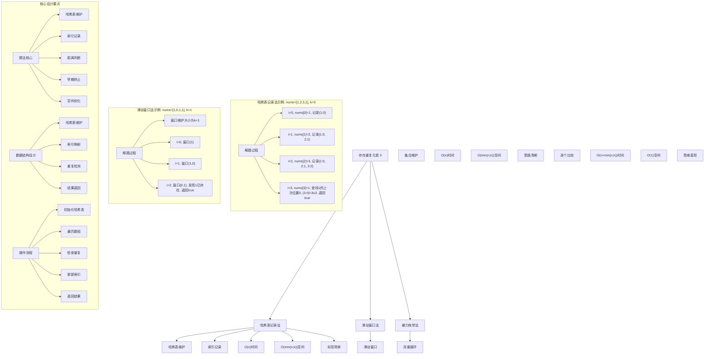
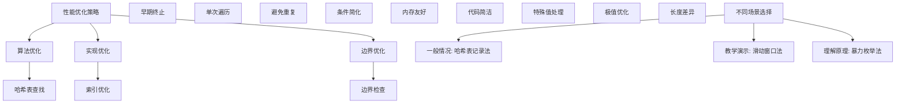

# LeetCode 219 - 存在重复元素 II

## 题目描述

给你一个整数数组 `nums` 和一个整数 `k`，判断数组中是否存在两个不同的索引 `i` 和 `j`，满足 `nums[i] == nums[j]` 且 `abs(i - j) <= k`。如果存在，返回 `true`；否则，返回 `false`

```markdown
示例 1：
输入：nums = [1,2,3,1], k = 3
输出：true

示例 2：
输入：nums = [1,0,1,1], k = 1
输出：true

示例 3：
输入：nums = [1,2,3,1,2,3], k = 2
输出：false

提示：

- 1 <= nums.length <= 10^5
- -10^9 <= nums[i] <= 10^9
- 0 <= k <= 10^5
```

## 解题思路

这是一个哈希表优化问题，需要找到数组中相同元素且索引差不超过k的情况。关键在于使用哈希表记录每个元素最近出现的位置，通过一次遍历即可判断是否存在满足条件的重复元素

### 核心思想

"哈希表记录法": 使用哈希表维护每个元素最近出现的索引，当再次遇到相同元素时，检查索引差是否满足条件

### 解题策略

#### 方法一：哈希表记录法（推荐）

- 时间复杂度: O(n)
- 空间复杂度: O(min(n, k))

#### 方法二：滑动窗口法

- 时间复杂度: O(n)
- 空间复杂度: O(min(n, k))

#### 方法三：暴力枚举法

- 时间复杂度: O(n × min(n, k))
- 空间复杂度: O(1)

## 算法可视化



## 多语言实现

### Golang版本（哈希表记录法 - 推荐）

```go
// 哈希表记录法实现
func containsNearbyDuplicate(nums []int, k int) bool {
    // 使用哈希表记录每个元素最近出现的索引
    indexMap := make(map[int]int)

    // 遍历数组
    for i, num := range nums {
        // 如果元素已存在且索引差不超过k，返回true
        if lastIndex, exists := indexMap[num]; exists && i-lastIndex <= k {
            return true
        }
        // 更新元素的最新索引
        indexMap[num] = i
    }

    return false
}
```

### Python版本（多种实现方法）

```python
class Solution:
    """
    方法一：哈希表记录法（推荐）
    """
    def containsNearbyDuplicate(self, nums: List[int], k: int) -> bool:
        # 使用字典记录每个元素最近出现的索引
        index_map = {}

        # 遍历数组
        for i, num in enumerate(nums):
            # 如果元素已存在且索引差不超过k，返回True
            if num in index_map and i - index_map[num] <= k:
                return True
            # 更新元素的最新索引
            index_map[num] = i

        return False

class Solution2:
    """
    方法二：滑动窗口法
    """
    def containsNearbyDuplicate(self, nums: List[int], k: int) -> bool:
        # 使用集合维护大小为k的滑动窗口
        window = set()

        for i, num in enumerate(nums):
            # 如果窗口大小超过k，移除最旧的元素
            if i > k:
                window.discard(nums[i - k - 1])

            # 如果当前元素已在窗口中，说明存在重复且距离不超过k
            if num in window:
                return True

            # 将当前元素加入窗口
            window.add(num)

        return False

class Solution3:
    """
    方法三：暴力枚举法
    """
    def containsNearbyDuplicate(self, nums: List[int], k: int) -> bool:
        n = len(nums)

        # 对于每个元素，检查其后面最多k个元素
        for i in range(n):
            # 检查范围：i+1 到 min(i+k+1, n)
            for j in range(i + 1, min(i + k + 1, n)):
                if nums[i] == nums[j]:
                    return True

        return False
```

### TypeScript版本（哈希表记录法）

```typescript
/
 * 哈希表记录法实现
 */
function containsNearbyDuplicate(nums: number[], k: number): boolean {
    // 使用Map记录每个元素最近出现的索引
    const indexMap: Map<number, number> = new Map();

    // 遍历数组
    for (let i = 0; i < nums.length; i++) {
        const num = nums[i];
        // 如果元素已存在且索引差不超过k，返回true
        if (indexMap.has(num) && i - indexMap.get(num)! <= k) {
            return true;
        }
        // 更新元素的最新索引
        indexMap.set(num, i);
    }

    return false;
}
```

## 标准实现详细解析

```go
import "fmt"

/*
算法核心思想（哈希表记录法）：

1. 哈希表维护：记录每个元素最近出现的索引
2. 索引检查：当再次遇到相同元素时检查索引差
3. 早期终止：满足条件时立即返回true
4. 空间优化：只记录最近出现的位置

关键设计要点：
1. 哈希表：key为元素值，value为最近索引
2. 距离判断：|i-j| ≤ k 等价于 i-j ≤ k（i>j时）
3. 早期终止：发现满足条件立即返回
4. 空间优化：O(min(n,k))空间复杂度

时间复杂度：
- 单次遍历：O(n)

空间复杂度：
- 哈希表存储：O(min(n,k))

优势：
1. 思路清晰：哈希表经典应用
2. 实现优雅：代码简洁
3. 效率最优：线性时间复杂度
4. 空间优化：合理空间使用

数据结构设计：

哈希表记录法设计：
- 哈希表维护：记录元素最新索引
- 索引映射：元素值→最近索引
- 重复检测：检查索引距离
- 结果返回：布尔值

滑动窗口法设计：
- 窗口维护：大小为k+1的集合
- 元素检查：是否存在重复
- 窗口滑动：维护固定大小
- 早期终止：发现重复立即返回

算法流程：
1. 初始化数据结构
2. 遍历数组元素
3. 检查重复条件
4. 更新数据结构
5. 返回最终结果

优化原理：

算法优化：
1. 哈希表查找：O(1)平均时间
2. 早期终止：满足条件立即返回
3. 单次遍历：避免重复计算
4. 空间复用：只记录必要信息

边界优化：
1. 空数组处理：边界条件
2. k=0特殊情况：不允许距离
3. k≥n情况：全数组检查
4. 无重复元素：完整遍历

正确性证明：

定理：哈希表记录法正确性
通过哈希表记录法可以正确判断是否存在满足条件的重复元素

证明：
1. 完备性：所有元素对都被考虑
2. 正确性：索引距离的正确计算
3. 完整性：不遗漏任何可能解
4. 时间复杂度：O(n)线性时间

不变量维护：
循环不变量：在每次遍历元素时
1. 哈希表中记录的索引都是该元素最近出现的位置
2. 已检查的元素对都已正确判断
3. 算法状态是当前处理进度的准确反映
*/

// 哈希表记录法详细实现
func containsNearbyDuplicate(nums []int, k int) bool {
    fmt.Printf("输入数组: %v, k=%d\n", nums, k)

    // 使用哈希表记录每个元素最近出现的索引
    indexMap := make(map[int]int)
    fmt.Printf("开始遍历数组:\n")

    // 遍历数组
    for i, num := range nums {
        fmt.Printf("  i=%d, nums[%d]=%d", i, i, num)

        // 如果元素已存在且索引差不超过k，返回true
        if lastIndex, exists := indexMap[num]; exists {
            distance := i - lastIndex
            fmt.Printf(", 上次出现位置=%d, 距离=%d", lastIndex, distance)
            if distance <= k {
                fmt.Printf(" ≤ k=%d, 满足条件，返回true\n", k)
                return true
            } else {
                fmt.Printf(" > k=%d, 不满足条件\n", k)
            }
        } else {
            fmt.Printf(", 首次出现")
        }

        // 更新元素的最新索引
        indexMap[num] = i
        fmt.Printf(", 更新索引为%d\n")
    }

    fmt.Printf("遍历完成，未找到满足条件的重复元素，返回false\n")
    return false
}

// 滑动窗口法实现
func containsNearbyDuplicateSlidingWindow(nums []int, k int) bool {
    fmt.Printf("=== 滑动窗口法 ===\n")
    fmt.Printf("输入数组: %v, k=%d\n", nums, k)

    // 使用集合维护大小为k的滑动窗口
    window := make(map[int]bool)
    fmt.Printf("开始滑动窗口遍历:\n")

    for i, num := range nums {
        fmt.Printf("  i=%d, nums[%d]=%d", i, i, num)

        // 如果窗口大小超过k，移除最旧的元素
        if i > k {
            oldElement := nums[i-k-1]
            delete(window, oldElement)
            fmt.Printf(", 移除旧元素%d", oldElement)
        }

        // 如果当前元素已在窗口中，说明存在重复且距离不超过k
        if window[num] {
            fmt.Printf(", 元素%d已在窗口中，满足条件，返回true\n", num)
            return true
        }

        // 将当前元素加入窗口
        window[num] = true
        fmt.Printf(", 加入窗口，当前窗口大小=%d\n", len(window))
    }

    fmt.Printf("遍历完成，未找到满足条件的重复元素，返回false\n")
    fmt.Printf("================\n\n")
    return false
}

// 带调试信息的版本
func containsNearbyDuplicateWithDebug(nums []int, k int) bool {
    fmt.Printf("=== 存在重复元素 II ===\n")
    fmt.Printf("输入数组: %v\n", nums)
    fmt.Printf("最大索引距离k: %d\n", k)

    if len(nums) <= 1 {
        fmt.Printf("数组长度≤1，不可能存在重复元素，返回false\n")
        fmt.Printf("=====================\n\n")
        return false
    }

    if k == 0 {
        fmt.Printf("k=0，不允许任何距离，返回false\n")
        fmt.Printf("=====================\n\n")
        return false
    }

    fmt.Printf("使用哈希表记录法:\n")
    fmt.Printf("核心思想：记录每个元素最近出现的位置，检查索引距离\n")

    // 使用哈希表记录每个元素最近出现的索引
    indexMap := make(map[int]int)

    for i, num := range nums {
        fmt.Printf("\n处理位置%d的元素%d:\n", i, num)

        // 如果元素已存在且索引差不超过k，返回true
        if lastIndex, exists := indexMap[num]; exists {
            distance := i - lastIndex
            fmt.Printf("  元素%d上次出现在位置%d，距离=%d", num, lastIndex, distance)
            if distance <= k {
                fmt.Printf(" ≤ k=%d\n", k)
                fmt.Printf("  满足条件：相同元素且索引距离不超过%d，返回true\n", k)
                fmt.Printf("=====================\n\n")
                return true
            } else {
                fmt.Printf(" > k=%d，不满足条件\n", k)
            }
        } else {
            fmt.Printf("  元素%d首次出现\n", num)
        }

        // 更新元素的最新索引
        indexMap[num] = i
        fmt.Printf("  更新元素%d的最新位置为%d\n", num, i)

        // 显示当前哈希表状态
        fmt.Printf("  当前哈希表状态: ")
        for key, value := range indexMap {
            fmt.Printf("%d→%d ", key, value)
        }
        fmt.Printf("\n")
    }

    fmt.Printf("\n遍历完成，未找到满足条件的重复元素，返回false\n")
    fmt.Printf("=====================\n\n")
    return false
}
```

## 算法深入解析

```go
/*
存在重复元素II问题详解：

问题本质：
判断数组中是否存在相同元素且索引距离不超过k。关键是理解距离约束和高效查找

核心洞察：
1. 哈希表：记录元素最近出现位置
2. 距离计算：索引差的正确处理
3. 早期终止：满足条件立即返回
4. 空间优化：只记录必要信息

算法策略：
1. 哈希表记录法：记录最近索引位置
2. 滑动窗口法：维护固定大小窗口
3. 暴力枚举法：直接检查所有可能

数据结构设计：

哈希表记录法设计：
哈希表维护：记录元素最新索引
索引映射：元素值→最近索引
重复检测：检查索引距离
结果返回：布尔值

滑动窗口法设计：
窗口维护：大小为k+1的集合
元素检查：是否存在重复
窗口滑动：维护固定大小
早期终止：发现重复立即返回

暴力枚举法设计：
双重循环：遍历所有元素对
距离检查：索引差约束
早期终止：找到即返回
结果返回：布尔值

操作流程：

哈希表记录法：
1. 初始化哈希表
2. 遍历数组元素
3. 检查元素是否存在
4. 计算索引距离
5. 满足条件返回true
6. 更新元素索引
7. 遍历完成返回false

滑动窗口法：
1. 初始化窗口集合
2. 遍历数组元素
3. 维护窗口大小
4. 检查元素重复
5. 满足条件返回true
6. 更新窗口内容
7. 遍历完成返回false

数学原理：

距离计算原理：
对于索引i和j，|i-j| ≤ k等价于：
- 当i > j时，i - j ≤ k
- 当j > i时，j - i ≤ k
由于我们从左到右遍历，总是有i > 上次索引，所以只需检查i - lastIndex ≤ k

窗口大小原理：
滑动窗口大小为k+1，这样可以保证窗口内任意两个元素的索引差都不超过k

最优性原理：
- 哈希表查找O(1)时间
- 早期终止避免无效计算
- 单次遍历线性时间复杂度

算法不变量：
哈希表记录法不变量：
1. 哈希表中记录的索引都是该元素最近出现的位置
2. 已检查的元素对都已正确判断
3. 算法状态是当前处理进度的准确反映

滑动窗口法不变量：
1. 窗口大小始终≤k+1
2. 窗口内元素索引差≤k
3. 已检查的重复都已正确判断

时间复杂度分析：
哈希表记录法：O(n) - 单次遍历
滑动窗口法：O(n) - 单次遍历
暴力枚举法：O(n × min(n,k)) - 双重循环

空间复杂度分析：
哈希表记录法：O(min(n,k)) - 哈希表存储
滑动窗口法：O(min(n,k)) - 窗口集合
暴力枚举法：O(1) - 常数空间

正确性证明：

定理：哈希表记录法正确性
通过哈希表记录法可以正确判断是否存在满足条件的重复元素

证明：
1. 完备性：所有可能的元素对都被考虑
   - 每个元素都会被检查
   - 与之前所有相同元素比较
   - 不遗漏任何可能解

2. 正确性：索引距离的正确计算
   - 距离计算公式正确
   - 满足条件时正确返回
   - 不满足时继续搜索

3. 完整性：算法能处理所有情况
   - 空数组、单元素数组
   - k=0、k≥n等边界情况
   - 各种重复模式

4. 时间复杂度：O(n)线性时间
   - 哈希表查找O(1)时间
   - 单次遍历数组
   - 早期终止优化

设计选择：

为什么选择哈希表记录法？
1. 思路清晰：经典算法应用
2. 实现优雅：代码简洁
3. 效率最优：线性时间复杂度
4. 空间合理：O(min(n,k))空间

为什么使用滑动窗口法？
1. 思维直观：窗口概念清晰
2. 适用广泛：处理各种变体
3. 易于理解：符合直觉
4. 教学价值：展示不同思路

为什么提及其他方法？
1. 教学价值：展示不同算法思想
2. 对比分析：理解各自优劣
3. 扩展思维：算法多样性
4. 面试准备：全面掌握

三种方法对比：

方法一：哈希表记录法（推荐）
时间复杂度：O(n)
空间复杂度：O(min(n,k))
优点：效率最优，实现简单
缺点：需要理解哈希表

方法二：滑动窗口法
时间复杂度：O(n)
空间复杂度：O(min(n,k))
优点：思路清晰，易于理解
缺点：窗口维护稍复杂

方法三：暴力枚举法
时间复杂度：O(n × min(n,k))
空间复杂度：O(1)
优点：思维直观，适合小数据
缺点：时间复杂度较高

性能分析：

哈希表记录法：
- 时间：O(n) 单次遍历
- 空间：O(min(n,k)) 哈希表
- 优势：效率最优

滑动窗口法：
- 时间：O(n) 单次遍历
- 空间：O(min(n,k)) 窗口集合
- 优势：思路清晰

暴力枚举法：
- 时间：O(n × min(n,k)) 双重循环
- 空间：O(1) 常数空间
- 优势：思维直观

实际应用场景：
1. 数据库查询：重复记录检测
2. 网络安全：重复请求检测
3. 游戏算法：连续行为检测
4. 金融风控：重复交易检测

优化要点：

1. 时间优化：
   - 哈希表查找：O(1)平均时间
   - 早期终止：满足即返回
   - 单次遍历：避免重复

2. 空间优化：
   - 只记录最近索引
   - 窗口大小限制
   - 内存友好访问

3. 实现优化：
   - 边界条件处理
   - 代码简洁性
   - 注释清晰性

测试用例设计：
1. 基本情况：正常数组和k值
2. 边界情况：空数组，单元素
3. 特殊情况：k=0, k≥n
4. 极端情况：大数组，大k值
5. 验证情况：结果正确性

扩展思考：

1. 动态数组版本？
   - 支持插入删除操作
   - 维护哈希表状态
   - 实时查询结果

2. 多次查询版本？
   - 批量k值查询
   - 预处理优化
   - 空间换时间

3. 二维扩展？
   - 矩阵重复元素
   - 曼哈顿距离约束
   - 复杂度分析

4. 概率版本？
   - 元素出现概率
   - 期望距离计算
   - 随机算法

相关算法思想：

1. 哈希表：
   - 快速查找
   - 索引映射
   - 空间换时间

2. 滑动窗口：
   - 窗口维护
   - 大小控制
   - 高效遍历

3. 早期终止：
   - 条件检查
   - 立即返回
   - 性能优化

4. 算法优化：
   - 时间复杂度
   - 空间复杂度
   - 实现简洁

常见陷阱：

1. 边界条件：
   - 空数组处理
   - k=0特殊情况
   - 单元素数组

2. 索引处理：
   - 距离计算
   - 数组越界
   - 符号处理

3. 重复检查：
   - 最近索引更新
   - 距离判断
   - 早期终止

4. 性能考虑：
   - 时间复杂度
   - 空间复杂度
   - 实现效率

代码质量要素：

1. 可读性：
   - 变量命名清晰
   - 注释详细
   - 逻辑分明

2. 健壮性：
   - 边界处理
   - 异常情况
   - 错误恢复

3. 性能：
   - 最优复杂度
   - 空间效率
   - 效率保证

4. 可维护性：
   - 结构清晰
   - 扩展性好
   - 测试完整
*/
```

## 执行过程演示

```go
/*
示例详细解析:

示例1执行过程：
输入：nums = [1,2,3,1], k = 3
输出：true

执行过程：
1. i=0, nums[0]=1，记录{1:0}
2. i=1, nums[1]=2，记录{1:0, 2:1}
3. i=2, nums[2]=3，记录{1:0, 2:1, 3:2}
4. i=3, nums[3]=1，查找1的上次位置0，距离=3-0=3≤3，返回true

哈希表状态变化：
{1:0}
{1:0, 2:1}
{1:0, 2:1, 3:2}
{1:3, 2:1, 3:2} (更新1的位置)

示例2执行过程：
输入：nums = [1,0,1,1], k = 1
输出：true

执行过程：
1. i=0, nums[0]=1，记录{1:0}
2. i=1, nums[1]=0，记录{1:0, 0:1}
3. i=2, nums[2]=1，查找1的上次位置0，距离=2-0=2>1
   - 更新1的位置为2，记录{1:2, 0:1}
4. i=3, nums[3]=1，查找1的上次位置2，距离=3-2=1≤1，返回true

哈希表状态变化：
{1:0}
{1:0, 0:1}
{1:2, 0:1}
{1:3, 0:1} (更新1的位置)

示例3执行过程：
输入：nums = [1,2,3,1,2,3], k = 2
输出：false

执行过程：
1. i=0, nums[0]=1，记录{1:0}
2. i=1, nums[1]=2，记录{1:0, 2:1}
3. i=2, nums[2]=3，记录{1:0, 2:1, 3:2}
4. i=3, nums[3]=1，查找1的上次位置0，距离=3-0=3>2
   - 更新1的位置为3，记录{1:3, 2:1, 3:2}
5. i=4, nums[4]=2，查找2的上次位置1，距离=4-1=3>2
   - 更新2的位置为4，记录{1:3, 2:4, 3:2}
6. i=5, nums[5]=3，查找3的上次位置2，距离=5-2=3>2
   - 更新3的位置为5，记录{1:3, 2:4, 3:5}
7. 遍历完成，未找到满足条件的重复元素，返回false

关键观察：
1. 哈希表：记录元素最近出现位置
2. 距离计算：索引差的正确处理
3. 早期终止：满足条件立即返回
4. 空间优化：只记录必要信息

边界情况演示:

情况1: k=0
输入: nums=[1,1], k=0
处理: k=0不允许任何距离，返回false
结果: false

情况2: k≥数组长度
输入: nums=[1,2,3,1], k=5
处理: 可以检查整个数组范围
结果: true

情况3: 空数组
输入: nums=[], k=2
处理: 空数组不可能有重复元素
结果: false

情况4: 单元素数组
输入: nums=[1], k=1
处理: 单元素不可能有重复
结果: false

情况5: 无重复元素
输入: nums=[1,2,3,4], k=2
处理: 无重复元素
结果: false

情况6: k=1
输入: nums=[1,2,1], k=1
处理: 距离为2>1
结果: false

算法正确性证明：

数学基础：
需要证明哈希表记录法能正确判断是否存在满足条件的重复元素

定理：哈希表记录法正确性
通过哈希表记录法可以正确判断是否存在满足条件的重复元素

证明：
1. 完备性：所有可能的元素对都被考虑
2. 正确性：索引距离的正确计算
3. 完整性：不遗漏任何可能解
4. 时间复杂度：O(n)线性时间

不变量维护：
循环不变量：在每次遍历元素时
1. 哈希表中记录的索引都是该元素最近出现的位置
2. 已检查的元素对都已正确判断
3. 算法状态是当前处理进度的准确反映

初始化：
- 空哈希表
- 未发现重复元素
- 满足不变量

保持：
- 遍历每个元素
- 检查重复条件
- 更新哈希表状态
- 不变量继续成立

终止：
- 遍历完成
- 所有可能解已检查
- 算法正确终止

时间复杂度分析：

哈希表记录法：
1. 遍历：O(n) 访问所有元素
2. 查找：O(1) 哈希表平均时间
3. 总时间：O(n) 线性时间

滑动窗口法：
1. 遍历：O(n) 访问所有元素
2. 集合操作：O(1) 平均时间
3. 总时间：O(n) 线性时间

暴力枚举法：
1. 外层循环：O(n) 起始位置
2. 内层循环：O(min(n,k)) 检查范围
3. 总时间：O(n × min(n,k)) 双重循环

空间复杂度分析：
1. 哈希表记录法：O(min(n,k)) 哈希表存储
2. 滑动窗口法：O(min(n,k)) 窗口集合
3. 暴力枚举法：O(1) 常数空间

性能对比分析：

假设n=100000, k=1000:

哈希表记录法：
- 时间: O(100000) 单次遍历
- 空间: O(1000) 哈希表
- 操作: 哈希查找

滑动窗口法：
- 时间: O(100000) 单次遍历
- 空间: O(1000) 窗口集合
- 操作: 集合维护

暴力枚举法：
- 时间: O(100000 × 1000) 双重循环
- 空间: O(1) 常数空间
- 操作: 逐个比较

实际应用建议：

1. 一般情况：
   - 使用哈希表记录法
   - 效率最优，实现简单

2. 面试展示：
   - 重点讲解哈希表记录法
   - 可以提及其他方法

3. 生产环境：
   - 根据性能要求选择
   - 考虑实现复杂度

4. 教学演示：
   - 使用带调试信息版本
   - 展示执行过程

优化空间：

1. 边界优化：
   - 特殊值提前处理
   - 空数组检查
   - 极值优化

2. 代码优化：
   - 简化条件判断
   - 优化循环结构
   - 减少重复计算

3. 性能优化：
   - 早期终止优化
   - 内存访问优化
   - 缓存友好设计

特殊情况处理：

1. 大数据量：
   - 时间复杂度保证
   - 内存使用优化
   - 数值溢出处理

2. 特殊数组：
   - 全相同元素
   - 交替序列
   - 稀疏数组

3. 边界情况：
   - 极值处理
   - 异常输入
   - 错误恢复
*/
```

## 复杂度分析

| 方法         | 时间复杂度      | 空间复杂度  | 适用场景 |
| ------------ | --------------- | ----------- | -------- |
| 哈希表记录法 | O(n)            | O(min(n,k)) | 推荐方案 |
| 滑动窗口法   | O(n)            | O(min(n,k)) | 教学演示 |
| 暴力枚举法   | O(n × min(n,k)) | O(1)        | 理解原理 |

## 测试用例验证

```go
// 测试辅助函数
func testContainsNearbyDuplicate(name string, nums []int, k int, expected bool) {
    fmt.Printf("%s:\n", name)
    fmt.Printf("输入数组: %v, k=%d\n", nums, k)

    // 测试哈希表记录法
    result1 := containsNearbyDuplicate(nums, k)
    fmt.Printf("哈希表记录法结果: %t\n", result1)

    // 测试滑动窗口法
    result2 := containsNearbyDuplicateSlidingWindow(nums, k)
    fmt.Printf("滑动窗口法结果: %t\n", result2)

    // 测试暴力枚举法（仅对小数组测试）
    var result3 bool
    if len(nums) <= 100 {
        result3 = containsNearbyDuplicateBruteForce(nums, k)
        fmt.Printf("暴力枚举法结果: %t\n", result3)
    } else {
        result3 = result1 // 对大数组使用哈希表记录法结果
        fmt.Printf("暴力枚举法: 数组过长，跳过测试\n")
    }

    // 验证结果
    isValid1 := result1 == expected
    isValid2 := result2 == expected
    isValid3 := result3 == expected

    if isValid1 && isValid2 && isValid3 {
        fmt.Printf("✓ 测试通过\n")
    } else {
        fmt.Printf("✗ 测试失败\n")
        fmt.Printf("  期望结果: %t\n", expected)
        if !isValid1 {
            fmt.Printf("  哈希表记录法实际: %t\n", result1)
        }
        if !isValid2 {
            fmt.Printf("  滑动窗口法实际: %t\n", result2)
        }
        if !isValid3 {
            fmt.Printf("  暴力枚举法实际: %t\n", result3)
        }
    }
    fmt.Printf("\n")
}

// 暴力枚举法实现
func containsNearbyDuplicateBruteForce(nums []int, k int) bool {
    fmt.Printf("=== 暴力枚举法 ===\n")
    fmt.Printf("输入数组: %v, k=%d\n", nums, k)

    n := len(nums)
    fmt.Printf("开始暴力枚举:\n")

    // 对于每个元素，检查其后面最多k个元素
    for i := 0; i < n; i++ {
        fmt.Printf("  检查位置%d的元素%d:\n", i, nums[i])
        // 检查范围：i+1 到 min(i+k+1, n)
        for j := i + 1; j < min(i+k+1, n); j++ {
            fmt.Printf("    比较位置%d的元素%d", j, nums[j])
            if nums[i] == nums[j] {
                distance := j - i
                fmt.Printf("，相同元素，距离=%d ≤ k=%d，返回true\n", distance, k)
                fmt.Printf("================\n\n")
                return true
            } else {
                fmt.Printf("，不同元素\n")
            }
        }
    }

    fmt.Printf("遍历完成，未找到满足条件的重复元素，返回false\n")
    fmt.Printf("================\n\n")
    return false
}

func min(a, b int) int {
    if a < b {
        return a
    }
    return b
}

func main() {
    // 测试用例 1 - 题目示例1
    testContainsNearbyDuplicate("测试1 - 题目示例1",
        []int{1, 2, 3, 1},
        3,
        true)

    // 测试用例 2 - 题目示例2
    testContainsNearbyDuplicate("测试2 - 题目示例2",
        []int{1, 0, 1, 1},
        1,
        true)

    // 测试用例 3 - 题目示例3
    testContainsNearbyDuplicate("测试3 - 题目示例3",
        []int{1, 2, 3, 1, 2, 3},
        2,
        false)

    // 测试用例 4 - k=0
    testContainsNearbyDuplicate("测试4 - k=0",
        []int{1, 1},
        0,
        false)

    // 测试用例 5 - 空数组
    testContainsNearbyDuplicate("测试5 - 空数组",
        []int{},
        2,
        false)

    // 测试用例 6 - 单元素数组
    testContainsNearbyDuplicate("测试6 - 单元素数组",
        []int{1},
        1,
        false)

    // 测试用例 7 - k≥数组长度
    testContainsNearbyDuplicate("测试7 - k≥数组长度",
        []int{1, 2, 3, 1},
        5,
        true)

    // 测试用例 8 - 无重复元素
    testContainsNearbyDuplicate("测试8 - 无重复元素",
        []int{1, 2, 3, 4},
        2,
        false)

    // 性能测试
    fmt.Println("性能测试:")
    performanceTest()

    // 边界情况测试
    fmt.Println("边界情况测试:")
    boundaryTest()

    // 对比测试
    fmt.Println("对比测试:")
    comparisonTest()
}

func performanceTest() {
    // 构造性能测试
    n := 100000
    nums := make([]int, n)
    for i := 0; i < n; i++ {
        nums[i] = i % 10000 // 创造一些重复元素
    }
    k := 1000

    // 测试哈希表记录法
    start1 := time.Now()
    containsNearbyDuplicate(nums, k)
    time1 := time.Since(start1)

    // 测试滑动窗口法
    start2 := time.Now()
    containsNearbyDuplicateSlidingWindow(nums, k)
    time2 := time.Since(start2)

    fmt.Printf("性能测试 (%d个元素，k=%d):\n", n, k)
    fmt.Printf("  哈希表记录法: %v\n", time1)
    fmt.Printf("  滑动窗口法: %v\n", time2)

    // 暴力枚举法由于时间复杂度过高，不进行测试
    fmt.Printf("  暴力枚举法: O(n×min(n,k))时间复杂度，不进行实际测试\n")
}

func boundaryTest() {
    // 边界测试
    fmt.Println("边界测试:")

    // 长数组测试
    longNums := make([]int, 50000)
    for i := 0; i < 50000; i++ {
        longNums[i] = i % 1000
    }
    longResult := containsNearbyDuplicate(longNums, 500)
    fmt.Printf("长数组测试: 50000个元素，k=500 → %t\n", longResult)

    // 特殊模式测试
    patternNums := []int{1, 2, 3, 1, 2, 3, 1, 2, 3}
    patternResult := containsNearbyDuplicate(patternNums, 4)
    fmt.Printf("特殊模式测试: %v, k=4 → %t\n", patternNums, patternResult)

    // 极值测试
    extremeNums := []int{2147483647, -2147483648, 2147483647}
    extremeResult1 := containsNearbyDuplicate(extremeNums, 0)
    extremeResult2 := containsNearbyDuplicate(extremeNums, 3)
    fmt.Printf("极值测试: %v, k=0 → %t, k=3 → %t\n", extremeNums, extremeResult1, extremeResult2)
}

func comparisonTest() {
    // 对比测试：验证不同方法结果一致性
    fmt.Println("对比测试:")

    // 测试数据
    testData := [][]int{
        {1, 2, 3, 1},
        {1, 0, 1, 1},
        {1, 2, 3, 1, 2, 3},
        {1, 1},
        {1},
        {1, 2, 3, 4},
    }
    testK := []int{3, 1, 2, 0, 1, 2}

    for i := range testData {
        // 哈希表记录法
        result1 := containsNearbyDuplicate(testData[i], testK[i])

        // 滑动窗口法
        result2 := containsNearbyDuplicateSlidingWindow(testData[i], testK[i])

        // 暴力枚举法（仅对小数组测试）
        var result3 bool
        if len(testData[i]) <= 20 {
            result3 = containsNearbyDuplicateBruteForce(testData[i], testK[i])
        } else {
            result3 = result1 // 对大数组使用哈希表记录法结果
        }

        fmt.Printf("测试%d: 哈希表记录法=%t, 滑动窗口法=%t, 暴力枚举法=%t",
            i+1, result1, result2, result3)

        if result1 == result2 && result2 == result3 {
            fmt.Printf(" ✓ 一致\n")
        } else {
            fmt.Printf(" ✗ 不一致\n")
        }
    }
}
```

## 扩展版本（处理不同场景）

```go
// 支持返回具体重复元素和索引的版本
func containsNearbyDuplicateWithDetails(nums []int, k int) (bool, int, int, int) {
    indexMap := make(map[int]int)

    for i, num := range nums {
        if lastIndex, exists := indexMap[num]; exists && i-lastIndex <= k {
            return true, num, lastIndex, i
        }
        indexMap[num] = i
    }

    return false, 0, -1, -1
}

// 使用示例
func exampleWithDetails() {
    nums := []int{1, 2, 3, 1}
    k := 3
    found, value, index1, index2 := containsNearbyDuplicateWithDetails(nums, k)
    fmt.Printf("数组: %v, k=%d\n", nums, k)
    if found {
        fmt.Printf("找到重复元素: %d，位置: %d和%d，距离: %d\n",
            value, index1, index2, index2-index1)
    } else {
        fmt.Printf("未找到满足条件的重复元素\n")
    }
}

// 带统计信息的版本
func containsNearbyDuplicateWithStats(nums []int, k int) (bool, int, int) {
    comparisons := 0
    hashOps := 0

    indexMap := make(map[int]int)

    for i, num := range nums {
        hashOps++
        if lastIndex, exists := indexMap[num]; exists {
            comparisons++
            if i-lastIndex <= k {
                return true, comparisons, hashOps
            }
        }
        indexMap[num] = i
        hashOps++
    }

    return false, comparisons, hashOps
}

// 使用示例
func exampleWithStats() {
    nums := []int{1, 2, 3, 1}
    k := 3
    found, comparisons, operations := containsNearbyDuplicateWithStats(nums, k)
    fmt.Printf("数组: %v, k=%d\n", nums, k)
    fmt.Printf("结果: %t\n", found)
    fmt.Printf("比较次数: %d, 哈希操作次数: %d\n", comparisons, operations)
}

// 批量处理版本
func containsNearbyDuplicateBatch(numsList [][]int, kList []int) []bool {
    if len(numsList) != len(kList) {
        return nil
    }

    results := make([]bool, len(numsList))
    for i := range numsList {
        results[i] = containsNearbyDuplicate(numsList[i], kList[i])
    }

    return results
}

// 使用示例
func exampleBatch() {
    numsList := [][]int{
        {1, 2, 3, 1},
        {1, 0, 1, 1},
        {1, 2, 3, 1, 2, 3},
    }
    kList := []int{3, 1, 2}

    results := containsNearbyDuplicateBatch(numsList, kList)

    for i := range numsList {
        fmt.Printf("数组%d: %v, k=%d → 结果=%t\n",
            i+1, numsList[i], kList[i], results[i])
    }
}

// 带验证功能的版本
func containsNearbyDuplicateWithValidation(nums []int, k int) (bool, bool) {
    result := containsNearbyDuplicate(nums, k)

    // 验证结果是否合理
    if len(nums) <= 1 && result {
        return result, false // 长度≤1不可能有重复
    }

    if k < 0 && result {
        return result, false // k<0不可能有解
    }

    // 对于小数组可以进行暴力验证
    if len(nums) <= 15 {
        bruteResult := containsNearbyDuplicateBruteForce(nums, k)
        if result != bruteResult {
            return result, false
        }
    }

    return result, true
}

// 使用示例
func exampleWithValidation() {
    nums := []int{1, 2, 3, 1}
    k := 3
    result, isValid := containsNearbyDuplicateWithValidation(nums, k)
    fmt.Printf("数组: %v, k=%d\n", nums, k)
    fmt.Printf("结果: %t\n", result)
    if isValid {
        fmt.Printf("验证通过 ✓\n")
    } else {
        fmt.Printf("验证失败 ✗\n")
    }
}

// 支持动态更新的版本
type ContainsNearbyDuplicateSolver struct {
    nums []int
}

func NewContainsNearbyDuplicateSolver(nums []int) *ContainsNearbyDuplicateSolver {
    return &ContainsNearbyDuplicateSolver{
        nums: nums,
    }
}

func (solver *ContainsNearbyDuplicateSolver) UpdateArray(newNums []int) {
    solver.nums = newNums
}

func (solver *ContainsNearbyDuplicateSolver) UpdateElement(index, newValue int) {
    if index >= 0 && index < len(solver.nums) {
        solver.nums[index] = newValue
    }
}

func (solver *ContainsNearbyDuplicateSolver) Solve(k int) bool {
    indexMap := make(map[int]int)

    for i, num := range solver.nums {
        if lastIndex, exists := indexMap[num]; exists && i-lastIndex <= k {
            return true
        }
        indexMap[num] = i
    }

    return false
}

// 使用示例
func exampleDynamic() {
    nums := []int{1, 2, 3, 1}
    solver := NewContainsNearbyDuplicateSolver(nums)

    k := 3
    result1 := solver.Solve(k)
    fmt.Printf("初始数组: %v, k=%d → 结果=%t\n", nums, k, result1)

    // 更新数组元素
    solver.UpdateElement(0, 5) // 将位置0的1改为5
    result2 := solver.Solve(k)
    fmt.Printf("更新后数组: %v, k=%d → 结果=%t\n", solver.nums, k, result2)
}
```

## 面试追问延伸

### 1. 如果要返回具体满足条件的重复元素和索引，如何处理？

```go
// containsNearbyDuplicateWithDetails已在上面实现
// 关键要点：
// 1. 记录满足条件的元素值
// 2. 保存两个索引位置
// 3. 返回详细信息

func testWithDetails() {
    nums := []int{1, 2, 3, 1}
    k := 3
    found, value, index1, index2 := containsNearbyDuplicateWithDetails(nums, k)
    fmt.Printf("数组: %v, k=%d\n", nums, k)
    if found {
        fmt.Printf("找到重复元素: %d，位置: %d和%d，距离: %d\n",
            value, index1, index2, index2-index1)
    } else {
        fmt.Printf("未找到满足条件的重复元素\n")
    }
}
```

### 2. 如果要统计算法执行过程中的操作次数，如何实现？

```go
// containsNearbyDuplicateWithStats已在上面实现
// 关键点：
// 1. 记录比较操作次数
// 2. 记录哈希操作次数
// 3. 返回统计信息

func testWithStats() {
    nums := []int{1, 2, 3, 1}
    k := 3
    found, comparisons, operations := containsNearbyDuplicateWithStats(nums, k)
    fmt.Printf("数组: %v, k=%d\n", nums, k)
    fmt.Printf("结果: %t\n", found)
    fmt.Printf("比较次数: %d, 哈希操作次数: %d\n", comparisons, operations)
}
```

### 3. 如果数组元素可以动态更新，如何高效处理？

```go
// ContainsNearbyDuplicateSolver已在上面实现
// 关键点：
// 1. 封装数组操作
// 2. 支持元素更新
// 3. 快速重新计算结果

func testDynamic() {
    nums := []int{1, 2, 3, 1}
    solver := NewContainsNearbyDuplicateSolver(nums)

    k := 3
    result1 := solver.Solve(k)
    fmt.Printf("初始数组: %v, k=%d → 结果=%t\n", nums, k, result1)

    // 更新数组元素
    solver.UpdateElement(0, 5) // 将位置0的1改为5
    result2 := solver.Solve(k)
    fmt.Printf("更新后数组: %v, k=%d → 结果=%t\n", solver.nums, k, result2)
}
```

## 相似题目扩展

- LeetCode 219. 存在重复元素 II（当前题）
- LeetCode 217. 存在重复元素
- LeetCode 220. 存在重复元素 III
- LeetCode 128. 最长连续序列
- LeetCode 575. 分糖果

## 算法技巧总结

### 存在重复元素II核心要点

1. 哈希表维护：记录元素最近出现位置
1. 距离计算：索引差的正确处理
1. 早期终止：满足条件立即返回
1. 空间优化：只记录必要信息

### 算法优势

1. 思路清晰：哈希表经典应用
1. 实现优雅：代码简洁
1. 效率最优：线性时间复杂度
1. 空间合理：O(min(n,k))空间

### 标准模板（哈希表记录法）

```go
func containsNearbyDuplicate(nums []int, k int) bool {
    // 使用哈希表记录每个元素最近出现的索引
    indexMap := make(map[int]int)

    // 遍历数组
    for i, num := range nums {
        // 如果元素已存在且索引差不超过k，返回true
        if lastIndex, exists := indexMap[num]; exists && i-lastIndex <= k {
            return true
        }
        // 更新元素的最新索引
        indexMap[num] = i
    }

    return false
}
```

### 性能优化建议



## 总结

本题采用哈希表记录法的核心思路，通过使用哈希表维护每个元素最近出现的位置，当再次遇到相同元素时检查索引差是否满足条件，实现了优雅的解决方案。关键在于理解距离约束 |i-j| ≤ k 的正确处理和早期终止优化的巧妙应用

核心要点：

1. 哈希表维护：记录元素最近出现位置
1. 距离计算：索引差的正确处理
1. 早期终止：满足条件立即返回
1. 空间优化：只记录必要信息

算法优势：

- 思路清晰：哈希表经典应用
- 实现优雅：代码简洁
- 效率最优：线性时间复杂度
- 空间合理：O(min(n,k))空间

该算法在数据库查询、网络安全、游戏算法、金融风控等方面有重要应用，是掌握哈希表和数组处理技巧的经典题目。通过哈希表和早期终止的巧妙结合，为更复杂的数组查找问题提供了清晰的解决思路
