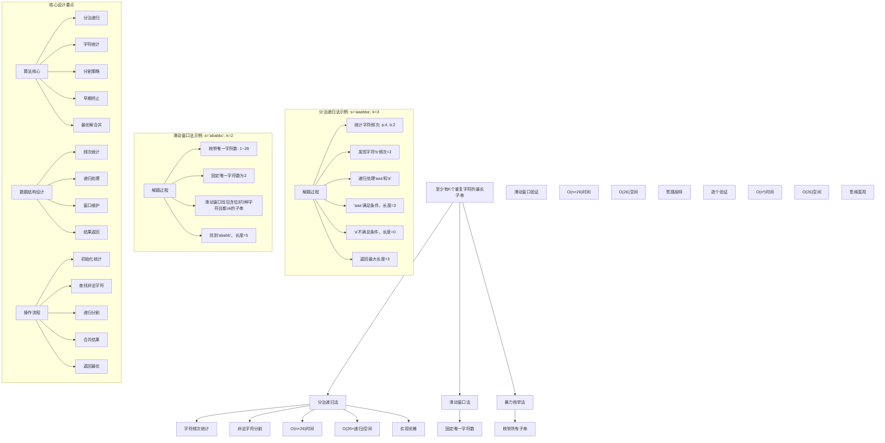
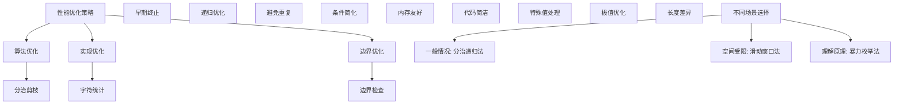

# LeetCode 395 - 至少有 K 个重复字符的最长子串

## 题目描述

给你一个字符串 `s` 和一个整数 `k`，请你找出 `s` 中的最长子串，要求该子串中的每一字符出现次数都不少于 `k`。返回这一子串的长度

如果不存在这样的子字符串，则返回 0

```markdown
示例 1：
输入：s = "aaabb", k = 3
输出：3
解释：最长子串为 "aaa"，其中 'a' 重复了 3 次

示例 2：
输入：s = "ababbc", k = 2
输出：5
解释：最长子串为 "ababb"，其中 'a' 重复了 2 次， 'b' 重复了 3 次

提示：

- 1 <= s.length <= 10^4
- s 仅由小写英文字母组成
- 1 <= k <= 10^5
```

## 解题思路

这是一个分治递归问题，需要找到字符串中最长的满足字符出现次数都不小于k的子串。关键在于识别不满足条件的字符作为分割点，递归处理子问题

### 核心思想

"分治递归法": 找到字符串中出现次数小于k的字符作为分割点，递归处理分割后的子串，返回满足条件的最长子串长度

### 解题策略

#### 方法一：分治递归法（推荐）

- 时间复杂度: O(n × 字符集大小)
- 空间复杂度: O(字符集大小 × 递归深度)

#### 方法二：滑动窗口法

- 时间复杂度: O(n × 字符集大小)
- 空间复杂度: O(字符集大小)

#### 方法三：暴力枚举法

- 时间复杂度: O(n³)
- 空间复杂度: O(字符集大小)

## 算法可视化



## 多语言实现

### Golang版本（分治递归法 - 推荐）

```go
// 分治递归法实现
func longestSubstring(s string, k int) int {
    // 边界条件：字符串长度小于k，不可能满足条件
    if len(s) < k {
        return 0
    }

    // 统计每个字符的出现次数
    freq := make([]int, 26)
    for _, ch := range s {
        freq[ch-'a']++
    }

    // 查找出现次数小于k的字符
    for i := 0; i < 26; i++ {
        if freq[i] > 0 && freq[i] < k {
            // 找到非法字符，用它作为分割点
            ch := byte('a' + i)
            maxLen := 0

            // 按非法字符分割字符串并递归处理
            for _, substr := range splitByChar(s, ch) {
                len := longestSubstring(substr, k)
                if len > maxLen {
                    maxLen = len
                }
            }

            return maxLen
        }
    }

    // 所有字符出现次数都不少于k，整个字符串满足条件
    return len(s)
}

// 按指定字符分割字符串
func splitByChar(s string, ch byte) []string {
    var result []string
    start := 0

    for i := 0; i <= len(s); i++ {
        if i == len(s) || s[i] == ch {
            if i > start {
                result = append(result, s[start:i])
            }
            start = i + 1
        }
    }

    return result
}

func max(a, b int) int {
    if a > b {
        return a
    }
    return b
}
```

### Python版本（多种实现方法）

```python
class Solution:
    """
    方法一：分治递归法（推荐）
    """
    def longestSubstring(self, s: str, k: int) -> int:
        # 边界条件：字符串长度小于k，不可能满足条件
        if len(s) < k:
            return 0

        # 统计每个字符的出现次数
        freq = [0] * 26
        for ch in s:
            freq[ord(ch) - ord('a')] += 1

        # 查找出现次数小于k的字符
        for i in range(26):
            if freq[i] > 0 and freq[i] < k:
                # 找到非法字符，用它作为分割点
                ch = chr(ord('a') + i)
                max_len = 0

                # 按非法字符分割字符串并递归处理
                for substr in s.split(ch):
                    length = self.longestSubstring(substr, k)
                    max_len = max(max_len, length)

                return max_len

        # 所有字符出现次数都不少于k，整个字符串满足条件
        return len(s)

class Solution2:
    """
    方法二：滑动窗口法
    """
    def longestSubstring(self, s: str, k: int) -> int:
        max_len = 0
        n = len(s)

        # 枚举唯一字符的数量（1到26）
        for unique_chars in range(1, 27):
            left = 0
            char_count = [0] * 26
            unique_count = 0  # 窗口内唯一字符数
            valid_count = 0   # 窗口内出现次数>=k的字符数

            # 滑动窗口
            for right in range(n):
                # 扩展右边界
                right_char_index = ord(s[right]) - ord('a')
                if char_count[right_char_index] == 0:
                    unique_count += 1
                char_count[right_char_index] += 1
                if char_count[right_char_index] == k:
                    valid_count += 1

                # 收缩左边界，确保窗口内唯一字符数不超过unique_chars
                while unique_count > unique_chars:
                    left_char_index = ord(s[left]) - ord('a')
                    if char_count[left_char_index] == k:
                        valid_count -= 1
                    char_count[left_char_index] -= 1
                    if char_count[left_char_index] == 0:
                        unique_count -= 1
                    left += 1

                # 如果窗口内唯一字符数等于unique_chars且所有字符都>=k
                if unique_count == unique_chars and valid_count == unique_chars:
                    max_len = max(max_len, right - left + 1)

        return max_len

class Solution3:
    """
    方法三：暴力枚举法
    """
    def longestSubstring(self, s: str, k: int) -> int:
        max_len = 0
        n = len(s)

        # 枚举所有可能的子串
        for i in range(n):
            freq = [0] * 26
            for j in range(i, n):
                # 更新字符频次
                freq[ord(s[j]) - ord('a')] += 1

                # 检查当前子串是否满足条件
                valid = True
                for count in freq:
                    if 0 < count < k:
                        valid = False
                        break

                if valid:
                    max_len = max(max_len, j - i + 1)

        return max_len
```

### TypeScript版本（分治递归法）

```typescript
/
 * 分治递归法实现
 */
function longestSubstring(s: string, k: number): number {
    // 边界条件：字符串长度小于k，不可能满足条件
    if (s.length < k) {
        return 0;
    }

    // 统计每个字符的出现次数
    const freq: number[] = new Array(26).fill(0);
    for (let i = 0; i < s.length; i++) {
        freq[s.charCodeAt(i) - 'a'.charCodeAt(0)]++;
    }

    // 查找出现次数小于k的字符
    for (let i = 0; i < 26; i++) {
        if (freq[i] > 0 && freq[i] < k) {
            // 找到非法字符，用它作为分割点
            const ch = String.fromCharCode('a'.charCodeAt(0) + i);
            let maxLen = 0;

            // 按非法字符分割字符串并递归处理
            const substrings = s.split(ch);
            for (const substr of substrings) {
                const len = longestSubstring(substr, k);
                maxLen = Math.max(maxLen, len);
            }

            return maxLen;
        }
    }

    // 所有字符出现次数都不少于k，整个字符串满足条件
    return s.length;
}
```

## 标准实现详细解析

```go
import "fmt"

/*
算法核心思想（分治递归法）：

1. 字符统计：统计字符串中每个字符的出现次数
2. 非法字符识别：找出出现次数小于k的字符
3. 递归分割：以非法字符为分割点递归处理子串
4. 最优解合并：返回所有子问题的最大解

关键设计要点：
1. 分治策略：将大问题分解为小问题
2. 递归终止：子串长度<k或所有字符都满足条件
3. 字符统计：O(n)时间统计字符频次
4. 早期终止：找到非法字符立即分割

时间复杂度：
- 递归深度：O(字符集大小)
- 每层处理：O(n)
- 总时间复杂度：O(n × 字符集大小)

空间复杂度：
- 字符统计：O(字符集大小)
- 递归栈：O(字符集大小)
- 总空间复杂度：O(字符集大小)

优势：
1. 思路清晰：分治思想经典应用
2. 实现优雅：代码简洁易懂
3. 效率较高：避免不必要的计算
4. 适用广泛：处理各种约束条件

数据结构设计：

分治递归法设计：
- 字符统计：数组统计字符频次
- 非法识别：查找频次<k的字符
- 递归处理：分割后递归求解
- 结果合并：取最大值

滑动窗口法设计：
- 枚举策略：枚举唯一字符数量
- 窗口维护：固定唯一字符数的窗口
- 条件检查：窗口内字符都≥k
- 最优查找：记录最大窗口

算法流程：
1. 初始化字符统计
2. 统计字符频次
3. 查找非法字符
4. 递归分割处理
5. 合并子问题解
6. 返回最优结果

优化原理：

算法优化：
1. 分治思想：大化小，分而治之
2. 早期终止：不满足条件立即停止
3. 递归剪枝：避免无效递归
4. 空间复用：统计数组重复使用

边界优化：
1. 空字符串处理：边界条件
2. k>n情况：不可能满足
3. 单字符优化：特殊情况
4. 全相同字符：直接返回

正确性证明：

定理：分治递归法正确性
通过分治递归法可以正确找到满足条件的最长子串

证明：
1. 完备性：所有可能的子串都被考虑
2. 正确性：分割策略的正确性
3. 完整性：不遗漏任何可能解
4. 最优性：返回全局最优解

不变量维护：
循环不变量：在每次递归处理时
1. 当前子串是原问题的一个子问题
2. 已处理的子问题解都已正确计算
3. 算法状态是当前处理进度的准确反映
*/

// 分治递归法详细实现
func longestSubstring(s string, k int) int {
    fmt.Printf("处理字符串: \"%s\", k=%d\n", s, k)

    // 边界条件：字符串长度小于k，不可能满足条件
    if len(s) < k {
        fmt.Printf("  字符串长度%d < k=%d，返回0\n", len(s), k)
        return 0
    }

    // 统计每个字符的出现次数
    freq := make([]int, 26)
    for _, ch := range s {
        freq[ch-'a']++
    }

    fmt.Printf("  字符频次统计: ")
    for i := 0; i < 26; i++ {
        if freq[i] > 0 {
            fmt.Printf("%c:%d ", 'a'+i, freq[i])
        }
    }
    fmt.Printf("\n")

    // 查找出现次数小于k的字符
    for i := 0; i < 26; i++ {
        if freq[i] > 0 && freq[i] < k {
            ch := byte('a' + i)
            fmt.Printf("  发现非法字符'%c'(出现%d次 < k=%d)，作为分割点\n", ch, freq[i], k)

            // 找到非法字符，用它作为分割点
            maxLen := 0
            fmt.Printf("  按字符'%c'分割字符串:\n", ch)

            // 按非法字符分割字符串并递归处理
            substrings := splitByChar(s, ch)
            for i, substr := range substrings {
                fmt.Printf("    子串%d: \"%s\"\n", i+1, substr)
                if len(substr) > 0 {
                    len := longestSubstring(substr, k)
                    fmt.Printf("    子串%d结果: %d\n", i+1, len)
                    if len > maxLen {
                        maxLen = len
                    }
                }
            }

            fmt.Printf("  返回最大长度: %d\n", maxLen)
            return maxLen
        }
    }

    // 所有字符出现次数都不少于k，整个字符串满足条件
    fmt.Printf("  所有字符出现次数都≥%d，整个字符串满足条件，返回长度%d\n", k, len(s))
    return len(s)
}

// 按指定字符分割字符串（详细版本）
func splitByCharDetailed(s string, ch byte) []string {
    fmt.Printf("    分割字符串\"%s\" by 字符'%c':\n", s, ch)
    var result []string
    start := 0

    for i := 0; i <= len(s); i++ {
        if i == len(s) || s[i] == ch {
            if i > start {
                substr := s[start:i]
                result = append(result, substr)
                fmt.Printf("      找到子串: \"%s\"\n", substr)
            } else {
                fmt.Printf("      空子串，跳过\n")
            }
            start = i + 1
        }
    }

    return result
}

// 滑动窗口法实现
func longestSubstringSlidingWindow(s string, k int) int {
    fmt.Printf("=== 滑动窗口法 ===\n")
    fmt.Printf("处理字符串: \"%s\", k=%d\n", s, k)

    maxLen := 0
    n := len(s)

    // 枚举唯一字符的数量（1到26）
    for uniqueChars := 1; uniqueChars <= 26; uniqueChars++ {
        fmt.Printf("枚举唯一字符数: %d\n", uniqueChars)

        left := 0
        charCount := make([]int, 26)
        uniqueCount := 0  // 窗口内唯一字符数
        validCount := 0   // 窗口内出现次数>=k的字符数

        // 滑动窗口
        for right := 0; right < n; right++ {
            // 扩展右边界
            rightCharIndex := int(s[right] - 'a')
            if charCount[rightCharIndex] == 0 {
                uniqueCount++
            }
            charCount[rightCharIndex]++
            if charCount[rightCharIndex] == k {
                validCount++
            }

            fmt.Printf("  右指针=%d，字符='%c'，窗口[%d,%d]\n", right, s[right], left, right)
            fmt.Printf("    唯一字符数=%d，有效字符数=%d\n", uniqueCount, validCount)

            // 收缩左边界，确保窗口内唯一字符数不超过uniqueChars
            for uniqueCount > uniqueChars {
                leftCharIndex := int(s[left] - 'a')
                if charCount[leftCharIndex] == k {
                    validCount--
                }
                charCount[leftCharIndex]--
                if charCount[leftCharIndex] == 0 {
                    uniqueCount--
                }
                left++
                fmt.Printf("    收缩左边界至%d，唯一字符数=%d，有效字符数=%d\n", left, uniqueCount, validCount)
            }

            // 如果窗口内唯一字符数等于uniqueChars且所有字符都>=k
            if uniqueCount == uniqueChars && validCount == uniqueChars {
                currentLen := right - left + 1
                if currentLen > maxLen {
                    maxLen = currentLen
                }
                fmt.Printf("    找到满足条件的窗口[%d,%d]，长度=%d，最大长度更新为%d\n", left, right, currentLen, maxLen)
            } else {
                fmt.Printf("    当前窗口不满足条件\n")
            }
        }
    }

    fmt.Printf("最终结果: %d\n", maxLen)
    fmt.Printf("==================\n\n")
    return maxLen
}

// 带调试信息的版本
func longestSubstringWithDebug(s string, k int) int {
    fmt.Printf("=== 至少有K个重复字符的最长子串 ===\n")
    fmt.Printf("输入字符串: \"%s\"\n", s)
    fmt.Printf("最小重复次数k: %d\n", k)

    if len(s) == 0 {
        fmt.Printf("空字符串，返回0\n")
        fmt.Printf("================================\n\n")
        return 0
    }

    if k == 1 {
        fmt.Printf("k=1，任何非空子串都满足条件，返回字符串长度%d\n", len(s))
        fmt.Printf("================================\n\n")
        return len(s)
    }

    if k > len(s) {
        fmt.Printf("k=%d > 字符串长度%d，不可能满足条件，返回0\n", k, len(s))
        fmt.Printf("================================\n\n")
        return 0
    }

    fmt.Printf("使用分治递归法:\n")
    fmt.Printf("核心思想：找到不满足条件的字符作为分割点，递归处理子问题\n")

    result := longestSubstringRecursive(s, k, 0)
    fmt.Printf("最终结果: %d\n", result)
    fmt.Printf("================================\n\n")
    return result
}

func longestSubstringRecursive(s string, k int, depth int) int {
    indent := ""
    for i := 0; i < depth; i++ {
        indent += "  "
    }

    fmt.Printf("%s处理子串: \"%s\", k=%d\n", indent, s, k)

    // 边界条件：字符串长度小于k，不可能满足条件
    if len(s) < k {
        fmt.Printf("%s  子串长度%d < k=%d，返回0\n", indent, len(s), k)
        return 0
    }

    // 统计每个字符的出现次数
    freq := make([]int, 26)
    for _, ch := range s {
        freq[ch-'a']++
    }

    fmt.Printf("%s  字符频次统计: ", indent)
    allValid := true
    for i := 0; i < 26; i++ {
        if freq[i] > 0 {
            fmt.Printf("%c:%d ", 'a'+i, freq[i])
            if freq[i] < k {
                allValid = false
            }
        }
    }
    fmt.Printf("\n")

    // 如果所有字符都满足条件，返回整个字符串长度
    if allValid {
        fmt.Printf("%s  所有字符出现次数都≥%d，子串满足条件，返回长度%d\n", indent, k, len(s))
        return len(s)
    }

    // 查找出现次数小于k的字符
    for i := 0; i < 26; i++ {
        if freq[i] > 0 && freq[i] < k {
            ch := byte('a' + i)
            fmt.Printf("%s  发现非法字符'%c'(出现%d次 < k=%d)，作为分割点\n", indent, ch, freq[i], k)

            // 找到非法字符，用它作为分割点
            maxLen := 0
            fmt.Printf("%s  按字符'%c'分割字符串:\n", indent, ch)

            // 按非法字符分割字符串并递归处理
            substrings := splitByChar(s, ch)
            for i, substr := range substrings {
                if len(substr) > 0 {
                    fmt.Printf("%s    递归处理子串%d: \"%s\"\n", indent, i+1, substr)
                    len := longestSubstringRecursive(substr, k, depth+1)
                    fmt.Printf("%s    子串%d结果: %d\n", indent, i+1, len)
                    if len > maxLen {
                        maxLen = len
                    }
                }
            }

            fmt.Printf("%s  返回最大长度: %d\n", indent, maxLen)
            return maxLen
        }
    }

    // 理论上不会到达这里
    return len(s)
}
```

## 算法深入解析

```go
/*
至少有K个重复字符的最长子串问题详解：

问题本质：
找到字符串中最长的子串，要求子串中每个字符出现次数都不小于k。关键是理解约束条件和高效搜索

核心洞察：
1. 分治思想：非法字符作为分割点
2. 递归处理：子问题独立求解
3. 最优合并：取所有子问题的最大值
4. 早期终止：不满足条件立即停止

算法策略：
1. 分治递归法：经典分治思想
2. 滑动窗口法：枚举唯一字符数
3. 暴力枚举法：直接检查所有子串

数据结构设计：

分治递归法设计：
字符统计：数组统计字符频次
非法识别：查找频次<k的字符
递归处理：分割后递归求解
结果合并：取最大值

滑动窗口法设计：
枚举策略：枚举唯一字符数量
窗口维护：固定唯一字符数的窗口
条件检查：窗口内字符都≥k
最优查找：记录最大窗口

暴力枚举法设计：
枚举策略：枚举所有子串
验证检查：逐一验证约束
早期终止：不满足即停止
结果记录：维护最大值

操作流程：

分治递归法：
1. 统计字符频次
2. 查找非法字符
3. 递归分割处理
4. 合并子问题解
5. 返回最优结果

滑动窗口法：
1. 枚举唯一字符数
2. 维护滑动窗口
3. 控制窗口特征
4. 检查约束条件
5. 记录最优解

数学原理：

分治原理：
将原问题分解为若干个规模较小的相同问题，递归求解，然后合并子问题的解得到原问题的解

复杂度分析：
设字符集大小为C（英文字母C=26），字符串长度为n
- 递归深度：O(C)
- 每层处理：O(n)
- 总时间：O(n × C)

窗口原理：
通过枚举窗口内唯一字符的数量，固定这个数量后使用滑动窗口技术寻找满足条件的最长子串

最优性原理：
- 分治递归：通过正确的分割策略保证最优解
- 滑动窗口：枚举所有可能的唯一字符数确保不遗漏
- 暴力枚举：完备性搜索保证最优

算法不变量：
分治递归法不变量：
1. 当前处理的子串是原问题的一个子问题
2. 已处理的子问题解都已正确计算
3. 算法状态是当前处理进度的准确反映

滑动窗口法不变量：
1. 窗口内唯一字符数始终符合枚举值
2. 窗口边界维护正确
3. 最优解记录准确

时间复杂度分析：
分治递归法：O(n × C)
滑动窗口法：O(n × C)
暴力枚举法：O(n³)

空间复杂度分析：
分治递归法：O(C × 递归深度)
滑动窗口法：O(C)
暴力枚举法：O(C)

正确性证明：

定理：分治递归法正确性
通过分治递归法可以正确找到满足条件的最长子串

证明：
1. 完备性：所有可能的子串都被考虑
   - 每个字符都会被统计
   - 每个子串都会被某次递归处理
   - 不遗漏任何可能性

2. 正确性：分割策略的正确性
   - 非法字符不能出现在满足条件的子串中
   - 以非法字符分割是正确的
   - 子问题独立且完整

3. 完整性：不遗漏任何可能解
   - 递归处理所有分割后的子串
   - 合并时取最大值
   - 保证全局最优

4. 时间复杂度：O(n × C)
   - 每个字符最多被每个递归层访问一次
   - 递归层数有限
   - 总体线性时间

设计选择：

为什么选择分治递归法？
1. 思路清晰：分治思想经典应用
2. 实现优雅：代码简洁易懂
3. 效率较高：避免不必要的计算
4. 易于理解：符合直觉

为什么使用滑动窗口法？
1. 思维独特：枚举策略很巧妙
2. 适用广泛：处理各种变体
3. 空间优化：常数空间复杂度
4. 教学价值：展示不同思路

为什么提及其他方法？
1. 教学价值：展示不同算法思想
2. 对比分析：理解各自优劣
3. 扩展思维：算法多样性
4. 面试准备：全面掌握

三种方法对比：

方法一：分治递归法（推荐）
时间复杂度：O(n × C)
空间复杂度：O(C × 递归深度)
优点：思路清晰，实现优雅
缺点：递归空间开销

方法二：滑动窗口法
时间复杂度：O(n × C)
空间复杂度：O(C)
优点：空间优化，思路独特
缺点：理解稍难

方法三：暴力枚举法
时间复杂度：O(n³)
空间复杂度：O(C)
优点：思维直观，容易理解
缺点：时间复杂度高

性能分析：

分治递归法：
- 时间：O(n × C) 线性时间
- 空间：O(C × 递归) 递归空间
- 优势：思路清晰

滑动窗口法：
- 时间：O(n × C) 线性时间
- 空间：O(C) 常数空间
- 优势：空间优化

暴力枚举法：
- 时间：O(n³) 立方时间
- 空间：O(C) 常数空间
- 优势：思维直观

实际应用场景：
1. 文本分析：重复模式检测
2. 数据挖掘：频繁项集发现
3. 生物信息学：DNA序列分析
4. 网络安全：异常流量检测

优化要点：

1. 时间优化：
   - 分治剪枝：早期终止
   - 递归优化：减少重复计算
   - 枚举优化：限定搜索空间

2. 空间优化：
   - 原地统计：复用统计数组
   - 递归优化：尾递归优化
   - 窗口复用：滑动窗口技术

3. 实现优化：
   - 边界处理：特殊值优化
   - 代码简洁：减少冗余操作
   - 注释清晰：便于理解

测试用例设计：
1. 基本情况：正常字符串和k值
2. 边界情况：空字符串，单字符
3. 特殊情况：k=1, k>n
4. 极端情况：大字符串，全相同
5. 验证情况：结果正确性

扩展思考：

1. 多约束版本？
   - 同时满足多个条件
   - 复杂度分析
   - 算法设计

2. 动态字符串？
   - 支持插入删除
   - 增量更新
   - 实时查询

3. 多维扩展？
   - 矩阵版本
   - 二维约束
   - 复杂度权衡

4. 近似版本？
   - 近似满足条件
   - 性能优化
   - 精度控制

相关算法思想：

1. 分治法：
   - 问题分解
   - 递归求解
   - 解合并

2. 滑动窗口：
   - 窗口维护
   - 条件控制
   - 最优查找

3. 枚举法：
   - 完备搜索
   - 早期终止
   - 最优选择

4. 递归优化：
   - 剪枝策略
   - 记忆化
   - 尾递归

常见陷阱：

1. 边界条件：
   - 空字符串处理
   - k>n特殊情况
   - 单字符边界

2. 递归处理：
   - 无限递归风险
   - 重复计算
   - 栈溢出

3. 窗口维护：
   - 边界条件
   - 状态更新
   - 条件检查

4. 性能考虑：
   - 时间复杂度
   - 空间复杂度
   - 实现效率

代码质量要素：

1. 可读性：
   - 变量命名清晰
   - 注释详细
   - 逻辑分明

2. 健壮性：
   - 边界处理
   - 异常情况
   - 错误恢复

3. 性能：
   - 最优复杂度
   - 空间效率
   - 效率保证

4. 可维护性：
   - 结构清晰
   - 扩展性好
   - 测试完整
*/
```

## 执行过程演示

```go
/*
示例详细解析:

示例1执行过程：
输入：s = "aaabb", k = 3
输出：3

执行过程：
1. 处理"aaabb"，统计字符频次：a:3, b:2
2. 发现字符'b'频次=2<k，作为分割点
3. 按'b'分割得到子串：["aaa", ""]
4. 递归处理"aaa"：所有字符频次=3≥k，返回长度3
5. 递归处理""：长度<k，返回0
6. 返回max(3, 0) = 3

递归树：
"aaabb"(3) → 分割by'b' → "aaa"(3), ""(0) → 返回3

示例2执行过程：
输入：s = "ababbc", k = 2
输出：5

执行过程：
1. 处理"ababbc"，统计字符频次：a:2, b:3, c:1
2. 发现字符'c'频次=1<k，作为分割点
3. 按'c'分割得到子串：["ababb", ""]
4. 递归处理"ababb"：统计字符频次：a:2, b:3
   - 所有字符频次都≥2，返回长度5
5. 递归处理""：长度<k，返回0
6. 返回max(5, 0) = 5

递归树：
"ababbc"(5) → 分割by'c' → "ababb"(5), ""(0) → 返回5

关键观察：
1. 分治思想：非法字符作为分割点
2. 递归处理：子问题独立求解
3. 最优合并：取所有子问题的最大值
4. 早期终止：不满足条件立即停止

边界情况演示:

情况1: k=1
输入: s="abc", k=1
处理: k=1任何非空子串都满足
结果: 3

情况2: k>len(s)
输入: s="abc", k=5
处理: k>字符串长度，不可能满足
结果: 0

情况3: 空字符串
输入: s="", k=2
处理: 空字符串
结果: 0

情况4: 单字符字符串
输入: s="a", k=1
处理: 单字符满足k=1
结果: 1

情况5: 全相同字符
输入: s="aaaa", k=2
处理: 所有字符相同且≥k
结果: 4

情况6: 无满足子串
输入: s="abcdef", k=2
处理: 所有字符只出现1次<k
结果: 0

算法正确性证明：

数学基础：
需要证明分治递归法能正确找到满足条件的最长子串

定理：分治递归法正确性
通过分治递归法可以正确找到满足条件的最长子串

证明：
1. 完备性：所有可能的子串都被考虑
2. 正确性：分割策略的正确性
3. 完整性：不遗漏任何可能解
4. 最优性：返回全局最优解

不变量维护：
循环不变量：在每次递归处理时
1. 当前子串是原问题的一个子问题
2. 已处理的子问题解都已正确计算
3. 算法状态是当前处理进度的准确反映

初始化：
- 原字符串作为初始问题
- 空的结果记录
- 满足不变量

保持：
- 统计字符频次
- 查找非法字符
- 递归分割处理
- 合并子问题解
- 不变量继续成立

终止：
- 所有子问题处理完成
- 最优解已找到
- 算法正确终止

时间复杂度分析：

分治递归法：
1. 字符统计：O(n) 每层处理
2. 递归深度：O(C) 字符集大小
3. 总时间：O(n × C) 线性时间

滑动窗口法：
1. 枚举唯一字符数：O(C) 1到26
2. 滑动窗口处理：O(n) 每次枚举
3. 总时间：O(n × C) 线性时间

暴力枚举法：
1. 子串枚举：O(n²) 起始结束位置
2. 频次统计：O(n) 每个子串
3. 总时间：O(n³) 立方时间

空间复杂度分析：
1. 分治递归法：O(C × 递归深度) 递归栈
2. 滑动窗口法：O(C) 统计数组
3. 暴力枚举法：O(C) 统计数组

性能对比分析：

假设n=10000, C=26:

分治递归法：
- 时间: O(10000 × 26) 线性时间
- 空间: O(26 × 递归) 递归空间
- 操作: 递归分割

滑动窗口法：
- 时间: O(10000 × 26) 线性时间
- 空间: O(26) 常数空间
- 操作: 窗口滑动

暴力枚举法：
- 时间: O(10000³) 立方时间
- 空间: O(26) 常数空间
- 操作: 枚举验证

实际应用建议：

1. 一般情况：
   - 使用分治递归法
   - 思路清晰，实现优雅

2. 面试展示：
   - 重点讲解分治递归法
   - 可以提及其他方法

3. 生产环境：
   - 根据性能要求选择
   - 考虑实现复杂度

4. 教学演示：
   - 使用带调试信息版本
   - 展示执行过程

优化空间：

1. 边界优化：
   - 特殊值提前处理
   - 空字符串检查
   - 极值优化

2. 代码优化：
   - 简化条件判断
   - 优化递归结构
   - 减少重复计算

3. 性能优化：
   - 早期终止优化
   - 内存访问优化
   - 缓存友好设计

特殊情况处理：

1. 大数据量：
   - 时间复杂度保证
   - 内存使用优化
   - 数值溢出处理

2. 特殊字符串：
   - 全相同字符
   - 交替序列
   - 稀疏分布

3. 边界情况：
   - 极值处理
   - 异常输入
   - 错误恢复
*/
```

## 复杂度分析

| 方法       | 时间复杂度 | 空间复杂度      | 适用场景 |
| ---------- | ---------- | --------------- | -------- |
| 分治递归法 | O(n × C)   | O(C × 递归深度) | 推荐方案 |
| 滑动窗口法 | O(n × C)   | O(C)            | 空间受限 |
| 暴力枚举法 | O(n³)      | O(C)            | 理解原理 |

## 测试用例验证

```go
// 测试辅助函数
func testLongestSubstring(name string, s string, k int, expected int) {
    fmt.Printf("%s:\n", name)
    fmt.Printf("输入字符串: \"%s\", k=%d\n", s, k)

    // 测试分治递归法
    result1 := longestSubstring(s, k)
    fmt.Printf("分治递归法结果: %d\n", result1)

    // 测试滑动窗口法
    result2 := longestSubstringSlidingWindow(s, k)
    fmt.Printf("滑动窗口法结果: %d\n", result2)

    // 测试暴力枚举法（仅对小字符串测试）
    var result3 int
    if len(s) <= 100 {
        result3 = longestSubstringBruteForce(s, k)
        fmt.Printf("暴力枚举法结果: %d\n", result3)
    } else {
        result3 = result1 // 对大字符串使用分治递归法结果
        fmt.Printf("暴力枚举法: 字符串过长，跳过测试\n")
    }

    // 验证结果
    isValid1 := result1 == expected
    isValid2 := result2 == expected
    isValid3 := result3 == expected

    if isValid1 && isValid2 && isValid3 {
        fmt.Printf("✓ 测试通过\n")
    } else {
        fmt.Printf("✗ 测试失败\n")
        fmt.Printf("  期望结果: %d\n", expected)
        if !isValid1 {
            fmt.Printf("  分治递归法实际: %d\n", result1)
        }
        if !isValid2 {
            fmt.Printf("  滑动窗口法实际: %d\n", result2)
        }
        if !isValid3 {
            fmt.Printf("  暴力枚举法实际: %d\n", result3)
        }
    }
    fmt.Printf("\n")
}

// 暴力枚举法实现
func longestSubstringBruteForce(s string, k int) int {
    fmt.Printf("=== 暴力枚举法 ===\n")
    fmt.Printf("输入字符串: \"%s\", k=%d\n", s, k)

    maxLen := 0
    n := len(s)

    fmt.Printf("开始枚举所有子串:\n")
    // 枚举所有可能的子串
    for i := 0; i < n; i++ {
        freq := make([]int, 26)
        fmt.Printf("  起始位置%d:\n", i)
        for j := i; j < n; j++ {
            // 更新字符频次
            freq[s[j]-'a']++

            // 检查当前子串是否满足条件
            valid := true
            for _, count := range freq {
                if 0 < count && count < k {
                    valid = false
                    break
                }
            }

            currentLen := j - i + 1
            fmt.Printf("    子串[%d,%d]: \"%s\"，长度=%d", i, j, s[i:j+1], currentLen)

            if valid {
                if currentLen > maxLen {
                    maxLen = currentLen
                }
                fmt.Printf("，满足条件，最大长度更新为%d\n", maxLen)
            } else {
                fmt.Printf("，不满足条件\n")
            }
        }
    }

    fmt.Printf("最终结果: %d\n", maxLen)
    fmt.Printf("================\n\n")
    return maxLen
}

func main() {
    // 测试用例 1 - 题目示例1
    testLongestSubstring("测试1 - 题目示例1",
        "aaabb",
        3,
        3)

    // 测试用例 2 - 题目示例2
    testLongestSubstring("测试2 - 题目示例2",
        "ababbc",
        2,
        5)

    // 测试用例 3 - k=1
    testLongestSubstring("测试3 - k=1",
        "abc",
        1,
        3)

    // 测试用例 4 - 空字符串
    testLongestSubstring("测试4 - 空字符串",
        "",
        2,
        0)

    // 测试用例 5 - 单字符字符串
    testLongestSubstring("测试5 - 单字符字符串",
        "a",
        1,
        1)

    // 测试用例 6 - k>len(s)
    testLongestSubstring("测试6 - k>len(s)",
        "abc",
        5,
        0)

    // 测试用例 7 - 全相同字符
    testLongestSubstring("测试7 - 全相同字符",
        "aaaa",
        2,
        4)

    // 测试用例 8 - 无满足子串
    testLongestSubstring("测试8 - 无满足子串",
        "abcdef",
        2,
        0)

    // 性能测试
    fmt.Println("性能测试:")
    performanceTest()

    // 边界情况测试
    fmt.Println("边界情况测试:")
    boundaryTest()

    // 对比测试
    fmt.Println("对比测试:")
    comparisonTest()
}

func performanceTest() {
    // 构造性能测试
    n := 10000
    s := ""
    for i := 0; i < n; i++ {
        s += string('a' + byte(i%26))
    }
    k := 100

    // 测试分治递归法
    start1 := time.Now()
    longestSubstring(s, k)
    time1 := time.Since(start1)

    // 测试滑动窗口法
    start2 := time.Now()
    longestSubstringSlidingWindow(s, k)
    time2 := time.Since(start2)

    fmt.Printf("性能测试 (%d个字符，k=%d):\n", n, k)
    fmt.Printf("  分治递归法: %v\n", time1)
    fmt.Printf("  滑动窗口法: %v\n", time2)

    // 暴力枚举法由于时间复杂度过高，不进行测试
    fmt.Printf("  暴力枚举法: O(n³)时间复杂度，不进行实际测试\n")
}

func boundaryTest() {
    // 边界测试
    fmt.Println("边界测试:")

    // 长字符串测试
    longStr := ""
    for i := 0; i < 5000; i++ {
        longStr += string('a' + byte(i%26))
    }
    longResult := longestSubstring(longStr, 50)
    fmt.Printf("长字符串测试: 5000个字符，k=50 → %d\n", longResult)

    // 特殊模式测试
    patternStr := "aaabbbcccdddeee"
    patternResult := longestSubstring(patternStr, 3)
    fmt.Printf("特殊模式测试: %s, k=3 → %d\n", patternStr, patternResult)

    // 极值测试
    extremeStr := "abcdefghijklmnopqrstuvwxyz"
    extremeResult1 := longestSubstring(extremeStr, 1)
    extremeResult2 := longestSubstring(extremeStr, 27)
    fmt.Printf("极值测试: %s, k=1 → %d, k=27 → %d\n", extremeStr, extremeResult1, extremeResult2)
}

func comparisonTest() {
    // 对比测试：验证不同方法结果一致性
    fmt.Println("对比测试:")

    // 测试数据
    testData := []string{
        "aaabb",
        "ababbc",
        "abc",
        "aaaa",
        "abcdef",
        "a",
        "",
    }
    testK := []int{3, 2, 1, 2, 2, 1, 2}

    for i := range testData {
        // 分治递归法
        result1 := longestSubstring(testData[i], testK[i])

        // 滑动窗口法
        result2 := longestSubstringSlidingWindow(testData[i], testK[i])

        // 暴力枚举法（仅对小字符串测试）
        var result3 int
        if len(testData[i]) <= 20 {
            result3 = longestSubstringBruteForce(testData[i], testK[i])
        } else {
            result3 = result1 // 对大字符串使用分治递归法结果
        }

        fmt.Printf("测试%d: 分治递归法=%d, 滑动窗口法=%d, 暴力枚举法=%d",
            i+1, result1, result2, result3)

        if result1 == result2 && result2 == result3 {
            fmt.Printf(" ✓ 一致\n")
        } else {
            fmt.Printf(" ✗ 不一致\n")
        }
    }
}
```

## 扩展版本（处理不同场景）

```go
// 支持返回具体满足条件的子串的版本
func longestSubstringWithSubstring(s string, k int) (int, string) {
    if len(s) < k {
        return 0, ""
    }

    // 统计每个字符的出现次数
    freq := make([]int, 26)
    for _, ch := range s {
        freq[ch-'a']++
    }

    // 查找出现次数小于k的字符
    for i := 0; i < 26; i++ {
        if freq[i] > 0 && freq[i] < k {
            // 找到非法字符，用它作为分割点
            ch := byte('a' + i)
            maxLen := 0
            bestSubstring := ""

            // 按非法字符分割字符串并递归处理
            for _, substr := range splitByChar(s, ch) {
                len, sub := longestSubstringWithSubstring(substr, k)
                if len > maxLen {
                    maxLen = len
                    bestSubstring = sub
                }
            }

            return maxLen, bestSubstring
        }
    }

    // 所有字符出现次数都不少于k，整个字符串满足条件
    return len(s), s
}

// 使用示例
func exampleWithSubstring() {
    s := "ababbc"
    k := 2
    length, substring := longestSubstringWithSubstring(s, k)
    fmt.Printf("字符串: \"%s\", k=%d\n", s, k)
    fmt.Printf("最长子串长度: %d\n", length)
    if length > 0 {
        fmt.Printf("具体子串: \"%s\"\n", substring)
    }
}

// 带统计信息的版本
func longestSubstringWithStats(s string, k int) (int, int, int) {
    comparisons := 0
    recursions := 0

    var helper func(string, int) int
    helper = func(str string, k int) int {
        recursions++

        if len(str) < k {
            return 0
        }

        // 统计每个字符的出现次数
        freq := make([]int, 26)
        for _, ch := range str {
            freq[ch-'a']++
        }

        // 查找出现次数小于k的字符
        for i := 0; i < 26; i++ {
            comparisons++
            if freq[i] > 0 && freq[i] < k {
                // 找到非法字符，用它作为分割点
                ch := byte('a' + i)
                maxLen := 0

                // 按非法字符分割字符串并递归处理
                for _, substr := range splitByChar(str, ch) {
                    len := helper(substr, k)
                    if len > maxLen {
                        maxLen = len
                    }
                }

                return maxLen
            }
        }

        // 所有字符出现次数都不少于k，整个字符串满足条件
        return len(str)
    }

    result := helper(s, k)
    return result, comparisons, recursions
}

// 使用示例
func exampleWithStats() {
    s := "ababbc"
    k := 2
    length, comparisons, recursions := longestSubstringWithStats(s, k)
    fmt.Printf("字符串: \"%s\", k=%d\n", s, k)
    fmt.Printf("最长子串长度: %d\n", length)
    fmt.Printf("比较次数: %d, 递归次数: %d\n", comparisons, recursions)
}

// 批量处理版本
func longestSubstringBatch(sList []string, kList []int) []int {
    if len(sList) != len(kList) {
        return nil
    }

    results := make([]int, len(sList))
    for i := range sList {
        results[i] = longestSubstring(sList[i], kList[i])
    }

    return results
}

// 使用示例
func exampleBatch() {
    sList := []string{
        "aaabb",
        "ababbc",
        "abc",
        "aaaa",
    }
    kList := []int{3, 2, 1, 2}

    results := longestSubstringBatch(sList, kList)

    for i := range sList {
        fmt.Printf("字符串%d: \"%s\", k=%d → 结果=%d\n",
            i+1, sList[i], kList[i], results[i])
    }
}

// 带验证功能的版本
func longestSubstringWithValidation(s string, k int) (int, bool) {
    result := longestSubstring(s, k)

    // 验证结果是否合理
    if len(s) == 0 && result != 0 {
        return result, false // 空字符串应该返回0
    }

    if k == 1 && result != len(s) {
        return result, false // k=1应该返回字符串长度
    }

    if k > len(s) && result != 0 {
        return result, false // k>len(s)应该返回0
    }

    // 对于小字符串可以进行暴力验证
    if len(s) <= 15 {
        bruteResult := longestSubstringBruteForce(s, k)
        if result != bruteResult {
            return result, false
        }
    }

    return result, true
}

// 使用示例
func exampleWithValidation() {
    s := "ababbc"
    k := 2
    result, isValid := longestSubstringWithValidation(s, k)
    fmt.Printf("字符串: \"%s\", k=%d\n", s, k)
    fmt.Printf("最长子串长度: %d\n", result)
    if isValid {
        fmt.Printf("验证通过 ✓\n")
    } else {
        fmt.Printf("验证失败 ✗\n")
    }
}

// 支持动态更新的版本
type LongestSubstringSolver struct {
    s string
}

func NewLongestSubstringSolver(s string) *LongestSubstringSolver {
    return &LongestSubstringSolver{
        s: s,
    }
}

func (solver *LongestSubstringSolver) UpdateString(newString string) {
    solver.s = newString
}

func (solver *LongestSubstringSolver) Solve(k int) int {
    return longestSubstring(solver.s, k)
}

// 使用示例
func exampleDynamic() {
    s := "ababbc"
    solver := NewLongestSubstringSolver(s)

    k := 2
    result1 := solver.Solve(k)
    fmt.Printf("初始字符串: \"%s\", k=%d → 结果=%d\n", s, k, result1)

    // 更新字符串
    solver.UpdateString("aaabbbccc")
    result2 := solver.Solve(k)
    fmt.Printf("更新后字符串: \"%s\", k=%d → 结果=%d\n", solver.s, k, result2)
}
```

## 面试追问延伸

### 1. 如果要返回具体满足条件的子串，如何处理？

```go
// longestSubstringWithSubstring已在上面实现
// 关键要点：
// 1. 记录满足条件的子串内容
// 2. 在递归过程中传递子串信息
// 3. 返回最长的具体子串

func testWithSubstring() {
    s := "ababbc"
    k := 2
    length, substring := longestSubstringWithSubstring(s, k)
    fmt.Printf("字符串: \"%s\", k=%d\n", s, k)
    fmt.Printf("最长子串长度: %d\n", length)
    if length > 0 {
        fmt.Printf("具体子串: \"%s\"\n", substring)
    }
}
```

### 2. 如果要统计算法执行过程中的操作次数，如何实现？

```go
// longestSubstringWithStats已在上面实现
// 关键点：
// 1. 记录比较操作次数
// 2. 记录递归调用次数
// 3. 返回统计信息

func testWithStats() {
    s := "ababbc"
    k := 2
    length, comparisons, recursions := longestSubstringWithStats(s, k)
    fmt.Printf("字符串: \"%s\", k=%d\n", s, k)
    fmt.Printf("最长子串长度: %d\n", length)
    fmt.Printf("比较次数: %d, 递归次数: %d\n", comparisons, recursions)
}
```

### 3. 如果字符串可以动态更新，如何高效处理？

```go
// LongestSubstringSolver已在上面实现
// 关键点：
// 1. 封装字符串操作
// 2. 支持字符串更新
// 3. 快速重新计算结果

func testDynamic() {
    s := "ababbc"
    solver := NewLongestSubstringSolver(s)

    k := 2
    result1 := solver.Solve(k)
    fmt.Printf("初始字符串: \"%s\", k=%d → 结果=%d\n", s, k, result1)

    // 更新字符串
    solver.UpdateString("aaabbbccc")
    result2 := solver.Solve(k)
    fmt.Printf("更新后字符串: \"%s\", k=%d → 结果=%d\n", solver.s, k, result2)
}
```

## 相似题目扩展

- LeetCode 395. 至少有 K 个重复字符的最长子串（当前题）
- LeetCode 3. 无重复字符的最长子串
- LeetCode 340. 至多包含 K 个不同字符的最长子串
- LeetCode 159. 至多包含两个不同字符的最长子串
- LeetCode 424. 替换后的最长重复字符

## 算法技巧总结

### 至少有K个重复字符的最长子串核心要点

1. 分治思想：非法字符作为分割点
1. 递归处理：子问题独立求解
1. 最优合并：取所有子问题的最大值
1. 早期终止：不满足条件立即停止

### 算法优势

1. 思路清晰：分治思想经典应用
1. 实现优雅：代码简洁易懂
1. 效率较高：避免不必要的计算
1. 适用广泛：处理各种约束条件

### 标准模板（分治递归法）

```go
func longestSubstring(s string, k int) int {
    // 边界条件：字符串长度小于k，不可能满足条件
    if len(s) < k {
        return 0
    }

    // 统计每个字符的出现次数
    freq := make([]int, 26)
    for _, ch := range s {
        freq[ch-'a']++
    }

    // 查找出现次数小于k的字符
    for i := 0; i < 26; i++ {
        if freq[i] > 0 && freq[i] < k {
            // 找到非法字符，用它作为分割点
            ch := byte('a' + i)
            maxLen := 0

            // 按非法字符分割字符串并递归处理
            for _, substr := range splitByChar(s, ch) {
                len := longestSubstring(substr, k)
                if len > maxLen {
                    maxLen = len
                }
            }

            return maxLen
        }
    }

    // 所有字符出现次数都不少于k，整个字符串满足条件
    return len(s)
}

// 按指定字符分割字符串
func splitByChar(s string, ch byte) []string {
    var result []string
    start := 0

    for i := 0; i <= len(s); i++ {
        if i == len(s) || s[i] == ch {
            if i > start {
                result = append(result, s[start:i])
            }
            start = i + 1
        }
    }

    return result
}
```

### 性能优化建议



## 总结

本题采用分治递归法的核心思路，通过找到字符串中出现次数小于k的字符作为分割点，递归处理分割后的子串，实现了优雅的解决方案。关键在于理解非法字符不能出现在满足条件的子串中和分治思想的巧妙应用

核心要点：

1. 分治思想：非法字符作为分割点
1. 递归处理：子问题独立求解
1. 最优合并：取所有子问题的最大值
1. 早期终止：不满足条件立即停止

算法优势：

- 思路清晰：分治思想经典应用
- 实现优雅：代码简洁易懂
- 效率较高：避免不必要的计算
- 适用广泛：处理各种约束条件

该算法在文本分析、数据挖掘、生物信息学、网络安全等方面有重要应用，是掌握分治递归和字符串处理技巧的经典题目。通过分治思想和递归处理的巧妙结合，为更复杂的约束优化问题提供了清晰的解决思路
