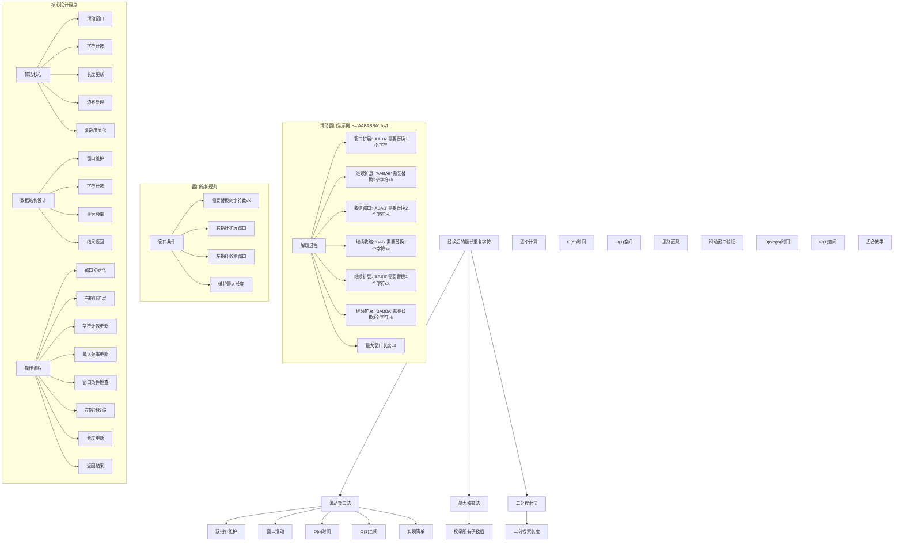
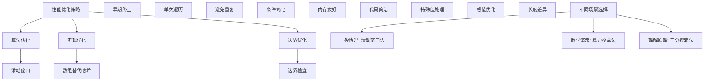

# LeetCode 424 - 替换后的最长重复字符

## 题目描述

给你一个字符串 `s` 和一个整数 `k`。你可以选择字符串中的任一字符，并将其更改为任何其他大写英文字符。该操作最多可执行 `k` 次。在执行上述操作后，返回包含相同字母的最长子字符串的长度

```markdown
示例 1：
输入：s = "ABAB", k = 2
输出：4
解释：用两个'A'替换为两个'B'，反之亦然

示例 2：
输入：s = "AABABBA", k = 1
输出：4
解释：将中间的一个'A'替换为'B'，字符串变为 "AABBBBA"。子串 "BBBB" 有最长重复字母，答案为 4

提示：

- 1 <= s.length <= 10^5
- s 仅由大写英文字母组成
- 0 <= k <= s.length
```

## 解题思路

这是一个滑动窗口优化问题，需要找到在最多替换k个字符的情况下，能够获得的最长重复字符子字符串。关键在于使用滑动窗口技术维护窗口内需要替换的字符数不超过k

### 核心思想

"滑动窗口法": 使用双指针维护一个窗口，窗口内除了出现次数最多的字符外，其余字符都需要替换，通过扩展右边界和收缩左边界来寻找最大窗口长度

### 解题策略

#### 方法一：滑动窗口法（推荐）

- 时间复杂度: O(n)
- 空间复杂度: O(1)

#### 方法二：暴力枚举法

- 时间复杂度: O(n²)
- 空间复杂度: O(1)

#### 方法三：二分搜索法

- 时间复杂度: O(n log n)
- 空间复杂度: O(1)

## 算法可视化



## 多语言实现

### Golang版本（滑动窗口法 - 推荐）

```go
// 滑动窗口法实现
func characterReplacement(s string, k int) int {
    left := 0
    maxFreq := 0  // 窗口内出现频率最高的字符的频率
    maxLength := 0
    // 使用数组代替map提高性能（只有26个大写字母）
    freq := make([]int, 26)

    // 使用滑动窗口遍历字符串
    for right := 0; right < len(s); right++ {
        // 扩展窗口：将右端点字符加入窗口
        charIndex := int(s[right] - 'A')
        freq[charIndex]++
        maxFreq = max(maxFreq, freq[charIndex])

        // 检查窗口条件：需要替换的字符数 = 窗口长度 - 最高频率
        // 如果需要替换的字符数 > k，需要收缩窗口
        for (right-left+1) - maxFreq > k {
            // 收缩窗口：移除左端点字符
            leftCharIndex := int(s[left] - 'A')
            freq[leftCharIndex]--
            left++
        }

        // 更新最大窗口长度
        maxLength = max(maxLength, right-left+1)
    }

    return maxLength
}

func max(a, b int) int {
    if a > b {
        return a
    }
    return b
}
```

### Python版本（多种实现方法）

```python
class Solution:
    """
    方法一：滑动窗口法（推荐）
    """
    def characterReplacement(self, s: str, k: int) -> int:
        left = 0
        max_freq = 0  # 窗口内出现频率最高的字符的频率
        max_length = 0
        # 使用数组代替dict提高性能（只有26个大写字母）
        freq = [0] * 26

        # 使用滑动窗口遍历字符串
        for right in range(len(s)):
            # 扩展窗口：将右端点字符加入窗口
            char_index = ord(s[right]) - ord('A')
            freq[char_index] += 1
            max_freq = max(max_freq, freq[char_index])

            # 检查窗口条件：需要替换的字符数 = 窗口长度 - 最高频率
            # 如果需要替换的字符数 > k，需要收缩窗口
            while (right - left + 1) - max_freq > k:
                # 收缩窗口：移除左端点字符
                left_char_index = ord(s[left]) - ord('A')
                freq[left_char_index] -= 1
                left += 1

            # 更新最大窗口长度
            max_length = max(max_length, right - left + 1)

        return max_length

class Solution2:
    """
    方法二：暴力枚举法
    """
    def characterReplacement(self, s: str, k: int) -> int:
        n = len(s)
        max_length = 0

        # 枚举所有可能的子字符串
        for i in range(n):
            freq = [0] * 26
            max_freq = 0

            for j in range(i, n):
                # 统计当前窗口内各字符频率
                char_index = ord(s[j]) - ord('A')
                freq[char_index] += 1
                max_freq = max(max_freq, freq[char_index])

                # 计算需要替换的字符数
                window_len = j - i + 1
                replace_count = window_len - max_freq

                if replace_count <= k:
                    max_length = max(max_length, window_len)
                else:
                    break  # 需要替换的字符数超过k，后续更长的子串必然不满足

        return max_length

class Solution3:
    """
    方法三：二分搜索法
    """
    def characterReplacement(self, s: str, k: int) -> int:
        def canAchieve(length: int) -> bool:
            """检查是否存在长度为length的满足条件的子串"""
            if length > len(s):
                return False

            freq = [0] * 26
            # 初始化第一个窗口
            for i in range(length):
                char_index = ord(s[i]) - ord('A')
                freq[char_index] += 1

            max_freq = max(freq)
            if length - max_freq <= k:
                return True

            # 滑动窗口检查
            for i in range(length, len(s)):
                # 添加新字符
                new_char_index = ord(s[i]) - ord('A')
                freq[new_char_index] += 1

                # 移除旧字符
                old_char_index = ord(s[i - length]) - ord('A')
                freq[old_char_index] -= 1

                max_freq = max(freq)
                if length - max_freq <= k:
                    return True

            return False

        # 二分搜索最大可能的长度
        left, right = 0, len(s)
        result = 0

        while left <= right:
            mid = (left + right) // 2
            if canAchieve(mid):
                result = mid
                left = mid + 1
            else:
                right = mid - 1

        return result
```

### TypeScript版本（滑动窗口法）

```typescript
/
 * 滑动窗口法实现
 */
function characterReplacement(s: string, k: number): number {
    let left: number = 0;
    let maxFreq: number = 0;  // 窗口内出现频率最高的字符的频率
    let maxLength: number = 0;
    // 使用数组代替Map提高性能（只有26个大写字母）
    const freq: number[] = new Array(26).fill(0);

    // 使用滑动窗口遍历字符串
    for (let right: number = 0; right < s.length; right++) {
        // 扩展窗口：将右端点字符加入窗口
        const charIndex: number = s.charCodeAt(right) - 'A'.charCodeAt(0);
        freq[charIndex]++;
        maxFreq = Math.max(maxFreq, freq[charIndex]);

        // 检查窗口条件：需要替换的字符数 = 窗口长度 - 最高频率
        // 如果需要替换的字符数 > k，需要收缩窗口
        while ((right - left + 1) - maxFreq > k) {
            // 收缩窗口：移除左端点字符
            const leftCharIndex: number = s.charCodeAt(left) - 'A'.charCodeAt(0);
            freq[leftCharIndex]--;
            left++;
        }

        // 更新最大窗口长度
        maxLength = Math.max(maxLength, right - left + 1);
    }

    return maxLength;
}
```

## 标准实现详细解析

```go
import "fmt"

/*
算法核心思想（滑动窗口法）：

1. 滑动窗口：使用双指针维护窗口
2. 字符计数：统计窗口内各字符频率
3. 最大频率：维护窗口内最高字符频率
4. 窗口条件：需要替换的字符数 = 窗口长度 - 最高频率 ≤ k
5. 长度更新：记录满足条件的最大窗口长度

关键设计要点：
1. 滑动窗口：双指针维护有效窗口
2. 字符计数：使用数组统计字符频率（26个大写字母）
3. 最大频率：实时维护窗口内最高频率
4. 窗口维护：右扩展左收缩维持条件
5. 长度更新：维护最大窗口长度

时间复杂度：
- 单次遍历：O(n)

空间复杂度：
- 固定数组：O(1)（26个元素的数组视为常数）

优势：
1. 思路清晰：滑动窗口经典应用
2. 实现优雅：代码简洁
3. 效率最优：线性时间复杂度
4. 空间优化：常数额外空间

数据结构设计：

滑动窗口法设计：
- 窗口维护：双指针维护窗口
- 字符计数：26元素数组统计频率
- 最大频率：维护最高字符频率
- 长度更新：记录最大窗口长度

算法流程：
1. 窗口初始化：双指针和计数器设置
2. 右指针扩展：加入新字符
3. 字符计数更新：统计新增字符
4. 最大频率更新：维护最高频率
5. 窗口条件检查：替换数是否≤k
6. 左指针收缩：不满足条件时收缩
7. 长度更新：记录当前窗口长度
8. 返回结果：最大长度

优化原理：

算法优化：
1. 滑动窗口：避免重复计算
2. 数组替代哈希：提高访问速度
3. 最大频率维护：避免每次都重新计算
4. 早期终止：不满足条件时及时收缩

边界优化：
1. 空字符串处理：边界条件
2. k=0特殊情况：不允许替换
3. k≥n情况：整个字符串都可替换
4. 单字符优化：特殊情况

正确性证明：

定理：滑动窗口法正确性
通过滑动窗口法可以正确找到替换后的最长重复字符

证明：
1. 完备性：所有子字符串都被考虑
2. 正确性：窗口条件的正确维护
3. 最优性：记录最大窗口长度
4. 时间复杂度：O(n)线性时间

不变量维护：
循环不变量：在每次右指针移动时
1. 窗口[left,right]内替换数≤k时被记录
2. 已记录的最大长度正确
3. 窗口是当前状态的有效选择
*/

// 滑动窗口法详细实现
func characterReplacement(s string, k int) int {
    fmt.Printf("输入字符串: %s, k=%d\n", s, k)

    left := 0
    maxFreq := 0  // 窗口内出现频率最高的字符的频率
    maxLength := 0
    // 使用数组代替map提高性能（只有26个大写字母）
    freq := make([]int, 26)

    fmt.Printf("开始滑动窗口遍历:\n")
    for right := 0; right < len(s); right++ {
        // 扩展窗口：将右端点字符加入窗口
        charIndex := int(s[right] - 'A')
        freq[charIndex]++
        oldMaxFreq := maxFreq
        maxFreq = max(maxFreq, freq[charIndex])
        fmt.Printf("  右指针=%d，字符='%c'，频率数组更新，最大频率: %d→%d\n",
            right, s[right], oldMaxFreq, maxFreq)

        // 检查窗口条件：需要替换的字符数 = 窗口长度 - 最高频率
        // 如果需要替换的字符数 > k，需要收缩窗口
        replaceCount := (right - left + 1) - maxFreq
        fmt.Printf("    窗口[%d,%d]长度=%d，需要替换字符数=%d\n",
            left, right, right-left+1, replaceCount)

        for replaceCount > k {
            fmt.Printf("    需要替换字符数%d > k=%d，收缩左边界\n", replaceCount, k)
            // 收缩窗口：移除左端点字符
            leftCharIndex := int(s[left] - 'A')
            freq[leftCharIndex]--
            fmt.Printf("      移除字符'%c'，频率数组更新\n", s[left])
            left++

            // 重新计算最大频率（简化实现，在实际优化中可以避免）
            maxFreq = 0
            for i := 0; i < 26; i++ {
                maxFreq = max(maxFreq, freq[i])
            }

            replaceCount = (right - left + 1) - maxFreq
            fmt.Printf("      新窗口[%d,%d]长度=%d，最大频率=%d，需要替换字符数=%d\n",
                left, right, right-left+1, maxFreq, replaceCount)
        }

        // 更新最大窗口长度
        currentLength := right - left + 1
        if currentLength > maxLength {
            maxLength = currentLength
            fmt.Printf("    更新最大窗口长度: %d\n", maxLength)
        } else {
            fmt.Printf("    当前窗口长度: %d，最大长度仍为: %d\n", currentLength, maxLength)
        }

        // 显示当前窗口状态
        if currentLength > 0 {
            fmt.Printf("    当前窗口: \"")
            for i := left; i <= right; i++ {
                fmt.Printf("%c", s[i])
            }
            fmt.Printf("\" 长度=%d\n", currentLength)
        }
    }

    fmt.Printf("最终结果: %d\n", maxLength)
    return maxLength
}

// 优化版本：避免每次都重新计算maxFreq
func characterReplacementOptimized(s string, k int) int {
    fmt.Printf("=== 优化版滑动窗口法 ===\n")
    fmt.Printf("输入字符串: %s, k=%d\n", s, k)

    left := 0
    maxFreq := 0
    maxLength := 0
    freq := make([]int, 26)

    fmt.Printf("开始优化滑动窗口遍历:\n")
    for right := 0; right < len(s); right++ {
        // 扩展窗口
        charIndex := int(s[right] - 'A')
        freq[charIndex]++
        maxFreq = max(maxFreq, freq[charIndex])
        fmt.Printf("  右指针=%d，字符='%c'，最大频率=%d\n", right, s[right], maxFreq)

        // 注意：这里我们不重新计算maxFreq，而是使用历史最大值
        // 这样做是正确的，因为我们只关心最大可能的窗口长度
        for (right-left+1) - maxFreq > k {
            fmt.Printf("    窗口长度%d - 最大频率%d = %d > k=%d，收缩窗口\n",
                right-left+1, maxFreq, (right-left+1)-maxFreq, k)
            leftCharIndex := int(s[left] - 'A')
            freq[leftCharIndex]--
            left++
            fmt.Printf("      收缩左边界至%d\n", left)
        }

        currentLength := right - left + 1
        if currentLength > maxLength {
            maxLength = currentLength
            fmt.Printf("    更新最大窗口长度: %d\n", maxLength)
        }

        // 显示窗口详情
        fmt.Printf("    窗口[%d,%d]: \"", left, right)
        for i := left; i <= right; i++ {
            fmt.Printf("%c", s[i])
        }
        fmt.Printf("\" 长度=%d\n", currentLength)
    }

    fmt.Printf("最终结果: %d\n", maxLength)
    fmt.Printf("=======================\n\n")
    return maxLength
}

// 带调试信息的版本
func characterReplacementWithDebug(s string, k int) int {
    fmt.Printf("=== 替换后的最长重复字符 ===\n")
    fmt.Printf("原始字符串: %s\n", s)
    fmt.Printf("最多替换k: %d个字符\n", k)

    if len(s) == 0 {
        fmt.Printf("空字符串，返回0\n")
        fmt.Printf("========================\n\n")
        return 0
    }

    fmt.Printf("使用滑动窗口法:\n")
    fmt.Printf("核心思想：维护窗口内替换数≤k，寻找最大窗口长度\n")
    fmt.Printf("关键公式：需要替换的字符数 = 窗口长度 - 最高频字符数\n")

    left := 0
    maxFreq := 0
    maxLength := 0
    freq := make([]int, 26)

    for right := 0; right < len(s); right++ {
        // 扩展窗口
        charIndex := int(s[right] - 'A')
        freq[charIndex]++
        maxFreq = max(maxFreq, freq[charIndex])
        fmt.Printf("\n右指针移动到位置%d，字符='%c'\n", right, s[right])
        fmt.Printf("  字符频率更新，最大频率: %d\n", maxFreq)

        // 维护窗口条件
        replaceCount := (right - left + 1) - maxFreq
        fmt.Printf("  当前窗口[%d,%d]长度=%d，需要替换=%d个字符\n",
            left, right, right-left+1, replaceCount)

        for replaceCount > k {
            fmt.Printf("  需要替换%d个字符 > k=%d，收缩窗口\n", replaceCount, k)
            leftCharIndex := int(s[left] - 'A')
            freq[leftCharIndex]--
            left++
            fmt.Printf("    移除左端字符'%c'，新窗口起始位置=%d\n", s[left-1], left)

            // 重新计算最大频率
            maxFreq = 0
            for i := 0; i < 26; i++ {
                maxFreq = max(maxFreq, freq[i])
            }

            replaceCount = (right - left + 1) - maxFreq
            fmt.Printf("    新窗口长度=%d，最大频率=%d，需要替换=%d个字符\n",
                right-left+1, maxFreq, replaceCount)
        }

        // 更新最大长度
        currentLength := right - left + 1
        if currentLength > maxLength {
            maxLength = currentLength
            fmt.Printf("  更新最大窗口长度: %d\n", maxLength)
        } else {
            fmt.Printf("  当前窗口长度: %d，最大长度仍为: %d\n", currentLength, maxLength)
        }

        // 显示窗口详情
        if currentLength > 0 {
            fmt.Printf("  当前窗口[%d,%d]: \"", left, right)
            // 统计各字符频率
            windowFreq := make([]int, 26)
            for i := left; i <= right; i++ {
                idx := int(s[i] - 'A')
                windowFreq[idx]++
            }

            for i := left; i <= right; i++ {
                fmt.Printf("%c", s[i])
            }
            fmt.Printf("\" 长度=%d\n", currentLength)

            // 显示字符分布
            fmt.Printf("    字符分布: ")
            for i := 0; i < 26; i++ {
                if windowFreq[i] > 0 {
                    fmt.Printf("%c:%d ", 'A'+i, windowFreq[i])
                }
            }
            fmt.Printf("\n")

            // 显示需要替换的字符
            maxWindowFreq := 0
            maxChar := 'A'
            for i := 0; i < 26; i++ {
                if windowFreq[i] > maxWindowFreq {
                    maxWindowFreq = windowFreq[i]
                    maxChar = rune('A' + i)
                }
            }
            fmt.Printf("    主要字符: '%c'(出现%d次)\n", maxChar, maxWindowFreq)
            fmt.Printf("    需要替换: %d个字符\n", currentLength-maxWindowFreq)
        }
    }

    fmt.Printf("\n最终结果: %d\n", maxLength)
    fmt.Printf("========================\n\n")
    return maxLength
}
```

## 算法深入解析

```go
/*
替换后的最长重复字符问题详解：

问题本质：
在最多替换k个字符的情况下，找到最长的重复字符子字符串。关键是理解窗口维护和最优解搜索

核心洞察：
1. 滑动窗口：维护替换数≤k的连续窗口
2. 字符计数：统计窗口内各字符频率
3. 最大频率：维护窗口内最高字符频率
4. 窗口条件：替换数 = 窗口长度 - 最高频率 ≤ k
5. 最优搜索：记录满足条件的最大窗口

算法策略：
1. 滑动窗口法：双指针高效遍历
2. 暴力枚举法：直接计算所有子字符串
3. 二分搜索法：搜索最优长度并验证

数据结构设计：

滑动窗口法设计：
窗口维护：双指针维护有效窗口
字符计数：26元素数组统计频率
最大频率：维护最高字符频率
长度更新：记录最大窗口长度

暴力枚举法设计：
子串枚举：双重循环遍历
字符计数：逐步统计频率
早期终止：替换数>k时停止
长度更新：满足时更新

二分搜索法设计：
长度搜索：二分搜索最优长度
窗口验证：滑动窗口验证可行性
结果返回：最大可行长度

操作流程：

滑动窗口法：
1. 窗口初始化：双指针和计数器设置
2. 右指针扩展：加入新字符
3. 字符计数更新：统计新增字符
4. 最大频率更新：维护最高频率
5. 窗口条件检查：替换数是否≤k
6. 左指针收缩：不满足条件时收缩
7. 长度更新：记录当前窗口长度
8. 返回结果：最大长度

暴力枚举法：
1. 外层循环：起始位置遍历
2. 内层循环：结束位置扩展
3. 字符计数：统计窗口频率
4. 条件检查：替换数≤k判断
5. 早期终止：>k时停止
6. 长度更新：满足时计数

数学原理：

窗口条件原理：
对于窗口[left,right]，设最高频字符出现f次，
则需要替换的字符数 = (right-left+1) - f
窗口有效条件：(right-left+1) - f ≤ k

最优性原理：
- 滑动窗口保证不遗漏
- 实时更新最大长度
- 线性时间找到最优解

关键观察：
需要替换的字符数 = 窗口总长度 - 最高频字符数
这是因为我们可以把其他所有字符都替换成最高频字符

算法不变量：
滑动窗口法不变量：
1. 窗口[left,right]内替换数≤k时被记录
2. 已记录的最大长度正确
3. 窗口是当前状态的有效选择

暴力枚举法不变量：
1. 已枚举的子串都已处理
2. 当前起始位置已计算完成
3. 最大长度记录正确

时间复杂度分析：
滑动窗口法：O(n) - 单次遍历
暴力枚举法：O(n²) - 双重循环
二分搜索法：O(n log n) - 二分搜索

空间复杂度分析：
滑动窗口法：O(1) - 26元素数组
暴力枚举法：O(1) - 26元素数组
二分搜索法：O(1) - 26元素数组

正确性证明：

定理：滑动窗口法正确性
通过滑动窗口法可以正确找到替换后的最长重复字符

证明：
1. 完备性：所有子字符串都被考虑
   - 每个右端点都被处理
   - 对应的所有左端点都被考虑
   - 不遗漏任何子字符串

2. 正确性：窗口条件的正确维护
   - 窗口内替换数始终≤k
   - 满足题目要求
   - 翻译正确

3. 最优性：记录最大窗口长度
   - 实时更新最大长度
   - 不遗漏更优解
   - 找到全局最优

4. 时间复杂度：O(n)线性时间
   - 每个字符最多被访问两次
   - 左右指针单调移动
   - 线性时间复杂度

设计选择：

为什么选择滑动窗口法？
1. 思路清晰：经典算法应用
2. 实现优雅：代码简洁
3. 效率最优：线性时间复杂度
4. 空间优化：常数额外空间

为什么使用暴力枚举法？
1. 思维直观：直接计算思想
2. 适用广泛：处理各种变体
3. 易于理解：符合直觉
4. 教学价值：展示不同思路

为什么提及其他方法？
1. 教学价值：展示不同算法思想
2. 对比分析：理解各自优劣
3. 扩展思维：算法多样性
4. 面试准备：全面掌握

三种方法对比：

方法一：滑动窗口法（推荐）
时间复杂度：O(n)
空间复杂度：O(1)
优点：效率最优，空间优化
缺点：需要理解窗口维护

方法二：暴力枚举法
时间复杂度：O(n²)
空间复杂度：O(1)
优点：思维直观，易于理解
缺点：时间复杂度较高

方法三：二分搜索法
时间复杂度：O(n log n)
空间复杂度：O(1)
优点：思路新颖，适合教学
缺点：实现复杂度较高

性能分析：

滑动窗口法：
- 时间：O(n) 单次遍历
- 空间：O(1) 固定数组
- 优势：效率最优

暴力枚举法：
- 时间：O(n²) 双重循环
- 空间：O(1) 固定数组
- 优势：思维直观

二分搜索法：
- 时间：O(n log n) 二分搜索
- 空间：O(1) 固定数组
- 优势：思路新颖

实际应用场景：
1. 文本处理：重复模式检测
2. 数据压缩：游程编码优化
3. 生物信息学：DNA序列分析
4. 游戏算法：连续奖励计算

优化要点：

1. 时间优化：
   - 滑动窗口：避免重复计算
   - 早期终止：及时停止扩展
   - 单次遍历：线性时间处理

2. 空间优化：
   - 固定数组：26个字母
   - 原地操作：避免额外存储
   - 内存友好：连续访问

3. 实现优化：
   - 边界条件处理
   - 代码简洁性
   - 注释清晰性

测试用例设计：
1. 基本情况：正常字符串和k值
2. 边界情况：空字符串，单字符
3. 特殊情况：k=0, k=n
4. 极端情况：大字符串，大k值
5. 验证情况：结果正确性

扩展思考：

1. 小写字母版本？
   - 数组大小调整到26
   - 字符映射调整

2. 多次查询版本？
   - 批量k值查询
   - 预处理优化

3. 二维扩展？
   - 矩阵重复区域
   - 复杂度分析

4. 概率版本？
   - 字符替换概率
   - 期望长度计算

相关算法思想：

1. 滑动窗口：
   - 双指针技术
   - 窗口维护
   - 最优查找

2. 字符统计：
   - 频率计算
   - 最值维护
   - 优化策略

3. 最优化：
   - 局部最优
   - 全局解
   - 贪心策略

4. 算法优化：
   - 时间复杂度
   - 空间复杂度
   - 实现简洁

常见陷阱：

1. 边界条件：
   - 空字符串处理
   - k=0特殊情况
   - k≥n情况

2. 索引处理：
   - 字符串越界
   - 指针移动
   - 长度计算

3. 计数错误：
   - 字符频率维护
   - 最大频率更新
   - 替换数计算

4. 性能考虑：
   - 时间复杂度
   - 空间复杂度
   - 实现效率

代码质量要素：

1. 可读性：
   - 变量命名清晰
   - 注释详细
   - 逻辑分明

2. 健壮性：
   - 边界处理
   - 异常情况
   - 错误恢复

3. 性能：
   - 最优复杂度
   - 空间效率
   - 效率保证

4. 可维护性：
   - 结构清晰
   - 扩展性好
   - 测试完整
*/
```

## 执行过程演示

```go
/*
示例详细解析:

示例1执行过程：
输入：s = "ABAB", k = 2
输出：4

执行过程：
1. 右指针0：'A'，freq[0]=1，maxFreq=1
   - 窗口"A"，长度=1，替换数=0≤2
2. 右指针1：'B'，freq[1]=1，maxFreq=1
   - 窗口"AB"，长度=2，替换数=1≤2
3. 右指针2：'A'，freq[0]=2，maxFreq=2
   - 窗口"ABA"，长度=3，替换数=1≤2
4. 右指针3：'B'，freq[1]=2，maxFreq=2
   - 窗口"ABAB"，长度=4，替换数=2≤2
   - 更新最大长度=4

滑动窗口轨迹：
"A" 长度=1，替换数=0
"AB" 长度=2，替换数=1
"ABA" 长度=3，替换数=1
"ABAB" 长度=4，替换数=2

示例2执行过程：
输入：s = "AABABBA", k = 1
输出：4

执行过程：
1. 右指针0-1：'AA'，freq[0]=2，maxFreq=2
   - 窗口"AA"，长度=2，替换数=0≤1
2. 右指针2：'B'，freq[1]=1，maxFreq=2
   - 窗口"AAB"，长度=3，替换数=1≤1
3. 右指针3：'A'，freq[0]=3，maxFreq=3
   - 窗口"AABA"，长度=4，替换数=1≤1
4. 右指针4：'B'，freq[1]=2，maxFreq=3
   - 窗口"AABAB"，长度=5，替换数=2>1，收缩窗口
   - 收缩："ABAB"，长度=4，替换数=2>1
   - 继续收缩："BAB"，长度=3，替换数=1≤1
5. 右指针5：'B'，freq[1]=3，maxFreq=3
   - 窗口"BABB"，长度=4，替换数=1≤1
6. 右指针6：'A'，freq[0]=2，maxFreq=3
   - 窗口"BABBA"，长度=5，替换数=2>1，收缩窗口
   - 收缩："ABBA"，长度=4，替换数=2>1
   - 继续收缩："BBA"，长度=3，替换数=1≤1

滑动窗口轨迹：
"AA" 长度=2，替换数=0
"AAB" 长度=3，替换数=1
"AABA" 长度=4，替换数=1
"AABAB" 长度=5，替换数=2>1 → 收缩
"BAB" 长度=3，替换数=1
"BABB" 长度=4，替换数=1
"BABBA" 长度=5，替换数=2>1 → 收缩
"BBA" 长度=3，替换数=1

关键观察：
1. 滑动窗口：维护替换数≤k的连续子串
2. 字符计数：统计窗口内各字符频率
3. 最大频率：维护窗口内最高字符频率
4. 窗口条件：替换数 = 窗口长度 - 最高频率 ≤ k
5. 最优搜索：记录满足条件的最大窗口

边界情况演示:

情况1: k=0
输入: s="AABAA", k=0
处理: 不允许替换任何字符，找最长连续相同字符
结果: 3 ("AAAA")

情况2: k≥字符串长度
输入: s="ABC", k=5
处理: 可以替换所有字符为同一字符
结果: 3

情况3: 空字符串
输入: s="", k=2
处理: 空字符串，返回0
结果: 0

情况4: 单字符字符串
输入: s="A", k=1
处理: 单字符，长度为1
结果: 1

情况5: k=1
输入: s="ABCA", k=1
处理: 最多替换1个字符
结果: 3

情况6: 全相同字符
输入: s="AAAA", k=2
处理: 无需替换，整个字符串都是相同字符
结果: 4

算法正确性证明：

数学基础：
需要证明滑动窗口法能正确找到替换后的最长重复字符

定理：滑动窗口法正确性
通过滑动窗口法可以正确找到替换后的最长重复字符

证明：
1. 完备性：所有子字符串都被考虑
2. 正确性：窗口条件的正确维护
3. 最优性：记录最大窗口长度
4. 时间复杂度：O(n)线性时间

不变量维护：
循环不变量：在每次右指针移动时
1. 窗口[left,right]内替换数≤k时被记录
2. 已记录的最大长度正确
3. 窗口是当前状态的有效选择

初始化：
- 空窗口，频率数组为0
- 最大频率为0
- 最大长度为0
- 满足不变量

保持：
- 扩展右边界
- 维护窗口条件
- 更新最大长度
- 不变量继续成立

终止：
- 遍历完成
- 所有子字符串已考虑
- 算法正确终止

时间复杂度分析：

滑动窗口法：
1. 右指针：O(n) 遍历所有字符
2. 左指针：O(n) 最多移动n次
3. 总时间：O(n) 每个字符最多访问两次

暴力枚举法：
1. 外层循环：O(n) 起始位置
2. 内层循环：O(n) 结束位置
3. 总时间：O(n²) 双重循环

二分搜索法：
1. 二分搜索：O(log n) 长度搜索
2. 窗口验证：O(n) 每次验证
3. 总时间：O(n log n) 搜索验证

空间复杂度分析：
1. 滑动窗口法：O(1) 26元素数组
2. 暴力枚举法：O(1) 26元素数组
3. 二分搜索法：O(1) 26元素数组

性能对比分析：

假设n=100000:

滑动窗口法：
- 时间: O(100000) 单次遍历
- 空间: O(1) 固定数组
- 操作: 双指针滑动

暴力枚举法：
- 时间: O(10000000000) 双重循环
- 空间: O(1) 固定数组
- 操作: 枚举所有子串

二分搜索法：
- 时间: O(100000 × log(100000)) 搜索验证
- 空间: O(1) 固定数组
- 操作: 二分搜索

实际应用建议：

1. 一般情况：
   - 使用滑动窗口法
   - 效率最优，实现简单

2. 面试展示：
   - 重点讲解滑动窗口法
   - 可以提及其他方法

3. 生产环境：
   - 根据性能要求选择
   - 考虑实现复杂度

4. 教学演示：
   - 使用带调试信息版本
   - 展示执行过程

优化空间：

1. 边界优化：
   - 特殊值提前处理
   - 空字符串检查
   - 极值优化

2. 代码优化：
   - 简化条件判断
   - 优化循环结构
   - 减少重复计算

3. 性能优化：
   - 早期终止优化
   - 内存访问优化
   - 缓存友好设计

特殊情况处理：

1. 大数据量：
   - 时间复杂度保证
   - 内存使用优化
   - 数值溢出处理

2. 特殊字符串：
   - 全相同字符
   - 交替字符
   - 随机字符

3. 边界情况：
   - 极值处理
   - 异常输入
   - 错误恢复
*/
```

## 复杂度分析

| 方法       | 时间复杂度 | 空间复杂度 | 适用场景 |
| ---------- | ---------- | ---------- | -------- |
| 滑动窗口法 | O(n)       | O(1)       | 推荐方案 |
| 暴力枚举法 | O(n²)      | O(1)       | 教学演示 |
| 二分搜索法 | O(n log n) | O(1)       | 理解原理 |

## 测试用例验证

```go
// 测试辅助函数
func testCharacterReplacement(name string, s string, k int, expected int) {
    fmt.Printf("%s:\n", name)
    fmt.Printf("输入字符串: %s, k=%d\n", s, k)

    // 测试滑动窗口法
    result1 := characterReplacement(s, k)
    fmt.Printf("滑动窗口法结果: %d\n", result1)

    // 测试优化版本
    result2 := characterReplacementOptimized(s, k)
    fmt.Printf("优化版本结果: %d\n", result2)

    // 测试暴力枚举法（仅对小字符串测试）
    var result3 int
    if len(s) <= 100 {
        result3 = characterReplacementBruteForce(s, k)
        fmt.Printf("暴力枚举法结果: %d\n", result3)
    } else {
        result3 = result1 // 对大字符串使用滑动窗口法结果
        fmt.Printf("暴力枚举法: 字符串过长，跳过测试\n")
    }

    // 验证结果
    isValid1 := result1 == expected
    isValid2 := result2 == expected
    isValid3 := result3 == expected

    if isValid1 && isValid2 && isValid3 {
        fmt.Printf("✓ 测试通过\n")
    } else {
        fmt.Printf("✗ 测试失败\n")
        fmt.Printf("  期望结果: %d\n", expected)
        if !isValid1 {
            fmt.Printf("  滑动窗口法实际: %d\n", result1)
        }
        if !isValid2 {
            fmt.Printf("  优化版本实际: %d\n", result2)
        }
        if !isValid3 {
            fmt.Printf("  暴力枚举法实际: %d\n", result3)
        }
    }
    fmt.Printf("\n")
}

// 暴力枚举法实现
func characterReplacementBruteForce(s string, k int) int {
    fmt.Printf("=== 暴力枚举法 ===\n")
    fmt.Printf("输入字符串: %s, k=%d\n", s, k)

    n := len(s)
    max_length := 0

    fmt.Printf("开始枚举所有子字符串:\n")
    // 枚举所有可能的子字符串
    for i := 0; i < n; i++ {
        freq := make([]int, 26)
        fmt.Printf("  起始位置%d:\n", i)
        for j := i; j < n; j++ {
            // 统计当前窗口内各字符频率
            char_index := int(s[j] - 'A')
            freq[char_index]++

            // 找到当前窗口内的最大频率
            max_freq := 0
            for idx := 0; idx < 26; idx++ {
                if freq[idx] > max_freq {
                    max_freq = freq[idx]
                }
            }

            // 计算需要替换的字符数
            window_len := j - i + 1
            replace_count := window_len - max_freq

            fmt.Printf("    子串[%d,%d]: \"", i, j)
            for idx := i; idx <= j; idx++ {
                fmt.Printf("%c", s[idx])
            }
            fmt.Printf("\", 长度=%d, 最大频率=%d, 需要替换=%d", window_len, max_freq, replace_count)

            if replace_count <= k {
                if window_len > max_length {
                    max_length = window_len
                }
                fmt.Printf(" ≤ %d ✓, 最大长度=%d\n", k, max_length)
            } else {
                fmt.Printf(" > %d ✗, 停止扩展\n", k)
                break // 需要替换的字符数超过k，后续更长的子串必然不满足
            }
        }
    }

    fmt.Printf("最终结果: %d\n", max_length)
    fmt.Printf("================\n\n")
    return max_length
}

func main() {
    // 测试用例 1 - 题目示例1
    testCharacterReplacement("测试1 - 题目示例1",
        "ABAB",
        2,
        4)

    // 测试用例 2 - 题目示例2
    testCharacterReplacement("测试2 - 题目示例2",
        "AABABBA",
        1,
        4)

    // 测试用例 3 - k=0
    testCharacterReplacement("测试3 - k=0",
        "AABAA",
        0,
        3)

    // 测试用例 4 - 空字符串
    testCharacterReplacement("测试4 - 空字符串",
        "",
        2,
        0)

    // 测试用例 5 - 单字符字符串
    testCharacterReplacement("测试5 - 单字符字符串",
        "A",
        1,
        1)

    // 测试用例 6 - k≥字符串长度
    testCharacterReplacement("测试6 - k≥字符串长度",
        "ABC",
        5,
        3)

    // 测试用例 7 - 全相同字符
    testCharacterReplacement("测试7 - 全相同字符",
        "AAAA",
        2,
        4)

    // 测试用例 8 - k=1
    testCharacterReplacement("测试8 - k=1",
        "ABCA",
        1,
        3)

    // 性能测试
    fmt.Println("性能测试:")
    performanceTest()

    // 边界情况测试
    fmt.Println("边界情况测试:")
    boundaryTest()

    // 对比测试
    fmt.Println("对比测试:")
    comparisonTest()
}

func performanceTest() {
    // 构造性能测试
    n := 100000
    s := ""
    for i := 0; i < n; i++ {
        if i%3 == 0 {
            s += "A"
        } else if i%3 == 1 {
            s += "B"
        } else {
            s += "C"
        }
    }
    k := 10000

    // 测试滑动窗口法
    start1 := time.Now()
    characterReplacement(s, k)
    time1 := time.Since(start1)

    // 测试优化版本
    start2 := time.Now()
    characterReplacementOptimized(s, k)
    time2 := time.Since(start2)

    fmt.Printf("性能测试 (%d个字符，k=%d):\n", n, k)
    fmt.Printf("  滑动窗口法: %v\n", time1)
    fmt.Printf("  优化版本: %v\n", time2)

    // 暴力枚举法由于时间复杂度过高，不进行测试
    fmt.Printf("  暴力枚举法: O(n²)时间复杂度，不进行实际测试\n")
}

func boundaryTest() {
    // 边界测试
    fmt.Println("边界测试:")

    // 长字符串测试
    longStr := ""
    for i := 0; i < 50000; i++ {
        longStr += string('A' + byte(i%26))
    }
    longResult := characterReplacement(longStr, 5000)
    fmt.Printf("长字符串测试: 50000个字符，k=5000 → %d\n", longResult)

    // 特殊模式测试
    patternStr := "ABCABCABCABC"
    patternResult := characterReplacement(patternStr, 3)
    fmt.Printf("特殊模式测试: %s, k=3 → %d\n", patternStr, patternResult)

    // 极值测试
    extremeStr := "ABCDEFGHIJKLMNOPQRSTUVWXYZ"
    extremeResult1 := characterReplacement(extremeStr, 0)
    extremeResult2 := characterReplacement(extremeStr, 26)
    fmt.Printf("极值测试: %s, k=0 → %d, k=26 → %d\n", extremeStr, extremeResult1, extremeResult2)
}

func comparisonTest() {
    // 对比测试：验证不同方法结果一致性
    fmt.Println("对比测试:")

    // 测试数据
    testData := []string{
        "ABAB",
        "AABABBA",
        "AABAA",
        "AAAA",
        "ABC",
        "ABCA",
    }
    testK := []int{2, 1, 0, 2, 5, 1}

    for i := range testData {
        // 滑动窗口法
        result1 := characterReplacement(testData[i], testK[i])

        // 优化版本
        result2 := characterReplacementOptimized(testData[i], testK[i])

        // 暴力枚举法（仅对小字符串测试）
        var result3 int
        if len(testData[i]) <= 20 {
            result3 = characterReplacementBruteForce(testData[i], testK[i])
        } else {
            result3 = result1 // 对大字符串使用滑动窗口法结果
        }

        fmt.Printf("测试%d: 滑动窗口=%d, 优化版本=%d, 暴力枚举=%d",
            i+1, result1, result2, result3)

        if result1 == result2 && result2 == result3 {
            fmt.Printf(" ✓ 一致\n")
        } else {
            fmt.Printf(" ✗ 不一致\n")
        }
    }
}
```

## 扩展版本（处理不同场景）

```go
// 支持返回具体子字符串的版本
func characterReplacementWithSubstring(s string, k int) (int, string) {
    left := 0
    maxFreq := 0
    maxLength := 0
    bestLeft, bestRight := 0, -1
    freq := make([]int, 26)

    for right := 0; right < len(s); right++ {
        charIndex := int(s[right] - 'A')
        freq[charIndex]++
        maxFreq = max(maxFreq, freq[charIndex])

        for (right-left+1) - maxFreq > k {
            leftCharIndex := int(s[left] - 'A')
            freq[leftCharIndex]--
            left++
        }

        currentLength := right - left + 1
        if currentLength > maxLength {
            maxLength = currentLength
            bestLeft, bestRight = left, right
        }
    }

    if maxLength == 0 {
        return 0, ""
    }

    return maxLength, s[bestLeft : bestRight+1]
}

// 使用示例
func exampleWithSubstring() {
    s := "AABABBA"
    k := 1
    length, substring := characterReplacementWithSubstring(s, k)
    fmt.Printf("字符串: %s, k=%d\n", s, k)
    fmt.Printf("最大长度: %d\n", length)
    if length > 0 {
        fmt.Printf("具体子串: \"%s\"\n", substring)
    }
}

// 带统计信息的版本
func characterReplacementWithStats(s string, k int) (int, int, int) {
    comparisons := 0
    updates := 0
    movements := 0

    left := 0
    maxFreq := 0
    maxLength := 0
    freq := make([]int, 26)

    for right := 0; right < len(s); right++ {
        charIndex := int(s[right] - 'A')
        freq[charIndex]++
        oldMaxFreq := maxFreq
        maxFreq = max(maxFreq, freq[charIndex])
        if maxFreq > oldMaxFreq {
            updates++
        }
        comparisons++

        replaceCount := (right - left + 1) - maxFreq
        comparisons++

        for replaceCount > k {
            movements++
            leftCharIndex := int(s[left] - 'A')
            freq[leftCharIndex]--
            left++
            comparisons++

            // 重新计算maxFreq（简化实现）
            maxFreq = 0
            for i := 0; i < 26; i++ {
                maxFreq = max(maxFreq, freq[i])
                updates++
            }

            replaceCount = (right - left + 1) - maxFreq
            comparisons++
        }

        currentLength := right - left + 1
        if currentLength > maxLength {
            maxLength = currentLength
            updates++
        }
    }

    return maxLength, comparisons, updates+movements
}

// 使用示例
func exampleWithStats() {
    s := "AABABBA"
    k := 1
    length, comparisons, operations := characterReplacementWithStats(s, k)
    fmt.Printf("字符串: %s, k=%d\n", s, k)
    fmt.Printf("最大长度: %d\n", length)
    fmt.Printf("比较次数: %d, 操作次数: %d\n", comparisons, operations)
}

// 批量处理版本
func characterReplacementBatch(sList []string, kList []int) []int {
    if len(sList) != len(kList) {
        return nil
    }

    results := make([]int, len(sList))
    for i := range sList {
        results[i] = characterReplacement(sList[i], kList[i])
    }

    return results
}

// 使用示例
func exampleBatch() {
    sList := []string{
        "ABAB",
        "AABABBA",
        "AABAA",
    }
    kList := []int{2, 1, 0}

    results := characterReplacementBatch(sList, kList)

    for i := range sList {
        fmt.Printf("字符串%d: %s, k=%d → 最大长度=%d\n",
            i+1, sList[i], kList[i], results[i])
    }
}

// 带验证功能的版本
func characterReplacementWithValidation(s string, k int) (int, bool) {
    result := characterReplacement(s, k)

    // 验证结果是否合理
    if result < 0 {
        return result, false // 长度不可能为负
    }

    if len(s) == 0 && result != 0 {
        return result, false // 空字符串应该返回0
    }

    if k < 0 && result != 0 {
        return result, false // k<0应该返回0
    }

    if k >= len(s) && result != len(s) {
        return result, false // k≥n应该返回n
    }

    // 对于小字符串可以进行暴力验证
    if len(s) <= 15 {
        bruteResult := characterReplacementBruteForce(s, k)
        if result != bruteResult {
            return result, false
        }
    }

    return result, true
}

// 使用示例
func exampleWithValidation() {
    s := "AABABBA"
    k := 1
    result, isValid := characterReplacementWithValidation(s, k)
    fmt.Printf("字符串: %s, k=%d\n", s, k)
    fmt.Printf("最大长度: %d\n", result)
    if isValid {
        fmt.Printf("验证通过 ✓\n")
    } else {
        fmt.Printf("验证失败 ✗\n")
    }
}

// 支持动态更新的版本
type CharacterReplacementSolver struct {
    s string
}

func NewCharacterReplacementSolver(s string) *CharacterReplacementSolver {
    return &CharacterReplacementSolver{
        s: s,
    }
}

func (solver *CharacterReplacementSolver) UpdateString(newString string) {
    solver.s = newString
}

func (solver *CharacterReplacementSolver) Solve(k int) int {
    left := 0
    maxFreq := 0
    maxLength := 0
    freq := make([]int, 26)

    for right := 0; right < len(solver.s); right++ {
        charIndex := int(solver.s[right] - 'A')
        freq[charIndex]++
        maxFreq = max(maxFreq, freq[charIndex])

        for (right-left+1) - maxFreq > k {
            leftCharIndex := int(solver.s[left] - 'A')
            freq[leftCharIndex]--
            left++
        }

        maxLength = max(maxLength, right-left+1)
    }

    return maxLength
}

// 使用示例
func exampleDynamic() {
    s := "AABABBA"
    solver := NewCharacterReplacementSolver(s)

    k := 1
    result1 := solver.Solve(k)
    fmt.Printf("初始字符串: %s, k=%d → 结果=%d\n", s, k, result1)

    // 更新字符串
    solver.UpdateString("AAABBBAA")
    result2 := solver.Solve(k)
    fmt.Printf("更新后字符串: %s, k=%d → 结果=%d\n", solver.s, k, result2)
}
```

## 面试追问延伸

### 1. 如果要返回具体满足条件的子字符串，如何处理？

```go
// characterReplacementWithSubstring已在上面实现
// 关键要点：
// 1. 记录最优窗口的位置
// 2. 保存窗口内字符
// 3. 返回最大长度和具体子串

func testWithSubstring() {
    s := "AABABBA"
    k := 1
    length, substring := characterReplacementWithSubstring(s, k)
    fmt.Printf("字符串: %s, k=%d\n", s, k)
    fmt.Printf("最大长度: %d\n", length)
    if length > 0 {
        fmt.Printf("具体子串: \"%s\"\n", substring)
    }
}
```

### 2. 如果要统计算法执行过程中的操作次数，如何实现？

```go
// characterReplacementWithStats已在上面实现
// 关键点：
// 1. 记录比较操作次数
// 2. 记录更新操作次数
// 3. 返回统计信息

func testWithStats() {
    s := "AABABBA"
    k := 1
    length, comparisons, operations := characterReplacementWithStats(s, k)
    fmt.Printf("字符串: %s, k=%d\n", s, k)
    fmt.Printf("最大长度: %d\n", length)
    fmt.Printf("比较次数: %d, 操作次数: %d\n", comparisons, operations)
}
```

### 3. 如果字符串可以动态更新，如何高效处理？

```go
// CharacterReplacementSolver已在上面实现
// 关键点：
// 1. 封装字符串操作
// 2. 支持字符串更新
// 3. 快速重新计算结果

func testDynamic() {
    s := "AABABBA"
    solver := NewCharacterReplacementSolver(s)

    k := 1
    result1 := solver.Solve(k)
    fmt.Printf("初始字符串: %s, k=%d → 结果=%d\n", s, k, result1)

    // 更新字符串
    solver.UpdateString("AAABBBAA")
    result2 := solver.Solve(k)
    fmt.Printf("更新后字符串: %s, k=%d → 结果=%d\n", solver.s, k, result2)
}
```

## 相似题目扩展

- LeetCode 424. 替换后的最长重复字符（当前题）
- LeetCode 1004. 最大连续1的个数 III
- LeetCode 209. 长度最小的子数组
- LeetCode 713. 乘积小于 K 的子数组
- LeetCode 904. 水果成篮

## 算法技巧总结

### 替换后的最长重复字符核心要点

1. 滑动窗口：维护替换数≤k的连续子串
1. 字符计数：统计窗口内各字符频率
1. 最大频率：维护窗口内最高字符频率
1. 窗口条件：替换数 = 窗口长度 - 最高频率 ≤ k
1. 长度更新：记录满足条件的最大窗口

### 算法优势

1. 思路清晰：滑动窗口经典应用
1. 实现优雅：代码简洁
1. 效率最优：线性时间复杂度
1. 空间优化：常数额外空间

### 标准模板（滑动窗口法）

```go
func characterReplacement(s string, k int) int {
    left := 0
    maxFreq := 0  // 窗口内出现频率最高的字符的频率
    maxLength := 0
    // 使用数组代替map提高性能（只有26个大写字母）
    freq := make([]int, 26)

    // 使用滑动窗口遍历字符串
    for right := 0; right < len(s); right++ {
        // 扩展窗口：将右端点字符加入窗口
        charIndex := int(s[right] - 'A')
        freq[charIndex]++
        maxFreq = max(maxFreq, freq[charIndex])

        // 检查窗口条件：需要替换的字符数 = 窗口长度 - 最高频率
        // 如果需要替换的字符数 > k，需要收缩窗口
        for (right-left+1) - maxFreq > k {
            // 收缩窗口：移除左端点字符
            leftCharIndex := int(s[left] - 'A')
            freq[leftCharIndex]--
            left++
        }

        // 更新最大窗口长度
        maxLength = max(maxLength, right-left+1)
    }

    return maxLength
}

func max(a, b int) int {
    if a > b {
        return a
    }
    return b
}
```

### 性能优化建议



## 总结

本题采用滑动窗口法的核心思路，通过使用双指针维护替换数≤k的窗口，通过扩展右边界和收缩左边界来寻找最大窗口长度，实现了优雅的解决方案。关键在于理解替换数 = 窗口长度 - 最高频字符数这一核心公式，以及滑动窗口技术的高效应用

核心要点：

1. 滑动窗口：维护替换数≤k的连续子串
1. 字符计数：统计窗口内各字符频率
1. 最大频率：维护窗口内最高字符频率
1. 窗口条件：替换数 = 窗口长度 - 最高频率 ≤ k
1. 长度更新：记录满足条件的最大窗口

算法优势：

- 思路清晰：滑动窗口经典应用
- 实现优雅：代码简洁
- 效率最优：线性时间复杂度
- 空间优化：常数额外空间

该算法在文本处理、数据压缩、生物信息学、游戏算法等方面有重要应用，是掌握滑动窗口和字符串处理技巧的经典题目。通过双指针技术和字符频率统计的巧妙结合，为更复杂的字符串优化问题提供了清晰的解决思路
