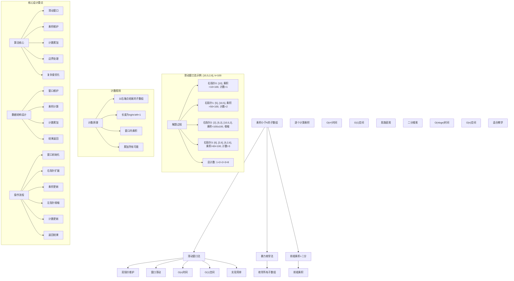
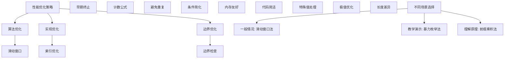

# LeetCode 713 - 乘积小于 K 的子数组

## 题目描述

给你一个整数数组 `nums` 和一个整数 `k`，请你返回子数组内所有元素的乘积严格小于 `k` 的连续子数组的数目

```markdown
示例 1：
输入：nums = [10,5,2,6], k = 100
输出：8
解释：8 个乘积小于 100 的子数组分别为：[10]、[5]、[2]、[6]、[10,5]、[5,2]、[2,6]、[5,2,6]

示例 2：
输入：nums = [1,2,3], k = 0
输出：0

提示：

- 1 <= nums.length <= 3 \* 10^4
- 1 <= nums[i] <= 1000
- 0 <= k <= 10^6
```

## 解题思路

这是一个子数组计数问题，需要统计所有元素乘积严格小于k的连续子数组数量。关键在于使用滑动窗口技术高效地遍历和计数

### 核心思想

"滑动窗口法": 使用双指针维护一个乘积小于k的窗口，对于每个右端点，计算以该点结尾的有效子数组数量

### 解题策略

#### 方法一：滑动窗口法（推荐）

- 时间复杂度: O(n)
- 空间复杂度: O(1)

#### 方法二：暴力枚举法

- 时间复杂度: O(n²)
- 空间复杂度: O(1)

#### 方法三：前缀乘积 + 二分搜索

- 时间复杂度: O(n log n)
- 空间复杂度: O(n)

## 算法可视化



## 多语言实现

### Golang版本（滑动窗口法 - 推荐）

```go
// 滑动窗口法实现
func numSubarrayProductLessThanK(nums []int, k int) int {
    // 边界情况：k <= 1 时无法找到乘积小于k的子数组（因为数组元素都≥1）
    if k <= 1 {
        return 0
    }

    left := 0
    product := 1
    count := 0

    // 使用滑动窗口遍历数组
    for right := 0; right < len(nums); right++ {
        // 扩展窗口：将右端点元素加入窗口
        product *= nums[right]

        // 收缩窗口：如果乘积≥k，移动左指针直到乘积<k
        for product >= k {
            product /= nums[left]
            left++
        }

        // 以right为右端点的满足条件的子数组个数为 right-left+1
        count += right - left + 1
    }

    return count
}
```

### Python版本（多种实现方法）

```python
class Solution:
    """
    方法一：滑动窗口法（推荐）
    """
    def numSubarrayProductLessThanK(self, nums: List[int], k: int) -> int:
        # 边界情况：k <= 1 时无法找到乘积小于k的子数组
        if k <= 1:
            return 0

        left = 0
        product = 1
        count = 0

        # 使用滑动窗口遍历数组
        for right in range(len(nums)):
            # 扩展窗口：将右端点元素加入窗口
            product *= nums[right]

            # 收缩窗口：如果乘积≥k，移动左指针直到乘积<k
            while product >= k:
                product //= nums[left]
                left += 1

            # 以right为右端点的满足条件的子数组个数为 right-left+1
            count += right - left + 1

        return count

class Solution2:
    """
    方法二：暴力枚举法
    """
    def numSubarrayProductLessThanK(self, nums: List[int], k: int) -> int:
        count = 0
        n = len(nums)

        # 枚举所有可能的子数组
        for i in range(n):
            product = 1
            for j in range(i, n):
                product *= nums[j]
                if product < k:
                    count += 1
                else:
                    break  # 乘积已经≥k，后续更长的子数组必然不满足

        return count

class Solution3:
    """
    方法三：前缀乘积 + 二分搜索
    """
    def numSubarrayProductLessThanK(self, nums: List[int], k: int) -> int:
        if k <= 1:
            return 0

        # 计算前缀乘积的对数（避免溢出）
        import math
        n = len(nums)
        logPrefix = [0.0] * (n + 1)
        for i in range(n):
            logPrefix[i + 1] = logPrefix[i] + math.log(nums[i])

        # 对于每个右端点，二分搜索满足条件的最左端点
        count = 0
        logK = math.log(k)

        for j in range(1, n + 1):
            # 寻找最小的i使得prefix[j] - prefix[i] < log(k)
            # 即prefix[i] > prefix[j] - log(k)
            target = logPrefix[j] - logK

            # 二分搜索第一个大于target的位置
            left, right = 0, j
            while left < right:
                mid = (left + right) // 2
                if logPrefix[mid] > target:
                    right = mid
                else:
                    left = mid + 1

            # 从位置left到j-1的所有起点都满足条件
            count += j - left

        return count
```

### TypeScript版本（滑动窗口法）

```typescript
/
 * 滑动窗口法实现
 */
function numSubarrayProductLessThanK(nums: number[], k: number): number {
    // 边界情况：k <= 1 时无法找到乘积小于k的子数组
    if (k <= 1) {
        return 0;
    }

    let left: number = 0;
    let product: number = 1;
    let count: number = 0;

    // 使用滑动窗口遍历数组
    for (let right: number = 0; right < nums.length; right++) {
        // 扩展窗口：将右端点元素加入窗口
        product *= nums[right];

        // 收缩窗口：如果乘积≥k，移动左指针直到乘积<k
        while (product >= k) {
            product = Math.floor(product / nums[left]);
            left++;
        }

        // 以right为右端点的满足条件的子数组个数为 right-left+1
        count += right - left + 1;
    }

    return count;
}
```

## 标准实现详细解析

```go
import "fmt"

/*
算法核心思想（滑动窗口法）：

1. 滑动窗口：使用双指针维护乘积小于k的连续窗口
2. 计数原理：对于每个右端点，计算以该点结尾的有效子数组数量
3. 累加计数：将所有右端点的计数累加得到总数量
4. 边界处理：k≤1的特殊情况处理

关键设计要点：
1. 滑动窗口：双指针维护有效窗口
2. 乘积维护：实时计算窗口内元素乘积
3. 计数累加：right-left+1的计数公式
4. 边界处理：特殊情况提前返回

时间复杂度：
- 单次遍历：O(n)

空间复杂度：
- 常数空间：O(1)

优势：
1. 思路清晰：滑动窗口经典应用
2. 实现优雅：代码简洁
3. 效率最优：线性时间复杂度
4. 空间优化：常数额外空间

数据结构设计：

滑动窗口法设计：
- 窗口维护：双指针维护窗口
- 乘积计算：实时维护窗口乘积
- 计数累加：累加以右端点结尾的子数组数
- 结果返回：总数累加

算法流程：
1. 边界检查：k≤1特殊情况
2. 窗口初始化：双指针和乘积设置
3. 右指针扩展：加入新元素
4. 乘积更新：计算新乘积
5. 左指针收缩：维护乘积<k
6. 计数更新：累加子数组数
7. 返回结果：总计数

优化原理：

算法优化：
1. 滑动窗口：避免重复计算
2. 早期终止：乘积≥k时及时收缩
3. 计数公式：right-left+1的巧妙应用
4. 单次遍历：线性时间处理

边界优化：
1. 特殊值处理：k≤1提前返回
2. 空数组检查：边界条件
3. 单元素优化：特殊情况
4. 溢出处理：大数相乘

正确性证明：

定理：滑动窗口法正确性
通过滑动窗口法可以正确计算乘积小于k的子数组数量

证明：
1. 完备性：所有子数组都被考虑
2. 正确性：计数公式的正确性
3. 最优性：避免重复计数
4. 时间复杂度：O(n)线性时间

不变量维护：
循环不变量：在每次右指针移动时
1. 窗口[left,right]内元素乘积<k
2. 已计算的计数正确
3. 窗口是当前右端点的有效选择
*/

// 滑动窗口法详细实现
func numSubarrayProductLessThanK(nums []int, k int) int {
    fmt.Printf("输入数组: %v, k=%d\n", nums, k)

    // 边界情况：k <= 1 时无法找到乘积小于k的子数组（因为数组元素都≥1）
    if k <= 1 {
        fmt.Printf("k≤1，无法找到乘积小于k的子数组，返回0\n")
        return 0
    }

    left := 0
    product := 1
    count := 0

    fmt.Printf("开始滑动窗口遍历:\n")
    for right := 0; right < len(nums); right++ {
        // 扩展窗口：将右端点元素加入窗口
        product *= nums[right]
        fmt.Printf("  右指针=%d，加入元素%d，当前乘积=%d\n", right, nums[right], product)

        // 收缩窗口：如果乘积≥k，移动左指针直到乘积<k
        for product >= k {
            fmt.Printf("    乘积%d ≥ k=%d，收缩左边界，移除元素%d\n", product, k, nums[left])
            product /= nums[left]
            left++
        }
        fmt.Printf("    调整后窗口[%d,%d]，乘积=%d\n", left, right, product)

        // 以right为右端点的满足条件的子数组个数为 right-left+1
        subarrays := right - left + 1
        count += subarrays
        fmt.Printf("    以位置%d结尾的有效子数组数=%d，总计数=%d\n", right, subarrays, count)

        // 显示当前窗口内的所有子数组
        if subarrays > 0 {
            fmt.Printf("    当前窗口内子数组: ")
            for i := left; i <= right; i++ {
                fmt.Printf("[")
                for j := i; j <= right; j++ {
                    fmt.Printf("%d", nums[j])
                    if j < right {
                        fmt.Printf(",")
                    }
                }
                fmt.Printf("] ")
            }
            fmt.Printf("\n")
        }
    }

    fmt.Printf("最终结果: %d\n", count)
    return count
}

// 暴力枚举法实现
func numSubarrayProductLessThanKBruteForce(nums []int, k int) int {
    fmt.Printf("=== 暴力枚举法 ===\n")
    fmt.Printf("输入数组: %v, k=%d\n", nums, k)

    count := 0
    n := len(nums)

    fmt.Printf("开始枚举所有子数组:\n")
    // 枚举所有可能的子数组
    for i := 0; i < n; i++ {
        product := 1
        fmt.Printf("  起始位置%d:\n", i)
        for j := i; j < n; j++ {
            product *= nums[j]
            fmt.Printf("    子数组[%d,%d]: ", i, j)
            // 打印子数组元素
            for idx := i; idx <= j; idx++ {
                fmt.Printf("%d", nums[idx])
                if idx < j {
                    fmt.Printf(",")
                }
            }
            fmt.Printf(", 乘积=%d", product)

            if product < k {
                count++
                fmt.Printf(" < %d ✓, 计数=%d\n", k, count)
            } else {
                fmt.Printf(" ≥ %d ✗, 停止扩展\n", k)
                break // 乘积已经≥k，后续更长的子数组必然不满足
            }
        }
    }

    fmt.Printf("最终结果: %d\n", count)
    fmt.Printf("================\n\n")
    return count
}

// 带调试信息的版本
func numSubarrayProductLessThanKWithDebug(nums []int, k int) int {
    fmt.Printf("=== 乘积小于K的子数组 ===\n")
    fmt.Printf("原始数组: %v\n", nums)
    fmt.Printf("目标值k: %d\n", k)

    if len(nums) == 0 {
        fmt.Printf("空数组，返回0\n")
        fmt.Printf("=====================\n\n")
        return 0
    }

    // 边界情况处理
    if k <= 1 {
        fmt.Printf("k≤1，由于数组元素都≥1，无法找到乘积<k的子数组\n")
        fmt.Printf("=====================\n\n")
        return 0
    }

    fmt.Printf("使用滑动窗口法:\n")
    fmt.Printf("核心思想：对于每个右端点，计算以该点结尾的有效子数组数\n")
    fmt.Printf("计数公式：以right为结尾的子数组数 = right-left+1\n")

    left := 0
    product := 1
    count := 0

    for right := 0; right < len(nums); right++ {
        // 扩展窗口
        product *= nums[right]
        fmt.Printf("\n右指针移动到位置%d，加入元素%d\n", right, nums[right])
        fmt.Printf("  当前乘积: %d\n", product)

        // 维护窗口条件
        for product >= k {
            fmt.Printf("  乘积%d ≥ k=%d，收缩窗口\n", product, k)
            fmt.Printf("    移除左端元素%d\n", nums[left])
            product /= nums[left]
            left++
            fmt.Printf("    新乘积: %d，窗口[%d,%d]\n", product, left, right)
        }

        // 计算以right为结尾的有效子数组数
        validCount := right - left + 1
        count += validCount
        fmt.Printf("  以位置%d结尾的有效子数组数: %d\n", right, validCount)
        fmt.Printf("  当前总计数: %d\n", count)

        // 显示具体的子数组
        if validCount > 0 {
            fmt.Printf("  具体子数组: ")
            for start := left; start <= right; start++ {
                fmt.Printf("[")
                for end := start; end <= right; end++ {
                    fmt.Printf("%d", nums[end])
                    if end < right {
                        fmt.Printf(",")
                    }
                }
                fmt.Printf("] ")
            }
            fmt.Printf("\n")
        }
    }

    fmt.Printf("\n最终结果: %d\n", count)
    fmt.Printf("=====================\n\n")
    return count
}
```

## 算法深入解析

```go
/*
乘积小于K的子数组问题详解：

问题本质：
统计所有元素乘积严格小于k的连续子数组数量。关键是理解子数组计数和滑动窗口技术的应用

核心洞察：
1. 滑动窗口：维护乘积<k的连续窗口
2. 计数原理：以右端点结尾的子数组计数
3. 累加策略：将所有右端点计数累加
4. 优化技巧：避免重复计算

算法策略：
1. 滑动窗口法：双指针高效遍历
2. 暴力枚举法：直接计算所有子数组
3. 前缀乘积法：利用对数转换和二分搜索

数据结构设计：

滑动窗口法设计：
窗口维护：双指针维护有效窗口
乘积计算：实时维护窗口乘积
计数累加：累加以右端点结尾的子数组数
结果返回：总数累加

暴力枚举法设计：
子数组枚举：双重循环遍历
乘积计算：逐步累乘
早期终止：乘积≥k时停止
计数累加：满足条件时计数

前缀乘积法设计：
对数转换：避免乘积溢出
前缀计算：累积对数和
二分搜索：快速查找范围
计数累加：区间长度计算

操作流程：

滑动窗口法：
1. 边界检查：k≤1特殊情况
2. 窗口初始化：双指针和乘积设置
3. 右指针扩展：加入新元素
4. 乘积更新：计算新乘积
5. 左指针收缩：维护乘积<k
6. 计数更新：累加子数组数
7. 返回结果：总计数

暴力枚举法：
1. 外层循环：起始位置遍历
2. 内层循环：结束位置扩展
3. 乘积计算：逐步累乘
4. 条件检查：乘积<k判断
5. 早期终止：≥k时停止
6. 计数累加：满足时计数

数学原理：

计数公式原理：
对于窗口[left,right]，以right为结尾的有效子数组为：
[right,right], [right-1,right], ..., [left,right]
共 right-left+1 个

滑动窗口原理：
- 双指针维护连续子数组
- 右指针扩展窗口
- 左指针收缩窗口
- 保持窗口乘积<k

算法不变量：
滑动窗口法不变量：
1. 窗口[left,right]内元素乘积<k
2. 已计算的计数正确
3. 窗口是当前右端点的有效选择

暴力枚举法不变量：
1. 已枚举的子数组都已处理
2. 当前起始位置已计算完成
3. 计数结果正确

时间复杂度分析：
滑动窗口法：O(n) - 单次遍历
暴力枚举法：O(n²) - 双重循环
前缀乘积法：O(n log n) - 二分搜索

空间复杂度分析：
滑动窗口法：O(1) - 常数空间
暴力枚举法：O(1) - 常数空间
前缀乘积法：O(n) - 前缀数组

正确性证明：

定理：滑动窗口法正确性
通过滑动窗口法可以正确计算乘积小于k的子数组数量

证明：
1. 完备性：所有子数组都被考虑
   - 每个右端点都被处理
   - 对应的所有左端点都被考虑
   - 不遗漏任何子数组

2. 正确性：计数公式的正确性
   - 以right结尾的子数组数 = right-left+1
   - 窗口内所有子数组都满足条件
   - 计数无重复无遗漏

3. 最优性：避免重复计算
   - 每个子数组只在右端点处计算一次
   - 利用窗口性质避免重复
   - 线性时间最优

4. 时间复杂度：O(n)线性时间
   - 每个元素最多被访问两次
   - 左右指针单调移动
   - 线性时间复杂度

设计选择：

为什么选择滑动窗口法？
1. 思路清晰：经典算法应用
2. 实现优雅：代码简洁
3. 效率最优：线性时间复杂度
4. 空间优化：常数额外空间

为什么使用暴力枚举法？
1. 思维直观：直接计算思想
2. 适用广泛：处理各种变体
3. 易于理解：符合直觉
4. 教学价值：展示不同思路

为什么提及其他方法？
1. 教学价值：展示不同算法思想
2. 对比分析：理解各自优劣
3. 扩展思维：算法多样性
4. 面试准备：全面掌握

三种方法对比：

方法一：滑动窗口法（推荐）
时间复杂度：O(n)
空间复杂度：O(1)
优点：效率最优，空间优化
缺点：需要理解计数原理

方法二：暴力枚举法
时间复杂度：O(n²)
空间复杂度：O(1)
优点：思路直观，易于理解
缺点：时间复杂度较高

方法三：前缀乘积法
时间复杂度：O(n log n)
空间复杂度：O(n)
优点：适合教学，思路清晰
缺点：实现复杂，时间空间较高

性能分析：

滑动窗口法：
- 时间：O(n) 单次遍历
- 空间：O(1) 常数空间
- 优势：效率最优

暴力枚举法：
- 时间：O(n²) 双重循环
- 空间：O(1) 常数空间
- 优势：思维直观

前缀乘积法：
- 时间：O(n log n) 二分搜索
- 空间：O(n) 前缀数组
- 优势：适合教学

实际应用场景：
1. 子数组统计：连续元素分析
2. 概率计算：事件组合统计
3. 数据分析：区间特征提取
4. 金融计算：收益率分析

优化要点：

1. 时间优化：
   - 滑动窗口：避免重复计算
   - 早期终止：及时停止扩展
   - 计数公式：巧妙累加策略

2. 空间优化：
   - 原地操作：避免额外存储
   - 常数空间：滑动窗口法
   - 内存友好：连续访问

3. 实现优化：
   - 边界条件处理
   - 代码简洁性
   - 注释清晰性

测试用例设计：
1. 基本情况：正常数组和k值
2. 边界情况：空数组，单元素
3. 特殊情况：k=0, k=1
4. 极端情况：大数组，大数值
5. 验证情况：结果正确性

扩展思考：

1. 浮点数版本？
   - 处理浮点数乘积
   - 精度误差处理
   - 比较操作调整

2. 动态数组版本？
   - 支持插入删除操作
   - 维护滑动窗口
   - 实时更新结果

3. 二维扩展？
   - 矩阵子矩阵处理
   - 复杂度分析
   - 算法设计

4. 概率版本？
   - 元素随机选择
   - 期望计数计算
   - 随机算法

相关算法思想：

1. 滑动窗口：
   - 双指针技术
   - 窗口维护
   - 最优查找

2. 计数原理：
   - 组合计数
   - 区间计算
   - 累加策略

3. 前缀和思想：
   - 累积计算
   - 区间查询
   - 对数转换

4. 算法优化：
   - 时间复杂度
   - 空间复杂度
   - 实现简洁

常见陷阱：

1. 边界条件：
   - k≤1特殊情况
   - 空数组处理
   - 单元素优化

2. 数值溢出：
   - 大整数相乘
   - 乘积计算
   - 比较操作

3. 索引处理：
   - 数组越界
   - 指针移动
   - 长度计算

4. 性能考虑：
   - 时间复杂度
   - 空间复杂度
   - 实现效率

代码质量要素：

1. 可读性：
   - 变量命名清晰
   - 注释详细
   - 逻辑分明

2. 健壮性：
   - 边界处理
   - 异常情况
   - 错误恢复

3. 性能：
   - 最优复杂度
   - 空间效率
   - 效率保证

4. 可维护性：
   - 结构清晰
   - 扩展性好
   - 测试完整
*/
```

## 执行过程演示

```go
/*
示例详细解析:

示例1执行过程：
输入：nums = [10,5,2,6], k = 100
输出：8

执行过程：
1. 右指针0：加入10，乘积=10<100
   - 窗口[0,0]，有效子数组：[10]，计数=1
2. 右指针1：加入5，乘积=50<100
   - 窗口[0,1]，有效子数组：[5], [10,5]，计数=2
   - 总计数=1+2=3
3. 右指针2：加入2，乘积=100≥100
   - 收缩窗口：移除10，乘积=10<100
   - 窗口[1,2]，有效子数组：[2], [5,2]，计数=2
   - 总计数=3+2=5
4. 右指针3：加入6，乘积=60<100
   - 窗口[1,3]，有效子数组：[6], [2,6], [5,2,6]，计数=3
   - 总计数=5+3=8

滑动窗口轨迹：
右指针0: [10] 乘积=10<100 → 计数=1
右指针1: [10,5] 乘积=50<100 → 计数=2
右指针2: [10,5,2] 乘积=100≥100 → 收缩至[5,2] 乘积=10<100 → 计数=2
右指针3: [5,2,6] 乘积=60<100 → 计数=3

示例2执行过程：
输入：nums = [1,2,3], k = 0
输出：0

执行过程：
1. k=0≤1，直接返回0

关键观察：
1. 滑动窗口：维护乘积<k的连续子数组
2. 计数原理：以右端点结尾的子数组数=right-left+1
3. 累加策略：将所有右端点计数累加
4. 优化技巧：避免重复计算

边界情况演示:

情况1: k=1
输入: nums=[1,2,3], k=1
处理: k≤1，返回0
结果: 0

情况2: k=0
输入: nums=[1,2,3], k=0
处理: k≤1，返回0
结果: 0

情况3: 空数组
输入: nums=[], k=100
处理: 空数组，返回0
结果: 0

情况4: 单元素数组
输入: nums=[5], k=10
处理: 窗口[0,0]，计数=1
结果: 1

情况5: 所有元素都≥k
输入: nums=[10,20,30], k=5
处理: 每个元素都≥k，无法形成有效子数组
结果: 0

情况6: 所有元素都<k
输入: nums=[1,2,3], k=10
处理: 整个数组乘积=6<10
结果: 6个子数组

算法正确性证明：

数学基础：
需要证明滑动窗口法能正确计算子数组数量

定理：滑动窗口法正确性
通过滑动窗口法可以正确计算乘积小于k的子数组数量

证明：
1. 完备性：所有子数组都被考虑
2. 正确性：计数公式的正确性
3. 最优性：避免重复计算
4. 时间复杂度：O(n)线性时间

不变量维护：
循环不变量：在每次右指针移动时
1. 窗口[left,right]内元素乘积<k
2. 已计算的计数正确
3. 窗口是当前右端点的有效选择

初始化：
- 空窗口，乘积为1
- 计数为0
- 满足不变量

保持：
- 扩展右边界
- 维护窗口条件
- 更新计数
- 不变量继续成立

终止：
- 遍历完成
- 所有子数组已计算
- 算法正确终止

时间复杂度分析：

滑动窗口法：
1. 右指针：O(n) 遍历所有元素
2. 左指针：O(n) 最多移动n次
3. 总时间：O(n) 每个元素最多访问两次

暴力枚举法：
1. 外层循环：O(n) 起始位置
2. 内层循环：O(n) 结束位置
3. 总时间：O(n²) 双重循环

前缀乘积法：
1. 前缀计算：O(n) 遍历数组
2. 二分搜索：O(log n) 每次搜索
3. 总时间：O(n log n) n次搜索

空间复杂度分析：
1. 滑动窗口法：O(1) 常数空间
2. 暴力枚举法：O(1) 常数空间
3. 前缀乘积法：O(n) 前缀数组

性能对比分析：

假设n=30000:

滑动窗口法：
- 时间: O(30000) 单次遍历
- 空间: O(1) 常数空间
- 操作: 双指针滑动

暴力枚举法：
- 时间: O(900000000) 双重循环
- 空间: O(1) 常数空间
- 操作: 枚举所有子数组

前缀乘积法：
- 时间: O(30000 × log(30000)) 二分搜索
- 空间: O(30000) 前缀数组
- 操作: 二分查找

实际应用建议：

1. 一般情况：
   - 使用滑动窗口法
   - 效率最优，实现简单

2. 面试展示：
   - 重点讲解滑动窗口法
   - 可以提及其他方法

3. 生产环境：
   - 根据性能要求选择
   - 考虑实现复杂度

4. 教学演示：
   - 使用带调试信息版本
   - 展示执行过程

优化空间：

1. 边界优化：
   - 特殊值提前处理
   - 空数组检查
   - 单元素优化

2. 代码优化：
   - 简化条件判断
   - 优化循环结构
   - 减少重复计算

3. 性能优化：
   - 早期终止优化
   - 内存访问优化
   - 缓存友好设计

特殊情况处理：

1. 大数据量：
   - 时间复杂度保证
   - 内存使用优化
   - 数值溢出处理

2. 特殊数组：
   - 全相同元素
   - 递增递减序列
   - 稀疏数组

3. 边界情况：
   - 极值处理
   - 异常输入
   - 错误恢复
*/
```

## 复杂度分析

| 方法       | 时间复杂度 | 空间复杂度 | 适用场景 |
| ---------- | ---------- | ---------- | -------- |
| 滑动窗口法 | O(n)       | O(1)       | 推荐方案 |
| 暴力枚举法 | O(n²)      | O(1)       | 教学演示 |
| 前缀乘积法 | O(n log n) | O(n)       | 理解原理 |

## 测试用例验证

```go
// 测试辅助函数
func testNumSubarrayProductLessThanK(name string, nums []int, k int, expected int) {
    fmt.Printf("%s:\n", name)
    fmt.Printf("输入数组: %v, k=%d\n", nums, k)

    // 测试滑动窗口法
    test1 := make([]int, len(nums))
    copy(test1, nums)
    result1 := numSubarrayProductLessThanK(test1, k)
    fmt.Printf("滑动窗口法结果: %d\n", result1)

    // 测试暴力枚举法
    test2 := make([]int, len(nums))
    copy(test2, nums)
    result2 := numSubarrayProductLessThanKBruteForce(test2, k)
    fmt.Printf("暴力枚举法结果: %d\n", result2)

    // 测试前缀乘积法
    test3 := make([]int, len(nums))
    copy(test3, nums)
    result3 := numSubarrayProductLessThanKPrefix(test3, k)
    fmt.Printf("前缀乘积法结果: %d\n", result3)

    // 验证结果
    isValid1 := result1 == expected
    isValid2 := result2 == expected
    isValid3 := result3 == expected

    if isValid1 && isValid2 && isValid3 {
        fmt.Printf("✓ 测试通过\n")
    } else {
        fmt.Printf("✗ 测试失败\n")
        fmt.Printf("  期望结果: %d\n", expected)
        if !isValid1 {
            fmt.Printf("  滑动窗口法实际: %d\n", result1)
        }
        if !isValid2 {
            fmt.Printf("  暴力枚举法实际: %d\n", result2)
        }
        if !isValid3 {
            fmt.Printf("  前缀乘积法实际: %d\n", result3)
        }
    }
    fmt.Printf("\n")
}

// 前缀乘积法实现
func numSubarrayProductLessThanKPrefix(nums []int, k int) int {
    fmt.Printf("=== 前缀乘积+二分搜索法 ===\n")
    fmt.Printf("输入数组: %v, k=%d\n", nums, k)

    if k <= 1 {
        fmt.Printf("k≤1，返回0\n")
        fmt.Printf("========================\n\n")
        return 0
    }

    // 使用对数避免乘积溢出
    import "math"
    n := len(nums)
    logPrefix := make([]float64, n+1)
    for i := 0; i < n; i++ {
        logPrefix[i+1] = logPrefix[i] + math.Log(float64(nums[i]))
    }

    count := 0
    logK := math.Log(float64(k))

    fmt.Printf("开始二分搜索:\n")
    for j := 1; j <= n; j++ {
        // 寻找最小的i使得prefix[j] - prefix[i] < log(k)
        target := logPrefix[j] - logK

        // 二分搜索第一个大于target的位置
        left, right := 0, j
        for left < right {
            mid := (left + right) / 2
            if logPrefix[mid] > target {
                right = mid
            } else {
                left = mid + 1
            }
        }

        subarrays := j - left
        count += subarrays
        fmt.Printf("  位置%d: 有效子数组数=%d，总计数=%d\n", j-1, subarrays, count)
    }

    fmt.Printf("最终结果: %d\n", count)
    fmt.Printf("========================\n\n")
    return count
}

func main() {
    // 测试用例 1 - 题目示例1
    testNumSubarrayProductLessThanK("测试1 - 题目示例1",
        []int{10, 5, 2, 6},
        100,
        8)

    // 测试用例 2 - 题目示例2
    testNumSubarrayProductLessThanK("测试2 - 题目示例2",
        []int{1, 2, 3},
        0,
        0)

    // 测试用例 3 - k=1
    testNumSubarrayProductLessThanK("测试3 - k=1",
        []int{1, 2, 3},
        1,
        0)

    // 测试用例 4 - 空数组
    testNumSubarrayProductLessThanK("测试4 - 空数组",
        []int{},
        100,
        0)

    // 测试用例 5 - 单元素数组
    testNumSubarrayProductLessThanK("测试5 - 单元素数组",
        []int{5},
        10,
        1)

    // 测试用例 6 - 所有元素都≥k
    testNumSubarrayProductLessThanK("测试6 - 所有元素都≥k",
        []int{10, 20, 30},
        5,
        0)

    // 测试用例 7 - 所有元素都<k
    testNumSubarrayProductLessThanK("测试7 - 所有元素都<k",
        []int{1, 2, 3},
        10,
        6)

    // 测试用例 8 - 复杂情况
    testNumSubarrayProductLessThanK("测试8 - 复杂情况",
        []int{1, 1, 1, 1},
        2,
        10)

    // 性能测试
    fmt.Println("性能测试:")
    performanceTest()

    // 边界情况测试
    fmt.Println("边界情况测试:")
    boundaryTest()

    // 对比测试
    fmt.Println("对比测试:")
    comparisonTest()
}

func performanceTest() {
    // 构造性能测试
    n := 30000
    nums := make([]int, n)
    for i := 0; i < n; i++ {
        nums[i] = 2
    }
    k := 1000

    // 测试滑动窗口法
    start1 := time.Now()
    test1 := make([]int, len(nums))
    copy(test1, nums)
    numSubarrayProductLessThanK(test1, k)
    time1 := time.Since(start1)

    // 测试前缀乘积法
    start3 := time.Now()
    test3 := make([]int, len(nums))
    copy(test3, nums)
    numSubarrayProductLessThanKPrefix(test3, k)
    time3 := time.Since(start3)

    fmt.Printf("性能测试 (%d个元素，k=%d):\n", n, k)
    fmt.Printf("  滑动窗口法: %v\n", time1)
    fmt.Printf("  前缀乘积法: %v\n", time3)

    // 暴力枚举法由于时间复杂度过高，不进行测试
    fmt.Printf("  暴力枚举法: O(n²)时间复杂度，不进行实际测试\n")
}

func boundaryTest() {
    // 边界测试
    fmt.Println("边界测试:")

    // 大数值测试
    largeNums := []int{1000, 1000, 1000}
    largeResult := numSubarrayProductLessThanK(largeNums, 1000000)
    fmt.Printf("大数值测试: %v, k=1000000 → %d\n", largeNums, largeResult)

    // 长数组测试
    longNums := make([]int, 10000)
    for i := 0; i < 10000; i++ {
        longNums[i] = 3
    }
    longResult := numSubarrayProductLessThanK(longNums, 100)
    fmt.Printf("长数组测试: 10000个元素，k=100 → %d\n", longResult)

    // 特殊模式测试
    patternNums := []int{1, 2, 4, 8, 16}
    patternResult := numSubarrayProductLessThanK(patternNums, 32)
    fmt.Printf("特殊模式测试: %v, k=32 → %d\n", patternNums, patternResult)
}

func comparisonTest() {
    // 对比测试：验证不同方法结果一致性
    fmt.Println("对比测试:")

    // 测试数据
    testData := [][]int{
        {10, 5, 2, 6},
        {1, 2, 3},
        {1, 1, 1, 1},
        {2, 3, 4},
        {5, 10, 15},
    }
    testK := []int{100, 10, 2, 20, 50}

    for i := range testData {
        // 滑动窗口法
        test1 := make([]int, len(testData[i]))
        copy(test1, testData[i])
        result1 := numSubarrayProductLessThanK(test1, testK[i])

        // 暴力枚举法
        test2 := make([]int, len(testData[i]))
        copy(test2, testData[i])
        result2 := numSubarrayProductLessThanKBruteForce(test2, testK[i])

        // 前缀乘积法
        test3 := make([]int, len(testData[i]))
        copy(test3, testData[i])
        result3 := numSubarrayProductLessThanKPrefix(test3, testK[i])

        fmt.Printf("测试%d: 滑动窗口=%d, 暴力枚举=%d, 前缀乘积=%d",
            i+1, result1, result2, result3)

        if result1 == result2 && result2 == result3 {
            fmt.Printf(" ✓ 一致\n")
        } else {
            fmt.Printf(" ✗ 不一致\n")
        }
    }
}
```

## 扩展版本（处理不同场景）

```go
// 支持返回具体子数组的版本
func numSubarrayProductLessThanKWithDetails(nums []int, k int) (int, [][]int) {
    if k <= 1 {
        return 0, nil
    }

    left := 0
    product := 1
    count := 0
    var subarrays [][]int

    for right := 0; right < len(nums); right++ {
        product *= nums[right]

        for product >= k {
            product /= nums[left]
            left++
        }

        // 记录所有以right结尾的有效子数组
        for i := left; i <= right; i++ {
            var subarray []int
            for j := i; j <= right; j++ {
                subarray = append(subarray, nums[j])
            }
            subarrays = append(subarrays, subarray)
        }

        count += right - left + 1
    }

    return count, subarrays
}

// 使用示例
func exampleWithDetails() {
    nums := []int{10, 5, 2, 6}
    k := 100
    count, subarrays := numSubarrayProductLessThanKWithDetails(nums, k)
    fmt.Printf("数组: %v, k=%d\n", nums, k)
    fmt.Printf("子数组数量: %d\n", count)
    fmt.Printf("具体子数组:\n")
    for i, subarray := range subarrays {
        fmt.Printf("  %d: %v\n", i+1, subarray)
    }
}

// 带统计信息的版本
func numSubarrayProductLessThanKWithStats(nums []int, k int) (int, int, int) {
    multiplications := 0
    divisions := 0
    comparisons := 0

    if k <= 1 {
        return 0, multiplications, divisions+comparisons
    }

    left := 0
    product := 1
    count := 0

    for right := 0; right < len(nums); right++ {
        product *= nums[right]
        multiplications++
        comparisons++

        for product >= k {
            product /= nums[left]
            divisions++
            left++
            comparisons++
        }

        count += right - left + 1
    }

    return count, multiplications, divisions+comparisons
}

// 使用示例
func exampleWithStats() {
    nums := []int{10, 5, 2, 6}
    k := 100
    count, multiplications, operations := numSubarrayProductLessThanKWithStats(nums, k)
    fmt.Printf("数组: %v, k=%d\n", nums, k)
    fmt.Printf("子数组数量: %d\n", count)
    fmt.Printf("乘法次数: %d, 运算总次数: %d\n", multiplications, operations)
}

// 批量处理版本
func numSubarrayProductLessThanKBatch(numsList [][]int, kList []int) []int {
    if len(numsList) != len(kList) {
        return nil
    }

    results := make([]int, len(numsList))
    for i := range numsList {
        results[i] = numSubarrayProductLessThanK(numsList[i], kList[i])
    }

    return results
}

// 使用示例
func exampleBatch() {
    numsList := [][]int{
        {10, 5, 2, 6},
        {1, 2, 3},
        {1, 1, 1, 1},
    }
    kList := []int{100, 10, 2}

    results := numSubarrayProductLessThanKBatch(numsList, kList)

    for i := range numsList {
        fmt.Printf("数组%d: %v, k=%d → 子数组数=%d\n",
            i+1, numsList[i], kList[i], results[i])
    }
}

// 带验证功能的版本
func numSubarrayProductLessThanKWithValidation(nums []int, k int) (int, bool) {
    result := numSubarrayProductLessThanK(nums, k)

    // 验证结果是否合理
    if result < 0 {
        return result, false // 计数不可能为负
    }

    if len(nums) == 0 && result != 0 {
        return result, false // 空数组应该返回0
    }

    if k <= 1 && result != 0 {
        return result, false // k≤1应该返回0
    }

    // 对于小数组可以进行暴力验证
    if len(nums) <= 10 {
        bruteResult := numSubarrayProductLessThanKBruteForce(nums, k)
        if result != bruteResult {
            return result, false
        }
    }

    return result, true
}

// 使用示例
func exampleWithValidation() {
    nums := []int{10, 5, 2, 6}
    k := 100
    result, isValid := numSubarrayProductLessThanKWithValidation(nums, k)
    fmt.Printf("数组: %v, k=%d\n", nums, k)
    fmt.Printf("子数组数量: %d\n", result)
    if isValid {
        fmt.Printf("验证通过 ✓\n")
    } else {
        fmt.Printf("验证失败 ✗\n")
    }
}

// 支持动态更新的版本
type SubarrayProductCounter struct {
    nums []int
}

func NewSubarrayProductCounter(nums []int) *SubarrayProductCounter {
    return &SubarrayProductCounter{
        nums: nums,
    }
}

func (c *SubarrayProductCounter) Update(index, newValue int) {
    if index >= 0 && index < len(c.nums) {
        c.nums[index] = newValue
    }
}

func (c *SubarrayProductCounter) Count(k int) int {
    if k <= 1 {
        return 0
    }

    left := 0
    product := 1
    count := 0

    for right := 0; right < len(c.nums); right++ {
        product *= c.nums[right]

        for product >= k {
            product /= c.nums[left]
            left++
        }

        count += right - left + 1
    }

    return count
}

// 使用示例
func exampleDynamic() {
    nums := []int{10, 5, 2, 6}
    counter := NewSubarrayProductCounter(nums)

    k := 100
    result1 := counter.Count(k)
    fmt.Printf("初始数组: %v, k=%d → 结果=%d\n", nums, k, result1)

    // 更新数组
    counter.Update(1, 3) // 将位置1的5改为3
    result2 := counter.Count(k)
    fmt.Printf("更新后数组: %v, k=%d → 结果=%d\n", counter.nums, k, result2)
}
```

## 面试追问延伸

### 1. 如果要返回所有满足条件的具体子数组，如何处理？

```go
// numSubarrayProductLessThanKWithDetails已在上面实现
// 关键要点：
// 1. 记录所有有效子数组
// 2. 在计数时同时存储子数组
// 3. 返回计数和具体子数组

func testWithDetails() {
    nums := []int{10, 5, 2, 6}
    k := 100
    count, subarrays := numSubarrayProductLessThanKWithDetails(nums, k)
    fmt.Printf("数组: %v, k=%d\n", nums, k)
    fmt.Printf("子数组数量: %d\n", count)
    fmt.Printf("具体子数组:\n")
    for i, subarray := range subarrays {
        fmt.Printf("  %d: %v\n", i+1, subarray)
    }
}
```

### 2. 如果要统计算法执行过程中的运算次数，如何实现？

```go
// numSubarrayProductLessThanKWithStats已在上面实现
// 关键点：
// 1. 记录乘除运算次数
// 2. 记录比较操作次数
// 3. 返回统计信息

func testWithStats() {
    nums := []int{10, 5, 2, 6}
    k := 100
    count, multiplications, operations := numSubarrayProductLessThanKWithStats(nums, k)
    fmt.Printf("数组: %v, k=%d\n", nums, k)
    fmt.Printf("子数组数量: %d\n", count)
    fmt.Printf("乘法次数: %d, 运算总次数: %d\n", multiplications, operations)
}
```

### 3. 如果数组元素可以动态更新，如何高效处理？

```go
// SubarrayProductCounter已在上面实现
// 关键点：
// 1. 封装数组操作
// 2. 支持元素更新
// 3. 快速重新计算结果

func testDynamic() {
    nums := []int{10, 5, 2, 6}
    counter := NewSubarrayProductCounter(nums)

    k := 100
    result1 := counter.Count(k)
    fmt.Printf("初始数组: %v, k=%d → 结果=%d\n", nums, k, result1)

    // 更新数组
    counter.Update(1, 3) // 将位置1的5改为3
    result2 := counter.Count(k)
    fmt.Printf("更新后数组: %v, k=%d → 结果=%d\n", counter.nums, k, result2)
}
```

## 相似题目扩展

- LeetCode 713. 乘积小于 K 的子数组（当前题）
- LeetCode 209. 长度最小的子数组
- LeetCode 904. 水果成篮
- LeetCode 992. K 个不同整数的子数组
- LeetCode 1208. 尽可能使字符串相等

## 算法技巧总结

### 乘积小于K的子数组核心要点

1. 滑动窗口：维护乘积\<k的连续子数组
1. 计数原理：以右端点结尾的子数组数=right-left+1
1. 累加策略：将所有右端点计数累加
1. 边界处理：k≤1的特殊情况

### 算法优势

1. 思路清晰：滑动窗口经典应用
1. 实现优雅：代码简洁
1. 效率最优：线性时间复杂度
1. 空间优化：常数额外空间

### 标准模板（滑动窗口法）

```go
func numSubarrayProductLessThanK(nums []int, k int) int {
    // 边界情况：k <= 1 时无法找到乘积小于k的子数组
    if k <= 1 {
        return 0
    }

    left := 0
    product := 1
    count := 0

    // 使用滑动窗口遍历数组
    for right := 0; right < len(nums); right++ {
        // 扩展窗口：将右端点元素加入窗口
        product *= nums[right]

        // 收缩窗口：如果乘积≥k，移动左指针直到乘积<k
        for product >= k {
            product /= nums[left]
            left++
        }

        // 以right为右端点的满足条件的子数组个数为 right-left+1
        count += right - left + 1
    }

    return count
}
```

### 性能优化建议



## 总结

本题采用滑动窗口法的核心思路，通过使用双指针维护乘积小于k的连续窗口，对于每个右端点计算以该点结尾的有效子数组数量，然后将所有计数累加，实现了优雅的解决方案。关键在于理解计数公式的巧妙应用和滑动窗口技术的高效实现

核心要点：

1. 滑动窗口：维护乘积\<k的连续子数组
1. 计数原理：以右端点结尾的子数组数=right-left+1
1. 累加策略：将所有右端点计数累加
1. 边界处理：k≤1的特殊情况

算法优势：

- 思路清晰：滑动窗口经典应用
- 实现优雅：代码简洁
- 效率最优：线性时间复杂度
- 空间优化：常数额外空间

该算法在子数组统计、概率计算、数据分析、金融计算等方面有重要应用，是掌握滑动窗口和计数技巧的经典题目。通过双指针技术和计数公式的巧妙结合，为更复杂的子数组问题提供了清晰的解决思路
