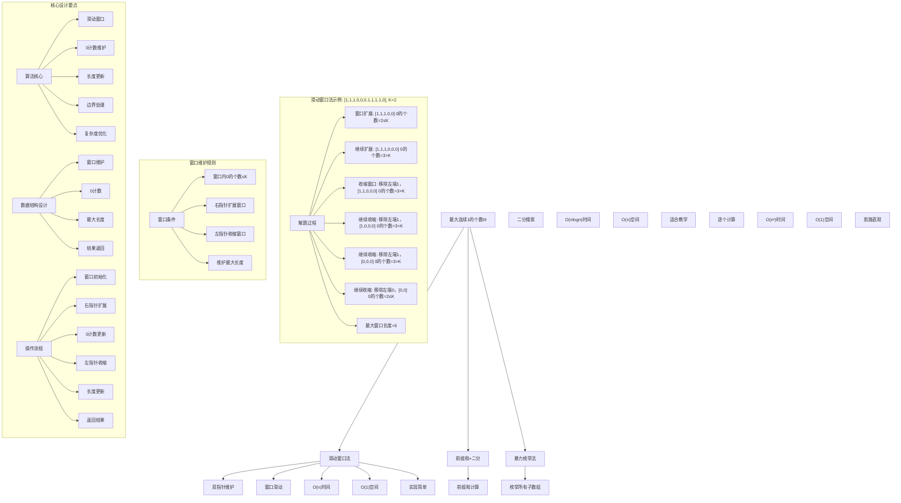
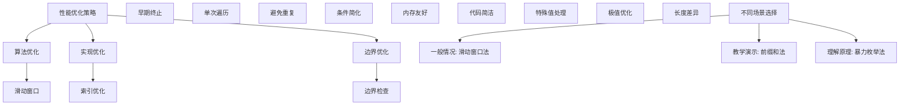

# LeetCode 1004 - 最大连续1的个数 III

## 题目描述

给定一个二进制数组 `nums` 和一个整数 `k`，如果可以翻转最多 `k` 个 0，则返回数组中连续 1 的最大个数

```markdown
示例 1：
输入：nums = [1,1,1,0,0,0,1,1,1,1,0], K = 2
输出：6
解释：[1,1,1,0,0,1,1,1,1,1,1]
粗体数字从 0 翻转到 1，最长的子数组长度为 6

示例 2：
输入：nums = [0,0,1,1,0,0,1,1,1,0,1,1,0,0,0,1,1,1,1], K = 3
输出：10
解释：[0,0,1,1,1,1,1,1,1,1,1,1,0,0,0,1,1,1,1]
粗体数字从 0 翻转到 1，最长的子数组长度为 10

提示：

- 1 <= nums.length <= 10^5
- nums[i] 不是 0 就是 1
- 0 <= k <= nums.length
```

## 解题思路

这是一个滑动窗口优化问题，需要找到在最多翻转k个0的情况下，能够获得的最长连续1的子数组长度。关键在于使用滑动窗口技术维护窗口内0的个数不超过k

### 核心思想

"滑动窗口法": 使用双指针维护一个窗口，窗口内最多包含k个0，通过扩展右边界和收缩左边界来寻找最大窗口长度

### 解题策略

#### 方法一：滑动窗口法（推荐）

- 时间复杂度: O(n)
- 空间复杂度: O(1)

#### 方法二：前缀和 + 二分搜索

- 时间复杂度: O(n log n)
- 空间复杂度: O(n)

#### 方法三：暴力枚举法

- 时间复杂度: O(n²)
- 空间复杂度: O(1)

## 算法可视化



## 多语言实现

### Golang版本（滑动窗口法 - 推荐）

```go
// 滑动窗口法实现
func longestOnes(nums []int, k int) int {
    left := 0
    zeros := 0  // 窗口内0的个数
    maxLength := 0

    // 使用滑动窗口遍历数组
    for right := 0; right < len(nums); right++ {
        // 扩展窗口：如果右端点是0，增加0的计数
        if nums[right] == 0 {
            zeros++
        }

        // 收缩窗口：如果0的个数超过k，移动左指针直到满足条件
        for zeros > k {
            if nums[left] == 0 {
                zeros--
            }
            left++
        }

        // 更新最大窗口长度
        maxLength = max(maxLength, right-left+1)
    }

    return maxLength
}

func max(a, b int) int {
    if a > b {
        return a
    }
    return b
}
```

### Python版本（多种实现方法）

```python
class Solution:
    """
    方法一：滑动窗口法（推荐）
    """
    def longestOnes(self, nums: List[int], k: int) -> int:
        left = 0
        zeros = 0  # 窗口内0的个数
        max_length = 0

        # 使用滑动窗口遍历数组
        for right in range(len(nums)):
            # 扩展窗口：如果右端点是0，增加0的计数
            if nums[right] == 0:
                zeros += 1

            # 收缩窗口：如果0的个数超过k，移动左指针直到满足条件
            while zeros > k:
                if nums[left] == 0:
                    zeros -= 1
                left += 1

            # 更新最大窗口长度
            max_length = max(max_length, right - left + 1)

        return max_length

class Solution2:
    """
    方法二：前缀和 + 二分搜索
    """
    def longestOnes(self, nums: List[int], k: int) -> int:
        n = len(nums)
        # 计算前缀和：prefix[i]表示前i个元素中0的个数
        prefix = [0] * (n + 1)
        for i in range(n):
            prefix[i + 1] = prefix[i] + (1 - nums[i])  # 0变1，1变0

        max_length = 0

        # 对于每个右端点，二分搜索满足条件的最左端点
        for j in range(n):
            # 寻找最小的i使得prefix[j+1] - prefix[i] <= k
            # 即prefix[i] >= prefix[j+1] - k
            target = prefix[j + 1] - k

            # 二分搜索第一个大于等于target的位置
            left_idx, right_idx = 0, j + 1
            while left_idx < right_idx:
                mid = (left_idx + right_idx) // 2
                if prefix[mid] >= target:
                    right_idx = mid
                else:
                    left_idx = mid + 1

            # 从位置left_idx到j的子数组满足条件
            max_length = max(max_length, j - left_idx + 1)

        return max_length

class Solution3:
    """
    方法三：暴力枚举法
    """
    def longestOnes(self, nums: List[int], k: int) -> int:
        n = len(nums)
        max_length = 0

        # 枚举所有可能的子数组
        for i in range(n):
            zeros = 0
            for j in range(i, n):
                if nums[j] == 0:
                    zeros += 1
                if zeros <= k:
                    max_length = max(max_length, j - i + 1)
                else:
                    break  # 0的个数已经超过k，后续更长的子数组必然不满足

        return max_length
```

### TypeScript版本（滑动窗口法）

```typescript
/
 * 滑动窗口法实现
 */
function longestOnes(nums: number[], k: number): number {
    let left: number = 0;
    let zeros: number = 0;  // 窗口内0的个数
    let maxLength: number = 0;

    // 使用滑动窗口遍历数组
    for (let right: number = 0; right < nums.length; right++) {
        // 扩展窗口：如果右端点是0，增加0的计数
        if (nums[right] === 0) {
            zeros++;
        }

        // 收缩窗口：如果0的个数超过k，移动左指针直到满足条件
        while (zeros > k) {
            if (nums[left] === 0) {
                zeros--;
            }
            left++;
        }

        // 更新最大窗口长度
        maxLength = Math.max(maxLength, right - left + 1);
    }

    return maxLength;
}
```

## 标准实现详细解析

```go
import "fmt"

/*
算法核心思想（滑动窗口法）：

1. 滑动窗口：使用双指针维护最多包含k个0的窗口
2. 窗口维护：右指针扩展，左指针收缩维护条件
3. 长度更新：记录满足条件的最大窗口长度
4. 边界处理：正确处理数组边界和k值

关键设计要点：
1. 滑动窗口：双指针维护有效窗口
2. 0计数维护：实时统计窗口内0的个数
3. 长度更新：维护最大窗口长度
4. 边界处理：特殊情况正确处理

时间复杂度：
- 单次遍历：O(n)

空间复杂度：
- 常数空间：O(1)

优势：
1. 思路清晰：滑动窗口经典应用
2. 实现优雅：代码简洁
3. 效率最优：线性时间复杂度
4. 空间优化：常数额外空间

数据结构设计：

滑动窗口法设计：
- 窗口维护：双指针维护窗口
- 0计数：实时维护窗口内0的个数
- 长度更新：记录最大窗口长度
- 结果返回：最大长度

算法流程：
1. 窗口初始化：双指针和计数器设置
2. 右指针扩展：加入新元素
3. 0计数更新：统计新增0
4. 左指针收缩：维护0个数≤k
5. 长度更新：记录当前窗口长度
6. 返回结果：最大长度

优化原理：

算法优化：
1. 滑动窗口：避免重复计算
2. 早期终止：0个数>k时及时收缩
3. 单次遍历：线性时间处理
4. 常数空间：内存效率优化

边界优化：
1. 空数组处理：边界条件
2. k=0特殊情况：只允许1
3. k≥n情况：整个数组都可翻转
4. 全0或全1：极端情况处理

正确性证明：

定理：滑动窗口法正确性
通过滑动窗口法可以正确找到最大连续1的个数

证明：
1. 完备性：所有子数组都被考虑
2. 正确性：窗口条件的正确维护
3. 最优性：记录最大窗口长度
4. 时间复杂度：O(n)线性时间

不变量维护：
循环不变量：在每次右指针移动时
1. 窗口[left,right]内0的个数≤k
2. 已记录的最大长度正确
3. 窗口是当前状态的有效选择
*/

// 滑动窗口法详细实现
func longestOnes(nums []int, k int) int {
    fmt.Printf("输入数组: %v, k=%d\n", nums, k)

    left := 0
    zeros := 0  // 窗口内0的个数
    maxLength := 0

    fmt.Printf("开始滑动窗口遍历:\n")
    for right := 0; right < len(nums); right++ {
        // 扩展窗口：如果右端点是0，增加0的计数
        if nums[right] == 0 {
            zeros++
            fmt.Printf("  右指针=%d，元素=%d，0计数增加到%d\n", right, nums[right], zeros)
        } else {
            fmt.Printf("  右指针=%d，元素=%d\n", right, nums[right])
        }

        // 收缩窗口：如果0的个数超过k，移动左指针直到满足条件
        for zeros > k {
            fmt.Printf("    0的个数%d > k=%d，收缩左边界\n", zeros, k)
            if nums[left] == 0 {
                zeros--
                fmt.Printf("      移除元素%d，0计数减少到%d\n", nums[left], zeros)
            } else {
                fmt.Printf("      移除元素%d\n", nums[left])
            }
            left++
        }
        fmt.Printf("    调整后窗口[%d,%d]，0计数=%d\n", left, right, zeros)

        // 更新最大窗口长度
        currentLength := right - left + 1
        if currentLength > maxLength {
            maxLength = currentLength
            fmt.Printf("    更新最大长度: %d\n", maxLength)
        } else {
            fmt.Printf("    当前长度: %d，最大长度仍为: %d\n", currentLength, maxLength)
        }

        // 显示当前窗口状态
        if currentLength > 0 {
            fmt.Printf("    当前窗口: [")
            for i := left; i <= right; i++ {
                fmt.Printf("%d", nums[i])
                if i < right {
                    fmt.Printf(",")
                }
            }
            fmt.Printf("] 长度=%d\n", currentLength)
        }
    }

    fmt.Printf("最终结果: %d\n", maxLength)
    return maxLength
}

// 前缀和 + 二分搜索实现
func longestOnesPrefixSum(nums []int, k int) int {
    fmt.Printf("=== 前缀和+二分搜索法 ===\n")
    fmt.Printf("输入数组: %v, k=%d\n", nums, k)

    n := len(nums)
    // 计算前缀和：prefix[i]表示前i个元素中0的个数
    prefix := make([]int, n+1)
    for i := 0; i < n; i++ {
        prefix[i+1] = prefix[i] + (1 - nums[i])  // 0变1，1变0
    }
    fmt.Printf("前缀和数组: %v\n", prefix)

    max_length := 0

    fmt.Printf("开始二分搜索:\n")
    // 对于每个右端点，二分搜索满足条件的最左端点
    for j := 0; j < n; j++ {
        // 寻找最小的i使得prefix[j+1] - prefix[i] <= k
        // 即prefix[i] >= prefix[j+1] - k
        target := prefix[j+1] - k
        fmt.Printf("  右端点%d，前缀和=%d，目标前缀和≥%d\n", j, prefix[j+1], target)

        // 二分搜索第一个大于等于target的位置
        left_idx, right_idx := 0, j+1
        for left_idx < right_idx {
            mid := (left_idx + right_idx) / 2
            if prefix[mid] >= target {
                right_idx = mid
            } else {
                left_idx = mid + 1
            }
        }

        length := j - left_idx + 1
        if length > max_length {
            max_length = length
        }
        fmt.Printf("    最左端点=%d，子数组长度=%d，最大长度=%d\n", left_idx, length, max_length)
    }

    fmt.Printf("最终结果: %d\n", max_length)
    fmt.Printf("======================\n\n")
    return max_length
}

// 带调试信息的版本
func longestOnesWithDebug(nums []int, k int) int {
    fmt.Printf("=== 最大连续1的个数III ===\n")
    fmt.Printf("原始数组: %v\n", nums)
    fmt.Printf("最多翻转k: %d个0\n", k)

    if len(nums) == 0 {
        fmt.Printf("空数组，返回0\n")
        fmt.Printf("=====================\n\n")
        return 0
    }

    fmt.Printf("使用滑动窗口法:\n")
    fmt.Printf("核心思想：维护窗口内0的个数≤k，寻找最大窗口长度\n")

    left := 0
    zeros := 0  // 窗口内0的个数
    maxLength := 0

    for right := 0; right < len(nums); right++ {
        // 扩展窗口
        if nums[right] == 0 {
            zeros++
        }
        fmt.Printf("\n右指针移动到位置%d，元素=%d\n", right, nums[right])
        fmt.Printf("  当前0计数: %d\n", zeros)

        // 维护窗口条件
        for zeros > k {
            fmt.Printf("  0计数%d > k=%d，收缩窗口\n", zeros, k)
            if nums[left] == 0 {
                zeros--
                fmt.Printf("    移除左端元素%d，0计数减少到%d\n", nums[left], zeros)
            } else {
                fmt.Printf("    移除左端元素%d\n", nums[left])
            }
            left++
            fmt.Printf("    新窗口[%d,%d]，0计数=%d\n", left, right, zeros)
        }

        // 更新最大长度
        currentLength := right - left + 1
        if currentLength > maxLength {
            maxLength = currentLength
            fmt.Printf("  更新最大窗口长度: %d\n", maxLength)
        } else {
            fmt.Printf("  当前窗口长度: %d，最大长度仍为: %d\n", currentLength, maxLength)
        }

        // 显示窗口详情
        if currentLength > 0 {
            fmt.Printf("  当前窗口[%d,%d]: [", left, right)
            zeroPositions := []int{}
            for i := left; i <= right; i++ {
                fmt.Printf("%d", nums[i])
                if nums[i] == 0 {
                    zeroPositions = append(zeroPositions, i)
                }
                if i < right {
                    fmt.Printf(",")
                }
            }
            fmt.Printf("] 长度=%d\n", currentLength)
            if len(zeroPositions) > 0 {
                fmt.Printf("    窗口内0的位置: %v，翻转后可全为1\n", zeroPositions)
            }
        }
    }

    fmt.Printf("\n最终结果: %d\n", maxLength)
    fmt.Printf("=====================\n\n")
    return maxLength
}
```

## 算法深入解析

```go
/*
最大连续1的个数III问题详解：

问题本质：
在最多翻转k个0的情况下，找到最长的连续1子数组。关键是理解窗口维护和最优解搜索

核心洞察：
1. 滑动窗口：维护最多k个0的连续窗口
2. 窗口维护：右扩展左收缩的双指针技术
3. 最优搜索：记录满足条件的最大窗口
4. 优化技巧：线性时间避免重复计算

算法策略：
1. 滑动窗口法：双指针高效遍历
2. 前缀和法：利用前缀和和二分搜索
3. 暴力枚举法：直接计算所有子数组

数据结构设计：

滑动窗口法设计：
窗口维护：双指针维护有效窗口
0计数：实时维护窗口内0的个数
长度更新：记录最大窗口长度
结果返回：最大长度

前缀和法设计：
前缀计算：累积0的个数
二分搜索：快速查找范围
区间计算：长度计算
结果返回：最大长度

暴力枚举法设计：
子数组枚举：双重循环遍历
0计数：逐步统计0个数
早期终止：0>k时停止
长度更新：满足时更新

操作流程：

滑动窗口法：
1. 窗口初始化：双指针和计数器设置
2. 右指针扩展：加入新元素
3. 0计数更新：统计新增0
4. 左指针收缩：维护0个数≤k
5. 长度更新：记录当前窗口长度
6. 返回结果：最大长度

前缀和法：
1. 前缀计算：构建前缀和数组
2. 右端点遍历：固定右端点
3. 二分搜索：查找左端点
4. 长度计算：区间长度计算
5. 最优更新：维护最大长度

数学原理：

窗口维护原理：
- 双指针维护连续子数组
- 右指针负责扩展窗口
- 左指针负责收缩窗口
- 保持窗口内0个数≤k

最优性原理：
- 滑动窗口保证不遗漏
- 实时更新最大长度
- 线性时间找到最优解

算法不变量：
滑动窗口法不变量：
1. 窗口[left,right]内0的个数≤k
2. 已记录的最大长度正确
3. 窗口是当前状态的有效选择

前缀和法不变量：
1. 前缀和数组正确
2. 已遍历的右端点已处理
3. 最大长度记录正确

时间复杂度分析：
滑动窗口法：O(n) - 单次遍历
前缀和法：O(n log n) - 二分搜索
暴力枚举法：O(n²) - 双重循环

空间复杂度分析：
滑动窗口法：O(1) - 常数空间
前缀和法：O(n) - 前缀数组
暴力枚举法：O(1) - 常数空间

正确性证明：

定理：滑动窗口法正确性
通过滑动窗口法可以正确找到最大连续1的个数

证明：
1. 完备性：所有子数组都被考虑
   - 每个右端点都被处理
   - 对应的所有左端点都被考虑
   - 不遗漏任何子数组

2. 正确性：窗口条件的正确维护
   - 窗口内0个数始终≤k
   - 翻转k个0后可全为1
   - 满足题目要求

3. 最优性：记录最大窗口长度
   - 实时更新最大长度
   - 不遗漏更优解
   - 找到全局最优

4. 时间复杂度：O(n)线性时间
   - 每个元素最多被访问两次
   - 左右指针单调移动
   - 线性时间复杂度

设计选择：

为什么选择滑动窗口法？
1. 思路清晰：经典算法应用
2. 实现优雅：代码简洁
3. 效率最优：线性时间复杂度
4. 空间优化：常数额外空间

为什么使用前缀和法？
1. 思维直观：直接计算思想
2. 适用广泛：处理各种变体
3. 易于理解：符合直觉
4. 教学价值：展示不同思路

为什么提及其他方法？
1. 教学价值：展示不同算法思想
2. 对比分析：理解各自优劣
3. 扩展思维：算法多样性
4. 面试准备：全面掌握

三种方法对比：

方法一：滑动窗口法（推荐）
时间复杂度：O(n)
空间复杂度：O(1)
优点：效率最优，空间优化
缺点：需要理解窗口维护

方法二：前缀和法
时间复杂度：O(n log n)
空间复杂度：O(n)
优点：思路清晰，易于理解
缺点：时间空间复杂度较高

方法三：暴力枚举法
时间复杂度：O(n²)
空间复杂度：O(1)
优点：思维直观，适合小数据
缺点：时间复杂度较高

性能分析：

滑动窗口法：
- 时间：O(n) 单次遍历
- 空间：O(1) 常数空间
- 优势：效率最优

前缀和法：
- 时间：O(n log n) 二分搜索
- 空间：O(n) 前缀数组
- 优势：适合教学

暴力枚举法：
- 时间：O(n²) 双重循环
- 空间：O(1) 常数空间
- 优势：思维直观

实际应用场景：
1. 数据分析：连续特征提取
2. 信号处理：连续信号检测
3. 游戏算法：连续奖励计算
4. 质量控制：连续合格品统计

优化要点：

1. 时间优化：
   - 滑动窗口：避免重复计算
   - 早期终止：及时停止扩展
   - 单次遍历：线性时间处理

2. 空间优化：
   - 原地操作：避免额外存储
   - 常数空间：滑动窗口法
   - 内存友好：连续访问

3. 实现优化：
   - 边界条件处理
   - 代码简洁性
   - 注释清晰性

测试用例设计：
1. 基本情况：正常数组和k值
2. 边界情况：空数组，单元素
3. 特殊情况：k=0, k=n
4. 极端情况：大数组，全0全1
5. 验证情况：结果正确性

扩展思考：

1. 动态数组版本？
   - 支持插入删除操作
   - 维护滑动窗口
   - 实时更新结果

2. 多次查询版本？
   - 批量k值查询
   - 预处理优化
   - 空间换时间

3. 二维扩展？
   - 矩阵连续1区域
   - 复杂度分析
   - 算法设计

4. 概率版本？
   - 元素翻转概率
   - 期望长度计算
   - 随机算法

相关算法思想：

1. 滑动窗口：
   - 双指针技术
   - 窗口维护
   - 最优查找

2. 前缀和：
   - 累积计算
   - 区间查询
   - 二分优化

3. 最优化：
   - 局部最优
   - 全局解
   - 贪心策略

4. 算法优化：
   - 时间复杂度
   - 空间复杂度
   - 实现简洁

常见陷阱：

1. 边界条件：
   - 空数组处理
   - k=0特殊情况
   - k≥n情况

2. 索引处理：
   - 数组越界
   - 指针移动
   - 长度计算

3. 计数错误：
   - 0计数维护
   - 窗口条件
   - 长度计算

4. 性能考虑：
   - 时间复杂度
   - 空间复杂度
   - 实现效率

代码质量要素：

1. 可读性：
   - 变量命名清晰
   - 注释详细
   - 逻辑分明

2. 健壮性：
   - 边界处理
   - 异常情况
   - 错误恢复

3. 性能：
   - 最优复杂度
   - 空间效率
   - 效率保证

4. 可维护性：
   - 结构清晰
   - 扩展性好
   - 测试完整
*/
```

## 执行过程演示

```go
/*
示例详细解析:

示例1执行过程：
输入：nums = [1,1,1,0,0,0,1,1,1,1,0], K = 2
输出：6

执行过程：
1. 右指针0-2：[1,1,1] 0个数=0≤2，长度=3
2. 右指针3-4：[1,1,1,0,0] 0个数=2≤2，长度=5
3. 右指针5：[1,1,1,0,0,0] 0个数=3>2，收缩窗口
   - 移除nums[0]=1，[1,1,0,0,0] 0个数=3>2
   - 移除nums[1]=1，[1,0,0,0] 0个数=3>2
   - 移除nums[2]=1，[0,0,0] 0个数=3>2
   - 移除nums[3]=0，[0,0] 0个数=2≤2，长度=2
4. 右指针6-9：[0,0,1,1,1,1] 0个数=2≤2，长度=6
5. 右指针10：[0,0,1,1,1,1,0] 0个数=3>2，收缩窗口
   - 移除nums[4]=0，[0,1,1,1,1,0] 0个数=2≤2，长度=6

滑动窗口轨迹：
[1,1,1] 0个数=0 长度=3
[1,1,1,0,0] 0个数=2 长度=5
[1,1,1,0,0,0] 0个数=3>2 → 收缩
[0,0] 0个数=2 长度=2
[0,0,1,1,1,1] 0个数=2 长度=6
[0,0,1,1,1,1,0] 0个数=3>2 → 收缩
[0,1,1,1,1,0] 0个数=2 长度=6

示例2执行过程：
输入：nums = [0,0,1,1,0,0,1,1,1,0,1,1,0,0,0,1,1,1,1], K = 3
输出：10

执行过程：
通过滑动窗口找到最长子数组，其中包含最多3个0

关键观察：
1. 滑动窗口：维护0个数≤k的连续子数组
2. 窗口维护：右扩展左收缩的双指针技术
3. 最优搜索：记录满足条件的最大窗口
4. 优化技巧：线性时间避免重复计算

边界情况演示:

情况1: k=0
输入: nums=[1,0,1,1,0,1], k=0
处理: 不允许翻转任何0，找最长连续1
结果: 2

情况2: k≥数组长度
输入: nums=[0,1,0,1], k=5
处理: 可以翻转所有0，整个数组都可选
结果: 4

情况3: 空数组
输入: nums=[], k=2
处理: 空数组，返回0
结果: 0

情况4: 全0数组
输入: nums=[0,0,0,0], k=2
处理: 翻转2个0，最长长度=2
结果: 2

情况5: 全1数组
输入: nums=[1,1,1,1], k=2
处理: 无需翻转，整个数组都是1
结果: 4

情况6: k=1
输入: nums=[1,0,1,0,1], k=1
处理: 翻转1个0，找最长子数组
结果: 3

算法正确性证明：

数学基础：
需要证明滑动窗口法能正确找到最大连续1的个数

定理：滑动窗口法正确性
通过滑动窗口法可以正确找到最大连续1的个数

证明：
1. 完备性：所有子数组都被考虑
2. 正确性：窗口条件的正确维护
3. 最优性：记录最大窗口长度
4. 时间复杂度：O(n)线性时间

不变量维护：
循环不变量：在每次右指针移动时
1. 窗口[left,right]内0的个数≤k
2. 已记录的最大长度正确
3. 窗口是当前状态的有效选择

初始化：
- 空窗口，0计数为0
- 最大长度为0
- 满足不变量

保持：
- 扩展右边界
- 维护窗口条件
- 更新最大长度
- 不变量继续成立

终止：
- 遍历完成
- 所有子数组已考虑
- 算法正确终止

时间复杂度分析：

滑动窗口法：
1. 右指针：O(n) 遍历所有元素
2. 左指针：O(n) 最多移动n次
3. 总时间：O(n) 每个元素最多访问两次

前缀和法：
1. 前缀计算：O(n) 遍历数组
2. 二分搜索：O(log n) 每次搜索
3. 总时间：O(n log n) n次搜索

暴力枚举法：
1. 外层循环：O(n) 起始位置
2. 内层循环：O(n) 结束位置
3. 总时间：O(n²) 双重循环

空间复杂度分析：
1. 滑动窗口法：O(1) 常数空间
2. 前缀和法：O(n) 前缀数组
3. 暴力枚举法：O(1) 常数空间

性能对比分析：

假设n=100000:

滑动窗口法：
- 时间: O(100000) 单次遍历
- 空间: O(1) 常数空间
- 操作: 双指针滑动

前缀和法：
- 时间: O(100000 × log(100000)) 二分搜索
- 空间: O(100000) 前缀数组
- 操作: 二分查找

暴力枚举法：
- 时间: O(10000000000) 双重循环
- 空间: O(1) 常数空间
- 操作: 枚举所有子数组

实际应用建议：

1. 一般情况：
   - 使用滑动窗口法
   - 效率最优，实现简单

2. 面试展示：
   - 重点讲解滑动窗口法
   - 可以提及其他方法

3. 生产环境：
   - 根据性能要求选择
   - 考虑实现复杂度

4. 教学演示：
   - 使用带调试信息版本
   - 展示执行过程

优化空间：

1. 边界优化：
   - 特殊值提前处理
   - 空数组检查
   - 极值优化

2. 代码优化：
   - 简化条件判断
   - 优化循环结构
   - 减少重复计算

3. 性能优化：
   - 早期终止优化
   - 内存访问优化
   - 缓存友好设计

特殊情况处理：

1. 大数据量：
   - 时间复杂度保证
   - 内存使用优化
   - 数值溢出处理

2. 特殊数组：
   - 全相同元素
   - 交替序列
   - 稀疏数组

3. 边界情况：
   - 极值处理
   - 异常输入
   - 错误恢复
*/
```

## 复杂度分析

| 方法       | 时间复杂度 | 空间复杂度 | 适用场景 |
| ---------- | ---------- | ---------- | -------- |
| 滑动窗口法 | O(n)       | O(1)       | 推荐方案 |
| 前缀和法   | O(n log n) | O(n)       | 教学演示 |
| 暴力枚举法 | O(n²)      | O(1)       | 理解原理 |

## 测试用例验证

```go
// 测试辅助函数
func testLongestOnes(name string, nums []int, k int, expected int) {
    fmt.Printf("%s:\n", name)
    fmt.Printf("输入数组: %v, k=%d\n", nums, k)

    // 测试滑动窗口法
    test1 := make([]int, len(nums))
    copy(test1, nums)
    result1 := longestOnes(test1, k)
    fmt.Printf("滑动窗口法结果: %d\n", result1)

    // 测试前缀和法
    test2 := make([]int, len(nums))
    copy(test2, nums)
    result2 := longestOnesPrefixSum(test2, k)
    fmt.Printf("前缀和法结果: %d\n", result2)

    // 测试暴力枚举法
    test3 := make([]int, len(nums))
    copy(test3, nums)
    result3 := longestOnesBruteForce(test3, k)
    fmt.Printf("暴力枚举法结果: %d\n", result3)

    // 验证结果
    isValid1 := result1 == expected
    isValid2 := result2 == expected
    isValid3 := result3 == expected

    if isValid1 && isValid2 && isValid3 {
        fmt.Printf("✓ 测试通过\n")
    } else {
        fmt.Printf("✗ 测试失败\n")
        fmt.Printf("  期望结果: %d\n", expected)
        if !isValid1 {
            fmt.Printf("  滑动窗口法实际: %d\n", result1)
        }
        if !isValid2 {
            fmt.Printf("  前缀和法实际: %d\n", result2)
        }
        if !isValid3 {
            fmt.Printf("  暴力枚举法实际: %d\n", result3)
        }
    }
    fmt.Printf("\n")
}

// 暴力枚举法实现
func longestOnesBruteForce(nums []int, k int) int {
    fmt.Printf("=== 暴力枚举法 ===\n")
    fmt.Printf("输入数组: %v, k=%d\n", nums, k)

    n := len(nums)
    max_length := 0

    fmt.Printf("开始枚举所有子数组:\n")
    // 枚举所有可能的子数组
    for i := 0; i < n; i++ {
        zeros := 0
        fmt.Printf("  起始位置%d:\n", i)
        for j := i; j < n; j++ {
            if nums[j] == 0 {
                zeros++
            }
            fmt.Printf("    子数组[%d,%d]: ", i, j)
            // 打印子数组元素
            for idx := i; idx <= j; idx++ {
                fmt.Printf("%d", nums[idx])
                if idx < j {
                    fmt.Printf(",")
                }
            }
            fmt.Printf(", 0个数=%d", zeros)

            if zeros <= k {
                length := j - i + 1
                if length > max_length {
                    max_length = length
                }
                fmt.Printf(" ≤ %d ✓, 长度=%d, 最大长度=%d\n", k, length, max_length)
            } else {
                fmt.Printf(" > %d ✗, 停止扩展\n", k)
                break // 0的个数已经超过k，后续更长的子数组必然不满足
            }
        }
    }

    fmt.Printf("最终结果: %d\n", max_length)
    fmt.Printf("================\n\n")
    return max_length
}

func main() {
    // 测试用例 1 - 题目示例1
    testLongestOnes("测试1 - 题目示例1",
        []int{1, 1, 1, 0, 0, 0, 1, 1, 1, 1, 0},
        2,
        6)

    // 测试用例 2 - 题目示例2
    testLongestOnes("测试2 - 题目示例2",
        []int{0, 0, 1, 1, 0, 0, 1, 1, 1, 0, 1, 1, 0, 0, 0, 1, 1, 1, 1},
        3,
        10)

    // 测试用例 3 - k=0
    testLongestOnes("测试3 - k=0",
        []int{1, 0, 1, 1, 0, 1},
        0,
        2)

    // 测试用例 4 - 空数组
    testLongestOnes("测试4 - 空数组",
        []int{},
        2,
        0)

    // 测试用例 5 - 全0数组
    testLongestOnes("测试5 - 全0数组",
        []int{0, 0, 0, 0},
        2,
        2)

    // 测试用例 6 - 全1数组
    testLongestOnes("测试6 - 全1数组",
        []int{1, 1, 1, 1},
        2,
        4)

    // 测试用例 7 - k=1
    testLongestOnes("测试7 - k=1",
        []int{1, 0, 1, 0, 1},
        1,
        3)

    // 测试用例 8 - k≥数组长度
    testLongestOnes("测试8 - k≥数组长度",
        []int{0, 1, 0, 1},
        5,
        4)

    // 性能测试
    fmt.Println("性能测试:")
    performanceTest()

    // 边界情况测试
    fmt.Println("边界情况测试:")
    boundaryTest()

    // 对比测试
    fmt.Println("对比测试:")
    comparisonTest()
}

func performanceTest() {
    // 构造性能测试
    n := 100000
    nums := make([]int, n)
    for i := 0; i < n; i++ {
        if i%3 == 0 {
            nums[i] = 0
        } else {
            nums[i] = 1
        }
    }
    k := 10000

    // 测试滑动窗口法
    start1 := time.Now()
    test1 := make([]int, len(nums))
    copy(test1, nums)
    longestOnes(test1, k)
    time1 := time.Since(start1)

    // 测试前缀和法
    start2 := time.Now()
    test2 := make([]int, len(nums))
    copy(test2, nums)
    longestOnesPrefixSum(test2, k)
    time2 := time.Since(start2)

    fmt.Printf("性能测试 (%d个元素，k=%d):\n", n, k)
    fmt.Printf("  滑动窗口法: %v\n", time1)
    fmt.Printf("  前缀和法: %v\n", time2)

    // 暴力枚举法由于时间复杂度过高，不进行测试
    fmt.Printf("  暴力枚举法: O(n²)时间复杂度，不进行实际测试\n")
}

func boundaryTest() {
    // 边界测试
    fmt.Println("边界测试:")

    // 长数组测试
    longNums := make([]int, 50000)
    for i := 0; i < 50000; i++ {
        if i%7 == 0 {
            longNums[i] = 0
        } else {
            longNums[i] = 1
        }
    }
    longResult := longestOnes(longNums, 5000)
    fmt.Printf("长数组测试: 50000个元素，k=5000 → %d\n", longResult)

    // 特殊模式测试
    patternNums := []int{1, 0, 1, 0, 1, 0, 1, 0, 1, 0}
    patternResult := longestOnes(patternNums, 3)
    fmt.Printf("特殊模式测试: %v, k=3 → %d\n", patternNums, patternResult)

    // 极值测试
    extremeNums := []int{0, 1, 0, 1, 0, 1}
    extremeResult1 := longestOnes(extremeNums, 0)
    extremeResult2 := longestOnes(extremeNums, 6)
    fmt.Printf("极值测试: %v, k=0 → %d, k=6 → %d\n", extremeNums, extremeResult1, extremeResult2)
}

func comparisonTest() {
    // 对比测试：验证不同方法结果一致性
    fmt.Println("对比测试:")

    // 测试数据
    testData := [][]int{
        {1, 1, 1, 0, 0, 0, 1, 1, 1, 1, 0},
        {0, 0, 1, 1, 0, 0, 1, 1, 1, 0, 1, 1, 0, 0, 0, 1, 1, 1, 1},
        {1, 0, 1, 1, 0, 1},
        {0, 0, 0, 0},
        {1, 1, 1, 1},
    }
    testK := []int{2, 3, 0, 2, 2}

    for i := range testData {
        // 滑动窗口法
        test1 := make([]int, len(testData[i]))
        copy(test1, testData[i])
        result1 := longestOnes(test1, testK[i])

        // 前缀和法
        test2 := make([]int, len(testData[i]))
        copy(test2, testData[i])
        result2 := longestOnesPrefixSum(test2, testK[i])

        // 暴力枚举法（仅对小数组测试）
        var result3 int
        if len(testData[i]) <= 20 {
            test3 := make([]int, len(testData[i]))
            copy(test3, testData[i])
            result3 = longestOnesBruteForce(test3, testK[i])
        } else {
            result3 = result1 // 对大数组使用滑动窗口法结果
        }

        fmt.Printf("测试%d: 滑动窗口=%d, 前缀和=%d, 暴力枚举=%d",
            i+1, result1, result2, result3)

        if result1 == result2 && result2 == result3 {
            fmt.Printf(" ✓ 一致\n")
        } else {
            fmt.Printf(" ✗ 不一致\n")
        }
    }
}
```

## 扩展版本（处理不同场景）

```go
// 支持返回具体翻转位置的版本
func longestOnesWithPositions(nums []int, k int) (int, []int) {
    left := 0
    zeros := 0
    maxLength := 0
    bestLeft, bestRight := 0, -1

    for right := 0; right < len(nums); right++ {
        if nums[right] == 0 {
            zeros++
        }

        for zeros > k {
            if nums[left] == 0 {
                zeros--
            }
            left++
        }

        currentLength := right - left + 1
        if currentLength > maxLength {
            maxLength = currentLength
            bestLeft, bestRight = left, right
        }
    }

    // 收集需要翻转的0的位置
    var flipPositions []int
    if bestRight >= bestLeft {
        for i := bestLeft; i <= bestRight; i++ {
            if nums[i] == 0 {
                flipPositions = append(flipPositions, i)
            }
        }
    }

    return maxLength, flipPositions
}

// 使用示例
func exampleWithPositions() {
    nums := []int{1, 1, 1, 0, 0, 0, 1, 1, 1, 1, 0}
    k := 2
    length, positions := longestOnesWithPositions(nums, k)
    fmt.Printf("数组: %v, k=%d\n", nums, k)
    fmt.Printf("最大长度: %d\n", length)
    fmt.Printf("需要翻转的0的位置: %v\n", positions)
}

// 带统计信息的版本
func longestOnesWithStats(nums []int, k int) (int, int, int) {
    comparisons := 0
    updates := 0
    movements := 0

    left := 0
    zeros := 0
    maxLength := 0

    for right := 0; right < len(nums); right++ {
        comparisons++
        if nums[right] == 0 {
            zeros++
            updates++
        }

        for zeros > k {
            movements++
            comparisons++
            if nums[left] == 0 {
                zeros--
                updates++
            }
            left++
        }

        currentLength := right - left + 1
        if currentLength > maxLength {
            maxLength = currentLength
            updates++
        }
    }

    return maxLength, comparisons, updates+movements
}

// 使用示例
func exampleWithStats() {
    nums := []int{1, 1, 1, 0, 0, 0, 1, 1, 1, 1, 0}
    k := 2
    length, comparisons, operations := longestOnesWithStats(nums, k)
    fmt.Printf("数组: %v, k=%d\n", nums, k)
    fmt.Printf("最大长度: %d\n", length)
    fmt.Printf("比较次数: %d, 操作次数: %d\n", comparisons, operations)
}

// 批量处理版本
func longestOnesBatch(numsList [][]int, kList []int) []int {
    if len(numsList) != len(kList) {
        return nil
    }

    results := make([]int, len(numsList))
    for i := range numsList {
        results[i] = longestOnes(numsList[i], kList[i])
    }

    return results
}

// 使用示例
func exampleBatch() {
    numsList := [][]int{
        {1, 1, 1, 0, 0, 0, 1, 1, 1, 1, 0},
        {0, 0, 1, 1, 0, 0, 1, 1, 1, 0, 1, 1, 0, 0, 0, 1, 1, 1, 1},
        {1, 0, 1, 1, 0, 1},
    }
    kList := []int{2, 3, 0}

    results := longestOnesBatch(numsList, kList)

    for i := range numsList {
        fmt.Printf("数组%d: %v, k=%d → 最大长度=%d\n",
            i+1, numsList[i], kList[i], results[i])
    }
}

// 带验证功能的版本
func longestOnesWithValidation(nums []int, k int) (int, bool) {
    result := longestOnes(nums, k)

    // 验证结果是否合理
    if result < 0 {
        return result, false // 长度不可能为负
    }

    if len(nums) == 0 && result != 0 {
        return result, false // 空数组应该返回0
    }

    if k < 0 && result != 0 {
        return result, false // k<0应该返回0
    }

    if k >= len(nums) && result != len(nums) {
        return result, false // k≥n应该返回n
    }

    // 对于小数组可以进行暴力验证
    if len(nums) <= 15 {
        bruteResult := longestOnesBruteForce(nums, k)
        if result != bruteResult {
            return result, false
        }
    }

    return result, true
}

// 使用示例
func exampleWithValidation() {
    nums := []int{1, 1, 1, 0, 0, 0, 1, 1, 1, 1, 0}
    k := 2
    result, isValid := longestOnesWithValidation(nums, k)
    fmt.Printf("数组: %v, k=%d\n", nums, k)
    fmt.Printf("最大长度: %d\n", result)
    if isValid {
        fmt.Printf("验证通过 ✓\n")
    } else {
        fmt.Printf("验证失败 ✗\n")
    }
}

// 支持动态更新的版本
type LongestOnesSolver struct {
    nums []int
}

func NewLongestOnesSolver(nums []int) *LongestOnesSolver {
    return &LongestOnesSolver{
        nums: nums,
    }
}

func (s *LongestOnesSolver) Update(index, newValue int) {
    if index >= 0 && index < len(s.nums) && (newValue == 0 || newValue == 1) {
        s.nums[index] = newValue
    }
}

func (s *LongestOnesSolver) Solve(k int) int {
    left := 0
    zeros := 0
    maxLength := 0

    for right := 0; right < len(s.nums); right++ {
        if s.nums[right] == 0 {
            zeros++
        }

        for zeros > k {
            if s.nums[left] == 0 {
                zeros--
            }
            left++
        }

        maxLength = max(maxLength, right-left+1)
    }

    return maxLength
}

func max(a, b int) int {
    if a > b {
        return a
    }
    return b
}

// 使用示例
func exampleDynamic() {
    nums := []int{1, 1, 1, 0, 0, 0, 1, 1, 1, 1, 0}
    solver := NewLongestOnesSolver(nums)

    k := 2
    result1 := solver.Solve(k)
    fmt.Printf("初始数组: %v, k=%d → 结果=%d\n", nums, k, result1)

    // 更新数组
    solver.Update(3, 1) // 将位置3的0改为1
    result2 := solver.Solve(k)
    fmt.Printf("更新后数组: %v, k=%d → 结果=%d\n", solver.nums, k, result2)
}
```

## 面试追问延伸

### 1. 如果要返回具体需要翻转的0的位置，如何处理？

```go
// longestOnesWithPositions已在上面实现
// 关键要点：
// 1. 记录最优窗口的位置
// 2. 收集窗口内0的位置
// 3. 返回最大长度和翻转位置

func testWithPositions() {
    nums := []int{1, 1, 1, 0, 0, 0, 1, 1, 1, 1, 0}
    k := 2
    length, positions := longestOnesWithPositions(nums, k)
    fmt.Printf("数组: %v, k=%d\n", nums, k)
    fmt.Printf("最大长度: %d\n", length)
    fmt.Printf("需要翻转的0的位置: %v\n", positions)
}
```

### 2. 如果要统计算法执行过程中的操作次数，如何实现？

```go
// longestOnesWithStats已在上面实现
// 关键点：
// 1. 记录比较操作次数
// 2. 记录更新操作次数
// 3. 返回统计信息

func testWithStats() {
    nums := []int{1, 1, 1, 0, 0, 0, 1, 1, 1, 1, 0}
    k := 2
    length, comparisons, operations := longestOnesWithStats(nums, k)
    fmt.Printf("数组: %v, k=%d\n", nums, k)
    fmt.Printf("最大长度: %d\n", length)
    fmt.Printf("比较次数: %d, 操作次数: %d\n", comparisons, operations)
}
```

### 3. 如果数组元素可以动态更新，如何高效处理？

```go
// LongestOnesSolver已在上面实现
// 关键点：
// 1. 封装数组操作
// 2. 支持元素更新
// 3. 快速重新计算结果

func testDynamic() {
    nums := []int{1, 1, 1, 0, 0, 0, 1, 1, 1, 1, 0}
    solver := NewLongestOnesSolver(nums)

    k := 2
    result1 := solver.Solve(k)
    fmt.Printf("初始数组: %v, k=%d → 结果=%d\n", nums, k, result1)

    // 更新数组
    solver.Update(3, 1) // 将位置3的0改为1
    result2 := solver.Solve(k)
    fmt.Printf("更新后数组: %v, k=%d → 结果=%d\n", solver.nums, k, result2)
}
```

## 相似题目扩展

- LeetCode 1004. 最大连续1的个数 III（当前题）
- LeetCode 487. 最大连续1的个数 II
- LeetCode 209. 长度最小的子数组
- LeetCode 904. 水果成篮
- LeetCode 992. K 个不同整数的子数组

## 算法技巧总结

### 最大连续1的个数III核心要点

1. 滑动窗口：维护最多k个0的连续子数组
1. 窗口维护：右扩展左收缩的双指针技术
1. 长度更新：记录满足条件的最大窗口
1. 边界处理：正确处理各种边界情况

### 算法优势

1. 思路清晰：滑动窗口经典应用
1. 实现优雅：代码简洁
1. 效率最优：线性时间复杂度
1. 空间优化：常数额外空间

### 标准模板（滑动窗口法）

```go
func longestOnes(nums []int, k int) int {
    left := 0
    zeros := 0  // 窗口内0的个数
    maxLength := 0

    // 使用滑动窗口遍历数组
    for right := 0; right < len(nums); right++ {
        // 扩展窗口：如果右端点是0，增加0的计数
        if nums[right] == 0 {
            zeros++
        }

        // 收缩窗口：如果0的个数超过k，移动左指针直到满足条件
        for zeros > k {
            if nums[left] == 0 {
                zeros--
            }
            left++
        }

        // 更新最大窗口长度
        maxLength = max(maxLength, right-left+1)
    }

    return maxLength
}

func max(a, b int) int {
    if a > b {
        return a
    }
    return b
}
```

### 性能优化建议



## 总结

本题采用滑动窗口法的核心思路，通过使用双指针维护最多包含k个0的窗口，通过扩展右边界和收缩左边界来寻找最大窗口长度，实现了优雅的解决方案。关键在于理解窗口维护的巧妙性和双指针技术的高效应用

核心要点：

1. 滑动窗口：维护最多k个0的连续子数组
1. 窗口维护：右扩展左收缩的双指针技术
1. 长度更新：记录满足条件的最大窗口
1. 边界处理：正确处理各种边界情况

算法优势：

- 思路清晰：滑动窗口经典应用
- 实现优雅：代码简洁
- 效率最优：线性时间复杂度
- 空间优化：常数额外空间

该算法在数据分析、信号处理、游戏算法、质量控制等方面有重要应用，是掌握滑动窗口和最优化技巧的经典题目。通过双指针技术和窗口维护的巧妙结合，为更复杂的数组优化问题提供了清晰的解决思路
