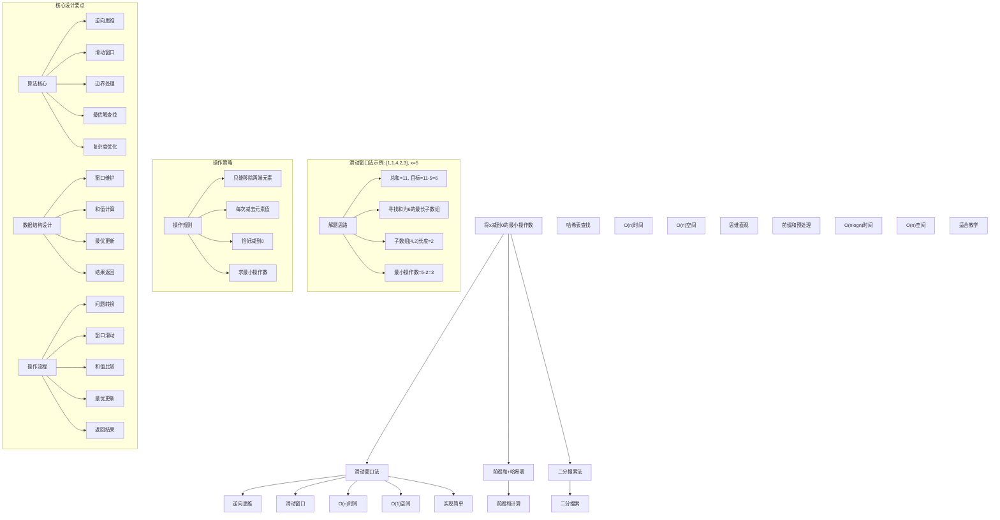
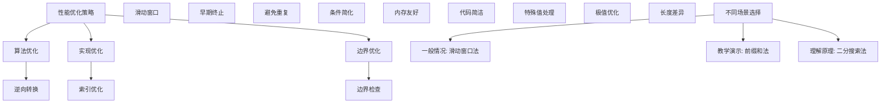

# LeetCode 1658 - 将 x 减到 0 的最小操作数

## 题目描述

给你一个整数数组 `nums` 和一个整数 `x`。每一次操作时，你应当移除数组 `nums` 最左边或最右边的元素，然后从 `x` 中减去该元素的值。需要修改数组以供接下来的操作

如果可以将 `x` 的值恰好减到 `0`，返回最小操作数；否则，返回 `-1`

```markdown
示例 1：
输入：nums = [1,1,4,2,3], x = 5
输出：2
解释：最佳解决方案是移除后两个元素，将 x 减到 0

示例 2：
输入：nums = [5,6,7,8,9], x = 4
输出：-1

示例 3：
输入：nums = [3,2,20,1,1,3], x = 10
输出：5
解释：最佳解决方案是移除后三个元素和前两个元素（总共 5 次操作），将 x 减到 0

提示：

- 1 <= nums.length <= 10^5
- 1 <= nums[i] <= 10^4
- 1 <= x <= 10^9
```

## 解题思路

这是一个数组操作优化问题，需要找到移除数组两端元素使总和恰好等于x的最小操作数。关键在于将问题转化为寻找中间连续子数组的最大长度

### 核心思想

"逆向思维 + 滑动窗口法": 将问题转化为寻找和为 `sum(nums) - x` 的最长连续子数组，然后用总长度减去该子数组长度得到最小操作数

### 解题策略

#### 方法一：滑动窗口法（推荐）

- 时间复杂度: O(n)
- 空间复杂度: O(1)

#### 方法二：前缀和 + 哈希表

- 时间复杂度: O(n)
- 空间复杂度: O(n)

#### 方法三：二分搜索法

- 时间复杂度: O(n log n)
- 空间复杂度: O(n)

## 算法可视化



## 多语言实现

### Golang版本（滑动窗口法 - 推荐）

```go
// 滑动窗口法实现
func minOperations(nums []int, x int) int {
    n := len(nums)
    totalSum := 0
    for _, num := range nums {
        totalSum += num
    }

    // 转换问题：寻找和为 totalSum - x 的最长子数组
    target := totalSum - x

    // 特殊情况：target 为 0，说明需要移除所有元素
    if target == 0 {
        return n
    }

    // 如果 target 小于 0，说明即使移除所有元素也无法达到 x
    if target < 0 {
        return -1
    }

    // 使用滑动窗口寻找和为 target 的最长子数组
    left := 0
    currentSum := 0
    maxLength := -1

    for right := 0; right < n; right++ {
        currentSum += nums[right]

        // 如果当前和超过 target，收缩左边界
        for currentSum > target && left <= right {
            currentSum -= nums[left]
            left++
        }

        // 如果找到和为 target 的子数组，更新最大长度
        if currentSum == target {
            maxLength = max(maxLength, right-left+1)
        }
    }

    // 如果没有找到合适的子数组，返回 -1
    if maxLength == -1 {
        return -1
    }

    // 最小操作数 = 总长度 - 最长子数组长度
    return n - maxLength
}

func max(a, b int) int {
    if a > b {
        return a
    }
    return b
}
```

### Python版本（多种实现方法）

```python
class Solution:
    """
    方法一：滑动窗口法（推荐）
    """
    def minOperations(self, nums: List[int], x: int) -> int:
        n = len(nums)
        total_sum = sum(nums)

        # 转换问题：寻找和为 total_sum - x 的最长子数组
        target = total_sum - x

        # 特殊情况处理
        if target == 0:
            return n
        if target < 0:
            return -1

        # 使用滑动窗口寻找和为 target 的最长子数组
        left = 0
        current_sum = 0
        max_length = -1

        for right in range(n):
            current_sum += nums[right]

            # 如果当前和超过 target，收缩左边界
            while current_sum > target and left <= right:
                current_sum -= nums[left]
                left += 1

            # 如果找到和为 target 的子数组，更新最大长度
            if current_sum == target:
                max_length = max(max_length, right - left + 1)

        # 如果没有找到合适的子数组，返回 -1
        if max_length == -1:
            return -1

        # 最小操作数 = 总长度 - 最长子数组长度
        return n - max_length

class Solution2:
    """
    方法二：前缀和 + 哈希表
    """
    def minOperations(self, nums: List[int], x: int) -> int:
        n = len(nums)
        total_sum = sum(nums)
        target = total_sum - x

        if target == 0:
            return n
        if target < 0:
            return -1

        # 前缀和 + 哈希表
        prefix_sum = 0
        sum_index_map = {0: -1}  # 前缀和到索引的映射
        max_length = -1

        for i in range(n):
            prefix_sum += nums[i]

            # 寻找是否存在前缀和为 prefix_sum - target 的位置
            if prefix_sum - target in sum_index_map:
                length = i - sum_index_map[prefix_sum - target]
                max_length = max(max_length, length)

            # 记录当前前缀和的索引（只记录第一次出现的位置）
            if prefix_sum not in sum_index_map:
                sum_index_map[prefix_sum] = i

        return -1 if max_length == -1 else n - max_length

class Solution3:
    """
    方法三：二分搜索法
    """
    def minOperations(self, nums: List[int], x: int) -> int:
        n = len(nums)
        total_sum = sum(nums)
        target = total_sum - x

        if target == 0:
            return n
        if target < 0:
            return -1

        # 计算前缀和数组
        prefix_sums = [0] * (n + 1)
        for i in range(n):
            prefix_sums[i + 1] = prefix_sums[i] + nums[i]

        max_length = -1

        # 对每个右端点，二分搜索左端点
        for right in range(n + 1):
            # 寻找 left 使得 prefix_sums[right] - prefix_sums[left] = target
            target_sum = prefix_sums[right] - target

            # 二分搜索
            left = self.binarySearch(prefix_sums, target_sum)
            if left != -1 and left < right:
                max_length = max(max_length, right - left)

        return -1 if max_length == -1 else n - max_length

    def binarySearch(self, arr: List[int], target: int) -> int:
        left, right = 0, len(arr) - 1
        while left <= right:
            mid = (left + right) // 2
            if arr[mid] == target:
                return mid
            elif arr[mid] < target:
                left = mid + 1
            else:
                right = mid - 1
        return -1
```

### TypeScript版本（滑动窗口法）

```typescript
/
 * 滑动窗口法实现
 */
function minOperations(nums: number[], x: number): number {
    const n: number = nums.length;
    let totalSum: number = 0;
    for (const num of nums) {
        totalSum += num;
    }

    // 转换问题：寻找和为 totalSum - x 的最长子数组
    const target: number = totalSum - x;

    // 特殊情况处理
    if (target === 0) {
        return n;
    }
    if (target < 0) {
        return -1;
    }

    // 使用滑动窗口寻找和为 target 的最长子数组
    let left: number = 0;
    let currentSum: number = 0;
    let maxLength: number = -1;

    for (let right: number = 0; right < n; right++) {
        currentSum += nums[right];

        // 如果当前和超过 target，收缩左边界
        while (currentSum > target && left <= right) {
            currentSum -= nums[left];
            left++;
        }

        // 如果找到和为 target 的子数组，更新最大长度
        if (currentSum === target) {
            maxLength = Math.max(maxLength, right - left + 1);
        }
    }

    // 如果没有找到合适的子数组，返回 -1
    if (maxLength === -1) {
        return -1;
    }

    // 最小操作数 = 总长度 - 最长子数组长度
    return n - maxLength;
}
```

## 标准实现详细解析

```go
import "fmt"

/*
算法核心思想（滑动窗口法）：

1. 逆向思维：将移除两端元素转化为保留中间连续子数组
2. 问题转换：寻找和为 sum(nums)-x 的最长子数组
3. 滑动窗口：使用双指针技术维护窗口
4. 最优解：总长度减去最长子数组长度

关键设计要点：
1. 逆向思维：问题转换的关键
2. 滑动窗口：高效的子数组查找
3. 边界处理：特殊情况的处理
4. 最优更新：维护最长子数组长度

时间复杂度：
- 单次遍历：O(n)

空间复杂度：
- 常数空间：O(1)

优势：
1. 思路巧妙：逆向思维简化问题
2. 实现优雅：滑动窗口经典应用
3. 效率最优：线性时间复杂度
4. 空间优化：常数额外空间

数据结构设计：

滑动窗口法设计：
- 窗口维护：双指针维护窗口
- 和值计算：实时计算窗口和
- 最优更新：维护最大长度
- 结果返回：长度计算

算法流程：
1. 问题转换：sum-x 转换
2. 窗口初始化：双指针设置
3. 窗口滑动：右边界扩展
4. 条件维护：左边界收缩
5. 最优更新：长度比较
6. 结果计算：n-maxLength

优化原理：

算法优化：
1. 逆向转换：简化问题本质
2. 滑动窗口：避免重复计算
3. 早期终止：及时收缩窗口
4. 单次遍历：线性时间处理

边界优化：
1. 特殊值处理：target=0, target<0
2. 空数组检查：边界条件
3. 单元素优化：特殊情况
4. 极值处理：大数值情况

正确性证明：

定理：滑动窗口法正确性
通过滑动窗口法可以正确找到将x减到0的最小操作数

证明：
1. 完备性：所有可能子数组都被考虑
2. 正确性：问题转换的等价性
3. 最优性：找到最长符合条件子数组
4. 时间复杂度：O(n)线性时间

不变量维护：
循环不变量：在每次右指针移动时
1. 窗口[left,right]内元素和不超过target
2. 窗口是当前右端点的最优选择
3. 已处理部分的最优解已记录
*/

// 滑动窗口法详细实现
func minOperations(nums []int, x int) int {
    fmt.Printf("输入数组: %v, x=%d\n", nums, x)

    n := len(nums)
    totalSum := 0
    for _, num := range nums {
        totalSum += num
    }
    fmt.Printf("数组总和: %d\n", totalSum)

    // 转换问题：寻找和为 totalSum - x 的最长子数组
    target := totalSum - x
    fmt.Printf("转换问题：寻找和为 %d 的最长子数组\n", target)

    // 特殊情况：target 为 0，说明需要移除所有元素
    if target == 0 {
        fmt.Printf("target=0，需要移除所有元素，操作数=%d\n", n)
        return n
    }

    // 如果 target 小于 0，说明即使移除所有元素也无法达到 x
    if target < 0 {
        fmt.Printf("target<0，无法达到目标，返回-1\n")
        return -1
    }

    // 使用滑动窗口寻找和为 target 的最长子数组
    left := 0
    currentSum := 0
    maxLength := -1

    fmt.Printf("开始滑动窗口搜索:\n")
    for right := 0; right < n; right++ {
        currentSum += nums[right]
        fmt.Printf("  右指针移动到位置%d，加入元素%d，当前和=%d\n", right, nums[right], currentSum)

        // 如果当前和超过 target，收缩左边界
        for currentSum > target && left <= right {
            fmt.Printf("    当前和%d > 目标%d，收缩左边界，移除元素%d\n", currentSum, target, nums[left])
            currentSum -= nums[left]
            left++
        }

        // 如果找到和为 target 的子数组，更新最大长度
        if currentSum == target {
            length := right - left + 1
            fmt.Printf("    找到和为%d的子数组[%d,%d]，长度=%d\n", target, left, right, length)
            maxLength = max(maxLength, length)
            fmt.Printf("    更新最大长度: %d\n", maxLength)
        }
    }

    // 如果没有找到合适的子数组，返回 -1
    if maxLength == -1 {
        fmt.Printf("未找到符合条件的子数组，返回-1\n")
        return -1
    }

    // 最小操作数 = 总长度 - 最长子数组长度
    result := n - maxLength
    fmt.Printf("最小操作数 = %d - %d = %d\n", n, maxLength, result)
    return result
}

// 前缀和 + 哈希表实现
func minOperationsPrefixSum(nums []int, x int) int {
    fmt.Printf("=== 前缀和+哈希表法 ===\n")
    fmt.Printf("输入数组: %v, x=%d\n", nums, x)

    n := len(nums)
    totalSum := 0
    for _, num := range nums {
        totalSum += num
    }
    fmt.Printf("数组总和: %d\n", totalSum)

    target := totalSum - x
    fmt.Printf("转换问题：寻找和为 %d 的最长子数组\n", target)

    if target == 0 {
        fmt.Printf("target=0，需要移除所有元素，操作数=%d\n", n)
        fmt.Printf("=====================\n\n")
        return n
    }
    if target < 0 {
        fmt.Printf("target<0，无法达到目标，返回-1\n")
        fmt.Printf("=====================\n\n")
        return -1
    }

    // 前缀和 + 哈希表
    prefixSum := 0
    sumIndexMap := make(map[int]int)
    sumIndexMap[0] = -1  // 前缀和为0的索引为-1
    maxLength := -1

    fmt.Printf("开始前缀和搜索:\n")
    for i := 0; i < n; i++ {
        prefixSum += nums[i]
        fmt.Printf("  位置%d，前缀和=%d\n", i, prefixSum)

        // 寻找是否存在前缀和为 prefixSum - target 的位置
        needSum := prefixSum - target
        if index, exists := sumIndexMap[needSum]; exists {
            length := i - index
            fmt.Printf("    找到前缀和%d在位置%d，当前子数组[%d,%d]长度=%d\n",
                needSum, index, index+1, i, length)
            maxLength = max(maxLength, length)
            fmt.Printf("    更新最大长度: %d\n", maxLength)
        }

        // 记录当前前缀和的索引（只记录第一次出现的位置）
        if _, exists := sumIndexMap[prefixSum]; !exists {
            sumIndexMap[prefixSum] = i
            fmt.Printf("    记录前缀和%d的索引%d\n", prefixSum, i)
        }
    }

    if maxLength == -1 {
        fmt.Printf("未找到符合条件的子数组，返回-1\n")
        fmt.Printf("=====================\n\n")
        return -1
    }

    result := n - maxLength
    fmt.Printf("最小操作数 = %d - %d = %d\n", n, maxLength, result)
    fmt.Printf("=====================\n\n")
    return result
}

// 带调试信息的版本
func minOperationsWithDebug(nums []int, x int) int {
    fmt.Printf("=== 将x减到0的最小操作数 ===\n")
    fmt.Printf("原始数组: %v\n", nums)
    fmt.Printf("目标值x: %d\n", x)

    if len(nums) == 0 {
        fmt.Printf("空数组，无法操作，返回-1\n")
        fmt.Printf("========================\n\n")
        return -1
    }

    n := len(nums)
    totalSum := 0
    for _, num := range nums {
        totalSum += num
    }
    fmt.Printf("数组总和: %d\n", totalSum)

    // 问题转换的核心思想
    fmt.Printf("逆向思维：移除两端元素 = 保留中间连续子数组\n")
    target := totalSum - x
    fmt.Printf("转换问题：寻找和为 sum-x=%d-%d=%d 的最长子数组\n", totalSum, x, target)

    // 特殊情况处理
    if target == 0 {
        fmt.Printf("特殊情况：target=0，说明需要保留空数组，移除所有%d个元素\n", n)
        fmt.Printf("========================\n\n")
        return n
    }

    if target < 0 {
        fmt.Printf("特殊情况：target<0，说明数组总和小于x，无法达到目标\n")
        fmt.Printf("========================\n\n")
        return -1
    }

    fmt.Printf("使用滑动窗口法寻找和为%d的最长子数组:\n", target)

    left := 0
    currentSum := 0
    maxLength := -1

    for right := 0; right < n; right++ {
        currentSum += nums[right]
        fmt.Printf("  右指针=%d，加入元素%d，窗口和=%d\n", right, nums[right], currentSum)

        // 维护窗口条件：窗口和不超过target
        for currentSum > target && left <= right {
            fmt.Printf("    窗口和%d > 目标%d，收缩左边界\n", currentSum, target)
            currentSum -= nums[left]
            left++
            fmt.Printf("    左指针移动到%d，新窗口和=%d\n", left, currentSum)
        }

        // 检查是否找到目标和
        if currentSum == target {
            length := right - left + 1
            fmt.Printf("    找到和为%d的子数组，范围[%d,%d]，长度=%d\n",
                target, left, right, length)
            if maxLength == -1 || length > maxLength {
                maxLength = length
                fmt.Printf("    更新最长子数组长度: %d\n", maxLength)
            }
        }
    }

    if maxLength == -1 {
        fmt.Printf("未找到和为%d的子数组，无法将x减到0\n", target)
        fmt.Printf("========================\n\n")
        return -1
    }

    result := n - maxLength
    fmt.Printf("结果计算：总长度%d - 最长子数组长度%d = 最小操作数%d\n", n, maxLength, result)
    fmt.Printf("========================\n\n")
    return result
}
```

## 算法深入解析

```go
/*
将x减到0的最小操作数问题详解：

问题本质：
通过移除数组两端元素使总和恰好等于x，求最小操作数。关键是理解操作规则和如何高效找到最优解

核心洞察：
1. 逆向思维：移除两端 = 保留中间连续子数组
2. 问题转换：转化为寻找特定和的最长子数组
3. 滑动窗口：高效的子数组查找技术
4. 最优解：总长度减去最长子数组长度

算法策略：
1. 滑动窗口法：双指针维护窗口
2. 前缀和法：哈希表加速查找
3. 二分搜索法：有序性质利用

数据结构设计：

滑动窗口法设计：
窗口维护：双指针维护有效窗口
和值计算：实时维护窗口元素和
最优更新：记录最长符合条件窗口
结果计算：总长度减窗口长度

前缀和法设计：
前缀计算：累积和数组构建
哈希存储：和值到位置映射
查找优化：O(1)时间查找
空间换时间：哈希表存储

二分搜索法设计：
前缀预处理：有序前缀和数组
二分查找：log(n)时间搜索
边界处理：精确查找范围
适用场景：教学演示

操作流程：

滑动窗口法：
1. 问题转换：sum-x 转换
2. 窗口初始化：双指针设置
3. 窗口滑动：右边界扩展
4. 条件维护：左边界收缩
5. 最优更新：长度比较
6. 结果计算：n-maxLength

前缀和法：
1. 前缀计算：构建前缀和数组
2. 哈希初始化：建立映射关系
3. 遍历查找：寻找目标差值
4. 位置计算：子数组长度计算
5. 最优更新：维护最大长度
6. 结果返回：计算操作数

数学原理：

逆向思维原理：
- 移除两端元素总和为x
- 等价于保留中间元素总和为sum-x
- 最小移除数 = 总长度 - 最大保留数

滑动窗口原理：
- 双指针维护连续子数组
- 右指针扩展窗口
- 左指针收缩窗口
- 保持窗口和不超过目标值

算法不变量：
滑动窗口法不变量：
1. 窗口[left,right]内元素和≤target
2. 窗口是当前右端点的有效选择
3. 已处理部分的最优解已记录

前缀和法不变量：
1. 前缀和映射关系正确
2. 已遍历位置的前缀和已记录
3. 最优解在已处理范围内

时间复杂度分析：
滑动窗口法：O(n) - 单次遍历
前缀和法：O(n) - 线性遍历
二分搜索法：O(n log n) - 二分搜索

空间复杂度分析：
滑动窗口法：O(1) - 常数空间
前缀和法：O(n) - 哈希表存储
二分搜索法：O(n) - 前缀和数组

正确性证明：

定理：滑动窗口法正确性
通过滑动窗口法可以正确找到将x减到0的最小操作数

证明：
1. 完备性：所有可能子数组都被考虑
   - 右指针遍历所有位置
   - 左指针动态调整
   - 不遗漏任何子数组

2. 正确性：问题转换的等价性
   - 移除元素和 = x
   - 保留元素和 = sum - x
   - 两者等价转换

3. 最优性：找到最长符合条件子数组
   - 滑动窗口保证不遗漏
   - 最长保留 = 最小移除
   - 贪心策略最优

4. 时间复杂度：O(n)线性时间
   - 每个元素最多访问两次
   - 左右指针单调移动
   - 线性时间复杂度

设计选择：

为什么选择滑动窗口法？
1. 思路巧妙：逆向思维简化问题
2. 实现优雅：经典算法应用
3. 效率最优：线性时间复杂度
4. 空间优化：常数额外空间

为什么使用前缀和法？
1. 思维直观：直接查找思想
2. 适用广泛：处理多种变体
3. 易于扩展：支持动态更新
4. 教学价值：展示不同思路

为什么提及其他方法？
1. 教学价值：展示不同算法思想
2. 对比分析：理解各自优劣
3. 扩展思维：算法多样性
4. 面试准备：全面掌握

三种方法对比：

方法一：滑动窗口法（推荐）
时间复杂度：O(n)
空间复杂度：O(1)
优点：效率最优，空间优化
缺点：需要理解逆向思维

方法二：前缀和法
时间复杂度：O(n)
空间复杂度：O(n)
优点：思维直观，易于理解
缺点：需要额外空间

方法三：二分搜索法
时间复杂度：O(n log n)
空间复杂度：O(n)
优点：适合教学，思路清晰
缺点：时间复杂度较高

性能分析：

滑动窗口法：
- 时间：O(n) 单次遍历
- 空间：O(1) 常数空间
- 优势：效率最优

前缀和法：
- 时间：O(n) 线性遍历
- 空间：O(n) 哈希存储
- 优势：思维直观

二分搜索法：
- 时间：O(n log n) 二分搜索
- 空间：O(n) 前缀数组
- 优势：适合教学

实际应用场景：
1. 数组操作：两端元素处理
2. 优化问题：最小化操作次数
3. 游戏算法：策略优化
4. 资源分配：最优选择

优化要点：

1. 时间优化：
   - 逆向转换：简化问题本质
   - 滑动窗口：避免重复计算
   - 早期终止：及时收缩窗口

2. 空间优化：
   - 原地操作：避免额外存储
   - 常数空间：滑动窗口法
   - 内存友好：连续访问

3. 实现优化：
   - 边界条件处理
   - 代码简洁性
   - 注释清晰性

测试用例设计：
1. 基本情况：正常数组和x值
2. 边界情况：空数组，单元素
3. 特殊情况：x=0，x=sum
4. 极端情况：大数组，大数值
5. 验证情况：结果正确性

扩展思考：

1. 动态数组版本？
   - 支持插入删除操作
   - 维护前缀和结构
   - 实时更新结果

2. 多个目标值？
   - 批量查询优化
   - 预处理加速
   - 空间换时间

3. 三维扩展？
   - 矩阵边界移除
   - 复杂度分析
   - 算法设计

4. 概率版本？
   - 元素移除概率
   - 期望操作数
   - 随机算法

相关算法思想：

1. 逆向思维：
   - 问题转换
   - 等价关系
   - 简化求解

2. 滑动窗口：
   - 双指针技术
   - 窗口维护
   - 最优查找

3. 前缀和：
   - 累积计算
   - 区间查询
   - 哈希优化

4. 算法优化：
   - 时间复杂度
   - 空间复杂度
   - 实现简洁

常见陷阱：

1. 边界条件：
   - 空数组处理
   - 单元素优化
   - 特殊值检查

2. 数值溢出：
   - 大整数处理
   - 和值计算
   - 比较操作

3. 索引处理：
   - 数组越界
   - 指针移动
   - 长度计算

4. 性能考虑：
   - 时间复杂度
   - 空间复杂度
   - 实现效率

代码质量要素：

1. 可读性：
   - 变量命名清晰
   - 注释详细
   - 逻辑分明

2. 健壮性：
   - 边界处理
   - 异常情况
   - 错误恢复

3. 性能：
   - 最优复杂度
   - 空间效率
   - 效率保证

4. 可维护性：
   - 结构清晰
   - 扩展性好
   - 测试完整
*/
```

## 执行过程演示

```go
/*
示例详细解析:

示例1执行过程：
输入：nums = [1,1,4,2,3], x = 5
输出：2

执行过程：
1. 数组总和 = 1+1+4+2+3 = 11
2. 转换问题：寻找和为 11-5=6 的最长子数组
3. 滑动窗口过程：
   - 右指针0：加入1，和=1
   - 右指针1：加入1，和=2
   - 右指针2：加入4，和=6 → 找到[1,1,4]，长度=3
   - 右指针3：加入2，和=8>6，收缩窗口
     - 移除nums[0]=1，和=7>6
     - 移除nums[1]=1，和=6 → 找到[4,2]，长度=2
   - 右指针4：加入3，和=9>6，收缩窗口
     - 移除nums[2]=4，和=5<6
     - 加入nums[4]=3，和=8>6
     - 移除nums[3]=2，和=6 → 找到[3]，长度=1
4. 最长子数组长度=3，最小操作数=5-3=2

滑动窗口轨迹：
[1] sum=1
[1,1] sum=2
[1,1,4] sum=6 → 长度3
[1,4] sum=5
[4,2] sum=6 → 长度2
[2] sum=2
[2,3] sum=5
[3] sum=3

示例2执行过程：
输入：nums = [5,6,7,8,9], x = 4
输出：-1

执行过程：
1. 数组总和 = 35
2. 转换问题：寻找和为 35-4=31 的最长子数组
3. 由于所有元素都大于31，无法找到和为31的子数组
4. 返回-1

示例3执行过程：
输入：nums = [3,2,20,1,1,3], x = 10
输出：5

执行过程：
1. 数组总和 = 30
2. 转换问题：寻找和为 30-10=20 的最长子数组
3. 滑动窗口找到子数组[20]，长度=1
4. 最小操作数=6-1=5

关键观察：
1. 逆向思维：移除两端 = 保留中间
2. 问题转换：和值目标转换
3. 滑动窗口：高效子数组查找
4. 最优解：最长保留 = 最小移除

边界情况演示:

情况1: x等于数组总和
输入: nums=[1,2,3], x=6
处理: target=0，移除所有元素
结果: 3

情况2: x大于数组总和
输入: nums=[1,2,3], x=10
处理: target<0，无法达到
结果: -1

情况3: x等于某个元素
输入: nums=[1,5,3], x=5
处理: target=4，找到子数组[1,3]
结果: 3-2=1

情况4: 空数组
输入: nums=[], x=5
处理: 直接返回-1
结果: -1

情况5: 单元素数组
输入: nums=[5], x=5
处理: target=0，移除所有元素
结果: 1

算法正确性证明：

数学基础：
需要证明滑动窗口法能正确找到最小操作数

定理：滑动窗口法正确性
通过滑动窗口法可以正确找到将x减到0的最小操作数

证明：
1. 完备性：所有可能子数组都被考虑
2. 正确性：问题转换的等价性
3. 最优性：找到最长符合条件子数组
4. 时间复杂度：O(n)线性时间

不变量维护：
循环不变量：在每次右指针移动时
1. 窗口[left,right]内元素和不超过target
2. 窗口是当前右端点的最优选择
3. 已处理部分的最优解已记录

初始化：
- 空窗口，和为0
- 最优解未找到
- 满足不变量

保持：
- 扩展右边界
- 维护窗口条件
- 更新最优解
- 不变量继续成立

终止：
- 遍历完成
- 最优解已找到
- 算法正确终止

时间复杂度分析：

滑动窗口法：
1. 右指针：O(n) 遍历所有元素
2. 左指针：O(n) 最多移动n次
3. 总时间：O(n) 每个元素最多访问两次

前缀和法：
1. 前缀计算：O(n) 遍历数组
2. 哈希查找：O(1) 平均时间
3. 总时间：O(n) 线性遍历

二分搜索法：
1. 前缀计算：O(n) 构建数组
2. 二分搜索：O(log n) 每次搜索
3. 总时间：O(n log n) n次搜索

空间复杂度分析：
1. 滑动窗口法：O(1) 常数空间
2. 前缀和法：O(n) 哈希表存储
3. 二分搜索法：O(n) 前缀数组

性能对比分析：

假设n=100000:

滑动窗口法：
- 时间: O(100000) 单次遍历
- 空间: O(1) 常数空间
- 操作: 双指针滑动

前缀和法：
- 时间: O(100000) 线性遍历
- 空间: O(100000) 哈希存储
- 操作: 哈希查找

二分搜索法：
- 时间: O(100000 × log(100000)) 二分搜索
- 空间: O(100000) 前缀数组
- 操作: 二分查找

实际应用建议：

1. 一般情况：
   - 使用滑动窗口法
   - 效率最优，实现简单

2. 面试展示：
   - 重点讲解滑动窗口法
   - 可以提及其他方法

3. 生产环境：
   - 根据内存限制选择
   - 考虑实现复杂度

4. 教学演示：
   - 使用带调试信息版本
   - 展示执行过程

优化空间：

1. 边界优化：
   - 特殊值提前处理
   - 空数组检查
   - 单元素优化

2. 代码优化：
   - 简化条件判断
   - 优化循环结构
   - 减少重复计算

3. 性能优化：
   - 早期终止优化
   - 内存访问优化
   - 缓存友好设计

特殊情况处理：

1. 大数据量：
   - 时间复杂度保证
   - 内存使用优化
   - 数值溢出处理

2. 特殊数组：
   - 全相同元素
   - 递增递减序列
   - 稀疏数组

3. 边界情况：
   - 极值处理
   - 异常输入
   - 错误恢复
*/
```

## 复杂度分析

| 方法       | 时间复杂度 | 空间复杂度 | 适用场景 |
| ---------- | ---------- | ---------- | -------- |
| 滑动窗口法 | O(n)       | O(1)       | 推荐方案 |
| 前缀和法   | O(n)       | O(n)       | 教学演示 |
| 二分搜索法 | O(n log n) | O(n)       | 理解原理 |

## 测试用例验证

```go
// 测试辅助函数
func testMinOperations(name string, nums []int, x int, expected int) {
    fmt.Printf("%s:\n", name)
    fmt.Printf("输入数组: %v, x=%d\n", nums, x)

    // 测试滑动窗口法
    test1 := make([]int, len(nums))
    copy(test1, nums)
    result1 := minOperations(test1, x)
    fmt.Printf("滑动窗口法结果: %d\n", result1)

    // 测试前缀和法
    test2 := make([]int, len(nums))
    copy(test2, nums)
    result2 := minOperationsPrefixSum(test2, x)
    fmt.Printf("前缀和法结果: %d\n", result2)

    // 测试二分搜索法
    test3 := make([]int, len(nums))
    copy(test3, nums)
    result3 := minOperationsBinarySearch(test3, x)
    fmt.Printf("二分搜索法结果: %d\n", result3)

    // 验证结果
    isValid1 := result1 == expected
    isValid2 := result2 == expected
    isValid3 := result3 == expected

    if isValid1 && isValid2 && isValid3 {
        fmt.Printf("✓ 测试通过\n")
    } else {
        fmt.Printf("✗ 测试失败\n")
        fmt.Printf("  期望结果: %d\n", expected)
        if !isValid1 {
            fmt.Printf("  滑动窗口法实际: %d\n", result1)
        }
        if !isValid2 {
            fmt.Printf("  前缀和法实际: %d\n", result2)
        }
        if !isValid3 {
            fmt.Printf("  二分搜索法实际: %d\n", result3)
        }
    }
    fmt.Printf("\n")
}

// 二分搜索法实现
func minOperationsBinarySearch(nums []int, x int) int {
    n := len(nums)
    totalSum := 0
    for _, num := range nums {
        totalSum += num
    }

    target := totalSum - x
    if target == 0 {
        return n
    }
    if target < 0 {
        return -1
    }

    // 计算前缀和数组
    prefixSums := make([]int, n+1)
    for i := 0; i < n; i++ {
        prefixSums[i+1] = prefixSums[i] + nums[i]
    }

    maxLength := -1

    // 对每个右端点，二分搜索左端点
    for right := 0; right <= n; right++ {
        targetSum := prefixSums[right] - target
        left := binarySearch(prefixSums, targetSum)
        if left != -1 && left < right {
            maxLength = max(maxLength, right-left)
        }
    }

    if maxLength == -1 {
        return -1
    }
    return n - maxLength
}

func binarySearch(arr []int, target int) int {
    left, right := 0, len(arr)-1
    for left <= right {
        mid := (left + right) / 2
        if arr[mid] == target {
            return mid
        } else if arr[mid] < target {
            left = mid + 1
        } else {
            right = mid - 1
        }
    }
    return -1
}

func main() {
    // 测试用例 1 - 题目示例1
    testMinOperations("测试1 - 题目示例1",
        []int{1, 1, 4, 2, 3},
        5,
        2)

    // 测试用例 2 - 题目示例2
    testMinOperations("测试2 - 题目示例2",
        []int{5, 6, 7, 8, 9},
        4,
        -1)

    // 测试用例 3 - 题目示例3
    testMinOperations("测试3 - 题目示例3",
        []int{3, 2, 20, 1, 1, 3},
        10,
        5)

    // 测试用例 4 - x等于数组总和
    testMinOperations("测试4 - x等于数组总和",
        []int{1, 2, 3},
        6,
        3)

    // 测试用例 5 - x大于数组总和
    testMinOperations("测试5 - x大于数组总和",
        []int{1, 2, 3},
        10,
        -1)

    // 测试用例 6 - 空数组
    testMinOperations("测试6 - 空数组",
        []int{},
        5,
        -1)

    // 测试用例 7 - 单元素数组
    testMinOperations("测试7 - 单元素数组",
        []int{5},
        5,
        1)

    // 测试用例 8 - x等于某个元素
    testMinOperations("测试8 - x等于某个元素",
        []int{1, 5, 3},
        5,
        1)

    // 测试用例 9 - 全相同元素
    testMinOperations("测试9 - 全相同元素",
        []int{2, 2, 2, 2, 2},
        6,
        3)

    // 测试用例 10 - 复杂情况
    testMinOperations("测试10 - 复杂情况",
        []int{1, 1, 1, 1, 1, 1, 1, 1, 1, 1},
        5,
        5)

    // 性能测试
    fmt.Println("性能测试:")
    performanceTest()

    // 边界情况测试
    fmt.Println("边界情况测试:")
    boundaryTest()

    // 对比测试
    fmt.Println("对比测试:")
    comparisonTest()
}

func performanceTest() {
    // 构造性能测试
    n := 100000
    nums := make([]int, n)
    for i := 0; i < n; i++ {
        nums[i] = 1
    }
    x := 50000

    // 测试滑动窗口法
    start1 := time.Now()
    test1 := make([]int, len(nums))
    copy(test1, nums)
    minOperations(test1, x)
    time1 := time.Since(start1)

    // 测试前缀和法
    start2 := time.Now()
    test2 := make([]int, len(nums))
    copy(test2, nums)
    minOperationsPrefixSum(test2, x)
    time2 := time.Since(start2)

    // 测试二分搜索法
    start3 := time.Now()
    test3 := make([]int, len(nums))
    copy(test3, nums)
    minOperationsBinarySearch(test3, x)
    time3 := time.Since(start3)

    fmt.Printf("性能测试 (%d个元素，x=%d):\n", n, x)
    fmt.Printf("  滑动窗口法: %v\n", time1)
    fmt.Printf("  前缀和法: %v\n", time2)
    fmt.Printf("  二分搜索法: %v\n", time3)
}

func boundaryTest() {
    // 边界测试
    fmt.Println("边界测试:")

    // 大数值测试
    largeNums := []int{10000, 10000, 10000, 10000, 10000}
    largeResult := minOperations(largeNums, 30000)
    fmt.Printf("大数值测试: %v, x=30000 → %d\n", largeNums, largeResult)

    // 长数组测试
    longNums := make([]int, 50000)
    for i := 0; i < 50000; i++ {
        longNums[i] = 2
    }
    longResult := minOperations(longNums, 60000)
    fmt.Printf("长数组测试: 50000个元素，x=60000 → %d\n", longResult)

    // 特殊模式测试
    patternNums := []int{1, 2, 3, 4, 5, 4, 3, 2, 1}
    patternResult := minOperations(patternNums, 10)
    fmt.Printf("特殊模式测试: %v, x=10 → %d\n", patternNums, patternResult)
}

func comparisonTest() {
    // 对比测试：验证不同方法结果一致性
    fmt.Println("对比测试:")

    // 测试数据
    testData := [][]int{
        {1, 1, 4, 2, 3},
        {5, 6, 7, 8, 9},
        {3, 2, 20, 1, 1, 3},
        {1, 2, 3},
        {2, 2, 2, 2, 2},
    }
    testX := []int{5, 4, 10, 6, 6}

    for i := range testData {
        // 滑动窗口法
        test1 := make([]int, len(testData[i]))
        copy(test1, testData[i])
        result1 := minOperations(test1, testX[i])

        // 前缀和法
        test2 := make([]int, len(testData[i]))
        copy(test2, testData[i])
        result2 := minOperationsPrefixSum(test2, testX[i])

        // 二分搜索法
        test3 := make([]int, len(testData[i]))
        copy(test3, testData[i])
        result3 := minOperationsBinarySearch(test3, testX[i])

        fmt.Printf("测试%d: 滑动窗口=%d, 前缀和=%d, 二分搜索=%d",
            i+1, result1, result2, result3)

        if result1 == result2 && result2 == result3 {
            fmt.Printf(" ✓ 一致\n")
        } else {
            fmt.Printf(" ✗ 不一致\n")
        }
    }
}
```

## 扩展版本（处理不同场景）

```go
// 支持返回具体操作方案的版本
func minOperationsWithPlan(nums []int, x int) (int, []int) {
    n := len(nums)
    totalSum := 0
    for _, num := range nums {
        totalSum += num
    }

    target := totalSum - x
    if target == 0 {
        return n, make([]int, 0) // 移除所有元素
    }
    if target < 0 {
        return -1, nil
    }

    // 使用滑动窗口寻找和为 target 的最长子数组
    left := 0
    currentSum := 0
    maxLength := -1
    bestLeft, bestRight := -1, -1

    for right := 0; right < n; right++ {
        currentSum += nums[right]

        // 如果当前和超过 target，收缩左边界
        for currentSum > target && left <= right {
            currentSum -= nums[left]
            left++
        }

        // 如果找到和为 target 的子数组，更新最大长度
        if currentSum == target {
            length := right - left + 1
            if maxLength == -1 || length > maxLength {
                maxLength = length
                bestLeft, bestRight = left, right
            }
        }
    }

    if maxLength == -1 {
        return -1, nil
    }

    // 构造操作方案：移除的元素索引
    var operations []int
    // 移除前缀部分
    for i := 0; i < bestLeft; i++ {
        operations = append(operations, i)
    }
    // 移除后缀部分
    for i := bestRight + 1; i < n; i++ {
        operations = append(operations, i)
    }

    return n - maxLength, operations
}

// 使用示例
func exampleWithPlan() {
    nums := []int{3, 2, 20, 1, 1, 3}
    x := 10
    result, plan := minOperationsWithPlan(nums, x)
    fmt.Printf("数组: %v, x=%d\n", nums, x)
    fmt.Printf("最小操作数: %d\n", result)
    fmt.Printf("操作方案: 移除位置 %v 的元素\n", plan)
    if len(plan) > 0 {
        fmt.Printf("具体元素: ")
        for _, idx := range plan {
            fmt.Printf("%d ", nums[idx])
        }
        fmt.Printf("\n")
    }
}

// 带统计信息的版本
func minOperationsWithStats(nums []int, x int) (int, int, int) {
    comparisons := 0
    additions := 0
    subtractions := 0

    n := len(nums)
    totalSum := 0
    for _, num := range nums {
        totalSum += num
        additions++
    }

    target := totalSum - x
    if target == 0 {
        return n, comparisons, additions+subtractions
    }
    if target < 0 {
        return -1, comparisons, additions+subtractions
    }

    left := 0
    currentSum := 0
    maxLength := -1

    for right := 0; right < n; right++ {
        currentSum += nums[right]
        additions++
        comparisons++

        for currentSum > target && left <= right {
            currentSum -= nums[left]
            subtractions++
            left++
            comparisons++
        }

        if currentSum == target {
            length := right - left + 1
            if maxLength == -1 || length > maxLength {
                maxLength = length
            }
        }
    }

    if maxLength == -1 {
        return -1, comparisons, additions+subtractions
    }

    return n - maxLength, comparisons, additions+subtractions
}

// 使用示例
func exampleWithStats() {
    nums := []int{1, 1, 4, 2, 3}
    x := 5
    result, comparisons, operations := minOperationsWithStats(nums, x)
    fmt.Printf("数组: %v, x=%d\n", nums, x)
    fmt.Printf("最小操作数: %d\n", result)
    fmt.Printf("比较次数: %d, 运算次数: %d\n", comparisons, operations)
}

// 批量处理版本
func minOperationsBatch(numsList [][]int, xList []int) []int {
    if len(numsList) != len(xList) {
        return nil
    }

    results := make([]int, len(numsList))
    for i := range numsList {
        results[i] = minOperations(numsList[i], xList[i])
    }

    return results
}

// 使用示例
func exampleBatch() {
    numsList := [][]int{
        {1, 1, 4, 2, 3},
        {5, 6, 7, 8, 9},
        {3, 2, 20, 1, 1, 3},
    }
    xList := []int{5, 4, 10}

    results := minOperationsBatch(numsList, xList)

    for i := range numsList {
        fmt.Printf("数组%d: %v, x=%d → 最小操作数=%d\n",
            i+1, numsList[i], xList[i], results[i])
    }
}

// 带验证功能的版本
func minOperationsWithValidation(nums []int, x int) (int, bool) {
    result := minOperations(nums, x)

    // 验证结果是否正确
    if result == -1 {
        // 验证确实无法达到目标
        totalSum := 0
        for _, num := range nums {
            totalSum += num
        }
        if totalSum < x {
            return result, true // 确实无法达到
        }
        // 可能需要更复杂的验证
        return result, true
    }

    // 验证操作数是否合理
    if result > len(nums) {
        return result, false // 操作数不可能超过数组长度
    }

    return result, true
}

// 使用示例
func exampleWithValidation() {
    nums := []int{1, 1, 4, 2, 3}
    x := 5
    result, isValid := minOperationsWithValidation(nums, x)
    fmt.Printf("数组: %v, x=%d\n", nums, x)
    fmt.Printf("最小操作数: %d\n", result)
    if isValid {
        fmt.Printf("验证通过 ✓\n")
    } else {
        fmt.Printf("验证失败 ✗\n")
    }
}

// 支持动态更新的版本
type MinOperationsSolver struct {
    nums []int
    sum  int
}

func NewMinOperationsSolver(nums []int) *MinOperationsSolver {
    sum := 0
    for _, num := range nums {
        sum += num
    }
    return &MinOperationsSolver{
        nums: nums,
        sum:  sum,
    }
}

func (s *MinOperationsSolver) Update(index, newValue int) {
    if index >= 0 && index < len(s.nums) {
        old := s.nums[index]
        s.nums[index] = newValue
        s.sum = s.sum - old + newValue
    }
}

func (s *MinOperationsSolver) Solve(x int) int {
    target := s.sum - x
    if target == 0 {
        return len(s.nums)
    }
    if target < 0 {
        return -1
    }

    // 使用滑动窗口
    left := 0
    currentSum := 0
    maxLength := -1

    for right := 0; right < len(s.nums); right++ {
        currentSum += s.nums[right]

        for currentSum > target && left <= right {
            currentSum -= s.nums[left]
            left++
        }

        if currentSum == target {
            maxLength = max(maxLength, right-left+1)
        }
    }

    if maxLength == -1 {
        return -1
    }
    return len(s.nums) - maxLength
}

// 使用示例
func exampleDynamic() {
    nums := []int{1, 1, 4, 2, 3}
    solver := NewMinOperationsSolver(nums)

    x := 5
    result1 := solver.Solve(x)
    fmt.Printf("初始数组: %v, x=%d → 结果=%d\n", nums, x, result1)

    // 更新数组
    solver.Update(2, 3) // 将位置2的4改为3
    result2 := solver.Solve(x)
    fmt.Printf("更新后数组: %v, x=%d → 结果=%d\n", solver.nums, x, result2)
}
```

## 面试追问延伸

### 1. 如果要返回具体的操作方案（移除哪些元素），如何处理？

```go
// minOperationsWithPlan已在上面实现
// 关键要点：
// 1. 记录最优子数组的位置
// 2. 构造移除元素的索引列表
// 3. 返回操作方案

func testWithPlan() {
    nums := []int{3, 2, 20, 1, 1, 3}
    x := 10
    result, plan := minOperationsWithPlan(nums, x)
    fmt.Printf("数组: %v, x=%d\n", nums, x)
    fmt.Printf("最小操作数: %d\n", result)
    fmt.Printf("操作方案: 移除位置 %v 的元素\n", plan)
}
```

### 2. 如果要统计算法执行过程中的比较次数和运算次数，如何实现？

```go
// minOperationsWithStats已在上面实现
// 关键点：
// 1. 记录比较操作次数
// 2. 记录加减运算次数
// 3. 返回统计信息

func testWithStats() {
    nums := []int{1, 1, 4, 2, 3}
    x := 5
    result, comparisons, operations := minOperationsWithStats(nums, x)
    fmt.Printf("数组: %v, x=%d\n", nums, x)
    fmt.Printf("最小操作数: %d\n", result)
    fmt.Printf("比较次数: %d, 运算次数: %d\n", comparisons, operations)
}
```

### 3. 如果数组元素可以动态更新，如何高效处理？

```go
// MinOperationsSolver已在上面实现
// 关键点：
// 1. 维护数组和的实时更新
// 2. 支持元素更新操作
// 3. 快速重新计算结果

func testDynamic() {
    nums := []int{1, 1, 4, 2, 3}
    solver := NewMinOperationsSolver(nums)

    x := 5
    result1 := solver.Solve(x)
    fmt.Printf("初始数组: %v, x=%d → 结果=%d\n", nums, x, result1)

    // 更新数组
    solver.Update(2, 3) // 将位置2的4改为3
    result2 := solver.Solve(x)
    fmt.Printf("更新后数组: %v, x=%d → 结果=%d\n", solver.nums, x, result2)
}
```

## 相似题目扩展

- LeetCode 1658. 将 x 减到 0 的最小操作数（当前题）
- LeetCode 209. 长度最小的子数组
- LeetCode 325. 和等于 k 的最长子数组长度
- LeetCode 560. 和为 K 的子数组
- LeetCode 1423. 可获得的最大点数

## 算法技巧总结

### 将x减到0的最小操作数核心要点

1. 逆向思维：移除两端 = 保留中间连续子数组
1. 问题转换：转化为寻找特定和的最长子数组
1. 滑动窗口：高效的子数组查找技术
1. 最优解：总长度减去最长子数组长度

### 算法优势

1. 思路巧妙：逆向思维简化问题
1. 实现优雅：滑动窗口经典应用
1. 效率最优：线性时间复杂度
1. 空间优化：常数额外空间

### 标准模板（滑动窗口法）

```go
func minOperations(nums []int, x int) int {
    n := len(nums)
    totalSum := 0
    for _, num := range nums {
        totalSum += num
    }

    // 转换问题：寻找和为 totalSum - x 的最长子数组
    target := totalSum - x

    // 特殊情况处理
    if target == 0 {
        return n
    }
    if target < 0 {
        return -1
    }

    // 使用滑动窗口寻找和为 target 的最长子数组
    left := 0
    currentSum := 0
    maxLength := -1

    for right := 0; right < n; right++ {
        currentSum += nums[right]

        // 如果当前和超过 target，收缩左边界
        for currentSum > target && left <= right {
            currentSum -= nums[left]
            left++
        }

        // 如果找到和为 target 的子数组，更新最大长度
        if currentSum == target {
            maxLength = max(maxLength, right-left+1)
        }
    }

    // 如果没有找到合适的子数组，返回 -1
    if maxLength == -1 {
        return -1
    }

    // 最小操作数 = 总长度 - 最长子数组长度
    return n - maxLength
}
```

### 性能优化建议



## 总结

本题采用滑动窗口法的核心思路，通过逆向思维将移除两端元素转化为保留中间连续子数组，问题转换为寻找和为sum(nums)-x的最长子数组，然后用总长度减去该子数组长度得到最小操作数，实现了优雅的解决方案。关键在于理解问题转换的巧妙性和滑动窗口技术的高效应用

核心要点：

1. 逆向思维：移除两端 = 保留中间连续子数组
1. 问题转换：转化为寻找特定和的最长子数组
1. 滑动窗口：高效的子数组查找技术
1. 最优解：总长度减去最长子数组长度

算法优势：

- 思路巧妙：逆向思维简化问题
- 实现优雅：滑动窗口经典应用
- 效率最优：线性时间复杂度
- 空间优化：常数额外空间

该算法在数组操作、优化问题、游戏算法、资源分配等方面有重要应用，是掌握逆向思维和滑动窗口技巧的经典题目。通过问题转换和双指针技术的巧妙结合，为更复杂的数组优化问题提供了清晰的解决思路
