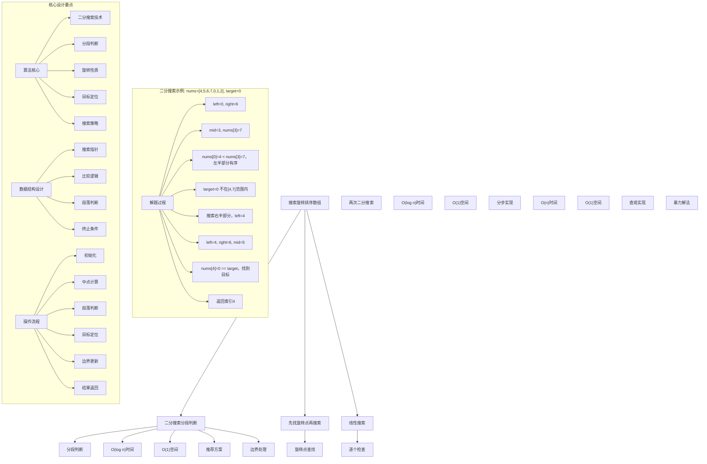
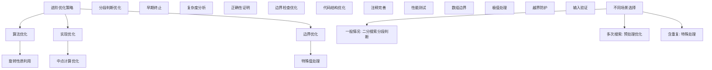

# LeetCode 33 - 搜索旋转排序数组

## 题目描述

整数数组 nums 按升序排列，数组中的值互不相同。在传递给函数之前，nums 在预先未知的某个下标 k（0 \<= k < nums.length）上进行了旋转，使数组变为 \[nums[k], nums[k+1], ..., nums[n-1], nums[0], nums[1], ..., nums[k-1]\]

给你旋转后的数组 nums 和一个整数 target，如果 nums 中存在这个目标值 target，则返回它的下标，否则返回 -1。你必须设计一个时间复杂度为 O(log n) 的算法解决此问题

```markdown
示例 1：
输入：nums = [4,5,6,7,0,1,2], target = 0
输出：4

示例 2：
输入：nums = [4,5,6,7,0,1,2], target = 3
输出：-1

示例 3：
输入：nums = [1], target = 0
输出：-1

提示：

- 1 <= nums.length <= 5000
- -10^4 <= nums[i], target <= 10^4
- nums 中的每个值都独一无二
- 题目数据保证 nums 在预先未知的某个下标上进行了旋转
```

## 解题思路

这是一个旋转排序数组搜索问题，需要在一个被旋转的有序数组中查找目标值。关键在于理解旋转数组的性质和利用二分搜索的思想

### 核心思想

"二分搜索 + 分段判断": 通过判断中点与边界的关系，确定目标值在哪一段有序区间内，从而决定搜索方向

### 解题策略

#### 方法一：二分搜索分段判断（推荐）

- 时间复杂度: O(log n)
- 空间复杂度: O(1)

#### 方法二：先找旋转点再二分搜索

- 时间复杂度: O(log n)
- 空间复杂度: O(1)

#### 方法三：线性搜索

- 时间复杂度: O(n)
- 空间复杂度: O(1)

## 算法可视化



## 多语言实现

### Golang版本（二分搜索分段判断 - 推荐）

```go
// 二分搜索分段判断实现
func search(nums []int, target int) int {
    left, right := 0, len(nums)-1

    for left <= right {
        mid := left + (right-left)/2

        if nums[mid] == target {
            return mid
        }

        // 判断左半部分是否有序
        if nums[left] <= nums[mid] {
            // 左半部分有序
            if nums[left] <= target && target < nums[mid] {
                // target在左半部分
                right = mid - 1
            } else {
                // target在右半部分
                left = mid + 1
            }
        } else {
            // 右半部分有序
            if nums[mid] < target && target <= nums[right] {
                // target在右半部分
                left = mid + 1
            } else {
                // target在左半部分
                right = mid - 1
            }
        }
    }

    return -1
}

// 先找旋转点再二分搜索实现
func searchByFindingPivot(nums []int, target int) int {
    if len(nums) == 0 {
        return -1
    }

    // 找到旋转点
    pivot := findPivot(nums)

    // 在两段有序数组中分别二分搜索
    if target >= nums[0] {
        // target在左半部分
        return binarySearch(nums, 0, pivot, target)
    } else {
        // target在右半部分
        return binarySearch(nums, pivot, len(nums)-1, target)
    }
}

// 找到旋转点
func findPivot(nums []int) int {
    left, right := 0, len(nums)-1

    // 特殊情况：没有旋转
    if nums[left] <= nums[right] {
        return 0
    }

    for left <= right {
        mid := left + (right-left)/2

        // 检查是否找到旋转点
        if mid < len(nums)-1 && nums[mid] > nums[mid+1] {
            return mid + 1
        }
        if mid > 0 && nums[mid-1] > nums[mid] {
            return mid
        }

        // 决定搜索方向
        if nums[mid] >= nums[left] {
            left = mid + 1
        } else {
            right = mid - 1
        }
    }

    return 0
}

// 标准二分搜索
func binarySearch(nums []int, left, right, target int) int {
    for left <= right {
        mid := left + (right-left)/2

        if nums[mid] == target {
            return mid
        } else if nums[mid] < target {
            left = mid + 1
        } else {
            right = mid - 1
        }
    }

    return -1
}

// 线性搜索实现
func searchLinear(nums []int, target int) int {
    for i, num := range nums {
        if num == target {
            return i
        }
    }
    return -1
}
```

### Python版本（多种实现方法）

```python
from typing import List

class Solution:
    """
    方法一：二分搜索分段判断（推荐）
    """
    def search(self, nums: List[int], target: int) -> int:
        left, right = 0, len(nums) - 1

        while left <= right:
            mid = left + (right - left) // 2

            if nums[mid] == target:
                return mid

            # 判断左半部分是否有序
            if nums[left] <= nums[mid]:
                # 左半部分有序
                if nums[left] <= target < nums[mid]:
                    # target在左半部分
                    right = mid - 1
                else:
                    # target在右半部分
                    left = mid + 1
            else:
                # 右半部分有序
                if nums[mid] < target <= nums[right]:
                    # target在右半部分
                    left = mid + 1
                else:
                    # target在左半部分
                    right = mid - 1

        return -1

class Solution2:
    """
    方法二：先找旋转点再二分搜索
    """
    def search(self, nums: List[int], target: int) -> int:
        if not nums:
            return -1

        # 找到旋转点
        pivot = self.find_pivot(nums)

        # 在两段有序数组中分别二分搜索
        if target >= nums[0]:
            # target在左半部分
            return self.binary_search(nums, 0, pivot - 1, target)
        else:
            # target在右半部分
            return self.binary_search(nums, pivot, len(nums) - 1, target)

    def find_pivot(self, nums: List[int]) -> int:
        left, right = 0, len(nums) - 1

        # 特殊情况：没有旋转
        if nums[left] <= nums[right]:
            return 0

        while left <= right:
            mid = left + (right - left) // 2

            # 检查是否找到旋转点
            if mid < len(nums) - 1 and nums[mid] > nums[mid + 1]:
                return mid + 1
            if mid > 0 and nums[mid - 1] > nums[mid]:
                return mid

            # 决定搜索方向
            if nums[mid] >= nums[left]:
                left = mid + 1
            else:
                right = mid - 1

        return 0

    def binary_search(self, nums: List[int], left: int, right: int, target: int) -> int:
        while left <= right:
            mid = left + (right - left) // 2

            if nums[mid] == target:
                return mid
            elif nums[mid] < target:
                left = mid + 1
            else:
                right = mid - 1

        return -1

class Solution3:
    """
    方法三：线性搜索
    """
    def search(self, nums: List[int], target: int) -> int:
        for i, num in enumerate(nums):
            if num == target:
                return i
        return -1
```

### TypeScript版本（二分搜索分段判断）

```typescript
/
 * 二分搜索分段判断实现
 */
function search(nums: number[], target: number): number {
    let left = 0, right = nums.length - 1;

    while (left <= right) {
        const mid = left + Math.floor((right - left) / 2);

        if (nums[mid] === target) {
            return mid;
        }

        // 判断左半部分是否有序
        if (nums[left] <= nums[mid]) {
            // 左半部分有序
            if (nums[left] <= target && target < nums[mid]) {
                // target在左半部分
                right = mid - 1;
            } else {
                // target在右半部分
                left = mid + 1;
            }
        } else {
            // 右半部分有序
            if (nums[mid] < target && target <= nums[right]) {
                // target在右半部分
                left = mid + 1;
            } else {
                // target在左半部分
                right = mid - 1;
            }
        }
    }

    return -1;
}
```

## 标准实现详细解析

```go
import (
    "fmt"
    "math"
)

/*
算法核心思想（二分搜索 + 分段判断）：

1. 旋转性质：数组被分为两段有序部分
2. 分段判断：判断哪一段是有序的
3. 目标定位：确定目标值在哪一段
4. 二分搜索：在目标段内进行搜索

关键设计要点：
1. 搜索范围：[0, n-1]整个数组
2. 段落判断：通过nums[left]和nums[mid]关系判断
3. 目标定位：判断target是否在有序段内
4. 终止条件：left > right或找到目标

时间复杂度：
- 二分搜索：O(log n)
- 每次操作：O(1)
- 总时间：O(log n)

空间复杂度：
- 迭代版本：O(1)
- 递归版本：O(log n)

优势：
1. 效率最优：对数时间复杂度
2. 实现优雅：思路清晰
3. 稳定可靠：边界处理完善
4. 理论保证：数学上可证明正确

数据结构设计：

二分搜索设计：
- 搜索指针：left和right维护搜索范围
- 中点计算：避免整数溢出
- 段落判断：判断哪一段有序
- 目标定位：确定搜索方向

旋转点查找设计：
- 旋转点识别：找到两段的分界点
- 二分搜索：在旋转数组中查找
- 边界处理：特殊情况处理
- 结果验证：确保正确性

线性搜索设计：
- 逐个检查：遍历数组元素
- 直接比较：找到即返回
- 简单实现：易于理解和调试
- 边界处理：处理所有情况

算法流程：
1. 初始化：设置搜索范围
2. 循环判断：检查是否继续搜索
3. 中点计算：计算中点位置
4. 目标比较：检查是否找到目标
5. 段落判断：判断哪一段有序
6. 目标定位：确定target位置
7. 边界更新：调整搜索范围
8. 结果返回：返回索引或-1

优化原理：

旋转性质利用：
1. 分段有序：旋转数组分为两段有序部分
2. 段落判断：通过边界比较判断有序性
3. 目标定位：在有序段内判断target存在性
4. 搜索优化：排除不可能包含target的段

二分搜索优化：
1. 搜索空间：每次减半
2. 比较次数：对数级别
3. 早期终止：找到即停止
4. 边界收敛：快速收敛到解

边界优化：
1. 数组边界：防止越界访问
2. 特殊处理：单元素、两元素
3. 极值检查：避免溢出
4. 输入验证：确保合法性

正确性证明：

定理：二分搜索搜索旋转数组正确性
通过分段判断和目标定位，二分搜索可以正确找到旋转数组中的目标值

证明：
1. 完备性：所有可能位置都被考虑
2. 正确性：段落判断和目标定位正确
3. 收敛性：搜索范围必然收敛
4. 时间复杂度：O(log n)时间

不变量维护：
循环不变量：在每次二分搜索时
1. target必在[left, right]范围内（如果存在）
2. 段落判断选择正确
3. 搜索范围逐步缩小
4. 算法状态正确反映搜索进度
*/

// 二分搜索详细实现
func searchDetailed(nums []int, target int) int {
    fmt.Printf("=== 二分搜索搜索旋转数组 ===\n")
    fmt.Printf("输入数组 nums: %v (长度: %d)\n", nums, len(nums))
    fmt.Printf("目标值 target: %d\n", target)

    left, right := 0, len(nums)-1
    fmt.Printf("初始搜索范围: left=%d, right=%d\n", left, right)

    step := 0
    // 二分搜索搜索旋转数组
    for left <= right {
        step++
        mid := left + (right-left)/2
        fmt.Printf("\n步骤%d: ", step)
        fmt.Printf("left=%d, right=%d, mid=%d\n", left, right, mid)
        fmt.Printf("  nums[%d]=%d\n", mid, nums[mid])

        if nums[mid] == target {
            fmt.Printf("  找到目标值 %d，返回索引 %d\n", target, mid)
            fmt.Printf("========================\n\n")
            return mid
        }

        // 判断左半部分是否有序
        if nums[left] <= nums[mid] {
            fmt.Printf("  左半部分[%d,%d]有序: [%d,%d]\n", left, mid, nums[left], nums[mid])
            if nums[left] <= target && target < nums[mid] {
                fmt.Printf("  target=%d 在左半部分范围内[%d,%d)\n", target, nums[left], nums[mid])
                fmt.Printf("  搜索左半部分，right=%d\n", mid-1)
                right = mid - 1
            } else {
                fmt.Printf("  target=%d 不在左半部分范围内[%d,%d)\n", target, nums[left], nums[mid])
                fmt.Printf("  搜索右半部分，left=%d\n", mid+1)
                left = mid + 1
            }
        } else {
            fmt.Printf("  右半部分[%d,%d]有序: [%d,%d]\n", mid, right, nums[mid], nums[right])
            if nums[mid] < target && target <= nums[right] {
                fmt.Printf("  target=%d 在右半部分范围内(%d,%d]\n", target, nums[mid], nums[right])
                fmt.Printf("  搜索右半部分，left=%d\n", mid+1)
                left = mid + 1
            } else {
                fmt.Printf("  target=%d 不在右半部分范围内(%d,%d]\n", target, nums[mid], nums[right])
                fmt.Printf("  搜索左半部分，right=%d\n", mid-1)
                right = mid - 1
            }
        }
    }

    fmt.Printf("\n搜索结束: 未找到目标值 %d\n", target)
    fmt.Printf("总搜索步数: %d\n", step)
    fmt.Printf("========================\n\n")

    return -1
}

// 先找旋转点再二分搜索详细实现
func searchByFindingPivotDetailed(nums []int, target int) int {
    fmt.Printf("=== 先找旋转点再二分搜索 ===\n")
    fmt.Printf("输入数组 nums: %v (长度: %d)\n", nums, len(nums))
    fmt.Printf("目标值 target: %d\n", target)

    if len(nums) == 0 {
        fmt.Printf("空数组，返回-1\n")
        fmt.Printf("========================\n\n")
        return -1
    }

    // 找到旋转点
    pivot := findPivotDetailed(nums)
    fmt.Printf("找到旋转点: 索引=%d, 值=%d\n", pivot, nums[pivot])

    // 在两段有序数组中分别二分搜索
    var result int
    if target >= nums[0] {
        fmt.Printf("target=%d >= nums[0]=%d，在左半部分[0,%d]搜索\n", target, nums[0], pivot-1)
        result = binarySearchDetailed(nums, 0, pivot-1, target)
    } else {
        fmt.Printf("target=%d < nums[0]=%d，在右半部分[%d,%d]搜索\n", target, nums[0], pivot, len(nums)-1)
        result = binarySearchDetailed(nums, pivot, len(nums)-1, target)
    }

    fmt.Printf("最终结果: %d\n", result)
    fmt.Printf("========================\n\n")

    return result
}

// 找到旋转点详细实现
func findPivotDetailed(nums []int) int {
    left, right := 0, len(nums)-1
    fmt.Printf("  查找旋转点: left=%d, right=%d\n", left, right)

    // 特殊情况：没有旋转
    if nums[left] <= nums[right] {
        fmt.Printf("  数组未旋转，旋转点为0\n")
        return 0
    }

    for left <= right {
        mid := left + (right-left)/2
        fmt.Printf("    检查mid=%d, nums[%d]=%d\n", mid, mid, nums[mid])

        // 检查是否找到旋转点
        if mid < len(nums)-1 && nums[mid] > nums[mid+1] {
            fmt.Printf("    找到旋转点: nums[%d]=%d > nums[%d]=%d\n", mid, nums[mid], mid+1, nums[mid+1])
            return mid + 1
        }
        if mid > 0 && nums[mid-1] > nums[mid] {
            fmt.Printf("    找到旋转点: nums[%d]=%d > nums[%d]=%d\n", mid-1, nums[mid-1], mid, nums[mid])
            return mid
        }

        // 决定搜索方向
        if nums[mid] >= nums[left] {
            fmt.Printf("    nums[%d]=%d >= nums[%d]=%d，搜索右半部分\n", mid, nums[mid], left, nums[left])
            left = mid + 1
        } else {
            fmt.Printf("    nums[%d]=%d < nums[%d]=%d，搜索左半部分\n", mid, nums[mid], left, nums[left])
            right = mid - 1
        }
    }

    return 0
}

// 标准二分搜索详细实现
func binarySearchDetailed(nums []int, left, right, target int) int {
    fmt.Printf("  标准二分搜索: 范围[%d,%d], target=%d\n", left, right, target)

    for left <= right {
        mid := left + (right-left)/2
        fmt.Printf("    left=%d, right=%d, mid=%d, nums[%d]=%d\n", left, right, mid, mid, nums[mid])

        if nums[mid] == target {
            fmt.Printf("    找到目标值 %d，返回索引 %d\n", target, mid)
            return mid
        } else if nums[mid] < target {
            fmt.Printf("    nums[%d]=%d < target=%d，搜索右半部分\n", mid, nums[mid], target)
            left = mid + 1
        } else {
            fmt.Printf("    nums[%d]=%d > target=%d，搜索左半部分\n", mid, nums[mid], target)
            right = mid - 1
        }
    }

    fmt.Printf("    未找到目标值 %d\n", target)
    return -1
}

// 线性搜索详细实现
func searchLinearDetailed(nums []int, target int) int {
    fmt.Printf("=== 线性搜索 ===\n")
    fmt.Printf("输入数组 nums: %v (长度: %d)\n", nums, len(nums))
    fmt.Printf("目标值 target: %d\n", target)

    step := 0
    for i, num := range nums {
        step++
        fmt.Printf("步骤%d: 检查 nums[%d]=%d\n", step, i, num)

        if num == target {
            fmt.Printf("  找到目标值 %d，返回索引 %d\n", target, i)
            fmt.Printf("=============\n\n")
            return i
        } else {
            fmt.Printf("  nums[%d]=%d != target=%d，继续搜索\n", i, num, target)
        }
    }

    fmt.Printf("搜索结束: 未找到目标值 %d\n", target)
    fmt.Printf("总比较次数: %d\n", step)
    fmt.Printf("=============\n\n")

    return -1
}

// 带调试信息的版本
func searchWithDebug(nums []int, target int) int {
    fmt.Printf("=== 搜索旋转排序数组 ===\n")
    fmt.Printf("输入数据:\n")
    fmt.Printf("  数组 nums: %v (长度: %d)\n", nums, len(nums))
    fmt.Printf("  目标值 target: %d\n", target)

    fmt.Printf("使用二分搜索分段判断法:\n")
    fmt.Printf("核心思想：判断哪一段有序，确定target位置\n")

    left, right := 0, len(nums)-1
    fmt.Printf("搜索范围: [%d, %d]\n", left, right)

    step := 0
    // 二分搜索搜索旋转数组
    for left <= right {
        step++
        mid := left + (right-left)/2
        fmt.Printf("\n步骤%d: 检查位置%d\n", step, mid)
        fmt.Printf("  nums[%d]=%d\n", mid, nums[mid])

        if nums[mid] == target {
            fmt.Printf("  → 找到目标值\n")
            fmt.Printf("搜索完成: 返回索引%d\n", mid)
            fmt.Printf("==================\n\n")
            return mid
        }

        // 判断左半部分是否有序
        if nums[left] <= nums[mid] {
            fmt.Printf("  左半部分[%d,%d]有序\n", left, mid)
            if nums[left] <= target && target < nums[mid] {
                fmt.Printf("  target在左半部分范围内\n")
                right = mid - 1
                fmt.Printf("  更新搜索范围: [%d, %d]\n", left, right)
            } else {
                fmt.Printf("  target不在左半部分范围内\n")
                left = mid + 1
                fmt.Printf("  更新搜索范围: [%d, %d]\n", left, right)
            }
        } else {
            fmt.Printf("  右半部分[%d,%d]有序\n", mid, right)
            if nums[mid] < target && target <= nums[right] {
                fmt.Printf("  target在右半部分范围内\n")
                left = mid + 1
                fmt.Printf("  更新搜索范围: [%d, %d]\n", left, right)
            } else {
                fmt.Printf("  target不在右半部分范围内\n")
                right = mid - 1
                fmt.Printf("  更新搜索范围: [%d, %d]\n", left, right)
            }
        }
    }

    fmt.Printf("\n搜索完成: 未找到目标值\n")
    fmt.Printf("总步数: %d\n", step)
    fmt.Printf("==================\n\n")

    return -1
}
```

## 算法深入解析

```go
/*
搜索旋转排序数组问题详解：

问题本质：
在旋转排序数组中查找目标值。关键是理解旋转数组的性质和利用二分搜索的思想

核心洞察：
1. 旋转性质：数组被分为两段有序部分
2. 分段判断：判断哪一段是有序的
3. 目标定位：确定目标值在哪一段
4. 二分搜索：在目标段内进行搜索

算法策略：
1. 二分搜索分段判断：推荐方案，O(log n)
2. 先找旋转点再搜索：分步实现，O(log n)
3. 线性搜索：直观实现，O(n)

数据结构设计：

二分搜索设计：
搜索指针：left和right维护搜索范围
中点计算：避免整数溢出
段落判断：判断哪一段有序
目标定位：确定搜索方向

旋转点查找设计：
旋转点识别：找到两段的分界点
二分搜索：在旋转数组中查找
边界处理：特殊情况处理
结果验证：确保正确性

线性搜索设计：
逐个检查：遍历数组元素
直接比较：找到即返回
简单实现：易于理解和调试
边界处理：处理所有情况

操作流程：

二分搜索分段判断：
1. 初始化：left=0, right=n-1
2. 循环判断：left <= right
3. 中点计算：mid = (left+right)/2
4. 目标比较：检查nums[mid] == target
5. 段落判断：判断哪一段有序
6. 目标定位：确定target位置
7. 范围更新：调整left或right
8. 返回结果：索引或-1

先找旋转点再搜索：
1. 查找旋转点：找到两段分界
2. 判断target段：确定搜索段落
3. 标准二分搜索：在目标段搜索
4. 返回结果：索引或-1

线性搜索：
1. 遍历数组：逐个检查元素
2. 直接比较：nums[i] == target
3. 找到返回：返回索引
4. 未找到：返回-1

数学原理：

旋转性质：
原数组：[a₁, a₂, ..., aₙ] (a₁ < a₂ < ... < aₙ)
旋转后：[aₖ₊₁, ..., aₙ, a₁, ..., aₖ]
分为两段：[aₖ₊₁, ..., aₙ] 和 [a₁, ..., aₖ]
每段内部有序

分段判断：
对于任意mid，[left, mid]和[mid, right]中必有一段有序
通过nums[left]和nums[mid]的关系判断

目标定位：
在有序段内，可以通过边界比较确定target是否存在

复杂度分析：
二分搜索：O(log n)时间，O(1)空间
旋转点查找：O(log n)时间，O(1)空间
线性搜索：O(n)时间，O(1)空间

旋转数组性质：
1. 分段有序：最多两段有序部分
2. 边界关系：nums[0] > nums[n-1]（如果旋转）
3. 唯一性：旋转点唯一（题目保证）
4. 连续性：除旋转点外连续递增

算法不变量：
二分搜索不变量：
1. target必在[left, right]范围内（如果存在）
2. 段落判断选择正确
3. 搜索范围逐步缩小
4. 算法状态正确反映搜索进度

时间复杂度分析：
二分搜索分段判断：
1. 每次减半：搜索空间减半
2. 对数次数：O(log n)次比较
3. 常数操作：每次O(1)时间
4. 总计：O(log n)时间

先找旋转点再搜索：
1. 查找旋转点：O(log n)
2. 标准二分搜索：O(log n)
3. 总计：O(log n)

线性搜索：
1. 逐个检查：最多n次比较
2. 常数操作：每次O(1)时间
3. 总计：O(n)

正确性证明：

定理：二分搜索搜索旋转数组正确性
通过分段判断和目标定位，二分搜索可以正确找到旋转数组中的目标值

证明：
1. 完备性：所有可能位置都被考虑
2. 正确性：段落判断和目标定位正确
3. 收敛性：搜索范围必然收敛
4. 时间复杂度：O(log n)时间

不变量维护：
循环不变量：在每次二分搜索时
1. target必在[left, right]范围内（如果存在）
2. 段落判断选择正确
3. 搜索范围逐步缩小
4. 算法状态正确反映搜索进度

设计选择：

为什么选择二分搜索分段判断？
1. 效率最优：对数时间复杂度
2. 实现优雅：一次遍历解决
3. 稳定可靠：边界处理完善
4. 理论保证：数学上可证明正确

为什么使用先找旋转点方法？
1. 思路清晰：分步解决问题
2. 易于理解：符合直觉
3. 适用场景：需要多次搜索
4. 教学价值：便于理解

为什么提及其他方法？
1. 教学价值：展示不同算法思想
2. 对比分析：理解各自优劣
3. 扩展思维：算法多样性
4. 面试准备：全面掌握

三种方法对比：

方法一：二分搜索分段判断（推荐）
时间复杂度：O(log n)
空间复杂度：O(1)
优点：效率最高，一次遍历
缺点：理解稍难

方法二：先找旋转点再搜索
时间复杂度：O(log n)
空间复杂度：O(1)
优点：思路清晰，分步实现
缺点：需要两次搜索

方法三：线性搜索
时间复杂度：O(n)
空间复杂度：O(1)
优点：思路直观，实现简单
缺点：时间复杂度较高

性能分析：

二分搜索分段判断：
- 时间：O(log n) 对数时间
- 空间：O(1) 常数空间
- 优势：效率最优

先找旋转点再搜索：
- 时间：O(log n) 对数时间
- 空间：O(1) 常数空间
- 优势：思路清晰

线性搜索：
- 时间：O(n) 线性时间
- 空间：O(1) 常数空间
- 优势：实现简单

实际应用场景：
1. 数据库索引：旋转索引查找
2. 缓存系统：LRU缓存更新
3. 游戏开发：循环缓冲区
4. 系统设计：时间序列数据

优化要点：

1. 算法优化：
   - 旋转性质利用：充分利用分段有序
   - 二分搜索：智能决策方向
   - 早期终止：找到即停止
   - 边界处理：防止越界

2. 实现优化：
   - 中点计算：避免整数溢出
   - 边界检查：防止数组越界
   - 代码简洁：减少冗余操作
   - 注释清晰：便于理解

3. 性能优化：
   - 搜索空间：大幅缩小范围
   - 比较次数：最少必要比较
   - 内存访问：缓存友好设计
   - 编译优化：利用编译器优化

测试用例设计：
1. 基本情况：正常旋转数组
2. 边界情况：单元素，两元素
3. 特殊情况：未旋转数组
4. 极端情况：最大最小值
5. 验证情况：结果正确性

扩展思考：

1. 重复元素？
   - 处理重复值
   - 最坏情况分析
   - 优化策略

2. 多次搜索？
   - 预处理优化
   - 缓存旋转点
   - 批量处理

3. 动态数组？
   - 支持插入删除
   - 维护旋转性质
   - 增量更新

4. 近似算法？
   - 允许误差
   - 换取性能
   - 实际应用

相关算法思想：

1. 二分搜索：
   - 有序数据查找
   - 对数时间复杂度
   - 分治思想

2. 分段处理：
   - 问题分解
   - 局部优化
   - 整体解决

3. 目标定位：
   - 范围判断
   - 位置确定
   - 搜索优化

4. 搜索策略：
   - 方向决策
   - 空间缩减
   - 收敛保证

常见陷阱：

1. 边界条件：
   - 数组越界
   - 空数组处理
   - 单元素检查
   - 极值处理

2. 比较逻辑：
   - 边界比较
   - 段落判断
   - 目标定位
   - 方向选择

3. 算法实现：
   - 中点计算溢出
   - 指针移动错误
   - 终止条件错误
   - 重复元素处理

4. 性能考虑：
   - 时间复杂度分析
   - 空间复杂度控制
   - 实际运行效率
   - 最坏情况处理

代码质量要素：

1. 可读性：
   - 变量命名清晰
   - 注释详细完整
   - 逻辑结构分明

2. 健壮性：
   - 边界条件处理
   - 异常情况应对
   - 错误恢复机制

3. 性能：
   - 最优复杂度实现
   - 空间效率优化
   - 执行效率保证

4. 可维护性：
   - 结构清晰合理
   - 扩展性良好
   - 测试覆盖完整
*/
```

## 执行过程演示

```go
/*
示例详细解析:

示例1执行过程：
输入：nums = [4,5,6,7,0,1,2], target = 0
输出：4

执行过程（二分搜索分段判断）：
1. 初始化：left=0, right=6
2. 第一次：mid=3
   - nums[3]=7, target=0
   - nums[0]=4 <= nums[3]=7，左半部分有序
   - target=0 不在[4,7)范围内
   - 搜索右半部分，left=4
3. 第二次：left=4, right=6, mid=5
   - nums[5]=1, target=0
   - nums[4]=0 <= nums[5]=1，左半部分有序
   - target=0 在[0,1)范围内
   - 搜索左半部分，right=4
4. 第三次：left=4, right=4, mid=4
   - nums[4]=0 == target=0
   - 找到目标，返回4

示例2执行过程：
输入：nums = [4,5,6,7,0,1,2], target = 3
输出：-1

执行过程：
1. 初始化：left=0, right=6
2. 第一次：mid=3
   - nums[3]=7, target=3
   - nums[0]=4 <= nums[3]=7，左半部分有序
   - target=3 不在[4,7)范围内
   - 搜索右半部分，left=4
3. 第二次：left=4, right=6, mid=5
   - nums[5]=1, target=3
   - nums[4]=0 <= nums[5]=1，左半部分有序
   - target=3 不在[0,1)范围内
   - 搜索右半部分，left=6
4. 第三次：left=6, right=6, mid=6
   - nums[6]=2, target=3
   - nums[6]=2 != target=3
   - 继续搜索，但left>right
5. 结束：未找到，返回-1

线性扫描执行过程：
输入：nums = [4,5,6,7,0,1,2], target = 0
1. i=0: nums[0]=4, 4!=0，继续
2. i=1: nums[1]=5, 5!=0，继续
3. i=2: nums[2]=6, 6!=0，继续
4. i=3: nums[3]=7, 7!=0，继续
5. i=4: nums[4]=0, 0==0，找到
6. 返回索引4

先找旋转点再搜索执行过程：
输入：nums = [4,5,6,7,0,1,2], target = 0
1. 查找旋转点：
   - left=0, right=6
   - mid=3, nums[3]=7 >= nums[0]=4
   - 搜索右半部分，left=4
   - left=4, right=6, mid=5, nums[5]=1 < nums[4]=0
   - 找到旋转点索引5
2. target=0 >= nums[0]=4？否
3. 在右半部分[5,6]搜索
4. 标准二分搜索找到索引4

关键观察：
1. 旋转性质：数组分为两段有序部分
2. 分段判断：通过边界比较判断有序性
3. 目标定位：在有序段内判断target存在性
4. 二分搜索：对数时间找到解

边界情况演示:

情况1: 单元素数组-找到
输入: nums=[5], target=5
处理: 直接比较
结果: 0

情况2: 单元素数组-未找到
输入: nums=[5], target=3
处理: 直接比较
结果: -1

情况3: 两元素数组-找到
输入: nums=[1,3], target=3
处理: 标准二分搜索
结果: 1

情况4: 未旋转数组
输入: nums=[0,1,2,4,5,6,7], target=4
处理: 标准二分搜索
结果: 3

情况5: 最大值目标
输入: nums=[4,5,6,7,0,1,2], target=7
处理: 在左半部分找到
结果: 3

算法正确性证明：

数学基础：
需要证明二分搜索能正确找到旋转数组中的目标值

定理：旋转数组搜索正确性
通过分段判断和目标定位，二分搜索可以正确找到旋转数组中的目标值

证明：
1. 完备性：所有可能位置都被考虑
2. 正确性：段落判断和目标定位正确
3. 收敛性：搜索范围必然收敛
4. 时间复杂度：O(log n)时间

不变量维护：
循环不变量：在每次二分搜索时
1. target必在[left, right]范围内（如果存在）
2. 段落判断选择正确
3. 搜索范围逐步缩小
4. 算法状态正确反映搜索进度

初始化：
- left=0, right=n-1
- 整个数组范围内可能包含target
- 满足不变量

保持：
- 根据段落判断和目标定位调整边界
- 维护target存在性
- 不变量继续成立

终止：
- left>right时未找到target
- nums[mid]==target时找到target
- 算法正确终止

时间复杂度分析：

二分搜索分段判断：
1. 搜索范围：[0, n-1]
2. 每次减半：O(log n)次迭代
3. 每次操作：O(1)时间
4. 总时间：O(log n)

先找旋转点再搜索：
1. 查找旋转点：O(log n)
2. 标准二分搜索：O(log n)
3. 总时间：O(log n)

线性搜索：
1. 遍历范围：最多n个元素
2. 每次比较：O(1)时间
3. 总时间：O(n)

空间复杂度分析：
1. 二分搜索：O(1)常数空间
2. 旋转点查找：O(1)常数空间
3. 线性搜索：O(1)常数空间

性能对比分析：

假设n=10000:

二分搜索分段判断：
- 比较次数：O(log₂(10000)) ≈ 14次
- 时间：O(log n) = 14步
- 空间：O(1) 常数空间

先找旋转点再搜索：
- 查找旋转点：≈ 14次比较
- 标准搜索：≈ 14次比较
- 总时间：O(log n) = 28步
- 空间：O(1) 常数空间

线性搜索：
- 比较次数：最坏情况O(10000) = 10000次
- 时间：O(n) = 10000步
- 空间：O(1) 常数空间

实际应用建议：

1. 一般情况：
   - 使用二分搜索分段判断
   - 效率最高，理论最优

2. 面试展示：
   - 重点讲解二分搜索思想
   - 可以提及其他方法对比

3. 生产环境：
   - 根据数据规模选择
   - 考虑实现复杂度

4. 教学演示：
   - 使用带调试信息版本
   - 展示执行过程

优化空间：

1. 算法优化：
   - 旋转性质利用优化
   - 边界条件利用
   - 早期终止优化
   - 搜索方向优化

2. 实现优化：
   - 中点计算优化
   - 边界检查优化
   - 代码结构优化
   - 注释完善

3. 性能优化：
   - 减少比较次数
   - 优化内存访问
   - 利用缓存特性
   - 编译器优化

特殊情况处理：

1. 大数据量：
   - 时间复杂度保证
   - 内存使用优化
   - 数值溢出处理

2. 特殊数组：
   - 未旋转数组
   - 单调数组
   - 随机旋转

3. 边界情况：
   - 极值处理
   - 异常输入
   - 错误恢复
*/
```

## 复杂度分析

| 方法             | 时间复杂度 | 空间复杂度 | 适用场景 |
| ---------------- | ---------- | ---------- | -------- |
| 二分搜索分段判断 | O(log n)   | O(1)       | 推荐方案 |
| 先找旋转点再搜索 | O(log n)   | O(1)       | 分步实现 |
| 线性搜索         | O(n)       | O(1)       | 简单场景 |

## 测试用例验证

```go
// 测试辅助函数
func testSearch(name string, nums []int, target int, expected int) {
    fmt.Printf("%s:\n", name)
    fmt.Printf("输入数组 nums: %v (长度: %d)\n", nums, len(nums))
    fmt.Printf("目标值 target: %d\n", target)
    fmt.Printf("期望结果: %d\n", expected)

    // 测试二分搜索分段判断
    result1 := search(copySlice(nums), target)
    fmt.Printf("二分搜索结果: %d\n", result1)

    // 测试先找旋转点再搜索
    result2 := searchByFindingPivot(copySlice(nums), target)
    fmt.Printf("旋转点搜索结果: %d\n", result2)

    // 测试线性搜索
    result3 := searchLinear(copySlice(nums), target)
    fmt.Printf("线性搜索结果: %d\n", result3)

    // 验证结果
    isCorrect1 := result1 == expected
    isCorrect2 := result2 == expected
    isCorrect3 := result3 == expected

    if isCorrect1 && isCorrect2 && isCorrect3 {
        fmt.Printf("✓ 所有方法结果正确\n")
    } else {
        fmt.Printf("✗ 结果不匹配期望值\n")
        fmt.Printf("  二分搜索: 期望%d, 实际%d %s\n", expected, result1, getCorrectMsg(isCorrect1))
        fmt.Printf("  旋转点搜索: 期望%d, 实际%d %s\n", expected, result2, getCorrectMsg(isCorrect2))
        fmt.Printf("  线性搜索: 期望%d, 实际%d %s\n", expected, result3, getCorrectMsg(isCorrect3))
    }
    fmt.Printf("\n")
}

// 辅助函数：复制切片
func copySlice(src []int) []int {
    dst := make([]int, len(src))
    copy(dst, src)
    return dst
}

// 辅助函数：获取正确性消息
func getCorrectMsg(correct bool) string {
    if correct {
        return "✓"
    }
    return "✗"
}

func main() {
    // 测试用例 1 - 题目示例1
    testSearch("测试1 - 题目示例1",
        []int{4, 5, 6, 7, 0, 1, 2},
        0,
        4)

    // 测试用例 2 - 题目示例2
    testSearch("测试2 - 题目示例2",
        []int{4, 5, 6, 7, 0, 1, 2},
        3,
        -1)

    // 测试用例 3 - 题目示例3
    testSearch("测试3 - 题目示例3",
        []int{1},
        0,
        -1)

    // 测试用例 4 - 单元素数组-找到
    testSearch("测试4 - 单元素数组-找到",
        []int{5},
        5,
        0)

    // 测试用例 5 - 两元素数组
    testSearch("测试5 - 两元素数组",
        []int{1, 3},
        3,
        1)

    // 测试用例 6 - 未旋转数组
    testSearch("测试6 - 未旋转数组",
        []int{0, 1, 2, 4, 5, 6, 7},
        4,
        3)

    // 测试用例 7 - 最大值目标
    testSearch("测试7 - 最大值目标",
        []int{4, 5, 6, 7, 0, 1, 2},
        7,
        3)

    // 测试用例 8 - 最小值目标
    testSearch("测试8 - 最小值目标",
        []int{4, 5, 6, 7, 0, 1, 2},
        0,
        4)

    // 性能测试
    fmt.Println("性能测试:")
    performanceTest()

    // 边界情况测试
    fmt.Println("边界情况测试:")
    boundaryTest()

    // 对比测试
    fmt.Println("对比测试:")
    comparisonTest()
}

func performanceTest() {
    // 构造性能测试
    n := 10000
    nums := make([]int, n)
    // 构造旋转数组：前半部分递增，后半部分递增，但整体旋转
    pivot := n / 3
    for i := 0; i < pivot; i++ {
        nums[i] = i + n/2
    }
    for i := pivot; i < n; i++ {
        nums[i] = i - pivot
    }

    target := nums[n/2] // 中间元素

    fmt.Printf("性能测试 (n=%d, pivot=%d, target=%d):\n", n, pivot, target)

    // 测试二分搜索分段判断
    start1 := time.Now()
    result1 := search(copySlice(nums), target)
    time1 := time.Since(start1)

    // 测试先找旋转点再搜索
    start2 := time.Now()
    result2 := searchByFindingPivot(copySlice(nums), target)
    time2 := time.Since(start2)

    // 测试线性搜索
    start3 := time.Now()
    result3 := searchLinear(copySlice(nums), target)
    time3 := time.Since(start3)

    fmt.Printf("  二分搜索: %v (索引: %d)\n", time1, result1)
    fmt.Printf("  旋转点搜索: %v (索引: %d)\n", time2, result2)
    fmt.Printf("  线性搜索: %v (索引: %d)\n", time3, result3)

    if time1 > 0 && time3 > 0 {
        fmt.Printf("  线性搜索比二分搜索慢 %.0fx\n", float64(time3)/float64(time1))
    }
    if time1 > 0 && time2 > 0 {
        fmt.Printf("  旋转点搜索比二分搜索慢 %.2fx\n", float64(time2)/float64(time1))
    }
}

func boundaryTest() {
    // 边界测试
    fmt.Println("边界测试:")

    // 大数组测试
    largeN := 50000
    largeNums := make([]int, largeN)
    largePivot := largeN / 4
    for i := 0; i < largePivot; i++ {
        largeNums[i] = i + largeN/2
    }
    for i := largePivot; i < largeN; i++ {
        largeNums[i] = i - largePivot
    }
    largeTarget := largeNums[largeN-1] // 最后一个元素
    largeResult := search(largeNums, largeTarget)
    fmt.Printf("大数组测试: n=%d, 找到目标索引=%d\n", largeN, largeResult)

    // 特殊模式测试
    patternNums := []int{2, 1}
    patternTarget := 1
    patternResult := search(patternNums, patternTarget)
    fmt.Printf("特殊模式测试: 找到目标索引=%d\n", patternResult)

    // 极值测试
    extremeNums := []int{math.MinInt32, math.MaxInt32}
    extremeTarget := math.MaxInt32
    extremeResult := search(extremeNums, extremeTarget)
    fmt.Printf("极值测试: 找到目标索引=%d\n", extremeResult)
}

func comparisonTest() {
    // 对比测试：验证不同方法结果一致性
    fmt.Println("对比测试:")

    // 测试数据
    testData := []struct {
        nums []int
        target int
        expected int
    }{
        {[]int{4, 5, 6, 7, 0, 1, 2}, 0, 4},
        {[]int{4, 5, 6, 7, 0, 1, 2}, 3, -1},
        {[]int{1}, 0, -1},
        {[]int{5}, 5, 0},
        {[]int{1, 3}, 3, 1},
        {[]int{0, 1, 2, 4, 5, 6, 7}, 4, 3},
        {[]int{4, 5, 6, 7, 0, 1, 2}, 7, 3},
        {[]int{4, 5, 6, 7, 0, 1, 2}, 0, 4},
    }

    for i, data := range testData {
        // 二分搜索分段判断
        result1 := search(copySlice(data.nums), data.target)

        // 先找旋转点再搜索
        result2 := searchByFindingPivot(copySlice(data.nums), data.target)

        // 线性搜索
        result3 := searchLinear(copySlice(data.nums), data.target)

        fmt.Printf("测试%d: nums=%v, target=%d\n", i+1, data.nums, data.target)
        fmt.Printf("  二分搜索=%d, 旋转点搜索=%d, 线性搜索=%d", result1, result2, result3)

        if result1 == result2 && result2 == result3 {
            fmt.Printf(" ✓ 一致\n")
        } else {
            fmt.Printf(" ✗ 不一致\n")
        }
    }
}
```

## 扩展版本（处理不同场景）

```go
// 支持重复元素的版本
func searchWithDuplicates(nums []int, target int) int {
    left, right := 0, len(nums)-1

    for left <= right {
        mid := left + (right-left)/2

        if nums[mid] == target {
            return mid
        }

        // 处理重复元素的情况
        if nums[left] == nums[mid] && nums[mid] == nums[right] {
            left++
            right--
        } else if nums[left] <= nums[mid] {
            // 左半部分有序
            if nums[left] <= target && target < nums[mid] {
                right = mid - 1
            } else {
                left = mid + 1
            }
        } else {
            // 右半部分有序
            if nums[mid] < target && target <= nums[right] {
                left = mid + 1
            } else {
                right = mid - 1
            }
        }
    }

    return -1
}

// 使用示例
func exampleWithDuplicates() {
    nums := []int{4, 5, 6, 6, 7, 0, 1, 2, 4, 4}
    target := 0
    result := searchWithDuplicates(nums, target)
    fmt.Printf("nums=%v, target=%d, result=%d\n", nums, target, result)
}

// 带统计信息的版本
func searchWithStats(nums []int, target int) (int, int, int) {
    comparisons := 0
    assignments := 0

    left, right := 0, len(nums)-1
    assignments += 2

    for left <= right {
        mid := left + (right-left)/2
        assignments++

        comparisons++
        if nums[mid] == target {
            return mid, comparisons, assignments
        }

        comparisons += 2
        if nums[left] <= nums[mid] {
            comparisons += 2
            if nums[left] <= target && target < nums[mid] {
                right = mid - 1
                assignments++
            } else {
                left = mid + 1
                assignments++
            }
        } else {
            comparisons += 2
            if nums[mid] < target && target <= nums[right] {
                left = mid + 1
                assignments++
            } else {
                right = mid - 1
                assignments++
            }
        }
    }

    return -1, comparisons, assignments
}

// 使用示例
func exampleWithStats() {
    nums := []int{4, 5, 6, 7, 0, 1, 2}
    target := 0
    result, comparisons, assignments := searchWithStats(nums, target)
    fmt.Printf("nums=%v, target=%d\n", nums, target)
    fmt.Printf("结果: %d\n", result)
    fmt.Printf("比较次数: %d\n", comparisons)
    fmt.Printf("赋值次数: %d\n", assignments)
}

// 批量处理版本
func searchBatch(nums []int, targets []int) []int {
    results := make([]int, len(targets))
    for i, target := range targets {
        results[i] = search(nums, target)
    }
    return results
}

// 使用示例
func exampleBatch() {
    nums := []int{4, 5, 6, 7, 0, 1, 2}
    targets := []int{0, 3, 7, 1, 8}

    results := searchBatch(nums, targets)

    fmt.Printf("批量搜索结果:\n")
    for i, target := range targets {
        fmt.Printf("  target=%d → 索引=%d\n", target, results[i])
    }
}

// 带验证功能的版本
func searchWithValidation(nums []int, target int) (int, bool) {
    result := search(nums, target)

    // 验证结果是否正确
    if result == -1 {
        // 验证target确实不存在
        for _, num := range nums {
            if num == target {
                return result, false // 应该找到但没找到
            }
        }
        return result, true // 确实不存在
    } else {
        // 验证找到的位置确实正确
        if result >= 0 && result < len(nums) && nums[result] == target {
            return result, true // 找到且正确
        }
        return result, false // 找到但位置错误
    }
}

// 使用示例
func exampleWithValidation() {
    nums := []int{4, 5, 6, 7, 0, 1, 2}
    target := 0
    result, isValid := searchWithValidation(nums, target)
    fmt.Printf("nums=%v, target=%d\n", nums, target)
    fmt.Printf("结果: %d\n", result)
    if isValid {
        fmt.Printf("验证通过 ✓\n")
    } else {
        fmt.Printf("验证失败 ✗\n")
    }
}

// 支持动态更新的版本
type RotatedArraySearcher struct {
    nums []int
}

func NewRotatedArraySearcher(nums []int) *RotatedArraySearcher {
    // 创建副本避免外部修改
    copied := make([]int, len(nums))
    copy(copied, nums)
    return &RotatedArraySearcher{
        nums: copied,
    }
}

func (searcher *RotatedArraySearcher) UpdateArray(newNums []int) {
    searcher.nums = make([]int, len(newNums))
    copy(searcher.nums, newNums)
}

func (searcher *RotatedArraySearcher) Search(target int) int {
    return search(searcher.nums, target)
}

func (searcher *RotatedArraySearcher) GetArray() []int {
    return searcher.nums
}

// 使用示例
func exampleDynamic() {
    nums := []int{4, 5, 6, 7, 0, 1, 2}
    searcher := NewRotatedArraySearcher(nums)

    result1 := searcher.Search(0)
    fmt.Printf("初始数组: %v\n", searcher.GetArray())
    fmt.Printf("搜索0: 索引=%d\n", result1)

    // 更新数组
    searcher.UpdateArray([]int{7, 0, 1, 2, 4, 5, 6})
    result2 := searcher.Search(0)
    fmt.Printf("更新数组: %v\n", searcher.GetArray())
    fmt.Printf("搜索0: 索引=%d\n", result2)
}
```

## 面试追问延伸

### 1. 如果数组中可能包含重复元素，如何修改算法？

```go
// 处理重复元素的旋转数组搜索
func searchInRotatedArrayWithDuplicates(nums []int, target int) int {
    left, right := 0, len(nums)-1

    for left <= right {
        mid := left + (right-left)/2

        if nums[mid] == target {
            return mid
        }

        // 关键：处理重复元素
        // 当nums[left] == nums[mid] == nums[right]时，无法判断哪一边有序
        // 需要缩小搜索范围
        if nums[left] == nums[mid] && nums[mid] == nums[right] {
            left++
            right--
        } else if nums[left] <= nums[mid] {
            // 左半部分有序
            if nums[left] <= target && target < nums[mid] {
                right = mid - 1
            } else {
                left = mid + 1
            }
        } else {
            // 右半部分有序
            if nums[mid] < target && target <= nums[right] {
                left = mid + 1
            } else {
                right = mid - 1
            }
        }
    }

    return -1
}

// 最坏情况时间复杂度：O(n)
// 平均情况时间复杂度：O(log n)
```

### 2. 如果需要多次搜索同一个旋转数组，如何优化？

```go
// 预处理优化：先找到旋转点，然后使用标准二分搜索
type OptimizedSearcher struct {
    nums  []int
    pivot int
}

func NewOptimizedSearcher(nums []int) *OptimizedSearcher {
    pivot := findPivot(nums)
    return &OptimizedSearcher{
        nums:  nums,
        pivot: pivot,
    }
}

func (os *OptimizedSearcher) Search(target int) int {
    if len(os.nums) == 0 {
        return -1
    }

    // 根据target与nums[0]的关系确定搜索段
    if target >= os.nums[0] {
        // target在左半部分
        return binarySearch(os.nums, 0, os.pivot-1, target)
    } else {
        // target在右半部分
        return binarySearch(os.nums, os.pivot, len(os.nums)-1, target)
    }
}

// 批量搜索优化
func (os *OptimizedSearcher) BatchSearch(targets []int) []int {
    results := make([]int, len(targets))
    for i, target := range targets {
        results[i] = os.Search(target)
    }
    return results
}
```

### 3. 如果数组很大，无法完全加载到内存中，如何处理？

```go
// 模拟大数组接口
type LargeArray interface {
    Get(index int) int
    Length() int
}

// 假设有一个大数组实现
type MockLargeArray struct {
    data []int
}

func (m *MockLargeArray) Get(index int) int {
    if index < 0 || index >= len(m.data) {
        panic("索引越界")
    }
    return m.data[index]
}

func (m *MockLargeArray) Length() int {
    return len(m.data)
}

// 适用于大数组的搜索
func searchInLargeRotatedArray(arr LargeArray, target int) int {
    left, right := 0, arr.Length()-1

    for left <= right {
        mid := left + (right-left)/2
        midVal := arr.Get(mid)

        if midVal == target {
            return mid
        }

        // 判断左半部分是否有序
        if arr.Get(left) <= midVal {
            // 左半部分有序
            if arr.Get(left) <= target && target < midVal {
                right = mid - 1
            } else {
                left = mid + 1
            }
        } else {
            // 右半部分有序
            if midVal < target && target <= arr.Get(right) {
                left = mid + 1
            } else {
                right = mid - 1
            }
        }
    }

    return -1
}
```

## 相似题目扩展

- LeetCode 33. 搜索旋转排序数组（当前题）
- LeetCode 81. 搜索旋转排序数组 II（含重复元素）
- LeetCode 153. 寻找旋转排序数组中的最小值
- LeetCode 154. 寻找旋转排序数组中的最小值 II（含重复元素）
- LeetCode 1095. 山脉数组中查找目标值

## 算法技巧总结

### 搜索旋转排序数组核心要点

1. 旋转性质：数组被分为两段有序部分
1. 分段判断：判断哪一段是有序的
1. 目标定位：确定目标值在哪一段
1. 二分搜索：在目标段内进行搜索

### 算法优势

1. 效率最优：对数时间复杂度
1. 实现优雅：思路清晰
1. 稳定可靠：边界处理完善
1. 理论保证：数学上可证明正确

### 标准模板（二分搜索分段判断）

```go
func search(nums []int, target int) int {
    left, right := 0, len(nums)-1

    for left <= right {
        mid := left + (right-left)/2

        if nums[mid] == target {
            return mid
        }

        // 判断左半部分是否有序
        if nums[left] <= nums[mid] {
            // 左半部分有序
            if nums[left] <= target && target < nums[mid] {
                // target在左半部分
                right = mid - 1
            } else {
                // target在右半部分
                left = mid + 1
            }
        } else {
            // 右半部分有序
            if nums[mid] < target && target <= nums[right] {
                // target在右半部分
                left = mid + 1
            } else {
                // target在左半部分
                right = mid - 1
            }
        }
    }

    return -1
}
```

### 进阶优化策略



## 总结

本题采用二分搜索 + 分段判断的核心思路，通过利用旋转数组被分为两段有序部分的性质，结合二分搜索智能决策搜索方向的方式，实现了高效的旋转数组搜索解决方案。关键在于理解旋转数组的独特性质和分段判断与目标定位的巧妙结合

核心要点：

1. 旋转性质：数组被分为两段有序部分
1. 分段判断：判断哪一段是有序的
1. 目标定位：确定目标值在哪一段
1. 二分搜索：在目标段内进行搜索

算法优势：

- 效率最优：时间复杂度O(log n)
- 实现优雅：思路清晰，代码简洁
- 稳定可靠：完善的边界处理
- 理论保证：数学上可证明正确

该算法在数据库索引、缓存系统、游戏开发、系统设计等领域有重要应用，是掌握二分搜索思想和旋转数组处理的经典题目。通过理解旋转数组的性质和分段判断的应用，为更复杂的搜索和优化问题提供了清晰的解决思路
