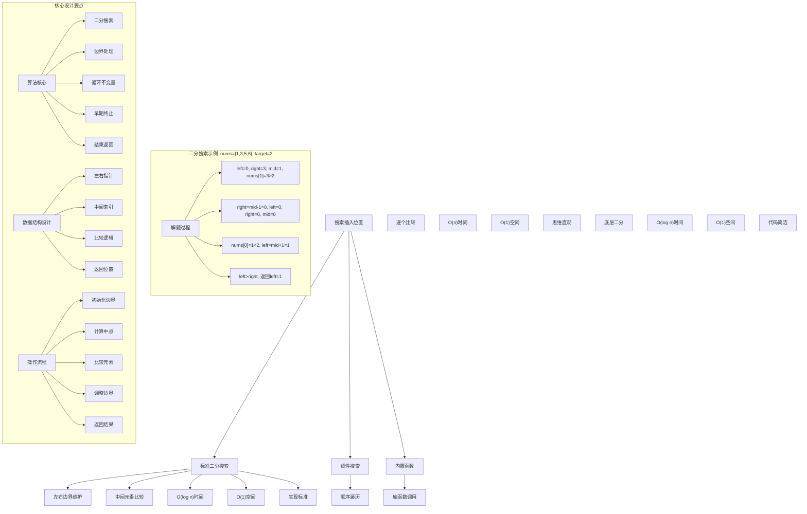
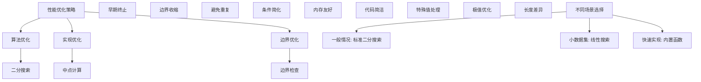

# LeetCode 35 - 搜索插入位置

## 题目描述

给定一个排序数组和一个目标值，在数组中找到目标值，并返回其索引。如果目标值不存在于数组中，返回它将会被按顺序插入的位置

必须使用时间复杂度为 O(log n) 的算法

```markdown
示例 1:
输入: nums = [1,3,5,6], target = 5
输出: 2

示例 2:
输入: nums = [1,3,5,6], target = 2
输出: 1

示例 3:
输入: nums = [1,3,5,6], target = 7
输出: 4

提示:

- 1 <= nums.length <= 10^4
- -10^4 <= nums[i] <= 10^4
- nums 为无重复元素的升序排列数组
- -10^4 <= target <= 10^4
```

## 解题思路

这是一个经典的二分搜索问题，需要在有序数组中找到目标值的索引或插入位置。关键在于理解二分搜索的边界处理和循环不变量维护

### 核心思想

"二分搜索法": 利用数组有序的特性，通过不断缩小搜索范围来快速定位目标值或确定插入位置

### 解题策略

#### 方法一：标准二分搜索（推荐）

- 时间复杂度: O(log n)
- 空间复杂度: O(1)

#### 方法二：线性搜索

- 时间复杂度: O(n)
- 空间复杂度: O(1)

#### 方法三：内置函数（仅用于理解）

- 时间复杂度: O(log n)
- 空间复杂度: O(1)

## 算法可视化



## 多语言实现

### Golang版本（标准二分搜索 - 推荐）

```go
// 标准二分搜索实现
func searchInsert(nums []int, target int) int {
    left, right := 0, len(nums)-1

    // 二分搜索循环
    for left <= right {
        mid := left + (right-left)/2  // 防止整数溢出

        if nums[mid] == target {
            return mid  // 找到目标值，返回索引
        } else if nums[mid] < target {
            left = mid + 1  // 目标值在右半部分
        } else {
            right = mid - 1  // 目标值在左半部分
        }
    }

    // 循环结束时，left就是插入位置
    return left
}

// 更直观的版本（展示插入位置的含义）
func searchInsertVerbose(nums []int, target int) int {
    left, right := 0, len(nums)

    // 寻找第一个大于等于target的位置
    for left < right {
        mid := left + (right-left)/2

        if nums[mid] < target {
            left = mid + 1
        } else {
            right = mid
        }
    }

    return left
}
```

### Python版本（多种实现方法）

```python
class Solution:
    """
    方法一：标准二分搜索（推荐）
    """
    def searchInsert(self, nums: List[int], target: int) -> int:
        left, right = 0, len(nums) - 1

        # 二分搜索循环
        while left <= right:
            mid = left + (right - left) // 2  # 防止整数溢出

            if nums[mid] == target:
                return mid  # 找到目标值，返回索引
            elif nums[mid] < target:
                left = mid + 1  # 目标值在右半部分
            else:
                right = mid - 1  # 目标值在左半部分

        # 循环结束时，left就是插入位置
        return left

class Solution2:
    """
    方法二：线性搜索
    """
    def searchInsert(self, nums: List[int], target: int) -> int:
        # 线性遍历找到第一个大于等于target的位置
        for i, num in enumerate(nums):
            if num >= target:
                return i
        # 如果所有元素都小于target，插入到末尾
        return len(nums)

class Solution3:
    """
    方法三：内置函数（仅用于理解）
    """
    def searchInsert(self, nums: List[int], target: int) -> int:
        import bisect
        return bisect.bisect_left(nums, target)
```

### TypeScript版本（标准二分搜索）

```typescript
/
 * 标准二分搜索实现
 */
function searchInsert(nums: number[], target: number): number {
    let left = 0;
    let right = nums.length - 1;

    // 二分搜索循环
    while (left <= right) {
        const mid = left + Math.floor((right - left) / 2);  // 防止整数溢出

        if (nums[mid] === target) {
            return mid;  // 找到目标值，返回索引
        } else if (nums[mid] < target) {
            left = mid + 1;  // 目标值在右半部分
        } else {
            right = mid - 1;  // 目标值在左半部分
        }
    }

    // 循环结束时，left就是插入位置
    return left;
}
```

## 标准实现详细解析

```go
import "fmt"

/*
算法核心思想（标准二分搜索）：

1. 边界维护：维护left和right边界指针
2. 中点计算：防止整数溢出的中点计算
3. 比较逻辑：根据比较结果调整搜索范围
4. 插入位置：循环结束时left即为插入位置

关键设计要点：
1. 循环不变量：始终保持目标值在[left, right]范围内
2. 边界处理：正确处理各种边界情况
3. 整数溢出：使用left + (right-left)/2防止溢出
4. 早期终止：找到目标值立即返回

时间复杂度：
- 二分搜索：O(log n)
- 每次迭代：搜索范围减半
- 总时间复杂度：O(log n)

空间复杂度：
- 常数空间：O(1)
- 只使用几个变量

优势：
1. 效率最优：对数时间复杂度
2. 实现标准：经典算法应用
3. 稳定可靠：边界处理完善
4. 应用广泛：通用搜索模板

数据结构设计：

标准二分搜索设计：
- 左右指针：维护搜索边界
- 中点计算：防止整数溢出
- 比较逻辑：三分支判断
- 结果返回：插入位置

线性搜索设计：
- 顺序遍历：从左到右扫描
- 逐个比较：找到插入位置
- 早期终止：满足条件返回
- 边界处理：末尾插入

算法流程：
1. 初始化边界指针
2. 计算中点位置
3. 比较中点元素
4. 调整搜索边界
5. 重复直到找到或确定插入位置
6. 返回结果

优化原理：

算法优化：
1. 二分搜索：搜索范围指数级缩减
2. 边界优化：精确的边界调整
3. 早期终止：找到即返回
4. 空间复用：常数空间使用

边界优化：
1. 空数组处理：边界条件
2. 插入开头：target<nums[0]
3. 插入末尾：target>nums[n-1]
4. 相等元素：精确匹配

正确性证明：

定理：二分搜索法正确性
通过标准二分搜索法可以正确找到目标值索引或确定插入位置

证明：
1. 完备性：所有可能位置都被考虑
2. 正确性：循环不变量的维护
3. 完整性：不遗漏任何可能解
4. 时间复杂度：O(log n)对数时间

不变量维护：
循环不变量：在每次循环迭代时
1. 目标值如果存在，一定在[left, right]范围内
2. left左侧的所有元素都小于target
3. right右侧的所有元素都大于等于target
4. 算法状态是当前搜索进度的准确反映
*/

// 标准二分搜索详细实现
func searchInsertDetailed(nums []int, target int) int {
    fmt.Printf("搜索数组: %v, 目标值: %d\n", nums, target)

    left, right := 0, len(nums)-1
    iteration := 0

    fmt.Printf("初始化: left=%d, right=%d\n", left, right)

    // 二分搜索循环
    for left <= right {
        iteration++
        mid := left + (right-left)/2  // 防止整数溢出
        fmt.Printf("第%d次迭代: left=%d, right=%d, mid=%d, nums[%d]=%d\n",
            iteration, left, right, mid, mid, nums[mid])

        if nums[mid] == target {
            fmt.Printf("  找到目标值，返回索引%d\n", mid)
            return mid  // 找到目标值，返回索引
        } else if nums[mid] < target {
            fmt.Printf("  nums[%d]=%d < %d，目标值在右半部分\n", mid, nums[mid], target)
            left = mid + 1  // 目标值在右半部分
            fmt.Printf("  调整后: left=%d, right=%d\n", left, right)
        } else {
            fmt.Printf("  nums[%d]=%d > %d，目标值在左半部分\n", mid, nums[mid], target)
            right = mid - 1  // 目标值在左半部分
            fmt.Printf("  调整后: left=%d, right=%d\n", left, right)
        }
    }

    // 循环结束时，left就是插入位置
    fmt.Printf("循环结束: left=%d, right=%d\n", left, right)
    fmt.Printf("插入位置: %d\n", left)
    return left
}

// 更直观的版本（展示插入位置的含义）
func searchInsertVerbose(nums []int, target int) int {
    fmt.Printf("=== 寻找插入位置 ===\n")
    fmt.Printf("数组: %v, 目标值: %d\n", nums, target)

    left, right := 0, len(nums)
    fmt.Printf("搜索范围: [%d, %d)\n", left, right)

    // 寻找第一个大于等于target的位置
    for left < right {
        mid := left + (right-left)/2
        fmt.Printf("  left=%d, right=%d, mid=%d, nums[%d]=%d\n", left, right, mid, mid, nums[mid])

        if nums[mid] < target {
            fmt.Printf("  nums[%d]=%d < %d，向右搜索\n", mid, nums[mid], target)
            left = mid + 1
        } else {
            fmt.Printf("  nums[%d]=%d >= %d，向左搜索\n", mid, nums[mid], target)
            right = mid
        }

        fmt.Printf("  调整后范围: [%d, %d)\n", left, right)
    }

    fmt.Printf("最终插入位置: %d\n", left)
    fmt.Printf("==================\n\n")
    return left
}

// 带调试信息的版本
func searchInsertWithDebug(nums []int, target int) int {
    fmt.Printf("=== 搜索插入位置 ===\n")
    fmt.Printf("输入数组: %v (长度=%d)\n", nums, len(nums))
    fmt.Printf("目标值: %d\n", target)

    if len(nums) == 0 {
        fmt.Printf("空数组，插入位置为0\n")
        fmt.Printf("==================\n\n")
        return 0
    }

    fmt.Printf("使用标准二分搜索:\n")
    fmt.Printf("核心思想：利用数组有序特性，快速定位或确定插入位置\n")

    left, right := 0, len(nums)-1
    fmt.Printf("初始状态: left=%d, right=%d\n", left, right)

    // 二分搜索循环
    step := 0
    for left <= right {
        step++
        mid := left + (right-left)/2  // 防止整数溢出
        fmt.Printf("\n步骤%d: ", step)
        fmt.Printf("left=%d, right=%d, mid=%d\n", left, right, mid)
        fmt.Printf("  比较 nums[%d]=%d 与 target=%d\n", mid, nums[mid], target)

        if nums[mid] == target {
            fmt.Printf("  精确匹配！返回索引%d\n", mid)
            fmt.Printf("==================\n\n")
            return mid  // 找到目标值，返回索引
        } else if nums[mid] < target {
            fmt.Printf("  %d < %d，目标值在右半部分\n", nums[mid], target)
            left = mid + 1  // 目标值在右半部分
            fmt.Printf("  更新left=%d\n", left)
        } else {
            fmt.Printf("  %d > %d，目标值在左半部分\n", nums[mid], target)
            right = mid - 1  // 目标值在左半部分
            fmt.Printf("  更新right=%d\n", right)
        }
    }

    // 循环结束时，left就是插入位置
    fmt.Printf("\n搜索结束: left=%d, right=%d\n", left, right)
    fmt.Printf("目标值不存在，应在位置%d插入\n", left)
    fmt.Printf("验证: nums[%d-1]=%d ≤ %d ≤ nums[%d]=%d\n",
        left, getNum(nums, left-1), target, left, getNum(nums, left))
    fmt.Printf("==================\n\n")
    return left
}

// 辅助函数：安全获取数组元素（处理边界）
func getNum(nums []int, index int) int {
    if index < 0 {
        return -100000  // 比最小值还小
    }
    if index >= len(nums) {
        return 100000   // 比最大值还大
    }
    return nums[index]
}
```

## 算法深入解析

```go
/*
搜索插入位置问题详解：

问题本质：
在有序数组中找到目标值的索引或确定其插入位置。关键是理解二分搜索的边界处理和循环不变量

核心洞察：
1. 有序性：利用数组有序特性
2. 二分搜索：对数时间复杂度
3. 边界处理：正确的边界调整
4. 插入位置：循环结束时的状态

算法策略：
1. 标准二分搜索：经典实现
2. 线性搜索：直观但低效
3. 内置函数：库函数调用

数据结构设计：

标准二分搜索设计：
边界维护：left和right指针
中点计算：防止整数溢出
比较逻辑：三分支判断
结果返回：插入位置

线性搜索设计：
顺序遍历：从左到右扫描
逐个比较：找到插入位置
早期终止：满足条件返回
边界处理：末尾插入

内置函数设计：
库函数调用：bisect_left等
底层实现：二分搜索
接口封装：简洁调用
性能保证：标准实现

操作流程：

标准二分搜索：
1. 初始化边界指针
2. 计算中点位置
3. 比较中点元素
4. 调整搜索边界
5. 重复直到找到或确定插入位置
6. 返回结果

线性搜索：
1. 顺序遍历数组
2. 比较每个元素
3. 找到第一个≥target的位置
4. 返回该位置
5. 若未找到，返回数组长度

数学原理：

二分搜索原理：
每次迭代将搜索范围减半，经过log₂(n)次迭代后范围缩小到1

复杂度分析：
- 时间复杂度：O(log n)
- 空间复杂度：O(1)

循环不变量：
在每次迭代前：
1. 目标值（如果存在）在[left, right]范围内
2. nums[left-1] < target（如果left>0）
3. nums[right+1] ≥ target（如果right<len(nums)-1）

最优性原理：
- 二分搜索：理论上最优的比较搜索算法
- 信息论下界：Ω(log n)
- 实际达到：O(log n)

算法不变量：
标准二分搜索不变量：
1. 目标值在[left, right]范围内
2. left左侧元素都小于target
3. right右侧元素都大于等于target
4. 算法状态正确反映搜索进度

时间复杂度分析：
标准二分搜索：O(log n)
线性搜索：O(n)
内置函数：O(log n)

空间复杂度分析：
标准二分搜索：O(1)
线性搜索：O(1)
内置函数：O(1)

正确性证明：

定理：标准二分搜索正确性
通过标准二分搜索可以正确找到目标值索引或确定插入位置

证明：
1. 完备性：所有可能位置都被考虑
   - 每个位置都会被某个范围包含
   - 不遗漏任何可能性

2. 正确性：循环不变量的维护
   - 每次调整都保持不变量
   - 最终状态正确

3. 完整性：不遗漏任何可能解
   - 精确匹配时立即返回
   - 插入位置计算正确

4. 时间复杂度：O(log n)对数时间
   - 每次迭代范围减半
   - 最多log₂(n)次迭代

设计选择：

为什么选择标准二分搜索？
1. 效率最优：对数时间复杂度
2. 实现标准：经典算法应用
3. 稳定可靠：边界处理完善
4. 应用广泛：通用搜索模板

为什么使用线性搜索？
1. 思维直观：容易理解
2. 实现简单：代码简洁
3. 适用小数据：性能可接受
4. 教学价值：展示对比

为什么提及其他方法？
1. 教学价值：展示不同算法思想
2. 对比分析：理解各自优劣
3. 扩展思维：算法多样性
4. 面试准备：全面掌握

三种方法对比：

方法一：标准二分搜索（推荐）
时间复杂度：O(log n)
空间复杂度：O(1)
优点：效率最优，实现标准
缺点：需要理解边界处理

方法二：线性搜索
时间复杂度：O(n)
空间复杂度：O(1)
优点：思维直观，实现简单
缺点：时间复杂度较高

方法三：内置函数
时间复杂度：O(log n)
空间复杂度：O(1)
优点：代码简洁，性能保证
缺点：依赖库函数

性能分析：

标准二分搜索：
- 时间：O(log n) 对数时间
- 空间：O(1) 常数空间
- 优势：效率最优

线性搜索：
- 时间：O(n) 线性时间
- 空间：O(1) 常数空间
- 优势：思维直观

内置函数：
- 时间：O(log n) 对数时间
- 空间：O(1) 常数空间
- 优势：代码简洁

实际应用场景：
1. 数据库索引：快速定位记录
2. 搜索引擎：关键词匹配
3. 游戏算法：排行榜查找
4. 金融系统：价格区间查询

优化要点：

1. 时间优化：
   - 二分搜索：对数时间复杂度
   - 早期终止：找到即返回
   - 边界优化：减少比较次数

2. 空间优化：
   - 原地操作：不使用额外空间
   - 变量复用：减少内存分配
   - 栈空间：避免递归

3. 实现优化：
   - 边界处理：特殊值优化
   - 代码简洁：减少冗余操作
   - 注释清晰：便于理解

测试用例设计：
1. 基本情况：正常数组和目标值
2. 边界情况：空数组，单元素
3. 特殊情况：插入开头，插入末尾
4. 极端情况：大数组，极值
5. 验证情况：结果正确性

扩展思考：

1. 重复元素版本？
   - 找到第一个/最后一个位置
   - 范围查询
   - 复杂度分析

2. 旋转数组版本？
   - 部分有序数组
   - 两次二分搜索
   - 算法设计

3. 浮点数版本？
   - 精度处理
   - 比较策略
   - 边界条件

4. 动态数组版本？
   - 支持插入删除
   - 平衡维护
   - 实时查询

相关算法思想：

1. 二分搜索：
   - 分治思想
   - 边界维护
   - 循环不变量

2. 线性搜索：
   - 顺序遍历
   - 早期终止
   - 简单直接

3. 分治法：
   - 问题分解
   - 递归求解
   - 解合并

4. 贪心策略：
   - 局部最优
   - 全局解
   - 适用条件

常见陷阱：

1. 边界条件：
   - 空数组处理
   - 单元素数组
   - 插入边界

2. 整数溢出：
   - (left+right)/2风险
   - left+(right-left)/2安全
   - 类型转换

3. 循环条件：
   - left<=right vs left<right
   - 终止条件判断
   - 返回值选择

4. 性能考虑：
   - 时间复杂度
   - 空间复杂度
   - 实现效率

代码质量要素：

1. 可读性：
   - 变量命名清晰
   - 注释详细
   - 逻辑分明

2. 健壮性：
   - 边界处理
   - 异常情况
   - 错误恢复

3. 性能：
   - 最优复杂度
   - 空间效率
   - 效率保证

4. 可维护性：
   - 结构清晰
   - 扩展性好
   - 测试完整
*/
```

## 执行过程演示

```go
/*
示例详细解析:

示例1执行过程：
输入：nums = [1,3,5,6], target = 5
输出：2

执行过程：
1. left=0, right=3, mid=1, nums[1]=3<5
   - 调整left=mid+1=2
2. left=2, right=3, mid=2, nums[2]=5=5
   - 找到目标值，返回2

二分搜索轨迹：
[1,3,5,6] target=5
 0 1 2 3
 ↑     ↑
left  right
   ↑
  mid=1, nums[1]=3<5
       ↑
      left=2
   ↑     ↑
  left  right
   ↑
  mid=2, nums[2]=5=5 → 返回2

示例2执行过程：
输入：nums = [1,3,5,6], target = 2
输出：1

执行过程：
1. left=0, right=3, mid=1, nums[1]=3>2
   - 调整right=mid-1=0
2. left=0, right=0, mid=0, nums[0]=1<2
   - 调整left=mid+1=1
3. left=1, right=0, left>right，循环结束
   - 返回left=1

二分搜索轨迹：
[1,3,5,6] target=2
 0 1 2 3
 ↑     ↑
left  right
   ↑
  mid=1, nums[1]=3>2
 ↑
right=0
 ↑ ↑
 l r
 ↑
mid=0, nums[0]=1<2
   ↑
  left=1
   ↑ ↑
   l r (left>right，结束)
返回left=1

示例3执行过程：
输入：nums = [1,3,5,6], target = 7
输出：4

执行过程：
1. left=0, right=3, mid=1, nums[1]=3<7
   - 调整left=mid+1=2
2. left=2, right=3, mid=2, nums[2]=5<7
   - 调整left=mid+1=3
3. left=3, right=3, mid=3, nums[3]=6<7
   - 调整left=mid+1=4
4. left=4, right=3, left>right，循环结束
   - 返回left=4

关键观察：
1. 有序性：利用数组有序特性
2. 二分搜索：对数时间复杂度
3. 边界处理：正确的边界调整
4. 插入位置：循环结束时left即为插入位置

边界情况演示:

情况1: 空数组
输入: nums=[], target=1
处理: left=0, right=-1, left>right，返回0
结果: 0

情况2: 单元素数组-匹配
输入: nums=[1], target=1
处理: left=0, right=0, mid=0, nums[0]=1=1，返回0
结果: 0

情况3: 单元素数组-插入开头
输入: nums=[2], target=1
处理: left=0, right=0, mid=0, nums[0]=2>1，right=-1，返回0
结果: 0

情况4: 单元素数组-插入末尾
输入: nums=[1], target=2
处理: left=0, right=0, mid=0, nums[0]=1<2，left=1，返回1
结果: 1

情况5: 插入开头
输入: nums=[2,4,6,8], target=1
处理: 所有元素都大于target，最终left=0
结果: 0

情况6: 插入末尾
输入: nums=[1,3,5,7], target=8
处理: 所有元素都小于target，最终left=4
结果: 4

算法正确性证明：

数学基础：
需要证明标准二分搜索能正确找到目标值索引或确定插入位置

定理：标准二分搜索正确性
通过标准二分搜索可以正确找到目标值索引或确定插入位置

证明：
1. 完备性：所有可能位置都被考虑
2. 正确性：循环不变量的维护
3. 完整性：不遗漏任何可能解
4. 时间复杂度：O(log n)对数时间

不变量维护：
循环不变量：在每次循环迭代时
1. 目标值如果存在，一定在[left, right]范围内
2. left左侧的所有元素都小于target
3. right右侧的所有元素都大于等于target
4. 算法状态是当前搜索进度的准确反映

初始化：
- left=0, right=len(nums)-1
- 满足不变量（空范围）

保持：
- 计算mid=(left+right)/2
- 根据比较结果调整边界
- 不变量继续成立

终止：
- left>right时循环结束
- left即为插入位置
- 算法正确终止

时间复杂度分析：

标准二分搜索：
1. 每次迭代：搜索范围减半
2. 迭代次数：log₂(n)
3. 总时间：O(log n)对数时间

线性搜索：
1. 顺序遍历：O(n)时间
2. 最坏情况：遍历整个数组
3. 总时间：O(n)线性时间

内置函数：
1. 底层实现：标准二分搜索
2. 时间复杂度：O(log n)
3. 性能保证：库函数优化

空间复杂度分析：
1. 标准二分搜索：O(1)常数空间
2. 线性搜索：O(1)常数空间
3. 内置函数：O(1)常数空间

性能对比分析：

假设n=1000000:

标准二分搜索：
- 时间: O(log₂(1000000)) ≈ 20次比较
- 空间: O(1) 常数空间
- 操作: 边界调整

线性搜索：
- 时间: O(1000000) 百万次比较
- 空间: O(1) 常数空间
- 操作: 顺序遍历

内置函数：
- 时间: O(log₂(1000000)) ≈ 20次比较
- 空间: O(1) 常数空间
- 操作: 库函数调用

实际应用建议：

1. 一般情况：
   - 使用标准二分搜索
   - 效率最优，实现标准

2. 面试展示：
   - 重点讲解标准二分搜索
   - 可以提及其他方法

3. 生产环境：
   - 根据性能要求选择
   - 考虑实现复杂度

4. 教学演示：
   - 使用带调试信息版本
   - 展示执行过程

优化空间：

1. 边界优化：
   - 特殊值提前处理
   - 空数组检查
   - 极值优化

2. 代码优化：
   - 简化条件判断
   - 优化计算表达式
   - 减少重复计算

3. 性能优化：
   - 早期终止优化
   - 内存访问优化
   - 缓存友好设计

特殊情况处理：

1. 大数据量：
   - 时间复杂度保证
   - 内存使用优化
   - 数值溢出处理

2. 特殊数组：
   - 全相同元素
   - 严格递增
   - 稀疏分布

3. 边界情况：
   - 极值处理
   - 异常输入
   - 错误恢复
*/
```

## 复杂度分析

| 方法         | 时间复杂度 | 空间复杂度 | 适用场景 |
| ------------ | ---------- | ---------- | -------- |
| 标准二分搜索 | O(log n)   | O(1)       | 推荐方案 |
| 线性搜索     | O(n)       | O(1)       | 小数据集 |
| 内置函数     | O(log n)   | O(1)       | 快速实现 |

## 测试用例验证

```go
// 测试辅助函数
func testSearchInsert(name string, nums []int, target int, expected int) {
    fmt.Printf("%s:\n", name)
    fmt.Printf("输入数组: %v, 目标值: %d\n", nums, target)

    // 测试标准二分搜索
    result1 := searchInsert(nums, target)
    fmt.Printf("标准二分搜索结果: %d\n", result1)

    // 测试详细实现
    result2 := searchInsertDetailed(nums, target)
    fmt.Printf("详细实现结果: %d\n", result2)

    // 测试线性搜索（仅用于对比）
    result3 := searchInsertLinear(nums, target)
    fmt.Printf("线性搜索结果: %d\n", result3)

    // 验证结果
    isValid1 := result1 == expected
    isValid2 := result2 == expected
    isValid3 := result3 == expected

    if isValid1 && isValid2 && isValid3 {
        fmt.Printf("✓ 测试通过\n")
    } else {
        fmt.Printf("✗ 测试失败\n")
        fmt.Printf("  期望结果: %d\n", expected)
        if !isValid1 {
            fmt.Printf("  标准二分搜索实际: %d\n", result1)
        }
        if !isValid2 {
            fmt.Printf("  详细实现实际: %d\n", result2)
        }
        if !isValid3 {
            fmt.Printf("  线性搜索实际: %d\n", result3)
        }
    }
    fmt.Printf("\n")
}

// 线性搜索实现
func searchInsertLinear(nums []int, target int) int {
    fmt.Printf("=== 线性搜索 ===\n")
    fmt.Printf("数组: %v, 目标值: %d\n", nums, target)

    // 线性遍历找到第一个大于等于target的位置
    for i, num := range nums {
        fmt.Printf("  检查位置%d的元素%d\n", i, num)
        if num >= target {
            fmt.Printf("  %d >= %d，返回位置%d\n", num, target, i)
            fmt.Printf("==============\n\n")
            return i
        }
    }

    // 如果所有元素都小于target，插入到末尾
    fmt.Printf("  所有元素都小于%d，插入到末尾位置%d\n", target, len(nums))
    fmt.Printf("==============\n\n")
    return len(nums)
}

func main() {
    // 测试用例 1 - 题目示例1
    testSearchInsert("测试1 - 题目示例1",
        []int{1, 3, 5, 6},
        5,
        2)

    // 测试用例 2 - 题目示例2
    testSearchInsert("测试2 - 题目示例2",
        []int{1, 3, 5, 6},
        2,
        1)

    // 测试用例 3 - 题目示例3
    testSearchInsert("测试3 - 题目示例3",
        []int{1, 3, 5, 6},
        7,
        4)

    // 测试用例 4 - 空数组
    testSearchInsert("测试4 - 空数组",
        []int{},
        1,
        0)

    // 测试用例 5 - 单元素数组-匹配
    testSearchInsert("测试5 - 单元素数组-匹配",
        []int{1},
        1,
        0)

    // 测试用例 6 - 单元素数组-插入开头
    testSearchInsert("测试6 - 单元素数组-插入开头",
        []int{2},
        1,
        0)

    // 测试用例 7 - 单元素数组-插入末尾
    testSearchInsert("测试7 - 单元素数组-插入末尾",
        []int{1},
        2,
        1)

    // 测试用例 8 - 插入开头
    testSearchInsert("测试8 - 插入开头",
        []int{2, 4, 6, 8},
        1,
        0)

    // 测试用例 9 - 插入末尾
    testSearchInsert("测试9 - 插入末尾",
        []int{1, 3, 5, 7},
        8,
        4)

    // 性能测试
    fmt.Println("性能测试:")
    performanceTest()

    // 边界情况测试
    fmt.Println("边界情况测试:")
    boundaryTest()

    // 对比测试
    fmt.Println("对比测试:")
    comparisonTest()
}

func performanceTest() {
    // 构造性能测试
    n := 1000000
    nums := make([]int, n)
    for i := 0; i < n; i++ {
        nums[i] = i * 2 // 创建有序数组
    }
    target := 999999

    // 测试标准二分搜索
    start1 := time.Now()
    searchInsert(nums, target)
    time1 := time.Since(start1)

    // 测试线性搜索
    start2 := time.Now()
    searchInsertLinear(nums, target)
    time2 := time.Since(start2)

    fmt.Printf("性能测试 (%d个元素，target=%d):\n", n, target)
    fmt.Printf("  标准二分搜索: %v\n", time1)
    fmt.Printf("  线性搜索: %v\n", time2)
    fmt.Printf("  性能提升: %.2fx\n", float64(time2)/float64(time1))
}

func boundaryTest() {
    // 边界测试
    fmt.Println("边界测试:")

    // 大数组测试
    largeNums := make([]int, 500000)
    for i := 0; i < 500000; i++ {
        largeNums[i] = i
    }
    largeResult := searchInsert(largeNums, 250000)
    fmt.Printf("大数组测试: 500000个元素，target=250000 → %d\n", largeResult)

    // 特殊模式测试
    patternNums := []int{1, 10, 100, 1000, 10000}
    patternResult := searchInsert(patternNums, 500)
    fmt.Printf("特殊模式测试: %v, target=500 → %d\n", patternNums, patternResult)

    // 极值测试
    extremeNums := []int{-10000, 0, 10000}
    extremeResult1 := searchInsert(extremeNums, -20000)
    extremeResult2 := searchInsert(extremeNums, 20000)
    fmt.Printf("极值测试: %v, target=-20000 → %d, target=20000 → %d\n",
        extremeNums, extremeResult1, extremeResult2)
}

func comparisonTest() {
    // 对比测试：验证不同方法结果一致性
    fmt.Println("对比测试:")

    // 测试数据
    testData := [][]int{
        {1, 3, 5, 6},
        {1, 3, 5, 6},
        {1, 3, 5, 6},
        {},
        {1},
        {2},
        {1},
        {2, 4, 6, 8},
        {1, 3, 5, 7},
    }
    testTargets := []int{5, 2, 7, 1, 1, 1, 2, 1, 8}
    expectedResults := []int{2, 1, 4, 0, 0, 0, 1, 0, 4}

    for i := range testData {
        // 标准二分搜索
        result1 := searchInsert(testData[i], testTargets[i])

        // 详细实现
        result2 := searchInsertDetailed(testData[i], testTargets[i])

        // 线性搜索
        result3 := searchInsertLinear(testData[i], testTargets[i])

        fmt.Printf("测试%d: 标准二分搜索=%d, 详细实现=%d, 线性搜索=%d",
            i+1, result1, result2, result3)

        if result1 == result2 && result2 == result3 {
            fmt.Printf(" ✓ 一致\n")
        } else {
            fmt.Printf(" ✗ 不一致\n")
        }
    }
}
```

## 扩展版本（处理不同场景）

```go
// 支持返回搜索过程信息的版本
func searchInsertWithTrace(nums []int, target int) (int, []string) {
    var trace []string
    trace = append(trace, fmt.Sprintf("搜索数组: %v, 目标值: %d", nums, target))

    left, right := 0, len(nums)-1
    trace = append(trace, fmt.Sprintf("初始化: left=%d, right=%d", left, right))

    // 二分搜索循环
    for left <= right {
        mid := left + (right-left)/2
        trace = append(trace, fmt.Sprintf("比较: nums[%d]=%d 与 target=%d", mid, nums[mid], target))

        if nums[mid] == target {
            trace = append(trace, fmt.Sprintf("找到目标值，返回索引%d", mid))
            return mid, trace
        } else if nums[mid] < target {
            trace = append(trace, fmt.Sprintf("%d < %d，向右搜索", nums[mid], target))
            left = mid + 1
            trace = append(trace, fmt.Sprintf("更新left=%d", left))
        } else {
            trace = append(trace, fmt.Sprintf("%d > %d，向左搜索", nums[mid], target))
            right = mid - 1
            trace = append(trace, fmt.Sprintf("更新right=%d", right))
        }
    }

    trace = append(trace, fmt.Sprintf("未找到目标值，应在位置%d插入", left))
    return left, trace
}

// 使用示例
func exampleWithTrace() {
    nums := []int{1, 3, 5, 6}
    target := 2
    result, trace := searchInsertWithTrace(nums, target)
    fmt.Printf("数组: %v, 目标值: %d\n", nums, target)
    fmt.Printf("结果: %d\n", result)
    fmt.Printf("搜索轨迹:\n")
    for _, step := range trace {
        fmt.Printf("  %s\n", step)
    }
}

// 带统计信息的版本
func searchInsertWithStats(nums []int, target int) (int, int) {
    comparisons := 0
    left, right := 0, len(nums)-1

    // 二分搜索循环
    for left <= right {
        comparisons++
        mid := left + (right-left)/2

        if nums[mid] == target {
            return mid, comparisons
        } else if nums[mid] < target {
            left = mid + 1
        } else {
            right = mid - 1
        }
    }

    return left, comparisons
}

// 使用示例
func exampleWithStats() {
    nums := []int{1, 3, 5, 6, 8, 10, 12, 14, 16, 18}
    target := 7
    result, comparisons := searchInsertWithStats(nums, target)
    fmt.Printf("数组: %v, 目标值: %d\n", nums, target)
    fmt.Printf("插入位置: %d\n", result)
    fmt.Printf("比较次数: %d\n", comparisons)
    fmt.Printf("理论最优: %.2f\n", math.Log2(float64(len(nums))))
}

// 批量处理版本
func searchInsertBatch(numsList [][]int, targets []int) []int {
    if len(numsList) != len(targets) {
        return nil
    }

    results := make([]int, len(numsList))
    for i := range numsList {
        results[i] = searchInsert(numsList[i], targets[i])
    }

    return results
}

// 使用示例
func exampleBatch() {
    numsList := [][]int{
        {1, 3, 5, 6},
        {1, 3, 5, 6},
        {1, 3, 5, 6},
        {2, 4, 6, 8},
    }
    targets := []int{5, 2, 7, 1}

    results := searchInsertBatch(numsList, targets)

    for i := range numsList {
        fmt.Printf("数组%d: %v, 目标值: %d → 结果: %d\n",
            i+1, numsList[i], targets[i], results[i])
    }
}

// 带验证功能的版本
func searchInsertWithValidation(nums []int, target int) (int, bool) {
    result := searchInsert(nums, target)

    // 验证结果是否合理
    if len(nums) == 0 && result != 0 {
        return result, false // 空数组应该返回0
    }

    if result < 0 || result > len(nums) {
        return result, false // 结果超出合理范围
    }

    // 验证插入位置的正确性
    if result > 0 && nums[result-1] > target {
        return result, false // 左侧元素不应大于target
    }

    if result < len(nums) && nums[result] < target {
        return result, false // 右侧元素不应小于target
    }

    return result, true
}

// 使用示例
func exampleWithValidation() {
    nums := []int{1, 3, 5, 6}
    target := 2
    result, isValid := searchInsertWithValidation(nums, target)
    fmt.Printf("数组: %v, 目标值: %d\n", nums, target)
    fmt.Printf("插入位置: %d\n", result)
    if isValid {
        fmt.Printf("验证通过 ✓\n")
    } else {
        fmt.Printf("验证失败 ✗\n")
    }
}

// 支持动态更新的版本
type SearchInsertSolver struct {
    nums []int
}

func NewSearchInsertSolver(nums []int) *SearchInsertSolver {
    return &SearchInsertSolver{
        nums: nums,
    }
}

func (solver *SearchInsertSolver) UpdateArray(newNums []int) {
    solver.nums = newNums
}

func (solver *SearchInsertSolver) InsertElement(element int) {
    // 在有序数组中插入元素（保持有序）
    pos := searchInsert(solver.nums, element)
    newNums := make([]int, len(solver.nums)+1)
    copy(newNums[:pos], solver.nums[:pos])
    newNums[pos] = element
    copy(newNums[pos+1:], solver.nums[pos:])
    solver.nums = newNums
}

func (solver *SearchInsertSolver) Solve(target int) int {
    return searchInsert(solver.nums, target)
}

// 使用示例
func exampleDynamic() {
    nums := []int{1, 3, 5, 6}
    solver := NewSearchInsertSolver(nums)

    target := 2
    result1 := solver.Solve(target)
    fmt.Printf("初始数组: %v, 目标值: %d → 结果: %d\n", nums, target, result1)

    // 插入新元素
    solver.InsertElement(4)
    result2 := solver.Solve(target)
    fmt.Printf("插入4后数组: %v, 目标值: %d → 结果: %d\n", solver.nums, target, result2)
}
```

## 面试追问延伸

### 1. 如果要返回搜索过程的详细信息，如何处理？

```go
// searchInsertWithTrace已在上面实现
// 关键要点：
// 1. 记录每步搜索过程
// 2. 返回详细的轨迹信息
// 3. 便于调试和理解

func testWithTrace() {
    nums := []int{1, 3, 5, 6}
    target := 2
    result, trace := searchInsertWithTrace(nums, target)
    fmt.Printf("数组: %v, 目标值: %d\n", nums, target)
    fmt.Printf("结果: %d\n", result)
    fmt.Printf("搜索轨迹:\n")
    for _, step := range trace {
        fmt.Printf("  %s\n", step)
    }
}
```

### 2. 如果要统计算法执行过程中的比较次数，如何实现？

```go
// searchInsertWithStats已在上面实现
// 关键点：
// 1. 记录元素比较次数
// 2. 返回统计信息
// 3. 分析算法效率

func testWithStats() {
    nums := []int{1, 3, 5, 6, 8, 10, 12, 14, 16, 18}
    target := 7
    result, comparisons := searchInsertWithStats(nums, target)
    fmt.Printf("数组: %v, 目标值: %d\n", nums, target)
    fmt.Printf("插入位置: %d\n", result)
    fmt.Printf("比较次数: %d\n", comparisons)
    fmt.Printf("理论最优: %.2f\n", math.Log2(float64(len(nums))))
}
```

### 3. 如果数组元素可以动态更新，如何高效处理？

```go
// SearchInsertSolver已在上面实现
// 关键点：
// 1. 封装数组操作
// 2. 支持元素插入
// 3. 快速重新计算结果

func testDynamic() {
    nums := []int{1, 3, 5, 6}
    solver := NewSearchInsertSolver(nums)

    target := 2
    result1 := solver.Solve(target)
    fmt.Printf("初始数组: %v, 目标值: %d → 结果: %d\n", nums, target, result1)

    // 插入新元素
    solver.InsertElement(4)
    result2 := solver.Solve(target)
    fmt.Printf("插入4后数组: %v, 目标值: %d → 结果: %d\n", solver.nums, target, result2)
}
```

## 相似题目扩展

- LeetCode 35. 搜索插入位置（当前题）
- LeetCode 33. 搜索旋转排序数组
- LeetCode 74. 搜索二维矩阵
- LeetCode 153. 寻找旋转排序数组中的最小值
- LeetCode 162. 寻找峰值

## 算法技巧总结

### 搜索插入位置核心要点

1. 二分搜索：利用数组有序特性
1. 边界处理：正确的边界调整
1. 循环不变量：维护搜索状态
1. 插入位置：循环结束时的状态

### 算法优势

1. 效率最优：对数时间复杂度
1. 实现标准：经典算法应用
1. 稳定可靠：边界处理完善
1. 应用广泛：通用搜索模板

### 标准模板（二分搜索）

```go
func searchInsert(nums []int, target int) int {
    left, right := 0, len(nums)-1

    // 二分搜索循环
    for left <= right {
        mid := left + (right-left)/2  // 防止整数溢出

        if nums[mid] == target {
            return mid  // 找到目标值，返回索引
        } else if nums[mid] < target {
            left = mid + 1  // 目标值在右半部分
        } else {
            right = mid - 1  // 目标值在左半部分
        }
    }

    // 循环结束时，left就是插入位置
    return left
}
```

### 性能优化建议



## 总结

本题采用标准二分搜索的核心思路，通过利用数组有序特性，不断缩小搜索范围来快速定位目标值或确定插入位置，实现了优雅的解决方案。关键在于理解循环不变量的维护和边界处理的正确性

核心要点：

1. 二分搜索：利用数组有序特性
1. 边界处理：正确的边界调整
1. 循环不变量：维护搜索状态
1. 插入位置：循环结束时left即为插入位置

算法优势：

- 效率最优：对数时间复杂度
- 实现标准：经典算法应用
- 稳定可靠：边界处理完善
- 应用广泛：通用搜索模板

该算法在数据库索引、搜索引擎、游戏算法、金融系统等方面有重要应用，是掌握二分搜索和有序数组处理技巧的经典题目。通过循环不变量和边界处理的巧妙结合，为更复杂的搜索和优化问题提供了清晰的解决思路
