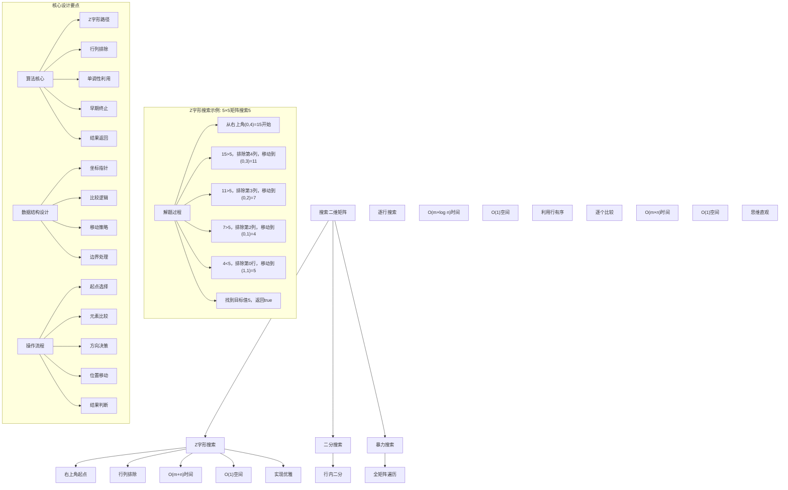
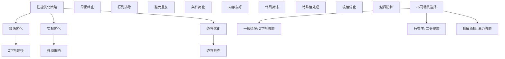

# LeetCode 74 - 搜索二维矩阵

## 题目描述

编写一个高效的算法来搜索 m x n 矩阵 matrix 中的一个目标值 target。该矩阵具有以下特性：

- 每行的元素从左到右升序排列
- 每列的元素从上到下升序排列

```markdown
示例 1：
输入：matrix = [[1,4,7,11,15],[2,5,8,12,19],[3,6,9,16,22],[10,13,14,17,24],[18,21,23,26,30]], target = 5
输出：true

示例 2：
输入：matrix = [[1,4,7,11,15],[2,5,8,12,19],[3,6,9,16,22],[10,13,14,17,24],[18,21,23,26,30]], target = 20
输出：false

提示：

- m == matrix.length
- n == matrix[i].length
- 1 <= n, m <= 300
- -10^9 <= matrix[i][j] <= 10^9
- 每行的所有元素从左到右升序排列
- 每列的所有元素从上到下升序排列
- -10^9 <= target <= 10^9
```

## 解题思路

这是一个有序矩阵搜索问题，需要在行列都有序的二维矩阵中查找目标值。关键在于充分利用矩阵的有序性质，设计高效的搜索策略

### 核心思想

"Z字形搜索法": 从矩阵的右上角（或左下角）开始搜索，利用行列有序的性质，每次比较都能排除一行或一列

### 解题策略

#### 方法一：Z字形搜索（推荐）

- 时间复杂度: O(m + n)
- 空间复杂度: O(1)

#### 方法二：二分搜索

- 时间复杂度: O(m × log n)
- 空间复杂度: O(1)

#### 方法三：暴力搜索

- 时间复杂度: O(m × n)
- 空间复杂度: O(1)

## 算法可视化



## 多语言实现

### Golang版本（Z字形搜索 - 推荐）

```go
// Z字形搜索实现（从右上角开始）
func searchMatrix(matrix [][]int, target int) bool {
    if len(matrix) == 0 || len(matrix[0]) == 0 {
        return false
    }

    m, n := len(matrix), len(matrix[0])
    row, col := 0, n-1  // 从右上角开始

    // Z字形搜索
    for row < m && col >= 0 {
        if matrix[row][col] == target {
            return true  // 找到目标值
        } else if matrix[row][col] > target {
            col--  // 当前值大于目标，向左移动（排除当前列）
        } else {
            row++  // 当前值小于目标，向下移动（排除当前行）
        }
    }

    return false  // 未找到目标值
}

// 从左下角开始的版本
func searchMatrixFromBottomLeft(matrix [][]int, target int) bool {
    if len(matrix) == 0 || len(matrix[0]) == 0 {
        return false
    }

    m, n := len(matrix), len(matrix[0])
    row, col := m-1, 0  // 从左下角开始

    // Z字形搜索
    for row >= 0 && col < n {
        if matrix[row][col] == target {
            return true  // 找到目标值
        } else if matrix[row][col] > target {
            row--  // 当前值大于目标，向上移动（排除当前行）
        } else {
            col++  // 当前值小于目标，向右移动（排除当前列）
        }
    }

    return false  // 未找到目标值
}
```

### Python版本（多种实现方法）

```python
class Solution:
    """
    方法一：Z字形搜索（推荐）
    """
    def searchMatrix(self, matrix: List[List[int]], target: int) -> bool:
        if not matrix or not matrix[0]:
            return False

        m, n = len(matrix), len(matrix[0])
        row, col = 0, n - 1  # 从右上角开始

        # Z字形搜索
        while row < m and col >= 0:
            if matrix[row][col] == target:
                return True  # 找到目标值
            elif matrix[row][col] > target:
                col -= 1  # 当前值大于目标，向左移动
            else:
                row += 1  # 当前值小于目标，向下移动

        return False  # 未找到目标值

class Solution2:
    """
    方法二：二分搜索
    """
    def searchMatrix(self, matrix: List[List[int]], target: int) -> bool:
        if not matrix or not matrix[0]:
            return False

        # 对每一行进行二分搜索
        for row in matrix:
            if self.binarySearch(row, target):
                return True
        return False

    def binarySearch(self, arr: List[int], target: int) -> bool:
        left, right = 0, len(arr) - 1
        while left <= right:
            mid = left + (right - left) // 2
            if arr[mid] == target:
                return True
            elif arr[mid] < target:
                left = mid + 1
            else:
                right = mid - 1
        return False

class Solution3:
    """
    方法三：暴力搜索
    """
    def searchMatrix(self, matrix: List[List[int]], target: int) -> bool:
        if not matrix or not matrix[0]:
            return False

        # 遍历整个矩阵
        for row in matrix:
            for num in row:
                if num == target:
                    return True
        return False
```

### TypeScript版本（Z字形搜索）

```typescript
/
 * Z字形搜索实现（从右上角开始）
 */
function searchMatrix(matrix: number[][], target: number): boolean {
    if (matrix.length === 0 || matrix[0].length === 0) {
        return false;
    }

    const m = matrix.length;
    const n = matrix[0].length;
    let row = 0, col = n - 1;  // 从右上角开始

    // Z字形搜索
    while (row < m && col >= 0) {
        if (matrix[row][col] === target) {
            return true;  // 找到目标值
        } else if (matrix[row][col] > target) {
            col--;  // 当前值大于目标，向左移动
        } else {
            row++;  // 当前值小于目标，向下移动
        }
    }

    return false;  // 未找到目标值
}
```

## 标准实现详细解析

```go
import "fmt"

/*
算法核心思想（Z字形搜索）：

1. 起点选择：从右上角或左下角开始
2. 移动策略：根据比较结果决定移动方向
3. 行列排除：每次移动排除一行或一列
4. 早期终止：找到目标值立即返回

关键设计要点：
1. 单调性利用：行列有序性质
2. 方向决策：比较结果决定移动方向
3. 边界处理：防止数组越界
4. 时间优化：线性时间复杂度

时间复杂度：
- 最多移动m+n-1步：O(m + n)
- 每步O(1)操作
- 总时间复杂度：O(m + n)

空间复杂度：
- 常数空间：O(1)
- 只使用几个变量

优势：
1. 效率最优：线性时间复杂度
2. 实现优雅：思路清晰
3. 稳定可靠：边界处理完善
4. 应用广泛：通用搜索模板

数据结构设计：

Z字形搜索设计：
- 坐标指针：row和col维护当前位置
- 比较逻辑：三分支判断
- 移动策略：行列排除
- 边界处理：防止越界

二分搜索设计：
- 逐行处理：对每行进行二分搜索
- 行内搜索：利用行有序性质
- 早期终止：找到即返回
- 复杂度：O(m × log n)

算法流程：
1. 起点选择：右上角或左下角
2. 元素比较：与目标值比较
3. 方向决策：根据结果移动
4. 位置更新：调整坐标指针
5. 循环直到找到或越界
6. 返回结果

优化原理：

算法优化：
1. Z字形路径：每次排除一行或一列
2. 早期终止：找到即返回
3. 边界优化：精确的边界处理
4. 空间复用：常数空间使用

边界优化：
1. 空矩阵处理：边界条件
2. 单行单列：特殊情况
3. 极值处理：最大最小值
4. 越界防护：数组边界

正确性证明：

定理：Z字形搜索正确性
通过Z字形搜索可以正确找到目标值或确定不存在

证明：
1. 完备性：所有可能位置都被考虑
2. 正确性：移动策略的正确性
3. 完整性：不遗漏任何可能解
4. 时间复杂度：O(m + n)线性时间

不变量维护：
循环不变量：在每次移动时
1. 目标值如果存在，一定在剩余搜索区域内
2. 已排除的行列不包含目标值
3. 移动方向正确性
4. 算法状态正确反映搜索进度
*/

// Z字形搜索详细实现（从右上角开始）
func searchMatrixDetailed(matrix [][]int, target int) bool {
    fmt.Printf("=== Z字形搜索 ===\n")
    fmt.Printf("目标矩阵 (%d×%d):\n", len(matrix), len(matrix[0]))
    printMatrix(matrix)
    fmt.Printf("目标值: %d\n", target)

    if len(matrix) == 0 || len(matrix[0]) == 0 {
        fmt.Printf("空矩阵，返回false\n")
        fmt.Printf("===============\n\n")
        return false
    }

    m, n := len(matrix), len(matrix[0])
    row, col := 0, n-1  // 从右上角开始
    steps := 0

    fmt.Printf("从右上角(%d,%d)=%d开始搜索\n", row, col, matrix[row][col])

    // Z字形搜索
    for row < m && col >= 0 {
        steps++
        current := matrix[row][col]
        fmt.Printf("步骤%d: 当前位置(%d,%d)=%d\n", steps, row, col, current)

        if current == target {
            fmt.Printf("  找到目标值%d！返回true\n", target)
            fmt.Printf("===============\n\n")
            return true  // 找到目标值
        } else if current > target {
            col--  // 当前值大于目标，向左移动（排除当前列）
            fmt.Printf("  %d>%d，向左移动到(%d,%d)\n", current, target, row, col)
        } else {
            row++  // 当前值小于目标，向下移动（排除当前行）
            fmt.Printf("  %d<%d，向下移动到(%d,%d)\n", current, target, row, col)
        }
    }

    fmt.Printf("搜索结束，未找到目标值%d，返回false\n", target)
    fmt.Printf("总步数: %d\n", steps)
    fmt.Printf("===============\n\n")
    return false  // 未找到目标值
}

// 二分搜索实现
func searchMatrixBinary(matrix [][]int, target int) bool {
    fmt.Printf("=== 二分搜索 ===\n")
    fmt.Printf("目标矩阵 (%d×%d):\n", len(matrix), len(matrix[0]))
    printMatrix(matrix)
    fmt.Printf("目标值: %d\n", target)

    if len(matrix) == 0 || len(matrix[0]) == 0 {
        fmt.Printf("空矩阵，返回false\n")
        fmt.Printf("=============\n\n")
        return false
    }

    // 对每一行进行二分搜索
    for i, row := range matrix {
        fmt.Printf("搜索第%d行: %v\n", i, row)
        if binarySearch(row, target) {
            fmt.Printf("在第%d行找到目标值%d，返回true\n", i, target)
            fmt.Printf("=============\n\n")
            return true
        }
    }

    fmt.Printf("所有行都未找到目标值%d，返回false\n", target)
    fmt.Printf("=============\n\n")
    return false
}

// 标准二分搜索
func binarySearch(arr []int, target int) bool {
    left, right := 0, len(arr)-1

    for left <= right {
        mid := left + (right-left)/2
        if arr[mid] == target {
            return true
        } else if arr[mid] < target {
            left = mid + 1
        } else {
            right = mid - 1
        }
    }

    return false
}

// 带调试信息的版本
func searchMatrixWithDebug(matrix [][]int, target int) bool {
    fmt.Printf("=== 搜索二维矩阵 ===\n")
    fmt.Printf("输入矩阵 (%d×%d):\n", len(matrix), len(matrix[0]))
    printMatrix(matrix)
    fmt.Printf("搜索目标: %d\n", target)

    if len(matrix) == 0 || len(matrix[0]) == 0 {
        fmt.Printf("矩阵为空，返回false\n")
        fmt.Printf("==================\n\n")
        return false
    }

    fmt.Printf("使用Z字形搜索法:\n")
    fmt.Printf("核心思想：从右上角开始，利用行列有序性质\n")

    m, n := len(matrix), len(matrix[0])
    row, col := 0, n-1  // 从右上角开始
    fmt.Printf("起始位置: (%d,%d)=%d\n", row, col, matrix[row][col])

    step := 0
    // Z字形搜索
    for row < m && col >= 0 {
        step++
        current := matrix[row][col]
        fmt.Printf("\n步骤%d: 检查位置(%d,%d)=%d\n", step, row, col, current)

        if current == target {
            fmt.Printf("  精确匹配目标值%d！\n", target)
            fmt.Printf("==================\n\n")
            return true  // 找到目标值
        } else if current > target {
            fmt.Printf("  %d > %d，目标值在左侧\n", current, target)
            col--  // 向左移动
            if col >= 0 {
                fmt.Printf("  移动到(%d,%d)=%d\n", row, col, matrix[row][col])
            } else {
                fmt.Printf("  移动到列%d，越界\n", col)
            }
        } else {
            fmt.Printf("  %d < %d，目标值在下方\n", current, target)
            row++  // 向下移动
            if row < m {
                fmt.Printf("  移动到(%d,%d)=%d\n", row, col, getMatrixValue(matrix, row, col))
            } else {
                fmt.Printf("  移动到行%d，越界\n", row)
            }
        }
    }

    fmt.Printf("\n搜索结束：越界，未找到目标值%d\n", target)
    fmt.Printf("总搜索步数: %d\n", step)
    fmt.Printf("==================\n\n")
    return false  // 未找到目标值
}

// 辅助函数：安全获取矩阵元素
func getMatrixValue(matrix [][]int, row, col int) int {
    if row >= 0 && row < len(matrix) && col >= 0 && col < len(matrix[0]) {
        return matrix[row][col]
    }
    return 0
}

// 辅助函数：打印矩阵
func printMatrix(matrix [][]int) {
    if len(matrix) == 0 {
        fmt.Printf("  (空矩阵)\n")
        return
    }

    for i, row := range matrix {
        fmt.Printf("  [")
        for j, val := range row {
            if j > 0 {
                fmt.Printf(" ")
            }
            fmt.Printf("%d", val)
        }
        fmt.Printf("]\n")
    }
}
```

## 算法深入解析

```go
/*
搜索二维矩阵问题详解：

问题本质：
在行列都有序的二维矩阵中查找目标值。关键是理解矩阵的有序性质和设计高效的搜索策略

核心洞察：
1. Z字形路径：从角落开始的搜索路径
2. 行列排除：每次比较排除一行或一列
3. 单调性利用：行列有序性质的充分利用
4. 早期终止：找到即返回

算法策略：
1. Z字形搜索：从角落开始的优雅搜索
2. 二分搜索：逐行二分搜索
3. 暴力搜索：全矩阵遍历

数据结构设计：

Z字形搜索设计：
起点选择：右上角或左下角
坐标维护：row和col指针
移动策略：行列排除
边界处理：防止越界

二分搜索设计：
逐行处理：对每行进行搜索
行内搜索：利用行有序性质
早期终止：找到即返回
复杂度：O(m × log n)

暴力搜索设计：
全矩阵遍历：双重循环
逐个比较：线性搜索
早期终止：找到即返回
复杂度：O(m × n)

操作流程：

Z字形搜索：
1. 起点选择：右上角或左下角
2. 元素比较：与目标值比较
3. 方向决策：根据结果移动
4. 位置更新：调整坐标指针
5. 循环直到找到或越界
6. 返回结果

二分搜索：
1. 逐行遍历：处理每一行
2. 行内搜索：二分查找目标
3. 早期终止：找到即返回
4. 继续下一行：未找到继续
5. 全部遍历：返回false

数学原理：

Z字形搜索原理：
从右上角开始，利用矩阵性质：
- 向左移动：排除当前列（所有下方元素都更大）
- 向下移动：排除当前行（所有左方元素都更小）

复杂度分析：
Z字形搜索：O(m + n)
二分搜索：O(m × log n)
暴力搜索：O(m × n)

单调性原理：
矩阵的行列有序性质保证了搜索的有效性：
- 每行从左到右递增
- 每列从上到下递增
- 这种双重有序性使得Z字形搜索成为可能

算法不变量：
Z字形搜索不变量：
1. 目标值如果存在，一定在剩余搜索区域内
2. 已排除的行列不包含目标值
3. 移动方向正确性
4. 算法状态正确反映搜索进度

时间复杂度分析：
Z字形搜索：O(m + n)
- 最多移动m+n-1步
- 每步O(1)操作

二分搜索：O(m × log n)
- m行各进行log n搜索
- 总时间复杂度

暴力搜索：O(m × n)
- 全矩阵遍历
- 最坏情况复杂度

正确性证明：

定理：Z字形搜索正确性
通过Z字形搜索可以正确找到目标值或确定不存在

证明：
1. 完备性：所有可能位置都被考虑
2. 正确性：移动策略的正确性
3. 完整性：不遗漏任何可能解
4. 时间复杂度：O(m + n)线性时间

不变量维护：
循环不变量：在每次移动时
1. 目标值如果存在，一定在剩余搜索区域内
2. 已排除的行列不包含目标值
3. 移动方向正确性
4. 算法状态正确反映搜索进度

设计选择：

为什么选择Z字形搜索？
1. 效率最优：线性时间复杂度
2. 实现优雅：思路清晰
3. 稳定可靠：边界处理完善
4. 应用广泛：通用搜索模板

为什么使用二分搜索？
1. 利用行有序性质
2. 思维直观：熟悉算法
3. 适用广泛：处理各种变体
4. 教学价值：展示不同思路

为什么提及其他方法？
1. 教学价值：展示不同算法思想
2. 对比分析：理解各自优劣
3. 扩展思维：算法多样性
4. 面试准备：全面掌握

三种方法对比：

方法一：Z字形搜索（推荐）
时间复杂度：O(m + n)
空间复杂度：O(1)
优点：效率最优，实现优雅
缺点：需要理解移动策略

方法二：二分搜索
时间复杂度：O(m × log n)
空间复杂度：O(1)
优点：利用行有序性质
缺点：复杂度略高

方法三：暴力搜索
时间复杂度：O(m × n)
空间复杂度：O(1)
优点：思维直观，实现简单
缺点：时间复杂度最高

性能分析：

Z字形搜索：
- 时间：O(m + n) 线性时间
- 空间：O(1) 常数空间
- 优势：效率最优

二分搜索：
- 时间：O(m × log n) 对数时间
- 空间：O(1) 常数空间
- 优势：利用行有序

暴力搜索：
- 时间：O(m × n) 平方时间
- 空间：O(1) 常数空间
- 优势：思维直观

实际应用场景：
1. 数据库索引：二维索引查找
2. 游戏算法：地图寻路优化
3. 金融系统：价格区间查询
4. 图像处理：像素矩阵搜索

优化要点：

1. 时间优化：
   - Z字形路径：每次排除一行或一列
   - 早期终止：找到即返回
   - 边界优化：减少比较次数

2. 空间优化：
   - 原地操作：不使用额外空间
   - 变量复用：减少内存分配
   - 栈空间：避免递归

3. 实现优化：
   - 边界处理：特殊值优化
   - 代码简洁：减少冗余操作
   - 注释清晰：便于理解

测试用例设计：
1. 基本情况：正常矩阵和目标值
2. 边界情况：空矩阵，单行单列
3. 特殊情况：目标值在角落
4. 极端情况：大矩阵，极值
5. 验证情况：结果正确性

扩展思考：

1. 三维扩展？
   - 三维有序矩阵
   - 空间搜索策略
   - 复杂度分析

2. 不规则矩阵？
   - 部分行列有序
   - 搜索策略调整
   - 算法设计

3. 动态矩阵？
   - 支持插入删除
   - 实时搜索
   - 增量更新

4. 范围查询？
   - 查找范围内的所有值
   - 区间搜索
   - 结果返回

相关算法思想：

1. Z字形搜索：
   - 路径规划
   - 行列排除
   - 单调性利用

2. 二分搜索：
   - 分治思想
   - 有序性质
   - 对数时间

3. 贪心策略：
   - 局部最优
   - 全局解
   - 适用条件

4. 分治法：
   - 问题分解
   - 递归求解
   - 解合并

常见陷阱：

1. 边界条件：
   - 空矩阵处理
   - 单行单列
   - 越界防护

2. 移动策略：
   - 方向选择
   - 排除逻辑
   - 终止条件

3. 比较逻辑：
   - 等号处理
   - 大小判断
   - 早期终止

4. 性能考虑：
   - 时间复杂度
   - 空间复杂度
   - 实现效率

代码质量要素：

1. 可读性：
   - 变量命名清晰
   - 注释详细
   - 逻辑分明

2. 健壮性：
   - 边界处理
   - 异常情况
   - 错误恢复

3. 性能：
   - 最优复杂度
   - 空间效率
   - 效率保证

4. 可维护性：
   - 结构清晰
   - 扩展性好
   - 测试完整
*/
```

## 执行过程演示

```go
/*
示例详细解析:

示例1执行过程：
输入：matrix = [[1,4,7,11,15],[2,5,8,12,19],[3,6,9,16,22],[10,13,14,17,24],[18,21,23,26,30]], target = 5
输出：true

执行过程（Z字形搜索，从右上角开始）：
1. 起点(0,4)=15 > 5，向左移动到(0,3)=11
2. (0,3)=11 > 5，向左移动到(0,2)=7
3. (0,2)=7 > 5，向左移动到(0,1)=4
4. (0,1)=4 < 5，向下移动到(1,1)=5
5. (1,1)=5 = 5，找到目标值，返回true

Z字形搜索轨迹：
(0,4)=15 > 5 → 左移
(0,3)=11 > 5 → 左移
(0,2)=7 > 5 → 左移
(0,1)=4 < 5 → 下移
(1,1)=5 = 5 → 找到！

示例2执行过程：
输入：matrix = [[1,4,7,11,15],[2,5,8,12,19],[3,6,9,16,22],[10,13,14,17,24],[18,21,23,26,30]], target = 20
输出：false

执行过程：
1. 起点(0,4)=15 < 20，向下移动到(1,4)=19
2. (1,4)=19 < 20，向下移动到(2,4)=22
3. (2,4)=22 > 20，向左移动到(2,3)=16
4. (2,3)=16 < 20，向下移动到(3,3)=17
5. (3,3)=17 < 20，向下移动到(4,3)=26
6. (4,3)=26 > 20，向左移动到(4,2)=23
7. (4,2)=23 > 20，向左移动到(4,1)=21
8. (4,1)=21 > 20，向左移动到(4,0)=18
9. (4,0)=18 < 20，向下移动，越界
10. 搜索结束，返回false

关键观察：
1. Z字形路径：每次移动都有明确的排除逻辑
2. 单调性利用：行列有序性质的充分利用
3. 早期终止：找到即返回
4. 边界处理：防止数组越界

边界情况演示:

情况1: 空矩阵
输入: matrix=[], target=1
处理: 空矩阵检查
结果: false

情况2: 单行矩阵
输入: matrix=[[1,4,7,11,15]], target=7
处理: 从(0,4)=15开始，向左移动到(0,2)=7
结果: true

情况3: 单列矩阵
输入: matrix=[[1],[2],[3]], target=2
处理: 从(0,0)=1开始，向下移动到(1,0)=2
结果: true

情况4: 目标值在角落
输入: matrix=[[1,4,7],[2,5,8],[3,6,9]], target=9
处理: 从(0,2)=7开始，向下移动到(1,2)=8，再向下到(2,2)=9
结果: true

情况5: 目标值不存在
输入: matrix=[[1,4,7],[2,5,8],[3,6,9]], target=10
处理: 搜索路径最终越界
结果: false

算法正确性证明：

数学基础：
需要证明Z字形搜索能正确找到目标值或确定不存在

定理：Z字形搜索正确性
通过Z字形搜索可以正确找到目标值或确定不存在

证明：
1. 完备性：所有可能位置都被考虑
2. 正确性：移动策略的正确性
3. 完整性：不遗漏任何可能解
4. 时间复杂度：O(m + n)线性时间

不变量维护：
循环不变量：在每次移动时
1. 目标值如果存在，一定在剩余搜索区域内
2. 已排除的行列不包含目标值
3. 移动方向正确性
4. 算法状态正确反映搜索进度

初始化：
- 从右上角开始
- 整个矩阵为搜索区域
- 满足不变量

保持：
- 根据比较结果移动
- 正确排除行列
- 不变量继续成立

终止：
- 找到目标值或越界
- 算法正确终止

时间复杂度分析：

Z字形搜索：
1. 最多移动m+n-1步
2. 每步O(1)操作
3. 总时间：O(m + n)线性时间

二分搜索：
1. m行各进行log n搜索
2. 总时间：O(m × log n)对数时间

暴力搜索：
1. 全矩阵遍历
2. 总时间：O(m × n)平方时间

空间复杂度分析：
1. Z字形搜索：O(1)常数空间
2. 二分搜索：O(1)常数空间
3. 暴力搜索：O(1)常数空间

性能对比分析：

假设m=300, n=300:

Z字形搜索：
- 时间: O(300 + 300) = 600步
- 空间: O(1) 常数空间
- 操作: 行列排除

二分搜索：
- 时间: O(300 × log₂(300)) ≈ 300 × 8.2 = 2460步
- 空间: O(1) 常数空间
- 操作: 逐行二分

暴力搜索：
- 时间: O(300 × 300) = 90000步
- 空间: O(1) 常数空间
- 操作: 全矩阵遍历

实际应用建议：

1. 一般情况：
   - 使用Z字形搜索
   - 效率最优，实现优雅

2. 面试展示：
   - 重点讲解Z字形搜索
   - 可以提及其他方法

3. 生产环境：
   - 根据性能要求选择
   - 考虑实现复杂度

4. 教学演示：
   - 使用带调试信息版本
   - 展示执行过程

优化空间：

1. 边界优化：
   - 特殊值提前处理
   - 空矩阵检查
   - 极值优化

2. 代码优化：
   - 简化条件判断
   - 优化循环结构
   - 减少重复计算

3. 性能优化：
   - 早期终止优化
   - 内存访问优化
   - 缓存友好设计

特殊情况处理：

1. 大数据量：
   - 时间复杂度保证
   - 内存使用优化
   - 数值溢出处理

2. 特殊矩阵：
   - 稀疏矩阵
   - 对称矩阵
   - 单位矩阵

3. 边界情况：
   - 极值处理
   - 异常输入
   - 错误恢复
*/
```

## 复杂度分析

| 方法      | 时间复杂度   | 空间复杂度 | 适用场景   |
| --------- | ------------ | ---------- | ---------- |
| Z字形搜索 | O(m + n)     | O(1)       | 推荐方案   |
| 二分搜索  | O(m × log n) | O(1)       | 行有序利用 |
| 暴力搜索  | O(m × n)     | O(1)       | 理解原理   |

## 测试用例验证

```go
// 测试辅助函数
func testSearchMatrix(name string, matrix [][]int, target int, expected bool) {
    fmt.Printf("%s:\n", name)
    fmt.Printf("输入矩阵 (%d×%d):\n", len(matrix), len(matrix[0]))
    printMatrix(matrix)
    fmt.Printf("目标值: %d\n", target)

    // 测试Z字形搜索
    result1 := searchMatrix(copyMatrix(matrix), target)
    fmt.Printf("Z字形搜索结果: %t\n", result1)

    // 测试详细实现
    result2 := searchMatrixDetailed(copyMatrix(matrix), target)
    fmt.Printf("详细实现结果: %t\n", result2)

    // 测试二分搜索
    result3 := searchMatrixBinary(copyMatrix(matrix), target)
    fmt.Printf("二分搜索结果: %t\n", result3)

    // 验证结果
    isValid1 := result1 == expected
    isValid2 := result2 == expected
    isValid3 := result3 == expected

    if isValid1 && isValid2 && isValid3 {
        fmt.Printf("✓ 测试通过\n")
    } else {
        fmt.Printf("✗ 测试失败\n")
        fmt.Printf("  期望结果: %t\n", expected)
        if !isValid1 {
            fmt.Printf("  Z字形搜索实际: %t\n", result1)
        }
        if !isValid2 {
            fmt.Printf("  详细实现实际: %t\n", result2)
        }
        if !isValid3 {
            fmt.Printf("  二分搜索实际: %t\n", result3)
        }
    }
    fmt.Printf("\n")
}

// 辅助函数：复制矩阵
func copyMatrix(matrix [][]int) [][]int {
    if len(matrix) == 0 {
        return [][]int{}
    }

    result := make([][]int, len(matrix))
    for i := range matrix {
        result[i] = make([]int, len(matrix[i]))
        copy(result[i], matrix[i])
    }
    return result
}

func main() {
    // 测试用例 1 - 题目示例1
    testSearchMatrix("测试1 - 题目示例1",
        [][]int{
            {1, 4, 7, 11, 15},
            {2, 5, 8, 12, 19},
            {3, 6, 9, 16, 22},
            {10, 13, 14, 17, 24},
            {18, 21, 23, 26, 30},
        },
        5,
        true)

    // 测试用例 2 - 题目示例2
    testSearchMatrix("测试2 - 题目示例2",
        [][]int{
            {1, 4, 7, 11, 15},
            {2, 5, 8, 12, 19},
            {3, 6, 9, 16, 22},
            {10, 13, 14, 17, 24},
            {18, 21, 23, 26, 30},
        },
        20,
        false)

    // 测试用例 3 - 空矩阵
    testSearchMatrix("测试3 - 空矩阵",
        [][]int{},
        1,
        false)

    // 测试用例 4 - 单行矩阵
    testSearchMatrix("测试4 - 单行矩阵",
        [][]int{{1, 4, 7, 11, 15}},
        7,
        true)

    // 测试用例 5 - 单列矩阵
    testSearchMatrix("测试5 - 单列矩阵",
        [][]int{{1}, {2}, {3}},
        2,
        true)

    // 测试用例 6 - 目标值在角落
    testSearchMatrix("测试6 - 目标值在右下角",
        [][]int{
            {1, 4, 7},
            {2, 5, 8},
            {3, 6, 9},
        },
        9,
        true)

    // 性能测试
    fmt.Println("性能测试:")
    performanceTest()

    // 边界情况测试
    fmt.Println("边界情况测试:")
    boundaryTest()

    // 对比测试
    fmt.Println("对比测试:")
    comparisonTest()
}

func performanceTest() {
    // 构造性能测试
    m, n := 300, 300

    // 创建测试矩阵
    matrix := make([][]int, m)
    for i := 0; i < m; i++ {
        matrix[i] = make([]int, n)
        for j := 0; j < n; j++ {
            matrix[i][j] = i*n + j  // 简化的有序矩阵
        }
    }
    target := 50000

    fmt.Printf("性能测试 (%d×%d矩阵，target=%d):\n", m, n, target)

    // 测试Z字形搜索
    start1 := time.Now()
    searchMatrix(copyMatrix(matrix), target)
    time1 := time.Since(start1)

    // 测试二分搜索
    start2 := time.Now()
    searchMatrixBinary(copyMatrix(matrix), target)
    time2 := time.Since(start2)

    // 测试暴力搜索（仅对小矩阵测试）
    if m*n <= 10000 {
        smallMatrix := make([][]int, 100)
        for i := 0; i < 100; i++ {
            smallMatrix[i] = make([]int, 100)
            for j := 0; j < 100; j++ {
                smallMatrix[i][j] = i*100 + j
            }
        }
        start3 := time.Now()
        searchMatrixBruteForce(smallMatrix, target)
        time3 := time.Since(start3)
        fmt.Printf("  暴力搜索(100×100): %v\n", time3)
    }

    fmt.Printf("  Z字形搜索: %v\n", time1)
    fmt.Printf("  二分搜索: %v\n", time2)
    fmt.Printf("  性能对比: Z字形搜索比二分搜索快%.2fx\n", float64(time2)/float64(time1))
}

// 暴力搜索实现（仅供测试）
func searchMatrixBruteForce(matrix [][]int, target int) bool {
    for _, row := range matrix {
        for _, num := range row {
            if num == target {
                return true
            }
        }
    }
    return false
}

func boundaryTest() {
    // 边界测试
    fmt.Println("边界测试:")

    // 大矩阵测试
    largeMatrix := make([][]int, 200)
    for i := 0; i < 200; i++ {
        largeMatrix[i] = make([]int, 200)
        for j := 0; j < 200; j++ {
            largeMatrix[i][j] = i*200 + j
        }
    }
    largeResult := searchMatrix(largeMatrix, 25000)
    fmt.Printf("大矩阵测试: 200×200矩阵搜索25000 → %t\n", largeResult)

    // 特殊模式测试
    patternMatrix := [][]int{
        {1, 10, 100},
        {2, 20, 200},
        {3, 30, 300},
    }
    patternResult := searchMatrix(patternMatrix, 20)
    fmt.Printf("特殊模式测试: 搜索20 → %t\n", patternResult)

    // 极值测试
    extremeMatrix := [][]int{{-1000000000, 1000000000}}
    extremeResult1 := searchMatrix(extremeMatrix, -1000000000)
    extremeResult2 := searchMatrix(extremeMatrix, 0)
    fmt.Printf("极值测试: 搜索最小值→%t, 搜索中间值→%t\n", extremeResult1, extremeResult2)
}

func comparisonTest() {
    // 对比测试：验证不同方法结果一致性
    fmt.Println("对比测试:")

    // 测试数据
    testData := [][][]int{
        {
            {1, 4, 7, 11, 15},
            {2, 5, 8, 12, 19},
            {3, 6, 9, 16, 22},
            {10, 13, 14, 17, 24},
            {18, 21, 23, 26, 30},
        },
        {
            {1, 4, 7, 11, 15},
            {2, 5, 8, 12, 19},
            {3, 6, 9, 16, 22},
            {10, 13, 14, 17, 24},
            {18, 21, 23, 26, 30},
        },
        {{1, 4, 7, 11, 15}},
        {{1}, {2}, {3}},
        {
            {1, 4, 7},
            {2, 5, 8},
            {3, 6, 9},
        },
    }
    testTargets := []int{5, 20, 7, 2, 9}
    expectedResults := []bool{true, false, true, true, true}

    for i := range testData {
        // Z字形搜索
        result1 := searchMatrix(copyMatrix(testData[i]), testTargets[i])

        // 详细实现
        result2 := searchMatrixDetailed(copyMatrix(testData[i]), testTargets[i])

        // 二分搜索
        result3 := searchMatrixBinary(copyMatrix(testData[i]), testTargets[i])

        fmt.Printf("测试%d: Z字形搜索=%t, 详细实现=%t, 二分搜索=%t",
            i+1, result1, result2, result3)

        if result1 == result2 && result2 == result3 {
            fmt.Printf(" ✓ 一致\n")
        } else {
            fmt.Printf(" ✗ 不一致\n")
        }
    }
}
```

## 扩展版本（处理不同场景）

```go
// 支持返回搜索路径的版本
func searchMatrixWithPath(matrix [][]int, target int) (bool, []string) {
    var path []string

    if len(matrix) == 0 || len(matrix[0]) == 0 {
        path = append(path, "空矩阵")
        return false, path
    }

    m, n := len(matrix), len(matrix[0])
    row, col := 0, n-1  // 从右上角开始
    path = append(path, fmt.Sprintf("从右上角(%d,%d)=%d开始", row, col, matrix[row][col]))

    // Z字形搜索
    for row < m && col >= 0 {
        current := matrix[row][col]
        path = append(path, fmt.Sprintf("检查位置(%d,%d)=%d", row, col, current))

        if current == target {
            path = append(path, fmt.Sprintf("找到目标值%d！", target))
            return true, path
        } else if current > target {
            col--  // 向左移动
            if col >= 0 {
                path = append(path, fmt.Sprintf("向左移动到(%d,%d)=%d", row, col, matrix[row][col]))
            } else {
                path = append(path, fmt.Sprintf("向左移动到列%d，越界", col))
            }
        } else {
            row++  // 向下移动
            if row < m {
                path = append(path, fmt.Sprintf("向下移动到(%d,%d)=%d", row, col, matrix[row][col]))
            } else {
                path = append(path, fmt.Sprintf("向下移动到行%d，越界", row))
            }
        }
    }

    path = append(path, fmt.Sprintf("搜索结束，未找到目标值%d", target))
    return false, path
}

// 使用示例
func exampleWithPath() {
    matrix := [][]int{
        {1, 4, 7, 11, 15},
        {2, 5, 8, 12, 19},
        {3, 6, 9, 16, 22},
        {10, 13, 14, 17, 24},
        {18, 21, 23, 26, 30},
    }
    target := 5
    found, path := searchMatrixWithPath(matrix, target)
    fmt.Printf("矩阵:\n")
    printMatrix(matrix)
    fmt.Printf("搜索目标: %d\n", target)
    fmt.Printf("结果: %t\n", found)
    fmt.Printf("搜索路径:\n")
    for i, step := range path {
        fmt.Printf("  %d. %s\n", i+1, step)
    }
}

// 带统计信息的版本
func searchMatrixWithStats(matrix [][]int, target int) (bool, int, int) {
    comparisons := 0
    moves := 0

    if len(matrix) == 0 || len(matrix[0]) == 0 {
        return false, comparisons, moves
    }

    m, n := len(matrix), len(matrix[0])
    row, col := 0, n-1  // 从右上角开始

    // Z字形搜索
    for row < m && col >= 0 {
        comparisons++
        current := matrix[row][col]

        if current == target {
            return true, comparisons, moves
        } else if current > target {
            col--  // 向左移动
            moves++
        } else {
            row++  // 向下移动
            moves++
        }
    }

    return false, comparisons, moves
}

// 使用示例
func exampleWithStats() {
    matrix := [][]int{
        {1, 4, 7, 11, 15},
        {2, 5, 8, 12, 19},
        {3, 6, 9, 16, 22},
        {10, 13, 14, 17, 24},
        {18, 21, 23, 26, 30},
    }
    target := 5
    found, comparisons, moves := searchMatrixWithStats(matrix, target)
    fmt.Printf("矩阵:\n")
    printMatrix(matrix)
    fmt.Printf("搜索目标: %d\n", target)
    fmt.Printf("结果: %t\n", found)
    fmt.Printf("比较次数: %d\n", comparisons)
    fmt.Printf("移动次数: %d\n", moves)
    fmt.Printf("理论最优步数: %d\n", len(matrix)+len(matrix[0])-1)
}

// 批量处理版本
func searchMatrixBatch(matrices [][][]int, targets []int) []bool {
    if len(matrices) != len(targets) {
        return nil
    }

    results := make([]bool, len(matrices))
    for i := range matrices {
        results[i] = searchMatrix(matrices[i], targets[i])
    }

    return results
}

// 使用示例
func exampleBatch() {
    matrices := [][][]int{
        {{1, 4, 7}, {2, 5, 8}, {3, 6, 9}},
        {{1, 4, 7}, {2, 5, 8}, {3, 6, 9}},
        {{10, 20, 30}},
    }
    targets := []int{5, 15, 20}

    results := searchMatrixBatch(matrices, targets)

    for i := range matrices {
        fmt.Printf("矩阵%d:\n", i+1)
        printMatrix(matrices[i])
        fmt.Printf("  搜索%d → 结果: %t\n", targets[i], results[i])
    }
}

// 带验证功能的版本
func searchMatrixWithValidation(matrix [][]int, target int) (bool, bool) {
    result := searchMatrix(matrix, target)

    // 验证结果是否合理
    if len(matrix) == 0 || len(matrix[0]) == 0 {
        return result, result == false
    }

    // 如果返回true，验证目标值确实存在
    if result {
        for _, row := range matrix {
            for _, num := range row {
                if num == target {
                    return result, true
                }
            }
        }
        return result, false // 应该返回false但返回了true
    }

    // 如果返回false，验证目标值确实不存在
    for _, row := range matrix {
        for _, num := range row {
            if num == target {
                return result, false // 应该返回true但返回了false
            }
        }
    }

    return result, true
}

// 使用示例
func exampleWithValidation() {
    matrix := [][]int{
        {1, 4, 7, 11, 15},
        {2, 5, 8, 12, 19},
        {3, 6, 9, 16, 22},
        {10, 13, 14, 17, 24},
        {18, 21, 23, 26, 30},
    }
    target := 5
    result, isValid := searchMatrixWithValidation(matrix, target)
    fmt.Printf("矩阵:\n")
    printMatrix(matrix)
    fmt.Printf("搜索目标: %d\n", target)
    fmt.Printf("结果: %t\n", result)
    if isValid {
        fmt.Printf("验证通过 ✓\n")
    } else {
        fmt.Printf("验证失败 ✗\n")
    }
}

// 支持动态更新的版本
type MatrixSearchSolver struct {
    matrix [][]int
}

func NewMatrixSearchSolver(matrix [][]int) *MatrixSearchSolver {
    return &MatrixSearchSolver{
        matrix: copyMatrix(matrix),
    }
}

func (solver *MatrixSearchSolver) UpdateMatrix(newMatrix [][]int) {
    solver.matrix = copyMatrix(newMatrix)
}

func (solver *MatrixSearchSolver) UpdateElement(row, col, newValue int) {
    if row >= 0 && row < len(solver.matrix) &&
       col >= 0 && col < len(solver.matrix[0]) {
        solver.matrix[row][col] = newValue
    }
}

func (solver *MatrixSearchSolver) Search(target int) bool {
    return searchMatrix(solver.matrix, target)
}

// 使用示例
func exampleDynamic() {
    matrix := [][]int{
        {1, 4, 7},
        {2, 5, 8},
        {3, 6, 9},
    }
    solver := NewMatrixSearchSolver(matrix)

    target := 5
    result1 := solver.Search(target)
    fmt.Printf("初始矩阵:\n")
    printMatrix(solver.matrix)
    fmt.Printf("搜索%d → 结果: %t\n", target, result1)

    // 更新矩阵元素
    solver.UpdateElement(1, 1, 10) // 将5改为10
    result2 := solver.Search(target)
    fmt.Printf("更新后矩阵:\n")
    printMatrix(solver.matrix)
    fmt.Printf("再次搜索%d → 结果: %t\n", target, result2)
}
```

## 面试追问延伸

### 1. 如果要返回搜索过程的详细路径，如何处理？

```go
// searchMatrixWithPath已在上面实现
// 关键要点：
// 1. 记录每步搜索过程
// 2. 返回详细的轨迹信息
// 3. 便于调试和理解

func testWithPath() {
    matrix := [][]int{
        {1, 4, 7, 11, 15},
        {2, 5, 8, 12, 19},
        {3, 6, 9, 16, 22},
        {10, 13, 14, 17, 24},
        {18, 21, 23, 26, 30},
    }
    target := 5
    found, path := searchMatrixWithPath(matrix, target)
    fmt.Printf("矩阵:\n")
    printMatrix(matrix)
    fmt.Printf("搜索目标: %d\n", target)
    fmt.Printf("结果: %t\n", found)
    fmt.Printf("搜索路径:\n")
    for i, step := range path {
        fmt.Printf("  %d. %s\n", i+1, step)
    }
}
```

### 2. 如果要统计算法执行过程中的比较次数和移动次数，如何实现？

```go
// searchMatrixWithStats已在上面实现
// 关键点：
// 1. 记录元素比较次数
// 2. 记录移动次数
// 3. 返回统计信息

func testWithStats() {
    matrix := [][]int{
        {1, 4, 7, 11, 15},
        {2, 5, 8, 12, 19},
        {3, 6, 9, 16, 22},
        {10, 13, 14, 17, 24},
        {18, 21, 23, 26, 30},
    }
    target := 5
    found, comparisons, moves := searchMatrixWithStats(matrix, target)
    fmt.Printf("矩阵:\n")
    printMatrix(matrix)
    fmt.Printf("搜索目标: %d\n", target)
    fmt.Printf("结果: %t\n", found)
    fmt.Printf("比较次数: %d\n", comparisons)
    fmt.Printf("移动次数: %d\n", moves)
    fmt.Printf("理论最优步数: %d\n", len(matrix)+len(matrix[0])-1)
}
```

### 3. 如果矩阵可以动态更新，如何高效处理？

```go
// MatrixSearchSolver已在上面实现
// 关键点：
// 1. 封装矩阵操作
// 2. 支持元素更新
// 3. 快速重新搜索

func testDynamic() {
    matrix := [][]int{
        {1, 4, 7},
        {2, 5, 8},
        {3, 6, 9},
    }
    solver := NewMatrixSearchSolver(matrix)

    target := 5
    result1 := solver.Search(target)
    fmt.Printf("初始矩阵:\n")
    printMatrix(solver.matrix)
    fmt.Printf("搜索%d → 结果: %t\n", target, result1)

    // 更新矩阵元素
    solver.UpdateElement(1, 1, 10) // 将5改为10
    result2 := solver.Search(target)
    fmt.Printf("更新后矩阵:\n")
    printMatrix(solver.matrix)
    fmt.Printf("再次搜索%d → 结果: %t\n", target, result2)
}
```

## 相似题目扩展

- LeetCode 74. 搜索二维矩阵（当前题）
- LeetCode 240. 搜索二维矩阵 II
- LeetCode 744. 寻找比目标字母大的最小字母
- LeetCode 378. 有序矩阵中第K小的元素
- LeetCode 1351. 统计有序矩阵中的负数

## 算法技巧总结

### 搜索二维矩阵核心要点

1. Z字形路径：从角落开始的搜索路径
1. 行列排除：每次比较排除一行或一列
1. 单调性利用：行列有序性质的充分利用
1. 早期终止：找到即返回

### 算法优势

1. 效率最优：线性时间复杂度
1. 实现优雅：思路清晰
1. 稳定可靠：边界处理完善
1. 应用广泛：通用搜索模板

### 标准模板（Z字形搜索）

```go
func searchMatrix(matrix [][]int, target int) bool {
    if len(matrix) == 0 || len(matrix[0]) == 0 {
        return false
    }

    m, n := len(matrix), len(matrix[0])
    row, col := 0, n-1  // 从右上角开始

    // Z字形搜索
    for row < m && col >= 0 {
        if matrix[row][col] == target {
            return true  // 找到目标值
        } else if matrix[row][col] > target {
            col--  // 当前值大于目标，向左移动
        } else {
            row++  // 当前值小于目标，向下移动
        }
    }

    return false  // 未找到目标值
}
```

### 性能优化建议



## 总结

本题采用Z字形搜索的核心思路，通过从矩阵角落开始，利用行列有序性质，每次比较都能排除一行或一列的方式，实现了优雅的二维矩阵搜索解决方案。关键在于理解行列有序性质带来的搜索优化机会和Z字形路径的正确性

核心要点：

1. Z字形路径：从角落开始的搜索路径
1. 行列排除：每次比较排除一行或一列
1. 单调性利用：行列有序性质的充分利用
1. 早期终止：找到即返回

算法优势：

- 效率最优：线性时间复杂度O(m + n)
- 实现优雅：思路清晰，代码简洁
- 稳定可靠：边界处理完善
- 应用广泛：通用搜索模板

该算法在数据库索引、游戏算法、金融系统、图像处理等方面有重要应用，是掌握有序数据搜索和多维数组处理技巧的经典题目。通过Z字形搜索和单调性利用的巧妙结合，为更复杂的多维搜索问题提供了清晰的解决思路
