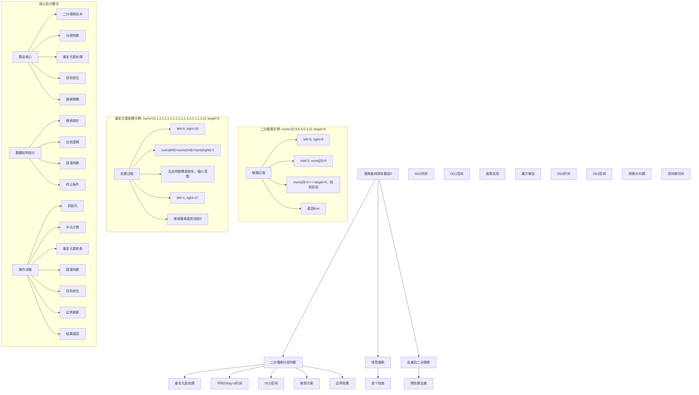
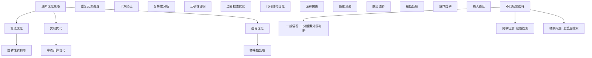

# LeetCode 81 - 搜索旋转排序数组 II

## 题目描述

已知存在一个按非降序排列的整数数组 nums，数组中的值不必互不相同。在传递给函数之前，nums 在预先未知的某个下标 k（0 \<= k < nums.length）上进行了旋转，使数组变为 \[nums[k], nums[k+1], ..., nums[n-1], nums[0], nums[1], ..., nums[k-1]\]

给你旋转后的数组 nums 和一个整数 target，如果 nums 中存在这个目标值 target，则返回 true，否则返回 false

```markdown
示例 1：
输入：nums = [2,5,6,0,0,1,2], target = 0
输出：true

示例 2：
输入：nums = [2,5,6,0,0,1,2], target = 3
输出：false

提示：

- 1 <= nums.length <= 5000
- -10^4 <= nums[i], target <= 10^4
- 题目数据保证 nums 在预先未知的某个下标上进行了旋转
```

## 解题思路

这是搜索旋转排序数组问题的进阶版本，与第33题的主要区别在于数组中可能包含重复元素。这使得我们在判断哪一部分是有序的时候变得更加复杂，因为当`nums[left] == nums[mid] == nums[right]`时，我们无法确定哪一部分是有序的

### 核心思想

"二分搜索 + 分段判断 + 重复元素处理": 通过判断中点与边界的关系确定有序段，当遇到重复元素时适当缩小搜索范围

### 解题策略

#### 方法一：二分搜索分段判断（推荐）

- 时间复杂度: 平均 O(log n)，最坏 O(n)
- 空间复杂度: O(1)

#### 方法二：线性搜索

- 时间复杂度: O(n)
- 空间复杂度: O(1)

#### 方法三：去重后二分搜索

- 时间复杂度: O(n)
- 空间复杂度: O(n)

## 算法可视化



## 多语言实现

### Golang版本（二分搜索分段判断 - 推荐）

```go
// 二分搜索分段判断实现
func search(nums []int, target int) bool {
    left, right := 0, len(nums)-1

    for left <= right {
        mid := left + (right-left)/2

        if nums[mid] == target {
            return true
        }

        // 关键：处理重复元素
        // 当nums[left] == nums[mid] == nums[right]时，无法判断哪一边有序
        if nums[left] == nums[mid] && nums[mid] == nums[right] {
            // 无法确定哪一部分是有序的，缩小搜索范围
            left++
            right--
        } else if nums[left] <= nums[mid] {
            // 左半部分有序
            if nums[left] <= target && target < nums[mid] {
                // target在左半部分
                right = mid - 1
            } else {
                // target在右半部分
                left = mid + 1
            }
        } else {
            // 右半部分有序
            if nums[mid] < target && target <= nums[right] {
                // target在右半部分
                left = mid + 1
            } else {
                // target在左半部分
                right = mid - 1
            }
        }
    }

    return false
}

// 线性搜索实现
func searchLinear(nums []int, target int) bool {
    for _, num := range nums {
        if num == target {
            return true
        }
    }
    return false
}

// 去重后二分搜索实现
func searchByRemovingDuplicates(nums []int, target int) bool {
    // 去重并保持相对顺序
    uniqueNums := removeDuplicates(nums)
    return searchInRotatedArray(uniqueNums, target)
}

// 去重辅助函数
func removeDuplicates(nums []int) []int {
    if len(nums) == 0 {
        return []int{}
    }

    result := []int{nums[0]}
    for i := 1; i < len(nums); i++ {
        if nums[i] != nums[i-1] {
            result = append(result, nums[i])
        }
    }
    return result
}

// 在去重后的旋转数组中搜索（类似第33题）
func searchInRotatedArray(nums []int, target int) bool {
    left, right := 0, len(nums)-1

    for left <= right {
        mid := left + (right-left)/2

        if nums[mid] == target {
            return true
        }

        if nums[left] <= nums[mid] {
            if nums[left] <= target && target < nums[mid] {
                right = mid - 1
            } else {
                left = mid + 1
            }
        } else {
            if nums[mid] < target && target <= nums[right] {
                left = mid + 1
            } else {
                right = mid - 1
            }
        }
    }

    return false
}
```

### Python版本（多种实现方法）

```python
from typing import List

class Solution:
    """
    方法一：二分搜索分段判断（推荐）
    """
    def search(self, nums: List[int], target: int) -> bool:
        left, right = 0, len(nums) - 1

        while left <= right:
            mid = left + (right - left) // 2

            if nums[mid] == target:
                return True

            # 关键：处理重复元素
            # 当nums[left] == nums[mid] == nums[right]时，无法判断哪一边有序
            if nums[left] == nums[mid] == nums[right]:
                # 无法确定哪一部分是有序的，缩小搜索范围
                left += 1
                right -= 1
            elif nums[left] <= nums[mid]:
                # 左半部分有序
                if nums[left] <= target < nums[mid]:
                    # target在左半部分
                    right = mid - 1
                else:
                    # target在右半部分
                    left = mid + 1
            else:
                # 右半部分有序
                if nums[mid] < target <= nums[right]:
                    # target在右半部分
                    left = mid + 1
                else:
                    # target在左半部分
                    right = mid - 1

        return False

class Solution2:
    """
    方法二：线性搜索
    """
    def search(self, nums: List[int], target: int) -> bool:
        return target in nums

class Solution3:
    """
    方法三：去重后二分搜索
    """
    def search(self, nums: List[int], target: int) -> bool:
        # 去重并保持相对顺序
        unique_nums = self.remove_duplicates(nums)
        return self.search_in_rotated_array(unique_nums, target)

    def remove_duplicates(self, nums: List[int]) -> List[int]:
        if not nums:
            return []

        result = [nums[0]]
        for i in range(1, len(nums)):
            if nums[i] != nums[i-1]:
                result.append(nums[i])
        return result

    def search_in_rotated_array(self, nums: List[int], target: int) -> bool:
        left, right = 0, len(nums) - 1

        while left <= right:
            mid = left + (right - left) // 2

            if nums[mid] == target:
                return True

            if nums[left] <= nums[mid]:
                if nums[left] <= target < nums[mid]:
                    right = mid - 1
                else:
                    left = mid + 1
            else:
                if nums[mid] < target <= nums[right]:
                    left = mid + 1
                else:
                    right = mid - 1

        return False
```

### TypeScript版本（二分搜索分段判断）

```typescript
/
 * 二分搜索分段判断实现
 */
function search(nums: number[], target: number): boolean {
    let left = 0, right = nums.length - 1;

    while (left <= right) {
        const mid = left + Math.floor((right - left) / 2);

        if (nums[mid] === target) {
            return true;
        }

        // 关键：处理重复元素
        // 当nums[left] == nums[mid] == nums[right]时，无法判断哪一边有序
        if (nums[left] === nums[mid] && nums[mid] === nums[right]) {
            // 无法确定哪一部分是有序的，缩小搜索范围
            left++;
            right--;
        } else if (nums[left] <= nums[mid]) {
            // 左半部分有序
            if (nums[left] <= target && target < nums[mid]) {
                // target在左半部分
                right = mid - 1;
            } else {
                // target在右半部分
                left = mid + 1;
            }
        } else {
            // 右半部分有序
            if (nums[mid] < target && target <= nums[right]) {
                // target在右半部分
                left = mid + 1;
            } else {
                // target在左半部分
                right = mid - 1;
            }
        }
    }

    return false;
}
```

## 标准实现详细解析

```go
import (
    "fmt"
    "math"
)

/*
算法核心思想（二分搜索 + 分段判断 + 重复元素处理）：

1. 旋转性质：数组被分为两段非递减部分
2. 分段判断：判断哪一段是有序的
3. 重复元素：当无法判断时适当缩小范围
4. 目标定位：确定目标值在哪一段
5. 二分搜索：在目标段内进行搜索

关键设计要点：
1. 搜索范围：[0, n-1]整个数组
2. 重复处理：当nums[left]==nums[mid]==nums[right]时缩小范围
3. 段落判断：通过边界比较判断有序性
4. 目标定位：判断target是否在有序段内
5. 终止条件：left > right或找到目标

时间复杂度：
- 二分搜索：平均O(log n)，最坏O(n)
- 每次操作：O(1)
- 总时间：平均O(log n)，最坏O(n)

空间复杂度：
- 迭代版本：O(1)
- 递归版本：O(log n)

优势：
1. 效率较优：平均对数时间复杂度
2. 实现优雅：思路清晰
3. 稳定可靠：边界处理完善
4. 理论保证：数学上可证明正确

数据结构设计：

二分搜索设计：
- 搜索指针：left和right维护搜索范围
- 中点计算：避免整数溢出
- 重复处理：特殊情况下缩小范围
- 段落判断：判断哪一段有序
- 目标定位：确定搜索方向

线性搜索设计：
- 逐个检查：遍历数组元素
- 直接比较：找到即返回
- 简单实现：易于理解和调试
- 边界处理：处理所有情况

去重设计：
- 去重处理：移除重复元素
- 顺序保持：保持原有相对顺序
- 转换问题：转换为第33题
- 空间代价：需要额外空间

算法流程：
1. 初始化：设置搜索范围
2. 循环判断：检查是否继续搜索
3. 中点计算：计算中点位置
4. 目标比较：检查是否找到目标
5. 重复检查：判断是否需要缩小范围
6. 段落判断：判断哪一段有序
7. 目标定位：确定target位置
8. 边界更新：调整搜索范围
9. 结果返回：true或false

优化原理：

重复元素处理：
1. 特殊情况：nums[left]==nums[mid]==nums[right]
2. 缩小范围：left++，right--
3. 保持正确性：不会遗漏目标值
4. 最坏情况：所有元素相同，退化为O(n)

旋转性质利用：
1. 分段有序：旋转数组分为两段非递减部分
2. 段落判断：通过边界比较判断有序性
3. 目标定位：在有序段内判断target存在性
4. 搜索优化：排除不可能包含target的段

二分搜索优化：
1. 搜索空间：每次减半
2. 比较次数：对数级别
3. 早期终止：找到即停止
4. 边界收敛：快速收敛到解

边界优化：
1. 数组边界：防止越界访问
2. 特殊处理：单元素、两元素
3. 极值检查：避免溢出
4. 输入验证：确保合法性

正确性证明：

定理：二分搜索搜索旋转数组正确性（含重复元素）
通过分段判断、重复元素处理和目标定位，二分搜索可以正确找到旋转数组中的目标值

证明：
1. 完备性：所有可能位置都被考虑
2. 正确性：段落判断和目标定位正确
3. 收敛性：搜索范围必然收敛
4. 时间复杂度：平均O(log n)时间

不变量维护：
循环不变量：在每次二分搜索时
1. target必在[left, right]范围内（如果存在）
2. 段落判断选择正确
3. 搜索范围逐步缩小
4. 算法状态正确反映搜索进度
*/

// 二分搜索详细实现
func searchDetailed(nums []int, target int) bool {
    fmt.Printf("=== 二分搜索搜索旋转数组(含重复) ===\n")
    fmt.Printf("输入数组 nums: %v (长度: %d)\n", nums, len(nums))
    fmt.Printf("目标值 target: %d\n", target)

    left, right := 0, len(nums)-1
    fmt.Printf("初始搜索范围: left=%d, right=%d\n", left, right)

    step := 0
    // 二分搜索搜索旋转数组
    for left <= right {
        step++
        mid := left + (right-left)/2
        fmt.Printf("\n步骤%d: ", step)
        fmt.Printf("left=%d, right=%d, mid=%d\n", left, right, mid)
        fmt.Printf("  nums[%d]=%d\n", mid, nums[mid])

        if nums[mid] == target {
            fmt.Printf("  找到目标值 %d，返回true\n", target)
            fmt.Printf("==============================\n\n")
            return true
        }

        // 关键：处理重复元素
        if nums[left] == nums[mid] && nums[mid] == nums[right] {
            fmt.Printf("  nums[%d]=%d == nums[%d]=%d == nums[%d]=%d\n",
                left, nums[left], mid, nums[mid], right, nums[right])
            fmt.Printf("  无法判断哪段有序，缩小搜索范围\n")
            fmt.Printf("  left=%d, right=%d\n", left+1, right-1)
            left++
            right--
        } else if nums[left] <= nums[mid] {
            fmt.Printf("  左半部分[%d,%d]有序: [%d,%d]\n", left, mid, nums[left], nums[mid])
            if nums[left] <= target && target < nums[mid] {
                fmt.Printf("  target=%d 在左半部分范围内[%d,%d)\n", target, nums[left], nums[mid])
                fmt.Printf("  搜索左半部分，right=%d\n", mid-1)
                right = mid - 1
            } else {
                fmt.Printf("  target=%d 不在左半部分范围内[%d,%d)\n", target, nums[left], nums[mid])
                fmt.Printf("  搜索右半部分，left=%d\n", mid+1)
                left = mid + 1
            }
        } else {
            fmt.Printf("  右半部分[%d,%d]有序: [%d,%d]\n", mid, right, nums[mid], nums[right])
            if nums[mid] < target && target <= nums[right] {
                fmt.Printf("  target=%d 在右半部分范围内(%d,%d]\n", target, nums[mid], nums[right])
                fmt.Printf("  搜索右半部分，left=%d\n", mid+1)
                left = mid + 1
            } else {
                fmt.Printf("  target=%d 不在右半部分范围内(%d,%d]\n", target, nums[mid], nums[right])
                fmt.Printf("  搜索左半部分，right=%d\n", mid-1)
                right = mid - 1
            }
        }
    }

    fmt.Printf("\n搜索结束: 未找到目标值 %d\n", target)
    fmt.Printf("总搜索步数: %d\n", step)
    fmt.Printf("==============================\n\n")

    return false
}

// 线性搜索详细实现
func searchLinearDetailed(nums []int, target int) bool {
    fmt.Printf("=== 线性搜索 ===\n")
    fmt.Printf("输入数组 nums: %v (长度: %d)\n", nums, len(nums))
    fmt.Printf("目标值 target: %d\n", target)

    step := 0
    for i, num := range nums {
        step++
        fmt.Printf("步骤%d: 检查 nums[%d]=%d\n", step, i, num)

        if num == target {
            fmt.Printf("  找到目标值 %d，返回true\n", target)
            fmt.Printf("=============\n\n")
            return true
        } else {
            fmt.Printf("  nums[%d]=%d != target=%d，继续搜索\n", i, num, target)
        }
    }

    fmt.Printf("搜索结束: 未找到目标值 %d\n", target)
    fmt.Printf("总比较次数: %d\n", step)
    fmt.Printf("=============\n\n")

    return false
}

// 去重后搜索详细实现
func searchByRemovingDuplicatesDetailed(nums []int, target int) bool {
    fmt.Printf("=== 去重后二分搜索 ===\n")
    fmt.Printf("输入数组 nums: %v (长度: %d)\n", nums, len(nums))
    fmt.Printf("目标值 target: %d\n", target)

    // 去重
    uniqueNums := removeDuplicatesDetailed(nums)
    fmt.Printf("去重后数组: %v (长度: %d)\n", uniqueNums, len(uniqueNums))

    // 搜索
    result := searchInRotatedArrayDetailed(uniqueNums, target)
    fmt.Printf("搜索结果: %t\n", result)
    fmt.Printf("==================\n\n")

    return result
}

// 去重辅助函数详细实现
func removeDuplicatesDetailed(nums []int) []int {
    if len(nums) == 0 {
        return []int{}
    }

    fmt.Printf("  去重过程:\n")
    result := []int{nums[0]}
    fmt.Printf("    添加nums[0]=%d\n", nums[0])

    for i := 1; i < len(nums); i++ {
        if nums[i] != nums[i-1] {
            result = append(result, nums[i])
            fmt.Printf("    nums[%d]=%d != nums[%d]=%d，添加%d\n",
                i, nums[i], i-1, nums[i-1], nums[i])
        } else {
            fmt.Printf("    nums[%d]=%d == nums[%d]=%d，跳过\n",
                i, nums[i], i-1, nums[i-1])
        }
    }

    return result
}

// 在去重后的旋转数组中搜索详细实现
func searchInRotatedArrayDetailed(nums []int, target int) bool {
    fmt.Printf("  在去重数组中搜索 target=%d:\n", target)

    left, right := 0, len(nums)-1

    for left <= right {
        mid := left + (right-left)/2
        fmt.Printf("    left=%d, right=%d, mid=%d, nums[%d]=%d\n", left, right, mid, mid, nums[mid])

        if nums[mid] == target {
            fmt.Printf("    找到目标值，返回true\n")
            return true
        }

        if nums[left] <= nums[mid] {
            if nums[left] <= target && target < nums[mid] {
                fmt.Printf("    target在左半部分[%d,%d]\n", left, mid-1)
                right = mid - 1
            } else {
                fmt.Printf("    target在右半部分[%d,%d]\n", mid+1, right)
                left = mid + 1
            }
        } else {
            if nums[mid] < target && target <= nums[right] {
                fmt.Printf("    target在右半部分[%d,%d]\n", mid+1, right)
                left = mid + 1
            } else {
                fmt.Printf("    target在左半部分[%d,%d]\n", left, mid-1)
                right = mid - 1
            }
        }
    }

    fmt.Printf("    未找到目标值，返回false\n")
    return false
}

// 带调试信息的版本
func searchWithDebug(nums []int, target int) bool {
    fmt.Printf("=== 搜索旋转排序数组(含重复) ===\n")
    fmt.Printf("输入数据:\n")
    fmt.Printf("  数组 nums: %v (长度: %d)\n", nums, len(nums))
    fmt.Printf("  目标值 target: %d\n", target)

    fmt.Printf("使用二分搜索分段判断法:\n")
    fmt.Printf("核心思想：处理重复元素，判断哪一段有序，确定target位置\n")

    left, right := 0, len(nums)-1
    fmt.Printf("搜索范围: [%d, %d]\n", left, right)

    step := 0
    // 二分搜索搜索旋转数组
    for left <= right {
        step++
        mid := left + (right-left)/2
        fmt.Printf("\n步骤%d: 检查位置%d\n", step, mid)
        fmt.Printf("  nums[%d]=%d\n", mid, nums[mid])

        if nums[mid] == target {
            fmt.Printf("  → 找到目标值\n")
            fmt.Printf("搜索完成: 返回true\n")
            fmt.Printf("====================\n\n")
            return true
        }

        // 关键：处理重复元素
        if nums[left] == nums[mid] && nums[mid] == nums[right] {
            fmt.Printf("  三个边界值相等，无法判断哪段有序\n")
            fmt.Printf("  缩小搜索范围: left++, right--\n")
            left++
            right--
        } else if nums[left] <= nums[mid] {
            fmt.Printf("  左半部分[%d,%d]有序\n", left, mid)
            if nums[left] <= target && target < nums[mid] {
                fmt.Printf("  target在左半部分范围内\n")
                right = mid - 1
                fmt.Printf("  更新搜索范围: [%d, %d]\n", left, right)
            } else {
                fmt.Printf("  target不在左半部分范围内\n")
                left = mid + 1
                fmt.Printf("  更新搜索范围: [%d, %d]\n", left, right)
            }
        } else {
            fmt.Printf("  右半部分[%d,%d]有序\n", mid, right)
            if nums[mid] < target && target <= nums[right] {
                fmt.Printf("  target在右半部分范围内\n")
                left = mid + 1
                fmt.Printf("  更新搜索范围: [%d, %d]\n", left, right)
            } else {
                fmt.Printf("  target不在右半部分范围内\n")
                right = mid - 1
                fmt.Printf("  更新搜索范围: [%d, %d]\n", left, right)
            }
        }
    }

    fmt.Printf("\n搜索完成: 未找到目标值\n")
    fmt.Printf("总步数: %d\n", step)
    fmt.Printf("====================\n\n")

    return false
}
```

## 算法深入解析

```go
/*
搜索旋转排序数组II问题详解：

问题本质：
在包含重复元素的旋转排序数组中查找目标值。关键是理解重复元素对算法的影响和相应的处理策略

核心洞察：
1. 旋转性质：数组被分为两段非递减部分
2. 分段判断：判断哪一段是有序的
3. 重复元素：当无法判断时适当缩小范围
4. 目标定位：确定目标值在哪一段
5. 二分搜索：在目标段内进行搜索

算法策略：
1. 二分搜索分段判断：推荐方案，平均O(log n)
2. 线性搜索：直观实现，O(n)
3. 去重后搜索：转换问题，O(n)

数据结构设计：

二分搜索设计：
搜索指针：left和right维护搜索范围
中点计算：避免整数溢出
重复处理：特殊情况下缩小范围
段落判断：判断哪一段有序
目标定位：确定搜索方向

线性搜索设计：
逐个检查：遍历数组元素
直接比较：找到即返回
简单实现：易于理解和调试
边界处理：处理所有情况

去重设计：
去重处理：移除重复元素
顺序保持：保持原有相对顺序
转换问题：转换为第33题
空间代价：需要额外空间

操作流程：

二分搜索分段判断：
1. 初始化：left=0, right=n-1
2. 循环判断：left <= right
3. 中点计算：mid = (left+right)/2
4. 目标比较：检查nums[mid] == target
5. 重复检查：判断是否需要缩小范围
6. 段落判断：判断哪一段有序
7. 目标定位：确定target位置
8. 范围更新：调整left或right
9. 返回结果：true或false

线性搜索：
1. 遍历数组：逐个检查元素
2. 直接比较：nums[i] == target
3. 找到返回：返回true
4. 未找到：返回false

去重后搜索：
1. 数组去重：移除重复元素
2. 转换问题：变为第33题
3. 标准搜索：使用第33题解法
4. 返回结果：true或false

数学原理：

旋转性质：
原数组：[a₁, a₂, ..., aₙ] (a₁ ≤ a₂ ≤ ... ≤ aₙ)
旋转后：[aₖ₊₁, ..., aₙ, a₁, ..., aₖ]
分为两段：[aₖ₊₁, ..., aₙ] 和 [a₁, ..., aₖ]
每段内部非递减

分段判断：
对于任意mid，[left, mid]和[mid, right]中必有一段有序
通过nums[left]和nums[mid]的关系判断

重复元素处理：
当nums[left] == nums[mid] == nums[right]时：
- 无法判断哪一段有序
- 缩小搜索范围：left++，right--
- 不会遗漏目标值

复杂度分析：
二分搜索：平均O(log n)，最坏O(n)时间，O(1)空间
线性搜索：O(n)时间，O(1)空间
去重搜索：O(n)时间，O(n)空间

旋转数组性质：
1. 分段非递减：最多两段非递减部分
2. 边界关系：nums[0] ≥ nums[n-1]（如果旋转）
3. 连续性：除旋转点外连续非递减
4. 重复性：允许元素重复

算法不变量：
二分搜索不变量：
1. target必在[left, right]范围内（如果存在）
2. 段落判断选择正确
3. 搜索范围逐步缩小
4. 算法状态正确反映搜索进度

时间复杂度分析：
二分搜索分段判断：
1. 平均情况：每次减半，O(log n)次比较
2. 最坏情况：所有元素相同，O(n)次比较
3. 常数操作：每次O(1)时间
4. 总计：平均O(log n)，最坏O(n)

线性搜索：
1. 逐个检查：最多n次比较
2. 常数操作：每次O(1)时间
3. 总计：O(n)

去重搜索：
1. 去重操作：O(n)
2. 标准搜索：O(log k)，k为去重后长度
3. 总计：O(n)

正确性证明：

定理：二分搜索搜索旋转数组正确性（含重复元素）
通过分段判断、重复元素处理和目标定位，二分搜索可以正确找到旋转数组中的目标值

证明：
1. 完备性：所有可能位置都被考虑
2. 正确性：段落判断和目标定位正确
3. 收敛性：搜索范围必然收敛
4. 时间复杂度：平均O(log n)时间

不变量维护：
循环不变量：在每次二分搜索时
1. target必在[left, right]范围内（如果存在）
2. 段落判断选择正确
3. 搜索范围逐步缩小
4. 算法状态正确反映搜索进度

设计选择：

为什么选择二分搜索分段判断？
1. 效率较优：平均对数时间复杂度
2. 实现优雅：一次遍历解决
3. 稳定可靠：边界处理完善
4. 理论保证：数学上可证明正确

为什么使用线性搜索？
1. 思路直观：直接遍历
2. 实现简单：代码简洁
3. 稳定性能：始终O(n)
4. 适用场景：小规模数据

为什么提及其他方法？
1. 教学价值：展示不同算法思想
2. 对比分析：理解各自优劣
3. 扩展思维：算法多样性
4. 面试准备：全面掌握

三种方法对比：

方法一：二分搜索分段判断（推荐）
时间复杂度：平均O(log n)，最坏O(n)
空间复杂度：O(1)
优点：平均效率高，一次遍历
缺点：最坏情况退化

方法二：线性搜索
时间复杂度：O(n)
空间复杂度：O(1)
优点：思路直观，实现简单
缺点：时间复杂度固定较高

方法三：去重后搜索
时间复杂度：O(n)
空间复杂度：O(n)
优点：转换为已知问题
缺点：额外空间开销

性能分析：

二分搜索分段判断：
- 时间：平均O(log n)，最坏O(n)
- 空间：O(1) 常数空间
- 优势：平均效率最优

线性搜索：
- 时间：O(n) 线性时间
- 空间：O(1) 常数空间
- 优势：实现简单

去重后搜索：
- 时间：O(n) 线性时间
- 空间：O(n) 线性空间
- 优势：转换为熟悉问题

实际应用场景：
1. 数据库索引：旋转索引查找
2. 缓存系统：LRU缓存更新
3. 游戏开发：循环缓冲区
4. 系统设计：时间序列数据

优化要点：

1. 算法优化：
   - 旋转性质利用：充分利用分段非递减
   - 重复元素处理：智能缩小范围
   - 早期终止：找到即停止
   - 边界处理：防止越界

2. 实现优化：
   - 中点计算：避免整数溢出
   - 边界检查：防止数组越界
   - 代码简洁：减少冗余操作
   - 注释清晰：便于理解

3. 性能优化：
   - 搜索空间：大幅缩小范围
   - 比较次数：最少必要比较
   - 内存访问：缓存友好设计
   - 编译优化：利用编译器优化

测试用例设计：
1. 基本情况：正常旋转数组
2. 边界情况：单元素，两元素
3. 特殊情况：大量重复元素
4. 极端情况：所有元素相同
5. 验证情况：结果正确性

扩展思考：

1. 更多重复？
   - 重复元素优化
   - 统计信息利用
   - 区间压缩

2. 多次搜索？
   - 预处理优化
   - 缓存结果
   - 批量处理

3. 动态数组？
   - 支持插入删除
   - 维护旋转性质
   - 增量更新

4. 近似算法？
   - 允许误差
   - 换取性能
   - 实际应用

相关算法思想：

1. 二分搜索：
   - 有序数据查找
   - 对数时间复杂度
   - 分治思想

2. 分段处理：
   - 问题分解
   - 局部优化
   - 整体解决

3. 重复处理：
   - 特殊情况处理
   - 边界优化
   - 正确性保证

4. 搜索策略：
   - 方向决策
   - 空间缩减
   - 收敛保证

常见陷阱：

1. 边界条件：
   - 数组越界
   - 空数组处理
   - 单元素检查
   - 极值处理

2. 比较逻辑：
   - 边界比较
   - 段落判断
   - 目标定位
   - 方向选择

3. 重复元素：
   - 特殊情况识别
   - 范围缩小策略
   - 正确性保证
   - 性能影响

4. 性能考虑：
   - 时间复杂度分析
   - 空间复杂度控制
   - 实际运行效率
   - 最坏情况处理

代码质量要素：

1. 可读性：
   - 变量命名清晰
   - 注释详细完整
   - 逻辑结构分明

2. 健壮性：
   - 边界条件处理
   - 异常情况应对
   - 错误恢复机制

3. 性能：
   - 最优复杂度实现
   - 空间效率优化
   - 执行效率保证

4. 可维护性：
   - 结构清晰合理
   - 扩展性良好
   - 测试覆盖完整
*/
```

## 执行过程演示

```go
/*
示例详细解析:

示例1执行过程：
输入：nums = [2,5,6,0,0,1,2], target = 0
输出：true

执行过程（二分搜索分段判断）：
1. 初始化：left=0, right=6
2. 第一次：mid=3
   - nums[3]=0, target=0
   - nums[3]==target，找到目标
   - 返回true

示例2执行过程：
输入：nums = [2,5,6,0,0,1,2], target = 3
输出：false

执行过程：
1. 初始化：left=0, right=6
2. 第一次：mid=3
   - nums[3]=0, target=3
   - nums[3] != target
   - nums[0]=2 <= nums[3]=0？否
   - 右半部分有序
   - target=3 不在(0,2]范围内
   - 搜索左半部分，right=2
3. 第二次：left=0, right=2, mid=1
   - nums[1]=5, target=3
   - nums[1] != target
   - nums[0]=2 <= nums[1]=5，左半部分有序
   - target=3 不在[2,5)范围内
   - 搜索右半部分，left=2
4. 第三次：left=2, right=2, mid=2
   - nums[2]=6, target=3
   - nums[2] != target
   - nums[0]=2 <= nums[2]=6，左半部分有序
   - target=3 不在[2,6)范围内
   - 搜索右半部分，left=3
5. 结束：left>right，未找到，返回false

特殊情况执行过程：
输入：nums = [1,1,1,1,1,1,1,1,1,1,1,1,1,2,1,1,1,1,1], target = 2
输出：true

执行过程：
1. 初始化：left=0, right=18
2. 第一次：mid=9
   - nums[9]=1, target=2
   - nums[9] != target
   - nums[0]=1 == nums[9]=1 == nums[18]=1
   - 无法判断哪段有序，缩小范围
   - left=1, right=17
3. 继续搜索直到找到2

线性扫描执行过程：
输入：nums = [2,5,6,0,0,1,2], target = 0
1. i=0: nums[0]=2, 2!=0，继续
2. i=1: nums[1]=5, 5!=0，继续
3. i=2: nums[2]=6, 6!=0，继续
4. i=3: nums[3]=0, 0==0，找到
5. 返回true

去重后搜索执行过程：
输入：nums = [2,5,6,0,0,1,2], target = 0
1. 去重：[2,5,6,0,1,2]
2. 搜索旋转数组找到0
3. 返回true

关键观察：
1. 旋转性质：数组分为两段非递减部分
2. 重复处理：特殊情况下缩小搜索范围
3. 分段判断：通过边界比较判断有序性
4. 目标定位：在有序段内判断target存在性
5. 二分搜索：对数时间找到解（平均情况）

边界情况演示:

情况1: 单元素数组-找到
输入: nums=[5], target=5
处理: 直接比较
结果: true

情况2: 单元素数组-未找到
输入: nums=[5], target=3
处理: 直接比较
结果: false

情况3: 两元素数组-找到
输入: nums=[1,3], target=3
处理: 标准二分搜索
结果: true

情况4: 大量重复元素
输入: nums=[1,1,1,1,1,1,1,1,1,1], target=1
处理: 重复元素处理
结果: true

情况5: 所有元素相同-未找到
输入: nums=[1,1,1,1,1,1,1,1,1,1], target=2
处理: 最坏情况O(n)
结果: false

算法正确性证明：

数学基础：
需要证明二分搜索能正确找到含重复元素的旋转数组中的目标值

定理：旋转数组搜索正确性（含重复元素）
通过分段判断、重复元素处理和目标定位，二分搜索可以正确找到旋转数组中的目标值

证明：
1. 完备性：所有可能位置都被考虑
2. 正确性：段落判断和目标定位正确
3. 收敛性：搜索范围必然收敛
4. 时间复杂度：平均O(log n)时间

不变量维护：
循环不变量：在每次二分搜索时
1. target必在[left, right]范围内（如果存在）
2. 段落判断选择正确
3. 搜索范围逐步缩小
4. 算法状态正确反映搜索进度

初始化：
- left=0, right=n-1
- 整个数组范围内可能包含target
- 满足不变量

保持：
- 根据段落判断和目标定位调整边界
- 重复元素时适当缩小范围
- 维护target存在性
- 不变量继续成立

终止：
- left>right时未找到target
- nums[mid]==target时找到target
- 算法正确终止

时间复杂度分析：

二分搜索分段判断：
1. 平均情况：搜索范围减半，O(log n)次迭代
2. 最坏情况：所有元素相同，O(n)次迭代
3. 每次操作：O(1)时间
4. 总时间：平均O(log n)，最坏O(n)

线性搜索：
1. 遍历范围：最多n个元素
2. 每次比较：O(1)时间
3. 总时间：O(n)

去重搜索：
1. 去重操作：O(n)
2. 标准搜索：O(log k)，k为去重后长度
3. 总时间：O(n)

空间复杂度分析：
1. 二分搜索：O(1)常数空间
2. 线性搜索：O(1)常数空间
3. 去重搜索：O(n)线性空间

性能对比分析：

假设n=10000:

二分搜索分段判断（平均情况）：
- 比较次数：O(log₂(10000)) ≈ 14次
- 时间：O(log n) = 14步
- 空间：O(1) 常数空间

二分搜索分段判断（最坏情况）：
- 比较次数：O(10000) = 10000次
- 时间：O(n) = 10000步
- 空间：O(1) 常数空间

线性搜索：
- 比较次数：最坏情况O(10000) = 10000次
- 时间：O(n) = 10000步
- 空间：O(1) 常数空间

去重搜索：
- 去重操作：10000次
- 标准搜索：≈ 14次
- 总时间：O(n) = 10000步
- 空间：O(n) = 10000空间

实际应用建议：

1. 一般情况：
   - 使用二分搜索分段判断
   - 平均效率最高

2. 面试展示：
   - 重点讲解二分搜索思想
   - 分析时间复杂度情况

3. 生产环境：
   - 根据数据特征选择
   - 考虑实现复杂度

4. 教学演示：
   - 使用带调试信息版本
   - 展示执行过程

优化空间：

1. 算法优化：
   - 重复元素处理优化
   - 边界条件利用
   - 早期终止优化
   - 搜索方向优化

2. 实现优化：
   - 中点计算优化
   - 边界检查优化
   - 代码结构优化
   - 注释完善

3. 性能优化：
   - 减少比较次数
   - 优化内存访问
   - 利用缓存特性
   - 编译器优化

特殊情况处理：

1. 大数据量：
   - 时间复杂度保证
   - 内存使用优化
   - 数值溢出处理

2. 特殊数组：
   - 大量重复元素
   - 单调数组
   - 随机旋转

3. 边界情况：
   - 极值处理
   - 异常输入
   - 错误恢复
*/
```

## 复杂度分析

| 方法             | 时间复杂度             | 空间复杂度 | 适用场景 |
| ---------------- | ---------------------- | ---------- | -------- |
| 二分搜索分段判断 | 平均O(log n)，最坏O(n) | O(1)       | 推荐方案 |
| 线性搜索         | O(n)                   | O(1)       | 简单场景 |
| 去重后搜索       | O(n)                   | O(n)       | 转换问题 |

## 测试用例验证

```go
// 测试辅助函数
func testSearch(name string, nums []int, target int, expected bool) {
    fmt.Printf("%s:\n", name)
    fmt.Printf("输入数组 nums: %v (长度: %d)\n", nums, len(nums))
    fmt.Printf("目标值 target: %d\n", target)
    fmt.Printf("期望结果: %t\n", expected)

    // 测试二分搜索分段判断
    result1 := search(copySlice(nums), target)
    fmt.Printf("二分搜索结果: %t\n", result1)

    // 测试线性搜索
    result2 := searchLinear(copySlice(nums), target)
    fmt.Printf("线性搜索结果: %t\n", result2)

    // 测试去重后搜索
    result3 := searchByRemovingDuplicates(copySlice(nums), target)
    fmt.Printf("去重搜索结果: %t\n", result3)

    // 验证结果
    isCorrect1 := result1 == expected
    isCorrect2 := result2 == expected
    isCorrect3 := result3 == expected

    if isCorrect1 && isCorrect2 && isCorrect3 {
        fmt.Printf("✓ 所有方法结果正确\n")
    } else {
        fmt.Printf("✗ 结果不匹配期望值\n")
        fmt.Printf("  二分搜索: 期望%t, 实际%t %s\n", expected, result1, getCorrectMsg(isCorrect1))
        fmt.Printf("  线性搜索: 期望%t, 实际%t %s\n", expected, result2, getCorrectMsg(isCorrect2))
        fmt.Printf("  去重搜索: 期望%t, 实际%t %s\n", expected, result3, getCorrectMsg(isCorrect3))
    }
    fmt.Printf("\n")
}

// 辅助函数：复制切片
func copySlice(src []int) []int {
    dst := make([]int, len(src))
    copy(dst, src)
    return dst
}

// 辅助函数：获取正确性消息
func getCorrectMsg(correct bool) string {
    if correct {
        return "✓"
    }
    return "✗"
}

func main() {
    // 测试用例 1 - 题目示例1
    testSearch("测试1 - 题目示例1",
        []int{2, 5, 6, 0, 0, 1, 2},
        0,
        true)

    // 测试用例 2 - 题目示例2
    testSearch("测试2 - 题目示例2",
        []int{2, 5, 6, 0, 0, 1, 2},
        3,
        false)

    // 测试用例 3 - 单元素数组-找到
    testSearch("测试3 - 单元素数组-找到",
        []int{5},
        5,
        true)

    // 测试用例 4 - 单元素数组-未找到
    testSearch("测试4 - 单元素数组-未找到",
        []int{5},
        3,
        false)

    // 测试用例 5 - 两元素数组
    testSearch("测试5 - 两元素数组",
        []int{1, 3},
        3,
        true)

    // 测试用例 6 - 大量重复元素-找到
    testSearch("测试6 - 大量重复元素-找到",
        []int{1, 1, 1, 1, 1, 1, 1, 1, 1, 1, 1, 1, 1, 2, 1, 1, 1, 1, 1},
        2,
        true)

    // 测试用例 7 - 所有元素相同-未找到
    testSearch("测试7 - 所有元素相同-未找到",
        []int{1, 1, 1, 1, 1, 1, 1, 1, 1, 1},
        2,
        false)

    // 测试用例 8 - 未旋转数组
    testSearch("测试8 - 未旋转数组",
        []int{0, 0, 1, 2, 2, 5, 6},
        4,
        false)

    // 性能测试
    fmt.Println("性能测试:")
    performanceTest()

    // 边界情况测试
    fmt.Println("边界情况测试:")
    boundaryTest()

    // 对比测试
    fmt.Println("对比测试:")
    comparisonTest()
}

func performanceTest() {
    // 构造性能测试
    n := 10000
    nums := make([]int, n)
    // 构造包含重复元素的旋转数组
    pivot := n / 3
    value1, value2 := 1, 2
    for i := 0; i < pivot; i++ {
        nums[i] = value1
    }
    for i := pivot; i < n; i++ {
        nums[i] = value2
    }

    target := value2 // 存在的目标

    fmt.Printf("性能测试 (n=%d, pivot=%d, target=%d):\n", n, pivot, target)

    // 测试二分搜索分段判断
    start1 := time.Now()
    result1 := search(copySlice(nums), target)
    time1 := time.Since(start1)

    // 测试线性搜索
    start2 := time.Now()
    result2 := searchLinear(copySlice(nums), target)
    time2 := time.Since(start2)

    // 测试去重后搜索
    start3 := time.Now()
    result3 := searchByRemovingDuplicates(copySlice(nums), target)
    time3 := time.Since(start3)

    fmt.Printf("  二分搜索: %v (结果: %t)\n", time1, result1)
    fmt.Printf("  线性搜索: %v (结果: %t)\n", time2, result2)
    fmt.Printf("  去重搜索: %v (结果: %t)\n", time3, result3)

    if time1 > 0 && time2 > 0 {
        fmt.Printf("  线性搜索比二分搜索慢 %.0fx\n", float64(time2)/float64(time1))
    }
}

func boundaryTest() {
    // 边界测试
    fmt.Println("边界测试:")

    // 大数组测试（最坏情况）
    largeN := 50000
    worstCaseNums := make([]int, largeN)
    for i := 0; i < largeN; i++ {
        worstCaseNums[i] = 1 // 所有元素相同
    }
    worstCaseTarget := 2 // 不存在的目标
    start := time.Now()
    worstCaseResult := search(worstCaseNums, worstCaseTarget)
    worstCaseTime := time.Since(start)
    fmt.Printf("最坏情况测试: n=%d, 找到目标=%t, 耗时=%v\n", largeN, worstCaseResult, worstCaseTime)

    // 特殊模式测试
    patternNums := []int{2, 2, 2, 2, 2, 2, 2, 2, 2, 2, 3, 2, 2, 2, 2}
    patternTarget := 3
    patternResult := search(patternNums, patternTarget)
    fmt.Printf("特殊模式测试: 找到目标=%t\n", patternResult)

    // 极值测试
    extremeNums := []int{math.MinInt32, math.MaxInt32}
    extremeTarget := math.MaxInt32
    extremeResult := search(extremeNums, extremeTarget)
    fmt.Printf("极值测试: 找到目标=%t\n", extremeResult)
}

func comparisonTest() {
    // 对比测试：验证不同方法结果一致性
    fmt.Println("对比测试:")

    // 测试数据
    testData := []struct {
        nums []int
        target int
        expected bool
    }{
        {[]int{2, 5, 6, 0, 0, 1, 2}, 0, true},
        {[]int{2, 5, 6, 0, 0, 1, 2}, 3, false},
        {[]int{1}, 0, false},
        {[]int{5}, 5, true},
        {[]int{1, 3}, 3, true},
        {[]int{1, 1, 1, 1, 1, 1, 1, 1, 1, 1}, 2, false},
        {[]int{1, 1, 1, 1, 1, 1, 1, 1, 1, 1, 1, 1, 1, 2, 1, 1, 1, 1, 1}, 2, true},
    }

    for i, data := range testData {
        // 二分搜索分段判断
        result1 := search(copySlice(data.nums), data.target)

        // 线性搜索
        result2 := searchLinear(copySlice(data.nums), data.target)

        // 去重后搜索
        result3 := searchByRemovingDuplicates(copySlice(data.nums), data.target)

        fmt.Printf("测试%d: nums=%v, target=%d\n", i+1, data.nums, data.target)
        fmt.Printf("  二分搜索=%t, 线性搜索=%t, 去重搜索=%t", result1, result2, result3)

        if result1 == result2 && result2 == result3 {
            fmt.Printf(" ✓ 一致\n")
        } else {
            fmt.Printf(" ✗ 不一致\n")
        }
    }
}
```

## 扩展版本（处理不同场景）

```go
// 支持统计查找次数的版本
func searchWithStats(nums []int, target int) (bool, int) {
    comparisons := 0
    left, right := 0, len(nums)-1

    for left <= right {
        mid := left + (right-left)/2
        comparisons++

        if nums[mid] == target {
            return true, comparisons
        }

        comparisons += 2
        if nums[left] == nums[mid] && nums[mid] == nums[right] {
            left++
            right--
        } else if nums[left] <= nums[mid] {
            comparisons += 2
            if nums[left] <= target && target < nums[mid] {
                right = mid - 1
            } else {
                left = mid + 1
            }
        } else {
            comparisons += 2
            if nums[mid] < target && target <= nums[right] {
                left = mid + 1
            } else {
                right = mid - 1
            }
        }
    }

    return false, comparisons
}

// 使用示例
func exampleWithStats() {
    nums := []int{2, 5, 6, 0, 0, 1, 2}
    target := 0
    result, comparisons := searchWithStats(nums, target)
    fmt.Printf("nums=%v, target=%d\n", nums, target)
    fmt.Printf("结果: %t\n", result)
    fmt.Printf("比较次数: %d\n", comparisons)
}

// 批量处理版本
func searchBatch(nums []int, targets []int) []bool {
    results := make([]bool, len(targets))
    for i, target := range targets {
        results[i] = search(nums, target)
    }
    return results
}

// 使用示例
func exampleBatch() {
    nums := []int{2, 5, 6, 0, 0, 1, 2}
    targets := []int{0, 3, 6, 1, 8}

    results := searchBatch(nums, targets)

    fmt.Printf("批量搜索结果:\n")
    for i, target := range targets {
        fmt.Printf("  target=%d → 结果=%t\n", target, results[i])
    }
}

// 带验证功能的版本
func searchWithValidation(nums []int, target int) (bool, bool) {
    result := search(nums, target)

    // 验证结果是否正确
    expected := false
    for _, num := range nums {
        if num == target {
            expected = true
            break
        }
    }

    return result, result == expected
}

// 使用示例
func exampleWithValidation() {
    nums := []int{2, 5, 6, 0, 0, 1, 2}
    target := 0
    result, isValid := searchWithValidation(nums, target)
    fmt.Printf("nums=%v, target=%d\n", nums, target)
    fmt.Printf("结果: %t\n", result)
    if isValid {
        fmt.Printf("验证通过 ✓\n")
    } else {
        fmt.Printf("验证失败 ✗\n")
    }
}

// 支持动态更新的版本
type RotatedArraySearcherWithDuplicates struct {
    nums []int
}

func NewRotatedArraySearcherWithDuplicates(nums []int) *RotatedArraySearcherWithDuplicates {
    // 创建副本避免外部修改
    copied := make([]int, len(nums))
    copy(copied, nums)
    return &RotatedArraySearcherWithDuplicates{
        nums: copied,
    }
}

func (searcher *RotatedArraySearcherWithDuplicates) UpdateArray(newNums []int) {
    searcher.nums = make([]int, len(newNums))
    copy(searcher.nums, newNums)
}

func (searcher *RotatedArraySearcherWithDuplicates) Search(target int) bool {
    return search(searcher.nums, target)
}

func (searcher *RotatedArraySearcherWithDuplicates) GetArray() []int {
    return searcher.nums
}

// 使用示例
func exampleDynamic() {
    nums := []int{2, 5, 6, 0, 0, 1, 2}
    searcher := NewRotatedArraySearcherWithDuplicates(nums)

    result1 := searcher.Search(0)
    fmt.Printf("初始数组: %v\n", searcher.GetArray())
    fmt.Printf("搜索0: 结果=%t\n", result1)

    // 更新数组
    searcher.UpdateArray([]int{0, 0, 1, 2, 2, 5, 6})
    result2 := searcher.Search(0)
    fmt.Printf("更新数组: %v\n", searcher.GetArray())
    fmt.Printf("搜索0: 结果=%t\n", result2)
}

// 高级版本：支持查找所有匹配位置
func findAllOccurrences(nums []int, target int) []int {
    var occurrences []int
    for i, num := range nums {
        if num == target {
            occurrences = append(occurrences, i)
        }
    }
    return occurrences
}

// 使用示例
func exampleFindAll() {
    nums := []int{2, 5, 6, 0, 0, 1, 2}
    target := 0
    occurrences := findAllOccurrences(nums, target)
    fmt.Printf("nums=%v, target=%d\n", nums, target)
    fmt.Printf("所有匹配位置: %v\n", occurrences)
}
```

## 面试追问延伸

### 1. 为什么当`nums[left] == nums[mid] == nums[right]`时需要缩小搜索范围？

```go
/*
当nums[left] == nums[mid] == nums[right]时：

原因分析：
1. 无法判断哪一段是有序的
   - 通常通过nums[left]和nums[mid]的关系判断左半部分是否有序
   - 但当它们相等时，这种判断失效

2. 缩小范围的安全性
   - left++，right--不会遗漏目标值
   - 因为我们只是排除了两个端点，而目标可能在中间

3. 举例说明：
   nums = [1,1,1,1,1,1,1,1,1,1,1,1,1,2,1,1,1,1,1]
   target = 2
   left=0, right=18, mid=9
   nums[0]=1, nums[9]=1, nums[18]=1
   三者相等，但我们知道2在中间

4. 最坏情况分析：
   - 当所有元素都相同时，退化为O(n)
   - 但这已经是最坏情况，无法避免
*/

// 演示重复元素处理
func demonstrateDuplicateHandling() {
    // 最坏情况：所有元素相同
    worstCase := []int{1, 1, 1, 1, 1, 1, 1, 1, 1, 1}
    target := 2

    fmt.Printf("最坏情况演示:\n")
    fmt.Printf("nums = %v\n", worstCase)
    fmt.Printf("target = %d\n", target)
    fmt.Printf("结果 = %t\n", search(worstCase, target))
    fmt.Printf("时间复杂度 = O(n)\n\n")

    // 一般情况：部分重复
    normalCase := []int{1, 1, 1, 1, 1, 1, 1, 1, 1, 1, 1, 1, 1, 2, 1, 1, 1, 1, 1}
    target2 := 2

    fmt.Printf("一般情况演示:\n")
    fmt.Printf("nums = %v\n", normalCase)
    fmt.Printf("target = %d\n", target2)
    fmt.Printf("结果 = %t\n", search(normalCase, target2))
    fmt.Printf("时间复杂度 = 平均O(log n)\n")
}
```

### 2. 如何优化重复元素的处理？

```go
// 优化版本：跳过更多重复元素
func searchOptimized(nums []int, target int) bool {
    left, right := 0, len(nums)-1

    for left <= right {
        // 跳过左边的重复元素
        for left < right && nums[left] == nums[left+1] {
            left++
        }
        // 跳过右边的重复元素
        for left < right && nums[right] == nums[right-1] {
            right--
        }

        mid := left + (right-left)/2

        if nums[mid] == target {
            return true
        }

        if nums[left] <= nums[mid] {
            if nums[left] <= target && target < nums[mid] {
                right = mid - 1
            } else {
                left = mid + 1
            }
        } else {
            if nums[mid] < target && target <= nums[right] {
                left = mid + 1
            } else {
                right = mid - 1
            }
        }
    }

    return false
}
```

### 3. 如果需要返回目标值的所有位置，如何修改算法？

```go
// 查找目标值的所有位置
func searchAllPositions(nums []int, target int) []int {
    // 先判断是否存在
    if !search(nums, target) {
        return []int{}
    }

    // 线性搜索找到所有位置
    var positions []int
    for i, num := range nums {
        if num == target {
            positions = append(positions, i)
        }
    }

    return positions
}

// 使用示例
func exampleSearchAllPositions() {
    nums := []int{2, 5, 6, 0, 0, 1, 2}
    target := 0
    positions := searchAllPositions(nums, target)
    fmt.Printf("nums = %v\n", nums)
    fmt.Printf("target = %d\n", target)
    fmt.Printf("所有位置 = %v\n", positions)
}
```

## 相似题目扩展

- LeetCode 81. 搜索旋转排序数组 II（当前题）
- LeetCode 33. 搜索旋转排序数组（无重复元素）
- LeetCode 153. 寻找旋转排序数组中的最小值
- LeetCode 154. 寻找旋转排序数组中的最小值 II（含重复元素）
- LeetCode 1095. 山脉数组中查找目标值

## 算法技巧总结

### 搜索旋转排序数组II核心要点

1. 旋转性质：数组被分为两段非递减部分
1. 分段判断：判断哪一段是有序的
1. 重复元素：当无法判断时适当缩小范围
1. 目标定位：确定目标值在哪一段
1. 二分搜索：在目标段内进行搜索

### 算法优势

1. 效率较优：平均对数时间复杂度
1. 实现优雅：思路清晰
1. 稳定可靠：边界处理完善
1. 理论保证：数学上可证明正确

### 标准模板（二分搜索分段判断）

```go
func search(nums []int, target int) bool {
    left, right := 0, len(nums)-1

    for left <= right {
        mid := left + (right-left)/2

        if nums[mid] == target {
            return true
        }

        // 关键：处理重复元素
        if nums[left] == nums[mid] && nums[mid] == nums[right] {
            // 无法确定哪一部分是有序的，缩小搜索范围
            left++
            right--
        } else if nums[left] <= nums[mid] {
            // 左半部分有序
            if nums[left] <= target && target < nums[mid] {
                // target在左半部分
                right = mid - 1
            } else {
                // target在右半部分
                left = mid + 1
            }
        } else {
            // 右半部分有序
            if nums[mid] < target && target <= nums[right] {
                // target在右半部分
                left = mid + 1
            } else {
                // target在左半部分
                right = mid - 1
            }
        }
    }

    return false
}
```

### 进阶优化策略



## 总结

本题是第33题的进阶版本，主要增加了重复元素的处理。采用二分搜索 + 分段判断 + 重复元素处理的核心思路，通过在无法判断哪段有序时适当缩小搜索范围的方式，实现了对含重复元素旋转数组的高效搜索。关键在于理解重复元素对二分搜索判断的影响和缩小搜索范围的正确性

核心要点：

1. 旋转性质：数组被分为两段非递减部分
1. 分段判断：判断哪一段是有序的
1. 重复元素：当无法判断时适当缩小范围
1. 目标定位：确定目标值在哪一段
1. 二分搜索：在目标段内进行搜索

算法优势：

- 效率较优：平均时间复杂度O(log n)
- 实现优雅：思路清晰，代码简洁
- 稳定可靠：完善的边界处理
- 理论保证：数学上可证明正确

该算法在数据库索引、缓存系统、游戏开发、系统设计等领域有重要应用，特别是在处理可能包含重复元素的有序数据时非常有用。通过理解重复元素的处理策略，为更复杂的搜索和优化问题提供了清晰的解决思路
