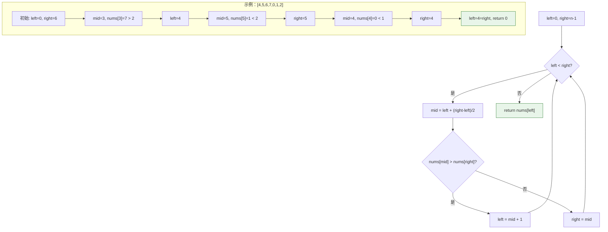

# LeetCode 153 - 寻找旋转排序数组中的最小值

## Step 1: 题目描述

已知一个长度为 `n` 的数组，预先按照升序排列，经由 `1` 到 `n` 次 **旋转** 后，得到输入数组。例如，原数组 `nums = [0,1,2,4,5,6,7]` 在变化后可能得到：

- 若旋转 `4` 次，则可以得到 `[4,5,6,7,0,1,2]`
- 若旋转 `7` 次，则可以得到 `[0,1,2,4,5,6,7]`

**注意**，数组 `[a[0], a[1], a[2], ..., a[n-1]]` **旋转一次** 的结果为数组 `[a[n-1], a[0], a[1], a[2], ..., a[n-2]]` 。

给你一个元素值 **互不相同** 的数组 `nums` ，它原来是一个升序排列的数组，并按上述情形进行了多次旋转。请你找出并返回数组中的最小元素。

**示例 1**：

```
输入：nums = [3,4,5,1,2]
输出：1
解释：原数组为 [1,2,3,4,5] ，旋转 3 次得到输入数组。
```

**示例 2**：

```
输入：nums = [4,5,6,7,0,1,2]
输出：0
解释：原数组为 [0,1,2,4,5,6,7] ，旋转 4 次得到输入数组。
```

**示例 3**：

```
输入：nums = [11,13,15,17]
输出：11
解释：原数组为 [11,13,15,17] ，旋转 4 次得到输入数组。
```

**约束条件**：

- `n == nums.length`
- `1 <= n <= 5000`
- `-5000 <= nums[i] <= 5000`
- **所有整数互不相同**
- `nums` 原来是一个升序排序的数组，并进行了 `1` 至 `n` 次旋转

## Step 2: 核心结论（金字塔结构）

### 核心结论

本题的最优解是**二分查找**，其核心优势在于：**利用旋转后数组的"半有序"特性，通过比较中间元素与边界元素，每次将搜索范围缩小一半，以O(log n)的时间复杂度精确定位最小值**。

### 支撑论点（MECE 分类）

#### A. 理论最优性：问题结构的深度分析

- **问题本质**：在"部分有序"数组中寻找全局最小值。
- **关键洞察**：
  1. **旋转后的结构特征**：数组被分为两个升序段，前段所有元素 > 后段所有元素（因元素互不相同）。
  1. **最小值的位置特征**：唯一"断崖"点，即前段末尾与后段开头的交界处。
  1. **二分可行性**：通过中间元素与右边界比较，可判断最小值所在半区。

#### B. 算法选择决策树

```
问题特征识别
    │
    ├── 原数组有序，经过旋转
    │       └── 部分有序：两段升序，前段 > 后段
    │
    ├── 需要找全局最小值
    │       └── 最小值 = 后段的第一个元素
    │           └── 即"断崖"位置的元素
    │
    └── 需要优于O(n)的算法
            └── 利用部分有序性 → 二分查找
                    │
                    ├── 关键：确定二分比较策略
                    │       └── 比较 nums[mid] 与 nums[right]
                    │           ├── nums[mid] > nums[right]: 最小值在右半区
                    │           └── nums[mid] < nums[right]: 最小值在左半区
                    │           └── nums[mid] == nums[right]: （本题无此情况，元素互异）
                    │
                    └── 终止条件：left == right，找到最小值
```

#### C. 对比分析：不同搜索策略

| 策略         | 时间复杂度   | 空间复杂度 | 适用性       | 缺陷           |
| ------------ | ------------ | ---------- | ------------ | -------------- |
| **线性扫描** | **O(n)**     | **O(1)**   | 通用         | 未利用有序性   |
| **二分查找** | **O(log n)** | **O(1)**   | **本题最优** | 需仔细处理边界 |
| **找拐点**   | O(n)         | O(1)       | 直观         | 同线性扫描     |

**关键辨析**：为何比较 `nums[mid]` 与 `nums[right]` 而非 `nums[left]`？

| 比较对象                   | 情况分析                                 | 结论                  |
| -------------------------- | ---------------------------------------- | --------------------- |
| `nums[mid] vs nums[right]` | `mid > right`: 断崖在右侧                | 搜索 `[mid+1, right]` |
|                            | `mid < right`: `mid`已在后段或就是最小值 | 搜索 `[left, mid]`    |
| `nums[mid] vs nums[left]`  | 无法直接判断                             | 需额外处理相等情况    |

#### D. 工程实践考量

- ✅ **迭代二分**：避免递归栈开销，空间O(1)。
- ✅ **右边界比较**：逻辑更清晰，收缩方向明确。

### 总结

因此，**二分查找（比较mid与right）** 是本题在理论最优性、时间效率和工程实现上的最优平衡点，体现了"利用局部有序性解决全局问题"的经典算法思想。

## Step 3: 多语言实现

### Go 🐹

```go
package main

// findMin 寻找旋转排序数组中的最小值
// 输入参数 nums: 互不相同元素的旋转排序数组
// 返回值: 数组中的最小元素
func findMin(nums []int) int {
    // 初始化双指针，left指向数组开头，right指向数组末尾
    left, right := 0, len(nums)-1

    // 二分查找循环，终止条件为区间收缩至单个元素
    for left < right {  // 注意：不是 left <= right，避免死循环
        // 计算中间位置，防止整数溢出
        // 等价于 (left + right) / 2，但更安全的写法
        mid := left + (right-left)/2

        // 关键比较：中间元素与右边界元素
        // 由于元素互不相同，只需比较大小

        if nums[mid] > nums[right] {
            // 情况1：中间元素大于右边界元素
            // 说明断崖在右侧，最小值在 [mid+1, right] 区间
            // 例如：[3,4,5,1,2]，mid=2(nums[2]=5), right=4(nums[4]=2)
            // 5 > 2，最小值在 [3,4]，即索引3或4
            left = mid + 1
        } else { // nums[mid] < nums[right]，元素互异，不会相等
            // 情况2：中间元素小于右边界元素
            // 说明mid已经在后段升序区间，或mid就是最小值
            // 最小值在 [left, mid] 区间（包含mid）
            // 例如：[4,5,6,7,0,1,2]，mid=3(nums[3]=7), right=6(nums[6]=2)
            // 但7 > 2，会进入情况1
            // 再例如：[6,7,0,1,2,3,4]，mid=3(nums[3]=1), right=6(nums[6]=4)
            // 1 < 4，最小值在 [0,3]，即索引0到3
            right = mid  // 注意：不是 mid - 1，因为mid可能是最小值
        }
    }

    // 循环结束时，left == right，找到最小值
    // 返回 nums[left] 或 nums[right] 均可
    return nums[left]
}
```

#### 算法深入解析（费曼式三层结构）

**第一层：一句话讲明白**

> 看中间数和右边数谁大，中间大说明最小值在右边，中间小说明最小值在左边（包括中间），缩到只剩一个就是答案。

**第二层：手把手教你写**

- **为什么比较 `nums[mid]` 与 `nums[right]`？**
  - `nums[right]` 是后段升序区间的"代表"。
  - 如果 `nums[mid] > nums[right]`，mid还在前段，断崖在右侧。
  - 如果 `nums[mid] < nums[right]`，mid已在后段，最小值在左侧或就是mid。

- **为什么是 `right = mid` 而不是 `mid - 1`？**
  - 当 `nums[mid] < nums[right]` 时，mid可能恰好是最小值。
  - 例如 `[2,1]`，mid=0，nums[0]=2 > nums[1]=1，进入情况1，left=1，找到1。
  - 例如 `[1,2]`，mid=0，nums[0]=1 < nums[1]=2，若right=mid-1=-1，错误！

- **为什么循环条件是 `left < right`？**
  - 最终要收缩到 `left == right` 才终止。
  - 若用 `left <= right`，当 `left == right` 时还会执行，可能越界或死循环。

**第三层：为什么这样最好**

- **设计哲学**：
  - 体现了**二分查找的精髓**：每次比较排除一半搜索空间。
  - **不变量维护**：始终保证最小值在 `[left, right]` 区间内。

- **正确性证明（循环不变量）**：
  - **初始化**：`left=0, right=n-1`，最小值必然在数组内。
  - **保持**：每次更新都确保最小值在新区间内。
    - 情况1（`nums[mid] > nums[right]`）：最小值不可能在 `[left, mid]`，因为这段全大于`nums[right]`。
    - 情况2（`nums[mid] < nums[right]`）：最小值不可能在 `[mid+1, right]`，因为这段全大于`nums[mid]`。
  - **终止**：`left == right`，区间只有一个元素，即为最小值。

- **Go语言特性分析**：
  - `left + (right-left)/2` 防止大数溢出。
  - 清晰的if-else结构，无冗余判断。

### Python 🐍

```python
from typing import List

class Solution:
    def findMin(self, nums: List[int]) -> int:
        left, right = 0, len(nums) - 1

        while left < right:
            mid = left + (right - left) // 2

            if nums[mid] > nums[right]:
                left = mid + 1
            else:  # nums[mid] < nums[right]，元素互异
                right = mid

        return nums[left]
```

#### 算法深入解析

**第一层：一句话讲明白**

> 中间比右边大，往右走；中间比右边小，往左缩（带着中间）。

**第二层：手把手教你写**

- **Python的`//`**：整数除法，自动向下取整。
- **简洁性**：核心逻辑仅5行，体现Python优势。

**第三层：为什么这样最好**

- **代码极简**：边界处理清晰，无冗余。
- **与Go对比**：相同算法思想，语言特性差异体现在语法糖。

### TypeScript 🟦

```typescript
function findMin(nums: number[]): number {
  let left = 0;
  let right = nums.length - 1;

  while (left < right) {
    const mid = left + Math.floor((right - left) / 2);

    if (nums[mid] > nums[right]) {
      left = mid + 1;
    } else {
      right = mid;
    }
  }

  return nums[left];
}
```

#### 算法深入解析

**第一层：一句话讲明白**

> 二分查找，中间大走右边，中间小留中间。

**第二层：手把手教你写**

- **`Math.floor`**：显式取整，确保mid为整数索引。
- **`const mid`**：块级作用域，避免变量提升问题。

### Rust 🦀

```rust
pub struct Solution;

impl Solution {
    pub fn find_min(nums: Vec<i32>) -> i32 {
        let mut left = 0;
        let mut right = nums.len() - 1;

        while left < right {
            let mid = left + (right - left) / 2;

            if nums[mid] > nums[right] {
                left = mid + 1;
            } else {
                right = mid;
            }
        }

        nums[left]
    }
}
```

#### 算法深入解析

**第一层：一句话讲明白**

> 可变指针二分，比较后移动，找到最小。

**第二层：手把手教你写**

- **`let mut`**：显式可变声明，Rust所有权系统要求。
- **`nums.len() - 1`**：usize类型，无符号整数运算。

**第三层：为什么这样最好**

- **零成本抽象**：迭代二分无运行时开销。
- **类型安全**：编译期保证无越界访问。

## Step 4: 伪代码与可视化

### Mermaid 二分查找决策图



### 伪代码

```
函数 findMin(nums):
    left = 0
    right = nums的长度 - 1

    当 left < right 时循环:
        mid = left + (right - left) / 2

        如果 nums[mid] > nums[right]:
            left = mid + 1      // 最小值在右半区
        否则:
            right = mid         // 最小值在左半区（含mid）

    返回 nums[left]
```

## Step 5: 执行过程演示

### 示例追踪: `[4,5,6,7,0,1,2]`

| 轮次 | left | right | mid | nums[mid] | nums[right] | 比较  | 操作          | 新区间 |
| ---- | ---- | ----- | --- | --------- | ----------- | ----- | ------------- | ------ |
| 1    | 0    | 6     | 3   | 7         | 2           | 7 > 2 | left = 4      | [4,6]  |
| 2    | 4    | 6     | 5   | 1         | 2           | 1 < 2 | right = 5     | [4,5]  |
| 3    | 4    | 5     | 4   | 0         | 1           | 0 < 1 | right = 4     | [4,4]  |
| 结束 | 4    | 4     | -   | -         | -           | -     | 返回nums[4]=0 | -      |

### 边界追踪: `[11,13,15,17]`（未旋转）

| 轮次 | left | right | mid | nums[mid] | nums[right] | 比较    | 操作      |
| ---- | ---- | ----- | --- | --------- | ----------- | ------- | --------- |
| 1    | 0    | 3     | 1   | 13        | 17          | 13 < 17 | right = 1 |
| 2    | 0    | 1     | 0   | 11        | 13          | 11 < 13 | right = 0 |
| 结束 | 0    | 0     | -   | -         | -           | -       | 返回11 ✓  |

### 完整测试代码 (Go)

```go
package main

import "fmt"

func main() {
    tests := [][]int{
        {3,4,5,1,2},        // 1
        {4,5,6,7,0,1,2},    // 0
        {11,13,15,17},      // 11
        {2,1},              // 1
        {1,2},              // 1
        {5},                // 5
    }
    expected := []int{1, 0, 11, 1, 1, 5}

    for i, test := range tests {
        res := findMin(test)
        status := "✓"
        if res != expected[i] {
            status = "✗"
        }
        fmt.Printf("测试%d: %v → %d (期望%d) %s\n", i+1, test, res, expected[i], status)
    }
}
```

## Step 6: 复杂度分析（金字塔结构）

### 核心结论

该算法的时间复杂度为 **O(log n)**，空间复杂度为 **O(1)**，其性能瓶颈在于二分查找的比较次数，而优化潜力则在于处理含重复元素的变体（154题）。

### 支撑论点

| 维度       | 分析                           |
| ---------- | ------------------------------ |
| 时间复杂度 | O(log n)：每次循环搜索范围减半 |
| 空间复杂度 | O(1)：仅使用常数额外空间       |
| 比较次数   | 最多 ⌈log₂n⌉ 次迭代            |
| 最坏情况   | 未旋转数组，仍需log n次确认    |

### 与154题（含重复元素）对比

| 特征       | 153题（本题）                      | 154题                             |
| ---------- | ---------------------------------- | --------------------------------- |
| 元素唯一性 | 互不相同                           | 可重复                            |
| 比较策略   | `nums[mid] > nums[right]` / `else` | 需处理 `nums[mid] == nums[right]` |
| 最坏时间   | O(log n)                           | O(n)（如 `[1,1,1,0,1]`）          |

## Step 7: 技巧归纳与迁移（金字塔结构）

### 核心结论

本题的本质是**二分查找在"半有序"数组上的经典应用**，其核心在于**通过比较中间与边界元素，利用局部有序性推断全局信息**，这一模式在多个旋转数组问题中通用。

### 经典迁移题目

| 题目             | 核心思想                     | 变体特征                   |
| ---------------- | ---------------------------- | -------------------------- |
| **LeetCode 153** | **旋转数组最小值（无重复）** | **元素互异，二分O(log n)** |
| LeetCode 154     | 旋转数组最小值 II（有重复）  | 需处理相等，最坏O(n)       |
| LeetCode 33      | 搜索旋转排序数组             | 找目标值，需判断哪段有序   |
| LeetCode 81      | 搜索旋转排序数组 II          | 含重复元素                 |
| LeetCode 4       | 寻找两个正序数组的中位数     | 二分查找的复杂应用         |

### 二分查找扩展模式

```
二分查找家族
├── 标准二分：完全有序数组找目标值
├── 旋转数组系列
│   ├── 153 找最小值（无重复）→ 比较mid与right
│   ├── 154 找最小值（有重复）→ 相等时right--
│   └── 33/81 找目标值 → 先判断哪段有序
└── 抽象二分：答案具有单调性，二分验证
    └── 例如：最小化最大值问题
```

## Step 8: 面试追问

### Q1: 为什么比较 `nums[mid]` 与 `nums[right]` 而不是 `nums[left]`？

**标准回答**：`nums[right]` 代表后段，比较可直接判断mid所在段。
**加分回答**：与`left`比较会导致边界复杂，如`[1,2]`时无法区分。

### Q2: 如果数组有重复元素（154题），如何修改？

**标准回答**：当`nums[mid] == nums[right]`时，`right--`缩小范围。
**加分回答**：

```go
if nums[mid] > nums[right] {
    left = mid + 1
} else if nums[mid] < nums[right] {
    right = mid
} else { // 相等
    right-- // 无法判断，保守缩小
}
```

### Q3: 如何同时找到最小值的索引？

**标准回答**：返回`left`或`right`即为索引，循环终止时二者相等。

### Q4: 如果要求找最大值？

**标准回答**：最小值前一个元素，或修改比较逻辑找"断崖"另一侧。

### Q5: 证明算法的正确性？

**标准回答**：循环不变量：最小值始终在`[left, right]`内。
**加分回答**：数学归纳法，每次更新都保持不变量。

### Q6: 旋转0次（完全有序）的情况？

**标准回答**：正常处理，`nums[mid] < nums[right]`始终成立，最终返回首元素。

### Q7: 此题与33题（搜索目标值）的关系？

**标准回答**：都利用半有序性，33题需先判断哪段有序再决定搜索方向。
**加分回答**：33题是"找特定值"，153题是"找特定位置（最小值）"。

### Q8: 如果数组极大，无法放入内存？

**标准回答**：外存二分，按需加载中间元素。
**加分回答**：与面试官讨论IO优化和块读取策略。

🌟 掌握旋转数组的二分精髓，搜索问题迎刃而解！🎉

## Step 9: 复习要点提炼

### 🌟 记忆锚点

- **"中间比右边大，往右走；中间比右边小，留中间"**
- **"半有序，二分治"**
- **"right = mid，不是mid-1"**

### ⚠️ 易错陷阱

- 用 `<=` 导致死循环 ❌
- `right = mid - 1` 漏掉最小值 ❌
- 比较 `nums[mid]` 与 `nums[left]` 逻辑混乱 ❌

### ✅ 高分词

- "循环不变量"
- "半有序性"
- "局部推断全局"
- "二分查找扩展"

### 💡 迁移点

- 旋转数组 = **二分查找 + 段判断**
- 无重复 vs 有重复 = **相等时的处理策略**
- 找最值 vs 找目标 = **比较对象的选择**

### 📚 关联网络

```
旋转数组最小值
├── 核心算法
│   └── 二分查找（比较mid与right）
├── 变体扩展
│   ├── 154 含重复元素（相等处理）
│   ├── 33 搜索目标值（段判断）
│   └── 81 搜索目标值II（综合）
├── 关键技巧
│   ├── right = mid（保留mid）
│   ├── left = mid + 1（排除mid）
│   └── 循环不变量证明
└── 抽象模式
    └── 部分有序 → 二分利用
```

### 🎉 掌握成就

你已攻克**旋转排序数组的最小值搜索**！从理解"半有序"的结构特征，到熟练运用"比较mid与right"的二分策略，再到掌握循环不变量的正确性证明，你建立了完整的二分查找扩展能力。继续挑战含重复元素的变体和搜索目标值问题，向算法专家迈进！🚀📚🤗
