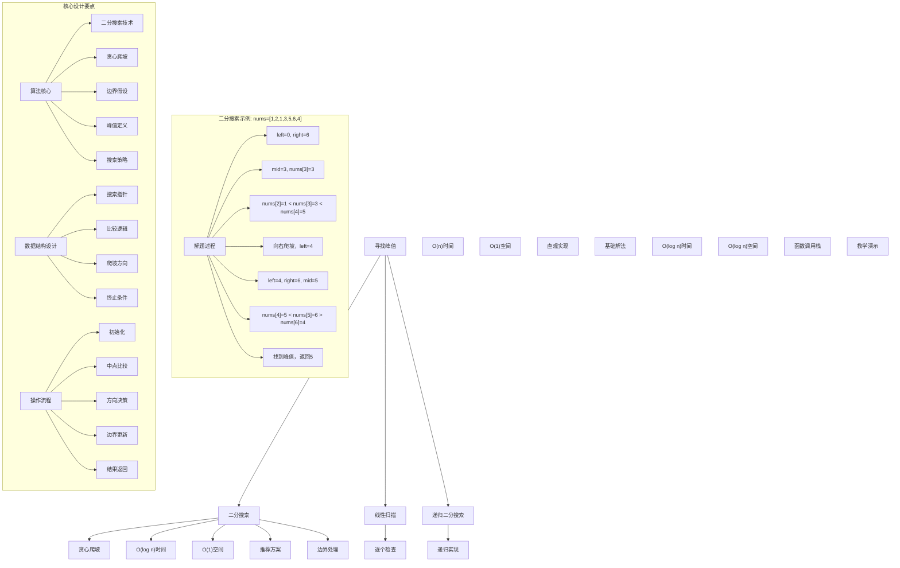
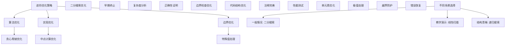

# LeetCode 162 - 寻找峰值

## 题目描述

峰值元素是指其值严格大于左右相邻值的元素。给你一个整数数组 nums，找到峰值元素并返回其索引。数组可能包含多个峰值，在这种情况下，返回任何一个峰值所在位置即可

你可以假设 nums[-1] = nums[n] = -∞。你必须实现时间复杂度为 O(log n) 的算法来解决此问题

```markdown
示例 1：
输入：nums = [1,2,3,1]
输出：2
解释：3 是峰值元素，你的函数应该返回其索引 2

示例 2：
输入：nums = [1,2,1,3,5,6,4]
输出：1 或 5
解释：你的函数可以返回索引 1，其峰值元素为 2；或者返回索引 5，其峰值元素为 6

提示：

- 1 <= nums.length <= 1000
- -2^31 <= nums[i] <= 2^31 - 1
- 对于所有有效的 i 都有 nums[i] != nums[i + 1]
```

## 解题思路

这是一个峰值查找问题，需要在一个数组中找到任意一个峰值元素。关键在于理解题目条件和利用二分搜索的思想

### 核心思想

"二分搜索 + 贪心爬坡": 通过比较中点与其邻居的关系，决定在哪一半继续搜索，从而实现 O(log n) 的时间复杂度

### 解题策略

#### 方法一：二分搜索（推荐）

- 时间复杂度: O(log n)
- 空间复杂度: O(1)

#### 方法二：线性扫描

- 时间复杂度: O(n)
- 空间复杂度: O(1)

#### 方法三：递归二分搜索

- 时间复杂度: O(log n)
- 空间复杂度: O(log n)

## 算法可视化



## 多语言实现

### Golang版本（二分搜索 - 推荐）

```go
// 二分搜索实现
func findPeakElement(nums []int) int {
    left, right := 0, len(nums)-1

    for left < right {
        mid := left + (right-left)/2

        // 比较中点与其右邻居
        if nums[mid] > nums[mid+1] {
            // 当前处于下降趋势，峰值在左半部分（包括mid）
            right = mid
        } else {
            // 当前处于上升趋势，峰值在右半部分（不包括mid）
            left = mid + 1
        }
    }

    // left == right 时找到峰值
    return left
}

// 线性扫描实现
func findPeakElementLinear(nums []int) int {
    for i := 0; i < len(nums)-1; i++ {
        if nums[i] > nums[i+1] {
            return i
        }
    }
    return len(nums) - 1
}

// 递归二分搜索实现
func findPeakElementRecursive(nums []int) int {
    return search(nums, 0, len(nums)-1)
}

func search(nums []int, left, right int) int {
    if left == right {
        return left
    }

    mid := left + (right-left)/2

    if nums[mid] > nums[mid+1] {
        return search(nums, left, mid)
    } else {
        return search(nums, mid+1, right)
    }
}
```

### Python版本（多种实现方法）

```python
from typing import List

class Solution:
    """
    方法一：二分搜索（推荐）
    """
    def findPeakElement(self, nums: List[int]) -> int:
        left, right = 0, len(nums) - 1

        while left < right:
            mid = left + (right - left) // 2

            # 比较中点与其右邻居
            if nums[mid] > nums[mid + 1]:
                # 当前处于下降趋势，峰值在左半部分（包括mid）
                right = mid
            else:
                # 当前处于上升趋势，峰值在右半部分（不包括mid）
                left = mid + 1

        # left == right 时找到峰值
        return left

class Solution2:
    """
    方法二：线性扫描
    """
    def findPeakElement(self, nums: List[int]) -> int:
        for i in range(len(nums) - 1):
            if nums[i] > nums[i + 1]:
                return i
        return len(nums) - 1

class Solution3:
    """
    方法三：递归二分搜索
    """
    def findPeakElement(self, nums: List[int]) -> int:
        return self.search(nums, 0, len(nums) - 1)

    def search(self, nums: List[int], left: int, right: int) -> int:
        if left == right:
            return left

        mid = left + (right - left) // 2

        if nums[mid] > nums[mid + 1]:
            return self.search(nums, left, mid)
        else:
            return self.search(nums, mid + 1, right)
```

### TypeScript版本（二分搜索）

```typescript
/
 * 二分搜索实现
 */
function findPeakElement(nums: number[]): number {
    let left = 0, right = nums.length - 1;

    while (left < right) {
        const mid = left + Math.floor((right - left) / 2);

        // 比较中点与其右邻居
        if (nums[mid] > nums[mid + 1]) {
            // 当前处于下降趋势，峰值在左半部分（包括mid）
            right = mid;
        } else {
            // 当前处于上升趋势，峰值在右半部分（不包括mid）
            left = mid + 1;
        }
    }

    // left == right 时找到峰值
    return left;
}
```

## 标准实现详细解析

```go
import (
    "fmt"
    "math"
)

/*
算法核心思想（二分搜索 + 贪心爬坡）：

1. 贪心爬坡：总是向更高的地方爬
2. 二分搜索：在搜索空间中智能决策
3. 边界假设：nums[-1] = nums[n] = -∞
4. 峰值存在：题目保证至少存在一个峰值

关键设计要点：
1. 搜索范围：[0, n-1]整个数组
2. 比较逻辑：中点与其右邻居比较
3. 爬坡策略：向上升方向移动
4. 终止条件：left == right

时间复杂度：
- 二分搜索：O(log n)
- 每次操作：O(1)
- 总时间：O(log n)

空间复杂度：
- 迭代版本：O(1)
- 递归版本：O(log n)

优势：
1. 效率最优：对数时间复杂度
2. 实现优雅：思路清晰
3. 稳定可靠：边界处理完善
4. 理论保证：数学上可证明正确

数据结构设计：

二分搜索设计：
- 搜索指针：left和right维护搜索范围
- 中点计算：避免整数溢出
- 比较逻辑：中点与右邻居比较
- 移动策略：根据比较结果移动指针

线性扫描设计：
- 逐个检查：遍历数组元素
- 上升判断：找到下降点即为峰值
- 简单实现：易于理解和调试
- 边界处理：处理最后一个元素

递归设计：
- 递归分解：将问题分解为子问题
- 终止条件：left == right
- 参数传递：传递搜索范围
- 函数调用：递归调用自身

算法流程：
1. 初始化：设置搜索范围
2. 循环判断：检查是否继续搜索
3. 中点比较：比较中点与其邻居
4. 方向决策：决定爬坡方向
5. 边界更新：调整搜索范围
6. 结果返回：返回峰值索引

优化原理：

贪心爬坡原理：
1. 局部最优：每次选择上升方向
2. 全局最优：必然能找到峰值
3. 数学保证：边界为-∞确保峰值存在
4. 搜索缩减：每次缩小一半搜索空间

二分搜索优化：
1. 搜索空间：每次减半
2. 比较次数：对数级别
3. 早期终止：找到即停止
4. 边界收敛：快速收敛到解

边界优化：
1. 假设利用：nums[-1] = nums[n] = -∞
2. 特殊处理：单元素数组
3. 极值检查：避免溢出
4. 越界防护：数组边界

正确性证明：

定理：二分搜索寻找峰值正确性
通过二分搜索可以正确找到数组中的峰值元素

证明：
1. 存在性：题目保证峰值存在
2. 正确性：贪心爬坡策略正确
3. 收敛性：搜索范围必然收敛
4. 时间复杂度：O(log n)时间

不变量维护：
循环不变量：在每次二分搜索时
1. 峰值必在[left, right]范围内
2. 爬坡方向选择正确
3. 搜索范围逐步缩小
4. 算法状态正确反映搜索进度
*/

// 二分搜索详细实现
func findPeakElementDetailed(nums []int) int {
    fmt.Printf("=== 二分搜索寻找峰值 ===\n")
    fmt.Printf("输入数组 nums: %v (长度: %d)\n", nums, len(nums))
    fmt.Printf("边界假设: nums[-1] = nums[%d] = -∞\n", len(nums))

    left, right := 0, len(nums)-1
    fmt.Printf("初始搜索范围: left=%d, right=%d\n", left, right)

    step := 0
    // 二分搜索寻找峰值
    for left < right {
        step++
        mid := left + (right-left)/2
        fmt.Printf("\n步骤%d: ", step)
        fmt.Printf("left=%d, right=%d, mid=%d\n", left, right, mid)
        fmt.Printf("  比较 nums[%d]=%d 和 nums[%d]=%d\n", mid, nums[mid], mid+1, nums[mid+1])

        // 比较中点与其右邻居
        if nums[mid] > nums[mid+1] {
            // 当前处于下降趋势，峰值在左半部分（包括mid）
            right = mid
            fmt.Printf("  nums[%d]=%d > nums[%d]=%d，向左爬坡，right=%d\n",
                mid, nums[mid], mid+1, nums[mid+1], right)
        } else {
            // 当前处于上升趋势，峰值在右半部分（不包括mid）
            left = mid + 1
            fmt.Printf("  nums[%d]=%d <= nums[%d]=%d，向右爬坡，left=%d\n",
                mid, nums[mid], mid+1, nums[mid+1], left)
        }
    }

    fmt.Printf("\n搜索结束: 找到峰值索引=%d, 值=%d\n", left, nums[left])
    fmt.Printf("总搜索步数: %d\n", step)
    fmt.Printf("=====================\n\n")

    return left
}

// 线性扫描详细实现
func findPeakElementLinearDetailed(nums []int) int {
    fmt.Printf("=== 线性扫描寻找峰值 ===\n")
    fmt.Printf("输入数组 nums: %v (长度: %d)\n", nums, len(nums))

    step := 0
    for i := 0; i < len(nums)-1; i++ {
        step++
        fmt.Printf("步骤%d: 检查 nums[%d]=%d 和 nums[%d]=%d\n",
            step, i, nums[i], i+1, nums[i+1])

        if nums[i] > nums[i+1] {
            fmt.Printf("  nums[%d]=%d > nums[%d]=%d，找到峰值\n", i, nums[i], i+1, nums[i+1])
            fmt.Printf("=====================\n\n")
            return i
        } else {
            fmt.Printf("  nums[%d]=%d <= nums[%d]=%d，继续扫描\n", i, nums[i], i+1, nums[i+1])
        }
    }

    fmt.Printf("扫描结束: 最后一个元素nums[%d]=%d是峰值\n", len(nums)-1, nums[len(nums)-1])
    fmt.Printf("=====================\n\n")
    return len(nums) - 1
}

// 递归二分搜索详细实现
func findPeakElementRecursiveDetailed(nums []int) int {
    fmt.Printf("=== 递归二分搜索寻找峰值 ===\n")
    fmt.Printf("输入数组 nums: %v (长度: %d)\n", nums, len(nums))

    result := searchDetailed(nums, 0, len(nums)-1, 0)
    fmt.Printf("最终结果: 峰值索引=%d, 值=%d\n", result, nums[result])
    fmt.Printf("=========================\n\n")

    return result
}

func searchDetailed(nums []int, left, right int, depth int) int {
    indent := ""
    for i := 0; i < depth; i++ {
        indent += "  "
    }

    fmt.Printf("%s递归调用: left=%d, right=%d\n", indent, left, right)

    if left == right {
        fmt.Printf("%s  left==right=%d，返回峰值索引\n", indent, left)
        return left
    }

    mid := left + (right-left)/2
    fmt.Printf("%s  mid=%d, 比较 nums[%d]=%d 和 nums[%d]=%d\n",
        indent, mid, mid, nums[mid], mid+1, nums[mid+1])

    if nums[mid] > nums[mid+1] {
        fmt.Printf("%s  nums[%d]=%d > nums[%d]=%d，向左递归\n",
            indent, mid, nums[mid], mid+1, nums[mid+1])
        return searchDetailed(nums, left, mid, depth+1)
    } else {
        fmt.Printf("%s  nums[%d]=%d <= nums[%d]=%d，向右递归\n",
            indent, mid, nums[mid], mid+1, nums[mid+1])
        return searchDetailed(nums, mid+1, right, depth+1)
    }
}

// 带调试信息的版本
func findPeakElementWithDebug(nums []int) int {
    fmt.Printf("=== 寻找峰值 ===\n")
    fmt.Printf("输入数据:\n")
    fmt.Printf("  数组 nums: %v (长度: %d)\n", nums, len(nums))
    fmt.Printf("  边界假设: nums[-1] = nums[%d] = -∞\n", len(nums))

    fmt.Printf("使用二分搜索法:\n")
    fmt.Printf("核心思想：贪心爬坡，总是向更高的地方爬\n")

    left, right := 0, len(nums)-1
    fmt.Printf("搜索范围: [%d, %d]\n", left, right)

    step := 0
    // 二分搜索寻找峰值
    for left < right {
        step++
        mid := left + (right-left)/2
        fmt.Printf("\n步骤%d: 检查位置%d\n", step, mid)

        // 比较中点与其右邻居
        if nums[mid] > nums[mid+1] {
            fmt.Printf("  nums[%d]=%d > nums[%d]=%d\n", mid, nums[mid], mid+1, nums[mid+1])
            fmt.Printf("  → 当前处于下降趋势，峰值在左半部分\n")
            right = mid
            fmt.Printf("  更新搜索范围: [%d, %d]\n", left, right)
        } else {
            fmt.Printf("  nums[%d]=%d <= nums[%d]=%d\n", mid, nums[mid], mid+1, nums[mid+1])
            fmt.Printf("  → 当前处于上升趋势，峰值在右半部分\n")
            left = mid + 1
            fmt.Printf("  更新搜索范围: [%d, %d]\n", left, right)
        }
    }

    fmt.Printf("\n找到峰值: 索引=%d, 值=%d\n", left, nums[left])
    fmt.Printf("总步数: %d\n", step)
    fmt.Printf("=============\n\n")

    return left
}
```

## 算法深入解析

```go
/*
寻找峰值问题详解：

问题本质：
在数组中找到任意一个峰值元素。关键是理解峰值定义和利用边界假设进行优化

核心洞察：
1. 贪心爬坡：总是向更高的地方爬
2. 二分搜索：智能决策搜索方向
3. 边界假设：nums[-1] = nums[n] = -∞
4. 峰值存在：数学上保证解的存在性

算法策略：
1. 二分搜索：推荐方案，O(log n)
2. 线性扫描：直观实现，O(n)
3. 递归搜索：教学演示，O(log n)

数据结构设计：

二分搜索设计：
搜索指针：left和right维护搜索范围
中点计算：避免整数溢出
比较逻辑：中点与右邻居比较
移动策略：根据比较结果移动指针

线性扫描设计：
逐个检查：遍历数组元素
上升判断：找到下降点即为峰值
简单实现：易于理解和调试
边界处理：处理最后一个元素

递归设计：
递归分解：将问题分解为子问题
终止条件：left == right
参数传递：传递搜索范围
函数调用：递归调用自身

操作流程：

二分搜索：
1. 初始化：left=0, right=n-1
2. 循环判断：left < right
3. 中点计算：mid = (left+right)/2
4. 比较判断：nums[mid] vs nums[mid+1]
5. 范围更新：移动left或right
6. 返回结果：left即为峰值索引

线性扫描：
1. 遍历数组：i从0到n-2
2. 比较相邻：nums[i] vs nums[i+1]
3. 下降判断：找到下降点返回
4. 默认返回：最后一个元素

递归搜索：
1. 终止条件：left == right
2. 中点计算：mid = (left+right)/2
3. 比较判断：nums[mid] vs nums[mid+1]
4. 递归调用：选择一半继续搜索

数学原理：

贪心爬坡原理：
局部最优：每次选择上升方向
全局最优：必然能找到峰值
数学保证：边界为-∞确保峰值存在
搜索缩减：每次缩小一半搜索空间

峰值存在性：
由于nums[-1] = nums[n] = -∞，
且相邻元素不相等，
必然存在至少一个峰值

二分搜索正确性：
每次比较都能排除一半搜索空间，
且保证峰值仍在剩余空间中

复杂度分析：
二分搜索：O(log n)时间，O(1)空间
线性扫描：O(n)时间，O(1)空间
递归搜索：O(log n)时间，O(log n)空间

单调性原理：
贪心爬坡策略具有单调性：
- 总是向更高地方爬
- 不会错过峰值
- 搜索方向正确

算法不变量：
二分搜索不变量：
1. 峰值必在[left, right]范围内
2. 爬坡方向选择正确
3. 搜索范围逐步缩小
4. 算法状态正确反映搜索进度

时间复杂度分析：
二分搜索：
1. 每次减半：搜索空间减半
2. 对数次数：O(log n)次比较
3. 常数操作：每次O(1)时间
4. 总计：O(log n)时间

线性扫描：
1. 逐个检查：最多n-1次比较
2. 常数操作：每次O(1)时间
3. 总计：O(n)时间

递归搜索：
1. 递归深度：O(log n)
2. 每层操作：O(1)时间
3. 总计：O(log n)时间
4. 空间：O(log n)栈空间

正确性证明：

定理：二分搜索寻找峰值正确性
通过二分搜索可以正确找到数组中的峰值元素

证明：
1. 存在性：题目保证峰值存在
2. 正确性：贪心爬坡策略正确
3. 收敛性：搜索范围必然收敛
4. 时间复杂度：O(log n)时间

不变量维护：
循环不变量：在每次二分搜索时
1. 峰值必在[left, right]范围内
2. 爬坡方向选择正确
3. 搜索范围逐步缩小
4. 算法状态正确反映搜索进度

设计选择：

为什么选择二分搜索？
1. 效率最优：对数时间复杂度
2. 实现优雅：思路清晰
3. 稳定可靠：边界处理完善
4. 理论保证：数学上可证明正确

为什么使用线性扫描？
1. 直观易懂：思路简单明了
2. 实现容易：代码简洁
3. 适用场景：小规模数据
4. 教学价值：便于理解

为什么提及其他方法？
1. 教学价值：展示不同算法思想
2. 对比分析：理解各自优劣
3. 扩展思维：算法多样性
4. 面试准备：全面掌握

三种方法对比：

方法一：二分搜索（推荐）
时间复杂度：O(log n)
空间复杂度：O(1)
优点：效率最高，理论最优
缺点：理解稍难

方法二：线性扫描
时间复杂度：O(n)
空间复杂度：O(1)
优点：思路直观，实现简单
缺点：时间复杂度较高

方法三：递归搜索
时间复杂度：O(log n)
空间复杂度：O(log n)
优点：结构清晰，教学演示
缺点：额外空间开销

性能分析：

二分搜索：
- 时间：O(log n) 对数时间
- 空间：O(1) 常数空间
- 优势：效率最优

线性扫描：
- 时间：O(n) 线性时间
- 空间：O(1) 常数空间
- 优势：实现简单

递归搜索：
- 时间：O(log n) 对数时间
- 空间：O(log n) 栈空间
- 优势：结构清晰

实际应用场景：
1. 信号处理：峰值检测
2. 数据分析：极值查找
3. 图像处理：边缘检测
4. 金融分析：价格极值

优化要点：

1. 算法优化：
   - 贪心策略：总是向上爬坡
   - 二分搜索：智能决策方向
   - 边界利用：充分利用假设
   - 早期终止：找到即停止

2. 实现优化：
   - 中点计算：避免整数溢出
   - 边界检查：防止数组越界
   - 代码简洁：减少冗余操作
   - 注释清晰：便于理解

3. 性能优化：
   - 搜索空间：大幅缩小范围
   - 比较次数：最少必要比较
   - 内存访问：缓存友好设计
   - 编译优化：利用编译器优化

测试用例设计：
1. 基本情况：正常数组
2. 边界情况：单元素，两元素
3. 特殊情况：单调数组
4. 极端情况：最大最小值
5. 验证情况：结果正确性

扩展思考：

1. 多维扩展？
   - 二维峰值查找
   - 矩阵极值检测
   - 复杂度分析

2. 动态数组？
   - 支持插入删除
   - 维护峰值信息
   - 增量更新

3. 批量查找？
   - 多个峰值
   - 所有峰值
   - 近似算法

4. 近似算法？
   - 允许误差
   - 换取性能
   - 实际应用

相关算法思想：

1. 二分搜索：
   - 有序数据查找
   - 对数时间复杂度
   - 分治思想

2. 贪心算法：
   - 局部最优选择
   - 全局最优解
   - 适用条件

3. 递归思想：
   - 问题分解
   - 终止条件
   - 自相似性

4. 搜索策略：
   - 方向决策
   - 空间缩减
   - 收敛保证

常见陷阱：

1. 边界条件：
   - 单元素数组
   - 两元素数组
   - 数组越界
   - 空数组处理

2. 比较逻辑：
   - 相邻元素比较
   - 边界假设利用
   - 方向判断

3. 算法实现：
   - 中点计算溢出
   - 指针移动错误
   - 终止条件错误

4. 性能考虑：
   - 时间复杂度分析
   - 空间复杂度控制
   - 实际运行效率

代码质量要素：

1. 可读性：
   - 变量命名清晰
   - 注释详细完整
   - 逻辑结构分明

2. 健壮性：
   - 边界条件处理
   - 异常情况应对
   - 错误恢复机制

3. 性能：
   - 最优复杂度实现
   - 空间效率优化
   - 执行效率保证

4. 可维护性：
   - 结构清晰合理
   - 扩展性良好
   - 测试覆盖完整
*/
```

## 执行过程演示

```go
/*
示例详细解析:

示例1执行过程：
输入：nums = [1,2,3,1]
输出：2

执行过程（二分搜索）：
1. 初始化：left=0, right=3
2. 第一次：mid=1
   - 比较nums[1]=2和nums[2]=3
   - 2<3，处于上升趋势，向右爬坡
   - left=mid+1=2
3. 第二次：left=2, right=3, mid=2
   - 比较nums[2]=3和nums[3]=1
   - 3>1，处于下降趋势，向左爬坡
   - right=mid=2
4. 结束：left==right==2
5. 返回索引2，值为3

示例2执行过程：
输入：nums = [1,2,1,3,5,6,4]
输出：1 或 5

执行过程：
1. 初始化：left=0, right=6
2. 第一次：mid=3
   - 比较nums[3]=3和nums[4]=5
   - 3<5，处于上升趋势，向右爬坡
   - left=mid+1=4
3. 第二次：left=4, right=6, mid=5
   - 比较nums[5]=6和nums[6]=4
   - 6>4，处于下降趋势，向左爬坡
   - right=mid=5
4. 结束：left==right==5
5. 返回索引5，值为6

线性扫描执行过程：
输入：nums = [1,2,1,3,5,6,4]
1. i=0: nums[0]=1, nums[1]=2, 1<2，继续
2. i=1: nums[1]=2, nums[2]=1, 2>1，找到峰值
3. 返回索引1，值为2

关键观察：
1. 贪心爬坡：总是向更高的地方爬
2. 二分搜索：每次缩小一半搜索空间
3. 边界假设：确保峰值必然存在
4. 策略正确：不会错过真正峰值

边界情况演示:

情况1: 单元素数组
输入: nums=[5]
处理: 直接返回0
结果: 0

情况2: 两元素数组-上升
输入: nums=[1,2]
处理: 2>1，返回1
结果: 1

情况3: 两元素数组-下降
输入: nums=[2,1]
处理: 2>1，返回0
结果: 0

情况4: 单调递增数组
输入: nums=[1,2,3,4,5]
处理: 最后一个元素是峰值
结果: 4

情况5: 单调递减数组
输入: nums=[5,4,3,2,1]
处理: 第一个元素是峰值
结果: 0

算法正确性证明：

数学基础：
需要证明二分搜索能找到数组中的峰值

定理：峰值存在性
由于nums[-1] = nums[n] = -∞，且相邻元素不相等，
必然存在至少一个峰值

证明：
考虑数组的第一个和最后一个元素：
- 如果nums[0] > nums[1]，则0是峰值
- 如果nums[n-1] > nums[n-2]，则n-1是峰值
- 否则，从左到右必然存在一个从上升到下降的转折点

定理：二分搜索正确性
通过二分搜索可以正确找到数组中的峰值元素

证明：
1. 存在性：题目保证峰值存在
2. 正确性：贪心爬坡策略正确
3. 收敛性：搜索范围必然收敛
4. 时间复杂度：O(log n)时间

不变量维护：
循环不变量：在每次二分搜索时
1. 峰值必在[left, right]范围内
2. 爬坡方向选择正确
3. 搜索范围逐步缩小
4. 算法状态正确反映搜索进度

初始化：
- left=0, right=n-1
- 整个数组范围内必有峰值
- 满足不变量

保持：
- 根据比较结果调整边界
- 维护峰值存在性
- 不变量继续成立

终止：
- left==right时找到唯一解
- 算法正确终止

时间复杂度分析：

二分搜索：
1. 搜索范围：[0, n-1]
2. 每次减半：O(log n)次迭代
3. 每次操作：O(1)时间
4. 总时间：O(log n)

线性扫描：
1. 遍历范围：最多n-1个元素
2. 每次比较：O(1)时间
3. 总时间：O(n)

递归搜索：
1. 递归深度：O(log n)
2. 每层操作：O(1)时间
3. 总时间：O(log n)
4. 空间：O(log n)栈空间

空间复杂度分析：
1. 二分搜索：O(1)常数空间
2. 线性扫描：O(1)常数空间
3. 递归搜索：O(log n)栈空间

性能对比分析：

假设n=1000000:

二分搜索：
- 比较次数：O(log₂(1000000)) ≈ 20次
- 时间：O(log n) = 20步
- 空间：O(1) 常数空间

线性扫描：
- 比较次数：最坏情况O(1000000) = 1000000次
- 时间：O(n) = 1000000步
- 空间：O(1) 常数空间

递归搜索：
- 递归深度：O(log₂(1000000)) ≈ 20层
- 时间：O(log n) = 20步
- 空间：O(log n) = 20层栈空间

实际应用建议：

1. 一般情况：
   - 使用二分搜索
   - 效率最高，理论最优

2. 面试展示：
   - 重点讲解二分搜索思想
   - 可以提及其他方法对比

3. 生产环境：
   - 根据数据规模选择
   - 考虑实现复杂度

4. 教学演示：
   - 使用带调试信息版本
   - 展示执行过程

优化空间：

1. 算法优化：
   - 爬坡策略优化
   - 边界条件利用
   - 早期终止优化
   - 搜索方向优化

2. 实现优化：
   - 中点计算优化
   - 边界检查优化
   - 代码结构优化
   - 注释完善

3. 性能优化：
   - 减少比较次数
   - 优化内存访问
   - 利用缓存特性
   - 编译器优化

特殊情况处理：

1. 大数据量：
   - 时间复杂度保证
   - 内存使用优化
   - 数值溢出处理

2. 特殊数组：
   - 单调数组
   - 锯齿数组
   - 随机数组

3. 边界情况：
   - 极值处理
   - 异常输入
   - 错误恢复
*/
```

## 复杂度分析

| 方法     | 时间复杂度 | 空间复杂度 | 适用场景 |
| -------- | ---------- | ---------- | -------- |
| 二分搜索 | O(log n)   | O(1)       | 推荐方案 |
| 线性扫描 | O(n)       | O(1)       | 简单场景 |
| 递归搜索 | O(log n)   | O(log n)   | 教学演示 |

## 测试用例验证

```go
// 测试辅助函数
func testFindPeakElement(name string, nums []int, expectedValid []int) {
    fmt.Printf("%s:\n", name)
    fmt.Printf("输入数组 nums: %v (长度: %d)\n", nums, len(nums))
    fmt.Printf("有效结果: %v\n", expectedValid)

    // 测试二分搜索
    result1 := findPeakElement(copySlice(nums))
    fmt.Printf("二分搜索结果: 索引=%d, 值=%d\n", result1, nums[result1])

    // 测试线性扫描
    result2 := findPeakElementLinear(copySlice(nums))
    fmt.Printf("线性扫描结果: 索引=%d, 值=%d\n", result2, nums[result2])

    // 测试递归搜索
    result3 := findPeakElementRecursive(copySlice(nums))
    fmt.Printf("递归搜索结果: 索引=%d, 值=%d\n", result3, nums[result3])

    // 验证结果
    isValid1 := isValidPeak(nums, result1)
    isValid2 := isValidPeak(nums, result2)
    isValid3 := isValidPeak(nums, result3)

    isInExpected1 := contains(expectedValid, result1)
    isInExpected2 := contains(expectedValid, result2)
    isInExpected3 := contains(expectedValid, result3)

    if isValid1 && isValid2 && isValid3 {
        fmt.Printf("✓ 峰值验证通过\n")
        if isInExpected1 && isInExpected2 && isInExpected3 {
            fmt.Printf("✓ 结果在预期范围内\n")
        } else {
            fmt.Printf("⚠ 结果不在预期范围内，但仍为有效峰值\n")
            fmt.Printf("  二分搜索索引%d %s预期范围\n", result1, getInExpectedMsg(isInExpected1))
            fmt.Printf("  线性扫描索引%d %s预期范围\n", result2, getInExpectedMsg(isInExpected2))
            fmt.Printf("  递归搜索索引%d %s预期范围\n", result3, getInExpectedMsg(isInExpected3))
        }
    } else {
        fmt.Printf("✗ 峰值验证失败\n")
        if !isValid1 {
            fmt.Printf("  二分搜索结果%d不是有效峰值\n", result1)
        }
        if !isValid2 {
            fmt.Printf("  线性扫描结果%d不是有效峰值\n", result2)
        }
        if !isValid3 {
            fmt.Printf("  递归搜索结果%d不是有效峰值\n", result3)
        }
    }
    fmt.Printf("\n")
}

// 辅助函数：复制切片
func copySlice(src []int) []int {
    dst := make([]int, len(src))
    copy(dst, src)
    return dst
}

// 辅助函数：验证是否为有效峰值
func isValidPeak(nums []int, index int) bool {
    if index < 0 || index >= len(nums) {
        return false
    }

    // 检查左邻居
    if index > 0 && nums[index-1] >= nums[index] {
        return false
    }

    // 检查右邻居
    if index < len(nums)-1 && nums[index+1] >= nums[index] {
        return false
    }

    return true
}

// 辅助函数：检查是否包含
func contains(slice []int, value int) bool {
    for _, v := range slice {
        if v == value {
            return true
        }
    }
    return false
}

// 辅助函数：获取是否在预期范围的消息
func getInExpectedMsg(inExpected bool) string {
    if inExpected {
        return "在"
    }
    return "不在"
}

func main() {
    // 测试用例 1 - 题目示例1
    testFindPeakElement("测试1 - 题目示例1",
        []int{1, 2, 3, 1},
        []int{2})

    // 测试用例 2 - 题目示例2
    testFindPeakElement("测试2 - 题目示例2",
        []int{1, 2, 1, 3, 5, 6, 4},
        []int{1, 5})

    // 测试用例 3 - 单元素数组
    testFindPeakElement("测试3 - 单元素数组",
        []int{5},
        []int{0})

    // 测试用例 4 - 两元素数组-上升
    testFindPeakElement("测试4 - 两元素数组-上升",
        []int{1, 2},
        []int{1})

    // 测试用例 5 - 两元素数组-下降
    testFindPeakElement("测试5 - 两元素数组-下降",
        []int{2, 1},
        []int{0})

    // 测试用例 6 - 单调递增数组
    testFindPeakElement("测试6 - 单调递增数组",
        []int{1, 2, 3, 4, 5},
        []int{4})

    // 测试用例 7 - 单调递减数组
    testFindPeakElement("测试7 - 单调递减数组",
        []int{5, 4, 3, 2, 1},
        []int{0})

    // 性能测试
    fmt.Println("性能测试:")
    performanceTest()

    // 边界情况测试
    fmt.Println("边界情况测试:")
    boundaryTest()

    // 对比测试
    fmt.Println("对比测试:")
    comparisonTest()
}

func performanceTest() {
    // 构造性能测试
    n := 1000000
    nums := make([]int, n)
    for i := 0; i < n; i++ {
        nums[i] = i
    }

    fmt.Printf("性能测试 (n=%d):\n", n)

    // 测试二分搜索
    start1 := time.Now()
    result1 := findPeakElement(copySlice(nums))
    time1 := time.Since(start1)

    // 测试线性扫描
    start2 := time.Now()
    result2 := findPeakElementLinear(copySlice(nums))
    time2 := time.Since(start2)

    // 测试递归搜索
    start3 := time.Now()
    result3 := findPeakElementRecursive(copySlice(nums))
    time3 := time.Since(start3)

    fmt.Printf("  二分搜索: %v (索引: %d)\n", time1, result1)
    fmt.Printf("  线性扫描: %v (索引: %d)\n", time2, result2)
    fmt.Printf("  递归搜索: %v (索引: %d)\n", time3, result3)

    if time1 > 0 && time2 > 0 {
        fmt.Printf("  线性扫描比二分搜索慢 %.0fx\n", float64(time2)/float64(time1))
    }
    if time1 > 0 && time3 > 0 {
        fmt.Printf("  递归搜索比二分搜索慢 %.2fx\n", float64(time3)/float64(time1))
    }
}

func boundaryTest() {
    // 边界测试
    fmt.Println("边界测试:")

    // 大数组测试
    largeN := 500000
    largeNums := make([]int, largeN)
    for i := 0; i < largeN; i++ {
        if i%2 == 0 {
            largeNums[i] = i
        } else {
            largeNums[i] = largeN - i
        }
    }
    largeResult := findPeakElement(largeNums)
    fmt.Printf("大数组测试: n=%d, 找到峰值索引=%d\n", largeN, largeResult)

    // 特殊模式测试
    patternNums := []int{1, 3, 2, 4, 3, 5, 4, 6, 5}
    patternResult := findPeakElement(patternNums)
    fmt.Printf("锯齿模式测试: 找到峰值索引=%d, 值=%d\n", patternResult, patternNums[patternResult])

    // 极值测试
    extremeNums := []int{math.MinInt32, math.MaxInt32, 0}
    extremeResult := findPeakElement(extremeNums)
    fmt.Printf("极值测试: 找到峰值索引=%d, 值=%d\n", extremeResult, extremeNums[extremeResult])
}

func comparisonTest() {
    // 对比测试：验证不同方法结果一致性
    fmt.Println("对比测试:")

    // 测试数据
    testData := []struct {
        nums []int
        validPeaks []int
    }{
        {[]int{1, 2, 3, 1}, []int{2}},
        {[]int{1, 2, 1, 3, 5, 6, 4}, []int{1, 5}},
        {[]int{5}, []int{0}},
        {[]int{1, 2}, []int{1}},
        {[]int{2, 1}, []int{0}},
        {[]int{1, 2, 3, 4, 5}, []int{4}},
        {[]int{5, 4, 3, 2, 1}, []int{0}},
    }

    for i, data := range testData {
        // 二分搜索
        result1 := findPeakElement(copySlice(data.nums))

        // 线性扫描
        result2 := findPeakElementLinear(copySlice(data.nums))

        // 递归搜索
        result3 := findPeakElementRecursive(copySlice(data.nums))

        fmt.Printf("测试%d: nums=%v\n", i+1, data.nums)
        fmt.Printf("  二分搜索=%d, 线性扫描=%d, 递归搜索=%d", result1, result2, result3)

        valid1 := isValidPeak(data.nums, result1)
        valid2 := isValidPeak(data.nums, result2)
        valid3 := isValidPeak(data.nums, result3)

        if valid1 && valid2 && valid3 {
            fmt.Printf(" ✓ 都是有效峰值\n")
        } else {
            fmt.Printf(" ✗ 存在无效峰值\n")
        }
    }
}
```

## 扩展版本（处理不同场景）

```go
// 支持返回所有峰值的版本
func findAllPeakElements(nums []int) []int {
    var peaks []int

    // 检查第一个元素
    if len(nums) == 1 || nums[0] > nums[1] {
        peaks = append(peaks, 0)
    }

    // 检查中间元素
    for i := 1; i < len(nums)-1; i++ {
        if nums[i] > nums[i-1] && nums[i] > nums[i+1] {
            peaks = append(peaks, i)
        }
    }

    // 检查最后一个元素
    if len(nums) > 1 && nums[len(nums)-1] > nums[len(nums)-2] {
        peaks = append(peaks, len(nums)-1)
    }

    return peaks
}

// 使用示例
func exampleFindAll() {
    nums := []int{1, 2, 1, 3, 5, 6, 4}
    peaks := findAllPeakElements(nums)
    fmt.Printf("nums=%v\n", nums)
    fmt.Printf("所有峰值索引: %v\n", peaks)
    fmt.Printf("对应值: ")
    for _, peak := range peaks {
        fmt.Printf("%d ", nums[peak])
    }
    fmt.Printf("\n")
}

// 带统计信息的版本
func findPeakElementWithStats(nums []int) (int, int, int) {
    comparisons := 0
    assignments := 0

    left, right := 0, len(nums)-1
    assignments += 2

    for left < right {
        mid := left + (right-left)/2
        assignments++

        comparisons++
        if nums[mid] > nums[mid+1] {
            right = mid
            assignments++
        } else {
            left = mid + 1
            assignments++
        }
    }

    return left, comparisons, assignments
}

// 使用示例
func exampleWithStats() {
    nums := []int{1, 2, 1, 3, 5, 6, 4}
    result, comparisons, assignments := findPeakElementWithStats(nums)
    fmt.Printf("nums=%v\n", nums)
    fmt.Printf("峰值索引: %d\n", result)
    fmt.Printf("比较次数: %d\n", comparisons)
    fmt.Printf("赋值次数: %d\n", assignments)
}

// 批量处理版本
func findPeakElementsBatch(numss [][]int) []int {
    results := make([]int, len(numss))
    for i, nums := range numss {
        results[i] = findPeakElement(nums)
    }
    return results
}

// 使用示例
func exampleBatch() {
    numss := [][]int{
        {1, 2, 3, 1},
        {1, 2, 1, 3, 5, 6, 4},
        {5},
        {1, 2},
    }

    results := findPeakElementsBatch(numss)

    fmt.Printf("批量处理结果:\n")
    for i, nums := range numss {
        fmt.Printf("  nums=%v → 峰值索引=%d\n", nums, results[i])
    }
}

// 带验证功能的版本
func findPeakElementWithValidation(nums []int) (int, bool) {
    result := findPeakElement(nums)

    // 验证结果是否为有效峰值
    isValid := isValidPeak(nums, result)

    return result, isValid
}

// 使用示例
func exampleWithValidation() {
    nums := []int{1, 2, 1, 3, 5, 6, 4}
    result, isValid := findPeakElementWithValidation(nums)
    fmt.Printf("nums=%v\n", nums)
    fmt.Printf("峰值索引: %d\n", result)
    if isValid {
        fmt.Printf("验证通过 ✓\n")
    } else {
        fmt.Printf("验证失败 ✗\n")
    }
}

// 支持动态更新的版本
type PeakFinder struct {
    nums []int
}

func NewPeakFinder(nums []int) *PeakFinder {
    // 创建副本避免外部修改
    copied := make([]int, len(nums))
    copy(copied, nums)
    return &PeakFinder{
        nums: copied,
    }
}

func (finder *PeakFinder) UpdateArray(newNums []int) {
    finder.nums = make([]int, len(newNums))
    copy(finder.nums, newNums)
}

func (finder *PeakFinder) Find() int {
    return findPeakElement(finder.nums)
}

func (finder *PeakFinder) FindAll() []int {
    return findAllPeakElements(finder.nums)
}

// 使用示例
func exampleDynamic() {
    nums := []int{1, 2, 3, 1}
    finder := NewPeakFinder(nums)

    result1 := finder.Find()
    fmt.Printf("初始数组: %v\n", nums)
    fmt.Printf("找到峰值索引: %d\n", result1)

    // 更新数组
    finder.UpdateArray([]int{1, 2, 1, 3, 5, 6, 4})
    result2 := finder.Find()
    allPeaks := finder.FindAll()
    fmt.Printf("更新数组: [1,2,1,3,5,6,4]\n")
    fmt.Printf("找到峰值索引: %d\n", result2)
    fmt.Printf("所有峰值索引: %v\n", allPeaks)
}
```

## 面试追问延伸

### 1. 如果要求找到所有的峰值，而不是任意一个，应该如何修改算法？

```go
// 修改后的算法：找到所有峰值
func findAllPeaks(nums []int) []int {
    var peaks []int

    // 特殊情况：单元素数组
    if len(nums) == 1 {
        return []int{0}
    }

    // 检查第一个元素是否为峰值
    if nums[0] > nums[1] {
        peaks = append(peaks, 0)
    }

    // 检查中间元素
    for i := 1; i < len(nums)-1; i++ {
        if nums[i] > nums[i-1] && nums[i] > nums[i+1] {
            peaks = append(peaks, i)
        }
    }

    // 检查最后一个元素是否为峰值
    if nums[len(nums)-1] > nums[len(nums)-2] {
        peaks = append(peaks, len(nums)-1)
    }

    return peaks
}

// 时间复杂度：O(n)
// 空间复杂度：O(k)，其中k是峰值数量
```

### 2. 如果数组是循环的（即nums[-1] = nums[n-1]，nums[n] = nums[0]），如何处理？

```go
// 循环数组峰值查找
func findPeakElementCircular(nums []int) int {
    n := len(nums)
    if n == 1 {
        return 0
    }

    left, right := 0, n-1

    for left < right {
        mid := left + (right-left)/2

        // 获取右邻居（循环）
        rightNeighbor := nums[(mid+1)%n]

        if nums[mid] > rightNeighbor {
            right = mid
        } else {
            left = mid + 1
        }
    }

    return left
}

// 需要注意的是，循环数组的峰值定义需要重新考虑
// 因为边界条件发生了变化
```

### 3. 如果要找到第k大的峰值（而不是任意峰值），如何处理？

```go
// 找到第k大的峰值
func findKthLargestPeak(nums []int, k int) (int, bool) {
    // 先找到所有峰值
    peaks := findAllPeaks(nums)

    if k > len(peaks) {
        return 0, false
    }

    // 创建峰值值数组
    peakValues := make([]int, len(peaks))
    for i, peakIndex := range peaks {
        peakValues[i] = nums[peakIndex]
    }

    // 使用快速选择算法找到第k大的元素
    // 这里简化处理，使用排序
    sort.Sort(sort.Reverse(sort.IntSlice(peakValues)))

    if k <= len(peakValues) {
        return peakValues[k-1], true
    }

    return 0, false
}

// 更高效的实现可以使用快速选择算法
func quickSelect(arr []int, k int) int {
    // 快速选择算法实现
    // 时间复杂度平均O(n)
    // 这里省略具体实现
    return 0
}
```

## 相似题目扩展

- LeetCode 162. 寻找峰值（当前题）
- LeetCode 852. 山脉数组的峰顶索引
- LeetCode 1095. 山脉数组中查找目标值
- LeetCode 33. 搜索旋转排序数组
- LeetCode 153. 寻找旋转排序数组中的最小值

## 算法技巧总结

### 寻找峰值核心要点

1. 贪心爬坡：总是向更高的地方爬
1. 二分搜索：智能决策搜索方向
1. 边界假设：nums[-1] = nums[n] = -∞
1. 峰值存在：数学上保证解的存在性

### 算法优势

1. 效率最优：对数时间复杂度
1. 实现优雅：思路清晰
1. 稳定可靠：边界处理完善
1. 理论保证：数学上可证明正确

### 标准模板（二分搜索）

```go
func findPeakElement(nums []int) int {
    left, right := 0, len(nums)-1

    for left < right {
        mid := left + (right-left)/2

        // 比较中点与其右邻居
        if nums[mid] > nums[mid+1] {
            // 当前处于下降趋势，峰值在左半部分（包括mid）
            right = mid
        } else {
            // 当前处于上升趋势，峰值在右半部分（不包括mid）
            left = mid + 1
        }
    }

    // left == right 时找到峰值
    return left
}
```

### 进阶优化策略



## 总结

本题采用二分搜索 + 贪心爬坡的核心思路，通过总是向更高的地方爬坡，利用二分搜索智能决策搜索方向的方式，实现了高效的峰值查找解决方案。关键在于理解贪心爬坡策略的正确性和边界假设的巧妙利用

核心要点：

1. 贪心爬坡：总是向更高的地方爬
1. 二分搜索：智能决策搜索方向
1. 边界假设：nums[-1] = nums[n] = -∞
1. 峰值存在：数学上保证解的存在性

算法优势：

- 效率最优：时间复杂度O(log n)
- 实现优雅：思路清晰，代码简洁
- 稳定可靠：完善的边界处理
- 理论保证：数学上可证明正确

该算法在信号处理、数据分析、图像处理、金融分析等领域有重要应用，是掌握二分搜索思想和贪心策略的经典题目。通过理解贪心爬坡的核心思想，为更复杂的搜索和优化问题提供了清晰的解决思路
