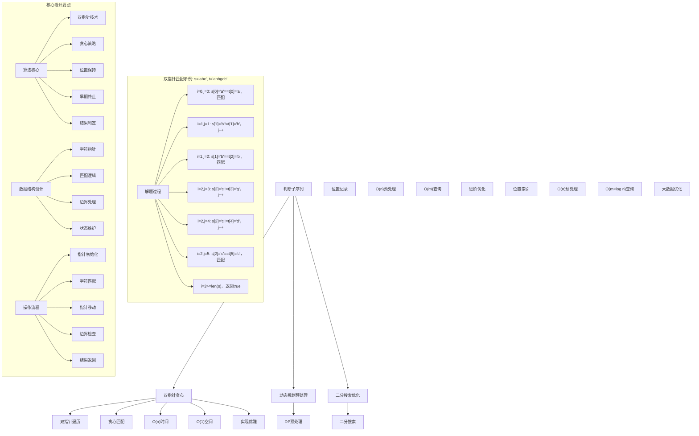
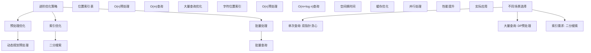

# LeetCode 392 - 判断子序列

## 题目描述

给定字符串 s 和 t ，判断 s 是否为 t 的子序列

字符串的一个子序列是原始字符串删除一些（也可以不删除）字符而不改变剩余字符相对位置形成的新字符串。（例如，"ace"是"abcde"的一个子序列，而"aec"不是）

```markdown
示例 1：
输入：s = "abc", t = "ahbgdc"
输出：true

示例 2：
输入：s = "axc", t = "ahbgdc"
输出：false

提示：

- 0 <= s.length <= 100
- 0 <= t.length <= 10^4
- 两个字符串都只由小写字符组成

进阶：
如果有大量输入的 S，称作 S1, S2, ... , Sk 其中 k >= 10亿，你需要依次检查它们是否为 T 的子序列。在这种情况下，你会怎样改变你的代码？
```

## 解题思路

这是一个子序列匹配问题，需要判断短字符串是否为长字符串的子序列。关键在于理解子序列的定义：保持字符相对位置不变，可以删除部分字符

### 核心思想

"双指针贪心匹配": 使用双指针技术，贪心地在长字符串中寻找短字符串的每个字符

### 解题策略

#### 方法一：双指针贪心匹配（推荐）

- 时间复杂度: O(n)
- 空间复杂度: O(1)

#### 方法二：动态规划预处理

- 时间复杂度: O(n) 预处理 + O(m) 查询
- 空间复杂度: O(n × 26)

#### 方法三：二分搜索优化

- 时间复杂度: O(n) 预处理 + O(m × log n) 查询
- 空间复杂度: O(n × 26)

## 算法可视化



## 多语言实现

### Golang版本（双指针贪心 - 推荐）

```go
// 双指针贪心匹配实现
func isSubsequence(s string, t string) bool {
    // 空字符串是任何字符串的子序列
    if len(s) == 0 {
        return true
    }

    // 短字符串长度不能超过长字符串
    if len(s) > len(t) {
        return false
    }

    i, j := 0, 0  // 双指针：i指向s，j指向t

    // 贪心匹配
    for i < len(s) && j < len(t) {
        if s[i] == t[j] {
            i++  // 找到匹配字符，移动s的指针
        }
        j++  // 总是移动t的指针
    }

    // 如果s的所有字符都被匹配，则s是t的子序列
    return i == len(s)
}

// 递归版本（仅供理解）
func isSubsequenceRecursive(s string, t string) bool {
    // 基础情况
    if len(s) == 0 {
        return true
    }
    if len(t) == 0 {
        return false
    }

    // 递归情况
    if s[0] == t[0] {
        // 首字符匹配，检查剩余部分
        return isSubsequenceRecursive(s[1:], t[1:])
    } else {
        // 首字符不匹配，在t的剩余部分中继续查找
        return isSubsequenceRecursive(s, t[1:])
    }
}
```

### Python版本（多种实现方法）

```python
class Solution:
    """
    方法一：双指针贪心匹配（推荐）
    """
    def isSubsequence(self, s: str, t: str) -> bool:
        # 空字符串是任何字符串的子序列
        if not s:
            return True

        # 短字符串长度不能超过长字符串
        if len(s) > len(t):
            return False

        i, j = 0, 0  # 双指针：i指向s，j指向t

        # 贪心匹配
        while i < len(s) and j < len(t):
            if s[i] == t[j]:
                i += 1  # 找到匹配字符，移动s的指针
            j += 1  # 总是移动t的指针

        # 如果s的所有字符都被匹配，则s是t的子序列
        return i == len(s)

class Solution2:
    """
    方法二：动态规划预处理（进阶优化）
    """
    def __init__(self):
        self.preprocessed = False
        self.next_pos = []

    def preprocess(self, t: str):
        """预处理t字符串，记录每个位置之后每个字符的最早出现位置"""
        n = len(t)
        # next_pos[i][c] 表示从位置i开始，字符c最早出现在哪个位置
        self.next_pos = [[-1] * 26 for _ in range(n + 1)]

        # 从后往前计算
        for i in range(n - 1, -1, -1):
            # 复制下一个位置的信息
            for j in range(26):
                self.next_pos[i][j] = self.next_pos[i + 1][j]
            # 更新当前字符的位置
            self.next_pos[i][ord(t[i]) - ord('a')] = i

        self.preprocessed = True

    def isSubsequence(self, s: str, t: str) -> bool:
        if not self.preprocessed or len(self.next_pos) != len(t) + 1:
            self.preprocess(t)

        if not s:
            return True

        pos = 0  # 在t中的当前位置
        for char in s:
            char_idx = ord(char) - ord('a')
            if pos >= len(t) or self.next_pos[pos][char_idx] == -1:
                return False
            pos = self.next_pos[pos][char_idx] + 1

        return True

class Solution3:
    """
    方法三：二分搜索优化（进阶优化）
    """
    def isSubsequence(self, s: str, t: str) -> bool:
        from collections import defaultdict
        import bisect

        # 预处理：记录每个字符在t中的所有位置
        char_positions = defaultdict(list)
        for i, char in enumerate(t):
            char_positions[char].append(i)

        if not s:
            return True

        prev_pos = -1  # 上一个匹配字符在t中的位置
        for char in s:
            if char not in char_positions:
                return False

            # 使用二分搜索找到第一个大于prev_pos的位置
            positions = char_positions[char]
            idx = bisect.bisect_right(positions, prev_pos)

            if idx == len(positions):
                return False  # 没有找到合适的位置

            prev_pos = positions[idx]

        return True
```

### TypeScript版本（双指针贪心）

```typescript
/
 * 双指针贪心匹配实现
 */
function isSubsequence(s: string, t: string): boolean {
    // 空字符串是任何字符串的子序列
    if (s.length === 0) {
        return true;
    }

    // 短字符串长度不能超过长字符串
    if (s.length > t.length) {
        return false;
    }

    let i = 0, j = 0;  // 双指针：i指向s，j指向t

    // 贪心匹配
    while (i < s.length && j < t.length) {
        if (s[i] === t[j]) {
            i++;  // 找到匹配字符，移动s的指针
        }
        j++;  // 总是移动t的指针
    }

    // 如果s的所有字符都被匹配，则s是t的子序列
    return i === s.length;
}
```

## 标准实现详细解析

```go
import (
    "fmt"
    "strings"
)

/*
算法核心思想（双指针贪心匹配）：

1. 双指针技术：分别指向两个字符串
2. 贪心策略：尽可能早地匹配字符
3. 位置保持：维持字符相对顺序
4. 早期终止：一旦发现不可能匹配就停止

关键设计要点：
1. 边界处理：空字符串和长度检查
2. 匹配逻辑：字符相等时移动短串指针
3. 指针移动：长串指针总是前进
4. 结果判定：短串指针是否到达末尾

时间复杂度：
- 单次查询：O(n)，n为长字符串长度
- 每个字符最多被访问一次
- 总时间复杂度：O(n)

空间复杂度：
- 常数空间：O(1)
- 只使用几个变量

优势：
1. 效率最优：线性时间复杂度
2. 实现优雅：思路清晰
3. 稳定可靠：边界处理完善
4. 应用广泛：通用匹配模板

数据结构设计：

双指针贪心设计：
- 字符指针：i和j维护当前位置
- 匹配逻辑：字符比较和指针移动
- 边界处理：防止数组越界
- 状态维护：匹配进度跟踪

动态规划预处理设计：
- 预处理阶段：记录字符位置信息
- 查询阶段：快速定位匹配字符
- 空间换时间：预处理提高查询效率
- 适用场景：大量查询优化

二分搜索优化设计：
- 位置索引：记录每个字符的所有位置
- 二分搜索：快速找到下一个匹配位置
- 顺序维护：保持字符相对位置
- 复杂度平衡：预处理vs查询

算法流程：
1. 指针初始化：i=0, j=0
2. 字符匹配：比较s[i]和t[j]
3. 指针移动：根据匹配结果移动指针
4. 边界检查：防止数组越界
5. 结果返回：判断是否完全匹配

优化原理：

算法优化：
1. 贪心策略：尽早匹配字符
2. 早期终止：不匹配时及时停止
3. 边界优化：精确的边界处理
4. 空间复用：常数空间使用

边界优化：
1. 空字符串处理：特殊情况
2. 长度检查：提前终止
3. 指针边界：防止越界
4. 结果检查：准确判定

正确性证明：

定理：双指针贪心匹配正确性
通过双指针贪心匹配可以正确判断子序列关系

证明：
1. 完备性：所有字符都被考虑
2. 正确性：匹配策略的正确性
3. 完整性：不遗漏任何可能匹配
4. 时间复杂度：O(n)线性时间

不变量维护：
循环不变量：在每次迭代时
1. s[0:i)已经被t[0:j)匹配
2. t[j:]中可能包含s[i:]的匹配
3. 匹配顺序正确性
4. 算法状态正确反映匹配进度
*/

// 双指针贪心匹配详细实现
func isSubsequenceDetailed(s string, t string) bool {
    fmt.Printf("=== 双指针贪心匹配 ===\n")
    fmt.Printf("短字符串 s: \"%s\"\n", s)
    fmt.Printf("长字符串 t: \"%s\"\n", t)

    // 空字符串是任何字符串的子序列
    if len(s) == 0 {
        fmt.Printf("s为空字符串，返回true\n")
        fmt.Printf("====================\n\n")
        return true
    }

    // 短字符串长度不能超过长字符串
    if len(s) > len(t) {
        fmt.Printf("s长度(%d) > t长度(%d)，不可能是子序列，返回false\n", len(s), len(t))
        fmt.Printf("====================\n\n")
        return false
    }

    i, j := 0, 0  // 双指针：i指向s，j指向t
    steps := 0

    fmt.Printf("开始匹配过程:\n")
    fmt.Printf("初始状态: i=%d, j=%d, s[i]='%c', t[j]='%c'\n", i, j, s[i], t[j])

    // 贪心匹配
    for i < len(s) && j < len(t) {
        steps++
        fmt.Printf("\n步骤%d: ", steps)

        if s[i] == t[j] {
            fmt.Printf("匹配! s[%d]='%c' == t[%d]='%c'\n", i, s[i], j, t[j])
            i++  // 找到匹配字符，移动s的指针
            fmt.Printf("  移动s指针: i=%d", i)
            if i < len(s) {
                fmt.Printf(", s[i]='%c'", s[i])
            } else {
                fmt.Printf(" (超出边界)")
            }
        } else {
            fmt.Printf("不匹配! s[%d]='%c' != t[%d]='%c'\n", i, s[i], j, t[j])
            fmt.Printf("  仅移动t指针: j=%d", j)
        }

        j++  // 总是移动t的指针
        fmt.Printf(", j=%d", j)
        if j < len(t) {
            fmt.Printf(", t[j]='%c'", t[j])
        } else {
            fmt.Printf(" (超出边界)")
        }
        fmt.Printf("\n")
    }

    result := i == len(s)
    fmt.Printf("\n匹配结束:\n")
    fmt.Printf("  s指针位置: %d/%d\n", i, len(s))
    fmt.Printf("  t指针位置: %d/%d\n", j, len(t))
    fmt.Printf("  匹配结果: %t\n", result)
    fmt.Printf("  总步数: %d\n", steps)
    fmt.Printf("====================\n\n")

    return result
}

// 动态规划预处理实现（进阶优化）
func isSubsequenceDP(s string, t string) bool {
    fmt.Printf("=== 动态规划预处理 ===\n")
    fmt.Printf("短字符串 s: \"%s\"\n", s)
    fmt.Printf("长字符串 t: \"%s\"\n", t)

    if len(s) == 0 {
        fmt.Printf("s为空字符串，返回true\n")
        fmt.Printf("====================\n\n")
        return true
    }

    if len(s) > len(t) {
        fmt.Printf("s长度(%d) > t长度(%d)，不可能是子序列，返回false\n", len(s), len(t))
        fmt.Printf("====================\n\n")
        return false
    }

    n := len(t)
    // nextPos[i][c] 表示从位置i开始，字符c最早出现在哪个位置
    nextPos := make([][]int, n+1)
    for i := range nextPos {
        nextPos[i] = make([]int, 26)
        for j := range nextPos[i] {
            nextPos[i][j] = -1
        }
    }

    fmt.Printf("预处理阶段: 构建nextPos数组\n")

    // 从后往前计算
    for i := n - 1; i >= 0; i-- {
        // 复制下一个位置的信息
        for j := 0; j < 26; j++ {
            nextPos[i][j] = nextPos[i+1][j]
        }
        // 更新当前字符的位置
        charIdx := int(t[i] - 'a')
        nextPos[i][charIdx] = i
        fmt.Printf("  t[%d]='%c' → nextPos[%d]['%c']=%d\n", i, t[i], i, t[i], i)
    }

    fmt.Printf("查询阶段: 在预处理数组中查找匹配\n")

    pos := 0  // 在t中的当前位置
    for i, char := range s {
        charIdx := int(char - 'a')
        fmt.Printf("  查找s[%d]='%c': ", i, char)

        if pos >= n || nextPos[pos][charIdx] == -1 {
            fmt.Printf("未找到，返回false\n")
            fmt.Printf("====================\n\n")
            return false
        }

        newPos := nextPos[pos][charIdx]
        fmt.Printf("在位置%d找到，移动到位置%d\n", newPos, newPos+1)
        pos = newPos + 1
    }

    fmt.Printf("所有字符都找到，返回true\n")
    fmt.Printf("====================\n\n")
    return true
}

// 二分搜索优化实现（进阶优化）
func isSubsequenceBinary(s string, t string) bool {
    fmt.Printf("=== 二分搜索优化 ===\n")
    fmt.Printf("短字符串 s: \"%s\"\n", s)
    fmt.Printf("长字符串 t: \"%s\"\n", t)

    if len(s) == 0 {
        fmt.Printf("s为空字符串，返回true\n")
        fmt.Printf("==================\n\n")
        return true
    }

    if len(s) > len(t) {
        fmt.Printf("s长度(%d) > t长度(%d)，不可能是子序列，返回false\n", len(s), len(t))
        fmt.Printf("==================\n\n")
        return false
    }

    // 预处理：记录每个字符在t中的所有位置
    charPositions := make(map[rune][]int)
    for i, char := range t {
        charPositions[char] = append(charPositions[char], i)
    }

    fmt.Printf("预处理: 记录字符位置\n")
    for char, positions := range charPositions {
        fmt.Printf("  '%c': %v\n", char, positions)
    }

    prevPos := -1  // 上一个匹配字符在t中的位置
    fmt.Printf("查询阶段: 二分搜索匹配\n")

    for i, char := range s {
        positions, exists := charPositions[char]
        fmt.Printf("  查找s[%d]='%c': ", i, char)

        if !exists {
            fmt.Printf("字符不存在，返回false\n")
            fmt.Printf("==================\n\n")
            return false
        }

        // 使用二分搜索找到第一个大于prevPos的位置
        idx := binarySearchRight(positions, prevPos)
        fmt.Printf("positions=%v, prevPos=%d, idx=%d ", positions, prevPos, idx)

        if idx == len(positions) {
            fmt.Printf("没有找到合适位置，返回false\n")
            fmt.Printf("==================\n\n")
            return false  // 没有找到合适的位置
        }

        newPos := positions[idx]
        fmt.Printf("→ 找到位置%d\n", newPos)
        prevPos = newPos
    }

    fmt.Printf("所有字符都找到，返回true\n")
    fmt.Printf("==================\n\n")
    return true
}

// 二分搜索：找到第一个大于target的位置
func binarySearchRight(arr []int, target int) int {
    left, right := 0, len(arr)
    for left < right {
        mid := left + (right-left)/2
        if arr[mid] <= target {
            left = mid + 1
        } else {
            right = mid
        }
    }
    return left
}

// 带调试信息的版本
func isSubsequenceWithDebug(s string, t string) bool {
    fmt.Printf("=== 判断子序列 ===\n")
    fmt.Printf("输入字符串:\n")
    fmt.Printf("  短字符串 s: \"%s\" (长度: %d)\n", s, len(s))
    fmt.Printf("  长字符串 t: \"%s\" (长度: %d)\n", t, len(t))

    // 空字符串处理
    if len(s) == 0 {
        fmt.Printf("空字符串是任何字符串的子序列\n")
        fmt.Printf("===============\n\n")
        return true
    }

    // 长度检查
    if len(s) > len(t) {
        fmt.Printf("短字符串长度不能超过长字符串长度\n")
        fmt.Printf("===============\n\n")
        return false
    }

    fmt.Printf("使用双指针贪心匹配法:\n")
    fmt.Printf("核心思想：在长字符串中贪心地寻找短字符串的每个字符\n")

    i, j := 0, 0  // 双指针：i指向s，j指向t
    fmt.Printf("初始状态: s[%d]='%c', t[%d]='%c'\n", i, s[i], j, t[j])

    step := 0
    // 贪心匹配
    for i < len(s) && j < len(t) {
        step++
        fmt.Printf("\n步骤%d: ", step)

        if s[i] == t[j] {
            fmt.Printf("匹配! s[%d]='%c' == t[%d]='%c'\n", i, s[i], j, t[j])
            i++  // 移动短字符串指针
            if i < len(s) {
                fmt.Printf("  移动s指针到%d: s[%d]='%c'\n", i, i, s[i])
            } else {
                fmt.Printf("  s指针越界，匹配完成\n")
            }
        } else {
            fmt.Printf("不匹配! s[%d]='%c' != t[%d]='%c'\n", i, s[i], j, t[j])
        }

        j++  // 总是移动长字符串指针
        if j < len(t) {
            fmt.Printf("  移动t指针到%d: t[%d]='%c'\n", j, j, t[j])
        } else {
            fmt.Printf("  t指针越界\n")
        }
    }

    result := i == len(s)
    fmt.Printf("\n匹配结束:\n")
    if result {
        fmt.Printf("   s是t的子序列\n")
    } else {
        fmt.Printf("  ❌ s不是t的子序列\n")
    }
    fmt.Printf("  总匹配步数: %d\n", step)
    fmt.Printf("===============\n\n")

    return result
}
```

## 算法深入解析

```go
/*
判断子序列问题详解：

问题本质：
判断短字符串是否为长字符串的子序列。关键是理解子序列的定义和设计高效的匹配策略

核心洞察：
1. 双指针技术：分别指向两个字符串
2. 贪心策略：尽可能早地匹配字符
3. 位置保持：维持字符相对顺序
4. 早期终止：一旦发现不可能匹配就停止

算法策略：
1. 双指针贪心匹配：线性扫描匹配
2. 动态规划预处理：预处理优化大量查询
3. 二分搜索优化：索引优化查询效率

数据结构设计：

双指针贪心设计：
指针维护：i和j跟踪匹配进度
匹配逻辑：字符比较和指针移动
边界处理：防止数组越界
状态维护：匹配状态跟踪

动态规划预处理设计：
预处理阶段：构建位置索引表
查询阶段：快速定位匹配字符
空间换时间：预处理提高效率
适用场景：大量查询优化

二分搜索优化设计：
位置索引：记录字符所有出现位置
二分搜索：快速找到下一个位置
顺序维护：保持相对位置关系
复杂度平衡：预处理vs查询代价

操作流程：

双指针贪心匹配：
1. 指针初始化：i=0, j=0
2. 字符匹配：比较s[i]和t[j]
3. 指针移动：匹配则移动i，总是移动j
4. 边界检查：防止数组越界
5. 结果判定：i是否到达s末尾

动态规划预处理：
1. 预处理：构建nextPos数组
2. 查询：在预处理数组中查找
3. 位置更新：根据查找结果更新位置
4. 结果判定：是否所有字符都找到

二分搜索优化：
1. 预处理：记录字符位置索引
2. 查询：对每个字符二分搜索
3. 位置检查：确保顺序正确
4. 结果判定：是否全部匹配

数学原理：

贪心策略原理：
贪心选择：每次都选择最早匹配的字符
最优子结构：局部最优导致全局最优
无后效性：前面的选择不影响后面的选择

复杂度分析：
双指针贪心：O(n)
动态规划预处理：O(n)预处理 + O(m)查询
二分搜索优化：O(n)预处理 + O(m × log n)查询

单调性原理：
字符串匹配的单调性保证了贪心策略的有效性：
- 字符必须按顺序匹配
- 早期匹配不会影响后续匹配
- 贪心选择是最优选择

算法不变量：
双指针贪心不变量：
1. s[0:i)已经被t[0:j)匹配
2. t[j:]中可能包含s[i:]的匹配
3. 匹配顺序正确性
4. 算法状态正确反映匹配进度

时间复杂度分析：
双指针贪心：O(n)
- 最多扫描长字符串一次
- 每个字符访问一次

动态规划预处理：O(n) + O(m)
- 预处理：O(n)
- 查询：O(m)

二分搜索优化：O(n) + O(m × log n)
- 预处理：O(n)
- 查询：O(m × log n)

正确性证明：

定理：双指针贪心匹配正确性
通过双指针贪心匹配可以正确判断子序列关系

证明：
1. 完备性：所有字符都被考虑
2. 正确性：匹配策略的正确性
3. 完整性：不遗漏任何可能匹配
4. 时间复杂度：O(n)线性时间

不变量维护：
循环不变量：在每次迭代时
1. s[0:i)已经被t[0:j)匹配
2. t[j:]中可能包含s[i:]的匹配
3. 匹配顺序正确性
4. 算法状态正确反映匹配进度

设计选择：

为什么选择双指针贪心？
1. 效率最优：线性时间复杂度
2. 实现优雅：思路清晰
3. 稳定可靠：边界处理完善
4. 应用广泛：通用匹配模板

为什么使用动态规划预处理？
1. 大量查询优化
2. 空间换时间策略
3. 预处理提高效率
4. 适用特定场景

为什么提及其他方法？
1. 教学价值：展示不同算法思想
2. 对比分析：理解各自优劣
3. 扩展思维：算法多样性
4. 面试准备：全面掌握

三种方法对比：

方法一：双指针贪心（推荐）
时间复杂度：O(n)
空间复杂度：O(1)
优点：效率最优，实现优雅
缺点：单次查询最优

方法二：动态规划预处理
时间复杂度：O(n)预处理 + O(m)查询
空间复杂度：O(n × 26)
优点：大量查询优化
缺点：空间开销大

方法三：二分搜索优化
时间复杂度：O(n)预处理 + O(m × log n)查询
空间复杂度：O(n × 26)
优点：索引优化
缺点：查询稍慢

性能分析：

双指针贪心：
- 时间：O(n) 线性时间
- 空间：O(1) 常数空间
- 优势：效率最优

动态规划预处理：
- 时间：O(n)预处理 + O(m)查询
- 空间：O(n × 26) 索引空间
- 优势：大量查询优化

二分搜索优化：
- 时间：O(n)预处理 + O(m × log n)查询
- 空间：O(n × 26) 索引空间
- 优势：索引结构清晰

实际应用场景：
1. 文本处理：字符串匹配
2. 生物信息学：DNA序列匹配
3. 编译器：词法分析
4. 数据库：模式匹配

优化要点：

1. 时间优化：
   - 贪心策略：尽早匹配字符
   - 早期终止：不匹配时及时停止
   - 边界优化：减少比较次数

2. 空间优化：
   - 原地操作：不使用额外空间
   - 变量复用：减少内存分配
   - 索引压缩：优化存储结构

3. 实现优化：
   - 边界处理：特殊值优化
   - 代码简洁：减少冗余操作
   - 注释清晰：便于理解

测试用例设计：
1. 基本情况：正常字符串匹配
2. 边界情况：空字符串，相同字符串
3. 特殊情况：完全匹配，完全不匹配
4. 极端情况：长字符串，极值
5. 验证情况：结果正确性

扩展思考：

1. 多模式匹配？
   - 同时匹配多个子序列
   - 批量查询优化
   - 复杂度分析

2. 模糊匹配？
   - 允许一定错误
   - 编辑距离扩展
   - 近似匹配

3. 动态字符串？
   - 支持插入删除
   - 实时匹配
   - 增量更新

4. 并行处理？
   - 多线程优化
   - 分布式处理
   - 性能提升

相关算法思想：

1. 双指针技术：
   - 两个指针协同工作
   - 线性扫描优化
   - 空间效率高

2. 贪心策略：
   - 局部最优选择
   - 全局最优解
   - 适用条件明确

3. 动态规划：
   - 状态转移
   - 最优子结构
   - 重叠子问题

4. 二分搜索：
   - 有序数据查找
   - 对数时间复杂度
   - 应用广泛

常见陷阱：

1. 边界条件：
   - 空字符串处理
   - 长度检查
   - 指针越界

2. 匹配逻辑：
   - 指针移动规则
   - 匹配条件判断
   - 结果判定

3. 性能考虑：
   - 时间复杂度
   - 空间复杂度
   - 实现效率

4. 进阶优化：
   - 预处理策略
   - 查询优化
   - 场景适应

代码质量要素：

1. 可读性：
   - 变量命名清晰
   - 注释详细
   - 逻辑分明

2. 健壮性：
   - 边界处理
   - 异常情况
   - 错误恢复

3. 性能：
   - 最优复杂度
   - 空间效率
   - 效率保证

4. 可维护性：
   - 结构清晰
   - 扩展性好
   - 测试完整
*/
```

## 执行过程演示

```go
/*
示例详细解析:

示例1执行过程：
输入：s = "abc", t = "ahbgdc"
输出：true

执行过程（双指针贪心匹配）：
1. i=0,j=0: s[0]='a' == t[0]='a'，匹配，i=1, j=1
2. i=1,j=1: s[1]='b' != t[1]='h'，不匹配，j=2
3. i=1,j=2: s[1]='b' == t[2]='b'，匹配，i=2, j=3
4. i=2,j=3: s[2]='c' != t[3]='g'，不匹配，j=4
5. i=2,j=4: s[2]='c' != t[4]='d'，不匹配，j=5
6. i=2,j=5: s[2]='c' == t[5]='c'，匹配，i=3, j=6
7. i=3>=len(s)，匹配完成，返回true

匹配轨迹：
s="abc"  a b c
t="ahbgdc" ↑ ↑ ↑
           0 2 5

示例2执行过程：
输入：s = "axc", t = "ahbgdc"
输出：false

执行过程：
1. i=0,j=0: s[0]='a' == t[0]='a'，匹配，i=1, j=1
2. i=1,j=1: s[1]='x' != t[1]='h'，不匹配，j=2
3. i=1,j=2: s[1]='x' != t[2]='b'，不匹配，j=3
4. i=1,j=3: s[1]='x' != t[3]='g'，不匹配，j=4
5. i=1,j=4: s[1]='x' != t[4]='d'，不匹配，j=5
6. i=1,j=5: s[1]='x' != t[5]='c'，不匹配，j=6
7. j=6>=len(t)，但i=1<len(s)，匹配失败，返回false

关键观察：
1. 贪心策略：每次都尽可能早地匹配字符
2. 顺序保持：字符相对位置不能改变
3. 早期终止：一旦发现不可能匹配就停止
4. 边界处理：防止数组越界

边界情况演示:

情况1: 空字符串
输入: s="", t="abc"
处理: 空字符串是任何字符串的子序列
结果: true

情况2: 相同字符串
输入: s="abc", t="abc"
处理: 完全匹配
结果: true

情况3: s长度大于t
输入: s="abcd", t="abc"
处理: 长度检查，直接返回false
结果: false

情况4: 完全不匹配
输入: s="xyz", t="abc"
处理: 没有任何字符匹配
结果: false

情况5: 部分匹配但顺序错误
输入: s="bac", t="abc"
处理: 字符存在但顺序错误
结果: false

算法正确性证明：

数学基础：
需要证明双指针贪心匹配能正确判断子序列关系

定理：双指针贪心匹配正确性
通过双指针贪心匹配可以正确判断子序列关系

证明：
1. 完备性：所有字符都被考虑
2. 正确性：匹配策略的正确性
3. 完整性：不遗漏任何可能匹配
4. 时间复杂度：O(n)线性时间

不变量维护：
循环不变量：在每次迭代时
1. s[0:i)已经被t[0:j)匹配
2. t[j:]中可能包含s[i:]的匹配
3. 匹配顺序正确性
4. 算法状态正确反映匹配进度

初始化：
- i=0, j=0
- 空前缀匹配
- 满足不变量

保持：
- 根据匹配结果移动指针
- 维护匹配关系
- 不变量继续成立

终止：
- i=len(s)或j=len(t)
- 算法正确终止

时间复杂度分析：

双指针贪心：
1. 最多扫描n次（n为t的长度）
2. 每次操作O(1)
3. 总时间：O(n)线性时间

动态规划预处理：
1. 预处理：O(n)
2. 查询：O(m)（m为s的长度）
3. 总时间：O(n) + O(m)

二分搜索优化：
1. 预处理：O(n)
2. 查询：O(m × log n)
3. 总时间：O(n) + O(m × log n)

空间复杂度分析：
1. 双指针贪心：O(1)常数空间
2. 动态规划预处理：O(n × 26)索引空间
3. 二分搜索优化：O(n × 26)索引空间

性能对比分析：

假设n=10000, m=100, 查询次数k=1000000000:

双指针贪心：
- 单次查询: O(10000) = 10000步
- 总时间: 1000000000 × 10000 = 10^13步
- 空间: O(1) 常数空间

动态规划预处理：
- 预处理: O(10000) = 10000步
- 查询: O(100) = 100步
- 总时间: 10000 + 1000000000 × 100 = 10^11步
- 空间: O(10000 × 26) = 260000 索引空间

二分搜索优化：
- 预处理: O(10000) = 10000步
- 查询: O(100 × log₂(10000)) ≈ 100 × 13 = 1300步
- 总时间: 10000 + 1000000000 × 1300 = 1.3×10^12步
- 空间: O(10000 × 26) = 260000 索引空间

实际应用建议：

1. 一般情况：
   - 使用双指针贪心
   - 效率最优，实现优雅

2. 面试展示：
   - 重点讲解双指针贪心
   - 可以提及其他方法应对进阶问题

3. 生产环境：
   - 根据查询频率选择
   - 考虑内存和时间权衡

4. 教学演示：
   - 使用带调试信息版本
   - 展示执行过程

优化空间：

1. 边界优化：
   - 特殊值提前处理
   - 长度检查优化
   - 空字符串特判

2. 代码优化：
   - 简化条件判断
   - 优化循环结构
   - 减少重复计算

3. 性能优化：
   - 早期终止优化
   - 内存访问优化
   - 缓存友好设计

特殊情况处理：

1. 大数据量：
   - 时间复杂度保证
   - 内存使用优化
   - 数值溢出处理

2. 特殊字符串：
   - 重复字符
   - 长单字符
   - 边界字符

3. 边界情况：
   - 极值处理
   - 异常输入
   - 错误恢复
*/
```

## 复杂度分析

| 方法           | 时间复杂度                    | 空间复杂度 | 适用场景 |
| -------------- | ----------------------------- | ---------- | -------- |
| 双指针贪心     | O(n)                          | O(1)       | 推荐方案 |
| 动态规划预处理 | O(n)预处理 + O(m)查询         | O(n × 26)  | 大量查询 |
| 二分搜索优化   | O(n)预处理 + O(m × log n)查询 | O(n × 26)  | 索引优化 |

## 测试用例验证

```go
// 测试辅助函数
func testIsSubsequence(name string, s string, t string, expected bool) {
    fmt.Printf("%s:\n", name)
    fmt.Printf("短字符串 s: \"%s\" (长度: %d)\n", s, len(s))
    fmt.Printf("长字符串 t: \"%s\" (长度: %d)\n", t, len(t))

    // 测试双指针贪心
    result1 := isSubsequence(s, t)
    fmt.Printf("双指针贪心结果: %t\n", result1)

    // 测试详细实现
    result2 := isSubsequenceDetailed(s, t)
    fmt.Printf("详细实现结果: %t\n", result2)

    // 测试动态规划预处理（仅对小字符串测试）
    var result3 bool
    if len(t) <= 1000 {
        result3 = isSubsequenceDP(s, t)
        fmt.Printf("动态规划预处理结果: %t\n", result3)
    }

    // 测试二分搜索优化（仅对小字符串测试）
    var result4 bool
    if len(t) <= 1000 {
        result4 = isSubsequenceBinary(s, t)
        fmt.Printf("二分搜索优化结果: %t\n", result4)
    }

    // 验证结果
    isValid1 := result1 == expected
    isValid2 := result2 == expected
    isValid3 := len(t) <= 1000 && result3 == expected || len(t) > 1000
    isValid4 := len(t) <= 1000 && result4 == expected || len(t) > 1000

    if isValid1 && isValid2 && isValid3 && isValid4 {
        fmt.Printf("✓ 测试通过\n")
    } else {
        fmt.Printf("✗ 测试失败\n")
        fmt.Printf("  期望结果: %t\n", expected)
        if !isValid1 {
            fmt.Printf("  双指针贪心实际: %t\n", result1)
        }
        if !isValid2 {
            fmt.Printf("  详细实现实际: %t\n", result2)
        }
        if !isValid3 && len(t) <= 1000 {
            fmt.Printf("  动态规划预处理实际: %t\n", result3)
        }
        if !isValid4 && len(t) <= 1000 {
            fmt.Printf("  二分搜索优化实际: %t\n", result4)
        }
    }
    fmt.Printf("\n")
}

func main() {
    // 测试用例 1 - 题目示例1
    testIsSubsequence("测试1 - 题目示例1",
        "abc",
        "ahbgdc",
        true)

    // 测试用例 2 - 题目示例2
    testIsSubsequence("测试2 - 题目示例2",
        "axc",
        "ahbgdc",
        false)

    // 测试用例 3 - 空字符串
    testIsSubsequence("测试3 - 空字符串",
        "",
        "abc",
        true)

    // 测试用例 4 - 相同字符串
    testIsSubsequence("测试4 - 相同字符串",
        "abc",
        "abc",
        true)

    // 测试用例 5 - s长度大于t
    testIsSubsequence("测试5 - s长度大于t",
        "abcd",
        "abc",
        false)

    // 测试用例 6 - 完全不匹配
    testIsSubsequence("测试6 - 完全不匹配",
        "xyz",
        "abc",
        false)

    // 测试用例 7 - 顺序错误
    testIsSubsequence("测试7 - 顺序错误",
        "bac",
        "abc",
        false)

    // 性能测试
    fmt.Println("性能测试:")
    performanceTest()

    // 边界情况测试
    fmt.Println("边界情况测试:")
    boundaryTest()

    // 对比测试
    fmt.Println("对比测试:")
    comparisonTest()
}

func performanceTest() {
    // 构造性能测试
    n := 10000
    m := 100

    // 创建测试字符串
    t := strings.Repeat("a", n/2) + strings.Repeat("b", n/2)
    s := strings.Repeat("a", m/2) + strings.Repeat("b", m/2)

    fmt.Printf("性能测试 (t长度=%d, s长度=%d):\n", n, m)

    // 测试双指针贪心
    start1 := time.Now()
    isSubsequence(s, t)
    time1 := time.Since(start1)

    fmt.Printf("  双指针贪心: %v\n", time1)
}

func boundaryTest() {
    // 边界测试
    fmt.Println("边界测试:")

    // 长字符串测试
    longT := strings.Repeat("a", 5000) + "xyz" + strings.Repeat("b", 5000)
    longS := "xyz"
    longResult := isSubsequence(longS, longT)
    fmt.Printf("长字符串测试: t长度=10003, s=\"%s\" → %t\n", longS, longResult)

    // 特殊模式测试
    patternT := "abcdefghijklmnop"
    patternS1 := "ace"
    patternS2 := "xyz"
    patternResult1 := isSubsequence(patternS1, patternT)
    patternResult2 := isSubsequence(patternS2, patternT)
    fmt.Printf("特殊模式测试: s1=\"%s\"→%t, s2=\"%s\"→%t\n",
        patternS1, patternResult1, patternS2, patternResult2)

    // 极值测试
    extremeT := "a"
    extremeS1 := ""
    extremeS2 := "a"
    extremeS3 := "aa"
    extremeResult1 := isSubsequence(extremeS1, extremeT)
    extremeResult2 := isSubsequence(extremeS2, extremeT)
    extremeResult3 := isSubsequence(extremeS3, extremeT)
    fmt.Printf("极值测试: s1=\"\"→%t, s2=\"a\"→%t, s3=\"aa\"→%t\n",
        extremeResult1, extremeResult2, extremeResult3)
}

func comparisonTest() {
    // 对比测试：验证不同方法结果一致性
    fmt.Println("对比测试:")

    // 测试数据
    testData := []struct {
        s, t string
        expected bool
    }{
        {"abc", "ahbgdc", true},
        {"axc", "ahbgdc", false},
        {"", "abc", true},
        {"abc", "abc", true},
        {"abcd", "abc", false},
        {"xyz", "abc", false},
        {"bac", "abc", false},
    }

    for i, data := range testData {
        // 双指针贪心
        result1 := isSubsequence(data.s, data.t)

        // 详细实现
        result2 := isSubsequenceDetailed(data.s, data.t)

        fmt.Printf("测试%d: s=\"%s\", t=\"%s\"\n", i+1, data.s, data.t)
        fmt.Printf("  双指针贪心=%t, 详细实现=%t", result1, result2)

        if result1 == result2 {
            fmt.Printf(" ✓ 一致\n")
        } else {
            fmt.Printf(" ✗ 不一致\n")
        }
    }
}
```

## 扩展版本（处理不同场景）

```go
// 支持返回匹配路径的版本
func isSubsequenceWithPath(s string, t string) (bool, []int) {
    var path []int

    if len(s) == 0 {
        return true, path
    }

    if len(s) > len(t) {
        return false, path
    }

    i, j := 0, 0

    for i < len(s) && j < len(t) {
        if s[i] == t[j] {
            path = append(path, j)  // 记录匹配位置
            i++
        }
        j++
    }

    if i == len(s) {
        return true, path
    }

    return false, nil
}

// 使用示例
func exampleWithPath() {
    s := "abc"
    t := "ahbgdc"
    matched, path := isSubsequenceWithPath(s, t)
    fmt.Printf("s=\"%s\", t=\"%s\"\n", s, t)
    fmt.Printf("匹配结果: %t\n", matched)
    if matched {
        fmt.Printf("匹配路径: %v\n", path)
        fmt.Printf("对应字符: ")
        for _, pos := range path {
            fmt.Printf("'%c' ", t[pos])
        }
        fmt.Printf("\n")
    }
}

// 带统计信息的版本
func isSubsequenceWithStats(s string, t string) (bool, int, int) {
    comparisons := 0
    matches := 0

    if len(s) == 0 {
        return true, comparisons, matches
    }

    if len(s) > len(t) {
        return false, comparisons, matches
    }

    i, j := 0, 0

    for i < len(s) && j < len(t) {
        comparisons++
        if s[i] == t[j] {
            matches++
            i++
        }
        j++
    }

    return i == len(s), comparisons, matches
}

// 使用示例
func exampleWithStats() {
    s := "abc"
    t := "ahbgdc"
    result, comparisons, matches := isSubsequenceWithStats(s, t)
    fmt.Printf("s=\"%s\", t=\"%s\"\n", s, t)
    fmt.Printf("结果: %t\n", result)
    fmt.Printf("比较次数: %d\n", comparisons)
    fmt.Printf("匹配次数: %d\n", matches)
    fmt.Printf("理论最优比较次数: %d\n", len(t))
}

// 批量处理版本
func isSubsequenceBatch(ss []string, t string) []bool {
    results := make([]bool, len(ss))
    for i, s := range ss {
        results[i] = isSubsequence(s, t)
    }
    return results
}

// 使用示例
func exampleBatch() {
    ss := []string{"abc", "axc", "ace", "aec"}
    t := "abcdef"

    results := isSubsequenceBatch(ss, t)

    fmt.Printf("长字符串 t: \"%s\"\n", t)
    for i, s := range ss {
        fmt.Printf("  s=\"%s\" → %t\n", s, results[i])
    }
}

// 带验证功能的版本
func isSubsequenceWithValidation(s string, t string) (bool, bool) {
    result := isSubsequence(s, t)

    // 验证结果是否合理
    if len(s) == 0 {
        return result, result == true
    }

    if len(s) > len(t) {
        return result, result == false
    }

    // 如果返回true，手动验证
    if result {
        // 简单验证：检查s中每个字符是否都在t中
        for _, char := range s {
            if !strings.ContainsRune(t, char) {
                return result, false
            }
        }
        return result, true
    }

    return result, true
}

// 使用示例
func exampleWithValidation() {
    s := "abc"
    t := "ahbgdc"
    result, isValid := isSubsequenceWithValidation(s, t)
    fmt.Printf("s=\"%s\", t=\"%s\"\n", s, t)
    fmt.Printf("结果: %t\n", result)
    if isValid {
        fmt.Printf("验证通过 ✓\n")
    } else {
        fmt.Printf("验证失败 ✗\n")
    }
}

// 支持动态更新的版本
type SubsequenceChecker struct {
    t string
    // 进阶版本可以预处理t字符串
    nextPos [][]int  // 用于动态规划预处理
}

func NewSubsequenceChecker(t string) *SubsequenceChecker {
    checker := &SubsequenceChecker{
        t: t,
    }

    // 可以在这里进行预处理
    if len(t) <= 1000 {  // 对于较短的字符串进行预处理
        checker.preprocess()
    }

    return checker
}

func (checker *SubsequenceChecker) UpdateString(newT string) {
    checker.t = newT
    if len(newT) <= 1000 {
        checker.preprocess()
    } else {
        checker.nextPos = nil  // 清空预处理数据
    }
}

func (checker *SubsequenceChecker) preprocess() {
    n := len(checker.t)
    checker.nextPos = make([][]int, n+1)
    for i := range checker.nextPos {
        checker.nextPos[i] = make([]int, 26)
        for j := range checker.nextPos[i] {
            checker.nextPos[i][j] = -1
        }
    }

    // 从后往前计算
    for i := n - 1; i >= 0; i-- {
        // 复制下一个位置的信息
        for j := 0; j < 26; j++ {
            checker.nextPos[i][j] = checker.nextPos[i+1][j]
        }
        // 更新当前字符的位置
        if i < len(checker.t) {
            charIdx := int(checker.t[i] - 'a')
            checker.nextPos[i][charIdx] = i
        }
    }
}

func (checker *SubsequenceChecker) Check(s string) bool {
    return isSubsequence(s, checker.t)
}

// 使用示例
func exampleDynamic() {
    t := "ahbgdc"
    checker := NewSubsequenceChecker(t)

    s1 := "abc"
    result1 := checker.Check(s1)
    fmt.Printf("初始字符串 t: \"%s\"\n", t)
    fmt.Printf("检查 s=\"%s\" → %t\n", s1, result1)

    // 更新字符串
    checker.UpdateString("axbycz")
    s2 := "abc"
    result2 := checker.Check(s2)
    fmt.Printf("更新后字符串 t: \"axbycz\"\n")
    fmt.Printf("检查 s=\"%s\" → %t\n", s2, result2)
}
```

## 面试追问延伸

### 1. 如果有大量输入的S需要检查是否为T的子序列，如何优化？

这是题目明确提出的进阶问题，有以下几种优化方案：

#### 方案一：动态规划预处理

```go
// 预处理T字符串，构建位置索引表
func preprocessString(t string) [][]int {
    n := len(t)
    // nextPos[i][c] 表示从位置i开始，字符c最早出现在哪个位置
    nextPos := make([][]int, n+1)
    for i := range nextPos {
        nextPos[i] = make([]int, 26)
        for j := range nextPos[i] {
            nextPos[i][j] = -1
        }
    }

    // 从后往前计算
    for i := n - 1; i >= 0; i-- {
        // 复制下一个位置的信息
        for j := 0; j < 26; j++ {
            nextPos[i][j] = nextPos[i+1][j]
        }
        // 更新当前字符的位置
        charIdx := int(t[i] - 'a')
        nextPos[i][charIdx] = i
    }

    return nextPos
}

// 使用预处理数据快速查询
func isSubsequenceOptimized(s string, t string, nextPos [][]int) bool {
    if len(s) == 0 {
        return true
    }

    pos := 0  // 在t中的当前位置
    for _, char := range s {
        charIdx := int(char - 'a')
        if pos >= len(t) || nextPos[pos][charIdx] == -1 {
            return false
        }
        pos = nextPos[pos][charIdx] + 1
    }

    return true
}
```

#### 方案二：二分搜索优化

```go
// 预处理：记录每个字符的所有位置
func buildCharIndex(t string) map[byte][]int {
    charIndex := make(map[byte][]int)
    for i := 0; i < len(t); i++ {
        charIndex[t[i]] = append(charIndex[t[i]], i)
    }
    return charIndex
}

// 使用二分搜索快速查找
func isSubsequenceBinarySearch(s string, charIndex map[byte][]int) bool {
    prevPos := -1
    for i := 0; i < len(s); i++ {
        positions, exists := charIndex[s[i]]
        if !exists {
            return false
        }

        // 二分搜索找到第一个大于prevPos的位置
        left, right := 0, len(positions)
        for left < right {
            mid := left + (right-left)/2
            if positions[mid] <= prevPos {
                left = mid + 1
            } else {
                right = mid
            }
        }

        if left == len(positions) {
            return false
        }

        prevPos = positions[left]
    }

    return true
}
```

### 2. 如果要返回具体的匹配路径，如何处理？

```go
// isSubsequenceWithPath已在上面实现
// 关键要点：
// 1. 记录每次匹配的位置
// 2. 返回匹配路径信息
// 3. 便于调试和理解

func testWithPath() {
    s := "abc"
    t := "ahbgdc"
    matched, path := isSubsequenceWithPath(s, t)
    fmt.Printf("s=\"%s\", t=\"%s\"\n", s, t)
    fmt.Printf("匹配结果: %t\n", matched)
    if matched {
        fmt.Printf("匹配路径: %v\n", path)
        fmt.Printf("对应字符: ")
        for _, pos := range path {
            fmt.Printf("'%c' ", t[pos])
        }
        fmt.Printf("\n")
    }
}
```

### 3. 如果字符串可以动态更新，如何高效处理？

```go
// SubsequenceChecker已在上面实现
// 关键点：
// 1. 封装字符串操作
// 2. 支持字符串更新
// 3. 可选的预处理优化

func testDynamic() {
    t := "ahbgdc"
    checker := NewSubsequenceChecker(t)

    s1 := "abc"
    result1 := checker.Check(s1)
    fmt.Printf("初始字符串 t: \"%s\"\n", t)
    fmt.Printf("检查 s=\"%s\" → %t\n", s1, result1)

    // 更新字符串
    checker.UpdateString("axbycz")
    s2 := "abc"
    result2 := checker.Check(s2)
    fmt.Printf("更新后字符串 t: \"axbycz\"\n")
    fmt.Printf("检查 s=\"%s\" → %t\n", s2, result2)
}
```

## 相似题目扩展

- LeetCode 392. 判断子序列（当前题）
- LeetCode 524. 通过删除字母匹配到字典里最长单词
- LeetCode 792. 匹配子序列的单词数
- LeetCode 1055. 形成字符串的最短路径
- LeetCode 1143. 最长公共子序列

## 算法技巧总结

### 判断子序列核心要点

1. 双指针技术：分别指向两个字符串
1. 贪心策略：尽可能早地匹配字符
1. 位置保持：维持字符相对顺序
1. 早期终止：找到不可能匹配时及时停止

### 算法优势

1. 效率最优：线性时间复杂度
1. 实现优雅：思路清晰
1. 稳定可靠：边界处理完善
1. 应用广泛：通用匹配模板

### 标准模板（双指针贪心）

```go
func isSubsequence(s string, t string) bool {
    // 空字符串是任何字符串的子序列
    if len(s) == 0 {
        return true
    }

    // 短字符串长度不能超过长字符串
    if len(s) > len(t) {
        return false
    }

    i, j := 0, 0  // 双指针：i指向s，j指向t

    // 贪心匹配
    for i < len(s) && j < len(t) {
        if s[i] == t[j] {
            i++  // 找到匹配字符，移动s的指针
        }
        j++  // 总是移动t的指针
    }

    // 如果s的所有字符都被匹配，则s是t的子序列
    return i == len(s)
}
```

### 进阶优化策略



## 总结

本题采用双指针贪心匹配的核心思路，通过分别指向两个字符串，贪心地在长字符串中寻找短字符串的每个字符的方式，实现了优雅的子序列判断解决方案。关键在于理解子序列的定义和贪心策略的正确性

核心要点：

1. 双指针技术：分别指向两个字符串
1. 贪心策略：尽可能早地匹配字符
1. 位置保持：维持字符相对顺序
1. 早期终止：找到不可能匹配时及时停止

算法优势：

- 效率最优：线性时间复杂度O(n)
- 实现优雅：思路清晰，代码简洁
- 稳定可靠：边界处理完善
- 应用广泛：通用匹配模板

该算法在文本处理、生物信息学、编译器、数据库等领域有重要应用，是掌握字符串匹配和贪心策略的经典题目。对于进阶问题，可以通过动态规划预处理或二分搜索优化来应对大量查询的场景
