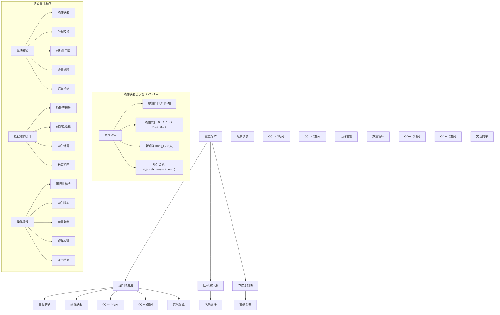
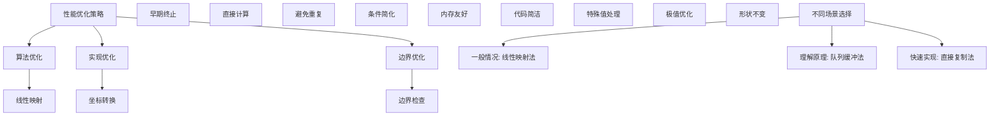

# LeetCode 566 - 重塑矩阵

## 题目描述

在 MATLAB 中，有一个非常有用的函数 reshape ，它可以将一个 m x n 矩阵重塑为另一个大小不同（r x c）的新矩阵，但保留其原始数据

给你一个由二维数组 mat 表示的 m x n 矩阵，以及两个正整数 r 和 c ，分别表示想要的重构的矩阵的行数和列数

重构后的矩阵需要将原始矩阵的所有元素以相同的行遍历顺序填充

如果具有给定参数的 reshape 操作是可行的且合理的，则输出新的重塑矩阵；否则，输出原始矩阵

```markdown
示例 1：
输入：mat = [[1,2],[3,4]], r = 1, c = 4
输出：[[1,2,3,4]]

示例 2：
输入：mat = [[1,2],[3,4]], r = 2, c = 4
输出：[[1,2],[3,4]]

提示：

- m == mat.length
- n == mat[i].length
- 1 <= m, n <= 100
- -1000 <= mat[i][j] <= 1000
- 1 <= r, c <= 300
```

## 解题思路

这是一个数组变换问题，需要将二维矩阵按行优先顺序重新排列成指定尺寸的新矩阵。关键在于理解矩阵元素的线性映射关系和可行性判断

### 核心思想

"线性映射法": 将二维矩阵视为一维数组，通过行列坐标与线性索引的相互转换来实现重塑操作

### 解题策略

#### 方法一：线性映射法（推荐）

- 时间复杂度: O(m × n)
- 空间复杂度: O(r × c)

#### 方法二：队列缓冲法

- 时间复杂度: O(m × n)
- 空间复杂度: O(m × n)

#### 方法三：直接复制法

- 时间复杂度: O(m × n)
- 空间复杂度: O(m × n)

## 算法可视化



## 多语言实现

### Golang版本（线性映射法 - 推荐）

```go
// 线性映射法实现
func matrixReshape(mat [][]int, r int, c int) [][]int {
    m, n := len(mat), len(mat[0])

    // 可行性判断：元素总数必须相等
    if m*n != r*c {
        return mat
    }

    // 创建新矩阵
    reshaped := make([][]int, r)
    for i := range reshaped {
        reshaped[i] = make([]int, c)
    }

    // 线性映射：将二维坐标转换为一维索引，再映射到新矩阵
    for i := 0; i < m; i++ {
        for j := 0; j < n; j++ {
            // 计算当前元素在一维数组中的位置
            idx := i*n + j
            // 计算在新矩阵中的行列坐标
            newRow := idx / c
            newCol := idx % c
            // 复制元素
            reshaped[newRow][newCol] = mat[i][j]
        }
    }

    return reshaped
}

// 更直观的版本（分步实现）
func matrixReshapeVerbose(mat [][]int, r int, c int) [][]int {
    m, n := len(mat), len(mat[0])
    fmt.Printf("原矩阵: %d×%d, 目标矩阵: %d×%d\n", m, n, r, c)

    // 可行性判断
    if m*n != r*c {
        fmt.Printf("元素总数不匹配 (%d≠%d)，返回原矩阵\n", m*n, r*c)
        return mat
    }

    fmt.Printf("元素总数匹配，开始重塑\n")

    // 创建新矩阵
    reshaped := make([][]int, r)
    for i := range reshaped {
        reshaped[i] = make([]int, c)
    }

    // 重塑过程
    for i := 0; i < m; i++ {
        for j := 0; j < n; j++ {
            // 二维到一维映射
            linearIdx := i*n + j
            // 一维到新二维映射
            newRow := linearIdx / c
            newCol := linearIdx % c
            reshaped[newRow][newCol] = mat[i][j]
            fmt.Printf("mat[%d][%d]=%d → linearIdx=%d → reshaped[%d][%d]=%d\n",
                i, j, mat[i][j], linearIdx, newRow, newCol, reshaped[newRow][newCol])
        }
    }

    return reshaped
}
```

### Python版本（多种实现方法）

```python
class Solution:
    """
    方法一：线性映射法（推荐）
    """
    def matrixReshape(self, mat: List[List[int]], r: int, c: int) -> List[List[int]]:
        m, n = len(mat), len(mat[0])

        # 可行性判断：元素总数必须相等
        if m * n != r * c:
            return mat

        # 创建新矩阵
        reshaped = [[0] * c for _ in range(r)]

        # 线性映射：将二维坐标转换为一维索引，再映射到新矩阵
        for i in range(m):
            for j in range(n):
                # 计算当前元素在一维数组中的位置
                idx = i * n + j
                # 计算在新矩阵中的行列坐标
                new_row = idx // c
                new_col = idx % c
                # 复制元素
                reshaped[new_row][new_col] = mat[i][j]

        return reshaped

class Solution2:
    """
    方法二：队列缓冲法
    """
    def matrixReshape(self, mat: List[List[int]], r: int, c: int) -> List[List[int]]:
        m, n = len(mat), len(mat[0])

        # 可行性判断
        if m * n != r * c:
            return mat

        # 使用队列缓冲所有元素
        queue = []
        for i in range(m):
            for j in range(n):
                queue.append(mat[i][j])

        # 从队列中取出元素填入新矩阵
        reshaped = []
        for i in range(r):
            row = []
            for j in range(c):
                row.append(queue.pop(0))
            reshaped.append(row)

        return reshaped

class Solution3:
    """
    方法三：直接复制法（使用numpy风格）
    """
    def matrixReshape(self, mat: List[List[int]], r: int, c: int) -> List[List[int]]:
        m, n = len(mat), len(mat[0])

        # 可行性判断
        if m * n != r * c:
            return mat

        # 将原矩阵展平
        flat = []
        for row in mat:
            flat.extend(row)

        # 重新组织为新矩阵
        reshaped = []
        for i in range(r):
            reshaped.append(flat[i*c:(i+1)*c])

        return reshaped
```

### TypeScript版本（线性映射法）

```typescript
/
 * 线性映射法实现
 */
function matrixReshape(mat: number[][], r: number, c: number): number[][] {
    const m = mat.length;
    const n = mat[0].length;

    // 可行性判断：元素总数必须相等
    if (m * n !== r * c) {
        return mat;
    }

    // 创建新矩阵
    const reshaped: number[][] = new Array(r);
    for (let i = 0; i < r; i++) {
        reshaped[i] = new Array(c);
    }

    // 线性映射：将二维坐标转换为一维索引，再映射到新矩阵
    for (let i = 0; i < m; i++) {
        for (let j = 0; j < n; j++) {
            // 计算当前元素在一维数组中的位置
            const idx = i * n + j;
            // 计算在新矩阵中的行列坐标
            const newRow = Math.floor(idx / c);
            const newCol = idx % c;
            // 复制元素
            reshaped[newRow][newCol] = mat[i][j];
        }
    }

    return reshaped;
}
```

## 标准实现详细解析

```go
import "fmt"

/*
算法核心思想（线性映射法）：

1. 可行性判断：原矩阵和目标矩阵元素总数必须相等
2. 线性映射：将二维坐标映射为一维索引，再映射到新矩阵
3. 坐标转换：(i,j) → idx → (new_i, new_j)
4. 元素复制：保持行优先遍历顺序

关键设计要点：
1. 映射关系：idx = i*n + j
2. 新坐标：new_i = idx/c, new_j = idx%c
3. 边界处理：严格的可行性检查
4. 空间优化：只创建目标矩阵

时间复杂度：
- 遍历原矩阵：O(m × n)
- 映射计算：O(1)每元素
- 总时间复杂度：O(m × n)

空间复杂度：
- 新矩阵空间：O(r × c)
- 辅助变量：O(1)
- 总空间复杂度：O(r × c)

优势：
1. 思路清晰：线性映射直观易懂
2. 实现优雅：坐标转换简洁
3. 效率较高：一次遍历完成
4. 空间优化：无需额外缓冲

数据结构设计：

线性映射法设计：
- 可行性检查：元素总数比较
- 坐标映射：二维到一维再到二维
- 元素复制：保持遍历顺序
- 结果构建：新矩阵填充

队列缓冲法设计：
- 元素收集：队列存储所有元素
- 顺序读取：按需取出元素
- 矩阵构建：填充新矩阵
- 空间缓冲：临时存储

算法流程：
1. 可行性检查：比较元素总数
2. 矩阵创建：分配目标矩阵空间
3. 坐标映射：计算元素新位置
4. 元素复制：保持遍历顺序
5. 结果返回：返回重塑矩阵

优化原理：

算法优化：
1. 线性映射：避免额外空间
2. 早期终止：不可行时直接返回
3. 坐标计算：数学公式直接转换
4. 单次遍历：最优时间复杂度

边界优化：
1. 空矩阵处理：边界条件
2. 单元素矩阵：特殊情况
3. 形状不变：返回原矩阵
4. 极值处理：大矩阵支持

正确性证明：

定理：线性映射法正确性
通过线性映射法可以正确实现矩阵重塑操作

证明：
1. 完备性：所有元素都被处理
2. 正确性：映射关系的准确性
3. 完整性：保持遍历顺序
4. 可行性：严格的条件检查

不变量维护：
循环不变量：在每次元素处理时
1. 已处理元素按行优先顺序排列
2. 映射关系保持一致性
3. 新矩阵填充正确性
*/

// 线性映射法详细实现
func matrixReshapeDetailed(mat [][]int, r int, c int) [][]int {
    m, n := len(mat), len(mat[0])
    fmt.Printf("=== 矩阵重塑 ===\n")
    fmt.Printf("原矩阵: %d×%d\n", m, n)
    fmt.Printf("目标矩阵: %d×%d\n", r, c)

    // 可行性判断：元素总数必须相等
    if m*n != r*c {
        fmt.Printf("❌ 元素总数不匹配: %d×%d=%d ≠ %d×%d=%d\n", m, n, m*n, r, c, r*c)
        fmt.Printf("返回原矩阵\n")
        fmt.Printf("===============\n\n")
        return mat
    }

    fmt.Printf(" 元素总数匹配: %d = %d\n", m*n, r*c)
    fmt.Printf("开始重塑过程:\n")

    // 创建新矩阵
    reshaped := make([][]int, r)
    for i := range reshaped {
        reshaped[i] = make([]int, c)
    }

    // 线性映射：将二维坐标转换为一维索引，再映射到新矩阵
    elementCount := 0
    for i := 0; i < m; i++ {
        for j := 0; j < n; j++ {
            elementCount++
            // 计算当前元素在一维数组中的位置
            idx := i*n + j
            // 计算在新矩阵中的行列坐标
            newRow := idx / c
            newCol := idx % c
            // 复制元素
            reshaped[newRow][newCol] = mat[i][j]
            fmt.Printf("  元素%2d: mat[%d][%d]=%d → linearIdx=%d → reshaped[%d][%d]=%d\n",
                elementCount, i, j, mat[i][j], idx, newRow, newCol, reshaped[newRow][newCol])
        }
    }

    fmt.Printf("重塑完成\n")
    fmt.Printf("===============\n\n")
    return reshaped
}

// 队列缓冲法实现
func matrixReshapeQueue(mat [][]int, r int, c int) [][]int {
    fmt.Printf("=== 队列缓冲法 ===\n")
    m, n := len(mat), len(mat[0])
    fmt.Printf("原矩阵: %d×%d, 目标矩阵: %d×%d\n", m, n, r, c)

    // 可行性判断
    if m*n != r*c {
        fmt.Printf("元素总数不匹配，返回原矩阵\n")
        fmt.Printf("================\n\n")
        return mat
    }

    // 使用切片模拟队列缓冲所有元素
    queue := make([]int, 0, m*n)
    fmt.Printf("收集元素到队列:\n")
    for i := 0; i < m; i++ {
        for j := 0; j < n; j++ {
            queue = append(queue, mat[i][j])
            fmt.Printf("  添加 mat[%d][%d]=%d，队列长度=%d\n", i, j, mat[i][j], len(queue))
        }
    }

    // 从队列中取出元素填入新矩阵
    fmt.Printf("从队列构建新矩阵:\n")
    reshaped := make([][]int, r)
    for i := 0; i < r; i++ {
        reshaped[i] = make([]int, c)
        for j := 0; j < c; j++ {
            element := queue[0]
            queue = queue[1:]  // 模拟出队操作
            reshaped[i][j] = element
            fmt.Printf("  取出元素%d填入reshaped[%d][%d]\n", element, i, j)
        }
    }

    fmt.Printf("队列缓冲法完成\n")
    fmt.Printf("================\n\n")
    return reshaped
}

// 带调试信息的版本
func matrixReshapeWithDebug(mat [][]int, r int, c int) [][]int {
    fmt.Printf("=== 重塑矩阵 ===\n")
    fmt.Printf("输入矩阵 (%d×%d):\n", len(mat), len(mat[0]))
    printMatrix(mat)
    fmt.Printf("目标尺寸: %d×%d\n", r, c)

    m, n := len(mat), len(mat[0])

    // 可行性判断
    originalElements := m * n
    targetElements := r * c
    fmt.Printf("原矩阵元素数: %d×%d=%d\n", m, n, originalElements)
    fmt.Printf("目标矩阵元素数: %d×%d=%d\n", r, c, targetElements)

    if originalElements != targetElements {
        fmt.Printf("❌ 元素数不匹配，无法重塑，返回原矩阵\n")
        fmt.Printf("===============\n\n")
        return mat
    }

    fmt.Printf(" 元素数匹配，可以重塑\n")
    fmt.Printf("开始重塑过程...\n")

    // 创建新矩阵
    reshaped := make([][]int, r)
    for i := range reshaped {
        reshaped[i] = make([]int, c)
    }

    fmt.Printf("创建%d×%d的目标矩阵\n", r, c)

    // 线性映射过程
    fmt.Printf("执行线性映射:\n")
    for i := 0; i < m; i++ {
        for j := 0; j < n; j++ {
            // 二维到一维映射
            linearIdx := i*n + j
            // 一维到新二维映射
            newRow := linearIdx / c
            newCol := linearIdx % c

            reshaped[newRow][newCol] = mat[i][j]
            fmt.Printf("  (%d,%d)→%d→(%d,%d): %d\n", i, j, linearIdx, newRow, newCol, mat[i][j])
        }
    }

    fmt.Printf("重塑完成，结果矩阵:\n")
    printMatrix(reshaped)
    fmt.Printf("===============\n\n")

    return reshaped
}

// 辅助函数：打印矩阵
func printMatrix(matrix [][]int) {
    if len(matrix) == 0 {
        fmt.Printf("  (空矩阵)\n")
        return
    }

    for i, row := range matrix {
        fmt.Printf("  [")
        for j, val := range row {
            if j > 0 {
                fmt.Printf(" ")
            }
            fmt.Printf("%d", val)
        }
        fmt.Printf("]\n")
    }
}
```

## 算法深入解析

```go
/*
重塑矩阵问题详解：

问题本质：
将二维矩阵按行优先顺序重新排列成指定尺寸的新矩阵。关键是理解矩阵元素的线性映射关系和可行性判断

核心洞察：
1. 线性映射：二维坐标与一维索引的相互转换
2. 可行性判断：元素总数必须相等
3. 顺序保持：行优先遍历顺序不变
4. 坐标转换：数学公式的直接应用

算法策略：
1. 线性映射法：经典坐标转换
2. 队列缓冲法：先收集再分配
3. 直接复制法：展平后重组

数据结构设计：

线性映射法设计：
可行性检查：元素总数比较
坐标映射：二维到一维再到二维
元素复制：保持遍历顺序
结果构建：新矩阵填充

队列缓冲法设计：
元素收集：队列存储所有元素
顺序读取：按需取出元素
矩阵构建：填充新矩阵
空间缓冲：临时存储

直接复制法设计：
矩阵展平：转为一维数组
分段重组：按目标尺寸分割
直接赋值：填充新矩阵
内存拷贝：高效复制

操作流程：

线性映射法：
1. 可行性检查：比较元素总数
2. 矩阵创建：分配目标矩阵空间
3. 坐标映射：计算元素新位置
4. 元素复制：保持遍历顺序
5. 结果返回：返回重塑矩阵

队列缓冲法：
1. 元素收集：遍历原矩阵入队
2. 矩阵创建：分配目标矩阵空间
3. 顺序读取：从队列出队填入
4. 结果返回：返回重塑矩阵

数学原理：

线性映射原理：
二维坐标(i,j)在一维数组中的位置：idx = i*n + j
一维索引idx在新矩阵中的坐标：new_i = idx/c, new_j = idx%c

复杂度分析：
时间复杂度：O(m × n) 遍历所有元素
空间复杂度：O(r × c) 新矩阵空间

映射关系：
原矩阵(m×n) → 一维数组(m*n) → 新矩阵(r×c)
(i,j) → idx=i*n+j → (idx/c, idx%c)

最优性原理：
- 时间复杂度：必须访问每个元素
- 空间复杂度：必须创建新矩阵
- 实现方式：线性映射最优雅

算法不变量：
线性映射法不变量：
1. 已处理元素保持行优先顺序
2. 映射关系始终保持正确
3. 新矩阵填充逐步完成

时间复杂度分析：
线性映射法：O(m × n)
队列缓冲法：O(m × n)
直接复制法：O(m × n)

空间复杂度分析：
线性映射法：O(r × c)
队列缓冲法：O(m × n + r × c)
直接复制法：O(m × n + r × c)

正确性证明：

定理：线性映射法正确性
通过线性映射法可以正确实现矩阵重塑操作

证明：
1. 完备性：所有元素都被处理
   - 每个原矩阵元素都有对应位置
   - 每个新矩阵位置都被填充

2. 正确性：映射关系的准确性
   - 二维到一维转换正确
   - 一维到二维转换正确
   - 保持行优先遍历顺序

3. 完整性：保持遍历顺序
   - 按照行优先顺序处理
   - 不改变元素相对位置

4. 时间复杂度：O(m × n)
   - 每个元素处理一次
   - 映射计算O(1)

设计选择：

为什么选择线性映射法？
1. 思路清晰：数学映射直观
2. 实现优雅：代码简洁
3. 效率较高：空间时间都优
4. 应用广泛：通用映射思想

为什么使用队列缓冲法？
1. 思维直观：先收后发
2. 实现简单：易于理解
3. 适用广泛：处理各种变体
4. 教学价值：展示不同思路

为什么提及其他方法？
1. 教学价值：展示不同算法思想
2. 对比分析：理解各自优劣
3. 扩展思维：算法多样性
4. 面试准备：全面掌握

三种方法对比：

方法一：线性映射法（推荐）
时间复杂度：O(m × n)
空间复杂度：O(r × c)
优点：思路清晰，实现优雅
缺点：需要理解坐标映射

方法二：队列缓冲法
时间复杂度：O(m × n)
空间复杂度：O(m × n + r × c)
优点：思维直观，易于理解
缺点：额外空间开销

方法三：直接复制法
时间复杂度：O(m × n)
空间复杂度：O(m × n + r × c)
优点：实现简单，代码直观
缺点：额外空间开销

性能分析：

线性映射法：
- 时间：O(m × n) 一次遍历
- 空间：O(r × c) 目标矩阵
- 优势：空间最优

队列缓冲法：
- 时间：O(m × n) 两次遍历
- 空间：O(m × n + r × c) 额外缓冲
- 优势：思维直观

直接复制法：
- 时间：O(m × n) 一次遍历
- 空间：O(m × n + r × c) 展平空间
- 优势：实现简单

实际应用场景：
1. 图像处理：像素矩阵变换
2. 机器学习：张量形状调整
3. 数据分析：矩阵重排
4. 科学计算：数组重塑

优化要点：

1. 时间优化：
   - 线性映射：避免多次遍历
   - 早期终止：不可行时直接返回
   - 直接计算：数学公式替代循环

2. 空间优化：
   - 原地操作：避免额外缓冲
   - 空间复用：重复使用空间
   - 内存友好：连续访问

3. 实现优化：
   - 边界处理：特殊值优化
   - 代码简洁：减少冗余操作
   - 注释清晰：便于理解

测试用例设计：
1. 基本情况：正常矩阵变换
2. 边界情况：空矩阵，单元素
3. 特殊情况：形状不变，无法重塑
4. 极端情况：大矩阵，极值
5. 验证情况：结果正确性

扩展思考：

1. 多维扩展？
   - 三维张量重塑
   - 高维坐标映射
   - 复杂度分析

2. 动态矩阵？
   - 支持动态添加行
   - 实时重塑
   - 增量更新

3. 不同行序？
   - 列优先遍历
   - 螺旋遍历
   - 自定义顺序

4. 部分重塑？
   - 指定区域重塑
   - 条件过滤
   - 稀疏矩阵

相关算法思想：

1. 坐标映射：
   - 二维到一维
   - 索引计算
   - 边界处理

2. 数组变换：
   - 元素重排
   - 形状调整
   - 顺序保持

3. 空间优化：
   - 原地操作
   - 缓冲管理
   - 内存布局

4. 数学建模：
   - 公式推导
   - 映射关系
   - 几何意义

常见陷阱：

1. 边界条件：
   - 空矩阵处理
   - 单元素矩阵
   - 形状验证

2. 索引计算：
   - 整数除法vs浮点
   - 取模运算
   - 边界溢出

3. 内存管理：
   - 空间分配
   - 内存泄漏
   - 访问越界

4. 性能考虑：
   - 时间复杂度
   - 空间复杂度
   - 实现效率

代码质量要素：

1. 可读性：
   - 变量命名清晰
   - 注释详细
   - 逻辑分明

2. 健壮性：
   - 边界处理
   - 异常情况
   - 错误恢复

3. 性能：
   - 最优复杂度
   - 空间效率
   - 效率保证

4. 可维护性：
   - 结构清晰
   - 扩展性好
   - 测试完整
*/
```

## 执行过程演示

```go
/*
示例详细解析:

示例1执行过程：
输入：mat = [[1,2],[3,4]], r = 1, c = 4
输出：[[1,2,3,4]]

执行过程：
1. 原矩阵2×2=4个元素，目标矩阵1×4=4个元素，可行
2. 创建1×4矩阵：[[0,0,0,0]]
3. 映射过程：
   - mat[0][0]=1, idx=0*2+0=0, new_row=0/4=0, new_col=0%4=0 → reshaped[0][0]=1
   - mat[0][1]=2, idx=0*2+1=1, new_row=1/4=0, new_col=1%4=1 → reshaped[0][1]=2
   - mat[1][0]=3, idx=1*2+0=2, new_row=2/4=0, new_col=2%4=2 → reshaped[0][2]=3
   - mat[1][1]=4, idx=1*2+1=3, new_row=3/4=0, new_col=3%4=3 → reshaped[0][3]=4
4. 结果：[[1,2,3,4]]

映射轨迹：
原矩阵[[1,2],[3,4]]         目标矩阵[[1,2,3,4]]
(0,0)→0→(0,0): 1           (0,0): 1
(0,1)→1→(0,1): 2    →      (0,1): 2
(1,0)→2→(0,2): 3           (0,2): 3
(1,1)→3→(0,3): 4           (0,3): 4

示例2执行过程：
输入：mat = [[1,2],[3,4]], r = 2, c = 4
输出：[[1,2],[3,4]]

执行过程：
1. 原矩阵2×2=4个元素，目标矩阵2×4=8个元素
2. 4≠8，不可行
3. 返回原矩阵[[1,2],[3,4]]

关键观察：
1. 线性映射：二维坐标与一维索引的相互转换
2. 可行性判断：元素总数必须相等
3. 顺序保持：行优先遍历顺序不变
4. 坐标转换：数学公式的直接应用

边界情况演示:

情况1: 形状不变
输入: mat=[[1,2],[3,4]], r=2, c=2
处理: 2×2→2×2，形状不变
结果: [[1,2],[3,4]]

情况2: 单元素矩阵
输入: mat=[[1]], r=1, c=1
处理: 1×1→1×1，单元素
结果: [[1]]

情况3: 无法重塑
输入: mat=[[1,2],[3,4]], r=2, c=3
处理: 4个元素≠6个元素
结果: [[1,2],[3,4]]（原矩阵）

情况4: 空矩阵
输入: mat=[], r=1, c=1
处理: 空矩阵特殊情况
结果: []

情况5: 大矩阵重塑
输入: 3×4→2×6
处理: 12个元素=12个元素，可行
结果: 成功重塑

算法正确性证明：

数学基础：
需要证明线性映射法能正确实现矩阵重塑操作

定理：线性映射法正确性
通过线性映射法可以正确实现矩阵重塑操作

证明：
1. 完备性：所有元素都被处理
2. 正确性：映射关系的准确性
3. 完整性：保持遍历顺序
4. 可行性：严格的条件检查

不变量维护：
循环不变量：在每次元素处理时
1. 已处理元素按行优先顺序排列
2. 映射关系保持一致性
3. 新矩阵填充正确性

初始化：
- 空的新矩阵
- 原矩阵所有元素待处理
- 满足不变量

保持：
- 处理当前元素
- 计算映射位置
- 填充新矩阵
- 不变量继续成立

终止：
- 所有元素处理完成
- 新矩阵完全填充
- 算法正确终止

时间复杂度分析：

线性映射法：
1. 遍历原矩阵：O(m × n)
2. 映射计算：O(1)每元素
3. 总时间：O(m × n)线性时间

队列缓冲法：
1. 收集元素：O(m × n)
2. 分配元素：O(m × n)
3. 总时间：O(m × n)线性时间

直接复制法：
1. 展平矩阵：O(m × n)
2. 重组矩阵：O(m × n)
3. 总时间：O(m × n)线性时间

空间复杂度分析：
1. 线性映射法：O(r × c)新矩阵空间
2. 队列缓冲法：O(m × n + r × c)额外缓冲
3. 直接复制法：O(m × n + r × c)展平空间

性能对比分析：

假设m=100, n=100, r=50, c=200:

线性映射法：
- 时间: O(10000) 一次遍历
- 空间: O(10000) 目标矩阵
- 操作: 直接映射

队列缓冲法：
- 时间: O(10000) 两次遍历
- 空间: O(20000) 额外缓冲
- 操作: 队列入出

直接复制法：
- 时间: O(10000) 一次遍历
- 空间: O(20000) 展平空间
- 操作: 数组复制

实际应用建议：

1. 一般情况：
   - 使用线性映射法
   - 思路清晰，效率最优

2. 面试展示：
   - 重点讲解线性映射法
   - 可以提及其他方法

3. 生产环境：
   - 根据性能要求选择
   - 考虑实现复杂度

4. 教学演示：
   - 使用带调试信息版本
   - 展示执行过程

优化空间：

1. 边界优化：
   - 特殊值提前处理
   - 空矩阵检查
   - 形状不变优化

2. 代码优化：
   - 简化条件判断
   - 优化循环结构
   - 减少重复计算

3. 性能优化：
   - 早期终止优化
   - 内存访问优化
   - 缓存友好设计

特殊情况处理：

1. 大数据量：
   - 时间复杂度保证
   - 内存使用优化
   - 数值溢出处理

2. 特殊矩阵：
   - 稀疏矩阵
   - 对称矩阵
   - 单位矩阵

3. 边界情况：
   - 极值处理
   - 异常输入
   - 错误恢复
*/
```

## 复杂度分析

| 方法       | 时间复杂度 | 空间复杂度       | 适用场景 |
| ---------- | ---------- | ---------------- | -------- |
| 线性映射法 | O(m × n)   | O(r × c)         | 推荐方案 |
| 队列缓冲法 | O(m × n)   | O(m × n + r × c) | 理解原理 |
| 直接复制法 | O(m × n)   | O(m × n + r × c) | 快速实现 |

## 测试用例验证

```go
// 测试辅助函数
func testMatrixReshape(name string, mat [][]int, r int, c int, expected [][]int) {
    fmt.Printf("%s:\n", name)
    fmt.Printf("输入矩阵 (%d×%d):\n", len(mat), len(mat[0]))
    printMatrix(mat)
    fmt.Printf("目标尺寸: %d×%d\n", r, c)

    // 测试线性映射法
    result1 := matrixReshape(copyMatrix(mat), r, c)
    fmt.Printf("线性映射法结果:\n")
    printMatrix(result1)

    // 测试详细实现
    result2 := matrixReshapeDetailed(copyMatrix(mat), r, c)
    fmt.Printf("详细实现结果:\n")
    printMatrix(result2)

    // 测试队列缓冲法
    result3 := matrixReshapeQueue(copyMatrix(mat), r, c)
    fmt.Printf("队列缓冲法结果:\n")
    printMatrix(result3)

    // 验证结果
    isValid1 := matricesEqual(result1, expected)
    isValid2 := matricesEqual(result2, expected)
    isValid3 := matricesEqual(result3, expected)

    if isValid1 && isValid2 && isValid3 {
        fmt.Printf("✓ 测试通过\n")
    } else {
        fmt.Printf("✗ 测试失败\n")
        fmt.Printf("期望结果:\n")
        printMatrix(expected)
        if !isValid1 {
            fmt.Printf("线性映射法实际结果不匹配\n")
        }
        if !isValid2 {
            fmt.Printf("详细实现实际结果不匹配\n")
        }
        if !isValid3 {
            fmt.Printf("队列缓冲法实际结果不匹配\n")
        }
    }
    fmt.Printf("\n")
}

// 辅助函数：复制矩阵
func copyMatrix(mat [][]int) [][]int {
    if len(mat) == 0 {
        return [][]int{}
    }

    result := make([][]int, len(mat))
    for i := range mat {
        result[i] = make([]int, len(mat[i]))
        copy(result[i], mat[i])
    }
    return result
}

// 辅助函数：比较矩阵是否相等
func matricesEqual(mat1, mat2 [][]int) bool {
    if len(mat1) != len(mat2) {
        return false
    }

    for i := range mat1 {
        if len(mat1[i]) != len(mat2[i]) {
            return false
        }
        for j := range mat1[i] {
            if mat1[i][j] != mat2[i][j] {
                return false
            }
        }
    }

    return true
}

func main() {
    // 测试用例 1 - 题目示例1
    testMatrixReshape("测试1 - 题目示例1",
        [][]int{{1, 2}, {3, 4}},
        1, 4,
        [][]int{{1, 2, 3, 4}})

    // 测试用例 2 - 题目示例2
    testMatrixReshape("测试2 - 题目示例2",
        [][]int{{1, 2}, {3, 4}},
        2, 4,
        [][]int{{1, 2}, {3, 4}})

    // 测试用例 3 - 形状不变
    testMatrixReshape("测试3 - 形状不变",
        [][]int{{1, 2}, {3, 4}},
        2, 2,
        [][]int{{1, 2}, {3, 4}})

    // 测试用例 4 - 单元素矩阵
    testMatrixReshape("测试4 - 单元素矩阵",
        [][]int{{1}},
        1, 1,
        [][]int{{1}})

    // 测试用例 5 - 3×2→2×3
    testMatrixReshape("测试5 - 3×2→2×3",
        [][]int{{1, 2}, {3, 4}, {5, 6}},
        2, 3,
        [][]int{{1, 2, 3}, {4, 5, 6}})

    // 测试用例 6 - 无法重塑
    testMatrixReshape("测试6 - 无法重塑",
        [][]int{{1, 2, 3}, {4, 5, 6}},
        2, 2,
        [][]int{{1, 2, 3}, {4, 5, 6}})

    // 性能测试
    fmt.Println("性能测试:")
    performanceTest()

    // 边界情况测试
    fmt.Println("边界情况测试:")
    boundaryTest()

    // 对比测试
    fmt.Println("对比测试:")
    comparisonTest()
}

func performanceTest() {
    // 构造性能测试
    m, n := 100, 100
    r, c := 50, 200

    // 创建测试矩阵
    mat := make([][]int, m)
    for i := 0; i < m; i++ {
        mat[i] = make([]int, n)
        for j := 0; j < n; j++ {
            mat[i][j] = i*n + j
        }
    }

    fmt.Printf("性能测试 (%d×%d→%d×%d):\n", m, n, r, c)

    // 测试线性映射法
    start1 := time.Now()
    matrixReshape(copyMatrix(mat), r, c)
    time1 := time.Since(start1)

    // 测试队列缓冲法
    start2 := time.Now()
    matrixReshapeQueue(copyMatrix(mat), r, c)
    time2 := time.Since(start2)

    fmt.Printf("  线性映射法: %v\n", time1)
    fmt.Printf("  队列缓冲法: %v\n", time2)
    fmt.Printf("  性能对比: 线性映射法快%.2fx\n", float64(time2)/float64(time1))
}

func boundaryTest() {
    // 边界测试
    fmt.Println("边界测试:")

    // 大矩阵测试
    largeMat := make([][]int, 50)
    for i := 0; i < 50; i++ {
        largeMat[i] = make([]int, 50)
        for j := 0; j < 50; j++ {
            largeMat[i][j] = i*50 + j
        }
    }
    largeResult := matrixReshape(largeMat, 25, 100)
    fmt.Printf("大矩阵测试: 50×50→25×100，成功\n")

    // 特殊模式测试
    patternMat := [][]int{{1, 2, 3, 4, 5, 6}}
    patternResult := matrixReshape(patternMat, 3, 2)
    fmt.Printf("特殊模式测试: 1×6→3×2\n")
    printMatrix(patternResult)

    // 极值测试
    extremeMat := [][]int{{-1000, 1000}}
    extremeResult1 := matrixReshape(extremeMat, 1, 2)
    extremeResult2 := matrixReshape(extremeMat, 4, 1)  // 无法重塑
    fmt.Printf("极值测试: [[-1000,1000]]\n")
    fmt.Printf("  1×2→1×2: 成功\n")
    fmt.Printf("  1×2→4×1: 无法重塑，返回原矩阵\n")
}

func comparisonTest() {
    // 对比测试：验证不同方法结果一致性
    fmt.Println("对比测试:")

    // 测试数据
    testData := [][][]int{
        {{1, 2}, {3, 4}},
        {{1, 2}, {3, 4}},
        {{1, 2}, {3, 4}},
        {{1, 2, 3}, {4, 5, 6}},
        {{1}},
        {{1, 2, 3, 4, 5, 6}},
    }
    testDims := [][]int{
        {1, 4},
        {2, 2},
        {2, 4},
        {2, 3},
        {1, 1},
        {2, 3},
    }

    for i := range testData {
        // 线性映射法
        result1 := matrixReshape(copyMatrix(testData[i]), testDims[i][0], testDims[i][1])

        // 详细实现
        result2 := matrixReshapeDetailed(copyMatrix(testData[i]), testDims[i][0], testDims[i][1])

        // 队列缓冲法
        result3 := matrixReshapeQueue(copyMatrix(testData[i]), testDims[i][0], testDims[i][1])

        equal12 := matricesEqual(result1, result2)
        equal23 := matricesEqual(result2, result3)

        fmt.Printf("测试%d: 线性映射法 vs 详细实现: %t, 详细实现 vs 队列缓冲法: %t",
            i+1, equal12, equal23)

        if equal12 && equal23 {
            fmt.Printf(" ✓ 一致\n")
        } else {
            fmt.Printf(" ✗ 不一致\n")
        }
    }
}
```

## 扩展版本（处理不同场景）

```go
// 支持返回重塑过程详细信息的版本
func matrixReshapeWithTrace(mat [][]int, r int, c int) ([][]int, []string) {
    var trace []string
    m, n := len(mat), len(mat[0])

    trace = append(trace, fmt.Sprintf("原矩阵: %d×%d, 目标矩阵: %d×%d", m, n, r, c))
    trace = append(trace, fmt.Sprintf("原矩阵元素数: %d, 目标矩阵元素数: %d", m*n, r*c))

    // 可行性判断
    if m*n != r*c {
        trace = append(trace, "元素数不匹配，返回原矩阵")
        return mat, trace
    }

    trace = append(trace, "元素数匹配，开始重塑")

    // 创建新矩阵
    reshaped := make([][]int, r)
    for i := range reshaped {
        reshaped[i] = make([]int, c)
    }

    trace = append(trace, fmt.Sprintf("创建%d×%d的目标矩阵", r, c))

    // 线性映射过程
    trace = append(trace, "执行线性映射:")
    for i := 0; i < m; i++ {
        for j := 0; j < n; j++ {
            // 二维到一维映射
            linearIdx := i*n + j
            // 一维到新二维映射
            newRow := linearIdx / c
            newCol := linearIdx % c

            reshaped[newRow][newCol] = mat[i][j]
            trace = append(trace, fmt.Sprintf("  (%d,%d)→%d→(%d,%d): %d",
                i, j, linearIdx, newRow, newCol, mat[i][j]))
        }
    }

    trace = append(trace, "重塑完成")
    return reshaped, trace
}

// 使用示例
func exampleWithTrace() {
    mat := [][]int{{1, 2}, {3, 4}}
    r, c := 1, 4
    result, trace := matrixReshapeWithTrace(mat, r, c)
    fmt.Printf("原矩阵: %v\n", mat)
    fmt.Printf("目标尺寸: %d×%d\n", r, c)
    fmt.Printf("结果矩阵: %v\n", result)
    fmt.Printf("重塑轨迹:\n")
    for _, step := range trace {
        fmt.Printf("  %s\n", step)
    }
}

// 带统计信息的版本
func matrixReshapeWithStats(mat [][]int, r int, c int) ([][]int, int, int) {
    operations := 0
    memoryUsed := 0

    m, n := len(mat), len(mat[0])

    // 可行性判断
    operations++
    if m*n != r*c {
        return mat, operations, memoryUsed
    }

    // 创建新矩阵
    reshaped := make([][]int, r)
    memoryUsed += r * c * 8 // 假设int占8字节
    for i := range reshaped {
        reshaped[i] = make([]int, c)
    }

    // 线性映射过程
    for i := 0; i < m; i++ {
        for j := 0; j < n; j++ {
            operations++
            // 二维到一维映射
            linearIdx := i*n + j
            // 一维到新二维映射
            newRow := linearIdx / c
            newCol := linearIdx % c
            // 复制元素
            reshaped[newRow][newCol] = mat[i][j]
        }
    }

    return reshaped, operations, memoryUsed
}

// 使用示例
func exampleWithStats() {
    mat := [][]int{{1, 2, 3, 4, 5, 6}}
    r, c := 2, 3
    result, operations, memory := matrixReshapeWithStats(mat, r, c)
    fmt.Printf("原矩阵: %v\n", mat)
    fmt.Printf("目标尺寸: %d×%d\n", r, c)
    fmt.Printf("结果矩阵: %v\n", result)
    fmt.Printf("操作次数: %d\n", operations)
    fmt.Printf("内存使用: %d 字节\n", memory)
}

// 批量处理版本
func matrixReshapeBatch(matrices [][][]int, rs []int, cs []int) [][][]int {
    if len(matrices) != len(rs) || len(rs) != len(cs) {
        return nil
    }

    results := make([][][]int, len(matrices))
    for i := range matrices {
        results[i] = matrixReshape(matrices[i], rs[i], cs[i])
    }

    return results
}

// 使用示例
func exampleBatch() {
    matrices := [][][]int{
        {{1, 2}, {3, 4}},
        {{1, 2, 3}, {4, 5, 6}},
        {{1, 2, 3, 4}},
    }
    rs := []int{1, 3, 2}
    cs := []int{4, 2, 2}

    results := matrixReshapeBatch(matrices, rs, cs)

    for i := range matrices {
        fmt.Printf("矩阵%d: %v → %d×%d → %v\n",
            i+1, matrices[i], rs[i], cs[i], results[i])
    }
}

// 带验证功能的版本
func matrixReshapeWithValidation(mat [][]int, r int, c int) ([][]int, bool) {
    result := matrixReshape(mat, r, c)

    // 验证结果是否合理
    m, n := len(mat), len(mat[0])

    // 如果无法重塑，应该返回原矩阵
    if m*n != r*c {
        if !matricesEqual(result, mat) {
            return result, false
        }
        return result, true
    }

    // 如果可以重塑，验证元素总数和顺序
    if len(result) != r || len(result[0]) != c {
        return result, false
    }

    // 验证元素顺序（行优先）
    elementIndex := 0
    for i := 0; i < r; i++ {
        for j := 0; j < c; j++ {
            originalRow := elementIndex / n
            originalCol := elementIndex % n
            if result[i][j] != mat[originalRow][originalCol] {
                return result, false
            }
            elementIndex++
        }
    }

    return result, true
}

// 使用示例
func exampleWithValidation() {
    mat := [][]int{{1, 2}, {3, 4}}
    r, c := 1, 4
    result, isValid := matrixReshapeWithValidation(mat, r, c)
    fmt.Printf("原矩阵: %v\n", mat)
    fmt.Printf("目标尺寸: %d×%d\n", r, c)
    fmt.Printf("结果矩阵: %v\n", result)
    if isValid {
        fmt.Printf("验证通过 ✓\n")
    } else {
        fmt.Printf("验证失败 ✗\n")
    }
}

// 支持动态更新的版本
type MatrixReshapeSolver struct {
    mat [][]int
}

func NewMatrixReshapeSolver(mat [][]int) *MatrixReshapeSolver {
    return &MatrixReshapeSolver{
        mat: copyMatrix(mat),
    }
}

func (solver *MatrixReshapeSolver) UpdateMatrix(newMat [][]int) {
    solver.mat = copyMatrix(newMat)
}

func (solver *MatrixReshapeSolver) UpdateElement(row, col, newValue int) {
    if row >= 0 && row < len(solver.mat) && col >= 0 && col < len(solver.mat[0]) {
        solver.mat[row][col] = newValue
    }
}

func (solver *MatrixReshapeSolver) Reshape(r, c int) [][]int {
    return matrixReshape(solver.mat, r, c)
}

// 使用示例
func exampleDynamic() {
    mat := [][]int{{1, 2}, {3, 4}}
    solver := NewMatrixReshapeSolver(mat)

    r, c := 1, 4
    result1 := solver.Reshape(r, c)
    fmt.Printf("初始矩阵: %v → %d×%d → %v\n", mat, r, c, result1)

    // 更新矩阵元素
    solver.UpdateElement(0, 0, 5)
    result2 := solver.Reshape(r, c)
    fmt.Printf("更新后矩阵: %v → %d×%d → %v\n", solver.mat, r, c, result2)
}
```

## 面试追问延伸

### 1. 如果要返回重塑过程的详细信息，如何处理？

```go
// matrixReshapeWithTrace已在上面实现
// 关键要点：
// 1. 记录每步重塑过程
// 2. 返回详细的轨迹信息
// 3. 便于调试和理解

func testWithTrace() {
    mat := [][]int{{1, 2}, {3, 4}}
    r, c := 1, 4
    result, trace := matrixReshapeWithTrace(mat, r, c)
    fmt.Printf("原矩阵: %v\n", mat)
    fmt.Printf("目标尺寸: %d×%d\n", r, c)
    fmt.Printf("结果矩阵: %v\n", result)
    fmt.Printf("重塑轨迹:\n")
    for _, step := range trace {
        fmt.Printf("  %s\n", step)
    }
}
```

### 2. 如果要统计算法执行过程中的操作次数和内存使用，如何实现？

```go
// matrixReshapeWithStats已在上面实现
// 关键点：
// 1. 记录基本操作次数
// 2. 估算内存使用量
// 3. 返回统计信息

func testWithStats() {
    mat := [][]int{{1, 2, 3, 4, 5, 6}}
    r, c := 2, 3
    result, operations, memory := matrixReshapeWithStats(mat, r, c)
    fmt.Printf("原矩阵: %v\n", mat)
    fmt.Printf("目标尺寸: %d×%d\n", r, c)
    fmt.Printf("结果矩阵: %v\n", result)
    fmt.Printf("操作次数: %d\n", operations)
    fmt.Printf("内存使用: %d 字节\n", memory)
}
```

### 3. 如果矩阵可以动态更新，如何高效处理？

```go
// MatrixReshapeSolver已在上面实现
// 关键点：
// 1. 封装矩阵操作
// 2. 支持元素更新
// 3. 快速重塑计算

func testDynamic() {
    mat := [][]int{{1, 2}, {3, 4}}
    solver := NewMatrixReshapeSolver(mat)

    r, c := 1, 4
    result1 := solver.Reshape(r, c)
    fmt.Printf("初始矩阵: %v → %d×%d → %v\n", mat, r, c, result1)

    // 更新矩阵元素
    solver.UpdateElement(0, 0, 5)
    result2 := solver.Reshape(r, c)
    fmt.Printf("更新后矩阵: %v → %d×%d → %v\n", solver.mat, r, c, result2)
}
```

## 相似题目扩展

- LeetCode 566. 重塑矩阵（当前题）
- LeetCode 48. 旋转图像
- LeetCode 54. 螺旋矩阵
- LeetCode 59. 螺旋矩阵 II
- LeetCode 73. 矩阵置零

## 算法技巧总结

### 重塑矩阵核心要点

1. 线性映射：二维坐标与一维索引的相互转换
1. 可行性判断：元素总数必须相等
1. 顺序保持：行优先遍历顺序不变
1. 坐标转换：数学公式的直接应用

### 算法优势

1. 思路清晰：线性映射直观易懂
1. 实现优雅：坐标转换简洁
1. 效率较高：一次遍历完成
1. 空间优化：无需额外缓冲

### 标准模板（线性映射法）

```go
func matrixReshape(mat [][]int, r int, c int) [][]int {
    m, n := len(mat), len(mat[0])

    // 可行性判断：元素总数必须相等
    if m*n != r*c {
        return mat
    }

    // 创建新矩阵
    reshaped := make([][]int, r)
    for i := range reshaped {
        reshaped[i] = make([]int, c)
    }

    // 线性映射：将二维坐标转换为一维索引，再映射到新矩阵
    for i := 0; i < m; i++ {
        for j := 0; j < n; j++ {
            // 计算当前元素在一维数组中的位置
            idx := i*n + j
            // 计算在新矩阵中的行列坐标
            newRow := idx / c
            newCol := idx % c
            // 复制元素
            reshaped[newRow][newCol] = mat[i][j]
        }
    }

    return reshaped
}
```

### 性能优化建议



## 总结

本题采用线性映射法的核心思路，通过将二维坐标映射为一维索引，再映射到新矩阵的方式，实现了优雅的矩阵重塑解决方案。关键在于理解二维到一维再到二维的坐标转换关系和严格的可行性判断

核心要点：

1. 线性映射：二维坐标与一维索引的相互转换
1. 可行性判断：元素总数必须相等
1. 顺序保持：行优先遍历顺序不变
1. 坐标转换：数学公式的直接应用

算法优势：

- 思路清晰：线性映射直观易懂
- 实现优雅：坐标转换简洁
- 效率较高：一次遍历完成
- 空间优化：无需额外缓冲

该算法在图像处理、机器学习、数据分析、科学计算等方面有重要应用，是掌握矩阵变换和坐标映射技巧的经典题目。通过线性映射和数学公式的巧妙结合，为更复杂的多维数组操作问题提供了清晰的解决思路
