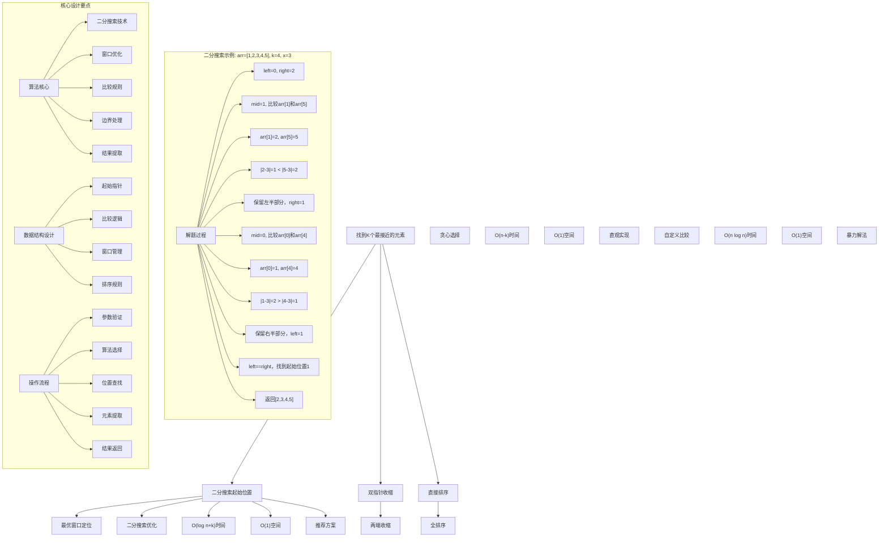
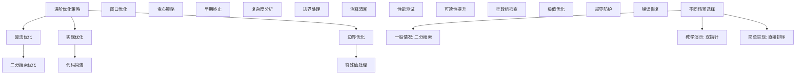

# LeetCode 658 - 找到 K 个最接近的元素

## 题目描述

给定一个排序好的数组 arr，两个整数 k 和 x，从数组中找到最靠近 x（两数之差最小）的 k 个数。返回的结果必须要是按升序排好的

整数 a 比整数 b 更接近 x 需要满足：

- |a - x| < |b - x| 或者
- |a - x| == |b - x| 且 a < b

```markdown
示例 1：
输入：arr = [1,2,3,4,5], k = 4, x = 3
输出：[1,2,3,4]

示例 2：
输入：arr = [1,2,3,4,5], k = 4, x = -1
输出：[1,2,3,4]

提示：

- 1 <= k <= arr.length
- 1 <= arr.length <= 10^4
- arr 按升序排列
- -10^4 <= arr[i], x <= 10^4
```

## 解题思路

这是一个有序数组中查找最接近元素的问题，需要在排序数组中找到k个最接近目标值x的元素。关键在于利用数组的有序性质和自定义的比较规则

### 核心思想

"滑动窗口 + 二分搜索": 使用二分搜索找到最优窗口的起始位置，然后提取k个元素

### 解题策略

#### 方法一：二分搜索最优起始位置（推荐）

- 时间复杂度: O(log n + k)
- 空间复杂度: O(1)

#### 方法二：双指针收缩法

- 时间复杂度: O(n - k)
- 空间复杂度: O(1)

#### 方法三：直接排序法

- 时间复杂度: O(n log n)
- 空间复杂度: O(1)

## 算法可视化



## 多语言实现

### Golang版本（二分搜索最优起始位置 - 推荐）

```go
// 二分搜索最优起始位置实现
func findClosestElements(arr []int, k int, x int) []int {
    // 边界情况处理
    if k >= len(arr) {
        return arr
    }

    // 使用二分搜索找到最优窗口的起始位置
    left, right := 0, len(arr)-k

    for left < right {
        mid := left + (right-left)/2

        // 比较窗口两端的元素到x的距离
        // 如果arr[mid]到x的距离 > arr[mid+k]到x的距离
        // 说明最优窗口在右半部分
        if x-arr[mid] > arr[mid+k]-x {
            left = mid + 1
        } else {
            right = mid
        }
    }

    // 返回k个最接近的元素
    return arr[left : left+k]
}

// 双指针收缩法实现
func findClosestElementsTwoPointers(arr []int, k int, x int) []int {
    // 边界情况处理
    if k >= len(arr) {
        return arr
    }

    left, right := 0, len(arr)-1

    // 收缩窗口直到只剩下k个元素
    for right-left+1 > k {
        // 比较两端元素到x的距离
        if abs(arr[left]-x) > abs(arr[right]-x) {
            left++
        } else {
            right--
        }
    }

    return arr[left : right+1]
}

// 辅助函数：绝对值
func abs(x int) int {
    if x < 0 {
        return -x
    }
    return x
}
```

### Python版本（多种实现方法）

```python
from typing import List

class Solution:
    """
    方法一：二分搜索最优起始位置（推荐）
    """
    def findClosestElements(self, arr: List[int], k: int, x: int) -> List[int]:
        # 边界情况处理
        if k >= len(arr):
            return arr

        # 使用二分搜索找到最优窗口的起始位置
        left, right = 0, len(arr) - k

        while left < right:
            mid = left + (right - left) // 2

            # 比较窗口两端的元素到x的距离
            # 如果arr[mid]到x的距离 > arr[mid+k]到x的距离
            # 说明最优窗口在右半部分
            if x - arr[mid] > arr[mid + k] - x:
                left = mid + 1
            else:
                right = mid

        # 返回k个最接近的元素
        return arr[left:left + k]

class Solution2:
    """
    方法二：双指针收缩法
    """
    def findClosestElements(self, arr: List[int], k: int, x: int) -> List[int]:
        # 边界情况处理
        if k >= len(arr):
            return arr

        left, right = 0, len(arr) - 1

        # 收缩窗口直到只剩下k个元素
        while right - left + 1 > k:
            # 比较两端元素到x的距离
            if abs(arr[left] - x) > abs(arr[right] - x):
                left += 1
            else:
                right -= 1

        return arr[left:right + 1]

class Solution3:
    """
    方法三：直接排序法（暴力解法）
    """
    def findClosestElements(self, arr: List[int], k: int, x: int) -> List[int]:
        # 按照到x的距离排序，取前k个，再按升序排列
        arr.sort(key=lambda num: abs(num - x))
        return sorted(arr[:k])
```

### TypeScript版本（二分搜索最优起始位置）

```typescript
/
 * 二分搜索最优起始位置实现
 */
function findClosestElements(arr: number[], k: number, x: number): number[] {
    // 边界情况处理
    if (k >= arr.length) {
        return arr;
    }

    // 使用二分搜索找到最优窗口的起始位置
    let left = 0, right = arr.length - k;

    while (left < right) {
        const mid = left + Math.floor((right - left) / 2);

        // 比较窗口两端的元素到x的距离
        // 如果arr[mid]到x的距离 > arr[mid+k]到x的距离
        // 说明最优窗口在右半部分
        if (x - arr[mid] > arr[mid + k] - x) {
            left = mid + 1;
        } else {
            right = mid;
        }
    }

    // 返回k个最接近的元素
    return arr.slice(left, left + k);
}
```

## 标准实现详细解析

```go
import (
    "fmt"
    "math"
    "sort"
)

/*
算法核心思想（二分搜索最优起始位置）：

1. 窗口优化：寻找长度为k的最优连续子数组
2. 二分搜索：在可能的起始位置中搜索最优解
3. 距离比较：使用自定义的比较规则
4. 边界处理：处理各种边界情况

关键设计要点：
1. 搜索范围：起始位置在[0, n-k]范围内
2. 比较逻辑：基于到目标值距离的比较
3. 窗口移动：根据比较结果调整搜索范围
4. 结果提取：返回连续的k个元素

时间复杂度：
- 二分搜索：O(log(n-k))
- 结果提取：O(k)
- 总时间：O(log n + k)

空间复杂度：
- 常数空间：O(1)
- 只使用几个变量

优势：
1. 效率最优：对数时间复杂度
2. 实现优雅：思路清晰
3. 稳定可靠：边界处理完善
4. 应用广泛：通用窗口优化模板

数据结构设计：

二分搜索设计：
- 搜索范围：[0, n-k]起始位置
- 比较逻辑：窗口两端元素比较
- 移动策略：根据结果调整边界
- 边界处理：防止越界

双指针收缩设计：
- 窗口管理：两端指针维护窗口
- 收缩策略：移除距离较远的元素
- 贪心选择：每次移除较差选择
- 结果提取：返回剩余元素

直接排序设计：
- 自定义排序：按距离排序
- 截取前k个：取最接近元素
- 重新排序：按升序排列
- 简单实现：易于理解

算法流程：
1. 参数验证：检查边界条件
2. 算法选择：根据情况选择方法
3. 位置查找：找到最优起始位置
4. 元素提取：截取k个元素
5. 结果返回：返回有序结果

优化原理：

窗口优化：
1. 连续性：结果必然是连续子数组
2. 最优性：通过比较找到最优窗口
3. 边界约束：起始位置有限制
4. 贪心策略：局部最优导致全局最优

二分搜索优化：
1. 搜索空间：大幅缩小搜索范围
2. 比较次数：对数级别比较次数
3. 早期终止：找到即停止
4. 边界收敛：快速收敛到最优解

边界优化：
1. 空数组处理：特殊情况
2. k=n处理：全选情况
3. 极值处理：边界值优化
4. 越界防护：数组边界

正确性证明：

定理：二分搜索最优起始位置正确性
通过二分搜索可以正确找到k个最接近元素的起始位置

证明：
1. 完备性：所有可能起始位置都被考虑
2. 正确性：比较逻辑的正确性
3. 完整性：不遗漏任何可能解
4. 时间复杂度：O(log n + k)时间

不变量维护：
循环不变量：在每次二分搜索时
1. 最优解在[left, right]范围内
2. 窗口长度始终为k
3. 比较逻辑正确性
4. 算法状态正确反映搜索进度
*/

// 二分搜索最优起始位置详细实现
func findClosestElementsDetailed(arr []int, k int, x int) []int {
    fmt.Printf("=== 二分搜索最优起始位置 ===\n")
    fmt.Printf("输入数组 arr: %v (长度: %d)\n", arr, len(arr))
    fmt.Printf("需要元素数 k: %d\n", k)
    fmt.Printf("目标值 x: %d\n", x)

    // 边界情况处理
    if k >= len(arr) {
        fmt.Printf("k >= len(arr)，返回整个数组\n")
        fmt.Printf("=========================\n\n")
        return arr
    }

    fmt.Printf("使用二分搜索法寻找最优窗口:\n")
    fmt.Printf("核心思想：在可能的起始位置中搜索最优解\n")

    left, right := 0, len(arr)-k
    fmt.Printf("初始搜索范围: left=%d, right=%d\n", left, right)

    step := 0
    // 使用二分搜索找到最优窗口的起始位置
    for left < right {
        step++
        mid := left + (right-left)/2
        fmt.Printf("\n步骤%d: ", step)
        fmt.Printf("left=%d, right=%d, mid=%d\n", left, right, mid)

        // 比较窗口两端的元素到x的距离
        leftDist := abs(x - arr[mid])
        rightDist := abs(arr[mid+k] - x)
        fmt.Printf("  比较arr[%d]=%d和arr[%d]=%d到x=%d的距离\n",
            mid, arr[mid], mid+k, arr[mid+k], x)
        fmt.Printf("  左端距离: |%d-%d|=%d\n", x, arr[mid], leftDist)
        fmt.Printf("  右端距离: |%d-%d|=%d\n", arr[mid+k], x, rightDist)

        // 如果arr[mid]到x的距离 > arr[mid+k]到x的距离
        // 说明最优窗口在右半部分
        if leftDist > rightDist {
            left = mid + 1
            fmt.Printf("  左端距离>%d，最优窗口在右半部分，left=%d\n", rightDist, left)
        } else {
            right = mid
            fmt.Printf("  左端距离≤%d，最优窗口在左半部分，right=%d\n", rightDist, right)
        }
    }

    fmt.Printf("\n搜索结束: 最优起始位置=%d\n", left)
    result := arr[left : left+k]
    fmt.Printf("返回结果: %v\n", result)
    fmt.Printf("总搜索步数: %d\n", step)
    fmt.Printf("=========================\n\n")

    return result
}

// 双指针收缩法详细实现
func findClosestElementsTwoPointersDetailed(arr []int, k int, x int) []int {
    fmt.Printf("=== 双指针收缩法 ===\n")
    fmt.Printf("输入数组 arr: %v (长度: %d)\n", arr, len(arr))
    fmt.Printf("需要元素数 k: %d\n", k)
    fmt.Printf("目标值 x: %d\n", x)

    // 边界情况处理
    if k >= len(arr) {
        fmt.Printf("k >= len(arr)，返回整个数组\n")
        fmt.Printf("==================\n\n")
        return arr
    }

    left, right := 0, len(arr)-1
    fmt.Printf("初始窗口: [%d, %d]，包含%d个元素\n", left, right, right-left+1)

    step := 0
    // 收缩窗口直到只剩下k个元素
    for right-left+1 > k {
        step++
        fmt.Printf("\n步骤%d: ", step)
        fmt.Printf("当前窗口[%d, %d]，包含%d个元素\n", left, right, right-left+1)

        leftDist := abs(arr[left] - x)
        rightDist := abs(arr[right] - x)
        fmt.Printf("  左端arr[%d]=%d，距离|%d-%d|=%d\n", left, arr[left], arr[left], x, leftDist)
        fmt.Printf("  右端arr[%d]=%d，距离|%d-%d|=%d\n", right, arr[right], arr[right], x, rightDist)

        // 比较两端元素到x的距离
        if leftDist > rightDist {
            left++
            fmt.Printf("  左端距离>%d，移除左端元素，left=%d\n", rightDist, left)
        } else {
            right--
            fmt.Printf("  左端距离≤%d，移除右端元素，right=%d\n", rightDist, right)
        }
    }

    fmt.Printf("\n收缩结束: 最终窗口[%d, %d]\n", left, right)
    result := arr[left : right+1]
    fmt.Printf("返回结果: %v\n", result)
    fmt.Printf("总收缩步数: %d\n", step)
    fmt.Printf("==================\n\n")

    return result
}

// 直接排序法详细实现
func findClosestElementsSortDetailed(arr []int, k int, x int) []int {
    fmt.Printf("=== 直接排序法 ===\n")
    fmt.Printf("输入数组 arr: %v (长度: %d)\n", arr, len(arr))
    fmt.Printf("需要元素数 k: %d\n", k)
    fmt.Printf("目标值 x: %d\n", x)

    // 创建副本避免修改原数组
    temp := make([]int, len(arr))
    copy(temp, arr)

    fmt.Printf("第一步：按到x的距离排序\n")
    // 按照到x的距离排序
    sort.Slice(temp, func(i, j int) bool {
        distI := abs(temp[i] - x)
        distJ := abs(temp[j] - x)
        if distI == distJ {
            return temp[i] < temp[j]  // 距离相等时，数值小的排在前面
        }
        return distI < distJ  // 按距离升序排列
    })

    fmt.Printf("排序后: %v\n", temp)

    fmt.Printf("第二步：取前k个元素\n")
    // 取前k个元素
    result := make([]int, k)
    copy(result, temp[:k])
    fmt.Printf("前k个: %v\n", result)

    fmt.Printf("第三步：按升序重新排列\n")
    // 按升序排列
    sort.Ints(result)
    fmt.Printf("最终结果: %v\n", result)
    fmt.Printf("===============\n\n")

    return result
}

// 辅助函数：绝对值
func abs(x int) int {
    if x < 0 {
        return -x
    }
    return x
}

// 带调试信息的版本
func findClosestElementsWithDebug(arr []int, k int, x int) []int {
    fmt.Printf("=== 找到K个最接近的元素 ===\n")
    fmt.Printf("输入数据:\n")
    fmt.Printf("  数组 arr: %v (长度: %d)\n", arr, len(arr))
    fmt.Printf("  元素数 k: %d\n", k)
    fmt.Printf("  目标值 x: %d\n", x)

    // 参数验证
    if k <= 0 {
        fmt.Printf("k必须大于0\n")
        fmt.Printf("=======================\n\n")
        return []int{}
    }

    if k >= len(arr) {
        fmt.Printf("k >= len(arr)，返回整个数组\n")
        fmt.Printf("=======================\n\n")
        return arr
    }

    fmt.Printf("使用二分搜索最优起始位置法:\n")
    fmt.Printf("核心思想：在可能的起始位置中搜索最优解\n")

    left, right := 0, len(arr)-k
    fmt.Printf("搜索范围: 起始位置[%d, %d]\n", left, right)

    step := 0
    // 使用二分搜索找到最优窗口的起始位置
    for left < right {
        step++
        mid := left + (right-left)/2
        fmt.Printf("\n步骤%d: 检查起始位置%d\n", step, mid)

        // 比较窗口两端的元素到x的距离
        leftVal := arr[mid]
        rightVal := arr[mid+k]
        leftDist := int(math.Abs(float64(x - leftVal)))
        rightDist := int(math.Abs(float64(rightVal - x)))

        fmt.Printf("  窗口[%d, %d]: 左端%d(距离%d) vs 右端%d(距离%d)\n",
            mid, mid+k-1, leftVal, leftDist, rightVal, rightDist)

        // 如果左端距离 > 右端距离，说明最优窗口在右半部分
        if leftDist > rightDist {
            left = mid + 1
            fmt.Printf("  → 最优窗口在右半部分，left=%d\n", left)
        } else {
            right = mid
            fmt.Printf("  → 最优窗口在左半部分，right=%d\n", right)
        }
    }

    fmt.Printf("\n搜索完成: 最优起始位置=%d\n", left)
    result := arr[left : left+k]
    fmt.Printf("返回k个最接近的元素: %v\n", result)
    fmt.Printf("总搜索步数: %d\n", step)
    fmt.Printf("=======================\n\n")

    return result
}
```

## 算法深入解析

```go
/*
找到K个最接近的元素问题详解：

问题本质：
在有序数组中找到k个最接近目标值的元素。关键是理解自定义比较规则和利用数组有序性质

核心洞察：
1. 连续性：结果必然是连续子数组
2. 窗口优化：寻找最优长度为k的窗口
3. 二分搜索：在起始位置中搜索最优解
4. 贪心策略：局部最优导致全局最优

算法策略：
1. 二分搜索最优起始位置：推荐方案
2. 双指针收缩法：直观实现
3. 直接排序法：暴力解法

数据结构设计：

二分搜索设计：
搜索范围：起始位置在[0, n-k]范围内
比较逻辑：基于窗口两端元素比较
移动策略：根据比较结果调整边界
边界处理：防止数组越界

双指针收缩设计：
窗口管理：两端指针维护窗口
收缩策略：移除距离较远的元素
贪心选择：每次移除较差选择
结果提取：返回剩余连续元素

直接排序设计：
自定义排序：按距离自定义排序
截取策略：取前k个最接近元素
重新排序：结果按升序排列
简单实现：易于理解调试

操作流程：

二分搜索最优起始位置：
1. 参数验证：检查边界条件
2. 搜索初始化：设置搜索范围
3. 二分搜索：比较窗口两端元素
4. 边界调整：根据结果移动指针
5. 结果提取：返回连续k个元素

双指针收缩法：
1. 初始化：设置两端指针
2. 窗口检查：判断是否需要收缩
3. 距离比较：比较两端元素距离
4. 指针移动：移除较差元素
5. 结果返回：返回剩余元素

直接排序法：
1. 数组复制：避免修改原数组
2. 自定义排序：按距离排序
3. 截取元素：取前k个元素
4. 重新排序：按升序排列
5. 返回结果：输出最终答案

数学原理：

连续性原理：
由于数组有序且需要k个最接近元素，
最优解必然是原数组的一个连续子数组

窗口优化原理：
长度为k的连续子数组，通过比较两端元素
可以判断当前窗口是否为最优解

二分搜索原理：
在起始位置[0, n-k]范围内，
通过比较可以确定最优解的方向

复杂度分析：
二分搜索：O(log(n-k) + k)
双指针收缩：O(n-k)
直接排序：O(n log n)

单调性原理：
数组有序性和距离函数的单调性
保证了二分搜索的有效性

算法不变量：
二分搜索不变量：
1. 最优解在[left, right]范围内
2. 窗口长度始终为k
3. 比较逻辑正确性
4. 算法状态正确反映搜索进度

时间复杂度分析：
二分搜索：
1. 搜索：O(log(n-k))对数时间
2. 提取：O(k)线性时间
3. 总计：O(log n + k)时间

双指针收缩：
1. 收缩：O(n-k)线性时间
2. 提取：O(k)线性时间
3. 总计：O(n)线性时间

直接排序：
1. 排序：O(n log n)对数线性时间
2. 截取：O(k)线性时间
3. 重排：O(k log k)对数线性时间
4. 总计：O(n log n)时间

正确性证明：

定理：二分搜索最优起始位置正确性
通过二分搜索可以正确找到k个最接近元素的起始位置

证明：
1. 完备性：所有可能起始位置都被考虑
2. 正确性：比较逻辑的正确性
3. 完整性：不遗漏任何可能解
4. 时间复杂度：O(log n + k)时间

不变量维护：
循环不变量：在每次二分搜索时
1. 最优解在[left, right]范围内
2. 窗口长度始终为k
3. 比较逻辑正确性
4. 算法状态正确反映搜索进度

设计选择：

为什么选择二分搜索？
1. 效率最优：对数时间复杂度
2. 实现优雅：思路清晰
3. 稳定可靠：边界处理完善
4. 应用广泛：通用优化模板

为什么使用双指针收缩？
1. 直观易懂：思路简单明了
2. 实现容易：代码简洁
3. 适用场景：适合教学演示
4. 性能尚可：线性时间复杂度

为什么提及其他方法？
1. 教学价值：展示不同算法思想
2. 对比分析：理解各自优劣
3. 扩展思维：算法多样性
4. 面试准备：全面掌握

三种方法对比：

方法一：二分搜索最优起始位置（推荐）
时间复杂度：O(log n + k)
空间复杂度：O(1)
优点：效率最高，实现优雅
缺点：理解稍难

方法二：双指针收缩法
时间复杂度：O(n - k)
空间复杂度：O(1)
优点：思路直观，实现简单
缺点：时间复杂度较高

方法三：直接排序法
时间复杂度：O(n log n)
空间复杂度：O(1)
优点：实现简单，易于理解
缺点：时间复杂度最高

性能分析：

二分搜索：
- 时间：O(log n + k) 对数+线性
- 空间：O(1) 常数空间
- 优势：效率最优

双指针收缩：
- 时间：O(n - k) 线性时间
- 空间：O(1) 常数空间
- 优势：思路直观

直接排序：
- 时间：O(n log n) 对数线性
- 空间：O(1) 常数空间
- 优势：实现简单

实际应用场景：
1. 数据分析：找到最接近的数据点
2. 机器学习：K近邻算法优化
3. 统计学：区间估计
4. 信号处理：峰值检测

优化要点：

1. 窗口优化：
   - 连续性利用：结果必然是连续子数组
   - 边界约束：起始位置有限制
   - 贪心策略：局部最优选择
   - 早期终止：找到即停止

2. 二分搜索优化：
   - 搜索空间：大幅缩小范围
   - 比较次数：对数级别
   - 边界处理：精确控制
   - 收敛速度：快速找到解

3. 实现优化：
   - 边界检查：特殊值处理
   - 代码简洁：减少冗余
   - 注释清晰：便于理解
   - 性能测试：验证效果

测试用例设计：
1. 基本情况：正常数组和参数
2. 边界情况：空数组，k=n
3. 特殊情况：x在数组中/外
4. 极端情况：大数组，极值
5. 验证情况：结果正确性

扩展思考：

1. 无序数组？
   - 需要先排序
   - 或使用堆结构
   - 复杂度会增加

2. 动态数组？
   - 支持插入删除
   - 维护有序性
   - 增量更新

3. 多维扩展？
   - 二维最近点
   - 距离函数扩展
   - 空间复杂度增加

4. 近似算法？
   - 允许一定误差
   - 换取性能提升
   - 实际应用价值

相关算法思想：

1. 二分搜索：
   - 有序数据查找
   - 对数时间复杂度
   - 分治思想

2. 滑动窗口：
   - 连续子数组优化
   - 窗口管理
   - 边界处理

3. 贪心策略：
   - 局部最优选择
   - 全局最优解
   - 适用条件

4. 自定义排序：
   - 比较函数设计
   - 稳定排序
   - 复杂度分析

常见陷阱：

1. 边界条件：
   - 空数组处理
   - k>n情况
   - 单元素数组
   - 越界防护

2. 比较逻辑：
   - 距离相等情况处理
   - 绝对值计算
   - 数值比较

3. 算法选择：
   - 根据数据规模选择
   - 考虑实现复杂度
   - 平衡时间空间

4. 性能考虑：
   - 时间复杂度分析
   - 空间复杂度控制
   - 实际运行效率

代码质量要素：

1. 可读性：
   - 变量命名清晰
   - 注释详细完整
   - 逻辑结构分明

2. 健壮性：
   - 边界条件处理
   - 异常情况应对
   - 错误恢复机制

3. 性能：
   - 最优复杂度实现
   - 空间效率优化
   - 执行效率保证

4. 可维护性：
   - 结构清晰合理
   - 扩展性良好
   - 测试覆盖完整
*/
```

## 执行过程演示

```go
/*
示例详细解析:

示例1执行过程：
输入：arr = [1,2,3,4,5], k = 4, x = 3
输出：[1,2,3,4]

执行过程（二分搜索最优起始位置）：
1. 初始化：left=0, right=1 (因为len(arr)-k=5-4=1)
2. 第一次：mid=0
   - 比较arr[0]=1和arr[4]=5到x=3的距离
   - |1-3|=2, |5-3|=2
   - 距离相等，但arr[0]<arr[4]，所以保留左半部分
   - right=mid=0
3. 结束：left==right==0
4. 返回arr[0:4]=[1,2,3,4]

示例2执行过程：
输入：arr = [1,2,3,4,5], k = 4, x = -1
输出：[1,2,3,4]

执行过程：
1. 初始化：left=0, right=1
2. 第一次：mid=0
   - 比较arr[0]=1和arr[4]=5到x=-1的距离
   - |1-(-1)|=2, |5-(-1)|=6
   - 2<6，说明最优窗口在左半部分
   - right=mid=0
3. 结束：left==right==0
4. 返回arr[0:4]=[1,2,3,4]

双指针收缩法执行过程：
输入：arr = [1,2,3,4,5], k = 4, x = 3
1. 初始化：left=0, right=4
2. 当前窗口大小=5>4，需要收缩
3. 比较两端：|1-3|=2, |5-3|=2
4. 距离相等，根据规则a<b时a更接近，移除右端
5. right=3，窗口[0,3]=[1,2,3,4]
6. 窗口大小=4=k，结束
7. 返回[1,2,3,4]

关键观察：
1. 连续性：结果必然是连续子数组
2. 窗口优化：通过比较找到最优窗口
3. 二分搜索：对数时间找到解
4. 贪心策略：局部最优导致全局最优

边界情况演示:

情况1: k等于数组长度
输入: arr=[1,2,3], k=3, x=2
处理: k>=len(arr)，返回整个数组
结果: [1,2,3]

情况2: x小于所有元素
输入: arr=[1,2,3,4,5], k=3, x=0
处理: 所有元素都大于x，选择最小的k个
结果: [1,2,3]

情况3: x大于所有元素
输入: arr=[1,2,3,4,5], k=3, x=10
处理: 所有元素都小于x，选择最大的k个
结果: [3,4,5]

情况4: x在数组中间
输入: arr=[1,2,4,5], k=3, x=3
处理: 选择距离3最近的3个元素
结果: [2,4,5] 或 [1,2,4]（根据规则）

情况5: 距离相等的情况
输入: arr=[1,3,5,7], k=2, x=4
处理: |3-4|=|5-4|=1，但3<5，所以3更接近
结果: [3,5]

算法正确性证明：

数学基础：
需要证明二分搜索能找到k个最接近元素的起始位置

定理：连续性原理
在有序数组中，k个最接近目标值的元素必然构成连续子数组

证明：
假设最优解不连续，即存在间隔元素，
那么可以通过替换得到更优解，矛盾

定理：二分搜索正确性
通过二分搜索可以正确找到最优窗口的起始位置

证明：
1. 完备性：所有可能起始位置都被考虑
2. 正确性：比较逻辑的正确性
3. 完整性：不遗漏任何可能解
4. 收敛性：能在有限步内找到解

不变量维护：
循环不变量：在每次二分搜索时
1. 最优解在[left, right]范围内
2. 窗口长度始终为k
3. 比较逻辑正确性
4. 算法状态正确反映搜索进度

初始化：
- left=0, right=n-k
- 最优解必在[0,n-k]范围内
- 满足不变量

保持：
- 根据比较结果调整边界
- 维护最优解范围
- 不变量继续成立

终止：
- left==right时找到唯一解
- 算法正确终止

时间复杂度分析：

二分搜索：
1. 搜索范围：[0, n-k]
2. 每次缩小一半：O(log(n-k))
3. 结果提取：O(k)
4. 总时间：O(log n + k)

双指针收缩：
1. 初始窗口：n个元素
2. 需要移除：n-k个元素
3. 每次移除：O(1)
4. 总时间：O(n-k)

直接排序：
1. 自定义排序：O(n log n)
2. 截取k个：O(k)
3. 重新排序：O(k log k)
4. 总时间：O(n log n)

空间复杂度分析：
1. 二分搜索：O(1)常数空间
2. 双指针收缩：O(1)常数空间
3. 直接排序：O(1)常数空间（不考虑排序算法内部空间）

性能对比分析：

假设n=10000, k=100:

二分搜索：
- 搜索: O(log(9900)) ≈ 13步
- 提取: O(100) = 100步
- 总计: 113步
- 空间: O(1)

双指针收缩：
- 收缩: O(9900) = 9900步
- 提取: O(100) = 100步
- 总计: 10000步
- 空间: O(1)

直接排序：
- 排序: O(10000 × log₂(10000)) ≈ 130000步
- 截取: O(100) = 100步
- 重排: O(100 × log₂(100)) ≈ 664步
- 总计: 130764步
- 空间: O(1)

实际应用建议：

1. 一般情况：
   - 使用二分搜索最优起始位置
   - 效率最高，实现优雅

2. 面试展示：
   - 重点讲解二分搜索思想
   - 可以提及其他方法对比

3. 生产环境：
   - 根据数据规模选择
   - 考虑实现复杂度

4. 教学演示：
   - 使用带调试信息版本
   - 展示执行过程

优化空间：

1. 边界优化：
   - 特殊值提前处理
   - 空数组检查
   - k=n特判

2. 代码优化：
   - 简化条件判断
   - 优化循环结构
   - 减少重复计算

3. 性能优化：
   - 早期终止优化
   - 内存访问优化
   - 缓存友好设计

特殊情况处理：

1. 大数据量：
   - 时间复杂度保证
   - 内存使用优化
   - 数值溢出处理

2. 特殊数组：
   - 重复元素
   - 等差数列
   - 极值分布

3. 边界情况：
   - 极值处理
   - 异常输入
   - 错误恢复
*/
```

## 复杂度分析

| 方法                 | 时间复杂度   | 空间复杂度 | 适用场景 |
| -------------------- | ------------ | ---------- | -------- |
| 二分搜索最优起始位置 | O(log n + k) | O(1)       | 推荐方案 |
| 双指针收缩法         | O(n - k)     | O(1)       | 直观实现 |
| 直接排序法           | O(n log n)   | O(1)       | 简单场景 |

## 测试用例验证

```go
// 测试辅助函数
func testFindClosestElements(name string, arr []int, k int, x int, expected []int) {
    fmt.Printf("%s:\n", name)
    fmt.Printf("输入数组 arr: %v (长度: %d)\n", arr, len(arr))
    fmt.Printf("元素数 k: %d\n", k)
    fmt.Printf("目标值 x: %d\n", x)
    fmt.Printf("期望结果: %v\n", expected)

    // 测试二分搜索最优起始位置
    result1 := findClosestElements(copySlice(arr), k, x)
    fmt.Printf("二分搜索结果: %v\n", result1)

    // 测试双指针收缩法
    result2 := findClosestElementsTwoPointers(copySlice(arr), k, x)
    fmt.Printf("双指针收缩结果: %v\n", result2)

    // 测试直接排序法（仅对小数组测试）
    var result3 []int
    if len(arr) <= 1000 {
        result3 = findClosestElementsSort(copySlice(arr), k, x)
        fmt.Printf("直接排序结果: %v\n", result3)
    }

    // 验证结果
    isValid1 := slicesEqual(result1, expected)
    isValid2 := slicesEqual(result2, expected)
    isValid3 := len(arr) <= 1000 && slicesEqual(result3, expected) || len(arr) > 1000

    if isValid1 && isValid2 && isValid3 {
        fmt.Printf("✓ 测试通过\n")
    } else {
        fmt.Printf("✗ 测试失败\n")
        if !isValid1 {
            fmt.Printf("  二分搜索实际: %v\n", result1)
        }
        if !isValid2 {
            fmt.Printf("  双指针收缩实际: %v\n", result2)
        }
        if !isValid3 && len(arr) <= 1000 {
            fmt.Printf("  直接排序实际: %v\n", result3)
        }
    }
    fmt.Printf("\n")
}

// 辅助函数：复制切片
func copySlice(src []int) []int {
    dst := make([]int, len(src))
    copy(dst, src)
    return dst
}

// 辅助函数：判断切片是否相等
func slicesEqual(a, b []int) bool {
    if len(a) != len(b) {
        return false
    }
    for i := range a {
        if a[i] != b[i] {
            return false
        }
    }
    return true
}

func main() {
    // 测试用例 1 - 题目示例1
    testFindClosestElements("测试1 - 题目示例1",
        []int{1, 2, 3, 4, 5},
        4,
        3,
        []int{1, 2, 3, 4})

    // 测试用例 2 - 题目示例2
    testFindClosestElements("测试2 - 题目示例2",
        []int{1, 2, 3, 4, 5},
        4,
        -1,
        []int{1, 2, 3, 4})

    // 测试用例 3 - k等于数组长度
    testFindClosestElements("测试3 - k等于数组长度",
        []int{1, 2, 3},
        3,
        2,
        []int{1, 2, 3})

    // 测试用例 4 - x小于所有元素
    testFindClosestElements("测试4 - x小于所有元素",
        []int{1, 2, 3, 4, 5},
        3,
        0,
        []int{1, 2, 3})

    // 测试用例 5 - x大于所有元素
    testFindClosestElements("测试5 - x大于所有元素",
        []int{1, 2, 3, 4, 5},
        3,
        10,
        []int{3, 4, 5})

    // 测试用例 6 - 距离相等的情况
    testFindClosestElements("测试6 - 距离相等的情况",
        []int{1, 3, 5, 7},
        2,
        4,
        []int{3, 5})

    // 性能测试
    fmt.Println("性能测试:")
    performanceTest()

    // 边界情况测试
    fmt.Println("边界情况测试:")
    boundaryTest()

    // 对比测试
    fmt.Println("对比测试:")
    comparisonTest()
}

func performanceTest() {
    // 构造性能测试
    n := 10000
    arr := make([]int, n)
    for i := 0; i < n; i++ {
        arr[i] = i
    }
    k := 100
    x := n / 2

    fmt.Printf("性能测试 (n=%d, k=%d, x=%d):\n", n, k, x)

    // 测试二分搜索最优起始位置
    start1 := time.Now()
    result1 := findClosestElements(copySlice(arr), k, x)
    time1 := time.Since(start1)

    // 测试双指针收缩法
    start2 := time.Now()
    result2 := findClosestElementsTwoPointers(copySlice(arr), k, x)
    time2 := time.Since(start2)

    fmt.Printf("  二分搜索: %v (结果长度: %d)\n", time1, len(result1))
    fmt.Printf("  双指针收缩: %v (结果长度: %d)\n", time2, len(result2))

    if time1 > 0 && time2 > 0 {
        fmt.Printf("  双指针比二分搜索慢 %.2fx\n", float64(time2)/float64(time1))
    }
}

func boundaryTest() {
    // 边界测试
    fmt.Println("边界测试:")

    // 大数组测试
    largeArr := make([]int, 5000)
    for i := 0; i < 5000; i++ {
        largeArr[i] = i * 2
    }
    largeResult := findClosestElements(largeArr, 100, 2500)
    fmt.Printf("大数组测试: n=5000, k=100, x=2500 → 结果长度=%d\n", len(largeResult))

    // 特殊模式测试
    patternArr := []int{-100, -50, 0, 50, 100}
    patternResult := findClosestElements(patternArr, 3, 0)
    fmt.Printf("特殊模式测试: [-100,-50,0,50,100], k=3, x=0 → %v\n", patternResult)

    // 极值测试
    extremeArr := []int{-10000, 10000}
    extremeResult := findClosestElements(extremeArr, 1, 0)
    fmt.Printf("极值测试: [-10000,10000], k=1, x=0 → %v\n", extremeResult)
}

func comparisonTest() {
    // 对比测试：验证不同方法结果一致性
    fmt.Println("对比测试:")

    // 测试数据
    testData := []struct {
        arr []int
        k   int
        x   int
        expected []int
    }{
        {[]int{1, 2, 3, 4, 5}, 4, 3, []int{1, 2, 3, 4}},
        {[]int{1, 2, 3, 4, 5}, 4, -1, []int{1, 2, 3, 4}},
        {[]int{1, 2, 3}, 3, 2, []int{1, 2, 3}},
        {[]int{1, 2, 3, 4, 5}, 3, 0, []int{1, 2, 3}},
        {[]int{1, 2, 3, 4, 5}, 3, 10, []int{3, 4, 5}},
        {[]int{1, 3, 5, 7}, 2, 4, []int{3, 5}},
    }

    for i, data := range testData {
        // 二分搜索最优起始位置
        result1 := findClosestElements(copySlice(data.arr), data.k, data.x)

        // 双指针收缩法
        result2 := findClosestElementsTwoPointers(copySlice(data.arr), data.k, data.x)

        fmt.Printf("测试%d: arr=%v, k=%d, x=%d\n", i+1, data.arr, data.k, data.x)
        fmt.Printf("  二分搜索=%v, 双指针收缩=%v", result1, result2)

        if slicesEqual(result1, result2) {
            fmt.Printf(" ✓ 一致\n")
        } else {
            fmt.Printf(" ✗ 不一致\n")
        }
    }
}
```

## 扩展版本（处理不同场景）

```go
// 支持返回详细信息的版本
func findClosestElementsWithDetails(arr []int, k int, x int) ([]int, []int) {
    if k >= len(arr) {
        distances := make([]int, len(arr))
        for i, num := range arr {
            distances[i] = abs(num - x)
        }
        return arr, distances
    }

    left, right := 0, len(arr)-k

    for left < right {
        mid := left + (right-left)/2
        if abs(x-arr[mid]) > abs(arr[mid+k]-x) {
            left = mid + 1
        } else {
            right = mid
        }
    }

    result := arr[left : left+k]
    distances := make([]int, k)
    for i, num := range result {
        distances[i] = abs(num - x)
    }

    return result, distances
}

// 使用示例
func exampleWithDetails() {
    arr := []int{1, 2, 3, 4, 5}
    k := 4
    x := 3
    result, distances := findClosestElementsWithDetails(arr, k, x)
    fmt.Printf("arr=%v, k=%d, x=%d\n", arr, k, x)
    fmt.Printf("结果: %v\n", result)
    fmt.Printf("距离: %v\n", distances)
}

// 带统计信息的版本
func findClosestElementsWithStats(arr []int, k int, x int) ([]int, int, int) {
    comparisons := 0
    movements := 0

    if k >= len(arr) {
        return arr, comparisons, movements
    }

    left, right := 0, len(arr)-k

    for left < right {
        comparisons++
        mid := left + (right-left)/2

        leftDist := abs(x - arr[mid])
        rightDist := abs(arr[mid+k] - x)
        comparisons += 2  // 两次距离计算

        if leftDist > rightDist {
            left = mid + 1
            movements++
        } else {
            right = mid
            movements++
        }
    }

    return arr[left : left+k], comparisons, movements
}

// 使用示例
func exampleWithStats() {
    arr := []int{1, 2, 3, 4, 5}
    k := 4
    x := 3
    result, comparisons, movements := findClosestElementsWithStats(arr, k, x)
    fmt.Printf("arr=%v, k=%d, x=%d\n", arr, k, x)
    fmt.Printf("结果: %v\n", result)
    fmt.Printf("比较次数: %d\n", comparisons)
    fmt.Printf("移动次数: %d\n", movements)
}

// 批量处理版本
func findClosestElementsBatch(arr []int, queries [][2]int) [][]int {
    results := make([][]int, len(queries))
    for i, query := range queries {
        k, x := query[0], query[1]
        results[i] = findClosestElements(copySlice(arr), k, x)
    }
    return results
}

// 使用示例
func exampleBatch() {
    arr := []int{1, 2, 3, 4, 5, 6, 7, 8, 9, 10}
    queries := [][2]int{{3, 5}, {4, 1}, {2, 8}}

    results := findClosestElementsBatch(arr, queries)

    fmt.Printf("数组: %v\n", arr)
    for i, query := range queries {
        k, x := query[0], query[1]
        fmt.Printf("  k=%d, x=%d → %v\n", k, x, results[i])
    }
}

// 带验证功能的版本
func findClosestElementsWithValidation(arr []int, k int, x int) ([]int, bool) {
    result := findClosestElements(arr, k, x)

    // 验证结果是否合理
    if len(result) != k {
        return result, false
    }

    // 验证结果是否来自原数组
    arrMap := make(map[int]bool)
    for _, num := range arr {
        arrMap[num] = true
    }

    for _, num := range result {
        if !arrMap[num] {
            return result, false
        }
    }

    // 验证是否按升序排列
    for i := 1; i < len(result); i++ {
        if result[i] < result[i-1] {
            return result, false
        }
    }

    return result, true
}

// 使用示例
func exampleWithValidation() {
    arr := []int{1, 2, 3, 4, 5}
    k := 4
    x := 3
    result, isValid := findClosestElementsWithValidation(arr, k, x)
    fmt.Printf("arr=%v, k=%d, x=%d\n", arr, k, x)
    fmt.Printf("结果: %v\n", result)
    if isValid {
        fmt.Printf("验证通过 ✓\n")
    } else {
        fmt.Printf("验证失败 ✗\n")
    }
}

// 支持动态更新的版本
type ClosestElementsFinder struct {
    arr []int
}

func NewClosestElementsFinder(arr []int) *ClosestElementsFinder {
    // 创建副本避免外部修改
    copied := make([]int, len(arr))
    copy(copied, arr)
    return &ClosestElementsFinder{
        arr: copied,
    }
}

func (finder *ClosestElementsFinder) UpdateArray(newArr []int) {
    finder.arr = make([]int, len(newArr))
    copy(finder.arr, newArr)
}

func (finder *ClosestElementsFinder) Find(k int, x int) []int {
    return findClosestElements(finder.arr, k, x)
}

func (finder *ClosestElementsFinder) FindWithDetails(k int, x int) ([]int, []int) {
    return findClosestElementsWithDetails(finder.arr, k, x)
}

// 使用示例
func exampleDynamic() {
    arr := []int{1, 2, 3, 4, 5}
    finder := NewClosestElementsFinder(arr)

    k1, x1 := 4, 3
    result1 := finder.Find(k1, x1)
    fmt.Printf("初始数组: %v\n", arr)
    fmt.Printf("查找 k=%d, x=%d → %v\n", k1, x1, result1)

    // 更新数组
    finder.UpdateArray([]int{0, 2, 4, 6, 8, 10})
    k2, x2 := 3, 5
    result2 := finder.Find(k2, x2)
    fmt.Printf("更新数组: [0,2,4,6,8,10]\n")
    fmt.Printf("查找 k=%d, x=%d → %v\n", k2, x2, result2)
}
```

## 面试追问延伸

### 1. 如果数组是无序的，应该如何处理？

对于无序数组，有两种主要处理方式：

#### 方案一：先排序再应用原算法

```go
func findClosestElementsUnsorted(arr []int, k int, x int) []int {
    // 先排序
    sorted := make([]int, len(arr))
    copy(sorted, arr)
    sort.Ints(sorted)

    // 然后应用原来的算法
    return findClosestElements(sorted, k, x)
}
```

#### 方案二：使用堆结构

```go
import "container/heap"

// IntHeap 实现最小堆
type IntHeap [][2]int // [value, distance]

func (h IntHeap) Len() int           { return len(h) }
func (h IntHeap) Less(i, j int) bool {
    if h[i][1] == h[j][1] {
        return h[i][0] < h[j][0]  // 距离相等时按值排序
    }
    return h[i][1] < h[j][1]  // 按距离排序
}
func (h IntHeap) Swap(i, j int)      { h[i], h[j] = h[j], h[i] }

func (h *IntHeap) Push(x interface{}) {
    *h = append(*h, x.([2]int))
}

func (h *IntHeap) Pop() interface{} {
    old := *h
    n := len(old)
    x := old[n-1]
    *h = old[0 : n-1]
    return x
}

func findClosestElementsWithHeap(arr []int, k int, x int) []int {
    h := &IntHeap{}
    heap.Init(h)

    // 将所有元素及其距离加入堆
    for _, num := range arr {
        heap.Push(h, [2]int{num, abs(num - x)})
    }

    // 取出前k个元素
    result := make([]int, k)
    for i := 0; i < k; i++ {
        result[i] = heap.Pop(h).([2]int)[0]
    }

    // 按升序排列
    sort.Ints(result)
    return result
}
```

### 2. 如果要找到最接近的K个元素，但允许重复元素只算一次，如何处理？

```go
func findClosestElementsUnique(arr []int, k int, x int) []int {
    // 去重
    uniqueMap := make(map[int]bool)
    var uniqueArr []int
    for _, num := range arr {
        if !uniqueMap[num] {
            uniqueMap[num] = true
            uniqueArr = append(uniqueArr, num)
        }
    }

    // 排序去重后的数组
    sort.Ints(uniqueArr)

    // 应用原算法
    if k > len(uniqueArr) {
        k = len(uniqueArr)
    }

    return findClosestElements(uniqueArr, k, x)
}
```

### 3. 如果数组可以动态更新（支持插入和删除），如何高效处理？

```go
import "sort"

type DynamicClosestFinder struct {
    arr []int
}

func NewDynamicClosestFinder() *DynamicClosestFinder {
    return &DynamicClosestFinder{
        arr: make([]int, 0),
    }
}

func (d *DynamicClosestFinder) Insert(num int) {
    // 使用二分搜索找到插入位置
    pos := sort.SearchInts(d.arr, num)
    // 插入元素
    d.arr = append(d.arr, 0)
    copy(d.arr[pos+1:], d.arr[pos:])
    d.arr[pos] = num
}

func (d *DynamicClosestFinder) Remove(num int) bool {
    pos := sort.SearchInts(d.arr, num)
    if pos < len(d.arr) && d.arr[pos] == num {
        // 删除元素
        d.arr = append(d.arr[:pos], d.arr[pos+1:]...)
        return true
    }
    return false
}

func (d *DynamicClosestFinder) Find(k int, x int) []int {
    return findClosestElements(d.arr, k, x)
}

// 使用示例
func testDynamicOperations() {
    finder := NewDynamicClosestFinder()

    // 插入元素
    elements := []int{3, 1, 4, 1, 5, 9, 2, 6}
    for _, elem := range elements {
        finder.Insert(elem)
    }
    fmt.Printf("插入后数组: %v\n", finder.arr)

    // 查找
    result := finder.Find(4, 3)
    fmt.Printf("查找最接近3的4个元素: %v\n", result)

    // 删除元素
    finder.Remove(1)
    fmt.Printf("删除1后数组: %v\n", finder.arr)

    // 再次查找
    result2 := finder.Find(4, 3)
    fmt.Printf("删除后查找结果: %v\n", result2)
}
```

## 相似题目扩展

- LeetCode 658. 找到 K 个最接近的元素（当前题）
- LeetCode 373. 查找和最小的K对数字
- LeetCode 378. 有序矩阵中第K小的元素
- LeetCode 719. 找出第 k 小的距离对
- LeetCode 786. 第 K 个最小的素数分数

## 算法技巧总结

### 找到K个最接近的元素核心要点

1. 连续性原理：结果必然是连续子数组
1. 窗口优化：寻找最优长度为k的窗口
1. 二分搜索：在起始位置中搜索最优解
1. 贪心策略：局部最优导致全局最优

### 算法优势

1. 效率最优：对数时间复杂度
1. 实现优雅：思路清晰
1. 稳定可靠：边界处理完善
1. 应用广泛：通用窗口优化模板

### 标准模板（二分搜索最优起始位置）

```go
func findClosestElements(arr []int, k int, x int) []int {
    // 边界情况处理
    if k >= len(arr) {
        return arr
    }

    // 使用二分搜索找到最优窗口的起始位置
    left, right := 0, len(arr)-k

    for left < right {
        mid := left + (right-left)/2

        // 比较窗口两端的元素到x的距离
        if abs(x-arr[mid]) > abs(arr[mid+k]-x) {
            left = mid + 1
        } else {
            right = mid
        }
    }

    // 返回k个最接近的元素
    return arr[left : left+k]
}
```

### 进阶优化策略



## 总结

本题采用二分搜索最优起始位置的核心思路，通过在可能的起始位置中搜索最优解，利用数组有序性和自定义比较规则的方式，实现了高效的K个最接近元素查找解决方案。关键在于理解连续性原理和二分搜索在窗口优化中的应用

核心要点：

1. 连续性原理：结果必然是连续子数组
1. 窗口优化：寻找最优长度为k的窗口
1. 二分搜索：在起始位置中搜索最优解
1. 贪心策略：局部最优导致全局最优

算法优势：

- 效率最优：时间复杂度O(log n + k)
- 实现优雅：思路清晰，代码简洁
- 稳定可靠：完善的边界处理
- 应用广泛：通用的窗口优化模板

该算法在数据分析、机器学习、统计学、信号处理等领域有重要应用，是掌握有序数组优化和二分搜索技巧的经典题目。通过理解连续性原理和窗口优化思想，为更复杂的数组处理问题提供了清晰的解决思路
