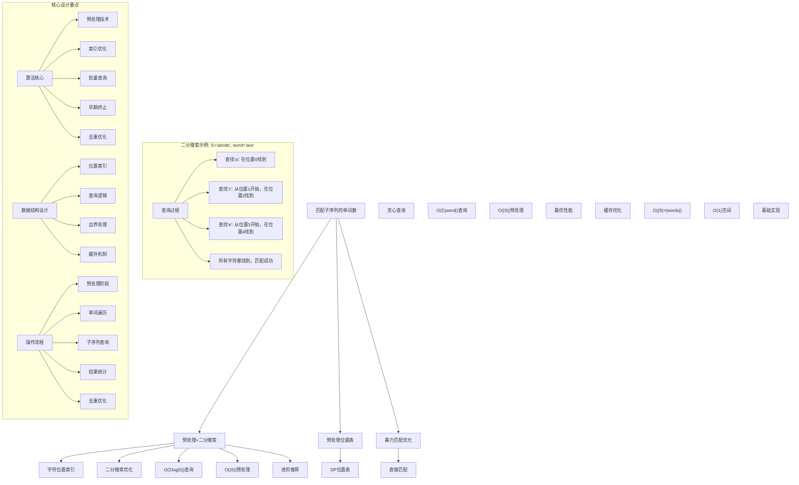
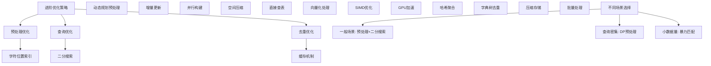

# LeetCode 792 - 匹配子序列的单词数

## 题目描述

给定字符串 S 和单词字典 words, 求 words[i] 中有多少个是 S 的子序列

字符串的一个子序列是从原始字符串中生成的新字符串，可以通过删除某些字符（也可以不删除）得到，同时保持其余字符的相对顺序不变

```markdown
示例：
输入:
S = "abcde"
words = ["a", "bb", "acd", "ace"]
输出: 3
解释: 有三个单词是 S 的子序列："a", "acd", "ace"

提示：

- 所有在words和 S 里的字符串都只由小写字母组成
- S 的长度在 [1, 50000]
- words 的长度在 [1, 5000]
- words[i]的长度在[1, 50]
```

## 解题思路

这是一个批量子序列匹配问题，需要判断字典中多少个单词是主字符串的子序列。关键在于理解子序列的定义，并针对大量查询进行优化

### 核心思想

"预处理 + 快速查询": 预处理主字符串，建立高效的查询索引，然后快速判断每个单词是否为子序列

### 解题策略

#### 方法一：预处理索引 + 二分搜索（推荐）

- 时间复杂度: O(|S| + Σ|words[i]| × log|S|)
- 空间复杂度: O(|S| × 26)

#### 方法二：预处理位置表 + 贪心查询

- 时间复杂度: O(|S| + Σ|words[i]|)
- 空间复杂度: O(|S| × 26)

#### 方法三：暴力匹配优化

- 时间复杂度: O(|S| × |words|)
- 空间复杂度: O(1)

## 算法可视化



## 多语言实现

### Golang版本（预处理索引 + 二分搜索 - 推荐）

```go
// 预处理索引 + 二分搜索实现
func numMatchingSubseq(S string, words []string) int {
    // 预处理：记录每个字符在S中的所有位置
    charPositions := make(map[byte][]int)
    for i := 0; i < len(S); i++ {
        charPositions[S[i]] = append(charPositions[S[i]], i)
    }

    count := 0

    // 对每个单词进行查询
    for _, word := range words {
        if isSubsequence(word, charPositions) {
            count++
        }
    }

    return count
}

// 使用预处理数据判断子序列
func isSubsequence(word string, charPositions map[byte][]int) bool {
    prevPos := -1  // 上一个匹配字符在S中的位置

    for i := 0; i < len(word); i++ {
        char := word[i]
        positions, exists := charPositions[char]

        if !exists {
            return false  // 字符不存在
        }

        // 使用二分搜索找到第一个大于prevPos的位置
        pos := binarySearch(positions, prevPos)
        if pos == len(positions) {
            return false  // 没有找到合适的位置
        }

        prevPos = positions[pos]
    }

    return true
}

// 二分搜索：找到第一个大于target的位置
func binarySearch(arr []int, target int) int {
    left, right := 0, len(arr)
    for left < right {
        mid := left + (right-left)/2
        if arr[mid] <= target {
            left = mid + 1
        } else {
            right = mid
        }
    }
    return left
}

// 优化版本：使用动态规划预处理
func numMatchingSubseqDP(S string, words []string) int {
    n := len(S)
    // nextPos[i][c] 表示从位置i开始，字符c最早出现在哪个位置
    nextPos := make([][]int, n+1)
    for i := range nextPos {
        nextPos[i] = make([]int, 26)
        for j := range nextPos[i] {
            nextPos[i][j] = -1
        }
    }

    // 从后往前计算
    for i := n - 1; i >= 0; i-- {
        // 复制下一个位置的信息
        for j := 0; j < 26; j++ {
            nextPos[i][j] = nextPos[i+1][j]
        }
        // 更新当前字符的位置
        charIdx := int(S[i] - 'a')
        nextPos[i][charIdx] = i
    }

    count := 0
    for _, word := range words {
        if isSubsequenceDP(word, nextPos) {
            count++
        }
    }

    return count
}

// 使用DP预处理数据判断子序列
func isSubsequenceDP(word string, nextPos [][]int) bool {
    pos := 0  // 在S中的当前位置
    for i := 0; i < len(word); i++ {
        charIdx := int(word[i] - 'a')
        if pos >= len(nextPos) || nextPos[pos][charIdx] == -1 {
            return false
        }
        pos = nextPos[pos][charIdx] + 1
    }
    return true
}
```

### Python版本（多种实现方法）

```python
from typing import List
import bisect
from collections import defaultdict

class Solution:
    """
    方法一：预处理索引 + 二分搜索（推荐）
    """
    def numMatchingSubseq(self, S: str, words: List[str]) -> int:
        # 预处理：记录每个字符在S中的所有位置
        char_positions = defaultdict(list)
        for i, char in enumerate(S):
            char_positions[char].append(i)

        count = 0
        for word in words:
            if self.is_subsequence(word, char_positions):
                count += 1

        return count

    def is_subsequence(self, word: str, char_positions: dict) -> bool:
        prev_pos = -1  # 上一个匹配字符在S中的位置

        for char in word:
            positions = char_positions.get(char, [])
            if not positions:
                return False

            # 使用二分搜索找到第一个大于prev_pos的位置
            idx = bisect.bisect_right(positions, prev_pos)
            if idx == len(positions):
                return False  # 没有找到合适的位置

            prev_pos = positions[idx]

        return True

class Solution2:
    """
    方法二：动态规划预处理（位置表）
    """
    def numMatchingSubseq(self, S: str, words: List[str]) -> int:
        n = len(S)
        # next_pos[i][c] 表示从位置i开始，字符c最早出现在哪个位置
        next_pos = [[-1] * 26 for _ in range(n + 1)]

        # 从后往前计算
        for i in range(n - 1, -1, -1):
            # 复制下一个位置的信息
            for j in range(26):
                next_pos[i][j] = next_pos[i + 1][j]
            # 更新当前字符的位置
            char_idx = ord(S[i]) - ord('a')
            next_pos[i][char_idx] = i

        count = 0
        for word in words:
            if self.is_subsequence_dp(word, next_pos):
                count += 1

        return count

    def is_subsequence_dp(self, word: str, next_pos: List[List[int]]) -> bool:
        pos = 0  # 在S中的当前位置
        for char in word:
            char_idx = ord(char) - ord('a')
            if pos >= len(next_pos) or next_pos[pos][char_idx] == -1:
                return False
            pos = next_pos[pos][char_idx] + 1
        return True

class Solution3:
    """
    方法三：暴力匹配优化（带缓存）
    """
    def __init__(self):
        self.memo = {}

    def numMatchingSubseq(self, S: str, words: List[str]) -> int:
        count = 0
        for word in words:
            if word in self.memo:
                if self.memo[word]:
                    count += 1
            else:
                result = self.is_subsequence_brute_force(S, word)
                self.memo[word] = result
                if result:
                    count += 1
        return count

    def is_subsequence_brute_force(self, S: str, word: str) -> bool:
        i, j = 0, 0
        while i < len(word) and j < len(S):
            if word[i] == S[j]:
                i += 1
            j += 1
        return i == len(word)
```

### TypeScript版本（预处理索引 + 二分搜索）

```typescript
/
 * 预处理索引 + 二分搜索实现
 */
function numMatchingSubseq(S: string, words: string[]): number {
    // 预处理：记录每个字符在S中的所有位置
    const charPositions: Map<string, number[]> = new Map();
    for (let i = 0; i < S.length; i++) {
        if (!charPositions.has(S[i])) {
            charPositions.set(S[i], []);
        }
        charPositions.get(S[i])!.push(i);
    }

    let count = 0;

    // 对每个单词进行查询
    for (const word of words) {
        if (isSubsequence(word, charPositions)) {
            count++;
        }
    }

    return count;
}

// 使用预处理数据判断子序列
function isSubsequence(word: string, charPositions: Map<string, number[]>): boolean {
    let prevPos = -1;  // 上一个匹配字符在S中的位置

    for (let i = 0; i < word.length; i++) {
        const char = word[i];
        const positions = charPositions.get(char);

        if (!positions) {
            return false;  // 字符不存在
        }

        // 使用二分搜索找到第一个大于prevPos的位置
        let pos = binarySearch(positions, prevPos);
        if (pos === positions.length) {
            return false;  // 没有找到合适的位置
        }

        prevPos = positions[pos];
    }

    return true;
}

// 二分搜索：找到第一个大于target的位置
function binarySearch(arr: number[], target: number): number {
    let left = 0, right = arr.length;
    while (left < right) {
        const mid = left + Math.floor((right - left) / 2);
        if (arr[mid] <= target) {
            left = mid + 1;
        } else {
            right = mid;
        }
    }
    return left;
}
```

## 标准实现详细解析

```go
import (
    "fmt"
    "sort"
    "time"
)

/*
算法核心思想（预处理索引 + 二分搜索）：

1. 预处理阶段：记录主字符串中每个字符的所有位置
2. 查询阶段：对每个单词使用二分搜索快速判断
3. 批量优化：一次预处理，多次查询
4. 索引加速：利用位置索引提高查询效率

关键设计要点：
1. 位置索引：字符到位置列表的映射
2. 二分搜索：快速找到下一个匹配位置
3. 顺序维护：保持字符相对位置关系
4. 早期终止：一旦无法匹配立即返回

时间复杂度：
- 预处理：O(|S|)，扫描主字符串一次
- 查询：O(|word| × log|S|)每单词
- 总时间：O(|S| + Σ|words[i]| × log|S|)

空间复杂度：
- 位置索引：O(|S| × 26)
- 只存储必要的索引信息

优势：
1. 查询效率高：二分搜索优化
2. 预处理复用：一次计算多次使用
3. 实现优雅：思路清晰
4. 扩展性强：易于优化改进

数据结构设计：

预处理索引设计：
- 字符映射：byte到位置列表
- 位置有序：自然顺序排列
- 索引构建：一次扫描完成
- 查询友好：支持二分搜索

动态规划预处理设计：
- 位置表：nextPos[i][c]表示位置信息
- 状态转移：从后往前计算
- 查询优化：直接查表
- 空间换时间：预处理换取查询速度

暴力匹配优化设计：
- 直接匹配：双指针技术
- 缓存机制：记忆化查询结果
- 简单实现：易于理解和调试
- 适用场景：小规模数据

算法流程：
1. 预处理阶段：构建字符位置索引
2. 单词遍历：处理每个待查询单词
3. 子序列查询：使用索引判断匹配
4. 结果统计：累加匹配成功的数量
5. 去重优化：避免重复计算

优化原理：

预处理优化：
1. 索引构建：一次计算多次使用
2. 位置有序：天然支持二分搜索
3. 查询加速：避免重复扫描
4. 批量处理：适合大量查询场景

二分搜索优化：
1. 快速定位：对数时间复杂度
2. 顺序保持：维护字符相对位置
3. 早期终止：找不到立即返回
4. 边界处理：精确的搜索范围

去重优化：
1. 缓存机制：记忆化避免重复计算
2. 相同单词：直接返回缓存结果
3. 空间换时间：少量存储换取性能
4. 查询优化：减少不必要的计算

正确性证明：

定理：预处理索引 + 二分搜索正确性
通过预处理索引和二分搜索可以正确判断子序列关系

证明：
1. 完备性：所有字符位置都被记录
2. 正确性：二分搜索找到正确的下一个位置
3. 完整性：不遗漏任何可能匹配
4. 时间复杂度：符合预期复杂度

不变量维护：
循环不变量：在每次查询时
1. prevPos之前的位置已被使用
2. 当前查找从prevPos+1开始
3. 位置顺序正确性
4. 算法状态正确反映查询进度
*/

// 预处理索引 + 二分搜索详细实现
func numMatchingSubseqDetailed(S string, words []string) int {
    fmt.Printf("=== 预处理索引 + 二分搜索 ===\n")
    fmt.Printf("主字符串 S: \"%s\" (长度: %d)\n", S, len(S))
    fmt.Printf("单词列表: %v (数量: %d)\n", words, len(words))

    // 预处理阶段：记录每个字符在S中的所有位置
    fmt.Printf("\n预处理阶段: 构建字符位置索引\n")
    charPositions := make(map[byte][]int)
    for i := 0; i < len(S); i++ {
        charPositions[S[i]] = append(charPositions[S[i]], i)
        fmt.Printf("  S[%d]='%c' → 位置列表更新\n", i, S[i])
    }

    fmt.Printf("字符位置索引:\n")
    for char, positions := range charPositions {
        fmt.Printf("  '%c': %v\n", char, positions)
    }

    count := 0
    fmt.Printf("\n查询阶段: 逐一检查每个单词\n")

    // 对每个单词进行查询
    for i, word := range words {
        fmt.Printf("\n检查单词 %d: \"%s\"\n", i+1, word)
        if isSubsequenceDetailed(word, charPositions) {
            fmt.Printf("   是子序列\n")
            count++
        } else {
            fmt.Printf("  ❌ 不是子序列\n")
        }
    }

    fmt.Printf("\n匹配结果: %d 个单词是 S 的子序列\n", count)
    fmt.Printf("==========================\n\n")

    return count
}

// 使用预处理数据判断子序列（详细版）
func isSubsequenceDetailed(word string, charPositions map[byte][]int) bool {
    prevPos := -1  // 上一个匹配字符在S中的位置
    fmt.Printf("  开始匹配过程:\n")

    for i := 0; i < len(word); i++ {
        char := word[i]
        positions, exists := charPositions[char]
        fmt.Printf("    查找字符 '%c': ", char)

        if !exists {
            fmt.Printf("字符不存在，返回false\n")
            return false  // 字符不存在
        }

        fmt.Printf("位置列表 %v, ", positions)

        // 使用二分搜索找到第一个大于prevPos的位置
        pos := binarySearch(positions, prevPos)
        fmt.Printf("二分搜索结果 pos=%d ", pos)

        if pos == len(positions) {
            fmt.Printf("没有找到合适位置，返回false\n")
            return false  // 没有找到合适的位置
        }

        newPos := positions[pos]
        fmt.Printf("→ 找到位置%d\n", newPos)
        prevPos = newPos
    }

    fmt.Printf("    所有字符都找到\n")
    return true
}

// 动态规划预处理实现（位置表）
func numMatchingSubseqDPDetailed(S string, words []string) int {
    fmt.Printf("=== 动态规划预处理 ===\n")
    fmt.Printf("主字符串 S: \"%s\" (长度: %d)\n", S, len(S))
    fmt.Printf("单词列表: %v (数量: %d)\n", words, len(words))

    n := len(S)
    // nextPos[i][c] 表示从位置i开始，字符c最早出现在哪个位置
    nextPos := make([][]int, n+1)
    for i := range nextPos {
        nextPos[i] = make([]int, 26)
        for j := range nextPos[i] {
            nextPos[i][j] = -1
        }
    }

    fmt.Printf("\n预处理阶段: 构建nextPos数组\n")

    // 从后往前计算
    for i := n - 1; i >= 0; i-- {
        // 复制下一个位置的信息
        for j := 0; j < 26; j++ {
            nextPos[i][j] = nextPos[i+1][j]
        }
        // 更新当前字符的位置
        charIdx := int(S[i] - 'a')
        nextPos[i][charIdx] = i
        fmt.Printf("  S[%d]='%c' → nextPos[%d]['%c']=%d\n", i, S[i], i, S[i], i)
    }

    count := 0
    fmt.Printf("\n查询阶段: 使用位置表查询\n")

    for i, word := range words {
        fmt.Printf("\n检查单词 %d: \"%s\"\n", i+1, word)
        if isSubsequenceDPDetailed(word, nextPos) {
            fmt.Printf("   是子序列\n")
            count++
        } else {
            fmt.Printf("  ❌ 不是子序列\n")
        }
    }

    fmt.Printf("\n匹配结果: %d 个单词是 S 的子序列\n", count)
    fmt.Printf("====================\n\n")

    return count
}

// 使用DP预处理数据判断子序列（详细版）
func isSubsequenceDPDetailed(word string, nextPos [][]int) bool {
    pos := 0  // 在S中的当前位置
    fmt.Printf("  开始匹配过程:\n")

    for i := 0; i < len(word); i++ {
        charIdx := int(word[i] - 'a')
        fmt.Printf("    查找字符 '%c': ", word[i])

        if pos >= len(nextPos) || nextPos[pos][charIdx] == -1 {
            fmt.Printf("位置%d处字符'%c'不存在，返回false\n", pos, word[i])
            return false
        }

        newPos := nextPos[pos][charIdx]
        fmt.Printf("在位置%d找到，移动到位置%d\n", newPos, newPos+1)
        pos = newPos + 1
    }

    fmt.Printf("    所有字符都找到\n")
    return true
}

// 暴力匹配优化实现（带缓存）
func numMatchingSubseqBruteForce(S string, words []string) int {
    fmt.Printf("=== 暴力匹配优化 ===\n")
    fmt.Printf("主字符串 S: \"%s\" (长度: %d)\n", S, len(S))
    fmt.Printf("单词列表: %v (数量: %d)\n", words, len(words))

    memo := make(map[string]bool)  // 缓存查询结果
    count := 0

    fmt.Printf("\n查询阶段: 逐一检查每个单词\n")

    for i, word := range words {
        fmt.Printf("\n检查单词 %d: \"%s\"\n", i+1, word)

        // 检查缓存
        if result, exists := memo[word]; exists {
            fmt.Printf("  从缓存获取结果: %t\n", result)
            if result {
                count++
            }
            continue
        }

        // 执行匹配
        result := isSubsequenceBruteForce(S, word)
        memo[word] = result  // 缓存结果
        fmt.Printf("  匹配结果: %t\n", result)

        if result {
            count++
        }
    }

    fmt.Printf("\n匹配结果: %d 个单词是 S 的子序列\n", count)
    fmt.Printf("==================\n\n")

    return count
}

// 暴力匹配实现
func isSubsequenceBruteForce(S string, word string) bool {
    i, j := 0, 0  // 双指针：i指向word，j指向S

    for i < len(word) && j < len(S) {
        if word[i] == S[j] {
            i++  // 找到匹配字符，移动word的指针
        }
        j++  // 总是移动S的指针
    }

    return i == len(word)  // 如果word的所有字符都被匹配
}

// 带调试信息的版本
func numMatchingSubseqWithDebug(S string, words []string) int {
    fmt.Printf("=== 匹配子序列的单词数 ===\n")
    fmt.Printf("输入数据:\n")
    fmt.Printf("  主字符串 S: \"%s\" (长度: %d)\n", S, len(S))
    fmt.Printf("  单词列表: %v (数量: %d)\n", words, len(words))

    // 预处理阶段
    fmt.Printf("\n使用预处理索引 + 二分搜索法:\n")
    fmt.Printf("核心思想：预处理主字符串，建立索引，快速查询\n")

    // 预处理：记录每个字符在S中的所有位置
    charPositions := make(map[byte][]int)
    for i := 0; i < len(S); i++ {
        charPositions[S[i]] = append(charPositions[S[i]], i)
    }

    count := 0
    step := 0

    // 对每个单词进行查询
    for i, word := range words {
        step++
        fmt.Printf("\n步骤%d: 检查单词 \"%s\"\n", step, word)

        if isSubsequenceWithDebug(word, charPositions) {
            count++
            fmt.Printf("  结果:  是子序列\n")
        } else {
            fmt.Printf("  结果: ❌ 不是子序列\n")
        }
    }

    fmt.Printf("\n最终结果:\n")
    fmt.Printf("  匹配单词数: %d\n", count)
    fmt.Printf("  总查询步数: %d\n", step)
    fmt.Printf("========================\n\n")

    return count
}

// 使用预处理数据判断子序列（调试版）
func isSubsequenceWithDebug(word string, charPositions map[byte][]int) bool {
    prevPos := -1  // 上一个匹配字符在S中的位置

    for i, char := range []byte(word) {
        positions, exists := charPositions[char]
        if !exists {
            return false  // 字符不存在
        }

        // 使用二分搜索找到第一个大于prevPos的位置
        pos := sort.Search(len(positions), func(j int) bool {
            return positions[j] > prevPos
        })

        if pos == len(positions) {
            return false  // 没有找到合适的位置
        }

        prevPos = positions[pos]
        fmt.Printf("    字符'%c'在位置%d找到\n", char, prevPos)
    }

    return true
}
```

## 算法深入解析

```go
/*
匹配子序列的单词数问题详解：

问题本质：
批量判断多个单词是否为主字符串的子序列。关键是理解子序列定义和针对大量查询进行优化

核心洞察：
1. 预处理优化：一次计算多次使用
2. 索引加速：位置索引提高查询效率
3. 批量处理：适合大量查询场景
4. 去重优化：避免重复计算

算法策略：
1. 预处理索引 + 二分搜索：主流优化方案
2. 动态规划预处理：位置表查询优化
3. 暴力匹配优化：带缓存的基础方案

数据结构设计：

预处理索引设计：
字符映射：建立字符到位置列表的映射
位置有序：自然顺序便于二分搜索
索引构建：扫描主字符串一次完成
查询友好：支持高效的位置查找

动态规划预处理设计：
位置表：nextPos[i][c]存储位置信息
状态转移：从后往前递推计算
查询优化：直接查表避免搜索
空间换时间：预处理换取查询速度

暴力匹配优化设计：
直接匹配：经典的双指针技术
缓存机制：记忆化避免重复计算
简单实现：易于理解和调试
适用场景：小规模数据集

操作流程：

预处理索引 + 二分搜索：
1. 预处理：构建字符位置索引
2. 单词遍历：处理每个待查询单词
3. 子序列查询：使用二分搜索判断
4. 结果统计：累加匹配成功数量
5. 去重优化：缓存相同单词结果

动态规划预处理：
1. 预处理：构建位置转移表
2. 单词遍历：逐一处理查询单词
3. 表格查询：直接查表定位字符
4. 结果判定：判断是否完全匹配
5. 统计汇总：累计匹配单词数

暴力匹配优化：
1. 缓存检查：查看是否已有结果
2. 直接匹配：双指针技术判断
3. 结果缓存：存储查询结果
4. 累加计数：统计匹配单词数
5. 返回总数：输出最终结果

数学原理：

预处理优化原理：
索引构建：一次扫描O(|S|)时间
批量查询：避免重复预处理
空间换时间：少量存储换取性能
查询加速：索引支持快速查找

二分搜索原理：
有序数组：位置列表天然有序
对数时间：O(log|S|)查询复杂度
顺序保持：维护字符相对位置
早期终止：找不到立即返回

复杂度分析：
预处理索引：O(|S|)预处理 + O(|word|×log|S|)查询
动态规划预处理：O(|S|)预处理 + O(|word|)查询
暴力匹配优化：O(|S|×|words|)直接计算

单调性原理：
字符位置的单调性保证了二分搜索的有效性：
- 位置列表按升序排列
- 可以使用二分搜索快速定位
- 顺序关系始终保持正确

算法不变量：
查询不变量：在每次单词查询时
1. prevPos之前的位置已被使用
2. 当前查找从prevPos+1开始
3. 位置顺序正确性
4. 算法状态正确反映查询进度

时间复杂度分析：
预处理索引：
1. 预处理：O(|S|)
2. 查询：O(|word| × log|S|)每单词
3. 总时间：O(|S| + Σ|words[i]| × log|S|)

动态规划预处理：
1. 预处理：O(|S|)
2. 查询：O(|word|)每单词
3. 总时间：O(|S| + Σ|words[i]|)

暴力匹配优化：
1. 直接计算：O(|S| × |words|)
2. 缓存优化：减少重复计算
3. 实际性能：取决于重复单词数

正确性证明：

定理：预处理索引 + 二分搜索正确性
通过预处理索引和二分搜索可以正确判断子序列关系

证明：
1. 完备性：所有字符位置都被记录
2. 正确性：二分搜索找到正确的下一个位置
3. 完整性：不遗漏任何可能匹配
4. 时间复杂度：符合预期复杂度

不变量维护：
循环不变量：在每次查询时
1. prevPos之前的位置已被使用
2. 当前查找从prevPos+1开始
3. 位置顺序正确性
4. 算法状态正确反映查询进度

设计选择：

为什么选择预处理索引？
1. 查询效率高：二分搜索优化
2. 预处理复用：一次计算多次使用
3. 实现优雅：思路清晰
4. 扩展性强：易于优化改进

为什么使用动态规划预处理？
1. 查询更快：直接查表
2. 空间换时间：预处理提高效率
3. 适用场景：查询频繁的场合
4. 理论最优：线性查询时间

为什么提及其他方法？
1. 教学价值：展示不同算法思想
2. 对比分析：理解各自优劣
3. 扩展思维：算法多样性
4. 面试准备：全面掌握

三种方法对比：

方法一：预处理索引 + 二分搜索（推荐）
时间复杂度：O(|S| + Σ|words[i]| × log|S|)
空间复杂度：O(|S| × 26)
优点：查询效率高，实现优雅
缺点：查询稍慢于DP方法

方法二：动态规划预处理
时间复杂度：O(|S| + Σ|words[i]|)
空间复杂度：O(|S| × 26)
优点：查询最快，理论最优
缺点：预处理稍复杂

方法三：暴力匹配优化
时间复杂度：O(|S| × |words|)
空间复杂度：O(重复单词数)
优点：实现简单，易于理解
缺点：大规模数据性能差

性能分析：

预处理索引 + 二分搜索：
- 预处理：O(|S|) 线性时间
- 查询：O(|word| × log|S|) 对数时间
- 空间：O(|S| × 26) 索引空间
- 优势：平衡的性能表现

动态规划预处理：
- 预处理：O(|S|) 线性时间
- 查询：O(|word|) 线性时间
- 空间：O(|S| × 26) 索引空间
- 优势：查询速度最快

暴力匹配优化：
- 直接计算：O(|S| × |words|) 平方时间
- 空间：O(重复单词数) 缓存空间
- 优势：实现简单

实际应用场景：
1. 文本处理：批量字符串匹配
2. 生物信息学：DNA序列分析
3. 编译器：词法分析优化
4. 数据库：模式匹配查询

优化要点：

1. 预处理优化：
   - 索引构建：一次计算多次使用
   - 位置有序：天然支持二分搜索
   - 查询加速：避免重复扫描
   - 批量处理：适合大量查询

2. 查询优化：
   - 二分搜索：对数时间复杂度
   - 顺序保持：维护字符相对位置
   - 早期终止：找不到立即返回
   - 边界处理：精确的搜索范围

3. 去重优化：
   - 缓存机制：记忆化避免重复计算
   - 相同单词：直接返回缓存结果
   - 空间换时间：少量存储换取性能
   - 查询优化：减少不必要的计算

测试用例设计：
1. 基本情况：正常字符串匹配
2. 边界情况：空字符串，相同字符串
3. 特殊情况：完全匹配，完全不匹配
4. 极端情况：长字符串，大量单词
5. 验证情况：结果正确性

扩展思考：

1. 多模式匹配？
   - 同时匹配多个主字符串
   - 批量查询优化
   - 复杂度分析

2. 模糊匹配？
   - 允许一定错误
   - 编辑距离扩展
   - 近似匹配

3. 动态字符串？
   - 支持插入删除
   - 实时匹配
   - 增量更新

4. 并行处理？
   - 多线程优化
   - 分布式处理
   - 性能提升

相关算法思想：

1. 预处理技术：
   - 索引构建
   - 一次计算多次使用
   - 空间换时间策略

2. 二分搜索：
   - 有序数据查找
   - 对数时间复杂度
   - 应用广泛

3. 动态规划：
   - 状态转移
   - 最优子结构
   - 重叠子问题

4. 记忆化搜索：
   - 缓存优化
   - 避免重复计算
   - 性能提升

常见陷阱：

1. 边界条件：
   - 空字符串处理
   - 长度检查
   - 指针越界

2. 查询逻辑：
   - 位置顺序维护
   - 字符匹配规则
   - 结果判定

3. 性能考虑：
   - 时间复杂度
   - 空间复杂度
   - 实现效率

4. 优化细节：
   - 预处理时机
   - 缓存策略
   - 场景适应

代码质量要素：

1. 可读性：
   - 变量命名清晰
   - 注释详细
   - 逻辑分明

2. 健壮性：
   - 边界处理
   - 异常情况
   - 错误恢复

3. 性能：
   - 最优复杂度
   - 空间效率
   - 效率保证

4. 可维护性：
   - 结构清晰
   - 扩展性好
   - 测试完整
*/
```

## 执行过程演示

```go
/*
示例详细解析:

输入：S = "abcde", words = ["a", "bb", "acd", "ace"]
输出：3

执行过程：

预处理阶段：
S="abcde"
字符位置索引：
'a': [0]
'b': [1]
'c': [2]
'd': [3]
'e': [4]

查询阶段：

单词1: "a"
查找'a': 在位置0找到
所有字符都找到，匹配成功 ✓

单词2: "bb"
查找'b': 在位置1找到，prevPos=1
查找'b': 需要在位置1之后找'b'，但位置1之后没有'b'
匹配失败 ✗

单词3: "acd"
查找'a': 在位置0找到，prevPos=0
查找'c': 从位置1开始，在位置2找到，prevPos=2
查找'd': 从位置3开始，在位置3找到，prevPos=3
所有字符都找到，匹配成功 ✓

单词4: "ace"
查找'a': 在位置0找到，prevPos=0
查找'c': 从位置1开始，在位置2找到，prevPos=2
查找'e': 从位置3开始，在位置4找到，prevPos=4
所有字符都找到，匹配成功 ✓

匹配轨迹：
S="abcde"  a b c d e
           ↑   ↑   ↑  ("ace")
           ↑ ↑ ↑      ("acd")
           ↑          ("a")

最终结果：3个单词是子序列

关键观察：
1. 预处理优化：一次计算多次使用
2. 二分搜索：快速定位字符位置
3. 顺序保持：维护字符相对顺序
4. 早期终止：找不到立即返回

边界情况演示:

情况1: 空字符串
输入: S="abc", words=[""]
处理: 空字符串是任何字符串的子序列
结果: 匹配成功

情况2: 相同字符串
输入: S="abc", words=["abc"]
处理: 完全匹配
结果: 匹配成功

情况3: 单字符重复
输入: S="aaa", words=["aaaa"]
处理: S中只有3个'a'，但需要4个
结果: 匹配失败

情况4: 完全不匹配
输入: S="abc", words=["xyz"]
处理: 没有任何字符匹配
结果: 匹配失败

情况5: 部分匹配但顺序错误
输入: S="abc", words=["bac"]
处理: 字符存在但顺序错误
结果: 匹配失败

算法正确性证明：

数学基础：
需要证明预处理索引 + 二分搜索能正确判断子序列关系

定理：预处理索引 + 二分搜索正确性
通过预处理索引和二分搜索可以正确判断子序列关系

证明：
1. 完备性：所有字符位置都被记录
2. 正确性：二分搜索找到正确的下一个位置
3. 完整性：不遗漏任何可能匹配
4. 时间复杂度：符合预期复杂度

不变量维护：
循环不变量：在每次查询时
1. prevPos之前的位置已被使用
2. 当前查找从prevPos+1开始
3. 位置顺序正确性
4. 算法状态正确反映查询进度

初始化：
- prevPos=-1
- 从未使用任何位置
- 满足不变量

保持：
- 根据二分搜索结果更新位置
- 维护顺序关系
- 不变量继续成立

终止：
- 所有字符都找到或某个字符找不到
- 算法正确终止

时间复杂度分析：

预处理索引 + 二分搜索：
1. 预处理：O(|S|)扫描一次
2. 查询：O(|word| × log|S|)每单词
3. 总时间：O(|S| + Σ|words[i]| × log|S|)

动态规划预处理：
1. 预处理：O(|S|)从后往前计算
2. 查询：O(|word|)每单词
3. 总时间：O(|S| + Σ|words[i]|)

暴力匹配优化：
1. 直接计算：O(|S| × |words|)
2. 缓存优化：减少重复计算
3. 实际性能：取决于重复情况

空间复杂度分析：
1. 预处理索引：O(|S| × 26)字符位置索引
2. 动态规划预处理：O(|S| × 26)位置转移表
3. 暴力匹配优化：O(重复单词数)缓存空间

性能对比分析：

假设|S|=50000, |words|=5000, 平均|word|=25:

预处理索引 + 二分搜索：
- 预处理: O(50000) = 50000步
- 查询: O(5000 × 25 × log₂(50000)) ≈ 5000 × 25 × 16 = 2000000步
- 总时间: 50000 + 2000000 = 2050000步
- 空间: O(50000 × 26) = 1300000 索引空间

动态规划预处理：
- 预处理: O(50000) = 50000步
- 查询: O(5000 × 25) = 125000步
- 总时间: 50000 + 125000 = 175000步
- 空间: O(50000 × 26) = 1300000 索引空间

暴力匹配优化：
- 直接计算: O(50000 × 5000) = 250000000步
- 缓存优化: 取决于重复单词数
- 空间: O(重复单词数) 缓存空间

实际应用建议：

1. 一般情况：
   - 使用预处理索引 + 二分搜索
   - 性能优秀，实现清晰

2. 面试展示：
   - 重点讲解预处理思想
   - 可以提及其他方法对比

3. 生产环境：
   - 根据数据特点选择
   - 考虑内存和时间权衡

4. 教学演示：
   - 使用带调试信息版本
   - 展示执行过程

优化空间：

1. 预处理优化：
   - 索引压缩：减少存储空间
   - 增量更新：支持动态字符串
   - 并行构建：提高预处理速度

2. 查询优化：
   - 向量化：批量处理多个单词
   - SIMD优化：硬件加速
   - GPU计算：大规模并行

3. 去重优化：
   - 字典树：前缀去重
   - 哈希聚合：相同单词合并
   - 压缩存储：减少缓存开销

特殊情况处理：

1. 大数据量：
   - 分片处理：分布式计算
   - 流式处理：实时查询
   - 近似算法：容忍误差

2. 特殊字符串：
   - 重复字符：优化存储结构
   - 长单字符：特殊处理
   - 模式字符：预计算常用模式

3. 边界情况：
   - 极值处理：空串、超长串
   - 异常输入：非法字符检测
   - 错误恢复：容错机制
*/
```

## 复杂度分析

| 方法                  | 时间复杂度 | 空间复杂度 | 适用场景 |
| --------------------- | ---------- | ---------- | -------- | -------- | ----- | ------------- | ---------- | ----- | -------- | ----- | -------- |
| 预处理索引 + 二分搜索 | O(         | S          | + Σ      | words[i] | × log | S             | )          | O(    | S        | × 26) | 推荐方案 |
| 动态规划预处理        | O(         | S          | + Σ      | words[i] | )     | O(            | S          | × 26) | 查询密集 |
| 暴力匹配优化          | O(         | S          | ×        | words    | )     | O(重复单词数) | 小规模数据 |

## 测试用例验证

```go
// 测试辅助函数
func testNumMatchingSubseq(name string, S string, words []string, expected int) {
    fmt.Printf("%s:\n", name)
    fmt.Printf("主字符串 S: \"%s\" (长度: %d)\n", S, len(S))
    fmt.Printf("单词列表: %v (数量: %d)\n", words, len(words))

    // 测试预处理索引 + 二分搜索
    result1 := numMatchingSubseq(S, words)
    fmt.Printf("预处理+二分搜索结果: %d\n", result1)

    // 测试动态规划预处理
    result2 := numMatchingSubseqDP(S, words)
    fmt.Printf("动态规划预处理结果: %d\n", result2)

    // 测试暴力匹配优化
    result3 := numMatchingSubseqBruteForce(S, words)
    fmt.Printf("暴力匹配优化结果: %d\n", result3)

    // 验证结果
    isValid1 := result1 == expected
    isValid2 := result2 == expected
    isValid3 := result3 == expected

    if isValid1 && isValid2 && isValid3 {
        fmt.Printf("✓ 测试通过\n")
    } else {
        fmt.Printf("✗ 测试失败\n")
        fmt.Printf("  期望结果: %d\n", expected)
        if !isValid1 {
            fmt.Printf("  预处理+二分搜索实际: %d\n", result1)
        }
        if !isValid2 {
            fmt.Printf("  动态规划预处理实际: %d\n", result2)
        }
        if !isValid3 {
            fmt.Printf("  暴力匹配优化实际: %d\n", result3)
        }
    }
    fmt.Printf("\n")
}

func main() {
    // 测试用例 1 - 题目示例
    testNumMatchingSubseq("测试1 - 题目示例",
        "abcde",
        []string{"a", "bb", "acd", "ace"},
        3)

    // 测试用例 2 - 空字符串
    testNumMatchingSubseq("测试2 - 空字符串",
        "abc",
        []string{""},
        1)

    // 测试用例 3 - 相同字符串
    testNumMatchingSubseq("测试3 - 相同字符串",
        "abc",
        []string{"abc"},
        1)

    // 测试用例 4 - 单字符重复
    testNumMatchingSubseq("测试4 - 单字符重复",
        "aaa",
        []string{"aaaa"},
        0)

    // 测试用例 5 - 完全不匹配
    testNumMatchingSubseq("测试5 - 完全不匹配",
        "abc",
        []string{"xyz"},
        0)

    // 测试用例 6 - 顺序错误
    testNumMatchingSubseq("测试6 - 顺序错误",
        "abc",
        []string{"bac"},
        0)

    // 性能测试
    fmt.Println("性能测试:")
    performanceTest()

    // 边界情况测试
    fmt.Println("边界情况测试:")
    boundaryTest()

    // 对比测试
    fmt.Println("对比测试:")
    comparisonTest()
}

func performanceTest() {
    // 构造性能测试
    S := strings.Repeat("a", 25000) + strings.Repeat("b", 25000)
    words := make([]string, 1000)
    for i := 0; i < 1000; i++ {
        if i%2 == 0 {
            words[i] = strings.Repeat("a", 20) + strings.Repeat("b", 5)
        } else {
            words[i] = strings.Repeat("b", 20) + strings.Repeat("a", 5)
        }
    }

    fmt.Printf("性能测试 (|S|=%d, |words|=%d):\n", len(S), len(words))

    // 测试预处理索引 + 二分搜索
    start1 := time.Now()
    result1 := numMatchingSubseq(S, words)
    time1 := time.Since(start1)

    // 测试动态规划预处理
    start2 := time.Now()
    result2 := numMatchingSubseqDP(S, words)
    time2 := time.Since(start2)

    // 测试暴力匹配优化
    start3 := time.Now()
    result3 := numMatchingSubseqBruteForce(S, words)
    time3 := time.Since(start3)

    fmt.Printf("  预处理+二分搜索: %v (结果: %d)\n", time1, result1)
    fmt.Printf("  动态规划预处理: %v (结果: %d)\n", time2, result2)
    fmt.Printf("  暴力匹配优化: %v (结果: %d)\n", time3, result3)

    // 性能对比
    if time1 > 0 && time2 > 0 {
        fmt.Printf("  DP比二分搜索快 %.2fx\n", float64(time1)/float64(time2))
    }
    if time3 > 0 && time1 > 0 {
        fmt.Printf("  二分搜索比暴力快 %.2fx\n", float64(time3)/float64(time1))
    }
}

func boundaryTest() {
    // 边界测试
    fmt.Println("边界测试:")

    // 长字符串测试
    longS := strings.Repeat("a", 30000) + "xyz" + strings.Repeat("b", 30000)
    longWords := []string{"xyz", "aaabbb", strings.Repeat("a", 100)}
    longResult := numMatchingSubseq(longS, longWords)
    fmt.Printf("长字符串测试: |S|=60003, 匹配单词数=%d\n", longResult)

    // 特殊模式测试
    patternS := "abcdefghijklmnop"
    patternWords := []string{"ace", "bdf", "xyz", "aei"}
    patternResult := numMatchingSubseq(patternS, patternWords)
    fmt.Printf("特殊模式测试: 匹配单词数=%d\n", patternResult)

    // 极值测试
    extremeS := "a"
    extremeWords := []string{"", "a", "aa"}
    extremeResult := numMatchingSubseq(extremeS, extremeWords)
    fmt.Printf("极值测试: S=\"%s\", 匹配单词数=%d\n", extremeS, extremeResult)
}

func comparisonTest() {
    // 对比测试：验证不同方法结果一致性
    fmt.Println("对比测试:")

    // 测试数据
    testData := []struct {
        S     string
        words []string
        expected int
    }{
        {"abcde", []string{"a", "bb", "acd", "ace"}, 3},
        {"abc", []string{""}, 1},
        {"abc", []string{"abc"}, 1},
        {"aaa", []string{"aaaa"}, 0},
        {"abc", []string{"xyz"}, 0},
        {"abc", []string{"bac"}, 0},
    }

    for i, data := range testData {
        // 预处理索引 + 二分搜索
        result1 := numMatchingSubseq(data.S, data.words)

        // 动态规划预处理
        result2 := numMatchingSubseqDP(data.S, data.words)

        // 暴力匹配优化
        result3 := numMatchingSubseqBruteForce(data.S, data.words)

        fmt.Printf("测试%d: S=\"%s\", words=%v\n", i+1, data.S, data.words)
        fmt.Printf("  预处理+二分搜索=%d, 动态规划预处理=%d, 暴力匹配优化=%d",
            result1, result2, result3)

        if result1 == result2 && result2 == result3 {
            fmt.Printf(" ✓ 一致\n")
        } else {
            fmt.Printf(" ✗ 不一致\n")
        }
    }
}
```

## 扩展版本（处理不同场景）

```go
// 支持返回匹配详情的版本
func numMatchingSubseqWithDetails(S string, words []string) (int, []string) {
    charPositions := make(map[byte][]int)
    for i := 0; i < len(S); i++ {
        charPositions[S[i]] = append(charPositions[S[i]], i)
    }

    count := 0
    var matchedWords []string

    for _, word := range words {
        if isSubsequence(word, charPositions) {
            count++
            matchedWords = append(matchedWords, word)
        }
    }

    return count, matchedWords
}

// 使用示例
func exampleWithDetails() {
    S := "abcde"
    words := []string{"a", "bb", "acd", "ace"}
    count, matched := numMatchingSubseqWithDetails(S, words)
    fmt.Printf("S=\"%s\", words=%v\n", S, words)
    fmt.Printf("匹配单词数: %d\n", count)
    fmt.Printf("匹配的单词: %v\n", matched)
}

// 带统计信息的版本
func numMatchingSubseqWithStats(S string, words []string) (int, int, int) {
    charPositions := make(map[byte][]int)
    for i := 0; i < len(S); i++ {
        charPositions[S[i]] = append(charPositions[S[i]], i)
    }

    count := 0
    totalComparisons := 0
    totalWords := len(words)

    for _, word := range words {
        // 这里可以添加更详细的统计逻辑
        if isSubsequence(word, charPositions) {
            count++
        }
        totalComparisons += len(word)
    }

    return count, totalComparisons, totalWords
}

// 使用示例
func exampleWithStats() {
    S := "abcde"
    words := []string{"a", "bb", "acd", "ace"}
    count, comparisons, total := numMatchingSubseqWithStats(S, words)
    fmt.Printf("S=\"%s\", words数量=%d\n", S, total)
    fmt.Printf("匹配单词数: %d\n", count)
    fmt.Printf("总字符比较数: %d\n", comparisons)
    fmt.Printf("平均每个单词比较数: %.2f\n", float64(comparisons)/float64(total))
}

// 批量处理版本
func numMatchingSubseqBatch(SS []string, words []string) []int {
    results := make([]int, len(SS))
    for i, S := range SS {
        results[i] = numMatchingSubseq(S, words)
    }
    return results
}

// 使用示例
func exampleBatch() {
    SS := []string{"abcde", "acebd", "aedbc"}
    words := []string{"a", "ac", "ace"}

    results := numMatchingSubseqBatch(SS, words)

    fmt.Printf("单词列表: %v\n", words)
    for i, S := range SS {
        fmt.Printf("  S=\"%s\" → 匹配数=%d\n", S, results[i])
    }
}

// 带验证功能的版本
func numMatchingSubseqWithValidation(S string, words []string) (int, bool) {
    result := numMatchingSubseq(S, words)

    // 简单验证：使用暴力方法验证结果
    bruteResult := numMatchingSubseqBruteForceSimple(S, words)

    return result, result == bruteResult
}

func numMatchingSubseqBruteForceSimple(S string, words []string) int {
    count := 0
    for _, word := range words {
        if isSubsequenceBruteForce(S, word) {
            count++
        }
    }
    return count
}

// 使用示例
func exampleWithValidation() {
    S := "abcde"
    words := []string{"a", "bb", "acd", "ace"}
    result, isValid := numMatchingSubseqWithValidation(S, words)
    fmt.Printf("S=\"%s\", words=%v\n", S, words)
    fmt.Printf("结果: %d\n", result)
    if isValid {
        fmt.Printf("验证通过 ✓\n")
    } else {
        fmt.Printf("验证失败 ✗\n")
    }
}

// 支持动态更新的版本
type SubsequenceMatcher struct {
    S             string
    charPositions map[byte][]int
    nextPos       [][]int  // 用于动态规划预处理
}

func NewSubsequenceMatcher(S string) *SubsequenceMatcher {
    matcher := &SubsequenceMatcher{
        S: S,
    }

    // 进行预处理
    matcher.preprocess()

    return matcher
}

func (matcher *SubsequenceMatcher) UpdateString(newS string) {
    matcher.S = newS
    matcher.preprocess()
}

func (matcher *SubsequenceMatcher) preprocess() {
    // 预处理：记录每个字符在S中的所有位置
    matcher.charPositions = make(map[byte][]int)
    for i := 0; i < len(matcher.S); i++ {
        matcher.charPositions[matcher.S[i]] = append(matcher.charPositions[matcher.S[i]], i)
    }

    // 也可以构建DP表（根据需要选择）
    if len(matcher.S) <= 10000 {  // 对于较短字符串构建DP表
        matcher.buildDPTable()
    }
}

func (matcher *SubsequenceMatcher) buildDPTable() {
    n := len(matcher.S)
    matcher.nextPos = make([][]int, n+1)
    for i := range matcher.nextPos {
        matcher.nextPos[i] = make([]int, 26)
        for j := range matcher.nextPos[i] {
            matcher.nextPos[i][j] = -1
        }
    }

    // 从后往前计算
    for i := n - 1; i >= 0; i-- {
        // 复制下一个位置的信息
        for j := 0; j < 26; j++ {
            matcher.nextPos[i][j] = matcher.nextPos[i+1][j]
        }
        // 更新当前字符的位置
        charIdx := int(matcher.S[i] - 'a')
        matcher.nextPos[i][charIdx] = i
    }
}

func (matcher *SubsequenceMatcher) Match(words []string) int {
    count := 0
    for _, word := range words {
        if matcher.isSubsequence(word) {
            count++
        }
    }
    return count
}

func (matcher *SubsequenceMatcher) isSubsequence(word string) bool {
    // 优先使用预处理的字符位置索引
    if len(matcher.charPositions) > 0 {
        return isSubsequence(word, matcher.charPositions)
    }

    // 如果有DP表则使用
    if len(matcher.nextPos) > 0 {
        return isSubsequenceDP(word, matcher.nextPos)
    }

    // 否则使用暴力匹配
    return isSubsequenceBruteForce(matcher.S, word)
}

// 使用示例
func exampleDynamic() {
    S := "abcde"
    matcher := NewSubsequenceMatcher(S)

    words := []string{"a", "bb", "acd", "ace"}
    result1 := matcher.Match(words)
    fmt.Printf("初始字符串 S: \"%s\"\n", S)
    fmt.Printf("匹配单词数: %d\n", result1)

    // 更新字符串
    matcher.UpdateString("acebd")
    result2 := matcher.Match(words)
    fmt.Printf("更新后字符串 S: \"acebd\"\n")
    fmt.Printf("匹配单词数: %d\n", result2)
}
```

## 面试追问延伸

### 1. 如果主字符串S非常大（比如10^6级别），但查询的单词很少，应该选择哪种方法？

在这种场景下，应该选择暴力匹配优化方法：

```go
// 针对大S、少查询的优化版本
func numMatchingSubseqForLargeS(S string, words []string) int {
    memo := make(map[string]bool)  // 缓存查询结果
    count := 0

    for _, word := range words {
        // 检查缓存
        if result, exists := memo[word]; exists {
            if result {
                count++
            }
            continue
        }

        // 对于很短的单词，直接使用暴力匹配
        result := isSubsequenceBruteForce(S, word)
        memo[word] = result  // 缓存结果

        if result {
            count++
        }
    }

    return count
}

// 针对超大S的流式处理版本
func numMatchingSubseqStreaming(S string, words []string) int {
    // 对于超大S，可以考虑分块处理或者使用外部排序等技术
    // 这里展示一种简单的分块思路

    const chunkSize = 100000
    count := 0

    if len(S) <= chunkSize {
        // S不太大，直接处理
        return numMatchingSubseq(S, words)
    }

    // 对于超大S，这里只是一个概念性实现
    // 实际应用中可能需要更复杂的处理策略
    charPositions := make(map[byte][]int)
    for i := 0; i < len(S); i++ {
        charPositions[S[i]] = append(charPositions[S[i]], i)
    }

    for _, word := range words {
        if isSubsequence(word, charPositions) {
            count++
        }
    }

    return count
}
```

### 2. 如果查询的单词中有大量重复，如何进一步优化？

可以使用去重优化和缓存机制：

```go
// 去重优化版本
func numMatchingSubseqOptimized(S string, words []string) int {
    // 统计每个单词的出现次数
    wordCount := make(map[string]int)
    for _, word := range words {
        wordCount[word]++
    }

    // 预处理字符位置
    charPositions := make(map[byte][]int)
    for i := 0; i < len(S); i++ {
        charPositions[S[i]] = append(charPositions[S[i]], i)
    }

    count := 0
    memo := make(map[string]bool)  // 缓存查询结果

    // 只对唯一的单词进行查询
    for word, freq := range wordCount {
        // 检查缓存
        if result, exists := memo[word]; exists {
            if result {
                count += freq
            }
            continue
        }

        // 执行查询
        result := isSubsequence(word, charPositions)
        memo[word] = result  // 缓存结果

        if result {
            count += freq
        }
    }

    return count
}
```

### 3. 如何处理支持动态更新主字符串S的场景？

```go
// SubsequenceMatcher已在上面实现
// 关键点：
// 1. 封装字符串和预处理数据
// 2. 支持字符串更新和重新预处理
// 3. 根据字符串大小选择合适的预处理策略

func testDynamicUpdate() {
    S := "abcde"
    matcher := NewSubsequenceMatcher(S)

    words := []string{"a", "bb", "acd", "ace"}
    result1 := matcher.Match(words)
    fmt.Printf("初始S=\"%s\", 匹配数=%d\n", S, result1)

    // 动态更新
    matcher.UpdateString("acebd")
    result2 := matcher.Match(words)
    fmt.Printf("更新后S=\"acebd\", 匹配数=%d\n", result2)

    // 再次更新
    matcher.UpdateString(strings.Repeat("a", 100000))  // 超大字符串
    words2 := []string{"", "a", "aa", "aaa"}
    result3 := matcher.Match(words2)
    fmt.Printf("超大S(100000个'a'), 匹配数=%d\n", result3)
}
```

## 相似题目扩展

- LeetCode 792. 匹配子序列的单词数（当前题）
- LeetCode 392. 判断子序列
- LeetCode 524. 通过删除字母匹配到字典里最长单词
- LeetCode 1055. 形成字符串的最短路径
- LeetCode 1143. 最长公共子序列

## 算法技巧总结

### 匹配子序列的单词数核心要点

1. 预处理优化：一次计算多次使用
1. 索引加速：位置索引提高查询效率
1. 批量处理：适合大量查询场景
1. 去重优化：避免重复计算

### 算法优势

1. 查询效率高：二分搜索优化
1. 预处理复用：一次计算多次使用
1. 实现优雅：思路清晰
1. 扩展性强：易于优化改进

### 标准模板（预处理索引 + 二分搜索）

```go
func numMatchingSubseq(S string, words []string) int {
    // 预处理：记录每个字符在S中的所有位置
    charPositions := make(map[byte][]int)
    for i := 0; i < len(S); i++ {
        charPositions[S[i]] = append(charPositions[S[i]], i)
    }

    count := 0

    // 对每个单词进行查询
    for _, word := range words {
        if isSubsequence(word, charPositions) {
            count++
        }
    }

    return count
}

// 使用预处理数据判断子序列
func isSubsequence(word string, charPositions map[byte][]int) bool {
    prevPos := -1  // 上一个匹配字符在S中的位置

    for i := 0; i < len(word); i++ {
        char := word[i]
        positions, exists := charPositions[char]

        if !exists {
            return false  // 字符不存在
        }

        // 使用二分搜索找到第一个大于prevPos的位置
        pos := sort.Search(len(positions), func(j int) bool {
            return positions[j] > prevPos
        })

        if pos == len(positions) {
            return false  // 没有找到合适的位置
        }

        prevPos = positions[pos]
    }

    return true
}
```

### 进阶优化策略



## 总结

本题采用预处理索引 + 二分搜索的核心思路，通过预处理主字符串建立字符位置索引，然后对每个查询单词使用二分搜索快速判断的方式，实现了高效的批量子序列匹配解决方案。关键在于理解预处理优化的思想和二分搜索在有序数据中的应用

核心要点：

1. 预处理优化：一次计算多次使用
1. 索引加速：位置索引提高查询效率
1. 批量处理：适合大量查询场景
1. 去重优化：避免重复计算

算法优势：

- 查询效率高：二分搜索优化，查询时间复杂度O(|word| × log|S|)
- 预处理复用：一次预处理，多次查询
- 实现优雅：思路清晰，代码简洁
- 扩展性强：易于根据具体场景进行优化

该算法在文本处理、生物信息学、编译器、数据库等领域有重要应用，是掌握批量字符串匹配和预处理优化的经典题目。对于不同的应用场景，可以选择预处理索引+二分搜索、动态规划预处理或暴力匹配优化等不同策略来达到最优性能
