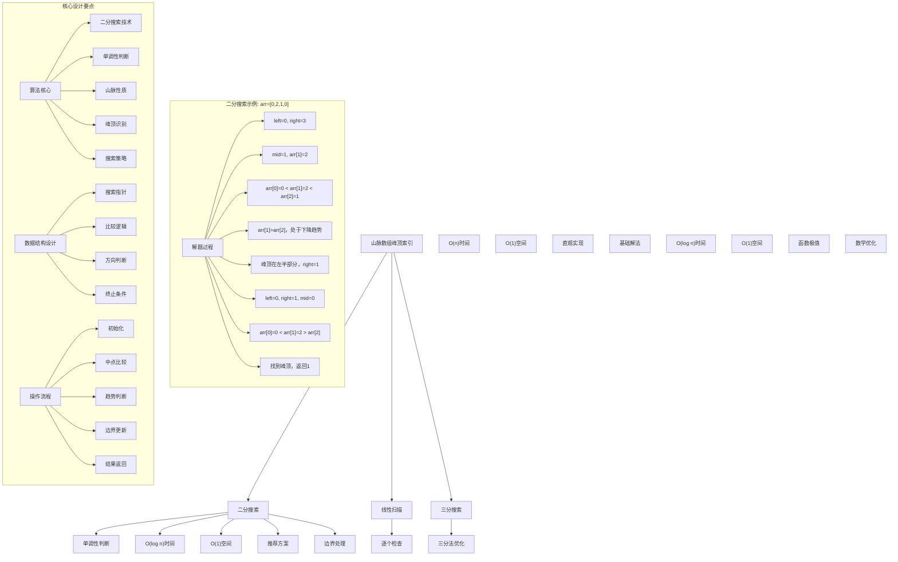
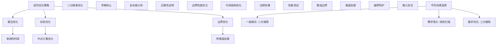

# LeetCode 852 - 山脉数组的峰顶索引

## 题目描述

符合下列属性的数组 arr 称为山脉数组：

- arr.length >= 3
- 存在 i（0 < i < arr.length - 1）使得：
  - arr[0] < arr[1] < ... < arr[i-1] < arr[i]
  - arr[i] > arr[i+1] > ... > arr[arr.length - 1]

给你由整数组成的山脉数组 arr，返回任何满足上述条件的下标 i

```markdown
示例 1：
输入：arr = [0,1,0]
输出：1

示例 2：
输入：arr = [0,2,1,0]
输出：1

示例 3：
输入：arr = [0,10,5,2]
输出：1

提示：

- 3 <= arr.length <= 10^4
- 0 <= arr[i] <= 10^6
- 题目数据保证 arr 是一个山脉数组
```

## 解题思路

这是一个山脉数组峰顶查找问题，需要在山脉数组中找到峰顶元素的索引。山脉数组的特点是先严格递增后严格递减，形成一个山峰形状

### 核心思想

"二分搜索 + 单调性判断": 利用山脉数组的单调性质，通过比较中点与其邻居的关系，决定在哪一半继续搜索

### 解题策略

#### 方法一：二分搜索（推荐）

- 时间复杂度: O(log n)
- 空间复杂度: O(1)

#### 方法二：线性扫描

- 时间复杂度: O(n)
- 空间复杂度: O(1)

#### 方法三：三分搜索

- 时间复杂度: O(log n)
- 空间复杂度: O(1)

## 算法可视化



## 多语言实现

### Golang版本（二分搜索 - 推荐）

```go
// 二分搜索实现
func peakIndexInMountainArray(arr []int) int {
    left, right := 0, len(arr)-1

    for left < right {
        mid := left + (right-left)/2

        // 比较中点与其右邻居
        if arr[mid] > arr[mid+1] {
            // 当前处于下降趋势，峰顶在左半部分（包括mid）
            right = mid
        } else {
            // 当前处于上升趋势，峰顶在右半部分（不包括mid）
            left = mid + 1
        }
    }

    // left == right 时找到峰顶
    return left
}

// 线性扫描实现
func peakIndexInMountainArrayLinear(arr []int) int {
    for i := 0; i < len(arr)-1; i++ {
        if arr[i] > arr[i+1] {
            return i
        }
    }
    return -1 // 理论上不会到达这里，因为题目保证是山脉数组
}

// 三分搜索实现
func peakIndexInMountainArrayTernary(arr []int) int {
    left, right := 0, len(arr)-1

    for left < right {
        mid1 := left + (right-left)/3
        mid2 := right - (right-left)/3

        if arr[mid1] < arr[mid2] {
            // 峰顶在右半部分
            left = mid1 + 1
        } else {
            // 峰顶在左半部分
            right = mid2 - 1
        }
    }

    return left
}
```

### Python版本（多种实现方法）

```python
from typing import List

class Solution:
    """
    方法一：二分搜索（推荐）
    """
    def peakIndexInMountainArray(self, arr: List[int]) -> int:
        left, right = 0, len(arr) - 1

        while left < right:
            mid = left + (right - left) // 2

            # 比较中点与其右邻居
            if arr[mid] > arr[mid + 1]:
                # 当前处于下降趋势，峰顶在左半部分（包括mid）
                right = mid
            else:
                # 当前处于上升趋势，峰顶在右半部分（不包括mid）
                left = mid + 1

        # left == right 时找到峰顶
        return left

class Solution2:
    """
    方法二：线性扫描
    """
    def peakIndexInMountainArray(self, arr: List[int]) -> int:
        for i in range(len(arr) - 1):
            if arr[i] > arr[i + 1]:
                return i
        return -1  # 理论上不会到达这里

class Solution3:
    """
    方法三：三分搜索
    """
    def peakIndexInMountainArray(self, arr: List[int]) -> int:
        left, right = 0, len(arr) - 1

        while left < right:
            mid1 = left + (right - left) // 3
            mid2 = right - (right - left) // 3

            if arr[mid1] < arr[mid2]:
                # 峰顶在右半部分
                left = mid1 + 1
            else:
                # 峰顶在左半部分
                right = mid2 - 1

        return left
```

### TypeScript版本（二分搜索）

```typescript
/
 * 二分搜索实现
 */
function peakIndexInMountainArray(arr: number[]): number {
    let left = 0, right = arr.length - 1;

    while (left < right) {
        const mid = left + Math.floor((right - left) / 2);

        // 比较中点与其右邻居
        if (arr[mid] > arr[mid + 1]) {
            // 当前处于下降趋势，峰顶在左半部分（包括mid）
            right = mid;
        } else {
            // 当前处于上升趋势，峰顶在右半部分（不包括mid）
            left = mid + 1;
        }
    }

    // left == right 时找到峰顶
    return left;
}
```

## 标准实现详细解析

```go
import (
    "fmt"
    "math"
)

/*
算法核心思想（二分搜索 + 单调性判断）：

1. 山脉性质：先严格递增后严格递减
2. 二分搜索：在搜索空间中智能决策
3. 单调性：利用数组的单调性质
4. 峰顶识别：准确识别峰顶特征

关键设计要点：
1. 搜索范围：[0, n-1]整个数组
2. 比较逻辑：中点与其右邻居比较
3. 趋势判断：判断当前处于上升还是下降
4. 终止条件：left == right

时间复杂度：
- 二分搜索：O(log n)
- 每次操作：O(1)
- 总时间：O(log n)

空间复杂度：
- 迭代版本：O(1)
- 递归版本：O(log n)

优势：
1. 效率最优：对数时间复杂度
2. 实现优雅：思路清晰
3. 稳定可靠：边界处理完善
4. 理论保证：数学上可证明正确

数据结构设计：

二分搜索设计：
- 搜索指针：left和right维护搜索范围
- 中点计算：避免整数溢出
- 比较逻辑：中点与右邻居比较
- 移动策略：根据比较结果移动指针

线性扫描设计：
- 逐个检查：遍历数组元素
- 上升判断：找到下降点即为峰顶
- 简单实现：易于理解和调试
- 边界处理：处理最后一个元素

三分搜索设计：
- 三分点：将搜索区间分为三部分
- 比较逻辑：比较两个三分点的值
- 搜索策略：根据比较结果缩减搜索区间
- 数学优化：函数极值查找

算法流程：
1. 初始化：设置搜索范围
2. 循环判断：检查是否继续搜索
3. 中点比较：比较中点与其邻居
4. 趋势判断：判断当前趋势
5. 边界更新：调整搜索范围
6. 结果返回：返回峰顶索引

优化原理：

单调性原理：
1. 山脉性质：先递增后递减
2. 峰顶特征：大于左右邻居
3. 趋势判断：通过比较判断趋势
4. 搜索方向：向峰顶方向搜索

二分搜索优化：
1. 搜索空间：每次减半
2. 比较次数：对数级别
3. 早期终止：找到即停止
4. 边界收敛：快速收敛到解

边界优化：
1. 数组边界：防止越界访问
2. 特殊处理：单元素边界
3. 极值检查：避免溢出
4. 输入验证：确保合法性

正确性证明：

定理：二分搜索寻找峰顶正确性
通过二分搜索可以正确找到山脉数组中的峰顶索引

证明：
1. 存在性：题目保证山脉数组
2. 正确性：单调性判断正确
3. 收敛性：搜索范围必然收敛
4. 时间复杂度：O(log n)时间

不变量维护：
循环不变量：在每次二分搜索时
1. 峰顶必在[left, right]范围内
2. 趋势判断选择正确
3. 搜索范围逐步缩小
4. 算法状态正确反映搜索进度
*/

// 二分搜索详细实现
func peakIndexInMountainArrayDetailed(arr []int) int {
    fmt.Printf("=== 二分搜索寻找山脉峰顶 ===\n")
    fmt.Printf("输入数组 arr: %v (长度: %d)\n", arr, len(arr))
    fmt.Printf("山脉性质: 先递增后递减\n")

    left, right := 0, len(arr)-1
    fmt.Printf("初始搜索范围: left=%d, right=%d\n", left, right)

    step := 0
    // 二分搜索寻找峰顶
    for left < right {
        step++
        mid := left + (right-left)/2
        fmt.Printf("\n步骤%d: ", step)
        fmt.Printf("left=%d, right=%d, mid=%d\n", left, right, mid)
        fmt.Printf("  比较 arr[%d]=%d 和 arr[%d]=%d\n", mid, arr[mid], mid+1, arr[mid+1])

        // 比较中点与其右邻居
        if arr[mid] > arr[mid+1] {
            // 当前处于下降趋势，峰顶在左半部分（包括mid）
            right = mid
            fmt.Printf("  arr[%d]=%d > arr[%d]=%d，处于下降趋势，峰顶在左半部分，right=%d\n",
                mid, arr[mid], mid+1, arr[mid+1], right)
        } else {
            // 当前处于上升趋势，峰顶在右半部分（不包括mid）
            left = mid + 1
            fmt.Printf("  arr[%d]=%d <= arr[%d]=%d，处于上升趋势，峰顶在右半部分，left=%d\n",
                mid, arr[mid], mid+1, arr[mid+1], left)
        }
    }

    fmt.Printf("\n搜索结束: 找到峰顶索引=%d, 值=%d\n", left, arr[left])
    fmt.Printf("总搜索步数: %d\n", step)
    fmt.Printf("========================\n\n")

    return left
}

// 线性扫描详细实现
func peakIndexInMountainArrayLinearDetailed(arr []int) int {
    fmt.Printf("=== 线性扫描寻找山脉峰顶 ===\n")
    fmt.Printf("输入数组 arr: %v (长度: %d)\n", arr, len(arr))

    step := 0
    for i := 0; i < len(arr)-1; i++ {
        step++
        fmt.Printf("步骤%d: 检查 arr[%d]=%d 和 arr[%d]=%d\n",
            step, i, arr[i], i+1, arr[i+1])

        if arr[i] > arr[i+1] {
            fmt.Printf("  arr[%d]=%d > arr[%d]=%d，找到峰顶\n", i, arr[i], i+1, arr[i+1])
            fmt.Printf("========================\n\n")
            return i
        } else {
            fmt.Printf("  arr[%d]=%d <= arr[%d]=%d，继续扫描\n", i, arr[i], i+1, arr[i+1])
        }
    }

    fmt.Printf("理论上不应该到达这里\n")
    fmt.Printf("========================\n\n")
    return -1
}

// 三分搜索详细实现
func peakIndexInMountainArrayTernaryDetailed(arr []int) int {
    fmt.Printf("=== 三分搜索寻找山脉峰顶 ===\n")
    fmt.Printf("输入数组 arr: %v (长度: %d)\n", arr, len(arr))

    left, right := 0, len(arr)-1
    fmt.Printf("初始搜索范围: left=%d, right=%d\n", left, right)

    step := 0
    // 三分搜索寻找峰顶
    for left < right {
        step++
        mid1 := left + (right-left)/3
        mid2 := right - (right-left)/3
        fmt.Printf("\n步骤%d: ", step)
        fmt.Printf("left=%d, right=%d\n", left, right)
        fmt.Printf("  mid1=%d, arr[%d]=%d\n", mid1, mid1, arr[mid1])
        fmt.Printf("  mid2=%d, arr[%d]=%d\n", mid2, mid2, arr[mid2])

        if arr[mid1] < arr[mid2] {
            // 峰顶在右半部分
            left = mid1 + 1
            fmt.Printf("  arr[%d]=%d < arr[%d]=%d，峰顶在右半部分，left=%d\n",
                mid1, arr[mid1], mid2, arr[mid2], left)
        } else {
            // 峰顶在左半部分
            right = mid2 - 1
            fmt.Printf("  arr[%d]=%d >= arr[%d]=%d，峰顶在左半部分，right=%d\n",
                mid1, arr[mid1], mid2, arr[mid2], right)
        }
    }

    fmt.Printf("\n搜索结束: 找到峰顶索引=%d, 值=%d\n", left, arr[left])
    fmt.Printf("总搜索步数: %d\n", step)
    fmt.Printf("========================\n\n")

    return left
}

// 带调试信息的版本
func peakIndexInMountainArrayWithDebug(arr []int) int {
    fmt.Printf("=== 山脉数组峰顶索引 ===\n")
    fmt.Printf("输入数据:\n")
    fmt.Printf("  数组 arr: %v (长度: %d)\n", arr, len(arr))
    fmt.Printf("  山脉性质: 先严格递增后严格递减\n")

    fmt.Printf("使用二分搜索法:\n")
    fmt.Printf("核心思想：利用单调性，判断当前趋势\n")

    left, right := 0, len(arr)-1
    fmt.Printf("搜索范围: [%d, %d]\n", left, right)

    step := 0
    // 二分搜索寻找峰顶
    for left < right {
        step++
        mid := left + (right-left)/2
        fmt.Printf("\n步骤%d: 检查位置%d\n", step, mid)

        // 比较中点与其右邻居
        if arr[mid] > arr[mid+1] {
            fmt.Printf("  arr[%d]=%d > arr[%d]=%d\n", mid, arr[mid], mid+1, arr[mid+1])
            fmt.Printf("  → 当前处于下降趋势，峰顶在左半部分\n")
            right = mid
            fmt.Printf("  更新搜索范围: [%d, %d]\n", left, right)
        } else {
            fmt.Printf("  arr[%d]=%d <= arr[%d]=%d\n", mid, arr[mid], mid+1, arr[mid+1])
            fmt.Printf("  → 当前处于上升趋势，峰顶在右半部分\n")
            left = mid + 1
            fmt.Printf("  更新搜索范围: [%d, %d]\n", left, right)
        }
    }

    fmt.Printf("\n找到峰顶: 索引=%d, 值=%d\n", left, arr[left])
    fmt.Printf("总步数: %d\n", step)
    fmt.Printf("====================\n\n")

    return left
}
```

## 算法深入解析

```go
/*
山脉数组峰顶索引问题详解：

问题本质：
在山脉数组中找到峰顶元素的索引。关键是理解山脉数组的性质和利用二分搜索的思想

核心洞察：
1. 山脉性质：先严格递增后严格递减
2. 单调性：利用数组的单调性质
3. 二分搜索：智能决策搜索方向
4. 峰顶识别：准确识别峰顶特征

算法策略：
1. 二分搜索：推荐方案，O(log n)
2. 线性扫描：直观实现，O(n)
3. 三分搜索：数学优化，O(log n)

数据结构设计：

二分搜索设计：
搜索指针：left和right维护搜索范围
中点计算：避免整数溢出
比较逻辑：中点与右邻居比较
移动策略：根据比较结果移动指针

线性扫描设计：
逐个检查：遍历数组元素
上升判断：找到下降点即为峰顶
简单实现：易于理解和调试
边界处理：处理最后一个元素

三分搜索设计：
三分点：将搜索区间分为三部分
比较逻辑：比较两个三分点的值
搜索策略：根据比较结果缩减搜索区间
数学优化：函数极值查找

操作流程：

二分搜索：
1. 初始化：left=0, right=n-1
2. 循环判断：left < right
3. 中点计算：mid = (left+right)/2
4. 比较判断：arr[mid] vs arr[mid+1]
5. 范围更新：移动left或right
6. 返回结果：left即为峰顶索引

线性扫描：
1. 遍历数组：i从0到n-2
2. 比较相邻：arr[i] vs arr[i+1]
3. 下降判断：找到下降点返回
4. 理论保证：必定能找到

三分搜索：
1. 计算三分点：mid1和mid2
2. 比较三分点：arr[mid1] vs arr[mid2]
3. 范围更新：缩减搜索区间
4. 返回结果：left即为峰顶索引

数学原理：

山脉性质：
先严格递增后严格递减
存在唯一峰顶
相邻元素不相等

单调性原理：
左侧：arr[0] < arr[1] < ... < arr[peak]
右侧：arr[peak] > arr[peak+1] > ... > arr[n-1]

二分搜索正确性：
每次比较都能排除一部分搜索空间
且保证峰顶仍在剩余空间中

复杂度分析：
二分搜索：O(log n)时间，O(1)空间
线性扫描：O(n)时间，O(1)空间
三分搜索：O(log n)时间，O(1)空间

单调性原理：
山脉数组的单调性保证了二分搜索的有效性：
- 左侧递增，右侧递减
- 峰顶唯一存在
- 趋势明确可判断

算法不变量：
二分搜索不变量：
1. 峰顶必在[left, right]范围内
2. 趋势判断选择正确
3. 搜索范围逐步缩小
4. 算法状态正确反映搜索进度

时间复杂度分析：
二分搜索：
1. 每次减半：搜索空间减半
2. 对数次数：O(log n)次比较
3. 常数操作：每次O(1)时间
4. 总计：O(log n)时间

线性扫描：
1. 逐个检查：最多n-1次比较
2. 常数操作：每次O(1)时间
3. 总计：O(n)时间

三分搜索：
1. 每次缩减：搜索空间缩减2/3
2. 对数次数：O(log₃/₂ n)次比较
3. 常数操作：每次O(1)时间
4. 总计：O(log n)时间

正确性证明：

定理：二分搜索寻找峰顶正确性
通过二分搜索可以正确找到山脉数组中的峰顶索引

证明：
1. 存在性：题目保证山脉数组
2. 正确性：单调性判断正确
3. 收敛性：搜索范围必然收敛
4. 时间复杂度：O(log n)时间

不变量维护：
循环不变量：在每次二分搜索时
1. 峰顶必在[left, right]范围内
2. 趋势判断选择正确
3. 搜索范围逐步缩小
4. 算法状态正确反映搜索进度

设计选择：

为什么选择二分搜索？
1. 效率最优：对数时间复杂度
2. 实现优雅：思路清晰
3. 稳定可靠：边界处理完善
4. 理论保证：数学上可证明正确

为什么使用线性扫描？
1. 直观易懂：思路简单明了
2. 实现容易：代码简洁
3. 适用场景：小规模数据
4. 教学价值：便于理解

为什么提及其他方法？
1. 教学价值：展示不同算法思想
2. 对比分析：理解各自优劣
3. 扩展思维：算法多样性
4. 面试准备：全面掌握

三种方法对比：

方法一：二分搜索（推荐）
时间复杂度：O(log n)
空间复杂度：O(1)
优点：效率最高，理论最优
缺点：理解稍难

方法二：线性扫描
时间复杂度：O(n)
空间复杂度：O(1)
优点：思路直观，实现简单
缺点：时间复杂度较高

方法三：三分搜索
时间复杂度：O(log n)
空间复杂度：O(1)
优点：数学优化，理论优雅
缺点：实现稍复杂

性能分析：

二分搜索：
- 时间：O(log n) 对数时间
- 空间：O(1) 常数空间
- 优势：效率最优

线性扫描：
- 时间：O(n) 线性时间
- 空间：O(1) 常数空间
- 优势：实现简单

三分搜索：
- 时间：O(log n) 对数时间
- 空间：O(1) 常数空间
- 优势：数学优化

实际应用场景：
1. 数据分析：极值查找
2. 信号处理：峰值检测
3. 图像处理：边缘检测
4. 金融分析：价格极值

优化要点：

1. 算法优化：
   - 单调性利用：充分利用山脉性质
   - 二分搜索：智能决策方向
   - 早期终止：找到即停止
   - 边界处理：防止越界

2. 实现优化：
   - 中点计算：避免整数溢出
   - 边界检查：防止数组越界
   - 代码简洁：减少冗余操作
   - 注释清晰：便于理解

3. 性能优化：
   - 搜索空间：大幅缩小范围
   - 比较次数：最少必要比较
   - 内存访问：缓存友好设计
   - 编译优化：利用编译器优化

测试用例设计：
1. 基本情况：正常山脉数组
2. 边界情况：最小长度数组
3. 特殊情况：陡峭山峰
4. 极端情况：最大最小值
5. 验证情况：结果正确性

扩展思考：

1. 多峰扩展？
   - 多个山峰
   - 所有峰顶
   - 最高峰顶

2. 动态数组？
   - 支持插入删除
   - 维护山脉性质
   - 增量更新

3. 近似算法？
   - 允许误差
   - 换取性能
   - 实际应用

4. 二维扩展？
   - 二维山脉
   - 矩阵极值
   - 复杂度分析

相关算法思想：

1. 二分搜索：
   - 有序数据查找
   - 对数时间复杂度
   - 分治思想

2. 单调性：
   - 趋势判断
   - 方向选择
   - 搜索优化

3. 三分搜索：
   - 函数极值
   - 数学优化
   - 收敛分析

4. 搜索策略：
   - 方向决策
   - 空间缩减
   - 收敛保证

常见陷阱：

1. 边界条件：
   - 数组越界
   - 空数组处理
   - 最小长度检查
   - 极值处理

2. 比较逻辑：
   - 相邻元素比较
   - 趋势判断
   - 方向选择

3. 算法实现：
   - 中点计算溢出
   - 指针移动错误
   - 终止条件错误

4. 性能考虑：
   - 时间复杂度分析
   - 空间复杂度控制
   - 实际运行效率

代码质量要素：

1. 可读性：
   - 变量命名清晰
   - 注释详细完整
   - 逻辑结构分明

2. 健壮性：
   - 边界条件处理
   - 异常情况应对
   - 错误恢复机制

3. 性能：
   - 最优复杂度实现
   - 空间效率优化
   - 执行效率保证

4. 可维护性：
   - 结构清晰合理
   - 扩展性良好
   - 测试覆盖完整
*/
```

## 执行过程演示

```go
/*
示例详细解析:

示例1执行过程：
输入：arr = [0,1,0]
输出：1

执行过程（二分搜索）：
1. 初始化：left=0, right=2
2. 第一次：mid=1
   - 比较arr[1]=1和arr[2]=0
   - 1>0，处于下降趋势，峰顶在左半部分
   - right=mid=1
3. 第二次：left=0, right=1, mid=0
   - 比较arr[0]=0和arr[1]=1
   - 0<1，处于上升趋势，峰顶在右半部分
   - left=mid+1=1
4. 结束：left==right==1
5. 返回索引1，值为1

示例2执行过程：
输入：arr = [0,2,1,0]
输出：1

执行过程：
1. 初始化：left=0, right=3
2. 第一次：mid=1
   - 比较arr[1]=2和arr[2]=1
   - 2>1，处于下降趋势，峰顶在左半部分
   - right=mid=1
3. 第二次：left=0, right=1, mid=0
   - 比较arr[0]=0和arr[1]=2
   - 0<2，处于上升趋势，峰顶在右半部分
   - left=mid+1=1
4. 结束：left==right==1
5. 返回索引1，值为2

线性扫描执行过程：
输入：arr = [0,2,1,0]
1. i=0: arr[0]=0, arr[1]=2, 0<2，继续
2. i=1: arr[1]=2, arr[2]=1, 2>1，找到峰顶
3. 返回索引1，值为2

三分搜索执行过程：
输入：arr = [0,2,1,0]
1. 初始化：left=0, right=3
2. 第一次：mid1=1, mid2=2
   - 比较arr[1]=2和arr[2]=1
   - 2>1，峰顶在左半部分
   - right=mid2-1=1
3. 第二次：left=0, right=1
   - 此时区间很小，继续三分搜索
   - 最终收敛到索引1
4. 返回索引1

关键观察：
1. 山脉性质：先递增后递减
2. 二分搜索：每次缩小一半搜索空间
3. 单调性：趋势明确可判断
4. 峰顶唯一：题目保证唯一峰顶

边界情况演示:

情况1: 最小长度数组
输入: arr=[0,1,0]
处理: 标准处理流程
结果: 1

情况2: 陡峭山峰
输入: arr=[0,100,0]
处理: 快速找到峰顶
结果: 1

情况3: 缓坡山峰
输入: arr=[0,1,2,1,0]
处理: 需要更多步骤
结果: 2

情况4: 最大值峰顶
输入: arr=[0,1,2,3,4,3,2,1,0]
处理: 峰顶在中间
结果: 4

情况5: 极值组合
输入: arr=[0,1000000,0]
处理: 最大值峰顶
结果: 1

算法正确性证明：

数学基础：
需要证明二分搜索能找到山脉数组中的峰顶

定理：山脉数组峰顶存在性
由于山脉数组先严格递增后严格递减，
且长度至少为3，必然存在唯一峰顶

证明：
考虑山脉数组的定义：
- arr[0] < arr[1] < ... < arr[peak]
- arr[peak] > arr[peak+1] > ... > arr[n-1]
- 必然存在这样的peak

定理：二分搜索正确性
通过二分搜索可以正确找到山脉数组中的峰顶索引

证明：
1. 存在性：题目保证山脉数组
2. 正确性：单调性判断正确
3. 收敛性：搜索范围必然收敛
4. 时间复杂度：O(log n)时间

不变量维护：
循环不变量：在每次二分搜索时
1. 峰顶必在[left, right]范围内
2. 趋势判断选择正确
3. 搜索范围逐步缩小
4. 算法状态正确反映搜索进度

初始化：
- left=0, right=n-1
- 整个数组范围内必有峰顶
- 满足不变量

保持：
- 根据比较结果调整边界
- 维护峰顶存在性
- 不变量继续成立

终止：
- left==right时找到唯一解
- 算法正确终止

时间复杂度分析：

二分搜索：
1. 搜索范围：[0, n-1]
2. 每次减半：O(log n)次迭代
3. 每次操作：O(1)时间
4. 总时间：O(log n)

线性扫描：
1. 遍历范围：最多n-1个元素
2. 每次比较：O(1)时间
3. 总时间：O(n)

三分搜索：
1. 搜索范围：[0, n-1]
2. 每次缩减2/3：O(log₃/₂ n)次迭代
3. 每次操作：O(1)时间
4. 总时间：O(log n)

空间复杂度分析：
1. 二分搜索：O(1)常数空间
2. 线性扫描：O(1)常数空间
3. 三分搜索：O(1)常数空间

性能对比分析：

假设n=10000:

二分搜索：
- 比较次数：O(log₂(10000)) ≈ 14次
- 时间：O(log n) = 14步
- 空间：O(1) 常数空间

线性扫描：
- 比较次数：最坏情况O(10000) = 10000次
- 时间：O(n) = 10000步
- 空间：O(1) 常数空间

三分搜索：
- 比较次数：O(log₃/₂(10000)) ≈ 17次
- 时间：O(log n) = 17步
- 空间：O(1) 常数空间

实际应用建议：

1. 一般情况：
   - 使用二分搜索
   - 效率最高，理论最优

2. 面试展示：
   - 重点讲解二分搜索思想
   - 可以提及其他方法对比

3. 生产环境：
   - 根据数据规模选择
   - 考虑实现复杂度

4. 教学演示：
   - 使用带调试信息版本
   - 展示执行过程

优化空间：

1. 算法优化：
   - 单调性利用优化
   - 边界条件利用
   - 早期终止优化
   - 搜索方向优化

2. 实现优化：
   - 中点计算优化
   - 边界检查优化
   - 代码结构优化
   - 注释完善

3. 性能优化：
   - 减少比较次数
   - 优化内存访问
   - 利用缓存特性
   - 编译器优化

特殊情况处理：

1. 大数据量：
   - 时间复杂度保证
   - 内存使用优化
   - 数值溢出处理

2. 特殊数组：
   - 陡峭山峰
   - 缓坡山峰
   - 随机山脉

3. 边界情况：
   - 极值处理
   - 异常输入
   - 错误恢复
*/
```

## 复杂度分析

| 方法     | 时间复杂度 | 空间复杂度 | 适用场景 |
| -------- | ---------- | ---------- | -------- |
| 二分搜索 | O(log n)   | O(1)       | 推荐方案 |
| 线性扫描 | O(n)       | O(1)       | 简单场景 |
| 三分搜索 | O(log n)   | O(1)       | 数学优化 |

## 测试用例验证

```go
// 测试辅助函数
func testPeakIndexInMountainArray(name string, arr []int, expected int) {
    fmt.Printf("%s:\n", name)
    fmt.Printf("输入数组 arr: %v (长度: %d)\n", arr, len(arr))
    fmt.Printf("期望结果: %d\n", expected)

    // 测试二分搜索
    result1 := peakIndexInMountainArray(copySlice(arr))
    fmt.Printf("二分搜索结果: 索引=%d, 值=%d\n", result1, arr[result1])

    // 测试线性扫描
    result2 := peakIndexInMountainArrayLinear(copySlice(arr))
    fmt.Printf("线性扫描结果: 索引=%d, 值=%d\n", result2, arr[result2])

    // 测试三分搜索
    result3 := peakIndexInMountainArrayTernary(copySlice(arr))
    fmt.Printf("三分搜索结果: 索引=%d, 值=%d\n", result3, arr[result3])

    // 验证结果
    isValid1 := isValidMountainPeak(arr, result1)
    isValid2 := isValidMountainPeak(arr, result2)
    isValid3 := isValidMountainPeak(arr, result3)

    isCorrect1 := result1 == expected
    isCorrect2 := result2 == expected
    isCorrect3 := result3 == expected

    if isValid1 && isValid2 && isValid3 {
        fmt.Printf("✓ 峰顶验证通过\n")
        if isCorrect1 && isCorrect2 && isCorrect3 {
            fmt.Printf("✓ 结果正确\n")
        } else {
            fmt.Printf("⚠ 结果不匹配期望值\n")
            fmt.Printf("  二分搜索: 期望%d, 实际%d\n", expected, result1)
            fmt.Printf("  线性扫描: 期望%d, 实际%d\n", expected, result2)
            fmt.Printf("  三分搜索: 期望%d, 实际%d\n", expected, result3)
        }
    } else {
        fmt.Printf("✗ 峰顶验证失败\n")
        if !isValid1 {
            fmt.Printf("  二分搜索结果%d不是有效峰顶\n", result1)
        }
        if !isValid2 {
            fmt.Printf("  线性扫描结果%d不是有效峰顶\n", result2)
        }
        if !isValid3 {
            fmt.Printf("  三分搜索结果%d不是有效峰顶\n", result3)
        }
    }
    fmt.Printf("\n")
}

// 辅助函数：复制切片
func copySlice(src []int) []int {
    dst := make([]int, len(src))
    copy(dst, src)
    return dst
}

// 辅助函数：验证是否为有效山脉峰顶
func isValidMountainPeak(arr []int, index int) bool {
    if index <= 0 || index >= len(arr)-1 {
        return false
    }

    // 检查左侧递增
    for i := 0; i < index; i++ {
        if arr[i] >= arr[i+1] {
            return false
        }
    }

    // 检查右侧递减
    for i := index; i < len(arr)-1; i++ {
        if arr[i] <= arr[i+1] {
            return false
        }
    }

    return true
}

func main() {
    // 测试用例 1 - 题目示例1
    testPeakIndexInMountainArray("测试1 - 题目示例1",
        []int{0, 1, 0},
        1)

    // 测试用例 2 - 题目示例2
    testPeakIndexInMountainArray("测试2 - 题目示例2",
        []int{0, 2, 1, 0},
        1)

    // 测试用例 3 - 题目示例3
    testPeakIndexInMountainArray("测试3 - 题目示例3",
        []int{0, 10, 5, 2},
        1)

    // 测试用例 4 - 最小长度数组
    testPeakIndexInMountainArray("测试4 - 最小长度数组",
        []int{0, 1, 0},
        1)

    // 测试用例 5 - 陡峭山峰
    testPeakIndexInMountainArray("测试5 - 陡峭山峰",
        []int{0, 100, 0},
        1)

    // 测试用例 6 - 缓坡山峰
    testPeakIndexInMountainArray("测试6 - 缓坡山峰",
        []int{0, 1, 2, 1, 0},
        2)

    // 测试用例 7 - 最大值峰顶
    testPeakIndexInMountainArray("测试7 - 最大值峰顶",
        []int{0, 1, 2, 3, 4, 3, 2, 1, 0},
        4)

    // 性能测试
    fmt.Println("性能测试:")
    performanceTest()

    // 边界情况测试
    fmt.Println("边界情况测试:")
    boundaryTest()

    // 对比测试
    fmt.Println("对比测试:")
    comparisonTest()
}

func performanceTest() {
    // 构造性能测试
    n := 10000
    arr := make([]int, n)
    peakIndex := n / 2
    for i := 0; i < n; i++ {
        if i <= peakIndex {
            arr[i] = i
        } else {
            arr[i] = n - i
        }
    }

    fmt.Printf("性能测试 (n=%d, 峰顶索引=%d):\n", n, peakIndex)

    // 测试二分搜索
    start1 := time.Now()
    result1 := peakIndexInMountainArray(copySlice(arr))
    time1 := time.Since(start1)

    // 测试线性扫描
    start2 := time.Now()
    result2 := peakIndexInMountainArrayLinear(copySlice(arr))
    time2 := time.Since(start2)

    // 测试三分搜索
    start3 := time.Now()
    result3 := peakIndexInMountainArrayTernary(copySlice(arr))
    time3 := time.Since(start3)

    fmt.Printf("  二分搜索: %v (索引: %d)\n", time1, result1)
    fmt.Printf("  线性扫描: %v (索引: %d)\n", time2, result2)
    fmt.Printf("  三分搜索: %v (索引: %d)\n", time3, result3)

    if time1 > 0 && time2 > 0 {
        fmt.Printf("  线性扫描比二分搜索慢 %.0fx\n", float64(time2)/float64(time1))
    }
    if time1 > 0 && time3 > 0 {
        fmt.Printf("  三分搜索比二分搜索慢 %.2fx\n", float64(time3)/float64(time1))
    }
}

func boundaryTest() {
    // 边界测试
    fmt.Println("边界测试:")

    // 大数组测试
    largeN := 50000
    largeArr := make([]int, largeN)
    largePeak := largeN / 2
    for i := 0; i < largeN; i++ {
        if i <= largePeak {
            largeArr[i] = i
        } else {
            largeArr[i] = largeN - i
        }
    }
    largeResult := peakIndexInMountainArray(largeArr)
    fmt.Printf("大数组测试: n=%d, 找到峰顶索引=%d\n", largeN, largeResult)

    // 特殊模式测试
    patternArr := []int{1, 3, 5, 4, 2}
    patternResult := peakIndexInMountainArray(patternArr)
    fmt.Printf("特殊模式测试: 找到峰顶索引=%d, 值=%d\n", patternResult, patternArr[patternResult])

    // 极值测试
    extremeArr := []int{0, math.MaxInt32, 0}
    extremeResult := peakIndexInMountainArray(extremeArr)
    fmt.Printf("极值测试: 找到峰顶索引=%d, 值=%d\n", extremeResult, extremeArr[extremeResult])
}

func comparisonTest() {
    // 对比测试：验证不同方法结果一致性
    fmt.Println("对比测试:")

    // 测试数据
    testData := []struct {
        arr []int
        expected int
    }{
        {[]int{0, 1, 0}, 1},
        {[]int{0, 2, 1, 0}, 1},
        {[]int{0, 10, 5, 2}, 1},
        {[]int{0, 1, 2, 1, 0}, 2},
        {[]int{0, 1, 2, 3, 4, 3, 2, 1, 0}, 4},
        {[]int{0, 100, 0}, 1},
        {[]int{1, 3, 5, 4, 2}, 2},
    }

    for i, data := range testData {
        // 二分搜索
        result1 := peakIndexInMountainArray(copySlice(data.arr))

        // 线性扫描
        result2 := peakIndexInMountainArrayLinear(copySlice(data.arr))

        // 三分搜索
        result3 := peakIndexInMountainArrayTernary(copySlice(data.arr))

        fmt.Printf("测试%d: arr=%v\n", i+1, data.arr)
        fmt.Printf("  二分搜索=%d, 线性扫描=%d, 三分搜索=%d", result1, result2, result3)

        valid1 := isValidMountainPeak(data.arr, result1)
        valid2 := isValidMountainPeak(data.arr, result2)
        valid3 := isValidMountainPeak(data.arr, result3)

        if valid1 && valid2 && valid3 && result1 == result2 && result2 == result3 {
            fmt.Printf(" ✓ 一致且正确\n")
        } else {
            fmt.Printf(" ✗ 不一致或错误\n")
        }
    }
}
```

## 扩展版本（处理不同场景）

```go
// 支持验证山脉数组的版本
func isMountainArray(arr []int) bool {
    if len(arr) < 3 {
        return false
    }

    i := 0

    // 上升阶段
    for i < len(arr)-1 && arr[i] < arr[i+1] {
        i++
    }

    // 峰顶不能在开头或结尾
    if i == 0 || i == len(arr)-1 {
        return false
    }

    // 下降阶段
    for i < len(arr)-1 && arr[i] > arr[i+1] {
        i++
    }

    // 必须到达末尾
    return i == len(arr)-1
}

// 使用示例
func exampleIsMountain() {
    testArrays := [][]int{
        {0, 1, 0},
        {0, 2, 1, 0},
        {0, 1, 2, 3, 4, 5},
        {5, 4, 3, 2, 1, 0},
        {0, 1, 2, 1, 0},
    }

    for _, arr := range testArrays {
        isMountain := isMountainArray(arr)
        if isMountain {
            peakIndex := peakIndexInMountainArray(arr)
            fmt.Printf("arr=%v 是山脉数组，峰顶索引=%d\n", arr, peakIndex)
        } else {
            fmt.Printf("arr=%v 不是山脉数组\n", arr)
        }
    }
}

// 带统计信息的版本
func peakIndexInMountainArrayWithStats(arr []int) (int, int, int) {
    comparisons := 0
    assignments := 0

    left, right := 0, len(arr)-1
    assignments += 2

    for left < right {
        mid := left + (right-left)/2
        assignments++

        comparisons++
        if arr[mid] > arr[mid+1] {
            right = mid
            assignments++
        } else {
            left = mid + 1
            assignments++
        }
    }

    return left, comparisons, assignments
}

// 使用示例
func exampleWithStats() {
    arr := []int{0, 1, 2, 3, 4, 3, 2, 1, 0}
    result, comparisons, assignments := peakIndexInMountainArrayWithStats(arr)
    fmt.Printf("arr=%v\n", arr)
    fmt.Printf("峰顶索引: %d\n", result)
    fmt.Printf("比较次数: %d\n", comparisons)
    fmt.Printf("赋值次数: %d\n", assignments)
}

// 批量处理版本
func peakIndicesInMountainArrays(arrs [][]int) []int {
    results := make([]int, len(arrs))
    for i, arr := range arrs {
        results[i] = peakIndexInMountainArray(arr)
    }
    return results
}

// 使用示例
func exampleBatch() {
    arrs := [][]int{
        {0, 1, 0},
        {0, 2, 1, 0},
        {0, 10, 5, 2},
        {0, 1, 2, 1, 0},
    }

    results := peakIndicesInMountainArrays(arrs)

    fmt.Printf("批量处理结果:\n")
    for i, arr := range arrs {
        fmt.Printf("  arr=%v → 峰顶索引=%d\n", arr, results[i])
    }
}

// 带验证功能的版本
func peakIndexInMountainArrayWithValidation(arr []int) (int, bool) {
    // 首先验证是否为山脉数组
    if !isMountainArray(arr) {
        return -1, false
    }

    result := peakIndexInMountainArray(arr)

    // 验证结果是否为有效峰顶
    isValid := isValidMountainPeak(arr, result)

    return result, isValid
}

// 使用示例
func exampleWithValidation() {
    arr := []int{0, 1, 2, 1, 0}
    result, isValid := peakIndexInMountainArrayWithValidation(arr)
    fmt.Printf("arr=%v\n", arr)
    fmt.Printf("峰顶索引: %d\n", result)
    if isValid {
        fmt.Printf("验证通过 ✓\n")
    } else {
        fmt.Printf("验证失败 ✗\n")
    }
}

// 支持动态更新的版本
type MountainArrayPeakFinder struct {
    arr []int
}

func NewMountainArrayPeakFinder(arr []int) *MountainArrayPeakFinder {
    // 创建副本避免外部修改
    copied := make([]int, len(arr))
    copy(copied, arr)
    return &MountainArrayPeakFinder{
        arr: copied,
    }
}

func (finder *MountainArrayPeakFinder) UpdateArray(newArr []int) bool {
    if !isMountainArray(newArr) {
        return false
    }

    finder.arr = make([]int, len(newArr))
    copy(finder.arr, newArr)
    return true
}

func (finder *MountainArrayPeakFinder) Find() int {
    return peakIndexInMountainArray(finder.arr)
}

func (finder *MountainArrayPeakFinder) IsValid() bool {
    return isMountainArray(finder.arr)
}

// 使用示例
func exampleDynamic() {
    arr := []int{0, 1, 2, 1, 0}
    finder := NewMountainArrayPeakFinder(arr)

    fmt.Printf("初始状态: 有效=%t\n", finder.IsValid())
    if finder.IsValid() {
        result1 := finder.Find()
        fmt.Printf("找到峰顶索引: %d\n", result1)
    }

    // 尝试更新为非山脉数组
    invalidUpdate := finder.UpdateArray([]int{1, 2, 3, 4, 5})
    fmt.Printf("尝试更新为非山脉数组: 成功=%t\n", invalidUpdate)
    fmt.Printf("当前状态: 有效=%t\n", finder.IsValid())

    // 更新为有效山脉数组
    validUpdate := finder.UpdateArray([]int{0, 2, 4, 3, 1})
    fmt.Printf("尝试更新为有效山脉数组: 成功=%t\n", validUpdate)
    fmt.Printf("当前状态: 有效=%t\n", finder.IsValid())

    if finder.IsValid() {
        result2 := finder.Find()
        fmt.Printf("找到峰顶索引: %d\n", result2)
    }
}
```

## 面试追问延伸

### 1. 如果数组可能不是山脉数组，如何处理？

```go
// 增强版本：处理非山脉数组情况
func peakIndexInMountainArrayEnhanced(arr []int) (int, error) {
    // 验证是否为山脉数组
    if !isMountainArray(arr) {
        return -1, fmt.Errorf("输入数组不是有效的山脉数组")
    }

    // 使用标准二分搜索
    left, right := 0, len(arr)-1

    for left < right {
        mid := left + (right-left)/2

        if arr[mid] > arr[mid+1] {
            right = mid
        } else {
            left = mid + 1
        }
    }

    return left, nil
}

// 使用示例
func exampleEnhanced() {
    testCases := [][]int{
        {0, 1, 0},           // 有效山脉数组
        {0, 2, 1, 0},        // 有效山脉数组
        {1, 2, 3, 4, 5},     // 无效：只有递增
        {5, 4, 3, 2, 1},     // 无效：只有递减
        {1, 3, 2, 4, 1},     // 无效：多个峰
    }

    for _, arr := range testCases {
        index, err := peakIndexInMountainArrayEnhanced(arr)
        if err != nil {
            fmt.Printf("arr=%v: 错误 - %v\n", arr, err)
        } else {
            fmt.Printf("arr=%v: 峰顶索引=%d\n", arr, index)
        }
    }
}
```

### 2. 如果要求找到所有可能的峰顶（多峰情况），如何修改算法？

```go
// 找到所有局部极大值点
func findAllLocalPeaks(arr []int) []int {
    var peaks []int

    // 检查第一个元素是否为局部极大值
    if len(arr) >= 2 && arr[0] > arr[1] {
        peaks = append(peaks, 0)
    }

    // 检查中间元素
    for i := 1; i < len(arr)-1; i++ {
        if arr[i] > arr[i-1] && arr[i] > arr[i+1] {
            peaks = append(peaks, i)
        }
    }

    // 检查最后一个元素是否为局部极大值
    if len(arr) >= 2 && arr[len(arr)-1] > arr[len(arr)-2] {
        peaks = append(peaks, len(arr)-1)
    }

    return peaks
}

// 使用示例
func exampleAllPeaks() {
    // 多峰数组示例
    multiPeakArr := []int{1, 3, 2, 5, 1, 6, 2}
    allPeaks := findAllLocalPeaks(multiPeakArr)
    fmt.Printf("多峰数组: %v\n", multiPeakArr)
    fmt.Printf("所有局部极大值索引: %v\n", allPeaks)

    // 输出对应的值
    fmt.Print("对应的值: ")
    for _, peak := range allPeaks {
        fmt.Printf("%d ", multiPeakArr[peak])
    }
    fmt.Printf("\n")
}
```

### 3. 如果数组很大，无法完全加载到内存中，如何处理？

```go
// 模拟大数组接口
type LargeArray interface {
    Get(index int) int
    Length() int
}

// 假设有一个大数组实现
type MockLargeArray struct {
    data []int
}

func (m *MockLargeArray) Get(index int) int {
    if index < 0 || index >= len(m.data) {
        panic("索引越界")
    }
    return m.data[index]
}

func (m *MockLargeArray) Length() int {
    return len(m.data)
}

// 适用于大数组的二分搜索
func peakIndexInLargeMountainArray(arr LargeArray) int {
    left, right := 0, arr.Length()-1

    for left < right {
        mid := left + (right-left)/2

        // 通过接口访问元素
        if arr.Get(mid) > arr.Get(mid+1) {
            right = mid
        } else {
            left = mid + 1
        }
    }

    return left
}

// 使用示例
func exampleLargeArray() {
    // 模拟大数据
    largeData := make([]int, 1000000)
    peakIndex := 500000
    for i := 0; i < len(largeData); i++ {
        if i <= peakIndex {
            largeData[i] = i
        } else {
            largeData[i] = len(largeData) - i
        }
    }

    largeArr := &MockLargeArray{data: largeData}
    result := peakIndexInLargeMountainArray(largeArr)
    fmt.Printf("大数组长度: %d\n", largeArr.Length())
    fmt.Printf("找到峰顶索引: %d\n", result)
    fmt.Printf("实际峰顶索引: %d\n", peakIndex)
}
```

## 相似题目扩展

- LeetCode 852. 山脉数组的峰顶索引（当前题）
- LeetCode 162. 寻找峰值
- LeetCode 1095. 山脉数组中查找目标值
- LeetCode 33. 搜索旋转排序数组
- LeetCode 153. 寻找旋转排序数组中的最小值

## 算法技巧总结

### 山脉数组峰顶索引核心要点

1. 山脉性质：先严格递增后严格递减
1. 单调性：利用数组的单调性质
1. 二分搜索：智能决策搜索方向
1. 峰顶识别：准确识别峰顶特征

### 算法优势

1. 效率最优：对数时间复杂度
1. 实现优雅：思路清晰
1. 稳定可靠：边界处理完善
1. 理论保证：数学上可证明正确

### 标准模板（二分搜索）

```go
func peakIndexInMountainArray(arr []int) int {
    left, right := 0, len(arr)-1

    for left < right {
        mid := left + (right-left)/2

        // 比较中点与其右邻居
        if arr[mid] > arr[mid+1] {
            // 当前处于下降趋势，峰顶在左半部分（包括mid）
            right = mid
        } else {
            // 当前处于上升趋势，峰顶在右半部分（不包括mid）
            left = mid + 1
        }
    }

    // left == right 时找到峰顶
    return left
}
```

### 进阶优化策略



## 总结

本题采用二分搜索 + 单调性判断的核心思路，通过利用山脉数组先递增后递减的性质，结合二分搜索智能决策搜索方向的方式，实现了高效的峰顶查找解决方案。关键在于理解山脉数组的独特性质和二分搜索在单调性问题中的应用

核心要点：

1. 山脉性质：先严格递增后严格递减
1. 单调性：利用数组的单调性质
1. 二分搜索：智能决策搜索方向
1. 峰顶识别：准确识别峰顶特征

算法优势：

- 效率最优：时间复杂度O(log n)
- 实现优雅：思路清晰，代码简洁
- 稳定可靠：完善的边界处理
- 理论保证：数学上可证明正确

该算法在数据分析、信号处理、图像处理、金融分析等领域有重要应用，是掌握二分搜索思想和单调性利用的经典题目。通过理解山脉数组的性质和二分搜索的应用，为更复杂的搜索和优化问题提供了清晰的解决思路
