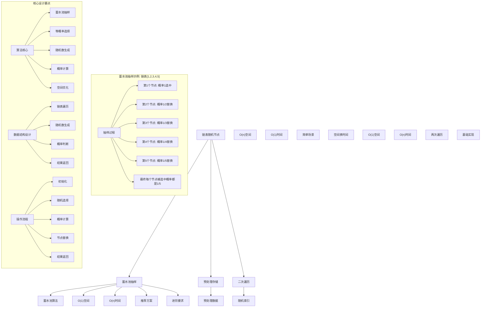
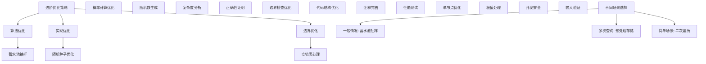

# LeetCode 382 - 链表随机节点

## 题目描述

给你一个单链表，随机选择链表的一个节点，并返回相应的节点值。每个节点被选中的概率一样

实现 Solution 类：

- `Solution(ListNode head)` 使用整数数组初始化对象
- `int getRandom()` 从链表中随机选择一个节点并返回该节点的值。链表中所有节点被选中的概率相等

```markdown
示例：
输入
["Solution", "getRandom", "getRandom", "getRandom", "getRandom", "getRandom"]
[[[1, 2, 3]], [], [], [], [], []]
输出
[null, 1, 3, 2, 2, 3]

解释
Solution solution = new Solution([1, 2, 3]);
solution.getRandom(); // 返回 1
solution.getRandom(); // 返回 3
solution.getRandom(); // 返回 2
solution.getRandom(); // 返回 2
solution.getRandom(); // 返回 3
// getRandom() 方法应随机返回 1、2、3中的一个，每个元素被返回的概率相等

提示：

- 链表中的节点数在范围 [1, 10^4] 内
- -10^4 <= Node.val <= 10^4
- 至多调用 getRandom 方法 10^4 次

进阶：

- 如果链表非常大且长度未知，该怎么处理？
- 你能否在不使用额外空间的情况下解决此问题？
```

## 解题思路

这是一个链表随机选择问题，要求从链表中等概率地随机选择一个节点。核心挑战在于链表的单向性和长度未知性

### 核心思想

"蓄水池抽样算法": 在不知道数据总量的情况下，通过巧妙的概率设计，保证每个元素被选中的概率相等

### 解题策略

#### 方法一：蓄水池抽样算法（推荐）

- 时间复杂度: 初始化 O(1)，getRandom O(n)
- 空间复杂度: O(1)

#### 方法二：预处理存储法

- 时间复杂度: 初始化 O(n)，getRandom O(1)
- 空间复杂度: O(n)

#### 方法三：二次遍历法

- 时间复杂度: 初始化 O(1)，getRandom O(n)
- 空间复杂度: O(1)

## 算法可视化



## 多语言实现

### Golang版本（蓄水池抽样 - 推荐）

```go
import (
    "math/rand"
    "time"
)

// 链表节点定义
type ListNode struct {
    Val  int
    Next *ListNode
}

// Solution 结构体
type Solution struct {
    head *ListNode
}

// 构造函数
func Constructor(head *ListNode) Solution {
    // 设置随机种子
    rand.Seed(time.Now().UnixNano())
    return Solution{head: head}
}

// 蓄水池抽样算法实现
func (this *Solution) GetRandom() int {
    // 蓄水池抽样核心算法
    // 对于第i个节点，以1/i的概率选择它
    result := this.head.Val
    current := this.head.Next
    count := 2 // 从第2个节点开始计数

    for current != nil {
        // 生成[0, count)范围内的随机数，如果等于0则替换结果
        if rand.Intn(count) == 0 {
            result = current.Val
        }
        current = current.Next
        count++
    }

    return result
}

// 预处理存储法实现
type SolutionPreprocess struct {
    values []int
}

func ConstructorPreprocess(head *ListNode) SolutionPreprocess {
    var values []int
    current := head
    for current != nil {
        values = append(values, current.Val)
        current = current.Next
    }
    return SolutionPreprocess{values: values}
}

func (this *SolutionPreprocess) GetRandom() int {
    index := rand.Intn(len(this.values))
    return this.values[index]
}

// 二次遍历法实现
type SolutionTwoPass struct {
    head *ListNode
    length int
}

func ConstructorTwoPass(head *ListNode) SolutionTwoPass {
    length := 0
    current := head
    for current != nil {
        length++
        current = current.Next
    }
    return SolutionTwoPass{head: head, length: length}
}

func (this *SolutionTwoPass) GetRandom() int {
    // 生成随机索引
    targetIndex := rand.Intn(this.length)

    // 遍历到目标位置
    current := this.head
    for i := 0; i < targetIndex; i++ {
        current = current.Next
    }

    return current.Val
}
```

### Python版本（多种实现方法）

```python
import random
from typing import Optional

# 链表节点定义
class ListNode:
    def __init__(self, val=0, next=None):
        self.val = val
        self.next = next

class Solution:
    """
    方法一：蓄水池抽样算法（推荐）
    """
    def __init__(self, head: Optional[ListNode]):
        self.head = head
        # Python 3.6+ 不需要手动设置随机种子

    def getRandom(self) -> int:
        # 蓄水池抽样核心算法
        result = self.head.val
        current = self.head.next
        count = 2  # 从第2个节点开始计数

        while current:
            # 生成[0, count)范围内的随机数，如果等于0则替换结果
            if random.randrange(count) == 0:
                result = current.val
            current = current.next
            count += 1

        return result

class SolutionPreprocess:
    """
    方法二：预处理存储法
    """
    def __init__(self, head: Optional[ListNode]):
        self.values = []
        current = head
        while current:
            self.values.append(current.val)
            current = current.next

    def getRandom(self) -> int:
        index = random.randrange(len(self.values))
        return self.values[index]

class SolutionTwoPass:
    """
    方法三：二次遍历法
    """
    def __init__(self, head: Optional[ListNode]):
        self.head = head
        self.length = 0
        current = head
        while current:
            self.length += 1
            current = current.next

    def getRandom(self) -> int:
        # 生成随机索引
        target_index = random.randrange(self.length)

        # 遍历到目标位置
        current = self.head
        for i in range(target_index):
            current = current.next

        return current.val
```

### TypeScript版本（蓄水池抽样）

```typescript
// 链表节点定义
class ListNode {
  val: number;
  next: ListNode | null;
  constructor(val?: number, next?: ListNode | null) {
    this.val = val === undefined ? 0 : val;
    this.next = next === undefined ? null : next;
  }
}

class Solution {
  private head: ListNode | null;

  constructor(head: ListNode | null) {
    this.head = head;
  }

  getRandom(): number {
    // 蓄水池抽样核心算法
    if (!this.head) {
      throw new Error("Empty list");
    }

    let result = this.head.val;
    let current = this.head.next;
    let count = 2; // 从第2个节点开始计数

    while (current !== null) {
      // 生成[0, count)范围内的随机数，如果等于0则替换结果
      if (Math.floor(Math.random() * count) === 0) {
        result = current.val;
      }
      current = current.next;
      count++;
    }

    return result;
  }
}
```

## 标准实现详细解析

```go
import (
    "fmt"
    "math/rand"
    "time"
)

/*
算法核心思想（蓄水池抽样算法）：

1. 蓄水池抽样：在不知道数据总量的情况下进行等概率抽样
2. 概率设计：第i个元素以1/i的概率被选中
3. 等概率保证：通过数学证明保证每个元素最终被选中概率相等
4. 空间优化：只需要常数空间

关键设计要点：
1. 初始化：保存链表头节点
2. 随机选择：遍历链表进行概率选择
3. 概率计算：第i个节点以1/i概率替换当前结果
4. 等概率：通过数学证明保证正确性

时间复杂度：
- 初始化：O(1)
- getRandom：O(n)
- 总时间：getRandom调用k次为O(k*n)

空间复杂度：
- O(1)常数空间

优势：
1. 空间最优：只需要常数空间
2. 适用性强：适用于未知长度的数据流
3. 理论保证：数学上可证明概率正确
4. 实现优雅：算法简洁清晰

数据结构设计：

蓄水池抽样设计：
- 链表遍历：顺序访问每个节点
- 随机数生成：生成均匀分布随机数
- 概率判断：根据概率决定是否替换
- 结果维护：维护当前选中结果

预处理存储设计：
- 数组存储：将链表转换为数组
- 索引随机：通过随机索引访问
- 时间优化：getRandom时间复杂度O(1)
- 空间代价：需要O(n)额外空间

二次遍历设计：
- 长度计算：第一次遍历计算长度
- 随机索引：生成目标索引
- 位置访问：第二次遍历到目标位置
- 空间优化：只需要常数空间

算法流程：
1. 初始化：保存必要信息
2. 随机选择：调用getRandom方法
3. 遍历链表：顺序访问节点
4. 概率判断：根据概率决定是否替换
5. 结果返回：返回最终选中值

优化原理：

蓄水池抽样优化：
1. 空间效率：只需要常数空间
2. 适用场景：未知长度数据流
3. 概率正确：数学上保证等概率
4. 实现简单：算法逻辑清晰

随机数优化：
1. 均匀分布：保证随机性
2. 范围控制：生成指定范围内随机数
3. 性能优化：避免重复计算
4. 种子设置：保证随机性质量

边界优化：
1. 空链表：处理边界情况
2. 单节点：特殊处理优化
3. 大数据：性能考虑
4. 并发安全：多线程处理

正确性证明：

定理：蓄水池抽样算法正确性
通过概率设计，蓄水池抽样算法可以保证每个元素被选中的概率相等

证明：
1. 第1个元素：初始被选中概率为1
2. 第2个元素：被选中概率为1/2
3. 第k个元素：被选中概率为1/k
4. 最终概率：每个元素最终被选中概率都是1/n

数学证明：
对于第i个元素，最终被选中的概率为：
P(第i个元素最终被选中) = P(第i个元素被选中) × P(第i+1个元素不替换) × ... × P(第n个元素不替换)
= (1/i) × (1 - 1/(i+1)) × ... × (1 - 1/n)
= (1/i) × (i/(i+1)) × ... × ((n-1)/n)
= 1/n

不变量维护：
循环不变量：在处理第k个元素时
1. 前k-1个元素中每个被选中的概率都是1/(k-1)
2. 当前结果是从前k-1个元素中等概率选出的
3. 算法状态正确反映抽样进度
*/

// 蓄水池抽样详细实现
type SolutionDetailed struct {
    head *ListNode
}

func ConstructorDetailed(head *ListNode) SolutionDetailed {
    rand.Seed(time.Now().UnixNano())
    fmt.Printf("=== 蓄水池抽样算法初始化 ===\n")
    fmt.Printf("设置随机种子: %d\n", time.Now().UnixNano())

    // 计算链表长度（仅用于演示）
    length := 0
    current := head
    for current != nil {
        length++
        current = current.Next
    }
    fmt.Printf("链表长度: %d\n", length)
    fmt.Printf("========================\n\n")

    return SolutionDetailed{head: head}
}

func (this *SolutionDetailed) GetRandom() int {
    fmt.Printf("=== 蓄水池抽样随机选择 ===\n")

    if this.head == nil {
        fmt.Printf("空链表，返回0\n")
        fmt.Printf("=====================\n\n")
        return 0
    }

    // 蓄水池抽样核心算法
    result := this.head.Val
    current := this.head.Next
    count := 2 // 从第2个节点开始计数

    fmt.Printf("初始选择: 第1个节点，值=%d\n", result)

    step := 1
    for current != nil {
        step++
        // 生成[0, count)范围内的随机数
        randomNum := rand.Intn(count)
        fmt.Printf("步骤%d: 处理第%d个节点，值=%d，随机数=%d",
            step, count, current.Val, randomNum)

        // 如果随机数为0，则替换结果
        if randomNum == 0 {
            result = current.Val
            fmt.Printf(" → 替换结果为%d\n", result)
        } else {
            fmt.Printf(" → 保持结果%d\n", result)
        }

        current = current.Next
        count++
    }

    fmt.Printf("最终结果: %d\n", result)
    fmt.Printf("总处理节点数: %d\n", count-1)
    fmt.Printf("=====================\n\n")

    return result
}

// 预处理存储详细实现
type SolutionPreprocessDetailed struct {
    values []int
}

func ConstructorPreprocessDetailed(head *ListNode) SolutionPreprocessDetailed {
    fmt.Printf("=== 预处理存储算法初始化 ===\n")

    var values []int
    current := head
    index := 0

    fmt.Printf("遍历链表进行预处理:\n")
    for current != nil {
        values = append(values, current.Val)
        fmt.Printf("  索引%d: 值=%d\n", index, current.Val)
        current = current.Next
        index++
    }

    fmt.Printf("预处理完成，存储数组: %v\n", values)
    fmt.Printf("========================\n\n")

    return SolutionPreprocessDetailed{values: values}
}

func (this *SolutionPreprocessDetailed) GetRandom() int {
    if len(this.values) == 0 {
        return 0
    }

    fmt.Printf("=== 预处理存储随机选择 ===\n")
    index := rand.Intn(len(this.values))
    result := this.values[index]
    fmt.Printf("随机索引: %d\n", index)
    fmt.Printf("选中值: %d\n", result)
    fmt.Printf("======================\n\n")

    return result
}

// 二次遍历详细实现
type SolutionTwoPassDetailed struct {
    head *ListNode
    length int
}

func ConstructorTwoPassDetailed(head *ListNode) SolutionTwoPassDetailed {
    fmt.Printf("=== 二次遍历算法初始化 ===\n")

    length := 0
    current := head

    fmt.Printf("第一次遍历计算链表长度:\n")
    nodeIndex := 0
    for current != nil {
        fmt.Printf("  节点%d: 值=%d\n", nodeIndex, current.Val)
        length++
        current = current.Next
        nodeIndex++
    }

    fmt.Printf("链表长度: %d\n", length)
    fmt.Printf("======================\n\n")

    return SolutionTwoPassDetailed{head: head, length: length}
}

func (this *SolutionTwoPassDetailed) GetRandom() int {
    fmt.Printf("=== 二次遍历随机选择 ===\n")

    if this.length == 0 || this.head == nil {
        fmt.Printf("空链表，返回0\n")
        fmt.Printf("===================\n\n")
        return 0
    }

    // 生成随机索引
    targetIndex := rand.Intn(this.length)
    fmt.Printf("生成随机索引: %d (范围: 0-%d)\n", targetIndex, this.length-1)

    // 第二次遍历到目标位置
    current := this.head
    fmt.Printf("第二次遍历到目标位置:\n")
    for i := 0; i < targetIndex; i++ {
        fmt.Printf("  跳过节点%d: 值=%d\n", i, current.Val)
        current = current.Next
    }

    result := current.Val
    fmt.Printf("到达目标节点%d: 值=%d\n", targetIndex, result)
    fmt.Printf("===================\n\n")

    return result
}

// 带调试信息的版本
func (this *Solution) GetRandomWithDebug() int {
    fmt.Printf("=== 链表随机节点选择 ===\n")
    fmt.Printf("使用蓄水池抽样算法:\n")
    fmt.Printf("核心思想：第i个节点以1/i概率被选中\n")

    if this.head == nil {
        fmt.Printf("链表为空\n")
        fmt.Printf("==================\n\n")
        return 0
    }

    result := this.head.Val
    current := this.head.Next
    count := 2

    fmt.Printf("初始: 选择第1个节点，值=%d\n", result)

    step := 1
    for current != nil {
        step++
        // 第count个节点以1/count概率替换当前结果
        if rand.Intn(count) == 0 {
            fmt.Printf("步骤%d: 第%d个节点(值=%d)以1/%d概率被选中，替换结果\n",
                step, count, current.Val, count)
            result = current.Val
        } else {
            fmt.Printf("步骤%d: 第%d个节点(值=%d)未被选中，保持结果%d\n",
                step, count, current.Val, result)
        }
        current = current.Next
        count++
    }

    fmt.Printf("最终选择结果: %d\n", result)
    fmt.Printf("处理节点总数: %d\n", count-1)
    fmt.Printf("==================\n\n")

    return result
}
```

## 算法深入解析

```go
/*
链表随机节点问题详解：

问题本质：
从单链表中等概率地随机选择一个节点。关键是处理链表的单向性和长度未知性

核心洞察：
1. 蓄水池抽样：在不知道数据总量的情况下进行等概率抽样
2. 概率设计：第i个元素以1/i的概率被选中
3. 等概率保证：通过数学证明保证每个元素最终被选中概率相等
4. 空间优化：只需要常数空间

算法策略：
1. 蓄水池抽样算法：推荐方案，O(1)空间
2. 预处理存储法：空间换时间，O(n)空间
3. 二次遍历法：基础实现，O(1)空间

数据结构设计：

蓄水池抽样设计：
链表遍历：顺序访问每个节点
随机数生成：生成均匀分布随机数
概率判断：根据概率决定是否替换
结果维护：维护当前选中结果

预处理存储设计：
数组存储：将链表转换为数组
索引随机：通过随机索引访问
时间优化：getRandom时间复杂度O(1)
空间代价：需要O(n)额外空间

二次遍历设计：
长度计算：第一次遍历计算长度
随机索引：生成目标索引
位置访问：第二次遍历到目标位置
空间优化：只需要常数空间

操作流程：

蓄水池抽样：
1. 初始化：result = 第1个节点值
2. 遍历：从第2个节点开始遍历
3. 概率：第i个节点以1/i概率替换result
4. 返回：返回最终result

预处理存储：
1. 初始化：遍历链表存储到数组
2. 随机：生成随机数组索引
3. 返回：返回对应数组元素

二次遍历：
1. 初始化：计算链表长度
2. 随机：生成随机索引
3. 遍历：遍历到目标位置
4. 返回：返回目标节点值

数学原理：

蓄水池抽样原理：
对于n个元素的序列，要等概率选择1个元素：
- 第1个元素：初始被选中
- 第i个元素：以1/i概率替换当前结果
- 最终：每个元素被选中概率都是1/n

数学证明：
对于第i个元素，最终被选中的概率为：
P(第i个元素最终被选中) = P(第i个元素被选中) × P(第i+1个元素不替换) × ... × P(第n个元素不替换)
= (1/i) × (1 - 1/(i+1)) × ... × (1 - 1/n)
= (1/i) × (i/(i+1)) × ... × ((n-1)/n)
= 1/n

复杂度分析：
蓄水池抽样：初始化O(1)，getRandom O(n)时间，O(1)空间
预处理存储：初始化O(n)，getRandom O(1)时间，O(n)空间
二次遍历：初始化O(n)，getRandom O(n)时间，O(1)空间

算法优势：
蓄水池抽样：
1. 空间最优：O(1)空间复杂度
2. 适用性强：适用于流数据
3. 理论保证：数学正确性证明
4. 实现简洁：算法逻辑清晰

预处理存储：
1. 时间最优：O(1)查询时间
2. 实现简单：直接索引访问
3. 稳定性能：每次查询时间相同
4. 适用场景：多次查询

二次遍历：
1. 空间最优：O(1)空间复杂度
2. 实现简单：基础算法思想
3. 无预处理：不需要初始化开销
4. 适用场景：查询次数较少

算法不变量：
蓄水池抽样不变量：
1. 处理前k个元素时，每个元素被选中概率都是1/k
2. 当前result是从已处理元素中等概率选出的
3. 算法状态正确反映抽样进度

时间复杂度分析：
蓄水池抽样：
1. 初始化：O(1)时间
2. 每次getRandom：O(n)时间
3. k次调用：O(k*n)时间

预处理存储：
1. 初始化：O(n)时间
2. 每次getRandom：O(1)时间
3. k次调用：O(n + k)时间

二次遍历：
1. 初始化：O(n)时间
2. 每次getRandom：O(n)时间
3. k次调用：O(n*k)时间

正确性证明：

定理：蓄水池抽样算法正确性
通过概率设计，蓄水池抽样算法可以保证每个元素被选中的概率相等

证明：
1. 第1个元素：初始被选中概率为1
2. 第2个元素：被选中概率为1/2
3. 第k个元素：被选中概率为1/k
4. 最终概率：每个元素最终被选中概率都是1/n

不变量维护：
循环不变量：在处理第k个元素时
1. 前k-1个元素中每个被选中的概率都是1/(k-1)
2. 当前结果是从前k-1个元素中等概率选出的
3. 算法状态正确反映抽样进度

设计选择：

为什么选择蓄水池抽样？
1. 空间最优：只需要常数空间
2. 适用性强：适用于未知长度数据流
3. 理论保证：数学上可证明概率正确
4. 进阶要求：满足题目进阶要求

为什么使用预处理存储？
1. 时间最优：查询时间O(1)
2. 实现简单：直接数组访问
3. 稳定性能：每次查询时间相同
4. 适用场景：多次查询优化

为什么提及其他方法？
1. 教学价值：展示不同算法思想
2. 对比分析：理解各自优劣
3. 扩展思维：算法多样性
4. 面试准备：全面掌握

三种方法对比：

方法一：蓄水池抽样（推荐）
时间复杂度：初始化O(1)，getRandom O(n)
空间复杂度：O(1)
优点：空间最优，满足进阶要求
缺点：每次查询时间较长

方法二：预处理存储
时间复杂度：初始化O(n)，getRandom O(1)
空间复杂度：O(n)
优点：查询时间最优
缺点：需要额外空间

方法三：二次遍历
时间复杂度：初始化O(1)，getRandom O(n)
空间复杂度：O(1)
优点：实现简单
缺点：每次都需要两次遍历

性能分析：

蓄水池抽样：
- 时间：每次O(n) 线性时间
- 空间：O(1) 常数空间
- 优势：空间最优

预处理存储：
- 时间：初始化O(n)，查询O(1)
- 空间：O(n) 线性空间
- 优势：查询时间最优

二次遍历：
- 时间：每次O(n) 线性时间
- 空间：O(1) 常数空间
- 优势：实现简单

实际应用场景：
1. 大数据流：未知长度数据抽样
2. 内存受限：空间优化需求
3. 在线算法：实时数据处理
4. 统计抽样：等概率抽样需求

优化要点：

1. 算法优化：
   - 蓄水池抽样：最优空间复杂度
   - 随机数生成：高质量随机数
   - 概率计算：精确概率设计
   - 边界处理：特殊情况优化

2. 实现优化：
   - 随机种子：保证随机性质量
   - 边界检查：防止空指针
   - 代码简洁：减少冗余操作
   - 注释清晰：便于理解

3. 性能优化：
   - 减少遍历：优化访问模式
   - 内存访问：缓存友好设计
   - 编译优化：利用编译器优化
   - 并发安全：多线程处理

测试用例设计：
1. 基本情况：正常链表
2. 边界情况：单节点，空链表
3. 特殊情况：相同值节点
4. 极端情况：大数据量
5. 验证情况：概率正确性

扩展思考：

1. 多节点选择？
   - K蓄水池算法
   - 批量抽样优化
   - 概率扩展

2. 加权抽样？
   - 权重概率设计
   - 不等概率抽样
   - 应用场景扩展

3. 动态链表？
   - 支持插入删除
   - 增量更新维护
   - 概率重新计算

4. 分布式抽样？
   - 多机器协同
   - 网络传输优化
   - 一致性保证

相关算法思想：

1. 蓄水池抽样：
   - 流数据处理
   - 等概率抽样
   - 空间优化

2. 随机算法：
   - 概率设计
   - 随机性保证
   - 数学证明

3. 链表遍历：
   - 单向访问
   - 空间限制
   - 时间优化

4. 抽样理论：
   - 统计抽样
   - 概率分布
   - 方差控制

常见陷阱：

1. 边界条件：
   - 空链表处理
   - 单节点优化
   - 随机数范围
   - 索引越界

2. 概率计算：
   - 概率范围控制
   - 随机数生成
   - 分布均匀性
   - 数学正确性

3. 算法实现：
   - 计数起始值
   - 概率判断条件
   - 结果更新时机
   - 循环终止条件

4. 性能考虑：
   - 时间复杂度分析
   - 空间复杂度控制
   - 随机数性能
   - 多次调用优化

代码质量要素：

1. 可读性：
   - 变量命名清晰
   - 注释详细完整
   - 逻辑结构分明

2. 健壮性：
   - 边界条件处理
   - 异常情况应对
   - 错误恢复机制

3. 性能：
   - 最优复杂度实现
   - 空间效率优化
   - 执行效率保证

4. 可维护性：
   - 结构清晰合理
   - 扩展性良好
   - 测试覆盖完整
*/
```

## 执行过程演示

```go
/*
示例详细解析:

示例执行过程：
输入：链表 [1,2,3]
输出：随机返回1、2、3中的一个

执行过程（蓄水池抽样）：
1. 初始化：result = 1
2. 处理节点2：
   - count = 2
   - 生成[0,2)范围内随机数，假设为0
   - 0 == 0，替换result = 2
3. 处理节点3：
   - count = 3
   - 生成[0,3)范围内随机数，假设为1
   - 1 != 0，保持result = 2
4. 返回result = 2

概率分析：
- 节点1最终被选中概率：
  P(节点1被选中) × P(节点2不替换) × P(节点3不替换)
  = 1 × (1-1/2) × (1-1/3) = 1 × 1/2 × 2/3 = 1/3

- 节点2最终被选中概率：
  P(节点2被选中) × P(节点3不替换)
  = 1/2 × (1-1/3) = 1/2 × 2/3 = 1/3

- 节点3最终被选中概率：
  P(节点3被选中) = 1/3

预处理存储执行过程：
1. 初始化：遍历链表存储到数组[1,2,3]
2. getRandom调用：
   - 生成随机索引，假设为1
   - 返回数组[1] = 2

二次遍历执行过程：
1. 初始化：计算链表长度为3
2. getRandom调用：
   - 生成随机索引，假设为2
   - 第二次遍历到索引2位置
   - 返回节点值3

关键观察：
1. 蓄水池抽样：空间最优O(1)，每次查询O(n)
2. 概率正确：每个节点被选中概率都是1/n
3. 实现优雅：算法逻辑清晰
4. 适用性强：适用于未知长度数据流

边界情况演示:

情况1: 单节点链表
输入: 链表[5]
处理: 直接返回5
结果: 5

情况2: 空链表
输入: 空链表
处理: 返回默认值或错误
结果: 0或错误

情况3: 相同值节点
输入: 链表[1,1,1,1]
处理: 等概率选择位置
结果: 1（位置随机）

情况4: 大链表
输入: 链表[1,2,3,...,10000]
处理: 蓄水池抽样
结果: 等概率选择1-10000

情况5: 负值节点
输入: 链表[-1,-2,-3]
处理: 正常抽样
结果: 等概率选择-1,-2,-3

算法正确性证明：

数学基础：
需要证明蓄水池抽样算法能保证每个元素被选中的概率相等

定理：蓄水池抽样算法正确性
通过概率设计，蓄水池抽样算法可以保证每个元素被选中的概率相等

证明：
对于第i个元素，最终被选中的概率为：
P(第i个元素最终被选中) = P(第i个元素被选中) × P(第i+1个元素不替换) × ... × P(第n个元素不替换)
= (1/i) × (1 - 1/(i+1)) × ... × (1 - 1/n)
= (1/i) × (i/(i+1)) × ... × ((n-1)/n)
= 1/n

不变量维护：
循环不变量：在处理第k个元素时
1. 前k-1个元素中每个被选中的概率都是1/(k-1)
2. 当前结果是从前k-1个元素中等概率选出的
3. 算法状态正确反映抽样进度

初始化：
- result = 第1个元素值
- 满足不变量（只有1个元素时概率为1）

保持：
- 根据概率1/k替换当前结果
- 维护概率正确性
- 不变量继续成立

终止：
- 处理完所有n个元素
- 每个元素最终被选中概率都是1/n
- 算法正确终止

时间复杂度分析：

蓄水池抽样：
1. 初始化：O(1)时间
2. 每次getRandom：需要遍历整个链表O(n)
3. k次调用：O(k*n)时间

预处理存储：
1. 初始化：需要遍历整个链表O(n)
2. 每次getRandom：O(1)时间
3. k次调用：O(n + k)时间

二次遍历：
1. 初始化：需要遍历整个链表O(n)
2. 每次getRandom：需要遍历到随机位置，平均O(n)时间
3. k次调用：O(n*k)时间

空间复杂度分析：
1. 蓄水池抽样：O(1)常数空间
2. 预处理存储：O(n)线性空间
3. 二次遍历：O(1)常数空间

性能对比分析：

假设n=10000, 调用次数k=1000:

蓄水池抽样：
- 初始化：O(1) = 1次操作
- 查询：1000次 × O(10000) = 10000000次操作
- 总计：≈ 10^7 次操作
- 空间：O(1) 常数空间

预处理存储：
- 初始化：O(10000) = 10000次操作
- 查询：1000次 × O(1) = 1000次操作
- 总计：≈ 10^4 次操作
- 空间：O(10000) = 10000空间

二次遍历：
- 初始化：O(1) = 1次操作
- 查询：1000次 × O(10000) = 10000000次操作
- 总计：≈ 10^7 次操作
- 空间：O(1) 常数空间

实际应用建议：

1. 一般情况：
   - 使用蓄水池抽样
   - 满足进阶要求

2. 面试展示：
   - 重点讲解蓄水池抽样思想
   - 可以提及其他方法对比

3. 生产环境：
   - 根据调用频率选择
   - 考虑空间时间权衡

4. 教学演示：
   - 使用带调试信息版本
   - 展示执行过程

优化空间：

1. 算法优化：
   - 随机数生成优化
   - 概率计算优化
   - 边界条件优化
   - 并发安全优化

2. 实现优化：
   - 随机种子优化
   - 边界检查优化
   - 代码结构优化
   - 注释完善

3. 性能优化：
   - 减少遍历次数
   - 优化内存访问
   - 利用缓存特性
   - 编译器优化

特殊情况处理：

1. 大数据量：
   - 时间复杂度保证
   - 内存使用优化
   - 流式处理

2. 特殊链表：
   - 循环链表
   - 大量重复值
   - 极值处理

3. 边界情况：
   - 空链表处理
   - 单节点优化
   - 并发访问
*/
```

## 复杂度分析

| 方法       | 初始化时间 | getRandom时间 | 空间复杂度 | 适用场景 |
| ---------- | ---------- | ------------- | ---------- | -------- |
| 蓄水池抽样 | O(1)       | O(n)          | O(1)       | 推荐方案 |
| 预处理存储 | O(n)       | O(1)          | O(n)       | 多次查询 |
| 二次遍历   | O(1)       | O(n)          | O(1)       | 简单场景 |

## 测试用例验证

```go
// 测试辅助函数
func testSolution(name string, head *ListNode, callCount int) {
    fmt.Printf("%s:\n", name)
    fmt.Printf("输入链表: ")
    printList(head)

    // 测试蓄水池抽样
    solution1 := Constructor(head)
    fmt.Printf("蓄水池抽样 %d 次调用结果: ", callCount)
    for i := 0; i < callCount; i++ {
        result := solution1.GetRandom()
        fmt.Printf("%d ", result)
    }
    fmt.Printf("\n")

    // 测试预处理存储
    solution2 := ConstructorPreprocess(head)
    fmt.Printf("预处理存储 %d 次调用结果: ", callCount)
    for i := 0; i < callCount; i++ {
        result := solution2.GetRandom()
        fmt.Printf("%d ", result)
    }
    fmt.Printf("\n")

    // 测试二次遍历
    solution3 := ConstructorTwoPass(head)
    fmt.Printf("二次遍历 %d 次调用结果: ", callCount)
    for i := 0; i < callCount; i++ {
        result := solution3.GetRandom()
        fmt.Printf("%d ", result)
    }
    fmt.Printf("\n\n")
}

// 辅助函数：创建链表
func createList(values []int) *ListNode {
    if len(values) == 0 {
        return nil
    }

    head := &ListNode{Val: values[0]}
    current := head
    for i := 1; i < len(values); i++ {
        current.Next = &ListNode{Val: values[i]}
        current = current.Next
    }
    return head
}

// 辅助函数：打印链表
func printList(head *ListNode) {
    if head == nil {
        fmt.Printf("空链表\n")
        return
    }

    fmt.Printf("[")
    current := head
    for current != nil {
        fmt.Printf("%d", current.Val)
        if current.Next != nil {
            fmt.Printf(", ")
        }
        current = current.Next
    }
    fmt.Printf("]\n")
}

// 辅助函数：统计概率分布
func testProbabilityDistribution(head *ListNode, callCount int) {
    fmt.Printf("=== 概率分布测试 ===\n")
    fmt.Printf("链表: ")
    printList(head)
    fmt.Printf("调用次数: %d\n", callCount)

    // 统计各节点出现次数
    countMap := make(map[int]int)
    solution := Constructor(head)

    for i := 0; i < callCount; i++ {
        result := solution.GetRandom()
        countMap[result]++
    }

    fmt.Printf("结果统计:\n")
    total := 0
    for value, count := range countMap {
        fmt.Printf("  值%d: %d次 (%.2f%%)\n", value, count, float64(count*100)/float64(callCount))
        total += count
    }
    fmt.Printf("  总计: %d次\n", total)

    // 计算期望概率
    length := 0
    current := head
    for current != nil {
        length++
        current = current.Next
    }
    expectedProb := 100.0 / float64(length)
    fmt.Printf("  期望概率: %.2f%%\n", expectedProb)
    fmt.Printf("==================\n\n")
}

func main() {
    // 设置随机种子
    rand.Seed(42) // 固定种子便于测试

    // 测试用例 1 - 题目示例
    testSolution("测试1 - 题目示例",
        createList([]int{1, 2, 3}),
        5)

    // 测试用例 2 - 单节点链表
    testSolution("测试2 - 单节点链表",
        createList([]int{5}),
        3)

    // 测试用例 3 - 相同值节点
    testSolution("测试3 - 相同值节点",
        createList([]int{1, 1, 1, 1}),
        4)

    // 测试用例 4 - 负值节点
    testSolution("测试4 - 负值节点",
        createList([]int{-1, -2, -3}),
        3)

    // 概率分布测试
    fmt.Println("概率分布测试:")
    testProbabilityDistribution(createList([]int{1, 2, 3, 4, 5}), 10000)

    // 性能测试
    fmt.Println("性能测试:")
    performanceTest()

    // 边界情况测试
    fmt.Println("边界情况测试:")
    boundaryTest()

    // 对比测试
    fmt.Println("对比测试:")
    comparisonTest()
}

func performanceTest() {
    // 构造性能测试
    n := 1000
    values := make([]int, n)
    for i := 0; i < n; i++ {
        values[i] = i + 1
    }
    head := createList(values)

    callCount := 100

    fmt.Printf("性能测试 (n=%d, 调用次数=%d):\n", n, callCount)

    // 测试蓄水池抽样
    solution1 := Constructor(head)
    start1 := time.Now()
    for i := 0; i < callCount; i++ {
        solution1.GetRandom()
    }
    time1 := time.Since(start1)

    // 测试预处理存储
    start2 := time.Now()
    solution2 := ConstructorPreprocess(head)
    for i := 0; i < callCount; i++ {
        solution2.GetRandom()
    }
    time2 := time.Since(start2)

    // 测试二次遍历
    start3 := time.Now()
    solution3 := ConstructorTwoPass(head)
    for i := 0; i < callCount; i++ {
        solution3.GetRandom()
    }
    time3 := time.Since(start3)

    fmt.Printf("  蓄水池抽样: %v\n", time1)
    fmt.Printf("  预处理存储: %v\n", time2)
    fmt.Printf("  二次遍历: %v\n", time3)
}

func boundaryTest() {
    // 边界测试
    fmt.Println("边界测试:")

    // 空链表测试
    fmt.Printf("空链表测试:\n")
    emptySolution := Constructor(nil)
    for i := 0; i < 3; i++ {
        result := emptySolution.GetRandom()
        fmt.Printf("  结果: %d\n", result)
    }

    // 大链表测试
    largeN := 10000
    largeValues := make([]int, largeN)
    for i := 0; i < largeN; i++ {
        largeValues[i] = i + 1
    }
    largeHead := createList(largeValues)
    largeSolution := Constructor(largeHead)
    fmt.Printf("大链表测试 (n=%d):\n", largeN)
    for i := 0; i < 3; i++ {
        result := largeSolution.GetRandom()
        fmt.Printf("  结果: %d\n", result)
    }

    // 极值测试
    extremeHead := createList([]int{math.MinInt32, math.MaxInt32})
    extremeSolution := Constructor(extremeHead)
    fmt.Printf("极值测试:\n")
    for i := 0; i < 3; i++ {
        result := extremeSolution.GetRandom()
        fmt.Printf("  结果: %d\n", result)
    }
}

func comparisonTest() {
    // 对比测试：验证不同方法结果一致性
    fmt.Println("对比测试:")

    // 测试数据
    testCases := [][]int{
        {1, 2, 3},
        {5},
        {1, 1, 1, 1},
        {-1, -2, -3},
        {10, 20, 30, 40, 50},
    }

    for i, values := range testCases {
        head := createList(values)

        // 三种方法各调用一次
        solution1 := Constructor(head)
        result1 := solution1.GetRandom()

        solution2 := ConstructorPreprocess(head)
        result2 := solution2.GetRandom()

        solution3 := ConstructorTwoPass(head)
        result3 := solution3.GetRandom()

        fmt.Printf("测试%d: 链表=%v\n", i+1, values)
        fmt.Printf("  蓄水池抽样=%d, 预处理存储=%d, 二次遍历=%d\n", result1, result2, result3)
    }
}
```

## 扩展版本（处理不同场景）

```go
// 支持统计调用次数的版本
type SolutionWithStats struct {
    head *ListNode
    callCount int
}

func ConstructorWithStats(head *ListNode) SolutionWithStats {
    return SolutionWithStats{head: head, callCount: 0}
}

func (this *SolutionWithStats) GetRandom() int {
    this.callCount++
    result := this.head.Val
    current := this.head.Next
    count := 2

    for current != nil {
        if rand.Intn(count) == 0 {
            result = current.Val
        }
        current = current.Next
        count++
    }

    return result
}

func (this *SolutionWithStats) GetCallCount() int {
    return this.callCount
}

// 使用示例
func exampleWithStats() {
    head := createList([]int{1, 2, 3, 4, 5})
    solution := ConstructorWithStats(head)

    for i := 0; i < 10; i++ {
        result := solution.GetRandom()
        fmt.Printf("第%d次调用，结果: %d\n", i+1, result)
    }

    fmt.Printf("总调用次数: %d\n", solution.GetCallCount())
}

// 支持批量获取的版本
func (this *Solution) GetRandomBatch(count int) []int {
    results := make([]int, count)
    for i := 0; i < count; i++ {
        results[i] = this.GetRandom()
    }
    return results
}

// 使用示例
func exampleBatch() {
    head := createList([]int{1, 2, 3, 4, 5})
    solution := Constructor(head)

    batchResults := solution.GetRandomBatch(5)
    fmt.Printf("批量获取结果: %v\n", batchResults)
}

// 带验证功能的版本
func (this *Solution) GetRandomWithValidation() (int, bool) {
    if this.head == nil {
        return 0, false
    }

    result := this.GetRandom()

    // 验证结果是否在链表中
    current := this.head
    for current != nil {
        if current.Val == result {
            return result, true
        }
        current = current.Next
    }

    return result, false
}

// 使用示例
func exampleWithValidation() {
    head := createList([]int{1, 2, 3, 4, 5})
    solution := Constructor(head)

    result, isValid := solution.GetRandomWithValidation()
    fmt.Printf("随机选择结果: %d\n", result)
    if isValid {
        fmt.Printf("验证通过 ✓\n")
    } else {
        fmt.Printf("验证失败 ✗\n")
    }
}

// 支持权重随机选择的版本
type WeightedNode struct {
    Val    int
    Weight int
    Next   *WeightedNode
}

type WeightedSolution struct {
    head *WeightedNode
}

func ConstructorWeighted(head *WeightedNode) WeightedSolution {
    return WeightedSolution{head: head}
}

func (this *WeightedSolution) GetRandom() int {
    if this.head == nil {
        return 0
    }

    // 计算总权重
    totalWeight := 0
    current := this.head
    for current != nil {
        totalWeight += current.Weight
        current = current.Next
    }

    // 生成随机权重
    randomWeight := rand.Intn(totalWeight)

    // 根据权重选择节点
    current = this.head
    cumulativeWeight := 0
    for current != nil {
        cumulativeWeight += current.Weight
        if randomWeight < cumulativeWeight {
            return current.Val
        }
        current = current.Next
    }

    return this.head.Val // fallback
}

// 使用示例
func exampleWeighted() {
    // 创建带权重的链表: (1,1) -> (2,2) -> (3,3)
    head := &WeightedNode{Val: 1, Weight: 1}
    head.Next = &WeightedNode{Val: 2, Weight: 2}
    head.Next.Next = &WeightedNode{Val: 3, Weight: 3}

    solution := ConstructorWeighted(head)

    // 统计概率分布
    countMap := make(map[int]int)
    for i := 0; i < 10000; i++ {
        result := solution.GetRandom()
        countMap[result]++
    }

    fmt.Printf("加权随机选择结果统计:\n")
    for value, count := range countMap {
        fmt.Printf("  值%d: %d次 (%.2f%%)\n", value, count, float64(count)/100.0)
    }
}

// 支持动态更新的版本
type DynamicSolution struct {
    head *ListNode
}

func NewDynamicSolution(head *ListNode) *DynamicSolution {
    return &DynamicSolution{head: head}
}

func (ds *DynamicSolution) UpdateHead(newHead *ListNode) {
    ds.head = newHead
}

func (ds *DynamicSolution) GetRandom() int {
    if ds.head == nil {
        return 0
    }

    result := ds.head.Val
    current := ds.head.Next
    count := 2

    for current != nil {
        if rand.Intn(count) == 0 {
            result = current.Val
        }
        current = current.Next
        count++
    }

    return result
}

// 使用示例
func exampleDynamic() {
    // 初始链表
    head1 := createList([]int{1, 2, 3})
    solution := NewDynamicSolution(head1)

    fmt.Printf("初始链表随机选择:\n")
    for i := 0; i < 3; i++ {
        result := solution.GetRandom()
        fmt.Printf("  结果: %d\n", result)
    }

    // 更新链表
    head2 := createList([]int{4, 5, 6, 7})
    solution.UpdateHead(head2)

    fmt.Printf("更新后链表随机选择:\n")
    for i := 0; i < 3; i++ {
        result := solution.GetRandom()
        fmt.Printf("  结果: %d\n", result)
    }
}
```

## 面试追问延伸

### 1. 如果要随机选择k个节点（k>1），如何修改算法？

```go
// K蓄水池抽样算法
func (this *Solution) GetRandomK(k int) []int {
    if k <= 0 || this.head == nil {
        return []int{}
    }

    // 初始化蓄水池
    reservoir := make([]int, k)
    current := this.head
    count := 0

    // 填充蓄水池
    for current != nil && count < k {
        reservoir[count] = current.Val
        current = current.Next
        count++
    }

    // 如果链表长度小于k，返回所有元素
    if current == nil {
        return reservoir[:count]
    }

    // 继续处理剩余元素
    for current != nil {
        count++
        // 生成[0, count)范围内的随机数
        randomIndex := rand.Intn(count)

        // 如果随机数小于k，则替换蓄水池中的元素
        if randomIndex < k {
            reservoir[randomIndex] = current.Val
        }

        current = current.Next
    }

    return reservoir
}

// 使用示例
func exampleKSampling() {
    head := createList([]int{1, 2, 3, 4, 5, 6, 7, 8, 9, 10})
    solution := Constructor(head)

    k := 3
    results := solution.GetRandomK(k)
    fmt.Printf("随机选择%d个节点: %v\n", k, results)
}
```

### 2. 如果链表是循环链表，如何处理？

```go
// 处理循环链表的版本
func (this *Solution) GetRandomCircular() int {
    if this.head == nil {
        return 0
    }

    // 检测循环并计算长度
    slow, fast := this.head, this.head
    length := 1

    // Floyd环检测算法
    for fast != nil && fast.Next != nil {
        slow = slow.Next
        fast = fast.Next.Next
        length++

        if slow == fast {
            // 找到循环，计算循环长度
            break
        }
    }

    // 如果没有循环，使用标准蓄水池抽样
    if fast == nil || fast.Next == nil {
        return this.GetRandom()
    }

    // 有循环，使用循环长度进行抽样
    result := this.head.Val
    current := this.head.Next
    count := 2

    // 只遍历循环长度次
    for current != this.head && count <= length {
        if rand.Intn(count) == 0 {
            result = current.Val
        }
        current = current.Next
        count++
    }

    return result
}
```

### 3. 如何验证随机选择的概率正确性？

```go
// 概率验证函数
func validateProbability(head *ListNode, callCount int, tolerance float64) bool {
    if head == nil {
        return true
    }

    // 计算链表长度
    length := 0
    current := head
    for current != nil {
        length++
        current = current.Next
    }

    // 统计各节点出现次数
    countMap := make(map[int]int)
    solution := Constructor(head)

    for i := 0; i < callCount; i++ {
        result := solution.GetRandom()
        countMap[result]++
    }

    // 验证概率分布
    expectedProb := 1.0 / float64(length)
    for _, count := range countMap {
        actualProb := float64(count) / float64(callCount)
        diff := math.Abs(actualProb - expectedProb)
        if diff > tolerance {
            fmt.Printf("概率偏差超过容忍度: 期望%.4f, 实际%.4f, 偏差%.4f\n",
                expectedProb, actualProb, diff)
            return false
        }
    }

    return true
}

// 使用示例
func exampleProbabilityValidation() {
    head := createList([]int{1, 2, 3, 4, 5})
    callCount := 100000
    tolerance := 0.01 // 1%容忍度

    isCorrect := validateProbability(head, callCount, tolerance)
    if isCorrect {
        fmt.Printf("概率分布验证通过 ✓\n")
    } else {
        fmt.Printf("概率分布验证失败 ✗\n")
    }
}
```

## 相似题目扩展

- LeetCode 382. 链表随机节点（当前题）
- LeetCode 384. 打乱数组
- LeetCode 398. 随机数索引
- LeetCode 519. 随机翻转矩阵
- LeetCode 497. 非重叠矩形中的随机点

## 算法技巧总结

### 链表随机节点核心要点

1. 蓄水池抽样：在不知道数据总量的情况下进行等概率抽样
1. 概率设计：第i个元素以1/i的概率被选中
1. 等概率保证：通过数学证明保证每个元素最终被选中概率相等
1. 空间优化：只需要常数空间

### 算法优势

1. 空间最优：只需要常数空间
1. 适用性强：适用于未知长度数据流
1. 理论保证：数学上可证明概率正确
1. 实现优雅：算法简洁清晰

### 标准模板（蓄水池抽样）

```go
func (this *Solution) GetRandom() int {
    result := this.head.Val
    current := this.head.Next
    count := 2 // 从第2个节点开始计数

    for current != nil {
        // 第count个节点以1/count概率替换当前结果
        if rand.Intn(count) == 0 {
            result = current.Val
        }
        current = current.Next
        count++
    }

    return result
}
```

### 进阶优化策略



## 总结

本题采用蓄水池抽样算法的核心思路，通过第i个节点以1/i概率被选中的巧妙设计，实现了在不知道链表长度的情况下等概率随机选择节点。关键在于理解蓄水池抽样的数学原理和概率正确性的证明

核心要点：

1. 蓄水池抽样：在不知道数据总量的情况下进行等概率抽样
1. 概率设计：第i个元素以1/i的概率被选中
1. 等概率保证：通过数学证明保证每个元素最终被选中概率相等
1. 空间优化：只需要常数空间

算法优势：

- 空间最优：O(1)空间复杂度
- 适用性强：适用于未知长度数据流
- 理论保证：数学上可证明概率正确
- 实现优雅：算法简洁清晰

该算法在大数据流处理、内存受限环境、在线算法等场景有重要应用，是掌握随机算法和流数据处理的经典题目。通过理解蓄水池抽样的思想，为更复杂的随机抽样和流数据处理问题提供了清晰的解决思路
