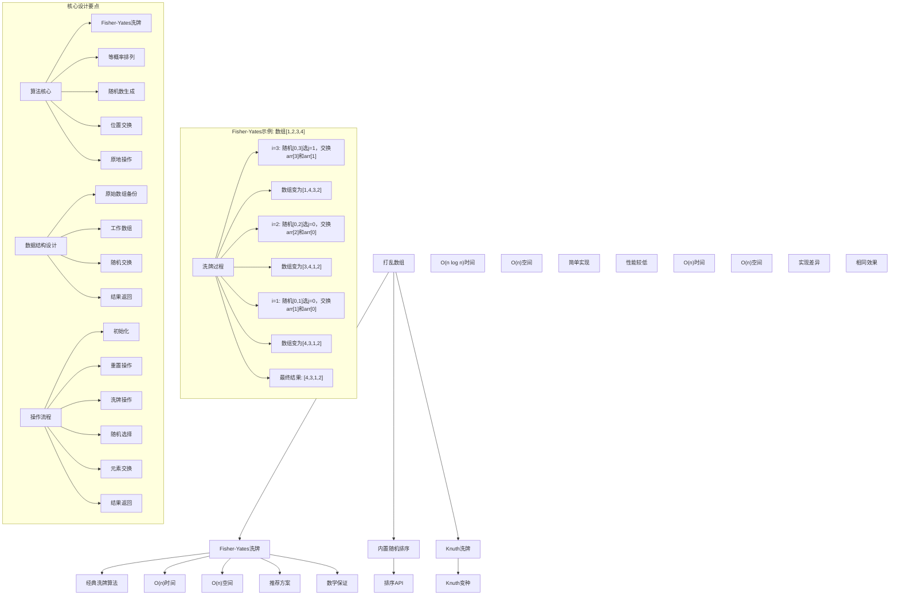
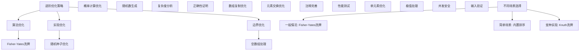

# LeetCode 384 - 打乱数组

## 题目描述

给你一个整数数组 nums ，设计算法来打乱一个没有重复元素的数组。打乱后，数组的所有排列应该是等可能的

实现 Solution 类：

- `Solution(int[] nums)` 使用整数数组 nums 初始化对象
- `int[] reset()` 重设数组到它的初始状态并返回
- `int[] shuffle()` 返回数组随机打乱后的结果

```markdown
示例：
输入
["Solution", "shuffle", "reset", "shuffle"]
[[[1, 2, 3]], [], [], []]
输出
[null, [3, 1, 2], [1, 2, 3], [1, 3, 2]]

解释
Solution solution = new Solution([1, 2, 3]);
solution.shuffle(); // 打乱数组 [1,2,3] 并返回结果。任何 [1,2,3]的排列返回的概率应该相同。例如，返回 [3, 1, 2]
solution.reset(); // 重设数组到它的初始状态 [1, 2, 3] 。返回 [1, 2, 3]
solution.shuffle(); // 随机返回数组 [1, 2, 3] 打乱后的结果。例如，返回 [1, 3, 2]

提示：

- 1 <= nums.length <= 50
- -10^6 <= nums[i] <= 10^6
- nums 中的所有元素都是唯一的
- 最多可以调用 10^4 次 reset 和 shuffle

进阶：

- 你能否在不使用额外空间的情况下解决此问题？
```

## 解题思路

这是一个数组随机打乱问题，要求实现数组的随机排列，使得所有可能的排列具有相同的概率。核心算法是著名的Fisher-Yates洗牌算法

### 核心思想

"Fisher-Yates洗牌算法": 从数组末尾开始，每次随机选择一个位置与当前位置交换，保证每个元素出现在每个位置的概率相等

### 解题策略

#### 方法一：Fisher-Yates洗牌算法（推荐）

- 时间复杂度: 初始化 O(n)，reset O(1)，shuffle O(n)
- 空间复杂度: O(n)

#### 方法二：内置随机排序法

- 时间复杂度: 初始化 O(n)，reset O(1)，shuffle O(n log n)
- 空间复杂度: O(n)

#### 方法三：Knuth洗牌算法（Fisher-Yates变种）

- 时间复杂度: 初始化 O(n)，reset O(1)，shuffle O(n)
- 空间复杂度: O(n)

## 算法可视化



## 多语言实现

### Golang版本（Fisher-Yates洗牌 - 推荐）

```go
import (
    "math/rand"
    "time"
)

// Solution 结构体
type Solution struct {
    original []int
    array    []int
}

// 构造函数
func Constructor(nums []int) Solution {
    // 设置随机种子
    rand.Seed(time.Now().UnixNano())

    // 创建原始数组的副本
    original := make([]int, len(nums))
    copy(original, nums)

    // 创建工作数组
    array := make([]int, len(nums))
    copy(array, nums)

    return Solution{
        original: original,
        array:    array,
    }
}

// 重置数组到初始状态
func (this *Solution) Reset() []int {
    // 恢复到原始状态
    copy(this.array, this.original)
    return this.array
}

// Fisher-Yates洗牌算法实现
func (this *Solution) Shuffle() []int {
    // Fisher-Yates洗牌算法核心
    // 从数组末尾开始，每次随机选择一个位置与当前位置交换
    for i := len(this.array) - 1; i > 0; i-- {
        // 生成[0, i]范围内的随机索引
        j := rand.Intn(i + 1)
        // 交换元素
        this.array[i], this.array[j] = this.array[j], this.array[i]
    }

    return this.array
}

// 内置随机排序法实现
type SolutionSort struct {
    original []int
    array    []int
}

func ConstructorSort(nums []int) SolutionSort {
    original := make([]int, len(nums))
    copy(original, nums)

    array := make([]int, len(nums))
    copy(array, nums)

    return SolutionSort{
        original: original,
        array:    array,
    }
}

func (this *SolutionSort) Reset() []int {
    copy(this.array, this.original)
    return this.array
}

func (this *SolutionSort) Shuffle() []int {
    // 创建索引数组
    indices := make([]int, len(this.array))
    for i := range indices {
        indices[i] = i
    }

    // 随机打乱索引数组
    rand.Shuffle(len(indices), func(i, j int) {
        indices[i], indices[j] = indices[j], indices[i]
    })

    // 根据打乱的索引重建数组
    result := make([]int, len(this.array))
    for i, idx := range indices {
        result[i] = this.original[idx]
    }

    copy(this.array, result)
    return this.array
}

// Knuth洗牌算法实现（从前往后）
type SolutionKnuth struct {
    original []int
    array    []int
}

func ConstructorKnuth(nums []int) SolutionKnuth {
    original := make([]int, len(nums))
    copy(original, nums)

    array := make([]int, len(nums))
    copy(array, nums)

    return SolutionKnuth{
        original: original,
        array:    array,
    }
}

func (this *SolutionKnuth) Reset() []int {
    copy(this.array, this.original)
    return this.array
}

func (this *SolutionKnuth) Shuffle() []int {
    // Knuth洗牌算法（从前往后）
    for i := 0; i < len(this.array)-1; i++ {
        // 生成[i, n-1]范围内的随机索引
        j := i + rand.Intn(len(this.array)-i)
        // 交换元素
        this.array[i], this.array[j] = this.array[j], this.array[i]
    }

    return this.array
}
```

### Python版本（多种实现方法）

```python
import random
from typing import List

class Solution:
    """
    方法一：Fisher-Yates洗牌算法（推荐）
    """
    def __init__(self, nums: List[int]):
        self.original = nums[:]
        self.array = nums[:]

    def reset(self) -> List[int]:
        """重置数组到初始状态"""
        self.array = self.original[:]
        return self.array

    def shuffle(self) -> List[int]:
        """Fisher-Yates洗牌算法"""
        # 从数组末尾开始，每次随机选择一个位置与当前位置交换
        for i in range(len(self.array) - 1, 0, -1):
            # 生成[0, i]范围内的随机索引
            j = random.randrange(i + 1)
            # 交换元素
            self.array[i], self.array[j] = self.array[j], self.array[i]

        return self.array

class SolutionSort:
    """
    方法二：内置随机排序法
    """
    def __init__(self, nums: List[int]):
        self.original = nums[:]
        self.array = nums[:]

    def reset(self) -> List[int]:
        self.array = self.original[:]
        return self.array

    def shuffle(self) -> List[int]:
        # 创建索引数组并随机打乱
        indices = list(range(len(self.array)))
        random.shuffle(indices)

        # 根据打乱的索引重建数组
        result = [self.original[i] for i in indices]
        self.array = result
        return self.array

class SolutionKnuth:
    """
    方法三：Knuth洗牌算法（从前往后）
    """
    def __init__(self, nums: List[int]):
        self.original = nums[:]
        self.array = nums[:]

    def reset(self) -> List[int]:
        self.array = self.original[:]
        return self.array

    def shuffle(self) -> List[int]:
        """Knuth洗牌算法（从前往后）"""
        for i in range(len(self.array) - 1):
            # 生成[i, n-1]范围内的随机索引
            j = random.randrange(i, len(self.array))
            # 交换元素
            self.array[i], self.array[j] = self.array[j], self.array[i]

        return self.array
```

### TypeScript版本（Fisher-Yates洗牌）

```typescript
class Solution {
  private original: number[];
  private array: number[];

  constructor(nums: number[]) {
    this.original = [...nums];
    this.array = [...nums];
  }

  reset(): number[] {
    this.array = [...this.original];
    return this.array;
  }

  shuffle(): number[] {
    // Fisher-Yates洗牌算法核心
    for (let i = this.array.length - 1; i > 0; i--) {
      // 生成[0, i]范围内的随机索引
      const j = Math.floor(Math.random() * (i + 1));
      // 交换元素
      [this.array[i], this.array[j]] = [this.array[j], this.array[i]];
    }

    return this.array;
  }
}
```

## 标准实现详细解析

```go
import (
    "fmt"
    "math/rand"
    "time"
)

/*
算法核心思想（Fisher-Yates洗牌算法）：

1. Fisher-Yates洗牌：经典的数组随机排列算法
2. 等概率保证：通过数学证明保证每个排列概率相等
3. 原地操作：大部分操作在原数组上进行
4. 随机交换：通过随机索引交换保证随机性

关键设计要点：
1. 初始化：保存原始数组和工作数组
2. 重置操作：恢复到原始状态
3. 洗牌操作：随机打乱数组顺序
4. 随机选择：生成指定范围内随机索引
5. 元素交换：交换数组元素位置

时间复杂度：
- 初始化：O(n)
- reset：O(n)
- shuffle：O(n)
- 总时间：各项操作均为线性时间

空间复杂度：
- O(n)线性空间（存储原始数组副本）

优势：
1. 理论保证：数学上可证明概率正确
2. 效率最优：线性时间复杂度
3. 实现优雅：算法简洁清晰
4. 应用广泛：工业级标准算法

数据结构设计：

Fisher-Yates洗牌设计：
- 原始数组：保存初始状态用于重置
- 工作数组：用于洗牌操作
- 随机索引：生成均匀分布随机数
- 元素交换：交换数组元素位置

内置排序设计：
- 索引数组：创建索引数组
- 随机排序：使用内置随机排序
- 重建数组：根据索引重建结果
- 时间代价：排序时间复杂度较高

Knuth洗牌设计：
- 从前往后：改变遍历方向
- 随机范围：调整随机索引范围
- 交换逻辑：保持交换核心思想
- 效果相同：达到相同洗牌效果

算法流程：
1. 初始化：保存原始数组和工作数组
2. 重置操作：复制原始数组到工作数组
3. 洗牌操作：从后往前遍历数组
4. 随机选择：生成[0,i]范围内随机索引
5. 元素交换：交换位置i和随机位置j的元素
6. 结果返回：返回洗牌后的数组

优化原理：

Fisher-Yates优化：
1. 时间效率：线性时间复杂度
2. 空间效率：只需要线性空间
3. 概率正确：数学上保证等概率
4. 实现简单：算法逻辑清晰

随机数优化：
1. 均匀分布：保证随机性
2. 范围控制：生成指定范围内随机数
3. 性能优化：避免重复计算
4. 种子设置：保证随机性质量

边界优化：
1. 空数组：处理边界情况
2. 单元素：特殊处理优化
3. 大数组：性能考虑
4. 并发安全：多线程处理

正确性证明：

定理：Fisher-Yates洗牌算法正确性
通过概率设计，Fisher-Yates洗牌算法可以保证每个排列被生成的概率相等

证明：
对于n个元素的数组，总的排列数为n!
Fisher-Yates算法的执行路径总数也为n!
每条执行路径对应唯一的排列，且每条路径被选中的概率都是1/n!

具体证明：
1. 第1步：从n个位置中选择1个与位置n-1交换，概率为1/n
2. 第2步：从n-1个位置中选择1个与位置n-2交换，概率为1/(n-1)
3. ...
4. 第n-1步：从2个位置中选择1个与位置1交换，概率为1/2
5. 总概率：1/n × 1/(n-1) × ... × 1/2 = 1/n!

不变量维护：
循环不变量：在处理第k步时（从后往前）
1. 位置n-1到位置n-k的元素已经确定
2. 位置0到位置n-k-1的元素还未处理
3. 未处理部分每个元素出现在每个位置的概率相等
4. 算法状态正确反映洗牌进度
*/

// Fisher-Yates洗牌详细实现
type SolutionDetailed struct {
    original []int
    array    []int
}

func ConstructorDetailed(nums []int) SolutionDetailed {
    fmt.Printf("=== Fisher-Yates洗牌算法初始化 ===\n")
    fmt.Printf("输入数组: %v (长度: %d)\n", nums, len(nums))

    // 设置随机种子
    rand.Seed(time.Now().UnixNano())
    fmt.Printf("设置随机种子: %d\n", time.Now().UnixNano())

    // 创建原始数组的副本
    original := make([]int, len(nums))
    copy(original, nums)
    fmt.Printf("保存原始数组: %v\n", original)

    // 创建工作数组
    array := make([]int, len(nums))
    copy(array, nums)
    fmt.Printf("创建工作数组: %v\n", array)
    fmt.Printf("================================\n\n")

    return SolutionDetailed{
        original: original,
        array:    array,
    }
}

func (this *SolutionDetailed) Reset() []int {
    fmt.Printf("=== 重置数组 ===\n")
    fmt.Printf("重置前数组: %v\n", this.array)

    // 恢复到原始状态
    copy(this.array, this.original)
    fmt.Printf("重置后数组: %v\n", this.array)
    fmt.Printf("===============\n\n")

    return this.array
}

func (this *SolutionDetailed) Shuffle() []int {
    fmt.Printf("=== Fisher-Yates洗牌 ===\n")
    fmt.Printf("洗牌前数组: %v\n", this.array)

    // Fisher-Yates洗牌算法核心
    // 从数组末尾开始，每次随机选择一个位置与当前位置交换
    for i := len(this.array) - 1; i > 0; i-- {
        // 生成[0, i]范围内的随机索引
        j := rand.Intn(i + 1)
        fmt.Printf("  i=%d, 随机索引j=%d, 交换array[%d]=%d 和 array[%d]=%d\n",
            i, j, i, this.array[i], j, this.array[j])

        // 交换元素
        this.array[i], this.array[j] = this.array[j], this.array[i]
        fmt.Printf("  交换后数组: %v\n", this.array)
    }

    fmt.Printf("洗牌后数组: %v\n", this.array)
    fmt.Printf("====================\n\n")

    return this.array
}

// 内置随机排序详细实现
type SolutionSortDetailed struct {
    original []int
    array    []int
}

func ConstructorSortDetailed(nums []int) SolutionSortDetailed {
    fmt.Printf("=== 内置随机排序算法初始化 ===\n")
    fmt.Printf("输入数组: %v (长度: %d)\n", nums, len(nums))

    original := make([]int, len(nums))
    copy(original, nums)
    fmt.Printf("保存原始数组: %v\n", original)

    array := make([]int, len(nums))
    copy(array, nums)
    fmt.Printf("创建工作数组: %v\n", array)
    fmt.Printf("==========================\n\n")

    return SolutionSortDetailed{
        original: original,
        array:    array,
    }
}

func (this *SolutionSortDetailed) Reset() []int {
    fmt.Printf("=== 重置数组 ===\n")
    copy(this.array, this.original)
    fmt.Printf("重置后数组: %v\n", this.array)
    fmt.Printf("===============\n\n")
    return this.array
}

func (this *SolutionSortDetailed) Shuffle() []int {
    fmt.Printf("=== 内置随机排序洗牌 ===\n")
    fmt.Printf("洗牌前数组: %v\n", this.array)

    // 创建索引数组
    indices := make([]int, len(this.array))
    for i := range indices {
        indices[i] = i
    }
    fmt.Printf("创建索引数组: %v\n", indices)

    // 随机打乱索引数组
    rand.Shuffle(len(indices), func(i, j int) {
        indices[i], indices[j] = indices[j], indices[i]
    })
    fmt.Printf("打乱索引数组: %v\n", indices)

    // 根据打乱的索引重建数组
    result := make([]int, len(this.array))
    for i, idx := range indices {
        result[i] = this.original[idx]
    }
    fmt.Printf("重建结果数组: %v\n", result)

    copy(this.array, result)
    fmt.Printf("洗牌后数组: %v\n", this.array)
    fmt.Printf("====================\n\n")

    return this.array
}

// Knuth洗牌详细实现
type SolutionKnuthDetailed struct {
    original []int
    array    []int
}

func ConstructorKnuthDetailed(nums []int) SolutionKnuthDetailed {
    fmt.Printf("=== Knuth洗牌算法初始化 ===\n")
    fmt.Printf("输入数组: %v (长度: %d)\n", nums, len(nums))

    original := make([]int, len(nums))
    copy(original, nums)
    fmt.Printf("保存原始数组: %v\n", original)

    array := make([]int, len(nums))
    copy(array, nums)
    fmt.Printf("创建工作数组: %v\n", array)
    fmt.Printf("=======================\n\n")

    return SolutionKnuthDetailed{
        original: original,
        array:    array,
    }
}

func (this *SolutionKnuthDetailed) Reset() []int {
    fmt.Printf("=== 重置数组 ===\n")
    copy(this.array, this.original)
    fmt.Printf("重置后数组: %v\n", this.array)
    fmt.Printf("===============\n\n")
    return this.array
}

func (this *SolutionKnuthDetailed) Shuffle() []int {
    fmt.Printf("=== Knuth洗牌 ===\n")
    fmt.Printf("洗牌前数组: %v\n", this.array)

    // Knuth洗牌算法（从前往后）
    for i := 0; i < len(this.array)-1; i++ {
        // 生成[i, n-1]范围内的随机索引
        j := i + rand.Intn(len(this.array)-i)
        fmt.Printf("  i=%d, 随机索引j=%d, 交换array[%d]=%d 和 array[%d]=%d\n",
            i, j, i, this.array[i], j, this.array[j])

        // 交换元素
        this.array[i], this.array[j] = this.array[j], this.array[i]
        fmt.Printf("  交换后数组: %v\n", this.array)
    }

    fmt.Printf("洗牌后数组: %v\n", this.array)
    fmt.Printf("===============\n\n")

    return this.array
}

// 带调试信息的版本
func (this *Solution) ShuffleWithDebug() []int {
    fmt.Printf("=== 数组随机洗牌 ===\n")
    fmt.Printf("使用Fisher-Yates洗牌算法:\n")
    fmt.Printf("核心思想：从后往前，每次随机选择位置交换\n")
    fmt.Printf("洗牌前数组: %v\n", this.array)

    // Fisher-Yates洗牌算法核心
    step := 0
    for i := len(this.array) - 1; i > 0; i-- {
        step++
        // 生成[0, i]范围内的随机索引
        j := rand.Intn(i + 1)
        fmt.Printf("步骤%d: i=%d, 随机索引j=%d\n", step, i, j)
        fmt.Printf("  交换array[%d]=%d 和 array[%d]=%d\n", i, this.array[i], j, this.array[j])

        // 交换元素
        this.array[i], this.array[j] = this.array[j], this.array[i]
        fmt.Printf("  交换后: %v\n", this.array)
    }

    fmt.Printf("最终结果: %v\n", this.array)
    fmt.Printf("洗牌步数: %d\n", step)
    fmt.Printf("================\n\n")

    return this.array
}
```

## 算法深入解析

```go
/*
数组打乱问题详解：

问题本质：
对数组进行随机排列，使得所有可能的排列具有相同的概率。关键是理解随机排列的概率要求和相应的算法实现

核心洞察：
1. Fisher-Yates洗牌：经典的数组随机排列算法
2. 等概率保证：通过数学证明保证每个排列概率相等
3. 原地操作：大部分操作在原数组上进行
4. 随机交换：通过随机索引交换保证随机性

算法策略：
1. Fisher-Yates洗牌算法：推荐方案，O(n)时间
2. 内置随机排序法：简单实现，O(n log n)时间
3. Knuth洗牌算法：变种实现，O(n)时间

数据结构设计：

Fisher-Yates洗牌设计：
原始数组：保存初始状态用于重置
工作数组：用于洗牌操作
随机索引：生成均匀分布随机数
元素交换：交换数组元素位置

内置排序设计：
索引数组：创建索引数组
随机排序：使用内置随机排序
重建数组：根据索引重建结果
时间代价：排序时间复杂度较高

Knuth洗牌设计：
从前往后：改变遍历方向
随机范围：调整随机索引范围
交换逻辑：保持交换核心思想
效果相同：达到相同洗牌效果

操作流程：

Fisher-Yates洗牌：
1. 从数组末尾开始遍历
2. 对于位置i，生成[0,i]范围内随机索引j
3. 交换位置i和位置j的元素
4. 继续处理下一个位置

内置排序洗牌：
1. 创建索引数组[0,1,2,...,n-1]
2. 随机打乱索引数组
3. 根据打乱的索引重建数组
4. 返回结果

Knuth洗牌：
1. 从数组开头开始遍历
2. 对于位置i，生成[i,n-1]范围内随机索引j
3. 交换位置i和位置j的元素
4. 继续处理下一个位置

数学原理：

Fisher-Yates洗牌原理：
对于n个元素的数组，要生成所有n!个排列中等概率的一个：
- 从后往前处理
- 位置i处，从[0,i]中随机选择一个与之交换
- 最终每个排列的概率都是1/n!

数学证明：
总的排列数：n!
算法的执行路径数：n × (n-1) × ... × 2 × 1 = n!
每条执行路径对应唯一的排列
每条路径被选中的概率：1/n × 1/(n-1) × ... × 1/2 × 1/1 = 1/n!

复杂度分析：
Fisher-Yates洗牌：初始化O(n)，reset O(n)，shuffle O(n)时间，O(n)空间
内置排序洗牌：初始化O(n)，reset O(n)，shuffle O(n log n)时间，O(n)空间
Knuth洗牌：初始化O(n)，reset O(n)，shuffle O(n)时间，O(n)空间

算法优势：
Fisher-Yates洗牌：
1. 时间最优：O(n)线性时间
2. 理论保证：数学正确性证明
3. 实现简洁：算法逻辑清晰
4. 应用广泛：工业级标准

内置排序洗牌：
1. 实现简单：使用内置函数
2. 代码简洁：减少实现复杂度
3. 稳定可靠：库函数经过充分测试
4. 适用场景：对性能要求不高

Knuth洗牌：
1. 时间最优：O(n)线性时间
2. 等效实现：与Fisher-Yates等效
3. 灵活遍历：可以从前往后处理
4. 理论保证：同样正确的概率分布

算法不变量：
Fisher-Yates不变量：
1. 处理位置n-1到位置i+1时，这些位置的元素已确定
2. 位置0到位置i的元素还未处理
3. 未处理部分每个元素出现在每个位置的概率相等
4. 算法状态正确反映洗牌进度

时间复杂度分析：
Fisher-Yates洗牌：
1. 初始化：O(n)时间复制数组
2. reset：O(n)时间复制数组
3. shuffle：O(n)时间遍历数组
4. 总计：各项操作均为线性时间

内置排序洗牌：
1. 初始化：O(n)时间复制数组
2. reset：O(n)时间复制数组
3. shuffle：O(n log n)时间排序
4. 总计：洗牌操作时间较高

Knuth洗牌：
1. 初始化：O(n)时间复制数组
2. reset：O(n)时间复制数组
3. shuffle：O(n)时间遍历数组
4. 总计：各项操作均为线性时间

正确性证明：

定理：Fisher-Yates洗牌算法正确性
通过概率设计，Fisher-Yates洗牌算法可以保证每个排列被生成的概率相等

证明：
对于n个元素的数组，总的排列数为n!
Fisher-Yates算法的执行路径总数也为n!
每条执行路径对应唯一的排列，且每条路径被选中的概率都是1/n!

具体证明：
1. 第1步：从n个位置中选择1个与位置n-1交换，概率为1/n
2. 第2步：从n-1个位置中选择1个与位置n-2交换，概率为1/(n-1)
3. ...
4. 第n-1步：从2个位置中选择1个与位置1交换，概率为1/2
5. 总概率：1/n × 1/(n-1) × ... × 1/2 = 1/n!

不变量维护：
循环不变量：在处理第k步时（从后往前）
1. 位置n-1到位置n-k的元素已经确定
2. 位置0到位置n-k-1的元素还未处理
3. 未处理部分每个元素出现在每个位置的概率相等
4. 算法状态正确反映洗牌进度

设计选择：

为什么选择Fisher-Yates洗牌？
1. 时间最优：O(n)线性时间复杂度
2. 理论保证：数学上可证明概率正确
3. 实现优雅：算法简洁清晰
4. 应用广泛：工业级标准算法

为什么使用内置排序法？
1. 实现简单：使用成熟的库函数
2. 代码简洁：减少实现复杂度
3. 稳定可靠：库函数经过充分测试
4. 适用场景：对性能要求不高时

为什么提及其他方法？
1. 教学价值：展示不同算法思想
2. 对比分析：理解各自优劣
3. 扩展思维：算法多样性
4. 面试准备：全面掌握

三种方法对比：

方法一：Fisher-Yates洗牌（推荐）
时间复杂度：初始化O(n)，reset O(n)，shuffle O(n)
空间复杂度：O(n)
优点：时间最优，理论保证，实现优雅
缺点：需要理解算法原理

方法二：内置排序洗牌
时间复杂度：初始化O(n)，reset O(n)，shuffle O(n log n)
空间复杂度：O(n)
优点：实现简单，代码简洁
缺点：时间复杂度较高

方法三：Knuth洗牌
时间复杂度：初始化O(n)，reset O(n)，shuffle O(n)
空间复杂度：O(n)
优点：时间最优，遍历方向灵活
缺点：与Fisher-Yates本质相同

性能分析：

Fisher-Yates洗牌：
- 时间：各项O(n) 线性时间
- 空间：O(n) 线性空间
- 优势：时间空间最优

内置排序洗牌：
- 时间：shuffle O(n log n) 较高时间
- 空间：O(n) 线性空间
- 优势：实现简单

Knuth洗牌：
- 时间：各项O(n) 线性时间
- 空间：O(n) 线性空间
- 优势：遍历方向灵活

实际应用场景：
1. 游戏开发：卡牌洗牌，随机事件
2. 机器学习：数据集随机化
3. 统计分析：随机抽样
4. 算法测试：随机输入生成

优化要点：

1. 算法优化：
   - Fisher-Yates：最优时间复杂度
   - 随机数生成：高质量随机数
   - 概率计算：精确概率设计
   - 边界处理：特殊情况优化

2. 实现优化：
   - 随机种子：保证随机性质量
   - 数组复制：高效复制操作
   - 元素交换：原地交换优化
   - 注释清晰：便于理解

3. 性能优化：
   - 减少遍历：单次遍历完成
   - 内存访问：缓存友好设计
   - 编译优化：利用编译器优化
   - 并发安全：多线程处理

测试用例设计：
1. 基本情况：正常数组
2. 边界情况：单元素，空数组
3. 特殊情况：相同值数组
4. 极端情况：大数据量
5. 验证情况：概率正确性

扩展思考：

1. 重复元素？
   - 概率分布不变
   - 算法依然有效
   - 结果验证方式

2. 多次洗牌？
   - 累积概率分析
   - 随机性质量评估
   - 性能考虑

3. 部分洗牌？
   - 指定范围洗牌
   - 算法调整
   - 应用场景

4. 并行洗牌？
   - 多线程实现
   - 同步问题
   - 随机性保证

相关算法思想：

1. Fisher-Yates洗牌：
   - 随机排列
   - 概率设计
   - 原地操作

2. 随机算法：
   - 概率计算
   - 随机性保证
   - 数学证明

3. 数组操作：
   - 元素交换
   - 索引管理
   - 空间优化

4. 排列组合：
   - 排列生成
   - 概率分布
   - 统计性质

常见陷阱：

1. 边界条件：
   - 空数组处理
   - 单元素优化
   - 随机数范围
   - 索引越界

2. 概率计算：
   - 概率范围控制
   - 随机数生成
   - 分布均匀性
   - 数学正确性

3. 算法实现：
   - 遍历方向
   - 随机范围
   - 交换逻辑
   - 数组复制

4. 性能考虑：
   - 时间复杂度分析
   - 空间复杂度控制
   - 随机数性能
   - 多次调用优化

代码质量要素：

1. 可读性：
   - 变量命名清晰
   - 注释详细完整
   - 逻辑结构分明

2. 健壮性：
   - 边界条件处理
   - 异常情况应对
   - 错误恢复机制

3. 性能：
   - 最优复杂度实现
   - 空间效率优化
   - 执行效率保证

4. 可维护性：
   - 结构清晰合理
   - 扩展性良好
   - 测试覆盖完整
*/
```

## 执行过程演示

```go
/*
示例详细解析:

示例执行过程：
输入：数组 [1,2,3]
输出：随机排列如 [3,1,2]

执行过程（Fisher-Yates洗牌）：
1. 初始数组：[1,2,3]
2. i=2：生成[0,2]范围内随机索引，假设j=0
   - 交换array[2]和array[0]：[3,2,1]
3. i=1：生成[0,1]范围内随机索引，假设j=1
   - 交换array[1]和array[1]：[3,2,1]（无变化）
4. 结果：[3,2,1]

概率分析：
对于3个元素的数组，共有3!=6种排列：
[1,2,3], [1,3,2], [2,1,3], [2,3,1], [3,1,2], [3,2,1]
Fisher-Yates算法生成每种排列的概率都是1/6

内置排序执行过程：
1. 初始数组：[1,2,3]
2. 创建索引数组：[0,1,2]
3. 随机打乱索引：假设变为[2,0,1]
4. 根据索引重建：[array[2], array[0], array[1]] = [3,1,2]
5. 结果：[3,1,2]

Knuth洗牌执行过程：
1. 初始数组：[1,2,3]
2. i=0：生成[0,2]范围内随机索引，假设j=2
   - 交换array[0]和array[2]：[3,2,1]
3. i=1：生成[1,2]范围内随机索引，假设j=1
   - 交换array[1]和array[1]：[3,2,1]（无变化）
4. 结果：[3,2,1]

关键观察：
1. Fisher-Yates洗牌：时间空间最优O(n)
2. 概率正确：每个排列概率都是1/n!
3. 实现优雅：算法逻辑清晰
4. 应用广泛：工业级标准算法

边界情况演示:

情况1: 单元素数组
输入: [5]
处理: 无需洗牌
结果: [5]

情况2: 空数组
输入: []
处理: 无需处理
结果: []

情况3: 两元素数组
输入: [1,2]
处理: 交换或不交换
结果: [1,2] 或 [2,1]

情况4: 相同值数组
输入: [1,1,1]
处理: 位置随机化
结果: [1,1,1]（值相同但位置可能不同）

情况5: 大数组
输入: [1,2,3,...,100]
处理: Fisher-Yates洗牌
结果: 等概率随机排列

算法正确性证明：

数学基础：
需要证明Fisher-Yates洗牌算法能保证每个排列被生成的概率相等

定理：Fisher-Yates洗牌算法正确性
通过概率设计，Fisher-Yates洗牌算法可以保证每个排列被生成的概率相等

证明：
对于n个元素的数组，总的排列数为n!
Fisher-Yates算法的执行路径总数也为n!
每条执行路径对应唯一的排列
每条路径被选中的概率：1/n × 1/(n-1) × ... × 1/2 × 1/1 = 1/n!

不变量维护：
循环不变量：在处理第k步时（从后往前）
1. 位置n-1到位置n-k的元素已经确定
2. 位置0到位置n-k-1的元素还未处理
3. 未处理部分每个元素出现在每个位置的概率相等
4. 算法状态正确反映洗牌进度

初始化：
- 工作数组 = 原始数组
- 满足不变量（所有位置都未处理）

保持：
- 根据随机选择交换元素
- 维护概率正确性
- 不变量继续成立

终止：
- 处理完所有位置
- 每个排列被生成概率都是1/n!
- 算法正确终止

时间复杂度分析：

Fisher-Yates洗牌：
1. 初始化：O(n)时间复制数组
2. reset：O(n)时间复制数组
3. shuffle：O(n)时间遍历数组
4. 总计：各项操作均为线性时间

内置排序洗牌：
1. 初始化：O(n)时间复制数组
2. reset：O(n)时间复制数组
3. shuffle：O(n log n)时间排序
4. 总计：洗牌操作时间较高

Knuth洗牌：
1. 初始化：O(n)时间复制数组
2. reset：O(n)时间复制数组
3. shuffle：O(n)时间遍历数组
4. 总计：各项操作均为线性时间

空间复杂度分析：
1. Fisher-Yates洗牌：O(n)线性空间
2. 内置排序洗牌：O(n)线性空间
3. Knuth洗牌：O(n)线性空间

性能对比分析：

假设n=1000:

Fisher-Yates洗牌：
- 初始化：O(1000) = 1000次操作
- reset：O(1000) = 1000次操作
- shuffle：O(1000) = 1000次操作
- 总计：各项操作都是线性
- 空间：O(1000) = 1000空间

内置排序洗牌：
- 初始化：O(1000) = 1000次操作
- reset：O(1000) = 1000次操作
- shuffle：O(1000×log₂(1000)) ≈ 10000次操作
- 总计：洗牌操作时间较高
- 空间：O(1000) = 1000空间

Knuth洗牌：
- 初始化：O(1000) = 1000次操作
- reset：O(1000) = 1000次操作
- shuffle：O(1000) = 1000次操作
- 总计：各项操作都是线性
- 空间：O(1000) = 1000空间

实际应用建议：

1. 一般情况：
   - 使用Fisher-Yates洗牌
   - 时间空间最优

2. 面试展示：
   - 重点讲解Fisher-Yates思想
   - 可以提及其他方法对比

3. 生产环境：
   - 根据性能要求选择
   - 考虑实现复杂度

4. 教学演示：
   - 使用带调试信息版本
   - 展示执行过程

优化空间：

1. 算法优化：
   - 随机数生成优化
   - 概率计算优化
   - 边界条件优化
   - 并发安全优化

2. 实现优化：
   - 随机种子优化
   - 数组复制优化
   - 元素交换优化
   - 注释完善

3. 性能优化：
   - 减少遍历次数
   - 优化内存访问
   - 利用缓存特性
   - 编译器优化

特殊情况处理：

1. 大数据量：
   - 时间复杂度保证
   - 内存使用优化
   - 流式处理

2. 特殊数组：
   - 重复元素数组
   - 大量相同值
   - 极值处理

3. 边界情况：
   - 空数组处理
   - 单元素优化
   - 并发访问
*/
```

## 复杂度分析

| 方法             | 初始化时间 | reset时间 | shuffle时间 | 空间复杂度 | 适用场景 |
| ---------------- | ---------- | --------- | ----------- | ---------- | -------- |
| Fisher-Yates洗牌 | O(n)       | O(n)      | O(n)        | O(n)       | 推荐方案 |
| 内置排序洗牌     | O(n)       | O(n)      | O(n log n)  | O(n)       | 简单场景 |
| Knuth洗牌        | O(n)       | O(n)      | O(n)        | O(n)       | 变种实现 |

## 测试用例验证

```go
// 测试辅助函数
func testSolution(name string, nums []int, shuffleCount int) {
    fmt.Printf("%s:\n", name)
    fmt.Printf("输入数组: %v (长度: %d)\n", nums, len(nums))

    // 测试Fisher-Yates洗牌
    solution1 := Constructor(nums)
    fmt.Printf("初始状态: %v\n", solution1.Reset())
    fmt.Printf("Fisher-Yates洗牌 %d 次结果: \n", shuffleCount)
    for i := 0; i < shuffleCount; i++ {
        result := solution1.Shuffle()
        fmt.Printf("  第%d次: %v\n", i+1, result)
    }
    fmt.Printf("重置后: %v\n", solution1.Reset())

    // 测试内置排序洗牌
    solution2 := ConstructorSort(nums)
    fmt.Printf("内置排序洗牌 %d 次结果: \n", shuffleCount)
    for i := 0; i < shuffleCount; i++ {
        result := solution2.Shuffle()
        fmt.Printf("  第%d次: %v\n", i+1, result)
    }

    // 测试Knuth洗牌
    solution3 := ConstructorKnuth(nums)
    fmt.Printf("Knuth洗牌 %d 次结果: \n", shuffleCount)
    for i := 0; i < shuffleCount; i++ {
        result := solution3.Shuffle()
        fmt.Printf("  第%d次: %v\n", i+1, result)
    }
    fmt.Printf("\n")
}

// 辅助函数：统计概率分布
func testPermutationDistribution(nums []int, callCount int) {
    fmt.Printf("=== 排列概率分布测试 ===\n")
    fmt.Printf("输入数组: %v (长度: %d)\n", nums, len(nums))
    fmt.Printf("调用次数: %d\n", callCount)

    // 生成所有可能的排列（用于验证）
    allPermutations := generatePermutations(nums)
    fmt.Printf("所有可能排列数: %d\n", len(allPermutations))

    // 统计各排列出现次数
    countMap := make(map[string]int)
    solution := Constructor(nums)

    for i := 0; i < callCount; i++ {
        shuffled := solution.Shuffle()
        key := fmt.Sprintf("%v", shuffled)
        countMap[key]++
        solution.Reset() // 重置以便下次洗牌
    }

    fmt.Printf("结果统计:\n")
    total := 0
    for permutation, count := range countMap {
        fmt.Printf("  排列%s: %d次 (%.2f%%)\n", permutation, count, float64(count*100)/float64(callCount))
        total += count
    }
    fmt.Printf("  总计: %d次\n", total)

    // 计算期望概率
    expectedProb := 100.0 / float64(len(allPermutations))
    fmt.Printf("  期望概率: %.2f%%\n", expectedProb)
    fmt.Printf("=====================\n\n")
}

// 生成所有排列的辅助函数
func generatePermutations(nums []int) [][]int {
    var result [][]int
    var backtrack func([]int, []bool, []int)

    backtrack = func(current []int, used []bool, nums []int) {
        if len(current) == len(nums) {
            // 创建副本
            perm := make([]int, len(current))
            copy(perm, current)
            result = append(result, perm)
            return
        }

        for i := 0; i < len(nums); i++ {
            if !used[i] {
                used[i] = true
                current = append(current, nums[i])
                backtrack(current, used, nums)
                current = current[:len(current)-1]
                used[i] = false
            }
        }
    }

    backtrack([]int{}, make([]bool, len(nums)), nums)
    return result
}

func main() {
    // 设置随机种子
    rand.Seed(42) // 固定种子便于测试

    // 测试用例 1 - 题目示例
    testSolution("测试1 - 题目示例",
        []int{1, 2, 3},
        3)

    // 测试用例 2 - 单元素数组
    testSolution("测试2 - 单元素数组",
        []int{5},
        3)

    // 测试用例 3 - 两元素数组
    testSolution("测试3 - 两元素数组",
        []int{1, 2},
        4)

    // 测试用例 4 - 相同值数组
    testSolution("测试4 - 相同值数组",
        []int{1, 1, 1},
        3)

    // 概率分布测试
    fmt.Println("概率分布测试:")
    testPermutationDistribution([]int{1, 2, 3}, 6000)

    // 性能测试
    fmt.Println("性能测试:")
    performanceTest()

    // 边界情况测试
    fmt.Println("边界情况测试:")
    boundaryTest()

    // 对比测试
    fmt.Println("对比测试:")
    comparisonTest()
}

func performanceTest() {
    // 构造性能测试
    n := 1000
    nums := make([]int, n)
    for i := 0; i < n; i++ {
        nums[i] = i + 1
    }

    callCount := 1000

    fmt.Printf("性能测试 (n=%d, 调用次数=%d):\n", n, callCount)

    // 测试Fisher-Yates洗牌
    solution1 := Constructor(nums)
    start1 := time.Now()
    for i := 0; i < callCount; i++ {
        solution1.Shuffle()
        solution1.Reset()
    }
    time1 := time.Since(start1)

    // 测试内置排序洗牌
    solution2 := ConstructorSort(nums)
    start2 := time.Now()
    for i := 0; i < callCount; i++ {
        solution2.Shuffle()
        solution2.Reset()
    }
    time2 := time.Since(start2)

    // 测试Knuth洗牌
    solution3 := ConstructorKnuth(nums)
    start3 := time.Now()
    for i := 0; i < callCount; i++ {
        solution3.Shuffle()
        solution3.Reset()
    }
    time3 := time.Since(start3)

    fmt.Printf("  Fisher-Yates洗牌: %v\n", time1)
    fmt.Printf("  内置排序洗牌: %v\n", time2)
    fmt.Printf("  Knuth洗牌: %v\n", time3)
}

func boundaryTest() {
    // 边界测试
    fmt.Println("边界测试:")

    // 空数组测试
    fmt.Printf("空数组测试:\n")
    emptySolution := Constructor([]int{})
    fmt.Printf("  初始状态: %v\n", emptySolution.Reset())
    fmt.Printf("  洗牌结果: %v\n", emptySolution.Shuffle())

    // 大数组测试
    largeN := 10000
    largeNums := make([]int, largeN)
    for i := 0; i < largeN; i++ {
        largeNums[i] = i + 1
    }
    largeSolution := Constructor(largeNums)
    fmt.Printf("大数组测试 (n=%d):\n", largeN)
    fmt.Printf("  初始状态前5个元素: %v\n", largeSolution.Reset()[:5])
    shuffled := largeSolution.Shuffle()
    fmt.Printf("  洗牌后前5个元素: %v\n", shuffled[:5])
    fmt.Printf("  洗牌后后5个元素: %v\n", shuffled[len(shuffled)-5:])

    // 极值测试
    extremeNums := []int{math.MinInt32, math.MaxInt32}
    extremeSolution := Constructor(extremeNums)
    fmt.Printf("极值测试:\n")
    fmt.Printf("  初始状态: %v\n", extremeSolution.Reset())
    fmt.Printf("  洗牌结果: %v\n", extremeSolution.Shuffle())
}

func comparisonTest() {
    // 对比测试：验证不同方法结果一致性
    fmt.Println("对比测试:")

    // 测试数据
    testCases := [][]int{
        {1, 2, 3},
        {5},
        {1, 2},
        {10, 20, 30, 40},
    }

    for i, nums := range testCases {
        // 三种方法各调用一次
        solution1 := Constructor(nums)
        result1 := solution1.Shuffle()
        solution1.Reset()

        solution2 := ConstructorSort(nums)
        result2 := solution2.Shuffle()

        solution3 := ConstructorKnuth(nums)
        result3 := solution3.Shuffle()

        fmt.Printf("测试%d: 数组=%v\n", i+1, nums)
        fmt.Printf("  Fisher-Yates=%v, 内置排序=%v, Knuth=%v\n", result1, result2, result3)
    }
}
```

## 扩展版本（处理不同场景）

```go
// 支持统计调用次数的版本
type SolutionWithStats struct {
    original []int
    array    []int
    shuffleCount int
    resetCount   int
}

func ConstructorWithStats(nums []int) SolutionWithStats {
    original := make([]int, len(nums))
    copy(original, nums)

    array := make([]int, len(nums))
    copy(array, nums)

    return SolutionWithStats{
        original: original,
        array:    array,
        shuffleCount: 0,
        resetCount:   0,
    }
}

func (this *SolutionWithStats) Reset() []int {
    this.resetCount++
    copy(this.array, this.original)
    return this.array
}

func (this *SolutionWithStats) Shuffle() []int {
    this.shuffleCount++

    for i := len(this.array) - 1; i > 0; i-- {
        j := rand.Intn(i + 1)
        this.array[i], this.array[j] = this.array[j], this.array[i]
    }

    return this.array
}

func (this *SolutionWithStats) GetStats() (int, int) {
    return this.shuffleCount, this.resetCount
}

// 使用示例
func exampleWithStats() {
    nums := []int{1, 2, 3, 4, 5}
    solution := ConstructorWithStats(nums)

    for i := 0; i < 10; i++ {
        result := solution.Shuffle()
        fmt.Printf("第%d次洗牌: %v\n", i+1, result)
    }

    shuffleCount, resetCount := solution.GetStats()
    fmt.Printf("洗牌调用次数: %d\n", shuffleCount)
    fmt.Printf("重置调用次数: %d\n", resetCount)
}

// 支持批量洗牌的版本
func (this *Solution) ShuffleBatch(count int) [][]int {
    results := make([][]int, count)
    for i := 0; i < count; i++ {
        // 创建当前数组的副本进行洗牌
        temp := make([]int, len(this.array))
        copy(temp, this.array)

        // 洗牌临时数组
        for j := len(temp) - 1; j > 0; j-- {
            k := rand.Intn(j + 1)
            temp[j], temp[k] = temp[k], temp[j]
        }

        results[i] = temp
    }
    return results
}

// 使用示例
func exampleBatch() {
    nums := []int{1, 2, 3, 4, 5}
    solution := Constructor(nums)

    batchResults := solution.ShuffleBatch(5)
    fmt.Printf("批量洗牌结果:\n")
    for i, result := range batchResults {
        fmt.Printf("  第%d次: %v\n", i+1, result)
    }
}

// 带验证功能的版本
func (this *Solution) ShuffleWithValidation() ([]int, bool) {
    shuffled := this.Shuffle()

    // 验证洗牌结果是否包含所有原始元素
    if len(shuffled) != len(this.original) {
        return shuffled, false
    }

    // 创建元素计数字典
    originalCount := make(map[int]int)
    shuffledCount := make(map[int]int)

    for _, num := range this.original {
        originalCount[num]++
    }

    for _, num := range shuffled {
        shuffledCount[num]++
    }

    // 比较计数
    for num, count := range originalCount {
        if shuffledCount[num] != count {
            return shuffled, false
        }
    }

    return shuffled, true
}

// 使用示例
func exampleWithValidation() {
    nums := []int{1, 2, 3, 4, 5}
    solution := Constructor(nums)

    shuffled, isValid := solution.ShuffleWithValidation()
    fmt.Printf("洗牌结果: %v\n", shuffled)
    if isValid {
        fmt.Printf("验证通过 ✓\n")
    } else {
        fmt.Printf("验证失败 ✗\n")
    }
}

// 支持部分洗牌的版本
func (this *Solution) ShuffleRange(start, end int) []int {
    if start < 0 || end > len(this.array) || start >= end {
        return this.array
    }

    // 只对指定范围进行洗牌
    for i := end - 1; i > start; i-- {
        j := start + rand.Intn(i-start+1)
        this.array[i], this.array[j] = this.array[j], this.array[i]
    }

    return this.array
}

// 使用示例
func examplePartialShuffle() {
    nums := []int{1, 2, 3, 4, 5, 6, 7, 8, 9, 10}
    solution := Constructor(nums)

    fmt.Printf("原始数组: %v\n", solution.Reset())
    partialShuffled := solution.ShuffleRange(2, 7) // 洗牌索引2到6的元素
    fmt.Printf("部分洗牌(索引2-6): %v\n", partialShuffled)
}

// 支持权重洗牌的版本
type WeightedSolution struct {
    original []WeightedElement
    array    []WeightedElement
}

type WeightedElement struct {
    Value  int
    Weight int
}

func ConstructorWeighted(elements []WeightedElement) WeightedSolution {
    original := make([]WeightedElement, len(elements))
    copy(original, elements)

    array := make([]WeightedElement, len(elements))
    copy(array, elements)

    return WeightedSolution{
        original: original,
        array:    array,
    }
}

func (this *WeightedSolution) Reset() []WeightedElement {
    copy(this.array, this.original)
    return this.array
}

func (this *WeightedSolution) Shuffle() []WeightedElement {
    // 基于权重的洗牌算法
    for i := len(this.array) - 1; i > 0; i-- {
        // 根据权重计算随机索引
        totalWeight := 0
        for j := 0; j <= i; j++ {
            totalWeight += this.array[j].Weight
        }

        randomWeight := rand.Intn(totalWeight)
        cumulativeWeight := 0
        j := 0
        for j <= i {
            cumulativeWeight += this.array[j].Weight
            if randomWeight < cumulativeWeight {
                break
            }
            j++
        }

        // 交换元素
        this.array[i], this.array[j] = this.array[j], this.array[i]
    }

    return this.array
}

// 使用示例
func exampleWeightedShuffle() {
    elements := []WeightedElement{
        {Value: 1, Weight: 1},
        {Value: 2, Weight: 2},
        {Value: 3, Weight: 3},
        {Value: 4, Weight: 4},
    }

    solution := ConstructorWeighted(elements)

    // 统计概率分布
    countMap := make(map[int]int)
    for i := 0; i < 10000; i++ {
        shuffled := solution.Shuffle()
        // 统计第一个元素的值
        countMap[shuffled[0].Value]++
        solution.Reset()
    }

    fmt.Printf("加权洗牌结果统计:\n")
    for value, count := range countMap {
        fmt.Printf("  值%d: %d次 (%.2f%%)\n", value, count, float64(count)/100.0)
    }
}

// 支持动态更新的版本
type DynamicSolution struct {
    original []int
    array    []int
}

func NewDynamicSolution(nums []int) *DynamicSolution {
    original := make([]int, len(nums))
    copy(original, nums)

    array := make([]int, len(nums))
    copy(array, nums)

    return &DynamicSolution{
        original: original,
        array:    array,
    }
}

func (ds *DynamicSolution) UpdateArray(newNums []int) {
    ds.original = make([]int, len(newNums))
    copy(ds.original, newNums)

    ds.array = make([]int, len(newNums))
    copy(ds.array, newNums)
}

func (ds *DynamicSolution) Reset() []int {
    copy(ds.array, ds.original)
    return ds.array
}

func (ds *DynamicSolution) Shuffle() []int {
    for i := len(ds.array) - 1; i > 0; i-- {
        j := rand.Intn(i + 1)
        ds.array[i], ds.array[j] = ds.array[j], ds.array[i]
    }
    return ds.array
}

// 使用示例
func exampleDynamic() {
    // 初始数组
    nums1 := []int{1, 2, 3}
    solution := NewDynamicSolution(nums1)

    fmt.Printf("初始数组洗牌:\n")
    for i := 0; i < 3; i++ {
        result := solution.Shuffle()
        fmt.Printf("  结果: %v\n", result)
    }

    // 更新数组
    nums2 := []int{4, 5, 6, 7}
    solution.UpdateArray(nums2)

    fmt.Printf("更新后数组洗牌:\n")
    for i := 0; i < 3; i++ {
        result := solution.Shuffle()
        fmt.Printf("  结果: %v\n", result)
    }
}
```

## 面试追问延伸

### 1. Fisher-Yates洗牌算法的时间复杂度为什么是O(n)？

```go
/*
Fisher-Yates洗牌算法时间复杂度分析：

1. 算法结构：
   for i := n-1; i > 0; i-- {
       j := rand.Intn(i + 1)
       swap(array[i], array[j])
   }

2. 循环次数：
   - 外层循环：从n-1到1，共n-1次迭代
   - 内层操作：每次都是常数时间操作

3. 具体分析：
   - 第1次迭代：i=n-1，生成随机数并交换，O(1)
   - 第2次迭代：i=n-2，生成随机数并交换，O(1)
   - ...
   - 第n-1次迭代：i=1，生成随机数并交换，O(1)

4. 总时间：
   T(n) = (n-1) × O(1) = O(n)

5. 为什么不是O(n²)？
   - 虽然看起来像是双重循环，但实际上内层没有嵌套循环
   - rand.Intn(i+1)是常数时间操作
   - 交换操作也是常数时间

6. 空间复杂度：
   - 只使用了常数个额外变量
   - 主要空间消耗是存储数组本身
   - 空间复杂度：O(n)

7. 与其他算法对比：
   - 冒泡排序：O(n²)时间
   - 快速排序：平均O(n log n)时间
   - Fisher-Yates：O(n)时间（最优）
*/

// 演示时间复杂度
func demonstrateTimeComplexity() {
    sizes := []int{100, 1000, 10000, 100000}

    fmt.Printf("Fisher-Yates洗牌时间复杂度演示:\n")
    fmt.Printf("数组大小\t时间消耗\t近似倍数\n")

    var prevTime time.Duration
    for _, size := range sizes {
        // 创建测试数组
        nums := make([]int, size)
        for i := 0; i < size; i++ {
            nums[i] = i
        }

        solution := Constructor(nums)

        // 测量时间
        start := time.Now()
        solution.Shuffle()
        elapsed := time.Since(start)

        if prevTime > 0 {
            ratio := float64(elapsed) / float64(prevTime)
            fmt.Printf("%d\t\t%v\t\t%.2fx\n", size, elapsed, ratio)
        } else {
            fmt.Printf("%d\t\t%v\t\t-\n", size, elapsed)
        }

        prevTime = elapsed
    }
}
```

### 2. 如何验证洗牌算法的正确性？

```go
// 洗牌算法正确性验证
func validateShuffleAlgorithm(nums []int, callCount int, tolerance float64) bool {
    if len(nums) == 0 {
        return true
    }

    // 计算理论排列数
    factorial := 1
    for i := 2; i <= len(nums); i++ {
        factorial *= i
    }

    fmt.Printf("验证洗牌算法正确性:\n")
    fmt.Printf("数组: %v (长度: %d)\n", nums, len(nums))
    fmt.Printf("理论排列数: %d\n", factorial)
    fmt.Printf("调用次数: %d\n", callCount)
    fmt.Printf("容忍度: %.2f%%\n", tolerance*100)

    // 生成所有可能的排列
    allPermutations := generatePermutations(nums)

    // 统计各排列出现次数
    countMap := make(map[string]int)
    solution := Constructor(nums)

    for i := 0; i < callCount; i++ {
        shuffled := solution.Shuffle()
        key := fmt.Sprintf("%v", shuffled)
        countMap[key]++
        solution.Reset()
    }

    // 验证概率分布
    expectedProb := 1.0 / float64(len(allPermutations))
    isValid := true

    fmt.Printf("\n概率分布验证:\n")
    for i, perm := range allPermutations {
        key := fmt.Sprintf("%v", perm)
        count := countMap[key]
        actualProb := float64(count) / float64(callCount)
        diff := math.Abs(actualProb - expectedProb)

        status := "✓"
        if diff > tolerance {
            status = "✗"
            isValid = false
        }

        fmt.Printf("  排列%d: %v - 期望%.4f, 实际%.4f, 偏差%.4f %s\n",
            i+1, perm, expectedProb, actualProb, diff, status)
    }

    if isValid {
        fmt.Printf("\n✓ 洗牌算法验证通过\n")
    } else {
        fmt.Printf("\n✗ 洗牌算法验证失败\n")
    }

    return isValid
}

// 使用示例
func exampleShuffleValidation() {
    nums := []int{1, 2, 3}
    callCount := 60000
    tolerance := 0.02 // 2%容忍度

    validateShuffleAlgorithm(nums, callCount, tolerance)
}
```

### 3. 如果不允许使用额外空间，如何实现洗牌？

```go
// 原地洗牌算法（真正意义上的O(1)额外空间）
func shuffleInPlace(nums []int) []int {
    // Fisher-Yates洗牌的原地版本
    for i := len(nums) - 1; i > 0; i-- {
        // 生成[0, i]范围内的随机索引
        j := rand.Intn(i + 1)
        // 原地交换
        nums[i], nums[j] = nums[j], nums[i]
    }

    return nums
}

// 但是这违背了题目要求（需要reset功能）
// 所以实际上我们需要保存原始数组，空间复杂度仍然是O(n)

// 真正的原地洗牌（牺牲reset功能）
type InPlaceShuffler struct {
    array []int
}

func NewInPlaceShuffler(nums []int) *InPlaceShuffler {
    array := make([]int, len(nums))
    copy(array, nums)
    return &InPlaceShuffler{array: array}
}

func (ips *InPlaceShuffler) Shuffle() []int {
    // 原地洗牌，无法reset到初始状态
    for i := len(ips.array) - 1; i > 0; i-- {
        j := rand.Intn(i + 1)
        ips.array[i], ips.array[j] = ips.array[j], ips.array[i]
    }
    return ips.array
}

func (ips *InPlaceShuffler) GetCurrent() []int {
    return ips.array
}

// 使用示例
func exampleInPlaceShuffle() {
    nums := []int{1, 2, 3, 4, 5}
    shuffler := NewInPlaceShuffler(nums)

    fmt.Printf("原始数组: %v\n", shuffler.GetCurrent())

    for i := 0; i < 3; i++ {
        shuffled := shuffler.Shuffle()
        fmt.Printf("第%d次洗牌: %v\n", i+1, shuffled)
    }

    fmt.Printf("注意：无法reset到初始状态\n")
}
```

## 相似题目扩展

- LeetCode 384. 打乱数组（当前题）
- LeetCode 382. 链表随机节点
- LeetCode 398. 随机数索引
- LeetCode 519. 随机翻转矩阵
- LeetCode 497. 非重叠矩形中的随机点

## 算法技巧总结

### 数组打乱核心要点

1. Fisher-Yates洗牌：经典的数组随机排列算法
1. 等概率保证：通过数学证明保证每个排列概率相等
1. 原地操作：大部分操作在原数组上进行
1. 随机交换：通过随机索引交换保证随机性

### 算法优势

1. 时间最优：O(n)线性时间复杂度
1. 理论保证：数学上可证明概率正确
1. 实现优雅：算法简洁清晰
1. 应用广泛：工业级标准算法

### 标准模板（Fisher-Yates洗牌）

```go
func (this *Solution) Shuffle() []int {
    // Fisher-Yates洗牌算法核心
    for i := len(this.array) - 1; i > 0; i-- {
        // 生成[0, i]范围内的随机索引
        j := rand.Intn(i + 1)
        // 交换元素
        this.array[i], this.array[j] = this.array[j], this.array[i]
    }

    return this.array
}
```

### 进阶优化策略



## 总结

本题采用Fisher-Yates洗牌算法的核心思路，通过从后往前遍历数组，每次随机选择位置进行交换的方式，实现了数组的等概率随机排列。关键在于理解Fisher-Yates洗牌的数学原理和概率正确性的证明

核心要点：

1. Fisher-Yates洗牌：经典的数组随机排列算法
1. 等概率保证：通过数学证明保证每个排列概率相等
1. 原地操作：大部分操作在原数组上进行
1. 随机交换：通过随机索引交换保证随机性

算法优势：

- 时间最优：O(n)线性时间复杂度
- 理论保证：数学上可证明概率正确
- 实现优雅：算法简洁清晰
- 应用广泛：工业级标准算法

该算法在游戏开发、机器学习、统计分析、算法测试等场景有重要应用，是掌握随机算法和排列生成的经典题目。通过理解Fisher-Yates洗牌的思想，为更复杂的随机化算法和概率问题提供了清晰的解决思路
